# 9. Git

*本章涵盖内容：*

*   如何获取 Git
*   在 Android Studio 中设置 GitHub
*   使用 GitHub 进行共享与克隆
*   从其他 Git 仓库进行共享与克隆

Android Studio 提供了与多种版本控制系统的集成，而 Git 便是其中较为流行的版本控制系统之一。在本章中，你将了解如何在 Android Studio 中使用 Git。


## 获取 Git

Git 适用于 macOS、Linux 和 Windows。如果你使用的是 macOS 并且已经安装了 XCode CLI，那么很可能已经安装了 Git。而在 Windows 和 Linux 上，你需要先以某种方式获取 Git，才能继续按照以下说明进行操作。

在系统上安装 Git 最简单的方法是访问 [`https://git-scm.com/download`](https://git-scm.com/download) 并获取适用于你平台的版本。你可以获取适用于 Windows 和 macOS 的预编译二进制文件；对于 Linux，则会获得如何使用包管理器安装 Git 的说明。

如果你已经使用了诸如 `chocolatey`（Windows）、`MacPorts`（macOS）或 `HomeBrew`（同样适用于 macOS）这类包管理器，那么你也可以使用这些包管理器来获取 Git。

在 Windows 上使用 `chocolatey`，你可以在命令行或 PowerShell 中运行以下命令：

```
choco install git
```

在 macOS 上使用 `HomeBrew`，你可以尝试：

```
brew install git
```

在 macOS 上使用 `MacPorts`，你可以使用：

```
sudo port install git
```

接下来，我们转到 Android Studio。打开 IDE，前往 `Preferences`（macOS）或 `Settings` 窗口（Windows 和 Linux），然后进入 `Version Control` ➤ `Git`，如图 9-1 所示。

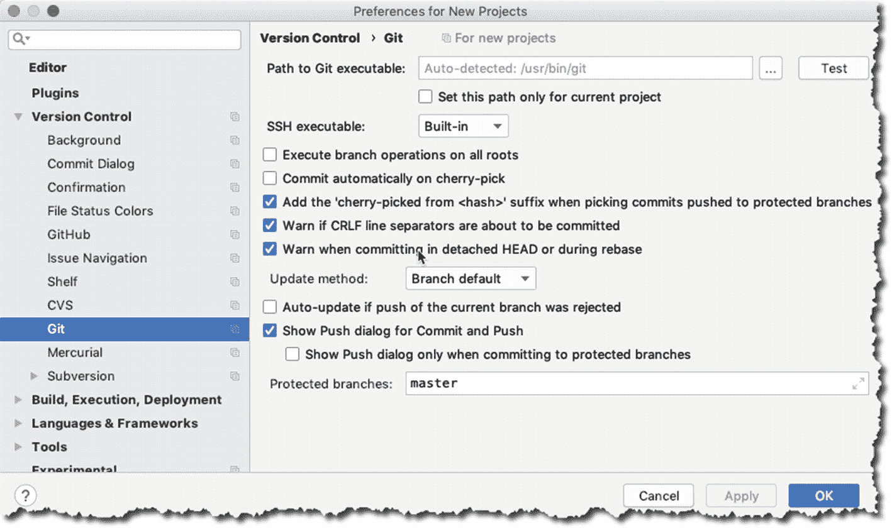

图 9-1: `Preferences` ➤ `Version Control` ➤ `Git`

注意 `Path to Git executable`（Git 可执行文件路径）字段。如图 9-1 所示，我的这个字段已被填充并自动检测到；这通常是正确的，你无需再做其他操作。如果 Android Studio 没有自动检测到 Git 可执行文件的位置，或者你不想使用自动检测到的版本，你随时可以更改它。要更改 Git 可执行文件，请点击省略号按钮（即 `Test` 按钮左侧带有三个点的按钮，如图 9-1 所示）。

找到你希望 Android Studio 使用的 Git 可执行文件。之后，点击 `Test` 按钮。结果如图 9-2 所示。

### 提示

对于 Windows 用户。如果你使用了 `git-scm` 的安装程序并使用默认选项安装，那么 Git 可执行文件将位于 `C:\Program Files\(x86)\Git\bin\` 文件夹中。

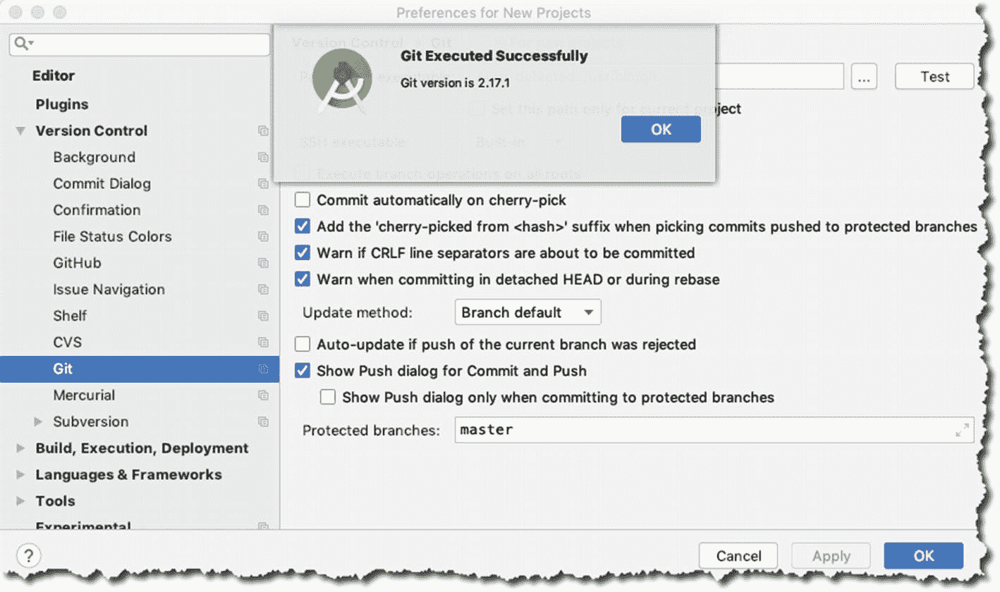

图 9-2: Git 执行成功

现在你已经准备好使用带有 Git 版本控制的 Android Studio 了。你可以开始与 Git 仓库进行集成。

## 将 Android Studio 与 GitHub 结合使用

再次前往 `Preferences/Settings` 窗口，然后进入 `GitHub`，如图 9-3 所示。

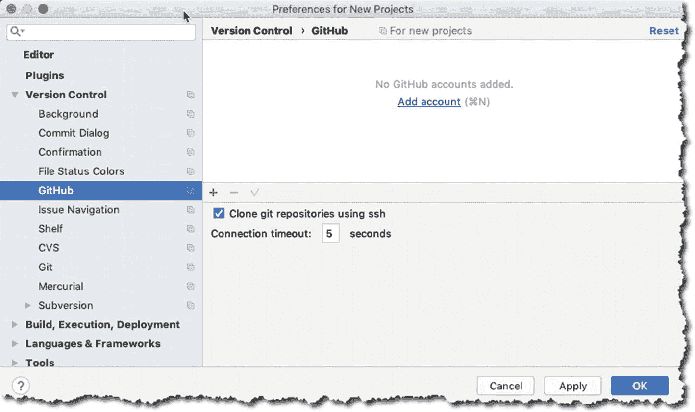

图 9-3: `Preferences`，`GitHub`

点击 `Add account`（添加账户）链接。你将看到如图 9-4 所示的 `Login`（登录）窗口。

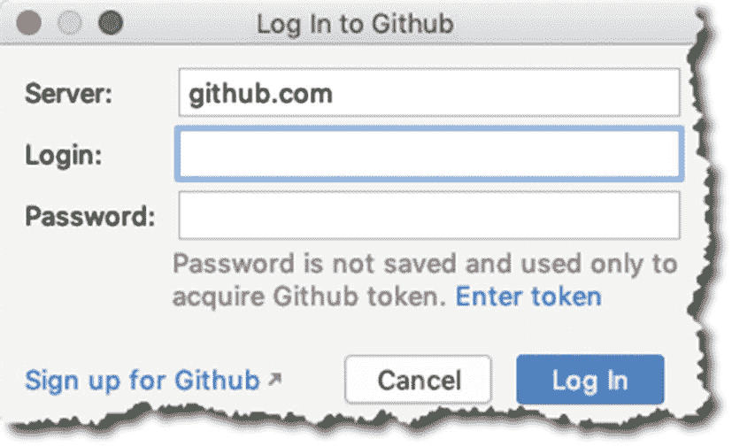

图 9-4: 登录 GitHub

如果你已有 GitHub 账户，可以在该窗口中提供你的 GitHub 登录凭据；如果你还没有账户，可以点击 `Sign up for GitHub`（注册 GitHub）链接（如图 9-4 所示），然后你将被引导至 GitHub 网页，在那里你可以注册一个新账户。

你可以使用免费的 GitHub 账户创建私有或公共仓库。公共仓库对所有人共享；你无法控制其可见性——所有人都能看到它。另一方面，私有仓库不会对所有人共享；你可以控制仓库的访问权限。

当你准备好 GitHub 凭据后，将它们填入如图 9-4 所示的登录名和密码字段，然后点击 `OK`。如果一切顺利，你应该会在 `Preferences/Settings` 窗口中看到你的 GitHub 头像，如图 9-5 所示。

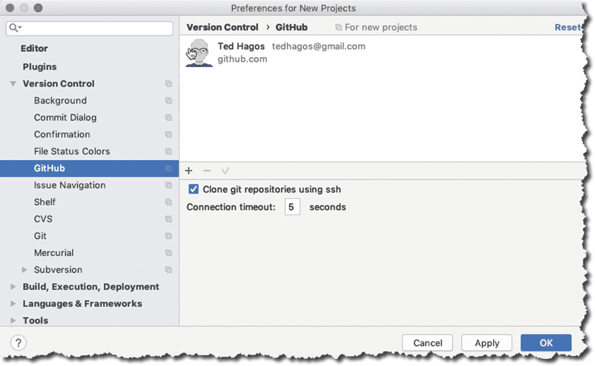

图 9-5: GitHub 设置

点击 `OK` 按钮，你现在应该可以拉取和分享 GitHub 上的项目了。

### 在 GitHub 上分享项目

如果这是你第一次安装 Git，你可能需要为 Git 配置全局变量 `user.email` 和 `user.name`。为此，请在命令行窗口中输入列表 9-1 中的代码。

```
Git config --global user.name "your name"
Git config --global user.email "your email"
```

列表 9-1: 设置 Git 全局变量

不要忘记分别将 “your name” 和 “your email” 替换为你的实际姓名和实际邮箱。


### 提示

对于 Windows 用户。Git 安装程序不会更新 `PATH` 变量，因此您可能会遇到“bad command or filename”错误。为了执行清单 9-1 中所示的命令，您必须首先导航到 Git 可执行文件的位置。因此，请将目录更改为 `C:\Program Files\(x86)\Git\bin\`，然后执行清单 9-1 中所示的命令。

打开您想要通过 GitHub 分享的任何项目；然后，从主菜单栏中，转到 `VCS` ➤ `Import into Version Control` ➤ `Share Project on GitHub`，如图 9-6 所示。

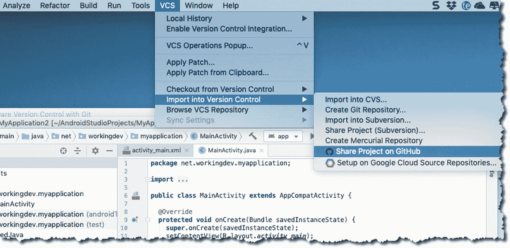

图 9-6. 导入到版本控制

提供必要的信息，如图 9-7 所示。以下是各字段含义的简要说明：

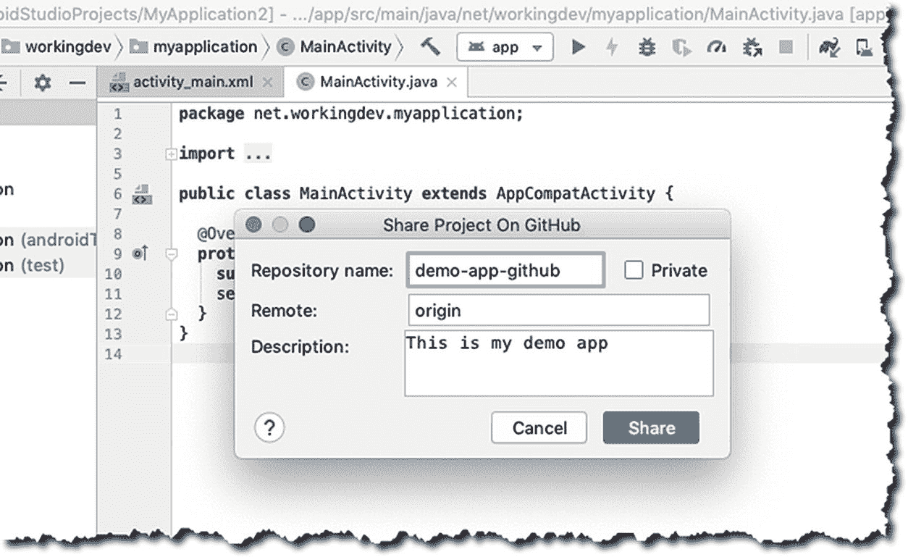

图 9-7. 在 GitHub 上分享项目

- **Repository name**（仓库名称）：您想要创建的公共仓库的名称。当您在 GitHub 上分享一个项目时，它被称为一个仓库（或简称 repo），它只是一个存储和管理数据的地方。在此例中，您正在为这一个项目创建一个仓库。因此，最好只将项目相关的工件存储在其中。
- **Private**（私有）：如果您像我一样让此复选框保持未选中状态，则意味着该仓库将是公共的。您需要决定仓库的可见性。请记住，如果它是公共的，所有人都能看到；如果是私有的，则由您控制谁能看到它。
- **Remote**（远程）：保留默认设置。它显示为“remote”，因为文件将存储在远程服务器上（在 GitHub 的服务器上），与“local”相对，后者意味着文件将存储在您的计算机上。
- **Description**（描述）：最好在此提供一些描述项目的文字。

当您单击 `Share` 按钮时，Android Studio 将提示您选择要分享的文件。在版本控制的术语中，我们不说“分享”，而说“提交”。参见图 9-8。

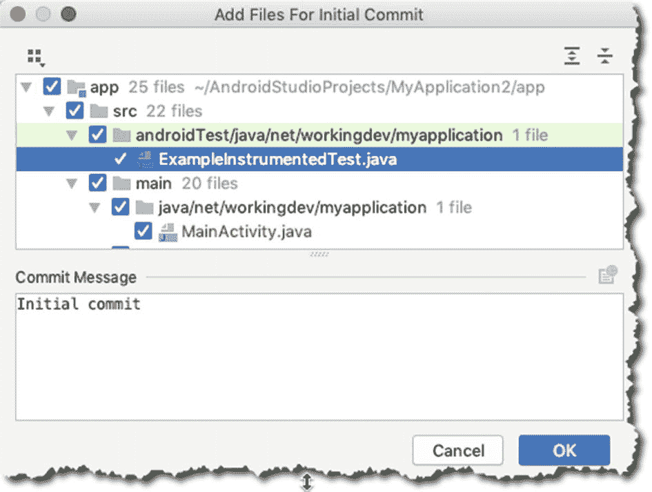

图 9-8. 为初始提交添加文件

默认情况下，对话框中显示的所有内容都被选中，这意味着项目文件夹中的所有内容都将被提交，但并非完全如此。尝试向下滚动，以便您能看到所有带有勾选标记的文件。您可能会注意到一个名为 `.gitignore` 的文件，如图 9-9 所示。

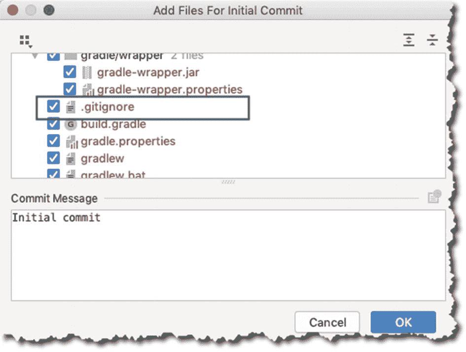

图 9-9. 添加 `.gitignore`

`.gitignore` 是一个特殊文件，其中包含不会被包含在仓库中的文件列表——这些文件将被忽略。

如果项目工具窗口的视图设置为 Android，您将无法看到 `.gitignore` 文件，但如果您将项目工具窗口的视图更改为 Project，如图 9-10 所示，您应该可以看到 `.gitignore` 文件。

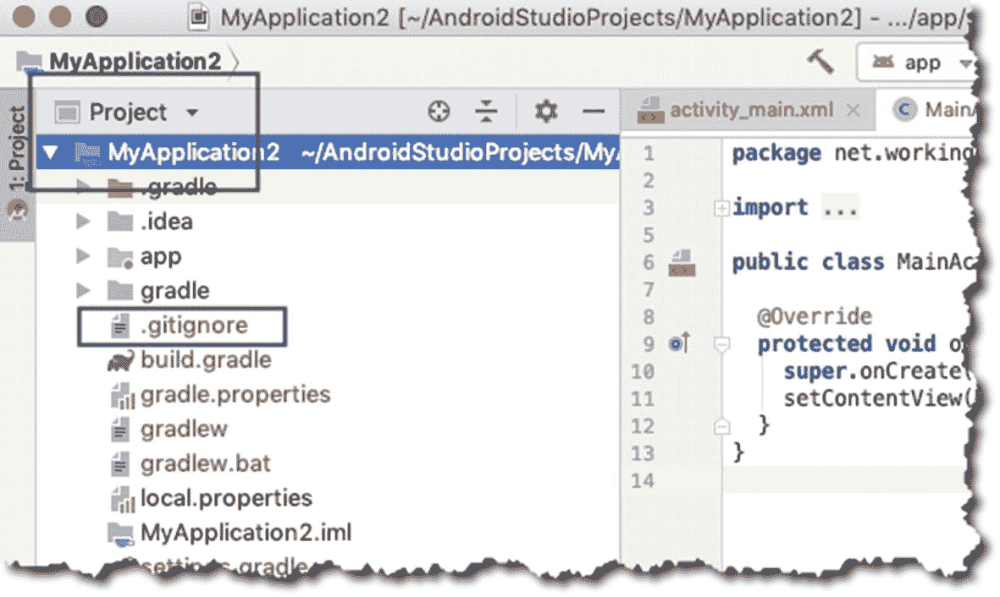

图 9-10. 项目工具窗口设置为 Project 视图

清单 9-2 显示了 `.gitignore` 的内容。

```
*.iml
.gradle
/local.properties
/.idea/caches
/.idea/libraries
/.idea/modules.xml
/.idea/workspace.xml
/.idea/navEditor.xml
/.idea/assetWizardSettings.xml
.DS_Store
/build
/captures
.externalNativeBuild
清单 9-2. .gitignore
```

大多数情况下，您希望保留 `.gitignore` 中的所有条目。当然，您可以向列表中添加内容，但您不应从中移除任何内容，如清单 9-2 所示。默认情况下，`.gitignore` 中的文件列表指的是您计算机独有的内容；例如，`/local.properties` 列出了您计算机上 JDK 的位置。它也可能包含特定于您作为用户的数据，例如 Firebase 密钥；显然，您不希望将这些信息提交到源代码控制中。另一个例子是 `.DS_Store` 文件，只有您在使用 Mac 时才会拥有它；每次您创建目录时，macOS 都会创建此文件。此文件对您的项目不重要。

回到提交对话框窗口，当您单击 `OK` 时，提交窗口中所有（已勾选的）文件都会被*提交*，然后*推送*到远程仓库。

## 从 GitHub 打开项目

您可以通过从远程仓库（如 GitHub）获取项目来恢复项目；在 Git 术语中，这称为“克隆”一个仓库。您执行此操作的基本场景是，当您的某个队友在 GitHub 上分享了项目仓库，而您也希望在其上工作时。第一步是从远程仓库获取项目。您可以通过两种方式之一完成此操作。

当您在 Android Studio 中已经打开了一个项目时，您可以转到主菜单栏并选择 `File` ➤ `New` ➤ `Project from Version Control` ➤ `Git`。

您也可以从 Android Studio 欢迎屏幕执行此操作，如图 9-11 所示。

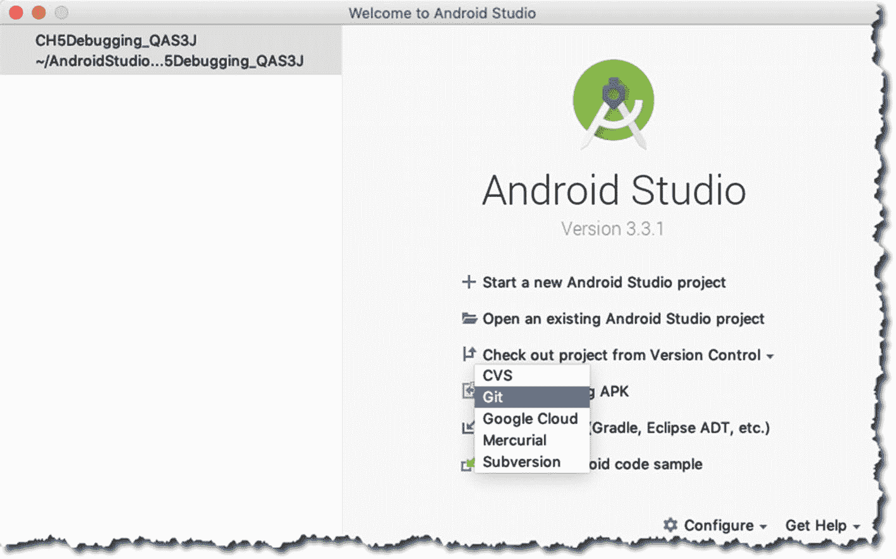

图 9-11. 欢迎屏幕，Git

两种方式都可以。下一个屏幕是 Clone Repository 窗口，如图 9-12 所示。

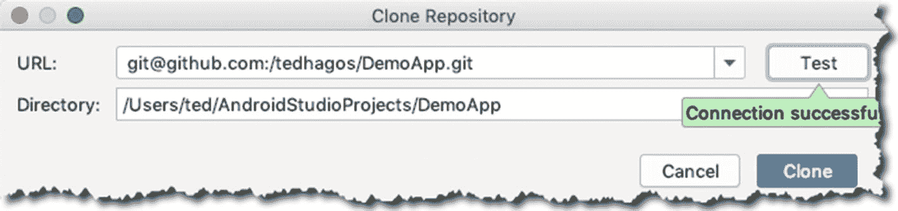

图 9-12. 克隆仓库

各字段描述如下：

- **URL**（网址）：这是仓库的远程 URL。我使用的是 URL `git@github.com:/etc`，因为我通过 SSH 获取项目。我可以这样做，因为我已经在 GitHub 中设置了 SSH 密钥。如果您尚未设置 SSH 密钥，则可能需要使用 HTTPS URL。您可以在其 GitHub 页面上找到该仓库的 HTTPS URL，如图 9-13 所示。单击 `Use HTTPS` 选项以获取 HTTPS URL。
- **Directory**（目录）：这是您硬盘上要存储项目的位置。

### 注意

GitHub 允许在与仓库交互时使用 SSH 和 HTTPS。GitHub 发布了一些关于何时使用 SSH 或 HTTPS 的指南，请访问 [`bit.ly/sshvshttps`](https://bit.ly/sshvshttps)。如果您想了解更多关于 Git 协议的信息，可以从 [`bit.ly/gitprotocols`](https://bit.ly/gitprotocols) 获取更多信息。

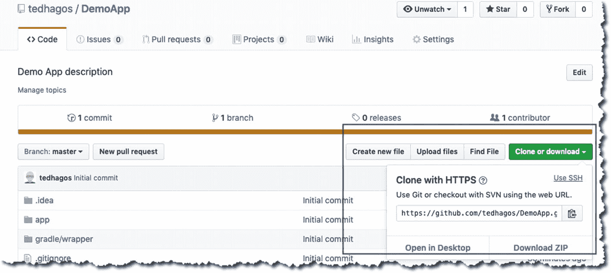

图 9-13. 仓库的 GitHub 页面

要完成克隆过程，请单击 `Clone` 按钮，如图 9-12 所示。现在，您可以像打开 Android Studio 中的任何其他项目一样打开该项目。


## 更新 Git 项目

当项目处于源代码管理之下时，Android Studio 会在你每次创建新文件（无论是 Java 类、XML 文件、图片或其他文件）时给出额外提示。例如，如果你向项目中添加一个新的 Java 类（在 Git 源代码管理下），你会看到一个类似图 9-14 所示的对话框。

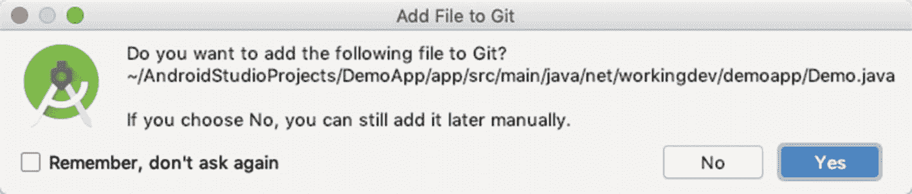

图 9-14. 将文件添加到 Git

如果你希望将该文件添加到 Git，当然要按下 `Yes`。如果不小心按了 `No`，你仍然可以通过两种方式添加新文件：

1.  在项目工具窗口中选择要添加到 Git 的文件，然后从主菜单栏中选择 `VCS` ➤ `Git` ➤ `Add`。
2.  也可以使用右键菜单，右键点击文件，然后选择 `Git` ➤ `Add`。

添加文件并不会自动更新远程仓库。要实现这一点，你需要做两件事：*提交*你所做的更改，然后进行*推送*。为此，在项目工具窗口中选择整个项目，如图 9-15 所示，然后从主菜单栏中选择 `VCS` ➤ `Git` ➤ `Commit Directory`。

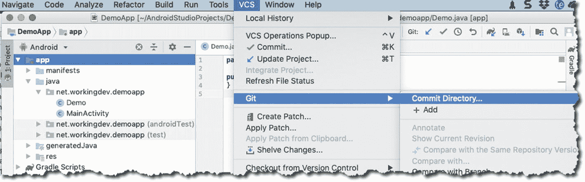

图 9-15. `Git` ➤ `Commit directory`

接下来，你会看到“提交更改”窗口，如图 9-16 所示。

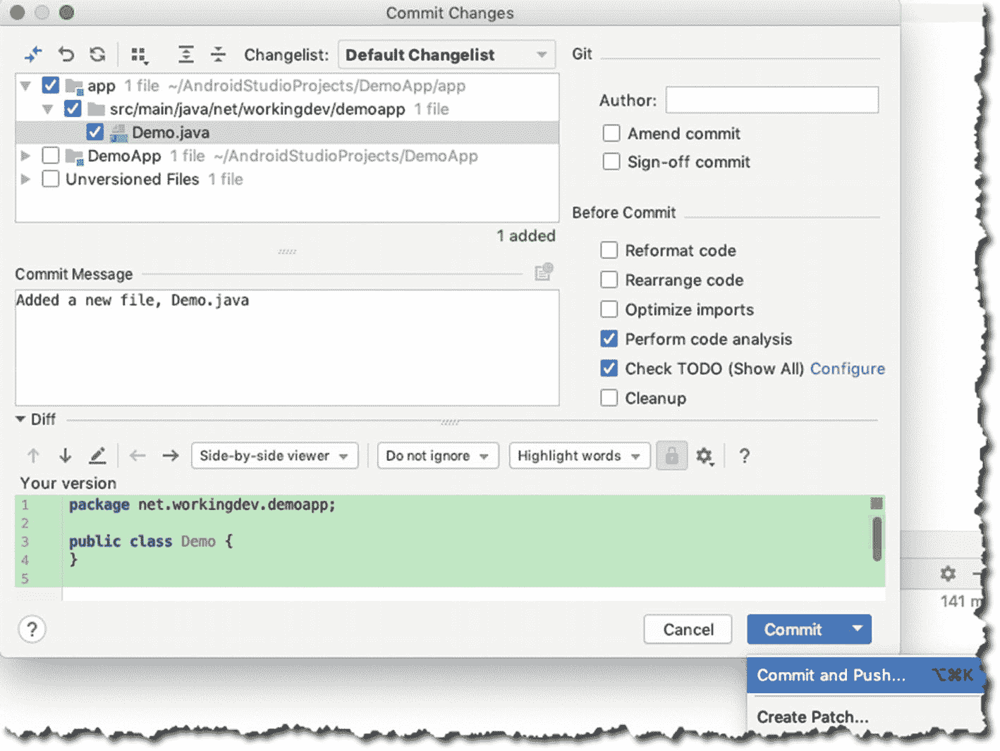

图 9-16. 提交并推送更改

点击 `Commit` 按钮上的下拉箭头，选择 `Commit and Push` 选项。现在，你的本地项目就与远程仓库完全同步了。

## 使用其他 Git 仓库

GitHub 是开发者中非常流行的仓库平台，因此它与 Android Studio 集成得很好也就不足为奇了。但如果你的队友或公司不使用 GitHub 呢？如果他们使用的是 BitBucket 或其他 Git 仓库呢？别担心，你同样可以处理。在本节中，你将使用 BitBucket 仓库。

与 GitHub 一样，使用 BitBucket 也需要一个账户。如果你还没有账户，请前往 [`https://bitbucket.org`](https://bitbucket.org) 注册，然后登录。之后，创建一个新的仓库，如图 9-17 所示。

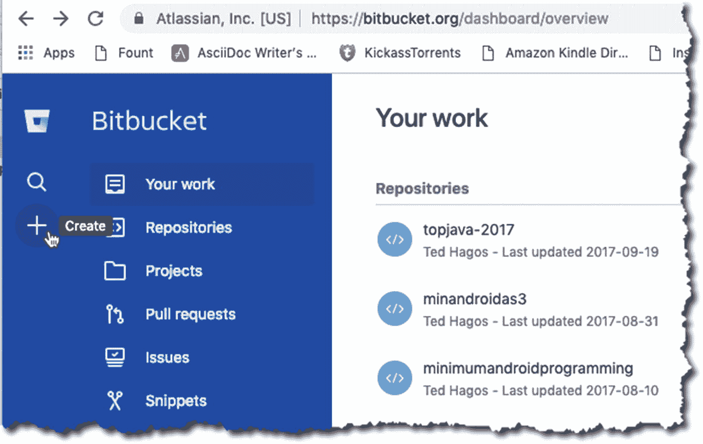

图 9-17. 创建仓库

点击大加号并选择创建新仓库后，系统会要求你填写一些详细信息，如图 9-18 所示。别忘了点击 `Advanced Settings` 选项，以便看到所有字段。

请注意以下几点：

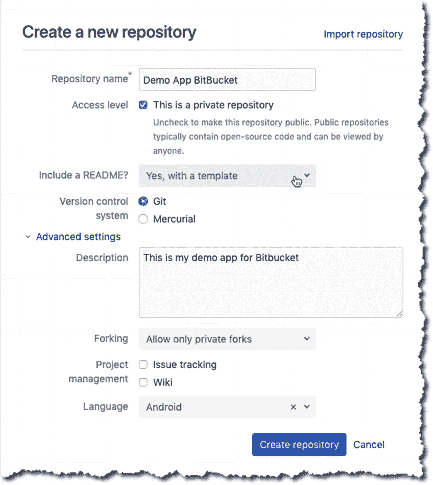

图 9-18. 仓库详细信息

-   **Repository name**：你的仓库在 BitBucket 上的名称。它不必与你本地计算机上存储的项目名称相同，但保持一致是个好主意。
-   **Access level**：与 GitHub 不同，即使你不是付费会员，也可以在 BitBucket 中创建私有仓库。
-   **Include a README**：在项目中包含 `README` 文件是一个好习惯，但这是可选的。
-   **Version control**：选择 `Git`。
-   **Description**：用一些词语最好地描述你的项目内容。
-   **Language**：你正在开发一个 Android 项目，所以填写 `Android`。

点击 `Create repository` 按钮后，你会看到仓库页面详情，如图 9-19 所示。点击 `Clone` 按钮。

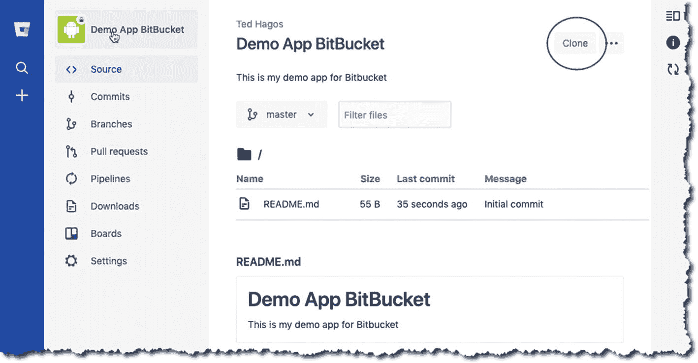

图 9-19. 新建的 BitBucket 仓库

在 `Clone this repository` 页面中，你可能会看到 `SSH` 而不是 `HTTPS`。点击下拉按钮切换到 `HTTPS`，如图 9-20 所示。


### 注意

在将 SSH 密钥提供给 BitBucket 后，你可以使用 SSH 协议作为克隆 BitBucket 中仓库的一种方式。如果你尚未提供，只需使用 HTTPS 来克隆仓库即可。

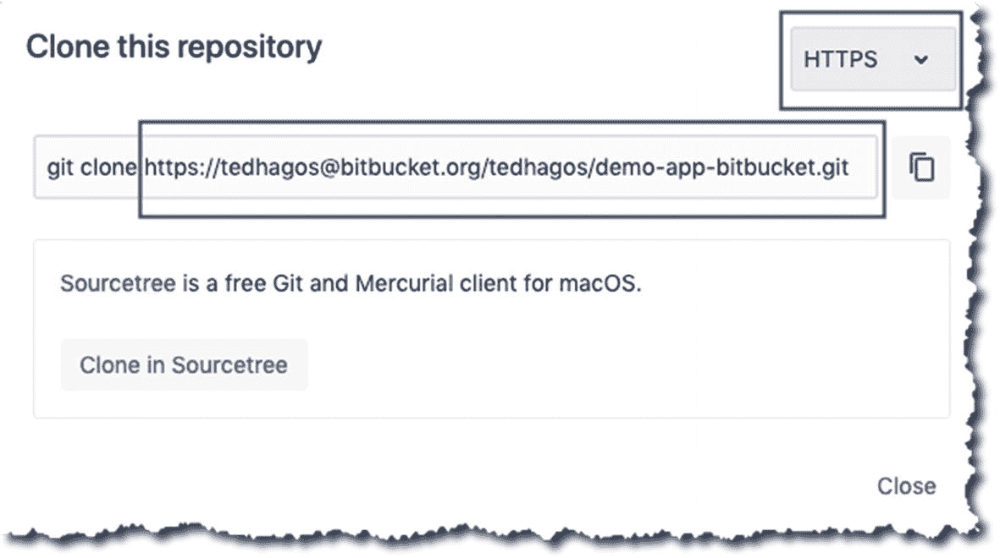

**图 9-20.** 仓库的远程地址

你的仓库的远程 URL 是以 `https://` 开头并以 `.git` 结尾的那个。如图 9-20 所述，你不需要 `git clone` 这部分，因为这是一个旨在从命令行输入的命令。你不会为 Git 使用命令行，而是会使用 Android Studio 的功能。

现在远程仓库已准备就绪，你可以打开一个想要在 BitBucket 上分享的现有项目，或者创建一个新项目，这由你决定。

一旦你选择好要在 BitBucket 中分享的项目，请执行以下操作：

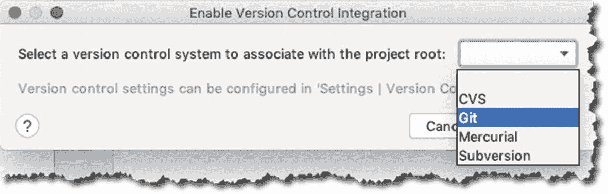

**图 9-21.** 启用版本控制集成

1. 如果项目尚未打开，请将其打开。
2. 如果项目尚未受任何源代码控制，请为其启用版本控制。为此，请前往主菜单栏并选择 VCS ➤ Enable Version Control Integration。
3. 选择 Git 作为版本控制系统，如图 9-21 所示。

接下来要做的操作是，将此项目与远程仓库关联起来：前往主菜单栏并选择 VCS ➤ Git ➤ Remotes。你应该会看到 Git Remotes 屏幕，如图 9-22 所示。

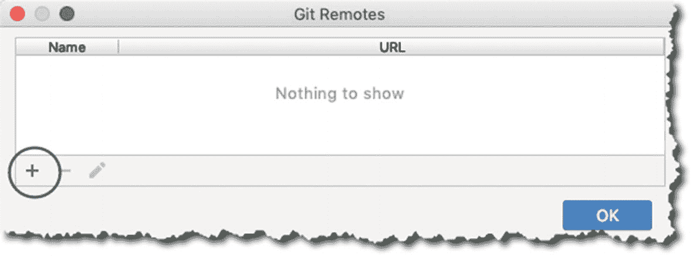

**图 9-22.** Git 远程仓库

点击图 9-22 中所示的加号。之后，将出现“定义远程”屏幕，如图 9-23 所示。

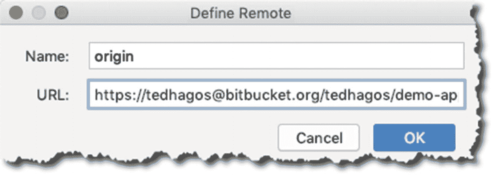

**图 9-23.** 定义远程仓库

复制仓库的远程 URL（请参考图 9-20；我在该图中高亮了远程 URL 仓库）。将其粘贴到“定义远程”屏幕的 URL 字段中，如图 9-23 所示。你需要在下一个屏幕中提供你的 BitBucket 用户名和密码，如图 9-24 所示。

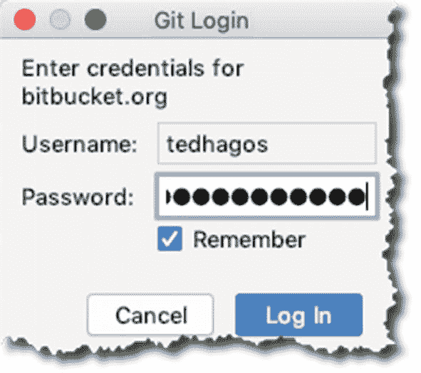

**图 9-24.** Git 登录

接下来要做的操作是*拉取*远程仓库。这是一个谨慎的做法，尤其是在你在 BitBucket 中创建仓库时生成了 README 文件的情况下，因为这可以防止合并冲突。你可以通过主菜单栏进行拉取：前往 VCS ➤ Git ➤ Pull。你会看到“拉取更改”屏幕，如图 9-25 所示。点击刷新按钮（位于远程文本字段右侧）。

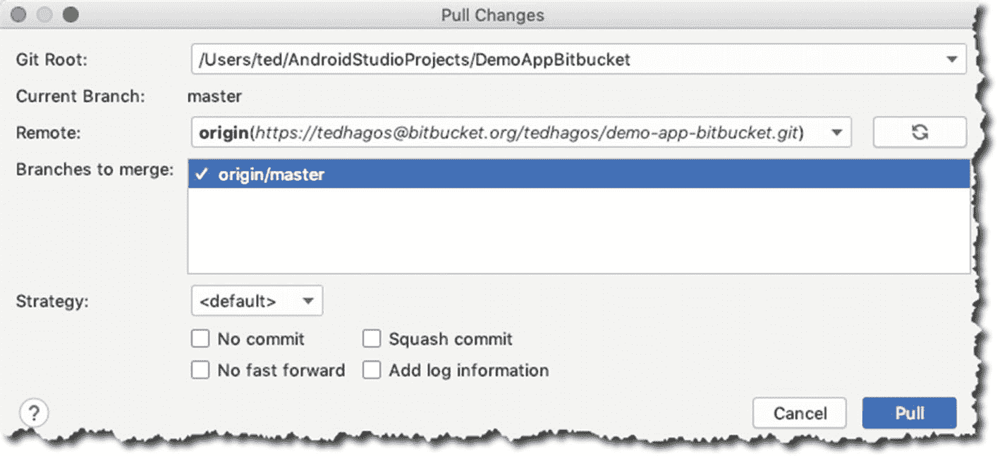

**图 9-25.** 拉取更改

在“要合并的分支”字段中，选择 origin/master 选项，然后点击“确定”。

尝试向你的新项目中添加一些文件。你会注意到，当你向项目中添加一个新文件（例如 `DemoApp.java`）时，Android Studio 会提示你是否要将新文件添加到 Git 中；参见图 9-26。

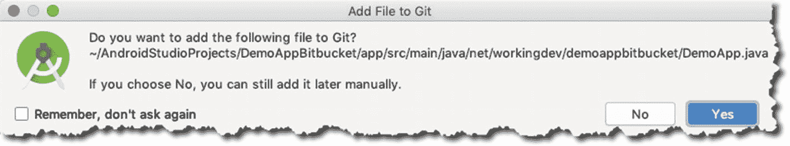

**图 9-26.** 向 Git 添加文件

你可以通过勾选**记住，不再询问**框来节省一些时间。下次你添加新文件时，Android Studio 会自动将其添加到 Git 中。

如果你对提示回答了**否**，你仍然可以通过新 Java 文件上的上下文菜单将其添加到 Git。从“项目”工具窗口中选择新的 Java 文件，右键单击，然后转到 Git ➤ Add。为确保所有项目文件都已添加到 Git，不要在“项目”工具窗口只选择新文件，而应选择整个项目。

下一步是将你的更改提交到 Git——请记住，所有这些更改仍在本地进行。要使更改反映到远程 BitBucket 仓库中，你必须推送更改。

要提交更改，请前往主菜单栏并选择 VCS ➤ Git ➤ Commit Directory。你会看到“提交更改”对话框，如图 9-27 所示。你在前一节中看过这个对话框；它与你在使用 GitHub 时看到的相同。

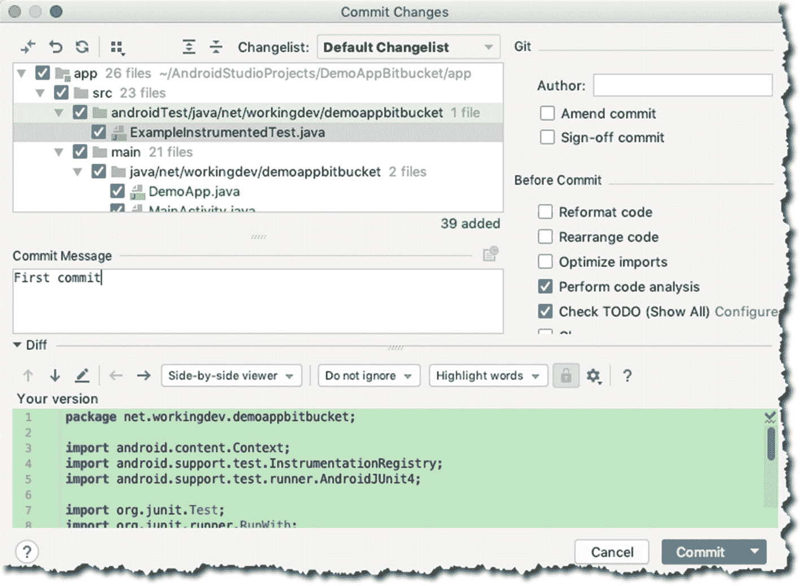

**图 9-27.** 提交更改

请记住，只有已勾选的项目才会被提交到 Git。因此，请注意更改列表。在“提交信息”框中写一些描述性内容，然后点击“提交”按钮。

当你对本地仓库做了重大更改，并且希望将这些更改反映回远程仓库时，可以执行*推送*操作。为此，请前往主菜单栏并选择 VCS ➤ Git ➤ Push。你会看到“推送提交”屏幕，如图 9-28 所示。

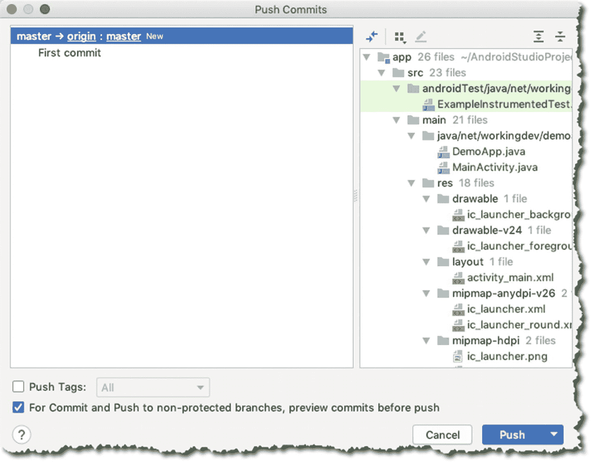

**图 9-28.** 推送提交

点击“推送”以完成操作。

这样就完成了。现在你可以克隆一个仓库并将其恢复到本地目录。你还可以向远程仓库添加、提交和推送更改；你现在也知道了如何使本地仓库与远程仓库保持同步。

## 章节总结

- Git 软件未包含在 Android Studio 中，因此你必须单独获取它。你可以从 [`https://git-scm.com/download`](https://git-scm.com/download) 获取预编译的二进制文件和平台说明。
- GitHub 与 Android Studio 高度集成。要处理远程 GitHub 仓库，你只需要执行几个步骤。
- 你可以通过启用项目中的版本控制集成，然后定义远程仓库 URL，来使用其他 Git 平台，例如 BitBucket。

