# 10. 导航

*本章内容包括：*

- 回顾 Android 中的导航
- 导航组件


## 导航架构组件之前

在 Android 早期，如果你的应用有一定复杂度，几乎必然需要将应用划分为多个 Activity。这就意味着你需要掌握从一个 Activity 导航到另一个 Activity 并返回的技能。因此，在那些日子里，你可能会编写类似代码清单 10-1 所示的代码。

```
class FirstActivity extends AppCompatActivity
implements View.OnClickListener {
public void onClick(View v) {
Intent intent = new Intent(this, SecondActivity.class);
startActivity(intent);
}
}
// SecondActivity.java
class SecondActivity extends AppCompatActivity { }
```

代码清单 10-1. 如何启动一个 Activity

如果需要将数据从一个 Activity 传递到另一个 Activity，你可能需要编写类似代码清单 10-2 所示的代码片段。

```
Intent intent = new Intent(this, SecondActivity.class);
Intent.putExtra("key", value);
startActivity(intent);
```

代码清单 10-2. 如何向另一个 Activity 传递数据

这种界面管理方式具有以下优点：

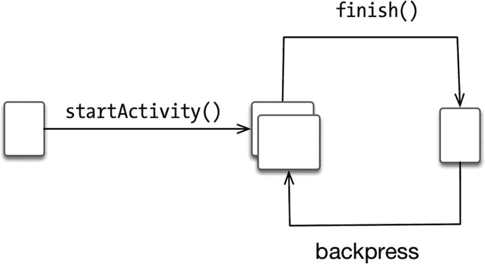

图 10-1. 简单的 Activity 工作流

*   实现简单。只需从任意一个 Activity 调用 `startActivity()` 方法。
*   可以通过编程方式调用 `finish()` 方法关闭当前正在运行的 Activity。用户也可以通过按返回键关闭 Activity。
*   返回栈完全由 Android 运行时管理；见图 10-1。

但这并非全是优点；Activity 导航也伴随着一些弊端。其缺点在于：

*   你无法清楚了解返回栈中有哪些 Activity，因为你并不管理它。这里恰好展示了一个特性同时兼具优点和缺点的例子。
*   每个屏幕都需要一个新的 Activity，这可能会导致资源消耗较大。
*   每个 Activity 都需要在 Android 清单文件中声明，不过当你使用向导创建 Activity 时，Android Studio 会自动完成此操作，因此这算不上大问题。
*   你将难以使用更现代的导航模式，例如底部导航栏。

由于这些限制，出现了另一种屏幕导航方式。2011 年，当 Google 发布 Android 4.0 时，我们开始使用*碎片（Fragment）*。如果你已经忘记了 Fragment，可以这样理解：Activity 基本上是一个 UI 的组合单元，而 Fragment 则是一个更小的组合单元。

Fragment 与 Activity 类似，由两部分组成：一个 Java 或 Kotlin 程序以及一个布局文件。其基本理念相同：在 XML 文件中定义 UI，然后在运行时加载该 XML 文件，使得 XML 文件中的所有 UI 成为实际的 Java 对象。

其思路是创建多个 Fragment，并将它们包含在单个 Activity 中。通常，根据用户操作、设备方向或设备外形因素来显示或隐藏 Fragment；这通常通过 `FragmentManager` 和 `FragmentTransaction` 对象来完成。如果你之前使用过 Fragment，那么代码清单 10-3 中显示的代码片段可能会让你感到熟悉。

```
FragmentManager fm = getFragmentManager();
FragmentTransaction ft = fm.beginTransaction();
Fragment fragment = new FirstFragment();
ft.add(R.id.fragment_container, fragment);
ft.commit();
```

代码清单 10-3. Fragment 代码片段

与使用 Activity 导航不同，使用 Fragment 时，你能够确切知道导航栈中的内容；但是，正如你在代码清单 10-1 中所见，由于必须手动管理导航栈，这种方式可能会变得繁琐。

到目前为止，你只有两种导航选择：要么使用基于 Activity 的导航，这种方式易于使用但会带来性能开销，并且你无法控制导航栈；要么使用 Fragment，后者可以完全控制导航栈，但其 API 较为繁琐且容易出错。

时间快进到 2017 年，Google 推出了导航组件。现在，你可以使用 Fragment 而无需承担复杂 API 带来的负担。使用导航组件，代码清单 10-3 中的所有代码现在都可以替换为代码清单 10-4 所示的一行代码。

```
findNavController().navigate(destination);
// FragmentManager fm = getFragmentManager();
// FragmentTransaction ft = fm.beginTransaction();
// Fragment fragment = new FirstFragment();
// ft.add(R.id.fragment_container, fragment);
// ft.commit();
```

代码清单 10-4. 导航组件代码片段


## 导航组件

没错，上一节那行代码引用可能让你既兴奋又松了一口气。但这里的关键并非节省敲击次数，而是你现在能够同时享受基于 Activity 和基于 Fragment 的导航的优势。现在，Fragment 导航也拥有了简洁的 API。

但首先，你需要对导航组件有所了解。它们是架构组件（Architecture Components）的一小部分，而架构组件又隶属于一个名为 Android Jetpack 的更大体系。（我在此不会详细讲解 Jetpack 或架构组件，因为它们涉及范围很广；但简要的背景介绍总归是有益的。）

在 2017 年 Google I/O 大会上，谷歌推出了 Android 架构组件。这些库是一个名为 Android Jetpack 的更大集合的一部分。与架构组件一同推出的还有 Foundation、Behavior 和 UI 等其他类别。

Jetpack 是一个 Android 软件组件集合，旨在让我们的开发工作更轻松。它帮助我们遵循最佳实践，并避免编写过多的样板代码。你可以在 `androidx.*` 包库中找到 Jetpack 代码。

以下是 Jetpack 组件的简要说明。

**Foundation**

- **AppCompat**：让你编写的代码能在较旧版本的 Android 上优雅地降级运行。
- **Android KTX**：如果你使用 Kotlin，它能让你编写更简洁、更地道的 Kotlin 代码。
- **Multidex**：为包含多个 DEX 文件的应用提供支持。
- **Test**：用于单元测试和运行时 UI 测试的测试框架。

**Behavior**

- **Download manager**：让你编写用于调度和管理大型下载任务的程序。
- **Media and Playback**：用于媒体播放和路由的向后兼容 API。
- **Notifications**：提供向后兼容的通知 API，并支持 Wear 和 Auto。
- **Permissions**：用于检查和请求应用权限的兼容性 API。
- **Preferences**：创建交互式设置界面。
- **Sharing**：提供适用于应用操作栏的分享操作。
- **Slices**：创建灵活的 UI 元素，可在应用外部显示应用数据。

**UI**

- **Animations and Transitions**：实现小部件的移动和屏幕间的过渡。
- **Auto**：如果你正在开发将在车辆信息娱乐系统中运行的应用，你会需要它。这些组件帮助你为 Android Auto 构建应用。
- **Emoji**：在较旧的平台上启用更新版本的 Emoji 字体。
- **Fragment**：所有 Fragment 代码都已迁移至此。
- **Layout**：使用不同算法布局小部件。
- **Palette**：从调色板中提取有用信息。
- **TV**：帮助开发 Android TV 应用的组件。
- **Wear OS by Google**：如果你想处理 Android 可穿戴设备（如手表），你会需要它。

**Architecture**

- **Data binding**：声明式地将可观察数据绑定到 UI 元素。
- **Lifecycles**：管理 Activity 和 Fragment 的生命周期。
- **LiveData**：当底层数据库发生变化时通知视图。
- **Paging**：按需从数据源逐步加载信息。可以想象当用户滚动列表时——它能帮助你处理数据加载。它与 Recycler 视图配合使用。
- **ViewModel**：以生命周期感知的方式管理与 UI 相关的数据。
- **WorkManager**：管理后台任务。
- **Navigation**：实现应用内的导航。在屏幕间传递数据。提供来自应用外部的深层链接。
- **Room**：可以将其视为 SQLite 数据库的 ORM。

Jetpack 中有很多内容值得探索，请务必了解一下。

回到我们的主题，导航组件简化了应用内各目的地（destinations）之间的导航实现。一个*目的地*是应用中的任何位置。它可以是一个 Activity、Activity 内的一个 Fragment 或一个自定义视图；目的地通过导航图（navigation graph）进行管理。

导航图将所有目的地分组，并定义目的地之间的不同连接；这些连接被称为*动作（actions）*。该图实际上是一个 XML 资源文件，代表你应用的所有导航路径。你的应用中可以有多个导航图。

### 使用 Jetpack 导航

为了更好地理解导航组件，最好动手做一个小的项目。因此，如图 10-2 所示，在 Android Studio 中创建一个新的空项目。别忘了勾选 `Use AndroidX artifacts`选项。请记住，所有支持库现在都在 `AndroidX` 包中；你需要它们，因为你将使用 Fragment。

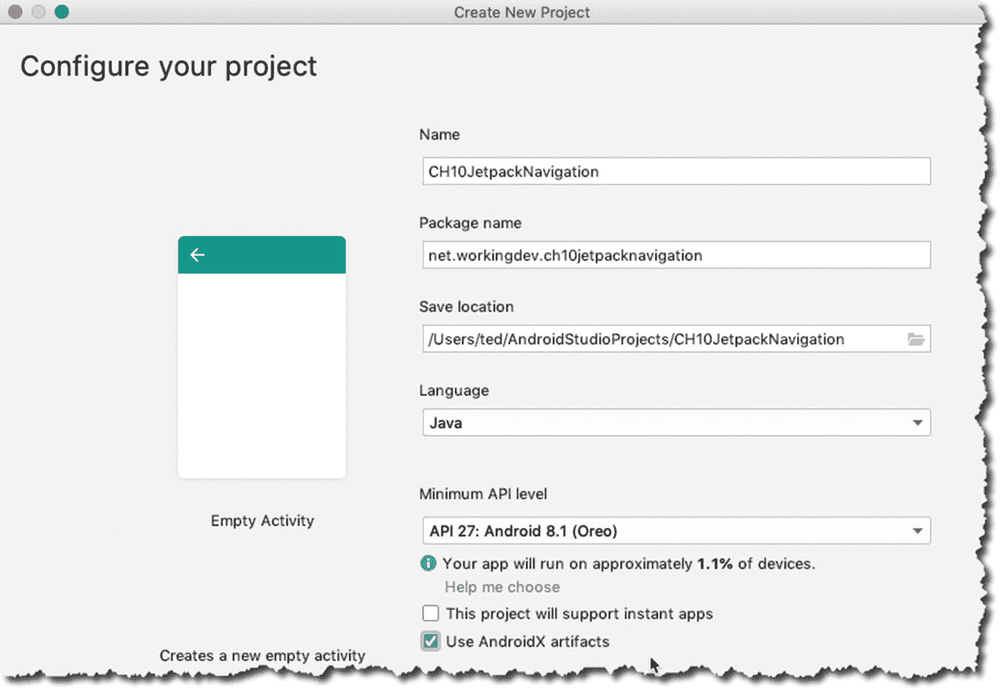

图 10-2. 使用 AndroidX 工件创建的新空项目

顺便提一下，如果你还没有更新或升级到最新版本的 Android Studio，现在是个好时机。在撰写本文时，如果你想使用导航，必须使用 Android Studio v3.3 或更高版本；此外，你还需要将导航组件的依赖项添加到你的项目中。因此，创建项目后，找到模块级别的 `build.gradle` 文件并添加条目，如代码清单 10-5 所示。

```
dependencies {
def nav_version = "2.1.0-alpha02"
...
implementation "androidx.navigation:navigation-fragment:$nav_version"
implementation "androidx.navigation:navigation-ui:$nav_version"
}
代码清单 10-5. 将导航添加到 build.gradle
```

添加依赖项后，你需要同步 Gradle 文件。


### 注意

请记住，你的项目中有两个 Gradle 文件。你需要编辑模块级别的 Gradle 文件，如图 10-3 所示。

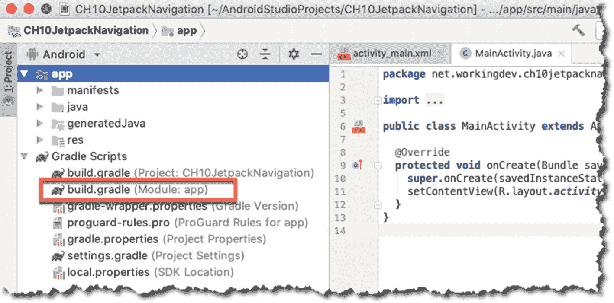

图 10-3. `build.gradle`（模块）

同步完成后，向项目添加一个导航图。你可以通过创建新的资源文件来创建导航图：右键单击项目的 `res` 文件夹，然后选择“新建 ➤ 资源文件”，如图 10-4 所示。

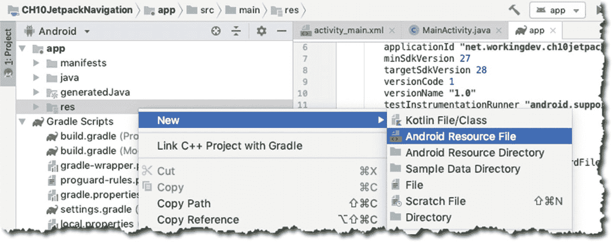

图 10-4. 添加新的资源文件

在“新建资源文件”对话框中，将资源类型更改为“导航（Navigation）”并提供文件名：

*   **文件名**：`nav_graph`
*   **资源类型**：导航（Navigation）（必须点击下拉箭头进行选择）

图 10-5 显示了“新建资源文件”对话框。

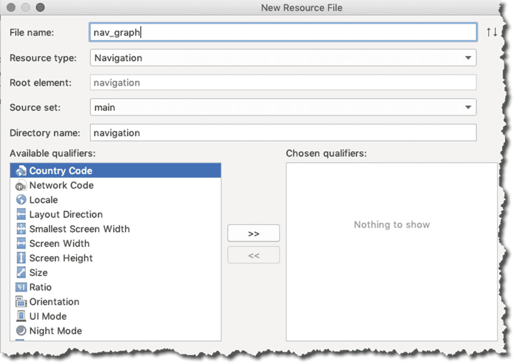

图 10-5. 新的资源文件信息

点击“确定”来创建新的资源文件。

创建资源后，你会看到项目 `res` 文件夹下出现了一个新文件夹（`navigation`）和一个新文件（`nav_graph.xml`），如图 10-6 所示。Android Studio 将在编辑器中打开新创建的导航图。图 10-6 显示了新创建的导航图，它当然是空的。

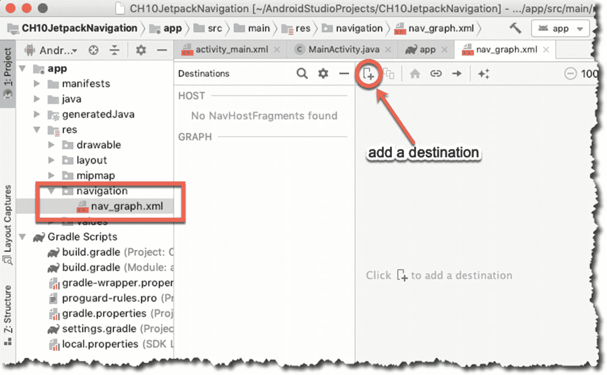

图 10-6. 导航图

当你使用导航组件时，导航是作为目的地（Destinations）之间的交互发生的。目的地是你的用户可以导航到的位置，并且目的地通过动作（Actions）连接。目前，你还没有任何目的地，所以让我们添加一个。点击导航编辑器顶部面板上的加号，如图 10-7 所示，然后选择“创建新目的地（Create a New Destination）”选项。

这将显示一个用于创建新 Fragment 的对话框。我更改了新 Fragment 的名称，并保留了其余字段不变，如图 10-7 所示。这个新 Fragment 的详细信息如下：

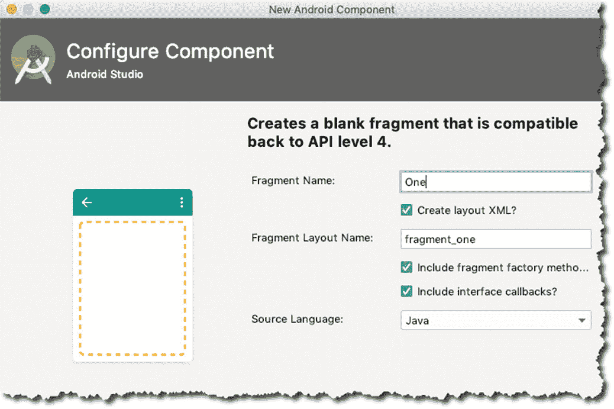

图 10-7. 新的 Android 组件

*   **Fragment 名称**：`One`
*   **Fragment 布局名称**：`fragment_one`
*   保持源语言为 **Java**

点击“完成”开始创建新的 Fragment；这个 Fragment 将成为你应用中的一个目的地。创建另一个目的地，并将其 Fragment 名称设为 "Two"。导航编辑器应该如图 10-8 所示。

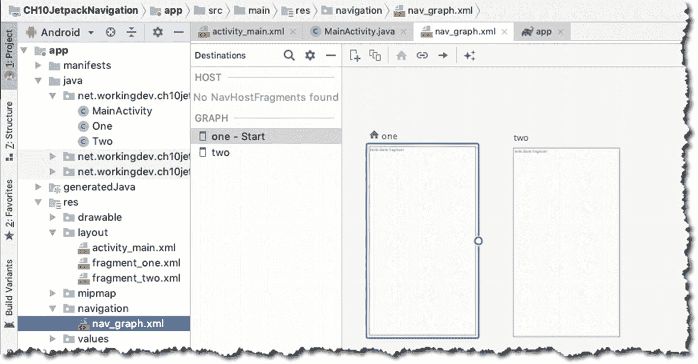

图 10-8. 导航编辑器

另外请注意，现在有两个新的 Java 类（`One.java` 和 `Two.java`）以及两个新的布局文件（`fragment_one.xml` 和 `fragment_two.xml`）。这些文件是在你创建目的地 One 和 Two 时生成的。注意在图 10-8 中，Fragment One 旁边有一个主页图标。这只是因为你首先创建了它。主页目的地或起始目的地是用户首先看到的屏幕。你可以随时通过右键单击任何目的地，然后点击“设为主页目的地（Set as start destination）”选项来更改起始目的地，但现在，保持 One 为起始目的地。

现在，你的导航图中还没有 `NavHost`；它需要一个。`NavHost` 扮演着你所有目的地的视口角色。它是一个空容器，当用户在应用中导航时，目的地会在其中进行切换。`NavHost` 需要位于一个 Activity 内。你将把 `NavHost` 放进你的 `MainActivity` 中。

打开 `MainActivity` 的布局文件（位于 `res/layout/activity_main.xml`），然后在文本模式下编辑。默认的 `activity_main` 包含一个单一的 `TextView` 对象；将其删除，并替换为清单 10-6 中的代码片段。

| ❶ | 它需要一个 ID，就像资源文件中的任何其他元素一样。我为此使用了 `nav_container`；你可以随意命名。 |
| ❷ | 这是 `NavHostFragment` 类的完全限定名。它属于导航组件，负责让你的 `MainActivity` 成为所有已定义目的地的视口。 |
| ❸ | `app:navGraph` 属性告诉运行时你想在 `MainActivity` 中托管哪个导航图。请记住，应用中可以有多个导航图；`nav_graph` 是你之前给导航图 XML 资源起的名字。 |
| ❹ | 当你将 `defaultNavHost` 设置为 *true* 时，这会确保 `NavHostFragment` 拦截系统返回按钮；这样，当用户点击返回按钮时，Android 将显示你应用中的上一个屏幕，而不是碰巧在返回栈中的外部应用屏幕。 |

```
清单 10-6.
在 activity_main.xml 中定义 NavHost
```

现在是将你的两个目的地连接起来的时候了。再次打开导航图；它位于 `res/navigation/nav_graph`。

你希望用户从目的地 One 导航到目的地 Two。因此，将鼠标悬停在目的地 One 上，直到其右侧出现一个小圆圈。点击并将此点拖拽到目的地 Two，以便将两个目的地连接起来，如图 10-9 所示。

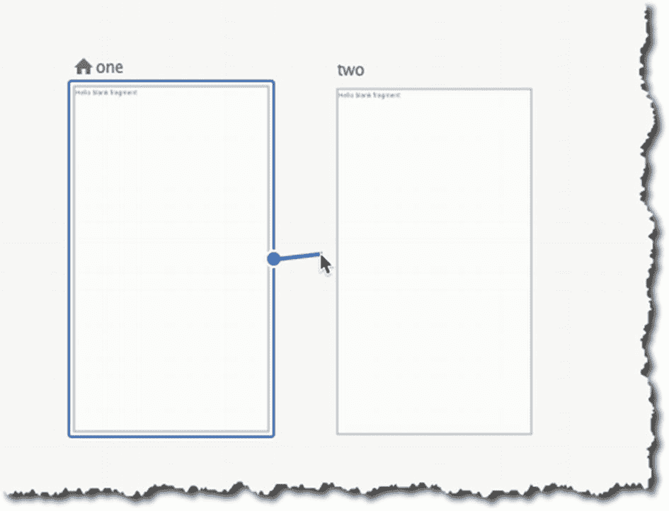

图 10-9. 连接 One 和 Two

现在，目的地 One 已连接到目的地 Two。如果你选择 One 和 Two 之间的连接，你会看到它有你可以设置的属性，如图 10-10 所示。你不需要处理这些属性；你只想连接这两个目的地。

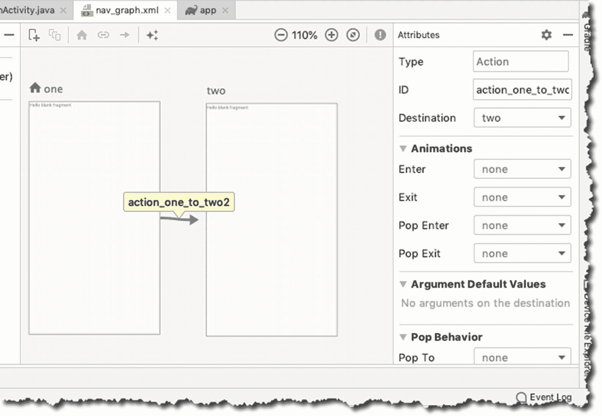

图 10-10. 导航图

为了测试这个小应用，你需要在起始目的地中有一个能触发动作的对象，比如一个按钮。按如下方式修改两个 Fragment 的布局：

**fragment_one**

*   将布局更改为 `ConstraintLayout` 或任何适合你的布局。
*   删除 `TextView`，替换为一个按钮并将其居中。

**fragment_two**

*   像 `fragment_one` 一样，将布局更改为 `ConstraintLayout`。
*   更改 `TextView` 的文本并将其居中。

图 10-11 显示了带有更改预览的导航图。

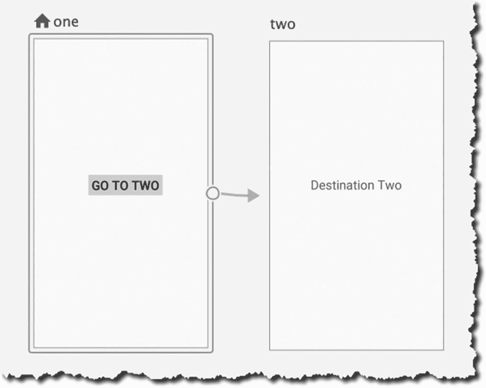

图 10-11. 修改后的 Fragment

接下来，为你的按钮添加一个点击处理器。你将添加代码，使得当按钮被点击时，`fragment_one` 能导航到 `fragment_two`。

导航到目的地是使用 `NavController` 完成的；它是一个对象，用于管理 `NavHost` 内的应用导航。每个 `NavHost` 都有其对应的 `NavController`。

`NavController` 允许你以两种方式导航到目的地：1) 使用 ID 导航到目的地，这也是你将在这里使用的；2) 使用 URI 导航，我把这个留给你自行探索。


为了给按钮添加点击处理程序，请打开`One.java`（其中包含您的`One`目的地的 Java 源文件），并确保其内容类似于清单 10-7 所示。

```
public class One extends Fragment {
public One() {
// Required empty public constructor
}
@Override
public View onCreateView(LayoutInflater inflater, ViewGroup container,
Bundle savedInstanceState) {
// Inflate the layout for this fragment
final View view = inflater.inflate(R.layout.fragment_one, container, false);
view.findViewById(R.id.button2).setOnClickListener(new View.OnClickListener() {
@Override
public void onClick(View v) {
Navigation.findNavController(view).navigate(R.id.action_one_to_two2);
}
});
return view;
}
}
Listing 10-7.
Class One
```

清单 10-7 中最关键的一行代码是`NavController`对象的`navigate()`方法。您只需将在导航图中创建的操作的 ID 作为参数传递给`navigate()`，即可实现导航。现在您可以启动模拟器并测试该应用。

本章仅触及了导航组件的皮毛。该领域还有许多值得探索的内容，请继续深入。

## 本章小结

*   您仍然可以在应用中使用基于 Activity 或基于 Fragment 的导航，但请记得它们各自的优缺点。
*   导航组件结合了基于 Activity 和基于 Fragment 导航的最佳特性；其 API 易于使用，并且您可以更好地控制返回栈。
*   导航组件引入了*目的地*的概念。目的地可以是 Fragment、Activity 或自定义视图；它们是用户导航到的目标。
*   目的地通过导航图进行分组；导航图是一个 XML 资源文件，其中包含目的地之间的所有*动作*。
*   目的地通过动作相互连接。
*   导航的基本思路是：
    1.  创建导航图。
    2.  创建目的地。
    3.  连接目的地；每个连接成为一个动作。
    4.  使用`NavController`对象以编程方式从一个目的地导航到另一个目的地。您可以使用 ID 或 URI 进行导航。

