# 11. Lifecycle、ViewModel、LiveData 和 Room

*本章涵盖内容：*

*   生命周期感知组件
*   ViewModel
*   LiveData
*   Room

您在上一章已初步了解了架构组件。本章将探讨架构组件中的其他一些库，特别是 Room。它是一个基于 SQLite 的持久化库。如果您之前使用过 ORM（对象关系映射器），可以将 Room 视为类似的东西。

在本章中，您还将探索一些与 Room 库紧密配合的架构组件库。您将了解到生命周期感知组件、LiveData 和 ViewModel；这些库与 Room 一起，是您构建流畅且稳定的数据库应用所需的部分。

## 生命周期感知组件

生命周期感知组件会响应另一组件生命周期状态的变化而执行相应操作。如果您熟悉*观察者-被观察者*设计模式，那么生命周期感知组件的工作方式与之类似。

您需要学习一些新术语：

*   **Lifecycle Owner**：一个具有生命周期的组件，例如 Activity 或 Fragment。它在其生命周期中可以进入多种状态，如`CREATED`、`RESUMED`、`PAUSED`、`DESTROYED`等。Lifecycle Observer 可以接入 Lifecycle Owner，并在其生命周期状态发生变化时（例如当 Activity 进入`CREATED`状态时）得到通知。例如，在它进入`onCreate()`后，我有时会将 Lifecycle Owner 称为可观察者。
*   **Lifecycle Observer**：一个监听 Lifecycle Owner 生命周期状态变化的对象。它是一个实现了`LifecycleObserver`接口的类。

借助生命周期感知组件，您可以观察诸如 Activity 之类的组件，并随着它进入其任何生命周期状态而执行相应的操作。清单 11-1 和 11-2 展示了如何在 Lifecycle Owner（`MainActivity`）和 Lifecycle Observer（`MainActivityObserver`）之间建立观察者-被观察者关系的示例。

### 注意

如果您正在创建项目以跟随本章的代码示例，请不要忘记勾选“Use AndroidX artifacts”复选框，如图 11-1 所示。您需要`AppCompatActivity`的新功能来处理生命周期扩展。

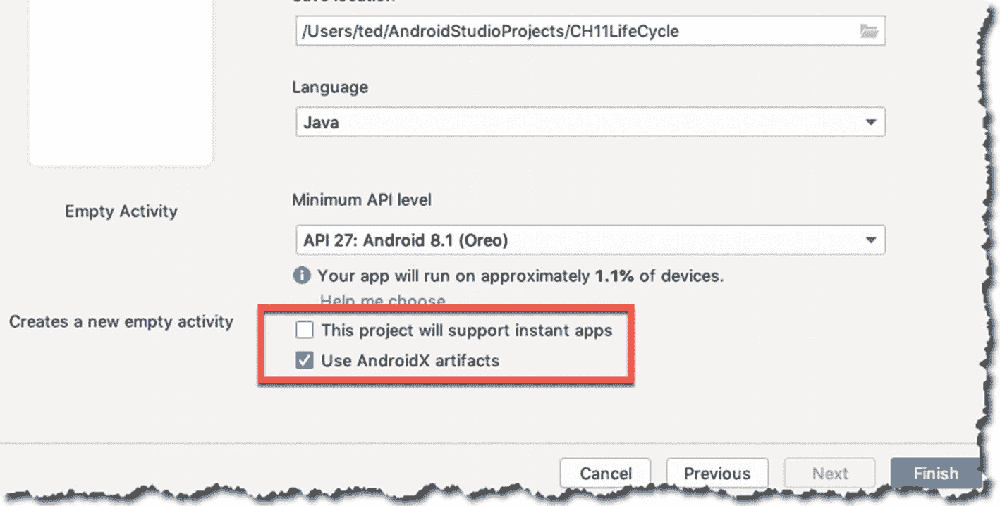

图 11-1. AndroidX artifacts

为了演示生命周期的概念，您将研究两个类：

*   `MainActivity`：这是一个简单的 Activity，与您在创建包含空 Activity 的项目时 IDE 生成的任何其他 Activity 非常相似。代码示例见清单 11-2。
*   `MainActivityObserver`：一个实现了`LifeCycleObserver`接口的 Java 类。这将是您的监听器对象；代码在清单 11-1 中列出并注释。


### 注意

你可以选择亲自输入代码示例，也可以参考随书附带的源代码。如果你更倾向于自己动手编写代码，需要按以下步骤操作：

1.  创建一个包含空活动（activity）的项目。
2.  添加清单 11-3 中所示的 Room 依赖。

首先，我们来看看观察者对象。清单 11-1 展示了带注释的代码。

| ➊ | 如果你想要观察其他组件的生命周期变化，就需要实现 `LifecycleObserver` 接口。这一行代码使得该类成为一个观察者。 |
| ➋ | 使用 `OnLifecycleEvent` 注解来告诉 Android 运行时，当生命周期事件发生时，应调用被修饰的方法。在此例中，你正在监听被观察对象的 `ON_CREATE` 事件。该装饰器的参数指示了你要监听哪个生命周期事件。 |
| ➌ | 这是被修饰的方法。当你正在观察的对象进入 `ON_CREATE` 生命周期状态时，该方法会被调用。你可以随意命名这个方法；我这里把它命名为 `onCreateEvent()`，因为它具有描述性。当然，你也可以根据自己的喜好命名；方法名无关紧要，因为你已经对其进行了修饰，所以注解就足够了。 |
| ➍ | 这是你执行有趣操作以响应生命周期状态变化的地方。 |

```java
import androidx.lifecycle.Lifecycle;
import androidx.lifecycle.LifecycleObserver;
import androidx.lifecycle.OnLifecycleEvent;
public class MainActivityObserver implements LifecycleObserver {  ➊
@OnLifecycleEvent(Lifecycle.Event.ON_CREATE) ➋
public void onCreateEvent() {  ➌
System.out.println("EVENT: onCreate Event fired");  ➍
}
@OnLifecycleEvent(Lifecycle.Event.ON_PAUSE)
public void onPauseEvent() {
System.out.println("EVENT: onPause Event fired");
}
@OnLifecycleEvent(Lifecycle.Event.ON_RESUME)
public void onResumeEvent() {
System.out.println("EVENT: onResume Event fired");
}
}
清单 11-1.
MainActivityObserver 类
```

| ➊ | 从 `MainActivity`（作为被观察者）的角度来看，你唯一需要做的就是在 `LifeCycleOwner` 接口中使用 `addObserver()` 方法添加一个观察者对象。是的，`AppCompatActivity` 实现了 `LifeCycleOwner`；这就是你可以在活动（activity）中调用 `getLifecycle()` 方法的原因。你只需传递一个观察者类的实例（在本例中是 `MainActivityObserver`），即可在活动（activity）和普通类之间建立生命周期感知。 |

```java
public class MainActivity extends AppCompatActivity {
@Override
protected void onCreate(Bundle savedInstanceState) {
super.onCreate(savedInstanceState);
setContentView(R.layout.activity_main);
getLifecycle().addObserver(new MainActivityObserver()); ➊
}
}
清单 11-2.
MainActivity 类
```

同样，如果你要亲自尝试这段代码，别忘了在你的项目的 `build.gradle` 文件（模块级别）中添加 Room 依赖，如清单 11-3 中的代码片段所示。

```gradle
dependencies {
def lifecycle_version = "2.0.0"
implementation "androidx.lifecycle:lifecycle-extensions:$lifecycle_version"
annotationProcessor "androidx.lifecycle:lifecycle-compiler:$lifecycle_version"
...
}
清单 11-3.
build.gradle 文件，模块级别
```

### 注意

编写本书时，`lifecycle_version` 为 `2.0.0`，但当你阅读此书时，该版本可能已不同。你可以访问 [`https://bit.ly/lifecyclerelnotes`](https://bit.ly/lifecyclerelnotes) 查看生命周期库的当前版本。

## ViewModel

Android 框架管理着 UI 控制器（如活动（activities）和片段（fragments））的生命周期；它可能会根据某些用户操作（如点击返回按钮）或设备事件（如旋转屏幕）来决定销毁或重新创建活动（activity）（或片段（fragment））。这些配置变更不在你的控制范围内。

如果运行时决定销毁 UI 控制器，那么你当前在其中存储的任何瞬态 UI 相关数据都将丢失。我们以一个简单应用为例。清单 11-4、11-5 和 11-6 展示了一个简单的应用，每次活动（activity）被创建时，它都会显示一个随机数。

清单 11-4 展示了随机数生成器的代码。它只有两个方法：`getNumber()` 和 `createRandomNumber()`；每个方法都留下了日志语句，这样你就能在日志中看到它们被调用的时间和次数。`getNumber()` 方法的逻辑很简单：如果 `minitialized` 变量为 false，这意味着你是第一次创建 `RandomNumber` 类的实例，因此你将生成随机数然后直接返回。否则，你将返回 `minitialized` 的当前值。

```java
import android.util.Log;
import java.util.Random;
public class RandomNumber  {
private String TAG = getClass().getSimpleName();
int mrandomnumber;
boolean minitialized = false;
String getNumber() {
if(!minitialized) {
createRandomNumber();
}
Log.i(TAG, "RETURN Random number");
return mrandomnumber + "";
}
void createRandomNumber() {
Log.i(TAG, "CREATE NEW Random number");
Random random = new Random();
mrandomnumber = random.nextInt(100);
minitialized = true;
}
}
清单 11-4.
RandomNumber 类
```

清单 11-5 展示了 `MainActivity` 的代码。所有操作都在 `onCreate()` 方法内完成。当 `MainActivity` 进入 *CREATED* 状态时，你创建了 `RandomNumber` 类的一个实例，调用 `getNumber()` 方法，并将 `TextView` 的值设置为 `getNumber()` 方法的结果。

```java
public class MainActivity extends AppCompatActivity {
@Override
protected void onCreate(Bundle savedInstanceState) {
super.onCreate(savedInstanceState);
setContentView(R.layout.activity_main);
RandomNumber data = new RandomNumber();
((TextView) findViewById(R.id.txtrandom)).setText(data.getNumber());
}
}
清单 11-5.
MainActivity 类
```

清单 11-6 展示了布局代码，供你参考。

```xml
<!-- 源代码位于此处，但未提供具体内容，故保留空代码块结构 -->
```
清单 11-6.
activity_main.xml
```

当你首次运行这段代码时，你会看到 `TextView` 中显示一个随机数——这并不意外。你还会在 Logcat 窗口中看到 `createNumber()` 和 `getNumber()` 的日志条目——这同样不意外。现在，当应用在模拟器上运行时，尝试改变设备的方向。你会注意到，每次屏幕方向改变时，`TextView` 中显示的数字也会随之改变。此外，你还会注意到 Logcat 中出现了 `createNumber()` 和 `getNumber()` 方法的额外日志。这是因为运行时每次屏幕方向改变时都会销毁并重新创建 `MainActivity`。你的 `RandomNumber` 对象也会随着 `MainActivity` 一起被销毁和重新创建；你的 UI 数据无法在方向变更中幸存下来。

这正是使用 ViewModel 库的好时机，这样 UI 数据就能在 `Activity` 类的销毁和重新创建过程中幸存下来。实现 ViewModel 只需做三件事：

1.  将生命周期扩展（lifecycle extensions）添加到项目的依赖中，就像你之前做的那样。请返回清单 11-3 查看说明。
2.  要使 `RandomGenerator` 类成为 ViewModel，你需要从 AndroidX 生命周期库中继承 `ViewModel` 类。


3.  从`MainActivity`中，通过`ViewModelProviders`类的工厂方法获取`RandomNumber`类的实例，而不是直接创建`RandomNumber`类的实例。

清单 11-7 展示了`RandomNumber`类的变化；`RandomNumber`类通过简单地继承`ViewModel`类，自动转换为 ViewModel 对象。

```java
import java.util.Random;
import androidx.lifecycle.ViewModel;
public class RandomNumber extends ViewModel {
private String TAG = getClass().getSimpleName();
int mrandomnumber;
boolean minitialized = false;
String getNumber() {
if(!minitialized) {
createRandomNumber();
}
Log.i(TAG, "RETURN Random number");
return mrandomnumber + "";
}
void createRandomNumber() {
Log.i(TAG, "CREATE NEW Random number");
Random random = new Random();
mrandomnumber = random.nextInt(100);
minitialized = true;
}
}
```
*清单 11-7. `RandomNumber` 继承 `ViewModel`*

该类与其先前版本（清单 11-4 所示）基本相同；唯一的区别是现在它继承了`ViewModel`。

现在，让我们在`MainActivity`中实现这些更改。清单 11-8 展示了修改后的`MainActivity`，它使用`ViewModelProviders`来获取`RandomNumber`类的实例，即 ViewModel 对象。

| ➊ | 这是你需要在`MainActivity`中做的唯一改动。无需通过在`onCreate()`方法内直接创建 ViewModel 对象（`RandomNumber`类）的实例来管理它，而是让`ViewModelProviders`类管理 ViewModel 对象的生命周期。 |

```java
import androidx.lifecycle.ViewModelProviders;
import android.os.Bundle;
import android.widget.TextView;
public class MainActivity extends AppCompatActivity {
@Override
protected void onCreate(Bundle savedInstanceState) {
super.onCreate(savedInstanceState);
setContentView(R.layout.activity_main);
RandomNumber data;
data = ViewModelProviders.of(this).get(RandomNumber.class); ➊
((TextView) findViewById(R.id.txtrandom)).setText(data.getNumber());
}
}
```
*清单 11-8. `MainActivity` 和 `ViewModelProviders`*

## `LiveData`

回到`RandomNumber`示例，这里有一个应用，每次启动时都会显示一个随机数。该应用已经使用了`ViewModel`，因此你不会再遇到每次 Activity 被销毁和重建时丢失数据的问题。基本数据流如图 11-2 所示。

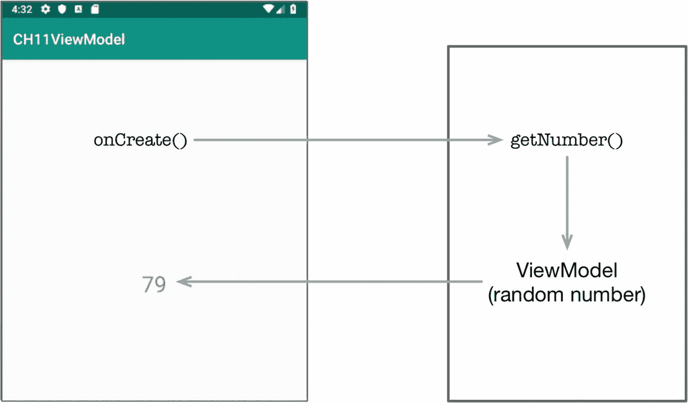

*图 11-2. `RandomNumber` 示例的数据流*

但是，如果你需要获取另一个数字呢？为此，你可以在`MainActivity`中添加一个触发器，例如一个按钮，然后按钮将调用 ViewModel 上的`getNumber()`方法，但如何刷新`MainActivity`中的`TextView`呢？有几种方法可以做到这一点，你可能已经遇到过。一种促进 ViewModel 与 Activity 之间数据交换的方法是创造性地使用接口（但我不会在此讨论），或者使用像 Otto 这样的 EventBus（我也不会在此讨论）。不过，幸运的是，由于架构组件的出现，你可以使用`LiveData`。新的数据流如图 11-3 所示。

| ➊ | 用户点击**FETCH**按钮，该按钮调用`getNumber()`函数；实际上，它先调用`createNumber()`，然后调用`getNumber()`。这样，你就能真正获取一个新的随机数。有更优雅的方法可以实现这一点，但这是最快的方法，请稍安勿躁。 |
| ➋ | 你的 ViewModel 对象获取一个新的随机数。这不再是一个简单的字符串；它被改为`MutableLiveData`，从而变为*可观察的*。 |
| ➌ | 从`MainActivity`中，获取来自 ViewModel 对象的`LiveData`实例，并编写一些代码来*观察*它。然后，只需对`LiveData`的变化做出响应。 |

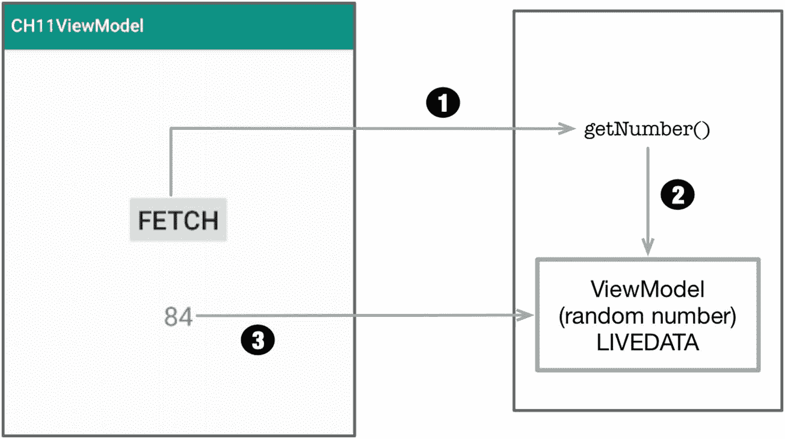

*图 11-3. 使用`LiveData`的`RandomNumber`示例*

让我们看看这在代码中如何实现。清单 11-9 和 11-10 分别展示了 ViewModel 和`MainActivity`的代码。

| ➊ | `mrandomnumber`的值是你返回给`MainActivity`的内容。你希望这是一个*可观察的*对象。为此，将其类型从`int`改为`MutableLiveData`。 |
| ➋ | 你也必须在此处进行类型更改。由于`mrandomnumber`现在是`MutableLiveData`，此函数也必须返回`MutableLiveData`。 |
| ➌ | 要设置`MutableLiveData`的值，请使用`setValue()`方法。 |

```java
import androidx.lifecycle.MutableLiveData;
import androidx.lifecycle.ViewModel;
public class RNModel extends ViewModel {
private String TAG = getClass().getSimpleName();
MutableLiveData mrandomnumber = new MutableLiveData(); ➊
boolean minitialized = false;
MutableLiveData getNumber() { ➋
if(!minitialized) {
createRandomNumber();
}
Log.i(TAG, "RETURN Random number");
return mrandomnumber;
}
void createRandomNumber() {
Log.i(TAG, "CREATE NEW Random number");
Random random = new Random();
mrandomnumber.setValue(random.nextInt(100) + ""); ➌
minitialized = true;
}
}
```
*清单 11-9. 使用 LiveData 的 ViewModel*

现在，你可以继续对`MainActivity`进行修改。清单 11-10 展示了`MainActivity`的修改后带注释的代码。


| ➊ | 从 ViewModel 中获取随机数。该随机数不再是`String`类型；而是`MutableLiveData`类型。 |
| ➋ | 这是按钮点击的样板代码。你需要此触发器从 ViewModel 中获取随机数。 |
| ➌ | 要*观察*一个`LiveData`，你需要调用`observe()`方法。该方法接受两个参数：第一个参数是生命周期所有者（`MainActivity`，因此传入`this`），第二个参数是一个`Observer`对象。这里使用匿名类来创建`Observer`对象。 |
| ➍ | 每当 ViewModel 中随机数（`mrandomnumber`）的值发生变化时，都会调用`onChanged()`方法；因此，当其发生变化时，你相应地设置`TextView`的值。 |

```java
import androidx.appcompat.app.AppCompatActivity;
import androidx.lifecycle.MutableLiveData;
import androidx.lifecycle.Observer;
import androidx.lifecycle.ViewModelProviders;
import android.os.Bundle;
import android.view.View;
import android.widget.Button;
import android.widget.TextView;
public class MainActivity extends AppCompatActivity {
@Override
protected void onCreate(Bundle savedInstanceState) {
super.onCreate(savedInstanceState);
setContentView(R.layout.activity_main);
final RNModel data;
data = ViewModelProviders.of(this).get(RNModel.class);
final TextView txtnumber = (TextView) findViewById(R.id.txtrandom);
MutableLiveData mnumber = data.getNumber(); ➊
Button btn = (Button) findViewById(R.id.button);  ➋
btn.setOnClickListener(new View.OnClickListener() {
@Override
public void onClick(View v) {
data.createRandomNumber();
data.getNumber();
}
});
mnumber.observe(this, new Observer() { ➌
@Override
public void onChanged(String val) { ➍
txtnumber.setText(val);
}
});
}
}
```
清单 11-10. `MainActivity`

很棒，对吧？如果你仍未决定使用`LiveData`，这里有一些值得考虑的优点。当你使用`LiveData`时：

*   **你确信 UI 始终与数据状态匹配。** 你已从示例中看到了这一点。`LiveData`遵循观察者模式，因此当其值发生改变时会通知观察者。

*   **没有内存泄漏。** 观察者被绑定到生命周期对象。例如，如果你的`MainActivity`进入暂停状态（出于某种原因，比如另一个活动在前台），`LiveData`将不会被观察。如果`MainActivity`被销毁，`LiveData`同样不会被观察，并且它会自行清理——这也意味着你无需手动管理`MainActivity`和 ViewModel 的生命周期。

## Room

如果你想在应用程序中包含数据库功能，你可能会考虑使用`Room`。在`Room`出现之前，构建数据库应用程序的两种流行方法是使用`Realm`或直接使用老牌的`SQLite`。处理`SQLite`被认为过于底层；它感觉太接近底层，因此使用起来有些繁琐。`Realm`在开发者中相当流行，但无论多么流行，它都不是第一方解决方案。幸运的是，我们现在有了`Room`。

`Room`是对`SQLite`的一层抽象。如果你以前使用过`ORM`（例如`Hibernate`），那么它与此类似。与使用普通`SQLite`相比，`Room`有几个优点。使用`Room`：

*   你不必为基本的数据库操作处理原始查询。
*   在编译时，它会验证`SQL`查询，因此你无需担心`SQL`注入——还记得吗？
*   你的数据库对象和`Java`对象之间没有阻抗不匹配。`Room`处理了这一点，因此你只需要处理`Java`对象。

`Room`有三个主要组件：`Entity`、`Dao`和`Database`。它们与应用程序的关系如图 11-4 所示。

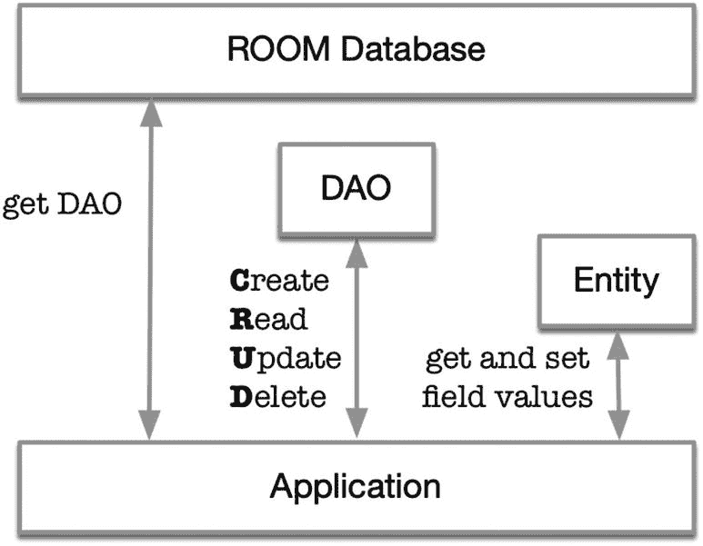

图 11-4. `Room` 组件

*   **`Entity`**：一个`Entity`用于表示一个数据库表。你将其编码为一个由`@Entity`注解修饰的类。
*   **`Dao`**（数据访问对象）是一个包含访问数据库表方法的类。这是你编写 CRUD（创建、读取、更新和删除）操作的地方。这是一个由`@Dao`注解修饰的*接口*。
*   **`Database`**：此组件持有对数据库的引用。它是一个由`@Database`注解修饰的抽象类。

在项目中可以使用`Room`之前，你需要将其依赖项添加到`build.gradle`文件（模块级）中，如清单 11-11 所示。

```
dependencies {
def room_version = "2.1.0-alpha07"
implementation "androidx.room:room-runtime:$room_version"
annotationProcessor "androidx.room:room-compiler:$room_version"
. . .
}
```
清单 11-11. `Room` 依赖

清单 11-12、11-13、11-14 和 11-15 展示了四个`Java`源文件，它们演示了`Room`的基本用法。

| ➊ | `@Entity`注解使其成为一个 Entity。如果你不传入`tableName`参数，表名将默认为被修饰类的名称。仅当你希望表名与被修饰类不同时，才需要传入此参数。因此，我在这里写的内容是不必要且多余的，因为我将`tableName`的值设置为“person”，这与被修饰类的名称相同。 |
| ➋ | 你将`uid`成员变量设为主键；你还声明它不能为空。 |
| ➌ | 类的成员变量将自动成为表上的字段。除非你使用`@ColumnInfo`注解，否则表上的列名将沿用成员变量的名称。如果你希望表字段（列）的名称与成员变量的名称不同，请使用`@ColumnInfo`修饰，如下所示，并将`name`设置为你偏好的列名。 |

```java
import androidx.annotation.NonNull;
import androidx.room.Entity;
import androidx.room.PrimaryKey;
@Entity(tableName = "person") ➊
public class Person {
@PrimaryKey(autoGenerate = true) ➋
@NonNull public int uid;
@ColumnInfo(name="last_name") ➌
public String last_name;
public String first_name;
public Person(String lname, String fname) {
last_name = lname;
first_name = fname;
}
public Person() {}
}
```
清单 11-12. `Person` 类，即 Entity


| ➊ | DAO 需要使用 `@Dao` 装饰器进行注解。 |
| ➋ | DAO 必须编写为接口形式。 |
| ➌ | 使用 `@Insert` 装饰器来指示被装饰的方法将用于向表中插入记录。类似地，你可以分别使用 `@Update`、`@Query` 和 `@Delete` 装饰方法来执行更新、查询和删除操作。 |
| ➍ | 使用 `@Query` 编写 SQL 查询语句。每个 `@Query` 会在编译时进行验证；如果查询有问题，会触发编译错误而非运行时错误。这应该能让你感到安心。 |

```java
import java.util.List;
import androidx.room.Dao;
import androidx.room.Delete;
import androidx.room.Insert;
import androidx.room.Query;
import androidx.room.Update;

@Dao ➊
interface PersonDAO { ➋
    @Insert ➌
    void insertPerson(Person person);
    @Update
    void updatePerson(Person person);
    @Delete
    void deletePerson(Person person);
    @Query("SELECT ∗ FROM person") ➍
    public List listPeople();
}
```
*列表 11-13. PersonDAO，数据访问对象*

| ➊ | 使用 `@Database` 来表明这个类是数据库持有者。使用 `entities` 参数指定数据库中的实体。如果你有多个实体，使用逗号分隔列表。第二个参数是 `version`，它是一个整数值，用于指定数据库的版本。 |
| ➋ | `Database` 类是 *抽象* 的，并且继承自 `RoomDatabase`。 |
| ➌ | 你需要提供一个抽象的方法，该方法将返回 DAO 对象的实例。 |
| ➍ | 你需要提供一个静态方法来获取数据库的实例。它不一定是单例模式，就像我这里所做的，但我想你不会希望有多个 `Database` 类的实例。 |
| ➎ | 使用 `databaseBuilder()` 方法来创建 `RoomDatabase` 的实例。builder 方法有三个参数：1) 应用上下文，2) 被 `@Database` 注解的抽象类，以及 3) 数据库文件的名称。这是 SQLite 数据库的文件名。 |

```java
import android.content.Context;
import androidx.room.Database;
import androidx.room.Room;
import androidx.room.RoomDatabase;

@Database(entities = {Person.class}, version = 1) ➊
public abstract class AppDatabase extends RoomDatabase { ➋
    private static AppDatabase minstance;
    private static final String DB_NAME = "person_db";
    public abstract PersonDAO getPersonDAO(); ➌
    public static synchronized AppDatabase getInstance(Context ctx) { ➍
        if(minstance == null) {
            minstance = Room.databaseBuilder(ctx.getApplicationContext(), ➎
                    AppDatabase.class,
                    DB_NAME)
                    .fallbackToDestructiveMigration()
                    .build();
        }
        return minstance;
    }
}
```
*列表 11-14. AppDatabase，数据库持有者*

现在你的所有 Room 组件都已就位，你可以从你的应用中使用它们了。列表 11-15 展示了如何从 Activity 中使用 Room 组件。

| ➊ | 要开始使用 `RoomDatabase`，请使用之前在 `AppDatabase` 中编写的工厂方法获取其实例。 |
| ➋ | 让我们从 `TextViews` 中收集数据。 |
| ➌ | Room 遵循最佳实践，因此它不允许你在主 UI 线程上执行任何数据库查询。你需要创建一个后台线程，并在其中运行所有的 Room 命令。在这里，我使用了简单直接的 `Thread` 和 `Runnable` 对象，但你可以自由使用任何其他后台执行方式，比如 `AsyncTask`。 |
| ➍ | 使用来自 `TextViews` 的输入创建一个 `Person` 对象。 |
| ➎ | 获取 DAO 的实例。 |
| ➏ | 使用之前在 DAO 中编写的 `insertPerson()` 方法执行 *插入* 操作。 |
| ➐ | 执行 `SELECT` 操作。 |
| ➑ | 列出 `person` 表中的所有条目。 |

```java
public class MainActivity extends AppCompatActivity {
    private AppDatabase db;
    @Override
    protected void onCreate(Bundle savedInstanceState) {
        super.onCreate(savedInstanceState);
        setContentView(R.layout.activity_main);
        Button btn = (Button) findViewById(R.id.button);
        btn.setOnClickListener(new View.OnClickListener() {
            @Override
            public void onClick(View v) {
                saveData();
                System.out.println("Clicked");
            }
        });
        db = AppDatabase.getInstance(this); ➊
    }
    private void saveData() {
        final String mlastname = ((TextView) findViewById(R.id.txtlastname)).getText().toString();
        final String mfirstname = ((TextView) findViewById(R.id.txtfirstname)).getText().toString(); ➋
        new Thread(new Runnable() { ➌
            @Override
            public void run() {
                Person person = new Person(mlastname, mfirstname); ➍
                PersonDAO dao = db.getPersonDAO(); ➎
                dao.insertPerson(person); ➏
                List people = dao.listPeople(); ➐
                for(Person p:people) { ➑
                    System.out.printf("%s , %s\n", p.last_name, p.first_name );
                }
            }
        }).start();
    }
}
```
*列表 11-15. MainActivity*

在真实的应用中，你可能不会直接从 Activity 这样的 UI 控制器访问数据库。你可能会考虑引入一个 `ViewModel` 类；这样一来，UI 控制器的职责就严格限定于展示数据，而不是充当模型。

如果你将 Room 与 `ViewModel` 和 `LiveData` 结合使用，它可以提供更具响应性的 UI 体验。这里我没有详细展开，但这将是本章之后一个很好的练习课题。

## 章节总结

*   `AppCompatActivity` 对象现在是生命周期所有者。你可以编写另一个类来监听生命周期所有者的生命周期变化，并据此做出响应。Fragment 也是生命周期所有者——在使用生命周期感知组件时，别忘了在项目中使用 AndroidX 组件。

*   `ViewModel` 使你的 UI 数据能够抵御 UI 控制器（如 Activity 和 Fragment）的销毁和重建。

*   `LiveData` 使得你的 UI 对象和模型数据之间建立双向关系。一方的变化会自动反映在另一方中。

*   Room 是 SQLite 的 ORM 框架。它是第一方解决方案，并且是架构组件的一部分。几乎没有理由不使用它。

# 12. 发布构建版本

*本章涵盖内容：*

*   发布前的准备工作
*   签署应用
*   Google Play
*   应用捆绑包

你可以相当自由地分发你的应用，且没有太多限制。你可以让用户从你的网站、Google Drive、Dropbox 等下载；如果你愿意，甚至可以通过电子邮件直接将应用发送给用户。许多开发者选择在 Google 或 Amazon 等应用市场上分发应用，以最大限度地扩大覆盖范围。将应用放在值得信赖的数字市场还有另一个原因：那就是信任问题。当应用不是从可信来源下载时，应用无法立即使用，因为用户会收到通知，提示该应用并非来自可信来源。

在本章中，我将讨论将应用发布到 Google Play 所需执行的操作。

## 为发布准备应用

在准备发布应用时，需要牢记三点：

1.  准备用于发布的材料和资源。
2.  配置应用以供发布。
3.  构建一个可用于发布的应用。


### 准备发布所需的素材和资源

你的代码非常出色，甚至可能自认为很巧妙，但用户永远不会看到它们。用户看到的是你的视图对象、图标以及其他图形资源。因此，你需要打磨好这些资源。

如果你认为应用的图标无关紧要，请三思。这个图标能帮助用户在主页面上识别你的应用。它还会出现在其他区域，例如启动器窗口、下载区，更重要的是，它会显示在应用发布的商店中。图标构成了用户对应用的第一印象。所以，花些心思在上面是个好主意。首先，阅读谷歌关于应用图标的指南：[`http://bit.ly/androidreleaseiconguidelines`](http://bit.ly/androidreleaseiconguidelines)。同时，也请访问 [`https://romannurik.github.io/AndroidAssetStudio/`](https://romannurik.github.io/AndroidAssetStudio/)；这个资源能为你在生成应用资源时节省大量时间。

如果你打算在谷歌市场发布应用，其他需要考虑的方面包括图形资源（如屏幕截图）和推广文案。请务必阅读谷歌关于图形资源的指南，网址为 [`http://bit.ly/androidreleasegraphicassets`](http://bit.ly/androidreleasegraphicassets)。

### 配置应用以准备发布

1. **检查包名**。应用可能最初只是一个练习或临时代码，后来逐渐发展壮大并独立成型。你可能需要检查应用的包名。确保它不再是`com.example.myapp`。包名在谷歌市场中是唯一的标识，一旦确定，就无法更改。所以请仔细考虑。你已经知道如何修改它，还记得吗？这在 Gradle 章节中已经介绍过。

2. **处理调试信息**。确保清单文件中 `<application>` 标签内的 `android:debuggable` 属性已被移除。实际上，你只需要检查一下，因为当你将模式切换为“release”时，Android Studio 会自动移除它。

3. **移除日志语句**。不同的开发者有不同的做法。有些人仔细地逐行检查代码并手动移除语句。有些人编写 `sed` 或 `awk` 程序来剥离日志语句。有些人使用 ProGuard，还有些人使用第三方工具（如 Timber）来管理日志记录活动。使用哪种方法由你决定，但请确保用户不会意外看到日志信息。如果你还没拿定主意，我强烈建议你尝试一下 Timber。

4. **检查应用的权限**。在开发过程中，你可能尝试了应用的某些功能，并在清单文件中设置了权限，如网络访问权限、外部存储写入权限等。检查清单文件中的 `<uses-permission>` 标签，确保你没有授予应用不需要的权限。

5. **检查远程服务器和 URL**。如果你的应用依赖 Web API 或云服务，请确保应用的 Release 版本使用的是生产环境 URL，而不是测试路径。在开发期间，你可能会获得沙箱环境和测试 URL；你需要将它们切换为生产版本。

### 构建可发布的应用

在开发过程中，Android Studio 为你完成了以下工作：

1. 创建了一个调试证书
2. 将所有项目资源、配置文件及运行时二进制文件组装成一个 APK
3. 使用调试证书为 APK 签名
4. 将 APK 部署到模拟器或连接的设备上

所有这些操作都在后台进行；你只需编写代码，无需操别的事情。现在你需要处理这个证书了。Google Play 和其他类似的市场不会分发使用调试证书签名的应用。必须使用一个正规的证书。你不需要去 Thawte 或 Verisign 这样的证书颁发机构；自签名证书就足够了。

在接下来的步骤中，我将指导你如何生成签名的应用束或 APK。你已经知道 APK 是什么——它是包含你的应用程序的包，也就是你上传到 Google Play 的内容。另一方面，应用束（Bundle）与 APK 非常相似，但它是一种更新的上传格式。与 APK 一样，它也包含你应用的所有编译代码和资源，但它将 APK 的生成过程推迟了。这是 Google Play 新的应用服务模式，称为“动态分发”（Dynamic Delivery）。它使用你的应用束为每个用户的设备配置生成并提供优化的 APK——这样用户只需下载运行你的应用所需的代码和资源。你不再需要构建、签名和管理多个 APK 了。

在 Android Studio 中，生成 APK 和应用束的步骤几乎相同。在接下来的步骤中，你将看到如何同时生成应用束和 APK。

启动 Android Studio（如果尚未打开）。打开项目，在主菜单栏中，选择 **Build ➤ Generate Signed Bundle/APK**，如图 12-1 所示。

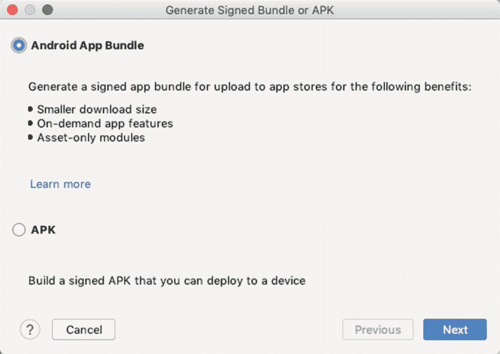

图 12-1. 生成签名的 APK

选择“Bundle”或“APK”，然后点击“Next”。在此示例中，我选择创建一个应用束。点击“Next”后，你将看到密钥库对话框，如图 12-2 所示。

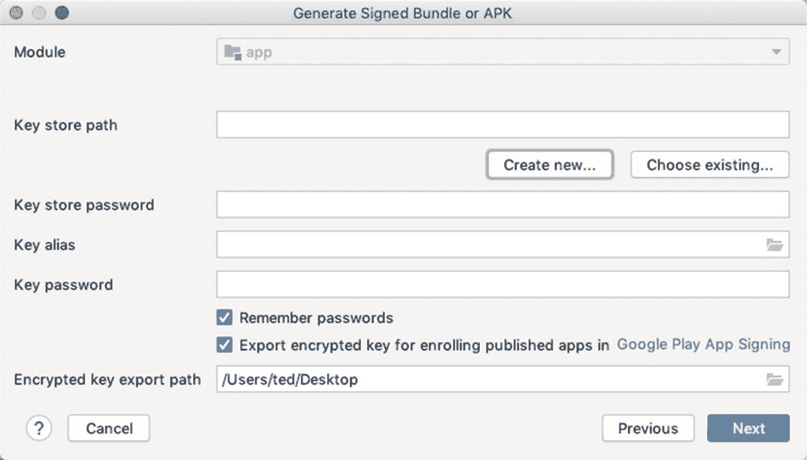

图 12-2. 密钥库对话框

**密钥库路径** 字段要求输入你的 Java 密钥库（JKS）文件的位置。此时你还没有这个文件。所以，点击 **创建新密钥库** 按钮。你将看到用于创建新密钥库的对话框窗口，如图 12-3 所示。

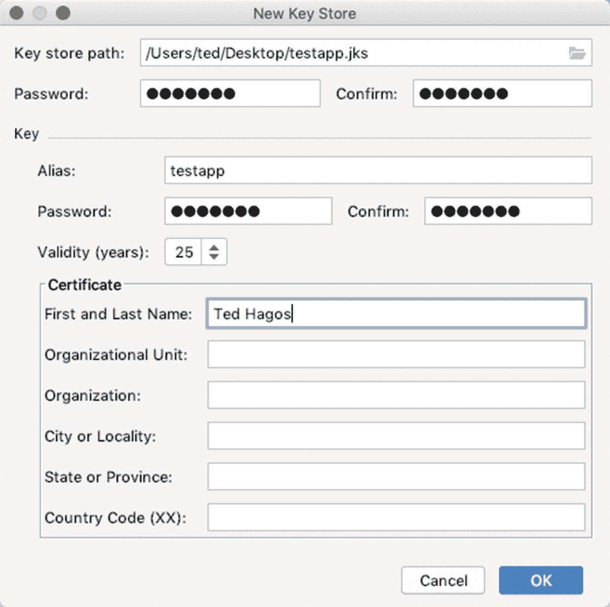

图 12-3. 新建密钥库

表 12-1 显示了密钥库输入项的说明。

表 12-1. 密钥库项目及说明

| 密钥库项目 | 说明 |
| --- | --- |
| 密钥库路径 | 你希望保存密钥库的位置。这完全由你决定。请务必记住这个位置。 |
| 密码 | 这是密钥库的密码。不要丢失它。请确保记住这个密码。否则，你将需要创建另一个密钥库文件。 |
| 别名 | 此别名用于标识密钥。它只是一个便于记忆的名称。 |
| （密钥）密码 | 这是密钥的密码。**这并非** 密钥库的密码（但如果你愿意，可以使用相同的密码）。 |
| 有效期（年） | 默认值为 25 年；你可以接受默认值。如果你在 Google Play 上发布，证书的有效期必须持续到 2033 年 10 月，因此 25 年应该是足够的。 |
| 其他信息 | 只有名字和姓氏字段是必填项。 |

填写完“新建密钥库”对话框后，点击“OK”。这将带你返回“生成签名的 APK”窗口，如图 12-4 所示，但现在 JKS 文件已创建，并且密钥库对话框中已填入该信息。


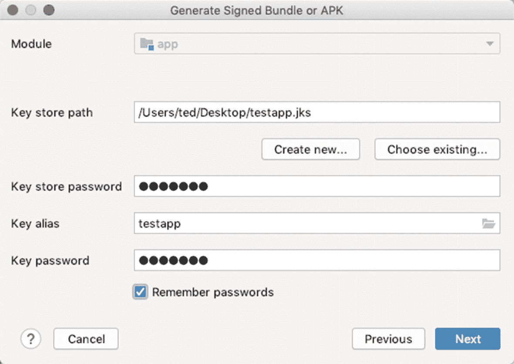

**图 12-4.** 已填充信息的“生成签名 Bundle/APK”界面

点击“下一步”。现在您需要选择签名 Bundle 的目标位置，如图 12-5 所示。

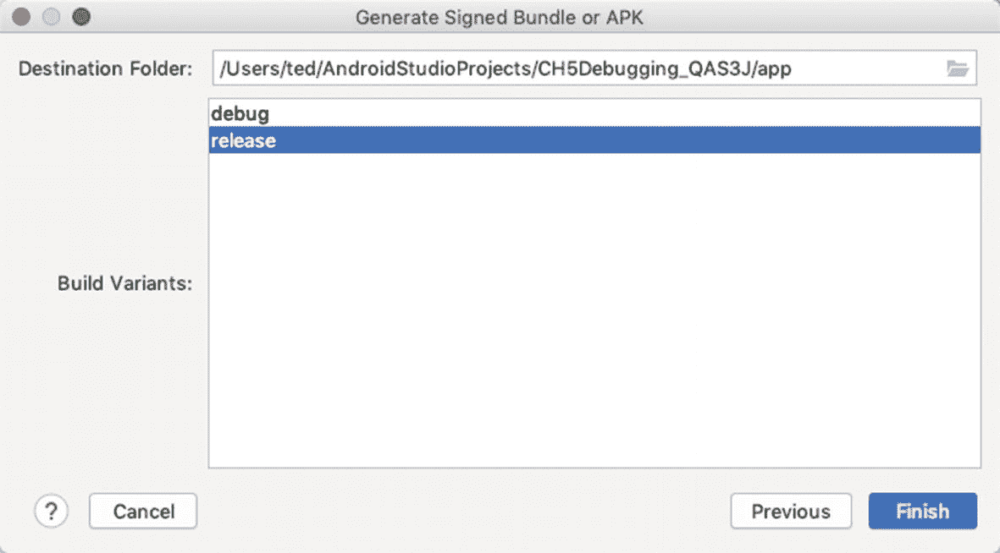

**图 12-5.** 签名 APK 目标文件夹

您需要记住目标文件夹的位置，如图 12-5 所示。Android Studio 将在此处存储签名 Bundle。同时，请确保构建类型设置为 `"release"`。

点击“完成”后，Android Studio 将为您的应用生成签名 Bundle。这是您将要提交到 Google Play 的文件。

## 发布应用

在向 Google Play 提交应用之前，您需要一个开发者账号。如果还没有，可以在 [`https://developer.android.com`](https://developer.android.com) 注册。以下是我对后续操作的几点假设。我假设：

1.  您已拥有一个 Google 账号（Gmail），并且
2.  您正在使用 Google Chrome 浏览器访问 [`https://developer.android.com`](https://developer.android.com)，并且
3.  您的 Google 账号已登录 Chrome 浏览器。

如果您的 Google 账号未登录 Chrome，您可能会看到类似图 12-6 的界面。Chrome 会要求您选择一个账号（或创建一个）。

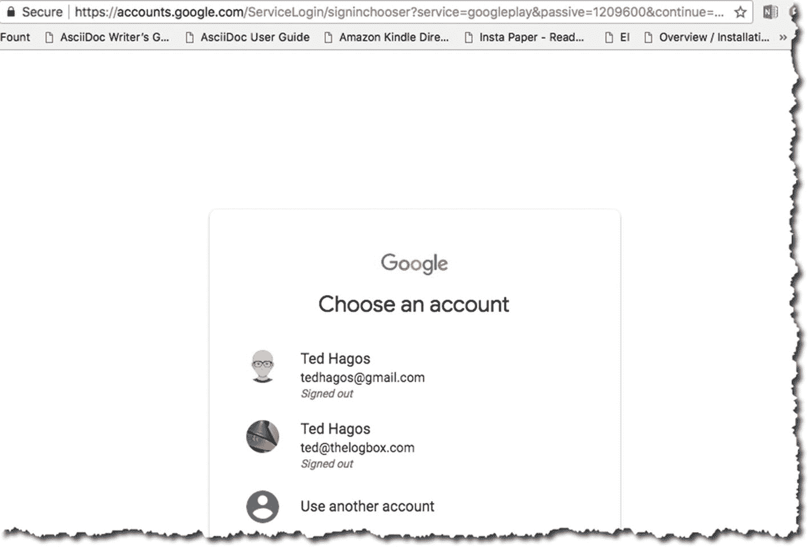

**图 12-6.** 选择账号

当您处理好 Google 账号后，将会跳转到 `developer.android.com` 网站，如图 12-7 所示。


**图 12-7.** `developer.android.com` 网站

如图 12-7 所示，点击 Google Play。再如图 12-8 所示，点击“启动 Play 管理中心”。


**图 12-8.** 启动 Google Play 管理中心

您需要完成四个步骤来完成注册（如图 12-9 所示）：


**图 12-9.** Google Play 管理中心注册

1.  使用您的 Google 账号登录。
2.  接受开发者协议。
3.  支付注册费。
4.  完善您的账号详情。

完成注册并支付一次性费用后，您就可以访问 Google Play 管理中心了，如图 12-10 所示。

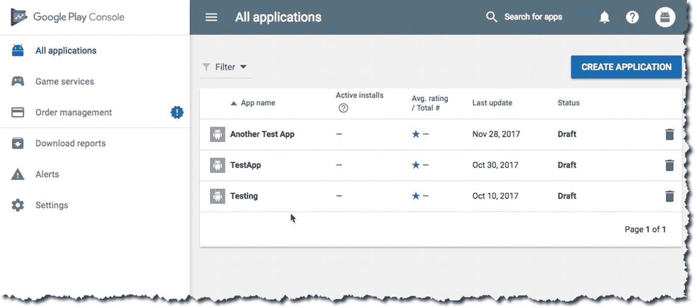

**图 12-10.** Google Play 管理中心

您可以在此处开始提交应用至商店的流程。点击“创建应用”按钮开始。

## 本章小结

-   在用户体验您的应用之前，他们会先看到应用图标和其他图形资源。请确保图形资源与您的代码一样精良。
-   在构建发布版本之前，请从代码中移除所有调试信息和日志语句。
-   对您自己的工作执行代码审查。如果您有同伴或其他人可以与您一同审查代码，那会更好。如果您的应用使用服务器、RESTful URL 等，请确保它们已准备好投入生产环境，而非沙盒环境。
-   在将应用上传到 Google Play 之前，您需要使用有效的证书对应用进行签名。
-   如果您想在 Google Play 上销售应用，则需要一个 Google Play 账号。我支付了 25 美元的一次性费用，不过那是几年前的事了。
-   别忘了在真机上测试您的应用。

# 13. 快速指南

*本章内容涵盖：*

- 如何导入示例代码
- 重构
- 代码生成器
- 实时模板
- 代码编辑器偏好设置
- 键盘快捷键

如果这本快速参考书详细描述了 Android Studio 的每一个细微之处，那它就不能称为快速参考了。但在我结束本书之前，我想指出 Android Studio 的一些特性，这些特性让我们的编码生活更轻松。如我所说，我不会深入细节，因为那不是目标；相反，目标是让您知道这些特性的存在。

## 效率特性

当我们谈论效率时，通常意味着我们希望以最短的时间完成需要做的事情，这涉及到键盘快捷键、模板、代码片段等。在本节中，您将初步了解 Android Studio 提供的一些功能，以稍稍提升您的效率。我将向您展示可用的功能。

### 导入示例

提升效率的一个关键部分是真正学习如何在 Android 中创建东西并发现它们的工作原理。因此，我的第一个效率小贴士是学习如何使用 `import sample`（导入示例）功能。您可以通过主菜单栏的 **文件** ➤ **新建** ➤ **导入示例** 进入此功能。图 13-1 显示了“导入示例”界面。

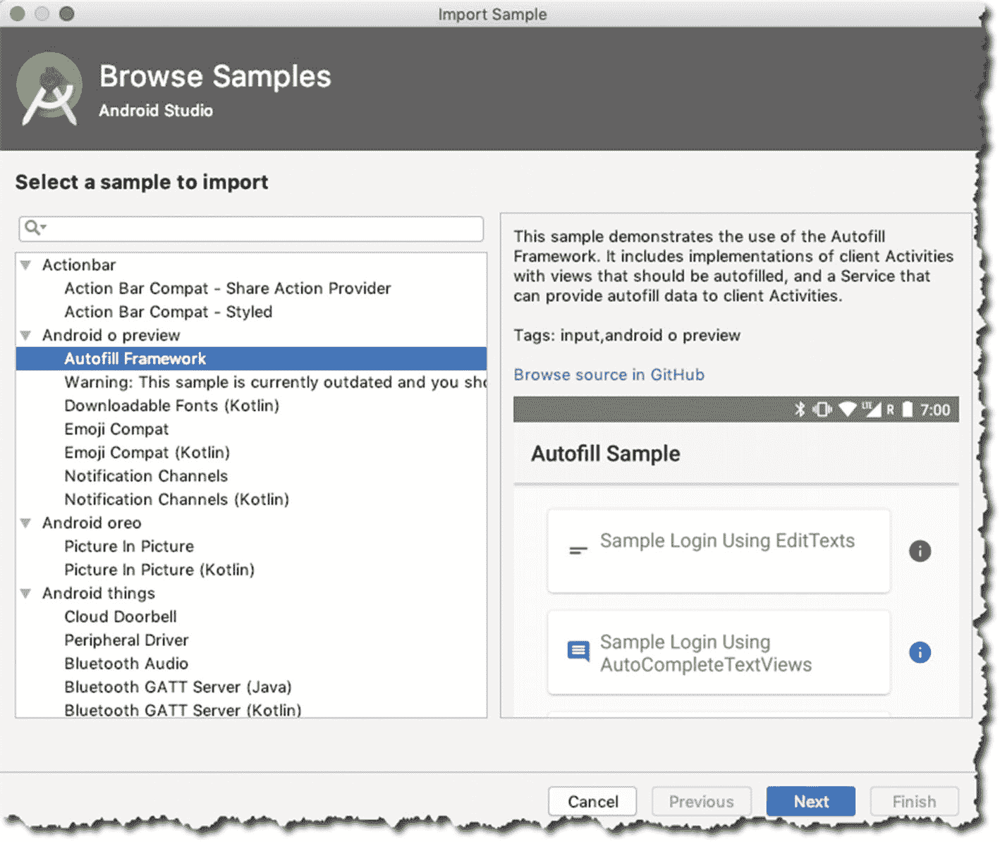

**图 13-1.** 导入一个示例

在图 13-1 中，您看到的是一个代码示例列表，您可以浏览它们，也可以将其创建为本地项目。

假设您想了解 Autofill Framework，就像图 13-1 中显示的那样。您可以预览它的外观，也可以点击 **在 GitHub 浏览** 链接。当您点击 **下一步** 时，您会看到一个与创建新项目时有些相似的对话框，如图 13-2 所示。

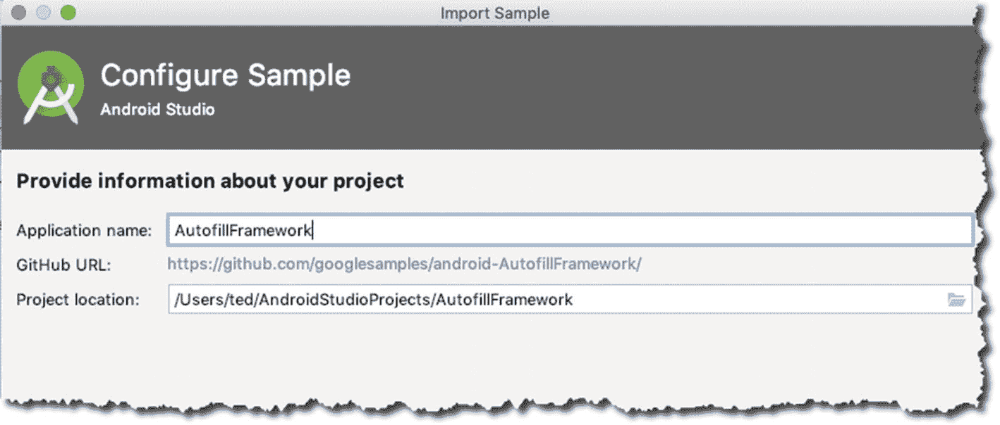

**图 13-2.** 导入示例，下一个窗口

如果您在“导入示例”对话框中点击 **完成**，Android Studio 将在本地创建一个新项目，并从 GitHub 下载示例文件，以便您能立即仔细查看并处理它。

### 重构

重构本质上是在不创建新功能的情况下重写和改进您的源代码；这种做法有助于保持代码遵循 SOLID 和 DRY 原则，从而更易于维护。


### 注释

我将 SOLID 全大写拼写，因为它同时也是一个缩写，代表**单**一职责、**开**闭原则、**里**氏替换原则、**接**口隔离原则和**依**赖倒置原则。这些是面向对象设计的原则，由罗伯特·C·马丁推广开来。

`Android Studio` 拥有一些便捷的重构能力。开始使用很简单：只需选中要重构的代码段，然后使用右键菜单中的上下文相关选项，如图 13-3 所示。或者，你也可以使用键盘快捷键：macOS 为 `Ctrl + T` ，Windows/Linux 为 `Ctrl + Alt + Shift + T`。

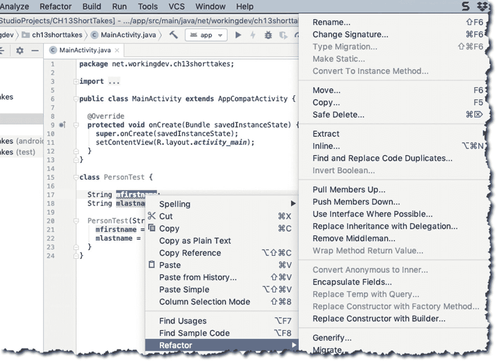  
图 13-3. 重构操作

我确信你之前已经多次进行过重构，但这里我们不妨简单回顾一下。

*   **重命名**：这可以让你安全地重命名变量和其他标识符。你应该使用它，而不是`查找和替换`。此功能适用于整个项目，而不仅仅是当前文件。

*   **更改签名**：这让你可以更改一个方法，无论是其名称还是参数。它同样适用于类级别，因此你可以将一个类转换为泛型类型并操作类型参数。

*   **移动**：移动一个元素。如果需要，你可以将一个方法移动到另一个类中。

*   **复制**：允许你复制元素，例如当前选中的类。

*   **安全删除**：如果需要删除某些内容，`Android Studio` 会验证你正在删除的内容是否未被代码库中的其他任何部分使用。如果正在使用中，系统会提示你，以便你在实际删除重要内容之前先处理这些依赖关系。

*   **提取常量**：避免使用硬编码值。你不应该这样做，你知道这一点，也明白原因。用于重构的提取选项不仅适用于常量；你还可以提取字段、方法、超类、变量、参数和接口。

`Refactor`（重构）菜单中还有更多选项；请务必查看其他选项。

### 生成

`Android Studio` 另一个节省时间的功能是代码生成器。这个名称很贴切，因为它完全符合你的预期——它会生成代码。我们来举个例子。图 13-4 显示了键盘光标位于一个类定义内部。当光标在类体内时，启动生成器操作；从主菜单栏中，选择**代码 ➤ 生成**。

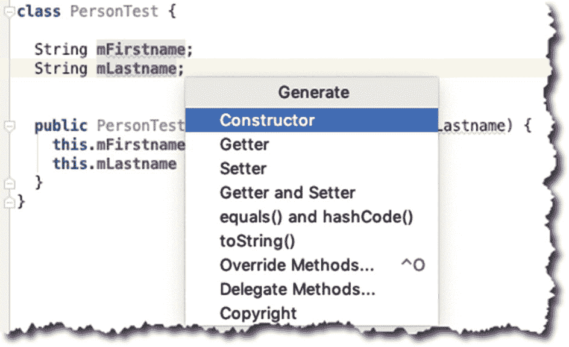  
图 13-4. 主菜单栏，代码 ➤ 生成

如你所见，可以生成相当多的样板代码。当你选择任何生成选项时，`Android Studio` 都会生成一个通用的代码存根。选择 getter 和 setter 选项。假设你有一个 `PersonTest` 类，如图 13-4 所示。当键盘光标仍在 `PersonTest` 类内时，前往主菜单栏并选择**代码 ➤ 生成**。或者，你可以使用键盘快捷键 `Command + N`（macOS）或 `Alt + Insert`（Windows 和 Linux），然后选择生成 getter 和 setter。你将看到图 13-5 中所示的对话框。

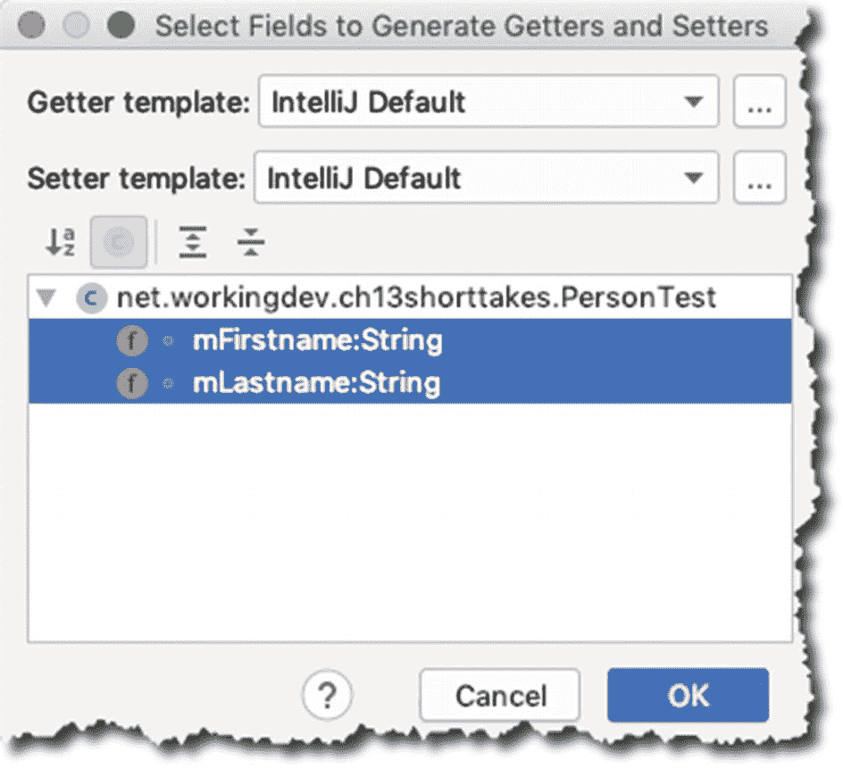  
图 13-5. 生成 getter 和 setter

生成器对话框显示了类中所有自动检测到的字段。它显示了 `mFirstname` 和 `mLastname` 成员变量；还允许你进行多项选择。选中两个成员变量并点击确定。代码清单 13-1 显示了代码生成后的 `PersonTest` 类。

```
class PersonTest {
    String mFirstname;
    String mLastname;
    public String getmFirstname() {
        return mFirstname;
    }
    public void setmFirstname(String mFirstname) {
        this.mFirstname = mFirstname;
    }
    public String getmLastname() {
        return mLastname;
    }
    public void setmLastname(String mLastname) {
        this.mLastname = mLastname;
    }
    public PersonTest(String mFirstname, String mLastname) {
        this.mFirstname = mFirstname;
        this.mLastname = mLastname;
    }
}
```
代码清单 13-1. PersonTest 类

这已经相当简洁了。任何能减少我们敲击键盘次数的东西都是好事情。我猜在这个例子中你可能只有一点要挑剔的地方；方法命名不太对。你可能更倾向于使用 `setLastname()` 而非 `setmLastname()`，对吧？你将在下一节中解决这个问题。

### 编码风格

如果你进入 `Android Studio` 的偏好设置或设置，然后转到**编辑器 ➤ 代码风格 ➤ Java**，你会发现可以更改许多编辑器行为相关的内容。图 13-6 展示了代码风格的选项，特指 Java 语言。

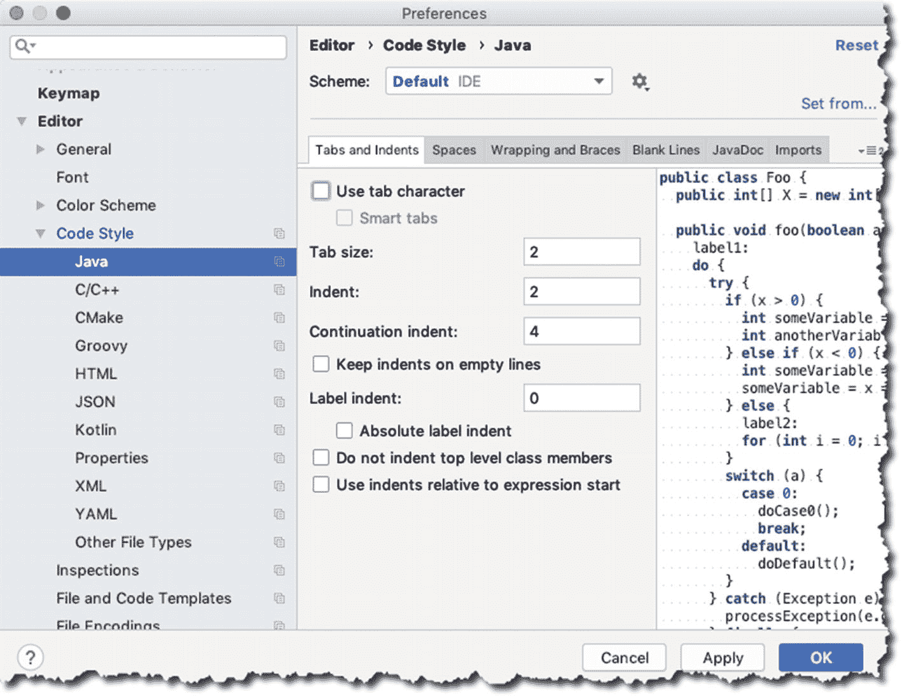  
图 13-6. 偏好设置 ➤ 代码风格 ➤ Java

如果你想更改制表符和缩进的空格数，可以在**制表符和缩进**区域进行修改。请务必检查此对话框中的其他选项。

转到**代码生成**选项卡（如图 13-7 所示）。

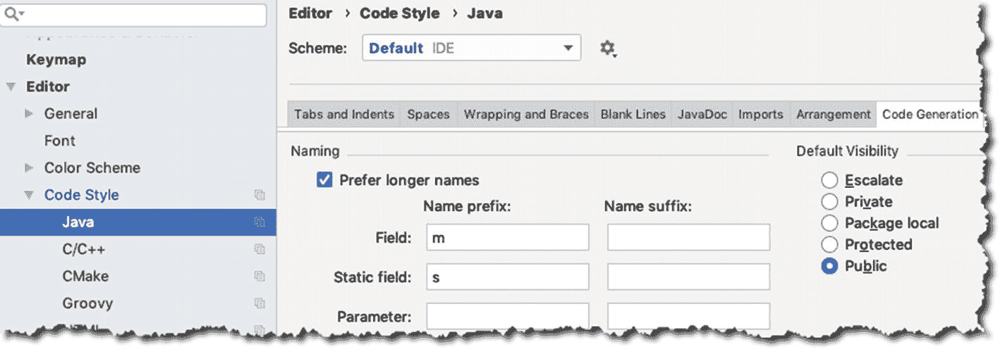  
图 13-7. 代码生成

在这里你可以告诉 `Android Studio` 你是如何命名变量的。如果你回到代码清单 13-1，你会注意到我喜欢给变量添加 `m` 前缀，例如 `mLastname` 和 `mFirstname`；起初，`Android Studio` 并不知道这一点，这就是为什么当我为成员变量生成一些 getter 和 setter 时，它给了我 `setmLastname()` 而不是仅仅 `setLastname()`。

### 注释

给成员变量添加 `m` 前缀源自 AOSP（Android 开源项目）。我在这里使用它，是因为你会在网上读到的大量示例代码都采用这种约定。你可以在 [`https://bit.ly/styleguideaosp`](https://bit.ly/styleguideaosp) 进一步阅读相关内容。

为了告诉 `Android Studio` 我使用 `m` 作为变量前缀，我在**字段名称前缀**中填入了 `m`，如图 13-7 所示，然后点击了确定。

现在，如果我生成一些 getter 和 setter，我将得到更合适的方法名称。代码清单 13-2 展示了为 `PersonTest` 类重新生成的代码。

```
class PersonTest {
    String mFirstname;
    String mLastname;
    public String getFirstname() {
        return mFirstname;
    }
    public void setFirstname(String firstname) {
        mFirstname = firstname;
    }
    public String getLastname() {
        return mLastname;
    }
    public void setLastname(String lastname) {
        mLastname = lastname;
    }
    public PersonTest(String mFirstname, String mLastname) {
        this.mFirstname = mFirstname;
        this.mLastname = mLastname;
    }
}
```
代码清单 13-2. 重新生成的 PersonTest 类


## 实时模板

您可以在 Android Studio 中使用实时模板节省更多时间，如果您曾用过某些文本扩展器应用，就会发现它们的工作方式非常相似。基本思路是，当您键入一系列字符（例如 `datetoday`）时，编辑器会将其替换为当前实际日期的文本。

如果您过去曾做过一些 Android 编程，很可能至少犯过下面这个错误：

```
Toast.makeText(MainActivity.this, "no show");
```

这个错误很容易发现，但其他一些错误可能就没那么明显了。无论如何，实时模板可以帮助您避免这些麻烦事。实时模板是以代码补全选项形式显示的快捷方式；例如，尝试在 `OnClick` 处理器（或任何事件处理器）中键入 `fbc`，如图 13-8 所示。

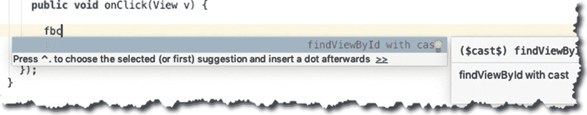

图 13-8.

实时模板示例

您会看到代码补全选项。按下 `Tab` 键，看看会发生什么。

表 13-1 列出了一些常见的内置模板。

表 13-1.

常用实时模板

| 缩写 | 描述 | 代码 |
| --- | --- | --- |
| `fbc` | 通过强制类型转换查找视图 ID | `($cast$) findViewById(R.id.$resId$);` |
| `const` | 定义 Android 风格常量 | `private static final int $name$ = $value$;` |
| `Toast` | 创建一个新的 Toast | `Toast.makeText($classname$.this, "$text$").show();` |
| `fori` | 创建一个 for 循环 | `for(int $INDEX$ = 0;$INDEX$<$LIMIT$;$INDEX++$ ) {``$END$``}` |

请务必查看其他实时模板。转到“设置”或“偏好设置”窗口。如果您使用的是 Windows 或 Linux，请进入主菜单栏并选择 **文件** ➤ **设置** ➤ **编辑器** ➤ **实时模板**；如果您使用的是 macOS，请进入 **Android Studio** ➤ **偏好设置** ➤ **编辑器** ➤ **实时模板**。您甚至可以在那里创建自己的实时模板。

## 重要键盘快捷键

Android 开发者网站维护了一个页面，您可以在其中找到 Android Studio 的键盘快捷键：[`http://bit.ly/androidstudiokbshortcuts`](http://bit.ly/androidstudiokbshortcuts)。您确实应该认真阅读这个页面；但在结束本章之前，我想为您介绍六个我觉得非常有用的快捷键。表 13-2 列出了这些快捷键。

表 13-2.

一些有用的键盘快捷键

| 快捷键 | 功能 |
| --- | --- |
| 按 `Shift` 两次 | 允许您在任何地方搜索某个词条。它会搜索 `assets` 文件夹、Gradle 文件、图片、资源、代码、XML 配置文件等。如果您不确定要搜索哪个文件夹，只需使用此功能即可。 |
| `Ctrl + Space \| Command + Space` | Android Studio 已有代码补全和代码提示功能；这只是额外的一点补充。如果您忘记了某个包含大量参数的方法的参数，可以使用此快捷键预览该方法的所有变体及其对应的预期参数。 |
| `Alt + Insert \| Command + N` | 您在上一节生成代码时使用过此功能。这是代码生成器的快捷键。 |
| `Ctrl + O \| Command + O` | 当您想要重写方法时，使用此快捷键。 |
| `Ctrl + - \| Command + -` | 您可以使用这些快捷键展开或折叠代码块。在处理大型代码库时，能够折叠代码非常方便。当您折叠/展开代码块时，这些快捷键能让您的工作更轻松一些。 |
| `Ctrl + Alt + L \| Command + Option + L` | 不要手动缩进或重新缩进您的代码。如果您搞乱了 `for` 循环或嵌套条件块的缩进，只需选中该代码块并使用此快捷键即可。 |

## 章节总结

*   您可以使用代码生成器来避免编写样板代码，例如构造函数、getter 和 setter。

*   Android Studio 拥有大量重构辅助工具。在使用“查找/替换”菜单之前，请考虑使用重构选项。

*   实时模板类似于文本扩展器；它们可以节省您的时间，并帮助您避免常见的编码错误。您应该使用它们。

*   您可以控制 Android Studio 编辑器的行为方式。转到“设置”或“偏好设置”，然后进入 **编辑器** ➤ **代码风格**。

# 索引

## A, B, C

Android 构建流程
Android 开发工具 (ADT)
Android 项目开发活动，创建
Android 应用，创建活动详情
`MyApplication` 启动画面
SDK 类创建接口创建重写方法
运行项目
Android Studio AVD 配置通道对话框 SDK 平台工具
`HAXM` `KVM` 设置 Linux macOS 系统要求
Android Studio Profiler
见 Profiler
Android 支持库
Android 虚拟设备 (AVD)
用于发布的应用活动
配置 `developer.android.com`
Google 账户
Google Play 控制台启动注册密钥库对话框条目和描述素材和资源可发布的应用签名的 APK 签名的 Bundle/APK 屏幕
`assertEquals()` 方法

## D

调试调试器断点单步执行逻辑错误运行时错误语法错误

## E

Energy profiler 警报作业唤醒锁
Espresso 操作
`BoundedMatcher` `CursorMatcher` `LayoutMatcher` `PreferenceMatcher` `RootMatcher` 测试，录制
`ViewMatcher`

## F

`factorial()` 方法

## G, H

Git 偏好设置仓库添加文件
Bitbucket 仓库提交更改创建详情登录拉取更改推送提交远程地址远程设置版本控制集成
GitHub 登录打开克隆仓库仓库页面欢迎屏幕偏好设置共享描述初始提交文件 `.gitignore` 导入到版本控制私有远程仓库名称工具窗口变量更新添加文件提交目录提交并推送更改
Gradle 文件依赖指令 jar 库模块模块级项目结构同步项目

## I

仪器化测试
集成开发环境 (IDE) 代码风格主编辑器无干扰模式文件类型布局设计工具布局文件 TODO 项目工具窗口部分偏好设置/设置项目工具窗口
SDK 管理器

## J

Jetpack 组件架构行为基础 UI 导航
Android 组件 `build.gradle` 文件连接一对一编辑器片段图 `NavHost` `navigate()` 方法使用 AndroidX 工件的项目资源文件
JUnit
JVM 测试

## K

基于内核的虚拟机 (KVM)
键盘快捷键

## L

生命周期感知组件 `build.gradle` 文件类词汇
LiveData 注意事项数据流 `MainActivity` 代码 `onChanged()` 方法 `RandomNumber` 示例带 LiveData 的 `ViewModel`
逻辑错误

## M

Memory profiler 分配跟踪器实例视图 Java 堆内存视图引用选项卡

## N

导航活动工作流程组件缺点片段
Jetpack
见 Jetpack，导航启动活动传递数据到活动屏幕管理
Network profiler

## O

`onClick()` 方法
重写方法

## P, Q

生产力特性代码生成器编码样式导入示例重构
Profiler CPU 利用率编辑配置检查线程记录配置记录会话 Energy profiler Memory profiler

## R

重构
Room 优势组件数据访问对象 `databaseBuilder()` 方法 `Database` 持有者依赖 `Entity` `MainActivity`
运行时错误

## S

SDK 管理器
语法错误

## T

`tearDown()` 方法
测试驱动开发 (TDD)
`TextView`

## U

单元测试断言方法 `assertEquals()` `Factorialtest`，创建 JVM 测试 *vs.* 仪器化测试运行 TDD

## V

`ViewModel` 实现布局代码 `onCreate()` 方法 `RandomNumber` 类随机数生成器 `ViewModelProviders`

## W, X, Y, Z

唤醒锁机制
