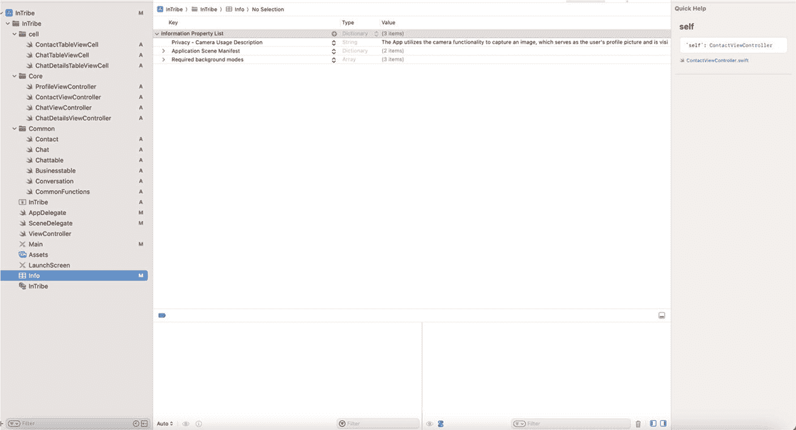

# 用于保存和检索用户个人资料图片的模态类 Profile

在这个模态类中，我们将把用户图片作为 `CKAsset` 对象保存到 iCloud 存储库中。我们还将检索用户的所有联系人，并将联系人头像和姓名存储到类型为 `Profile` 类的数组中。

```
import UIKit
import CloudKit
class Profile: NSObject {
```

我们导入了两个 Xcode 工具包：`UIKit` 用于所有生命周期和 UI 对象的包含，以及 `CloudKit` 用于所有 iCloud 持久化和数据存储。接下来，我们定义 `NSObject` 类 `Profile`，该类将定义个人资料对象以及所有相关的数据库操作方法。

```
let group = DispatchGroup()
let syncQueue = DispatchQueue(label: "com.domain.app.sections")
```

我们定义了一个名为 `group` 的常量，它存储了一个名为 `DispatchGroup` 的同步对象的实例化对象。

接下来，我们实例化一个类型为 `DispatchQueue` 的对象，并将其存储在名为 `syncQueue` 的常量中。该队列的名称为 `com.domain.app.sections`。这将帮助我们按顺序串行处理多个异步调用。

```
class Profile:NSObject{
var record:CKRecord!
var userid:String!
var personalprofile:CKAsset!
var name: String!
var personalphone:String!
init(userid:String, personalprofile:CKAsset, name:String,  personalphone: String) {
self.userid = userid
self.personalprofile = personalprofile
self.name = name
self.personalphone = personalphone
}
}
```

这是我们自定义的 `Profile` 对象。该类的属性模拟了 iCloud 存储库中的 profile 表。除了个人资料图片外，我们还定义了其他一些属性；为简化代码起见，我们没有将这些元素包含在我们的个人资料捕获屏幕中。同时，`init` 方法允许用户使用默认值实例化 `Profile` 类的对象。当我们在“创建个人资料视图控制器”中创建 profile 对象时，我们使用了 `init` 函数将所有必要数据存储到对象中，准备好保存到存储库。

```
var profile:Profile?
var profiles:[Profile] = []
```

我们定义了 `Profile` 类的两个变量。第一个变量 `profile` 将存储单个 profile 对象，第二个变量 `profiles` 将存储一个 profile 对象数组。后者非常重要，正如你将在后面看到的展示视图控制器中那样，它用于检索并显示用户拥有的所有联系人。

```
func saveProfile(profile:Profile){
```

如果你还记得，`saveProfile` 是在“创建个人资料视图控制器”中使用 profile 对象调用的。这就是该方法的定义。你将在后续几行中看到我们如何将其保存到 iCloud 存储库。

```
let publicDatabase = CKContainer.default().publicCloudDatabase
let aRecord = CKRecord(recordType: "profile")
```

```
aRecord["userid"] = profile.userid
aRecord["personalprofile"] = profile.personalprofile
aRecord["name"] = profile.name
aRecord["personalphone"] = profile.personalphone
```

以下是这段代码块中的关键元素：

*   定义一个常量来保存公共云数据库的引用。
*   定义一个常量来保存 iCloud 表（记录类型）`profile` 的引用。
*   将用户提供的值分配给 iCloud profile 的相应字段。需要注意的是，数据类型必须正确匹配，否则将导致运行时错误。例如，`personalprofile` 的类型是 `CKAsset`。

```
publicDatabase.save(aRecord, completionHandler: { (record, error) -> Void in
DispatchQueue.main.async {
if let error = error {
print(error)
}
else {
self.syncQueue.async {
self.profile = Profile(userid: record!.object(forKey: "userid")! as! String, personalprofile: record!.object(forKey: "personalprofile")! as! CKAsset, name: record!.object(forKey: "name")! as! String, personalphone: record!.object(forKey: "personalphone")! as! String)
self.profile?.record = record
self.group.leave()
}
}
}
})
}
```

现在我们已经定义了记录，接下来将尝试保存它。以下是这段代码块中需要注意的关键点：

*   我们在公共数据库常量上调用 `save` 方法；该方法接收一个 `CKRecord` 类型（要存储的记录）的引用，并有一个完成处理程序，返回保存后的记录或错误。
*   所有 iCloud 方法都是异步的；因此，我们在主线程上将其作为异步进程运行。
*   完成后，如果出现错误，将在控制台打印该错误。
*   否则，我们将存储的记录检索到本地变量 `profile` 中，并离开线程以通知调用函数操作已成功完成。

```
func getContacts(businessType:String) {
```

`getContacts` 方法检索当前用户的所有联系人。它接受一个名为 `businessType` 的参数，用于构建条件边界，以检索特定业务类型的用户联系人。

```
profiles.removeAll()
```

之前定义的变量 `profiles` 可以存储一个联系人数组。我们移除所有数据以确保该数组对象为空。

```
let pred = NSPredicate(format: "businessType == %@", businessType)
let query = CKQuery(recordType: "profile", predicate: pred)
let operation = CKQueryOperation(query: query)
```

上述代码块中的关键元素如下：

*   `NSPredicate` 帮助我们定义查询条件。在我们的例子中，我们指示它获取所有业务类型等于用户提供的业务类型的联系人。
*   接下来，我们定义一个 `CKQuery`，该查询将我们的谓词作为输入，同时指定需要执行查询的记录类型名称。
*   然后，我们定义 `CKQueryOperation` 来执行我们的查询。

```
let operationConfiguration = CKOperation.Configuration()
operationConfiguration.timeoutIntervalForRequest = 10
operationConfiguration.timeoutIntervalForResource = 10
operation.configuration = operationConfiguration
```

以下是这段代码块中的关键点：

*   定义 `CKOperation.Configuration` 是可选的。我们定义它是为了设置超时间隔，以便查询在特定时间后无响应时可以退出。
*   `timeoutIntervalForRequest` 属性决定了查询完成的请求超时间隔（以秒为单位）。在我们的示例中，任务将等待 10 秒以便额外数据到达，然后放弃。
*   `timeoutIntervalForResource` 属性决定了资源检索完成的请求超时间隔（以秒为单位）。在我们的示例中，任务将等待 10 秒以便额外数据到达，然后放弃。
*   我们创建的操作配置对象现在被分配给我们之前定义的 `operation` 对象。

```
CKContainer.default().publicCloudDatabase.add(operation)
```

现在我们将此操作添加到我们的公共云中。这将以异步模式执行查询。

```
operation.recordMatchedBlock = { recordID, result in
switch result {
case .success(let record):
let profile = Profile(userid: record["userid"] as! String, personalprofile: record["personalprofile"] as! CKAsset, name: record["name"] as! String, personalphone: record["personalphone"] as! String)
profile.record = record
self.profiles.append(profile)
case .failure(let error):
print(error.localizedDescription)
// 处理表不存在或出现错误的情况
}
}
```

以下是这段代码块的关键元素：

*   当查询完成时，会调用 `recordMatchedBlock`。它有两个参数：`recordID` 和一个结果集。
*   结果包含一个成功块和一个失败块，然后我们对其使用 switch 结构形成条件分支。
*   如果是成功情况，我们检索值并将其存储到 `profiles` 数组中。请注意，此块会像游标一样重复执行，直到所有记录处理完毕。
*   如果失败，我们将在控制台打印错误信息。


`operation.queryResultBlock` = `{ result in
    DispatchQueue.main.async {
        switch result {
    case .failure(let error):
        debugPrint(error)
        // 处理查询结果失败的情况
        self.profileExists = false
        self.syncQueue.async {
            self.group.leave()
        }
    case .success(_):
        // 处理查询结果成功的情况
        self.syncQueue.async {
            self.group.leave()
        }
    }
    }
}`

这个`queryResultBlock`会在`recordMatchedBlock`迭代完成且成功后执行，然后返回给调用函数。

**`Contact`模态类的完整代码如下：**

```
import UIKit
import CloudKit

class Contact: NSObject {
    let group = DispatchGroup()
    let syncQueue = DispatchQueue(label: "com.domain.app.sections")
    
    class Profile: NSObject {
        var record: CKRecord!
        var userid: String!
        var personalprofile: CKAsset!
        var name: String!
        var personalphone: String!
        var businessprofile: CKAsset!
        
        init(userid: String, personalprofile: CKAsset, name: String, personalphone: String) {
            self.userid = userid
            self.personalprofile = personalprofile
            self.name = name
            self.personalphone = personalphone
        }
    }
    
    var profile: Profile?
    var profiles: [Profile] = []
    
    func getContacts(businessType: String) {
        profiles.removeAll()
        let pred = NSPredicate(format: "businesstype == %@", businessType)
        let query = CKQuery(recordType: "profile", predicate: pred)
        let operation = CKQueryOperation(query: query)
        let operationConfiguration = CKOperation.Configuration()
        operationConfiguration.timeoutIntervalForRequest = 10
        operationConfiguration.timeoutIntervalForResource = 10
        operation.configuration = operationConfiguration
        CKContainer.default().publicCloudDatabase.add(operation)
        
        operation.recordMatchedBlock = { recordID, result in
            switch result {
            case .success(let record):
                let profile = Profile(
                    userid: record["userid"] as! String,
                    personalprofile: record["personalprofile"] as! CKAsset,
                    name: record["name"] as! String,
                    personalphone: record["personalphone"] as! String
                )
                profile.record = record
                self.profiles.append(profile)
            case .failure(let error):
                print(error.localizedDescription)
            }
        }
        
        operation.queryResultBlock = { result in
            DispatchQueue.main.async {
                switch result {
                case .failure(let error):
                    debugPrint(error)
                    self.syncQueue.async {
                        self.group.leave()
                    }
                case .success(_):
                    // 处理查询结果成功的情况
                    self.syncQueue.async {
                        self.group.leave()
                    }
                }
            }
        }
    }
    
    func saveProfile(profile: Profile) {
        let publicDatabase = CKContainer.default().publicCloudDatabase
        let aRecord = CKRecord(recordType: "profile")
        aRecord["userid"] = profile.userid
        aRecord["personalprofile"] = profile.personalprofile
        aRecord["name"] = profile.name
        aRecord["personalphone"] = profile.personalphone
        
        publicDatabase.save(aRecord, completionHandler: { (record, error) -> Void in
            DispatchQueue.main.async {
                if let error = error {
                    print(error)
                } else {
                    self.syncQueue.async {
                        self.profile = Profile(
                            userid: record!.object(forKey: "userid")! as! String,
                            personalprofile: record!.object(forKey: "personalprofile")! as! CKAsset,
                            name: record!.object(forKey: "name")! as! String,
                            personalphone: record!.object(forKey: "personalphone")! as! String
                        )
                        self.profile?.record = record
                        self.group.leave()
                    }
                }
            }
        })
    }
}
```

### 用于显示图片的视图控制器

在该视图控制器中，我们将显示从 iCloud 数据库中检索到的图片。

```
import UIKit

class ProfileDisplayViewController: UIViewController, UITableViewDelegate, UITableViewDataSource {
```

在上述代码块中，我们导入了 Xcode 工具包 `UIKit`，用于包含所有生命周期和 UI 对象。接下来，我们定义了一个 UI 视图控制器类 `ProfileDisplayViewController`，它将在一个表格视图中显示用户的所有联系人。我们还将定义一个自定义单元格，以类似 WhatsApp 的显示方式，将圆形联系人图像和联系人名称并排显示。注意，我们扩展了该类以包含表格委托和数据源。

```
var contact = Contact()
var profile: Contact.Profile?
```

定义了一个变量 `contact`，类型为我们的模态类 `Contact`，以及一个用于保存 `Contact` 类中定义的 `Profile` 对象的变量。

```
private let contactTableView: UITableView = {
    let tableView = UITableView()
    tableView.translatesAutoresizingMaskIntoConstraints = false
    tableView.backgroundColor = .white
    tableView.isScrollEnabled = true
    return tableView
}()
```

用于在表格中显示联系人的表格视图如下所示：

```
override func viewWillAppear(_ animated: Bool) {
    super.viewWillAppear(true)
    getContacts()
}
```

我们使用 `viewWillAppear` 生命周期方法来执行获取所有联系人的操作，以便在表格视图中显示它们。

```
func setup(){
    contactTableView.delegate = self
    contactTableView.dataSource = self
    contactTableView.register(ContactTableViewCell.self, forCellReuseIdentifier: "contact")
    contactTableView.layer.borderWidth = 0
    contactTableView.layer.borderColor = UIColor.white.cgColor
    contactTableView.separatorStyle = .singleLine
    contactTableView.isHidden = false
}
```

`setup()` 函数定义了以下内容：

- 将表格委托和数据源设置为 `self`
- 向表格注册一个名为 `ContactTableViewCell` 的自定义单元格
- 设置表格的一些设计元素

```
func drawScreen(){
    let screensize: CGRect = UIScreen.main.bounds
    let screenWidth = screensize.width
    let screenHeight = screensize.height
    view.addSubview(contactTableView)
    let constraints = [
        contactTableView.topAnchor.constraint(equalTo: view.topAnchor, constant: 5),
        contactTableView.leftAnchor.constraint(equalTo: view.leftAnchor, constant: 5),
        contactTableView.widthAnchor.constraint(equalToConstant: screenWidth - 10),
        contactTableView.heightAnchor.constraint(equalToConstant: screenHeight - 50)
    ]
    NSLayoutConstraint.activate(constraints)
}
```

此函数在屏幕上绘制表格。我们首先获取当前屏幕的宽度和高度，然后根据屏幕尺寸，让表格占据除四周留出少量边距外的整个屏幕。

```
func getContacts(){
    self.contact.group.enter()
    self.contact.getContacts(businessType: businessTypeTextField.text!)
    self.contact.group.notify(queue: .main) { [self] in
        contact.profiles = contact.profiles.filter{
            contact in return contact.userid != profile?.userid
        }
        setup()
        drawScreen()
        contactTableView.reloadData()
    }
}
```

`getContacts` 方法调用模态类 `Contact` 的 `getContacts` 方法，根据用户的企业类型检索所有联系人。请注意，企业类型假设是一个 UI 文本字段，本例中未定义。异步方法完成后，它将调用 `setup()` 函数进行表格对象的初始声明，并调用 `drawScreen()` 在屏幕上绘制表格。

```
func tableView(_ tableView: UITableView, numberOfRowsInSection section: Int) -> Int {
    return contact.profiles.count
}
```

表格视图有一些必须实现的预定义方法。此函数告诉表格视图有多少条记录。


`func tableView(_ tableView: UITableView, cellForRowAt indexPath: IndexPath) -> UITableViewCell {  
let cell = tableView.dequeueReusableCell(withIdentifier: "contact", for: indexPath) as! ContactTableViewCell  
let file = self.contact.profiles[indexPath.row].personalprofile.fileURL  
if let data = NSData(contentsOf: file!) {  
cell.profileImageView.image = UIImage(data: data as Data)  
}  
cell.profileImageView.layer.cornerRadius =  60  
cell.nameButton.setTitle(self.contact.profiles[indexPath.row].name.capitalized, for: .normal)  
return cell  
}`

这个系统定义的表视图函数会在表格行中显示姓名和联系人信息。此过程将对所有记录重复执行。以下是该函数的一些关键说明：

-   定义对自定义单元格的引用。
-   对于图片，我们通过 `CKAsset` 对象的 `fileURL` 获取文件内容，并将其存储在常量 `file` 中。
-   如果文件中存在数据，则使用 UI 图像数据构造函数传递数据，并在自定义单元格的 `UIImageView` 图像对象中渲染该图像。
-   自定义单元格提供了一个标签对象，用于设置联系人的姓名。

```
func tableView(_ tableView: UITableView, heightForRowAt indexPath: IndexPath) -> CGFloat {
return 155
}
```

这也是一个系统定义的表视图函数，用于定义单元格的宽度。

**下面给出了个人资料显示类的完整代码：**

```
import UIKit
class ContactViewController: UIViewController, UITableViewDelegate, UITableViewDataSource {
var contact = Contact()
var profile:Contact.Profile?
private let contactTableView:UITableView = {
let tableView = UITableView()
tableView.translatesAutoresizingMaskIntoConstraints = false
tableView.backgroundColor = .white
tableView.isScrollEnabled = true
return tableView
}()
override func viewWillAppear(_ animated: Bool) {
super.viewWillAppear(true)
getContacts()
}
func setup(){
contactTableView.delegate = self
contactTableView.dataSource = self
contactTableView.register(ContactTableViewCell.self, forCellReuseIdentifier: "contact")
contactTableView.layer.borderWidth = 0
contactTableView.layer.borderColor = UIColor.white.cgColor
contactTableView.separatorStyle = .singleLine
contactTableView.isHidden = true
}
func drawScreen(){
let screensize: CGRect = UIScreen.main.bounds
let screenWidth = screensize.width
let screenHeight = screensize.height
view.addSubview(contactTableView)
let constraints = [
contactTableView.topAnchor.constraint(equalTo: view.topAnchor, constant: 0),
contactTableView.leftAnchor.constraint(equalTo: view.leftAnchor, constant: 5),
contactTableView.widthAnchor.constraint(equalToConstant: screenWidth - 10),
contactTableView.heightAnchor.constraint(equalToConstant: screenHeight - 50)
]
NSLayoutConstraint.activate(constraints)
}
getContacts(){
self.contact.group.enter()
self.contact.getContacts(businessType: businessTypeTextField.text!)
self.contact.group.notify(queue: .main) { [self] in
contact.profiles = contact.profiles.filter{
contact in return contact.userid != profile?.userid
}
setup()
drawScreen()
contactTableView.reloadData()
}
}
func tableView(_ tableView: UITableView, numberOfRowsInSection section: Int) -> Int {
return contact.profiles.count
}
func tableView(_ tableView: UITableView, cellForRowAt indexPath: IndexPath) -> UITableViewCell {
let cell = tableView.dequeueReusableCell(withIdentifier: "contact", for: indexPath) as! ContactTableViewCell
let file = self.contact.profiles[indexPath.row].businessprofile.fileURL
if let data = NSData(contentsOf: file!) {
cell.profileImageView.image = UIImage(data: data as Data)
}
cell.profileImageView.layer.cornerRadius =  60
cell.nameButton.setTitle(self.contact.profiles[indexPath.row].name.capitalized, for: .normal)
return cell
}
}
func tableView(_ tableView: UITableView, heightForRowAt indexPath: IndexPath) -> CGFloat {
return 155
}
}
```

### 定义自定义表格单元格

为了在表格中显示联系人，我们将定义一个自定义表格单元格。该自定义单元格会以圆形图片的形式显示联系人，并在其旁边的一行中显示联系人姓名。

```
import UIKit
class ContactTableViewCell: UITableViewCell {
```

我们导入 `UIKit` 以便访问所有生命周期方法和 UI 对象。现在定义一个 `UITableViewCell` 类，在其中定义自定义图片和标题的显示内容。

```
var profileImageView: UIImageView = {
let imageView = UIImageView()
imageView.image = UIImage(systemName: "person.fill")
imageView.contentMode = .scaleAspectFit
imageView.translatesAutoresizingMaskIntoConstraints = false
imageView.layer.masksToBounds = true
imageView.layer.borderWidth = 1
imageView.layer.borderColor = UIColor.systemGray.cgColor
return imageView
}()
```

这是一个 `UIImageView` 对象，用于在单元格行中显示联系人图片。

```
let nameButton:UIButton = {
let uiButton  = UIButton()
uiButton.translatesAutoresizingMaskIntoConstraints = false
uiButton.setTitleColor(UIColor.black, for: .normal)
uiButton.contentHorizontalAlignment = .left
uiButton.contentVerticalAlignment = .top
uiButton.titleLabel?.font = UIFont.systemFont(ofSize: 20, weight: .semibold)
return uiButton
}()
```

这是一个 UI 按钮对象，用于在单元格行中显示姓名。

```
override func awakeFromNib() {
super.awakeFromNib()
}
```

这是一个生命周期方法，在从故事板或 nib 文件加载单元格时被调用。在此代码中该方法为空，但你可以根据需要使用它来执行额外的设置。

```
override func setSelected(_ selected: Bool, animated: Bool) {
super.setSelected(selected, animated: animated)
let screensize: CGRect = UIScreen.main.bounds
let screenWidth = screensize.width
contentView.addSubview(profileImageView)
let constraints = [
profileImageView.topAnchor.constraint(equalTo: contentView.topAnchor, constant: 5),
profileImageView.leftAnchor.constraint(equalTo: contentView.leftAnchor, constant: 5),
profileImageView.widthAnchor.constraint(equalToConstant: 120),
profileImageView.heightAnchor.constraint(equalToConstant: 120)
]
NSLayoutConstraint.activate(constraints)
contentView.addSubview(nameButton)
let constraints1 = [
nameButton.topAnchor.constraint(equalTo: contentView.topAnchor, constant: 5),
nameButton.leftAnchor.constraint(equalTo: profileImageView.rightAnchor, constant: 5),
nameButton.widthAnchor.constraint(equalToConstant: screenWidth),
nameButton.heightAnchor.constraint(equalToConstant: 20)
]
NSLayoutConstraint.activate(constraints1)
}
}
```

这是生命周期框架的一部分，在单元格的选择状态发生变化时被调用。此处重写该方法是为了添加 UI 元素。在这段代码中，我们将图片视图和标题按钮并排添加。

**下面给出了表格单元格的完整代码：**


```swift
import UIKit
class ContactTableViewCell: UITableViewCell {
var profileImageView: UIImageView = {
let imageView = UIImageView()
imageView.image = UIImage(systemName: "person.fill")
imageView.contentMode = .scaleAspectFit
imageView.translatesAutoresizingMaskIntoConstraints = false
imageView.layer.masksToBounds = true
imageView.layer.borderWidth = 1
imageView.layer.borderColor = UIColor.systemGray.cgColor
return imageView
}()
let nameButton:UIButton = {
let uiButton  = UIButton()
uiButton.translatesAutoresizingMaskIntoConstraints = false
uiButton.setTitleColor(UIColor.black, for: .normal)
uiButton.contentHorizontalAlignment = .left
uiButton.contentVerticalAlignment = .top
uiButton.titleLabel?.font = UIFont.systemFont(ofSize: 20, weight: .semibold)
return uiButton
}()
override func awakeFromNib() {
super.awakeFromNib()
}
override func setSelected(_ selected: Bool, animated: Bool) {
super.setSelected(selected, animated: animated)
let screensize: CGRect = UIScreen.main.bounds
let screenWidth = screensize.width
contentView.addSubview(profileImageView)
let constraints = [
profileImageView.topAnchor.constraint(equalTo: contentView.topAnchor, constant: 5),
profileImageView.leftAnchor.constraint(equalTo: contentView.leftAnchor, constant: 5),
profileImageView.widthAnchor.constraint(equalToConstant: 120),
profileImageView.heightAnchor.constraint(equalToConstant: 120)
]
NSLayoutConstraint.activate(constraints)
contentView.addSubview(nameButton)
let constraints1 = [
nameButton.topAnchor.constraint(equalTo: contentView.topAnchor, constant: 5),
nameButton.leftAnchor.constraint(equalTo: profileImageView.rightAnchor, constant: 5),
nameButton.widthAnchor.constraint(equalToConstant: screenWidth),
nameButton.heightAnchor.constraint(equalToConstant: 20)
]
NSLayoutConstraint.activate(constraints1)
}
}
```

### 启用对照片库和相机的访问

要访问照片库和相机，我们的代码需要征得用户许可。为此，我们需要在 `info.plist` 中设置某些属性。缺少这些设置，代码将无法运行。请按照以下步骤操作。

*   在 Xcode 导航器中，找到 `info.plist`。



*   添加一个属性“Privacy - Camera Usage Description”。

*   在值字段中，添加你的提示信息。在我们的示例中，我添加了以下文本：“该应用使用相机功能来拍摄图像，该图像将作为用户的个人资料图片，并对其他用户可见。”

*   构建并运行你的项目

## 下拉列表

下拉列表是 iOS 应用开发者在设计数据输入表单时非常实用的功能。在本章中，我们将设计一个具有以下功能的下拉列表：

*   定义一个文本输入框，并在其左侧添加一个图标。

*   定义点击文本输入框内部的事件以触发下拉功能。

*   当用户点击时，一个隐藏的表格会弹出，该表格对齐显示在文本输入框的正下方，并包含所有所需的值。

*   用户也可以直接在文本框中输入，输入内容将动态地缩短或扩展列表。

*   当用户从列表中选择所需的值后，表格会隐藏，所选值会显示在文本输入框中。

在我们的示例中，我们假设有一个业务类型列表，用户可以在创建个人资料时从中选择以指明其业务类型。以下是关键元素：

*   定义一个继承自 `NSObject` 的 `Business` 类，该类将包含所有业务类型的属性和方法。

*   定义一个名为 `CreateProfileViewController` 的 UI 视图控制器来演示下拉列表功能。

*   定义一个名为 `businessTypeTextField` 的文本输入框及其关联方法，用户可以在其中输入所需的业务类型，下拉列表将随之出现。

*   定义一个名为 `businessTypeTableView` 的表格视图及其关联方法，该表格将显示一个预填充的业务类型列表。

### 定义 Business 类

`Business` 类将包含定义业务类型的所有属性，以及一个用于设置值的初始化方法。以下代码定义了该类及其初始化方法：

```
import UIKit
class Business: NSObject{
var businesstype:String!
var businessdesc:String!
var imagename:String!
init(businesstype:String, businessdesc:String, imagename:String) {
self.businesstype = businesstype
self.businessdesc = businessdesc
self.imagename = imagename
}
}
```

该类名为 `Business`，包含三个属性：业务类型（`businesstype`）、业务描述（`businessdesc`）以及一个用于标识业务类型的图片名称（`imagename`）。

该类还定义了一个系统提供的 `init` 方法，用于初始化实例化对象的值。


### 定义 `CreateProfileViewController`

该类将用于创建用户个人资料。虽然用户个人资料会包含许多属性，例如姓名、个人头像和电话号码，但在本例中，我们只专注于创建业务类型下拉列表。请跟随代码学习如何使用文本字段和表格视图创建动态下拉列表。

```
class CreateProfileViewController: UIViewController, UITableViewDelegate, UITableViewDataSource, UITextFieldDelegate {
```

上述代码创建了一个名为 `CreateProfileViewController` 的视图控制器类。我们扩展了以下委托：

*   `UIViewController`：用于处理 UI 视图控制器的生命周期方法。
*   `UITableViewDelegate` 和 `UITableViewDataSource`：用于处理所有表格功能。用于展示包含所有业务类型值的表格。
*   `UITextFieldDelegate`：用于处理所有 UI 文本字段事件函数，以便根据用户输入显示和填充业务类型。

```
let businessTypeTextField:UITextField = {
let textField = UITextField()
textField.translatesAutoresizingMaskIntoConstraints = false
textField.borderStyle = .roundedRect
textField.textColor = .black
textField.layer.borderColor  = UIColor.systemGray.cgColor
textField.layer.borderWidth = 1
textField.layer.cornerRadius = 5
textField.placeholder = "Select Business Type"
textField.textColor = .black
textField.isEnabled = true
textField.keyboardType = .default
return textField
}()
```

上述代码定义了一个名为 `businessTypeTextField` 的 UI 文本字段对象。该文本字段附加了某些属性，例如文本颜色设置为黑色，边框颜色设置为灰色且宽度为 1 点，以及使边角弯曲的效果（`cornerRadius`）。该文本字段还设置了初始占位符值，并使用默认的 QWERTY 键盘。

```
private let businessTypeTableView:UITableView = {
let tableView = UITableView()
tableView.translatesAutoresizingMaskIntoConstraints = false
tableView.backgroundColor = .white
tableView.isScrollEnabled = true
return tableView
}()
```

上述代码定义了一个名为 `businessTypeTableView` 的 `UITableView`。由于我们会拥有很多业务类型，因此启用了滚动（将 `isScrollEnabled` 设置为 true）。

```
override func viewDidLoad() {
super.viewDidLoad()
setup()
drawProfileCreationScreen()
}
```

上述代码是 UI 视图控制器的生命周期方法。`viewDidLoad` 是第一个被调用的函数。我们从该函数中调用了两个自定义函数：`setup()` 函数用于初始化一些变量并设置一些方法，以及用于绘制屏幕的 `drawProfileCreationScreen()` 函数。

```
func setup(){
view.backgroundColor = .black
businessTypeTableView.delegate = self
businessTypeTableView.dataSource = self
businessTypeTableView.register(UITableViewCell.self, forCellReuseIdentifier: "business")
businessTypeTableView.layer.borderWidth = 0
businessTypeTableView.layer.borderColor = UIColor.white.cgColor
businessTypeTableView.separatorStyle = .none
businessTypeTableView.isHidden = true
businessTypeTextField.delegate = self
businessTypeTextField.leftView = UIImageView(image: UIImage(systemName: "plus"))
businessTypeTextField.leftViewMode = .always
businessTypeTextField.addTarget(self, action: #selector(businessTypeEditingChanged), for: .editingChanged)
businessTypeTextField.addTarget(self, action: #selector(businessTypeEditingDidBegin), for: .editingDidBegin)
businessTypeTextField.addTarget(self, action: #selector(businessTypeEditingDidEnd), for: .editingDidEnd)
setBusiness()
}
```

上述代码是 `setup()` 方法。在该函数中，我们执行了以下操作：

*   为业务类型表格视图设置委托和数据源。
*   将表格单元格设置为名为 `"business"` 的默认表格视图单元格。
*   设置表格的一些样式属性，例如边框宽度和颜色，并将表格显示状态设置为隐藏。
*   我们还设置了业务类型输入文本字段的委托，以便能够调用文本字段函数。
*   在文本框左侧添加了一个系统图标 `"+"`，为用户提供视觉提示，表明点击文本字段将显示下拉列表。
*   最后，我们添加了三个系统方法：第一个是 `businessTypeEditingChanged`，它将在用户编辑文本字段的值时被调用；第二个是 `editingDidBegin`，当用户首次开始在文本字段中输入内容时触发；第三个是 `editingDidEnd`，当焦点离开文本字段时执行。

```
var business:[Business] = []
var tempBusiness:[Business] = []
```

以上两个语句定义了 `Business` 类的数组。第一个数组将保存所有业务类型对象的详细信息，第二个数组是业务值的临时容器，用于根据用户搜索条件传递筛选后的业务类型列表。

```
func setBusiness(){
business.append(Business(businesstype: "Mortgage", businessdesc: "Provide Mortgage Solution", imagename: "scribble"))
business.append(Business(businesstype: "Insurance", businessdesc: "Provide Life/Health/Car/P&C Insurance", imagename: "folder"))
business.append(Business(businesstype: "Electrician", businessdesc: "Provide Household electrical solution", imagename: "doc.text"))
business.append(Business(businesstype: "Handyman", businessdesc: "Provide any household related work", imagename: "book"))
}
```

上面的函数向之前定义的 `business` 数组对象设置了一些业务类型值。请注意，为了保持代码简洁，我们仅存储了四个业务类型对象。

```
func drawProfileCreationScreen(){
let screensize: CGRect = UIScreen.main.bounds
let screenWidth = screensize.width
view.addSubview(businessTypeTextField)
let constraints5 = [
businessTypeTextField.topAnchor.constraint(equalTo: view.topAnchor, constant: 10),
businessTypeTextField.leftAnchor.constraint(equalTo: view.leftAnchor, constant: 5),
businessTypeTextField.widthAnchor.constraint(equalToConstant: screenWidth - 10),
businessTypeTextField.heightAnchor.constraint(equalToConstant: 40)
]
NSLayoutConstraint.activate(constraints5)
view.addSubview(businessTypeTableView)
let constraints6 = [
businessTypeTableView.topAnchor.constraint(equalTo: businessTypeTextField.bottomAnchor, constant: 0),
businessTypeTableView.leftAnchor.constraint(equalTo: view.leftAnchor, constant: 5),
businessTypeTableView.widthAnchor.constraint(equalToConstant: screenWidth - 10),
businessTypeTableView.heightAnchor.constraint(equalToConstant: 300)
]
NSLayoutConstraint.activate(constraints6)
}
```

上述方法在 `viewDidLoad()` 方法中调用 `setup()` 方法之后立即被调用。在此方法中，我们通过将文本字段放置在屏幕顶部，随后放置表格视图来绘制下拉屏幕，该表格视图在屏幕首次显示时将被隐藏。


### 表格视图方法

接下来的四个方法涉及表格视图函数。

```
func tableView(_ tableView: UITableView, numberOfRowsInSection section: Int) -> Int {
return business.count
}
```

上述方法告知表格视图控制器 `business` 对象所拥有的记录数量。当用户将焦点移至输入文本字段时，这将帮助表格视图遍历所有业务类型以在表格中显示。

```
func tableView(_ tableView: UITableView, cellForRowAt indexPath: IndexPath) -> UITableViewCell {
let cell = tableView.dequeueReusableCell(withIdentifier: "business", for: indexPath)
cell.textLabel?.text = business[indexPath.row].businesstype + " " + business[indexPath.row].businessdesc
return cell
}
```

上述代码通过遍历每个 `business` 对象来绘制表格。它使用默认的 UI 单元格表格视图，并将遍历到的 `business` 对象的业务类型和业务描述拼接在一起。

```
func tableView(_ tableView: UITableView, heightForRowAt indexPath: IndexPath) -> CGFloat {
return 40.0
}
```

上述代码是表格视图的第三个方法，它将每行显示的行高定义为 40 像素。

```
func tableView(_ tableView: UITableView, didSelectRowAt indexPath: IndexPath) {
businessTypeTextField.text = business[indexPath.row].businesstype
businessTypeTextField.resignFirstResponder()
}
```

上述代码是表格视图的最后一个代码块。当用户选择一行时，该函数会被调用。此时，我们将文本字段的值设置为用户选中的业务类型，并确保焦点从文本字段上移开。

#### 文本字段函数

接下来的三个函数是文本字段事件函数。当在文本字段上执行特定操作时，这些方法会被触发。

```
@objc func businessTypeEditingDidBegin(sender: UITextField){
tempBusiness = business
businessTypeTableView.isHidden = false
}
```

上述代码在用户开始输入时执行。此时，我们将整个 `business` 对象转移到一个名为 `tempBusiness` 的临时变量中。这是必要的，因为我们将对 `business` 对象进行筛选，使其仅包含与用户搜索条件匹配的对象。编辑完成后，我们会确保原始列表重新赋值给 `business` 对象，以便为下一次搜索做好准备。

同时，我们现在将业务类型表格视图设置为可见。

```
@objc func businessTypeEditingDidEnd(sender: UITextField){
business = tempBusiness
businessTypeTableView.isHidden = true
}
```

上述代码在编辑结束时执行。此时，我们将 `tempBusiness` 对象（包含业务类型对象的原始列表）转移回原始的 `business` 对象（以便为下一次搜索做好准备）。

同时，我们现在将业务类型表格视图设置为隐藏。

```
@objc func businessTypeEditingChanged(sender: UITextField){
business = business.filter{
business in return business.businesstype.trimmingCharacters(in: .whitespaces).lowercased().contains(sender.text!.lowercased())
}
if(sender.text == ""){
business = tempBusiness
}
businessTypeTableView.reloadData()
}
```

上述代码在用户每次向文本字段输入内容时执行。根据用户的输入，我们对 `business` 对象进行筛选。我们移除空格并将所有字符转为小写，以实现不区分大小写的搜索。一旦搜索开始，匹配的对象就会被转移到 `business` 对象中。

如果用户清空了所有文本，我们通过将 `tempBusiness` 对象的值赋给 `business` 对象，将原始列表重新赋值给 `business` 对象。

最后，通过刷新业务类型表格视图，我们重新加载表格，使其仅显示 `business` 对象中存储的缩减后的列表（注意，表格是根据 `business` 对象的值绘制的）。

### 下拉函数的完整代码

以下是上文讨论的下拉函数的完整代码。


```swift
import UIKit
class Business: NSObject{
    var businesstype: String!
    var businessdesc: String!
    var imagename: String!
    init(businesstype: String, businessdesc: String, imagename: String) {
        self.businesstype = businesstype
        self.businessdesc = businessdesc
        self.imagename = imagename
    }
}
class CreateProfileViewController: UIViewController, UITableViewDelegate, UITableViewDataSource, UITextFieldDelegate {
    let businessTypeTextField: UITextField = {
        let textField = UITextField()
        textField.translatesAutoresizingMaskIntoConstraints = false
        textField.borderStyle = .roundedRect
        textField.textColor = .black
        textField.layer.borderColor  = UIColor.systemGray.cgColor
        textField.layer.borderWidth = 1
        textField.layer.cornerRadius = 5
        textField.placeholder = "选择业务类型"
        textField.textColor = .black
        textField.isEnabled = true
        textField.keyboardType = .default
        return textField
    }()
    private let businessTypeTableView: UITableView = {
        let tableView = UITableView()
        tableView.translatesAutoresizingMaskIntoConstraints = false
        tableView.backgroundColor = .white
        tableView.isScrollEnabled = true
        return tableView
    }()
    override func viewDidLoad() {
        super.viewDidLoad()
        setup()
        drawProfileCreationScreen()
    }
    func setup(){
        view.backgroundColor = .black
        businessTypeTableView.delegate = self
        businessTypeTableView.dataSource = self
        businessTypeTableView.register(UITableViewCell.self, forCellReuseIdentifier: "business")
        businessTypeTableView.layer.borderWidth = 0
        businessTypeTableView.layer.borderColor = UIColor.white.cgColor
        businessTypeTableView.separatorStyle = .none
        businessTypeTableView.isHidden = true
        businessTypeTextField.delegate = self
        businessTypeTextField.leftView = UIImageView(image: UIImage(systemName: "plus"))
        businessTypeTextField.leftViewMode = .always
        businessTypeTextField.addTarget(self, action: #selector(businessTypeEditingChanged), for: .editingChanged)
        businessTypeTextField.addTarget(self, action: #selector(businessTypeEditingDidBegin), for: .editingDidBegin)
        businessTypeTextField.addTarget(self, action: #selector(businessTypeEditingDidEnd), for: .editingDidEnd)
        setBusiness()
    }
    var business: [Business] = []
    var tempBusiness: [Business] = []
    func setBusiness(){
        business.append(Business(businesstype: "抵押贷款", businessdesc: "提供抵押贷款解决方案", imagename: "scribble"))
        business.append(Business(businesstype: "保险", businessdesc: "提供人寿/健康/汽车/财产保险", imagename: "folder"))
        business.append(Business(businesstype: "电工", businessdesc: "提供家庭电气解决方案", imagename: "doc.text"))
        business.append(Business(businesstype: "杂工", businessdesc: "提供任何家庭相关工作", imagename: "book"))
    }
    func drawProfileCreationScreen(){
        let screensize: CGRect = UIScreen.main.bounds
        let screenWidth = screensize.width
        view.addSubview(businessTypeTextField)
        let constraints5 = [
            businessTypeTextField.topAnchor.constraint(equalTo: view.topAnchor, constant: 10),
            businessTypeTextField.leftAnchor.constraint(equalTo: view.leftAnchor, constant: 5),
            businessTypeTextField.widthAnchor.constraint(equalToConstant: screenWidth - 10),
            businessTypeTextField.heightAnchor.constraint(equalToConstant: 40)
        ]
        NSLayoutConstraint.activate(constraints5)
        view.addSubview(businessTypeTableView)
        let constraints6 = [
            businessTypeTableView.topAnchor.constraint(equalTo: businessTypeTextField.bottomAnchor, constant: 0),
            businessTypeTableView.leftAnchor.constraint(equalTo: view.leftAnchor, constant: 5),
            businessTypeTableView.widthAnchor.constraint(equalToConstant: screenWidth - 10),
            businessTypeTableView.heightAnchor.constraint(equalToConstant: 300)
        ]
        NSLayoutConstraint.activate(constraints6)
    }
    func tableView(_ tableView: UITableView, numberOfRowsInSection section: Int) -> Int {
        return business.count
    }
    func tableView(_ tableView: UITableView, cellForRowAt indexPath: IndexPath) -> UITableViewCell {
        let cell = tableView.dequeueReusableCell(withIdentifier: "business", for: indexPath)
        cell.textLabel?.text = business[indexPath.row].businesstype + " " + business[indexPath.row].businessdesc
        return cell
    }
    func tableView(_ tableView: UITableView, heightForRowAt indexPath: IndexPath) -> CGFloat {
        return 40.0
    }
    func tableView(_ tableView: UITableView, didSelectRowAt indexPath: IndexPath) {
        businessTypeTextField.text = business[indexPath.row].businesstype
        businessTypeTextField.resignFirstResponder()
    }
    @objc func businessTypeEditingDidBegin(sender: UITextField){
        tempBusiness = business
        businessTypeTableView.isHidden = false
    }
    @objc func businessTypeEditingDidEnd(sender: UITextField){
        business = tempBusiness
        businessTypeTableView.isHidden = true
    }
    @objc func businessTypeEditingChanged(sender: UITextField){
        business = business.filter{
            business in return business.businesstype.trimmingCharacters(in: .whitespaces).lowercased().contains(sender.text!.lowercased())
        }
        if(sender.text == ""){
            business = tempBusiness
        }
        businessTypeTableView.reloadData()
    }
}
```

