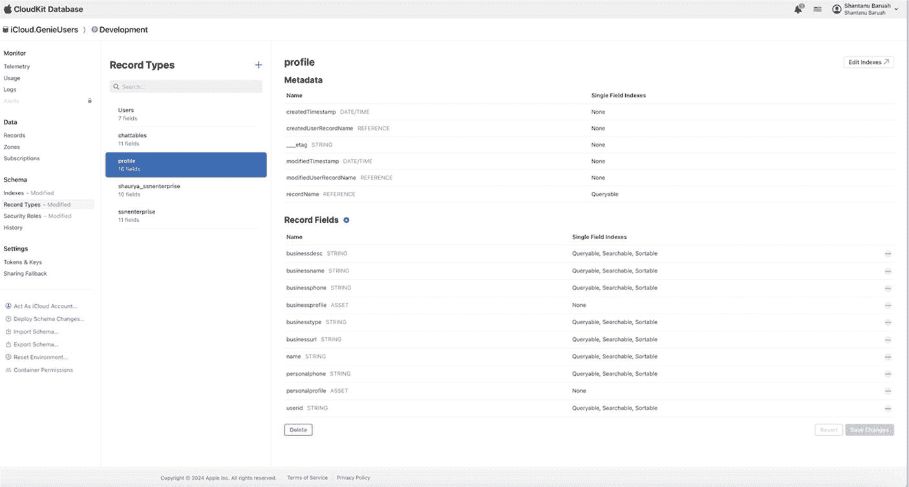
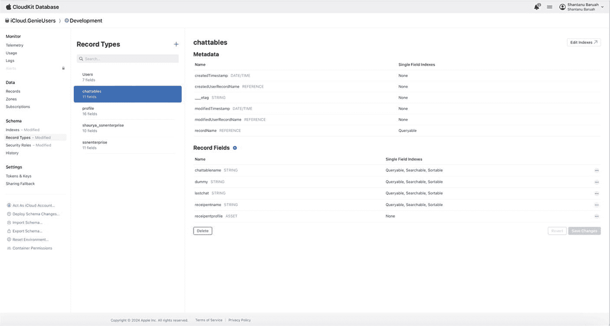
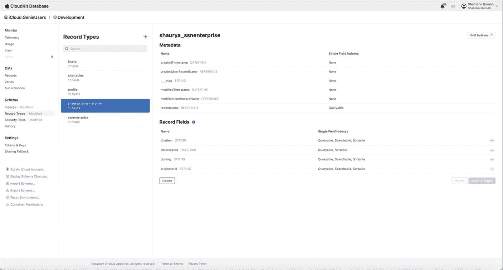
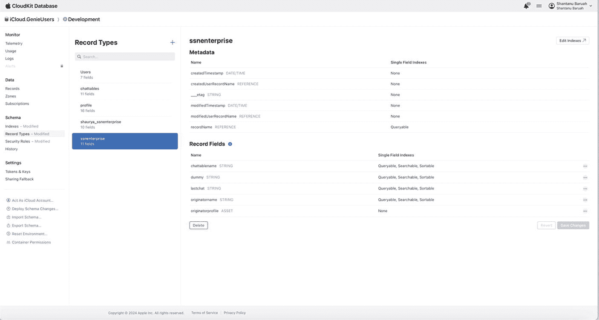

# 用户元数据间的对话

在前面的章节中，我们学习了 MVC 架构、iCloud、用于管理异步调用的新 iOS 块例程、图像处理以及许多其他概念。在本章中，我们将整合所有这些概念，创建一个用户聊天应用。该聊天程序将具有以下功能：

- 能够创建用户联系人。我们将能够创建联系人，将其存储在 iCloud 存储库中，并在应用屏幕上显示联系人。

- 与特定联系人发起对话。我们将能够实时与联系人中的用户进行交流。将对话持久化到数据库中，并检索过去的对话。

- 为保持程序简单，我们将所有对话保存在公共数据库中，并使用唯一的表名概念来找出需要检索哪些用户的对话。

- 请注意，我们不执行端到端加密或建立用于隐私保护的安全通道。我们也不专注于显示和存储图片或视频。本程序的目的是展示如何将之前学到的概念应用于创建实际应用。

## iCloud 数据库

我们需要在公共数据库中创建四个表，如下所述。

### 个人资料记录类型

此记录类型将存储用户发起对话所需的所有联系人。该记录类型的定义如下：

| 字段名 | 字段类型 | 描述 |
| --- | --- | --- |
| `userid` | String | 用于标识用户的唯一 ID |
| `personalprofile` | CKAsset | 联系人头像图片 |
| `name` | String | 联系人姓名 |
| `businessname` | String | 用户企业名称 |
| `businesstype` | String | 企业类型 |

在 iCloud 存储库中，个人资料记录类型将如下图所示。

### `Chattable` 记录类型

`Chattable` 记录类型将存储用户对话所在表的名称。请注意，在应用用户与选定联系人之间，对话存储在一个唯一的表中。此处将表名作为引用存储，以唯一标识该对话。

| 字段名 | 字段类型 | 描述 |
| --- | --- | --- |
| `chattablename` | `String` | 唯一的聊天表，用于存储用户与联系人之间的对话 |
| `receipentprofile` | `CKAsset` | 联系人的个人资料图片。请注意，我们本可以在此处存储引用，但为简单起见，我们直接复制了联系人的图片。此图片将显示在联系人对话旁边 |
| `receipentname` | `String` | 将显示其聊天的联系人姓名 |
| `lastchat` | `String` | 最后一条聊天的文本详情。将显示在联系人姓名旁边 |

在 iCloud 存储库中，`chattable` 记录类型将如下图所示。

### `Conversation` 记录类型

此记录类型将存储应用用户与联系人之间的聊天对话。该表的名称存储在上述定义的 `chattable` 中。

| 字段名 | 字段类型 | 描述 |
| --- | --- | --- |
| `chattext` | `String` | 此字段将存储聊天的文本内容 |
| `originatorid` | `CKAsset` | 创建文本的用户 ID |

在 iCloud 存储库中，`conversation` 记录类型将如下图所示。请注意，根据用户之间的唯一对话，将存在多个 `conversation` 记录类型。表名的命名规则基于聊天发起者的用户名 + `"_"` + 目标聊天用户的“业务类型名称”。

### `Business` 记录类型

每个用户业务都将有一个表，该表以业务名称唯一命名。此表将存储所有对话表的名称，而这些对话表又存储了业务与其他用户之间的唯一对话。

| 字段名 | 字段类型 | 描述 |
| --- | --- | --- |
| `chattablename` | `String` | 唯一的聊天表，用于存储用户与联系人之间的对话 |
| `originatorprofile` | `CKAsset` | 联系人的个人资料图片。请注意，我们本可以在此处存储引用，但为简单起见，我们直接复制了联系人的图片。此图片将显示在联系人对话旁边 |
| `originatorname` | `String` | 对话发起者的姓名 |
| `lastchat` | `String` | 与为其创建了 `chattablename` 的用户进行的最后一次聊天对话 |

在 iCloud 存储库中，`business` 记录类型将如下图所示。请注意，每个用户将有一个 `business` 记录类型。表名的命名规则基于用户的唯一业务名称。

虽然你可以选择这样做，但你无需在 iCloud 存储库中手动创建这些表。一旦你在项目中完成 iCloud 配置（我们已在本书第一部分学习过此内容），这些表将在首次保存请求时自动创建。

