# 13. 用户间对话 —— 视图定义

## 定义视图类

在 MVC 架构中，视图负责以用户友好的界面呈现数据（来自模型视图）。UI 还负责处理用户输入和事件。在我们的聊天应用中，有以下四个视图：

- `CreateProfileViewController`：用于创建新用户个人资料
- `ContactViewController`：查找联系人并将其添加到用户的联系人列表中
- `ChatDetailViewController`：显示用户与另一个用户之间的对话
- `ChatViewController`：显示用户已发起聊天的所有联系人

### CreateProfileViewController

`CreateProfileViewController` 接收用户输入以创建个人资料，并调用方法将个人资料对象存储到 iCloud 存储库中。

#### 类定义

下面的代码片段是一个用于创建用户个人资料的视图控制器类的开头部分。该视图控制器将包含一个表格视图、文本字段和一个标签栏。它将使用 `CloudKit` 管理个人资料数据，并处理用户与这些 UI 元素的交互。以下是类的属性：

- `var profile: Profile?`：该行声明了一个名为 `profile` 的属性，其类型为 `Profile`（模型类）。`?` 表示 `profile` 是一个可选值，意味着它可以是 `Profile` 对象，也可以是 `nil`。
- `var userid: String = ""`：该行声明了一个名为 `userid` 的属性，其类型为 `String`，并初始化为一个空字符串。

```
import UIKit
import CloudKit
class CreateProfileViewController: UIViewController, UITableViewDelegate, UITableViewDataSource, UITabBarDelegate, UITextFieldDelegate {
var profile:Profile?
var userid:String = ""
```

#### UI 对象定义

下面的代码定义了几个用于 `CreateProfileViewController` 类中的 UI 元素，用于构建用户创建个人资料的界面。这些元素包括一个标签栏；一个标题标签；一个用于个人资料图片的图像视图；用于姓名、业务名称和业务类型的文本字段；用于业务类型选择的表格视图；以及一个保存按钮。以下是 UI 对象的详细说明：

**标签栏**

- 创建一个具有特定背景颜色的 `UITabBar`
- 设置三个 `UITabBarItem` 实例，分别对应"个人资料"、"联系人"和"聊天"，并附有相应的图片和标签
- 将创建的标签栏项分配给标签栏

**标题标签**

- 创建一个 `UILabel` 用于显示标题文本"创建个人资料"
- 设置文本颜色、对齐方式和字体

**个人资料图片视图**

- 创建一个 `UIImageView` 用于显示个人资料图片
- 设置图片、内容模式和边框样式

**文本字段**

- 创建三个 `UITextField` 实例，分别用于姓名、业务名称和业务类型
- 设置占位符文本、边框样式和其他外观属性

**业务类型表格视图**

- 创建一个 `UITableView` 用于显示业务类型选项
- 设置背景颜色并启用滚动

**保存按钮**

- 创建一个 `UIButton` 用于保存个人资料
- 设置标题、颜色、字体和外观


```swift
private let tabBar:UITabBar = {
let tabbar = UITabBar()
tabbar.translatesAutoresizingMaskIntoConstraints = false
tabbar.backgroundColor = UIColor.init(red: 171/255, green: 189/255, blue: 217/255, alpha: 1)
let saveSymbolConfiguration = UIImage.SymbolConfiguration(pointSize: 16, weight: .black)
let contact = UIImage(systemName: "doc.on.clipboard", withConfiguration: saveSymbolConfiguration)
let contactbutton = UITabBarItem(title: "Contacts", image: contact, selectedImage: contact)
contactbutton.tag = 1
let chat = UIImage(systemName: "doc.plaintext", withConfiguration: saveSymbolConfiguration)
let chatbutton = UITabBarItem(title: "Chats", image: chat, selectedImage: chat)
chatbutton.tag = 2
let profile = UIImage(systemName: "person.fill", withConfiguration: saveSymbolConfiguration)
let profilebutton = UITabBarItem(title: "Profile", image: profile, selectedImage: profile)
profilebutton.tag = 0
tabbar.setItems([profilebutton, contactbutton, chatbutton], animated: false)
return tabbar
}()
private let headerLabel:UILabel = {
let label = UILabel()
label.text = "Create Profile"
label.translatesAutoresizingMaskIntoConstraints = false
label.textColor = UIColor(displayP3Red: 128/255, green: 0/255, blue: 128/255, alpha: 1)
label.textAlignment = .center
label.font = UIFont.boldSystemFont(ofSize: 35)
return label
}()
//Personal Section UI Object
let personalProfileImageView: UIImageView = {
let theImageView = UIImageView()
theImageView.image = UIImage(systemName: "person.fill")
theImageView.contentMode = .scaleAspectFit
theImageView.translatesAutoresizingMaskIntoConstraints = false
theImageView.layer.masksToBounds = true
theImageView.layer.borderWidth = 1
theImageView.layer.borderColor = UIColor.systemGray.cgColor
return theImageView
}()
let nameTextField:UITextField = {
let textField = UITextField()
textField.translatesAutoresizingMaskIntoConstraints = false
textField.borderStyle = .roundedRect
textField.textColor = .black
textField.layer.borderColor  = UIColor.systemGray.cgColor
textField.layer.borderWidth = 1
textField.layer.cornerRadius = 5
textField.placeholder = "Enter Name"
textField.textColor = .black
textField.isEnabled = true
textField.keyboardType = .default
return textField
}()
let businessNameTextField:UITextField = {
let textField = UITextField()
textField.translatesAutoresizingMaskIntoConstraints = false
textField.borderStyle = .roundedRect
textField.textColor = .black
textField.layer.borderColor  = UIColor.systemGray.cgColor
textField.layer.borderWidth = 1
textField.layer.cornerRadius = 5
textField.placeholder = "Enter Business Name"
textField.textColor = .black
textField.isEnabled = true
textField.keyboardType = .default
return textField
}()
let businessTypeTextField:UITextField = {
let textField = UITextField()
textField.translatesAutoresizingMaskIntoConstraints = false
textField.borderStyle = .roundedRect
textField.textColor = .black
textField.layer.borderColor  = UIColor.systemGray.cgColor
textField.layer.borderWidth = 1
textField.layer.cornerRadius = 5
textField.placeholder = "Select Business Type"
textField.textColor = .black
textField.isEnabled = true
textField.keyboardType = .default
return textField
}()
private let businessTypeTableView:UITableView = {
let tableView = UITableView()
tableView.translatesAutoresizingMaskIntoConstraints = false
tableView.backgroundColor = .white
tableView.isScrollEnabled = true
return tableView
}()
let saveButton:UIButton = {
let button = UIButton()
button.translatesAutoresizingMaskIntoConstraints = false
button.contentHorizontalAlignment = .center
button.setTitleColor(.white, for: .normal)
button.titleLabel?.font = UIFont.boldSystemFont(ofSize: 14)
button.titleLabel?.textAlignment = .center
button.setTitle("Save and Exit", for: .normal)
button.layer.cornerRadius = 5
button.backgroundColor = UIColor(displayP3Red: 128/255, green: 0/255, blue: 128/255, alpha: 1)
button.isEnabled = true
return button
}()
```

## 生命周期方法

此代码定义了一个名为`viewDidLoad()`的方法，该类继承自`UIViewController`。当视图控制器的视图加载到内存中时，系统会自动调用此方法。以下是此方法的关键元素：

- `override func viewDidLoad()`: 此行将`viewDidLoad()`方法声明为父类实现的重写。这意味着它用自定义逻辑替换了`viewDidLoad()`的默认行为。
- `super.viewDidLoad()`: 此行调用了超类（此处为`UIViewController`）的`viewDidLoad()`方法。首先调用超类的实现以确保视图控制器正确初始化是至关重要的。
- `setup()`: 此行调用了一个名为`setup()`的自定义方法。此方法用于执行初始设置任务，例如设置委托、观察者或加载数据。
- `drawProfileCreationScreen()`: 此行调用了另一个名为`drawProfileCreationScreen()`的自定义方法。此方法负责创建和排列 UI 元素（如先前代码片段中定义的），以构建个人资料创建屏幕。

```swift
override func viewDidLoad() {
super.viewDidLoad()
setup()
drawProfileCreationScreen()
}
```

#### 设置方法

`setup()`方法负责配置视图控制器及其 UI 元素的初始状态。它从`viewDidLoad()`方法中调用。

- `view.backgroundColor = .black`: 将主视图的背景颜色设置为黑色。
- `tabBar.delegate = self`: 将当前视图控制器设置为标签栏的委托，使其能够处理标签栏事件。
- `tabBar.selectedItem = tabBar.items![0]`: 将第一个标签栏项设置为选中项。
- 为`personalProfileImageView`创建一个点击手势识别器。为图像视图启用用户交互，添加手势识别器，并设置图像视图的圆角半径。
- 将视图控制器设置为`businessTypeTableView`的委托和数据源；注册一个可复用的单元格；设置边框、颜色和分隔符样式；并初始隐藏表格视图。
- 将视图控制器设置为`businessTypeTextField`的委托，在文本字段左侧添加一个加号图标，并为文本字段编辑事件添加目标动作。
- `setBusiness()`: 调用一个自定义方法来设置初始业务数据。

```swift
func setup(){
view.backgroundColor = .black
tabBar.delegate = self
tabBar.selectedItem = tabBar.items![0]
let personalProfileGestureRecognizer = UITapGestureRecognizer(target: self, action: #selector(personalImageTapped(tapGestureRecognizer:)))
personalProfileImageView.isUserInteractionEnabled = true
personalProfileImageView.addGestureRecognizer(personalProfileGestureRecognizer)
personalProfileImageView.layer.cornerRadius =  50
businessTypeTableView.delegate = self
businessTypeTableView.dataSource = self
businessTypeTableView.register(UITableViewCell.self, forCellReuseIdentifier: "business")
businessTypeTableView.layer.borderWidth = 0
businessTypeTableView.layer.borderColor = UIColor.white.cgColor
businessTypeTableView.separatorStyle = .none
businessTypeTableView.isHidden = true
businessTypeTextField.delegate = self
businessTypeTextField.leftView = UIImageView(image: UIImage(systemName: "plus"))
businessTypeTextField.leftViewMode = .always
businessTypeTextField.addTarget(self, action: #selector(businessTypeEditingChanged), for: .editingChanged)
businessTypeTextField.addTarget(self, action: #selector(businessTypeEditingDidBegin), for: .editingDidBegin)
businessTypeTextField.addTarget(self, action: #selector(businessTypeEditingDidEnd), for: .editingDidEnd)
setBusiness()
}
```


### 绘制个人资料界面

该方法负责将先前代码片段中定义的 UI 元素通过 Auto Layout 约束布局到主视图上。代码详情如下：

- **计算屏幕尺寸：** 获取主屏幕的尺寸。
- **添加子视图：** 将每个 UI 元素（`headerLabel`、`personalProfileImageView`、`nameTextField`、`businessNameTextField`、`businessTypeTextField`、`businessTypeTableView`、`saveButton` 和 `tabBar`）作为子视图添加到主视图中。
- **创建约束：** 为每个 UI 元素创建一个 `NSLayoutConstraint` 实例数组，以定义其相对于其他元素或视图本身的位置和大小。
- **激活约束：** 激活创建的约束，将布局应用于 UI 元素。
- **为保存按钮添加目标：** 为保存按钮添加一个目标动作，以便在按钮被点击时触发 `saveAction` 方法。

请注意，对于具有类似约束的多个 UI 元素，你可以考虑使用辅助函数来更高效地创建约束。尝试在你的代码中创建一个辅助方法。

```swift
func drawProfileCreationScreen(){
    let screensize: CGRect = UIScreen.main.bounds
    let screenWidth = screensize.width
    view.addSubview(headerLabel)
    let constraints = [
        headerLabel.topAnchor.constraint(equalTo: view.topAnchor, constant: 30),
        headerLabel.widthAnchor.constraint(equalToConstant: screenWidth),
        headerLabel.heightAnchor.constraint(equalToConstant: 40)
    ]
    NSLayoutConstraint.activate(constraints)
    view.addSubview(personalProfileImageView)
    let constraints2 = [
        personalProfileImageView.topAnchor.constraint(equalTo: headerLabel.bottomAnchor, constant: 5),
        personalProfileImageView.leftAnchor.constraint(equalTo: view.leftAnchor, constant: 140),
        personalProfileImageView.widthAnchor.constraint(equalToConstant: 100),
        personalProfileImageView.heightAnchor.constraint(equalToConstant: 100)
    ]
    NSLayoutConstraint.activate(constraints2)
    NSLayoutConstraint.activate(constraints2)
    view.addSubview(nameTextField)
    let constraints3 = [
        nameTextField.topAnchor.constraint(equalTo: personalProfileImageView.bottomAnchor, constant: 10),
        nameTextField.leftAnchor.constraint(equalTo: view.leftAnchor, constant: 5),
        nameTextField.widthAnchor.constraint(equalToConstant: screenWidth - 10),
        nameTextField.heightAnchor.constraint(equalToConstant: 40)
    ]
    NSLayoutConstraint.activate(constraints3)
    view.addSubview(businessNameTextField)
    let constraints4 = [
        businessNameTextField.topAnchor.constraint(equalTo: nameTextField.bottomAnchor, constant: 10),
        businessNameTextField.leftAnchor.constraint(equalTo: view.leftAnchor, constant: 5),
        businessNameTextField.widthAnchor.constraint(equalToConstant: screenWidth - 10),
        businessNameTextField.heightAnchor.constraint(equalToConstant: 40)
    ]
    NSLayoutConstraint.activate(constraints4)
    view.addSubview(businessTypeTextField)
    let constraints5 = [
        businessTypeTextField.topAnchor.constraint(equalTo: businessNameTextField.bottomAnchor, constant: 10),
        businessTypeTextField.leftAnchor.constraint(equalTo: view.leftAnchor, constant: 5),
        businessTypeTextField.widthAnchor.constraint(equalToConstant: screenWidth - 10),
        businessTypeTextField.heightAnchor.constraint(equalToConstant: 40)
    ]
    NSLayoutConstraint.activate(constraints5)
    view.addSubview(businessTypeTableView)
    let constraints6 = [
        businessTypeTableView.topAnchor.constraint(equalTo: businessTypeTextField.bottomAnchor, constant: 0),
        businessTypeTableView.leftAnchor.constraint(equalTo: view.leftAnchor, constant: 5),
        businessTypeTableView.widthAnchor.constraint(equalToConstant: screenWidth - 10),
        businessTypeTableView.heightAnchor.constraint(equalToConstant: 300)
    ]
    NSLayoutConstraint.activate(constraints6)
    view.addSubview(saveButton)
    let constraints7 = [
        saveButton.topAnchor.constraint(equalTo: businessTypeTextField.bottomAnchor, constant: 40),
        saveButton.leftAnchor.constraint(equalTo: view.leftAnchor, constant: 100),
        saveButton.widthAnchor.constraint(equalToConstant: 185),
        saveButton.heightAnchor.constraint(equalToConstant: 40)
    ]
    NSLayoutConstraint.activate(constraints7)
    saveButton.addTarget(self, action: #selector(saveAction), for: .touchUpInside)
    view.addSubview(tabBar)
    let constraints8 = [
        tabBar.bottomAnchor.constraint(equalTo: view.bottomAnchor, constant: 5),
        tabBar.leftAnchor.constraint(equalTo: view.leftAnchor, constant: 5),
        tabBar.widthAnchor.constraint(equalToConstant: screenWidth),
        tabBar.heightAnchor.constraint(equalToConstant: 80)
    ]
    NSLayoutConstraint.activate(constraints8)
}
```

### 图片事件方法

此方法的主要目的是处理用户点击个人资料图片视图的操作。当用户点击图片时，会调用 `presentPhotoOptions()` 函数，允许用户选择新的个人资料照片。该方法的关键元素如下：

- **`@objc`：** 此属性使函数能够被 Objective-C 代码调用。这是将该函数与 `UITapGestureRecognizer` 一起使用的必要条件。
- **`personalImageTapped(tapGestureRecognizer: UITapGestureRecognizer)`：** 这是函数签名。它接受一个 `UITapGestureRecognizer` 作为参数，该参数提供了关于点击手势的信息。
- **`presentPhotoOptions()`：** 此行调用一个名为 `presentPhotoOptions()` 的函数，该函数在类扩展中定义（将在本节末尾介绍）。此函数负责向用户展示选择个人资料照片的选项（拍摄新照片、从照片库中选择）。

```swift
@objc func personalImageTapped(tapGestureRecognizer: UITapGestureRecognizer){
    presentPhotoOptions()
}
```

### 保存操作方法

此方法的主要目的是处理用户点击保存按钮的操作。当用户点击保存按钮时，会调用 `profileSave()` 函数，该函数将把个人资料数据保存到 iCloud 存储。该方法的关键元素如下：

- **`@objc`：** 此属性使函数能够被 Objective-C 代码调用。这是将该函数与按钮的 `addTarget` 方法一起使用的必要条件。
- **`saveAction(sender: UIButton)`：** 这是函数签名。它接受一个 `UIButton` 作为参数，该参数代表触发操作的按钮。但在本例中，sender 参数并未被使用。
- **`profileSave()`：** 此行调用一个名为 `profileSave()` 的函数，该函数在代码后面定义。此函数负责保存个人资料数据。

```swift
@objc func saveAction(sender: UIButton){
    profileSave()
}
```


#### 标签栏方法

以下代码的目的是处理不同标签栏项的选中事件并执行相应操作。在这种情况下，选中第一个标签栏项（tag 为 0）或任何其他项将触发 `popUpContact()` 函数，而选中第三个标签栏项（tag 为 2）将触发 `popUpChat()` 函数。

- `tabBar(_:didSelect:)`：这是 `UITabBarDelegate` 协议的方法签名。它接受两个参数：`tabBar`（触发事件的标签栏对象）和 `item`（选中的标签栏项）。
- `switch item.tag`：此 switch 语句检查选中标签栏项的 `tag` 属性以确定执行哪个操作：`case 0`（如果 tag 为 0，则调用 `popUpContact()` 函数）；`case 2`（如果 tag 为 2，则调用 `popUpChat()` 函数）；`default`（对于任何其他 tag 值，调用 `popUpContact()` 函数）。

```swift
func tabBar(_ tabBar: UITabBar, didSelect item: UITabBarItem) {
    switch item.tag {
    case 0:
        popUpContact()
    case 2:
        popUpChat()
    default:
        popUpContact()
    }
}
```

### `popUpContact()`

此函数创建一个新的 `ContactViewController` 实例，并以模态方式呈现在当前视图控制器之上。以下是详细说明：

- `viewController = ContactViewController()`：创建一个新的 `ContactViewController` 实例。
- `viewController.profile = profile`：将个人资料数据传递给 `ContactViewController`。
- `viewController.modalPresentationStyle = .overCurrentContext`：将呈现样式设置为覆盖当前视图控制器。
- `viewController.modalTransitionStyle = .crossDissolve`：将过渡样式设置为交叉溶解效果。
- `self.present(viewController, animated: true, completion: nil)`：以动画方式模态呈现 `ContactViewController`。

### `popUpChat()` 和 `popUpMarket()`

这些函数目前为空，因为**创建个人资料**仅在个人资料不存在时调用一次。

```swift
func popUpContact(){
    let viewController = ContactViewController()
    viewController.profile = profile
    viewController.modalPresentationStyle = .overCurrentContext
    viewController.modalTransitionStyle = .crossDissolve
    self.present(viewController, animated: true, completion: nil)
}
func popUpChat(){
}
func popUpMarket(){
}
```

### 表格视图方法

在本节中，我们将定义表格方法。

#### 行数

以下 Swift 代码定义了一个符合 `UITableViewDataSource` 协议的方法。其作用是告诉表格视图每个分区应显示多少行。代码详情如下：

- `func tableView(_ tableView: UITableView, numberOfRowsInSection section: Int) -> Int`：这是 `numberOfRowsInSection` 委托方法的方法签名。
    - `tableView`：请求信息的表格视图。
    - `section`：请求行数的分区索引。
    - `-> Int`：该方法返回一个表示行数的整数。
    - `return business.count`：此行返回 `business` 数组的计数，该数组是将在表格视图中显示的数据数组。

```swift
func tableView(_ tableView: UITableView, numberOfRowsInSection section: Int) -> Int {
    return business.count
}
```

#### 显示单元格方法

以下代码定义了一个符合 `UITableViewDataSource` 协议的方法。其作用是为表格视图中给定的行提供一个已配置的表格视图单元格。方法详情如下：

- `func tableView(_ tableView: UITableView, cellForRowAt indexPath: IndexPath) -> UITableViewCell`：这是 `cellForRowAt` 委托方法的方法签名。
    - `tableView`：请求单元格的表格视图。
    - `indexPath`：要返回的单元格的索引路径。
    - `-> UITableViewCell`：该方法返回一个已配置的表格视图单元格。
    - `let cell = tableView.dequeueReusableCell(withIdentifier: "business", for: indexPath)`：此行出列一个标识符为 `"business"` 的可重用单元格。如果没有可用的可重用单元格，则会创建一个新单元格。
    - `cell.textLabel?.text = business[indexPath.row].businesstype + " " + business[indexPath.row].businessdesc`：此行将单元格 `textLabel` 的文本设置为 `business` 数组中对应 `business` 对象的 `businesstype` 和 `businessdesc` 属性的连接字符串。
    - `return cell`：此行将配置好的单元格返回给表格视图。

```swift
func tableView(_ tableView: UITableView, cellForRowAt indexPath: IndexPath) -> UITableViewCell {
    let cell = tableView.dequeueReusableCell(withIdentifier: "business", for: indexPath)
    cell.textLabel?.text = business[indexPath.row].businesstype + " " + business[indexPath.row].businessdesc
    return cell
}
```

#### 行高方法

以下 Swift 代码定义了一个符合 `UITableViewDelegate` 协议的方法。其作用是指定表格视图中行的高度。方法详情如下：

- `func tableView(_ tableView: UITableView, heightForRowAt indexPath: IndexPath) -> CGFloat`：这是 `heightForRowAt` 委托方法的方法签名。
    - `tableView`：请求行高的表格视图。
    - `indexPath`：请求高度的行的索引路径。
    - `-> CGFloat`：该方法返回一个浮点值，表示以点（point）为单位的行高。
    - `return 40.0`：此行返回一个固定的 40 点高度，适用于表格视图中的所有行。

```swift
func tableView(_ tableView: UITableView, heightForRowAt indexPath: IndexPath) -> CGFloat {
    return 40.0
}
```

#### 行选择方法

以下代码定义了一个符合 `UITableViewDelegate` 协议的方法。其作用是处理用户点击表格视图行的事件。方法详情如下：

- `func tableView(_ tableView: UITableView, didSelectRowAt indexPath: IndexPath)`：这是 `didSelectRowAt` 委托方法的方法签名。
    - `tableView`：发生选中事件的表格视图。
    - `indexPath`：选中行的索引路径。
    - `businessTypeTextField.text = business[indexPath.row].businesstype`：此行将 `businessTypeTextField` 的文本设置为 `business` 数组中选中 `business` 对象的 `businesstype` 属性。
    - `businessTypeTextField.resignFirstResponder()`：如果 `businessTypeTextField` 上当前有键盘处于活动状态，此行将关闭键盘。

```swift
func tableView(_ tableView: UITableView, didSelectRowAt indexPath: IndexPath) {
    businessTypeTextField.text = business[indexPath.row].businesstype
    businessTypeTextField.resignFirstResponder()
}
```

### 定义并初始化 Business 对象

`setBusiness()` 函数用 `Business` 对象填充 `business` 数组。每个 `Business` 对象都有 `businesstype`、`businessdesc` 和 `imagename` 属性。方法详情如下：

- `var business:[Business] = []`：初始化一个空的 `Business` 对象数组。
- `var tempBusiness:[Business] = []`：初始化一个空的临时 `Business` 对象数组。该数组在所提供的代码中目前未被使用。
- `setBusiness()`：定义一个函数来填充 `business` 数组。
- `Business(businesstype: ..., businessdesc: ..., imagename: ...)`：创建具有指定属性的 `Business` 对象。
- `business.append(...)`：将创建的 `Business` 对象添加到 `business` 数组中。


```swift
var business:[Business] = []
var tempBusiness:[Business] = []
func setBusiness(){
    business.append(Business(businesstype: "Mortgage", businessdesc: "提供抵押贷款解决方案", imagename: "scribble"))
    business.append(Business(businesstype: "Insurance", businessdesc: "提供人寿/健康/汽车/财产保险", imagename: "folder"))
    business.append(Business(businesstype: "Electrician", businessdesc: "提供家庭电气解决方案", imagename: "doc.text"))
    business.append(Business(businesstype: "Handyman", businessdesc: "提供任何家政相关工作", imagename: "book"))
    business.append(Business(businesstype: "Artisan", businessdesc: "艺术课程/陶艺课程", imagename: "graduationcap"))
    business.append(Business(businesstype: "Magician", businessdesc: "生日派对的魔术表演", imagename: "square.and.arrow.down.fill"))
    business.append(Business(businesstype: "Tutor", businessdesc: "提供辅导服务", imagename: "paperclip"))
    business.append(Business(businesstype: "Plumber", businessdesc: "提供管道维修解决方案", imagename: "links"))
    business.append(Business(businesstype: "Cleaners", businessdesc: "提供房屋清洁服务", imagename: "person"))
    business.append(Business(businesstype: "Architect", businessdesc: "房屋设计与建筑服务", imagename: "globe"))
    business.append(Business(businesstype: "Physical Trainer", businessdesc: "私人教练", imagename: "music.note.list"))
    business.append(Business(businesstype: "Nutritionist", businessdesc: "提供营养指导与服务", imagename: "square.and.pencil"))
    business.append(Business(businesstype: "Spa", businessdesc: "获得上门水疗服务", imagename: "swift"))
    business.append(Business(businesstype: "Decor", businessdesc: "提供家居设计与装饰服务", imagename: "magnifyingglass"))
    business.append(Business(businesstype: "Builder", businessdesc: "总承包商", imagename: "heart.fill"))
    business.append(Business(businesstype: "Pottery", businessdesc: "学习制作陶艺作品", imagename: "star.fill"))
    business.append(Business(businesstype: "Dog Walker", businessdesc: "提供宠物狗照料", imagename: "flag.fill"))
    business.append(Business(businesstype: "Baker", businessdesc: "定制蛋糕或派对用品", imagename: "folder.fill"))
    business.append(Business(businesstype: "Dance Trainer", businessdesc: "提供各种西方/印度古典舞培训", imagename: "bell.fill"))
    business.append(Business(businesstype: "Nurse", businessdesc: "提供上门护理服务", imagename: "tag.fill"))
    business.append(Business(businesstype: "Gardener", businessdesc: "美化您的花圃或菜圃", imagename: "bolt.fill"))
    business.append(Business(businesstype: "Snow Remover", businessdesc: "提供除雪服务", imagename: "camera.fill"))
    business.append(Business(businesstype: "Swim Trainer", businessdesc: "个人或团体游泳课程", imagename: "phone.fill"))
    business.append(Business(businesstype: "Martial Arts", businessdesc: "学习武术/空手道/跆拳道", imagename: "calendar"))
    business.append(Business(businesstype: "Videographer", businessdesc: "为您的活动提供专业摄像师", imagename: "video.fill"))
    business.append(Business(businesstype: "Photographer", businessdesc: "为您的活动提供专业摄影师", imagename: "envelope.fill"))
    business.append(Business(businesstype: "Mountaineer", businessdesc: "学习如何攀登高山", imagename: "gearshape.fill"))
    business.append(Business(businesstype: "Limo Service", businessdesc: "提供豪华轿车服务", imagename: "cart.fill"))
    business.append(Business(businesstype: "Compere", businessdesc: "为您的活动及节目担任主持人", imagename: "giftcard.fill"))
    business.append(Business(businesstype: "Disc Jockey", businessdesc: "为您的私人派对和活动提供 DJ 服务", imagename: "sunrise.fill"))
    business.append(Business(businesstype: "Tailor", businessdesc: "提供定制裁缝服务", imagename: "paintbrush.fill"))
    business.append(Business(businesstype: "Painter", businessdesc: "学习如何绘画", imagename: "wrench.fill"))
    business.append(Business(businesstype: "Vent Cleaners", businessdesc: "提供通风管道清洁服务", imagename: "hammer.fill"))
    business.append(Business(businesstype: "Repair", businessdesc: "提供一般家庭维修服务", imagename: "house.fill"))
    business.append(Business(businesstype: "Locksmith", businessdesc: "配钥匙或处理被锁在门外的紧急情况", imagename: "lock.fill"))
    business.append(Business(businesstype: "Pest Control", businessdesc: "提供害虫防治服务", imagename: "sparkles"))
}
```


#### 文本字段事件方法

本节将定义如下三个事件，方法的详细说明如下：

**开始编辑**

当用户开始编辑`businessTypeTextField`时触发此函数。它会准备好用户界面，以便用户从表格视图中选择业务类型。方法的详细说明如下：

-   `@objc`：使该函数可被 Objective-C 调用。
-   `businessTypeEditingDidBegin(sender: UITextField)`：定义一个带有 `UITextField` 参数的函数（虽然在本实现中未使用该参数）。
-   `tempBusiness = business`：将 `business` 数组复制到 `tempBusiness` 数组中。这是为了在筛选前存储原始的业务数据。
-   `businessTypeTableView.isHidden = false`：使 `businessTypeTableView` 可见。
-   `saveButton.isHidden = true`：在用户选择业务类型时隐藏保存按钮。

```
@objc func businessTypeEditingDidBegin(sender: UITextField){
tempBusiness = business
businessTypeTableView.isHidden = false
saveButton.isHidden = true
}
```

**结束编辑方法**

当用户完成对`businessTypeTextField`的编辑时触发此函数。它会恢复原始的业务数据，并隐藏表格视图和保存按钮。方法的详细说明如下：

-   `@objc`：使该函数可被 Objective-C 调用。
-   `businessTypeEditingDidEnd(sender: UITextField)`：定义一个带有 `UITextField` 参数的函数（虽然在本实现中未使用该参数）。
-   `business = tempBusiness`：从 `tempBusiness` 数组中恢复原始的业务数组。
-   `businessTypeTableView.isHidden = true`：隐藏 `businessTypeTableView`。
-   `saveButton.isHidden = false`：再次显示保存按钮。

```
@objc func businessTypeEditingDidEnd(sender: UITextField){
business = tempBusiness
businessTypeTableView.isHidden = true
saveButton.isHidden = false
}
```

**编辑变动方法**

此函数根据在`businessTypeTextField`中输入的文字筛选 `business` 数组，并重新加载表格视图。方法的详细说明如下：

-   `@objc`：使该函数可被 Objective-C 调用。
-   `businessTypeEditingChanged(sender: UITextField)`：定义一个带有 `UITextField` 参数的函数。
-   `business = business.filter { ... }`：使用闭包筛选 `business` 数组。
    -   该闭包会遍历每一个 `business` 元素。
    -   它检查该元素中 `businesstype` 属性在去除空格并转换为小写后，是否包含发送者（文本字段）中文本的小写版本。
    -   如果条件为真，则该 `business` 会被包含在筛选后的数组中。
-   `if (sender.text == "")`：检查文本字段是否为空。
    -   如果为空，则从 `tempBusiness` 恢复原始的 `business` 数组。
-   `businessTypeTableView.reloadData()`：重新加载表格视图以显示筛选后的数据。

```
@objc func businessTypeEditingChanged(sender: UITextField){
business = business.filter{
business in return business.businesstype.trimmingCharacters(in: .whitespaces).lowercased().contains(sender.text!.lowercased())
}
if(sender.text == ""){
business = tempBusiness
}
businessTypeTableView.reloadData()
}
```

### 保存用户信息方法

此函数似乎用于处理将用户个人资料信息（包括图像）保存到`CloudKit`。以下是对代码的详细分解：

**图像保存**

-   `let personalData = personalProfileImageView.image?.pngData()`：从 `personalProfileImageView` 图像中提取 PNG 数据。
-   `let personalFilename = getDocumentsDirectory().appendingPathComponent("copy.png")`：在文档目录下创建一个名为 "copy.png" 的文件路径。
-   `try? personalData?.write(to: personalFilename)`：尝试将图像数据写入该文件路径。

**CloudKit 资源创建**

-   `let personalProfile : CKAsset? = CKAsset(fileURL: personalFilename)`：创建一个引用已保存图像文件的 `CKAsset` 对象。

**用户资料对象创建**

-   `let profile:Profile = Profile(userid: userid, personalprofile: personalProfile!, name: nameTextField.text!, businessname: businessNameTextField.text!, businesstype: businessTypeTextField.text!)`：使用用户数据和 `CKAsset` 创建一个 `Profile` 对象。

**保存到 CloudKit（异步）**

-   `profile.group.enter()`：启动一个 `CloudKit` 操作组。
-   `profile.saveProfile(profile: profile)`：调用一个方法（定义为模态类）将 profile 对象保存到 `CloudKit`。
-   `profile.group.notify(queue: .main) { ... }`：设置一个完成块，当操作组完成时在主队列上调用该块。
-   `self.profile = profile.profile`：用保存后的用户资料数据（包括 CloudKit 记录 ID）更新本地的 profile 变量。
-   `self.popUpContact()`：在成功保存后弹出联系人视图。

```
func profileSave(){
let personalData = personalProfileImageView.image?.pngData()
let personalFilename = getDocumentsDirectory().appendingPathComponent("copy.png")
try? personalData?.write(to: personalFilename)
let personalProfile : CKAsset?  = CKAsset(fileURL: personalFilename)
let profile:Profile = Profile(userid: userid, personalprofile: personalProfile!, name: nameTextField.text!, businessname: businessNameTextField.text!, businesstype: businessTypeTextField.text!)
profile.group.enter()
profile.saveProfile(profile: profile)
profile.group.notify(queue: .main) {
self.profile = profile.profile
self.popUpContact()
}
}
```

### 获取文档目录方法

此函数用于获取设备上用户文档目录的路径。以下是对代码的详细分解：

-   `func getDocumentsDirectory() -> URL`：定义一个返回 `URL` 的函数。
-   `let paths = FileManager.default.urls(for: .documentDirectory, in: .userDomainMask)`：获取代表文档目录的 URL 数组。
-   `return paths[0]`：返回数组中的第一个 URL，即文档目录路径。

```
func getDocumentsDirectory() -> URL {
let paths = FileManager.default.urls(for: .documentDirectory, in: .userDomainMask)
return paths[0]
}
```


### 图像增强功能的类扩展

以下代码扩展了 `CreateProfileViewController`，以处理从相机或相册中选择图像的操作。代码详情如下所示：

`presentPhotoOptions()`

- 创建一个 `UIAlertController`，用于显示拍照或从相册中选择的选项
- 使用弱引用 （`weak self`） 避免强引用循环
- 呈现操作列表

`presentCamera()` 和 `presentPhoto()`

- 创建 `UIImagePickerController` 实例，并指定相应的来源类型（相机或相册）
- 将委托设置为 `self`，以处理图像选择结果
- 呈现图像选择控制器

`imagePickerController(_:didFinishPickingMediaWithInfo:)`

- 从信息字典中获取所选图像
- 将 `personalProfileImageView` 的图像设置为所选图像
- 关闭图像选择控制器

`imagePickerControllerDidCancel(_:)`

- 当用户取消选择时，关闭图像选择控制器

```
extension CreateProfileViewController:UIImagePickerControllerDelegate, UINavigationControllerDelegate{
func presentPhotoOptions(){
var message:String = ""
message = "个人资料图片"
let actionSheet = UIAlertController(title: message, message: "选择您的选项", preferredStyle: .actionSheet)
actionSheet.addAction(UIAlertAction(title: "取消", style: .cancel, handler: nil))
actionSheet.addAction(UIAlertAction(title: "拍照", style: .default, handler: { [weak self]_ in
self?.presentCamera()
}))
actionSheet.addAction(UIAlertAction(title: "选择照片", style: .default, handler: {[weak self]_ in
self?.presentPhoto()
}))
present(actionSheet, animated: true)
}
func presentCamera(){
let ip = UIImagePickerController()
ip.sourceType = .camera
ip.delegate = self
ip.allowsEditing = true
present(ip, animated: true)
}
func presentPhoto(){
let ip = UIImagePickerController()
ip.sourceType = .photoLibrary
ip.delegate = self
ip.allowsEditing = true
present(ip, animated: true)
}
func imagePickerController(_ picker: UIImagePickerController, didFinishPickingMediaWithInfo info: [UIImagePickerController.InfoKey : Any]) {
let selectedImage  = info[UIImagePickerController.InfoKey.editedImage]
self.personalProfileImageView.image = selectedImage as? UIImage
picker.dismiss(animated: true)
}
func imagePickerControllerDidCancel(_ picker: UIImagePickerController) {
picker.dismiss(animated: true)
}
}
```

### 运行应用

运行应用时，首次会显示“创建资料”屏幕，如下所示。

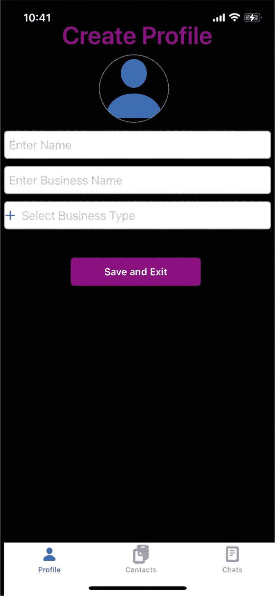

用户可以从相册中选择图像或使用相机拍照，输入用户名称和企业名称，并从下拉列表中选择企业类型，如下所示。企业列表将根据用户输入进行筛选。在我们的示例中，我们将使用两个用户。第一个用户是 Shantanu（如下所示），他是一名导师；另一个用户是 Shaurya（未在截图中显示），他将发起聊天对话。

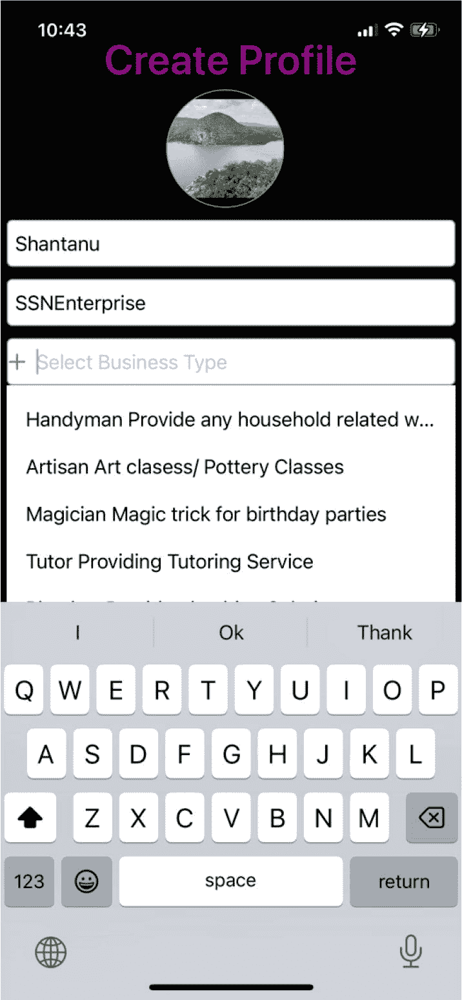

输入资料信息后，用户可以使用“保存并退出”按钮保存资料，如下方屏幕截图所示。

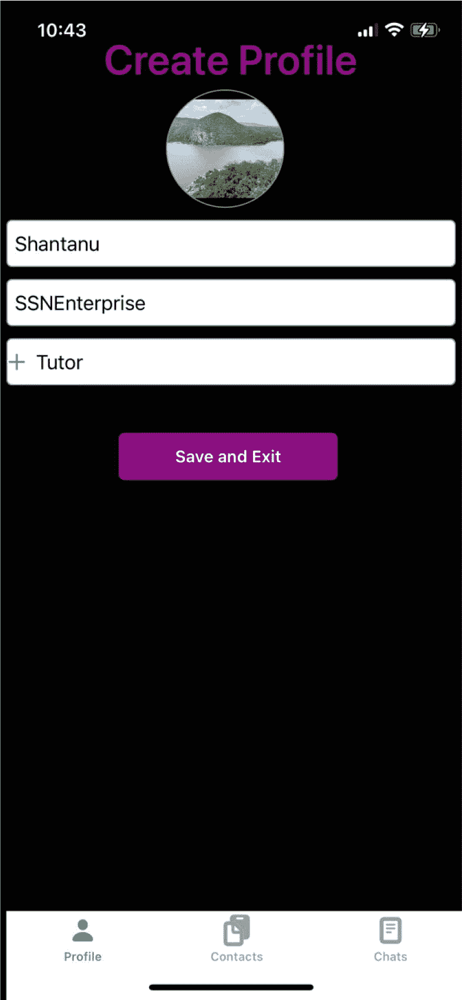


### 完整代码

`CreateProfileViewController` 的完整代码如下所示：

```swift
//
//  CreateProfileViewController.swift
//  Chat
//
//  Created by Shantanu Baruah on 5/22/24.
//
import UIKit
import CloudKit
class CreateProfileViewController: UIViewController, UITableViewDelegate, UITableViewDataSource, UITabBarDelegate, UITextFieldDelegate {
var profile:Profile?
var userid:String = ""
private let tabBar:UITabBar = {
let tabbar = UITabBar()
tabbar.translatesAutoresizingMaskIntoConstraints = false
tabbar.backgroundColor = UIColor.init(red: 171/255, green: 189/255, blue: 217/255, alpha: 1)
let saveSymbolConfiguration = UIImage.SymbolConfiguration(pointSize: 16, weight: .black)
let contact = UIImage(systemName: "doc.on.clipboard", withConfiguration: saveSymbolConfiguration)
let contactbutton = UITabBarItem(title: "Contacts", image: contact, selectedImage: contact)
contactbutton.tag = 1
let chat = UIImage(systemName: "doc.plaintext", withConfiguration: saveSymbolConfiguration)
let chatbutton = UITabBarItem(title: "Chats", image: chat, selectedImage: chat)
chatbutton.tag = 2
let profile = UIImage(systemName: "person.fill", withConfiguration: saveSymbolConfiguration)
let profilebutton = UITabBarItem(title: "Profile", image: profile, selectedImage: profile)
profilebutton.tag = 0
tabbar.setItems([profilebutton, contactbutton, chatbutton], animated: false)
return tabbar
}()
private let headerLabel:UILabel = {
let label = UILabel()
label.text = "Create Profile"
label.translatesAutoresizingMaskIntoConstraints = false
label.textColor = UIColor(displayP3Red: 128/255, green: 0/255, blue: 128/255, alpha: 1)
label.textAlignment = .center
label.font = UIFont.boldSystemFont(ofSize: 35)
return label
}()
//Personal Section UI Object
let personalProfileImageView: UIImageView = {
let theImageView = UIImageView()
theImageView.image = UIImage(systemName: "person.fill")
theImageView.contentMode = .scaleAspectFit
theImageView.translatesAutoresizingMaskIntoConstraints = false
theImageView.layer.masksToBounds = true
theImageView.layer.borderWidth = 1
theImageView.layer.borderColor = UIColor.systemGray.cgColor
return theImageView
}()
let nameTextField:UITextField = {
let textField = UITextField()
textField.translatesAutoresizingMaskIntoConstraints = false
textField.borderStyle = .roundedRect
textField.textColor = .black
textField.layer.borderColor  = UIColor.systemGray.cgColor
textField.layer.borderWidth = 1
textField.layer.cornerRadius = 5
textField.placeholder = "Enter Name"
textField.textColor = .black
textField.isEnabled = true
textField.keyboardType = .default
return textField
}()
let businessNameTextField:UITextField = {
let textField = UITextField()
textField.translatesAutoresizingMaskIntoConstraints = false
textField.borderStyle = .roundedRect
textField.textColor = .black
textField.layer.borderColor  = UIColor.systemGray.cgColor
textField.layer.borderWidth = 1
textField.layer.cornerRadius = 5
textField.placeholder = "Enter Business Name"
textField.textColor = .black
textField.isEnabled = true
textField.keyboardType = .default
return textField
}()
let businessTypeTextField:UITextField = {
let textField = UITextField()
textField.translatesAutoresizingMaskIntoConstraints = false
textField.borderStyle = .roundedRect
textField.textColor = .black
textField.layer.borderColor  = UIColor.systemGray.cgColor
textField.layer.borderWidth = 1
textField.layer.cornerRadius = 5
textField.placeholder = "Select Business Type"
textField.textColor = .black
textField.isEnabled = true
textField.keyboardType = .default
return textField
}()
private let businessTypeTableView:UITableView = {
let tableView = UITableView()
tableView.translatesAutoresizingMaskIntoConstraints = false
tableView.backgroundColor = .white
tableView.isScrollEnabled = true
return tableView
}()
let saveButton:UIButton = {
let button = UIButton()
button.translatesAutoresizingMaskIntoConstraints = false
button.contentHorizontalAlignment = .center
button.setTitleColor(.white, for: .normal)
button.titleLabel?.font = UIFont.boldSystemFont(ofSize: 14)
button.titleLabel?.textAlignment = .center
button.setTitle("Save and Exit", for: .normal)
button.layer.cornerRadius = 5
button.backgroundColor = UIColor(displayP3Red: 128/255, green: 0/255, blue: 128/255, alpha: 1)
button.isEnabled = true
return button
}()
override func viewDidLoad() {
super.viewDidLoad()
setup()
drawProfileCreationScreen()
}
func setup(){
view.backgroundColor = .black
tabBar.delegate = self
tabBar.selectedItem = tabBar.items![0]
let personalProfileGestureRecognizer = UITapGestureRecognizer(target: self, action: #selector(personalImageTapped(tapGestureRecognizer:)))
personalProfileImageView.isUserInteractionEnabled = true
personalProfileImageView.addGestureRecognizer(personalProfileGestureRecognizer)
personalProfileImageView.layer.cornerRadius =  50
businessTypeTableView.delegate = self
businessTypeTableView.dataSource = self
businessTypeTableView.register(UITableViewCell.self, forCellReuseIdentifier: "business")
businessTypeTableView.layer.borderWidth = 0
businessTypeTableView.layer.borderColor = UIColor.white.cgColor
businessTypeTableView.separatorStyle = .none
businessTypeTableView.isHidden = true
businessTypeTextField.delegate = self
businessTypeTextField.leftView = UIImageView(image: UIImage(systemName: "plus"))
businessTypeTextField.leftViewMode = .always
businessTypeTextField.addTarget(self, action: #selector(businessTypeEditingChanged), for: .editingChanged)
businessTypeTextField.addTarget(self, action: #selector(businessTypeEditingDidBegin), for: .editingDidBegin)
businessTypeTextField.addTarget(self, action: #selector(businessTypeEditingDidEnd), for: .editingDidEnd)
setBusiness()
}
func drawProfileCreationScreen(){
let screensize: CGRect = UIScreen.main.bounds
let screenWidth = screensize.width
view.addSubview(headerLabel)
let constraints = [
headerLabel.topAnchor.constraint(equalTo: view.topAnchor, constant: 30),
headerLabel.widthAnchor.constraint(equalToConstant: screenWidth),
headerLabel.heightAnchor.constraint(equalToConstant: 40)
]
NSLayoutConstraint.activate(constraints)
view.addSubview(personalProfileImageView)
let constraints2 = [
personalProfileImageView.topAnchor.constraint(equalTo: headerLabel.bottomAnchor, constant: 5),
personalProfileImageView.leftAnchor.constraint(equalTo: view.leftAnchor, constant: 140),
personalProfileImageView.widthAnchor.constraint(equalToConstant: 100),
personalProfileImageView.heightAnchor.constraint(equalToConstant: 100)
]
NSLayoutConstraint.activate(constraints2)
NSLayoutConstraint.activate(constraints2)
view.addSubview(nameTextField)
let constraints3 = [
nameTextField.topAnchor.constraint(equalTo: personalProfileImageView.bottomAnchor, constant: 10),
nameTextField.leftAnchor.constraint(equalTo: view.leftAnchor, constant: 5),
nameTextField.widthAnchor.constraint(equalToConstant: screenWidth - 10),
nameTextField.heightAnchor.constraint(equalToConstant: 40)
]
NSLayoutConstraint.activate(constraints3)
view.addSubview(businessNameTextField)
let constraints4 = [
businessNameTextField.topAnchor.constraint(equalTo: nameTextField.bottomAnchor, constant: 10),
businessNameTextField.leftAnchor.constraint(equalTo: view.leftAnchor, constant: 5),
businessNameTextField.widthAnchor.constraint(equalToConstant: screenWidth - 10),
businessNameTextField.heightAnchor.constraint(equalToConstant: 40)
]
NSLayoutConstraint.activate(constraints4)
view.addSubview(businessTypeTextField)
let constraints5 = [
businessTypeTextField.topAnchor.constraint(equalTo: businessNameTextField.bottomAnchor, constant: 10),
businessTypeTextField.leftAnchor.constraint(equalTo: view.leftAnchor, constant: 5),
businessTypeTextField.widthAnchor.constraint(equalToConstant: screenWidth - 10),
businessTypeTextField.heightAnchor.constraint(equalToConstant: 40)
]
NSLayoutConstraint.activate(constraints5)
view.addSubview(businessTypeTableView)
let constraints6 = [
businessTypeTableView.topAnchor.constraint(equalTo: businessTypeTextField.bottomAnchor, constant: 0),
businessTypeTableView.leftAnchor.constraint(equalTo: view.leftAnchor, constant: 5),
businessTypeTableView.widthAnchor.constraint(equalToConstant: screenWidth - 10),
businessTypeTableView.heightAnchor.constraint(equalToConstant: 300)
]
NSLayoutConstraint.activate(constraints6)
view.addSubview(saveButton)
let constraints7 = [
saveButton.topAnchor.constraint(equalTo: businessTypeTextField.bottomAnchor, constant: 40),
saveButton.leftAnchor.constraint(equalTo: view.leftAnchor, constant: 100),
saveButton.widthAnchor.constraint(equalToConstant: 185),
saveButton.heightAnchor.constraint(equalToConstant: 40)
]
NSLayoutConstraint.activate(constraints7)
saveButton.addTarget(self, action: #selector(saveAction), for: .touchUpInside)
view.addSubview(tabBar)
let constraints8 = [
tabBar.bottomAnchor.constraint(equalTo: view.bottomAnchor, constant: 5),
tabBar.leftAnchor.constraint(equalTo: view.leftAnchor, constant: 5),
tabBar.widthAnchor.constraint(equalToConstant: screenWidth),
tabBar.heightAnchor.constraint(equalToConstant: 80)
]
NSLayoutConstraint.activate(constraints8)
}
@objc func personalImageTapped(tapGestureRecognizer: UITapGestureRecognizer){
presentPhotoOptions()
}
@objc func saveAction(sender: UIButton){
profileSave()
}
func tabBar(_ tabBar: UITabBar, didSelect item: UITabBarItem) {
switch item.tag {
case 0:
popUpContact()
case 2:
popUpChat()
default:
popUpContact()
}
}
func popUpContact(){
let viewController = ContactViewController()
viewController.profile = profile
viewController.modalPresentationStyle = .overCurrentContext
viewController.modalTransitionStyle = .crossDissolve
self.present(viewController, animated: true, completion: nil)
}
func popUpChat(){
}
func popUpMarket(){
}
//MARK: - Table Functions
func tableView(_ tableView: UITableView, numberOfRowsInSection section: Int) -> Int {
return business.count
}
func tableView(_ tableView: UITableView, cellForRowAt indexPath: IndexPath) -> UITableViewCell {
let cell = tableView.dequeueReusableCell(withIdentifier: "business", for: indexPath)
cell.textLabel?.text = business[indexPath.row].businesstype + " " + business[indexPath.row].businessdesc
return cell
}
/*
The Height of the Cell Row is set to default 40 pixels
*/
func tableView(_ tableView: UITableView, heightForRowAt indexPath: IndexPath) -> CGFloat {
return 40.0
}
func tableView(_ tableView: UITableView, didSelectRowAt indexPath: IndexPath) {
businessTypeTextField.text = business[indexPath.row].businesstype
businessTypeTextField.resignFirstResponder()
}
var business:[Business] = []
var tempBusiness:[Business] = []
func setBusiness(){
business.append(Business(businesstype: "Mortgage", businessdesc: "Provide Mortgage Solution", imagename: "scribble"))
business.append(Business(businesstype: "Insurance", businessdesc: "Provide Life/Health/Car/P&C Insurance", imagename: "folder"))
business.append(Business(businesstype: "Electrician", businessdesc: "Provide Household electrical solution", imagename: "doc.text"))
business.append(Business(businesstype: "Handyman", businessdesc: "Provide any household related work", imagename: "book"))
business.append(Business(businesstype: "Artisan", businessdesc: "Art clasess/ Pottery Classes", imagename: "graduationcap"))
business.append(Business(businesstype: "Magician", businessdesc: "Magic trick for birthday parties", imagename: "square.and.arrow.down.fill"))
business.append(Business(businesstype: "Tutor", businessdesc: "Providing Tutoring Service", imagename: "paperclip"))
business.append(Business(businesstype: "Plumber", businessdesc: "Provide plumbing Solution", imagename: "links"))
business.append(Business(businesstype: "Cleaners", businessdesc: "Provide House cleaning services", imagename: "person"))
business.append(Business(businesstype: "Architect", businessdesc: "House Design and architect services", imagename: "globe"))
business.append(Business(businesstype: "Physcial Trainer", businessdesc: "Persnoal trainer", imagename: "music.note.list"))
business.append(Business(businesstype: "Nutriontist", businessdesc: "Provide Nutriotional guidance and service", imagename: "square.and.pencil"))
business.append(Business(businesstype: "Spa", businessdesc: "Get home based spa services", imagename: "swift"))
business.append(Business(businesstype: "Decor", businessdesc: "Provide Home Design and Decor Service", imagename: "magnifyingglass"))
business.append(Business(businesstype: "Builder", businessdesc: "General Contractor", imagename: "heart.fill"))
business.append(Business(businesstype: "Pottery", businessdesc: "Learn how to create Pottery based artwork", imagename: "star.fill"))
business.append(Business(businesstype: "Dog Walker", businessdesc: "Provide Dog Care", imagename: "flag.fill"))
business.append(Business(businesstype: "Baker", businessdesc: "Get Custom Made Cakes or party needs", imagename: "folder.fill"))
business.append(Business(businesstype: "Dance Trainer", businessdesc: "Get training on various western/indian classical dance forms", imagename: "bell.fill"))
business.append(Business(businesstype: "Nurse", businessdesc: "Get In house nursing service", imagename: "tag.fill"))
business.append(Business(businesstype: "Gardner", businessdesc: "Uplift your flower or vegetable beds", imagename: "bolt.fill"))
business.append(Business(businesstype: "Snow remover", businessdesc: "Get Snow removal services", imagename: "camera.fill"))
business.append(Business(businesstype: "Swim Trainer", businessdesc: "Personal or group swim lessons", imagename: "phone.fill"))
business.append(Business(businesstype: "Marital Arts", businessdesc: "Learn Martial Arts Karte/Tae-Kon-Do", imagename: "calendar"))
business.append(Business(businesstype: "Video Grapher", businessdesc: "Get professional videographer for your events", imagename: "video.fill"))
business.append(Business(businesstype: "Photographer", businessdesc: "Get professional photographer for your events", imagename: "envelope.fill"))
business.append(Business(businesstype: "Mountainer", businessdesc: "Learn how to climb mountains", imagename: "gearshape.fill"))
business.append(Business(businesstype: "Limo Service", businessdesc: "Provide Limo services", imagename: "cart.fill"))
business.append(Business(businesstype: "Comparer", businessdesc: "For your functions and programs", imagename: "giftcard.fill"))
business.append(Business(businesstype: "Disc Jockey", businessdesc: "Get DJ your private parties anf functions", imagename: "sunrise.fill"))
business.append(Business(businesstype: "Tailor", businessdesc: "Provide custom tailoring services", imagename: "paintbrush.fill"))
business.append(Business(businesstype: "Painter", businessdesc: "Learn how to paint", imagename: "wrench.fill"))
business.append(Business(businesstype: "Vent Cleaners", businessdesc: "Provide Vent cleaning services", imagename: "hammer.fill"))
business.append(Business(businesstype: "Repair", businessdesc: "Provide general household repairs", imagename: "house.fill"))
business.append(Business(businesstype: "Locksmith", businessdesc: "Creating Keys or handle locked out situation", imagename: "lock.fill"))
business.append(Business(businesstype: "Pest Control", businessdesc: "Provide pest control services", imagename: "sparkles"))
}
// Business Type Text Field Functions
@objc func businessTypeEditingDidBegin(sender: UITextField){
tempBusiness = business
businessTypeTableView.isHidden = false
saveButton.isHidden = true
}
@objc func businessTypeEditingDidEnd(sender: UITextField){
business = tempBusiness
businessTypeTableView.isHidden = true
saveButton.isHidden = false
}
@objc func businessTypeEditingChanged(sender: UITextField){
business = business.filter{
business in return business.businesstype.trimmingCharacters(in: .whitespaces).lowercased().contains(sender.text!.lowercased())
}
if(sender.text == ""){
business = tempBusiness
}
businessTypeTableView.reloadData()
}
//var profile:Profile?
func profileSave(){
let personalData = personalProfileImageView.image?.pngData()
let personalFilename = getDocumentsDirectory().appendingPathComponent("copy.png")
try? personalData?.write(to: personalFilename)
let personalProfile : CKAsset?  = CKAsset(fileURL: personalFilename)
let profile:Profile = Profile(userid: userid, personalprofile: personalProfile!, name: nameTextField.text!, businessname: businessNameTextField.text!, businesstype: businessTypeTextField.text!)
profile.group.enter()
profile.saveProfile(profile: profile)
profile.group.notify(queue: .main) {
self.profile = profile.profile
self.popUpContact()
}
}
func getDocumentsDirectory() -> URL {
let paths = FileManager.default.urls(for: .documentDirectory, in: .userDomainMask)
return paths[0]
}
}
extension CreateProfileViewController:UIImagePickerControllerDelegate, UINavigationControllerDelegate{
func presentPhotoOptions(){
var message:String = ""
message = "Personal Profile Picture"
let actionSheet = UIAlertController(title: message, message: "Select your Option", preferredStyle: .actionSheet)
actionSheet.addAction(UIAlertAction(title: "cancel", style: .cancel, handler: nil))
actionSheet.addAction(UIAlertAction(title: "Take Photo", style: .default, handler: { [weak self]_ in
self?.presentCamera()
}))
actionSheet.addAction(UIAlertAction(title: "Choose Photo", style: .default, handler: {[weak self]_ in
self?.presentPhoto()
}))
present(actionSheet, animated: true)
}
func presentCamera(){
let ip = UIImagePickerController()
ip.sourceType = .camera
ip.delegate = self
ip.allowsEditing = true
present(ip, animated: true)
}
func presentPhoto(){
let ip = UIImagePickerController()
ip.sourceType = .photoLibrary
ip.delegate = self
ip.allowsEditing = true
present(ip, animated: true)
}
func imagePickerController(_ picker: UIImagePickerController, didFinishPickingMediaWithInfo info: [UIImagePickerController.InfoKey : Any]) {
let selectedImage  = info[UIImagePickerController.InfoKey.editedImage]
self.personalProfileImageView.image = selectedImage as? UIImage
picker.dismiss(animated: true)
}
func imagePickerControllerDidCancel(_ picker: UIImagePickerController) {
picker.dismiss(animated: true)
}
}
```


### `ContactViewController`

`ContactViewController` 为用户提供基于业务类型搜索联系人的界面。找到联系人后，用户可选择将其保存到 iCloud 存储库。

#### 类定义

以下代码定义了一个 `ContactViewController` 类，作为应用程序中管理联系人的视图控制器。代码分解如下：

- **导入：** 导入了用于构建用户界面的 `UIKit` 框架
- **类定义：** 定义 `ContactViewController` 类，继承自 `UIViewController` 并遵循多个协议：
  - `UITabBarDelegate`：用于处理标签栏交互
  - `UITableViewDelegate` 和 `UITableViewDataSource`：用于管理表格视图的数据和交互
  - `UITextFieldDelegate`：用于处理文本字段交互

**类变量**

- `contact`：一个 `Contact` 类的实例，如 Modal 部分所定义
- `profile`：当前用户档案的引用
- `userid`：用户的 ID
- `origniatorProfile`：联系人发起者的档案
- `receipentProfile`：联系人接收者的档案

```swift
import UIKit
class ContactViewController: UIViewController, UITabBarDelegate, UITableViewDelegate, UITableViewDataSource, UITextFieldDelegate {
var contact = Contact()
var profile:Profile?
var userid:String = ""
var origniatorProfile:Profile?
var receipentProfile:Profile?
```

#### UI 对象定义

以下代码定义了 `ContactViewController` 中用于创建管理联系人用户界面的几个 UI 元素。这些元素包括一个标签栏、一个标题标签、一个用于搜索联系人的文本字段，以及两个用于显示业务类型和联系人的表格视图。

**标签栏**

- 创建一个具有特定背景颜色的 `UITabBar`
- 设置三个 `UITabBarItem` 实例，分别对应“Profile”、“Contacts”和“Chats”，并带有相应的图像和标签

**标题标签**

- 创建一个用于显示标题文本“Chat”的 `UILabel`
- 设置文本颜色、对齐方式和字体

**业务类型文本字段**

- 创建一个用于基于业务类型搜索联系人的 `UITextField`
- 设置占位符文本、边框样式和其他外观属性

**业务类型表格视图**

- 创建一个用于显示业务类型的 `UITableView`
- 设置背景颜色并启用滚动

**联系人表格视图**

- 创建一个用于显示联系人的 `UITableView`
- 设置背景颜色并启用滚动

这些定义中需要注意的几个要点：

- **懒加载：** 使用带闭包的 `private let` 创建懒加载属性，意味着这些对象仅在被首次访问时才会创建。
- **自动布局：** 所有 UI 元素均使用 `translatesAutoresizingMaskIntoConstraints` = false 属性，表示将使用自动布局进行定位和大小设置。
- **UI 自定义：** 代码设置了各种属性来自定义 UI 元素的外观，例如颜色、字体和边框样式。

```swift
private let tabBar:UITabBar = {
let tabbar = UITabBar()
tabbar.translatesAutoresizingMaskIntoConstraints = false
tabbar.backgroundColor = UIColor.init(red: 171/255, green: 189/255, blue: 217/255, alpha: 1)
let saveSymbolConfiguration = UIImage.SymbolConfiguration(pointSize: 16, weight: .black)
let contact = UIImage(systemName: "doc.on.clipboard", withConfiguration: saveSymbolConfiguration)
let contactbutton = UITabBarItem(title: "Contacts", image: contact, selectedImage: contact)
contactbutton.tag = 1
let chat = UIImage(systemName: "doc.plaintext", withConfiguration: saveSymbolConfiguration)
let chatbutton = UITabBarItem(title: "Chats", image: chat, selectedImage: chat)
chatbutton.tag = 2
let profile = UIImage(systemName: "person.fill", withConfiguration: saveSymbolConfiguration)
let profilebutton = UITabBarItem(title: "Profile", image: profile, selectedImage: profile)
profilebutton.tag = 0
tabbar.setItems([profilebutton, contactbutton, chatbutton], animated: false)
return tabbar
}()
private let headerLabel:UILabel = {
let label = UILabel()
label.text = "Chat"
label.translatesAutoresizingMaskIntoConstraints = false
label.textColor = UIColor(displayP3Red: 128/255, green: 0/255, blue: 128/255, alpha: 1)
label.textAlignment = .center
label.font = UIFont.boldSystemFont(ofSize: 35)
return label
}()
let businessTypeTextField:UITextField = {
let textField = UITextField()
textField.translatesAutoresizingMaskIntoConstraints = false
textField.borderStyle = .roundedRect
textField.textColor = .black
textField.layer.borderColor  = UIColor.systemGray4.cgColor
textField.layer.borderWidth = 1
textField.layer.cornerRadius = 10
textField.placeholder = "Select Business Type to Search Contacts"
textField.textColor = .black
textField.isEnabled = true
textField.keyboardType = .default
return textField
}()
private let businessTypeTableView:UITableView = {
let tableView = UITableView()
tableView.translatesAutoresizingMaskIntoConstraints = false
tableView.backgroundColor = .white
tableView.isScrollEnabled = true
return tableView
}()
private let contactTableView:UITableView = {
let tableView = UITableView()
tableView.translatesAutoresizingMaskIntoConstraints = false
tableView.backgroundColor = .white
tableView.isScrollEnabled = true
return tableView
}()
```

## 生命周期方法

此代码定义了 `viewDidLoad()` 方法，这是一个当视图控制器的视图被加载到内存时调用的生命周期方法。代码的关键要素如下：

- `super.viewDidLoad()`：调用父类的 `viewDidLoad()` 方法以确保正确初始化
- `setup()`：调用一个名为 `setup()` 的自定义方法，用于执行视图控制器的初始设置任务
- `drawTabBar()`：调用一个名为 `drawTabBar()` 的自定义方法，用于在视图中添加并定位 UI 对象

```swift
override func viewDidLoad() {
super.viewDidLoad()
setup()
drawTabBar()
}
```


#### 设置方法

`setup()`方法对`ContactViewController`执行初始配置。它设置代理、数据源和 UI 元素的初始状态。关键代码元素定义如下：

* `view.backgroundColor = .white`：将视图的背景色设置为白色
* `tabBar.delegate = self`：将当前视图控制器设置为标签栏的代理
* `tabBar.selectedItem = tabBar.items![1]`：将第二个标签栏项设置为选中项
* `businessTypeTextField.delegate = self`：将当前视图控制器设置为业务类型文本字段的代理
* `businessTypeTextField.leftView = UIImageView(image: UIImage(systemName: "plus"))`：在文本字段左侧添加加号图标
* `businessTypeTextField.leftViewMode = .always`：确保加号图标始终可见
* `businessTypeTextField.addTarget(...)`：为文本字段编辑事件添加目标操作方法
* `businessTypeTableView.delegate = self`：将当前视图控制器设置为业务类型表格视图的代理
* `businessTypeTableView.dataSource = self`：将当前视图控制器设置为业务类型表格视图的数据源
* `businessTypeTableView.register(UITableViewCell.self, forCellReuseIdentifier: "business")`：为业务类型表格视图注册一个可复用的单元格
* `businessTypeTableView.layer.borderWidth = 0`：移除业务类型表格视图的边框
* `businessTypeTableView.layer.borderColor = UIColor.white.cgColor`：将边框颜色设置为白色（由于边框宽度为 0，不可见）
* `businessTypeTableView.separatorStyle = .none`：移除业务类型表格视图的分隔线
* `businessTypeTableView.isHidden = true`：初始隐藏业务类型表格视图
* `contactTableView.delegate = self`：将当前视图控制器设置为联系人表格视图的代理
* `contactTableView.dataSource = self`：将当前视图控制器设置为联系人表格视图的数据源
* `contactTableView.register(ContactTableViewCell.self, forCellReuseIdentifier: "contact")`：为联系人表格视图注册一个自定义单元格类（`ContactTableViewCell`）以便复用
* `contactTableView.layer.borderWidth = 0`：移除联系人表格视图的边框
* `contactTableView.layer.borderColor = UIColor.white.cgColor`：将边框颜色设置为白色（由于边框宽度为 0，不可见）
* `contactTableView.separatorStyle = .singleLine`：在联系人表格视图的单元格之间添加单行分隔线
* `contactTableView.isHidden = true`：初始隐藏联系人表格视图
* `setBusiness()`：调用一个方法以用数据填充业务数组

```
func setup(){
    view.backgroundColor = .white
    tabBar.delegate = self
    tabBar.selectedItem = tabBar.items![1]
    businessTypeTextField.delegate = self
    businessTypeTextField.leftView = UIImageView(image: UIImage(systemName: "plus"))
    businessTypeTextField.leftViewMode = .always
    businessTypeTextField.addTarget(self, action: #selector(businessTypeEditingChanged), for: .editingChanged)
    businessTypeTextField.addTarget(self, action: #selector(businessTypeEditingDidBegin), for: .editingDidBegin)
    businessTypeTextField.addTarget(self, action: #selector(businessTypeEditingDidEnd), for: .editingDidEnd)
    businessTypeTableView.delegate = self
    businessTypeTableView.dataSource = self
    businessTypeTableView.register(UITableViewCell.self, forCellReuseIdentifier: "business")
    businessTypeTableView.layer.borderWidth = 0
    businessTypeTableView.layer.borderColor = UIColor.white.cgColor
    businessTypeTableView.separatorStyle = .none
    businessTypeTableView.isHidden = true
    contactTableView.delegate = self
    contactTableView.dataSource = self
    contactTableView.register(ContactTableViewCell.self, forCellReuseIdentifier: "contact")
    contactTableView.layer.borderWidth = 0
    contactTableView.layer.borderColor = UIColor.white.cgColor
    contactTableView.separatorStyle = .singleLine
    contactTableView.isHidden = true
    setBusiness()
}
```

#### 标签栏方法

`tabBar(_:didSelect:)`方法处理标签栏项的选择：

* **情况 0**：触发`popUpContact()`函数
* **情况 2**：触发`popUpChat()`函数
* **默认情况**：触发`popUpMarket()`函数（当前未实现）

**弹出函数**

* `popUpContact()`：当前为空，因为这是当前视图
* `popUpChat()`：创建一个`ChatViewController`实例，传递相关个人信息，并以模态方式呈现
* `popUpMarket()`：当前为空且未实现

```
func tabBar(_ tabBar: UITabBar, didSelect item: UITabBarItem) {
    switch item.tag {
    case 0:
        popUpContact()
    case 2:
        popUpChat()
    default:
        popUpMarket()
    }
}

func popUpContact(){
}

func popUpChat(){
    let viewController = ChatViewController()
    viewController.profile = profile
    viewController.origniatorProfile = origniatorProfile
    viewController.receipentProfile = receipentProfile
    viewController.modalPresentationStyle = .overCurrentContext
    viewController.modalTransitionStyle = .crossDissolve
    self.present(viewController, animated: true, completion: nil)
}

func popUpMarket(){
}
```


### `drawTabBar()`

`drawTabBar()` 函数负责使用 Auto Layout 约束在`ContactViewController`中排列 UI 元素。代码如下所述：

- **屏幕尺寸计算：** 计算屏幕宽度和高度，用于布局
- **添加子视图：** 将标题标签、业务类型文本字段、业务类型表格视图、联系人表格视图以及标签栏作为子视图添加到主视图中
- **创建约束：** 为每个子视图定义`NSLayoutConstraint`约束，以在视图中定位和调整其大小
- **激活约束：** 激活已创建的约束以应用布局

```
func drawTabBar(){
    let screensize: CGRect = UIScreen.main.bounds
    let screenWidth = screensize.width
    let screenHeight = screensize.height
    view.addSubview(headerLabel)
    let constraints = [
        headerLabel.topAnchor.constraint(equalTo: view.topAnchor, constant: 45),
        headerLabel.widthAnchor.constraint(equalToConstant: screenWidth),
        headerLabel.heightAnchor.constraint(equalToConstant: 40)
    ]
    NSLayoutConstraint.activate(constraints)
    view.addSubview(businessTypeTextField)
    let constraints2 = [
        businessTypeTextField.topAnchor.constraint(equalTo: headerLabel.bottomAnchor, constant: 10),
        businessTypeTextField.leftAnchor.constraint(equalTo: view.leftAnchor, constant: 10),
        businessTypeTextField.widthAnchor.constraint(equalToConstant: screenWidth - 20),
        businessTypeTextField.heightAnchor.constraint(equalToConstant: 60)
    ]
    NSLayoutConstraint.activate(constraints2)
    view.addSubview(businessTypeTableView)
    let constraints3 = [
        businessTypeTableView.topAnchor.constraint(equalTo: businessTypeTextField.bottomAnchor, constant: 0),
        businessTypeTableView.leftAnchor.constraint(equalTo: view.leftAnchor, constant: 5),
        businessTypeTableView.widthAnchor.constraint(equalToConstant: screenWidth - 10),
        businessTypeTableView.heightAnchor.constraint(equalToConstant: 300)
    ]
    NSLayoutConstraint.activate(constraints3)
    view.addSubview(contactTableView)
    let constraints4 = [
        contactTableView.topAnchor.constraint(equalTo: businessTypeTextField.bottomAnchor, constant: 0),
        contactTableView.leftAnchor.constraint(equalTo: view.leftAnchor, constant: 5),
        contactTableView.widthAnchor.constraint(equalToConstant: screenWidth - 10),
        contactTableView.heightAnchor.constraint(equalToConstant: screenHeight - 50)
    ]
    NSLayoutConstraint.activate(constraints4)
    view.addSubview(tabBar)
    let constraints5 = [
        tabBar.bottomAnchor.constraint(equalTo: view.bottomAnchor, constant: 5),
        tabBar.leftAnchor.constraint(equalTo: view.leftAnchor, constant: 5),
        tabBar.widthAnchor.constraint(equalToConstant: screenWidth),
        tabBar.heightAnchor.constraint(equalToConstant: 80)
    ]
    NSLayoutConstraint.activate(constraints5)
}
```

### 表格方法

我们将在用户屏幕上显示两个表格。第一个用于显示联系人选择的业务类型，第二个表格显示所选业务类型的联系人。

**行数**

此代码定义了表格视图的`numberOfRowsInSection`委托方法，根据所查询的表格视图确定要显示的行数。

- `if(tableView == businessTypeTableView)`：检查当前表格视图是否为`businessTypeTableView`
  - 如果为真，则返回`business`数组的计数
- 如果为假，则返回`contact.profiles`数组的计数

```
func tableView(_ tableView: UITableView, numberOfRowsInSection section: Int) -> Int {
    if(tableView == businessTypeTableView){
        return business.count
    }else{
        return contact.profiles.count
    }
}
```

**在单元格中显示内容**

此代码定义了`cellForRowAt`委托方法，负责根据指定的索引路径配置和返回表格视图单元格。

- **条件检查：** 确定正在查询哪个表格视图
- **BusinessTypeTableView：** 从队列中取出一个标识符为`business`的可重用单元格，将单元格的文本标签设置为`business`数组中`businesstype`和`businessdesc`的组合，并返回该单元格
- **ContactTableView：** 从队列中取出一个标识符为`contact`的可重用单元格，并将其转换为`ContactTableViewCell`
  - 将`nameButton`的标题设置为联系人的名字
  - 从`personalprofile`的文件 URL 检索图像数据，并将其设置为`profileImageView`的图像
  - 设置`profileImageView`的圆角半径
  - 为`chatButton`添加一个目标操作，以触发`chatAction`方法
  - 将`chatButton`的标签属性设置为索引路径行，以便后续识别
- 返回配置好的单元格

```
func tableView(_ tableView: UITableView, cellForRowAt indexPath: IndexPath) -> UITableViewCell {
    if(tableView == businessTypeTableView){
        let cell = tableView.dequeueReusableCell(withIdentifier: "business", for: indexPath)
        cell.textLabel?.text = business[indexPath.row].businesstype + " " + business[indexPath.row].businessdesc
        return cell
    }else{
        let cell = tableView.dequeueReusableCell(withIdentifier: "contact", for: indexPath) as! ContactTableViewCell
        cell.nameButton.setTitle(contact.profiles[indexPath.row].name, for: .normal)
        let file = contact.profiles[indexPath.row].personalprofile.fileURL
        if let data = NSData(contentsOf: file!) {
            cell.profileImageView.image = UIImage(data: data as Data)
        }
        cell.profileImageView.layer.cornerRadius = 60
        cell.chatButton.addTarget(self, action: #selector(chatAction), for: .touchUpInside)
        cell.chatButton.tag = indexPath.row
        return cell
    }
}
```

**行高方法**

此代码定义了`heightForRowAt`委托方法，确定指定表格视图中每行的高度。

- **条件检查：** 确定正在查询哪个表格视图
- **BusinessTypeTableView：** 为每行返回固定高度 40 点
- **ContactTableView：** 为每行返回固定高度 155 点

```
func tableView(_ tableView: UITableView, heightForRowAt indexPath: IndexPath) -> CGFloat {
    if(tableView == businessTypeTableView){
        return 40
    }else{
        return 155
    }
}
```

**行选择方法**

此代码定义了表格视图的`didSelectRowAt`委托方法，处理用户在业务类型或联系人表格视图中选择行的操作。

- **条件检查：** 验证所选表格视图是否为`businessTypeTableView`
- **清除联系人数据：** 从`contact.profiles`数组中移除所有元素
- **更新文本字段：** 将文本字段的文本设置为`business`数组中选定的业务类型
- **关闭键盘：** 在文本字段上调用`resignFirstResponder`以隐藏键盘（如果已打开）
- **进入组：** 使用`contact.group.enter()`进入一个组
- **获取联系人：** 调用`contact.getContacts(businessType:)`以根据选定的业务类型获取联系人
- **在主队列上通知：** 使用`notify(queue: .main)`的通知块，在`getContacts`操作完成后在主线程上执行代码
- **筛选联系人：** 过滤`contact.profiles`数组以排除用户自己的资料
- **显示联系人表格视图：** 将`contactTableView.isHidden`设置为 false，使其可见
- **重新加载联系人表格视图：** 调用`contactTableView.reloadData()`以使用筛选后的数据更新表格视图

```
func tableView(_ tableView: UITableView, didSelectRowAt indexPath: IndexPath) {
    if(tableView == businessTypeTableView){
        contact.profiles.removeAll()
        businessTypeTextField.text = business[indexPath.row].businesstype
        businessTypeTextField.resignFirstResponder()
        self.contact.group.enter()
        self.contact.getContacts(businessType: businessTypeTextField.text!)
        self.contact.group.notify(queue: .main) { [self] in
            contact.profiles = contact.profiles.filter{
                contact in return contact.userid != profile?.userid
            }
            contactTableView.isHidden = false
            contactTableView.reloadData()
        }
    }
}
```


#### 聊天按钮点击事件

该函数用于处理联系人单元格中“聊天”按钮被点击时的操作。它通过展示一个`ChatDetailViewController`来启动与所选联系人的聊天。具体代码如下：

- **创建`ChatDetailViewController`:** 实例化一个`ChatDetailViewController`对象
- **设置展示样式:** 为该视图控制器设置呈现和过渡样式
- **分配个人信息:** 分别将当前用户的信息和所选联系人的信息赋值给`origniatorProfile`和`receipentProfile`
- **传递数据至`ChatViewController`:** 将必要的数据（个人信息、商家名称、发起者名称、接收者头像）传递给`ChatDetailViewController`
- **展示`ChatViewController`:** 以模态方式展示`ChatDetailViewController`。

```
@objc func chatAction(sender: UIButton){
let viewController = ChatDetailViewController()
viewController.modalPresentationStyle = .overCurrentContext
viewController.modalTransitionStyle = .crossDissolve
origniatorProfile = profile
receipentProfile = contact.profiles[sender.tag]
viewController.profile = profile
viewController.origniatorProfile = profile
viewController.receipentProfile = contact.profiles[sender.tag]
viewController.businessname = contact.profiles[sender.tag].businessname
viewController.originatorname = (profile?.name)!
viewController.recipientProfileImage = contact.profiles[sender.tag].personalprofile
self.present(viewController, animated: true, completion: nil)
}
```

#### 文本字段事件方法

这三个函数处理用户与`businessTypeTextField`的交互，并管理`businessTypeTableView`和`contactTableView`的可见性。

**`businessTypeEditingDidBegin(sender:)`**

- 将商家数组复制到`tempBusiness`中，以保留原始数据
- 显示`businessTypeTableView`供用户选择商家类型
- 在用户选择商家类型时隐藏`contactTableView`

**`businessTypeEditingDidEnd(sender:)`**

- 从`tempBusiness`中恢复原始商家数组
- 隐藏`businessTypeTableView`
- 在商家类型选择完成后显示`contactTableView`

**`businessTypeEditingChanged(sender:)`**

- 根据`businessTypeTextField`中输入的文本过滤商家数组
- 如果文本字段为空，则从`tempBusiness`中恢复原始商家数组
- 重新加载`businessTypeTableView`以显示过滤后的数据

```
@objc func businessTypeEditingDidBegin(sender: UITextField){
tempBusiness = business
businessTypeTableView.isHidden = false
contactTableView.isHidden = true
}
@objc func businessTypeEditingDidEnd(sender: UITextField){
business = tempBusiness
businessTypeTableView.isHidden = true
contactTableView.isHidden = false
}
@objc func businessTypeEditingChanged(sender: UITextField){
business = business.filter{
business in return business.businesstype.trimmingCharacters(in: .whitespaces).lowercased().contains(sender.text!.lowercased())
}
if(sender.text == ""){
business = tempBusiness
}
businessTypeTableView.reloadData()
}
```

#### 商家方法

`setBusiness()`函数用于填充一个包含`Business`对象的数组。每个`Business`对象具有`businesstype`、`businessdesc`和`imagename`属性。该方法的具体说明如下：

- `var business:[Business] = []`: 初始化一个空的`Business`对象数组。
- `var tempBusiness:[Business] = []`: 初始化一个空的临时`Business`对象数组。在提供的代码中，该数组目前未被使用。
- `setBusiness()`: 定义一个函数来填充商家数组。
- `Business(businesstype: ..., businessdesc: ..., imagename: ...)`: 使用指定属性创建`Business`对象。
- `business.append(...)`: 将创建的`Business`对象添加到商家数组中。


```swift
var business:[Business] = []
var tempBusiness:[Business] = []
func setBusiness(){
    business.append(Business(businesstype: "Mortgage", businessdesc: "Provide Mortgage Solution", imagename: "scribble"))
    business.append(Business(businesstype: "Insurance", businessdesc: "Provide Life/Health/Car/P&C Insurance", imagename: "folder"))
    business.append(Business(businesstype: "Electrician", businessdesc: "Provide Household electrical solution", imagename: "doc.text"))
    business.append(Business(businesstype: "Handyman", businessdesc: "Provide any household related work", imagename: "book"))
    business.append(Business(businesstype: "Artisian", businessdesc: "Art clasess/ Pottery Classes", imagename: "graduationcap"))
    business.append(Business(businesstype: "Magician", businessdesc: "Magic trick for birthday parties", imagename: "square.and.arrow.down.fill"))
    business.append(Business(businesstype: "Tutor", businessdesc: "Providing Tutoring Service", imagename: "paperclip"))
    business.append(Business(businesstype: "Plumber", businessdesc: "Provide plumbing Solution", imagename: "links"))
    business.append(Business(businesstype: "Cleaners", businessdesc: "Provide House cleaning services", imagename: "person"))
    business.append(Business(businesstype: "Architect", businessdesc: "House Design and architect services", imagename: "globe"))
    business.append(Business(businesstype: "Physcial Trainer", businessdesc: "Persnoal trainer", imagename: "music.note.list"))
    business.append(Business(businesstype: "Nutriontist", businessdesc: "Provide Nutriotional guidance and service", imagename: "square.and.pencil"))
    business.append(Business(businesstype: "Spa", businessdesc: "Get home based spa services", imagename: "swift"))
    business.append(Business(businesstype: "Decor", businessdesc: "Provide Home Design and Decor Service", imagename: "magnifyingglass"))
    business.append(Business(businesstype: "Builder", businessdesc: "General Contractor", imagename: "heart.fill"))
    business.append(Business(businesstype: "Pottery", businessdesc: "Learn how to create Pottery based artwork", imagename: "star.fill"))
    business.append(Business(businesstype: "Dog Walker", businessdesc: "Provide Dog Care", imagename: "flag.fill"))
    business.append(Business(businesstype: "Baker", businessdesc: "Get Custom Made Cakes or party needs", imagename: "folder.fill"))
    business.append(Business(businesstype: "Dance Trainer", businessdesc: "Get training on various western/indian classical dance forms", imagename: "bell.fill"))
    business.append(Business(businesstype: "Nurse", businessdesc: "Get In house nursing service", imagename: "tag.fill"))
    business.append(Business(businesstype: "Gardner", businessdesc: "Uplift your flower or vegetable beds", imagename: "bolt.fill"))
    business.append(Business(businesstype: "Snow remover", businessdesc: "Get Snow removal services", imagename: "camera.fill"))
    business.append(Business(businesstype: "Swim Trainer", businessdesc: "Personal or group swim lessons", imagename: "phone.fill"))
    business.append(Business(businesstype: "Marital Arts", businessdesc: "Learn Martial Arts Karte/Tae-Kon-Do", imagename: "calendar"))
    business.append(Business(businesstype: "Video Grapher", businessdesc: "Get professional videographer for your events", imagename: "video.fill"))
    business.append(Business(businesstype: "Photographer", businessdesc: "Get professional photographer for your events", imagename: "envelope.fill"))
    business.append(Business(businesstype: "Mountainer", businessdesc: "Learn how to climb mountains", imagename: "gearshape.fill"))
    business.append(Business(businesstype: "Limo Service", businessdesc: "Provide Limo services", imagename: "cart.fill"))
    business.append(Business(businesstype: "Comparer", businessdesc: "For your functions and programs", imagename: "giftcard.fill"))
    business.append(Business(businesstype: "Disc Jockey", businessdesc: "Get DJ your private parties anf functions", imagename: "sunrise.fill"))
    business.append(Business(businesstype: "Tailor", businessdesc: "Provide custom tailoring services", imagename: "paintbrush.fill"))
    business.append(Business(businesstype: "Painter", businessdesc: "Learn how to paint", imagename: "wrench.fill"))
    business.append(Business(businesstype: "Vent Cleaners", businessdesc: "Provide Vent cleaning services", imagename: "hammer.fill"))
    business.append(Business(businesstype: "Repair", businessdesc: "Provide general household repairs", imagename: "house.fill"))
    business.append(Business(businesstype: "Locksmith", businessdesc: "Creating Keys or handle locked out situation", imagename: "lock.fill"))
    business.append(Business(businesstype: "Pest Control", businessdesc: "Provide pest control services", imagename: "sparkles"))
}
```
### 运行应用

“联系人”选项卡会显示一个搜索框，供您按想要与之交谈的业务类型进行搜索。下方屏幕显示了该查找界面。

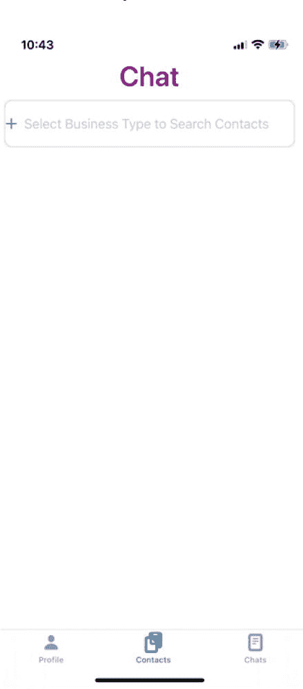

使用另一部手机创建您的个人资料，然后查找业务类型为`Tutor`（辅导教师）的条目（因为第一部手机中，我们已经将 Shantanu 创建为一名`Tutor`）。详情请参见下方屏幕。请注意列表如何根据我们在输入框中输入的前两个字母进行筛选。

| 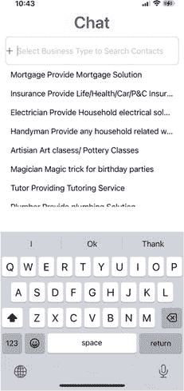 | 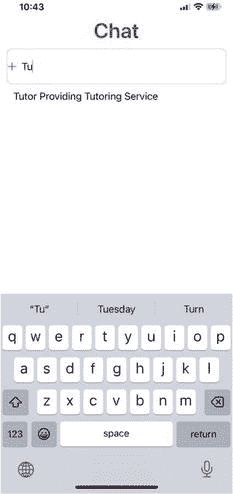 |

当我们选择辅导服务时，我们会看到联系人 Shantanu，点击该行即可发起聊天。详情请参见下方屏幕。

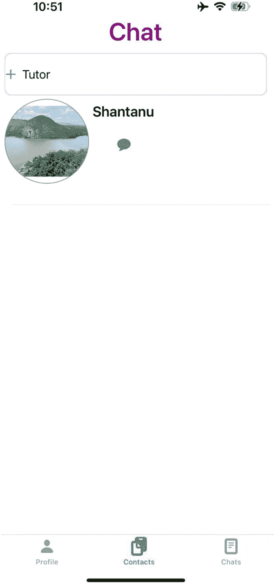

### 完整代码

以下是`ContactViewController`的完整代码：


```swift
//
//  ContactViewController.swift
//  Chat
//
//  Created by Shantanu Baruah on 2024/5/31.
//

import UIKit

class ContactViewController: UIViewController, UITabBarDelegate, UITableViewDelegate, UITableViewDataSource, UITextFieldDelegate {
    var contact = Contact()
    var profile: Profile?
    var userid: String = ""
    var origniatorProfile: Profile?
    var receipentProfile: Profile?

    private let tabBar: UITabBar = {
        let tabbar = UITabBar()
        tabbar.translatesAutoresizingMaskIntoConstraints = false
        tabbar.backgroundColor = UIColor.init(red: 171/255, green: 189/255, blue: 217/255, alpha: 1)
        let saveSymbolConfiguration = UIImage.SymbolConfiguration(pointSize: 16, weight: .black)
        let contact = UIImage(systemName: "doc.on.clipboard", withConfiguration: saveSymbolConfiguration)
        let contactbutton = UITabBarItem(title: "联系人", image: contact, selectedImage: contact)
        contactbutton.tag = 1
        let chat = UIImage(systemName: "doc.plaintext", withConfiguration: saveSymbolConfiguration)
        let chatbutton = UITabBarItem(title: "聊天", image: chat, selectedImage: chat)
        chatbutton.tag = 2
        let profile = UIImage(systemName: "person.fill", withConfiguration: saveSymbolConfiguration)
        let profilebutton = UITabBarItem(title: "个人资料", image: profile, selectedImage: profile)
        profilebutton.tag = 0
        tabbar.setItems([profilebutton, contactbutton, chatbutton], animated: false)
        return tabbar
    }()

    private let headerLabel: UILabel = {
        let label = UILabel()
        label.text = "聊天"
        label.translatesAutoresizingMaskIntoConstraints = false
        label.textColor = UIColor(displayP3Red: 128/255, green: 0/255, blue: 128/255, alpha: 1)
        label.textAlignment = .center
        label.font = UIFont.boldSystemFont(ofSize: 35)
        return label
    }()

    let businessTypeTextField: UITextField = {
        let textField = UITextField()
        textField.translatesAutoresizingMaskIntoConstraints = false
        textField.borderStyle = .roundedRect
        textField.textColor = .black
        textField.layer.borderColor = UIColor.systemGray4.cgColor
        textField.layer.borderWidth = 1
        textField.layer.cornerRadius = 10
        textField.placeholder = "选择业务类型以搜索联系人"
        textField.textColor = .black
        textField.isEnabled = true
        textField.keyboardType = .default
        return textField
    }()

    private let businessTypeTableView: UITableView = {
        let tableView = UITableView()
        tableView.translatesAutoresizingMaskIntoConstraints = false
        tableView.backgroundColor = .white
        tableView.isScrollEnabled = true
        return tableView
    }()

    private let contactTableView: UITableView = {
        let tableView = UITableView()
        tableView.translatesAutoresizingMaskIntoConstraints = false
        tableView.backgroundColor = .white
        tableView.isScrollEnabled = true
        return tableView
    }()

    override func viewDidLoad() {
        super.viewDidLoad()
        print(self.profile?.name ?? "无")
        setup()
        drawTabBar()
    }

    func setup() {
        view.backgroundColor = .white
        tabBar.delegate = self
        tabBar.selectedItem = tabBar.items![1]
        businessTypeTextField.delegate = self
        businessTypeTextField.leftView = UIImageView(image: UIImage(systemName: "plus"))
        businessTypeTextField.leftViewMode = .always
        businessTypeTextField.addTarget(self, action: #selector(businessTypeEditingChanged), for: .editingChanged)
        businessTypeTextField.addTarget(self, action: #selector(businessTypeEditingDidBegin), for: .editingDidBegin)
        businessTypeTextField.addTarget(self, action: #selector(businessTypeEditingDidEnd), for: .editingDidEnd)
        businessTypeTableView.delegate = self
        businessTypeTableView.dataSource = self
        businessTypeTableView.register(UITableViewCell.self, forCellReuseIdentifier: "business")
        businessTypeTableView.layer.borderWidth = 0
        businessTypeTableView.layer.borderColor = UIColor.white.cgColor
        businessTypeTableView.separatorStyle = .none
        businessTypeTableView.isHidden = true
        contactTableView.delegate = self
        contactTableView.dataSource = self
        contactTableView.register(ContactTableViewCell.self, forCellReuseIdentifier: "contact")
        contactTableView.layer.borderWidth = 0
        contactTableView.layer.borderColor = UIColor.white.cgColor
        contactTableView.separatorStyle = .singleLine
        contactTableView.isHidden = true
        setBusiness()
    }

    func tabBar(_ tabBar: UITabBar, didSelect item: UITabBarItem) {
        switch item.tag {
        case 0:
            popUpContact()
        case 2:
            popUpChat()
        default:
            popUpMarket()
        }
    }

    func popUpContact() {
    }

    func popUpChat() {
        let viewController = ChatViewController()
        viewController.profile = profile
        viewController.origniatorProfile = origniatorProfile
        viewController.receipentProfile = receipentProfile
        viewController.modalPresentationStyle = .overCurrentContext
        viewController.modalTransitionStyle = .crossDissolve
        self.present(viewController, animated: true, completion: nil)
    }

    func popUpMarket() {
    }

    func drawTabBar() {
        let screensize: CGRect = UIScreen.main.bounds
        let screenWidth = screensize.width
        let screenHeight = screensize.height
        view.addSubview(headerLabel)
        let constraints = [
            headerLabel.topAnchor.constraint(equalTo: view.topAnchor, constant: 45),
            headerLabel.widthAnchor.constraint(equalToConstant: screenWidth),
            headerLabel.heightAnchor.constraint(equalToConstant: 40)
        ]
        NSLayoutConstraint.activate(constraints)
        view.addSubview(businessTypeTextField)
        let constraints2 = [
            businessTypeTextField.topAnchor.constraint(equalTo: headerLabel.bottomAnchor, constant: 10),
            businessTypeTextField.leftAnchor.constraint(equalTo: view.leftAnchor, constant: 10),
            businessTypeTextField.widthAnchor.constraint(equalToConstant: screenWidth - 20),
            businessTypeTextField.heightAnchor.constraint(equalToConstant: 60)
        ]
        NSLayoutConstraint.activate(constraints2)
        view.addSubview(businessTypeTableView)
        let constraints3 = [
            businessTypeTableView.topAnchor.constraint(equalTo: businessTypeTextField.bottomAnchor, constant: 0),
            businessTypeTableView.leftAnchor.constraint(equalTo: view.leftAnchor, constant: 5),
            businessTypeTableView.widthAnchor.constraint(equalToConstant: screenWidth - 10),
            businessTypeTableView.heightAnchor.constraint(equalToConstant: 300)
        ]
        NSLayoutConstraint.activate(constraints3)
        view.addSubview(contactTableView)
        let constraints4 = [
            contactTableView.topAnchor.constraint(equalTo: businessTypeTextField.bottomAnchor, constant: 0),
            contactTableView.leftAnchor.constraint(equalTo: view.leftAnchor, constant: 5),
            contactTableView.widthAnchor.constraint(equalToConstant: screenWidth - 10),
            contactTableView.heightAnchor.constraint(equalToConstant: screenHeight - 50)
        ]
        NSLayoutConstraint.activate(constraints4)
        view.addSubview(tabBar)
        let constraints5 = [
            tabBar.bottomAnchor.constraint(equalTo: view.bottomAnchor, constant: 5),
            tabBar.leftAnchor.constraint(equalTo: view.leftAnchor, constant: 5),
            tabBar.widthAnchor.constraint(equalToConstant: screenWidth),
            tabBar.heightAnchor.constraint(equalToConstant: 80)
        ]
        NSLayoutConstraint.activate(constraints5)
    }

    // MARK: - 表格函数
    func tableView(_ tableView: UITableView, numberOfRowsInSection section: Int) -> Int {
        if tableView == businessTypeTableView {
            return business.count
        } else {
            return contact.profiles.count
        }
    }

    func tableView(_ tableView: UITableView, cellForRowAt indexPath: IndexPath) -> UITableViewCell {
        if tableView == businessTypeTableView {
            let cell = tableView.dequeueReusableCell(withIdentifier: "business", for: indexPath)
            cell.textLabel?.text = business[indexPath.row].businesstype + " " + business[indexPath.row].businessdesc
            return cell
        } else {
            let cell = tableView.dequeueReusableCell(withIdentifier: "contact", for: indexPath) as! ContactTableViewCell
            cell.nameButton.setTitle(contact.profiles[indexPath.row].name, for: .normal)
            let file = contact.profiles[indexPath.row].personalprofile.fileURL
            if let data = NSData(contentsOf: file!) {
                cell.profileImageView.image = UIImage(data: data as Data)
            }
            cell.profileImageView.layer.cornerRadius = 60
            cell.chatButton.addTarget(self, action: #selector(chatAction), for: .touchUpInside)
            cell.chatButton.tag = indexPath.row
            return cell
        }
    }

    /*
    单元格行高度默认设置为 40 像素
    */
    func tableView(_ tableView: UITableView, heightForRowAt indexPath: IndexPath) -> CGFloat {
        if tableView == businessTypeTableView {
            return 40
        } else {
            return 155
        }
    }

    func tableView(_ tableView: UITableView, didSelectRowAt indexPath: IndexPath) {
        if tableView == businessTypeTableView {
            contact.profiles.removeAll()
            businessTypeTextField.text = business[indexPath.row].businesstype
            businessTypeTextField.resignFirstResponder()
            self.contact.group.enter()
            self.contact.getContacts(businessType: businessTypeTextField.text!)
            self.contact.group.notify(queue: .main) { [self] in
                contact.profiles = contact.profiles.filter {
                    contact in return contact.userid != profile?.userid
                }
                contactTableView.isHidden = false
                contactTableView.reloadData()
            }
        }
    }

    @objc func chatAction(sender: UIButton) {
        let viewController = ChatDetailViewController()
        viewController.modalPresentationStyle = .overCurrentContext
        viewController.modalTransitionStyle = .crossDissolve
        origniatorProfile = profile
        receipentProfile = contact.profiles[sender.tag]
        viewController.profile = profile
        viewController.origniatorProfile = profile
        viewController.receipentProfile = contact.profiles[sender.tag]
        viewController.businessname = contact.profiles[sender.tag].businessname
        viewController.originatorname = (profile?.name)!
        viewController.recipientProfileImage = contact.profiles[sender.tag].personalprofile
        self.present(viewController, animated: true, completion: nil)
    }

    // MARK: - 对象操作
    // 业务类型文本字段函数
    @objc func businessTypeEditingDidBegin(sender: UITextField) {
        tempBusiness = business
        businessTypeTableView.isHidden = false
        contactTableView.isHidden = true
    }

    @objc func businessTypeEditingDidEnd(sender: UITextField) {
        business = tempBusiness
        businessTypeTableView.isHidden = true
        contactTableView.isHidden = false
    }

    @objc func businessTypeEditingChanged(sender: UITextField) {
        business = business.filter {
            business in return business.businesstype.trimmingCharacters(in: .whitespaces).lowercased().contains(sender.text!.lowercased())
        }
        if sender.text == "" {
            business = tempBusiness
        }
        businessTypeTableView.reloadData()
    }

    var business: [Business] = []
    var tempBusiness: [Business] = []

    func setBusiness() {
        business.append(Business(businesstype: "抵押贷款", businessdesc: "提供抵押贷款解决方案", imagename: "scribble"))
        business.append(Business(businesstype: "保险", businessdesc: "提供人寿/健康/车险/个人财产保险", imagename: "folder"))
        business.append(Business(businesstype: "电工", businessdesc: "提供家庭电气解决方案", imagename: "doc.text"))
        business.append(Business(businesstype: "勤杂工", businessdesc: "提供任何家庭相关维修工作", imagename: "book"))
        business.append(Business(businesstype: "手工艺人", businessdesc: "美术课/陶艺课", imagename: "graduationcap"))
        business.append(Business(businesstype: "魔术师", businessdesc: "生日派对的魔术表演", imagename: "square.and.arrow.down.fill"))
        business.append(Business(businesstype: "家教", businessdesc: "提供家教服务", imagename: "paperclip"))
        business.append(Business(businesstype: "水管工", businessdesc: "提供管道解决方案", imagename: "links"))
        business.append(Business(businesstype: "清洁工", businessdesc: "提供房屋清洁服务", imagename: "person"))
        business.append(Business(businesstype: "建筑师", businessdesc: "房屋设计和建筑服务", imagename: "globe"))
        business.append(Business(businesstype: "健身教练", businessdesc: "私人教练", imagename: "music.note.list"))
        business.append(Business(businesstype: "营养师", businessdesc: "提供营养指导和服务", imagename: "square.and.pencil"))
        business.append(Business(businesstype: "水疗", businessdesc: "获得上门水疗服务", imagename: "swift"))
        business.append(Business(businesstype: "装饰", businessdesc: "提供家居设计和装饰服务", imagename: "magnifyingglass"))
        business.append(Business(businesstype: "建筑工", businessdesc: "总承包商", imagename: "heart.fill"))
        business.append(Business(businesstype: "陶艺", businessdesc: "学习创作陶艺作品", imagename: "star.fill"))
        business.append(Business(businesstype: "遛狗师", businessdesc: "提供狗狗看护服务", imagename: "flag.fill"))
        business.append(Business(businesstype: "烘焙师", businessdesc: "定制蛋糕或派对用品", imagename: "folder.fill"))
        business.append(Business(businesstype: "舞蹈教练", businessdesc: "提供各类西方/印度古典舞培训", imagename: "bell.fill"))
        business.append(Business(businesstype: "护士", businessdesc: "提供上门护理服务", imagename: "tag.fill"))
        business.append(Business(businesstype: "园丁", businessdesc: "美化您的花坛或菜园", imagename: "bolt.fill"))
        business.append(Business(businesstype: "扫雪工", businessdesc: "提供除雪服务", imagename: "camera.fill"))
        business.append(Business(businesstype: "游泳教练", businessdesc: "个人或团体游泳课程", imagename: "phone.fill"))
        business.append(Business(businesstype: "武术", businessdesc: "学习武术/空手道/跆拳道", imagename: "calendar"))
        business.append(Business(businesstype: "摄像师", businessdesc: "为您的活动提供专业摄像", imagename: "video.fill"))
        business.append(Business(businesstype: "摄影师", businessdesc: "为您的活动提供专业摄影", imagename: "envelope.fill"))
        business.append(Business(businesstype: "登山教练", businessdesc: "学习如何攀登高山", imagename: "gearshape.fill"))
        business.append(Business(businesstype: "豪华轿车服务", businessdesc: "提供豪华轿车服务", imagename: "cart.fill"))
        business.append(Business(businesstype: "主持人", businessdesc: "为您的活动或节目提供服务", imagename: "giftcard.fill"))
        business.append(Business(businesstype: "唱片骑师", businessdesc: "为您的私人派对和活动提供 DJ 服务", imagename: "sunrise.fill"))
        business.append(Business(businesstype: "裁缝", businessdesc: "提供定制裁缝服务", imagename: "paintbrush.fill"))
        business.append(Business(businesstype: "画家", businessdesc: "学习如何绘画", imagename: "wrench.fill"))
        business.append(Business(businesstype: "通风管道清洁工", businessdesc: "提供通风管道清洁服务", imagename: "hammer.fill"))
        business.append(Business(businesstype: "维修工", businessdesc: "提供一般家庭维修服务", imagename: "house.fill"))
        business.append(Business(businesstype: "锁匠", businessdesc: "配钥匙或处理被锁门外的情况", imagename: "lock.fill"))
        business.append(Business(businesstype: "害虫控制", businessdesc: "提供害虫控制服务", imagename: "sparkles"))
    }
}
```


### ChatDetailViewController

`ChatDetailViewController` 用于显示用户与通讯录中另一人之间的对话。它继承自 `UIViewController`，并遵守 `UITableViewDelegate`、`UITableViewDataSource` 和 `UITextViewDelegate` 协议。关键属性定义如下：

- `profile`：当前用户的个人资料
- `origniatorProfile`：聊天发起者的个人资料
- `receipentProfile`：聊天接收者的个人资料
- `businessname`：与聊天关联的业务名称
- `originatorname`：聊天发起者名称
- `recipientProfileImage`：作为 CloudKit 资产的接收者个人资料图片
- `whichTab`：用于追踪请求来源
- `chats`：用于存储聊天消息或对话的数组
- `chatFlag`：用于聊天相关逻辑的布尔标志
- `recipientProfileImageBanner`：另一个个人资料图片资产

```
import UIKit
import CloudKit
class ChatDetailViewController: UIViewController, UITableViewDelegate, UITableViewDataSource, UITextViewDelegate {
var profile:Profile?
var origniatorProfile:Profile?
var receipentProfile:Profile?
var businessname:String = ""
var originatorname:String = ""
var recipientProfileImage:CKAsset?
var whichTab:Int?
var chats:[Conversation] = []
var chatFlag:Bool = true
var recipientProfileImageBanner:CKAsset?
```

#### UI 对象定义

以下代码定义了 `ChatDetailViewController` 的几个 UI 组件：

- **聊天表格视图（`chatTableView`）：**这是以表格视图格式显示聊天消息的主要元素。
- **顶部栏（`topBar`）：**此视图使用浅灰色背景，用作聊天视图中的标题栏。
- **个人资料图片视图（`profileImageView`）：**此图片视图显示占位图片（人物剪影），旨在展示接收者的个人资料图片。它具有圆角和边框。
- **顶部标签（`topLabel`）：**此标签显示聊天标题。它左对齐并使用粗体。
- **取消图片视图（`cancelImageView`）：**此图片视图显示关闭图标（`xmark`），用于关闭或解散聊天视图。
- **外壳文本视图（`shellTextView`）：**此文本视图不可编辑，带有边框，并使用较小的字号。用于显示占位文本视图。
- **外壳保存按钮（`shellSaveButton`）：**此按钮处于禁用状态，将显示在 `shellTextView` 旁边。这也是一个占位按钮。
- **聊天文本视图（`chatTextView`）：**此文本视图供用户撰写聊天消息。它带有边框和圆角，并使用较小的字号。
- **保存按钮（`saveButton`）：**此按钮处于禁用状态，用于将聊天内容保存到存储库。

```
private let chatTableView:UITableView = {
let tableView = UITableView()
tableView.translatesAutoresizingMaskIntoConstraints = false
tableView.backgroundColor = .white
tableView.isScrollEnabled = true
return tableView
}()
let topBar:UIView = {
let view = UIView()
view.backgroundColor = UIColor.systemGray6
view.translatesAutoresizingMaskIntoConstraints = false
return view
}()
var profileImageView: UIImageView = {
let imageView = UIImageView()
imageView.image = UIImage(systemName: "person.fill")
imageView.contentMode = .scaleAspectFit
imageView.translatesAutoresizingMaskIntoConstraints = false
imageView.layer.masksToBounds = true
imageView.layer.borderWidth = 1
imageView.layer.borderColor = UIColor.systemGray.cgColor
imageView.layer.cornerRadius = 20
return imageView
}()
let topLabel:UILabel = {
let label = UILabel()
label.translatesAutoresizingMaskIntoConstraints = false
label.textAlignment = .left
label.textColor = .black
label.font = UIFont.systemFont(ofSize: 20, weight: .bold)
return label
}()
var cancelImageView: UIImageView = {
let imageView = UIImageView()
imageView.contentMode = .scaleAspectFit
imageView.translatesAutoresizingMaskIntoConstraints = false
imageView.layer.masksToBounds = true
imageView.image = UIImage(systemName: "xmark")
return imageView
}()
let shellTextView: UITextView = {
let textView = UITextView()
textView.translatesAutoresizingMaskIntoConstraints = false
textView.isScrollEnabled = false
textView.font = UIFont.systemFont(ofSize: 17)
textView.layer.borderWidth = 1
textView.layer.borderColor = UIColor.gray.cgColor
textView.layer.cornerRadius = 10
return textView
}()
let shellSaveButton:UIButton = {
let uiButton  = UIButton()
uiButton.translatesAutoresizingMaskIntoConstraints = false
uiButton.setTitleColor(UIColor.black, for: .normal)
uiButton.contentHorizontalAlignment = .left
uiButton.contentVerticalAlignment = .top
uiButton.titleLabel?.font = UIFont.systemFont(ofSize: 16, weight: .semibold)
uiButton.isEnabled = false
return uiButton
}()
let chatTextView: UITextView = {
let textView = UITextView()
textView.translatesAutoresizingMaskIntoConstraints = false
textView.isScrollEnabled = false
textView.font = UIFont.systemFont(ofSize: 17)
textView.layer.borderWidth = 1
textView.layer.borderColor = UIColor.gray.cgColor
textView.layer.cornerRadius = 10
return textView
}()
let saveButton:UIButton = {
let uiButton  = UIButton()
uiButton.translatesAutoresizingMaskIntoConstraints = false
uiButton.setTitleColor(UIColor.black, for: .normal)
uiButton.contentHorizontalAlignment = .left
uiButton.contentVerticalAlignment = .top
uiButton.titleLabel?.font = UIFont.systemFont(ofSize: 16, weight: .semibold)
uiButton.isEnabled = false
return uiButton
}()
```

## 生命周期方法

`viewDidLoad()` 方法用于执行视图控制器的初始设置任务。在下面的代码中：

- 它初始化视图控制器的父类。
- 它获取聊天数据以填充聊天视图。

代码分解如下：

- `super.viewDidLoad()`：调用父类的 `viewDidLoad()` 方法以确保正确初始化。
- `queryChats()`：调用名为 `queryChats()` 的自定义方法，用于从数据源获取聊天数据。

```
override func viewDidLoad() {
super.viewDidLoad()
queryChats()
}
```

#### 查询聊天方法

`queryChats()` 函数负责获取当前对话的聊天数据并设置 UI 元素。以下是代码的分解说明：

- **创建对话对象：** 创建一个对话对象（表示聊天会话的自定义模态类）。
- **进入组：** 使用 `chat.group.enter()` 进入一个组。这涉及在 CloudKit 内管理数据访问或同步。
- **获取聊天记录：** 调用 `Conversation` 对象的 `getChats` 方法。该方法接收接收者名称（`businessname`）、发起者名称（`originatorname`）以及一个完成处理器。

**完成处理器：** 完成处理器接收两个参数：

- `Chats`：一个对话对象数组。
- `Error`：如果在获取数据时出现问题，则为一个错误对象。

完成处理器内部执行以下操作：

- **更新聊天数组：** 用获取到的聊天数据更新 `self.chats` 属性。
- **调用设置函数：** 调用名为 `setup()` 的方法，负责根据聊天数据设置聊天表格视图和其他 UI 元素。
- **调用绘制顶部栏函数：** 调用名为 `drawTopBar()` 的方法，负责设置聊天窗口的 UI 元素。

```
func queryChats(){
let chat:Conversation = Conversation()
chat.group.enter()
chat.getChats(receipentname: businessname, originatorname: originatorname){
//chat.getChats(receipentname: (receipentProfile?.businessname)!, originatorname: (origniatorProfile?.name)!){
[self] (chats, error) in
self.chats = chats
setup()
drawTopBar()
}
}
```


#### 设置方法

`setup()`函数配置`chatTableView`以显示聊天消息。代码分解如下：

- `chatTableView.delegate = self`：将当前视图控制器设置为聊天表格视图的委托，负责处理用户交互。
- `chatTableView.dataSource = self`：将当前视图控制器设置为聊天表格视图的数据源，负责提供数据以填充表格视图。
- `chatTableView.register(ChatDetailsTableViewCell.self, forCellReuseIdentifier: "chat")`：注册一个名为`ChatDetailsTableViewCell`的自定义单元格类，以便在表格视图中复用。
- `chatTableView.layer.borderWidth = 0`：移除表格视图的边框。
- `chatTableView.layer.borderColor = UIColor.white.cgColor`：将边框颜色设置为白色（但由于边框宽度为 0，该颜色不可见）。
- `chatTableView.separatorStyle = .none`：移除表格视图单元格之间的分隔线。

```
func setup(){
    chatTableView.delegate = self
    chatTableView.dataSource = self
    chatTableView.register(ChatDetailsTableViewCell.self, forCellReuseIdentifier: "chat")
    chatTableView.layer.borderWidth = 0
    chatTableView.layer.borderColor = UIColor.white.cgColor
    chatTableView.separatorStyle = .none
}
```

### 在屏幕上绘制 UI 对象

`drawTopBar()`函数负责构建聊天视图界面，包括个人资料图片、顶部标签和取消按钮等元素。它还将聊天表格视图和文本输入组件定位在屏幕底部。代码分解如下：

**屏幕尺寸计算**：获取屏幕尺寸用于布局。

**顶部栏创建**：

-   创建一个具有特定背景颜色的`topBar`视图。
-   将`topBar`作为`subview`添加到主视图。
-   为`topBar`设置约束，使其覆盖屏幕顶部并具有特定高度。

**个人图片视图创建**：

-   创建一个`profileImageView`来显示接收者的个人资料图片。
-   将`profileImageView`作为`subview`添加到`topBar`。
-   为`profileImageView`设置约束，使其位于`topBar`的左上角。
-   如果`recipientProfileImage`资源可用，则加载个人资料图片。

**顶部标签创建**：

-   创建一个`topLabel`来显示聊天标题或发起者名称。
-   将`topLabel`作为`subview`添加到`topBar`。
-   为`topLabel`设置约束，使其位于`profileImageView`的右侧。
-   根据`recipientProfileImageBanner`是否为`nil`来设置`topLabel`的文本。

**取消按钮创建**：

-   创建一个带有关闭图标的`cancelImageView`。
-   将`cancelImageView`作为`subview`添加到`topBar`。
-   为`cancelImageView`设置约束，使其位于`topBar`的右上角。
-   为`cancelImageView`添加点击手势识别器，以触发`cancel(tapGestureRecognizer:)`方法。

**聊天表格视图创建**：

-   创建一个`chatTableView`来显示聊天消息。
-   将`chatTableView`作为`subview`添加到主视图。
-   为`chatTableView`设置约束，使其位于`topBar`下方并覆盖大部分屏幕。

**外壳文本视图创建**：

-   创建一个`shellTextView`作为占位视图。
-   将`shellTextView`作为`subview`添加到主视图。
-   为`shellTextView`设置约束，使其位于屏幕底部。

**外壳保存按钮创建**：

-   创建一个带有纸飞机图标的`shellSaveButton`。
-   将`shellSaveButton`作为`subview`添加到主视图。
-   为`shellSaveButton`设置约束，使其位于`shellTextView`的右侧。

```
func drawTopBar(){
    let screensize: CGRect = UIScreen.main.bounds
    let screenWidth = screensize.width
    let screenHeight = screensize.height
    view.addSubview(topBar)
    NSLayoutConstraint.activate([
        topBar.topAnchor.constraint(equalTo: view.topAnchor),
        topBar.leadingAnchor.constraint(equalTo: view.leadingAnchor),
        topBar.trailingAnchor.constraint(equalTo: view.trailingAnchor),
        topBar.heightAnchor.constraint(equalToConstant: 100) // 根据需要自定义高度
    ])
    topBar.addSubview(profileImageView)
    NSLayoutConstraint.activate([
        profileImageView.topAnchor.constraint(equalTo: topBar.topAnchor, constant: 50),
        profileImageView.leftAnchor.constraint(equalTo: view.leftAnchor, constant: 5),
        profileImageView.heightAnchor.constraint(equalToConstant: 40),
        profileImageView.widthAnchor.constraint(equalToConstant: 40)
    ])
    let file = self.recipientProfileImage?.fileURL
    if let data = NSData(contentsOf: file!) {
        profileImageView.image = UIImage(data: data as Data)
    }
    topBar.addSubview(topLabel)
    NSLayoutConstraint.activate([
        topLabel.topAnchor.constraint(equalTo: topBar.topAnchor, constant: 55),
        topLabel.leftAnchor.constraint(equalTo: profileImageView.rightAnchor, constant: 10),
        topLabel.widthAnchor.constraint(equalToConstant: screenWidth - 70)
    ])
    if(recipientProfileImageBanner != nil){
        topLabel.text = self.originatorname
    }else{
        topLabel.text = self.businessname
    }
    topBar.addSubview(cancelImageView)
    NSLayoutConstraint.activate([
        cancelImageView.topAnchor.constraint(equalTo: topBar.topAnchor, constant: 55),
        cancelImageView.rightAnchor.constraint(equalTo: topBar.rightAnchor, constant: -25),
        cancelImageView.heightAnchor.constraint(equalToConstant: 25),
        cancelImageView.widthAnchor.constraint(equalToConstant: 25)
    ])
    let cancelGestureRecognizer = UITapGestureRecognizer(target: self, action: #selector(cancel(tapGestureRecognizer:)))
    cancelImageView.isUserInteractionEnabled = true
    cancelImageView.addGestureRecognizer(cancelGestureRecognizer)
    view.addSubview(chatTableView)
    let constraints1 = [
        chatTableView.topAnchor.constraint(equalTo: topBar.bottomAnchor, constant: 0),
        chatTableView.leftAnchor.constraint(equalTo: view.leftAnchor, constant: 5),
        chatTableView.widthAnchor.constraint(equalToConstant: screenWidth),
        chatTableView.heightAnchor.constraint(equalToConstant: screenHeight - 170)
    ]
    NSLayoutConstraint.activate(constraints1)
    shellTextView.delegate = self
    view.addSubview(shellTextView)
    NSLayoutConstraint.activate([
        shellTextView.bottomAnchor.constraint(equalTo: view.bottomAnchor, constant: -40),
        shellTextView.leftAnchor.constraint(equalTo: view.leftAnchor, constant: 5),
        shellTextView.widthAnchor.constraint(equalToConstant: screenWidth - 40),
        shellTextView.heightAnchor.constraint(equalToConstant: 40)
    ])
    view.addSubview(shellSaveButton)
    let constraints3 = [
        shellSaveButton.topAnchor.constraint(equalTo: view.bottomAnchor, constant: -70),
        shellSaveButton.leftAnchor.constraint(equalTo: shellTextView.rightAnchor, constant: 5),
        shellSaveButton.rightAnchor.constraint(equalToSystemSpacingAfter: shellTextView.rightAnchor, multiplier: 40),
        shellSaveButton.heightAnchor.constraint(equalToConstant: 40)
    ]
    NSLayoutConstraint.activate(constraints3)
    shellSaveButton.setImage(UIImage(systemName: "paperplane.fill"), for: .normal)
    // 设置通知观察者以处理文本变化
}
```


### 取消事件方法

取消函数处理用户在聊天详情视图中点击取消按钮时的操作。它会关闭当前聊天视图，并呈现 `ContactViewController`。以下是对代码片段的详细说明：

- **移除约束：** 调用名为 `removeChatDetailsConstraints()` 的函数，负责移除与聊天视图元素相关的自动布局约束
- **创建 ContactViewController：** 实例化一个 `ContactViewController` 实例
- **传递用户信息：** 将 `origniatorProfile`、`receipentProfile` 和 `profile` 对象传递给新的视图控制器
- **设置呈现样式：** 设置 `ContactViewController` 的呈现和过渡样式
- **呈现 ContactViewController：** 以模态方式在当前视图控制器上呈现 `ContactViewController`

```
@objc func cancel(tapGestureRecognizer: UITapGestureRecognizer){
removeChatDetailsConstraints()
let viewController = ContactViewController()
viewController.origniatorProfile = origniatorProfile
viewController.receipentProfile = receipentProfile
viewController.profile = profile
viewController.modalPresentationStyle = .overCurrentContext
viewController.modalTransitionStyle = .crossDissolve
self.present(viewController, animated: true, completion: nil)
}
```

### 移除约束方法

`removeChatDetailsConstraints()` 函数负责从父视图中移除所有与聊天详情视图相关的约束和 `subviews`。代码详情如下：

- **移除约束：** 遍历每个 UI 元素（`topBar`、`profileImageView`、`topLabel`、`cancelImageView`、`shellTextView`、`shellSaveButton` 和 `chatTableView`）的约束并将其移除
- **移除子视图：** 将每个 UI 元素从其 `superview` 中移除

```
func removeChatDetailsConstraints(){
topBar.removeConstraints(topBar.constraints)
topBar.removeFromSuperview()
profileImageView.removeConstraints(profileImageView.constraints)
profileImageView.removeFromSuperview()
topLabel.removeConstraints(topLabel.constraints)
topLabel.removeFromSuperview()
cancelImageView.removeConstraints(cancelImageView.constraints)
cancelImageView.removeFromSuperview()
shellTextView.removeConstraints(shellTextView.constraints)
shellTextView.removeFromSuperview()
shellSaveButton.removeConstraints(shellSaveButton.constraints)
shellSaveButton.removeFromSuperview()
chatTableView.removeConstraints(chatTableView.constraints)
chatTableView.removeFromSuperview()
}
```

### 表格视图方法

提供的代码实现了 `UITableViewDataSource` 和 `UITableViewDelegate` 方法，用于配置和管理聊天表格视图。代码分解如下：

**`tableView(_:numberOfRowsInSection:)`**

- 返回表格视图中的行数，该行数等于 chats 数组的计数

**`tableView(_:cellForRowAt:)`**

- 出队一个类型为 `ChatDetailsTableViewCell` 的可重用单元格
- 从单元格的 `profileImageView` 和 `chatButton` 中移除约束和 `subviews`
- 将单元格的选择样式设置为 none，以防止选中时高亮
- 为聊天文本创建一个带有段落缩进样式的属性字符串
- 根据 `originatorid` 属性确定消息的发送者
- 根据消息发送者设置个人资料图像、聊天按钮背景颜色和右侧位置
- 根据聊天文本长度计算单元格高度
- 设置聊天按钮的属性标题，并返回配置好的单元格

**`tableView(_:heightForRowAt:)`**

- 根据聊天文本的长度计算聊天表格视图单元格的高度

```
func tableView(_ tableView: UITableView, numberOfRowsInSection section: Int) -> Int {
return chats.count
}
func tableView(_ tableView: UITableView, cellForRowAt indexPath: IndexPath) -> UITableViewCell {
let cell = tableView.dequeueReusableCell(withIdentifier: "chat", for: indexPath) as! ChatDetailsTableViewCell
cell.profileImageView.removeConstraints(cell.profileImageView.constraints)
cell.profileImageView.removeFromSuperview()
cell.chatButton.removeConstraints(cell.chatButton.constraints)
cell.chatButton.removeFromSuperview()
cell.selectionStyle = .none
let paragraphStyle = NSMutableParagraphStyle()
paragraphStyle.firstLineHeadIndent = 5
paragraphStyle.headIndent = 5
// 创建一个带有段落样式的属性字符串
let attributedText = NSAttributedString(string: "\(chats[indexPath.row].chattext!)", attributes: [NSAttributedString.Key.paragraphStyle: paragraphStyle])
if(chats[indexPath.row].originatorid == profile?.userid){
var file1 = profile?.personalprofile.fileURL
if(recipientProfileImageBanner != nil){
file1 = profile?.personalprofile.fileURL
}
if var data1 = NSData(contentsOf: file1!) {
cell.profileImageView.image = UIImage(data: data1 as Data)
cell.profileImageView.layer.cornerRadius =  15
data1 = NSData()
cell.chatButton.backgroundColor = .white
}
file1 = nil
cell.rightPosition = 5
}else{
var file = recipientProfileImage?.fileURL
if var data = NSData(contentsOf: file!) {
cell.profileImageView.image = UIImage(data: data as Data)
cell.profileImageView.layer.cornerRadius =  15
data = NSData()
cell.chatButton.backgroundColor = .systemGray6
}
file = nil
cell.rightPosition = 40
}
var size = chats[indexPath.row].chattext.count / 40
if(size == 0 || size == 1){
size = 55
}else{
size = size * 32
}
cell.buttonPosition = CGFloat(size)
cell.chatButton.setAttributedTitle(attributedText, for: .normal)
return cell
}
func tableView(_ tableView: UITableView, heightForRowAt indexPath: IndexPath) -> CGFloat {
var size = chats[indexPath.row].chattext.count / 40
if(size == 0 || size == 1){
size = 55 + 20
}else{
size = size * 32 + 20
}
return CGFloat(size)
}
```

### 布局子视图生命周期方法

`viewDidLayoutSubviews()` 方法在视图生命周期内会被多次调用，特别是在需要调整 `subviews'` 框架时。在此场景中，它用于在初始布局后将聊天表格视图滚动到最后一行。代码分解如下：

- `super.viewDidLayoutSubviews()`：调用父类实现以确保正常行为
- **条件检查：** 检查 chats 数组是否有元素且 `chatFlag` 是否为 true
- **滚动到最后一行：** 调用 `scrollToLastRow()` 方法将聊天表格视图滚动到最后一条消息
- **更新标志：** 将 `chatFlag` 设置为 false，以防止在后续对 `viewDidLayoutSubviews()` 的调用中重复滚动

```
override func viewDidLayoutSubviews() {
super.viewDidLayoutSubviews()
if(chats.count != 0 && chatFlag){
scrollToLastRow()
chatFlag = false
}
}
```

### 自定义方法 `scrollToLastRow()`

`scrollToLastRow()` 函数旨在将聊天表格视图滚动到对话中的最后一条消息。代码分解如下：

- **计算最后一行索引：** 通过将第 0 部分的总行数减 1 来确定表格视图中最后一行的索引
- **创建索引路径：** 创建一个代表表格视图中最后一行的 `IndexPath` 对象
- **滚动到最后一行：** 使用 `chatTableView` 的 `scrollToRow(at:at:animated:)` 方法，以滚动位置在底部并带有动画效果，滚动到指定的索引路径

```
func scrollToLastRow() {
let lastRowIndex = chatTableView.numberOfRows(inSection: 0) - 1
let lastRowIndexPath = IndexPath(row: lastRowIndex, section: 0)
chatTableView.scrollToRow(at: lastRowIndexPath, at: .bottom, animated: true)
}
```


### 文本视图事件方法

当用户开始编辑`shellTextView`时触发此功能。其主要目标是从初始状态（含占位符）过渡到活跃的聊天输入状态。请参阅下方代码分解：

- **移除占位符元素：** 移除`shellTextView`和`shellSaveButton`的约束及子视图，以清除占位区域。
- **添加聊天文本视图：** 将`chatTextView`添加为子视图并设置其约束，使其位于视图底部。
- **激活文本输入：** 让`chatTextView`成为第一响应者以启用键盘输入。
- **设置通知观察者：** 添加一个通知观察者，通过`UITextView.textDidChangeNotification`监控`chatTextView`中的文本变化。
- **添加保存按钮：** 将`saveButton`添加为子视图并设置其约束，使其位于`chatTextView`右侧。
- **配置保存按钮：** 为`saveButton`设置图像，并为`saveChatAction`方法添加目标动作。

```
func textViewDidBeginEditing(_ textView: UITextView) {
let screensize: CGRect = UIScreen.main.bounds
let screenWidth = screensize.width
shellTextView.removeConstraints(shellTextView.constraints)
shellTextView.removeFromSuperview()
shellSaveButton.removeConstraints(shellSaveButton.constraints)
shellSaveButton.removeFromSuperview()
view.addSubview(chatTextView)
NSLayoutConstraint.activate([
chatTextView.bottomAnchor.constraint(equalTo: view.bottomAnchor, constant: -340),
chatTextView.leftAnchor.constraint(equalTo: view.leftAnchor, constant: 5),
chatTextView.widthAnchor.constraint(equalToConstant: screenWidth - 40),
chatTextView.heightAnchor.constraint(equalToConstant: 40)
])
chatTextView.becomeFirstResponder()
// 设置通知观察者以处理文本变化
NotificationCenter.default.addObserver(self, selector: #selector(handleTextChange), name: UITextView.textDidChangeNotification, object: chatTextView)
view.addSubview(saveButton)
let constraints3 = [
saveButton.topAnchor.constraint(equalTo: view.bottomAnchor, constant: -370),
saveButton.leftAnchor.constraint(equalTo: chatTextView.rightAnchor, constant: 5),
saveButton.rightAnchor.constraint(equalToSystemSpacingAfter: chatTextView.rightAnchor, multiplier: 40),
saveButton.heightAnchor.constraint(equalToConstant: 40)
]
NSLayoutConstraint.activate(constraints3)
saveButton.setImage(UIImage(systemName: "paperplane.fill"), for: .normal)
saveButton.addTarget(self, action: #selector(saveChatAction), for: .touchUpInside)
}
```

### 事件函数 handleTextChange()

`handleTextChange()` 函数负责响应`chatTextView`文本内容的变化来更新界面。下方是代码分解：

- **启用/禁用保存按钮：** 检查`chatTextView`中去除空白后的文本是否为空。如果为空，则禁用`saveButton`；否则，启用它。
- **计算文本视图高度：** 根据`chatTextView`的内容计算其预估大小，以动态调整高度。
- **更新文本视图高度约束：** 遍历`chatTextView`的约束，并根据计算出的预估大小更新高度约束。

```
@objc private func handleTextChange() {
if(chatTextView.text.trimmingCharacters(in: .whitespaces).count == 0){
saveButton.isEnabled = false
}else{
saveButton.isEnabled = true
}
let size = CGSize(width: UIScreen.main.bounds.width - 30, height: .infinity)
let estimatedSize = chatTextView.sizeThatFits(size)
chatTextView.constraints.forEach { (constraint) in
if constraint.firstAttribute == .height {
constraint.constant = estimatedSize.height
}
}
}
```

### 保存聊天事件方法

此函数处理保存新聊天消息并更新界面的逻辑。下方是代码分解：

**创建新聊天对象：** 使用输入的文本和发起者 ID 创建一个新的对话对象。

**禁用文本输入和保存按钮：** 禁用`chatTextView`的编辑功能并禁用`saveButton`，以防止意外重复提交。

**重置聊天文本视图：** 清除文本内容，移除约束，并将`chatTextView`从父视图中移除。

**恢复占位符元素：** 添加占位符`shellTextView`，设置其约束，并重新启用它。

**将新聊天添加到数组：** 将新创建的聊天对象追加到聊���数组中。

**重新加载聊天表格视图：** 重新加载`chatTableView`中的数据以反映新消息。

**重新启用文本输入和保存按钮：** 启用`chatTextView`的编辑功能并重新启用`saveButton`。

**恢复占位符保存按钮：** 添加占位符`shellSaveButton`，设置其约束，并重新配置它。

**确定发起者名称：** 根据是否存在`recipientProfileImageBanner`来设置`on`变量，以显示相应的发起者名称。

**滚动到最后一行：** 调用`scrollToLastRow()`以确保新消息可见。

**检查聊天表格是否存在（异步）：** 使用聊天对象的`chatTableExists`方法检查收件人云端是否存在对话表格，并处理检查过程中可能的错误。根据结果：
- **记录存在：** 如果表格存在，则进入聊天组并调用`saveNewChatToCloud`创建包含基本信息的新聊天条目。
- **记录不存在：** 如果表格不存在，则进入聊天组并调用`saveNewChatRecordsToCloud`创建聊天表格，保存第一条消息并附上额外的个人资料信息。

**完成通知：** 使用完成闭包在操作成功或失败时打印消息。


```swift
@objc func saveChatAction(sender: UIButton){
    let chat = Conversation(chattext: chatTextView.text, originatorid: profile?.userid)
    chatTextView.isEditable = false
    saveButton.isEnabled = false
    let screensize: CGRect = UIScreen.main.bounds
    let screenWidth = screensize.width
    chatTextView.resignFirstResponder()
    chatTextView.text = ""
    chatTextView.removeConstraints(chatTextView.constraints)
    chatTextView.removeFromSuperview()
    saveButton.removeConstraints(saveButton.constraints)
    saveButton.removeFromSuperview()
    shellTextView.delegate = self
    view.addSubview(shellTextView)
    NSLayoutConstraint.activate([
        shellTextView.bottomAnchor.constraint(equalTo: view.bottomAnchor, constant: -40),
        shellTextView.leftAnchor.constraint(equalTo: view.leftAnchor, constant: 5),
        shellTextView.widthAnchor.constraint(equalToConstant: screenWidth - 40),
        shellTextView.heightAnchor.constraint(equalToConstant: 40)
    ])
    chats.append(chat)
    chatTableView.reloadData()
    chatTextView.isEditable = true
    saveButton.isEnabled = true
    view.addSubview(shellSaveButton)
    let constraints3 = [
        shellSaveButton.topAnchor.constraint(equalTo: view.bottomAnchor, constant: -70),
        shellSaveButton.leftAnchor.constraint(equalTo: shellTextView.rightAnchor, constant: 5),
        shellSaveButton.rightAnchor.constraint(equalToSystemSpacingAfter: shellTextView.rightAnchor, multiplier: 40),
        shellSaveButton.heightAnchor.constraint(equalToConstant: 40)
    ]
    NSLayoutConstraint.activate(constraints3)
    shellSaveButton.setImage(UIImage(systemName: "paperplane.fill"), for: .normal)
    var on:String = ""
    if(recipientProfileImageBanner != nil){
        on = originatorname
    }else{
        on = (profile?.name)!
    }
    scrollToLastRow()
    chat.chatTableExists(receipentname: businessname , originatorname: on) { [self] (recordExists, error) in
        if let error = error{
            print(error.localizedDescription)
            chat.group.enter()
            if(recipientProfileImageBanner != nil){
                chat.saveNewChatRecordsToCloud(receipentname: businessname, originatorname: originatorname, receipentprofile: recipientProfileImage!, originatorprofile: (profile?.personalprofile)!, lastchat: chatTextView.text)
            }else{
                chat.saveNewChatRecordsToCloud(receipentname: businessname, originatorname: (profile?.name)!, receipentprofile: recipientProfileImage!, originatorprofile: (profile?.personalprofile)!, lastchat: chatTextView.text)
            }
            chat.group.notify(queue: .main) {
                print("First One")
            }
        }else{
            if recordExists{
                print("Record Type Exists")
                chat.group.enter()
                if(recipientProfileImageBanner != nil){
                    chat.saveNewChatToCloud(tablename: businessname, receipentname: businessname, originatorname: originatorname)
                }else{
                    chat.saveNewChatToCloud(tablename: businessname, receipentname: businessname, originatorname: (profile?.name)!)
                }
                chat.group.notify(queue: .main){
                    print("Here now")
                }
            }
        }
    }
}
```

### 运行应用

从联系人列表中，Shaurya 选择与 Shantanu 聊天时，将显示以下界面。请注意，名称是 Shantanu 的企业名称（SSNEnterprise）。

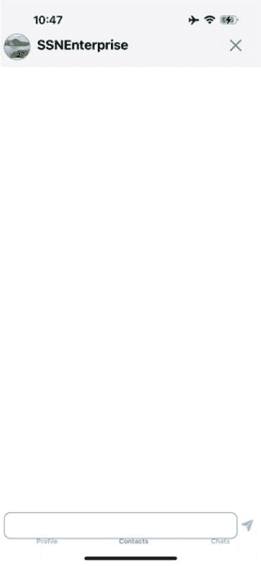

如下图所示，Shaurya 正在发起聊天。

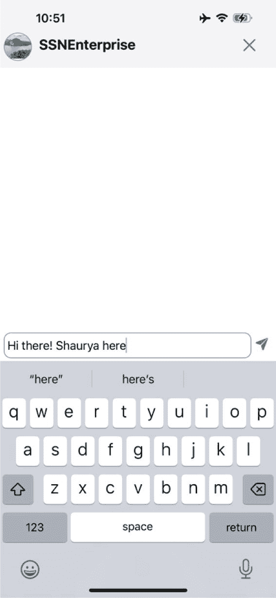

我们现在使用 Shantanu 的手机，在聊天窗口中看到以下界面，显示来自 Shaurya 的消息。

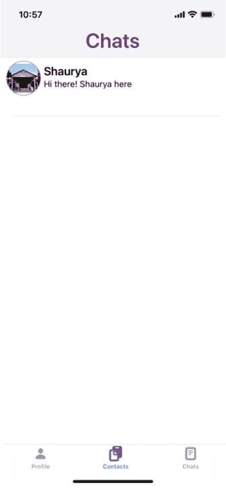

下面显示了三个界面。第一个界面在用户点击聊天用户（此处为 Shaurya）时显示。第二个界面是用户与其他用户（Shantanu 与 Shaurya 聊天）进行对话的界面。最后一个界面是会话展示界面。

| 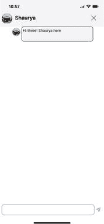 | 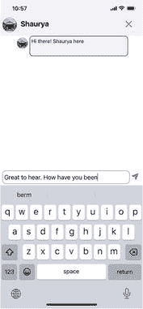 | 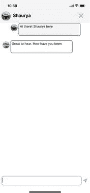 |

### 完整代码

下方是 `ChatDetailViewController` 的完整代码。


```swift
//
//  ChatViewController.swift
//  Chat
//
//  Created by Shantanu Baruah on 2023/6/24.
//

import UIKit
import CloudKit

class ChatDetailViewController: UIViewController, UITableViewDelegate, UITableViewDataSource, UITextViewDelegate {

    var profile: Profile?
    var origniatorProfile: Profile?
    var receipentProfile: Profile?
    var businessname: String = ""
    var originatorname: String = ""
    var recipientProfileImage: CKAsset?
    var whichTab: Int?
    var chats: [Conversation] = []
    var chatFlag: Bool = true
    var recipientProfileImageBanner: CKAsset?

    private let chatTableView: UITableView = {
        let tableView = UITableView()
        tableView.translatesAutoresizingMaskIntoConstraints = false
        tableView.backgroundColor = .white
        tableView.isScrollEnabled = true
        return tableView
    }()

    let topBar: UIView = {
        let view = UIView()
        view.backgroundColor = UIColor.systemGray6
        view.translatesAutoresizingMaskIntoConstraints = false
        return view
    }()

    var profileImageView: UIImageView = {
        let imageView = UIImageView()
        imageView.image = UIImage(systemName: "person.fill")
        imageView.contentMode = .scaleAspectFit
        imageView.translatesAutoresizingMaskIntoConstraints = false
        imageView.layer.masksToBounds = true
        imageView.layer.borderWidth = 1
        imageView.layer.borderColor = UIColor.systemGray.cgColor
        imageView.layer.cornerRadius = 20
        return imageView
    }()

    let topLabel: UILabel = {
        let label = UILabel()
        label.translatesAutoresizingMaskIntoConstraints = false
        label.textAlignment = .left
        label.textColor = .black
        label.font = UIFont.systemFont(ofSize: 20, weight: .bold)
        return label
    }()

    var cancelImageView: UIImageView = {
        let imageView = UIImageView()
        imageView.contentMode = .scaleAspectFit
        imageView.translatesAutoresizingMaskIntoConstraints = false
        imageView.layer.masksToBounds = true
        imageView.image = UIImage(systemName: "xmark")
        return imageView
    }()

    let shellTextView: UITextView = {
        let textView = UITextView()
        textView.translatesAutoresizingMaskIntoConstraints = false
        textView.isScrollEnabled = false
        textView.font = UIFont.systemFont(ofSize: 17)
        textView.layer.borderWidth = 1
        textView.layer.borderColor = UIColor.gray.cgColor
        textView.layer.cornerRadius = 10
        return textView
    }()

    let shellSaveButton: UIButton = {
        let uiButton = UIButton()
        uiButton.translatesAutoresizingMaskIntoConstraints = false
        uiButton.setTitleColor(UIColor.black, for: .normal)
        uiButton.contentHorizontalAlignment = .left
        uiButton.contentVerticalAlignment = .top
        uiButton.titleLabel?.font = UIFont.systemFont(ofSize: 16, weight: .semibold)
        uiButton.isEnabled = false
        return uiButton
    }()

    let chatTextView: UITextView = {
        let textView = UITextView()
        textView.translatesAutoresizingMaskIntoConstraints = false
        textView.isScrollEnabled = false
        textView.font = UIFont.systemFont(ofSize: 17)
        textView.layer.borderWidth = 1
        textView.layer.borderColor = UIColor.gray.cgColor
        textView.layer.cornerRadius = 10
        return textView
    }()

    let saveButton: UIButton = {
        let uiButton = UIButton()
        uiButton.translatesAutoresizingMaskIntoConstraints = false
        uiButton.setTitleColor(UIColor.black, for: .normal)
        uiButton.contentHorizontalAlignment = .left
        uiButton.contentVerticalAlignment = .top
        uiButton.titleLabel?.font = UIFont.systemFont(ofSize: 16, weight: .semibold)
        uiButton.isEnabled = false
        return uiButton
    }()

    override func viewDidLoad() {
        super.viewDidLoad()
        queryChats()
    }

    func queryChats() {
        let chat: Conversation = Conversation()
        chat.group.enter()
        chat.getChats(receipentname: businessname, originatorname: originatorname) { [self] (chats, error) in
            self.chats = chats
            setup()
            drawTopBar()
        }
    }

    func setup() {
        chatTableView.delegate = self
        chatTableView.dataSource = self
        chatTableView.register(ChatDetailsTableViewCell.self, forCellReuseIdentifier: "chat")
        chatTableView.layer.borderWidth = 0
        chatTableView.layer.borderColor = UIColor.white.cgColor
        chatTableView.separatorStyle = .none
    }

    // MARK: - 绘制函数

    func drawTopBar() {
        let screensize: CGRect = UIScreen.main.bounds
        let screenWidth = screensize.width
        let screenHeight = screensize.height

        view.addSubview(topBar)
        NSLayoutConstraint.activate([
            topBar.topAnchor.constraint(equalTo: view.topAnchor),
            topBar.leadingAnchor.constraint(equalTo: view.leadingAnchor),
            topBar.trailingAnchor.constraint(equalTo: view.trailingAnchor),
            topBar.heightAnchor.constraint(equalToConstant: 100)
        ])

        topBar.addSubview(profileImageView)
        NSLayoutConstraint.activate([
            profileImageView.topAnchor.constraint(equalTo: topBar.topAnchor, constant: 50),
            profileImageView.leftAnchor.constraint(equalTo: view.leftAnchor, constant: 5),
            profileImageView.heightAnchor.constraint(equalToConstant: 40),
            profileImageView.widthAnchor.constraint(equalToConstant: 40)
        ])

        let file = self.recipientProfileImage?.fileURL
        if let data = NSData(contentsOf: file!) {
            profileImageView.image = UIImage(data: data as Data)
        }

        topBar.addSubview(topLabel)
        NSLayoutConstraint.activate([
            topLabel.topAnchor.constraint(equalTo: topBar.topAnchor, constant: 55),
            topLabel.leftAnchor.constraint(equalTo: profileImageView.rightAnchor, constant: 10),
            topLabel.widthAnchor.constraint(equalToConstant: screenWidth - 70)
        ])

        if recipientProfileImageBanner != nil {
            topLabel.text = self.originatorname
        } else {
            topLabel.text = self.businessname
        }

        topBar.addSubview(cancelImageView)
        NSLayoutConstraint.activate([
            cancelImageView.topAnchor.constraint(equalTo: topBar.topAnchor, constant: 55),
            cancelImageView.rightAnchor.constraint(equalTo: topBar.rightAnchor, constant: -25),
            cancelImageView.heightAnchor.constraint(equalToConstant: 25),
            cancelImageView.widthAnchor.constraint(equalToConstant: 25)
        ])

        let cancelGestureRecognizer = UITapGestureRecognizer(target: self, action: #selector(cancel(tapGestureRecognizer:)))
        cancelImageView.isUserInteractionEnabled = true
        cancelImageView.addGestureRecognizer(cancelGestureRecognizer)

        view.addSubview(chatTableView)
        let constraints1 = [
            chatTableView.topAnchor.constraint(equalTo: topBar.bottomAnchor, constant: 0),
            chatTableView.leftAnchor.constraint(equalTo: view.leftAnchor, constant: 5),
            chatTableView.widthAnchor.constraint(equalToConstant: screenWidth),
            chatTableView.heightAnchor.constraint(equalToConstant: screenHeight - 170)
        ]
        NSLayoutConstraint.activate(constraints1)

        shellTextView.delegate = self
        view.addSubview(shellTextView)
        NSLayoutConstraint.activate([
            shellTextView.bottomAnchor.constraint(equalTo: view.bottomAnchor, constant: -40),
            shellTextView.leftAnchor.constraint(equalTo: view.leftAnchor, constant: 5),
            shellTextView.widthAnchor.constraint(equalToConstant: screenWidth - 40),
            shellTextView.heightAnchor.constraint(equalToConstant: 40)
        ])

        view.addSubview(shellSaveButton)
        let constraints3 = [
            shellSaveButton.topAnchor.constraint(equalTo: view.bottomAnchor, constant: -70),
            shellSaveButton.leftAnchor.constraint(equalTo: shellTextView.rightAnchor, constant: 5),
            shellSaveButton.rightAnchor.constraint(equalToSystemSpacingAfter: shellTextView.rightAnchor, multiplier: 40),
            shellSaveButton.heightAnchor.constraint(equalToConstant: 40)
        ]
        NSLayoutConstraint.activate(constraints3)
        shellSaveButton.setImage(UIImage(systemName: "paperplane.fill"), for: .normal)
    }

    @objc func cancel(tapGestureRecognizer: UITapGestureRecognizer) {
        removeChatDetailsConstraints()
        let viewController = ContactViewController()
        viewController.origniatorProfile = origniatorProfile
        viewController.receipentProfile = receipentProfile
        viewController.profile = profile
        viewController.modalPresentationStyle = .overCurrentContext
        viewController.modalTransitionStyle = .crossDissolve
        self.present(viewController, animated: true, completion: nil)
    }

    func removeChatDetailsConstraints() {
        topBar.removeConstraints(topBar.constraints)
        topBar.removeFromSuperview()
        profileImageView.removeConstraints(profileImageView.constraints)
        profileImageView.removeFromSuperview()
        topLabel.removeConstraints(topLabel.constraints)
        topLabel.removeFromSuperview()
        cancelImageView.removeConstraints(cancelImageView.constraints)
        cancelImageView.removeFromSuperview()
        shellTextView.removeConstraints(shellTextView.constraints)
        shellTextView.removeFromSuperview()
        shellSaveButton.removeConstraints(shellSaveButton.constraints)
        shellSaveButton.removeFromSuperview()
        chatTableView.removeConstraints(chatTableView.constraints)
        chatTableView.removeFromSuperview()
    }

    // MARK: - 表格函数

    func tableView(_ tableView: UITableView, numberOfRowsInSection section: Int) -> Int {
        return chats.count
    }

    func tableView(_ tableView: UITableView, cellForRowAt indexPath: IndexPath) -> UITableViewCell {
        let cell = tableView.dequeueReusableCell(withIdentifier: "chat", for: indexPath) as! ChatDetailsTableViewCell
        cell.profileImageView.removeConstraints(cell.profileImageView.constraints)
        cell.profileImageView.removeFromSuperview()
        cell.chatButton.removeConstraints(cell.chatButton.constraints)
        cell.chatButton.removeFromSuperview()
        cell.selectionStyle = .none

        let paragraphStyle = NSMutableParagraphStyle()
        paragraphStyle.firstLineHeadIndent = 5
        paragraphStyle.headIndent = 5
        let attributedText = NSAttributedString(string: "\(chats[indexPath.row].chattext!)", attributes: [NSAttributedString.Key.paragraphStyle: paragraphStyle])

        if chats[indexPath.row].originatorid == profile?.userid {
            var file1 = profile?.personalprofile.fileURL
            if recipientProfileImageBanner != nil {
                file1 = profile?.personalprofile.fileURL
            }
            if var data1 = NSData(contentsOf: file1!) {
                cell.profileImageView.image = UIImage(data: data1 as Data)
                cell.profileImageView.layer.cornerRadius = 15
                data1 = NSData()
                cell.chatButton.backgroundColor = .white
            }
            file1 = nil
            cell.rightPosition = 5
        } else {
            var file = recipientProfileImage?.fileURL
            if var data = NSData(contentsOf: file!) {
                cell.profileImageView.image = UIImage(data: data as Data)
                cell.profileImageView.layer.cornerRadius = 15
                data = NSData()
                cell.chatButton.backgroundColor = .systemGray6
            }
            file = nil
            cell.rightPosition = 40
        }

        var size = chats[indexPath.row].chattext.count / 40
        if size == 0 || size == 1 {
            size = 55
        } else {
            size = size * 32
        }
        cell.buttonPosition = CGFloat(size)
        cell.chatButton.setAttributedTitle(attributedText, for: .normal)

        return cell
    }

    func tableView(_ tableView: UITableView, heightForRowAt indexPath: IndexPath) -> CGFloat {
        var size = chats[indexPath.row].chattext.count / 40
        if size == 0 || size == 1 {
            size = 55 + 20
        } else {
            size = size * 32 + 20
        }
        return CGFloat(size)
    }

    override func viewDidLayoutSubviews() {
        super.viewDidLayoutSubviews()
        if chats.count != 0 && chatFlag {
            scrollToLastRow()
            chatFlag = false
        }
    }

    func scrollToLastRow() {
        let lastRowIndex = chatTableView.numberOfRows(inSection: 0) - 1
        let lastRowIndexPath = IndexPath(row: lastRowIndex, section: 0)
        chatTableView.scrollToRow(at: lastRowIndexPath, at: .bottom, animated: true)
    }

    func textViewDidBeginEditing(_ textView: UITextView) {
        let screensize: CGRect = UIScreen.main.bounds
        let screenWidth = screensize.width

        shellTextView.removeConstraints(shellTextView.constraints)
        shellTextView.removeFromSuperview()
        shellSaveButton.removeConstraints(shellSaveButton.constraints)
        shellSaveButton.removeFromSuperview()

        view.addSubview(chatTextView)
        NSLayoutConstraint.activate([
            chatTextView.bottomAnchor.constraint(equalTo: view.bottomAnchor, constant: -340),
            chatTextView.leftAnchor.constraint(equalTo: view.leftAnchor, constant: 5),
            chatTextView.widthAnchor.constraint(equalToConstant: screenWidth - 40),
            chatTextView.heightAnchor.constraint(equalToConstant: 40)
        ])
        chatTextView.becomeFirstResponder()

        NotificationCenter.default.addObserver(self, selector: #selector(handleTextChange), name: UITextView.textDidChangeNotification, object: chatTextView)

        view.addSubview(saveButton)
        let constraints3 = [
            saveButton.topAnchor.constraint(equalTo: view.bottomAnchor, constant: -370),
            saveButton.leftAnchor.constraint(equalTo: chatTextView.rightAnchor, constant: 5),
            saveButton.rightAnchor.constraint(equalToSystemSpacingAfter: chatTextView.rightAnchor, multiplier: 40),
            saveButton.heightAnchor.constraint(equalToConstant: 40)
        ]
        NSLayoutConstraint.activate(constraints3)
        saveButton.setImage(UIImage(systemName: "paperplane.fill"), for: .normal)
        saveButton.addTarget(self, action: #selector(saveChatAction), for: .touchUpInside)
    }

    @objc private func handleTextChange() {
        if chatTextView.text.trimmingCharacters(in: .whitespaces).count == 0 {
            saveButton.isEnabled = false
        } else {
            saveButton.isEnabled = true
        }
        let size = CGSize(width: UIScreen.main.bounds.width - 30, height: .infinity)
        let estimatedSize = chatTextView.sizeThatFits(size)
        chatTextView.constraints.forEach { constraint in
            if constraint.firstAttribute == .height {
                constraint.constant = estimatedSize.height
            }
        }
    }

    @objc func saveChatAction(sender: UIButton) {
        let chat = Conversation(chattext: chatTextView.text, originatorid: profile?.userid)
        chatTextView.isEditable = false
        saveButton.isEnabled = false
        let screensize: CGRect = UIScreen.main.bounds
        let screenWidth = screensize.width

        chatTextView.resignFirstResponder()
        chatTextView.text = ""
        chatTextView.removeConstraints(chatTextView.constraints)
        chatTextView.removeFromSuperview()
        saveButton.removeConstraints(saveButton.constraints)
        saveButton.removeFromSuperview()

        shellTextView.delegate = self
        view.addSubview(shellTextView)
        NSLayoutConstraint.activate([
            shellTextView.bottomAnchor.constraint(equalTo: view.bottomAnchor, constant: -40),
            shellTextView.leftAnchor.constraint(equalTo: view.leftAnchor, constant: 5),
            shellTextView.widthAnchor.constraint(equalToConstant: screenWidth - 40),
            shellTextView.heightAnchor.constraint(equalToConstant: 40)
        ])

        chats.append(chat)
        chatTableView.reloadData()
        chatTextView.isEditable = true
        saveButton.isEnabled = true

        view.addSubview(shellSaveButton)
        let constraints3 = [
            shellSaveButton.topAnchor.constraint(equalTo: view.bottomAnchor, constant: -70),
            shellSaveButton.leftAnchor.constraint(equalTo: shellTextView.rightAnchor, constant: 5),
            shellSaveButton.rightAnchor.constraint(equalToSystemSpacingAfter: shellTextView.rightAnchor, multiplier: 40),
            shellSaveButton.heightAnchor.constraint(equalToConstant: 40)
        ]
        NSLayoutConstraint.activate(constraints3)
        shellSaveButton.setImage(UIImage(systemName: "paperplane.fill"), for: .normal)

        var on: String = ""
        if recipientProfileImageBanner != nil {
            on = originatorname
        } else {
            on = (profile?.name)!
        }
        scrollToLastRow()

        chat.chatTableExists(receipentname: businessname, originatorname: on) { [self] (recordExists, error) in
            if let error = error {
                print(error.localizedDescription)
                chat.group.enter()
                if recipientProfileImageBanner != nil {
                    chat.saveNewChatRecordsToCloud(receipentname: businessname, originatorname: originatorname, receipentprofile: recipientProfileImage!, originatorprofile: (profile?.personalprofile)!, lastchat: chatTextView.text)
                } else {
                    chat.saveNewChatRecordsToCloud(receipentname: businessname, originatorname: (profile?.name)!, receipentprofile: recipientProfileImage!, originatorprofile: (profile?.personalprofile)!, lastchat: chatTextView.text)
                }
                chat.group.notify(queue: .main) { }
            } else {
                if recordExists {
                    chat.group.enter()
                    if recipientProfileImageBanner != nil {
                        chat.saveNewChatToCloud(tablename: businessname, receipentname: businessname, originatorname: originatorname)
                    } else {
                        chat.saveNewChatToCloud(tablename: businessname, receipentname: businessname, originatorname: (profile?.name)!)
                    }
                    chat.group.notify(queue: .main) { }
                }
            }
        }
    }
}
```


### `ChatViewController`

以下代码定义了一个 `ChatViewController` 类，用于显示用户已发起聊天的所有联系人。它继承自 `UIViewController`，并遵循 `UITabBarDelegate`、`UITableViewDelegate` 和 `UITableViewDataSource` 协议。以下是该类的属性：

- `profile`：当前用户的个人资料信息
- `origniatorProfile`：聊天发起者的个人资料
- `receipentProfile`：聊天接收者的个人资料
- `chattables`：用于存储所有聊天表名称的数组
- `businesstables`：用于存储业务表的数组

```swift
import UIKit
class ChatViewController: UIViewController, UITabBarDelegate, UITableViewDelegate, UITableViewDataSource {
var profile:Profile?
var origniatorProfile:Profile?
var receipentProfile:Profile?
var chattables:[Chattable] = []
var businesstables:[Businesstable] = []
```

#### UI 对象定义

以下代码定义了多个 UI 组件，用于构建一个带有标签栏导航的聊天界面。

- `tabBar`：创建一个包含“个人资料”、“联系人”和“聊天”三个项目的标签栏
- `chatTableView`：创建一个用于显示聊天消息的表格视图
- `businessTableView`：创建一个用于显示业务相关信息的表格视图（基于 `businesstables` 属性）
- `headerView`：创建一个浅灰色背景的标题视图，用于显示额外信息或控件
- `headerLabel`：创建一个标签，用于在 `headerView` 内显示聊天屏幕标题

```swift
private let tabBar:UITabBar = {
let tabbar = UITabBar()
tabbar.translatesAutoresizingMaskIntoConstraints = false
tabbar.backgroundColor = UIColor.init(red: 171/255, green: 189/255, blue: 217/255, alpha: 1)
let saveSymbolConfiguration = UIImage.SymbolConfiguration(pointSize: 16, weight: .black)
let contact = UIImage(systemName: "doc.on.clipboard", withConfiguration: saveSymbolConfiguration)
let contactbutton = UITabBarItem(title: "联系人", image: contact, selectedImage: contact)
contactbutton.tag = 1
let chat = UIImage(systemName: "doc.plaintext", withConfiguration: saveSymbolConfiguration)
let chatbutton = UITabBarItem(title: "聊天", image: chat, selectedImage: chat)
chatbutton.tag = 2
let profile = UIImage(systemName: "person.fill", withConfiguration: saveSymbolConfiguration)
let profilebutton = UITabBarItem(title: "个人资料", image: profile, selectedImage: profile)
profilebutton.tag = 0
tabbar.setItems([profilebutton, contactbutton, chatbutton], animated: false)
return tabbar
}()
private let chatTableView:UITableView = {
let tableView = UITableView()
tableView.translatesAutoresizingMaskIntoConstraints = false
tableView.backgroundColor = .white
tableView.isScrollEnabled = true
return tableView
}()
private let businessTableView:UITableView = {
let tableView = UITableView()
tableView.translatesAutoresizingMaskIntoConstraints = false
tableView.backgroundColor = .white
tableView.isScrollEnabled = true
return tableView
}()
private let headerView: UIView = {
let view = UIView()
view.translatesAutoresizingMaskIntoConstraints = false
view.backgroundColor = .systemGray6
return view
}()
private let headerLabel:UILabel = {
let label = UILabel()
label.text = "聊天"
label.translatesAutoresizingMaskIntoConstraints = false
label.textColor = UIColor(displayP3Red: 128/255, green: 0/255, blue: 128/255, alpha: 1)
label.textAlignment = .center
label.font = UIFont.boldSystemFont(ofSize: 35)
return label
}()
```

## 生命周期方法

`viewDidLoad()` 方法是 `UIKit` 中的生命周期方法，当视图控制器的视图加载到内存时会被调用。在示例中，它用于启动获取聊天表的过程。以下是对代码的分解说明：

- `super.viewDidLoad()`：调用父类的 `viewDidLoad()` 实现，以确保正确的初始化
- `getChatTables()`：调用一个名为 `getChatTables()` 的自定义方法，以获取聊天相关数据

```swift
override func viewDidLoad() {
super.viewDidLoad()
getChatTables()
}
```

#### 设置方法

`setup()` 函数用于配置视图控制器的初始状态，包括设置代理、数据源和表格视图属性。以下是对代码的分解说明：

- `view.backgroundColor = .white`：将主视图的背景颜色设置为白色
- `tabBar.delegate = self`：将当前视图控制器设置为标签栏的代理，以便处理标签选择事件
- `tabBar.selectedItem = tabBar.items![1]`：将第二个标签项设置为初始选中的标签
- `chatTableView` 配置：
  - 将当前视图控制器设置为 `chatTableView` 的代理和数据源
  - 注册 `ChatTableViewCell` 类，以便在 `chatTableView` 中复用
  - 移除 `chatTableView` 的边框
  - 将 `chatTableView` 的分隔线样式设置为单线
- `businessTableView` 配置：
  - 将当前视图控制器设置为 `businessTableView` 的代理和数据源
  - 注册 `ChatTableViewCell` 类，以便在 `businessTableView` 中复用
  - 移除 `businessTableView` 的边框
  - 将 `businessTableView` 的分隔线样式设置为单线

```swift
func setup(){
view.backgroundColor = .white //
tabBar.delegate = self
tabBar.selectedItem = tabBar.items![1]
chatTableView.delegate = self
chatTableView.dataSource = self
chatTableView.register(ChatTableViewCell.self, forCellReuseIdentifier: "聊天")
chatTableView.layer.borderWidth = 0
chatTableView.layer.borderColor = UIColor.white.cgColor
chatTableView.separatorStyle = .singleLine
businessTableView.delegate = self
businessTableView.dataSource = self
businessTableView.register(ChatTableViewCell.self, forCellReuseIdentifier: "业务")
businessTableView.layer.borderWidth = 0
businessTableView.layer.borderColor = UIColor.white.cgColor
businessTableView.separatorStyle = .singleLine
}
```


### `Draw Screen` 方法

此函数负责设置视图控制器的初始布局，包括创建并定位头部视图、头部标签、聊天表格视图或业务表格视图，以及标签栏。以下是代码的详细分解：

**获取屏幕尺寸**

- `let screensize: CGRect = UIScreen.main.bounds`：获取主屏幕的尺寸
- `let screenWidth = screensize.width`：提取屏幕宽度
- `let screenHeight = screensize.height`：提取屏幕高度

**创建并定位头部视图**

- `view.addSubview(headerView)`：将 `headerView` 作为子视图添加到主视图
- `NSLayoutConstraint.activate(constraints)`：对 `headerView` 应用约束，使其位于屏幕顶部，宽度为全宽，高度为 100 点

**创建并定位头部标签**

- `headerView.addSubview(headerLabel)`：将 `headerLabel` 作为子视图添加到 `headerView`
- `NSLayoutConstraint.activate(constraints0)`：对 `headerLabel` 应用约束，使其在 `headerView` 中具有特定的上边距、全宽和高度

**条件显示表格视图**

- `if(chattables.count > 0)`：检查 `chattables` 数组是否包含元素。
- 如果条件为真，则将 `chatTableView` 作为子视图添加，并设置其约束以填充 `headerView` 下方的区域。
- 如果条件为假，则将 `businessTableView` 作为子视图添加，并设置其约束以填充 `headerView` 下方的区域。

**创建并定位标签栏**

- `view.addSubview(tabBar)`：将 `tabBar` 作为子视图添加到主视图
- `NSLayoutConstraint.activate(constraints5)`：对 `tabBar` 应用约束，使其位于屏幕底部，并具有特定的高度

```swift
func drawInitialScreen(){
    let screensize: CGRect = UIScreen.main.bounds
    let screenWidth = screensize.width
    let screenHeight = screensize.height
    view.addSubview(headerView)
    let constraints = [
        headerView.topAnchor.constraint(equalTo: view.topAnchor, constant: 0),
        headerView.leftAnchor.constraint(equalTo: view.leftAnchor, constant: 0),
        headerView.widthAnchor.constraint(equalToConstant: screenWidth),
        headerView.heightAnchor.constraint(equalToConstant: 100)
    ]
    NSLayoutConstraint.activate(constraints)
    headerView.addSubview(headerLabel)
    let constraints0 = [
        headerLabel.topAnchor.constraint(equalTo: view.topAnchor, constant: 50),
        headerLabel.widthAnchor.constraint(equalToConstant: screenWidth),
        headerLabel.heightAnchor.constraint(equalToConstant: 40)
    ]
    NSLayoutConstraint.activate(constraints0)
    if(chattables.count > 0){
        view.addSubview(chatTableView)
        let constraints4 = [
            chatTableView.topAnchor.constraint(equalTo: headerView.bottomAnchor, constant: 0),
            chatTableView.leftAnchor.constraint(equalTo: view.leftAnchor, constant: 5),
            chatTableView.widthAnchor.constraint(equalToConstant: screenWidth - 10),
            chatTableView.heightAnchor.constraint(equalToConstant: screenHeight - 50)
        ]
        NSLayoutConstraint.activate(constraints4)
    }else{
        view.addSubview(businessTableView)
        let constraints4 = [
            businessTableView.topAnchor.constraint(equalTo: headerView.bottomAnchor, constant: 0),
            businessTableView.leftAnchor.constraint(equalTo: view.leftAnchor, constant: 5),
            businessTableView.widthAnchor.constraint(equalToConstant: screenWidth - 10),
            businessTableView.heightAnchor.constraint(equalToConstant: screenHeight - 50)
        ]
        NSLayoutConstraint.activate(constraints4)
    }
    view.addSubview(tabBar)
    let constraints5 = [
        tabBar.bottomAnchor.constraint(equalTo: view.bottomAnchor, constant: 5),
        tabBar.leftAnchor.constraint(equalTo: view.leftAnchor, constant: 5),
        tabBar.widthAnchor.constraint(equalToConstant: screenWidth),
        tabBar.heightAnchor.constraint(equalToConstant: 80)
    ]
    NSLayoutConstraint.activate(constraints5)
}
```

### `Tab Bar` 方法

提供的代码实现了 `tabBar(_:didSelect:)` 代理方法，该方法处理标签栏项目的选中事件：

- `Case 0`：触发 `popUpContact()` 函数
- `Case 2`：触发 `popUpChat()` 函数
- `Default`：触发 `popUpMarket()` 函数（当前未实现）

**弹出函数**

- `popUpContact()`：创建一个 `ContactViewController` 实例，传递相关的配置文件信息，并以模态方式呈现
- `popUpChat()`：当前为空，旨在呈现一个与聊天相关的视图
- `popUpMarket()`：当前为空，旨在呈现一个与市场相关的视图。目前未实现

```swift
func tabBar(_ tabBar: UITabBar, didSelect item: UITabBarItem) {
    switch item.tag {
    case 0:
        popUpContact()
    case 2:
        popUpChat()
    default:
        popUpMarket()
    }
}
func popUpContact(){
    let viewController = ContactViewController()
    viewController.profile = profile
    viewController.origniatorProfile = origniatorProfile
    viewController.receipentProfile = receipentProfile
    viewController.modalPresentationStyle = .overCurrentContext
    viewController.modalTransitionStyle = .crossDissolve
    self.present(viewController, animated: true, completion: nil)
}
func popUpChat(){
}
func popUpMarket(){
}
```

### `Get Chat Table` 方法

`getChatTables()` 函数负责根据用户的配置文件信息获取与聊天表格相关的数据。该函数主要处理两种情况：

**没有商家名称的用户：**

- 使用 `Chattable` 对象获取聊天表格。
- 处理潜在的错误，并在失败时调用 `setup()` 和 `drawInitialScreen()`。
- 成功获取后，将聊天表格存储在 `chattables` 数组中，并调用 `getlastChatFromChatTable`，参数为 `"Personal"`。

**有商家名称的用户：**

- 使用 `Businesstable` 对象获取业务表格。
- 处理潜在的错误。
- 如果发生错误，则回退到使用 `Chattable` 对象获取聊天表格。
- 如果成功，则将业务表格存储在 `businesstables` 数组中，并调用 `getlastChatFromChatTable`，参数为 `"Business"`。

```swift
func getChatTables(){
    if(profile?.businessname == ""){
        let chattable = Chattable()
        chattable.gettableNames{ [self] (chattables, error) in
            if let error = error {
                print("Error: \(error)")
                setup()
                drawInitialScreen()
            }else{
                self.chattables = chattables
                getlastChatFromChatTable(fromWhere: "Personal")
            }
        }
    }else if(profile?.businessname != nil){
        let businesstable = Businesstable()
        businesstable.gettableNames(tablename: (profile?.businessname)!) { [self] (businesstables, error) in
            if let error = error {
                print("Error: \(error)")
                let chattable = Chattable()
                chattable.gettableNames{ [self] (chattables, error) in
                    if let error = error {
                        print("Error: \(error)")
                        setup()
                        drawInitialScreen()
                    }else{
                        self.chattables = chattables
                        getlastChatFromChatTable(fromWhere: "Personal")
                    }
                }
            }else{
                self.businesstables = businesstables
                getlastChatFromChatTable(fromWhere: "Business")
            }
        }
    }
}
```


### 获取最后聊天消息方法

此函数从每个聊天表（个人或企业）中检索最后一条聊天消息，并用该消息更新对应的 `Chattable` 或 `Businesstable` 对象。处理完所有聊天表后，会调用 `setup()` 和 `drawInitialScreen()` 函数。以下是代码详情：

- **创建对话对象：** 初始化一个 `Conversation` 对象以与聊天数据进行交互
- **初始化计数器：** 设置一个计数器变量来跟踪已处理的聊天表数量
- **条件检查：** 根据 `fromWhere` 参数决定处理个人聊天表还是企业聊天表
- **遍历聊天表：** 根据 `fromWhere` 参数，遍历 `chattables` 或 `businesstables`
  - 对于每个聊天表：
    - 调用 `getlastChat` 从当前聊天表检索最后一条聊天消息。
    - 处理潜在的错误。
    - 如果成功，则用检索到的聊天消息更新当前 `Chattable` 或 `Businesstable` 对象的 `lastchat` 属性。
    - 检查是否所有聊天表都已处理完毕：
      - 如果当前计数器等于聊天表的总数，则调用 `setup()` 和 `drawInitialScreen()`。
      - 否则，递增计数器。

```
func getlastChatFromChatTable(fromWhere: String){
let chat:Conversation = Conversation()
var counter:Int = 1
if(fromWhere == "Personal"){
for chattable in chattables{
chat.getlastChat(chattablename: chattable.chattablename) { [self] (chats, error) in
if let error = error {
print("Error: \(error)")
}else{
if(chats.count > 0){
chattable.lastchat = chats[0].chattext
}
if(chattables.count == counter){
setup()
drawInitialScreen()
}else{
counter = counter + 1
}
}
}
}
}else{
for chattable in businesstables{
chat.getlastChat(chattablename: chattable.chattablename) { [self] (chats, error) in
if let error = error {
print("Error: \(error)")
}else{
if(chats.count > 0){
chattable.lastchat = chats[0].chattext
}
if(businesstables.count == counter){
setup()
drawInitialScreen()
}else{
counter = counter + 1
}
}
}
}
}
}
```

### 表视图方法

下面的代码实现了 `UITableViewDataSource` 和 `UITableViewDelegate` 方法，用于管理 `chatTableView` 和 `businessTableView`。

**`tableView(_:numberOfRowsInSection:)`**

- 根据 `chattables` 或 `businesstables` 数组的数量确定每个表视图的行数

**`tableView(_:cellForRowAt:)`**

- 为指定的表视图出列一个可重用的单元格
- 使用对应数组中的数据配置单元格
- 根据 `chattables` 或 `businesstables` 中的数据设置 `nameButton` 和 `titleButton` 的标题
- 根据头像数据设置 `profileImageView` 图像
- 为 `nameButton` 和 `titleButton` 添加目标动作以触发 `showChatsActionButton`
- 为辅助功能设置按钮的辅助功能提示
- 返回配置好的单元格

**`tableView(_:heightForRowAt:)`**

- 为每个表视图单元格设置固定高度为 100 点

```
func tableView(_ tableView: UITableView, numberOfRowsInSection section: Int) -> Int {
if(tableView == chatTableView){
return chattables.count
}else{
return businesstables.count
}
}
func tableView(_ tableView: UITableView, cellForRowAt indexPath: IndexPath) -> UITableViewCell {
if(tableView == chatTableView){
let cell = tableView.dequeueReusableCell(withIdentifier: "chat", for: indexPath) as! ChatTableViewCell
cell.nameButton.setTitle(chattables[indexPath.row].receipentname, for: .normal)
cell.titleButton.setTitle(chattables[indexPath.row].lastchat, for: .normal)
cell.selectionStyle = .none
let file = self.chattables[indexPath.row].receipentprofile.fileURL
if let data = NSData(contentsOf: file!) {
cell.profileImageView.image = UIImage(data: data as Data)
}
cell.profileImageView.layer.cornerRadius =  30
cell.nameButton.addTarget(self, action: #selector(showChatsActionButton), for: .touchUpInside)
cell.titleButton.addTarget(self, action: #selector(showChatsActionButton), for: .touchUpInside)
cell.nameButton.tag = indexPath.row
cell.titleButton.tag = indexPath.row
cell.nameButton.accessibilityHint = "Self"
cell.titleButton.accessibilityHint = "Self"
return cell
}else{
let cell = tableView.dequeueReusableCell(withIdentifier: "business", for: indexPath) as! ChatTableViewCell
cell.nameButton.setTitle(businesstables[indexPath.row].originatorname, for: .normal)
cell.titleButton.setTitle(businesstables[indexPath.row].lastchat, for: .normal)
cell.selectionStyle = .none
let file = self.businesstables[indexPath.row].originatorprofile.fileURL
if let data = NSData(contentsOf: file!) {
cell.profileImageView.image = UIImage(data: data as Data)
}
cell.profileImageView.layer.cornerRadius =  30
cell.nameButton.addTarget(self, action: #selector(showChatsActionButton), for: .touchUpInside)
cell.titleButton.addTarget(self, action: #selector(showChatsActionButton), for: .touchUpInside)
cell.nameButton.tag = indexPath.row
cell.titleButton.tag = indexPath.row
cell.nameButton.accessibilityHint = "Business"
cell.titleButton.accessibilityHint = "Business"
return cell
}
}
/*
单元格行高默认设置为 40 像素
*/
func tableView(_ tableView: UITableView, heightForRowAt indexPath: IndexPath) -> CGFloat {
return 100
}
```

### 显示聊天按钮操作方法

此函数处理表格视图单元格内的 `nameButton` 或 `titleButton` 被点击时的操作。它会根据被点击的按钮及其关联数据，展示一个包含相关数据的 `ChatDetailViewController`。代码详情如下：

- **移除约束：** 调用名为 `removeConstraints()` 的函数，负责移除与当前视图相关的约束
- **创建 `ChatDetailViewController`：** 实例化一个 `ChatDetailViewController` 实例
- **设置呈现样式：** 设置视图控制器的呈现和过渡样式
- **传递头像信息：** 将 `profile`、`origniatorProfile` 和 `receipentProfile` 对象传递给新的视图控制器
- **设置 `whichTab` 属性：** 将 `whichTab` 属性设置为 1，指示 `ChatDetailViewController` 中的特定标签或视图
- **确定聊天类型：** 检查发送按钮的 `accessibilityHint`，以确定是“Self”聊天还是“Business”聊天
  - **对于“Self”聊天：** 根据 `chattables` 数组和按钮的标记，设置视图控制器的 `businessname`、`originatorname` 和 `recipientProfileImage` 属性
  - **对于“Business”聊天：** 根据 `businesstables` 数组和按钮的标记，设置视图控制器的 `businessname`、`originatorname` 和 `recipientProfileImage` 属性。此外，还要设置 `recipientProfileImageBanner` 属性
- **呈现 `ChatDetailViewController`：** 在当前视图控制器之上以模态方式呈现 `ChatDetailViewController`。

```
@objc func showChatsActionButton(sender: UIButton){
removeConstraints()
let viewController = ChatDetailViewController()
viewController.modalPresentationStyle = .overCurrentContext
viewController.modalTransitionStyle = .crossDissolve
viewController.profile = profile
viewController.origniatorProfile = origniatorProfile
viewController.receipentProfile = receipentProfile
viewController.whichTab = 1
if(sender.accessibilityHint == "Self"){
viewController.businessname = chattables[sender.tag].receipentname
viewController.originatorname = (profile?.name)!
viewController.recipientProfileImage = chattables[sender.tag].receipentprofile
}else{
viewController.businessname = (profile?.businessname)!
viewController.originatorname =  businesstables[sender.tag].originatorname
viewController.recipientProfileImage =  businesstables[sender.tag].originatorprofile
viewController.recipientProfileImageBanner =  profile?.personalprofile
}
self.present(viewController, animated: true, completion: nil)
}
```


#### 移除约束

`removeConstraints()`函数旨在移除与`ChatViewController`主 UI 元素相关联的所有约束和子视图，以便为模态呈现或其他 UI 更改做准备。

- **移除约束：** 遍历每个 UI 元素（`tabBar`、`chatTableView`、`businessTableView`、`headerView`和`headerLabel`）的约束并将其移除。
- **移除子视图：** 将每个 UI 元素从其父视图中移除。

```
func removeConstraints(){
tabBar.removeConstraints(tabBar.constraints)
tabBar.removeFromSuperview()
chatTableView.removeConstraints(chatTableView.constraints)
chatTableView.removeFromSuperview()
businessTableView.removeConstraints(businessTableView.constraints)
businessTableView.removeFromSuperview()
headerView.removeConstraints(headerView.constraints)
headerView.removeFromSuperview()
headerLabel.removeConstraints(headerLabel.constraints)
headerLabel.removeFromSuperview()
}
```


好的，作为一名高级文档工程师和翻译员，我将严格按照您的要求，将给定的 Swift 代码文档翻译成中文。


### 完整代码

以下是 `ChatViewController` 的完整代码：

```
//
//  ChatViewController.swift
//  Chat
//
//  Created by Shantanu Baruah on 6/25/24.
//
import UIKit
class ChatViewController: UIViewController, UITabBarDelegate, UITableViewDelegate, UITableViewDataSource {
var profile:Profile?
var origniatorProfile:Profile?
var receipentProfile:Profile?
var chattables:[Chattable] = []
var businesstables:[Businesstable] = []
private let tabBar:UITabBar = {
let tabbar = UITabBar()
tabbar.translatesAutoresizingMaskIntoConstraints = false
tabbar.backgroundColor = UIColor.init(red: 171/255, green: 189/255, blue: 217/255, alpha: 1)
let saveSymbolConfiguration = UIImage.SymbolConfiguration(pointSize: 16, weight: .black)
let contact = UIImage(systemName: "doc.on.clipboard", withConfiguration: saveSymbolConfiguration)
let contactbutton = UITabBarItem(title: "Contacts", image: contact, selectedImage: contact)
contactbutton.tag = 1
let chat = UIImage(systemName: "doc.plaintext", withConfiguration: saveSymbolConfiguration)
let chatbutton = UITabBarItem(title: "Chats", image: chat, selectedImage: chat)
chatbutton.tag = 2
let profile = UIImage(systemName: "person.fill", withConfiguration: saveSymbolConfiguration)
let profilebutton = UITabBarItem(title: "Profile", image: profile, selectedImage: profile)
profilebutton.tag = 0
tabbar.setItems([profilebutton, contactbutton, chatbutton], animated: false)
return tabbar
}()
private let chatTableView:UITableView = {
let tableView = UITableView()
tableView.translatesAutoresizingMaskIntoConstraints = false
tableView.backgroundColor = .white
tableView.isScrollEnabled = true
return tableView
}()
private let businessTableView:UITableView = {
let tableView = UITableView()
tableView.translatesAutoresizingMaskIntoConstraints = false
tableView.backgroundColor = .white
tableView.isScrollEnabled = true
return tableView
}()
private let headerView: UIView = {
let view = UIView()
view.translatesAutoresizingMaskIntoConstraints = false
view.backgroundColor = .systemGray6
return view
}()
private let headerLabel:UILabel = {
let label = UILabel()
label.text = "Chats"
label.translatesAutoresizingMaskIntoConstraints = false
label.textColor = UIColor(displayP3Red: 128/255, green: 0/255, blue: 128/255, alpha: 1)
label.textAlignment = .center
label.font = UIFont.boldSystemFont(ofSize: 35)
return label
}()
override func viewDidLoad() {
super.viewDidLoad()
getChatTables()
}
func setup(){
view.backgroundColor = .white //
tabBar.delegate = self
tabBar.selectedItem = tabBar.items![1]
chatTableView.delegate = self
chatTableView.dataSource = self
chatTableView.register(ChatTableViewCell.self, forCellReuseIdentifier: "chat")
chatTableView.layer.borderWidth = 0
chatTableView.layer.borderColor = UIColor.white.cgColor
chatTableView.separatorStyle = .singleLine
businessTableView.delegate = self
businessTableView.dataSource = self
businessTableView.register(ChatTableViewCell.self, forCellReuseIdentifier: "business")
businessTableView.layer.borderWidth = 0
businessTableView.layer.borderColor = UIColor.white.cgColor
businessTableView.separatorStyle = .singleLine
}
//MARK: - Draw Screen
func drawInitialScreen(){
let screensize: CGRect = UIScreen.main.bounds
let screenWidth = screensize.width
let screenHeight = screensize.height
view.addSubview(headerView)
let constraints = [
headerView.topAnchor.constraint(equalTo: view.topAnchor, constant: 0),
headerView.leftAnchor.constraint(equalTo: view.leftAnchor, constant: 0),
headerView.widthAnchor.constraint(equalToConstant: screenWidth),
headerView.heightAnchor.constraint(equalToConstant: 100)
]
NSLayoutConstraint.activate(constraints)
headerView.addSubview(headerLabel)
let constraints0 = [
headerLabel.topAnchor.constraint(equalTo: view.topAnchor, constant: 50),
headerLabel.widthAnchor.constraint(equalToConstant: screenWidth),
headerLabel.heightAnchor.constraint(equalToConstant: 40)
]
NSLayoutConstraint.activate(constraints0)
if(chattables.count > 0){
view.addSubview(chatTableView)
let constraints4 = [
chatTableView.topAnchor.constraint(equalTo: headerView.bottomAnchor, constant: 0),
chatTableView.leftAnchor.constraint(equalTo: view.leftAnchor, constant: 5),
chatTableView.widthAnchor.constraint(equalToConstant: screenWidth - 10),
chatTableView.heightAnchor.constraint(equalToConstant: screenHeight - 50)
]
NSLayoutConstraint.activate(constraints4)
}else{
view.addSubview(businessTableView)
let constraints4 = [
businessTableView.topAnchor.constraint(equalTo: headerView.bottomAnchor, constant: 0),
businessTableView.leftAnchor.constraint(equalTo: view.leftAnchor, constant: 5),
businessTableView.widthAnchor.constraint(equalToConstant: screenWidth - 10),
businessTableView.heightAnchor.constraint(equalToConstant: screenHeight - 50)
]
NSLayoutConstraint.activate(constraints4)
}
view.addSubview(tabBar)
let constraints5 = [
tabBar.bottomAnchor.constraint(equalTo: view.bottomAnchor, constant: 5),
tabBar.leftAnchor.constraint(equalTo: view.leftAnchor, constant: 5),
tabBar.widthAnchor.constraint(equalToConstant: screenWidth),
tabBar.heightAnchor.constraint(equalToConstant: 80)
]
NSLayoutConstraint.activate(constraints5)
}
//MARK: - TabBar Screen
func tabBar(_ tabBar: UITabBar, didSelect item: UITabBarItem) {
switch item.tag {
case 0:
popUpContact()
case 2:
popUpChat()
default:
popUpMarket()
}
}
func popUpContact(){
let viewController = ContactViewController()
viewController.profile = profile
viewController.origniatorProfile = origniatorProfile
viewController.receipentProfile = receipentProfile
viewController.modalPresentationStyle = .overCurrentContext
viewController.modalTransitionStyle = .crossDissolve
self.present(viewController, animated: true, completion: nil)
}
func popUpChat(){
}
func popUpMarket(){
}
//MARK: - Query for Chat Tables
func getChatTables(){
if(profile?.businessname == ""){
let chattable = Chattable()
chattable.gettableNames{ [self] (chattables, error) in
if let error = error {
print("Error: \(error)")
setup()
drawInitialScreen()
}else{
self.chattables = chattables
getlastChatFromChatTable(fromWhere: "Personal")
}
}
}else if(profile?.businessname != nil){
let businesstable = Businesstable()
businesstable.gettableNames(tablename: (profile?.businessname)!) { [self] (businesstables, error) in
if let error = error {
print("Error: \(error)")
let chattable = Chattable()
chattable.gettableNames{ [self] (chattables, error) in
if let error = error {
print("Error: \(error)")
setup()
drawInitialScreen()
}else{
self.chattables = chattables
getlastChatFromChatTable(fromWhere: "Personal")
}
}
}else{
self.businesstables = businesstables
getlastChatFromChatTable(fromWhere: "Business")
}
}
}
}
func getlastChatFromChatTable(fromWhere: String){
let chat:Conversation = Conversation()
var counter:Int = 1
if(fromWhere == "Personal"){
for chattable in chattables{
chat.getlastChat(chattablename: chattable.chattablename) { [self] (chats, error) in
if let error = error {
print("Error: \(error)")
}else{
if(chats.count > 0){
chattable.lastchat = chats[0].chattext
}
if(chattables.count == counter){
setup()
drawInitialScreen()
}else{
counter = counter + 1
}
}
}
}
}else{
for chattable in businesstables{
chat.getlastChat(chattablename: chattable.chattablename) { [self] (chats, error) in
if let error = error {
print("Error: \(error)")
}else{
if(chats.count > 0){
chattable.lastchat = chats[0].chattext
}
if(businesstables.count == counter){
setup()
drawInitialScreen()
}else{
counter = counter + 1
}
}
}
}
}
}
//MARK: - Table Functions
func tableView(_ tableView: UITableView, numberOfRowsInSection section: Int) -> Int {
if(tableView == chatTableView){
return chattables.count
}else{
return businesstables.count
}
}
func tableView(_ tableView: UITableView, cellForRowAt indexPath: IndexPath) -> UITableViewCell {
if(tableView == chatTableView){
let cell = tableView.dequeueReusableCell(withIdentifier: "chat", for: indexPath) as! ChatTableViewCell
cell.nameButton.setTitle(chattables[indexPath.row].receipentname, for: .normal)
cell.titleButton.setTitle(chattables[indexPath.row].lastchat, for: .normal)
cell.selectionStyle = .none
let file = self.chattables[indexPath.row].receipentprofile.fileURL
if let data = NSData(contentsOf: file!) {
cell.profileImageView.image = UIImage(data: data as Data)
}
cell.profileImageView.layer.cornerRadius =  30
cell.nameButton.addTarget(self, action: #selector(showChatsActionButton), for: .touchUpInside)
cell.titleButton.addTarget(self, action: #selector(showChatsActionButton), for: .touchUpInside)
cell.nameButton.tag = indexPath.row
cell.titleButton.tag = indexPath.row
cell.nameButton.accessibilityHint = "Self"
cell.titleButton.accessibilityHint = "Self"
return cell
}else{
let cell = tableView.dequeueReusableCell(withIdentifier: "business", for: indexPath) as! ChatTableViewCell
cell.nameButton.setTitle(businesstables[indexPath.row].originatorname, for: .normal)
cell.titleButton.setTitle(businesstables[indexPath.row].lastchat, for: .normal)
cell.selectionStyle = .none
let file = self.businesstables[indexPath.row].originatorprofile.fileURL
if let data = NSData(contentsOf: file!) {
cell.profileImageView.image = UIImage(data: data as Data)
}
cell.profileImageView.layer.cornerRadius =  30
cell.nameButton.addTarget(self, action: #selector(showChatsActionButton), for: .touchUpInside)
cell.titleButton.addTarget(self, action: #selector(showChatsActionButton), for: .touchUpInside)
cell.nameButton.tag = indexPath.row
cell.titleButton.tag = indexPath.row
cell.nameButton.accessibilityHint = "Business"
cell.titleButton.accessibilityHint = "Business"
return cell
}
}
/*
The Height of the Cell Row is set to default 40 pixels
*/
func tableView(_ tableView: UITableView, heightForRowAt indexPath: IndexPath) -> CGFloat {
return 100
}
//MARK: - Button Action
@objc func showChatsActionButton(sender: UIButton){
removeConstraints()
let viewController = ChatDetailViewController()
viewController.modalPresentationStyle = .overCurrentContext
viewController.modalTransitionStyle = .crossDissolve
viewController.profile = profile
viewController.origniatorProfile = origniatorProfile
viewController.receipentProfile = receipentProfile
viewController.whichTab = 1
if(sender.accessibilityHint == "Self"){
viewController.businessname = chattables[sender.tag].receipentname
viewController.originatorname = (profile?.name)!
viewController.recipientProfileImage = chattables[sender.tag].receipentprofile
}else{
viewController.businessname = (profile?.businessname)!
viewController.originatorname =  businesstables[sender.tag].originatorname
viewController.recipientProfileImage =  businesstables[sender.tag].originatorprofile
viewController.recipientProfileImageBanner =  profile?.personalprofile
}
self.present(viewController, animated: true, completion: nil)
}
//MARK: - Remove Constraints
func removeConstraints(){
tabBar.removeConstraints(tabBar.constraints)
tabBar.removeFromSuperview()
chatTableView.removeConstraints(chatTableView.constraints)
chatTableView.removeFromSuperview()
businessTableView.removeConstraints(businessTableView.constraints)
businessTableView.removeFromSuperview()
headerView.removeConstraints(headerView.constraints)
headerView.removeFromSuperview()
headerLabel.removeConstraints(headerLabel.constraints)
headerLabel.removeFromSuperview()
}
}
```


