# 1. Apple 平台简介

## 引言与概述

回溯到 20 世纪 90 年代中后期，苹果电脑公司的产品，尤其是麦金塔平台，在个人电脑市场的份额仅为个位数的低点。这些系统通常只出现在小型平面设计部门、创意公司或学校里。在互联网热潮的推动下，信息技术部门的职责是构建和维护大型同质化网络计算环境，而这些环境无一例外地采用了微软开发的解决方案。如果你是一名 Mac 技术员，你的技能在当时并不抢手，我曾开玩笑说，能够修理苹果品牌的个人电脑正在变成一门`神秘技艺`。

如今，得益于 iPhone 的"光环效应"——它带动更多客户购买 iPad、Apple Watch 并回归 Mac，苹果的各个平台已经实现了一次重大的复兴。由于云计算、网络应用程序、移动设备以及"自带设备"政策的兴起，许多公司允许苹果产品接入企业网络已变得司空见惯。用户期望他们的 Mac 和 iPad 能与使用微软或谷歌平台的其他设备无缝集成。这给企业的信息技术部门带来了一些独特的挑战，他们必须在支持跨平台计算环境的同时，确保网络安全、控制成本并使其符合预算预期。

如果您正在阅读本书，那么您很可能与众多技术专业人士一样，被赋予了支持一定数量苹果设备的任务，并需要一门关于 Mac 和/或 iOS 系统管理的速成课程。在本书中，您将找到关于 `iOS`（包括 `iPadOS`）和 `Macintosh 操作系统` 的全面概述，使用`移动设备管理`管理苹果设备的策略，与主流微软解决方案集成的实用操作指南，以及为苹果硬件和软件的配置、部署或升级中某些更繁琐任务进行自动化的有用技巧。

### Apple 平台简史

了解苹果当前硬件和操作系统平台的一些历史背景非常重要，因为你在苹果生态系统中的日常工作中可能会接触到其中一些较旧的产品。

`Macintosh` 是苹果公司台式机和笔记本电脑的品牌。第一台 Mac 于 1984 年出货，近 40 年来一直是标志性产品。Mac 产品线包括台式机如 `iMac`、`Mac mini` 和 `Mac Pro`，以及笔记本电脑如 `MacBook Pro` 和 `MacBook Air`。

多年来，Mac 的内部硬件发生了重大变化。最初在 20 世纪 80 年代基于 `Motorola 68k` 处理器架构，90 年代转向 `IBM PowerPC` 架构，最终在 21 世纪初转向 `Intel` 架构。如今，所有 Macintosh 系统都采用与基于 Windows 的 PC 相同的英特尔处理器规格。使用 `Boot Camp` 或虚拟化解决方案，你可以在苹果当前的任何 Mac 硬件上同时运行 `Microsoft Windows 10` 和 `macOS`。

自 20 世纪 80 年代以来，`Macintosh 操作系统` (`macOS`) 也经历了演变。Mac OS 版本 `1.0`–`9.2` 现在被称为 Mac OS "Classic"，最初是为 Motorola 和 IBM 架构编写的。苹果在 21 世纪初逐步停止了对该操作系统及相关软件的支持。1996 年，苹果收购了一家名为 `NeXT` 的小型软件公司，这使商业传奇人物兼苹果联合创始人 `Steve Jobs` 重回公司。NeXT 拥有一个基于 Unix 的操作系统，名为 `NeXTSTEP`，它成为了苹果所有未来软件平台（从 `macOS` 到 `iOS` 及其他）的基础。

苹果 Mac 操作系统的下一个阶段被称为 `Mac OS X` (`10`)。从 `10.0` 到 `10.8` 的每个 Mac OS X 版本都以猫科动物命名：`Snow Leopard` (`10.6`)、`Lion` (`10.7`)、`Mountain Lion` (`10.8`) 等等。最终，苹果用尽了猫科动物的名字，开始以加州的地标来命名他们的操作系统，包括 `Mavericks` (`10.9`)、`Yosemite` (`10.10`)、`El Capitan` (`10.11`)、`Sierra` (`10.12`)、`High Sierra` (`10.13`)、`Mojave` (`10.14`) 以及最近的 `Catalina` (`10.15`)。

大约在苹果将代号从猫科动物改为加州地名的时候，他们在 `WWDC 2014` 上宣布，将把更多 iOS 的特性引入 Mac。这演变成了一次更大的范式转变，因为苹果鼓励系统管理员使用 `移动设备管理` (MDM) 工具来管理基于 macOS 的计算机，其方式类似于他们管理运行 `iOS` 的移动设备。本书大部分内容将聚焦于这些较新的 `macOS` 版本，以及苹果要求管理员为 Mac 平台接受的现代化管理理念。

尽管 Macintosh 多年来一直是苹果最具标志性的品牌，但其最受欢迎的产品（基于市场份额）无疑是 `iPhone`。iPhone 于 2007 年发布，它是一款完全重新构想的手机，使用了 `多点触控` 触摸屏和基于 Mac OS X 相同技术的图形用户界面。2010 年，苹果发布了 `iPad` 平板电脑，它也配备了触摸屏并运行与 `iPhone` 相同的操作系统。最初在 iPhone 上起步的移动操作系统更名为 `iOS`，成为苹果第二大主要消费级操作系统，也是最受欢迎的。

随着 2019 年夏季最新 `iPhone` 产品线的发布，苹果的 `iOS` 现已发展到第 `13` 版。苹果还为 iPad 指定了 iOS 13 的一个特殊版本，现在称为 `iPadOS`。我将在本书中解释 `iPadOS` 相对于标准 `iOS` 的差异和优化。

## macOS 简介

本书重点介绍最新版本 `macOS` 中的技术，特别是 `Sierra` (`10.12`)、`High Sierra` (`10.13`)、`Mojave` (`10.14`) 和 `Catalina` (`10.15`) 中的技术。这些是大多数技术人员会遇到的操作系统，因为其中至少有一个版本支持最早可追溯到 2009 年制造的 Mac 硬件。图 1-1 快速概述了这些操作系统之间的差异。

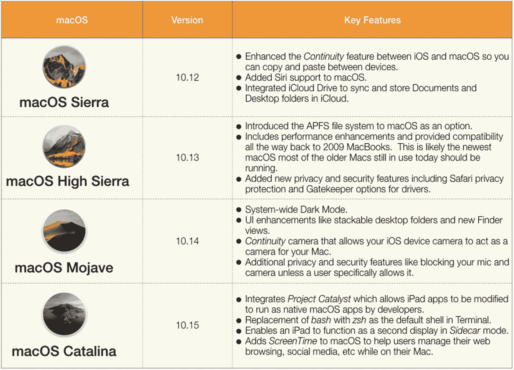

图 1-1

截至本书出版时，macOS 的四个最新版本

### 硬件兼容性

了解哪些苹果硬件能支持这些操作系统至关重要。许多系统管理员会希望在其整个 Mac 设备群中标准化使用一个通用的操作系统版本。请注意，虽然这是一个值得追求的目标，但根据您所支持的硬件组合情况，您可能需要管理几个不同版本的 `macOS`。让事情变得更棘手的是，当苹果发布新硬件时，他们通常不允许在新款 Mac 上运行旧版本的 `macOS`。例如，全新的 2019 款 `Mac Pro` 将无法运行 `macOS High Sierra`。在这种情况下，即使您组织中的其他所有 Mac 仍在运行 `High Sierra`，您也需要同时支持 `Catalina`。

苹果公司提供了一份知识库文章，您可以用它来对照其各种硬件型号检查 `macOS` 的兼容性 ([`https://support.apple.com/en-us/HT201686`](https://support.apple.com/en-us/HT201686))。

苹果公司会通过官方名称、制造年份和/或型号标识符来引用各种 Macintosh 硬件型号。由于他们通常将产品简单地命名为 `Mac Pro` 或 `iMac`，仅凭名称或外观往往很难识别确切型号。这时 `关于本机` 和 `系统报告` 就能派上用场，如图 1-2 和图 1-3 所示。

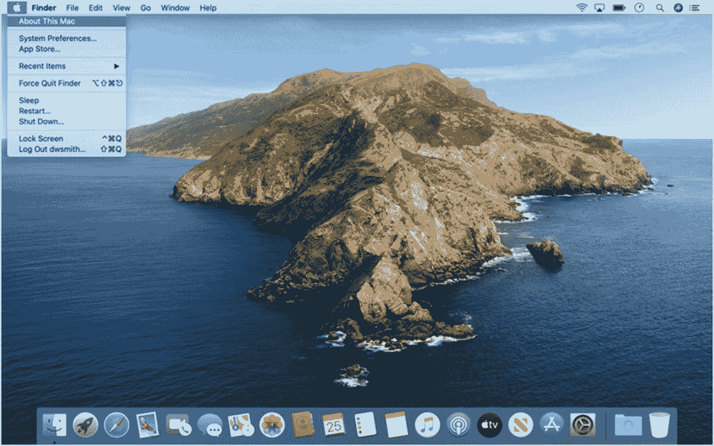
*图 1-2: 从苹果菜单中选择“关于本机”*

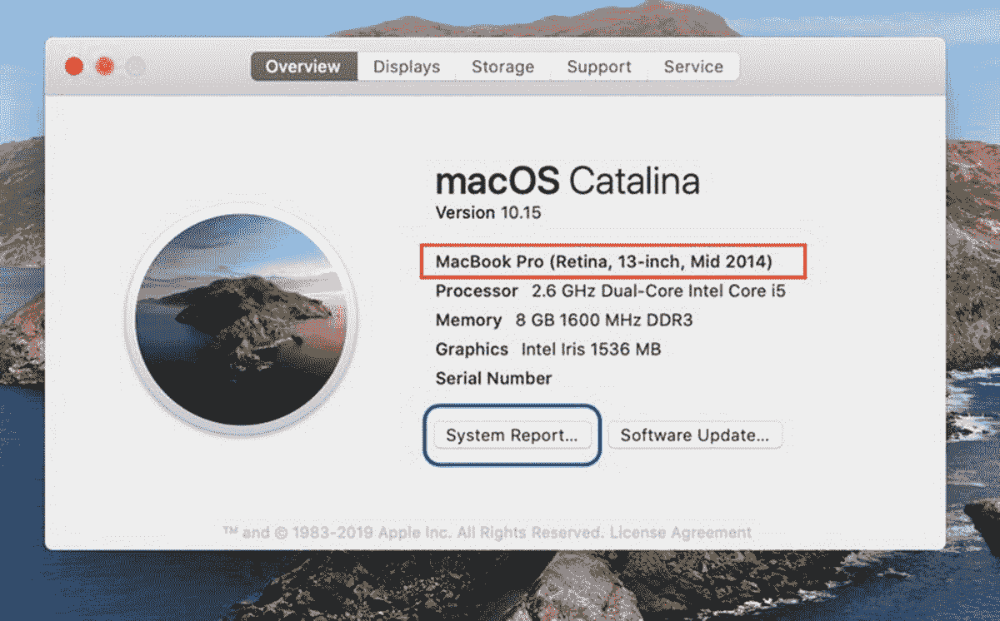
*图 1-3: “关于本机”对话框和“系统报告”按钮*

您可以通过选择 `Apple` 菜单下的选项来访问 `关于本机`。这将显示有关您的 Mac 硬件的最基本信息，包括您正在运行的 macOS 版本、硬件型号的官方名称、内存大小、处理器速度、显卡和序列号。如果您需要更深入的信息，可以点击 `系统报告` 按钮查看更广泛的硬件信息。

`系统报告` 如图 1-4 所示。在旧版本的 macOS 中，这被称为 `系统概述`，它在诊断外设和连接问题时非常方便。`型号标识符` 是识别 Mac 最具体的方式，因为它包含由逗号分隔的主版本号和修订号。

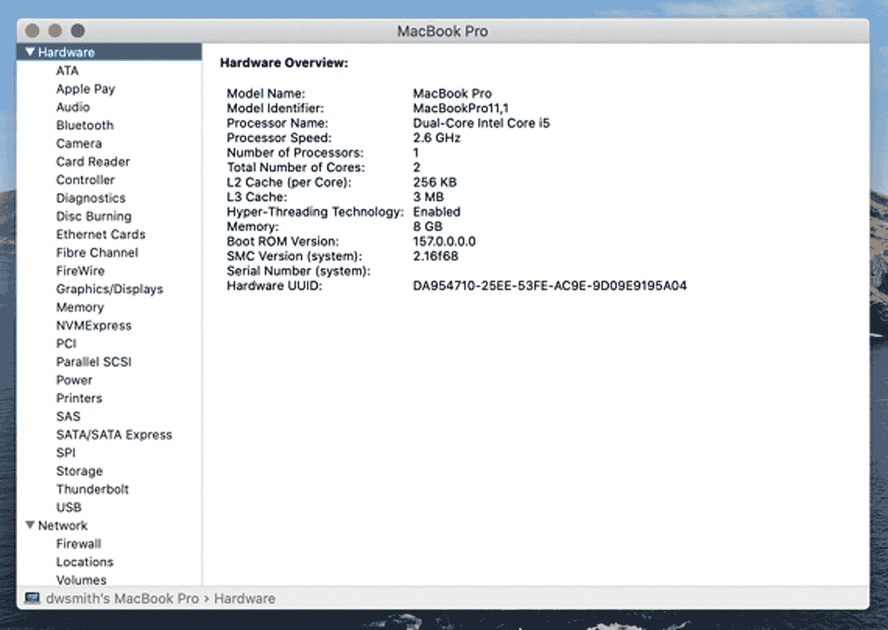
*图 1-4: 系统报告详细列出了所有硬件组件*

### Windows 管理员专业提示

如果您是一位经验丰富的 `Windows` 系统管理员，那么您一定熟悉 `设备管理器`。`系统报告` 与此非常相似，它显示了所有连接的外设、板载组件、网络信息等。

在某些情况下，您可能正在处理一台无法启动操作系统或其硬件已出现故障的 Mac，并且您正在尝试判断是否值得维修。在这两种情况下，可能都很难确定您正在处理的具体型号。苹果公司提供了一个网站，如果您知道序列号，可以在该网站查找具体的型号信息。该网站还会为您提供指定计算机的保修和 AppleCare 覆盖状态，如图 1-5 和图 1-6 所示 ([`https://checkcoverage.apple.com/us/en/`](https://checkcoverage.apple.com/us/en/))。

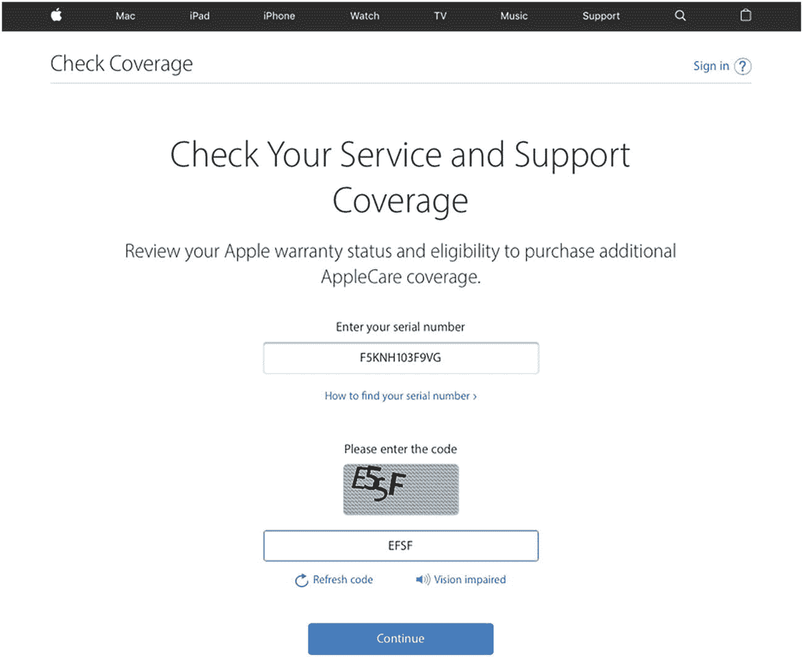
*图 1-5: 输入您的序列号和验证码*

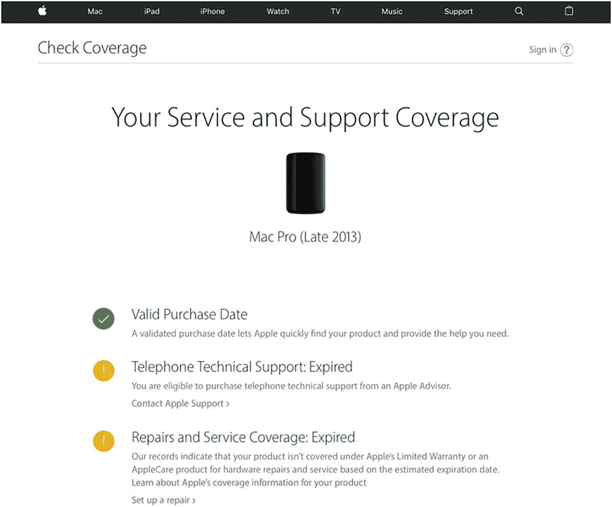
*图 1-6: 型号与保修信息*

### 专业提示

此网站也适用于其他苹果硬件，包括 iPhone、iPad 等。

### macOS 用户界面

如果你是 macOS 的完全新手，图 1-7 和图 1-8 及其附带的描述将帮助你快速熟悉操作系统，以执行本书中常见的许多任务。

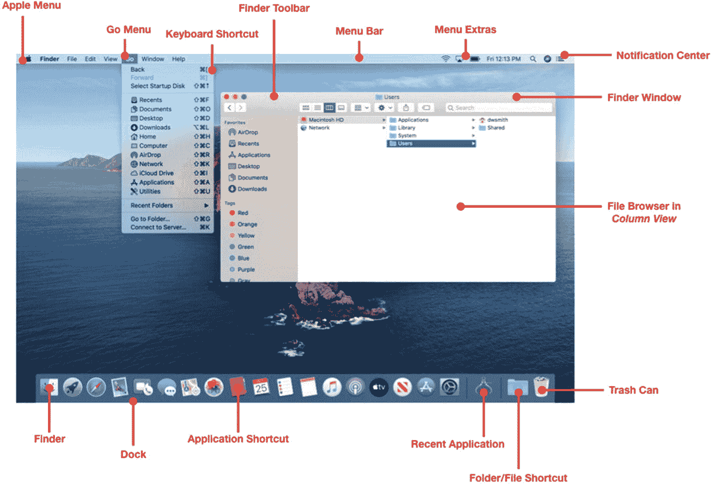

图 1-7
macOS 用户界面的常见组件

*   **Apple 菜单：** 这是一个综合菜单，用于执行诸如注销、重启、访问`系统偏好设置`和最近使用的项目等操作。
*   **菜单栏：** macOS 中的菜单栏位于所有应用程序上方，并且会根据前台运行的应用程序动态变化。前台应用程序的名称会以**粗体**显示在`Apple 菜单`的右侧。
*   **Finder：** `macOS`的图形用户界面外壳，提供常见的操作系统功能和文件浏览器。
*   **前往菜单：** `Finder`中较为有用的菜单之一。它包含许多常见本地和网络资源的快捷方式。按住`option`键将可以访问隐藏的用户`Library`目录，该目录在客户端管理和故障排除中经常使用。
*   **键盘快捷键：** 只要可用，键盘快捷键都会显示在菜单项旁边。
*   **Finder 工具栏：** 每个`Finder`窗口都包含当前目录的名称、可自定义的快捷按钮以及受交通灯启发的`关闭`、`最小化`和`最大化`按钮。在较新版本的操作系统中，绿色按钮会将前台应用程序切换到全屏模式。
*   **菜单栏附加项：** 各种应用程序和系统工具会提供这些图标，用于快速访问常用功能，如`VPN`、`Wi-Fi`和`音量控制`。按住`command`键，然后单击并拖动图标可以移动或移除其中一些图标。
*   **通知中心：** 点击此图标会滑出一个包含各种`小组件`的架子，这些小组件可以固定在此处以便快速访问。常见的小组件包括计算器、天气和`Apple Music`。来自其他应用程序（如`Mail`或`Messages`）的通知也会显示在这里。你也可以切换`勿扰模式`的开/关，并且`夜览`控制也可用于帮助减少 Mac（支持此功能的机型）上蓝光的照射。
*   **程序坞：** 程序坞包含所有正在运行的应用程序、应用程序快捷方式、最小化的窗口以及`废纸篓`。它提供了一种在多任务处理时快速轻松地在应用程序和文件之间切换的方法。可以使用`程序坞系统偏好设置`来重新定位、自动隐藏或调整程序坞的大小。
*   **应用程序快捷方式：** 指向实际应用程序（位于`/Applications`文件夹中）的符号链接。这些快捷方式提供了对最常用应用程序的快速访问。将图标拖到程序坞上或从程序坞拖走即可添加或移除它。
*   **最近使用的应用程序：** 在`macOS Catalina`中默认开启，程序坞有一个专门用于存储最近使用过的应用程序的区域。
*   **文件夹/文件快捷方式：** 与应用程序快捷方式类似，这些是指向存储在你硬盘驱动器其他地方的文件或文件夹的符号链接。当你需要快速访问常用文档时可以使用它。文件夹可以以堆栈、网格或菜单的形式查看。
*   **废纸篓：** 将文件或文件夹拖入`废纸篓`将准备删除它们。你可以使用 Apple 菜单下的命令或按住`control`键单击（按住`control`键并单击）或右键单击废纸篓并选择`清倒废纸篓`来清空废纸篓。
*   **文件浏览器：** `Finder`有三种视图：`图标`视图、`列表`视图和`分栏`视图。这些视图可帮助你浏览硬盘或其他连接介质上的文件夹和文件。

**Windows 管理员专业提示**

刚开始熟悉 macOS 的 Windows 系统管理员可能会从以下这些可互换的概念中受益。

*   **控制面板：** 在`macOS`中，这被称为`系统偏好设置`，位于`Apple 菜单`下。
*   **右键单击：** 你可以使用`鼠标`和/或`触控板系统偏好设置`来启用`辅助点按`。如果你使用的是单键鼠标，你也可以按住键盘上的`control`键并单击以模拟右键单击功能。图 1-8 提供了有关`Finder`中上下文菜单选项的更多信息。
*   **Control 键：** 在 macOS 中，常见的`control`键命令（如用于粘贴的`Ctrl+V`和用于复制的`Ctrl+C`）同样有效，但你必须使用`command`键，即键盘上空格键左侧的那个键。`option`和`alt`键在 Mac 和 Windows 之间也可互换，但使用频率较低。
*   **任务管理器：** 如果你有一个行为不当的应用程序需要`结束任务`——在`macOS`中这被称为`强制退出`。你可以在`Apple 菜单`中找到它，或者按键盘组合键`command+option+escape`。这将显示当前正在运行的应用程序列表，你可以选择一个并强制其退出。
*   **Windows 资源管理器：** 在 macOS 中，这将是`Finder`。我个人更喜欢`分栏`视图或`列表`视图，如果你习惯使用`Windows 资源管理器`，它们也是深入目录结构的一种分层方式。
*   **任务栏：** 在`macOS`中，任务栏可能最类似于程序坞。我过去用过的一个技巧是在程序坞中创建一个指向`/Applications`文件夹的快捷方式，并选择将其显示为`列表`。这很好地模仿了`开始菜单`，以便快速浏览所有应用程序。
*   **属性：** 在`macOS`中，这被称为`显示简介`。当你选择任何文件或文件夹并从`文件`菜单或上下文菜单中选择`显示简介`时，Windows 中`属性`对话框中的几乎所有内容都会显示出来。
*   **回收站：** `macOS`中的`废纸篓`。功能几乎完全相同。
*   **快捷方式：** `macOS`中文件和应用程序的符号链接通常被称为`替身`。
*   **映射网络驱动器：** 在`前往`菜单下，你可以选择`连接服务器`，这将允许你浏览网络以查找共享资源或输入特定资源的路径。在`macOS`中需要注意的一点是，输入完整路径时，应使用`正斜杠`（/）代替`反斜杠`（\）。
*   **运行：** 使用`macOS`菜单栏`菜单栏附加项`区域中的`聚焦`按钮，开始输入以搜索文件以及根据几个按键启动应用程序。
*   **命令提示符：** 要在`macOS`上打开命令行界面，请单击`Finder`中的`前往`菜单，选择`实用工具`，然后启动`终端`应用程序。
*   **打印屏幕：** 在`macOS`中，可以使用以下键盘组合键快速创建屏幕截图：`command+shift+3`。

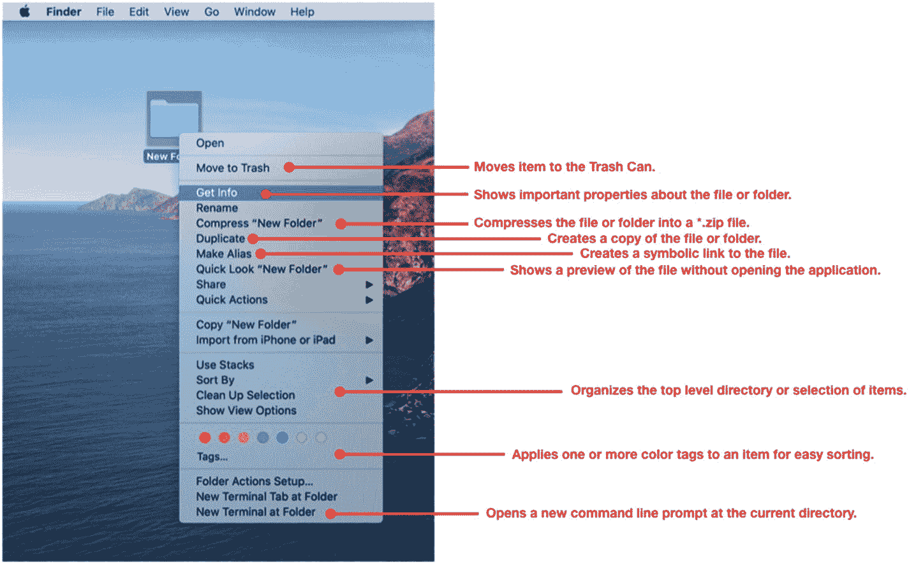

图 1-8
macOS 完全支持右键单击功能

## iOS 简介

与 `macOS` 类似，`iOS` 有许多版本，并且每年都会发布新版本。本书将主要关注 `iOS 13`。苹果公司还为最近的两代操作系统维护着针对 iPhone 和 iPad 的 `iOS` 兼容性指南。

这些指南可以在此处找到：

**iPhone：**
*   [`https://support.apple.com/guide/iphone/supported-models-iphe3fa5df43/ios`](https://support.apple.com/guide/iphone/supported-models-iphe3fa5df43/ios)

**iPad：**
*   [`https://support.apple.com/guide/ipad/supported-models-ipad213a25b2/ipados`](https://support.apple.com/guide/ipad/supported-models-ipad213a25b2/ipados)

为了延长 `iOS` 设备的使用寿命，苹果公司通常会只将某些功能提供给最新的硬件型号。在计划 `iOS` 升级时，请特别注意审查所支持的功能，而不仅仅是基础操作系统兼容性，以确保您组织拥有的硬件支持所有必需的功能。

识别 `iOS` 设备型号与识别 Mac 型号信息类似。在主屏幕上，点击 `设置` ➤ `通用` ➤ `关于`，如图 1-9 所示。

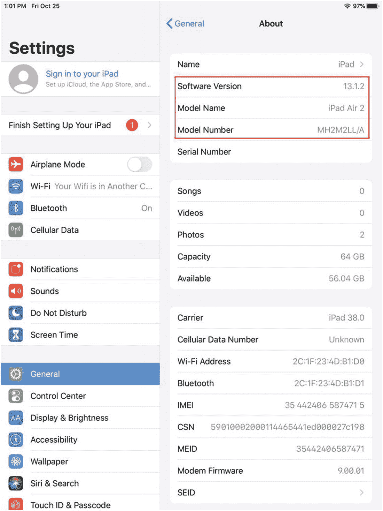
图 1-9
iOS 设备上的"关于"屏幕

### iOS 用户界面

如果您是 `iOS` 的完全新手，图 1-10 和 1-11 将帮助您快速浏览操作系统，以执行本书中使用的许多常见任务。

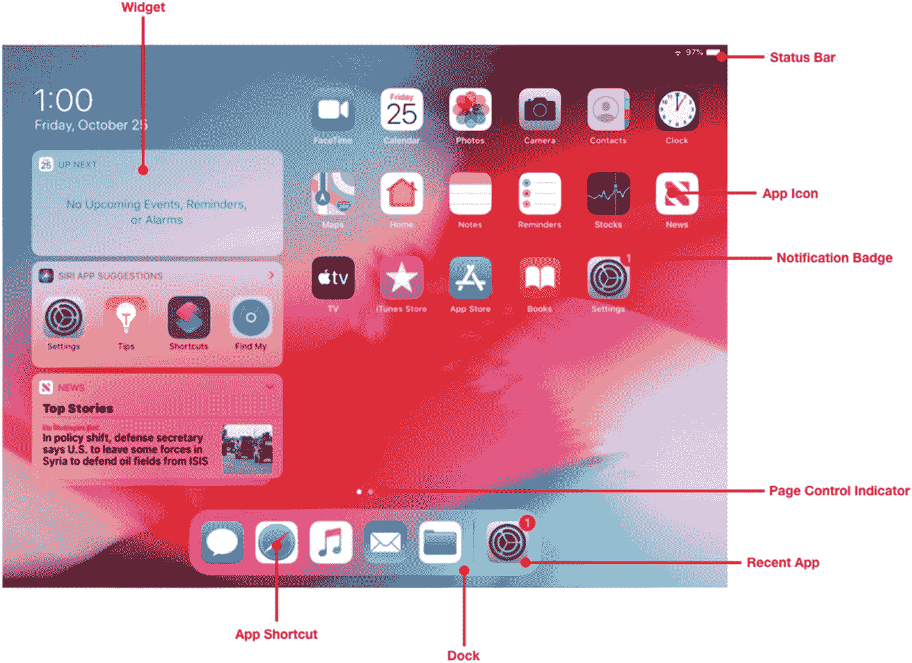
图 1-11
iPadOS 主屏幕

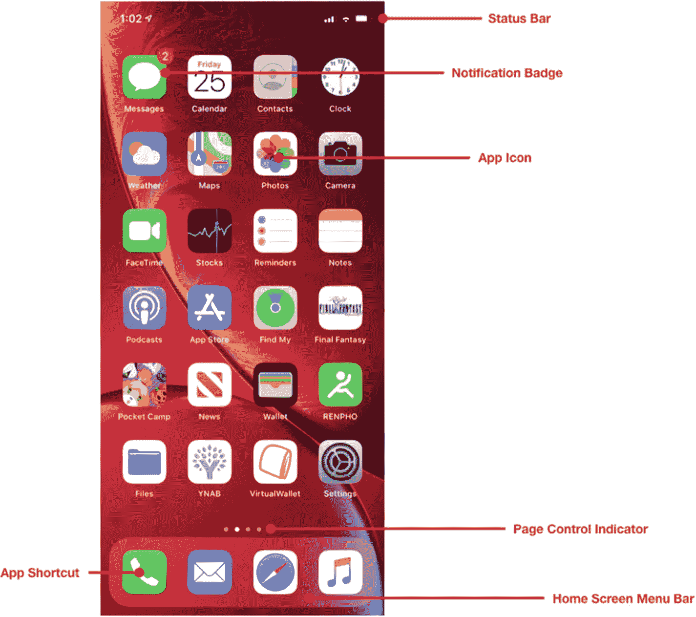
图 1-10
iPhone 主屏幕

*   **状态栏：** `iOS` 设备顶部的区域，包含时钟和网络指示器。
*   **通知标记：** 标记是一个带有数字的红色圆圈，表示该应用程序需要关注。
*   **应用图标：** 点击应用图标将启动该应用程序或将其从后台模式唤醒。
*   **页面控制指示器：** 当您从一个屏幕滑动到另一个屏幕时，这指示您所在的导航页面。如果您有多个图标页面，滑动屏幕将导航到下一页。
*   **应用快捷方式：** 您最常用的应用程序可以放在这里以便快速访问。
*   **小组件：** 无需打开整个应用程序即可提供应用程序信息的小工具，例如，头条新闻。在 `iPadOS` 中，这可以固定到主屏幕上，如图 1-11 所示。
*   **主屏幕菜单栏（仅限 iPhone）：** iPhone 上应用快捷方式的位置。
*   **程序坞（仅限 `iPadOS`）：** 应用快捷方式以及最近使用的应用程序和文件的位置；它在 `iPad` 上提供了更接近 `macOS` 的外观和感觉。
*   **最近使用的应用程序（仅限 `iPadOS`）：** 与 `macOS` 类似，`iPad` 现在可以在程序坞中显示最近使用的应用程序。

## 总结

在过去的几十年里，苹果公司的平台持续变化和演进。硬件架构、操作系统软件和设备外形规格的重大变化挑战了我们对于计算机应当是什么样子的认知。本书主要关注较新的 `macOS` 和 `iOS`，包括 `macOS Catalina`、`iOS 13` 和 `iPadOS`。

对于其他系统的用户来说，浏览这些操作系统可能既熟悉又令人望而生畏。如果您是苹果平台的新手，我建议在进入下一章之前花一些时间探索 `iOS` 和 `macOS`，以便从最终用户的角度获得如何与这些平台交互的工作知识。

