# 2. macOS 客户端管理

在本章中，我们将探讨单台 Mac 的管理。主题将包括管理本地用户账户、探索 `macOS` 的文件结构、学习命令行界面以及执行一些基本的硬件故障排除。

## Mac 硬件故障排除

与大多数 PC 硬件制造商不同，苹果公司对于允许谁修理其硬件一直相当严格。除了通过自己的 Apple 零售店提供硬件维修服务外，他们还为希望进行维修的第三方公司制定了全面的授权维修中心流程。话虽如此，大多数技术人员在不使保修失效的情况下，自己能安全进行的硬件维修是有限的。作为一名 Mac 技术员，在预约 `Genius Bar` 并带着 Mac 前往当地 Apple 零售店之前，了解一些基本的硬件故障排除技巧非常重要。

### 非易失性随机存取存储器

`非易失性随机存取存储器`，或有时被长期 Mac 用户称为 `参数 RAM`，基本上是逻辑板上一小部分内存，用于存储计算机关机时不会擦除的信息。它存储音量级别、时区、显示器分辨率和启动磁盘的设置。虽然这种情况不常发生，但有时该内存可能会损坏；通过使用图 2-1 中找到的键盘组合键*清除它*，可以将这些设置重置为出厂默认值。这通常是故障排除一台行为异常的 Mac 的第一步。它通常可以解决与时区相关的问题、开机后需要很长时间才显示苹果标志的慢启动问题，或与音频或内置扬声器相关的问题。

专业提示

如果您正在使用 `可扩展固件接口密码`，如第 3 章所述，需要注意的是，在您移除该密码之前，您将无法清除 `NVRAM`。清除 `NVRAM` 完成后，别忘了重新启用您的密码。


### 系统管理控制器 (SMC)

`系统管理控制器` (SMC) 是 Macintosh Intel 硬件架构的一个组件。这是 Mac 硬件独有的，除了强制执行 `macOS` 最终用户许可协议（这是您无法轻易在非苹果公司生产的基于 Intel 的个人电脑上运行 `macOS` 的原因之一），它还是一个管理众多集成硬件组件的“万能”部件。苹果在其支持网站上发布了一份详尽的列表，但总的来说，SMC 在不同程度上参与了从开启/关闭风扇到逻辑板上 LED 灯的功能、声音、蓝牙、睡眠/唤醒等多种事项。

在排查 Mac 硬件问题的过程中，您可能需要重置 SMC。苹果建议除非您已用尽所有其他选项（包括标准重启和清除 `NVRAM`），否则请等待后再进行此操作。重置 SMC 最常见的一些原因包括：即使在处理器负载较轻时 Mac 的风扇也持续运转，或者您的 MacBook 电池无法充电。它并不能解决所有问题，但在将 Mac 送到维修中心进行可能昂贵的诊断之前，这绝对值得一试。

一般来说，重置 Mac 上 SMC 的过程取决于您拥有的具体型号。台式机与笔记本电脑、以及带可拆卸电池的笔记本电脑与不带可拆卸电池的笔记本电脑，其重置步骤各不相同。最近，随着 `Apple T2 安全芯片` 的出现，重置配备了该协处理器的 Mac 的 SMC 又有另一种不同的方法。建议您参考苹果的支持页面，获取有关如何重置您正在排查的特定 Mac 的 SMC 的说明。

苹果关于 SMC 的知识库文章可以在这里找到：
*   [`https://support.apple.com/en-us/HT201295`](https://support.apple.com/en-us/HT201295)

### 启动前键盘组合键

在排查 Mac 故障时，您应该熟悉许多键盘组合键。图 2-1 展示了各种启动前键盘快捷键，其中许多可用于选择除内置硬盘之外的其他启动磁盘。您可以启动进入 `安全模式`、在启动时启用详细日志记录、进入 `恢复模式`，甚至可以使用 `目标磁盘模式` 将您的 Mac 变成一块巨大的外部 Thunderbolt 硬盘。

专业提示
`目标磁盘模式` 可以是排查无法从内置硬盘启动的 Mac 问题的有效方法。通过使用目标磁盘模式，您可以尝试将内部驱动器挂载到另一台 Mac 上，使其看起来像通过 Thunderbolt 或 Firewire 连接的外部硬盘驱动器。如果驱动器拒绝挂载，这可能表明存在硬件故障。如果驱动器确实挂载了，但 Mac 仍无法从其启动，您或许可以在擦除驱动器并安装全新的 macOS 副本之前，检索数据或创建驱动器的备份。

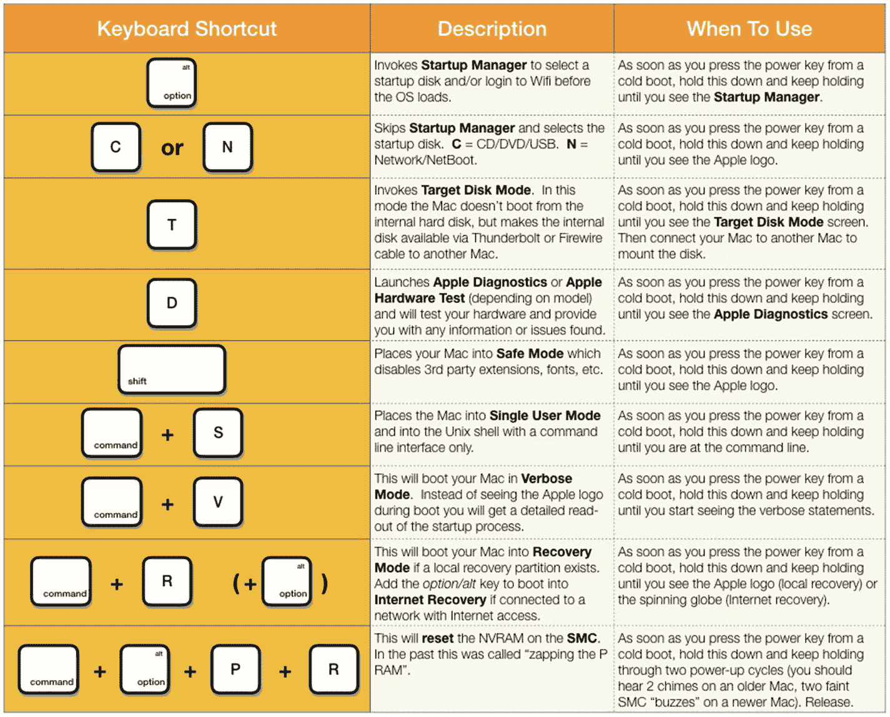
*图 2-1：用于启动前选项的键盘组合键*

## macOS 恢复

在 `macOS` 的标准安装中，苹果提供了一个隐藏分区，其中包含操作系统的有限副本和一些应用程序，如 `磁盘工具`、`终端` 和 `macOS 安装器` 包。这个区域实际上被称为 `macOS 恢复`，正如您所猜测的那样，它在操作系统出现问题时用于尝试恢复您的 Mac。

如果由于某种原因，您的 Mac 没有本地恢复分区，您也可以利用 `互联网恢复` 服务。互联网恢复是苹果托管的基于云的可启动网络卷。从互联网恢复启动需要有效的互联网连接，并且启动时间可能较长，具体取决于您的连接速度。

一旦您启动进入恢复模式，可以执行以下几项操作：
*   从时间机器备份恢复。
*   重新安装或全新安装 `macOS`。
*   通过 Safari 浏览苹果支持网站（如果您有活动的互联网连接）。
*   使用磁盘工具执行磁盘急救或其他与驱动器相关的任务。
*   访问终端。
*   管理硬件安全设置（第 3 章将详细介绍）。

### 磁盘工具

虽然其中大多数选项不言自明，但 `磁盘工具` 包含许多在 `macOS 恢复` 模式下特别有用的工具。因为我们是从恢复分区启动，而不是从包含完整 macOS 系统文件夹的分区（通常称为 `启动磁盘`）启动，所以我们可以对启动卷运行实用程序和命令。虽然当您从 Mac 的启动磁盘启动后，可以在 `/Applications/Utilities` 内的磁盘工具应用程序中访问许多相同的选项，但您可能在系统当前运行的同一卷上执行它们时遇到问题。这使得 `macOS 恢复`，特别是互联网恢复，成为直接处理 Mac 内置硬盘的最佳选择。图 2-2 显示了磁盘工具的默认视图，并标出了一些重要选项。

专业提示
在 `macOS 恢复` 模式下使用磁盘工具时要小心。很容易意外删除您的启动分区甚至整个内置硬盘。在对 Mac 上的磁盘工具进行操作之前，请确保已备份所有重要数据。

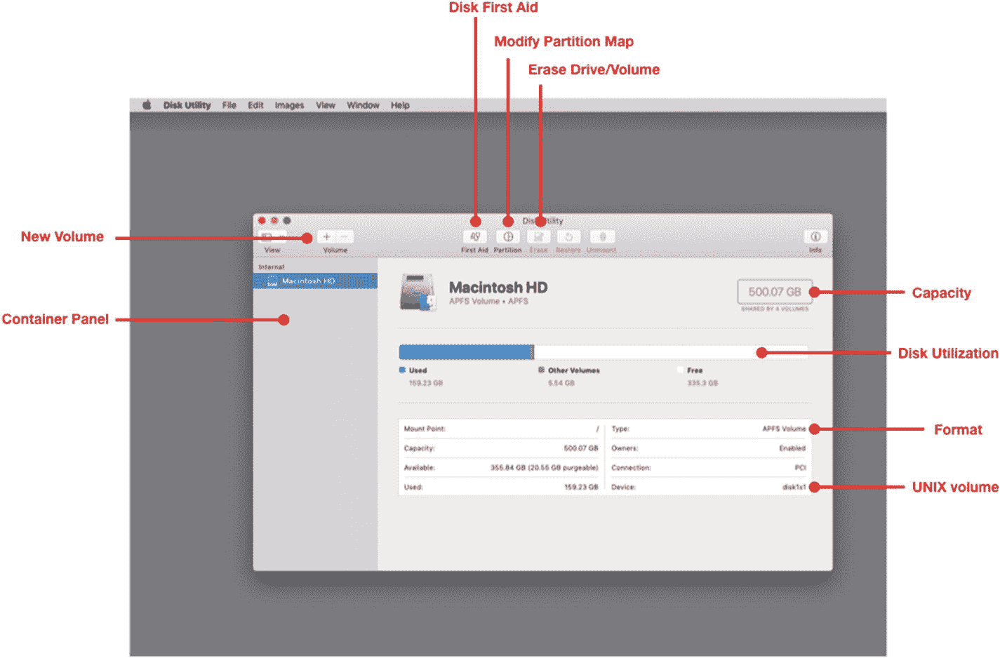
*图 2-2：磁盘工具界面*

*   **容器面板：** 卷、驱动器、分区、容器和已挂载磁盘的列表。
*   **新建卷：** 在选定的磁盘上添加或删除卷。
*   **磁盘急救：** 打开 `磁盘急救` 子实用程序以检查和修复或优化硬盘，类似于 Windows 中的磁盘碎片整理。
*   **修改分区映射：** 允许您在特定磁盘上添加或删除分区。
*   **抹掉驱动器/卷/分区：** 擦除选定的容器、驱动器、分区或卷。
*   **容量：** 显示所选驱动器的总容量以及包含的卷数。
*   **磁盘使用情况：** 驱动器的构成，包括分区或卷以及每个分区或卷使用的空间量。
*   **格式：** 驱动器的文件系统格式，例如 `Apple 文件系统` (APFS) 或 `分层文件系统增强版` (HFS+)。
*   **Unix 卷描述符：** Unix 中的卷描述符。用于在运行 `bash` 或 `zsh` 脚本时引用驱动器位置。

专业提示
随着苹果继续在 `macOS` 图形用户界面中抽象化各种可移动磁盘，您可能不会看到已挂载的卷出现在桌面上或访达的收藏夹窗格中。要通过图形用户界面找到已挂载的驱动器，最快的方法是使用 `前往` 菜单并选择 `电脑`。这将显示所有已挂载的卷，包括硬盘、映射的网络驱动器以及任何其他可用的已连接存储。


### 时光机器备份

作为系统管理员，您应该部署某种备份机制，以便在发生灾难性系统故障时存储关键数据的副本。时光机器是在安全数据中心备份个人 Mac 或 Mac 服务器的一种简单而有效的方式。在办公室或教室环境中，这可能不是最佳解决方案，因为外置驱动器很容易丢失。虽然时光机器驱动器可以加密，但从成本角度考虑，为每个用户配备外置驱动器可能并不可行。在这些情况下，请考虑使用基于云的文件备份解决方案，例如 iCloud Drive 或 Microsoft OneDrive for Business。

> **专业提示**
> 如果您使用时光机器备份 Mac，并且其格式为 HFS+，请不要让 macOS 将其转换为 APFS，因为在此过程中可能会损坏现有的备份数据。如果您计划更换为 APFS 格式的磁盘并归档 HFS+ 格式的驱动器，最好从一个新格式化的驱动器开始。

## 文件系统与 macOS

每个操作系统都有其偏好的文件系统。如果您有 Microsoft Windows 系统管理背景，您一定听说过 NTFS 或 FAT32，但您可能只知道苹果使用的文件系统称为 Mac 格式或苹果格式。实际上，Mac 有几种常见的文件系统。分层文件系统（HFS）及其较新的版本 HFS+（对旧 HFS 格式的增强）现在已是苹果的旧文件系统。相对较新的苹果文件系统（APFS）随 macOS High Sierra 发布，具有一系列现代功能和增强的安全性。除了 macOS，APFS 也是 iPhone 和 iPad 等 iOS 设备的文件系统。

### 分层文件系统增强版（HFS+）

Mac 的传统文件系统源于 Mac OS Classic，在操作系统的较新版本中被称为 Mac OS 扩展。它缺乏许多现代功能，如 ZFS、NTFS 和 APFS 中存在的校验和、快照以及多进程同时访问。您仍然可以将驱动器格式化为 HFS+，但 APFS 现在被认为是 macOS 的标准，特别是对于配置为启动卷的固态硬盘（SSD）。

### 苹果文件系统（APFS）

APFS 是 macOS 和 iOS 文件系统的现代标准。它提供了许多现代功能，包括空间共享容器、快照、更强的加密以及比 HFS+ 更快的性能。容器概念对 macOS 来说是新的，在 APFS 中大量使用。容器包含一个或多个单独的卷，这些卷显示为独立的分区，但共享相同的空间，并能根据需求动态增长或缩小。这意味着，当特定卷需要更多空间时，数据可以被分配给该卷，而无需用户交互或知晓。

这种空间分配方案在新的 macOS Catalina 中特别有用，因为系统文件与用户数据位于不同的只读卷上。如果您通过“磁盘工具”查看安装了 macOS Catalina 的驱动器，如图 2-3 所示，您会看到两个不同的卷。Macintosh HD 在一个卷上提供基础操作系统和应用程序，而 Macintosh HD – Data 存储用户目录和用户安装的应用程序。这些都在一个单独的容器中（显示为 Macintosh HD），并且卷会根据需要增长。

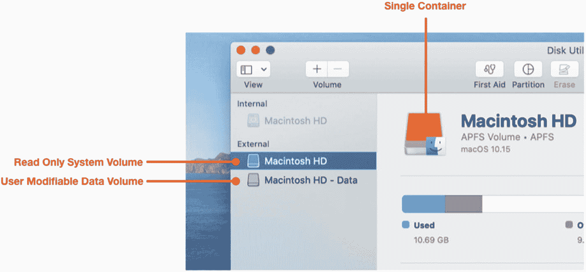

**图 2-3** 由多个卷组成的容器构成了 Catalina 的启动磁盘

### 分区方案与驱动器安全选项

在 macOS 中选择格式化驱动器时，您会注意到有很多选项，包括*区分大小写、加密、日志式*等的各种组合。苹果提供了一篇知识库文章来定义这些选项。

知识库文章可以在此处找到：
* [`https://support.apple.com/guide/disk-utility/file-system-formats-available-in-disk-utility-dsku19ed921c/mac`](https://support.apple.com/guide/disk-utility/file-system-formats-available-in-disk-utility-dsku19ed921c/mac)

除了各种格式化选项外，您可能还会被提示选择驱动器分区方案。有三种选项：
*   **GUID：** 这是基于 Intel 的 macOS 启动卷的标准分区方案选项。
*   **Apple 分区方案：** 现在很少使用，它是 Mac OS Classic 和早期在 PowerPC 架构上运行的 Mac OS X 版本的旧分区方案。
*   **主引导记录：** 这是 Windows 的分区方案，用于 FAT 和 ExFAT 格式。

最后，当您抹掉卷并选择格式时，可能也注意到了“安全选项...”按钮。这些安全选项让您可以选择磁盘上数据被抹除的彻底程度。一些组织要求对所有要停用的磁盘进行完全安全的清理。默认情况下，macOS 使用最不安全（但最快）的单次抹除选项。如果您需要更安全的东西，例如符合国防部 5220.22-M 协议的要求，您可以通过将安全抹除滑块一直移动到最右侧来选择该选项。

### APFS 快照

我们将在下一节更详细地讨论 APFS，但值得一提的是，在系统恢复方面，苹果新文件系统的功能之一就是能够对计算机状态进行文件级快照。如果驱动器格式化为 APFS，当要安装主要的 macOS 更新时，会创建一个 APFS 快照并保存为一个恢复点。通常，操作系统会决定何时适合进行快照，并且这个过程是自动的，因此不需要用户干预。

有时您可能希望强制创建快照。苹果确实通过终端中的命令行工具提供了这种功能。我们将在本章后面更详细地介绍终端，但在这里，只需通过“访达”浏览到 `/应用程序/实用工具` 并启动“终端”应用程序。您将看到一个命令提示符。要创建快照，我们将使用 `tmutil` 命令。在终端的命令提示符下输入以下命令并按回车键以创建快照：

```
tmutil snapshot
```

如果一切顺利，终端会显示一条消息，告知您已创建了一个带有今天日期/时间戳的快照。如果您好奇是否存在任何快照，也可以使用 `tmutil` 命令列出所有可用的快照。快照存储在文件系统级别，仅在操作系统需要时（例如，使用时光机器时）才被挂载。输入以下命令并按回车键：

```
tmutil listlocalsnapshots /
```

如果您需要从快照恢复 Mac，只需启动进入 macOS 恢复，然后选择“从时光机器备份恢复”选项。选择存储快照的驱动器（很可能是您的内置启动磁盘）。您将看到一个可用快照列表（如果存在）。只需选择您想要恢复的快照，然后点击“继续”。恢复过程完成后，您的 Mac 将重新启动，并应恢复到选定快照时的状态。

> **专业提示**
> APFS 快照更多是恢复工具，而非备份工具。我建议将快照用作在重大更改前恢复到某个时间点的一种方式，并继续将整个磁盘备份到另一个驱动器或云端。快照在创建 24 小时后会被删除，因此它们不是可靠的长期备份方法。


## 安装与升级 macOS

从当前 macOS 版本升级至下一个版本，通常的做法是使用 Mac App Store 或“系统偏好设置”中的“软件更新”来下载并安装下一个主要版本。如果你的 Mac 状态良好，只是需要最新的操作系统，这种方法很方便。但如果需要在新格式化的驱动器上全新安装 macOS，我们就得多做一些准备工作。

### 从互联网恢复安装

如果具备网络连接，一个常见的选择是通过“互联网恢复”选项启动至 macOS 恢复模式。在此模式下，你可以抹掉并格式化内置硬盘，然后通过互联网从 Apple 安装全新的 macOS。这种方法虽然有效，但可能耗时较长，并且在校园或大型企业中，如果大量 Mac 共享一个网络连接，则可能不可行。

### 创建可引导的 USB 安装盘

如果你没有可用的网络连接，或者需要为大量 Mac 抹掉内置驱动器并全新安装 macOS，你将需要创建一个或多个可引导的 USB 安装盘。为此，你需要一个至少 8 GB 空间的 USB 闪存盘、一份 macOS 安装器应用程序，并能访问“终端”应用。

第一步是从 Mac App Store 或通过“软件偏好设置”中的“软件更新”下载 macOS 安装器。下载完成后，安装器通常会自行启动并提示你开始安装。此时，取消安装器并退出安装应用程序。使用“访达”浏览到 `/应用程序` 文件夹，确认 `安装 macOS Catalina` 应用程序存在。

如果还未插入 USB 闪存盘，请现在插入并打开“磁盘工具”。将驱动器格式化为 APFS 格式并为其命名。记下这个名称。在我使用的脚本中，磁盘名称为 `Untitled`。接着，浏览到 `/应用程序/实用工具`，然后打开“终端”应用。在提示符处输入以下命令：

```
sudo /Applications/Install\ macOS\ Catalina.app/Contents/Resources/createinstallmedia --volume /Volumes/Untitled --nointeraction
```

如果脚本输入正确，它会提示你输入管理员密码。假设你拥有本地管理员权限，此密码与你登录 Mac 时使用的密码相同。它可能还会要求授予“终端”应用访问已连接的 USB 磁盘的权限，如果是这样，你可以允许此操作。验证通过后，你将在终端中看到输出信息，显示其正在格式化并创建可引导 USB 磁盘，如图 2-4 所示。

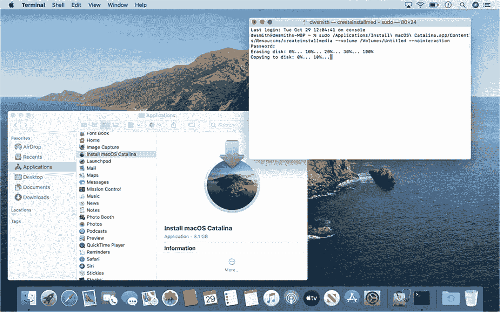

**图 2-4**

使用“终端”创建可引导 USB 磁盘

**专业提示**

此示例中的脚本假设你使用的是 macOS Catalina。如果你使用的是其他版本，只需替换安装器应用程序的名称即可。例如，将 `macOS Catalina` 替换为 `macOS High Sierra`，脚本仍然有效。该脚本只是引用我们在 `/应用程序` 路径中指定的安装器应用程序。

### 创建可引导的技术员硬盘

可引导 USB 安装器很有用，但它的局限性同样明显，就像使用 macOS 恢复模式一样，你只能使用有限的实用工具和“终端”应用。如果能拥有一个完整的 Mac 界面，包括桌面、众多应用程序和访达访问权限，那不是更好吗？是的！每位优秀的 Mac 技术人员都应拥有一个包含完整 macOS 副本的可引导外置硬盘，用于故障排除。我推荐使用新型的外置固态硬盘，因为它们更便于携带，且在放入笔记本电脑包中被晃动时更不易磨损。

这类硬盘的目的是将你所有的 macOS 故障排除工具集中在一处。我通常会在我的硬盘上保存各种软件安装器的副本、磁盘急救工具以及此类文件。这对于诊断涉及内置启动宗卷的问题、在没有近期备份的情况下恢复用户数据，或者在不依赖命令行界面的情况下对启动宗卷进行任何其他修改，都极其有帮助。

**专业提示**

从这类外置驱动器启动 Mac 时，特别是由于技术问题无法登录时，请在启动时使用 `option` 键组合，这样你就可以选择该驱动器作为启动盘，而无需启动到操作系统并通过“系统偏好设置”进行设置。

创建这类硬盘非常简单明了。只需将其连接到 Mac，使用 GUID 分区图将其格式化为 APFS 宗卷，然后从 `/应用程序` 文件夹运行 macOS 安装器，但在安装界面步骤中指定外置驱动器。请注意，你可能需要点击“显示所有磁盘”按钮才能看到外置驱动器。一旦 macOS 安装到该驱动器上，你只需按步骤完成“设置助理”并创建本地用户帐户，就像在内部磁盘上安装一样。

**专业提示**

作为安装过程的一部分，你的 Mac 很可能会将外置驱动器设置为新的首选启动宗卷。请务必使用“启动磁盘”系统偏好设置将其改回内置驱动器，否则可能导致 Mac 在启动时寻找外置驱动器，从而在从内部启动磁盘启动前产生不必要的延迟。


## 终端简介

您选择 Mac 是因为它*易于使用*，而且不像 `Windows` 或 `Linux` 那样需要那些命令行界面，对吧？那为什么我们在这本书的第二章就开始讨论命令行界面了呢？！答案很简单——因为您会遇到这样的情况：强大的实用程序*只能*通过终端使用，就像我们刚才为了创建可启动的 USB 安装盘而必须使用的命令所证明的那样。除此之外，使用脚本可以成为一种有效的工具，通过像 Apple Remote Desktop 这样的工具，一次性自动化处理多台 Mac 客户端的各种日常任务。本节将介绍许多您在使用终端或编写自己的脚本时会经常用到的常用命令和概念。

### 使用命令行界面导航

当您打开终端时，会看到类似以下内容：

```
dwsmith@dwsmiths-MBP ~ %
```

这是命令提示符，它显示您当前以哪个用户身份登录以及您在计算机上的当前位置。`~`符号代表相对于我的主目录的绝对路径。在我的例子中，它是我在 MacBook Pro 上用户帐户的主目录。从技术上讲，如果我在 `访达` 中浏览到相同位置，我们就在 `/Users/dwsmith` 目录下。

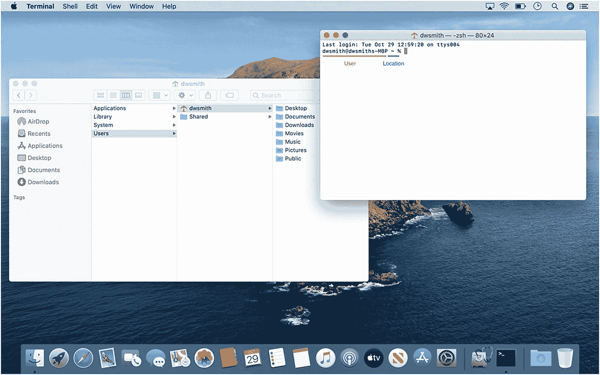

**图 2-5：** 通过终端和访达查看同一目录

我可能想看看这个目录下还有什么其他内容，如果想这样做，我会使用 `ls` 命令。继续在命令提示符后输入：

```
ls
```

当我输入 `ls` 时，会得到如图 2-6 所示的输出。如您所见，这些是我的主目录的子文件夹。如果您熟悉 DOS/Windows，这类似于 `dir` 命令。


**图 2-6：** `ls` 命令的输出以及访达中我的主目录内容

既然我知道了此位置下的其他文件和文件夹，我想更改目录以便进一步探索。假设我想进入桌面文件夹，它是我 `/Users/dwsmith` 目录下的一个文件夹。我可以使用 `cd` 命令并指定我想移动到的文件夹，如图 2-7 所示。在提示符后输入以下命令：

```
cd Desktop
```

您会看到命令提示符已经改变，指定我们现在位于主目录的 `Desktop` 文件夹中。看到我的用户账户信息后面列出的是 `Desktop` 而不是波浪号了吗？

```
dwsmith@dwsmiths-MBP Desktop %
```

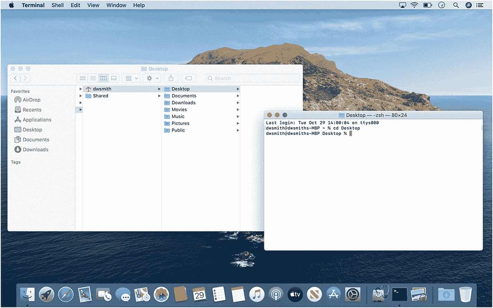

**图 2-7：** 我在 `/Users/dwsmith` 目录的 Desktop 文件夹中

让我们尝试一些更有趣的事情。让我们在桌面上创建一个文件夹。我们使用 `mkdir` 命令来完成这个操作，它是*make directory*的缩写。我们通过在此命令后指定目录名称作为*参数*来使用这个命令。在命令行输入：

```
mkdir MyFolder
```

您应该会在桌面上看到一个名为 `MyFolder` 的新文件夹，如图 2-8 所示。

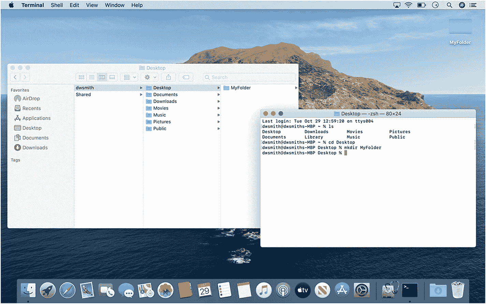

**图 2-8：** 桌面上创建了一个名为 `MyFolder` 的文件夹

注意到文件夹名称中没有空格了吗？让我们创建一个新文件夹，但这次在中间加一个空格。在命令行中，我们不能只是在文件名中直接打一个空格而不*明确*表示。这意味着我们要么使用双引号写成 `"My Folder"`，要么使用 `\` 和一个空格的组合来创建一个空格。

让我们通过再创建两个文件夹来试试这个方法。

要创建第一个文件夹，我们将使用引号。使用相同的 `mkdir` 命令并将文件夹命名为*重要资料*，像这样：

```
mkdir "Important Stuff"
```

接下来，使用 `mkdir` 命令并使用*反斜杠空格*方法创建一个名为*更多资料*的文件夹，像这样：

```
mkdir More\ Stuff
```

您的屏幕应该看起来像图 2-9 中的那样。

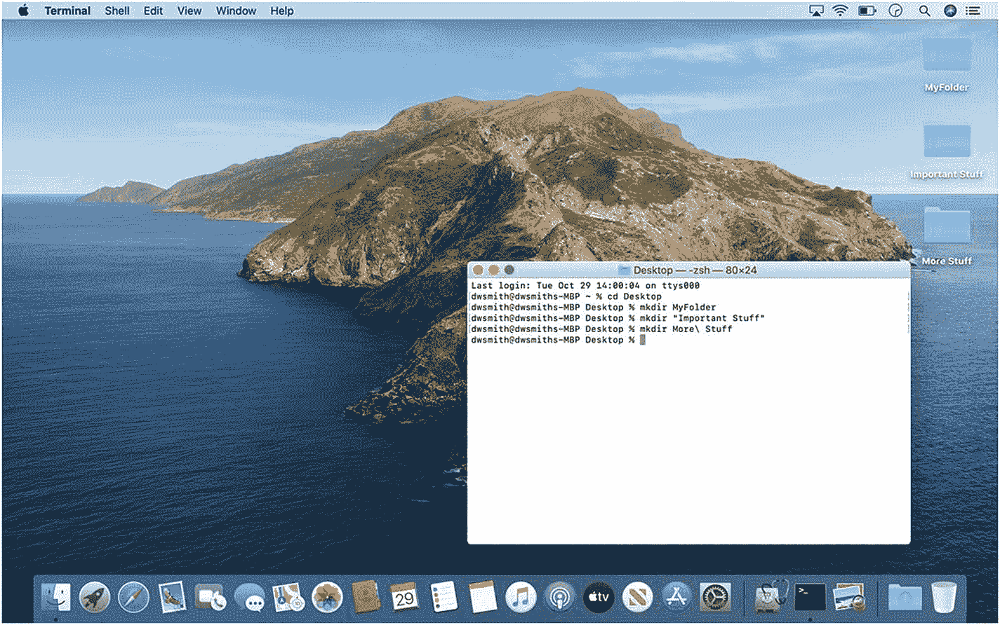

**图 2-9：** 终端命令及其产生的文件夹

### 命令手册

在继续之前，让我们通过删除先前练习中创建的所有这些虚假文件夹来清理桌面。`rm` 命令是*remove*的缩写。让我们用它来指定要删除的文件夹。继续像这样输入这个命令：

```
rm "More Stuff"
```

发生了什么？您可能以为这会删除文件夹，但我们却收到一条神秘信息：`rm: More Stuff: is a directory`。显然，我们做错了什么。我们如何找出错误所在或正确做法呢？

***我们当然要阅读那该死的手册！***

这是一个向您介绍 `man` 页面的好机会。大多数命令都有一个*手册*，您可以在终端中通过输入 `man` 后跟命令名来查看。让我们打开 `rm` 命令的 `man` 页面。输入以下命令：

```
man rm
```

您可以在图 2-10 中看到，如果我们想删除一个目录，必须在目录名前指定参数 `-d`。我们将再试一次，但首先按键盘上的 `q` 键退出 `man` 页面并返回到命令提示符。

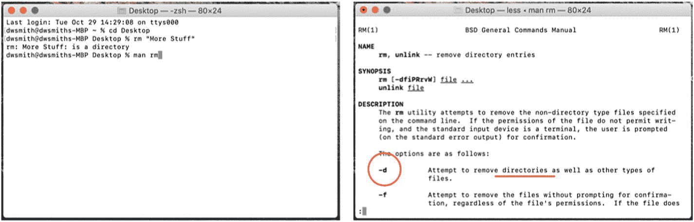

**图 2-10：** `man` 页面显示了我们需要了解的命令选项

现在让我们尝试输入：

```
rm -d "More Stuff"
```

成功！这将删除文件夹，如图 2-11 所示。

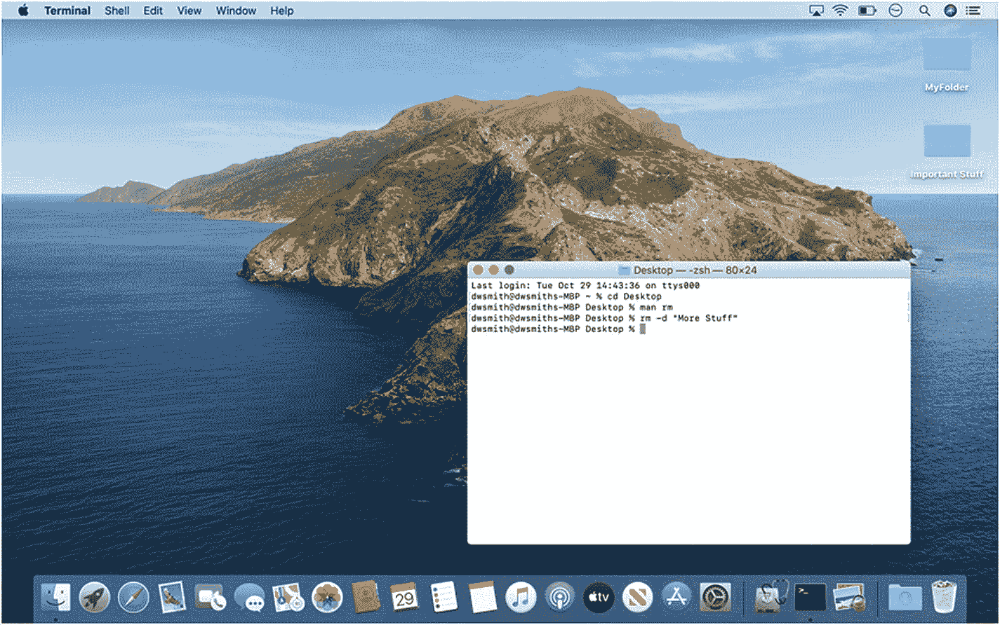

**图 2-11：** 使用终端命令移除目录

继续使用相同的方法删除另外两个文件夹，完成后，您的桌面应该又恢复整洁了。

既然您已经掌握了 `man` 页面的力量，您将在命令行上势不可挡！

### 提升权限

如果您之前接触过终端，可能已经输入过一两条以 `sudo` 开头的命令。这是一个特殊的命令，用于调用*提升权限*。即使您在 Mac 上属于 `admin` 组，您仍然不是系统上权限最高的用户。那个权力属于 `root` 用户或 `super` 用户。

有些命令只能以超级用户身份运行；在这种情况下，我们需要使用 `sudo` 命令，它是*super user do*的缩写。当您使用以 `sudo` 开头的命令时，系统会提示您输入密码，然后命令才会运行。如果您是 Mac 上的本地管理员，该密码将与您本地用户帐户使用的密码相同。例如，就我而言，我的 `dwsmith` 帐户密码与超级用户的密码相同。


### Shells

您可以在终端应用中使用多种不同类型的 Unix 外壳，包括 `zsh`、`bash`、`tcsh` 等。在 `macOS Catalina` 之前，Mac 的默认登录外壳是 `bash`。然而，从 `Catalina` 开始，Apple 已将 `zsh` 提升为默认登录外壳。您仍然可以通过 `用户与群组系统偏好设置` 中的 **高级选项** 页面将其更改为 bash，我们将在本章后面探讨这一点。

### 常用命令

在各种外壳脚本中可以使用许多常用命令。图 2-12 中的图表展示了一些您应该熟悉的命令。查看每个命令的说明，使用每个命令的 man 页面，并尝试使用一些测试文件和文件夹来掌握每个命令的用法。

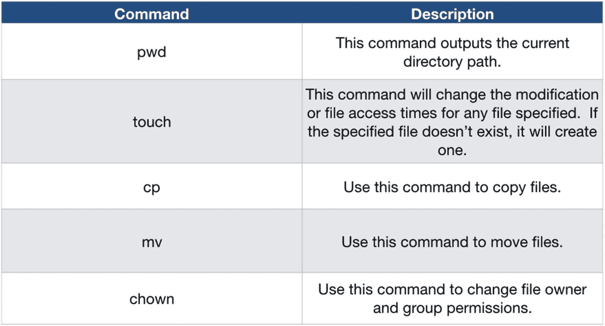

图 2-12
一些需要熟悉的常用命令

### 启动磁盘

如图 2-14 所示，`启动磁盘系统偏好设置` 相对简单明了。它会扫描所有可用的已连接媒体，包括支持 `NetBoot` 的系统上的网络媒体，并返回任何包含有效系统文件夹的卷。只需选择您希望启动的卷并重新启动即可。

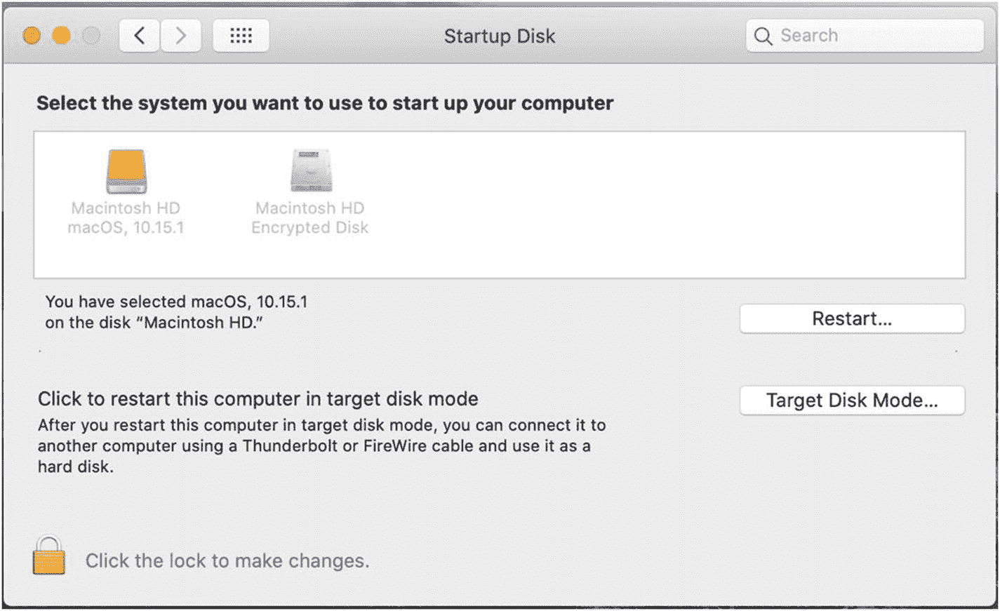

图 2-14
启动磁盘系统偏好设置面板

此信息将保存到 `NVRAM` 中，因此如果媒体在未来某个时间断开连接，您的 Mac 可能无法启动。它要么会显示一个带问号的闪烁文件夹 `[?]`，表示系统无法从所选卷启动，因为它找不到系统文件夹；要么启动时间会很长，因为它会扫描寻找其他具有有效系统文件夹的可用卷。

**专业提示**
如果您尝试将加密卷设置为启动磁盘，必须在 `启动磁盘系统偏好设置` 能够识别磁盘上是否存在有效的可启动系统之前，使用磁盘密码解锁驱动器。

### 共享

`共享系统偏好设置` 将在介绍 `macOS Server` 的第 7 章中更详细地探讨。因为 `macOS Server` 是在 `macOS` 之上运行的应用程序，所以 `共享系统偏好设置` 中的许多服务适用于用作服务器的 Mac。有一个关键项目需要介绍，因为它特指与 `macOS` 客户端相关的内容，那就是 `电脑名称`。图 2-15 显示了您可以命名 Mac 以及它向网络上其他计算机广播何种名称的区域，这个广播的名称也称为 `主机名`。

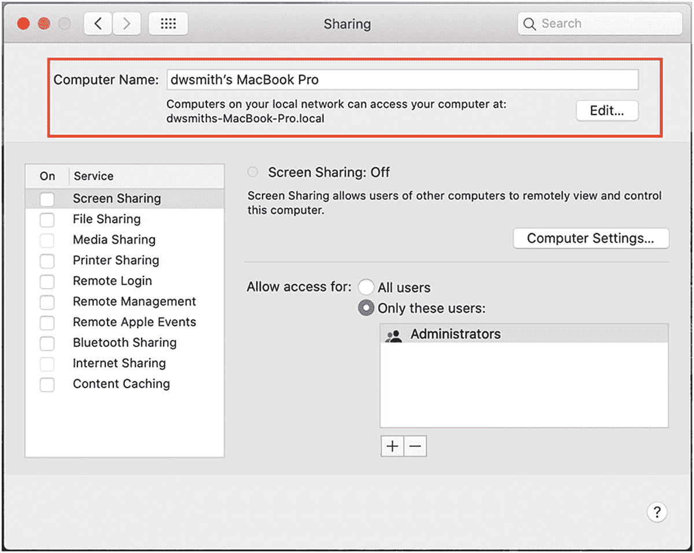

图 2-15
设置友好名称作为电脑名称的位置

您可以将 `电脑名称` 视为一个更友好的名称，允许使用空格和特殊字符。而 `主机名`，因为它会在网络上广播，不能包含特殊字符和空格。图 2-16 显示了主机名，您可以看到它是如何将我的 Mac 名称稍微修改了一下，用连字符代替空格并去除了特殊字符。

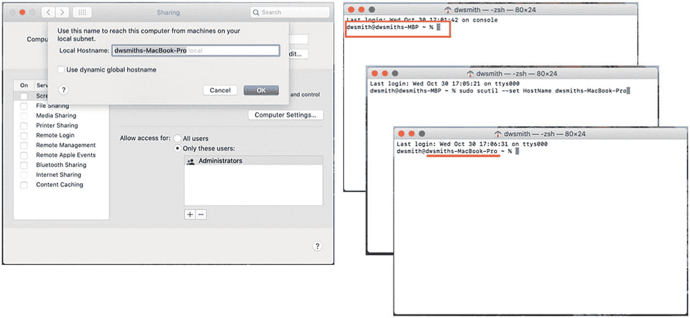

图 2-16
比较 GUI 和命令行中的主机名

关于电脑名称，我们还有另一个潜在问题。仔细看图 2-16 中的终端窗口。您看到命令提示符处的 Unix 主机名是 `dwsmith-MBP` 了吗？为什么我有两个不同的主机名？因为 macOS 有 *三种* 不同的计算机名称——`电脑名称`、`本地主机名` 和 `Unix 主机名`。作为一个最佳实践，我建议将 Unix 主机名和本地主机名设置为一致。在某些情况下这可能不是什么大问题，但以后在远程系统上运行脚本时，这绝对可以为您避免一些潜在问题。我见过一些“恐怖故事”案例，网络上的每台 Mac 的电脑名称都*不同*，而它们的 Unix 主机名却都*相同*。

幸运的是，更改 Unix 主机名非常简单。使用如图 2-16 所示的 `scutil` 命令，您可以将电脑名称更改为与本地主机名匹配。输入以下命令，用您选择的主机名替换 `dwsmith-MacBook-Pro`，并使用 `sudo` 命令进行身份验证：

```
sudo scutil --set HostName dwsmiths-MacBook-Pro
```

现在，您的 Mac 的三个名称将趋于一致，这应该能简化在网络中识别它的任务。

### 用户与群组

接下来，我们将快速浏览一下 `用户与群组系统偏好设置`。我们将在下一节逐步介绍创建 `本地用户帐户` 的过程，但这个系统偏好设置除了简单地管理用户帐户外，还有一些其他功能。图 2-17 是用户与群组的主面板。点击 `登录选项` 按钮将显示一系列其他选项，如图 2-18 所示。

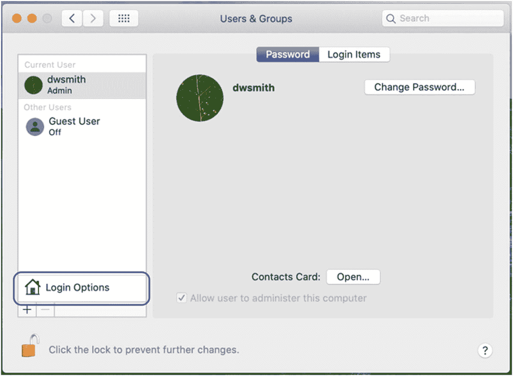

图 2-17
用户与群组面板中的登录选项按钮

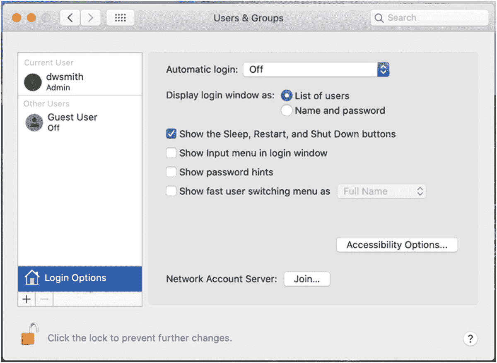

图 2-18
登录选项面板

`登录窗口` 实际上是其*自身的一种应用程序*，这里就是配置它的地方。您可以打开/关闭 `自动登录` 并选择自动登录的用户。如果您选择使用登录窗口而不是自动登录，您可以显示 `所有用户列表` 或 `名称和密码字段`。您还可以显示或隐藏 `电源控制` 按钮，如果您正在管理服务器并希望用户在关机或重启计算机之前进行身份验证，这可能很重要。

如果您想允许多个用户在同一台 Mac 上登录，然后在他们之间切换而无需先让一个用户退出，`快速用户切换` 可能是一个有用的解决方案。这允许管理员登录修复某些东西，然后将系统交还给用户而不会中断他们的工作。在服务行业，如打印店，多个用户共享同一台计算机并实时交替使用，这也非常有用。

`辅助功能选项` `...` 按钮包含其他功能，例如 `旁白`，用于在登录窗口为视障用户进行屏幕朗读。显然，所有这些自定义设置都将由您组织的用户群、安全需求和其他考虑因素决定。这里的最后一个选项，`网络账户服务器`，是您如何*将* Mac *绑定*到域服务的方法。这将在本书后面，特别是在第 7 章和第 11 章中介绍。


## 网络

`Network System Preference` 是您 Mac 上与网络相关的信息和配置的一站式商店。如图 2-19 所示，除了显示您的 IP 地址和活动连接外，您还可以通过此窗格开启/关闭 Wi-Fi，加入无线网络，或按 `+`/`-` 按钮编辑可用的网络适配器和服务。

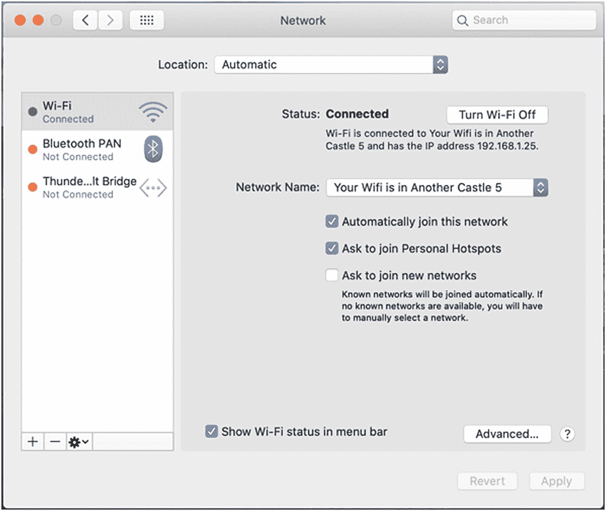

图 2-19 网络系统偏好设置主窗格

按下 `+` 按钮将提示您添加多种新的适配器选项，包括内置 VPN。图 2-20 显示了您可以添加的各种网络适配器，图 2-21 显示了您可以选择的具体 VPN 协议，包括 `Cisco IPSec`。

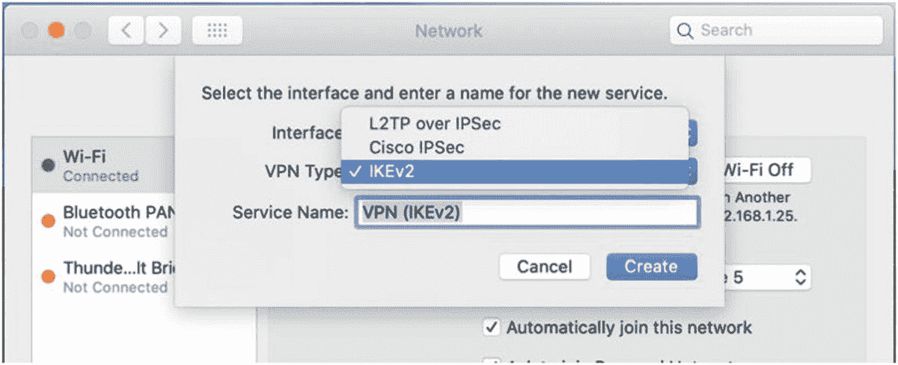

图 2-21 内置 VPN 协议

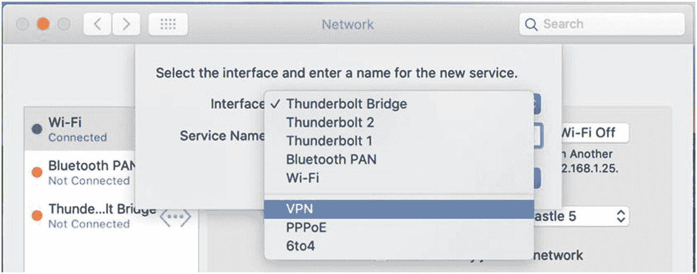

图 2-20 额外的网络接口选项

点击 `Advanced…` 按钮将允许您修改特定的网络适配器设置。高级对话框中有多个标签页，第一个是 `Wi-Fi`。如图 2-22 所示，这里您将看到 Mac 连接过的所有无线网络，并可以按偏好顺序排列它们。点击 `+`/`-` 按钮将允许您忘记一个无线网络（`-`）或手动添加（`+`）一个无线网络。

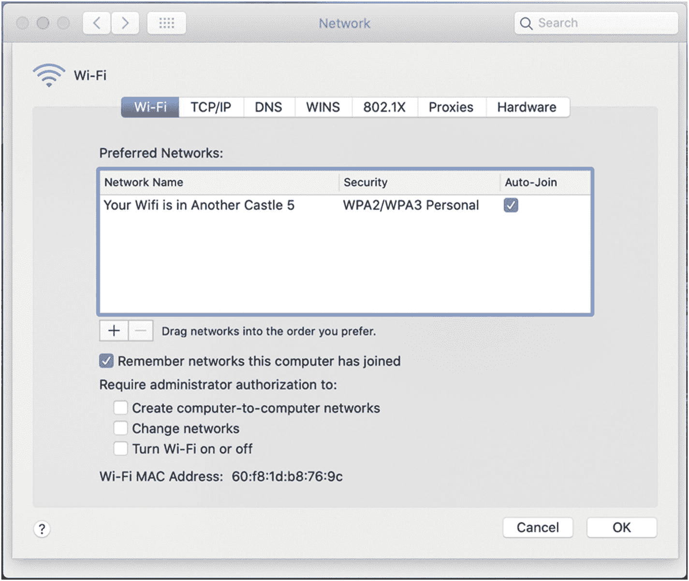

图 2-22 Wi-Fi 设置标签页

### 专业提示

这是一个用于排查具有嵌入式用户凭证和证书的 `WPA2 Enterprise` 无线网络问题的绝佳工具。您可以删除现有网络以轻松移除缓存的凭证和证书。您也可以手动添加一个网络并指定所需的无线安全设置。

下一个标签页是 `TCP/IP`，如图 2-23 所示，这是您配置 IP 地址设置的地方。在此窗格中，您可以指定动态或静态寻址，以及查看当前的 IP 地址、子网掩码和网关（标记为 Router）。`Renew DHCP Lease` 按钮可与动态寻址一起使用，以刷新现有的 DHCP 提供的 IP 地址或获取一个新的 IP 地址。

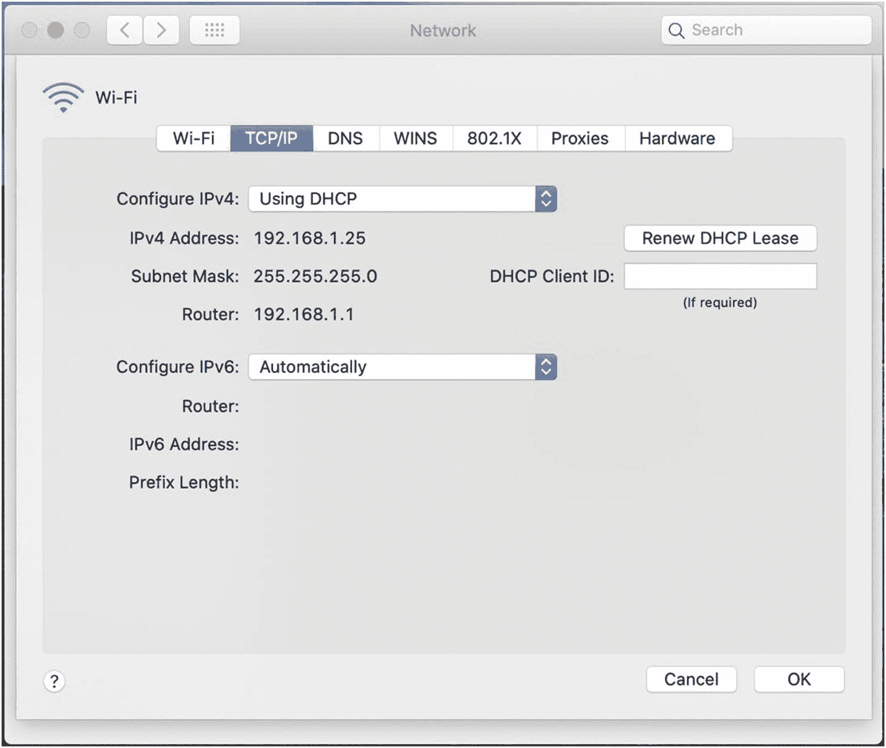

图 2-23 TCP/IP 设置标签页

### Windows 管理员专业提示

Windows 系统管理员可以把这个标签页看作是一个轻松获取 `ipconfig` 信息以及图形化地在 Mac 上执行 `ipconfig /release` 或 `ipconfig /renew` 任务的地方。它的功能也与 Windows 上的 TCP/IP v4 或 TCP/IP v6 `Properties` 对话框相同。

最后，如图 2-24 所示的 `DNS` 标签页，提供了网络的 DNS 服务器和搜索域。如果您的 DHCP 服务器选项设置为向客户端分发 DNS 信息，这些信息将在此处提供。您也可以点击 `+`/`-` 按钮，根据需要手动在 Mac 客户端上添加额外的 DNS 服务器或搜索域，以便进行网络配置或故障排除。

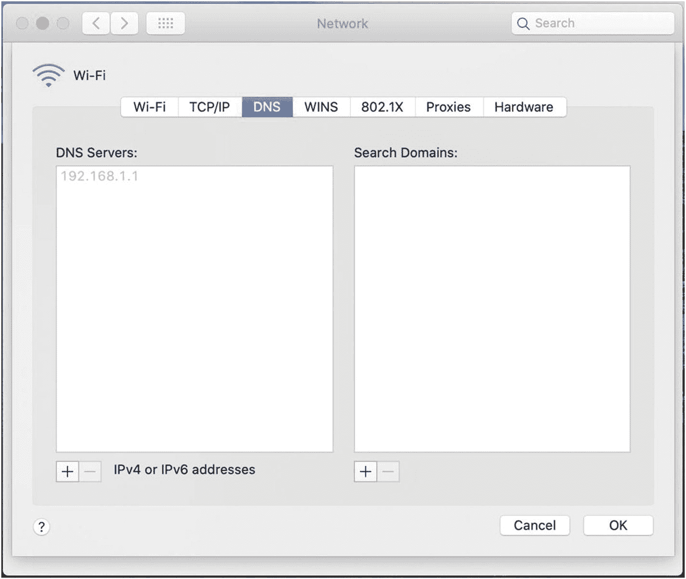

图 2-24 DNS 设置标签页

### 专业提示

`macOS` 还通过 `Terminal` 应用程序提供了一套全面的网络配置和故障排除命令。`ifconfig` 命令可用于执行包括刷新 DNS 解析器缓存、禁用网络接口、添加网络接口和操作 TCP/IP 设置在内的多种操作。如果您计划对任何网络配置更改进行脚本化，一定要花些时间阅读 `ifconfig` 的手册页，并尝试如图 2-25 所示的一些命令。

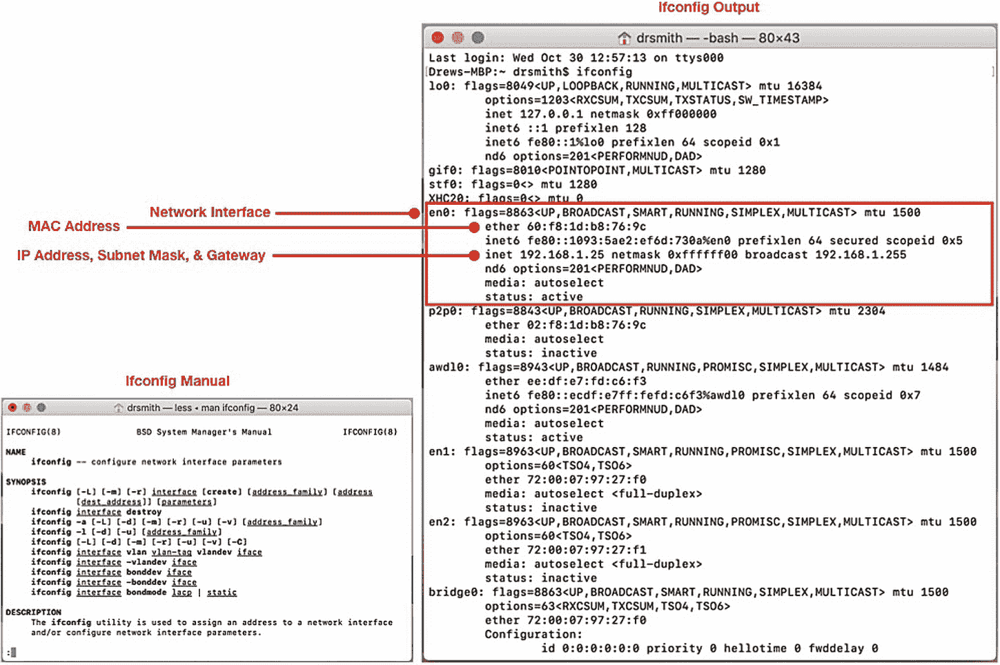

图 2-25 `ifconfig` 命令示例输出和 `ifconfig` 手册


## 软件更新

与其他操作系统类似，保持您的 `macOS` 客户端及时安装最新的安全补丁非常重要。`软件更新系统偏好设置` 让您能够控制 Mac 接收的更新内容以及更新时间。图 2-26 显示了配置 Mac 以接收重要更新和安全补丁的基本类别和选项。除了控制 `macOS` 的更新，您还可以使用 `软件更新` 来安装任何从 `Mac App Store` 安装的应用程序的升级和补丁。

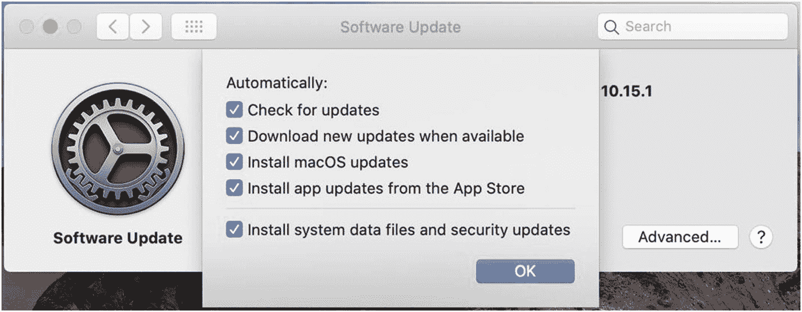

图 2-26
通过 `软件更新系统偏好设置` 控制更新下载和安装的选项

虽然 Apple 通过 `软件更新系统偏好设置` 提供了一些控制 macOS 更新的基本选项，但通过 `终端` 还有更多微调更新的选项。正如您在图 2-27 中看到的，`softwareupdate` 命令的 `man` 手册页提供了一些非常有趣的脚本选项。

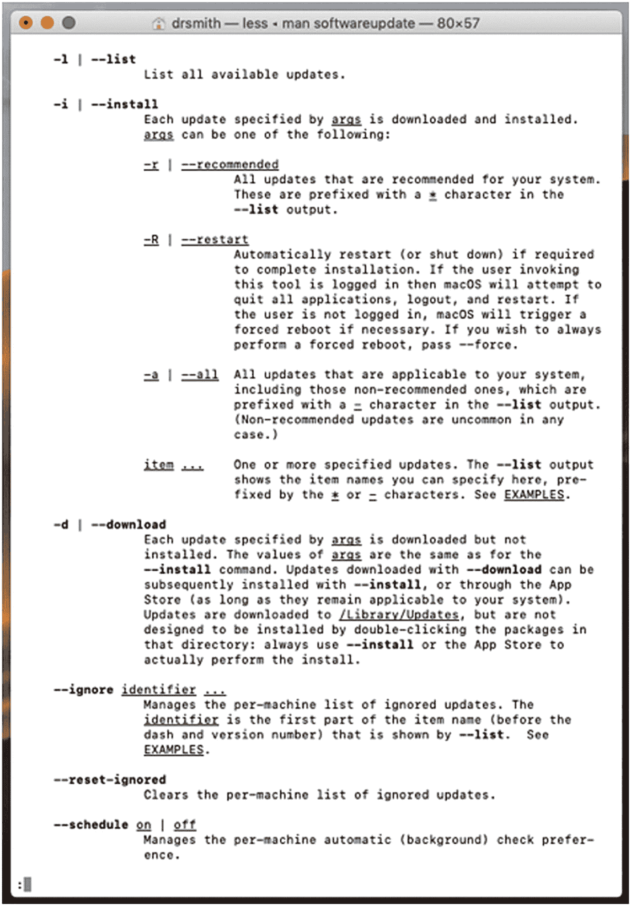

图 2-27
通过 `终端` 查看的 `softwareupdate` 命令手册

### 通过终端配置软件更新

让我们尝试一些有趣的事情。打开 `终端` 并运行以下命令：

```
softwareupdate -l
```

请注意您的 Mac 将花几分钟检查最新的更新。如果情况与我类似，它将会返回一个可用更新列表。图 2-28 显示我的系统有两个待处理的可用更新。

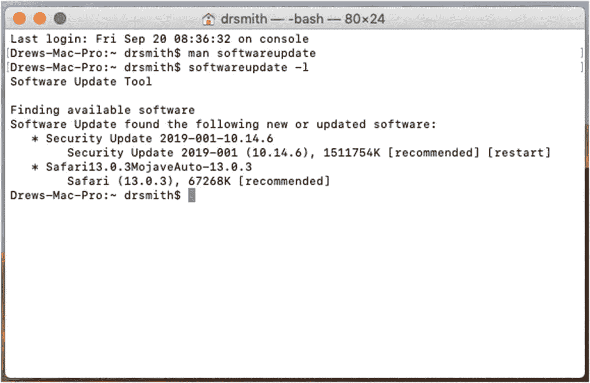

图 2-28
通过 `终端` 显示的可用更新输出

在使用 `softwareupdate` 命令编写脚本时，我们可以使用的一个更强大的选项是能够 *排除* 我们不希望用户看到的更新。例如，我最喜欢的一个例子是，当发布新完整版 `macOS` 时，Apple 会在 `系统偏好设置` 中显示的广告横幅。图 2-29 上方的图片就是一个示例，它提示我的用户在运行 `Mojave` 的 Mac 上下载并安装 `macOS Catalina`。我不希望我的用户询问我安装新操作系统的事情，也不希望他们自己尝试在电脑上安装新的操作系统。

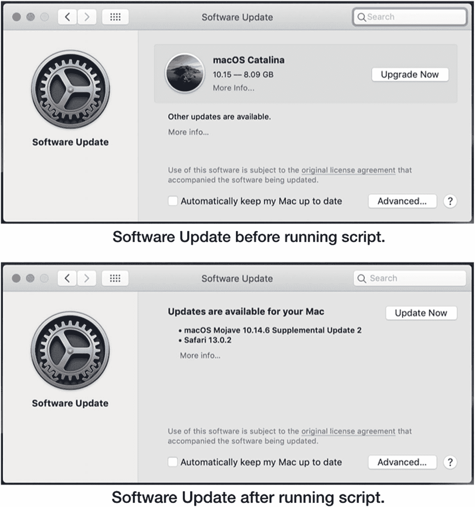

图 2-29
排除更新前后的 `软件更新` 窗口

使用 `softwareupdate --ignore` 命令，加上它提示我安装的更新名称（本例中为 `macOS Catalina`），我可以隐藏这个横幅。正如您在图 2-30 中看到的，当您使用 `sudo` 运行此命令时，它会将 `Catalina` 更新设置为 `ignored;`；当我重启 Mac 后，如果我再回到 `软件更新`，`Catalina` 提示就从我的可用更新列表中消失了，如图 2-29 下方的图片所示。在您的 Mac 上输入以下命令来尝试一下：

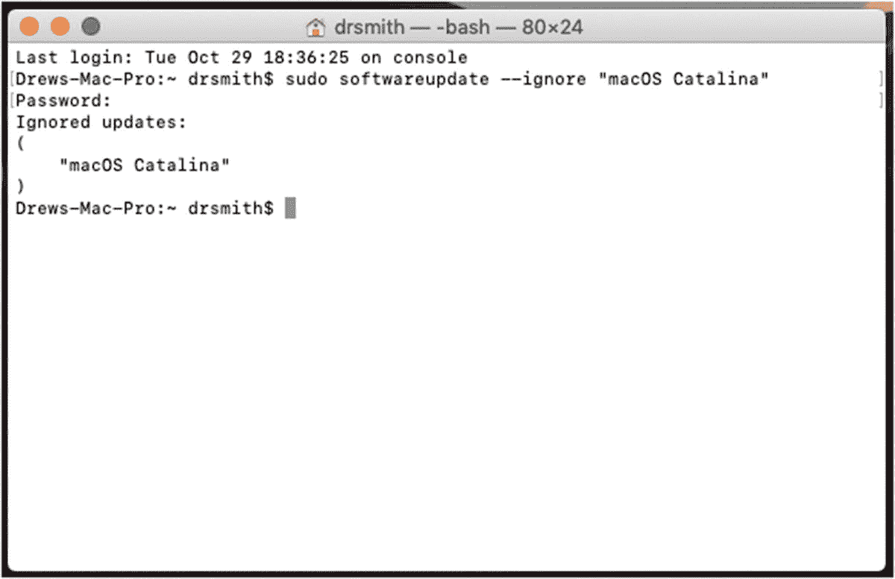

图 2-30
`softwareupdate --ignore` 命令的输出

```
sudo softwareupdate --ignore "macOS Catalina"
```

如果我想在以后撤销此更改，允许我的用户安装 `macOS Catalina`，我只需要输入 `softwareupdate --reset-ignored` 命令。

如果您想审计哪些更新被设置为忽略，可以浏览到 `/Library/Preferences` 并找到 `com.apple.SoftwareUpdate.plist` 文件。在 `Xcode` 或另一个可以打开 `.plist` 文件类型（也称为 `属性列表`）的 XML 文件的应用中打开此文件。

当您打开 `.plist` 文件时，您会看到一个针对 `InactiveUpdates` 的 *数组*，数组内部嵌套的每个被忽略的更新都设置了对应的键。

关闭 `.plist` 文件。输入以下命令来撤销被忽略的更新：

```
softwareupdate –reset-ignored
```

### 专业提示

除非您是开发者，否则 `Xcode` 可能有点大材小用，仅用于打开和编辑 `属性列表`。有许多免费或低成本的 `属性列表` 编辑器可用。`Thomas Tempelmann` 开发的 `Prefs Editor` 是我发现使用起来快速简便的一个。

## 管理本地用户和群组

在退出 `系统偏好设置` 之前，让我们回到 `用户与群组`。在本节中，我们将创建一个新的本地用户帐户并探索一些高级设置。

### 创建新用户

首先，点击 `用户与群组系统偏好设置` 中的 `+` 按钮以添加一个新帐户。您会在 `新建帐户` 旁边的下拉菜单中看到，我们有几种帐户类型可选。我们可以选择 `管理员`、`仅限共享`、`标准` 用户或一个新的 `群组`。我们将在第 7 章讨论 `仅限共享` 和 `群组` 选项。本例中，我们将选择 `标准` 用户，如图 2-31 所示。

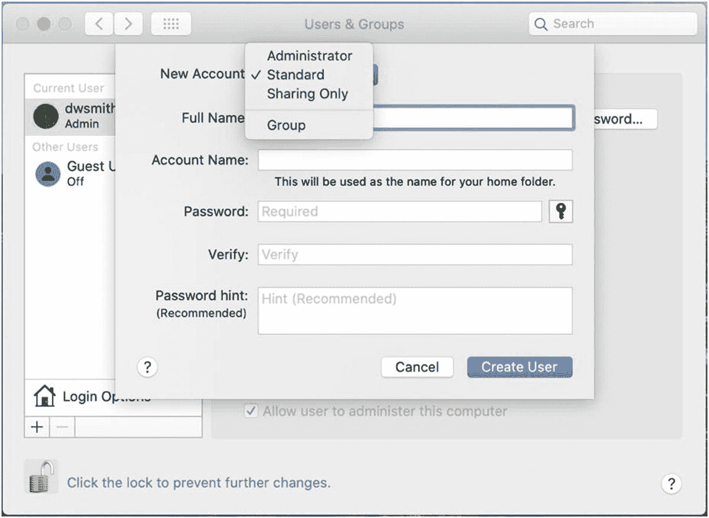

图 2-31
创建新的标准本地用户帐户

用您想要的任何数据填写必填字段。请注意，`全名` 是 *友好名称*，而 `帐户名称` 是 Unix 中的实际用户帐户，并且*默认情况下*它也将是用户 `个人文件夹` 的名称。帐户名称中不能包含任何空格或特殊字符。填写完信息后，点击 `创建用户` 按钮继续。参见图 2-32。

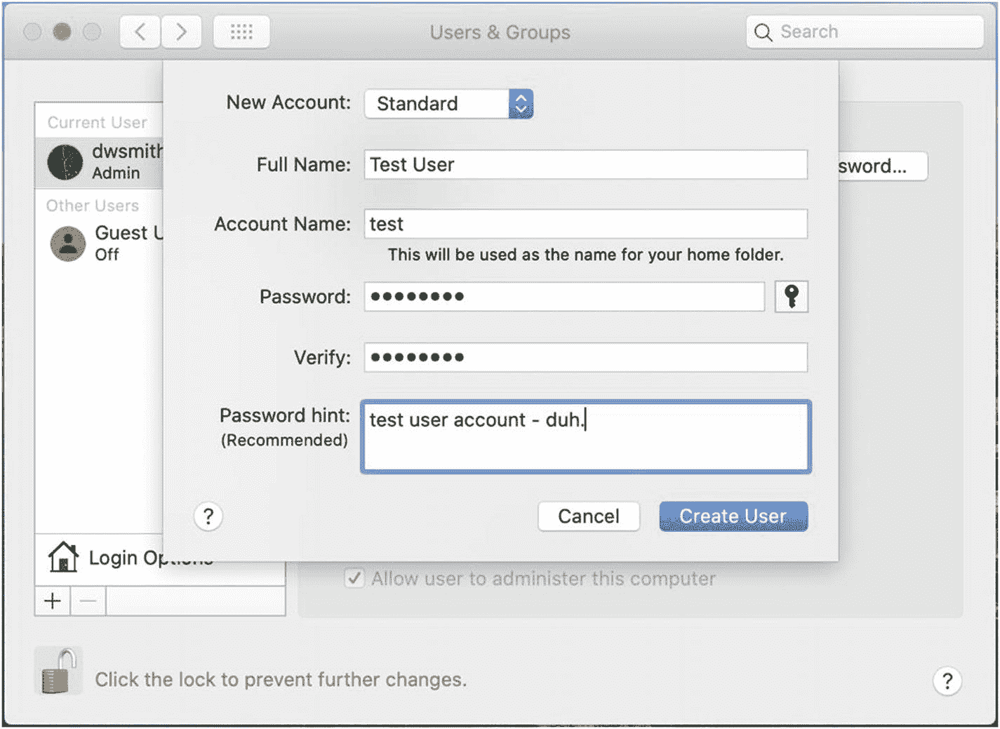

图 2-32
我们新帐户的用户名和密码信息

用户帐户创建完成后，您将在 `用户与群组` 窗格的左侧 `其他用户` 列表中看到友好名称和一个随机分配的照片。如果点击它以 `选中`，您可以在右侧修改一些内容。您可以使用 `重置密码` 按钮来重置密码。最后，您可以通过勾选 `允许用户管理此电脑` 的复选框将其升级为 *本地管理员帐户*。


### 高级选项

接下来，我们探讨一下这个新用户账户的一些高级选项。在其他用户列表中右键单击该用户账户，然后从出现的上下文菜单中选择**高级选项...**，如图 2-33 所示。

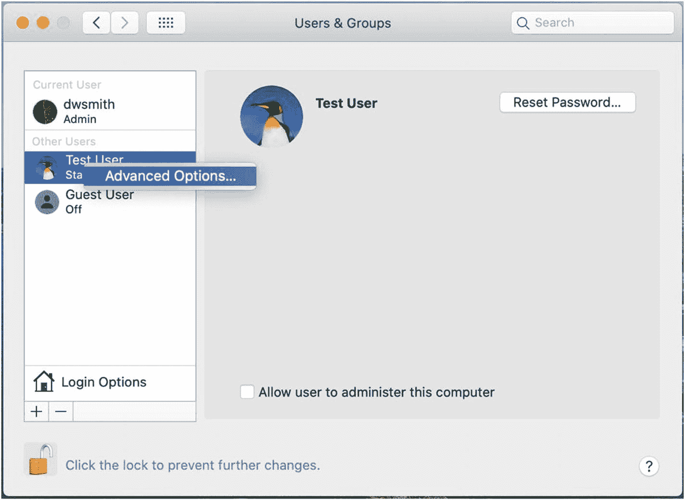

图 2-33

通过右键单击找到隐藏的高级选项...菜单

当高级选项窗口出现时，你会看到一个关于修改这些设置的警告。我通常不会经常调整其中的许多选项，但既然这是一个测试，你可以随意尝试以了解其因果关系，而不用担心损坏生产环境的用户账户。

这里有一些项目非常有用，如图 2-34 所示。你可以看到默认组是 `staff`，因为这是一个标准用户。登录 shell 默认为 `zsh`，因为我使用的是 Catalina。如果需要，我可以修改此项并选择 `bash`，以使其与早期版本的 macOS 保持一致。这里显示了用户主目录路径，我可以在需要时将其更改为其他位置或卷。我可以为此特定用户账户设置一个 Apple ID，以便用于 iCloud 或 Mac App Store，这样用户首次登录时就无需再设置。这对于分配机构 Apple ID 可能很有用，我们将在本书后续章节中介绍这一点。

最后，我们可以为此用户账户添加别名。别名允许我们添加其他用户名，这些用户名可以用来替代官方账户名进行登录。例如，如果我的账户名很长或很复杂，我可以添加一个较短的用户名作为别名。一些组织可能会这样做，以保持网络用户主目录的某种标准化，同时为用户提供一个友好的登录用户名。我个人并不经常使用别名，但你的情况可能有所不同。

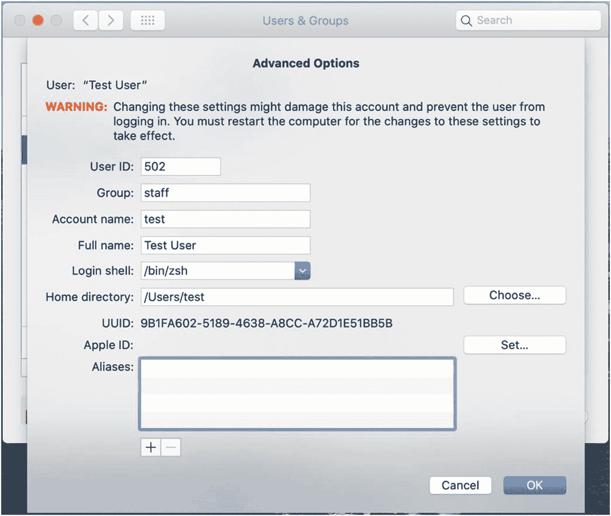

图 2-34

高级用户选项

### 登录项

接下来，我们将探索登录项的概念。请先关闭高级选项窗口，然后单击当前用户下列出的你的用户账户。点击**登录项**选项卡，如图 2-35 所示。

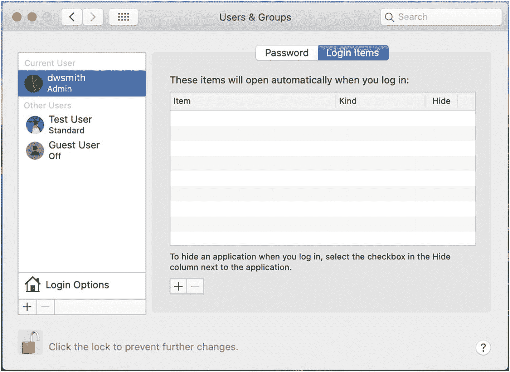

图 2-35

登录项选项卡

登录项可以被认为是用户登录时会自动打开或运行的项目，类似于 Microsoft Windows 的启动项。登录项不仅限于应用程序，你可以包含文档、脚本，甚至卷。你可以指定映射的网络驱动器，使其在登录时尝试重新连接；或者打开浏览器中的 HTML 文件，将用户重定向到特定网页以用于强制门户。

有时，应用程序在安装过程中会将一些项目添加到登录项列表中。如果你不希望这些辅助应用程序自动启动，可以在此处禁用该功能。你可以使用 `+/-` 按钮来添加或移除登录项。你也可以通过拖放操作，将项目直接从访达添加到列表中。

### 用户模板

关闭系统偏好设置，返回访达。使用**前往**菜单，选择**电脑**，打开一个访达窗口，以便浏览 Macintosh HD 的目录。浏览到 `/Users` 目录，如图 2-36 所示。你应该能看到自己的主目录以及其他用户的文件夹。当你尝试深入查看新用户的主文件夹时，虽然可以看到桌面、文稿等文件夹，但无法查看其内容。

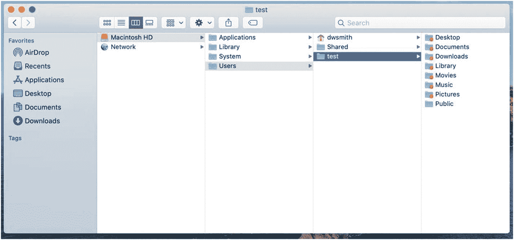

图 2-36

尝试浏览其他本地用户的主目录

虽然我们可以更改这些文件夹的文件权限并深入查看其内容，但此刻我们不会这样做。我引导你浏览到此目录，是为了说明在创建新用户账户时，会构建一个标准的文件夹结构。为了解其工作原理，我们将浏览启动磁盘的另一个区域，即系统的 `Library` 目录。返回到 Macintosh HD 的根目录，然后深入至 `/Library/User Template/`，如图 2-37 所示。

> 专业提示
> 请注意，我使用的是 macOS Catalina。较旧版本的 macOS 将用户模板文件夹放置在 `/System/Library/` 目录中，而 Catalina 则将其放在 `/Library` 目录下。如果你在 Catalina 中确实浏览到了 `/System/Library/`，苹果公司已友好地在那里为用户模板的新位置放置了一个替身（别名）。

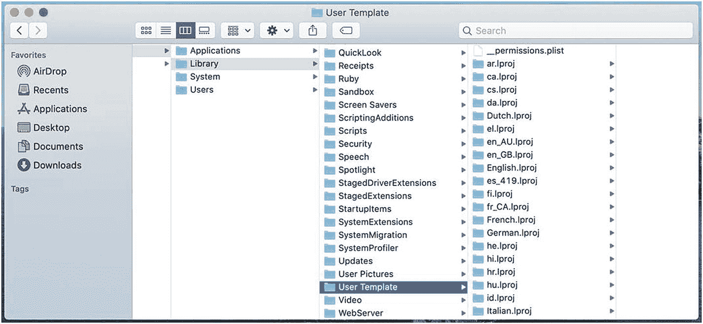

图 2-37

macOS Catalina 中的用户模板目录

`User Template` 文件夹基本上如其名所示——它是一个默认用户设置和目录结构的模板，用于构建新用户的主文件夹。其中还有针对全球不同地理区域的语言和键盘设置的各种文件夹。

在 macOS Mojave 之前，许多 Mac 系统管理员会利用用户模板文件夹来预载各种偏好设置，从而修改新用户的默认界面外观。最近，苹果公司修改了 macOS 处理用户模板的方式，使得这一功能失效。现在，推荐使用配置描述文件来自定义用户账户的界面外观。本书后续涉及描述文件管理器和 MDM 解决方案的章节将涵盖配置描述文件。

## 高级访达技巧

### Option 键修饰键

苹果公司在包括访达在内的许多 macOS 应用程序中使用的一个秘密技巧是，将 `option 键` 作为显示高级菜单选项的修饰键。如图 2-38 所示，按住 `option 键` 可以更改或为各种菜单添加额外功能。

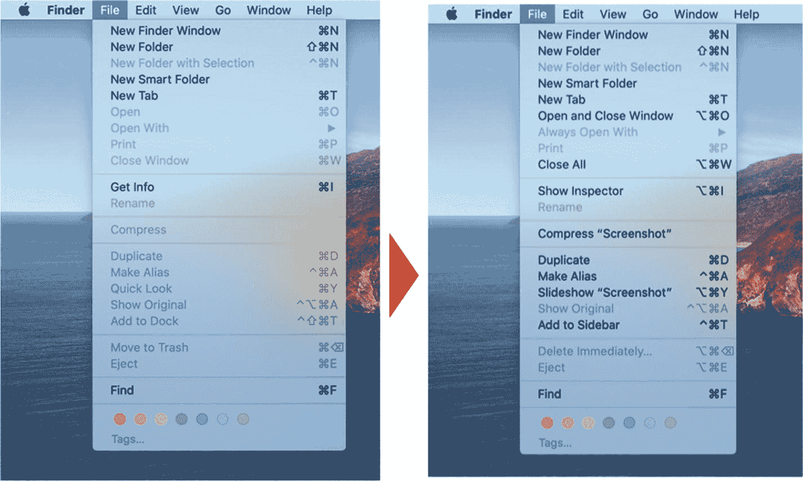

图 2-38

使用 option 键更改或添加隐藏菜单项


## 目录结构

要最好地理解如何管理和排查`macOS`的问题，熟悉操作系统目录结构的三个关键区域非常重要。在本节中，我们将探讨`系统`文件夹、`用户`文件夹以及隐藏的 Unix `private`目录。我们将使用如图 2-39 所示的`前往`菜单和`前往文件夹…`选项。

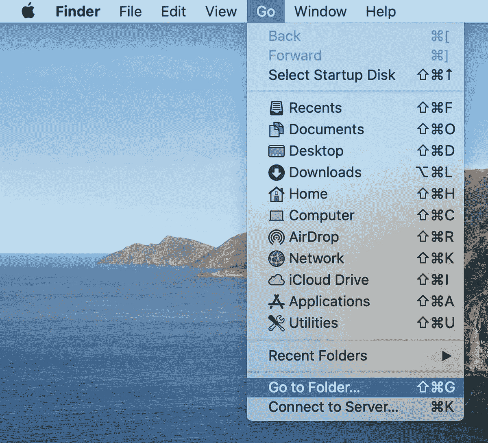

**图 2-39："前往文件夹…"菜单项**

要浏览到`系统`文件夹，我们将使用`前往`菜单并选择`电脑`。这将把我们带到 Macintosh HD 的根目录。在之前浏览用户模板目录时，您已经对系统文件夹有了一定的了解。有两个文件夹共同构成了`macOS`的核心——`系统`和`资源库`。这些文件夹包含系统范围的设置、驱动程序、系统文件以及随各种应用程序安装的任何第三方扩展。

作为苹果**系统完整性保护**计划的一部分，这些目录大多是只读的。从`macOS Catalina`开始，苹果还将操作系统默认包含的基础应用程序集存储在`/System/Applications`中一个符号链接的应用程序文件夹里。这些文件夹全部位于一个单独的只读卷上，并包含在整体的`Macintosh HD`容器中，与用户可修改的`Macintosh HD - 数据`卷一起，对最终用户来说如同一个单一驱动器，如图 2-40 所示。

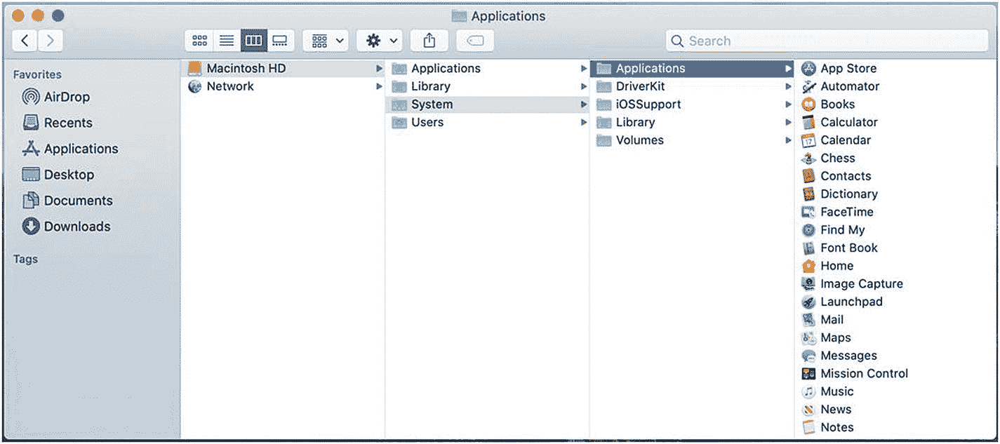

**图 2-40: 在 macOS Catalina 中，系统文件夹现在包含了操作系统附带的原厂应用程序**

接下来，我们可以使用`前往`菜单并按住`option`键，使`资源库`文件夹出现在选项列表中。选择`资源库`后，会弹出一个新的访达窗口，并带您进入`/Users/用户名/资源库`目录，如图 2-41 所示。请注意，此资源库文件夹与系统范围的资源库文件夹不同，它是针对**当前登录用户**的，且默认隐藏。

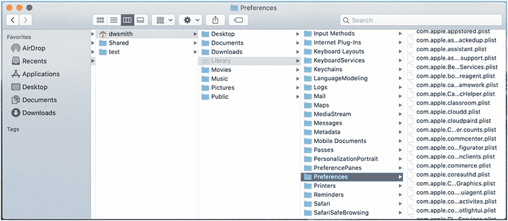

**图 2-41: 用户的资源库文件夹和偏好设置目录**

这个用户资源库文件夹，有时也被称为`~/Library`，其中波浪号`~`代表当前用户主目录的路径，包含了该用户特有的各种设置和应用程序支持数据。需要熟悉的一个关键子文件夹是`偏好设置`文件夹，它包含控制特定应用程序设置的`属性列表`文件。

通常，当一个应用程序首次启动时，它会将其默认偏好设置写入此目录。在后续启动时，如果偏好设置数据存在，应用程序会在启动时读取并加载它。如果数据不存在，应用程序将再次写入新的默认偏好设置。因此，排查有问题的应用程序时，一个常见的初步步骤是尝试删除一个支持文件夹或属性列表文件，看看将偏好设置重置为默认值是否能解决问题。

接下来，让我们使用`前往`菜单中的`前往文件夹…`选项，浏览 Macintosh HD 根目录下隐藏的 Unix `private`目录，如图 2-42 所示。这本质上是`macOS`的 Unix 核心，包含诸如`/etc`、`/var`和`/tmp`等各种目录。通常最好不去动这些目录，但如果您浏览`/tmp`目录，会发现这里有一些缓存，各种应用程序会将数据转储于此，这些数据会在重启过程中定期被删除。我们稍后在编写批量应用程序安装脚本时会用到`/tmp`目录。

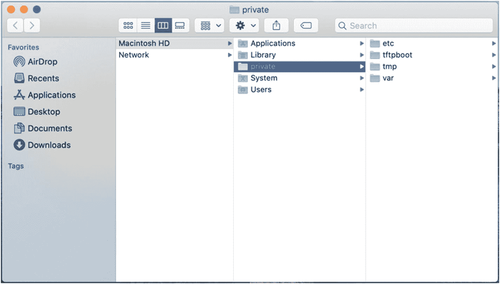

**图 2-42: 隐藏的 Unix private 文件夹及其内容**

最后，让我们再次打开终端，在命令提示符下输入：

```
cd /
```

以移动到启动磁盘的根目录。接着使用：

```
ls
```

来列出目录的内容。除了我们期望看到的文件夹如`系统`、`资源库`和`应用程序`之外，我们还看到许多其他文件夹，如`bin`、`sbin`、`usr`、`dev`、`cores`和`opt`。这些是操作系统使用的额外隐藏文件夹，类似于`/private`文件夹。您可以自行探索这些文件夹，但请注意，最好让操作系统按预期运行，不要轻易改动它们。

### 应用程序捆绑包

`应用程序捆绑包`，有时也称为`应用程序包`，实际上是一种文件夹或容器，对最终用户来说看起来像一个单一文件，但实际上它是一个包含支持数据的自包含可执行程序包。我们可以`右键单击`应用程序图标，选择`显示包内容`来深入查看此捆绑包中包含的支持文件。这在日常工作中很少使用，但值得了解的是，应用程序不仅仅是表面看起来那么简单。

> **专业提示**
>
> 还记得本章前面我们用来创建可启动 macOS 安装 USB 驱动器的命令吗？如果您查看我们运行的脚本，会看到其中有一个指向`createinstallmedia`命令的路径，该命令位于`安装 macOS Catalina`应用程序捆绑包内的`资源`文件夹中。打开此捆绑包的包内容，看看您是否能浏览到脚本中引用的`createinstallmedia`文件。

### 内核扩展

内核扩展，简称`kext`，是一小段加载到操作系统内核中并提供对硬件或其他组件支持的代码。您通常会看到第三方 kext 用于外部硬件，例如通过 Thunderbolt 或 USB 连接的专业音频混音器。您可以通过浏览`/System/Library/Extensions`文件夹或如图 2-43 所示通过终端运行`kextstat`命令来查看这些 kext 文件。

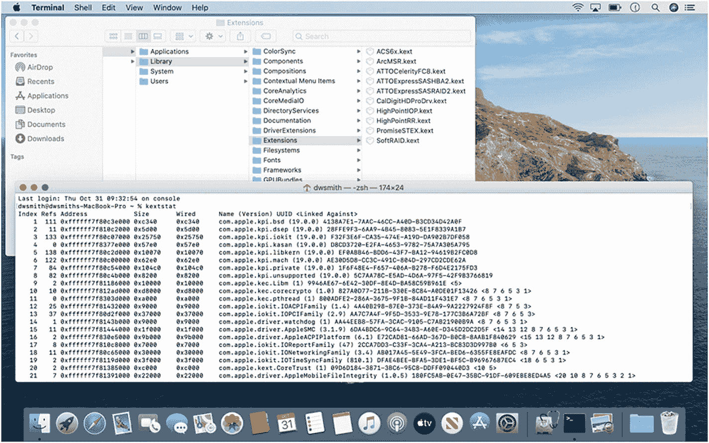

**图 2-43: kextstat 命令的输出，显示所有正在运行的内核扩展**

从`macOS High Sierra`开始，苹果引入了一项新的安全功能，要求用户在内核扩展首次需要加载时*批准*它们。系统会通过对话框提示用户批准，然后将用户重定向到*安全性与隐私系统偏好设置*，在`通用`标签页下点击`批准`按钮。苹果在`Mojave`和`Catalina`中继续加强了 kext 的安全性，这两者都要求 kext 必须由开发者进行*代码签名*。同样重要的是要注意，如果您清除了`NVRAM`，所有已授权的 kext 都必须重新授权。

> **专业提示**
>
> 如果您使用的应用程序或工作流程涉及 kext，最佳做法是确保您使用的是最新的应用程序版本，以避免由于苹果不断调整的安全要求而导致问题。在批准客户端系统上的操作系统更新之前，您还应咨询那些广泛使用 kext 的应用程序的开发者，以确保兼容性。即使是像从`10.15.0`升级到`10.15.1`这样的小更新，也存在破坏软件兼容性的风险。


### 额外系统实用工具

在我们探索各种系统和库文件夹的同时，有必要提一下隐藏在 macOS 内部的几个对网络和系统管理员非常有用的附加实用程序。浏览到 `/System/Library/CoreServices/Applications/`，在这个文件夹中，你会看到许多应用程序，如 `Archive Utility`、`DVD Player`、`Network Utility` 和 `Wireless Diagnostics`。

其中一些应用程序可以通过 macOS 中的其他方式访问，例如 `Archive Utility`、`Wireless Diagnostics` 和 `关于本机`。其他一些是来自不再作为标准配置的硬件的实用程序，例如 `DVD Player`（我的 `MacBook` 没有光驱）。其中一个特别有用的实用程序 `Network Utility`，可能值得将其移回其早前版本所在的位置 `/Applications/Utilities` 目录中。

如图 2-44 所示，网络实用工具包含诸如 `ping`、`nslookup`、`traceroute` 等常见工具。你可能希望将其保存到 Dock，从“实用工具”文件夹创建其替身，或者记住当你需要时，可以使用菜单栏右上角的 `放大镜` 并按名称搜索网络实用工具。

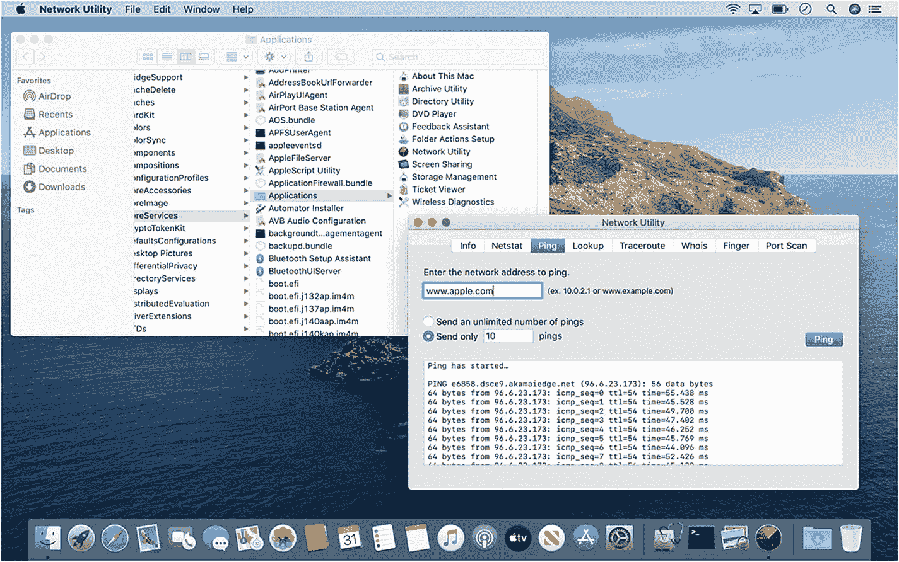

图 2-44

使用网络实用工具 ping [www.​apple.​com](http://www.apple.com)

#### 钥匙串访问

任何关于 macOS 客户端管理的章节，如果不讨论令人头疼的 `钥匙串`，都是不完整的！如果你进行过任何一段时间的 Mac 支持工作，很可能遇到过关于 `登录` 钥匙串的晦涩信息或其他恼人的与钥匙串相关的错误。钥匙串是什么，为什么它给我的用户带来这么多麻烦？

钥匙串可以通过位于 `/Applications/Utilities` 的 `钥匙串访问` 实用程序进行管理，它存储了 Mac 上用于访问各种网站、安全应用程序、服务和无线网络的所有不同用户名和密码组合。它还可以存储证书和加密密钥。你的 Mac 上有多个钥匙串，包括 `系统`、`本地项目` 和 `登录`，如果你已登录并激活了它，`iCloud 钥匙串` 还可以通过在多个 Apple 设备间同步项目来发挥作用。图 2-45 展示了钥匙串访问应用程序以及我的 Mac 上的各种钥匙串、密码、证书和密钥。

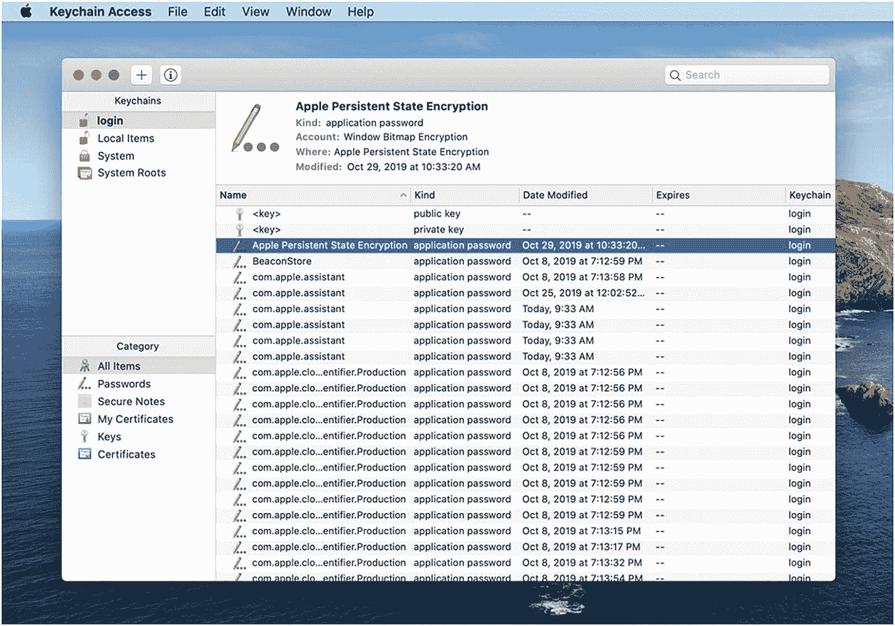

图 2-45

在登录钥匙串中找到的钥匙串访问数据

虽然这看起来相当简单和无害，但钥匙串的问题通常始于用户密码被重置或更改时。密码更改后，用户下次登录时，可能会看到一个对话框，提示他们使用新密码更新登录钥匙串或创建新的登录钥匙串。用户毕竟是用户，他们可能会选择错误的选项、跳过此步骤，或者不知道他们的旧密码而无法有效更新它，现在我们遇到了臭名昭著的登录钥匙串问题。

如果用户知道旧密码，这个问题相对容易解决。只需打开 `钥匙串访问`，选择 `登录` 钥匙串，然后从 `编辑` 菜单中选择 `更改钥匙串“登录”的密码`。它会提示输入旧密码和新密码，然后相应地更新钥匙串。

但如果用户不知道旧密码呢？在这种情况下，我们必须创建一个新的登录钥匙串。为此，请打开 `钥匙串访问`，然后从 `钥匙串访问` 菜单中选择 `偏好设置…`。在偏好设置对话框中，点击 `重置我的默认钥匙串` 按钮，如图 2-46 所示。请注意，这将删除 `登录` 和 `本地项目` 钥匙串，并用新的*默认*钥匙串替换它们。这意味着存储在这些钥匙串中的任何密码或条目都将被删除，用户将需要重新登录各种网站和服务以重新建立这些密钥。

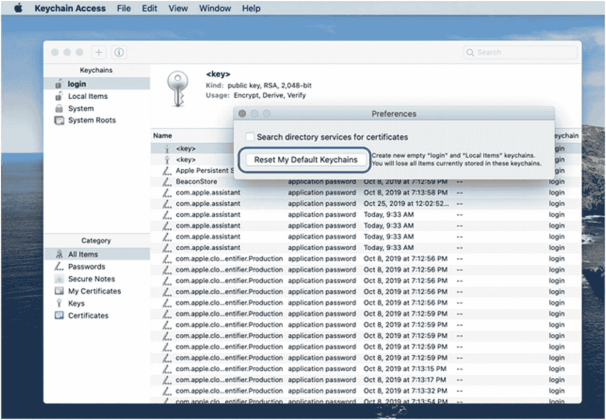

图 2-46

重置登录和本地项目钥匙串

## 总结

在本章中，我们涵盖了大量内容。现在你应该熟悉 macOS 的基本文件系统和目录结构了。你应该对使用终端感到相对自如了。你已经能够创建和管理新的本地用户帐户。最后，你学会了如何查找和使用功能强大的隐藏应用程序和功能。

Apple 的 macOS 是一个非常强大且功能丰富的操作系统，每个新版本都在不断发展和变化。对安全和隐私的关注一直是推动最新版本中许多增强功能的动力。因为这是一个非常重要且不断变化的话题，我们的下一章将专门讨论 macOS 中的最新安全和隐私功能。

