# 3. macOS 安全

macOS 是否真的比 Windows 更安全尚有争议，但 Apple 已经赢得了 Mac 比其他平台更不易受到恶意软件和隐私泄露影响的声誉。在 macOS 过去几个版本的迭代中，Apple 的许多安全和隐私服务持续演进，Mojave 和 Catalina 更是进一步强调了 `沙盒化` 和 `用户确认`。本章探讨了 Mac 系统管理员必须熟悉的硬件和软件安全与隐私控制。

## Mac 硬件安全

### 基本 EFI 启动安全

每台现代 Mac 都通过使用 `固件密码` 提供了可扩展固件接口（EFI）启动安全。使用 `固件密码实用工具` 或 `启动安全性实用工具`（取决于所使用的 macOS 版本），系统管理员可以锁定用户的能力，使其在未先输入密码的情况下无法将 Mac 启动到预启动环境。当你设置 EFI 密码后，在正常使用系统时通常看不到密码提示。当用户尝试将 Mac 启动到 `恢复模式`、`网络启动` 或 `可移动介质启动` 时，EFI 将在继续之前提示输入密码。这将 Mac 锁定为仅能从内部硬盘的操作系统启动。

要访问固件密码实用工具或启动安全性实用工具，你必须首先按照本书第 2 章的概述将 Mac 启动到恢复模式。一旦进入 macOS 恢复环境，请从 `实用工具` 菜单中选择 `固件密码实用工具` 或 `启动安全性实用工具`，如图 3-1 所示。按照屏幕上的提示设置固件密码，然后重新启动。确保你设置的密码是你会记住的，或者记录在你的 IT 组织内的某个地方。

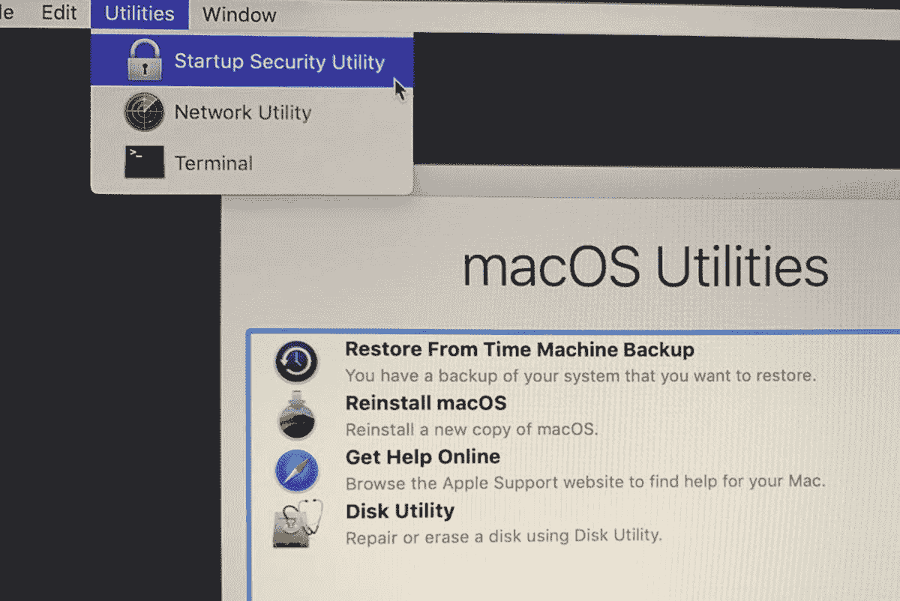

图 3-1

在 macOS 恢复模式中找到启动安全性实用工具

```
专业提示

请注意，设置 EFI 密码会将其保存到 Mac 逻辑板的持久性内存空间中。它不容易重置，根据 Apple 的官方文档，重置此密码的唯一授权方法是将计算机带到 Apple 零售店或其他 Apple 授权维修机构进行密码重置。
```


### Apple T2 安全芯片

自 2017 年底 `iMac Pro` 发布起，Apple 开始为大多数新款 Mac 配备一款名为 `T2` 的下一代定制芯片。T2 芯片集成了多种不同的硬件控制器，旨在通过单一芯片实现硬件级安全。例如，它集成了 `SSD 控制器` 以及一个全新的 `安全隔区` 协处理器，该协处理器负责在硬件层面管理启动安全和存储加密。

截至本文撰写时，以下机型配备了 T2 芯片：

*   2017 年款 iMac Pro（及后续机型）
*   2018 年款 Mac mini（及后续机型）
*   2018 年款 MacBook Air（及后续机型）
*   2018 年款 MacBook Pro（及后续机型）

要确定您的 Mac 是否配备 T2 安全芯片，可以通过 `关于本机` 对话框查看 `系统报告` 并点击 `系统报告` 按钮来查找。在系统信息界面中，依次展开 `硬件` > `控制器 (或 iBridge)`；如果 `控制器型号名称` 为 `Apple T2 芯片`，则您的计算机配备了该芯片。T2 安全芯片启用/影响着以下功能：

*   **触控 ID**（将触控 ID 数据存储在安全隔区中）
*   前置 **FaceTime 高清摄像头** 的信号图像处理，用于面部识别
*   启用 **安全启动**
*   增强的 **加密存储**
*   安全 **系统管理控制器**
*   麦克风安全的 **安全音频控制器**

`安全启动` 是 T2 芯片的一项功能，应特别引起 Mac 系统管理员的关注。此功能仅在配备 T2 芯片的 Mac 上可用，当您启动进入 `macOS 恢复` 模式时会找到它。要配置安全启动功能（如图 3-2 所示），启动进入恢复模式后，从 `实用工具` 菜单中选择 `启动安全性实用工具`。

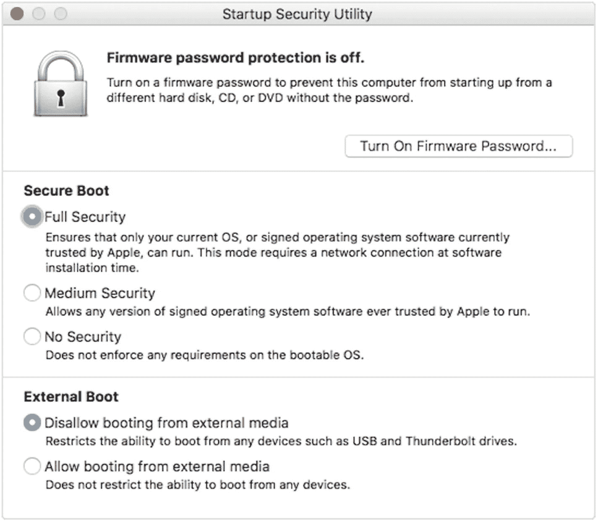

图 3-2
安全启动功能的配置选项

安全启动提供三种选项：`完整安全性`、`中等安全性` 和 `无`。任何 T2 机型出厂时默认启用 `完整安全性`。此选项需要互联网连接，并会检查您尝试安装的操作系统当前是否受 Apple 信任。`中等安全性` 会检查您尝试安装的操作系统是否曾被 Apple 信任，且无需互联网连接。`无` 则完全不强制要求操作系统签名或信任。

请注意，在启用 T2 的系统上，此实用工具取代了 `固件密码实用工具`。它具备控制外部启动的能力，您可以禁止或允许从 USB 闪存驱动器、Thunderbolt 硬盘等外部介质启动。对于资深的 Mac 系统管理员而言，还需要一提的是，T2 芯片不支持网络启动或 `NetBoot`。T2 Mac 唯一支持的有网络功能的启动选项是使用 Apple 的 `互联网恢复` 服务。如果您正在使用基于 NetBoot 的映像部署工作流来预置硬件，请注意您将无法在启用 T2 的 Mac 上这样做。

## 文件权限

与其他基于 Unix 的操作系统一样，`macOS` 使用 `POSIX` 文件权限。对于任何文件、文件夹或宗卷，可以按用户或组分配四种标准权限。

### POSIX

`只读`：用户可以浏览文件目录并从中打开/复制文件，但不能写入该目录或保存对文件的更改。

`只读与执行`：用户可以读取目录中的文件并执行目录中的应用程序。

`只写`：用户仅能向具有此权限的文件夹写入内容。他们无法打开该文件夹或浏览其内容，只能将文件放入具有只写权限的目录中。

`无访问权限`：用户无权访问该文件或文件夹。

除了文件权限选项外，`macOS` 中的每个文件或目录都具有一个 `所有者`（特定用户）、一个（特定）`群组` 以及一个 `所有人` 群组。"所有人"群组是一个统称，指代任何可能访问该文件或目录但不是特定所有者或群组成员的用户。您可以将此理解为 *其他所有人*。所有者是创建文件或将其复制到当前目录的特定用户。群组通常继承自文件或文件夹所在的父文件夹。

`macOS` 中默认的文件权限群组包括：

*   `staff`：所有本地用户帐户所属的群组，包括标准用户。
*   `admin`：所有具有管理员权限的本地用户帐户所属的群组，拥有一些提升的权限，例如能够写入 `/应用程序` 文件夹。
*   `wheel`：此群组保留给 `超级用户` 或 `root` 帐户。root 帐户是该群组的唯一成员，且应保持如此。许多系统文件和目录受此群组保护。

### 修改文件权限

除非您正在 Mac 上设置特定的局域网或互联网文件共享，否则建议并最好保持文件和文件夹的默认权限。如果您在同一台 Mac 上的多个用户之间本地共享文件，Apple 在每个用户的家目录中都提供了一个 `公共` 文件夹，用于放置旨在同一台机器上跨多个用户共享的文件。

如果您确实需要修改文件权限，可以在访达中选择文件或文件夹，然后从 `文件` 菜单中选择 `显示简介` 或通过 `右键点击` 来操作。图 3-3 概述了如何进行这些更改。

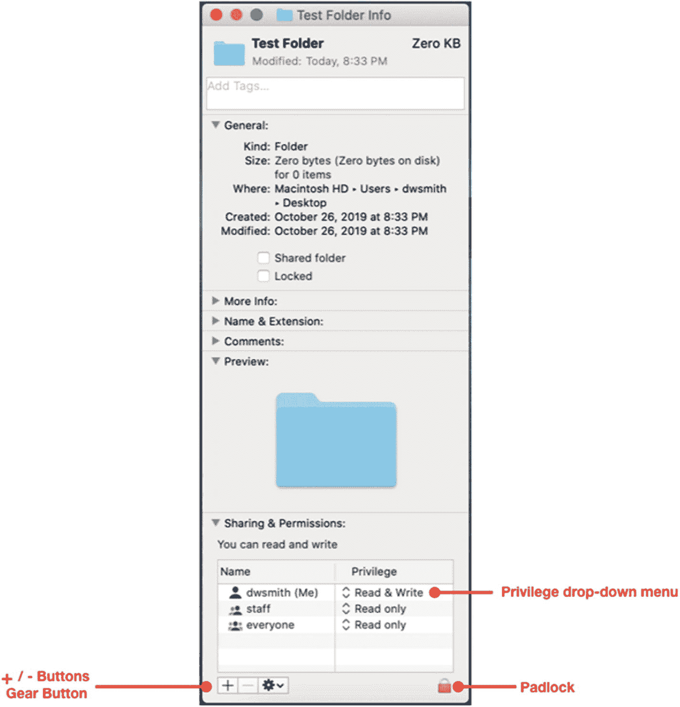

图 3-3
"显示简介"对话框中的"共享与权限"面板

*   `挂锁`：如果已锁定，点击它以使用具有解锁权限的用户进行认证，以便更改文件或文件夹的共享和安全设置。
*   `+/- 按钮`：使用这些按钮来添加或删除用户或群组，并设置额外的权限。
*   `齿轮按钮`：使用此选项可将文件夹的权限复制到其包含的文件和文件夹。这允许您更改顶级目录的权限，并将这些权限向下复制。
*   `权限下拉菜单`：使用此菜单为给定的用户或群组设置权限。


## 家长控制和屏幕使用时间

`macOS Catalina` 之前的版本提供了一个*家长控制*系统偏好设置，允许本地管理员创建一个具有额外可配置限制的标准用户账户。在创建新用户并选择**“通过家长控制管理”**作为用户类型时，您可以创建一个受家长控制的用户。或者，当您打开*家长控制*系统偏好设置时，它会提示您创建一个受管理的用户账户，如图 3-4 所示。

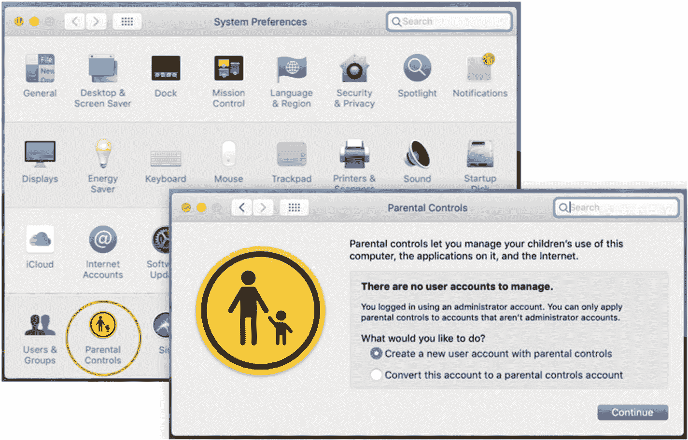

图 3-4
`macOS Catalina`之前版本中的家长控制系统偏好设置

苹果决定在 `macOS Catalina` 中移除*家长控制*功能，转而将首次出现在 `iOS 12` 中的一个功能移植到 `macOS`，该功能称为*屏幕使用时间*。配置屏幕使用时间是通过新的系统偏好设置完成的，如图 3-5 所示。

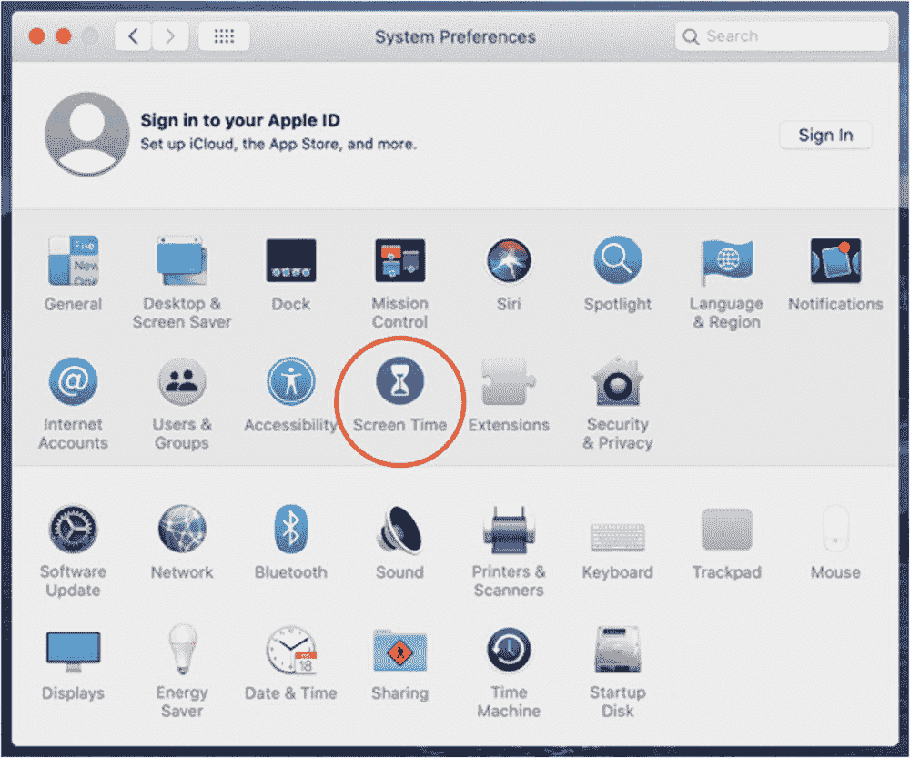

图 3-5
`macOS Catalina` 中新的屏幕使用时间系统偏好设置

家长控制中的几乎所有功能都已添加到屏幕使用时间中，同时还增加了允许本地管理员权限的用户使用此功能的选项。这样设计的目的是让用户可以监管自己的计算和社交媒体习惯，同时仍能完全管理系统。屏幕使用时间相对而言易于理解，但这里有一些非常酷的新功能需要重点介绍。

其中一个功能是能够从您自己的 Mac 上管理您孩子的所有设备，而无需在他们的设备上交互式地设置。只要您的 iCloud 账户启用了*家庭共享*，并且您孩子的 iCloud 账户是家庭共享计划的一部分，您就可以无线管理所有的屏幕使用时间功能。如果您要管理孩子的设备，您需要设置一个屏幕使用时间密码，以防止他们覆盖您的设置。要做到这一点，请点击*屏幕使用时间系统偏好设置*中的**“选项”**按钮，并如图 3-6 所示设置密码。

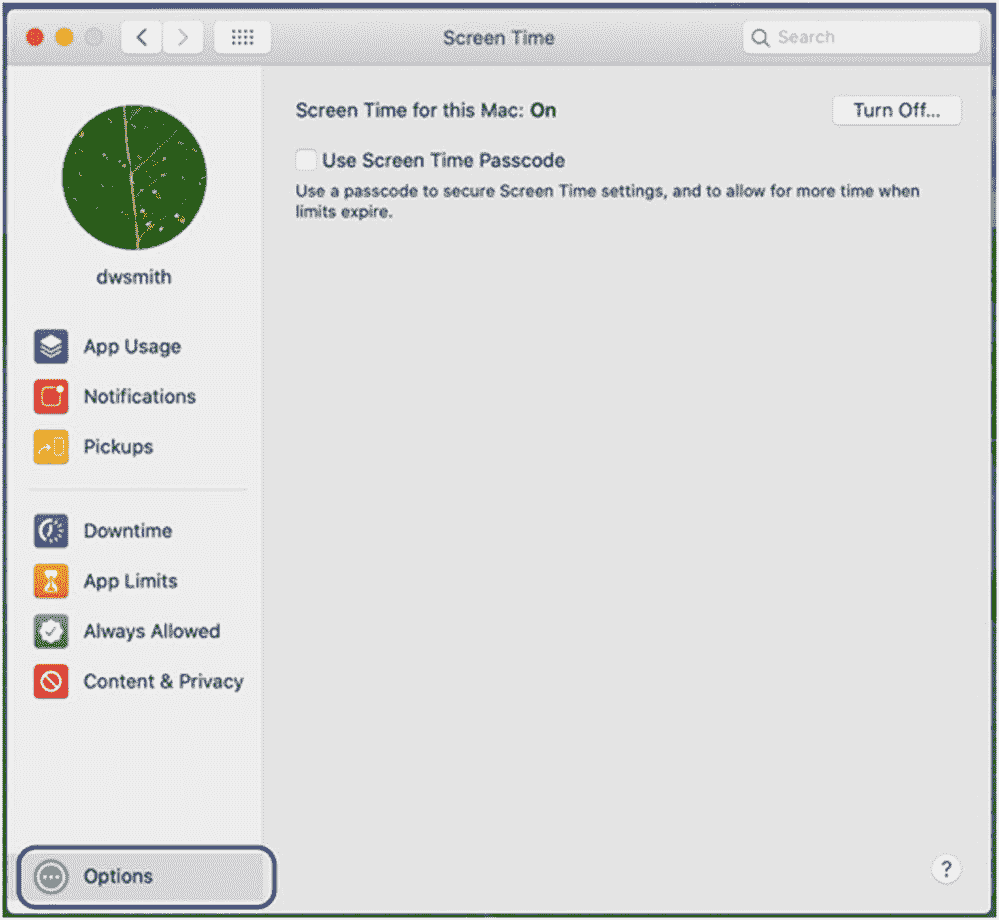

图 3-6
屏幕使用时间的选项按钮和密码选项

Mac 上屏幕使用时间的另一个功能是能够独立控制您的 `iOS` 和 `macOS` 设备的**“内容与隐私限制”**。例如，只要您在 `iOS` 和 `macOS` 之间共享屏幕使用时间数据，您就可以在 Mac 上限制不当内容，但在 iOS 设备上则不限制。除了这些功能之外，屏幕使用时间的大部分内容与您在旧版 `macOS` 的*家长控制*中找到的类似。有**时间限制**用于管控上学时间或就寝时间的设备使用（现在称为*停用时间*，如图 3-7 所示），以及可以定义的**内容和隐私**设置，如图 3-8 所示。

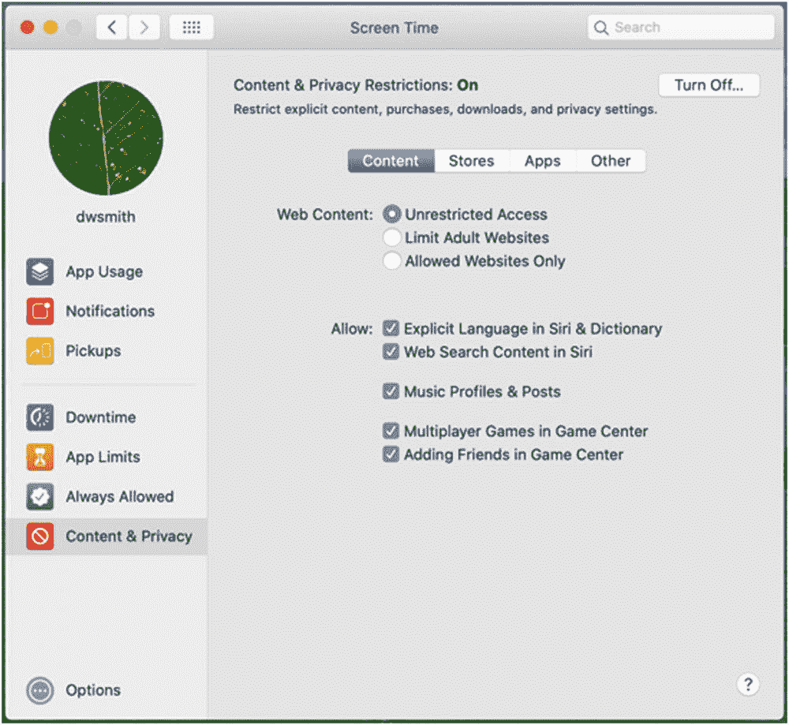

图 3-8
屏幕使用时间中的内容与隐私限制

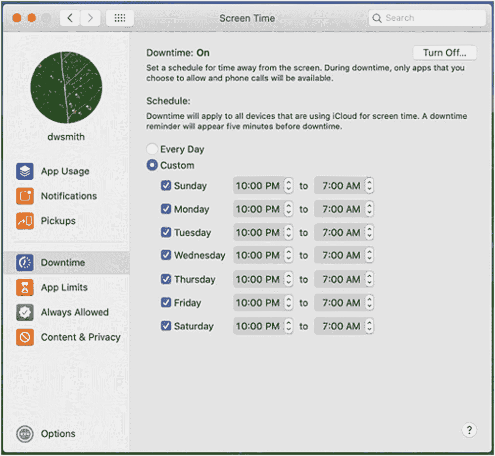

图 3-7
停用时间计划设置

*App 限额*提供了新的精细控制级别，可以控制哪些应用程序能够使用、何时使用以及可以使用多长时间。您可以选择应用程序类别或指定特定的应用程序为*受限*或*允许*。使用**“始终允许”**配置选项来指定要允许的应用程序，即无论一天中的什么时间或使用时长如何，都可以使用的应用程序，如图 3-9 所示。如果您正在管理孩子的设备，他们在达到应用程序限额后也可以请求更多时间，您可以通过 Mac 上的*屏幕使用时间系统偏好设置*来批准该请求。

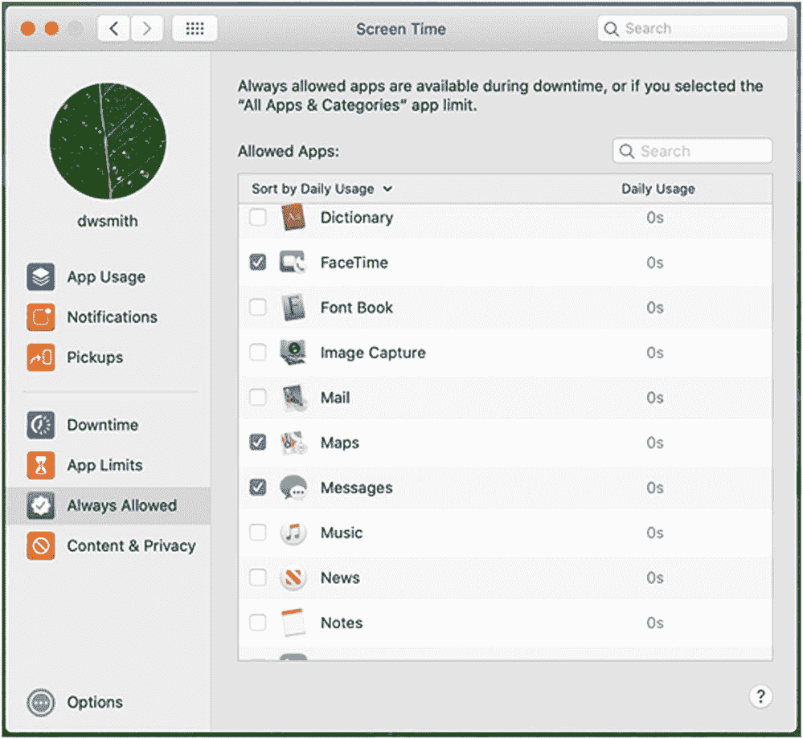

图 3-9
App 限额允许您指定哪些应用程序可用以及每天可以使用多长时间

**专业提示**

屏幕使用时间提供了一些基本功能来控制计算机使用和过滤内容，但需要注意的是，这是为消费者使用而开发的，并不是用于大规模 1:1 部署的万无一失的安全解决方案。根据您组织的具体需求，可能还有其他商业安全应用程序更适合。**移动设备管理** (`MDM`)——我们将在第 8 章讨论——提供了比单独使用屏幕使用时间更精细、更有效的方法来限制大量 Mac。

## Gatekeeper

苹果限制 `macOS` 上恶意软件的方法是要求合法的应用程序开发人员对其应用程序进行*签名*，否则未经用户明确同意，这些应用程序将无法运行。*Gatekeeper*是苹果给这个功能起的名字，它通过*安全性与隐私系统偏好设置*进行控制。图 3-10 显示了配置 Gatekeeper 的选项。

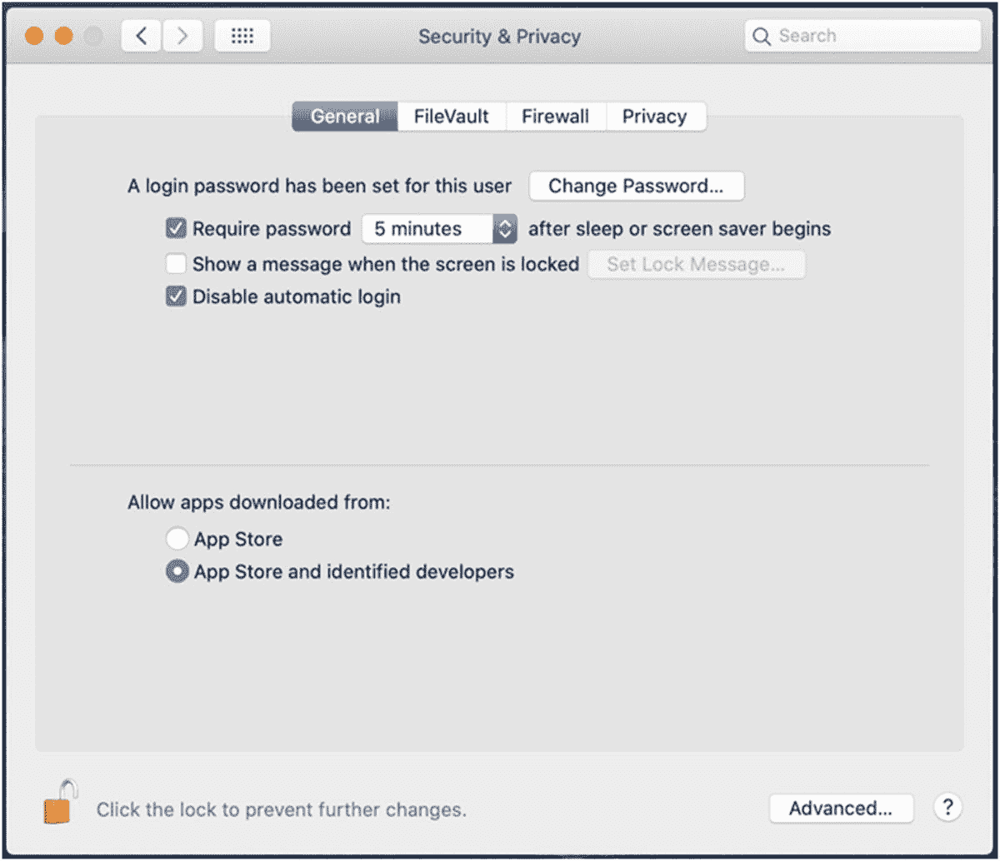

图 3-10
安全性与隐私系统偏好设置“通用”标签中的 Gatekeeper 选项

Gatekeeper 为系统管理员提供了两个选项，允许 Mac 运行来自第三方开发者的应用程序。**“App Store 和被认可的开发者”**是默认选项，该选项会阻止未经代码签名或非从*Mac App Store*下载的应用程序运行。**“App Store”**是更安全的选项，它限制用户运行任何从互联网下载的应用程序，只允许从*Mac App Store*下载的应用程序。

作为管理员，您可能仍然需要出于某种原因运行一个未经代码签名或不是从 Mac App Store 下载的应用程序。在早于 `Sierra` 的 `macOS` 版本中，有第三个选项**“任何来源”**，允许您运行应用程序而不会受到 Gatekeeper 的阻拦。尽管此选项在较新的版本中已被移除，但管理员仍然可以通过**右键单击** Gatekeeper 阻止的应用程序，选择**“打开”**，然后在警告对话框中同意，从而覆盖 Gatekeeper 并允许该应用程序运行，即使这样做可能不安全。


## FileVault

`FileVault`是苹果内置的磁盘加密技术，目前版本为 2.0。要启用`FileVault`，请使用`Security & Privacy System Preference`，然后在 FileVault 标签页中点击**Turn on FileVault**…按钮，如图 3-11 所示。

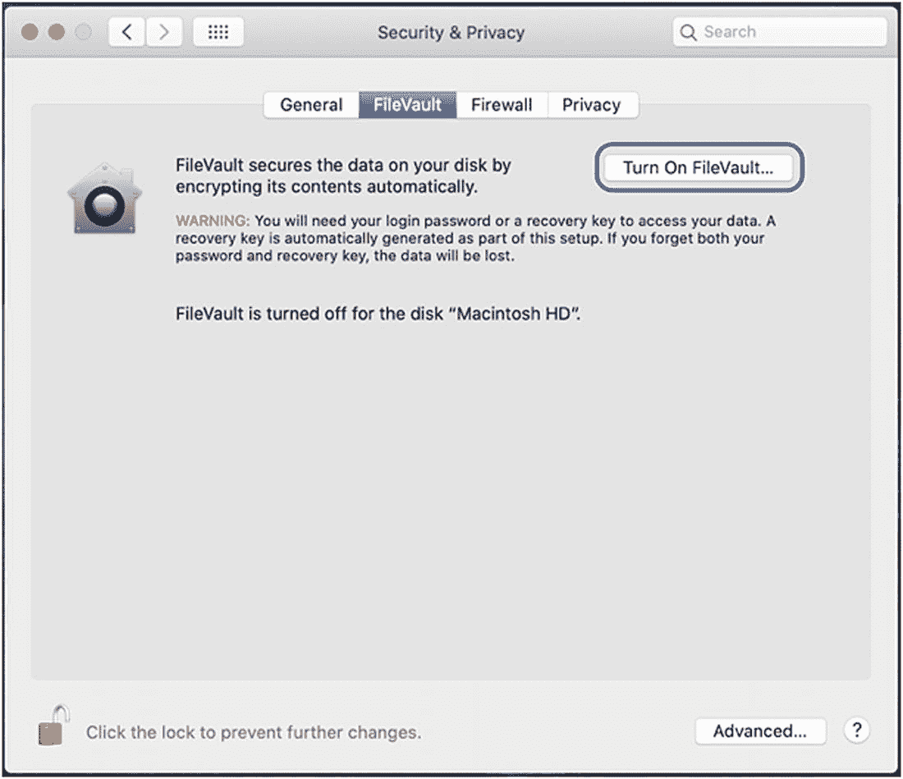

图 3-11
在安全性与隐私系统偏好设置中启用 FileVault 加密

启用`FileVault`时，需要配置一个恢复密钥选项，以防需要解密驱动器或在另一台 Mac 上装载它。对于个人使用，您可能希望配置您的 iCloud 帐户来解密驱动器。对于小型企业或公司，如果只需要在几台 Mac 上支持`FileVault`加密，建议为每个系统创建一个恢复密钥，并将密钥字符串保存在安全的地方，以便在需要解密驱动器时参考。此选项如图 3-12 所示。

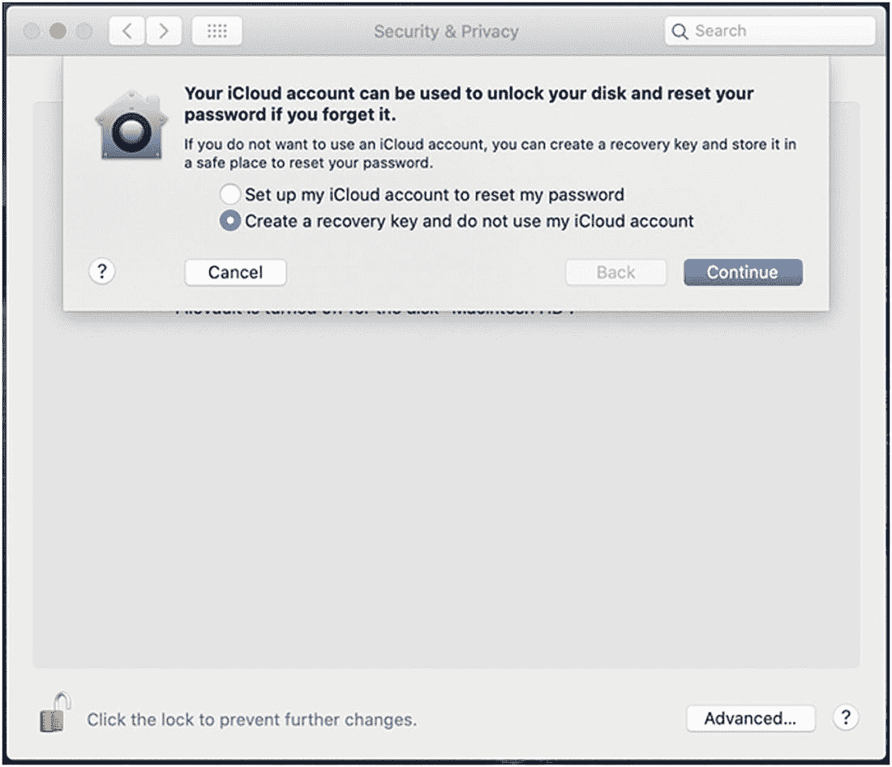

图 3-12
选择 FileVault 恢复密钥

### FileVault 机构恢复密钥

如果您有数百或*数千*台需要加密的 Mac，并且您不想为每个用户或每台机器管理单独的恢复密钥字符串，该怎么办？幸运的是，苹果提供了为组织中的每台 Mac 创建和部署**机构恢复密钥**（IRK）的选项。部署 IRK 涉及三个步骤：在一台 Mac 上创建**主钥匙串**，编辑主钥匙串的副本以**移除私钥**，然后将配置**部署**到所有其他 Mac。

创建`FileVault`密钥需要使用命令行界面。打开`Terminal`，在提示符处输入以下命令来创建主钥匙串：

```
security create-filevaultmaster-keychain ~/Desktop/FileVaultMaster.keychain
```

系统会提示您创建密码。按照提示创建并验证密码。命令执行完毕后，您的桌面上会出现一个名为`FileVaultMaster.keychain`的文件，如图 3-13 所示。这是私钥恢复密钥的原始副本，可用于解锁组织中任何配置为使用 IRK 的 Mac。您需要将其复制到安全位置，并限制仅授权人员可以访问。

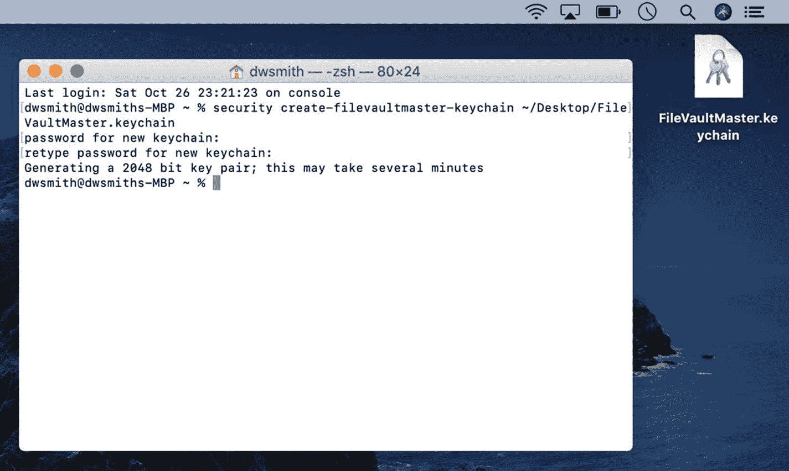

图 3-13
该命令已在桌面上生成了一个 FileVaultMaster 钥匙串

接下来，我们需要准备一份用于部署到其他 Mac 的副本：

1.  使用`Keychain Access`应用程序打开`FileVaultMaster.keychain`文件。
2.  在`Keychain Access`应用程序中，单击左侧的`FileVaultMaster`以选中它。如果需要，单击**padlock**图标并进行身份验证以解锁它。密码与您在`Terminal`中创建`FileVaultMaster`文件时使用的密码相同。
3.  在右侧找到名为`FileVault Master Password Key`的*私钥*文件，如图 3-14 所示。单击它以选中，然后从`Edit`菜单中选择`Delete`将其删除。现在您就有了一个缺少私钥的钥匙串文件。

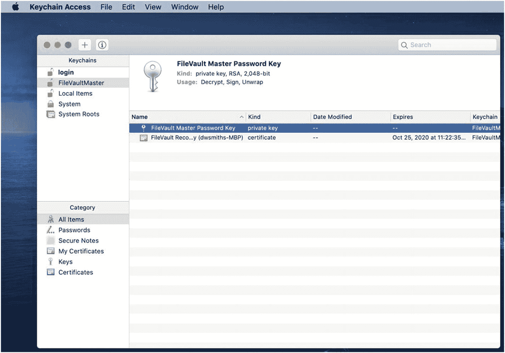

图 3-14
删除 FileVault Master Password Key

现在我们已经准备好将 IRK 部署到其他 Mac。在每台您想要配置使用 IRK 的 Mac 上，请按照以下步骤操作。

4.  将我们修改过的`FileVaultMaster.keychain`文件复制到`/Library/Keychains/`文件夹，如图 3-15 所示。

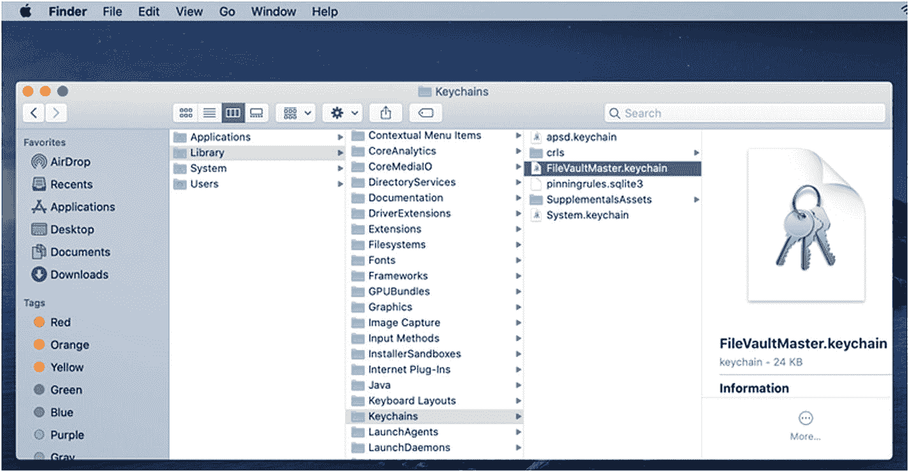

图 3-15
将修改后的钥匙串文件复制到要使用 IRK 的每台客户端 Mac 的`/Library/Keychains/`目录

5.  打开`Terminal`应用程序，输入以下命令来正确设置文件的权限。这些命令将所有者设置为`root`，组设置为`wheel`，然后设置我们想要的正确读/写权限：

```
sudo chown root:wheel /Library/Keychains/FileVaultMaster.keychain
sudo chmod 644 /Library/Keychains/FileVaultMaster.keychain
```

6.  打开`Security & Privacy System Preference`并浏览到 FileVault 标签页。单击按钮以启用`FileVault`。如果操作正确，您将不会收到创建恢复密钥的提示，而是会看到类似图 3-16 中的消息。

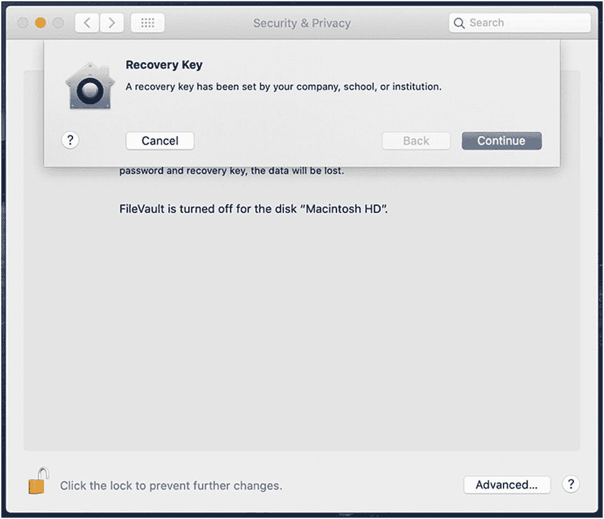

图 3-16
FileVault 不会提示输入恢复密钥选项；它会自动使用 IRK

**专业提示**
您可能会遇到这样一种情况：组织中的一些机器已经启用了`FileVault`，而您希望将其转换为使用 IRK。如果是这种情况，在复制钥匙串文件并设置正确的文件权限后，您可以在`Terminal`中输入一个命令，将现有的`FileVault`恢复密钥转换为您机构的恢复密钥。

将现有的`FileVault`实例转换为机构恢复密钥的命令：

```
sudo fdesetup changerecovery -institutional -keychain /Library/Keychains/FileVaultMaster.keychain
```

## 防火墙

苹果为`macOS`提供了一个内置的软件防火墙，默认情况下是禁用的。要配置它，请打开`Security & Privacy System Preference`并选择`Firewall`标签页。在这里，您可以打开或关闭防火墙。启用防火墙后，您可以配置各种选项。图 3-18 显示了可用的选项以及如何将应用程序添加到例外列表。

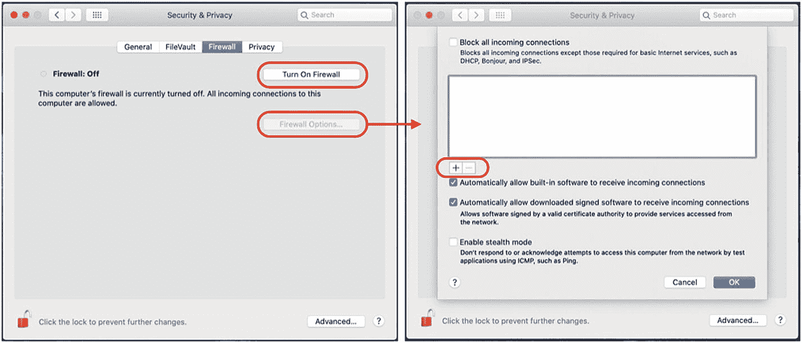

图 3-18
防火墙例外和可配置选项

## 高级安全选项

您可能已经注意到`Security & Privacy System Preference`上的`Advanced`按钮。单击该按钮时，您将有几个可以配置的附加选项，这两个选项都真正面向共享计算环境，如计算机实验室或公共区域。图 3-19 显示了这些选项。

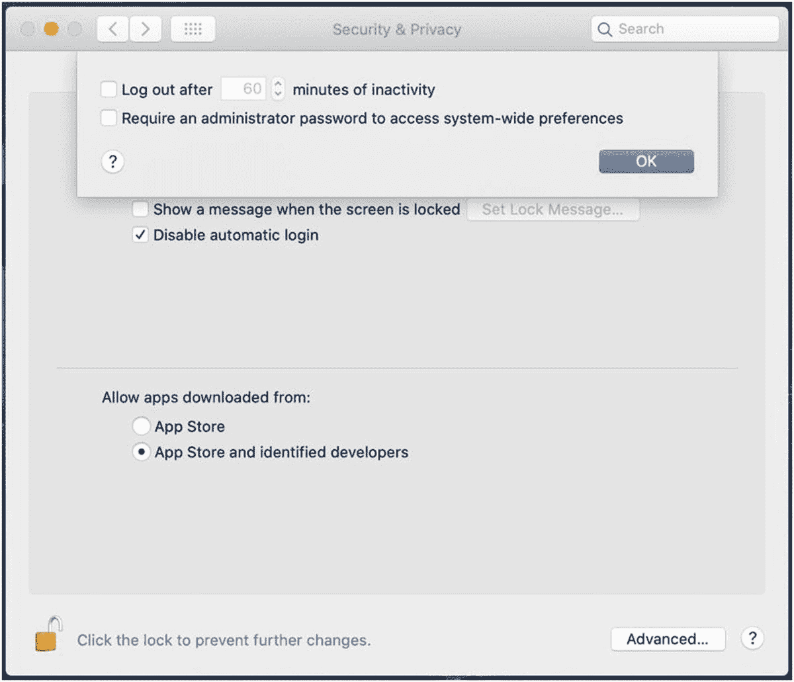

图 3-19
高级安全性与隐私选项

*   **在 x 分钟不活动后注销**：此选项可以配置为在指定时间内无用户交互后，自动将 Mac 返回到登录窗口。如果有人在公共场所离开并让计算机保持使用唯一用户帐户登录的状态，这有助于保护用户数据。
*   **需要管理员密码才能访问系统范围的偏好设置**：您可能会注意到许多（但并非全部）系统偏好设置都有一个锁定图标，可以锁定非管理员用户所做的更改。选中此选项的复选框会在**所有**系统偏好设置面板上放置一个锁定图标。这允许系统管理员设置通常可由标准用户修改的特定用户设置，并保持这些设置不变。


## 总结

在本章中，我们探讨了保护 Mac 安全的多种方法，了解了 Apple 在核心安装的`macOS`中提供的各种内置安全功能，并认识了`Transparency, Consent, and Control`等新兴的安全框架。在深入研究了 Mac 相关的两个章节后，我们将转换主题，接下来探索`iOS`和`iPadOS`。

### iOS 客户端管理

与`macOS`相比，`iOS`及其衍生的`iPadOS`是相对年轻的操作系统。它于 2007 年随第一代`iPhone`一同发布，至今仅有十多年历史，目前已发展到第十三个主要版本。相较于桌面操作系统，`iOS`的管理要简洁直接得多。其最初被设计为手机的操作系统，并不具备传统计算机操作系统的要求，例如从互联网任意位置安装下载的软件或强大的外围设备支持。虽然`iOS`比真正的桌面级系统简单，但在支持大量`iPhone`和`iPad`时，系统管理员仍需熟悉一些关键功能。本章为理解 Apple 为运行`iOS` 13 和`iPadOS`（13）的设备提供的配置、安全和故障排除能力奠定了基础。

## iOS 硬件支持

`iPhone`和`iPad`的物理按钮或开关非常少。在大多数情况下，iOS 设备不被认为是用户可自行维修的，这意味着只有`Apple Authorized Repair Center`或`Apple Retail Store`可以进行维修。除了标准重启，你还可以尝试使用特殊的按钮组合进行`forced restart`，以解决`iPad`或`iPhone`的常见问题。

### 强制重启

当设备完全冻结或卡死，无法选择正常重启时，你可能需要强制重启设备。如果操作正确，`forced restart`将关闭所有应用并彻底重启设备。图 4-1 至 4-5 提供了截至本文撰写时各主流 iOS 设备系列的强制重启操作说明。

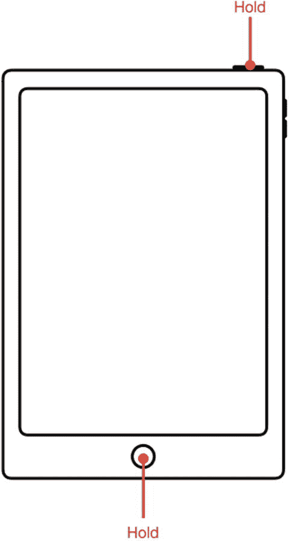

图 4-5
带 Home 键的 iPad 强制重启组合键

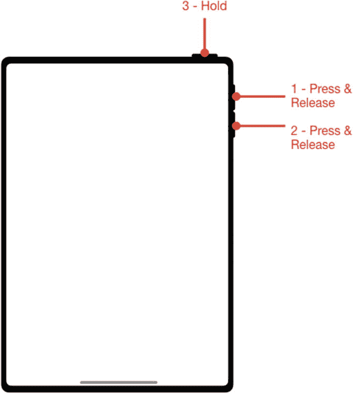

图 4-4
不带 Home 键的 iPad 强制重启组合键

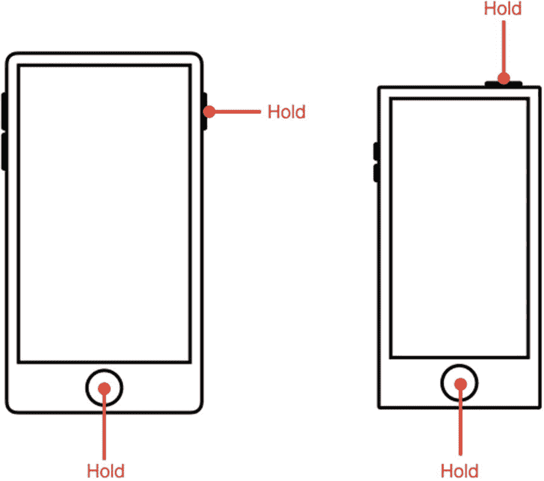

图 4-3
iPhone 6 和 iPhone SE 的强制重启组合键

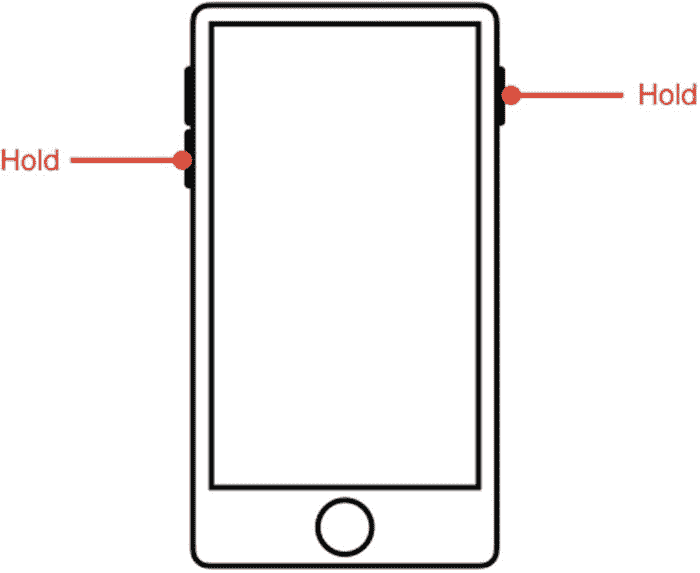

图 4-2
iPhone 7 系列的强制重启组合键

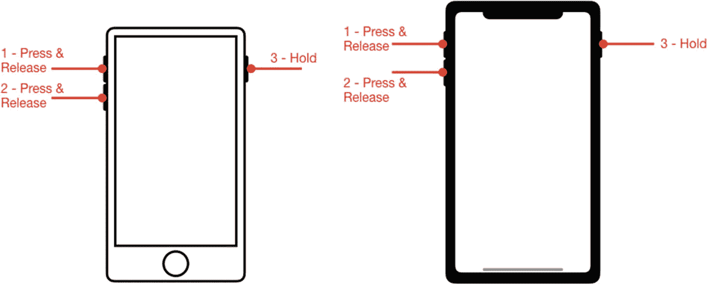

图 4-1
iPhone 8 系列、iPhone X 系列和 iPhone 11 系列设备的强制重启组合键

专业提示
在某些情况下，当显示屏休眠时，iOS 设备可能会卡死，看起来就像设备完全没电了一样。假设电池电量足以驱动设备，使用`forced restart`方法也能唤醒那些看似“死机”，但实际上只是因为显示屏关闭而卡住的设备。

### 电池健康

每台 iOS 设备中的锂离子电池并非永久使用。随着反复使用，电池最终将无法保持其最大电量，从而缩短每次充电后设备的续航时间。Apple 在 2017 年遇到了一些麻烦，当时它承认在电池超过其使用寿命后，会限制 iOS 设备的性能。在随后的用户强烈反对之后，他们新增了一个`Battery`设置，为用户提供关于应用程序如何影响电池、电池健康状况以及电池对设备性能影响（如果有）的信息。图 4-6 提供了电池设置功能的几张截图。

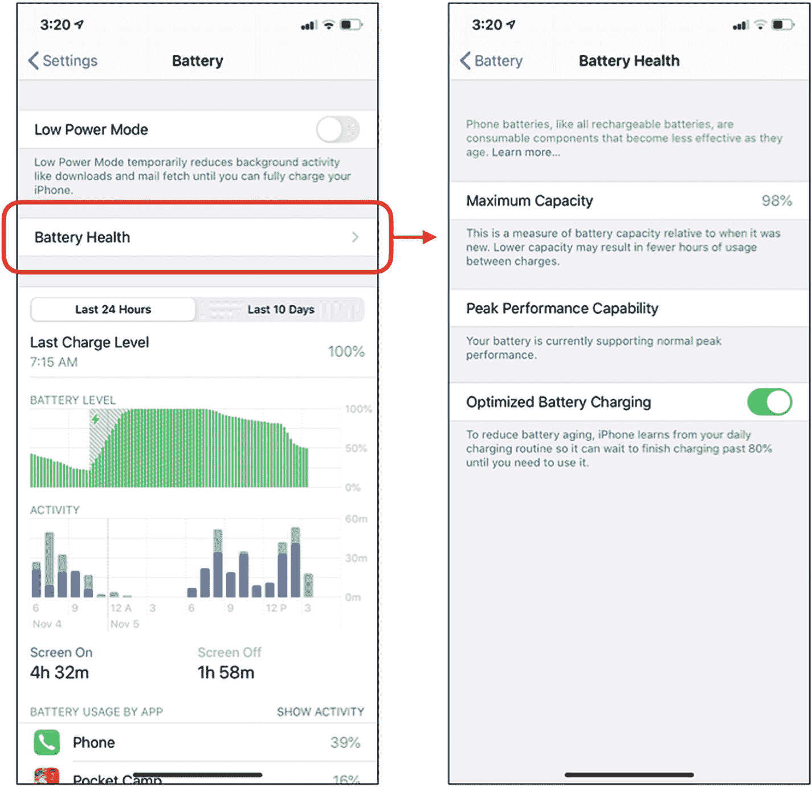

图 4-6
iOS 13 的电池和电池健康设置

通过进入`Settings`应用 > `Battery`来访问`Battery`设置。你可以通过进入`Settings`应用 > `Battery` > `Battery Health`来查看电池健康信息。

`Low Power Mode`通过禁用某些后台功能来减少电池消耗，从而让你的`iPhone`在一次充电后使用更长时间。建议在需要手机但电池电量非常低的情况下临时启用此设置。请注意，它可能会影响某些应用或服务的性能或功能。

检查电池健康状况有助于确定是否需要在问题出现之前进行更换。`Maximum Capacity`和`Performance Ratings`将帮助你判断电池是否状态良好。设备也会在需要时提供警告和更换电池的建议。在 iOS 设备中更换电池的起价为 79 美元，可以在`Apple Authorized Repair`服务点和`Apple Retail Store`零售店进行。

## iOS 支持

与基本的硬件故障排除步骤类似，iOS 设备的软件支持选项也很有限。如果你能访问主屏幕和`Settings`应用，可以使用各种内置的`iOS Reset`功能。如果无法访问这些，那么对软件相关问题进行故障排除或尝试恢复设备的唯一其他方法就是通过`iOS Recovery mode`。


### iOS 重置

如 图 4-7 所示，在对 iOS 设备进行软件相关故障排除时，有六种不同的重置选项。每种重置模式都有其特定的适用场景，使用前需谨慎评估，因为许多操作会影响用户体验和/或数据安全。强烈建议在执行任何重置前尽可能做好备份。所有这些选项均可在**设置**应用中的 `通用` > `重置` 路径下找到。


图 4-7
iOS 13 重置选项

*   **重置所有设置**：此选项将所有操作系统设置（包括网络和个人偏好）恢复为出厂默认值，但不会删除任何应用程序或个人数据。
*   **抹掉所有内容和设置**：此选项将设备完全恢复至出厂状态，会擦除内部闪存并重新安装操作系统，所有用户数据和设置都将被永久删除。
*   **重置网络设置**：此选项专门将 Wi-Fi、蜂窝网络和 VPN 等网络设置重置为默认值，不影响其他系统设置或数据。
*   **重置键盘词典**：此选项将清除所有自定义文本替换、快捷方式以及设备学习过的词汇，恢复键盘词典至初始状态。
*   **重置主屏幕布局**：此选项将主屏幕恢复为默认布局，移除所有自定义的程序坞设置并删除用户创建的文件夹，但不会删除应用程序本身或其中的数据。
*   **重置位置与隐私**：此选项会移除所有已授予应用程序的定位服务、相机访问等隐私权限。下次使用相关应用时，系统会重新请求授权。

### iOS 恢复模式

iOS 设备上的**恢复模式**类似于 `macOS 恢复模式`，它是一个有限的预引导环境，需要在操作系统完全加载前通过特定按键组合进入。这个环境有时被称为 `iBoot`（引导加载程序），它允许设备连接到电脑，以便用户执行擦除和恢复操作。

需要使用 iOS 恢复模式的场景包括：将密码锁定且遗忘密码的设备恢复到出厂设置；解决系统启动时卡在白色苹果标志的故障；或在无需用户交互的情况下，将新设备升级至最新 iOS 版本，使其在部署时直接停留在`设置助手`界面。

当 iOS 设备进入恢复模式后，唯一能进行的操作就是将其连接到运行 `iTunes`（或 macOS Catalina 及更高版本中的 `Finder`）的电脑，并按照屏幕提示恢复或升级操作系统，如图 4-8 所示。请注意，在此模式下恢复系统会完全擦除设备上的所有数据。务必确保手边有最新备份，以便在恢复成功后重新安装应用程序和用户数据。

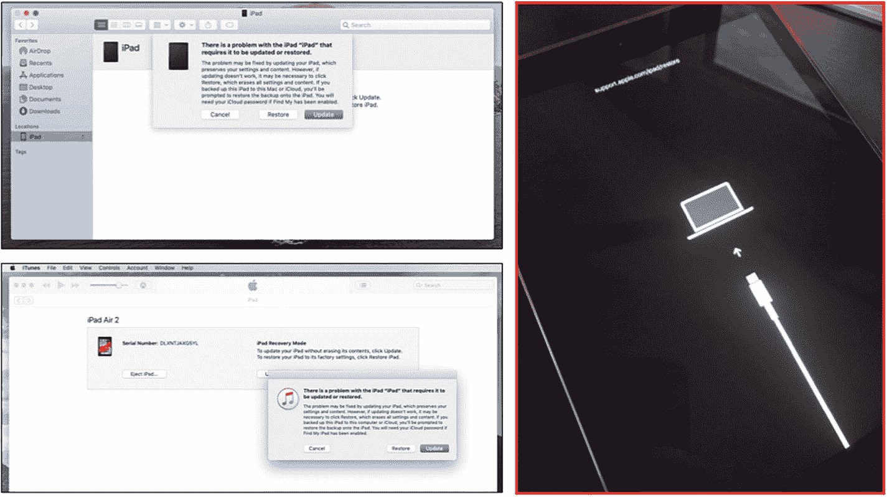

图 4-8
使用 iTunes 或 Finder (macOS Catalina) 进行 iOS 恢复

> **专业提示**
> `Windows 版 iTunes` 以及 `macOS Catalina` 之前版本的 `iTunes` 可用于下载与设备兼容的最新 iOS 系统并进行恢复。从 `macOS Catalina` 开始，苹果移除了独立的 `iTunes` 应用，现在当您通过 USB 将 iOS 设备连接到 Mac 时，可以在 `Finder` 中看到和管理该设备。所有原先在 `iTunes` 中的设备管理功能现已整合至 `Finder`。

与强制重启类似，进入恢复模式所需的按键组合因 iPhone 或 iPad 的型号和发布时间而异。以下为按设备系列划分的操作说明：

*   **iPhone 8 系列、iPhone X 系列、iPhone 11 系列**：使用 USB-Lightning 数据线将设备连接到电脑。快速按下并松开`音量增大`键，再快速按下并松开`音量减小`键，然后长按`侧边`按钮，直到看到恢复模式屏幕。
*   **iPhone 7 系列**：关闭设备电源。长按`音量减小`键，同时用 Lightning 数据线将设备连接到电脑。持续按住按钮，直到出现恢复模式屏幕。
*   **iPhone 6 或 iPhone SE（第一代）**：关闭设备电源。长按`主屏幕`按钮，同时用 Lightning 数据线将设备连接到电脑。持续按住按钮，直到看到恢复模式屏幕。
*   **没有实体主屏幕按钮的 iPad**：关闭设备电源。长按顶部的`睡眠/唤醒`按钮，同时使用 USB-C 或 Lightning 数据线将 iPad 连接到电脑。持续按住按钮，直到出现恢复模式屏幕。
*   **有实体主屏幕按钮的 iPad**：关闭设备电源。长按`主屏幕`按钮，同时用 Lightning 数据线将 iPad 连接到电脑。持续按住按钮，直到看到恢复模式屏幕。


## 设备固件更新模式

**设备固件更新**（`DFU`）模式并非许多技术人员经常需要使用到的功能。它实际上在 **iBoot** 引导加载程序之前加载，是一个比 `iOS 恢复模式` 层级更低的环境。请注意，让设备进入此模式可能比较困难，因为它需要精确的时机把握，并且在操作正确时设备不会提供任何反馈。

通常仅在少数几种情况下会使用 `DFU` 模式。最主要的一种是将较新版本的 `iOS` 固件降级到较旧的版本。例如，出于兼容性问题或类似原因，您可能需要从 `iOS 13` 降级到 `iOS 12`。另一个使用它的原因是尝试修复已损坏的固件或 `iOS` 安装，而通过恢复模式进行的恢复未能解决该问题。虽然这种情况已不如过去普遍，但如果您有用户对设备进行了越狱，您也可以使用 `DFU` 模式来撤销越狱操作。

要将您的设备置于 `DFU` 模式，请按照针对您特定设备系列的以下说明操作：

*   **iPhone 8 系列、iPhone X 系列、iPhone 11 系列** **：** 将 USB-Lightning 数据线插入电脑和 iPhone。按下 **调高音量** 按钮，然后按下 **调低音量** 按钮，接着同时按住 **侧边** 按钮和 **调低音量** 按钮 5 秒钟，之后松开 **侧边** 按钮，但继续按住 **调低音量** 按钮。您会在电脑上收到设备已进入恢复模式的消息，但 iPhone 屏幕上不会显示任何内容。

*   **iPhone 7 系列** **：** 关闭设备。同时按住 **侧边** 按钮和 **调低音量** 按钮 8 秒钟，然后松开 **侧边** 按钮，但在通过 USB 数据线将设备连接到电脑时，继续按住 **调低音量** 按钮。您会在电脑上收到设备已进入恢复模式的消息，但 iPhone 屏幕上不会显示任何内容。

*   **iPhone 6 或 iPhone SE** **：** 关闭设备。同时按住 **电源** 按钮和 **主屏幕** 按钮 10 秒钟，然后松开 **电源** 按钮，但在通过 USB 数据线将设备连接到电脑时，继续按住 **主屏幕** 按钮。您会在电脑上收到设备已进入恢复模式的消息，但 iPhone 屏幕上不会显示任何内容。

*   **强制重启不带实体主屏幕按钮的 iPad** **：** 将 USB-Lightning 数据线插入电脑和 iPhone。按下 **调高音量** 按钮，然后按下 **调低音量** 按钮，接着同时按住 **睡眠/唤醒** 按钮和 **调低音量** 按钮 5 秒钟，之后松开 **睡眠/唤醒** 按钮，但继续按住 **调低音量** 按钮。您会在电脑上收到设备已进入恢复模式的消息，但 iPad 屏幕上不会显示任何内容。

*   **强制重启带实体主屏幕按钮的 iPad** **：** 关闭设备。同时按住 **睡眠/唤醒** 按钮和 **主屏幕** 按钮 10 秒钟，然后松开 **睡眠/唤醒** 按钮，但在通过 USB 数据线将设备连接到电脑时，继续按住 **主屏幕** 按钮。您会在电脑上收到设备已进入恢复模式的消息，但 iPad 屏幕上不会显示任何内容。

## iOS 备份

既然我们正在讨论恢复 `iOS` 的话题，或许应该回顾一下创建 **备份** 的过程。Apple 提供了两种备份 iOS 设备的方法。您可以通过 `iTunes`（或如前所述，在 `macOS Catalina` 中使用 `访达`）将设备备份到电脑，也可以备份到 `iCloud`。选择哪种方法取决于您的具体需求以及您的 iCloud 账户中的可用存储空间。

### 电脑备份

使用 Lightning 转 USB 数据线直接将您的 iOS 设备连接到电脑。接下来，使用 `iTunes` 或 `访达`（在 `macOS Catalina` 中），您可以选中该设备，并点击 **通用** 选项卡中的 **立即备份** 按钮，如图 4-9 所示。您可以选择加密备份，如果您在 `iPhone` 上有 `健康` 或 `健身记录` 数据，这一点尤其推荐。如果您选择将 iOS 设备上的所有数据都备份到这台电脑，请确保您也为电脑建立了备份机制。您最不希望看到的就是同时丢失电脑数据和 iOS 备份！

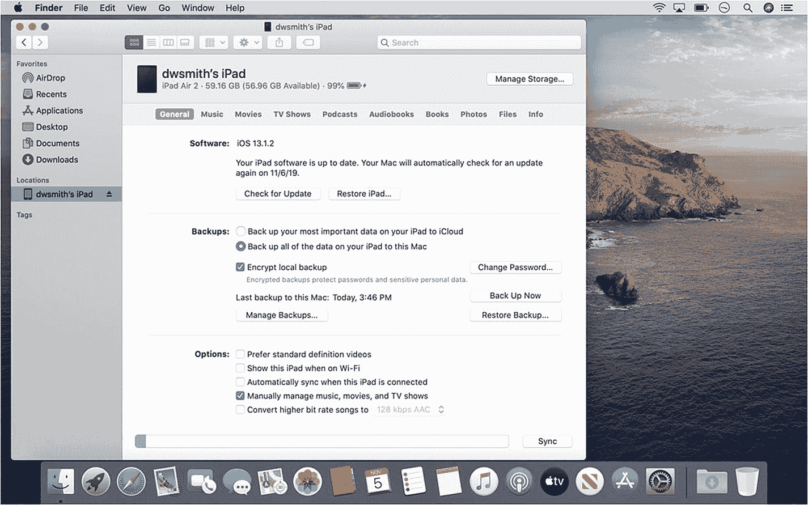
*图 4-9 macOS Catalina 中访达内置的 iOS 备份选项*

### iCloud 备份

如果您的 iCloud 存储空间充足，这无疑是更优选的方法。您的设备不仅会更频繁地进行备份（因为它会在连接到 Wi-Fi 和电源时尝试进行增量备份），而且一旦您通过 `设置助理` 使用 iCloud 凭据登录新设备，恢复数据也会更容易。iCloud 备份始终是加密的，并且由于它们存储在云端，您无需像使用电脑备份方法那样担心对备份文件本身进行备份。

要启用 iCloud 备份，只需通过 `设置` 应用 > `您的 Apple ID` > `iCloud` > `iCloud 云备份` 浏览到您的 **iCloud** 设置，如图 4-10 所示。将 `iCloud 云备份` 开关拨到 **开** 的位置，下次当您通过 Wi-Fi 连接到互联网并接通电源时，它将执行一次备份。如果您想手动强制备份，请确保已连接到 Wi-Fi 网络，然后点击 **立即备份** 按钮。

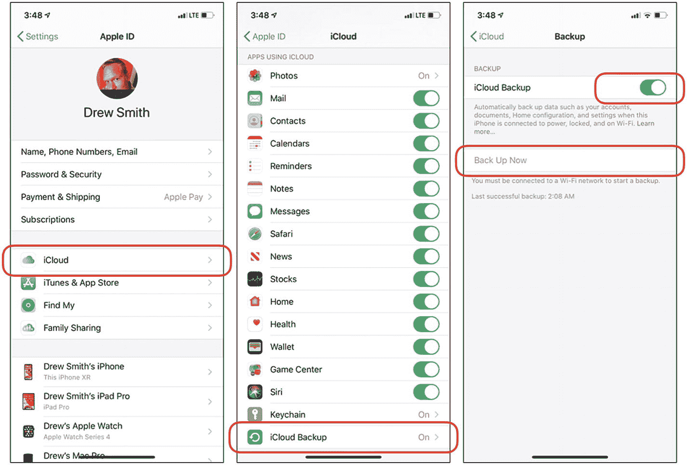
*图 4-10 在 iOS 13 中配置 iCloud 备份的步骤*

**专业提示**

无论您选择哪种方法，Apple 永远不会备份以下数据：`Apple Pay` 数据；`面容 ID` 或 `触控 ID` 设置*；已存储在 `iCloud` 中的数据，如 `通讯录`、`日历` 等；或者已经托管在 App Store 或 Apple 各类服务中的 App、图书、音乐、电影及其他类似内容。

### 从备份恢复

恢复您的 iOS 设备数据非常简单。如果您使用的是电脑备份方法，只需将设备连接到存储您最近备份的同一台电脑，点击 **恢复** 按钮，然后按照提示选择您希望从中恢复的备份。如果您要从 iCloud 备份恢复，在您抹掉 iOS 设备内容后，进入 `设置助理`（欢迎流程），当它提示您从 iCloud 备份恢复或设置为新设备时，选择 `iCloud 云备份` 选项，并选择您想要从中恢复的最新备份。图 4-11 展示了两种恢复选项的示例。

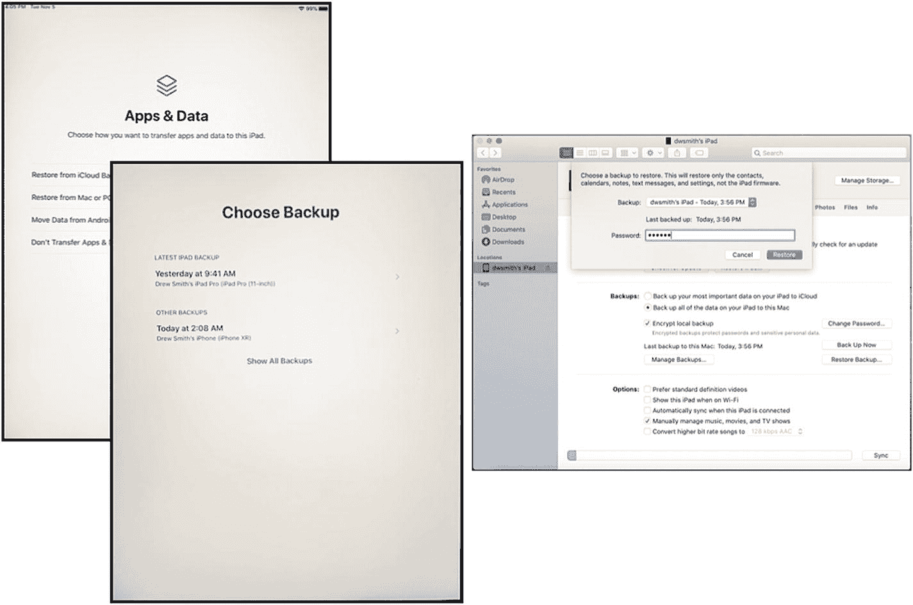
*图 4-11 从 iCloud 以及通过 iTunes 或访达恢复的选项*


## iOS 设备存储

与 `macOS` 中的打包应用程序类似，`iOS` 也以单个 `App` 图标的形式包含 `App 包`。这些是沙盒化的应用程序环境，其可执行文件、偏好设置以及一个唯一的 `文稿` 文件夹都包含在每个 `App` 内部。图 4-12 展示了 iOS 应用程序包的一般布局示意图。

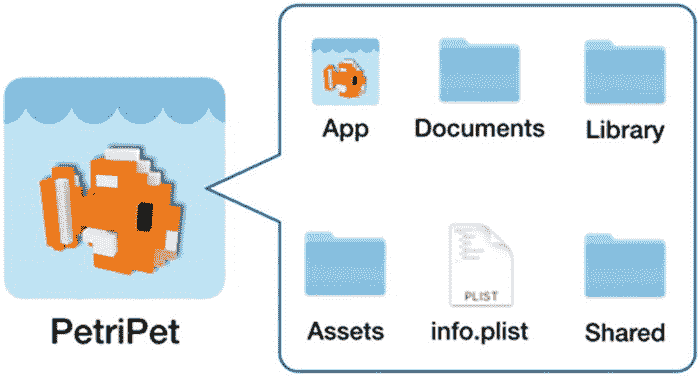
**图 4-12** 特定应用程序包中包含的各种文件夹和文件

由于 iOS 设备主要是个人设备，其高像素摄像头会拍摄大量占用存储空间的照片和视频，再加上游戏和其他应用程序，磁盘空间似乎总是很紧张。幸运的是，`iOS` 有一套非常完善的方法来跟踪设备上的存储空间使用情况，并以一种可操作的方式显示出来。如果你浏览到 `设置` 应用 > `通用` > `iPhone`（或 `iPad`） > `存储空间`，你将看到类似于图 4-13 截图所示的内容。

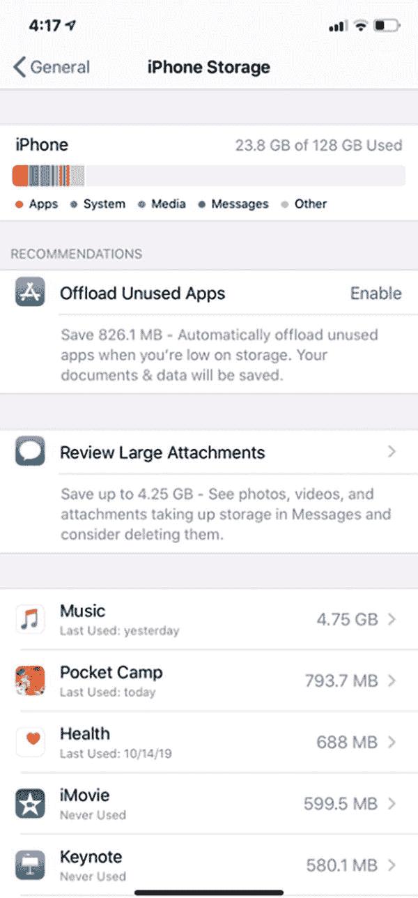
**图 4-13** iOS 13 中的 iPhone 存储空间信息及可操作的释放空间选项

苹果为短期和长期的存储空间节省提供了有用的建议。你可以启用 `卸载未使用的 App` 选项，以临时删除那些你不经常使用的应用程序。之后当你需要再次使用时，它会重新下载这些应用。通常，当你在设备上手动删除一个应用程序时，与该应用相关的任何文档或设置也会被移除。而使用 `卸载未使用的 App` 时，它会保留这些数据。

## iOS 辅助功能

与 `macOS` 类似，苹果在 iOS 设备操作系统中内置了屡获殊荣的辅助功能。如果你或你所在组织的用户能从这些辅助功能中受益，我建议你探索各种视觉、运动技能和听觉方面的辅助选项，以最好地了解它们的工作原理。

除了这些功能外，了解如何实时启用和禁用这些功能也很重要，因为它们常常会改变设备的外观或运行方式。图 4-14 展示了通过 `三击` `侧边` 按钮（或带有实体主屏幕按钮的设备上的 `主屏幕` 按钮）来启用各种辅助功能的配置设置。你可以点击这些技术选项，用勾选标记来启用它们；如果启用了多个选项，还可以通过点击并拖动来调整它们在列表中的优先级。在 iOS 13 中，你也可以通过 `设置` 应用 > `辅助功能` > `辅助功能快捷键` 来访问这些设置。

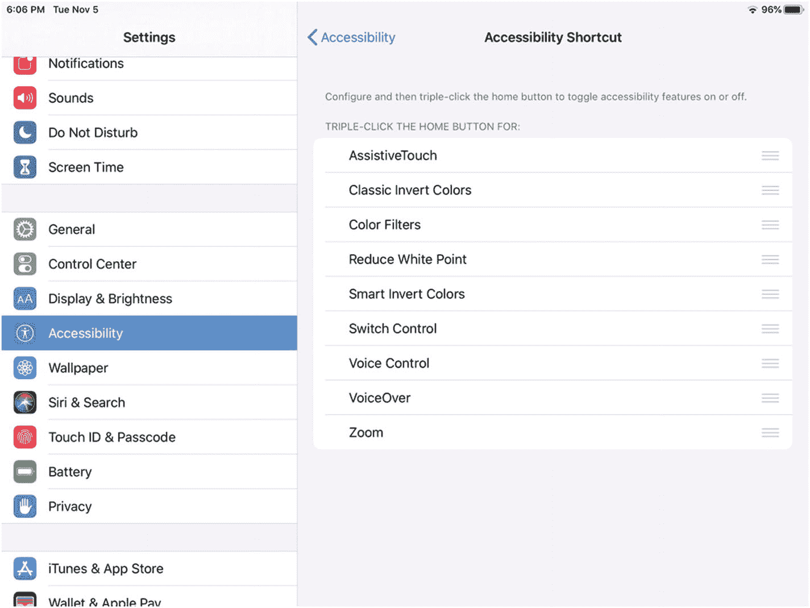
**图 4-14** iOS 13 中的辅助功能快捷键选项

### 引导式访问

在 `辅助功能` 设置下，还有一个功能在将 iOS 设备用作信息亭或类似用途时会很有帮助，那就是 `引导式访问`。`引导式访问` 功能可以在 iOS 13 的 `设置` > `辅助功能` > `引导式访问` 下启用。启用后，你可以在任何应用程序中 `三击` `主屏幕`（或 `侧边`）按钮，将设备锁定为仅使用该应用程序。你还可以在设备闲置一段时间后禁用任何自动锁定功能。图 4-15 展示了一个用作移动点餐台的 iPad 上的引导式访问配置设置示例。

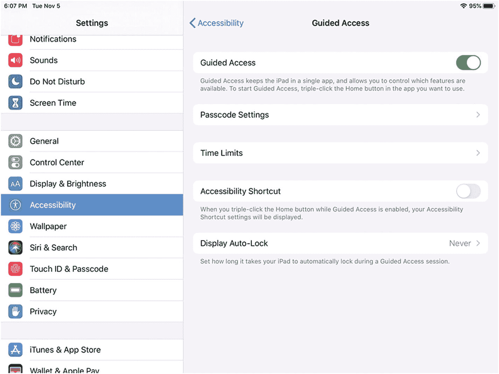
**图 4-15** iOS 13 中的引导式访问选项

> 专业提示
> `引导式访问` 的另一个附加功能是，当使用单个应用程序时，可以禁用与显示屏部分区域的交互。例如，假设你想将 `引导式访问` 用于 `Safari` 浏览器中的一个网页。你可能还希望禁用用户访问地址栏或创建新标签页的能力，从而将用户锁定在单一网页上。要做到这一点，请在你想要锁定的网页上启用 `引导式访问`，`三击` `主屏幕` 按钮以访问 `引导式访问` 选项，然后在你想要禁用的屏幕区域周围 `画一个圈`。

#### 网络设置

虽然 `iOS` 中没有特定的网络设置面板，但 `设置` 应用的根目录提供了对 `无线局域网`、`蓝牙` 和 `蜂窝网络`（如果设备支持）的访问。

### 无线局域网

要配置无线设置，你可以点击 `设置` 应用顶部附近的列表中的 `无线局域网` 按钮，如图 4-16 所示。无线局域网设置会扫描周围的网络并显示可用无线网络列表。点击标有 `其他...` 的按钮可以配置隐藏的无线网络，或者预配置一个无线网络，以便在设备部署给最终用户后自动加入该网络。

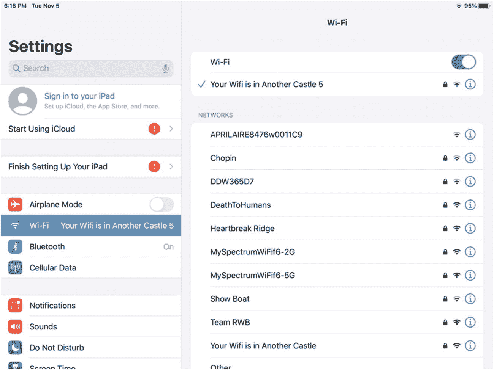
**图 4-16** iOS 13 中的无线局域网设置

点击无线网络右侧的蓝色小 `"i"` 按钮，可以配置特定的无线设置，如图 4-17 所示。你可以在这里配置 `TCP/IP` 设置、`DNS` 设置和 `HTTP 代理` 设置。如果你已经连接到一个无线网络，可以点击 `续租` 按钮强制释放并续订 DHCP IP 地址租约，或者点击 `忽略此网络` 以断开与该网络的连接，并且未来不再尝试自动加入。

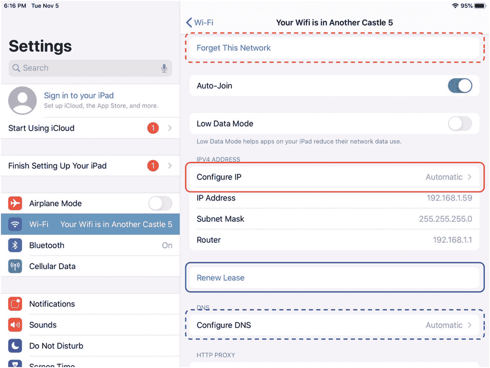
**图 4-17** iOS 13 中的高级无线局域网网络选项

### 蜂窝网络

如果你的设备支持 `蜂窝网络`，你可以在 `设置` > `蜂窝网络` 下管理你的数据设置，如图 4-18 所示。根据你的运营商和套餐，你可能在这里有启用 `个人热点` 的选项，即你的 iOS 设备通过 `无线局域网` 将你的蜂窝网络数据连接共享给其他设备。你可以通过切换 `蜂窝网络 开/关` 来将数据使用限制在仅限无线局域网，从而在靠近无线网络时节省套餐的数据配额。一些运营商有各种漫游选项、无线局域网通话功能或其他运营商服务，可以从此页面访问。你还可以滚动浏览已安装应用程序的列表，并切换它们使用蜂窝网络数据的能力。这对于拥有有限数据套餐的用户尤其有益。

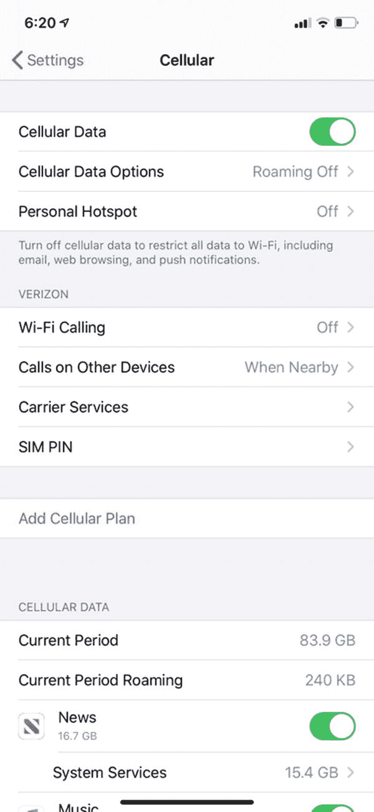
**图 4-18** 运行 iOS 13 的 Verizon 无线设备的蜂窝网络选项


#### VPN

与`macOS`类似，你也可以为`iOS`配置内置`VPN`。要配置可选的`VPN`设置，请浏览至`设置`应用 ➤ `通用` ➤ `VPN`并点击`添加 VPN 配置…`按钮。您将看到一个类似于图 4-19 所示的屏幕。与`macOS`一样，你可以配置几种最流行的`VPN`协议，包括`Cisco IPSec`。添加`VPN`配置后，您会在主`设置`面板中（`蜂窝网络和个人热点`选项下方）看到一个简单的`VPN`开/关切换开关。

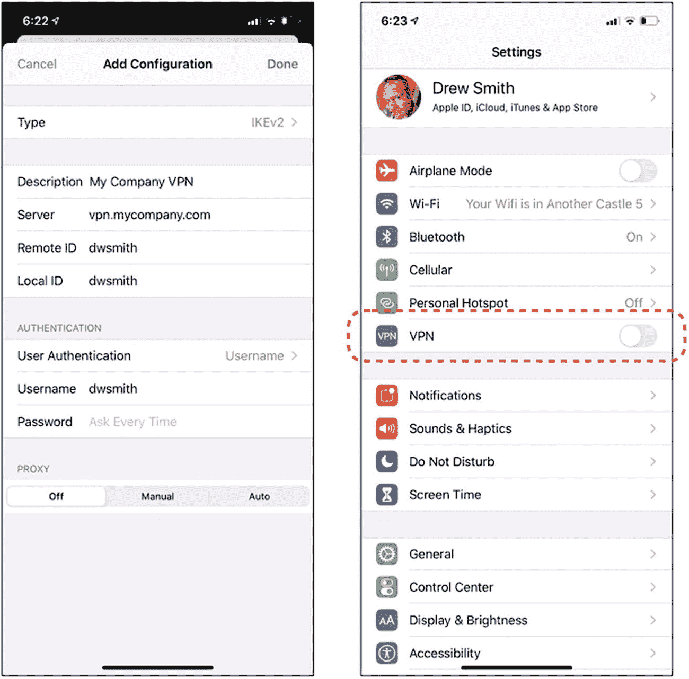

图 4-19
iOS 13 中的 VPN 配置设置和激活开关

## iOS 设备安全

当苹果公司设计`iOS`时，他们从头开始就融入了现代化的安全功能。磁盘加密默认启用，并且在标准的`iOS`安装中不是可选项。作为其`透明度、同意和控制倡议`的一部分，苹果不断加强`iOS`的安全和隐私功能。`Touch ID`、`Face ID`和`激活锁`都是有助于保护用户数据和隐私、阻止设备被盗的下一代功能。

### 密码锁/Touch ID/Face ID

每个 iOS 设备都具备`密码`锁定选项。这使用户可以设置一个解锁设备和访问主屏幕、用户数据及`App`所需的密码。它既可以是一个简单的四位数字，也可以是一个完整的短语或密码。苹果早些时候推出了生物指纹传感器`Touch ID`，它是带有物理主屏幕按钮的设备上的标准功能。下一代面部识别系统`Face ID`是 iOS 设备上（无物理主屏幕按钮）的标准功能。这两项技术都与密码设置协同工作以保护您的设备。这些功能可以在 iOS 13 中使用`Face ID`的设备的`设置`➤`面容 ID 与密码`中，以及使用`Touch ID`的设备的`设置`➤`触控 ID 与密码`中进行配置。

> 专业提示
> 为了增强数据安全性，特别是在政府或企业环境中，您可能希望设置设备在若干次无效密码尝试后重置/恢复到出厂默认设置。这可以防止对丢失或被盗设备进行暴力破解攻击。

### 隐私

类似于`macOS`中`安全性与隐私`系统偏好设置的`隐私`选项卡，`iOS`中的`隐私`设置可以通过浏览至`设置`应用 ➤ `隐私`找到，其中包含一系列请求使用苹果认为涉及用户隐私的众多硬件或软件功能的`App`或服务。如图 4-20 所示，除了典型的`定位服务`、`麦克风`和`相机`外，还有`iOS`特有的选项，如`健康`、`家庭`和`运动与健身`。您可以浏览这些类别并管理哪些应用程序能够使用这些特定功能。

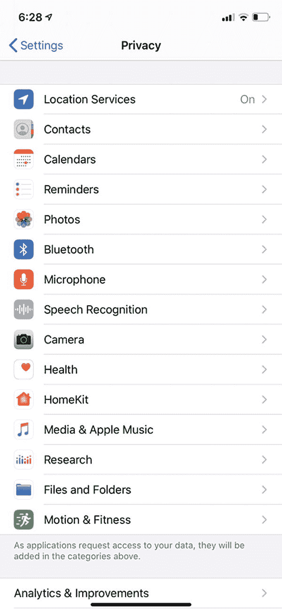

图 4-20
iOS 13 的隐私设置

### 屏幕使用时间限制

从 iOS 12 开始，苹果引入了`屏幕使用时间`功能，它允许用户测量他们在设备上花费的时间，并采取行动对游戏或社交媒体等项目进行自我时间限制。与`macOS`的`屏幕使用时间`类似，其中包含针对`停用时间`、`App 限额`等功能的特定设置，这些我们已在第 2 章中介绍过。要访问`iOS`中的`屏幕使用时间`设置，请浏览至`设置`应用 ➤ `屏幕使用时间`。

有一组特定的`隐私与内容`设置对`iOS`来说比较独特。这些`限制`过去位于`设置`应用 ➤ `通用` ➤ `限制`下，但在 iOS 12 及更高版本中已移至`屏幕使用时间`设置中。这些设置可以包括限制访问特定`App`、禁用`App Store`下载、禁用应用内购买或禁用特定硬件（如相机）的使用。图 4-21 显示了在`设置`➤`屏幕使用时间`➤`内容与隐私限制`下可以找到的更全面的设置列表。

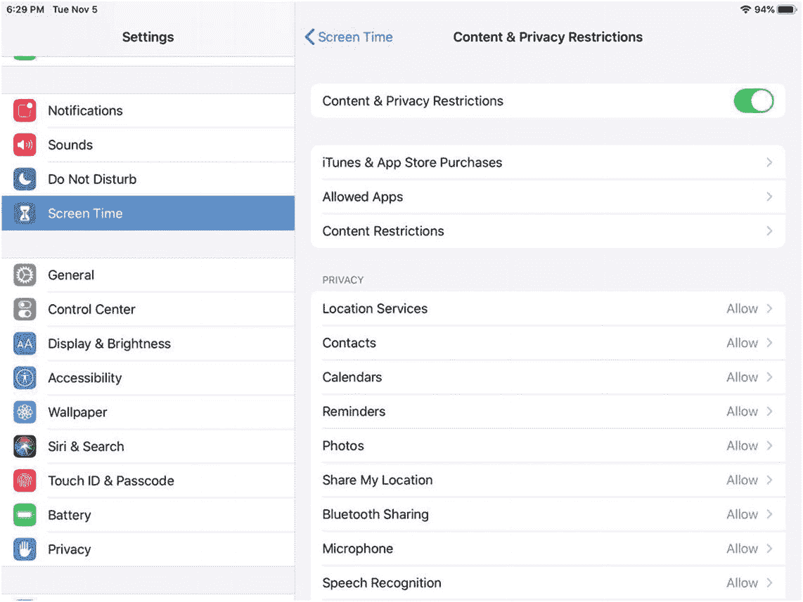

图 4-21
iOS 13 中特定的 iOS 设备限制列表

### 激活锁

`激活锁`是苹果几年前实施的一项防盗功能，旨在为`iOS`用户提供另一层设备安全。`激活锁`与您的`Apple ID`和`iCloud`帐户配合工作，确保在重置或恢复后能够重新激活`iOS`设备的唯一人员，是在该设备上登录的`iCloud`帐户的所有者。如果设备进入 iOS 恢复模式，被抹掉，然后在没有先注销现有`iCloud`帐户的情况下，使用全新的 iOS 13 副本进行恢复，则在尝试使用设置助理激活设备时，您将看到如图 4-22 所示的信息。

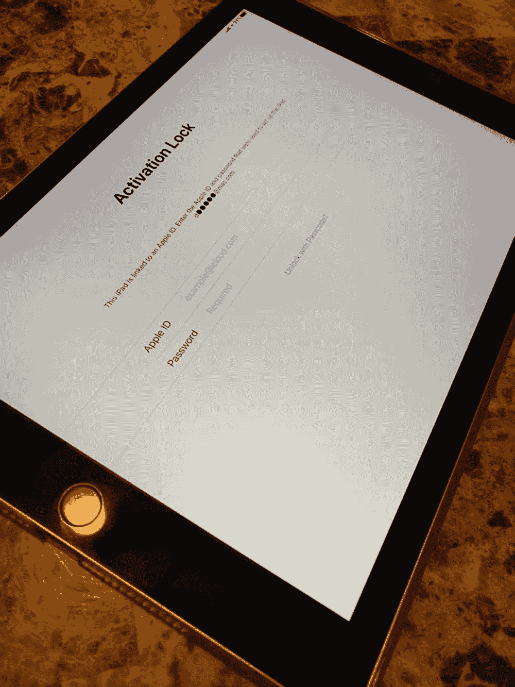

图 4-22
iOS 设置助理过程中出现的激活锁信息

要继续激活过程，您必须拥有之前在该设备上登录的帐户的`Apple ID`或`iCloud`密码。没有该密码，您将永远无法完成设备设置，因此它不会成为一个可用的系统。为了避免激活锁带来的麻烦，您应始终让最后一位用户在重置或恢复操作系统之前`退出`登录`iCloud`。在由于设备故障需要恢复的情况下，请确保`iCloud`密码可用，以便您可以通过`激活锁`快速完成身份验证，并完成系统的配置以供使用。

如果您因某些原因必须恢复设备，但没有`iCloud`帐户来绕过`激活锁`，则必须通过`AppleCare`或`Apple 零售店`联系苹果支持。通过提供购买证明，一旦证实设备所有权，苹果员工可以重置设备的激活锁状态。

> 专业提示
> 使用 MDM 工具或苹果的设备注册计划（DEP）的学校和企业可以在机构拥有的设备上禁用激活锁。这将在第 8 章中介绍。

## 用户帐户

所有 iOS 设备都设计为个人、单用户体验。每台设备只有一个本地用户帐户；所有其他帐户都用于访问各种服务，如`App Store`或`iCloud`，或第三方电子邮件服务，如`Gmail`或`Microsoft Exchange`。虽然建议您为苹果的所有服务使用同一帐户，但也可以分别为`App Store`和`iCloud`使用不同的帐户。


## Apple ID

`Apple ID` 是使用 iOS 设备所需的主要账户。`Apple ID` 是免费的，可以使用任何电子邮件地址进行配置，甚至可以来自微软或谷歌等竞争对手的邮箱。要创建 `Apple ID`，您的用户只需访问 [`http://appleid.apple.com`](http://appleid.apple.com) 并注册即可。您也可以在 `iOS` 中许多需要登录才能启用服务的区域注册 `Apple ID`，例如 `App Store`。教育或商业客户还可以创建**机构 Apple ID**，我们将在第 8 章中详细介绍。`Apple ID` 用于启用多种 Apple 服务，包括 `iMessage`、`FaceTime` 和 `App Store`。

## iCloud 账户

`iCloud` 账户经常与 `Apple ID` 混淆，因为您可以使用 `Apple ID` 的用户名注册 `iCloud` 服务，并且通常也会这样做。然而，这实际上是两个独立的账户。`iCloud` 服务通常涉及在包括 `文稿`、`信息`、`通讯录`、`日历`、`Safari` 书签等各种 Apple 设备之间同步数据。`iCloud` 还启用了诸如 `查找我的 iPhone`、`活动共享`（与 `Apple Watch` 配对时）和 `iCloud 钥匙串`等服务。

## App Store 账户

第三种账户是 `App Store` 账户，这是一个已注册**付款方式**的 `Apple ID`，可用于从 `App Store` 购买和安装应用程序。虽然 `iCloud` 账户是个人账户，但用于 `App Store` 的 `Apple ID` 可以与您的家庭或组织中的其他人共享。您可以通过 `设置` 应用程序 ➤ `iTunes 与 App Store` 手动使用 `Apple ID` 登录 `App Store`，然后点击**登录**按钮登录，如图 4-23 所示。

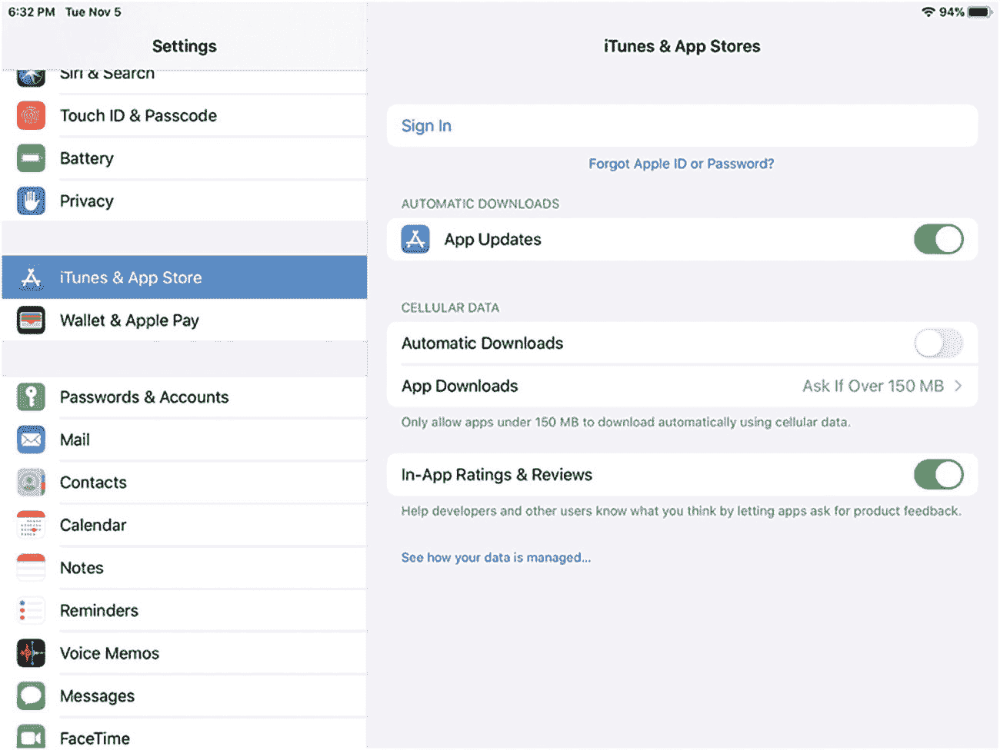

图 4-23
iOS 13 中的 iTunes Store 和 App Store 登录界面

请注意，除非您计划与组织中的所有用户共享账户凭据，否则共享的 `App Store` 账户可能不是一个好主意。当您使用共享的 `App Store` 账户在 iOS 设备上购买并安装应用程序时，下次该应用程序需要更新时，它会提示您的用户输入共享账户的密码。如果他们不知道密码，可能会锁定 `App Store` 账户或请求重置密码，这可能会给其他同样配置了共享账户的设备带来问题。如果您将密码透露给最终用户，他们可能会进行未经授权的购买，并记在您的账户上。

幸运的是，Apple 已实施两种解决方案来解决 `App Store` 的这些问题，同时允许组织集中购买应用程序并在多台设备上进行管理。第一种解决方案针对消费者，称为**家人共享**。**家人共享**允许每个家庭成员拥有自己的 `App Store` 账户，但可以访问家庭中任何人购买的共享应用程序库。另一种解决方案针对教育和商业客户，是使用 Apple 的**批量购买计划**（`VPP`），其中应用程序被购买并分配给与组织成员相关联的任意数量的唯一 `Apple ID`。`VPP` 在第 8 章中有更详细的介绍。

## iPadOS

当 `iPad` 首次发布时，该设备受到的一个批评是它本质上是一个大号的 `iPhone`，因为它运行的是 `iOS` 而不是 `macOS`（或其他类型的桌面操作系统）。在过去的 `iOS` 版本中，Apple 继续提供特殊的 `iPad 专用` 功能，如**并排应用多任务处理**和对 `Apple Pencil` 手写笔的支持。从 iOS 13 开始，Apple 决定将所有专属于 iPad 的功能整合在一个统一的名称下——`iPadOS`。

虽然底层操作系统仍然是 `iOS`，但以下功能是 `iPad` 独有的，仅在 iOS 13 的 `iPadOS` 子集中找到：

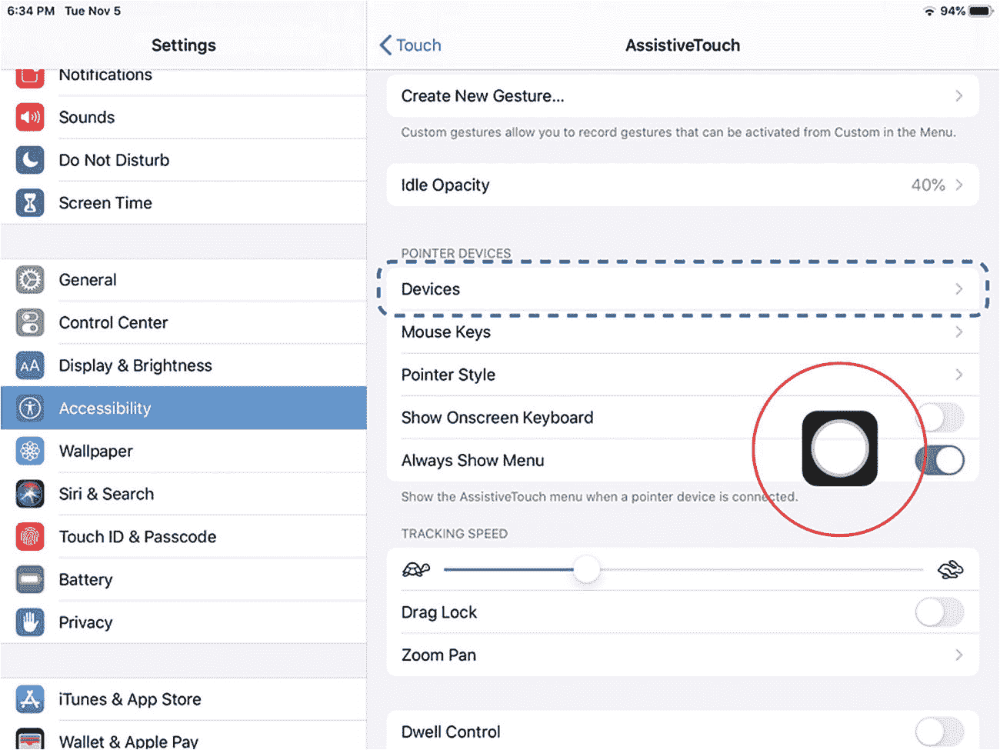

图 4-24
iPadOS 中启用鼠标支持的设备辅助功能

*   **可移动媒体支持**：`文件` 应用程序不仅允许您在类似 macOS 的 `分栏` 视图中浏览，还提供创建文件夹并组织数据的功能；如果您通过 Lightning 或 USB-C 适配器插入 USB 磁盘，您还可以在可移动媒体之间传输数据。
*   增强的 Apple Pencil 支持。
*   桌面级 Safari 浏览器。
*   增强的多任务处理，包括 `Slide Over` 窗口和同一应用程序在屏幕上同时显示多个 `分屏视图` 窗口。
*   更小的 App 图标，以便在每页放置更多应用程序，并在主屏幕上提供可定制的 `小组件` 区域。
*   **支持蓝牙鼠标**：此功能隐藏在 `iPadOS` 的 `辅助功能` ➤ `触控` 区域中，如图 4-24 所示。当您听到**鼠标支持**时，您不会得到像传统鼠标那样的指针，因为它启用的是 Apple 的蓝牙**指针工具**，在屏幕上看起来像一个圆点。移动不够流畅，最好将其用作一种**辅助功能**，而不是让您的 iPad 像台式电脑一样工作的方式。

### 共享 iPad

最后，讨论 `iPadOS` 不能不提 **共享 iPad** 功能，它允许多个用户在共享设备上拥有唯一的登录账户。这与在 `macOS` 上拥有多个用户账户非常相似，但有一个巨大的例外——此功能仅限于 Apple 的**教育客户**。如果您在学术环境中支持一推车共享的 `iPad`，启用**共享 iPad** 可能会带来巨大的优势。

要使用**共享 iPad**，学术组织必须能够访问 `Apple 校园教务管理`。使用 `Apple 校园教务管理`，系统管理员将为每个学生创建特殊的**受管理的 Apple ID**。使用 `Apple 校园教务管理`，您可以将设备准备为**共享 iPad**，从而在设备上启用远程监控和多用户支持。所有学生的数据都存储在机构账户下的**受管理的 Apple ID** 内的 `iCloud` 中。

> 专业提示
> `Apple Classroom app` 的各种功能和 `Shared iPad` 超出了本书的范围。如果您是教育工作者，对 `Apple School Manager` 和 `Shared iPad` 感兴趣，请咨询您所在机构的 Apple 代表以获取更多信息。

## 总结

在本章中，我们通过配置限制、网络服务和 Apple 账户，为管理 iOS 设备奠定了基础。正如您所注意到的，逐个设置 iOS 设备配置可能非常耗时且容易出错。在下一章中，我们将探索 `Apple Configurator` 工具，并学习如何使用 `蓝图` 和 `描述文件` 来配置数百或数千台设备。

