# 5. 使用 Apple Configurator 管理设备

在第 4 章中，我们探讨了在设备本身上以交互方式限制或配置 iOS 设备的多种方法。正如您所体验到的，如果您需要配置的设备超过少数几台，这种手动方法可能会出现问题。幸运的是，我们有 `Apple Configurator` 等工具帮助我们自动化大部分流程。

在本章中，我们将在 `Apple Configurator` 中使用几个示例设备，并为部署准备 iOS 设备制定本地工作流。在此过程中，您将接触到我们将在本书其余部分使用的许多概念，包括 `配置描述文件`、`移动设备管理`、设备**监管**等。

## 欢迎使用 Apple Configurator

关于 `Apple Configurator`，首先你需要知道的是，它**并非**一款移动设备管理（`MDM`）解决方案。它是一个针对 iOS 设备的**配置**工具，其最初开发的目的是让系统管理员能够大批量配置完全相同的 `iPad` 和 `iPhone`。2012 年，我曾直接参与了一项针对美国大陆多所学院的大规模 1:1 `iPad` 部署项目。在几年的时间里，我们向学生、教职员工部署了超过 30,000 台 `iPad`，并且每一台设备都必须以完全相同的方式运行。我们使用 `Apple Configurator` 来实现这种级别的标准化，并且效果非常好。

关于 `Apple Configurator` 需要知道的第二点是，它只能在 `macOS` 上运行。因此，使用本章内容的前提条件是，你有一台可以安装 `Apple Configurator` 的 Mac。最新版本支持 iOS 13 及同期发布的设备，即 `iPhone 11` 系列。如果你打算运行最新版本的 `Configurator`，你的 Mac 至少需要运行 `macOS Mojave` 10.14.6。如图 5-1 所示，你可以从 `Mac App Store` 免费下载 `Apple Configurator 2`。

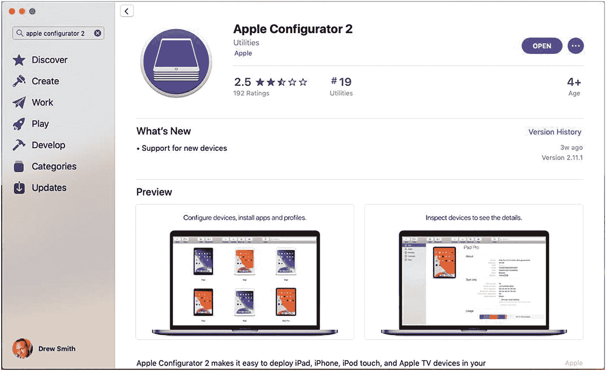
图 5-1
`Apple Configurator 2` 在 Mac App Store 中

第三，要在 `Apple Configurator` 中准备设备，你需要使用 USB 数据线将其连接到 Mac。如果你需要配置大量设备，就像我当年部署 30,000 台设备那样，你可能需要计划购买一些带供电的 USB 2.0 集线器、配备集成 USB 集线器的 iPad 车，或者——如果你使用新的 `Mac Pro`——一些每张卡提供八个或更多 USB 端口的 PCI 卡。这将大大缩短设备准备所需的时间，因为 `Configurator` 可以同时处理多个连接的设备。

至此，你应该拥有一台运行 `Mojave` 或更高版本系统的 Mac、至少一根 USB 转 Lightning 数据线、至少一台可供练习的 iOS 设备，以及安装在 `/Applications` 目录中的 `Apple Configurator 2`。让我们开始吧：连接 iOS 设备并启动 `Apple Configurator`。

### Apple Configurator 用户界面

当你启动 `Apple Configurator` 时，你的屏幕应该看起来类似于图 5-2。如果你只看到一个已连接 iOS 设备的巨大图像，请点击工具栏上的 `视图` 弹出菜单并选择 `列表`。现在，你的 iOS 设备将以行形式列出，并带有各种列标题，就像我的界面一样。

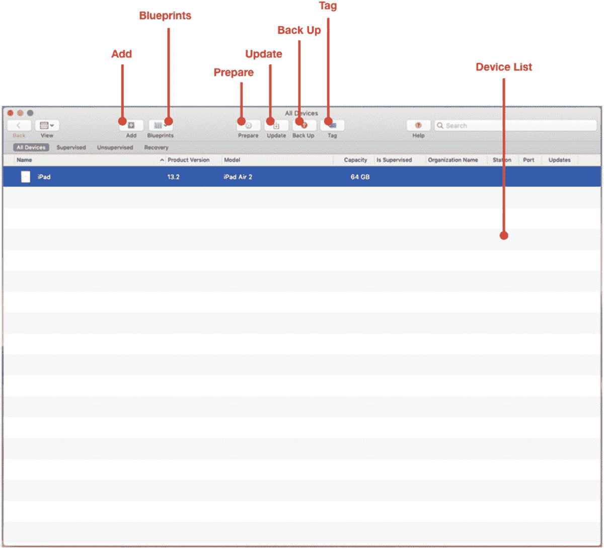
图 5-2
主要的 `Apple Configurator` 窗口和工具栏

如图 5-2 所示，工具栏有几个关键组成部分。以下是其中几个主要组件的说明：
* `添加` 按钮：使用此按钮为选中的 iOS 设备安装应用、文档、媒体或配置描述文件。
* `蓝图` 按钮：使用此按钮创建或编辑称为 `蓝图` 的模板，我们将使用这些模板为不同的用户群构建特定的 iOS 设备。
* `准备` 按钮：每当我们连接一台新的 iOS 设备时，这是要按的第一个按钮。这会启动 `设备准备助手`，并逐步完成激活和配置过程。
* `更新` 按钮：此按钮将为指定设备下载并安装最新版本的 iOS。
* `备份` 按钮：此按钮创建选中设备的备份。这基本上与我们第 4 章中使用 `iTunes` 或 `访达`（`macOS Catalina`）介绍的功能相同。在 `iTunes` 中创建的备份与 `Configurator` 创建的备份兼容。
* `标记` 按钮：此按钮允许你标记特定的设备组，通过颜色轻松识别它们以用于特定目的。
* `设备列表`：这是 `Apple Configurator` 中的设备列表及其状态。你可以按 `所有设备`、`受监督`、`未受监督` 以及当它们处于 `恢复` 模式时进行排序。你还可以在设备列表中看到一些基本信息。`双击` 设备将提供更多信息，包括 `序列号`、`IMEI` 号、`电池状态`、`已安装应用` 等。

> 专业提示
> 你可能会想通过集成的 `备份` 和 `恢复流程` 来以完全相同的方式配置一组设备，方法是先按照你的要求精确配置一台 iOS 设备，然后使用 `备份` 按钮为其准备备份，再恢复到其他设备。这种方法有一些缺点，包括尽管你尽了最大努力，仍可能在用作备份源的设备上留下用户特定的数据。而且随着时间的推移，这种方法也特别不便于扩展，因为如果你需要进行任何更改，都必须创建一个全新的源备份。由于这些及其他原因，在本书中，我们将使用 `蓝图` 来代替 `备份` 和 `恢复` 工作流。

## 组织与监督身份

在开始配置 iOS 设备之前，你需要在应用程序的 `偏好设置` 对话框中定义几个身份选项。要访问这些选项，请点击 `Apple Configurator 2` 菜单，选择 `偏好设置…`，然后在偏好设置窗口中点击 `组织` 标签页。图 [5-3](https://example.com#492151_1_En_5_Chapter.xhtml#Fig3) 展示了组织标签页。点击 `+` 按钮可以创建一个新的组织。

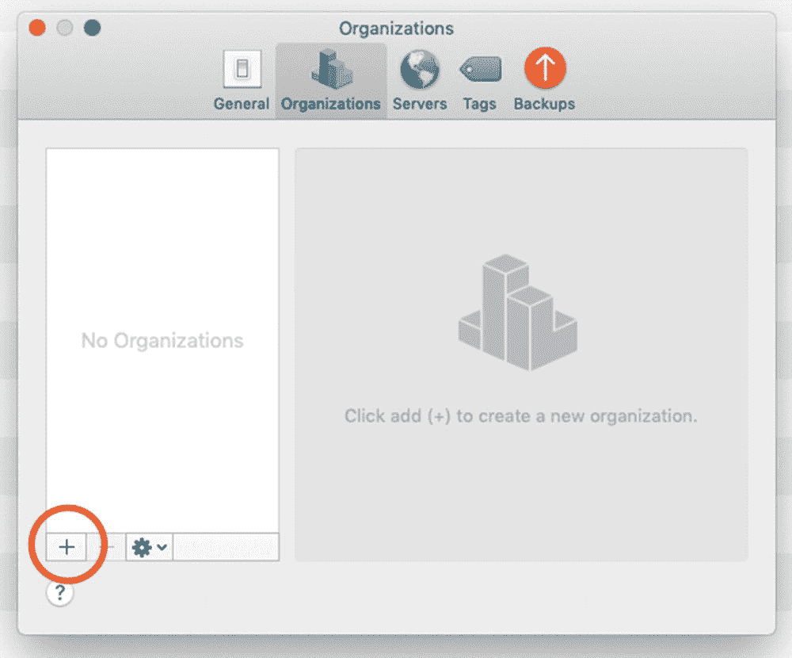

图 5-3
Apple Configurator 偏好设置窗口中的“组织”标签页

正如 `新组织` 表单上的信息所解释的，创建一个组织能为受监督的设备提供具体的 *联系信息* 和 *监督身份*。你可能在问自己：“什么是 *受监督* 的设备？” 正如我们在第 [4](https://example.com#492151_1_En_4_Chapter.xhtml) 章中学到的，`iOS` 并非设计为多用户操作系统，允许多个用户共享同一设备并拥有像 `macOS` 中那样的多种独特身份和权限。尽管如此，当大型公司和学校购买 iOS 设备并分发给员工、学生或其他终端用户时，IT 部门仍然需要实施基本的信息安全控制。

`监督设备` 是系统管理员可以锁定 `iOS` 中特定部分的一种方式，类似于拥有一个本地管理员账户并为他人提供受限环境。你将在本章后面看到，许多安全选项仅对受监督的设备可用。不受监督的设备仍然可以管理，但终端用户有能力更改配置设置、恢复或重置设备以及移除限制。

你可能想知道何时适合 `监督` 设备，何时不适合。这在很大程度上取决于组织和设备的使用场景。我使用的一般经验法则是：如果设备归我的组织所有，我就会监督它。如果设备归终端用户所有，我仍会尝试通过 `配置描述文件` 或 `ActiveSync` 进行管理，但不会进行监督，因此我的安全策略被认为是 *尽力而为*。你在这一主题上的做法可能因设备在你特定情况下所需的限制程度而异。

### 创建组织与监督身份

请继续创建一个组织和监督身份，如图 [5-4](https://example.com#492151_1_En_5_Chapter.xhtml#Fig4) 所示。当它提示你登录 `设备注册计划` 时，请 `跳过` 此步骤。我们将在本书后续章节介绍此服务，并且在本练习中不会使用它。输入有关你组织的信息，例如 `名称`、服务台的 `电话号码` 和 `公共地址`。这些信息 *将会* 透露给终端用户或可能在设备丢失时找到它的人。

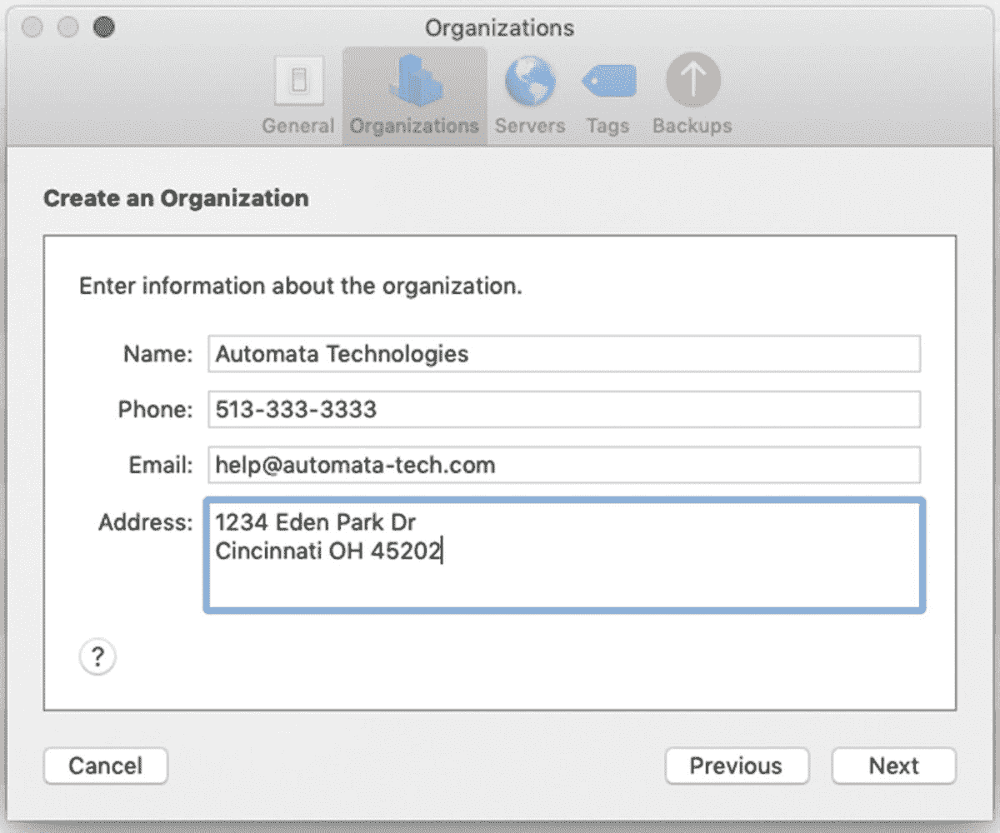

图 5-4
输入一些联系信息来定义你的组织

点击 `下一步` 按钮继续。现在我们将创建一个新的监督身份。此身份本质上是一个 *信任证书*，你可以通过点击 `显示监督身份…` 来查看它，如图 [5-5](https://example.com#492151_1_En_5_Chapter.xhtml#Fig5) 所示。现在我们已经创建了一个组织和监督身份，可以继续进行了。关闭偏好设置窗口，返回 Apple Configurator 主界面。

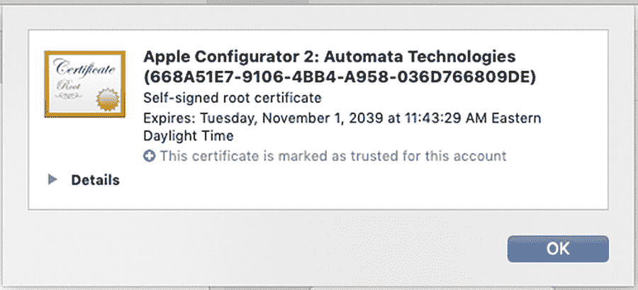

图 5-5
监督身份证书示例

### 专业提示

你可以使用 `偏好设置` 窗口的 `组织` 标签页中 `+/-` 按钮旁边的小 `齿轮` 按钮导出你的监督身份。这将允许你与使用 Apple Configurator 的其他 Mac 共享相同的监督身份。如果你使用多台机器来配置你的 `iPhone` 和 `iPad`，确保所有用于注册设备的 Mac 对同一组织使用相同的监督身份非常重要。

## 在 Apple Configurator 中准备设备

现在我们已经处理好了监督身份和组织信息，让我们开始准备第一台设备。在本练习中，我们将创建一台受监督的设备，以便能够使用全部可用的安全选项。

### 准备设备

1.  首先，**选择**列表中要配置的设备，然后点击工具栏中的**准备**按钮。
2.  将弹出“准备设备助手”对话框，如图 5-6 所示，提示您选择一种方法。我们将使用**手动配置**，并**监督**该设备，但**允许其与其他电脑配对**。点击**下一步**按钮继续。
3.  本章中我们不打算使用 MDM，因此您可以在下一个对话框中选择**不加入 MDM**。点击**下一步**按钮继续。

    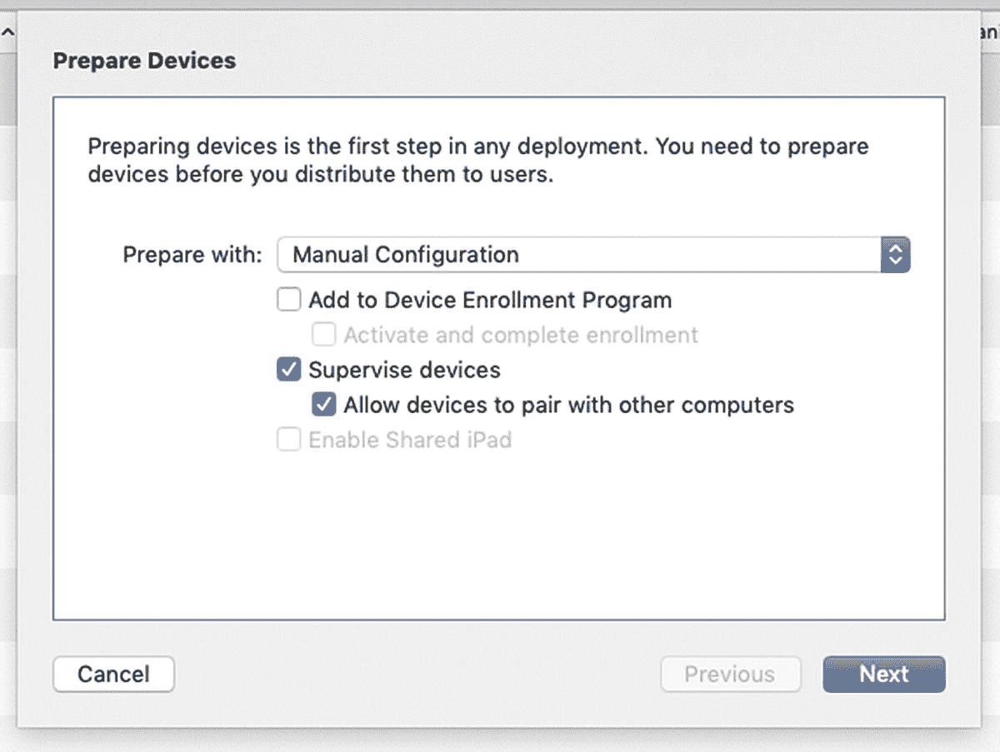

    图 5-6

    将设备准备为受监督状态

4.  从弹出菜单中选择您的**组织**。点击**下一步**按钮继续。
5.  当系统提示我们选择在 *iOS 设置助理*过程中显示哪些步骤时，指的是您的终端用户在首次启动设备时必须查看和响应的步骤。如果您最近安装了全新的 iOS 并不得不使用设置助理，其中的许多步骤会看起来很熟悉。请注意，并非所有这些步骤都适用于每台设备。让我们从下拉菜单中选择**仅显示部分步骤**，然后按照图 5-7 所示**勾选**其中的几个。

    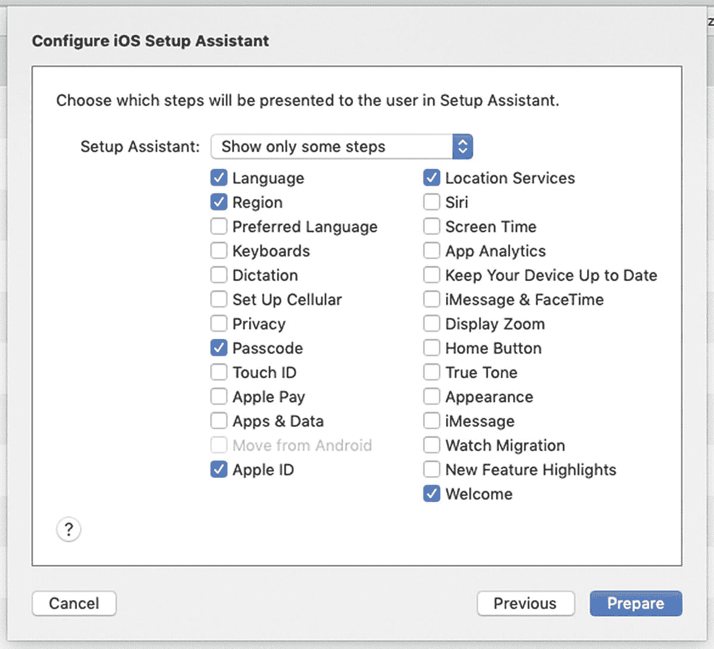

    图 5-7

    选择这些步骤向用户显示，跳过其余步骤

6.  点击**准备**按钮以设置设备。它将开始向 iOS 设备应用配置设置。完成后，您会看到 *受监督* 现在显示为**是**，您的 *组织名称* 也会显示出来，如图 5-8 所示。

    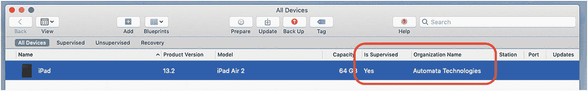

    图 5-8

    我们的设备现已关联到组织并受监督

7.  接下来，让我们在 iOS 设备上检查我们的工作。**断开**设备连接，然后逐步完成设置助理。如果一切正确，您应该只会收到**语言**、**地区**、**Wi-Fi**、**密码**、**Apple ID**、**定位服务**和**欢迎**的提示。*成功！* 现在，您可以使用相同的方法来为您的终端用户打造开箱即用的体验，并消除不必要（或令人困惑）的提示。

    **专家提示** 您是否注意到，即使在 iOS 设置助理对话框中没有勾选 Wi-Fi/网络选项，它仍然提示我们设置 Wi-Fi？您是否注意到，在 Apple Configurator 设置助理选项中，甚至没有 Wi-Fi/网络的复选框，只有**蜂窝数据**？iOS 设备的*激活*需要互联网访问，除非您提供的配置描述文件中指定了无线网络设置，否则无法在设置助理中跳过此选项。

到达主屏幕后，通过前往 `设置 ➤ 通用 ➤ 还原 ➤ 抹掉所有内容和设置` 将测试设备重置为默认状态。然后使用 USB 线缆将测试设备重新连接到电脑。恢复过程完成后，请停留在设置助理屏幕，以便我们为下一个练习做好准备。

## 配置描述文件

### 配置描述文件简介

*配置描述文件*，通常以其文件扩展名 `*.mobileconfig` 表示，是一种 XML *属性列表*，可以安装在 iOS 设备上以禁用和启用某些功能或强制执行各种安全限制。配置描述文件由一个或多个有效负载组成。一个*有效负载*是一个特定的配置，例如最低密码安全设置，它定义了设备上的要求或限制。有些有效负载是设备特定的，意味着它们适用于设备级别；而有些有效负载是用户特定的，意味着它们仅适用于该设备上的特定用户（在 `macOS` 的情况下）。有效负载适用于 `macOS`、`iOS`、`iPadOS`、`tvOS` 或其某些组合。在本章中，我们将特别关注 `iOS` 和 `iPadOS` 的有效负载。

**专家提示**

Apple 建议您为不同的设备类型创建不同的配置描述文件。这意味着，如果您要创建一个专门安装在 iOS 设备上的描述文件，请不要尝试在该描述文件中配置 macOS 有效负载。为每个特定的操作系统系列创建一组唯一的描述文件，而不是使用一个可以应用于任何操作系统的单一庞大描述文件。

### 您的第一个配置描述文件

了解配置描述文件及其有效负载的最佳方法是创建几个描述文件，将它们应用到您的设备上，然后查看效果。

1.  当设备完成准备且我们创建的配置描述文件已加载后，我们来测试一下我们的工作。**断开**设备连接，开始逐步完成 iOS 设置助理。这次，当您到达密码选项时，它应该与图 5-13 匹配。看到它如何要求我们在有效负载中定义的强密码了吗？这就是配置描述文件的力量。

    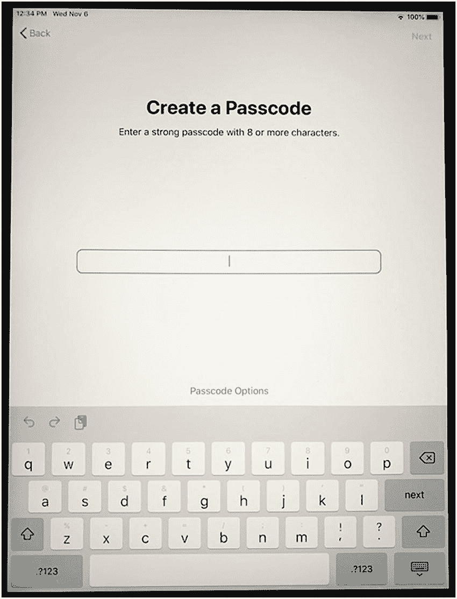

    图 5-13

    设置助理现在要求强密码

2.  当配置描述文件安装完成后，**选择**测试设备使其高亮显示，然后让我们像上一节那样再次**准备**它。设置与之前相同，包括对 iOS 设置助理的修改。这些设置很可能从我们上次操作时就已缓存，但如果没有，您可以参考本章前面的图 5-7。
3.  完成 iOS 设置助理，当您到达主屏幕时，让我们移除这个配置描述文件。请记住，我们没有指定移除密码，因此作为终端用户，我们有能力移除这个限制。浏览到 `设置 ➤ 通用 ➤ 描述文件`，点击我们的**密码强制配置描述文件**。点击**移除描述文件**按钮，并按照提示进行移除，如图 5-14 所示。

    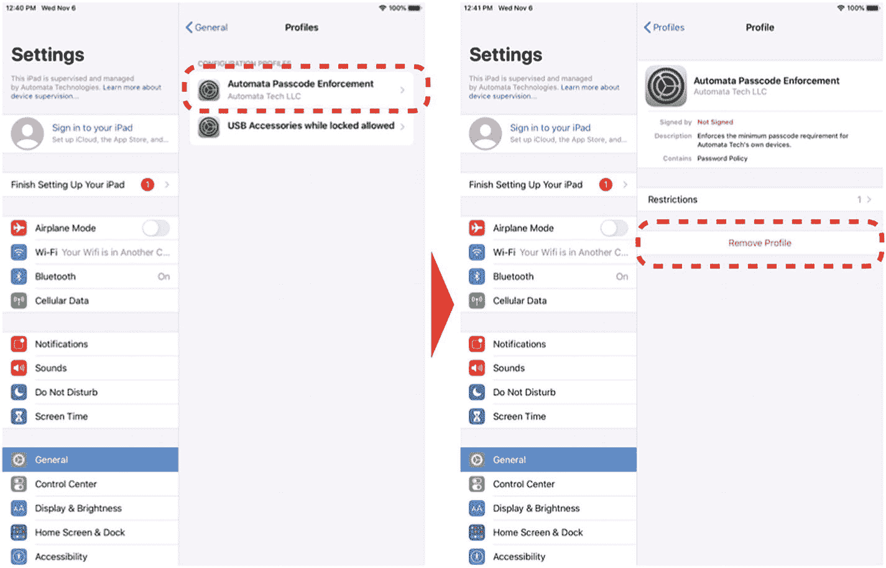

    图 5-14

    我的示例配置描述文件——您的名称可能略有不同

4.  最后，让我们浏览到 `设置 ➤ 触控 ID 与密码`，现在您可以**更改密码**或**关闭密码**，以及修改其他以前由（现已移除的）配置描述文件控制的设置。

**专家提示** 注意到我们的配置描述文件如何用粗体红字显示“未签名”了吗？没有有效的代码签名描述文件，某些设置可能无法生效。要对您的配置描述文件进行代码签名，请在描述文件编辑器中保存它们之前，从**文件**菜单中选择**签署描述文件**，然后选择您的**签名身份**。请注意，签名后的描述文件事后无法编辑，因此请保留一个未签名的副本以备将来修改。在本书后续内容中，我们将对我们的配置描述文件进行签名。

## 创建用户可安装的配置描述文件

在本练习中，我们将创建一个将密码安全要求与公司 VPN 配置配对的配置描述文件。在这家公司，所有工作都必须通过 VPN 完成，因此配对这些设置可以保护任何可能尝试通过 VPN 登录的端点。

### 开始创建

在 Apple Configurator 的 `File` 菜单中选择 `New Profile`。您将看到一个类似于图 5-9 所示的窗口。

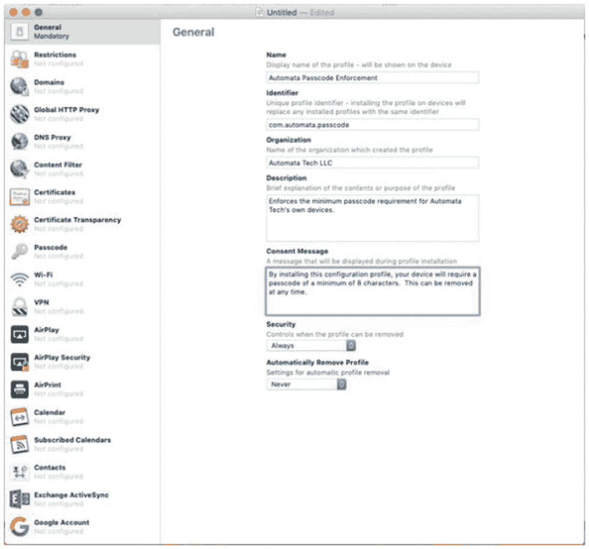

**图 5-9 配置描述文件 - 通用负载示例**

### 配置通用负载

在配置描述文件编辑器的左侧，您会看到各种*负载类别*。当您`选择`一个类别时，您将能够在屏幕右侧`添加`负载并进行配置。每个配置描述文件都包含强制的 `General` 负载。让我们为此新描述文件配置通用负载。

输入以下字段的信息：
1.  **名称：** 描述文件的名称。如果最终用户在其设备上浏览`Settings ➤ General ➤ Profiles`，将会看到此名称。它应具有描述性，并与要部署的负载相关。
2.  **标识符：** 这是每个配置描述文件的唯一字符串。只要没有其他描述文件使用相同的标识符，您在此处使用什么内容并不重要。重复的标识符将触发对前一个描述文件的覆盖，从而允许您更新配置描述文件而无需先手动删除旧描述文件。
3.  **组织：** 输入一个友好的名称，用于标识此配置描述文件的来源以及它关联的组织。
4.  **描述：** 提供对此描述文件中负载功能的简要描述。
5.  **同意消息：** 这是用户安装描述文件时显示的消息。例如，您可能在 Web 服务器上为 BYOD 用户托管了各种描述文件，并希望在安装前向用户说明此描述文件的作用并征得他们的同意。当用户从网站或电子邮件附件下载描述文件后尝试安装时，他们将在 `Settings ➤ Profile Download` 下看到此消息。
6.  **安全性：** 如果您的设备受监管，您可以在此处设置移除描述文件所需的密码。对于这个描述文件，让我们保留默认的 `Always` 选项。
7.  **自动移除描述文件：** 如果您要应用临时设置并希望这些设置或限制在一段时间后过期，此功能很有用。`Never` 是默认选项。

### 添加并配置密码负载

在通用负载中输入所需信息后，点击 `Passcode` 类别，然后点击 `Configure` 按钮以定义密码负载。

现在，我们将为设备定义密码安全要求。您可以按喜好调整选项，如图 5-10 所示。请注意，如果您想取消任何负载，只需点击屏幕右上角的 `[-]` 按钮即可删除它。

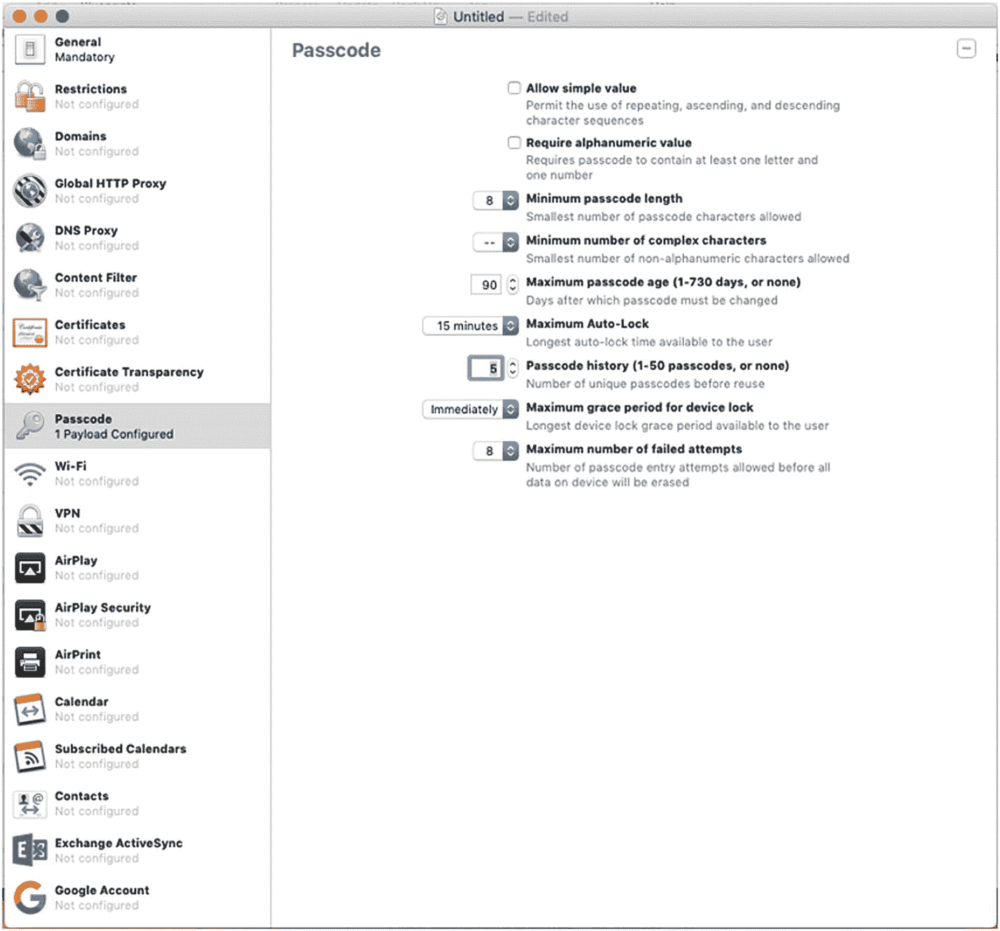

**图 5-10 我的示例密码负载设置**

### 保存描述文件

现在我们已经定义好负载设置并准备就绪，可以保存配置描述文件以便应用到我们的设备。从 `File` 菜单中选择 `Save …`，使用一个名称并在您稍后能找到的位置保存您的配置描述文件。保存文件后，`关闭`配置描述文件编辑器窗口。

**专业提示** 请注意，即使我们可以添加更多负载，我们在此配置描述文件中只配置了一个负载？最佳实践是拥有多个特定于负载的描述文件，这样您可以轻松更改一个设置，而不会影响同一描述文件中可能定义的其他设置。例如，您可能希望独立于 VPN 设置来更新密码设置。为每个设置使用唯一的描述文件允许您更改密码而不会给 VPN 用户带来潜在问题。此方法还允许您为多个不同的用户组重用相同的描述文件。您可以将密码要求描述文件应用到所有用户，然后仅为使用 VPN 的特定用户将 VPN 描述文件添加到设备上。

### 应用配置描述文件到设备

接下来，是时候将此配置描述文件应用到我们的测试设备上了。**点击**列表中的设备以选择它，然后点击 `Add` ➤ `Profiles`，如图 5-11 所示。浏览到我们刚刚创建并保存的描述文件，点击 `Add` 按钮将其应用到 iOS 设备，如图 5-12 所示。

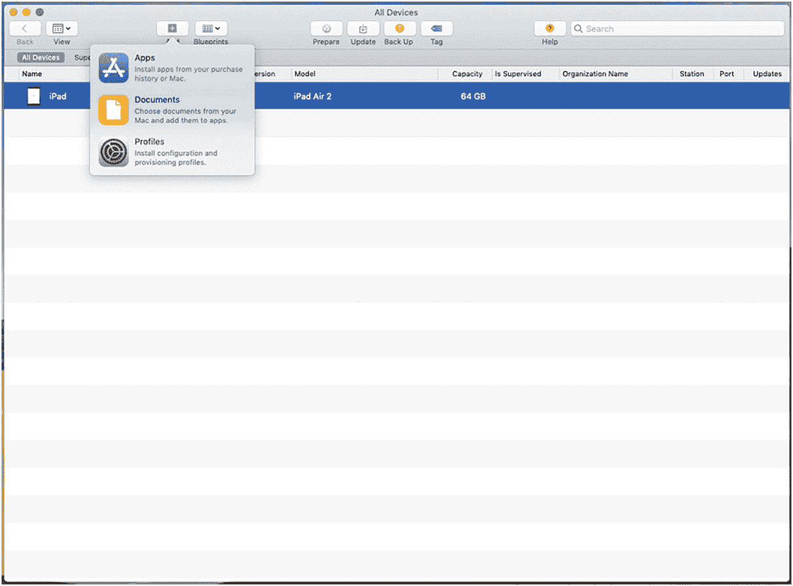

**图 5-11 从添加工具栏按钮安装描述文件**

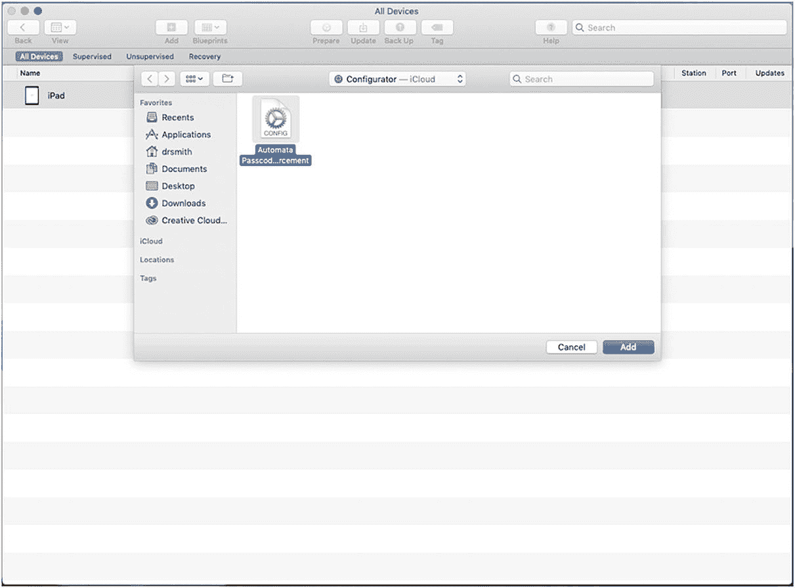

**图 5-12 选择我们创建的带有密码负载的配置描述文件**

### 场景对比：公司设备与 BYOD

在前面的练习中，我们使用 Apple Configurator 将配置描述文件应用到受监管的公司自有 iOS 设备。这是最简单和最安全的方法，但更常见的情况是用户希望使用自己的个人设备处理业务，而不是携带第二部手机或平板电脑。在这种情况下，我们需要能够为最终用户提供一个配置描述文件，他们可以将其安装在自己的设备上，以使其符合公司信息安全策略。

BYOD 设备的挑战在于它们不容易受到监管，因此最终用户可以随时在我们不知情的情况下移除我们安装的限制。在这种情况下，我们需要提供一个能够吸引用户保持配置描述文件安装的 ***胡萝卜***，这样如果用户想继续将其用于业务目的，我们的安全措施就能保持有效。这个 ***胡萝卜特性*** 很可能由您的组织决定。我通常将安全负载与 VPN、Exchange 帐户信息、企业 Wi-Fi 配置或三者结合使用，以确保如果设备能够访问公司服务，那么它就是安全的。如果用户移除了安全措施，他们也将失去从该设备访问公司服务的权限。

### 分发和安装描述文件

现在我们已经准备好已签名的配置描述文件，可以将其托管在我们组织内部的 Web 服务器上，或者通过电子邮件分发给特定用户。为了模拟此过程，请继续将其从您的 Mac 通过电子邮件发送到您的测试设备。打开您的电子邮件，点击以 **.mobileconfig** 结尾的附件。如果成功，将出现一个对话框，提示 **Profile Downloaded** 和 **Review the profile in Settings if you want to install it**。

如果我们打开 `Settings` 应用程序，将看到如图 5-18 所示的 `Profile Downloaded` 提示。点击该按钮，并按照步骤安装描述文件。它会给出一些与 VPN 使用和我们的代码签名真实性相关的警告消息（在此示例中，我们没有使用已知的签名机构，但在生产环境中使用时，您会需要这样做）。

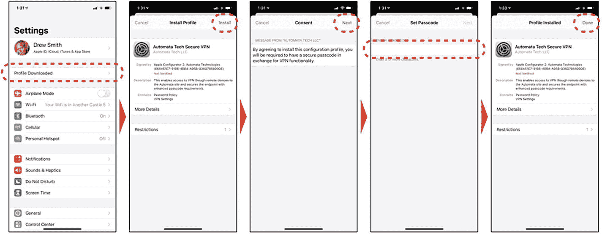

**图 5-18 在 iOS 13 中交互式安装配置描述文件的步骤**

### 探索 iOS 配置描述文件

现在，我们将对我们的配置描述文件进行签名。从 **文件** 菜单中选择 **签名描述文件**，然后如图所示选择 **签名标识**。

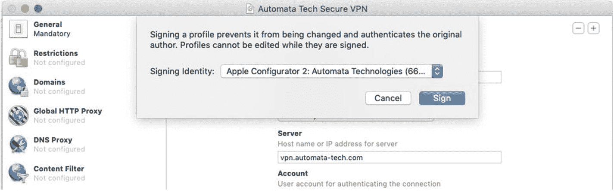

**图 5-17**
为我们的配置描述文件选择签名标识。

1.  填写完 **通用**、**密码** 和 **VPN** 有效载荷后，我们可以保存一份副本以供将来编辑。从 **文件** 菜单中选择 **保存...**，将其保存在某个位置以备将来参考。接下来，从 **文件** 菜单中选择 **复制**，以创建我们将要签名和分发的副本。将我们计划分发的那个保存到 **桌面**。

**专业提示** 你是否看到了关于需要最终用户添加信息因此无法在受监督设备上安装的提示信息？因为我们正在为 BYOD 设备独家创建此描述文件，所以可以忽略关于受监督设备的警告。如果你正在为受监督的设备创建此描述文件，则需要指定账户信息，因此在你决定要监督哪些设备时请记住这一点。

2.  接下来，点击 **密码** 有效载荷，并像上一个练习中那样进行配置，以要求一个 **强密码**。

3.  接下来，点击 **VPN** 有效载荷，并使用类似于图 5-16 中的信息进行配置。这些对于本例来说都是虚拟账户信息，但在真实公司中，你会输入合法的 VPN 配置设置。

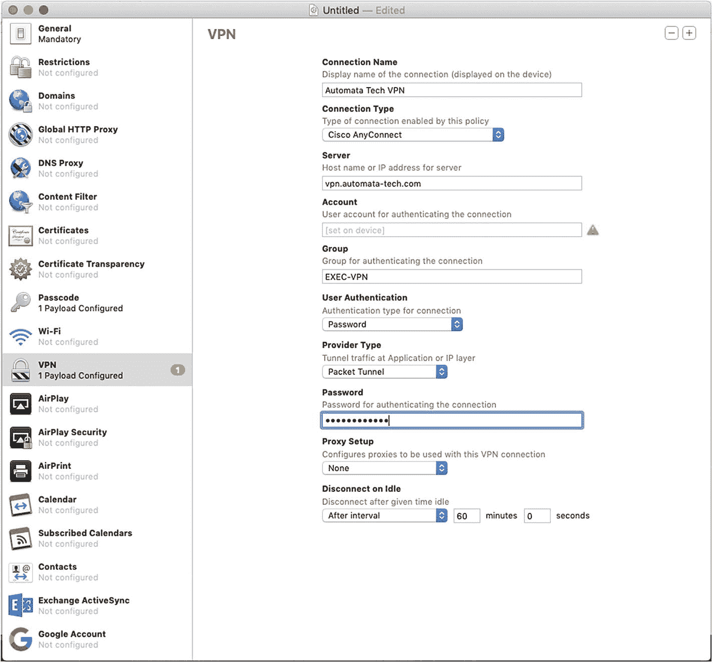

**图 5-16**
VPN 有效载荷的示例占位符数据

4.  打开 Apple Configurator，通过从 **文件** 菜单中选择 **新建描述文件** 来创建一个新的配置描述文件。

5.  在 **通用** 有效载荷部分输入所需信息，如图 5-15 所示，包括描述和同意信息。这次特别重要，因为最终用户将安装它。

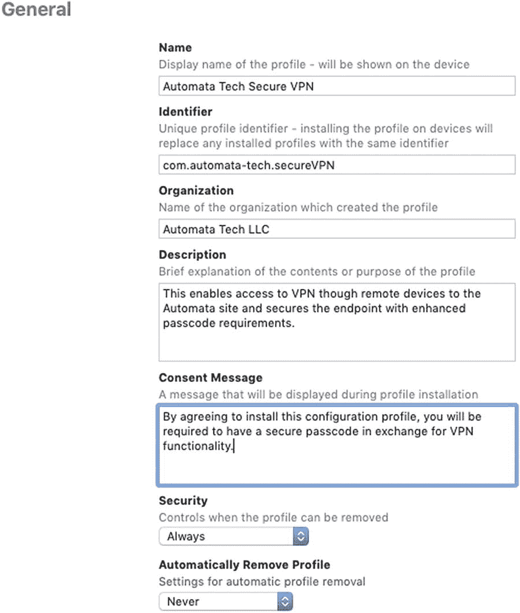

**图 5-15**
通用有效载荷信息示例

你会注意到我们的密码要求立即生效。要继续，我们必须创建一个新的安全密码。当它完成安装后，我们可以点击 **完成** 按钮。如果我们退回到 **设置** 应用的根目录，你会看到我们新安装的 **VPN** 选项，带有如图 5-19 所示的 **开/关** 开关。这证实了我们的配置描述文件生效了！我们现在已经用新密码保护了设备，并启用了对公司 VPN 的访问。

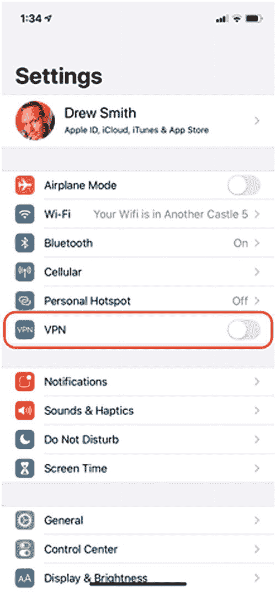

**图 5-19**
VPN 开关现在可以在“设置”中我的网络配置附近使用

6.  最后，让我们浏览回 **设置 > 通用 > 描述文件** 并 **移除** 安全 VPN 配置描述文件。再次浏览回 VPN，你会注意到我们的配置消失了。因此，移除我们描述文件的用户也就移除了他们的 VPN 权限。典型的“第二十二条军规”！

在进入下一节之前，使用 **重置 > 抹掉所有内容和设置** 将你的测试设备恢复为默认状态。

### 探索 iOS 配置描述文件

在进入下一节之前，花一些时间探索可用于 iOS 设备的各种有效载荷。**创建三个独立的、已签名的配置描述文件。** 按以下所示为它们命名并设置已定义的有效载荷。我们将在后面讨论 *蓝图* 时用到它们。

**描述文件 #1 – 安全密码：** 配置此描述文件以使用与图 5-20 中类似的密码设置。

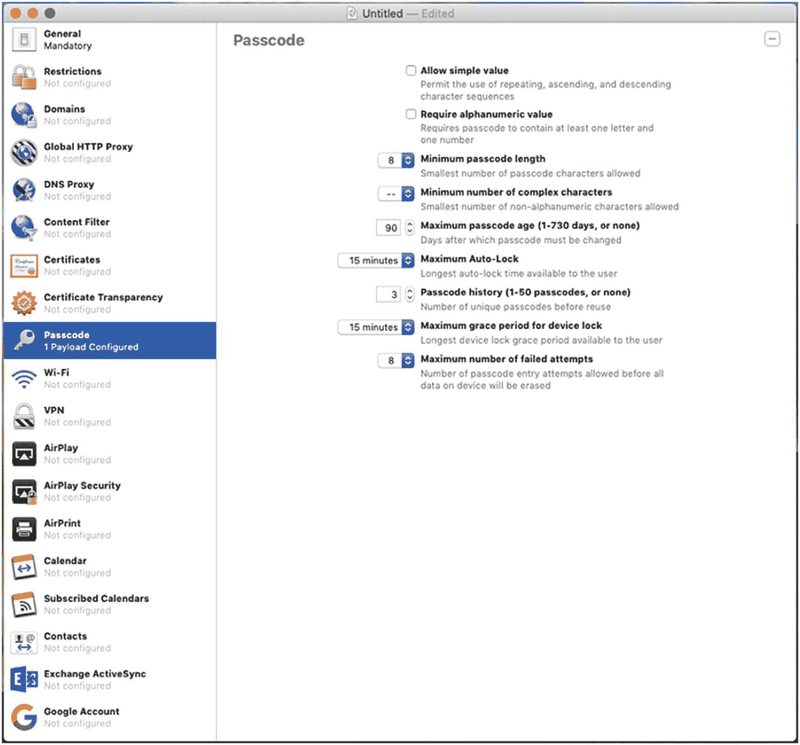

**图 5-20**
密码有效载荷示例

**描述文件 #2 – 家庭 Wi-Fi：** 配置此描述文件以使用 *你当前位置* 的 Wi-Fi 设置。这将允许你的 iPad 自动加入此网络，而无需在设备上手动选择。它应该类似于图 5-21 中我的设置。

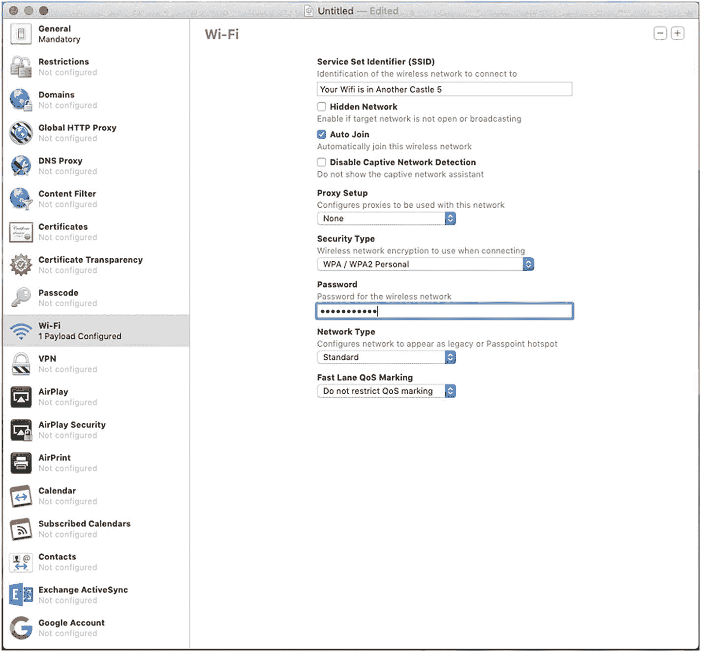

**图 5-21**
在 Wi-Fi 有效载荷中定义的家庭无线设置

**描述文件 #3 – 学生限制：** 假设我们要将这些设备交给学生，并且他们不允许使用 **相机**、**FaceTime**、**AirDrop**、**iMessage**、**Apple Music** 或 **广播**，如图 5-22 所示。

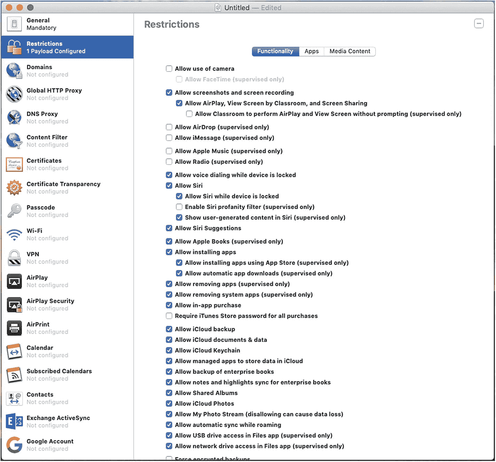

**图 5-22**
在“限制”有效载荷中禁用前面文本中定义的选项

你现在应该拥有三个独立的配置描述文件，可以准备部署到任意数量的 iOS 设备上。将它们保存到你的 **桌面**。管理 iOS 设备的选项非常多，而且还在不断增加。Apple 在其网站上维护着一个有效载荷列表，在你开始探索这些可能性时，它应该是一个很好的参考：

*   [`https://developer.apple.com/business/documentation/Configuration-Profile-Reference.pdf`](https://developer.apple.com/business/documentation/Configuration-Profile-Reference.pdf)

**专业提示**

在创建包含各种有效载荷的配置描述文件时，要记住：如果你在多个描述文件中用不同的设置定义了相同的有效载荷，然后将这些描述文件应用到同一台设备上，可能会产生意想不到的后果。例如，假设你有两个不同的描述文件定义了密码有效载荷。一个有效载荷要求至少 8 个字符，而另一个要求至少 6 个字符。如果你将这两个描述文件安装在同一台设备上，它将应用 8 个字符的最小要求。最好不要将相互矛盾的有效载荷应用到同一台设备上，但如果这样做，至少对于 iOS 来说，它将始终应用限制性更强的有效载荷。

## 使用 Apple Configurator 侧载应用和内容

*侧载* 是一个术语，指的是从计算机而不是在设备本身上以交互方式，将应用程序、文档、书籍或其他内容加载到 iOS 设备上。例如，你可以通过 Apple Configurator 侧载一个 App Store 应用，而不必在设备上手动浏览 App Store 并交互式地下载应用。你也可以在 iOS 设置助理运行之前侧载内容，使其成为在开箱即用体验之外为用户提供预装数据的理想选择。

### 应用

侧载应用相当简单。首先需要通过 USB 连接一台 iOS 设备并打开 `Apple Configurator`。点击设备以选中它，然后点击工具栏中的 `添加` 按钮，再点击 `应用`，如图 5-23 所示。

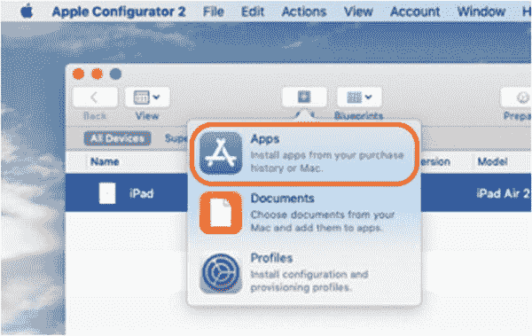

图 5-23
点击添加 ➤ 应用以选择要加载到所选设备上的应用

你可以直接从 Mac 加载应用，方法是点击 `从我的 Mac 选择...`；或者，你也可以使用一个有可用应用的 Apple ID 登录。这可以是一个个人 Apple ID（就像我在本次练习中使用的），也可以是一个机构 Apple ID。我们将在第 8 章讨论机构 Apple ID 和批量购买计划（`VPP`）。

一些组织可能拥有仅为内部机构使用而创建的应用，这些应用永远不会在 `App Store` 中列出。如果你有这样的应用，可以直接从 Mac 加载它们。我们选择使用在 `App Store` 上列出的应用，因此请登录，你应该会看到使用你的 Apple ID 购买的应用列表，如图 5-24 所示。

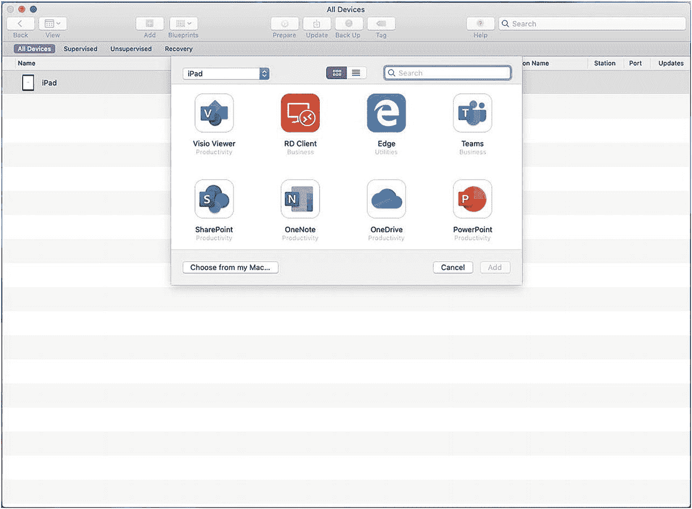

图 5-24
浏览我的 Apple ID 购买的应用

从应用浏览器中选择你希望添加到设备上的应用。你可以通过按住 `Shift 键` 或 `Command 键` 来选择多个应用。选择两三个应用后，点击 `添加` 按钮。如图 5-25 所示，我们选择的应用正在测试设备上下载并安装。

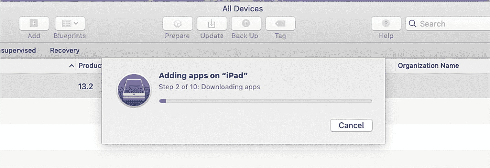

图 5-25
将应用下载并侧载到我连接的 iPad 上

根据应用的大小和互联网连接速度，这可能需要几分钟或更长时间才能完成。进度条消失后，你可以双击设备查看已安装的应用，如图 5-26 所示。如图所示，我选择安装了 `Microsoft Office` 系列应用。

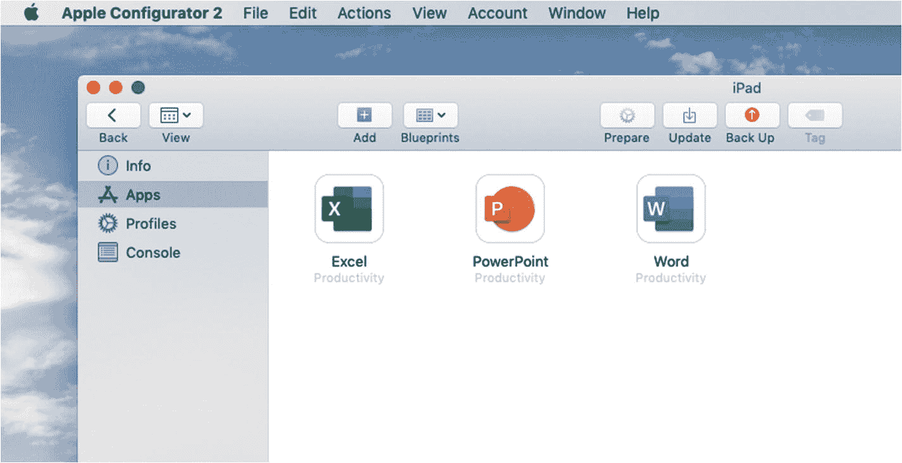

图 5-26
查看已安装的应用以确认它们已复制到 iPad

**专业提示**

请注意用于侧载这些应用的 Apple ID。虽然我使用的是我的个人 Apple ID，但如果我将此设备交给他人，当他们启动 `Microsoft Word` 时，系统会在启动前提示他们输入我的 Apple ID 和密码。将来某个时间点应用更新时，他们也会被提示输入我的密码。我可能不想在将 iPad 交给办公室的每个人时，都给他们我的个人 Apple ID 凭据。我们将在第 8 章介绍几种解决此问题的方法。

### 文档

与侧载应用类似，我们也可以对文档进行同样的操作。你可以加载哪些文档取决于设备上安装的应用。再次选择我们的测试 iOS 设备，并从工具栏的 `添加` 按钮中选择 `文档`。我有四个应用可以安装文档——`图书`、`Excel`、`PowerPoint` 和 `Word`，如图 5-27 所示。让我们将一个 `PDF` 文件加载到 `图书` 应用中。

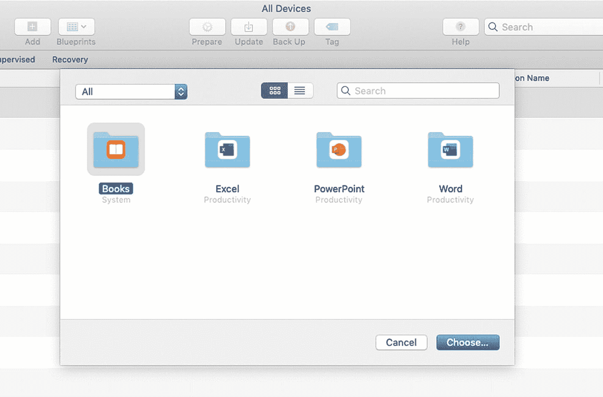

图 5-27
选择要安装 PDF 文档的应用

点击 `图书` 以高亮选中它，然后点击 `选择` 按钮浏览你的 Mac 以选择要上传的 PDF 文档。对于此练习，你加载什么文件并不重要。我只是使用了一个随手找到的随机工作文件。根据 PDF 文件的大小，将文件传输到 `iPad` 应该只需几秒钟。

**专业提示**

如果你还记得第 4 章中关于应用包结构的内容，因为我们选择将 PDF 加载到图书应用，所以它被复制到了 `图书` 包 ➤ `文档` 目录中。如果删除了图书应用，我们预加载的 PDF 文件也将被删除。

## 在 Apple Configurator 中修改 iOS 设备

到目前为止，我们已经配置了 iOS 设备设置、预装了应用并预装了一些重要文档。这很酷，但为了为最终用户定制开箱即用的体验，我们可能还想做更多事情。例如，我不想让我网络上的每台 `iPad` 都叫“iPad”。让我们在测试设备上修改更多设置。

### 设备名称

我们可以通过 Apple Configurator 为一台或多台设备命名。如果你选择多台设备，可以添加一个标记，在名称末尾附加一个序列号。在本例中，我们只需将测试设备命名为“测试 iPad”（或 iPhone，取决于你的测试设备型号）。为此，请点击连接的设备以选中它，然后使用 `操作` 菜单选择 `修改` ➤ `设备名称...`，在对话框中输入名称并点击 `重命名` 按钮，如图 5-28 所示。

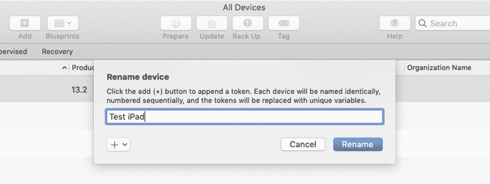

图 5-28
通过在提供的字段中输入新名称来重命名设备

### 主屏幕布局

现在我的测试设备上已经安装了更多应用，我可能想重新排列这些应用，这样我的用户就不必费力去寻找 Microsoft Office 了。默认情况下，`Word`、`Excel` 和 `PowerPoint` 位于第二页主屏幕，我确信至少会接到一个用户的求助电话，说他们认为 `iPad` 上没有安装 Office。让我们预见这个问题，将这些 Microsoft 应用移到主屏幕第一页。

点击测试设备以选中它，然后使用 `操作` 菜单选择 `修改` ➤ `主屏幕布局`。会出现一个与图 5-29 类似的窗口，允许你移动图标。我将把 `Excel`、`Word` 和 `PowerPoint` 移到主屏幕第一页，而将 `股市`、`语音备忘录` 和 `家庭` 移到第二屏。只需用鼠标在屏幕上拖放应用，完成后点击 `应用` 按钮。

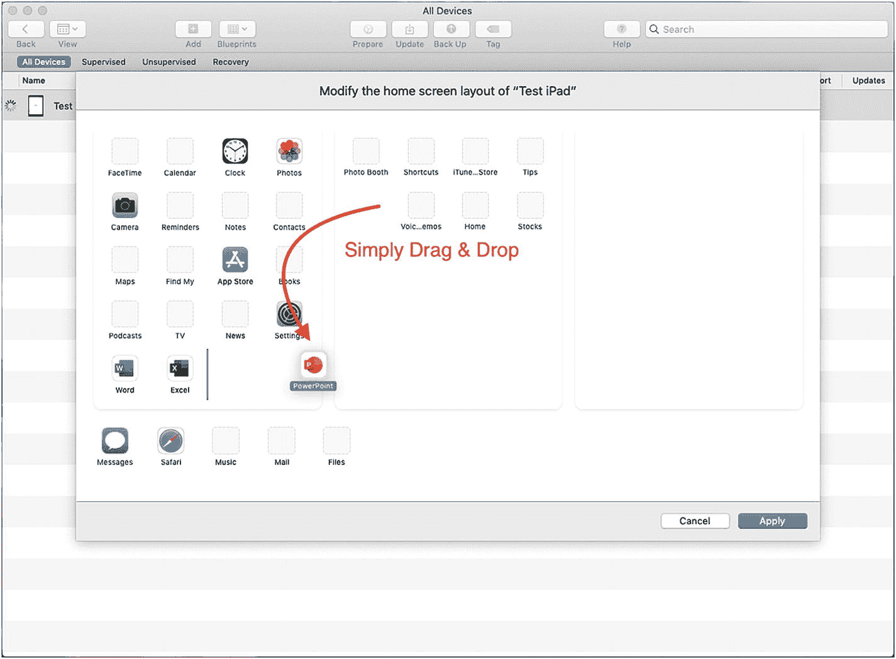

图 5-29
在窗口内拖放图标以重新排列

### 墙纸

最后，在将设备交给最终用户之前，我们可能想做的最后一项修改是自定义 `墙纸`。许多组织喜欢通过无法移除的自定义墙纸来标识他们的资产。在受监督的设备上，通过将墙纸修改与限制用户更改它的配置描述文件相结合，你可以通过这种方式永久地为你机构的设备打上品牌标识。

图 5-30 显示了设置自定义墙纸时可用的选项。你还可以定义一条将显示在锁定屏幕上的自定义消息。或者，你可以将文本显示为 QR 码，或使用标记自动附加一个数字，类似于设备名称配置。一些组织可能希望利用此功能的 QR 码或序列号来实现资产管理。

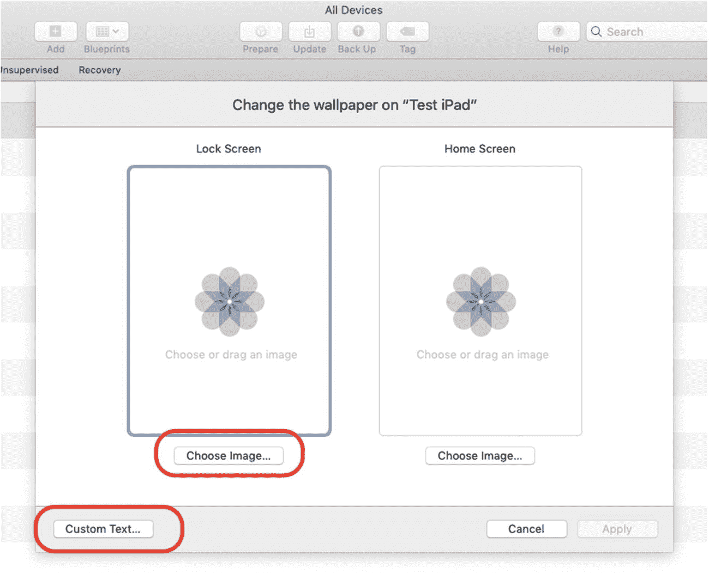

图 5-30
设置墙纸和自定义文本的选项

## 使用蓝图配置 iOS 设备

现在，你已经使用了 Apple Configurator 提供的所有选项来准备设备，是时候将它们整合到一个可重复、半自动化的工作流程中了。顾名思义，*蓝图*就像是一个模板，可以根据同一套基本指令配置多台设备。在本练习中，我们将创建一个蓝图，让 Apple Configurator 能够根据我们的精确规格为我们构建一个 iOS 设备。

我们希望从一个完全干净（全新恢复）的测试设备开始。如果你还没有这样做，请继续并清除并恢复你的测试设备。你可以直接在设备上使用 **设置** ➤ **通用** ➤ **还原** ➤ **抹掉所有内容和设置**，或者如果你仍然将其连接到 Apple Configurator，可以从 **操作** 菜单中选择 **恢复**，Configurator 将下载最新的 iOS 版本并应用到所选设备。

### 创建蓝图

1.  要开始使用蓝图，请点击工具栏上的 **蓝图** 按钮，然后选择 **编辑蓝图**，如图 5-31 所示。

    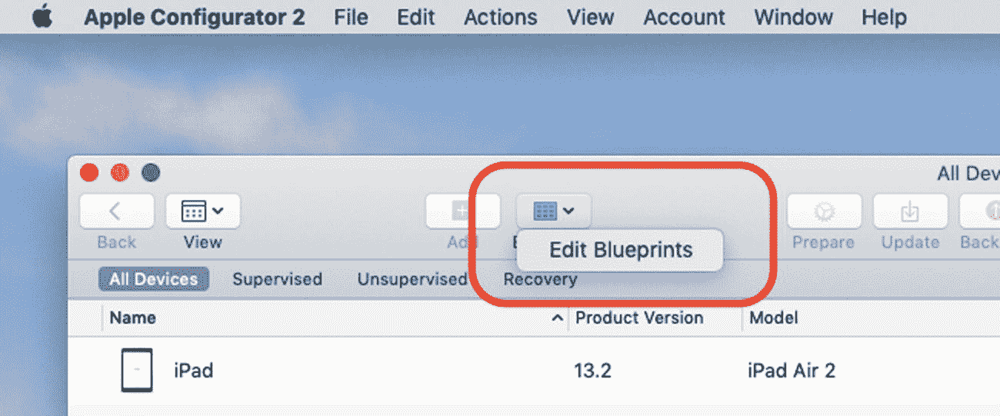

    图 5-31
    通过在工具栏中选择“编辑蓝图”进入蓝图编辑器

2.  进入蓝图编辑器窗口后，点击屏幕左下角的 **新建** 按钮以创建一个新蓝图。将蓝图命名为 **“测试部署”**。你的屏幕应该类似于图 5-32。

    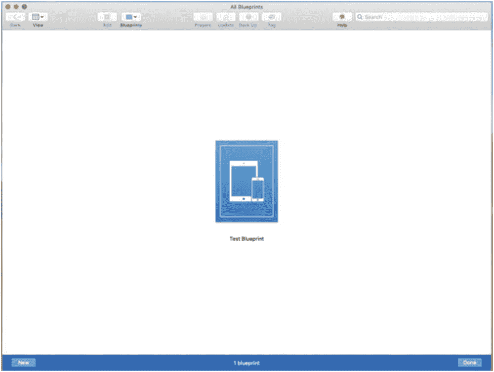

    图 5-32
    包含“测试部署”蓝图文档的蓝图浏览器

3.  **双击** *测试部署* 蓝图以进行编辑。我们可以保留默认的目标设备为 **“iPad、iPhone 和 iPod touch”**。在此窗口中，我们可以将 App、描述文件或脚本操作加载到蓝图中。可以将其想象成在 *Microsoft Word* 这类办公应用程序中创建 *宏*。我们将定义计算机用来准备设备的步骤。

4.  我们先添加几个操作。点击工具栏中的 **准备** 按钮，并逐步进行我们过去设置过的选项。在准备助手末尾点击 **准备** 按钮，你应该会看到一个设置列表，这些设置已应用到蓝图的 *设置* 部分，如图 5-33 所示。

    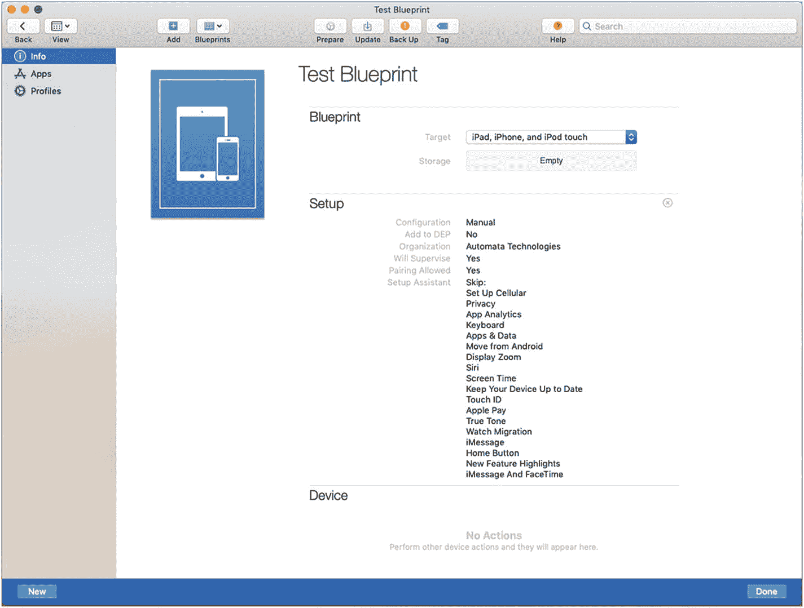

    图 5-33
    我们在“准备”操作中定义的选项列表

5.  接下来，我们需要添加一些 App。点击左侧窗格中的 **App** 按钮*或*点击工具栏中的 **添加** 按钮并选择 **App**。像之前一样选择几个 App。我自己将再次添加 *Word*、*Excel* 和 *PowerPoint*。根据你加载的 App 不同，你将看到存储条被占用了相应大小的数据。在我的例子中，安装了这三个 App 后，已使用 788 MB。

6.  接下来，让我们添加一些配置描述文件。还记得我们在前面章节创建的三个描述文件吗？你应该已准备好可用的 *安全密码*、*我的家庭 Wi-Fi 设置* 和 *学生限制* 描述文件。点击 **添加** 按钮并选择 **描述文件**。选择这三个描述文件并点击 **添加** 按钮。你的屏幕应类似于图 5-35。

    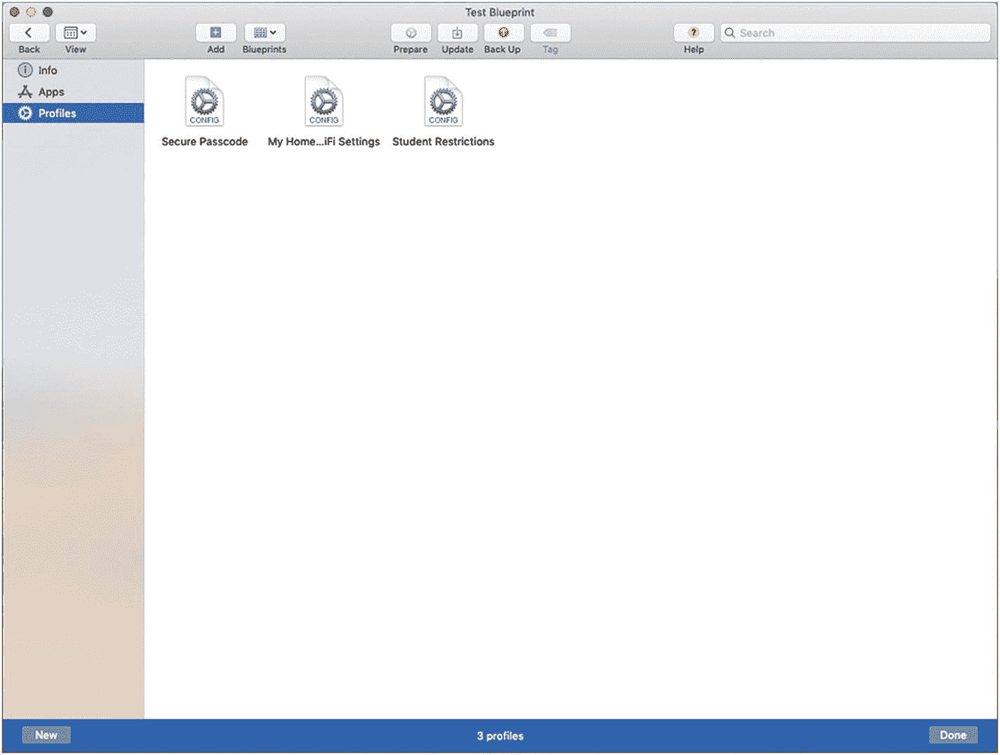

    图 5-35
    将我们之前创建的三个描述文件添加到蓝图

7.  接下来，让我们添加一些自定义壁纸。像之前处理单台设备一样，点击 **操作** 菜单 ➤ **修改** ➤ **墙纸**。从你的计算机中添加一些自定义图片作为壁纸，点击 **自定文本** 按钮并输入 **“My Company’s”** + **设备类型** 令牌。结果将显示类似 **“My Company’s iPad”** 或类似的内容，如图 5-34 所示。点击 **应用** 按钮，你将看到我们所做的自定义设置已添加到蓝图中的 *设备* 标题下。

    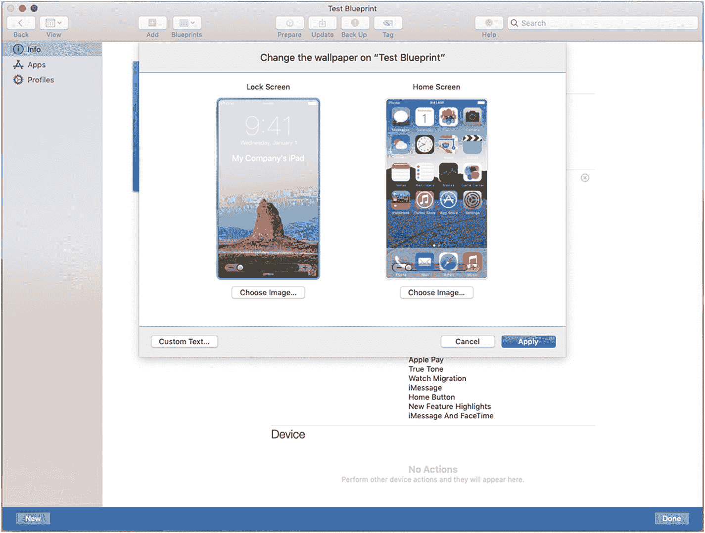

    图 5-34
    自定义壁纸和锁定屏幕预览

    **专家提示** 我喜欢使用苹果 macOS 内置的墙纸来做这类事情。你可以浏览到 `/Library/Desktop Pictures/` 目录，那里有许多适合本练习的墙纸。

8.  至此，我们已经创建了蓝图。点击蓝图窗口右下角的 **完成** 按钮退出蓝图编辑器，返回到 Apple Configurator 主窗口。现在我们有了一个可以应用到测试 iOS 设备的测试蓝图。

### 部署蓝图

接下来，是时候使用我们创建的蓝图来配置我们的测试 iOS 设备了。

1.  如果尚未连接，请使用 USB 数据线将测试设备连接到你的 Mac。在 Apple Configurator 主窗口中，**点击** 测试设备以选中它。

2.  如图 5-36 所示，点击 **蓝图**，然后选择 *测试蓝图*。它将要求你确认是否要将测试蓝图应用到所选设备。点击 **应用** 按钮，现在你将看到它执行我们概述的各个步骤。这可能需要几分钟，具体取决于 App 的大小、设备是否需要更新等等。

    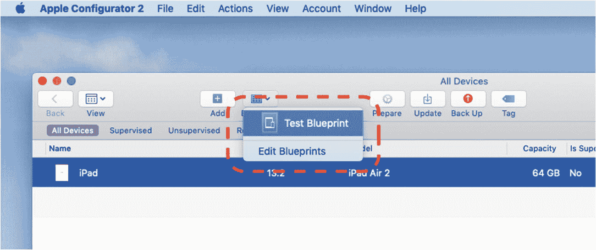

    图 5-36
    点击我们要应用到所选设备的蓝图

    **专家提示** 当 Mac 应用配置描述文件时，你可能被提示了几个同意消息。如果你打算将配置数千台 iOS 设备的蓝图投入生产使用，你可能需要删除“通用”载荷中“同意消息”字段中的文本，以移除可选的同意语言，这样每次蓝图运行时就不需要同意警报了。最终，你的目标应该是实现一个（基本）无人值守的配置过程。

3.  蓝图完成后，**断开** 测试 iOS 设备的连接，并逐步完成设置助手以检查你的工作。你注意到这次有什么不同吗？如果你在 *家庭 Wi-Fi 配置文件* 载荷中应用了正确的 Wi-Fi 设置，它应该会自动加入你的无线网络，并跳过了关于连接无线网络的提示。*很棒！*

一旦进入主屏幕，测试几项内容。你的锁定屏幕和主屏幕应该看起来像图 5-37 中的那样。注意到我们如何预装了 App，并且我们的安全设置禁用了相机和信息 App 了吗？这些是我们在“学生限制”配置描述文件中启用的限制的例子。*相当整洁！*

图 5-37
我的测试 iPad 的完成配置

### 专家提示

我们会称这个测试过程为 *配置验证*。如果你正在测试此蓝图以用于大规模部署场景，请务必向所有相关方展示此测试设备，以便他们能够在使用蓝图部署数百或数千台设备之前，审查并确认最终结果。

## 高级 Apple Configurator 工具

侧载、蓝图和配置描述文件是使用 Apple Configurator 的主要原因；它们是非常强大的工具。但 Configurator 内部还有一些额外的隐藏功能，可能对设备管理员有用。本节将简要概述这些高级工具及其适用场景。

### 单应用模式

在第 4 章的 `辅助功能` 设置中，我们介绍了 `引导式访问` 功能。Apple Configurator 中的 `单应用模式` 与之非常相似，都是将设备锁定为只能使用一个应用。要将设备置于单应用模式，请确保应用已安装并可在 iOS 设备上使用，并通过 USB 数据线连接到 Apple Configurator。点击 `操作` 菜单 ➤ `高级` ➤ `启动单应用模式`，然后选择您希望用于激活此功能的应用。

### iOS 设备控制台

有时在排查设备、应用程序甚至第三方在线服务的问题时，查看 `设备日志` 会很有帮助。要查看这些日志，我们需要使用 `控制台`。要访问控制台，请将设备连接到 Apple Configurator，`双击` 该设备，然后在左侧窗格中选择 `控制台`。您应该会看到如图 5-38 所示的实时日志输出。

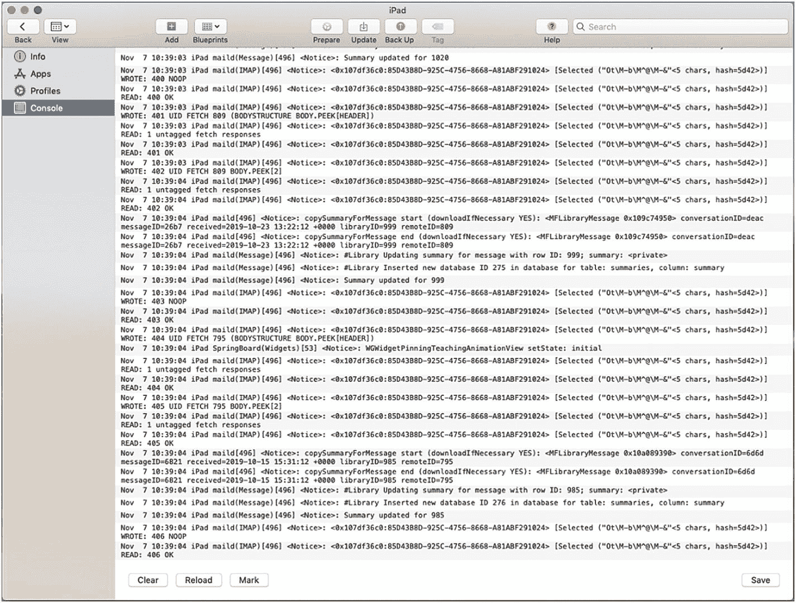

**图 5-38**
我的测试设备控制台的输出。哇，Gmail 的日志真多！

### 自动操作与终端命令

Apple Configurator 的蓝图工具非常强大，可以通过可视化的宏脚本来自动配置设备，但如果您想更进一步，Apple 还提供了对自动操作和可选的 `cfgutil` 命令的支持。如果您使用 `自动操作`，会发现 Apple Configurator 安装时会附带许多新的 `操作`。

要安装命令行工具，请从 `Apple Configurator 2` 菜单中选择 `安装自动化工具`，如图 5-39 所示。

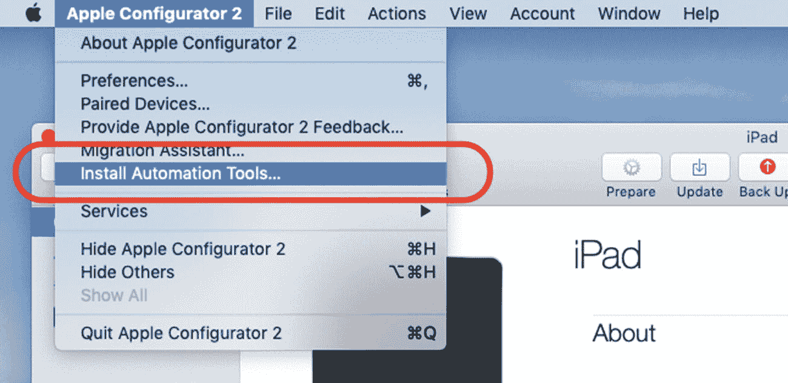

**图 5-39**
安装可选命令行工具

有关 `cfgutil` 的更多信息，您可以使用 `man cfgutil` 命令阅读手册。您可以使用 `cfgutil` 编写脚本，以进一步自动化 iOS 设备的配置。

### 设备信息导出

Apple 提供了两个便捷功能，用于从 Configurator 导出设备数据。如图 5-40 所示，如果您正在进行某种内部企业应用开发，可以导出设备数据，其格式便于上传到 Apple 开发者门户，从而将这些设备加入白名单以运行这些内部应用。您还可以将所选设备的每项数据导出为 `∗.csv` 文件，用于库存管理。

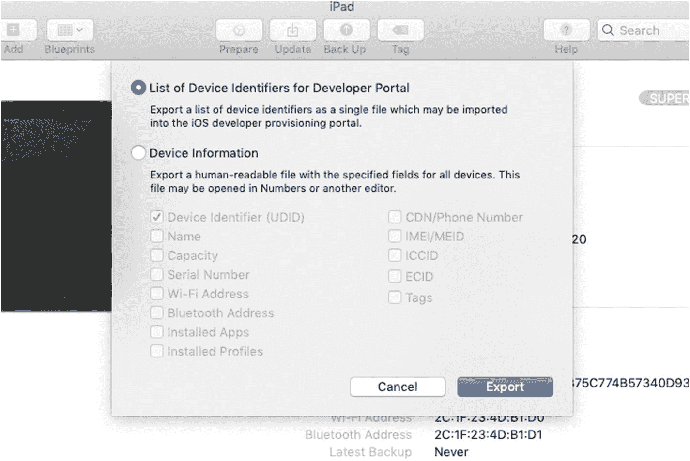

**图 5-40**
所选 iOS 设备的导出数据选项

### 清除密码

密码可能会带来问题，尤其是在员工或学生流动率高的办公室或学校环境中。Apple 通过 Configurator 提供了一个选项，可以将 `解锁令牌` 嵌入 iOS 设备，以便在将来不知道用户设置的密码时解锁设备。请注意，此功能仅适用于 `受监督的` 设备。

要向设备添加解锁令牌，请 `点击` 设备以选中它，然后使用 `操作` 菜单 ➤ `高级` ➤ `保存解锁令牌` 来应用它，如图 5-41 所示。解锁令牌只能应用于当前已解锁的设备，因此如果您想使用此功能，需要提前计划。

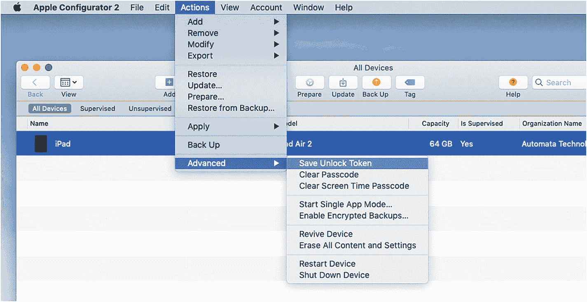

**图 5-41**
向所选设备应用解锁令牌

要解锁受监督的设备，请将设备连接到 Apple Configurator 并 `点击` 它进行选择。点击 `操作` 菜单 ➤ `高级` ➤ `清除密码`。

除了清除设备密码外，您还可以清除受监督设备上的 `屏幕使用时间` 密码。屏幕使用时间密码可以由用户设置，不必与设备密码相同。如果您需要清除屏幕使用时间密码，请将设备连接到 Apple Configurator，从列表中选择它，然后点击 `操作` 菜单 ➤ `高级` ➤ `清除屏幕使用时间密码`。

**专业提示**
如果您正在部署大量可能在将来某个时刻需要解锁的受监督设备，您应该编辑您的蓝图，添加 `保存解锁令牌` 操作，以便在每次初始设置过程中自动添加该令牌。

### 恢复设备

Apple 提供了此功能，用于恢复使用 `T2 安全芯片` 的 Mac。如第 2 和第 3 章所述，T2 芯片集成了许多不同的逻辑板组件，提供了仅靠软件解决方案无法实现的硬件安全级别。当 T2 芯片出现问题时，整个系统都会出现问题。幸运的是，如果您的 T2 Mac 无响应，您可以尝试使用 Apple Configurator `恢复` 它。Apple 在一篇知识库文章中提供了相关说明，您可以在此处找到：

*   [`https://support.apple.com/guide/apple-configurator-2/revive-firmware-in-mac-computers-apdebea5be51/mac`](https://support.apple.com/guide/apple-configurator-2/revive-firmware-in-mac-computers-apdebea5be51/mac)

如果您打算尝试此操作，应遵循 Apple 的具体说明。每台配备 T2 芯片的 Mac 根据型号不同，可能有独特的操作步骤。

## 总结

Apple Configurator 是自动化 iOS 设备配置过程的绝佳工具。在本章中，我们学习了如何创建蓝图来简化和自动化新设备的设置。我们还探索了以监督和配置描述文件的形式为系统管理员提供强大安全控制的技术。

使用 Apple Configurator 的主要缺点是，它仍然要求 IT 人员接触每台设备，并至少一次通过物理方式将它们连接到 Mac。在本书的后面部分，我们将介绍空中配置的概念，它需要更少的直接交互来部署新设备。在接下来的几章中，我们将回到 Mac，学习如何远程管理 `macOS` 客户端以及构建用于移动设备管理的服务器。

