# 使用 Apple 远程桌面管理 macOS 客户端

Apple 远程桌面 (ARD) 是一个基本的客户端管理工具，Mac 系统管理员已经使用了超过 15 年。在本章中，我们将回顾 ARD 的四个主要组件——资产管理、软件分发、客户端管理和远程支持。如果您需要管理超过几个 `macOS` 客户端，ARD 是必备工具。


## Apple Remote Desktop 简介

当前版本的 Apple Remote Desktop 可在 `Mac App Store` 获取，版本为 3.9，价格为 79.99 美元，如图 6-1 所示。虽然它比 `Apple Configurator` 贵得多，但就商业桌面管理套件而言，它的价格相当实惠。如果你的组织还没有针对 `macOS` 客户端的**管理解决方案**，那么使用 `ARD` 是一个不错的选择。

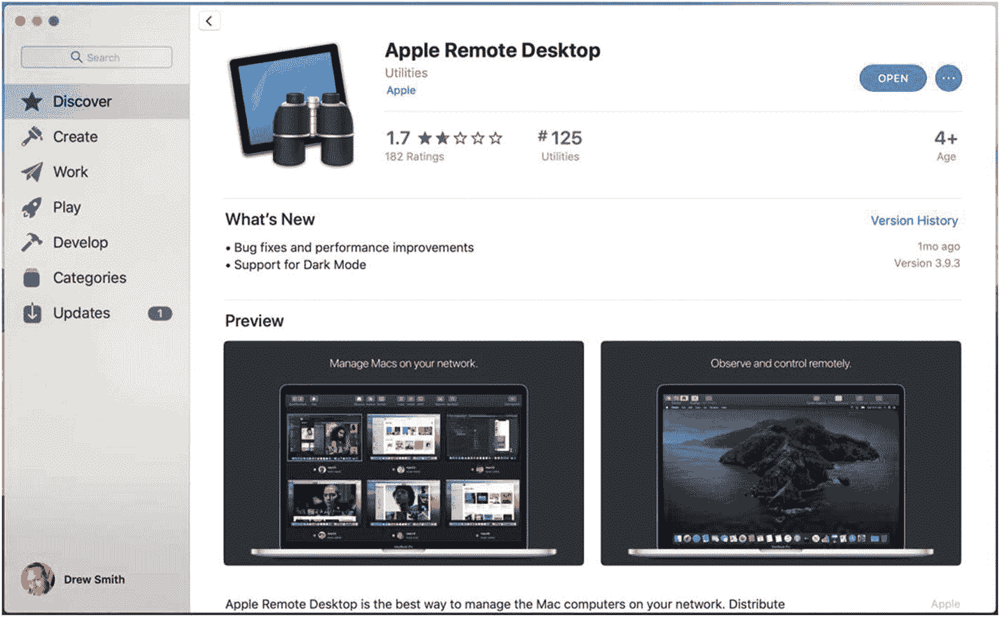

**图 6-1**
Apple Remote Desktop 可在 Mac App Store 中获取

**专家提示**
市面上有许多跨平台的桌面管理工具，例如 `Symantec Altiris` 和 `Microsoft System Center Configuration Manager (SCCM)`，它们可以支持 `macOS`、`Windows` 或 `Linux` 客户端，许多大型组织已对此类工具进行了大量投资。如果你已有类似的解决方案并且它能满足你的需求，那么 `ARD` 可能无法提供你尚未拥有的额外功能。

### 安装 Apple Remote Desktop

在规划使用 Apple Remote Desktop 时，你需要确定将其安装在何处。对此有几种不同的看法。如果你是组织中唯一的 Mac 技术员，你可以将其安装在你主要的 Mac 台式机或笔记本电脑上。就远程控制任务的响应速度而言，这将为你提供最佳体验。你可以将所有脚本和安装文件存储在主机上，并且可以随主机数据一起备份整个 ARD 系统。

这种方案的缺点是，当你需要在稍后的时间或日期安排安装时，特别是当你的计算机可能未在线或不可用时。例如，假设你想在今晚凌晨 3 点在公司计算机上安排软件安装，但你需要将笔记本电脑带回家，届时它将不在公司网络上，无法推送安装文件和运行任务。在这种情况下，你可能希望设置一个 `Remote Task Server` 或将 `ARD` 直接安装在专用的 Mac 服务器上，然后从你的工作站使用 `Screen Sharing` 或 `ARD` 访问该服务器。

### 远程任务服务器

在第 7 章中，我们将更详细地介绍 `macOS Server`，但目前你需要知道的是，与 `Windows` 有特定的服务器版和客户端版不同，任何 Mac 都可以作为服务器。`ARD` 的 `Remote Task Server` 指的是一台计算机，它按照指定计划对各类任务（如软件安装）进行排队或执行。默认情况下，Apple Remote Desktop 会将安装有 `ARD` 应用程序的本地计算机设置为 `Task Server`。

如安装部分所述，将 Apple Remote Desktop 安装在你主要的工作站上存在一些明显的缺点。其中之一是，当待处理的任务计划正在进行时，你需要保持 Mac 在线。你可以使用 `Remote Task Server` 来缓解这个问题。通过指定一个 `Remote Task Server`，你可以在工作站上使用 `ARD`，但所有待处理计划任务都将在远程服务器上排队。

要配置远程任务服务器，你需要在一台配备 `静态 IP 地址` 的 Mac 上安装 Apple Remote Desktop。打开 `ARD`，从 `Remote Desktop` 菜单中选择 `Preferences…`。图 6-2 显示了 `Task Server` 选项卡和 `Use Task Server on this computer` 选项，并且 `Allow remote connections to this server` 的复选框已被勾选。

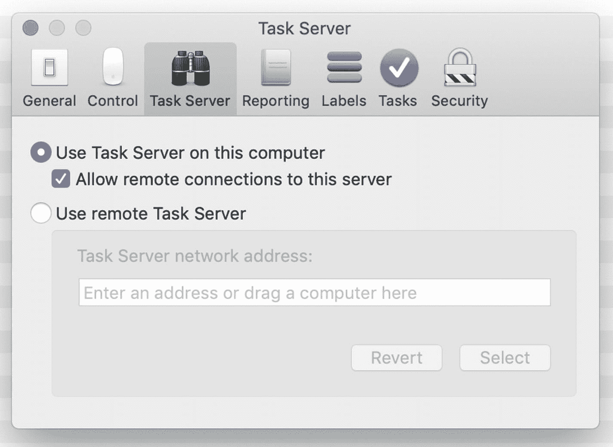

**图 6-2**
ARD 偏好设置中的任务服务器选项

接下来，在已安装 Apple Remote Desktop 的技术员工作站上，启动 `ARD`，从 `Remote Desktop` 菜单中选择 `Preferences…`。点击 `Task Server` 选项卡，如图 6-3 所示，选择 `Use remote Task Server`，在字段中输入服务器的 `静态 IP 地址`，然后点击 `Select`。`ARD` 将验证其是否可与远程任务服务器通信，如果成功，则所有未来任务都将设置为在远程服务器上运行。

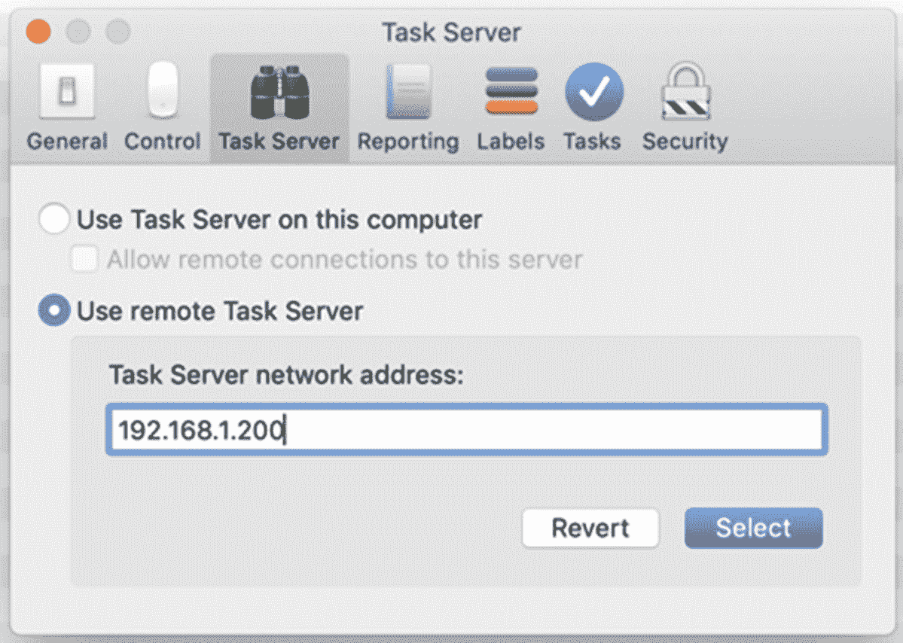

**图 6-3**
配置你的技术员工作站以使用远程任务服务器

### 服务器安装

我首选的方案是在一台配备 `静态 IP 地址` 的 Mac 服务器上安装 `ARD`。这允许我团队中的任何成员访问 `ARD` 控制台并共享所有安装文件或脚本。安装过程与在单台工作站上安装非常相似，只是需要对 `ARD Preferences` 进行一项更改。

默认情况下，Apple 设置了一个安全选项，即无法使用 Apple Remote Desktop 远程控制另一台运行 Apple Remote Desktop 的 Mac。要禁用此功能，请从 `Remote Desktop` 菜单中选择 `Preferences…`，然后点击 `Security` 选项卡，如图 6-4 所示。勾选 `Allow control of this computer when this application is running` 选项旁边的复选框。

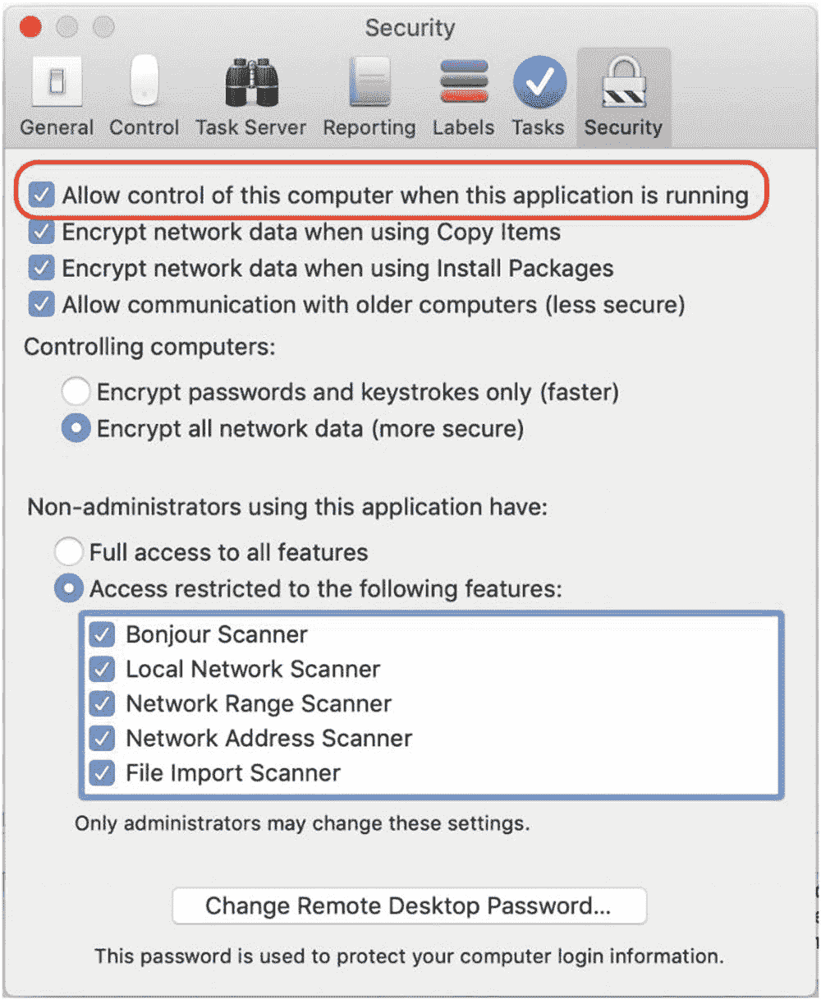

**图 6-4**
当 ARD 也在该远程计算机上运行时，允许使用 Apple Remote Desktop 远程控制该计算机

**专家提示**
在选择用作 Apple Remote Desktop 服务器的 Mac 时，我建议选择一台拥有较多板载存储的机器——例如配备额外 SSD 硬盘的 `Mac Pro` 或配置了双 SSD 硬盘的 `Mac mini`。这将为你将要推送到 Mac 客户端的各种安装包提供充足的存储空间。


### 界面概览

图 6-5 突显了 Apple Remote Desktop 控制台的主界面。

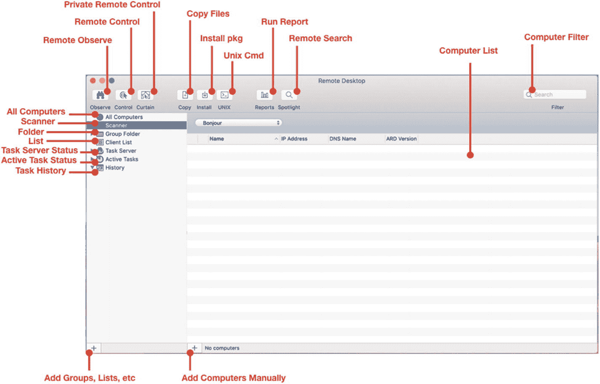

图 6-5

Apple Remote Desktop 主窗口中的界面组件

*   **所有计算机列表：** 默认分组，显示所有已添加到 ARD 的计算机。
*   **扫描器：** 扫描本地网络并显示可添加到 ARD 控制台的可用计算机。
*   **文件夹：** 用于包含计算机、任务、扫描器等列表的组织单元。
*   **列表：** 用于对计算机进行分组的组织单元。
*   **任务服务器状态：** 本地或远程任务服务器上排队任务的状态。
*   **活动任务状态：** 正在运行的任务的状态。
*   **任务历史：** 已完成任务的状态及其成功与否。
*   **添加组/列表 + 按钮：** 使用此按钮添加额外的计算机列表、扫描器和分组。
*   **添加计算机按钮：** 使用此按钮通过 IP 地址手动添加计算机，而不是使用扫描器。
*   **远程观察：** 启动一个仅具有观察访问权限的远程控制窗口。
*   **远程控制：** 启动一个具有远程控制功能的远程控制窗口。
*   **私密远程控制：** 启动一个具有远程控制功能的远程控制窗口，但会屏蔽远程用户的显示器，使其在远程控制会话期间无法看到正在发生的情况。
*   **复制文件：** 将文件从运行 ARD 的 Mac 复制到一台或多台远程计算机。
*   **安装包：** 从运行 ARD 的 Mac 上的 `*.pkg` 或 `*.mpkg` 文件安装应用程序到一台或多台远程计算机。
*   **Unix 命令：** 在远程计算机上运行一个或多个 Unix 命令。
*   **运行报告：** 打开报告查看器并显示对一台或多台远程计算机请求的信息。
*   **远程搜索：** 根据指定条件远程搜索远程计算机上的文件。
*   **计算机列表：** 显示所选列表中列出的所有客户端。
*   **计算机过滤器：** 在搜索栏中输入信息以筛选选定的计算机列表。

### 为 ARD 配置 macOS 客户端

在我们能够搜索并将 Mac 添加到 Apple Remote Desktop 控制台之前，需要在`共享`系统偏好设置中启用`远程管理`服务。如图 6-6 所示，单击`远程管理`选项。勾选`远程管理`旁边的复选框以启用该服务。系统将提示您选择要启用的各种选项。请在此对话框页面上**勾选所有选项**，然后单击`确定`按钮关闭选项。

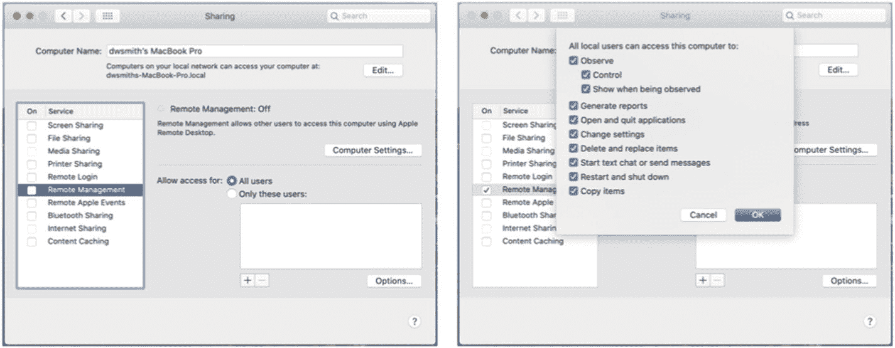

图 6-6

启用远程管理服务并选择所有 ARD 管理选项

在远程管理服务屏幕上，您应该会看到服务旁边有一个*绿色圆圈*，表示它正在运行。单击`计算机设置…`按钮，您将看到一些额外的选项，如图 6-7 所示。如果您计划允许用户在被观察时看到提示（我们选择是），并且您希望允许用户通过远程管理菜单栏附加项请求帮助（我们选择是），请勾选`在菜单栏中显示远程管理状态`旁边的复选框。

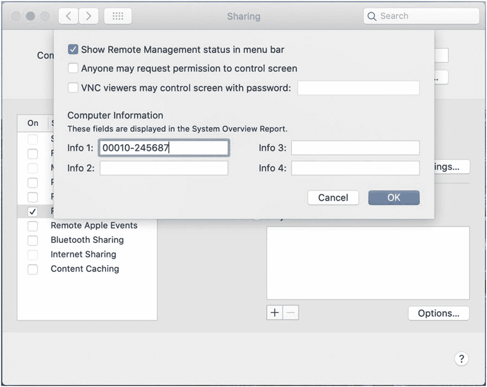

图 6-7

其他远程管理服务客户端设置

我们还提供了四个可选字段，用于为我们的报告收集额外的临时信息。有许多内置的设备详细信息可以报告，例如处理器速度、RAM 和网络状态。但是，如果我们有一些对我们组织来说是独特的、需要跟踪的信息该怎么办？

我公司的所有 MacBook 上都贴有一个带有序列化资产标签编号的特殊属性贴纸。我希望也能报告此信息，因此我可以使用`信息 1`字段手动输入此特定客户端的资产标签信息。通过这样做，当我将来提取报告时，我也可以收集该数据，而无需亲自访问每台机器并检查贴在笔记本电脑底部的贴纸。


## 使用扫描器添加客户端

接下来，让我们回到运行 Apple 远程桌面控制台的服务器设备上。打开 ARD，点击屏幕左侧的 `扫描器` 按钮，如图 6-8 所示。这将启动对本地局域网（具体是我的 Wi-Fi 网络）的扫描，并生成网络上的客户端列表。它找到了我的测试笔记本电脑 `dwsmith’s MacBook Pro`，这正是我想要添加到 ARD 控制台的设备。要将此机器添加到控制台，请点击扫描器列表中的计算机，然后将其 `拖放` 到左侧的 `所有计算机` 图标上。

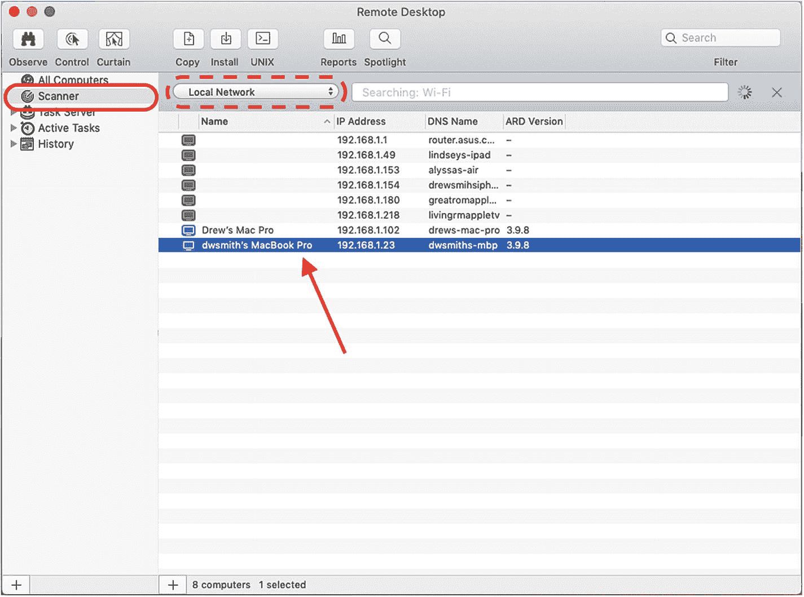

图 6-8

ARD 控制台扫描器工具识别网络设备，包括运行了远程管理服务的 Mac 电脑

**专业提示**

你是否注意到在扫描器视图中，我们看到了 ARD 中客户端的 `名称` 和 `DNS 名称`？在第 2 章中，我们讨论了 Mac 使用的各种名称，包括友好名称（名称）和主机名（DNS 名称）。如果我们的主机名全都相同或不能充分代表网络上的系统，这里就可能开始出现问题。

一旦你尝试将一个或多个系统添加到“所有计算机”控制台列表，ARD 将提示你使用要添加的客户端的本地管理员帐户进行 `身份验证`。输入登录信息，然后点击 `添加` 继续，如图 6-9 所示。请注意，如果你不知道本地密码，你仍然可以将系统添加到控制台，但未经身份验证，你将无法运行任何任务或远程控制系统。

**专业提示**

如果你有多个计算机要添加，可以使用 `shift` 或 `command` 键修饰符选择多台计算机，然后将它们全部一次性拖放到“所有计算机”图标上，以同时添加所有系统。

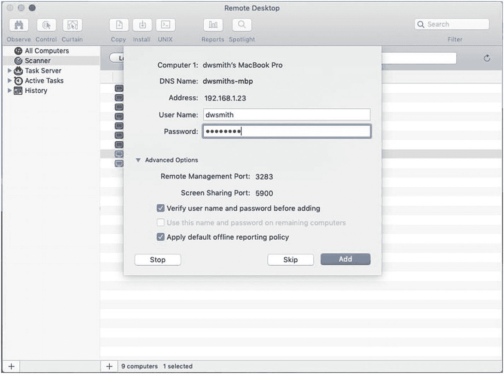

图 6-9

使用客户端的本地管理员帐户进行身份验证，将其添加到 ARD 控制台

身份验证后，我们添加的计算机应会列在控制台的 `所有计算机` 下，如图 6-10 所示。

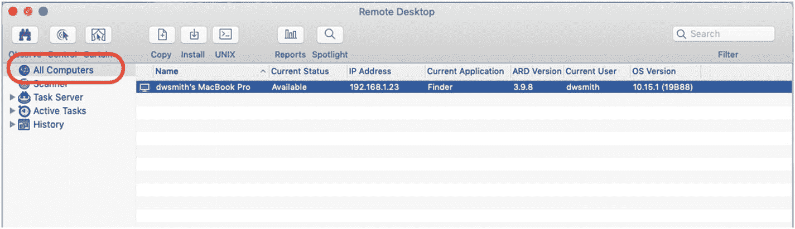

图 6-10

包含我们添加的测试 Mac 的“所有计算机”列表。“当前状态”列应显示为“可用”

**专业提示**

Apple 远程桌面使用 `虚拟网络计算` 与客户端通信。除了 macOS，你还可以在基于 Windows 或 Linux 的系统上安装 VNC 客户端，并使用远程桌面来观察和控制这些操作系统。

在你的服务器上仍打开 ARD 控制台，回到测试客户端，点击 `额外菜单项` 区域中的 `远程管理` 图标，如图 6-11 所示。你应该能看到 `向管理员发送消息…` 选项。如果用户需要对其计算机进行一些快速的远程协助，他们可以将其作为一种 `服务台` 来使用。这将打开一个聊天会话，并向运行 Apple 远程桌面的计算机发送通知，以提醒可用的技术人员。

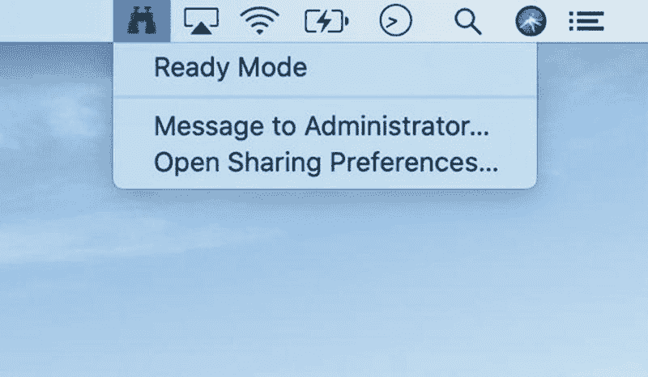

图 6-11

远程管理菜单项

## 在 ARD 控制台中组织客户端

控制台中只有一台 Mac 时，仅使用 `所有计算机` 分组可能没问题。但是，你可能在 ARD 控制台中有 `数十台` 甚至 `数百台` Mac，你会希望它们有一定的组织方式，以便轻松找到并有效管理它们。

让我们用一些 `组` 和 `列表` 来进行组织。使用 `添加组/列表 + 按钮`，创建两个 `组`，一个名为 `开发`，另一个名为 `生产`。然后创建两个 `列表`，一个叫 `测试 Mac`，另一个叫 `服务器`。使用 `拖放` 操作，将 `服务器` 列表移动到 `生产` 文件夹中，并将 `测试 Mac` 列表移动到 `开发` 文件夹中。最后，将测试 Mac `拖放` 到 `测试 Mac 列表` 中，如图 6-12 所示，我操作的是 `dwsmith’s MacBook Pro`。完成后，你的控制台应该与我的类似，包含计算机、列表和组。

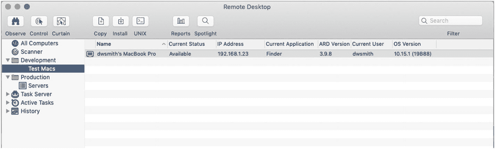

图 6-12

你的控制台应与此类似，包含嵌套的列表和组

你可以使用 `列表` 和 `组` 以任何对你有意义的配置手动组织控制台。你还可以创建 `智能列表`，其中包含为各种任务动态分配的计算机。一台计算机可以属于多个列表，包括多个智能列表。要创建智能列表，请点击 `添加组/列表 + 按钮` 并选择 `新建智能列表`。你将看到一个类似图 6-13 的工作表。

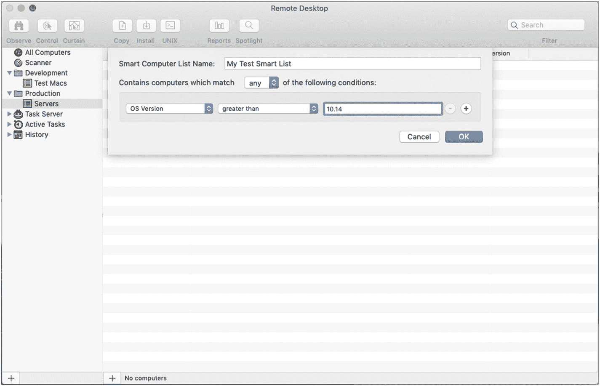

图 6-13

创建智能列表，输入特定搜索条件，该列表将自动填充符合这些条件的 Mac 电脑

你可以使用任何你想要的搜索条件来创建自定义搜索。例如，你可以按 `macOS 版本` 设置一个智能列表，以便针对运行 Mojave 的计算机执行任务，同时排除运行 Catalina 的计算机。点击 `确定` 按钮创建智能列表，然后点击它以查看内容。每次使用智能列表时，它都会根据你配置的查询条件对 `所有计算机` 清单进行筛选，并将匹配的系统填充到列表中。

## Mac 远程支持

顾名思义，Apple 远程桌面提供了一套强大的工具集来远程控制 Mac。远程控制 Mac 客户端时主要有三种选项：`观察` 模式、`幕帘` 模式和 `控制` 模式。你可以在主 ARD 控制台窗口中启动这三种选项。选择一台计算机，然后点击工具栏上的 `观察`、`控制` 或 `幕帘` 按钮，即可打开远程控制窗口，如图 6-14 所示。

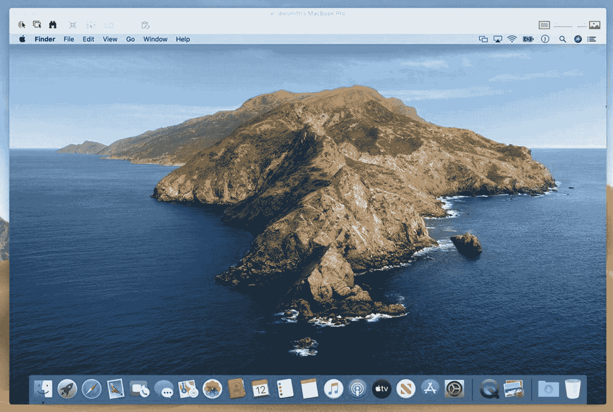

图 6-14

连接到另一台 Mac 客户端时的远程控制窗口

当你使用远程控制窗口远程管理系统时，你会注意到工具栏中有几个选项。你可以在观察、幕帘和控制模式之间切换。例如，这允许你先作为观察者，然后切换到幕帘模式以安全地执行某些操作。

你可以 `截取` 远程屏幕的 `屏幕截图`，并将其作为文件保存到你的计算机上，或者在远程计算机和运行 ARD 控制台的工作站之间 `复制和粘贴`。最后，如果高分辨率图像有延迟，你可以在网络连接较慢时，使用窗口右上角的 `滑块` 调整图像质量以提高性能。


### 观察模式

观察模式是最简单的远程模式。你可以在不与被控计算机进行任何交互的情况下查看一个或多个系统。这在您与最终用户交谈并希望观察他们的 Mac，让他们展示遇到的问题以便您更好地进行故障排除时非常有用。这个功能也常用于教室或计算机实验室，实验室管理员或讲师希望在作业或测试期间关注课堂上学生使用计算机的情况。

### 控制模式

默认情况下，使用 ARD 控制台选择远程控制另一台 Mac 时，你将处于*共享*控制模式。在此模式下，你的最终用户可以继续控制他们的系统，而你作为远程管理员与他们共享控制权。这可能会导致鼠标和键盘的“争夺”，因此，如果你需要完全控制系统并锁定用户，使其无法控制自己的系统，可以点击另一个控制按钮切换到*绝对*控制模式，如图[6-15]所示。

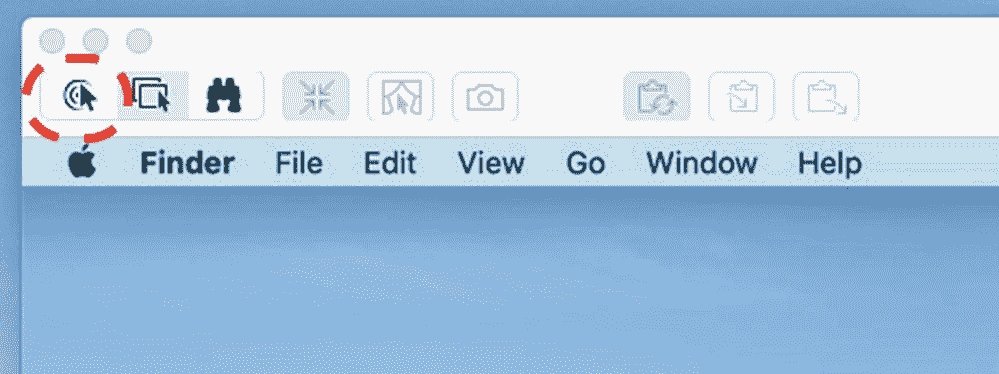

图 6-15

绝对控制按钮

### 幕帘模式

幕帘模式是第三种远程控制形式，类似于绝对控制和共享控制模式，作为远程管理员，你可以控制用户的桌面。然而，幕帘模式的主要区别在于它会遮蔽远程屏幕，使最终用户看不到你的操作。这在需要使用任何安全程序解决问题，且不想向用户披露具体操作时非常有用。例如，映射一个安全的网络驱动器并浏览你不想让用户看到的敏感数据。

**专业提示**

当使用**幕帘**模式时，ARD 会提示你在接管用户屏幕时输入一些内容到对话框中，该对话框会显示给最终用户。这有助于告知用户正在他们的系统上进行工作，并显示远程任务何时完成。图[6-16]展示了最终用户在此过程中看到的示例。

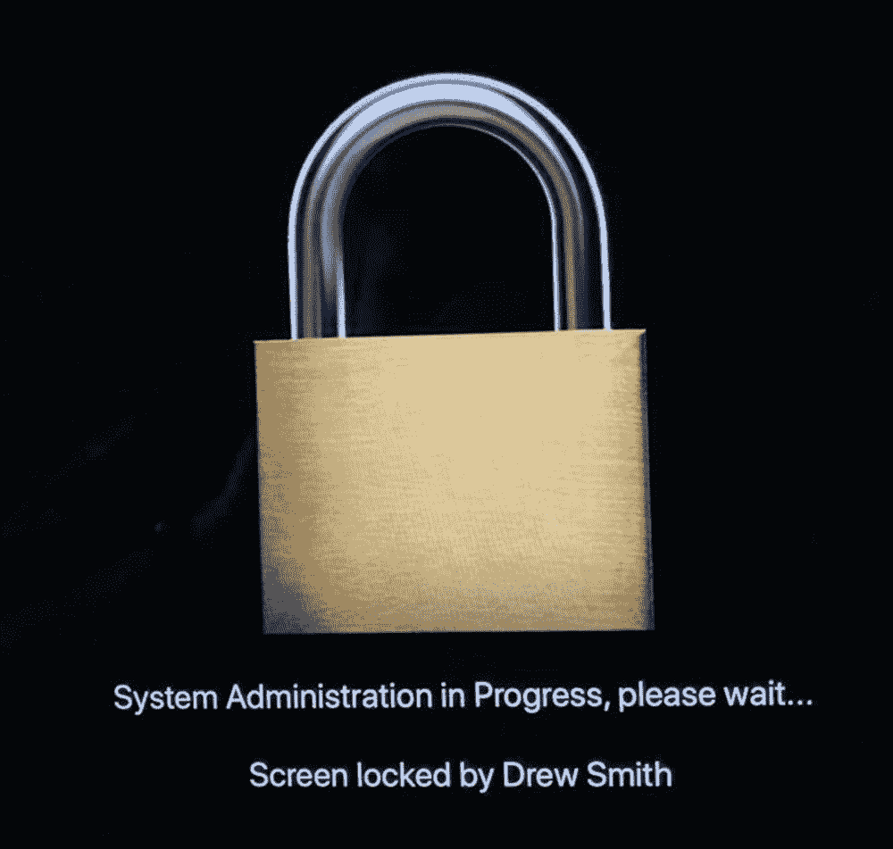

图 6-16

幕帘控制过程中最终用户看到的示例消息

### 聊天

除了远程控制，你还可以使用 ARD 内置的即时消息功能远程与用户聊天。你可以选择想要与之交互的用户所在的计算机，然后从**交互**菜单中选择**聊天**来开始聊天会话。这将允许你在帮助用户排查问题时与他们实时来回交谈。

### 锁定屏幕

**交互**菜单下的**锁定**和**解锁屏幕**功能在学校和公共实验室环境中非常有用，在这些环境中可能会发现用户违反了学校的可接受使用策略。例如，如果一名学生做了违反政策的事情并且被远程观察到，你可以锁定他们的屏幕，从而在需要向学校管理层或有关部门报告违规行为时，能够“当场抓获”。屏幕被锁定时，看起来与*幕帘*模式非常相似，除了关闭系统电源外，用户无法进行任何操作。

## 客户端管理

Apple Remote Desktop 还提供了许多远程客户端管理功能，包括电源控制、远程更新特定设置等。大多数远程管理选项可以在**管理**菜单下找到，如图[6-17]所示。

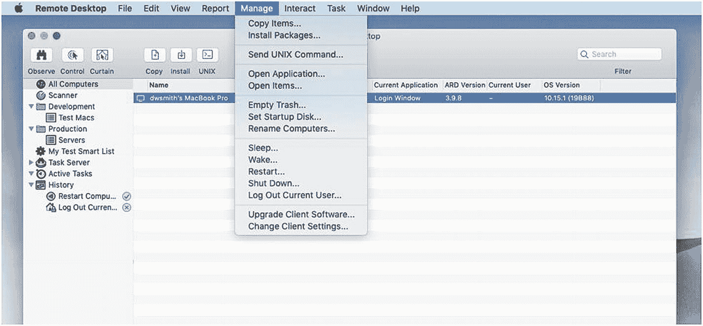

图 6-17

管理菜单提供了大部分远程客户端管理命令

### 电源控制

选择一个或多个远程计算机，然后选择**睡眠...**、**唤醒...**、**重启...**、**关机...**或**注销当前用户...**。这些都是相当直观的。当你选择其中一种电源选项时，会弹出一个任务窗口，你可以选择*立即*执行这些操作之一，或者*在电源任务运行前给最终用户一个警告和保存以及关闭他们当前工作的任何内容的时间*。由于这是一个任务，你可以通过 ARD 控制台窗口左侧的*活动任务*列表来跟踪状态。

### 清倒废纸篓

另一个简单的选项。选择一个或多个计算机，使用此命令清空远程计算机上的废纸篓。

### 设置启动磁盘

当每台新 Mac 都可以使用*NetBoot*和*NetRestore*时，这曾是一个非常实用的工具，但随着配备*T2 安全芯片*的新款 Mac 的发布，其重要性有所降低。如果你的 Mac 仍然支持 NetBoot，这可以是一个很好的功能，用于选择网络启动卷并设置你的远程 Mac 从网络重新启动。

如图[6-18]所示，从**管理**菜单中选择**设置启动磁盘**。当“设置启动磁盘”窗口出现时，点击**自定义**。在这里，你可以输入服务器的 IP 地址和 NetBoot 卷名。这可以强制一台或多台 Mac 从网络启动磁盘重启，以便你可以对内部硬盘进行擦除和恢复。这是旧的*映像部署*工作流，在许多学校和办公环境中仍然很受欢迎。

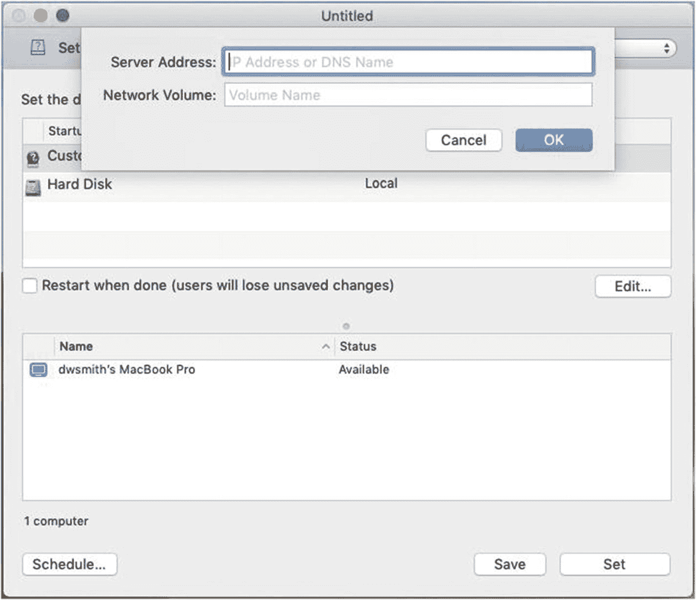

图 6-18

用于识别 NetBoot 服务器和网络卷的设置，以便从局域网启动非 T2 芯片的 Mac

### 更改客户端设置

一旦你的 Apple Remote Desktop 控制台中有数百台 Mac 客户端，你可能希望更改一个或多个管理 ARD 工作方式的设置。即使使用远程控制选项，如果你需要接触组织中的每一台 Mac 并手动打开*共享系统偏好设置*进行更改，那也将非常耗时。

幸运的是，Apple 提供了一个*更改客户端设置助手*，你可以使用它在所有选定的机器上调整这些设置。只需在 ARD 控制台中选择你想要更新的 Mac，然后从**管理**菜单中选择**更改客户端设置**。按照如图[6-19]所示的助手逐步操作并相应地更新设置。它将生成一个任务来更新选定远程系统上的设置。

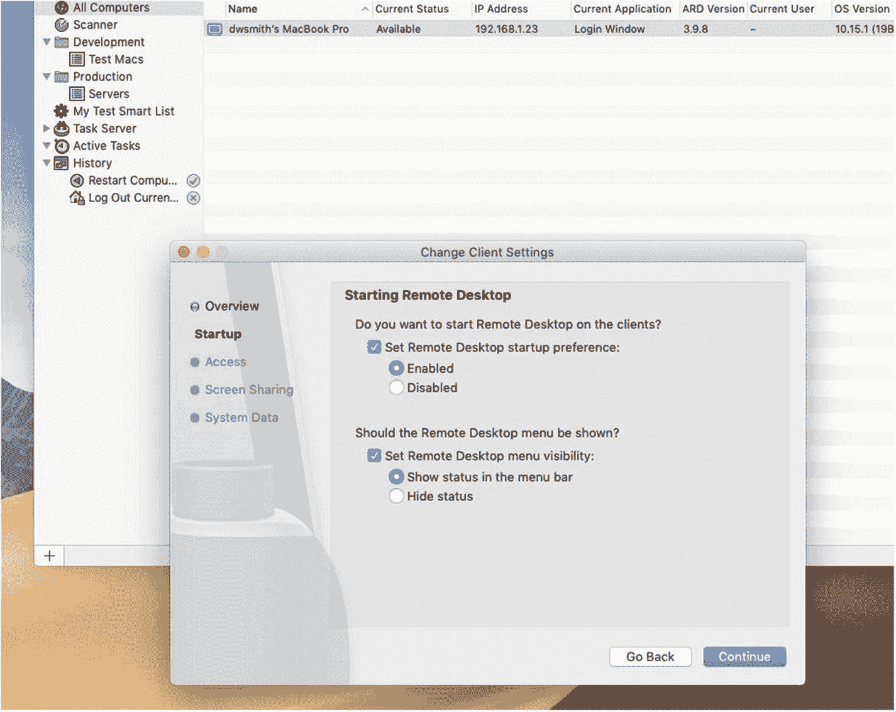

图 6-19

更改客户端设置助手

**专业提示**

在对多台远程机器更新设置之前，你应该至少在物理距离较近的一台机器上进行测试。如果你犯了错误，可以纠正并重试，而不是推送一个导致你失去对所有远程系统控制的设置。作为一般经验法则，在任何任务或大规模更改设置之前，你确实需要先在几台机器上测试，直到一切完美运行为止。


## 资产管理及报告功能

Apple Remote Desktop 利用多种报告功能，可帮助 Mac 系统管理员简化库存管理流程。如图 6-20 所示的 `报告` 菜单提供了多种常见报告的访问入口。您可以尝试这些报告，以找出最适合您特定场景的报告，但在本章中我们将重点介绍三个示例报告。

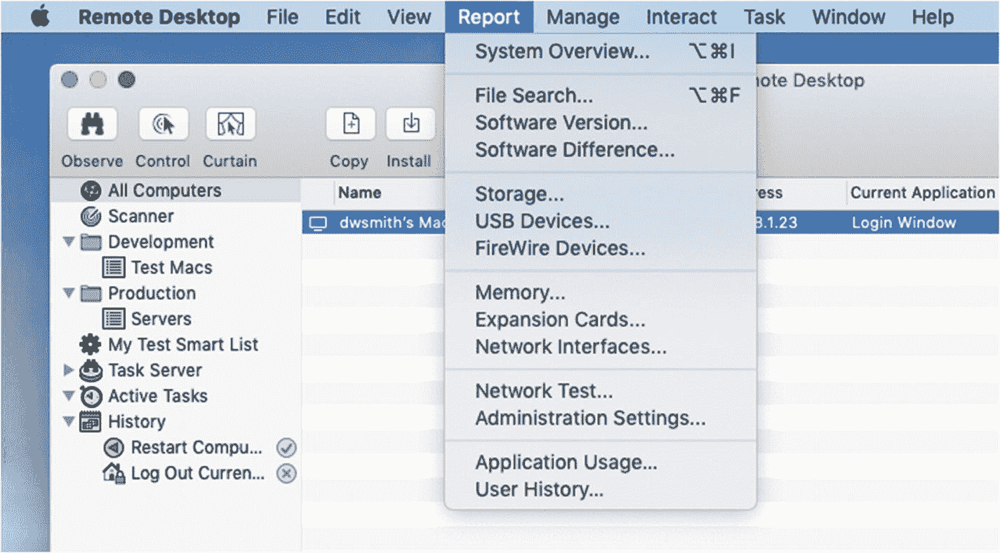
图 6-20 报告菜单显示各种常见报告选项

### 系统概览报告

我们要详细了解的第一个报告是 `系统概览报告`。此报告从选定的客户端 Mac 收集数据，并以报告形式提供，可通过 ARD 交互式查看、打印或导出。在第 1 章中，我们学习了如何使用 `关于本机` 和 `系统报告` 工具来查找特定 Mac 上几乎任何我们想要的信息。使用此系统概览报告，您可以通过让 ARD 轮询网络中的每台机器来获取此信息，从而为网络中的所有 Mac 创建一份自定义报告。图 6-21 显示了默认选项，但您可以根据需要深入每个区域并添加或删除特定的列。

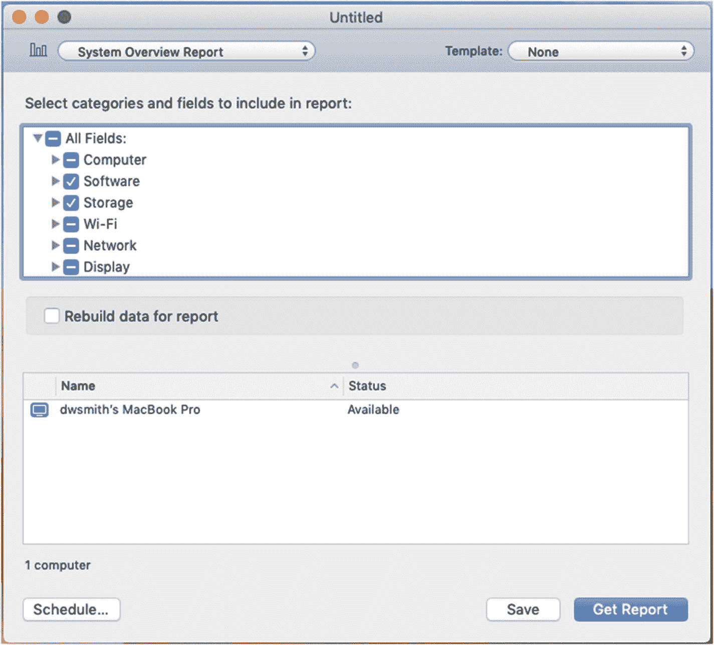
图 6-21 系统概览报告自定义窗口

图 6-22 显示了针对我网络中的一台测试机运行此报告后得到的结果。您可以水平滚动列表，或单击特定标签页以跳转到该信息。您还可以使用报告工具栏中的按钮导出此数据。

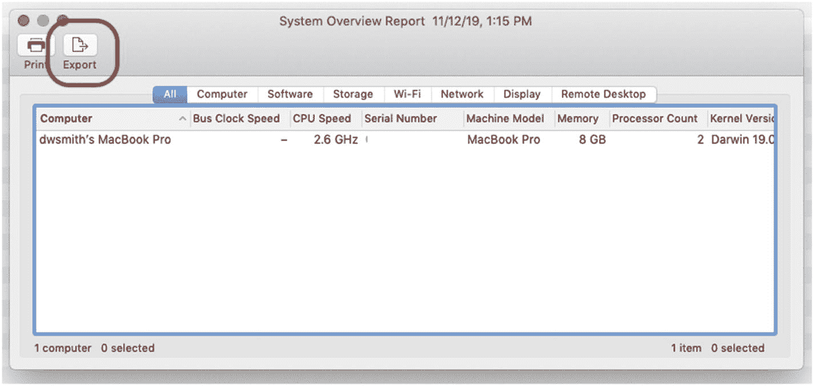
图 6-22 生成的系统概览报告

您可以将该数据导出为 `∗.csv` 文件，如图 6-23 所示，然后将其导入 `Numbers` 或 `Microsoft Excel` 中对数据进行进一步计算。这对于生命周期规划或识别您设备群中需要 RAM、存储或其他升级的机器来说，是一个非常有用的工具。

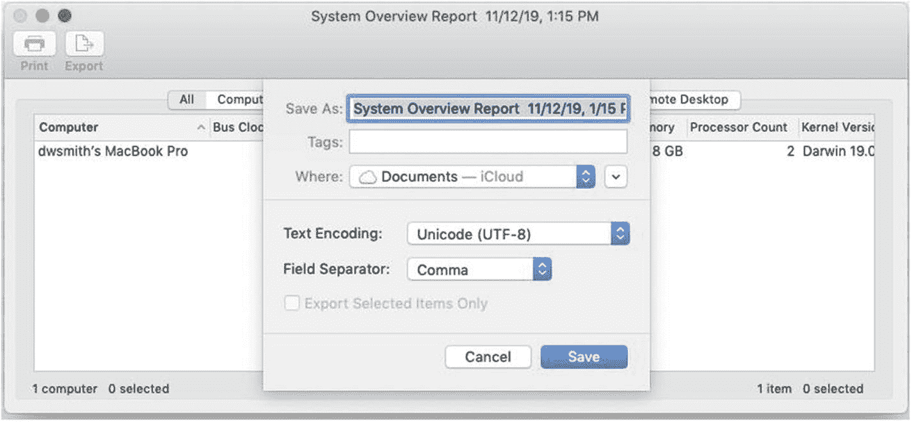
图 6-23 导出数据对话框，包含推荐的 `∗.csv` 设置

**专业提示**

在本章前面，我们在 `共享` 系统偏好设置的远程管理计算机设置选项中，将资产标签信息添加到了计算机的 `信息 1` 字段。如果您查看“远程桌面”标签页，就会看到信息 1、2、3 和 4 的字段。在信息 1 列中是我们输入的资产标签信息。

### 软件版本报告

如果您致力于在所有不同的 Mac 客户端上保持软件版本一致，那么 `软件版本报告` 会特别有帮助。这是标准化基准制定和识别不合规系统的绝佳方式。我通常会在一个我认为是基准 `参考系统` 的机器上安装一份 Apple Remote Desktop，该系统上已安装了所有标准化软件。这样我就可以将我的参考系统与网络中的所有其他系统进行比较。图 6-24 显示了此报告的配置选项。我可以从列表中选择最多十个应用程序，并与组织中的其他 Mac 进行比较。

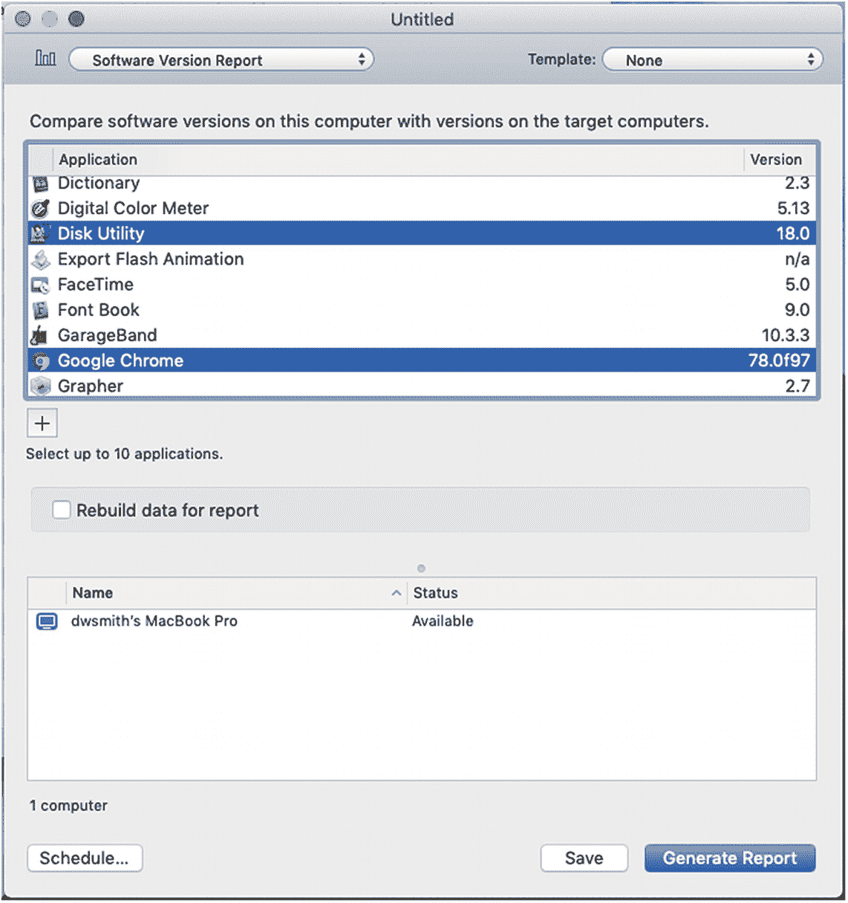
图 6-24 软件版本报告配置窗口

**专业提示**

现在是介绍 `模板` 的好时机。在报告窗口的右上角，如图 6-25 所示，有一个 `模板弹出菜单`。您会在许多与任务相关的配置窗口中看到此模板菜单。假设您想定期检查 `Chrome` 或 `磁盘工具` 的版本。与其每次都去选择这些，您可以 `保存` 一个模板，并可以随时从模板弹出菜单中选择再次运行该报告。

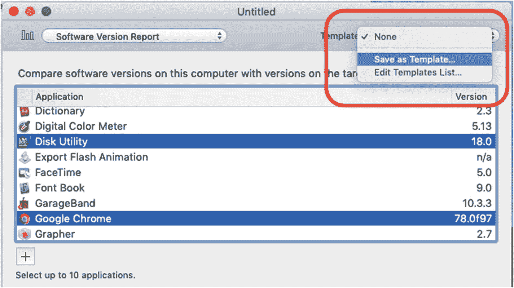
图 6-25 您可以将任何报告或任务保存为模板，以后可以修改，或用于将来多次运行相同报告

如您所见，我选择了 `磁盘工具` 和 `Google Chrome`。我在此示例中选择了这两项，以便您可以看到当参考系统和目标系统之间应用程序版本（磁盘工具）存在差异，以及目标系统上缺少应用程序（Google Chrome）时会发生什么。请看图 6-26。它在目标机器上找到了更新版本的磁盘工具，这是预料之中的，因为我的目标机器运行的是 `Catalina`，而我的参考机器仍在运行 `Mojave`。它还发现目标机器上没有安装 Chrome，因此，如果我的目标是在组织内的每台 Mac 上都安装 Chrome，那么这台目标系统就不合规，我需要安装 Chrome 来解决这个问题。

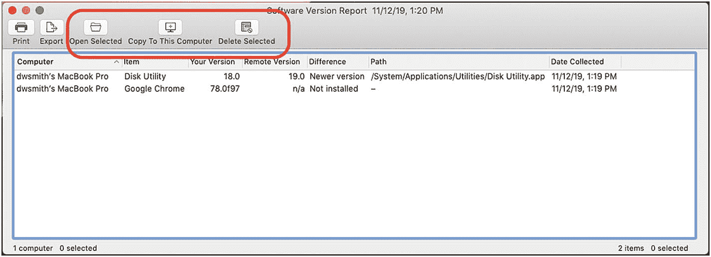
图 6-26 软件版本报告的结果和操作按钮

此报告还有一点使其有些独特。它不仅仅是提供数据给我，在报告工具栏中还有三个我可以交互操作这些数据的按钮。我可以选择新版本的磁盘工具并点击 `打开所选项目` 按钮，这将导致远程机器上启动磁盘工具。

我可以点击 `复制到此计算机` 按钮，它会将该新版本的磁盘工具复制到我当前运行 ARD 的工作站上。由于磁盘工具是一个自包含的应用程序包，如果我的主机操作系统支持，我可以在我的 Mac 上运行它，或将其安装到我的 `/Applications/Utilities` 文件夹中。如果您使用此报告来识别您不希望出现在网络上的应用程序（例如点对点文件共享应用程序），您也可以从列表中选择该应用程序，然后点击 `删除所选项目` 按钮，在远程计算机上将其删除/卸载。


## 应用使用情况

我们要查看的最后一份报告是应用使用报告。该报告允许你选择一台或多台 Mac 并输入一个日期范围，如图 6-27 所示。之后，它会轮询所选计算机上所有已被使用的应用程序，并返回这些应用程序的使用日期、时间以及使用用户。图 6-28 展示了该报告的一个示例。

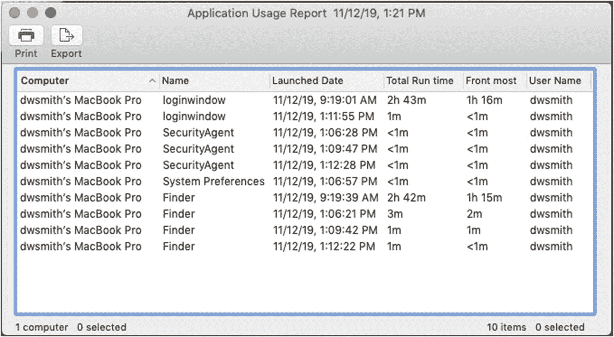

**Figure 6-28** 来自测试系统的应用使用报告数据

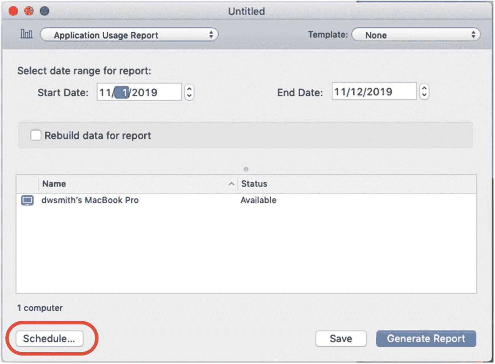

**Figure 6-27** 应用使用报告配置窗口

如果你按席位为应用程序付费，并且不确定是否有人在使用这些应用程序或使用的频率，这份报告将非常有帮助。这类报告可以提供有价值的软件计量信息，用于做出明智的购买和许可证续订决策。

### 专业提示

另一个你会发现很有用的功能是为任务设置未来运行的时间表，甚至设置定期重复。如图 6-27 所示，类似于每个任务窗口中的模板弹出菜单，也有一个`Schedule…`按钮。点击此按钮，你可以设置任务运行的日期/时间，并可以设置为重复执行。这样，如果你正在进行持续的软件使用或合规性监控，可以让报告在夜间或定期运行。

### 软件分发

Apple Remote Desktop 最后，也可能是最有用的一个功能，是作为软件分发的工具。软件分发的目的是为了简化在整个`macOS`客户端群中安装和升级软件的过程。是的，你可以使用 USB 驱动器或网络共享，然后逐台 Mac 安装软件，但这确实非常耗时且容易出错。Apple Remote Desktop 提供了几个功能，用于通过网络向所有`Macintosh`端点批量安装应用程序。

### 应用程序安装程序

macOS 上有三种不同类型的应用程序安装程序。第一种是从`Mac App Store`下载或从`∗.dmg`（磁盘映像）中直接拖放到`/Applications`目录即可安装的*沙盒化*或*自包含应用程序*（App）。`VLC Media Player`就是这样的一个应用程序示例，可在 [`www.videolan.org`](http://www.videolan.org) 获取，如图 6-29 所示。你可以看到，要安装这类应用程序，只需将`VLC`图标拖到`/Applications`文件夹的别名中即可完成安装。

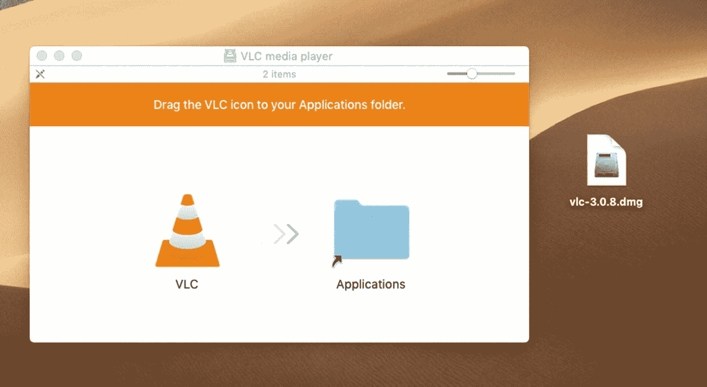

**Figure 6-29** VLC 是自包含应用程序的一个例子

第二种安装程序是*应用程序安装包*或`∗.pkg`文件。这些非常常见，并使用苹果的 macOS `Installer`辅助应用程序进行部署。当需要在硬盘的各个区域安装支持文件，并且这些文件并非都包含在单个文件夹或 App 包中时，就会使用这种方式。我发现它们最常用于支持硬件外设（如 USB 绘图板）的应用程序。

图 6-30 展示了一个可在 [`www.wacom.com`](http://www.wacom.com) 找到的`Wacom`数位板驱动程序包安装程序。我不再将`Install Wacom Tablet.pkg`文件拖放到`/Applications`文件夹中，而是需要`double-click`该文件并按照`installer`提示进行操作，将应用程序及其支持文件安装到`Macintosh HD`卷上的正确位置。

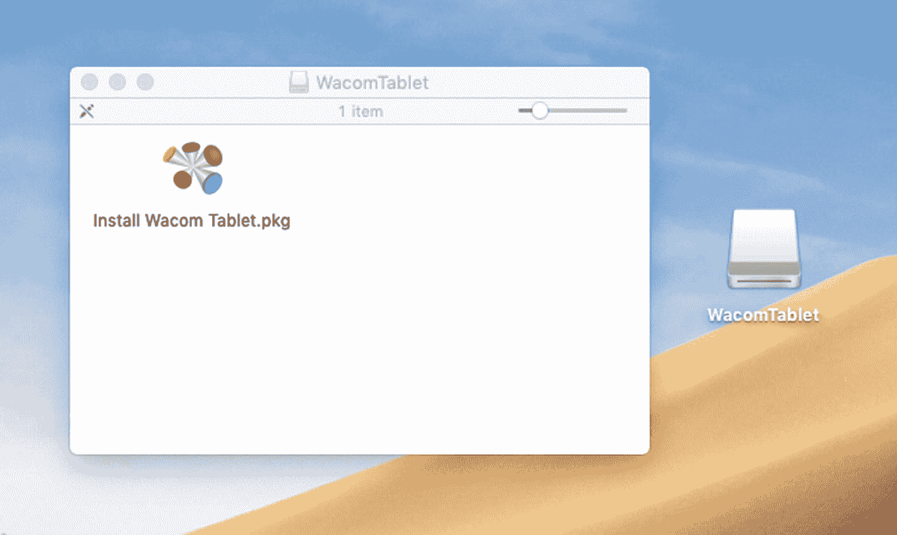

**Figure 6-30** 安装程序包示例

最后，第三种安装程序类型与`∗.pkg`文件非常相似，工作方式也类似，但使用的是商业界面或其他类型的前端小程序来安装应用程序，而不是苹果的 macOS `Installer`辅助程序。最明显的例子是`Adobe Flash Player`安装程序，可在 [`www.adobe.com/downloads`](http://www.adobe.com/downloads) 获取。从图 6-31 可以看出，如果我使用`Get Info`查看此安装程序的文件类型，它会告诉我这是一个`Application`。安装过程与`∗.pkg`类似，只是它启动的是 Adobe 创建的自定义安装程序应用程序，引导我完成安装过程。

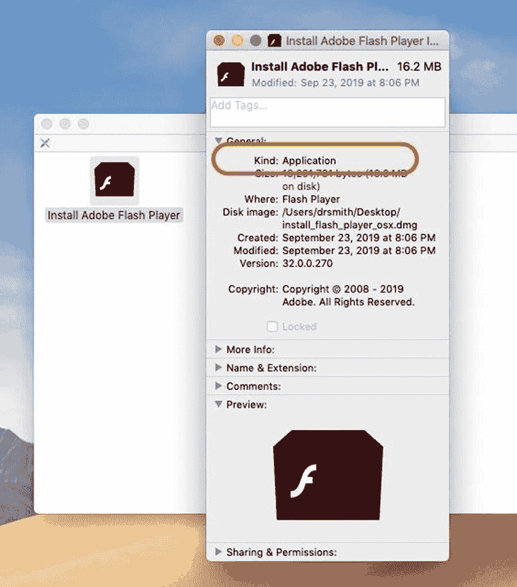

**Figure 6-31** Install Adobe Flash Player 是一个应用程序，而不是一个包

### 专业提示

有时这些应用程序包中仍然隐藏着`∗.pkg`文件，例如`Install Adobe Flash Player`。检查一下，`right-click` `Install Adobe Flash Player`应用程序，然后选择`Show Package Contents`。浏览到`/Contents/Resources/`看看——`Adobe Flash Player.pkg`就在那里。这并不意味着你总是可以运行那个`∗.pkg`文件，应用程序就能正确安装，因为商业安装程序除了这个单独的包之外可能还使用了其他依赖项。

你可能已经猜到，对于这些不同的安装程序类型，我们需要采取略有不同的软件部署策略。

### 复制项目

最直接的方法是使用`Copy Items`选项，它最适合用于像`VLC Media Player`这样的自包含应用程序包。要在一台或多台 Mac 上安装此应用程序，请打开 Apple Remote Desktop，并从你的计算机列表中选择目标计算机。点击工具栏中的`Copy`按钮，你将看到如图 6-32 所示的“复制项目”窗口。

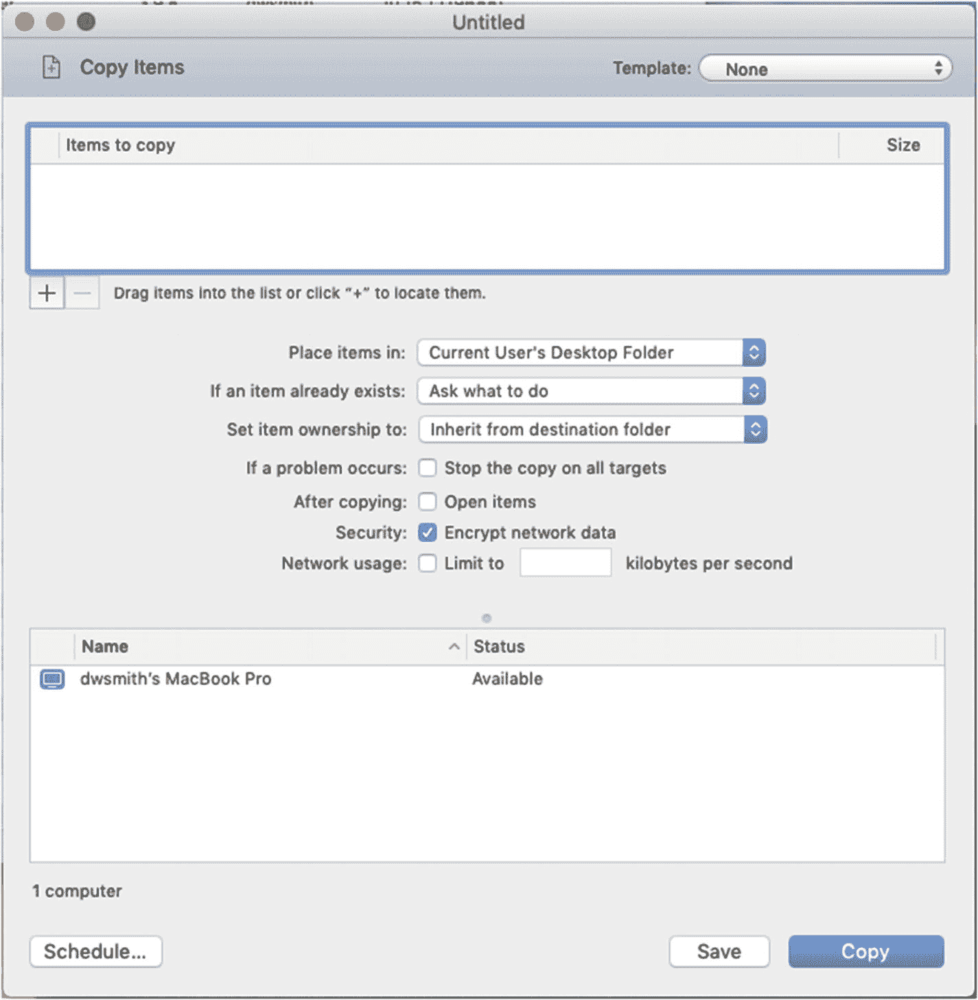

**Figure 6-32** “复制项目”配置窗口

将`VLC`应用程序从磁盘映像中`Drag`并`drop`到`Items to copy`字段中。从`Place items in:`弹出菜单中选择`Applications Folder`。如图 6-33 所示完成文件复制设置后，点击`Copy`按钮开始任务。

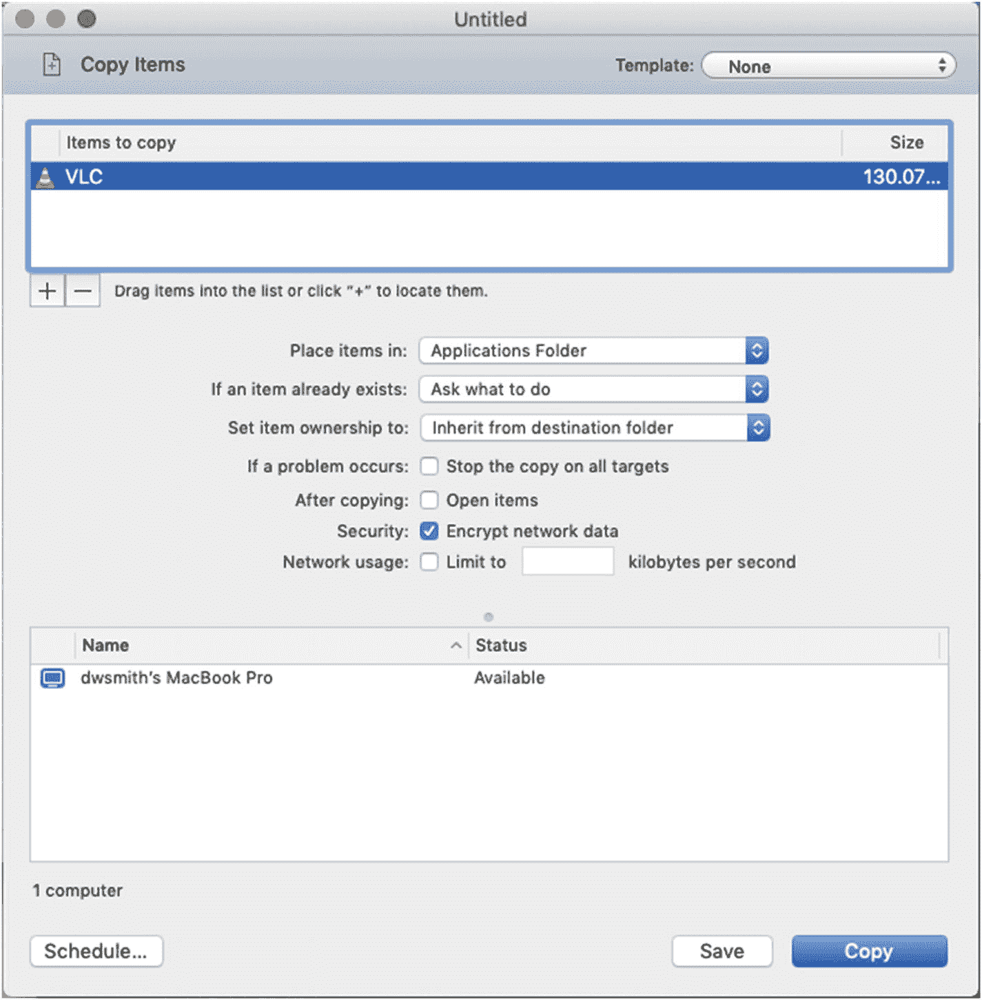

**Figure 6-33** 将 VLC 复制到目标计算机应用程序文件夹的“复制项目”配置窗口

文件复制将开始，你会看到如图 6-34 所示的进度条。

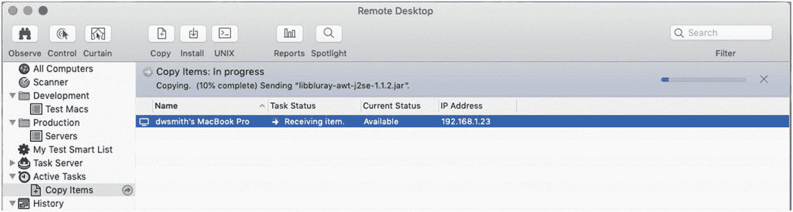

**Figure 6-34** 复制应用程序活动任务的进度

当文件复制成功完成后，转到你的测试机，浏览到`/Applications`，然后`double-click` `VLC`图标来启动应用程序。如果它能像图 6-35 中那样成功启动，那么你的应用程序安装就成功了。

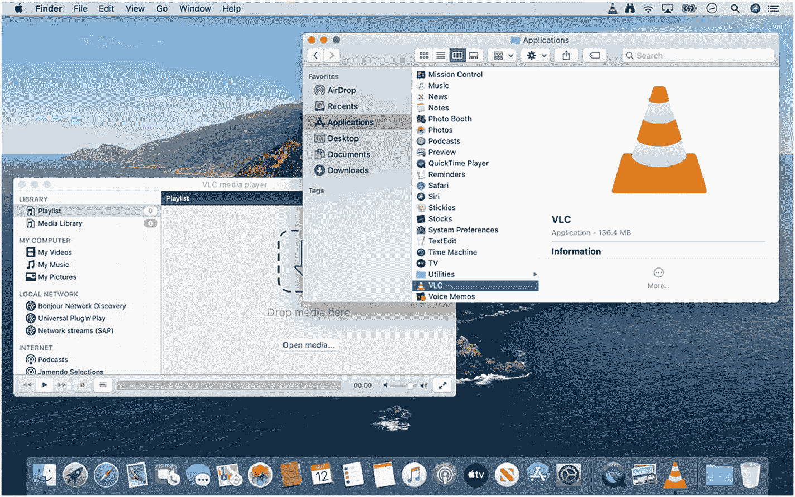

**Figure 6-35** VLC 应用程序成功安装到目标计算机上


#### 安装软件包

安装软件包基本上和复制文件一样简单。在 ARD 控制台中选择您要安装软件包的计算机，然后点击工具栏中的 `安装` 按钮。将 `*.pkg` 或 `*.mpkg` 文件拖放到窗口中，并如图 6-36 所示进行相应设置。准备就绪后，点击 `安装` 按钮，任务即会开始。完成后，请在测试计算机上启动应用程序以验证其是否正常工作。

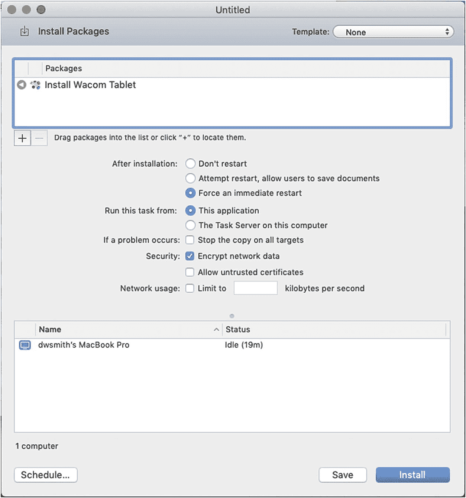

图 6-36

用于安装 Wacom 数位板的"安装软件包"配置窗口

**专业提示**

安装软件包可能需要时间，尤其是在网络环境下，可能产生大量流量。注意到安装配置窗口上的 `计划` 按钮了吗？就像报告任务一样，安装任务也可以安排在未来的日期和时间进行。考虑在非工作时间执行大规模安装，以限制大量网络流量可能对最终用户造成的干扰。

#### 运行 Unix 脚本

最后一个选项可能是最复杂的，但也相当优雅，那就是使用命令行编写脚本来安装特定应用程序。既然我们在上一节以 `Adobe Flash Player` 为例进行了讨论，我便深入研究了其商业安装包，并发现了一些非常有趣的东西。当您对 `Install Adobe Flash Player` 应用程序`右键单击`并选择 `显示包内容` 时，可以浏览到 `/Contents/MacOS/` 目录，那里有一个名为 `Adobe Flash Player Install Manager` 的 Unix 可执行文件，如图 6-37 所示。这很有意思。我想知道这个命令是否有手册。

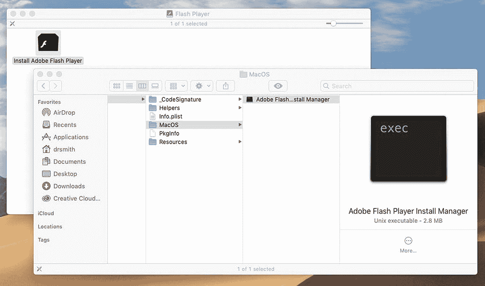

图 6-37

隐藏在 Adobe Flash Player 安装程序应用包中的 Unix 可执行文件

我将打开一个 `终端` 窗口，然后在提示符下输入 `cd` 命令。接着，我会将包含 `Adobe Flash Player Install Manager` Unix 可执行文件的 `MacOS` 文件夹拖放到终端窗口中。这会将我的目录切换到已挂载的磁盘映像卷，特别是 MacOS 文件夹，如图 6-38 所示。

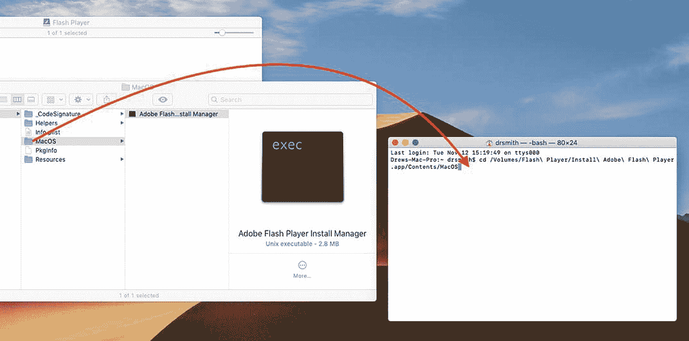

图 6-38

使用 cd 命令结合拖放操作来切换到我们想要前往的目录

现在，您将位于 `终端` 的 `MacOS` 目录中。输入 `ls`，您应该会看到该目录中只有一个文件，那就是 `Adobe Flash Player Install Manager`。接下来，我们看看是否有手册。输入 `man "Adobe Flash Player Install Manager"` 并按回车键。真糟糕。如图 6-39 所示，没有提供关于如何使用 Adobe Flash Player Install Manager 的手册。

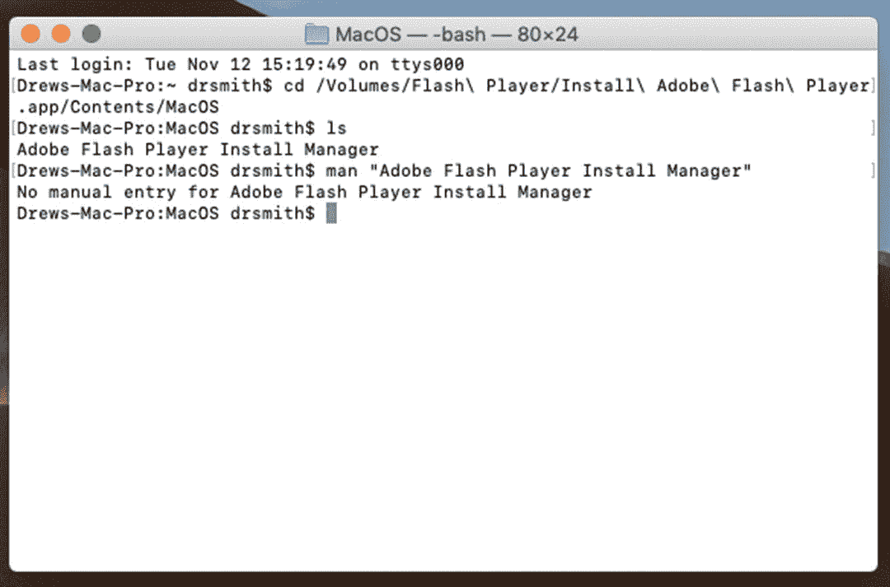

图 6-39

这个 Adobe 命令行工具没有 man 手册页

别担心，让我们用网页浏览器在谷歌搜索类似"Adobe Flash Player silent install for Mac"的内容，看看能找到什么。搜索结果第一条来自 Adobe 网站，上面说我们可以使用带有 `-install` 标志的这个命令来处理静默安装。我们来试试看！我们需要分两步来进行。第一步是将安装程序复制到目标计算机，第二步是通过发送这个 Unix 命令来实际执行安装。

打开 Apple Remote Desktop，在 `所有计算机` 组中找到我们的测试计算机。点击选择它，然后点击工具栏中的 `复制` 按钮。从磁盘映像中将 `Install Adobe Flash Player` 应用程序拖放到 `要复制的项目` 区域。这次，当询问要将项目放置在哪里时，点击按钮并选择 `指定完整路径；`，在出现的对话框中输入 `/tmp`，如图 6-40 所示。如果您的"复制项目"窗口看起来和我的类似，请点击 `复制` 按钮将此安装程序复制到远程 Mac 的临时目录中。

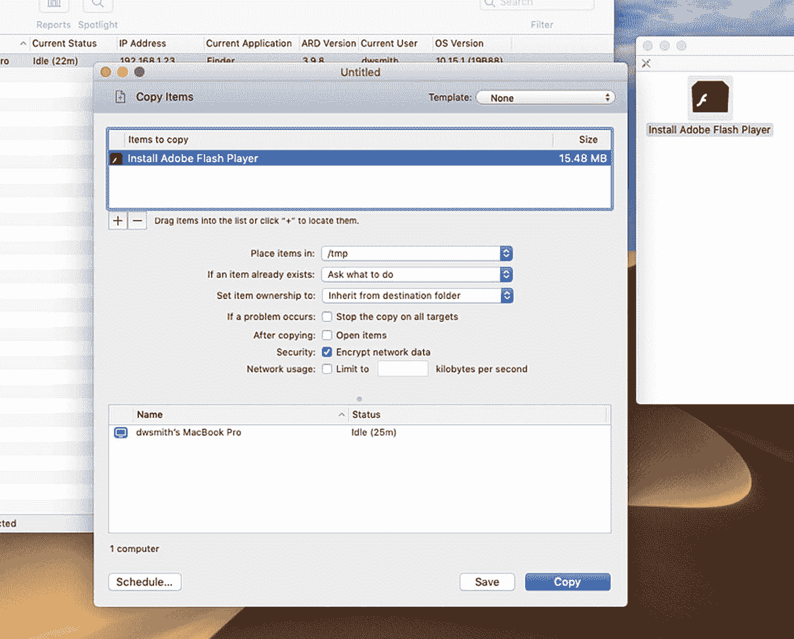

图 6-40

将 Flash Player 安装程序复制到远程测试 Mac 的 /tmp 目录的"复制项目"配置窗口

文件复制完成后，您可以到测试 Mac 上验证它是否存在：点击 `前往` 菜单 ➤ `前往文件夹`，然后输入 `/tmp`。您应该会在临时文件夹的根目录下看到 `Install Adobe Flash Player` 应用程序，如图 6-41 所示。该过程的第一部分现已完成。我们现在有了一种将 Adobe Flash Player 安装程序应用程序复制到 Mac 临时文件夹的方法。


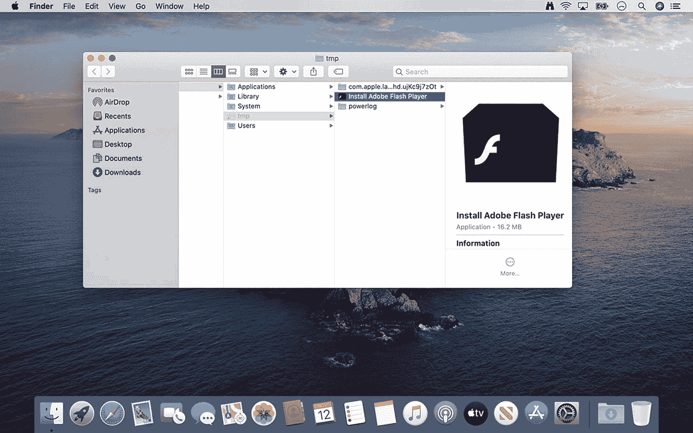

图 6-41

我们已复制到`/tmp`目录中的"安装 Adobe Flash Player"应用程序

接下来，我们需要编写 Unix 安装脚本。在 Mac 上交互式地完成此操作并进行测试是最简单的方法。我将使用我的一台测试 Mac 来完成这个任务。我将从测试 Mac 的`/Applications/Utilities`文件夹中打开`终端`应用程序。由于我已经将安装程序复制到了`/tmp`文件夹，我将再次在此安装程序上选择`显示包内容`，浏览到`/Contents/MacOS/`，然后将`Adobe Flash Player Install Manager` Unix 命令拖放到我的终端命令提示符处，如图 6-42 所示。

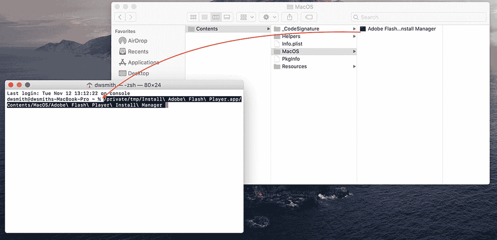

图 6-42

将 Unix 命令拖放到终端窗口作为快捷方式，避免写出完整路径

接下来，根据 Adobe 网站的说明，我们将在命令末尾添加一个`-install`标志。我的完整命令将如图 6-43 所示。

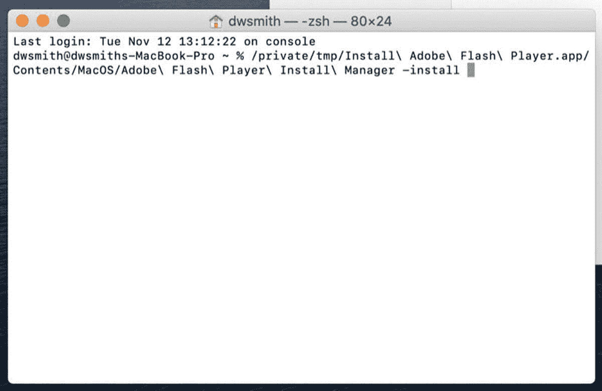

图 6-43

您的终端窗口应看起来类似

如果您交互式地运行此命令，它将提示您输入管理员密码。输入密码后，脚本将运行，您将收到一条消息：`Install succeeded with exit code: 0`。这表示安装已完成。浏览到`/Applications/Utilities`，您会发现那里也有一个`Adobe Flash Player Install Manager`的副本，并且为您的浏览器安装了`Adobe Flash Player 插件`。

很好，现在我们知道需要运行什么命令了。我们只需要在 ARD 中编写脚本，以便可以在多台机器上同时为多台系统安装 Flash Player。让我们回到 Apple Remote Desktop 系统，选择另一台测试系统。使用`复制`命令，将 Adobe Flash Player 安装程序应用程序复制到`/tmp`，以便安装程序位于目标机器上。

接下来，在 ARD 控制台中选择该机器，并点击工具栏上的`Unix`按钮。在出现的窗口中，输入我们在测试时开发的以下命令：

```
/private/tmp/Install\ Adobe\ Flash\ Player.app/Contents/MacOS/Adobe\ Flash\ Player\ Install\ Manager -install
```

将其设置为以`用户： root`身份运行。当您的"发送 Unix 命令"窗口看起来与图 6-44 中的一致时，点击`发送`按钮在远程计算机上执行该命令。

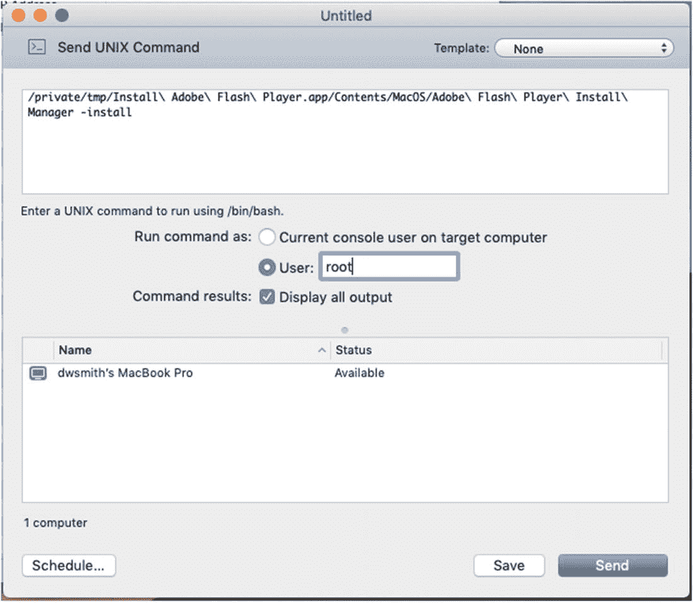

图 6-44

包含我们脚本的"发送 Unix 命令"窗口

该命令将在远程计算机上运行，安装 Adobe Flash Player，然后您会收到一个对话框，如图 6-45 所示，显示它已成功完成。您可以远程登录到那台测试计算机，验证 Flash Player 是否已安装并按预期工作。

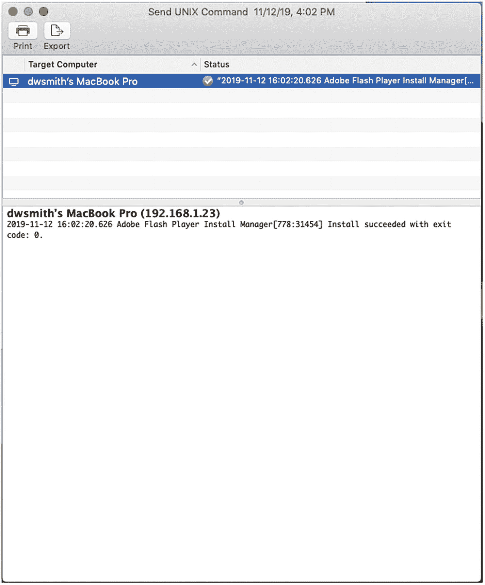

图 6-45

"发送 Unix 命令"任务的输出

正如您所看到的，这绝对是一个复杂的过程，前期需要大量额外工作。然而，如果您有成千上万台 Mac 需要每隔几周更新一次 Adobe Flash，拥有这个 Unix 命令将节省大量时间。既然它已经测试成功，您可以将该脚本保存为名为`“安装 Adobe Flash Player”`的模板，并反复使用。当有新版本的 Flash Player 发布时，只需验证`包内容`以确保命令行实用程序的路径没有改变（截至本文撰写时，许多版本中该路径一直未变）。将新的安装程序`复制`到您网络上所有计算机的`/tmp`目录中，然后再次运行 Unix 命令进行安装。

### 专业提示

为什么我们要将安装程序复制到`/tmp`？`tmp`文件夹是复制这些文件的好地方，这样我们就不必担心事后清理。我们可以在脚本末尾使用`rm`命令来删除安装程序，但我们也可以让操作系统在一两次重启后替我们清理。

## 总结

在本章中，您了解了 Apple Remote Desktop 以及它提供的关键远程控制、库存管理、软件交付和管理功能。在本书的其余部分，处理`macOS`客户端（和服务器）时，我们将继续使用 ARD。它是一个有用的工具，在拥有少量 Mac 的组织中，它可能是您唯一需要的工具。说到 Mac 服务器，在下一章中，我们将深入探讨`macOS Server`，以及您为什么可能需要（或甚至不需要）一台。

