# 7. macOS Server

自 1990 年代末该软件的第一个版本问世以来，Mac 服务器的概念已经发生了巨大变化。在本章中，我们将探讨 Apple 在`macOS`客户端操作系统中内置的服务器功能、安装`macOS Server`应用程序时添加的服务、如何确定您是否需要一台专用的 Mac 服务器，以及如果需要，如何配置和管理该服务器。

## macOS Server 简史

最初的 Mac OS Server 代号为"Rhapsody"，它最初被设计为苹果公司在 1996 年收购 NeXT 后开始开发的新一代 Mac 操作系统的第一个版本。`Mac OS X`是最终在 2000 年代初发布的客户端操作系统，与此同时，苹果开始销售`OS X Server`作为一个在客户端操作系统之上运行的应用程序，为其提供服务器级功能。多年来，`Server`应用程序的功能已被缩减或迁移到`macOS`的基本功能集中。如今，只有少数服务仍然专属于`macOS Server`。

### 服务

最初亮相时，`OS X Server`提供了许多用于管理 Mac 客户端的有用功能。苹果包括了其自己的轻量级目录访问协议(LDAP)，称为`Open Directory (OD)`，旨在管理用户和组，类似于微软（更流行）的`Active Directory (AD)`。除了 LDAP，它还包括文件共享、打印机共享和基于`Apache`的 Web 服务器。作为 Mac 系统管理员的热门解决方案，OS X Server 还包括用于管理 Mac 机群的`NetBoot`和`Workgroup Manager`。

除了各种管理工具外，`OS X Server`还提供`CalDAV`、即时消息、邮件服务器和许多其他与生产力相关的服务。然而，随着更多此类解决方案开始迁移到各种云托管模型，苹果将其中的大多数转移到了 iCloud，或者决定完全停止这些服务。

随着苹果开始更多地转向针对 iOS 设备（以及后来的 Mac）采用移动优先的管理原则，他们开始将`macOS Server`转变为移动设备管理工具。许多核心"服务器"服务被移入了`macOS`的基础安装中。如今，`macOS Server`保留了`Open Directory` LDAP 服务，并且`Workgroup Manager`已被弃用，取而代之的是`Profile Manager`，它允许您为`iOS`和`macOS`客户端创建和部署配置描述文件。

## 硬件

苹果服务器硬件多年来也发生了巨大变化。最初运行`OS X Server`的硬件包括`Power Mac G3`和`Power Mac G4`工作站。苹果曾一度非常重视专用服务器硬件，并发布了`Xserve`和`Xserve RAID`产品，但最终还是停产了这些型号，转而支持`Mac Pro`工作站。随着对专用服务器操作系统需求的减弱，苹果继续开发和制造专用服务器硬件已不再具有意义。

## macOS Server 简介

在本章中，我们将探讨服务器操作系统最常见的功能，以及如何配置`macOS`或`macOS Server`来实现这些目的。其中一些功能在客户端操作系统的标准安装中即可用，而其他功能则需要您购买并安装`macOS Server`应用程序后才能使用。

### 我需要一台 Mac 服务器吗？

在我们开始构建 Mac 服务器之前，首先考虑使用场景以及是否真的需要一台专用的 Mac 服务器。随着苹果移除了 Mac 服务器提供的许多服务，他们也努力在`macOS`中构建了更多跨平台工具，使其能够作为客户端完全融入其他常见网络，特别是基于 Microsoft 和 Linux 技术构建的网络。很有可能，您的组织已经拥有某种 LDAP、打印机共享和文件共享解决方案，您可以非常轻松地在`macOS`客户端上使用它们。

如果您是一位经验丰富的 Mac 系统管理员，您可能熟悉`黄金三角`这个术语。这指的是您使用运行`Open Directory`的 Mac 服务器与运行 Microsoft `Active Directory`的`Windows`服务器同步，以管理用户账户，然后使用`Workgroup Manager`来设置 Mac 特定的权限或设置。如今，您可以直接将 Mac 绑定到 Active Directory 域，而无需再专门为您的`macOS`端点运行第二个 LDAP。用于限制设备和锁定特定设置的`配置描述文件`取代了`Workgroup Manager`组件。

文件共享在最近的版本中也发生了变化。苹果过去使用他们的`AppleTalk 文件协议`作为`macOS`客户端的首选文件共享技术。如今，`Samba`是默认的文件共享协议，可以与`Windows`和 Linux 客户端无缝协作。这里的要点是，如果您已经在运行各种基于`Windows`或 Linux 的服务器，那么在开始构建 Mac 服务器来创建这些现有文件共享的冗余`仅限 Mac`版本之前，请考虑如何利用这些现有技术与您的`macOS`客户端配合使用。

除了目录服务或文件/打印共享之外，还有许多基于云的解决方案可能更适合您的组织。网站托管是立刻想到的一个例子。几年前，使用 Mac 服务器托管网站非常普遍，而且在许多方面，它是比使用 Microsoft 的`IIS`更优的解决方案。虽然`Apache`在`macOS`中仍然可以作为附加服务使用，但您同样可以轻松地使用众多低成本的云托管解决方案来托管您的网站。

以下是如果您选择部署一台 Mac 服务器，可能希望在上面运行的一些更常见的服务。我们将在本章中详细介绍其中的许多服务：

*   **文件共享：** 从`macOS High Sierra`开始，苹果已将`文件共享服务器`集成到操作系统的标准安装中。您可以通过`共享系统偏好设置`启用此服务。此服务允许您通过网络共享文件和文件夹。
*   **打印机共享：** 从`macOS High Sierra`开始，苹果已将`打印机共享服务器`集成到操作系统的标准安装中。您可以通过`共享系统偏好设置`启用此服务。此服务允许您通过网络共享打印机。
*   **Apple Remote Desktop：** 您可以以完整控制台模式安装 Apple Remote Desktop，或按照本书第 6 章所述将其作为`远程任务服务器`安装。
*   **内容缓存：** 从`macOS High Sierra`开始，苹果已将`内容缓存服务器`集成到操作系统的标准安装中。您可以通过`共享系统偏好设置`启用此服务。此服务会缓存来自`App Store`和其他苹果托管服务（如`软件更新`）的内容副本，以便在多个设备上安装更新或内容时节省带宽。
*   **Web 服务器：** `Apache`已集成到 Mac 操作系统的标准安装中。您可以通过命令行启用它。
*   **Open Directory：** 包含在`macOS Server`应用程序的安装中，`Open Directory`是一个 LDAP，允许您配置基于网络的用户和组。
*   **描述文件管理器：** 一个基本的移动设备管理解决方案，允许为`iOS`和`macOS`客户端创建和分配`配置描述文件`——包含在`macOS Server`应用程序中。
*   **Xsan：** 包含在`macOS Server`应用程序的安装中，用于创建和管理存储区域网络（SAN）解决方案。
*   **DNS：** 从`macOS High Sierra`开始，苹果已从`macOS Server`的安装中移除了 DNS。您可以使用其他各种解决方案，包括`BIND`或`Knot DNS`。
*   **DHCP：** 从`macOS High Sierra`开始，苹果已将`DHCP 服务器`集成到操作系统的标准安装中。您可以通过命令行启用和管理此服务。
*   **NetBoot/NetInstall：** 苹果通过使用 T2 安全芯片以及在`macOS Server`的较新版本中移除这些功能，继续降低了此服务的地位。核心技术在`Mojave`之前的`macOS`版本中仍然可用。如果您计划使用此工作流，我建议您将`DeployStudio`作为一个解决方案来考察（`www.deploystudio.com`）。

那么，您需要一台 Mac 服务器吗？要回答这个问题，视情况而定，但很可能不需要。如果您是一家小型企业，没有任何现有的目录服务，也不需要本地文件/打印服务器，那么部署一台专用的 Mac 服务器可能是有意义的。

如果您是一家拥有大量现有服务器解决方案的大型组织，请尝试将您的 Mac 整合到该生态系统中，而不是构建一个独立的仅限 Mac 的环境。对您来说更容易，对您的最终用户也更好，能够在现有的企业网络中作为一等公民参与。越来越普遍的情况是，想要一台 Mac 服务器的主要原因是运行`描述文件管理器`，除非您的组织已经拥有来自第三方供应商（如`JAMF`、`Mosyle`或`Addigy`）的有效移动设备管理解决方案。

## 部署 Mac 服务器

如果您确定在您的环境中专用 Mac 服务器会很有用，我们就可以开始配置一台 Mac 来充当服务器。

### 硬件考量

根据你计划如何使用 Mac 服务器的不同，你需要为这项工作选择合适的硬件。这通常涉及在 `Mac Pro` 和 `Mac mini` 之间做出选择。在撰写本文时，苹果公司售价低至 800 美元的 `Mac mini` 具备足够的原始性能，能够胜任大多数服务器角色。但其内置存储相对有限，仅为 128 GB SSD 空间。因此，如果你计划用它进行大量的文件共享，则应该考虑购买某种外置雷雳存储解决方案。

为了获得最高级别的性能，新款 2019 年 `Mac Pro` 可以配置惊人的内存容量、内部磁盘空间以及多达 28 个处理器核心！它的价格也可能高达一辆新车的价格，因此请确保你的需求与正确的规格相匹配。大多数组织可以使用某种型号的 `Mac mini` 满足需求。即使你选择定制配置，并将内部磁盘升级到 2 TB SSD，其成本也仅仅是 Mac Pro 的一小部分。

还有一点你需要考虑，特别是如果你计划将 Mac 主要用作 `描述文件管理器` 服务器时，那就是云托管模型。市场上已有几家供应商提供云端 Mac 服务器。最受欢迎的是 `MacStadium`，你可以按月支付较低的费用来访问一台裸机 Mac 服务器。你可以在 [`www.macstadium.com`](http://www.macstadium.com) 探索这些选项。

### 备份

正如我们在第 2 章和第 3 章中所讨论的，你可以选择基于云的备份解决方案，也可以使用 `时间机器` 将你的 Mac 服务器备份到连接的外置磁盘。为你的服务器选择备份解决方案时，唯一的注意事项是它需要备份整个磁盘以及所有连接的存储设备。你应该备份所有用户数据、配置以及运行在 Mac 服务器上的任何应用程序。因此，应避免使用像 `iCloud`、`OneDrive` 或 `Dropbox` 这样的解决方案，因为它们仅同步用户的个人目录，而非整个磁盘。

**专业提示**

如果你打算使用 `时间机器` 驱动器或其他类型的连接存储来备份服务器，请务必制定某种规程，将这些驱动器轮换到安全的异地存储设施中。许多组织都设有数据恢复站点或使用第三方服务来异地存储备份驱动器，以防发生火灾或其他自然灾害。你也应该定期对 `时间机器` 驱动器执行相同的操作。

### 初始配置

至此，你应该已经为你的 Mac 服务器、存储和备份选择了合适的解决方案。接下来我们需要做的是在服务器上安装一个全新的 `macOS Catalina` 副本。因此，请启动进入 `互联网恢复` 模式或使用可启动的 USB 安装程序来启动你的 Mac，使用 `磁盘工具` 对驱动器进行分区和/或格式化，然后安装 `macOS`。

操作系统安装完成后，请按步骤完成 `设置助理`。在电脑上创建一个 `本地管理员` 账户并登录该账户。进入本地管理员用户的桌面后，将墙纸更改为能表明这是服务器的样式。我喜欢使用某种灰色调，不过有些系统管理员喜欢创建自定义的服务器墙纸。你的服务器看起来应该类似于图 7-1 中的样子。

图 7-1
macOS 已安装到我们的服务器上

**专业提示**

我们为什么要关心服务器上的墙纸？我倾向于通过远程控制来管理我的服务器，并且在我的数据中心中以无头方式（不带显示器）运行它们。当我使用屏幕共享窗口时，有助于提醒我当前正在操作哪台系统，并提醒我在会话结束后注销。

接下来，运行 `软件更新` 并为你的 Mac 安装所有可用的补丁和安全更新。这将确保我们运行的是最新的安全修复程序和错误修复。

最后，打开 `节能` 系统偏好设置，将电脑设置为 `永不睡眠`，`取消选中` `尽可能让硬盘进入睡眠` 的复选框，并`选中` `断电后自动重新启动` 的复选框。这些设置将确保你的服务器以最佳性能运行，并可以降低在发生与电源相关的事件后服务器离线的风险。

#### 网络设置

我们首先要做的是为服务器配置名称和静态 IP 地址。使用`共享系统偏好设置`来命名您的服务器。我将我的服务器命名为`MacServer`。如果您有多台现有服务器，可能会有标准化的服务器命名规则可以使用。此配置假设您只是在内部局域网中共享一些数据。

**专业提示**

请仔细检查本地主机名和 Unix 主机名，确保它们一致。如图 7-2 所示，我已经将我的三个服务器名称配置为相匹配。

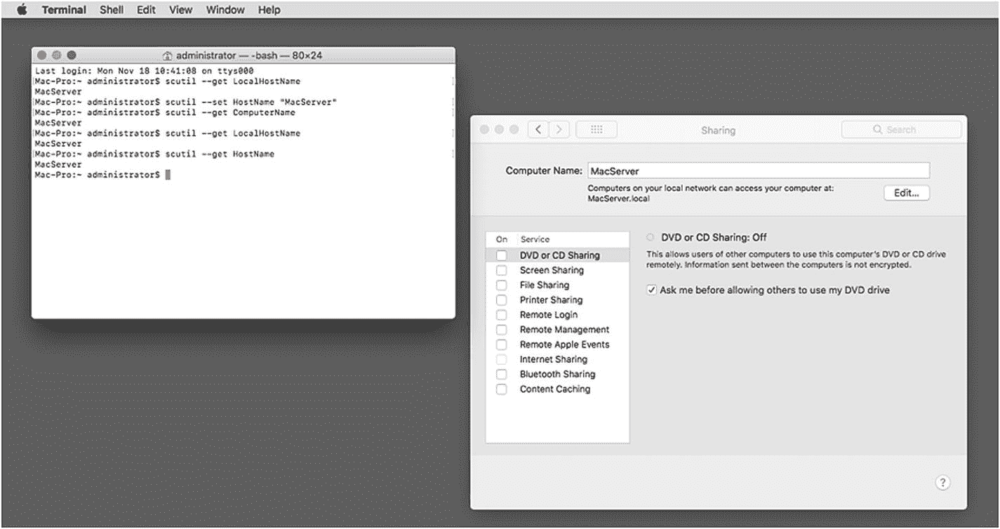

**图 7-2** 使用终端验证主机名

接下来，我们需要为服务器分配静态 IP 地址，以便在使用文件共享等服务时保持地址不变。打开`网络系统偏好设置`，点击活动网络连接（`Wi-Fi`或`以太网`），点击`高级`按钮，然后选择`TCP/IP`选项卡。我们需要设置一个不会与网络中其他计算机冲突的静态 IP 地址。您需要咨询网络管理员，或查看您的 DHCP 或路由器设置，以确定此步骤正确的 IP 地址、子网掩码和网关/路由器。图 7-3 展示了我完整的 IP 地址设置。

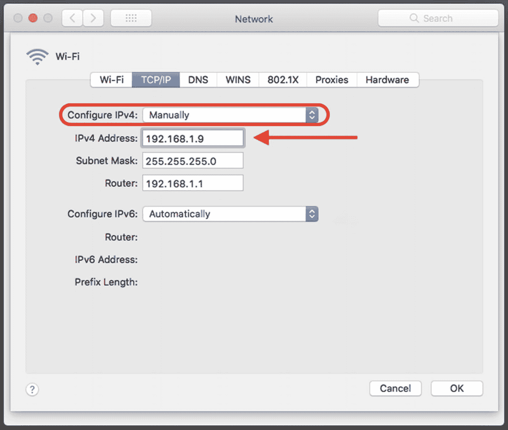

**图 7-3** 为我们的服务器设置静态 IP 地址

**专业提示**

我已经在我的路由器上保留了`192.168.1.2`到`192.168.1.9`这个范围用于静态 IP 地址。我将使用`192.168.1.9`作为`MacServer`的静态 IP 地址。

除了配置静态 IP 地址，我们还需要点击`DNS`选项卡并输入 DNS 服务器信息。在我的网络中，路由器同时也是 DNS 服务器，所以我输入`192.168.1.1`作为 DNS 服务器。您可能也需要咨询网络管理员以确定 DNS 服务器的 IP 地址。图 7-4 展示了我网络的静态 DNS 服务器条目。

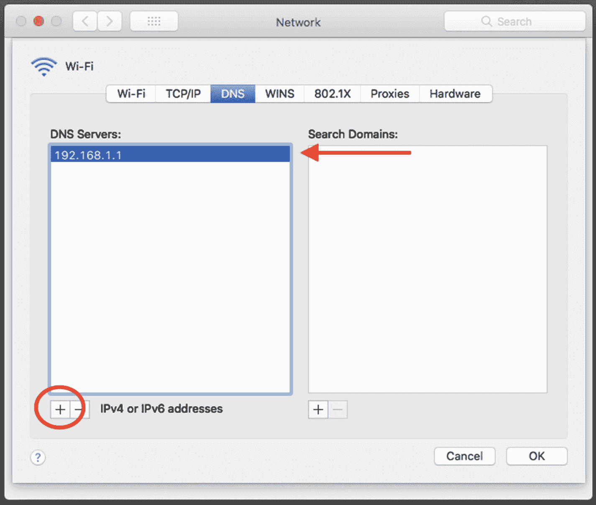

**图 7-4** 添加静态 DNS 服务器

**专业提示**

如果您不确定 DNS 设置，也可以暂时将 Mac 切换回 DHCP，查看 DNS 选项卡中自动填充的信息，然后在改回手动地址选项后，将这些信息复制到静态 DNS 条目中。

设置好 DNS 和静态 IP 地址信息后，打开 Safari 并访问一个网站，如`www.apple.com`，确保能够解析。您应该看到类似图 7-5 的画面，能够成功浏览网页。我建议您使用`网络实用工具`来 ping 各种内部 IP 地址，并尝试从另一台计算机 ping 您的服务器，以确保局域网上的所有通信都正常。

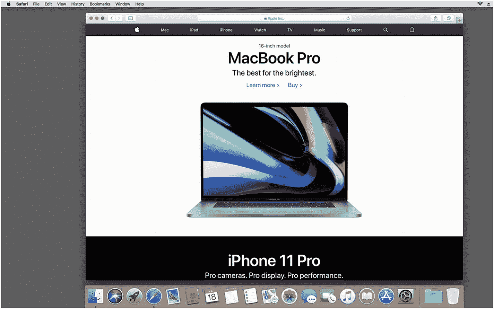

**图 7-5** 浏览网页以确保网络设置正确

**专业提示**

如果您的 Mac 将加入一个更大的网络，例如基于`Windows`的网络，请确保您的 Windows 系统管理员或网络管理员为您的`主机名`创建 DNS 条目，并为 IP 地址创建`反向 DNS`条目。您的客户端应该能够使用`nslookup`或`网络实用工具`中的`Lookup`选项，通过 IP 返回主机名，并通过主机名返回 IP。

#### 配置远程访问

如前所述，我通常运行服务器时不会连接显示器、键盘或鼠标。当需要与服务器交互时，我会使用`屏幕共享`或从我的主工作站进行远程控制。您可以使用 VNC 客户端或另一台 Mac 通过`访达`远程控制服务器，也可以使用 Apple Remote Desktop (`ARD`)。图 7-6 展示了两种不同的配置选项，取决于您是否计划使用 ARD。在`共享系统偏好设置`中，启用`屏幕共享`选项或`远程管理`选项。

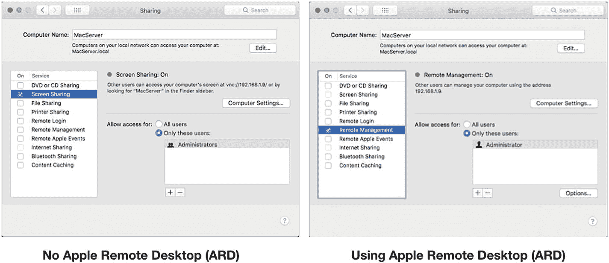

**图 7-6** 在您的 Mac 服务器上启用屏幕共享

**专业提示**

另一个对远程管理有用的服务是`Secure Socket Shell (SSH)`。它在`共享系统偏好设置`中的友好名称是`远程登录`。启用 SSH 有助于通过命令行界面与 Mac 服务器通信。

我计划使用 Apple Remote Desktop，因此我将配置该服务；然后，使用我主 Mac 上的 ARD 应用程序，按照我们在第 6 章中遵循的相同步骤，将`MacServer`计算机添加到我的`服务器计算机列表`中。如果您使用 ARD，在将 MacServer 添加到控制台后，会看到类似图 7-7 的画面。

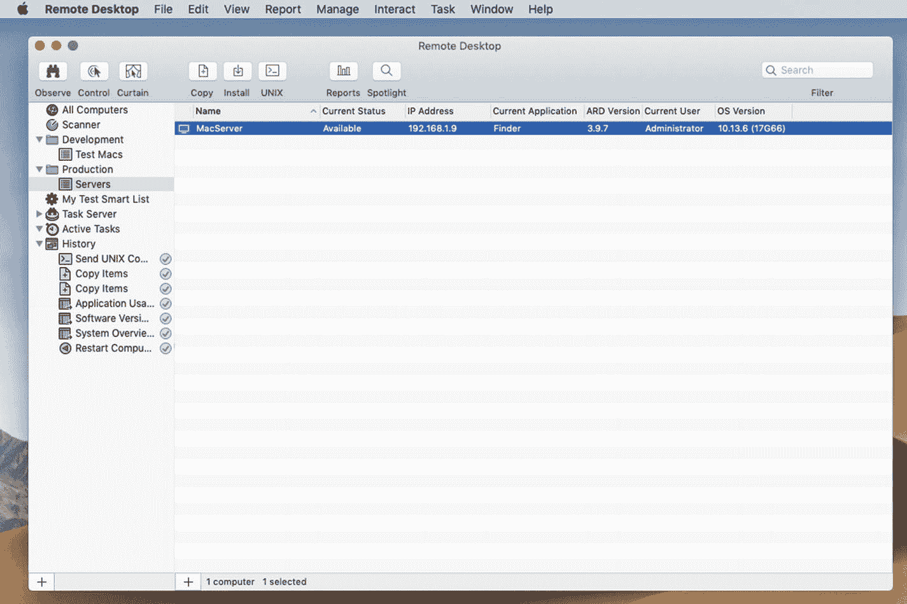

**图 7-7** 将我的服务器添加到 Mac 工作站上的 ARD 控制台

**专业提示**

根据网络的大小和设计，您的网络管理员可能已将网络划分为多个较小的子网。在某些情况下，出于安全原因，服务器会被放置在与客户端系统分离的子网中。如果您的网络属于这种情况，当您使用 ARD 扫描程序搜索服务器时，可能无法找到它。您可能需要使用`按地址添加`选项手动添加计算机。

#### 服务器安全考量

在配置服务器时，确实需要尝试禁用所有不会用到的服务。通过这种方式，你可以限制可能存在的、进而可能被利用的漏洞数量。这并不是一份用于确保服务器安全而必须锁定的详尽清单，但它为你提供了一个起点。没有任何东西能 100% 免受黑客或其他安全威胁。

以下是部署 Mac 服务器时建议考虑的一些更改：

*   **禁用访客用户：** 打开`用户与群组系统偏好设置`，在左侧窗格的用户列表中点击`访客用户`。确保`允许访客登录这台电脑`和`允许访客用户连接共享文件夹`均未勾选。
*   **禁用登录屏幕上的电源控制：** 在`用户与群组系统偏好设置`中，点击`登录选项`按钮。取消勾选`显示睡眠、重新启动和关机按钮`旁边的复选框。
*   **禁用自动登录：** 在`登录选项`中，确保`自动登录`设置为`关闭`。
*   **禁用用户列表：** 在`登录选项`中，选择将登录窗口显示为`名称和密码`。
*   **仅启用软件更新以获取安全补丁：** 打开`软件更新系统偏好设置`并点击`高级…`按钮。是否要自动安装所有更新由您决定，但至少确保勾选`安装系统数据文件和安全更新`框。这样，你的 Mac 服务器将自动获得重要的安全更新补丁。
*   **启用屏幕保护程序密码：** 打开`安全性与隐私系统偏好设置`。点击`通用`标签页，并勾选`睡眠或屏幕保护程序开始后立即要求输入密码`旁边的复选框。将下拉菜单设置为`立即`。
*   **启用 FileVault：** 点击`FileVault`标签页并启用`FileVault`加密。
*   **启用防火墙：** 点击`防火墙`标签页。打开防火墙，然后按照本书第 3 章详述的防火墙选项来配置所需的安全级别和任何应用程序例外。
*   **禁用定位服务：** 点击`隐私`标签页，然后点击左侧窗格中的`定位服务`。取消勾选`启用定位服务`旁边的复选框。
*   **禁用分析：** 当仍处于`隐私`标签页时，点击左侧窗格中的`分析`按钮。取消勾选`共享 Mac 分析`和`与 App 开发者共享`。
*   **禁用蓝牙：** 打开`蓝牙系统偏好设置`。点击`关闭蓝牙`按钮以禁用它。
*   **关闭 Wi-Fi：** 假设你使用以太网将服务器连接到网络，我们应该关闭 Wi-Fi 无线网络。打开`网络系统偏好设置`，点击左侧窗格中的`Wi-Fi`按钮。点击`关闭 Wi-Fi`按钮以禁用它。
*   **退出 iCloud：** 如果在设置助理过程中登录了 iCloud，请前往`iCloud 系统偏好设置`并退出 iCloud。

## 配置基本服务器服务

现在我们的 Mac 服务器已准备就绪，可以开始启用一些服务了。在本节中，我们将探讨随核心`macOS`客户端操作系统捆绑提供的服务器级功能。这些是 Mac 服务器上最常见的服务，包括内容缓存、文件服务、打印服务和 Web 服务。

### 内容缓存

`内容缓存`是之前包含在`macOS Server`中，但随后被移到核心`macOS`安装中的最受欢迎的功能之一。此服务在你网络上的设备上运行，监听从 Apple 或 Apple 托管服务（如`iBooks`、`App Store`、`Mac App Store`等）下载内容的客户端。然后，当第一个客户端下载内容时，运行内容缓存服务的计算机会下载一份副本并保留它。当同一子网上的第二个、第三个或任何其他设备尝试下载该内容时，它会从缓存服务器复制，而不是再次通过互联网下载。

这种解决方案在拥有多个共享互联网连接的客户端的企业和学校中极为流行。我曾将其用于 1:1 iPad 部署和需要下载并安装相同安全更新或`macOS`版本的 Mac 实验室，它确实加快了安装速度并节省了带宽使用。

要启用内容缓存服务，请打开`共享系统偏好设置`，并勾选`内容缓存`旁边的复选框，如图 7-8 所示。你可以选择要缓存哪些内容，我通常坚持使用默认的`所有内容`选项。如果你只希望通过 USB 线物理连接到 Apple Configurator 的 iOS 设备使用内容缓存，请勾选`互联网连接`旁边的框。

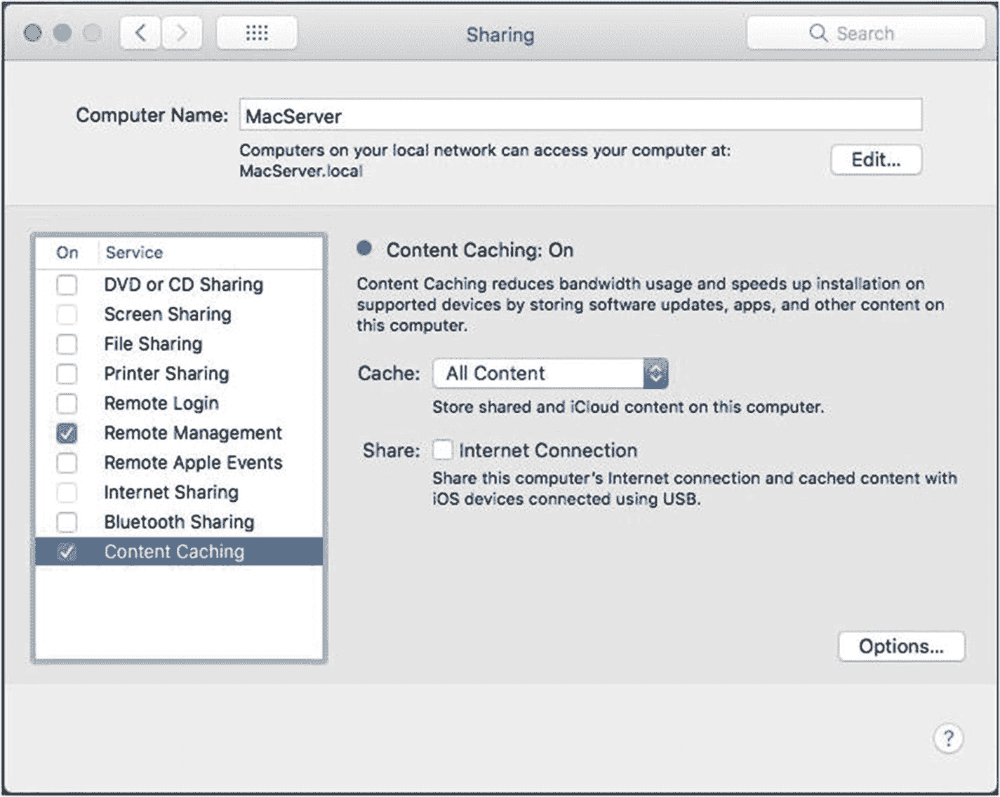

图 7-8
在我们的服务器上启用内容缓存

因为这可能会占用服务器硬盘的相当大空间，你可以点击`选项…`按钮，选择你想分配多少磁盘空间用于缓存。一旦缓存空间满了，该服务将通过先删除最旧的数据来为新内容腾出空间。

### 文件共享

Mac 服务器上运行的另一个最常见的服务是文件共享。要启用本地网络文件共享，请打开`共享系统偏好设置`并勾选`文件共享`旁边的复选框。默认情况下，`macOS`使用 Samba 在网络共享文件。如果出于某些原因你想使用旧的 AppleTalk 协议，可以点击`选项…`按钮并勾选`使用 AFP 共享文件和文件夹`旁边的框。我们不勾选此项，因为我们不想使用 AppleTalk。

添加共享文件夹非常简单直接。在桌面上创建一个文件夹用于测试。通常，你会在连接的卷（如雷电磁盘驱动器）内创建文件夹，但为了本示例的目的，我们只用桌面。将文件夹命名为 "Mac 共享文件"。

回到`共享系统偏好设置`的`文件共享`下，点击`+`按钮并选择`Mac 共享文件`文件夹。如图 7-9 所示设置权限。我们使用非常简单的权限，只有一个用户账户能够连接到共享文件夹。管理员拥有`读写`权限，员工组拥有`只读`权限，其他所有人都将无法访问该文件共享。

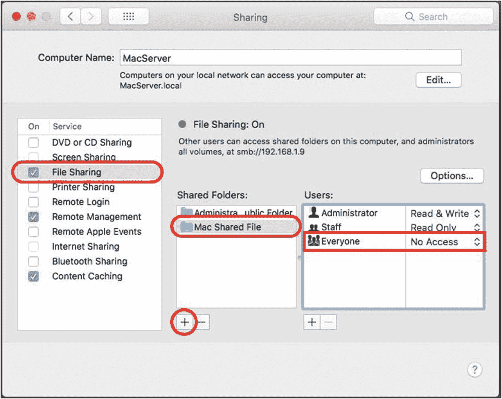

图 7-9
启用文件共享服务并配置权限

这是最简单的文件共享形式，因为我们基于这台特定 Mac 上的单一用户账户——管理员——来限制对共享的访问。员工组只有一个成员，那就是管理员账户。如果我们在这台 Mac 上创建额外的用户，并且如果他们是员工组的成员，他们将能够读取文件共享的内容但不能写入。

## 打印机共享

打印机共享同样非常简单直接。第一步是通过`打印机与扫描仪`系统偏好设置将打印队列连接到你的 Mac。如图 7-10 所示，我已连接到网络中的一台 IP 打印机，现在我想将这台打印机的队列分享给我网络中的其他 Mac。

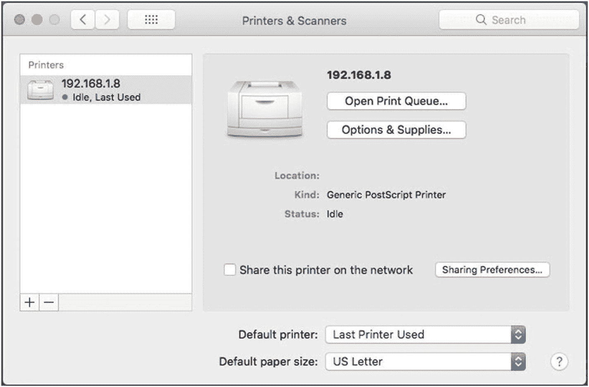

图 7-10
将一个或多个打印队列添加到`打印机与扫描仪`系统偏好设置

为此，打开`共享`系统偏好设置，点击`打印机共享`旁边的复选框以启用该服务。你会在下一个窗格中看到我服务器上的打印队列列表。勾选要共享的打印机旁边的框，然后在最右侧的窗格中设置权限。默认情况下是`所有人皆可打印`，如图 7-11 所示。你也可以添加其他用户和群组，并按用户或群组限制对这些打印队列的访问。

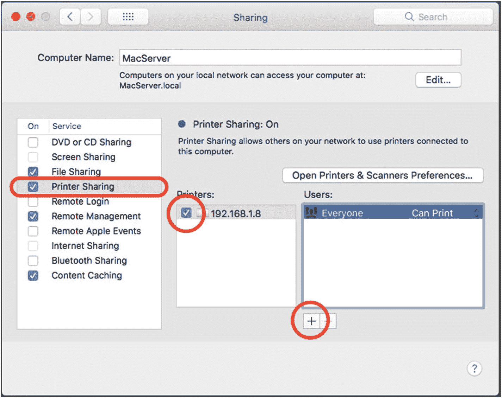

图 7-11
共享打印机并设置权限

## Web 服务器

虽然苹果公司已经移除了用于开启`macOS`内置的`Apache`网络服务器的用户界面，但你仍然可以通过命令行启用它。打开终端，在提示符处输入`sudo apachectl start`以启用内置的`Apache`网络服务器，如图 7-12 所示。

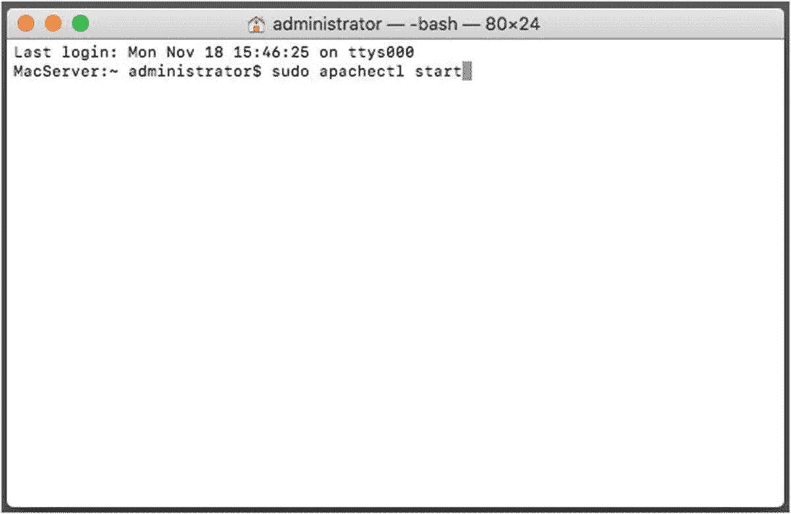

图 7-12
启动 Apache 服务的命令

输入你的管理员密码，这将开启`Apache`网络服务器。我们可以通过在 Safari 浏览器中访问`http://localhost`来测试它是否正在运行，如图 7-13 所示。它正常工作了！

图 7-13
确认网络服务器已启动并正在运行

显示“It works!”的默认 HTML 文件位于`/Library/WebServer/Documents/index.html`，你可以通过`访达`浏览到此路径。你可以将其他 HTML 文件添加到此目录以上传到网络服务器。随意尝试一下，在文字处理软件或使用`文本编辑`应用程序创建一个简单的 HTML 文件，将其命名为`index2`并保存到同一目录。然后，如图 7-14 所示，访问`http://localhost/index2`。这确认了网络服务器正在运行，并且你能够向你的网站添加新内容。

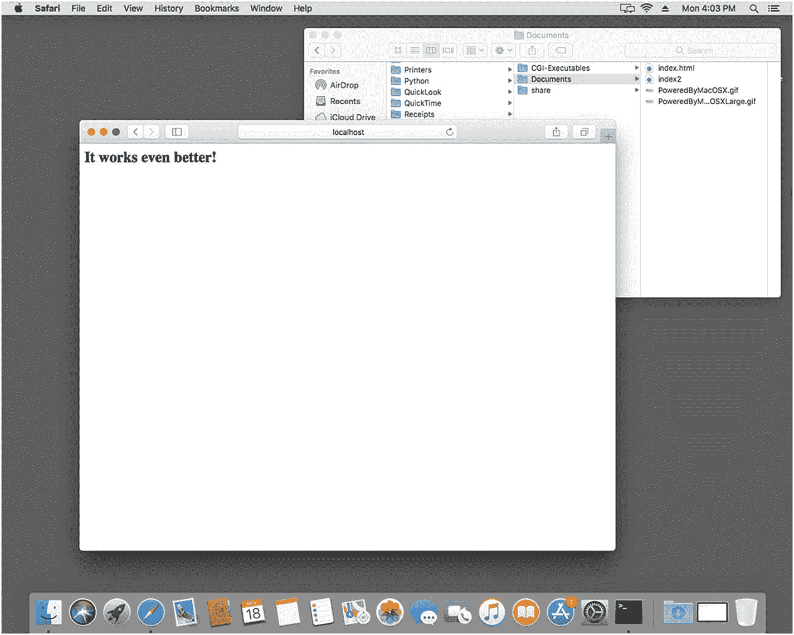

图 7-14
确认你可以向托管在 Mac 上的网站上传新内容

如果需要，你也可以在你的 Mac 网络服务器上安装`PHP`、`MySQL`和其他网络技术。这些额外服务的配置超出了本书的范围，但在网上有许多优秀的教程可以指导你完成整个过程。如果你是一名 Web 开发人员，并希望将你的 Mac 工作站用作开发和测试目的的 Web 服务器，也有像`MAMP`这样的工具，可以快速在你的 Mac 上安装一个`LAMP stack`风格的开发环境。你可以通过访问`www.mamp.info/en/`了解更多信息。

## 配置 macOS Server 服务

在本节中，我们将配置一些服务，这些服务仅在你购买并安装了 macOS Server 应用程序后才可用。

### 安装 macOS Server

正如你可能猜到的，苹果公司在`Mac App Store`上以 19.99 美元的价格提供`macOS Server`应用程序，截至撰写本文时，当前版本是 5.9。如图 7-15 所示，继续购买并下载它。

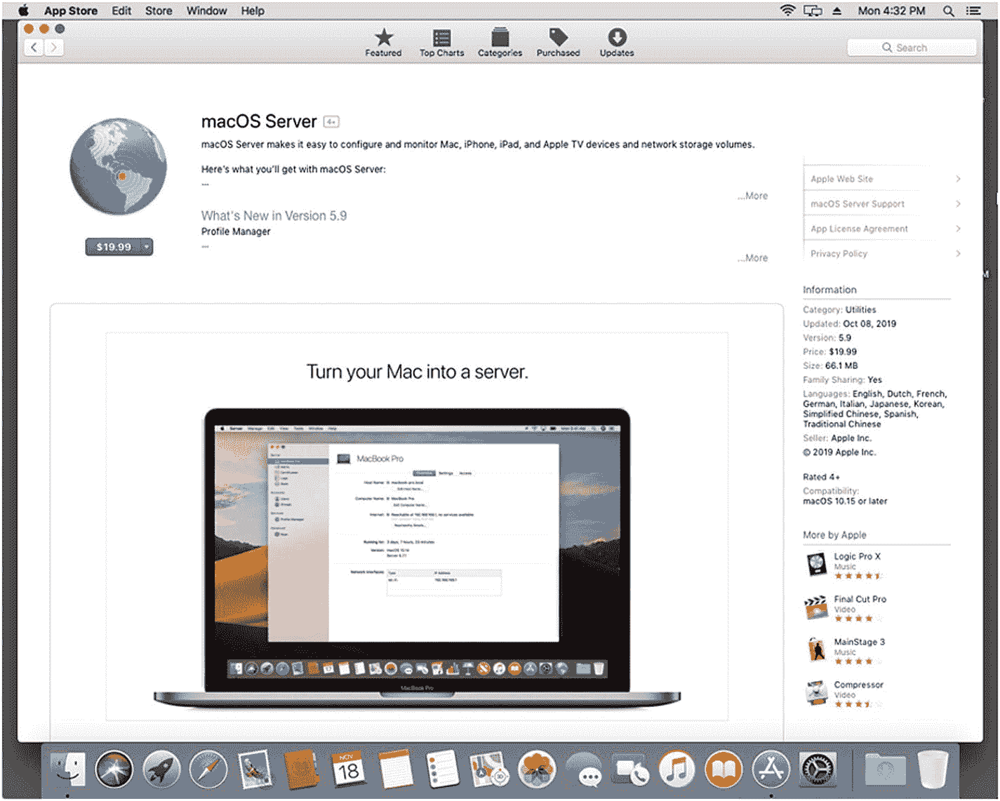

图 7-15
在 Mac App Store 上下载 macOS Server 应用程序

**专业提示**

每次苹果公司发布其操作系统的新版本时，他们都会发布`macOS Server`的新更新。因此，当前版本的`macOS Server`需要`Catalina`系统。如果你尝试在未运行`Catalina`的较旧 Mac 上安装它，可以选择安装稍旧版本的`macOS Server`。最近几个版本的主要区别在于新增了专为较新版本的`iOS`和`macOS`设计的配置文件管理器负载。

我们将在`macOS 10.15`上安装`macOS Server`，以便充分利用`iOS` 13 和`macOS Catalina`的所有新负载。一旦应用程序从`Mac App Store`下载完成，请浏览到`/Applications`文件夹并打开`Server`应用程序，继续进行安装和配置。

一旦你同意了条款和条件，各种服务将开始安装，如图 7-16 所示。

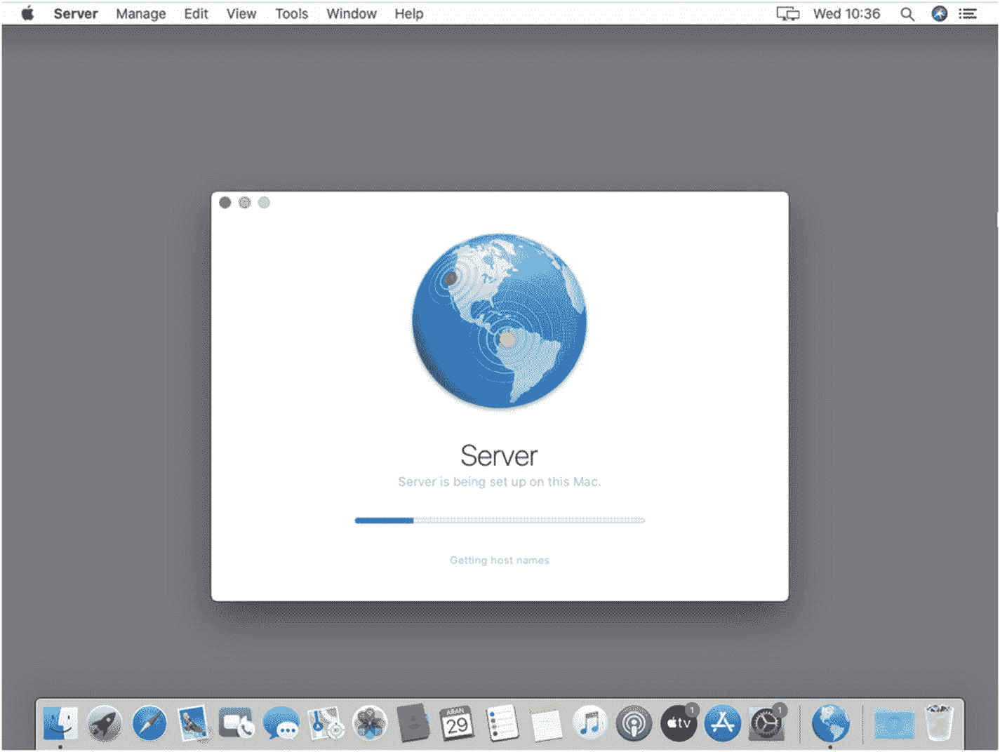

图 7-16
首次运行 Server 应用程序时配置你的 Mac

Server 应用程序完成其配置和安装后，你将看到一个类似图 7-17 所示的窗口。这是管理服务器服务的主要图形用户界面，包括`配置文件管理器`、`Xsan`和`Open Directory`。还有用于查看服务器日志、硬件统计信息和任何警报的链接。你可以看到主机名、计算机名，以及服务器是否可通过互联网访问。

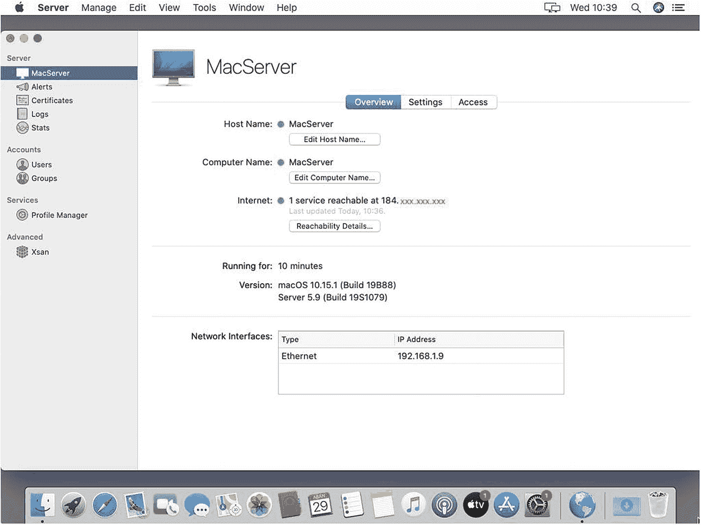

图 7-17
我们服务器的详细信息，包括运行时间、IP 地址和主机名

**专业提示**

如果你的服务器的主机名不是完全限定域名（FQDN），你可能需要点击`编辑主机名`按钮，并按照向导进行配置。如果你计划将此服务器与`配置文件管理器`一起使用，你应该借此机会注册一个将在互联网上使用的域名，并相应地重新配置你的服务器名称。

你可以点击`设置`选项卡，启用或禁用远程访问服务。请注意，你可以在此处或在`共享`系统偏好设置中启用`SSH`和`屏幕共享`或 Apple Remote Desktop。你还可以允许在远程 Mac 上运行的`Server`应用程序访问服务器。这将允许你在办公室的 Mac 上安装 Server 应用程序，然后使用它来控制此服务器。`访问`选项卡允许你管理有权访问这些远程服务的用户，并设置它们是可通过互联网访问，还是仅限局域网访问，如图 7-18 所示。

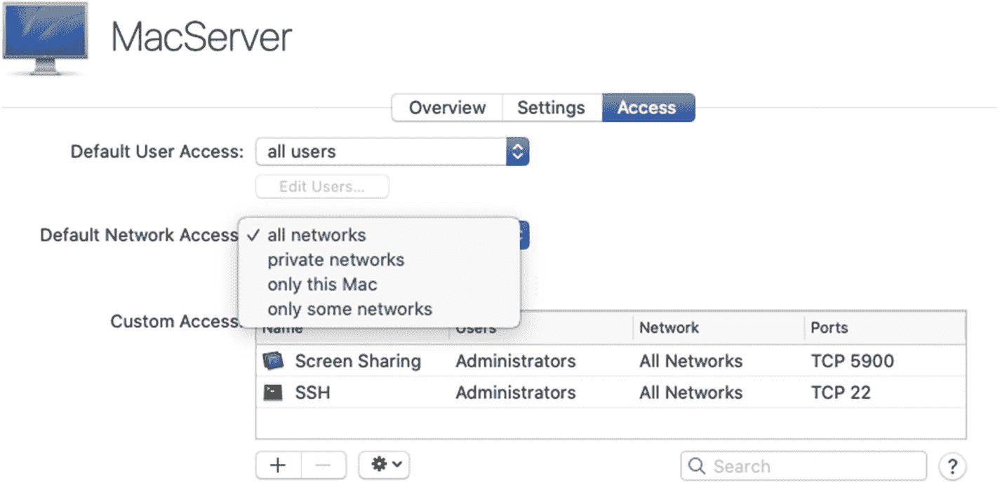

图 7-18
配置服务器访问设置

**专业提示**

## 互联网可达性

互联网可达性是苹果公司用来描述从公共互联网能够访问此服务器上哪些服务（如果有的话）的术语。此功能依赖于您的网络配置。我在本服务器上配置了内部 IP 地址，同时也在路由器上配置了允许外部连接通过 DMZ 访问此服务器。如果您计划将此服务器用作使用 `Profile Manager` 的 MDM（移动设备管理）服务器，您需要与网络管理员合作，对您的网络进行必要的更改，以允许通过互联网访问此服务器。您可以使用苹果的互联网可达性测试来验证这些网络设置，并识别哪些服务可以通过互联网使用。

## macOS Server 中的目录域

就 `macOS Server` 而言，可以存在多个目录域。在默认安装中，您将只有本地目录域。这是我们在 Mac 上使用 `用户与群组系统偏好设置` 创建的用户和组所在的位置。此域的成员可以登录到 Mac 工作站，只要他们对资源拥有适当的权限就可以访问网络资源；并且在安装 Server 应用后，他们既可以在 `用户与群组系统偏好设置` 中管理，也可以在 Server 应用的 `帐户` 部分进行管理，如图 7-19 所示。

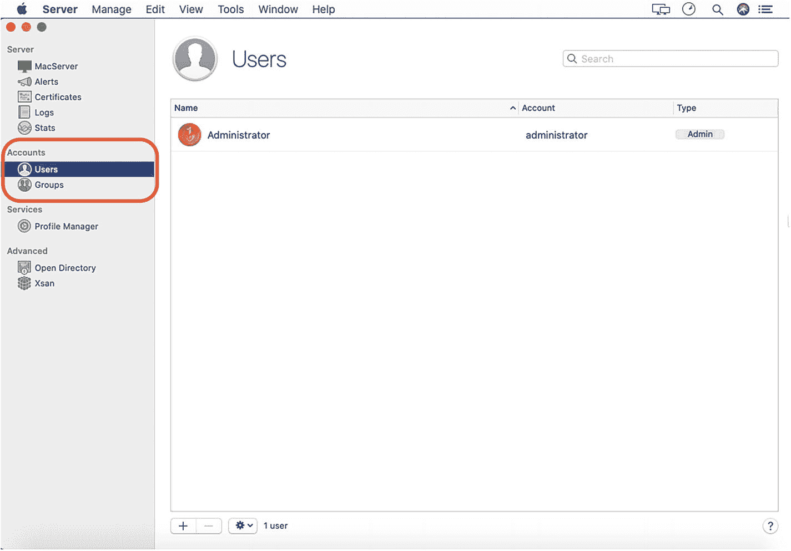

*图 7-19：macOS Server 中的用户帐户窗口*

如您所见，我们只有一个用户帐户，即本地管理员帐户。我可以在此处添加更多用户，或者点击 `群组` 部分，添加更多群组并填充这些群组的成员。这些帐户仅管理此特定计算机上的资源。我无法使用在此处创建的帐户来访问另一台计算机上的共享资源。这就是为什么它们是本地域的一部分。

如果我想创建管理多台机器资源访问权限的用户和群组，我需要在网络域中创建这些帐户。网络帐户允许我创建一个单一用户，该用户可以登录到其他计算机，访问此计算机或其他计算机上的共享资源（如果他们拥有对这些资源的权限），并且通常可以简化整个网络中用户帐户和数据安全的管理。要使用此网络域，我们必须有一个可用的目录服务来存放这些用户帐户和群组。

## 开放目录

`Open Directory`（开放目录）是苹果公司基于 `LDAPv3` 规范的网络目录域服务。许多大型组织可能已经拥有某种包含其所有网络用户帐户和共享资源的 LDAP。其中最常见的是微软的 `Active Directory`。如果您已经在运行 `Active Directory`，您应该计划将其用于 Mac 客户端的网络帐户目录域，而不是开启 Open Directory 服务。我们将在第 11 章更详细地介绍 Active Directory 集成。

如果您的组织还没有网络目录，可以使用 Server 应用配置 Open Directory。如果您在侧边栏的 `高级` 标题下没有看到列出的 Open Directory（如图 7-20 所示），请点击 `显示` 菜单并选择 `Open Directory`。这将把它添加到侧边栏。

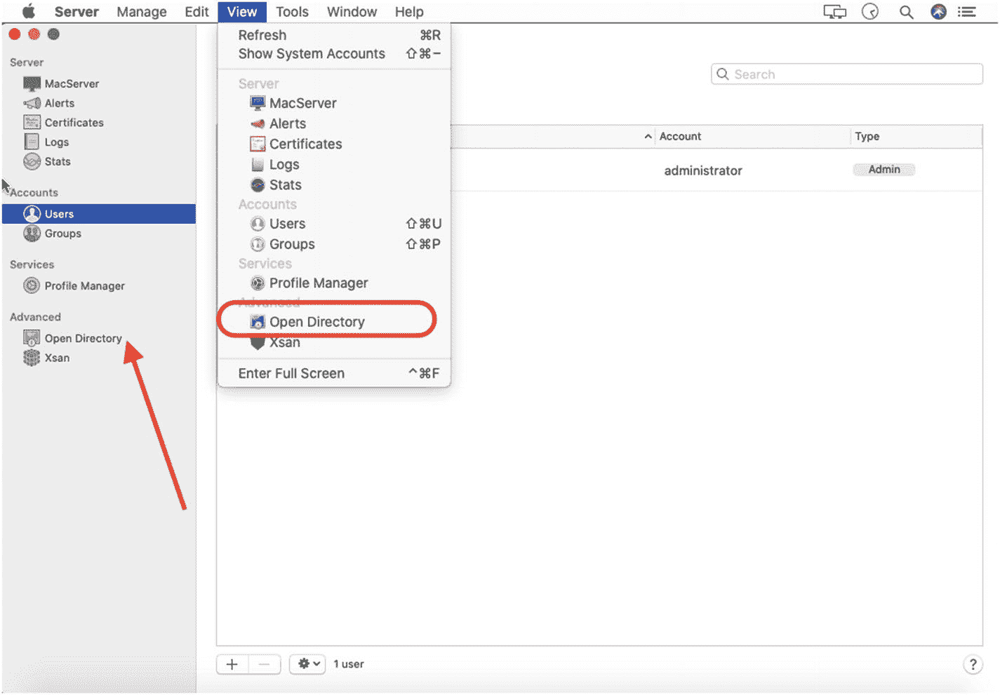

*图 7-20：如果侧边栏中尚未存在，则将 Open Directory 添加为可用服务*

### 创建 Open Directory 主服务器

我们将在此服务器上启用 Open Directory，因此请点击侧边栏上的 `Open Directory` 按钮，然后点击右上角的 `开/关切换按钮` 以启用该服务。`配置网络用户和群组设置助理` 将出现，并提示您选择创建新的 Open Directory 域、从存档恢复，或作为副本加入现有的 Open Directory 域。选择 `创建新的 Open Directory 域` 选项（如图 7-21 所示），然后点击 `下一步` 按钮继续。

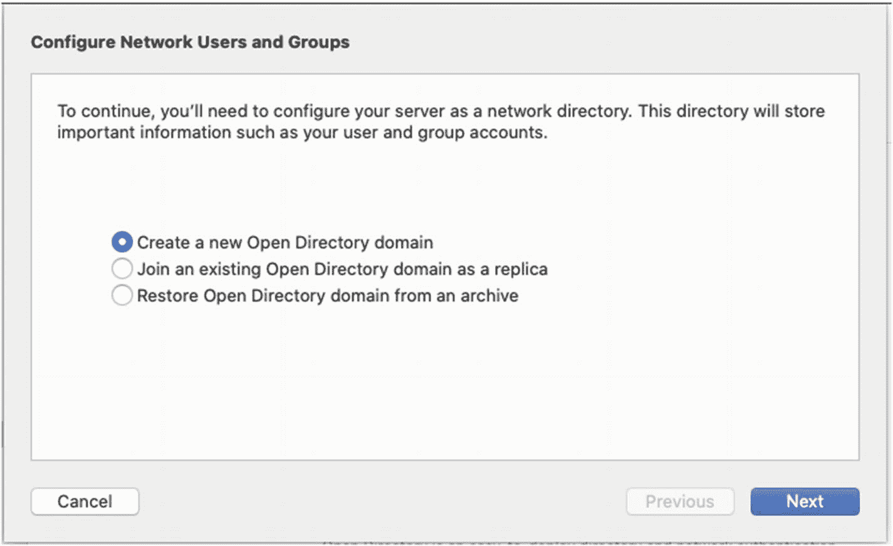

*图 7-21：选择创建新的 Open Directory 域*

**Windows 专业提示** 微软系统管理员会从 `Active Directory` 中认出主服务器和副本服务器的概念。早期的 AD 实现包括一个充当主域控制器的服务器和称为备份域控制器的额外服务器。Open Directory 与此类似，您有一个 Open Directory 主服务器，然后有多个 Open Directory 副本服务器，它们同步任何目录更改或在响应请求时分担负载。

下一步是为新的 Open Directory 域创建一个管理员帐户。您可以在此处指定用户名和密码，或使用默认的 `目录管理员`（`diradmin`）帐户。在本例中，我将坚持使用默认设置。输入一个安全的密码（如图 7-22 所示），然后点击 `下一步` 按钮继续。作为安全最佳实践，我建议使用与用于登录服务器的本地管理员帐户不同的密码。

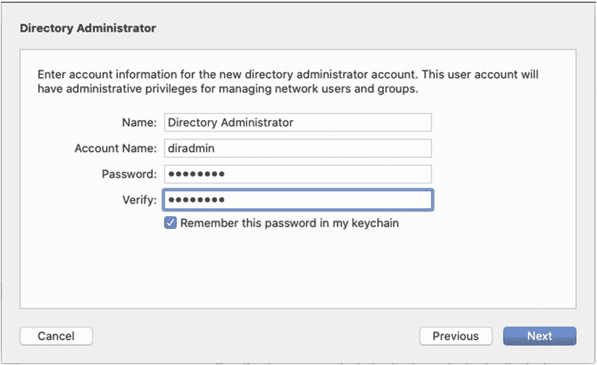

*图 7-22：为 Open Directory 的管理员帐户创建用户名和密码*

**专业提示** 当您在 Open Directory 中创建网络帐户时，重要的是要注意它们应该与客户端或服务器系统上的本地帐户不同。当登录窗口尝试对用户进行身份验证时，它首先在该 Mac 的本地目录域中查找匹配的帐户；如果找不到，它会上升到网络目录域并在那里检查。如果您在本地域中有一个与网络域中帐户匹配的帐户，它将始终以本地帐户登录，因为它在本地域中找到了匹配项并停止了查找。

### 完成 Open Directory 主服务器的初始配置

逐步完成剩余的设置助手步骤，点击 **设置** 按钮以完成 Open Directory 主服务器的初始配置。当助手完成后，您将看到 Open Directory 服务已开启；如果您点击 **用户** 或 **组** 按钮，您将看到一个略微修改的界面，其中显示一个用于筛选账户的下拉菜单和一个标识账户所在目录域的列，如图 7-23 所示。

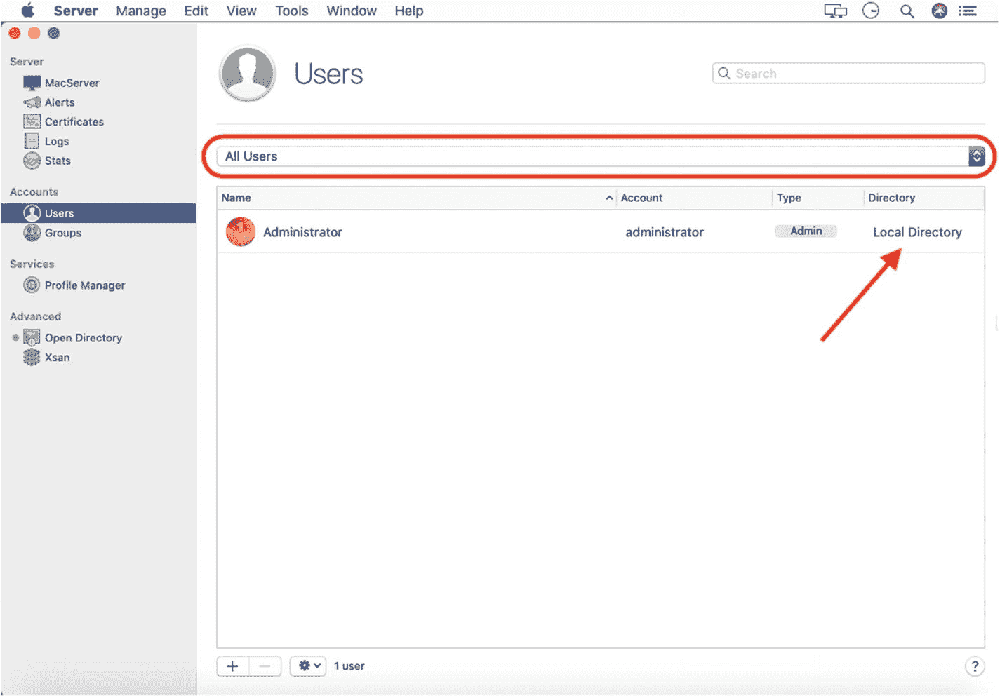

**图 7-23** 配置 Open Directory 后，我们现在同时拥有了本地目录和网络目录

此时，我们已经配置好了我们的 Open Directory 主服务器。从这里，您可以配置额外的服务器作为副本。如果您有多个位置和多台服务器，您可能需要配置**区域**。这些可以在 Open Directory 服务窗口中进行配置，您可以指定哪些服务器应响应来自特定子网的客户端的请求。这样，客户端就可以根据它们所在的网络查询最近的 OD 服务器。

您还可以在**服务器**部分查看所有 Open Directory 服务器，如图 7-24 所示。在这里，您可以选择特定的服务器并**创建存档**，以便稍后在发生意外时进行恢复。如果需要，您也可以将其中一个副本提升为新的主服务器。

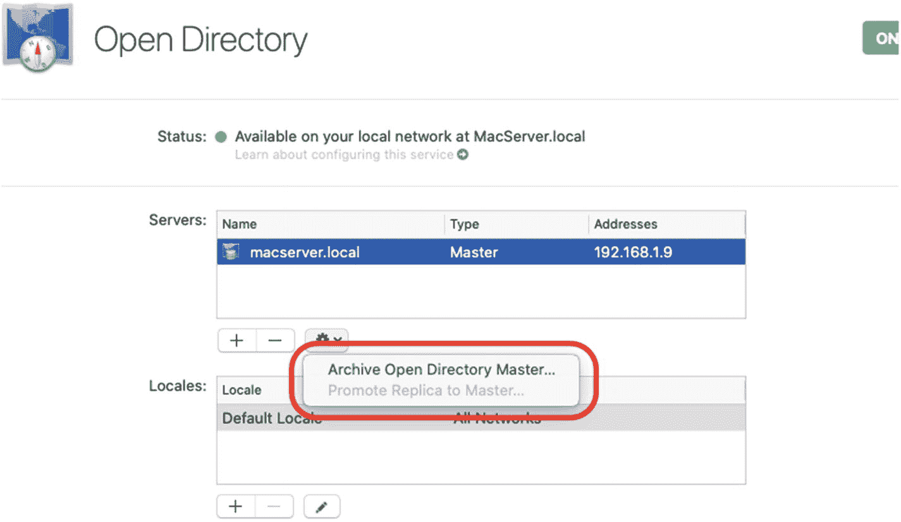

**图 7-24** 副本、区域以及将主目录备份到存档的附加选项

### 创建网络用户和组

接下来，让我们通过填充一些网络用户和组来开始使用这个新目录。点击侧边栏的**组**按钮，然后点击**+**按钮，如图 7-25 所示。创建一个名为 **"Executive Team"** 的组。确保目录选项是**本地网络目录**，而不是本地目录。它应该看起来像图 7-26。

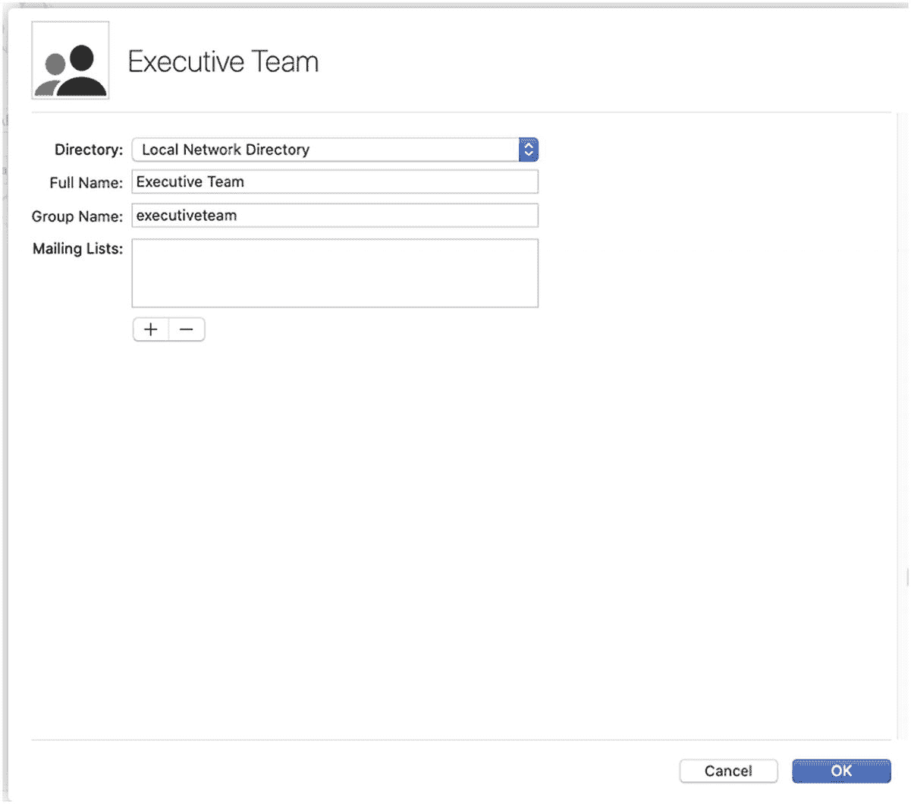

**图 7-26** 创建 Executive Team 网络组

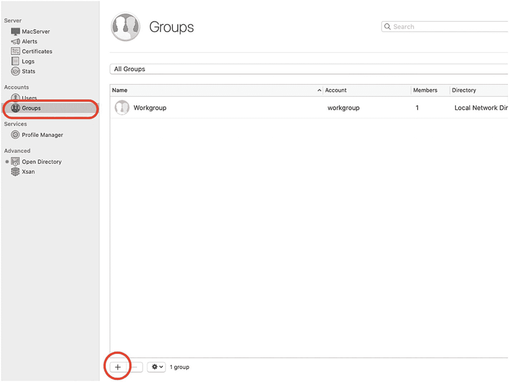

**图 7-25** 添加新组

创建好该组后，我们需要将一些用户放入该组。点击侧边栏的**用户**按钮切换到用户选项卡。点击**+**按钮创建一个名为 **"User1"** 的新用户和一个您选择的密码。确保将此账户添加为**本地网络目录**账户。创建账户后，点击**所有用户**弹出菜单，如图 7-27 所示，并选择**本地网络用户**。

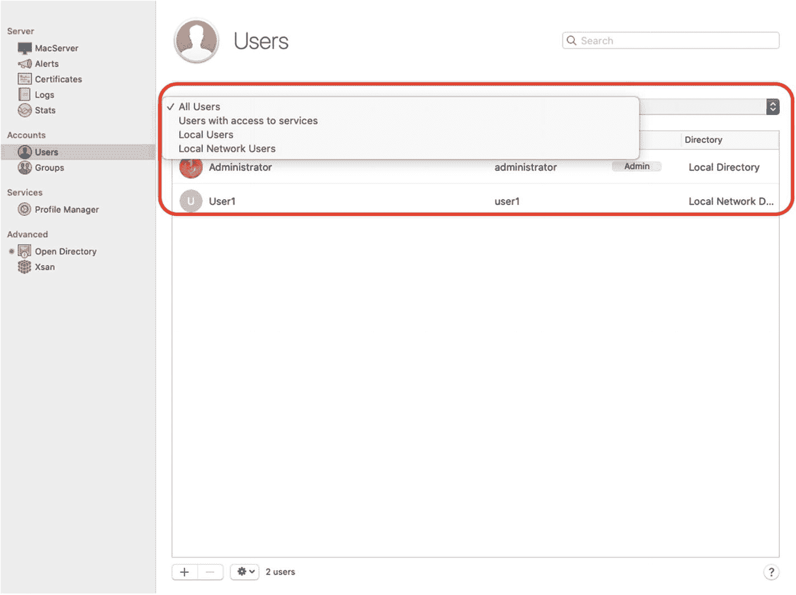

**图 7-27** 使用弹出菜单过滤掉您的本地用户

接下来，点击**齿轮**弹出菜单，如图 7-28 所示，然后选择**编辑密码策略…**选项。我们可以用它来为最终用户密码设置最低安全策略。请勾选以下框来设置一些基本要求：

*   与账户名不同
*   至少包含 8 个字符
*   每 3 个月重置一次

点击**确定**按钮继续。

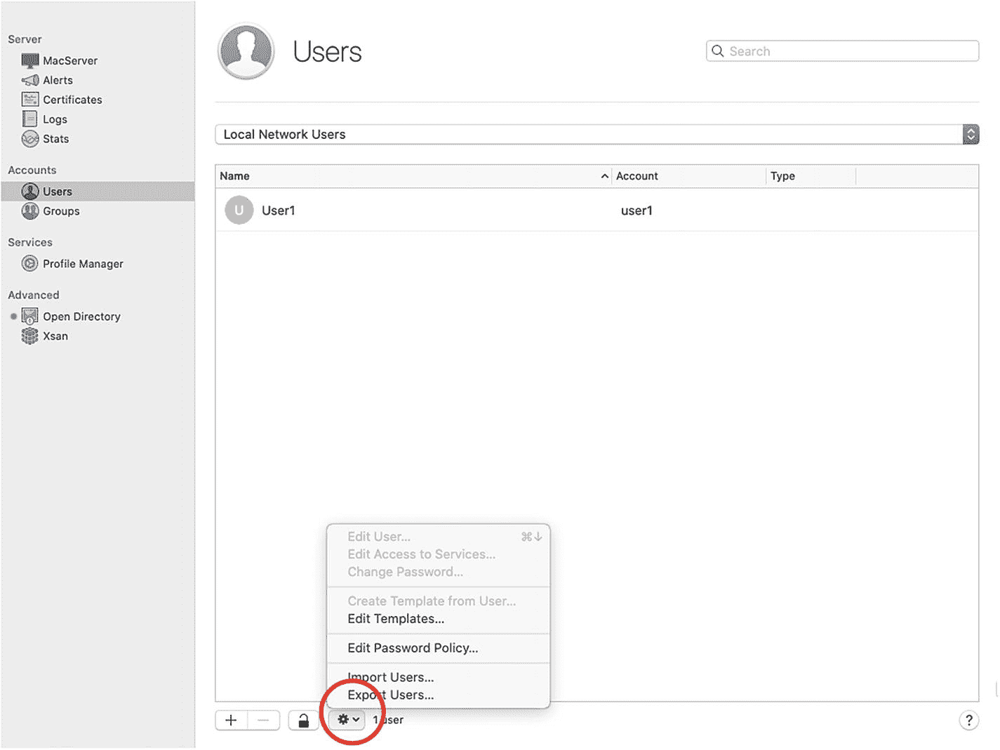

**图 7-28** 齿轮弹出菜单提供配置网络用户密码策略的访问权限

我们的下一步是修改`User1`账户。在**本地网络用户**屏幕中**右键单击`User1`**，选择**编辑服务访问权限…**。取消选中`SSH`和`Screen Sharing`，如图 7-29 所示，然后点击**确定**。

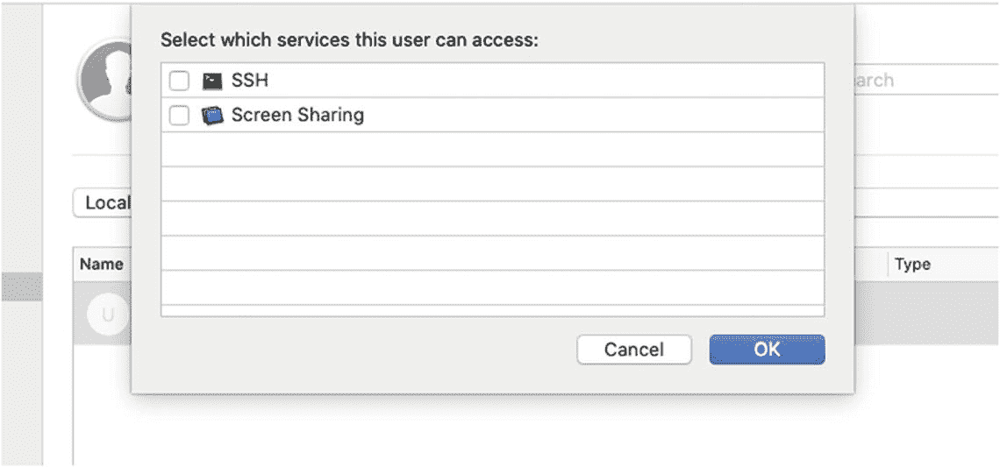

图 7-29

禁用此用户对`SSH`和`Screen Sharing`的访问

接下来，再次**右键单击**`User1`账户并选择**编辑用户**。在**组**字段中，点击**+**按钮并开始在字段中输入**"Executive Team"**。这会将用户添加到我们之前创建的"Executive Team"组。如果`User1`是`Workgroup`组的成员，请单击`Workgroup`组以高亮显示它，然后单击**–**按钮将其移除。完成后，您的`User1`应如图 7-30 所示。点击**确定**按钮。

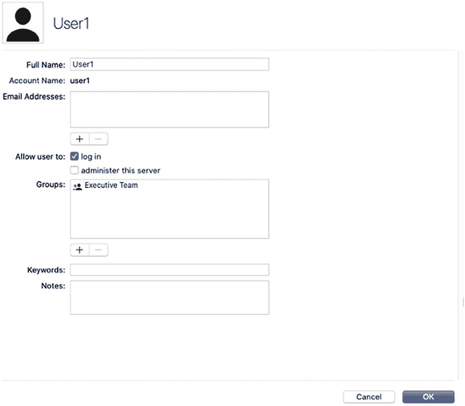

图 7-30

如图所示配置`User1`账户

**专业提示** 除了单独编辑每个用户账户，您还可以通过转到服务器的**访问**选项卡并将默认用户访问权限更改为**仅限部分用户**，并指定特定用户或组，如图 7-31 所示，来限制对服务器的访问。

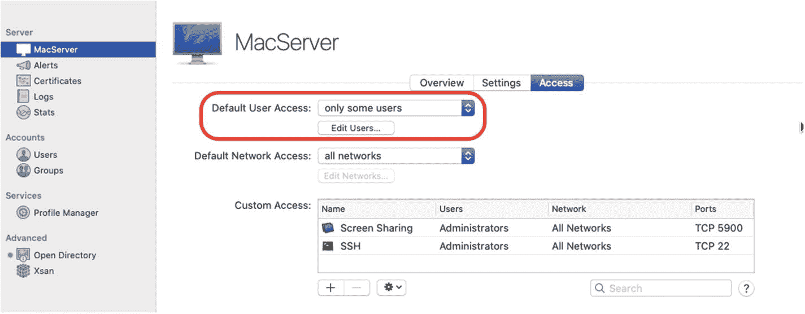

图 7-31

配置默认用户访问权限

最后，既然我们已经将`User1`配置为正确的组，我们将从此用户创建一个模板，并创建更多类似的用户。要创建模板，请单击`User1`以高亮显示它，然后从**齿轮**弹出菜单中选择**从用户创建模板…**，如图 7-32 所示。出现提示时，将模板名称更改为**"Executive User Template"**，然后保持其他设置为默认值，点击**完成**按钮保存模板。

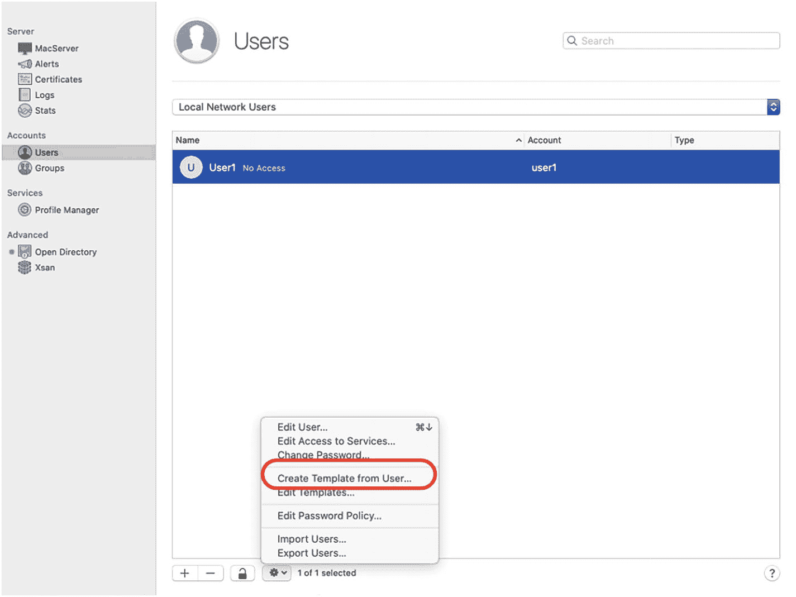

图 7-32

从`User1`账户创建模板

现在我们将基于"Executive User Template"创建另外两个用户。为此，点击"用户"窗口上的**+**按钮，这次您会在"新建用户"窗口中看到一个弹出菜单，允许您根据模板创建用户，如图 7-33 所示。选择**Executive User Template**并创建`User2`和`User3`账户。

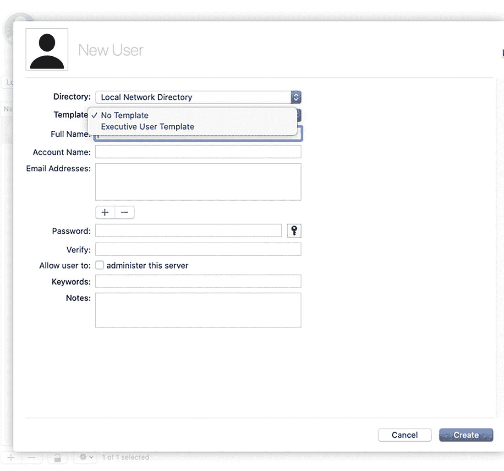

图 7-33

从"Executive User Template"创建新用户

现在我们已经创建了三个用户账户，您的"用户"窗口应如图 7-34 所示。别忘了也限制他们对`SSH`和`Screen Sharing`的访问。

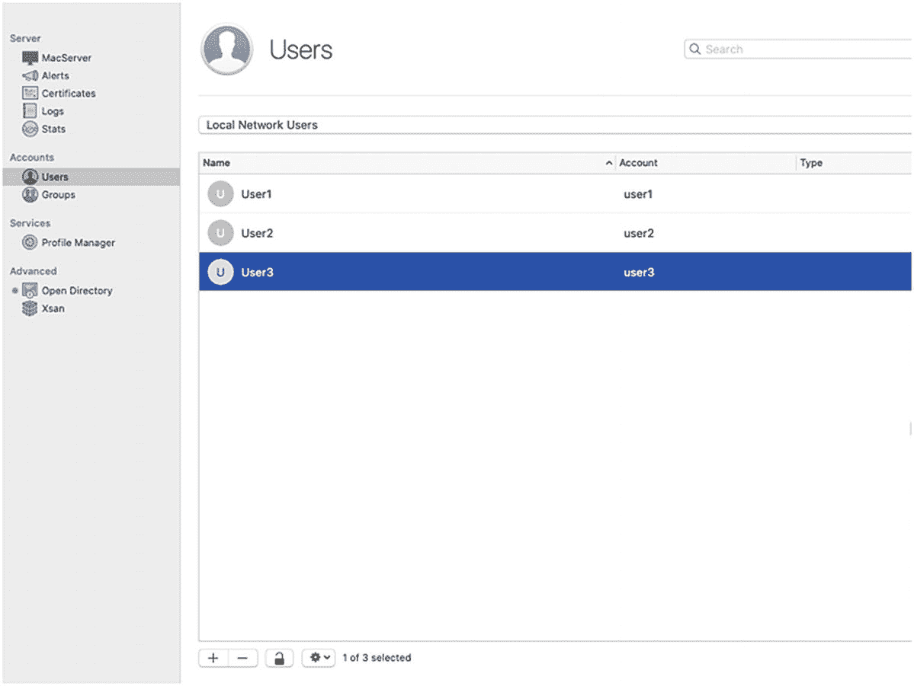

图 7-34

您应该有三个用户账户 — `User1`、`User2` 和 `User3`

最后，让我们探索用户的高级选项。**右键单击`User3`**并选择**高级选项…**，如图 7-35 所示。这看起来应该很熟悉，因为它类似于*用户与群组系统偏好设置*。就像本地工作站一样，我们可以调整主目录、登录 shell 和别名等设置。"配置共享点 URL"的选项用于在登录时映射网络驱动器，不要与*Microsoft SharePoint*混淆。我们暂时不做任何更改，所以点击**取消**按钮继续。

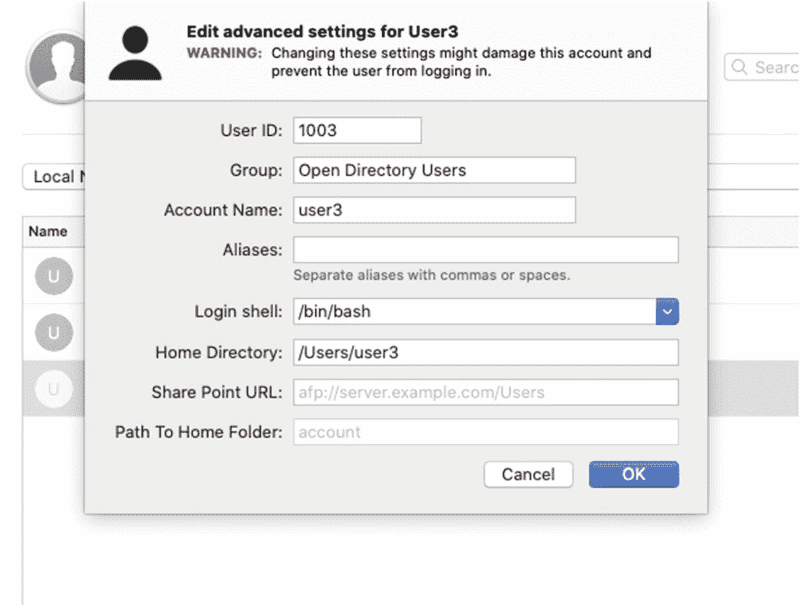

图 7-35

`User3`的高级用户设置

**专业提示**

我们可以看到我们的三个用户账户和一些组，但您知道吗，除了我们在这里看到的之外，操作系统还在我们的目录中放置了更多的用户和组？您可以通过**右键单击**任何用户并选择**显示系统账户**或**隐藏系统账户**来切换这些组的显示。

现在我们已经创建了一些用户并将它们放入一个组中，我们希望能够使用其中一个账户登录到工作站。为此，我们需要将我们的*macOS*客户端*绑定*到 Open Directory 域。将客户端绑定到域允许它在搜索本地账户的同时搜索网络账户列表以找到匹配项，并允许网络用户登录到计算机。域中任何已启用的用户都可以登录到绑定到该域的任何计算机。

### 绑定 macOS 客户端到 Open Directory

切换到您的一台测试 Mac 客户端，并以具有管理员权限的本地用户身份登录。打开*用户与群组系统偏好设置*并进行身份验证以解锁偏好设置面板。点击**登录选项**按钮，如图 7-36 所示。接下来，点击**网络账户服务器**提示旁边的**加入…**按钮。

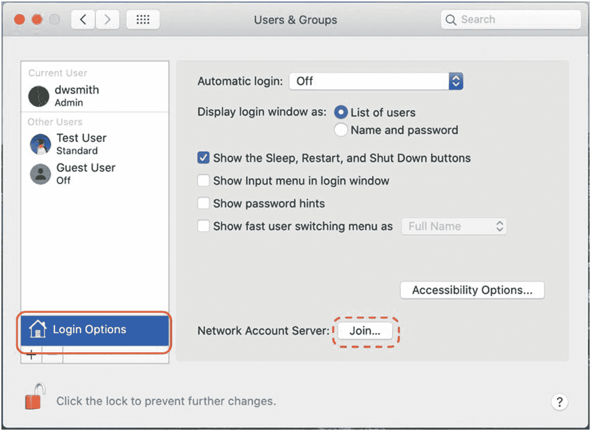

图 7-36

将 Mac 客户端加入网络账户服务器

系统会提示您一个对话框来选择或输入服务器。您可以输入 IP 地址或主机名。如果您的网络像我此示例中的一样小而简单，您也可以点击下拉箭头，如图 7-37 所示，它可能会找到广播的主机并从菜单中选择。输入服务器信息并点击**确定**按钮继续。如果提示您信任服务器提供的安全套接字层（`SSL`）证书，请点击**信任**按钮继续。

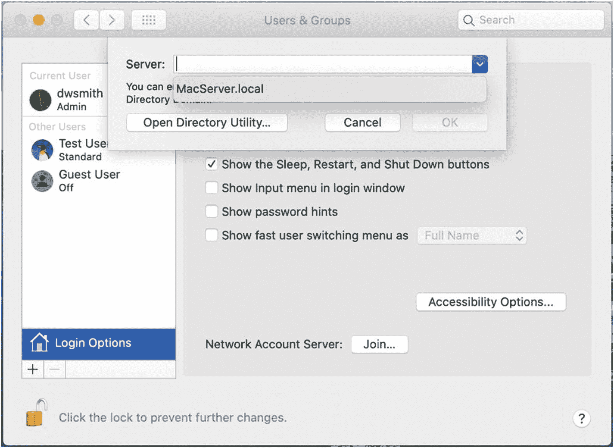

图 7-37

在字段中输入主机名或服务器名，然后点击确定

您可能会收到一条消息，提示服务器不使用安全套接字层（`SSL`）身份验证。您可以暂时点击**继续**按钮跳过此消息，因为我们在此练习中不关心加密。它会提示您输入本地管理员账户凭据，经过片刻配置后，您将看到 Open Directory 服务器列在"网络账户服务器"旁边，并有一个绿点表示连接正常。您可能还想更改登录窗口的一些设置，如图 7-38 所示。

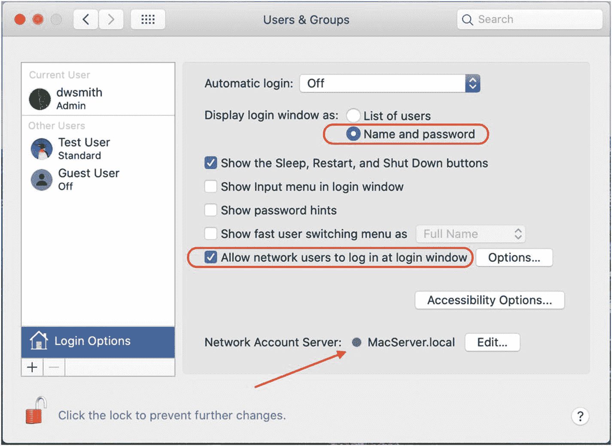

图 7-38

我们的客户端现已绑定到我们的 Open Directory 域，您可能希望更改一些登录窗口选项，如图所示

现在我们已经将 Mac 绑定到 Open Directory，请继续**注销**，然后使用`User1`账户登录。如果一切顺利，首次登录时您应该会收到几个设置助理问题，然后作为网络用户进入一个干净的`/Users/User1/Desktop`目录，拥有所有默认的新用户设置。您可以通过转到*用户与群组系统偏好设置*或浏览到`/Users`来查看您的主目录，从而确认这一点，如图 7-39 所示。

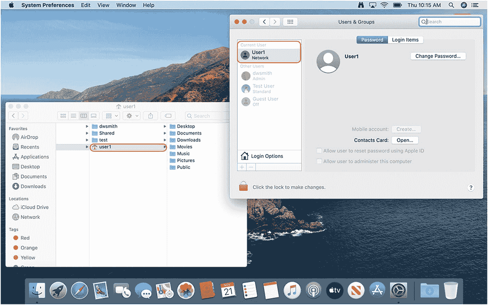

图 7-39

主目录和网络用户账户类型，如用户与群组系统偏好设置中所示

恭喜！您已成功创建了 Open Directory 域，向其中添加了用户，将一台客户端 Mac 绑定到该域，并使用网络用户帐户成功登录。

专业提示

关于文件共享和 Open Directory 的一个快速说明：在 `macOS Mojave` 之前，您可以共享文件和文件夹并为 Open Directory 网络帐户设置权限。如果您在 Open Directory 主服务器或副本上有共享文件夹，即使您使用本地用户帐户，也将无法映射这些共享，因为它将无法进行身份验证。如果您计划在 Mac 上创建共享并与其他 Mac 共享，主机**不能**运行 Open Directory 服务；即使您将该 Mac 绑定到 Open Directory 域，也无法使用网络帐户对这些共享进行身份验证。这是因为 ACL 组不再像旧版本 Server 那样在目录中创建用于文件共享访问。对此有一些非官方的修复方法，但这超出了本书的范围。

## 证书

当您完成将 Mac 客户端绑定到 Open Directory 的步骤时，您可能收到过一条消息，提示 `此服务器不提供安全（SSL）连接。是否继续？` 在这种情况下，由于我们是在设置测试服务器，因此选择忽略此消息并继续。但是，在生产环境中，您需要使用 SSL 来保护客户端与服务器之间的通信，以防止中间人攻击等。即使您不使用 Open Directory，并且仅部署服务器以配合 Profile Manager 使用，您也需要对证书以及在 macOS Server 中更改它们的方式有基本的了解。

### 回退 SSL 证书

Apple 提供的最基本的证书是 `回退证书`。它在您安装 Server 应用程序时创建，虽然可用但很少使用。您可以在 Mac 服务器上打开 `钥匙串访问` 实用工具，然后点击 `系统` 钥匙串下的 `证书` 来找到此证书。

### 自签名证书

就 Open Directory 而言，Apple 提供了一个自签名证书，您可以在安装 Open Directory 服务时使用。自签名证书会提示用户信任它们，通常不是生产安装的最佳选择。如果我们希望用受信任的第三方证书替换它，可以调整用于 Open Directory 的证书。

### 管理证书

我们可以随时更改用于任何服务的证书。在对这些证书执行任何操作之前，我们需要停止使用它们的服务。在本例中，我们需要暂时关闭 Open Directory 服务，方法是点击 Open Directory 窗口右上角的开/关切换开关，如图 7-40 所示。

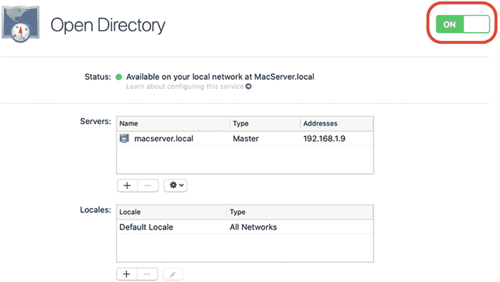

图 7-40
在对证书进行任何更改之前，禁用 Open Directory

现在服务已禁用，点击侧边栏中的 `证书` 按钮。您可能会看到类似图 7-41 的界面，其中包含一些证书组合和 `使用以下方式保护服务` 弹出菜单。使用此菜单，我们可以选择哪些服务使用哪些证书。

点击 `使用以下方式保护服务` 弹出菜单并选择 `自定`。您将看到一些服务及其匹配的证书。我有两个证书可供选择。这两个都是服务器自动为我生成的，但只有一个是有效的。我将在 `证书` 列中选择 `MacServer` 证书，然后点击 `好` 继续。

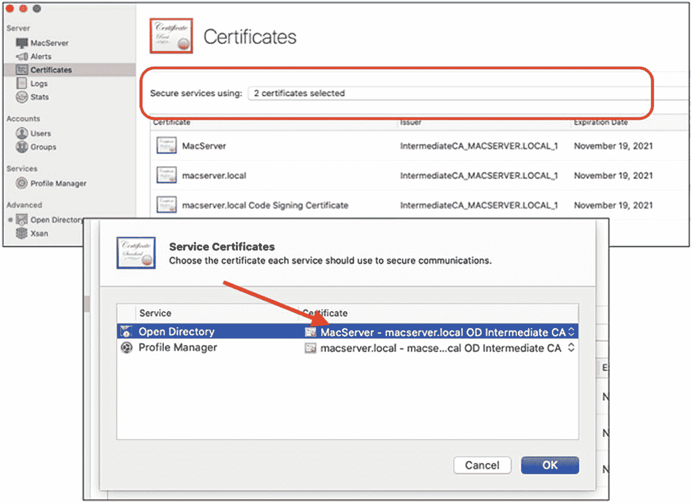

图 7-41
选择要用于特定服务的证书

现在您会看到，我正在使用我的 MacServer 证书来保护我的 Open Directory 服务。最后一步是打开钥匙串访问应用程序，搜索 `OPENDIRECTORY_SSL_IDENTITY` 身份首选项。`双击`它打开，然后选择一个新的 `首选证书`，如图 7-42 所示。点击 `存储更改` 按钮关闭它。

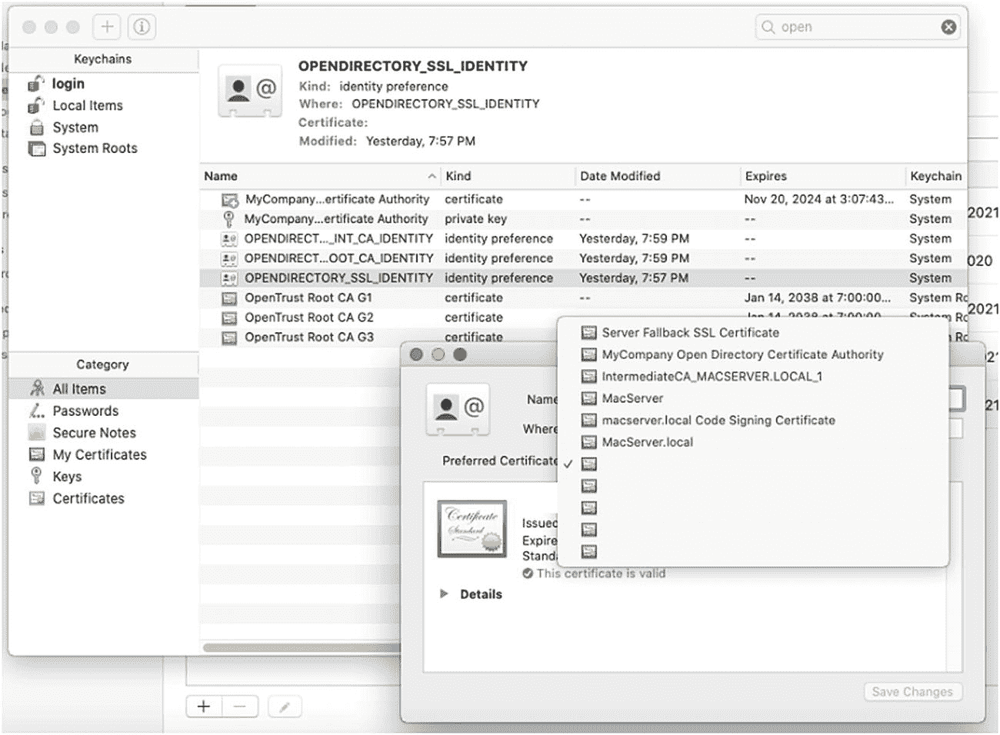

图 7-42
为 Open Directory 服务选择 SSL 身份的证书

返回 Open Directory 设置，通过将开关切换回 `开` 位置来重启服务。如果您返回测试 Mac，将其从我们的域解除绑定，然后再次加入，系统将提示您信任新证书。

专业提示

要将 Mac 从域解除绑定，请以具有本地管理员权限的用户身份登录，使用 `用户与群组系统偏好设置` ➤ `登录选项` 对话框，并点击 `编辑` 按钮，类似于您加入域的过程，但操作相反。在滑出并显示 Open Directory 服务器的窗口中，高亮该服务器并点击 `-` 按钮将其移除。

### 受信任的证书

如果您正在托管一个网站或部署生产服务器并需要加密，您将需要安装一个来自知名证书颁发机构（CA）的证书。为此，您需要创建一个证书并将其添加到您的 `macOS Server` 证书列表中。要创建证书，首先点击 **证书** 窗口中的 **+** 按钮，并选择 **获取受信任的证书…**，如图 7-43 所示。

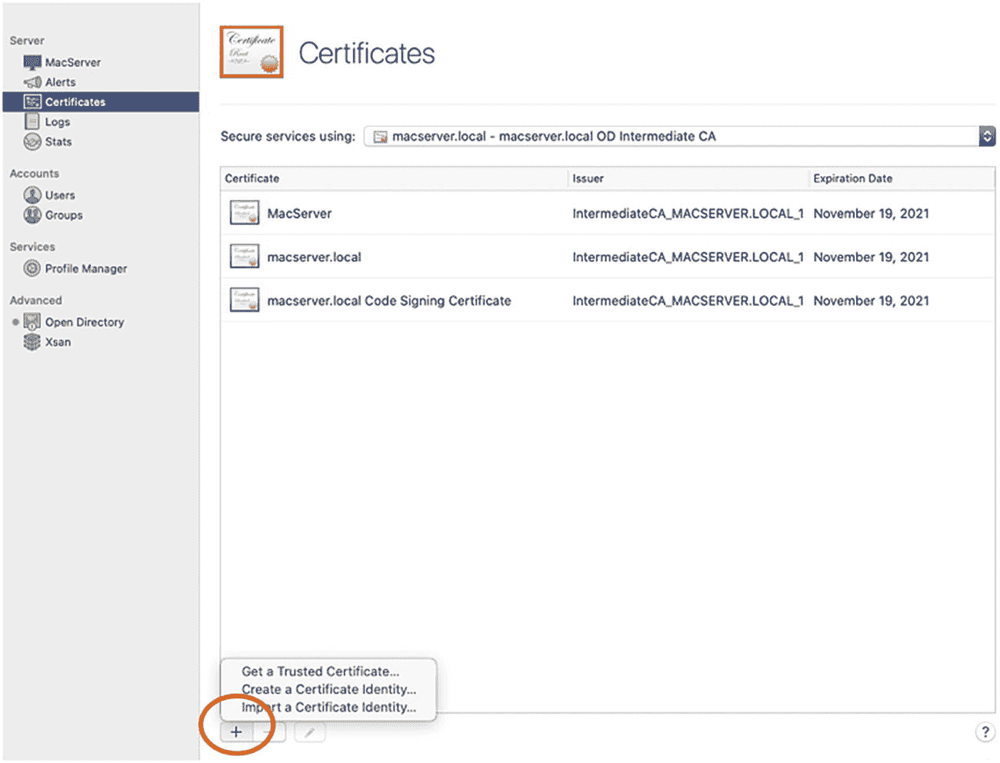

图 7-43
启动获取受信任证书的流程

这将打开 `获取受信任证书助手`。按照提示步骤提供您的个人信息，然后点击 **下一步** 按钮继续。这将带您进入 `证书签名请求（CSR）` 窗口。CSR 包含您需要提供给所选签名机构的信息，如图 7-44 所示，以便他们可以为您的服务器生成证书。您可以复制/粘贴此字符串，也可以点击 **保存** 按钮来保存 `∗.csr` 文件。由于这是第一步的结束，您可以点击 **完成** 来关闭对话框。

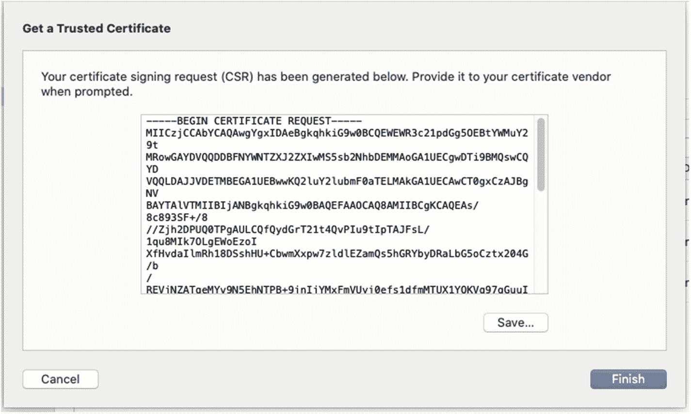

图 7-44
您需要提供给签名机构的 CSR 字符串

接下来，您会注意到它在您联系签名机构的同时为此证书创建了一个占位符。一旦您完成了验证流程并收到了您的 SSL 证书，**双击** 该占位符证书，并将 **SSL 证书和/或证书包** **拖放** 到占位符的 `证书文件` 区域，如图 7-45 所示。点击 **确定** 保存，现在您就可以在服务器上使用这个第三方证书了。

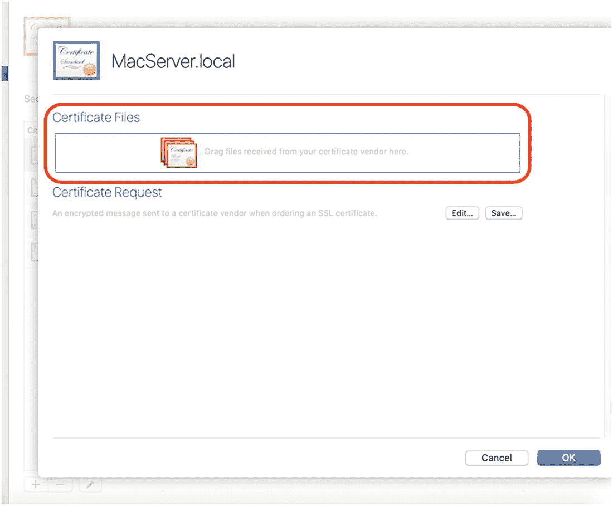

图 7-45
一旦从签名机构收到文件，双击占位符证书并将其放入高亮显示的字段中

### 专业提示

如果您计划在生产环境中使用受信任证书，请确保您的服务器主机名在您的网络内是唯一的，对于网站而言，则是在公共互联网上唯一。为了使 SSL 正常工作，不建议使用以 `.local` 结尾的服务器主机名。如果出于任何原因需要更改主机名，请在服务器应用程序内进行，以便相关服务能更新为新名称。更改主机名后，您还应重启任何服务或服务器本身。

## 描述文件管理器

我们将在 `macOS Server` 中配置的最后一项服务，实际上也是如今拥有一台 Mac 服务器的主要原因——`描述文件管理器`。`描述文件管理器` 是一个移动设备管理（MDM）解决方案，它与 Apple 的云服务（如我们在本书中已提及的 `设备注册计划（DEP）` 和 `批量购买计划（VPP）`）集成。我们将在第 8 章和第 9 章中使用 `描述文件管理器` 来创建配置描述文件，以 *无线* 方式供应和管理 iOS 设备及 Mac 客户端。

在我们开始之前，使用 `描述文件管理器` 时需要注意几个前提条件。首先，服务器必须能从互联网访问。对于我的测试服务器，我临时启用了 `Apache` 并确保我能从网络内外都访问到 "It works!" 页面。我还创建了一个域名，并确保我可以通过 DNS 名称（而不仅仅是 IP 地址）在公共互联网上访问到服务器。测试完成后，您可以再次禁用 `Apache` 服务。其次，一旦您拥有一个可用的 Web 服务器，它还需要启用 SSL 加密。因此，您需要从您选择的证书颁发机构获取一个签名的证书。

### 专业提示

我曾使用 [namecheap.​com](http://namecheap.com/) 或 [godaddy.​com](http://godaddy.com/) 作为我的 SSL 证书供应商，费用不高。还有一些替代方案，例如 [letsencrypt.​org](https://letsencrypt.org/)，您可以用它来获取免费的签名 SSL 证书。

我们将开始配置 `描述文件管理器` 服务，点击侧边栏中的 `描述文件管理器` 按钮，然后点击 `开/关` 开关将其 **开启**，如图 7-46 所示。

这将启动 `配置设备管理助手`。完成第一个对话框，输入您的 **姓名**、**电子邮件地址**、**电话号码** 和 **物理地址**。这些信息将向最终用户在其受管设备上披露，类似于我们在 `Apple Configurator` 中创建组织时的情况。

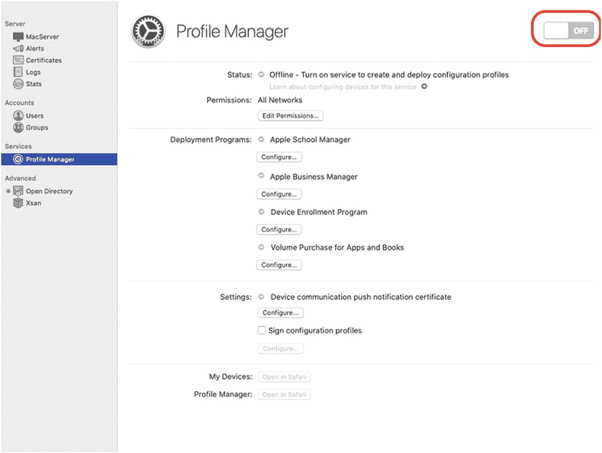

图 7-46
开启描述文件管理器服务以启动配置助手

下一步是从第三方证书颁发机构 **选择** `受信任的证书`。如果您计划将 `描述文件管理器` 用作 MDM（我们将在本书后续部分这样做），您必须拥有一个由证书颁发机构签名的证书。如果您使用自签名证书，它将无法工作。

接下来，您需要一个 `Apple ID` 用于 `Apple 推送通知`。此处不应使用个人的 `Apple ID`；应使用您专门为业务用途配置的 `Apple ID`。在字段中输入该信息，然后点击 **下一步**，如图 7-47 所示。输入您的 `Apple ID` 后，点击 **完成** 按钮以在此服务器上启用设备管理。

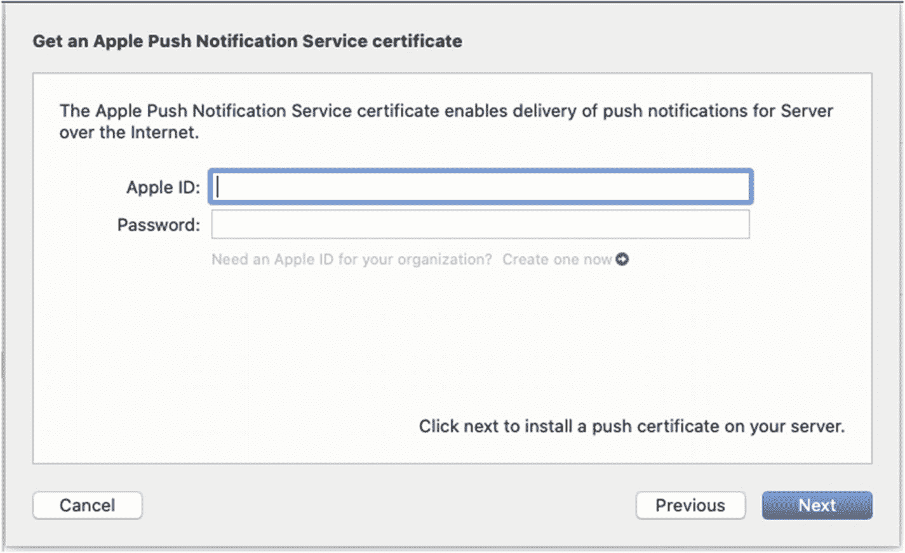

图 7-47
输入您机构用于推送通知的 Apple ID

此时，服务已启动，您应该能够打开配置文件管理器网站。我们需要通过三种不同方式浏览该网站来测试。首先，在服务器上启动浏览器，并导航到`//localhost/profilemanager`，确保它能将您带到配置文件管理器登录屏幕。接下来，在内部网络上的另一台计算机上打开浏览器，确保您能访问到服务器的内部 IP`/profilemanager`。在我这里，是[192.168.1.9/​profilemanager](http://192.168.1.9/profilemanager)。最后，通过您在互联网上注册的名称，从外部设备访问服务器——在我这里，是[`http://579testing.com/profilemanager`](http://579testing.com/profilemanager)。如果一切正常，您应该不会收到任何证书错误，并且应该会看到一个登录屏幕，如图 7-48 所示。

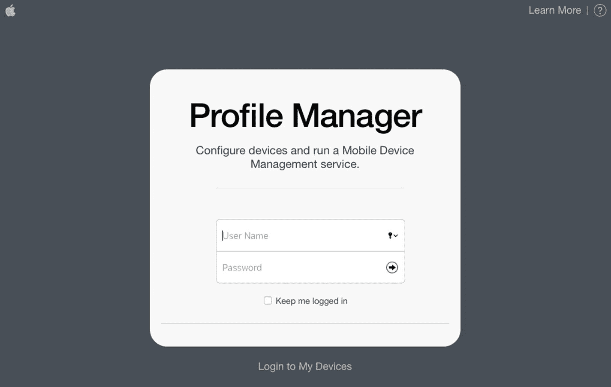

图 7-48
通过 Web 浏览器访问的配置文件管理器登录窗口

**专业提示**

如果您通过单击侧边栏中带有服务器名称的按钮返回服务器的主状态屏幕，您应该会在互联网可达性下方看到一个绿点。您也可以单击“可达性详细信息”按钮，并确保配置文件管理器显示为可通过互联网访问，如图 7-49 所示。如果您没有看到这一点，应联系您的网络管理员，让他们检查路由器或防火墙配置。

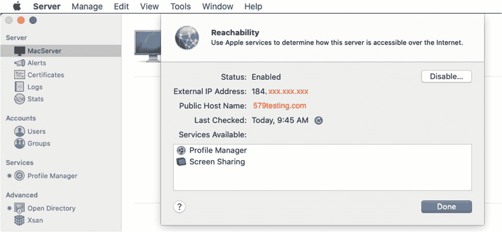

图 7-49
使用 Apple 的可达性服务确认配置文件管理器可从公共互联网访问

此时，我们已启用配置文件管理器服务，并确认它在内部和外部都能正常工作。还有一些额外的选项可以配置，以便与`Apple School Manager`、`Device Enrollment Program`和`Volume Purchase`集成。我将在下一章讨论 MDM 这个大主题下的这些服务时介绍它们。

## 总结

在本章中，我们讨论了专用 Mac 服务器的必要性、内置在核心`macOS`客户端操作系统中的服务器级解决方案，以及通过安装`macOS Server`应用程序提供的进阶服务。虽然每个组织的需求会有所不同，但很明显，只要可能，Apple 都提倡使用现有的行业标准目录和文件共享以及打印共享技术，而不是专有的仅限 Mac 的解决方案。

正如您所看到的，`macOS Server`主要已成为通过配置文件管理器工具启用移动设备管理（MDM）的工具。可以说，除非您想使用配置文件管理器，否则您可能根本不需要 Mac 服务器。如果您确实需要配置文件管理器，它可能是您需要在服务器上运行的唯一服务，并且它不依赖于 Open Directory 或任何其他服务。

在下一章中，我们将探讨 MDM 概念，包括`User Approved MDM`、`Device Enrollment Program`和`Volume Purchase Program`。这些解决方案构成了为 Apple 品牌设备开发下一代部署和支持模式的基础。

