# 8. 移动设备管理

移动设备管理（MDM）的概念已经存在了近二十年，但由于“自带设备”模式以及现在能够管理像 Mac 或 Windows PC 这样的传统台式计算机，近年来它变得越来越流行。MDM 解决方案通过操作系统供应商提供的应用程序编程接口（API）工作，作为一种“无线”配置、控制、保护和管理设备的手段。在本章中，我们将探讨 Apple 为 MDM 供应商提供的各种服务和 API，这些构成了管理现代`iOS`和`macOS`端点的基础。

## Apple MDM 入门

所有的移动设备管理解决方案通常提供几个核心功能：库存管理和报告是其一；远程（无线）安全、配置和管理是其二；远程软件部署是其三。在 Apple 产品上，有三个主要组件提供这些功能。库存管理通过设备注册计划（DEP）处理；安全和配置通过配置描述文件负载处理；软件部署则通过批量购买计划（VPP）实现。我们将在本章中逐一介绍这些领域。

当今市场上有许多第三方 MDM 解决方案。所有大型厂商都集成了 VPP 和 DEP，并使用配置描述文件提供远程管理。您可能听说过`JAMF`、`Cisco Meraki`或`Addigy`。这些都是最受欢迎的 MDM 解决方案，它们各自都有区别于竞争对手的独特功能。通过`macOS Server`，Apple 还提供了一个第一方 MDM 解决方案——配置文件管理器。由于所有这些不同的管理解决方案都使用相同的 API，我们将在本书中使用配置文件管理器来演示 MDM、DEP 和 VPP 的概念，这些概念将适用于您组织中选择使用的任何 MDM 解决方案。

**专业提示**

由于我们将在本章中讨论许多 Apple 托管服务，现在是向您介绍 Apple 的**系统状态**页面的好时机。您可以通过访问[`www.apple.com/support/systemstatus`](http://www.apple.com/support/systemstatus)来浏览此页面。在这里，您将看到所有各种 Apple 托管服务，以及它们是否可用或是否存在问题。有时激活、DEP、VPP 或其他服务的问题可能是由于 Apple 一方的服务中断造成的。在排查各种问题时，这是一个很好的参考页面。

## 设备注册计划 (DEP)

苹果公司的设备注册计划 (`DEP`) 是一项服务，当您直接购买设备或通过参与的苹果授权经销商购买设备时，苹果公司会提供此项服务。其运作方式是：当您的组织购买苹果设备时，苹果托管的数据库中会创建一条记录。每条记录包含设备型号信息、序列号以及（如果适用）其所属的特定移动设备管理（MDM）服务器。客户通过两个客户门户之一——`Apple School Manager`（苹果学校管理器）或`Apple Business Manager`（苹果商务管理器）——与`DEP`交互。这些在线门户允许您查找新设备并将其分配给特定的 MDM 服务器。随着新设备的购买和发货，苹果会在数据库中填充新的设备记录。

**专业提示**

如果您有一台现有设备想要添加到您组织的`DEP`数据库中，您可以在`Apple Configurator`（苹果配置器）中手动完成此操作。如果您从一家不参与`DEP`的经销商处购买了设备，这也非常有用。您有 30 天时间将设备从`DEP`中移除，之后该设备将被锁定为属于您组织的资产。尽管这听起来很诱人，但不建议将任何`BYOD`（自带设备）或最终用户个人拥有的设备添加到您组织的`DEP`数据库中。

设备注册计划有两个非常具体的功能。首先，它为您所有的苹果设备提供了购买历史的证明。您可以通过序列号查找任何设备，查看它何时被添加到`DEP`（大致购买日期）、设备的型号/规格、以及用于购买的采购订单号和/或账户号。当您需要联系`AppleCare`（苹果客服）并且他们需要验证购买证明时，这些信息尤其有用。第二个功能是能够将设备分配到 MDM 服务器，以便您可以在"设置助理"流程中应用配置描述文件。

如图 8-1 所示，这个过程对最终用户是透明的。您可以使用`DEP`将设备分配给 MDM 服务器，并通过该 MDM 配置设备的限制、设置和应用程序。当用户完成欢迎屏幕并通过苹果激活设备时，设备会联系您的 MDM 服务器，甚至在用户进入主屏幕或桌面之前就应用所需的配置设置——从而有效地管理设备，而无需 IT 人员实际接触设备。

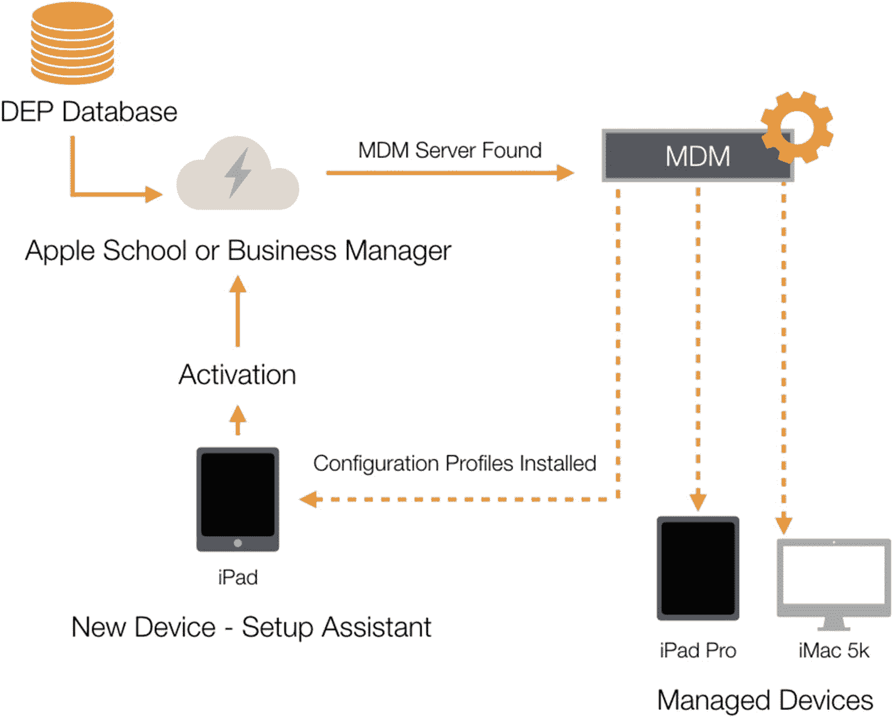

**图 8-1**
展示了`DEP`和`MDM`如何协同工作，以无线方式配置新设备的示意图

## 批量购买计划 (VPP)

假设您需要为组织中每台 iPad 和 Mac 安装`Microsoft Office`套件。您希望能够自动完成此操作，无需最终用户干预，分别从`App Store`（应用商店）和`Mac App Store`（Mac 应用商店）推送安装。同时，您还希望确保用户在收到提示时可以使用自己的`Apple ID`（苹果账号）更新应用，而不是使用单一共享的机构`Apple ID`。苹果为此场景提供了一个解决方案，称为批量购买计划 (`VPP`)。

苹果的`VPP`允许系统管理员从 App Store 购买任意数量的免费或付费应用，并将该应用的许可证分配给一个特定的`Apple ID`。该应用的许可证随时可以从特定用户处移除，然后分配给另一个用户。这使得组织可以为任何参与计划的应用购买一组许可证池，在用户需要时分配给他们，在不再需要时移除许可证。当许可证被移除时，它会重新放回许可证池，以便可以分配给其他用户。

**专业提示**

您可以将`托管式 Apple ID`或个人`Apple ID`与`VPP`结合使用。当您移除某个应用的许可证时，用户将收到应用许可证已被移除的通知，并且他们最多有 30 天时间从该应用的容器中导出数据，或自行购买许可证以继续使用该应用。30 天的宽限期过后，该应用将从设备上消失。

开发者必须选择加入，才能让他们的应用通过`VPP`进行购买。批量购买应用有时会有`VPP`折扣，或者如果您是学术机构的一部分，也可能适用教育折扣。这完全取决于应用开发者或出版商（例如`iBooks`）的决定。

**专业提示**

对于`iBooks`（现在是 Apple Books）而言，可以批量购买教科书或其他书籍的许可证，但与应用程序不同，它们无法被分配、然后移除并重新分配给另一个`Apple ID`。一旦一本书被分配给一个用户，它就归该用户所有，无法退回许可证池。

## 监管与用户批准的 MDM

正如我们之前讨论过的，移动设备管理 (MDM) 是一种无线解决方案，用于向最终用户配置、保护、部署设备，以及管理设备，而无需 IT 人员物理接触这些设备。总体而言，这种统一设备管理的理念非常吸引人，因为我可以像管理`iOS`设备一样管理我的`macOS`客户端，但需要注意平台之间的一些重要差异。

### 设备监管

在第 5 章中，我们讨论了与`iOS`设备和`Apple Configurator`相关的监管。由于`iOS`被设计为单用户操作系统，出于安全和支持考虑，它没有独立的"标准用户"和"管理员用户"来锁定操作系统的特定部分。监管是一种管理组织自有设备的方式，就像系统管理员在台式电脑上使用管理员账户一样。就像我们在`Apple Configurator`中所做的那样，您可以通过 MDM 解决方案监管`iOS`设备，从而获得完整的负载项目录访问权限，以限制和保护设备。

### 用户批准的 MDM

在 `macOS` 中，没有监管模式，因为它被设计为一个多用户操作系统。您可以将配置描述文件负载应用到 Mac 客户端，只要用户不是本地管理员，就无法删除它。需要注意的是，任何在 Mac 上拥有本地管理员权限的用户都可以使用 `Profiles System Preference` 删除任何配置描述文件。如果您使用 MDM 来保护您的 Mac，请确保您的用户帐户是 `Standard` 或 `Managed`。

> 专业提示
>
> `Profiles System Preference` 只有在安装了配置描述文件后才会可见。

您在 `macOS` 客户端上安装的大多数配置描述文件在分配后会立即生效。有一类特殊的配置描述文件负载子集需要最终用户批准后才能生效。这些负载与 Apple 的透明度、同意和控制（TCC）计划相关。具体来说，这些是隐私偏好策略控制负载和内核扩展（kext）策略负载。

有两种方式安装包含这类负载的配置描述文件。一种是在设备上交互式地双击 `.mobileconfig` 描述文件并逐步完成安装和批准对话框。另一种是通过 MDM 解决方案推送配置描述文件，前提是该设备是通过 DEP 注册的。

> 专业提示
>
> Apple 非常坚持与 TCC 相关的负载需要最终用户在设备上亲自批准。为此，他们甚至禁用了与 `Profiles System Preference` 交互以通过 Apple Remote Desktop 或 Screen Sharing 远程批准描述文件的能力。

以下是一些需要用户批准的 MDM 来管理的负载示例：

*   照片
*   相机
*   麦克风
*   提醒事项
*   通讯录（联系人）
*   辅助功能

> 专业提示
>
> 相机和麦克风访问只能通过负载来禁用/拒绝。用户必须在特定应用程序首次使用这些设备时批准其访问权限。

在第 [3] 章中，我们介绍了第三方内核扩展（kexts）的主题，以及最终用户需要在首次运行时使用 `Security & Privacy System Preference` 来批准这些 kexts。如果我们的设备是用户批准的 MDM 设备，我们可以定义并自动将这些 kexts 列入白名单，使其无需提示最终用户批准即可运行。另一种理解用户批准的 MDM 的方式是，系统管理员代表最终用户选择批准这类事项。用户批准的 MDM 是一个我们将在第 [9] 章中继续演示的主题，届时我们将使用 Profile Manager 注册和管理设备。

> 专业提示
>
> 监管 macOS 设备并不会获得特殊的管理能力。截至撰写本文时，管理员帐户在 `macOS` 上仍然优先于配置描述文件。同样，也没有与用户批准的 MDM 相当的 `iOS` 概念，因为这仅适用于 Mac。

## Apple School Manager / Apple Business Manager

如本章前面提到的，Apple School Manager 和 Apple Business Manager 是 Apple 为组织提供的非常相似的管理门户，用于管理 MDM/DEP 和 VPP。Apple School Manager 有一些额外的学术专用功能，例如 `Classroom` 或 `Shared iPad` 选项，这些内容本书将不做介绍。我将使用 Apple School Manager 来演示这两个门户的共同功能以及如何与您的 MDM 解决方案结合使用。

### 配置 Apple 的管理门户

开始使用 Apple School Manager 或 Apple Business Manager 的第一步是创建一个机构 `Apple ID`，Apple 将用它来创建机构管理员帐户。此 `Apple ID` 必须通过多因素身份验证进行保护，并且不应与单个员工的帐户关联。一旦 Apple 授予您访问 Apple School Manager 或 Apple Business Manager 门户的权限，您就可以使用此帐户登录并开始进行设置。根据您所属的组织类型，图 [8-2] 显示了 [`http://school.apple.com`](http://school.apple.com) 和 [`http://business.apple.com`](http://business.apple.com) 的登录窗口。

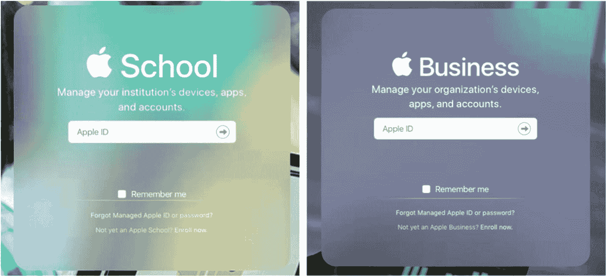

**图 8-2**
Apple School Manager 和 Apple Business Manager 的登录门户

登录门户后，您将看到类似于图 [8-3] 的内容。在这里，您可以管理组织的位置、用户、设备和内容。您可以创建其他用户帐户，并赋予他们各种角色，例如内容管理员或帐户管理员权限，以协助管理您的 Apple 设备和用户帐户。

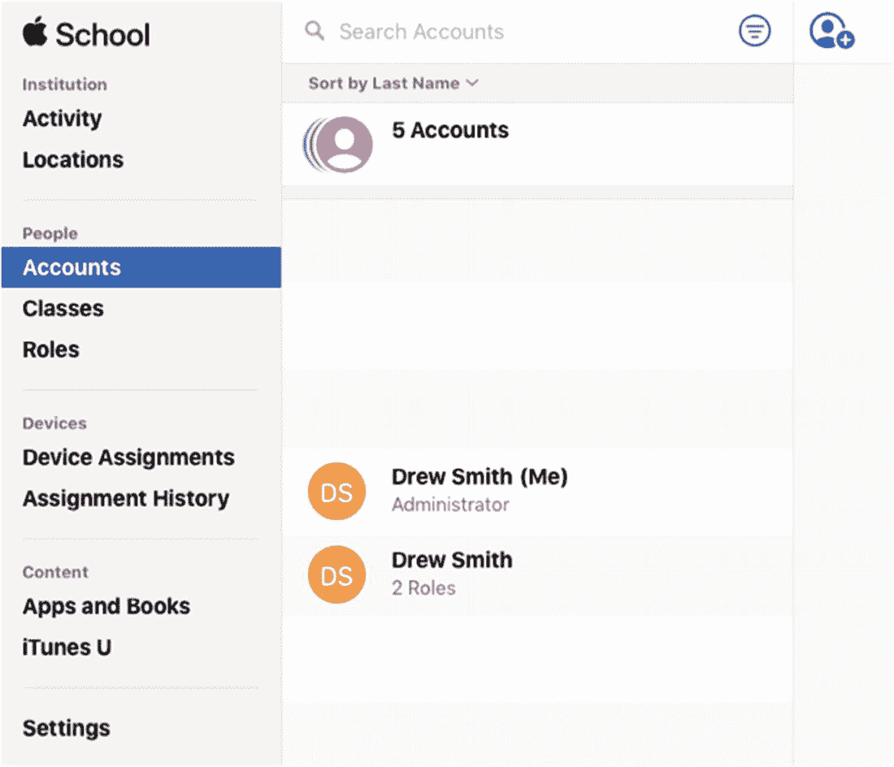

**图 8-3**
Apple School Manager 主页

请随意探索并熟悉以下每个标题下的可用选项：

*   **活动：** 管理门户中近期活动的历史记录。
*   **位置：** 如果您是拥有多个地点的公司或学校，可以为每个建筑添加位置，并按位置定义唯一的密码策略。例如，在学术环境中，K-6 年级与高中的密码限制可能不同。
*   **帐户：** 在这里管理用户帐户。
*   **角色：** 在这里管理各种角色（如站点管理员或员工）的权限。
*   **设备分配：** 这是与设备注册计划数据库交互并将设备分配到特定 MDM 的区域。
*   **分配历史：** 这是 MDM 设备分配的历史记录。
*   **App 和图书：** 在这里与批量购买计划交互，批量购买内容以通过 MDM 解决方案分发。

单击窗口左下角的 `Settings` 按钮，您将看到如图 [8-4] 所示的选项。在这里，您可以定义 VPP、MDM 和客户信息的一些设置。`Device Management Settings` 按钮将显示您的活动客户编号（用于直接从 Apple 购买）或经销商 ID（如果通过参与的第三方购买）。

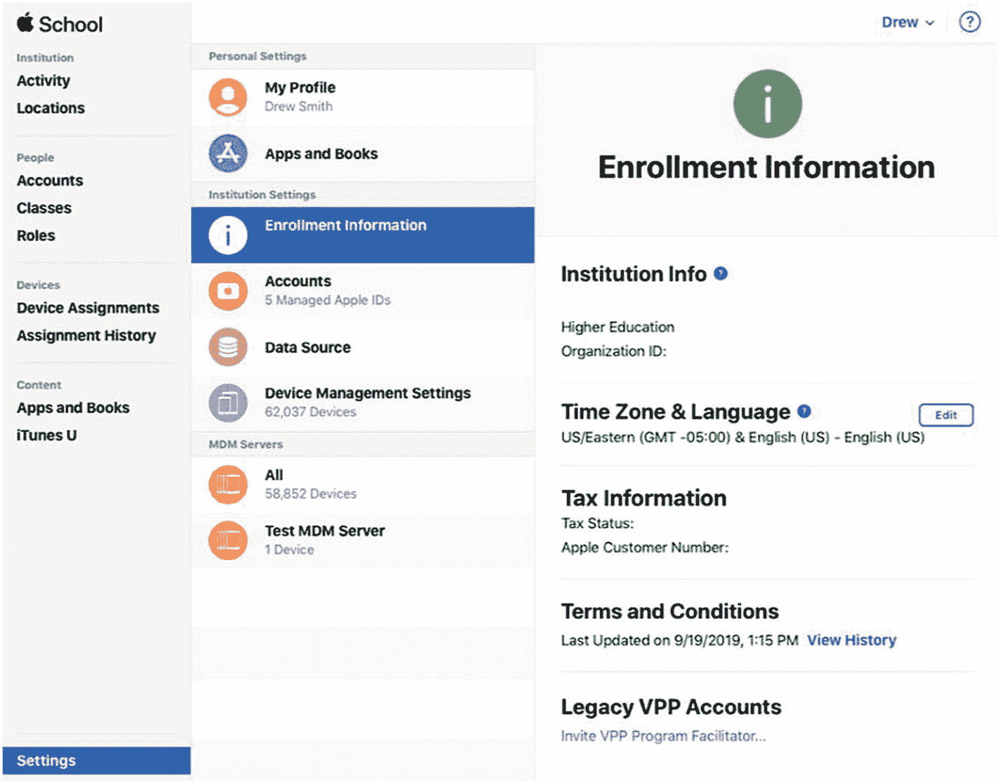

**图 8-4**
客户和机构信息

## MDM 服务器集成

我们首先要做的是创建一个 MDM 服务器记录，以便将我们的服务器与 Apple 校园教务管理实例进行关联。这将允许我们将特定设备分配给运行`Profile Manager`的`macOS Server`并进行管理。

### 配置描述文件管理器与 DEP

1.  第一步是浏览 Apple 校园教务管理/Apple 商务管理门户网站中的**设置**。点击**设备管理设置**，然后点击**添加 MDM 服务器**按钮，如图 8-5 所示。

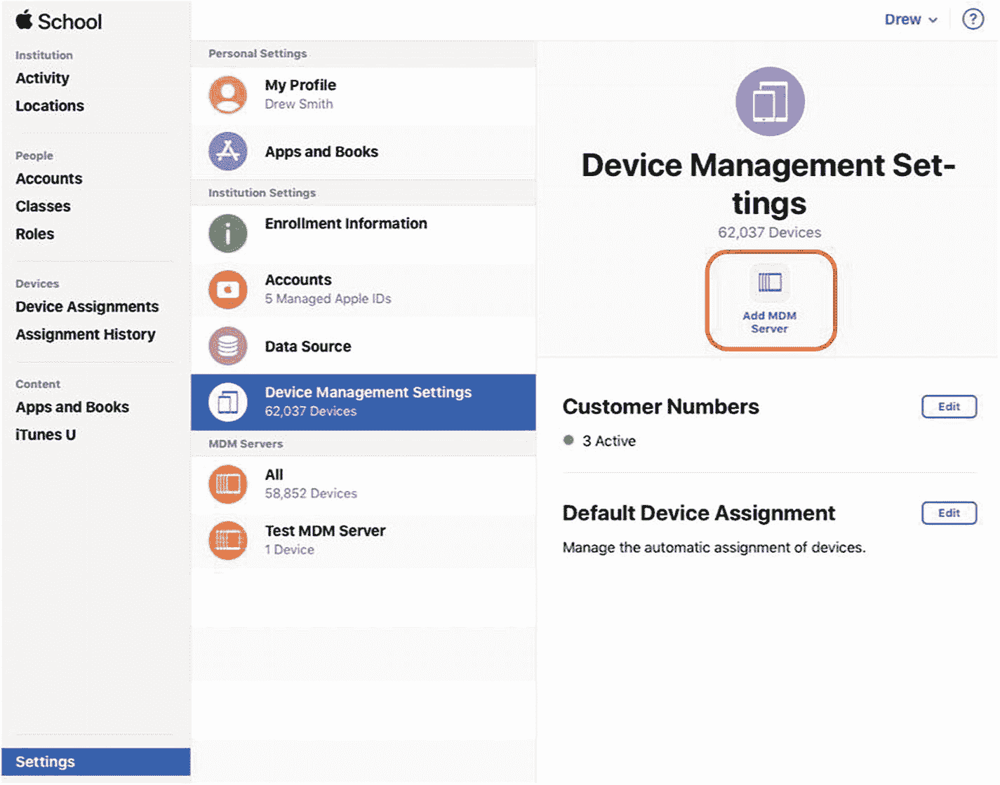

图 8-5
在设备管理设置中点击添加 MDM 服务器

**专业提示** 你务必记下令牌的到期时间（每 365 天），以便你能在导致服务中断之前续订。你还应注意 Apple 针对你的 Apple 校园教务管理或 Apple 商务管理账户所做的条款和条件更新。这些更新通常在发布主要新功能或新操作系统版本时进行。你需要定期进入管理门户并同意这些新条款，否则 DEP/VPP 服务可能无法正常工作，直到你同意为止。

2.  要配置 MDM 服务器信息，你需要提供一些项目，包括名称和公钥，以便在 DEP 和你的 MDM 服务器之间建立安全连接。为此 MDM 服务器起一个描述性的名称。我将把我的服务器命名为“我的公司 MDM 服务器”。我将保持**允许此 MDM 服务器释放设备**复选框为选中状态。你的屏幕应类似于图 8-6。

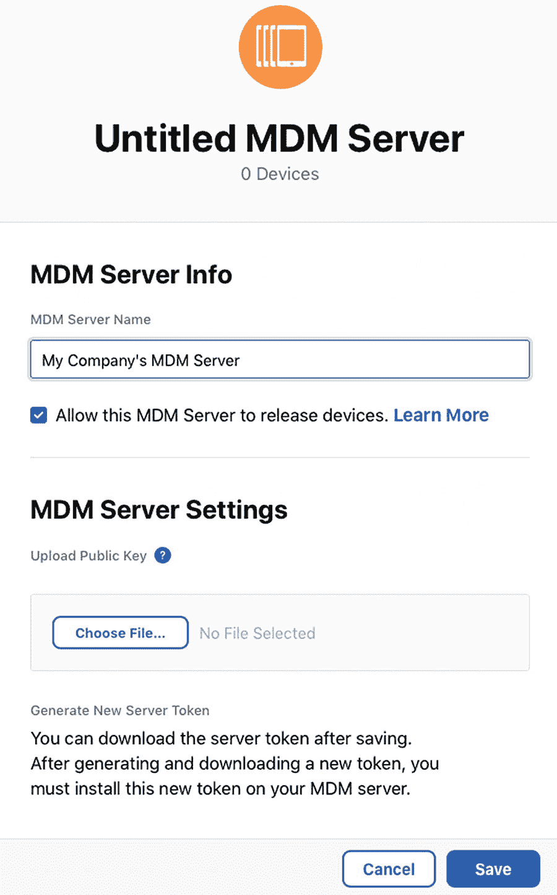

图 8-6
为服务器命名并上传公钥

**专业提示** 当你的组织购买设备时，它们会被自动放置在 DEP 数据库中。如果你的组织想要出售或处置该设备，根据 Apple 校园教务管理/Apple 商务管理的服务条款，Apple 要求你将该设备从 DEP 数据库中移除。释放设备是 Apple 用来表示将设备从你组织的 DEP 数据库中移除的术语。

3.  接下来，我们需要从运行在我们 Mac 服务器上的 Profile Manager 实例中获取公钥。切换到 **Server** 应用，点击描述文件管理器服务。在**部署计划**部分，有几个选项，如图 8-7 所示。根据你组织所属的计划，你将需要选择 **Apple 校园教务管理** 或 **Apple 商务管理**，并点击相应选项下的 **配置…** 按钮。

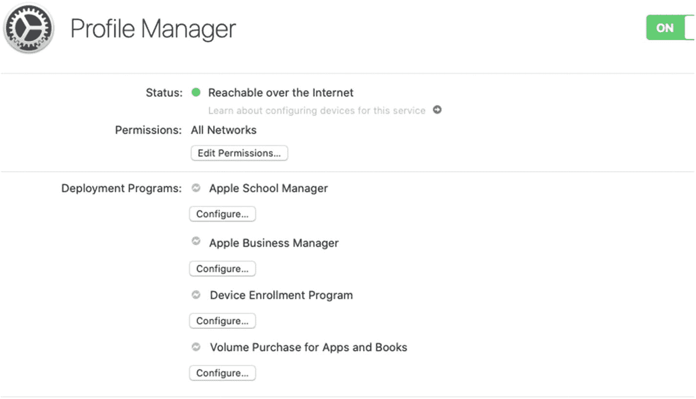

图 8-7
点击与你组织对应的部署计划下的配置…按钮

**专业提示** 现在是检查你 Mac 服务器上 `日期与时间系统偏好设置` 的好时机。你需要确保时区、日期和时间在继续之前都是准确的，否则在配置与云托管服务的安全连接时可能会遇到错误。

4.  我将使用 **Apple 校园教务管理**，因此我点击该标题下的 **配置…** 按钮。配置助理做的第一件事是提醒你，在继续之前需要能够访问在线管理门户 `business.apple.com` 或 `school.apple.com`。点击 **下一步** 继续。

5.  在下一个对话框中，你将看到一个可用于 Apple 校园教务管理网站的 **公钥**。这是我们继续配置 MDM 连接所需的密钥。点击 **导出…** 按钮，如图 8-8 所示。将其保存到桌面。

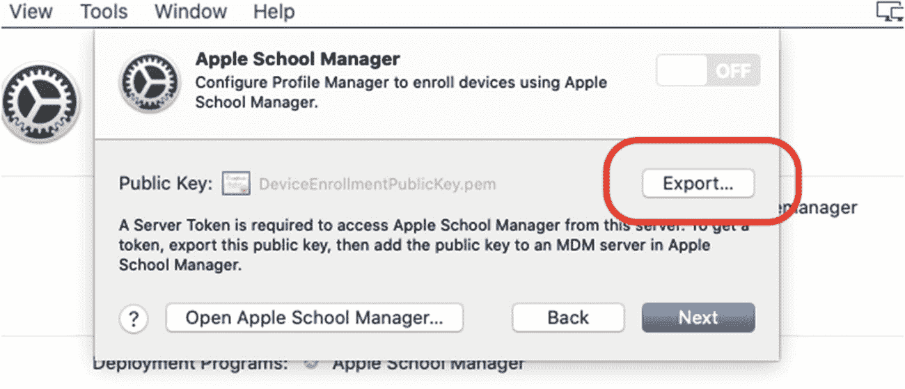

图 8-8
导出你的服务器公钥

6.  接下来，返回 Apple 校园教务管理，点击 **MDM 服务器设置 ➤ 上传公钥** 选项下的 **选择文件** 按钮，如图 8-9 所示。选择你从描述文件管理器配置助理下载到桌面的 `*.pem` 文件。添加公钥后，点击 **保存** 按钮。

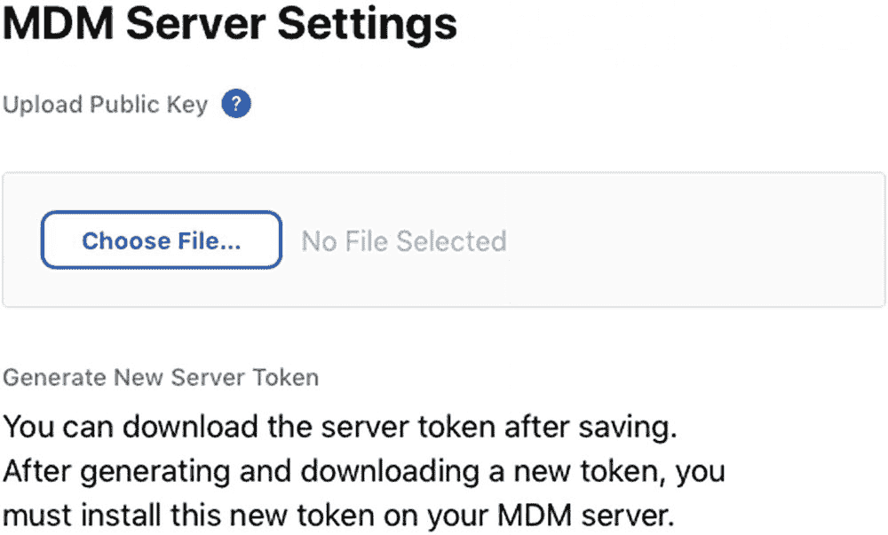

图 8-9
将你服务器上的公钥上传到管理门户的这一部分

7.  点击 **保存** 按钮后，页面将刷新，你将有一个下载令牌的选项，如图 8-10 所示。点击 **下载令牌** 按钮并将文件保存到桌面。它会警告你下载令牌将重置所有正在使用的现有令牌。由于我们没有任何现有令牌，我们可以忽略此警告并点击 **下载令牌** 按钮继续。

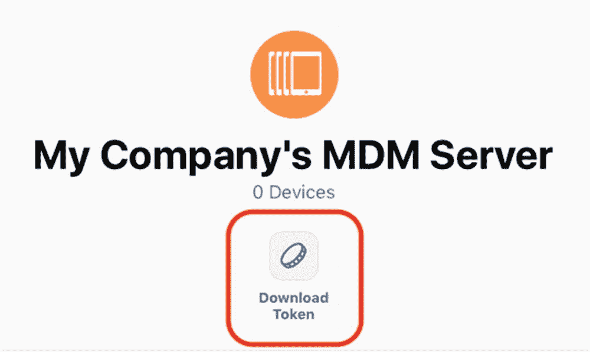

图 8-10
点击下载令牌按钮到桌面

8.  接下来，我们需要切换回我们的 Mac 服务器，并使用刚刚下载的 `*.p7m` 令牌完成配置助理。点击 **下一步**，进入我们将上传令牌的对话框。点击 **选择…** 按钮选择 **令牌文件**，如图 8-11 所示。然后点击 **继续** 按钮。

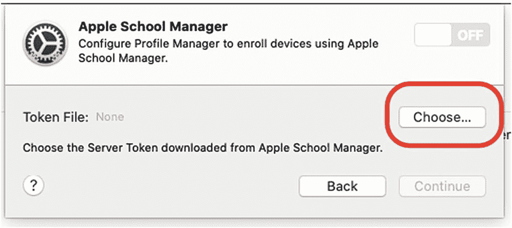

图 8-11
选择你从管理门户下载到桌面的令牌文件

9.  一旦成功完成，点击 **完成** 按钮结束配置。你现在应该像我在图 8-12 中那样，在所选部署计划旁边看到一个绿点。

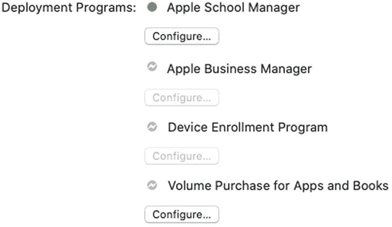

图 8-12
我的服务器上的 Apple 校园教务管理有一个绿点，表明它正在运行

## 管理 DEP 客户端

现在我们已经配置好了 MDM 服务器，接下来需要将 DEP 数据库中的一些客户端添加到我们的特定服务器。由于我的组织中可以有多个 MDM 服务器，因此我需要手动将设备移入我想要使用的服务器。如果您只有一个 MDM 服务器，并且希望用该服务器管理所有设备，您可以将所有设备移入该服务器，并将其设置为`默认设备分配`，这样任何新购买的设备都会自动分配给这个 MDM 服务器。

为此，只需在 Apple 校园教务管理/Apple 商务管理中浏览至`设置 ➤ 设备管理设置 ➤ 默认设备分配`，点击`编辑`按钮，为每个设备组选择特定的 MDM 服务器，然后点击`应用`保存更改，如图 8-13 所示。

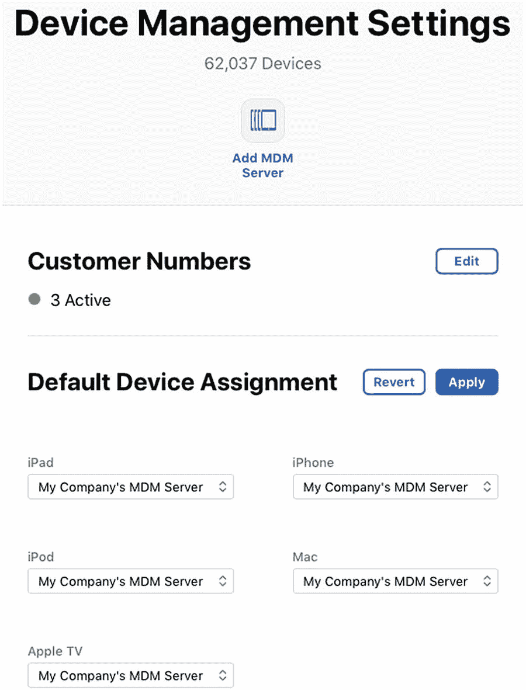

图 8-13
按产品配置默认设备分配

接下来，让我们将一台测试 iPad 和一台测试 MacBook Pro 分配给我们新创建的 MDM 服务器。首先，在 Apple 校园教务管理的`设备`标题下点击`设备分配`链接。您应该会看到类似图 8-14 的内容。

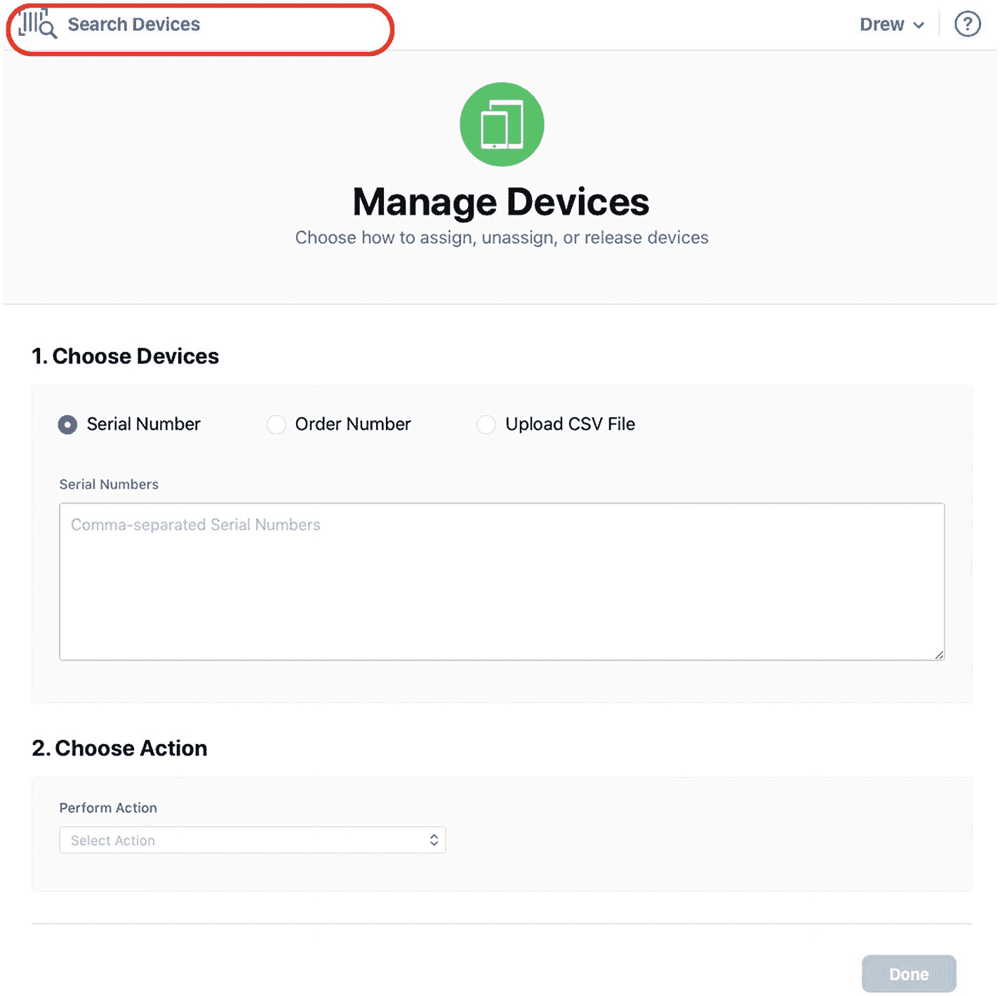

图 8-14
Apple 校园教务管理中的“管理设备”页面

在此屏幕上，您可以通过搜索设备或输入其序列号来逐个选择设备，也可以上传一个 `*.csv` 文件进行批量分配。由于我们只需要分配两台设备，我们将点击屏幕左上角的`搜索设备`链接，然后通过序列号手动搜索我们的设备。我输入了一台拥有的`iPad Air`的序列号，它在 DEP 数据库中找到了该设备，如图 8-15 所示。

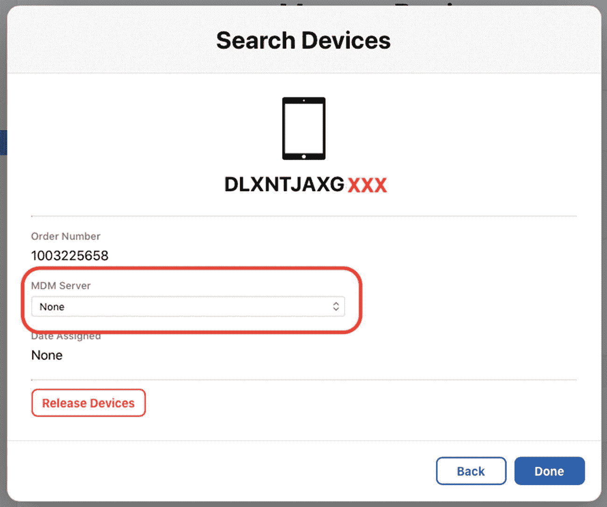

图 8-15
搜索设备页面允许我将设备分配给我的特定 MDM 服务器

在此屏幕上，我可以查看订单号（作为购买凭证），并将其分配给特定的 MDM 服务器。在我的案例中，我将从弹出菜单中选择`"我公司的 MDM 服务器"`。我也可以点击`释放设备`按钮来释放此设备。我将把它分配给我的 MDM 服务器，然后点击`完成`按钮。

Apple 校园教务管理将更新设备分配，我可以再次点击`完成`按钮退出。为了确认我的设备已被分配，我可以浏览至`设置 ➤ 我公司的 MDM 服务器`，并确保在`设备`部分下列出了`1 台 iPad`，如图 8-16 所示。为其他 iOS 设备和至少一台测试 Mac 重复此过程。

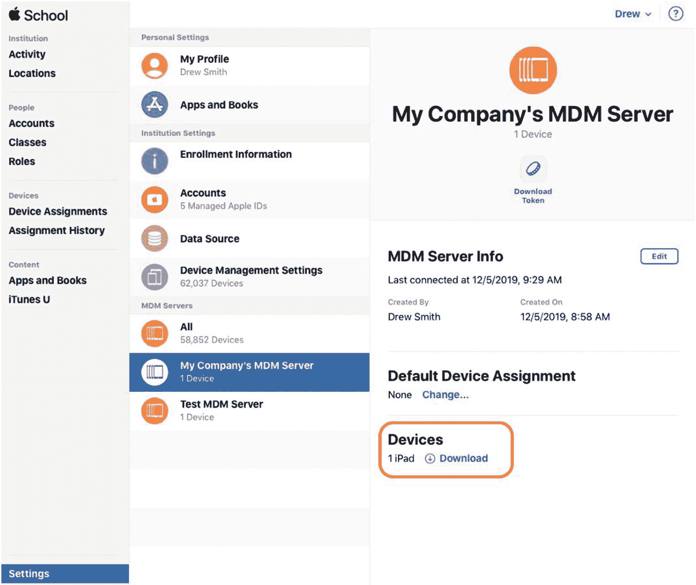

图 8-16
确认我们的测试设备已分配到新的 MDM 服务器

现在，我们至少有一台 Mac 和一台 iOS 设备连接到了我们的 MDM，我们已经准备好在描述文件管理器中开始管理这些设备。我们将在第 9 章详细探讨描述文件管理器。

## 托管式 Apple ID

在本书的不同章节中，我已经多次提及`托管式 Apple ID`。`托管式 Apple ID` 是通过 Apple 校园教务管理和 Apple 商务管理创建并绑定到您的组织的 Apple ID。这允许您的组织为每个学生或员工提供一个非商业用途的`Apple ID`，可用于`iTunes U` 或 `iCloud` 等。它们不能用于在各个 App Store 购买 App 或图书，但您可以使用 MDM 将 App 和图书分配给`托管式 Apple ID`，并且无需 Apple 介入即可为这些 ID 执行密码重置。

托管式 Apple ID 的典型格式是 `username@appleid.company.com` 或 `username@appleid.institution.edu`。您可以在组织中为每个用户手动创建这些 ID，也可以通过 `Active Directory` 连接器自动配置它们。Apple 支持使用 `Microsoft Azure Active Directory` 进行联合身份验证。您可以使用安全断言标记语言 (SAML) 将您的 `Azure AD` 连接到 Apple 校园教务管理或 Apple 商务管理，而不是为组织中的每个用户创建`托管式 Apple ID`。用户首次使用其 AD 凭据登录时，系统会为其创建一个`托管式 Apple ID`。

您可以在 `Apple 校园教务管理` 或 `Apple 商务管理` 中，通过浏览至`设置 ➤ 帐户`并调整设置来配置这些选项，如图 8-17 所示。

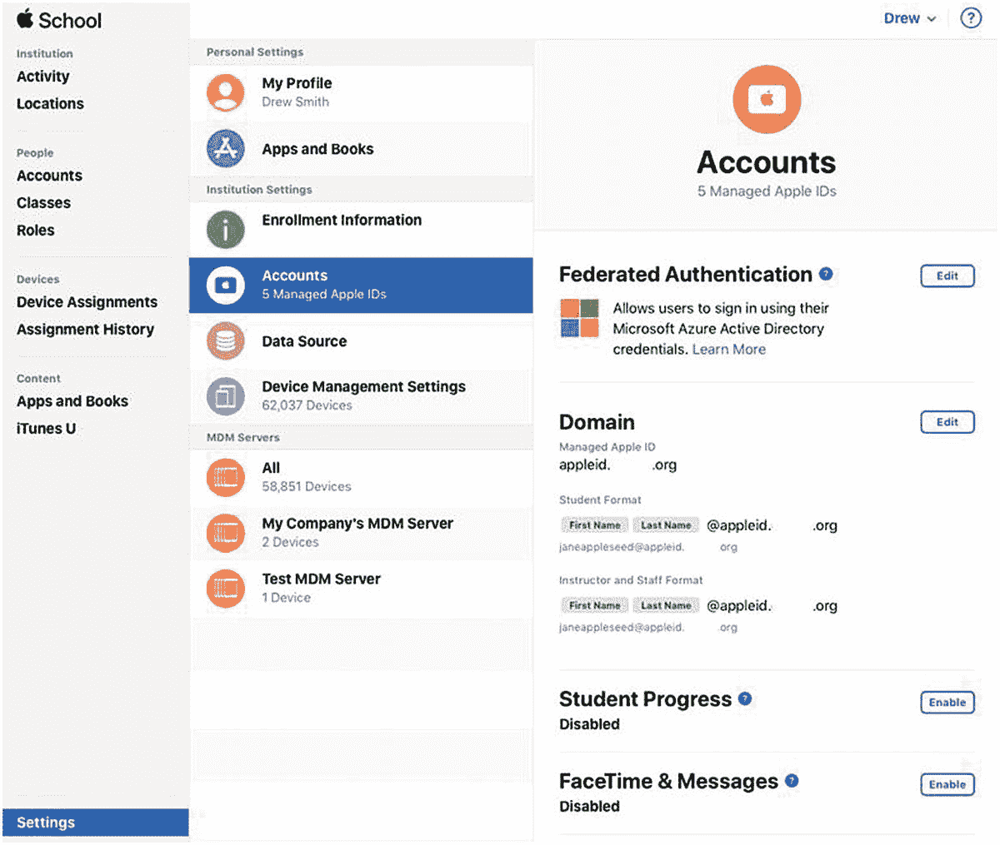

图 8-17
托管式 Apple ID 和 Azure AD 的帐户设置

## 使用 VPP 兑换 App 和图书

最后，为了配合描述文件管理器使用，我们需要配置的最后一项是批量购买计划 (VPP)，这样我们就可以兑换 App 和图书并将其分配给我们的设备。这个过程类似于我们之前创建 MDM 连接到描述文件管理器的过程。

### 为描述文件管理器配置 VPP

1.  第一步是登录我们的 Mac 服务器，打开`服务器`应用，点击描述文件管理器服务。在`部署计划`部分，找到`App 和图书批量购买`，点击`配置…`按钮，如图 8-18 所示。

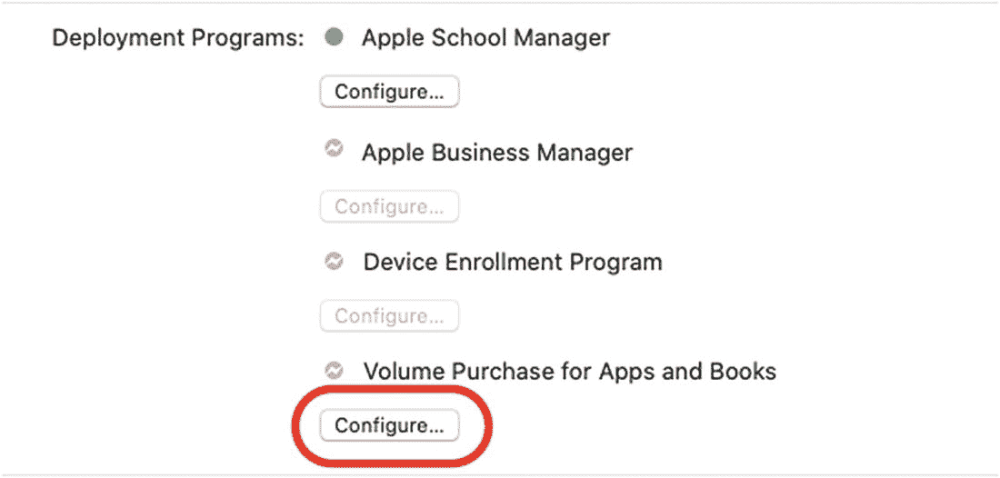

图 8-18
点击 VPP 部分下的配置…按钮

2.  系统将提示您选择一个 VPP 令牌。打开 `Apple 校园教务管理` 或 `Apple 商务管理`，浏览至`设置 ➤ App 和图书`。向下滚动到`我的服务器令牌`标题下的底部区域，点击您组织位置名称旁边的`下载`按钮，如图 8-19 所示，将文件保存到您的桌面。

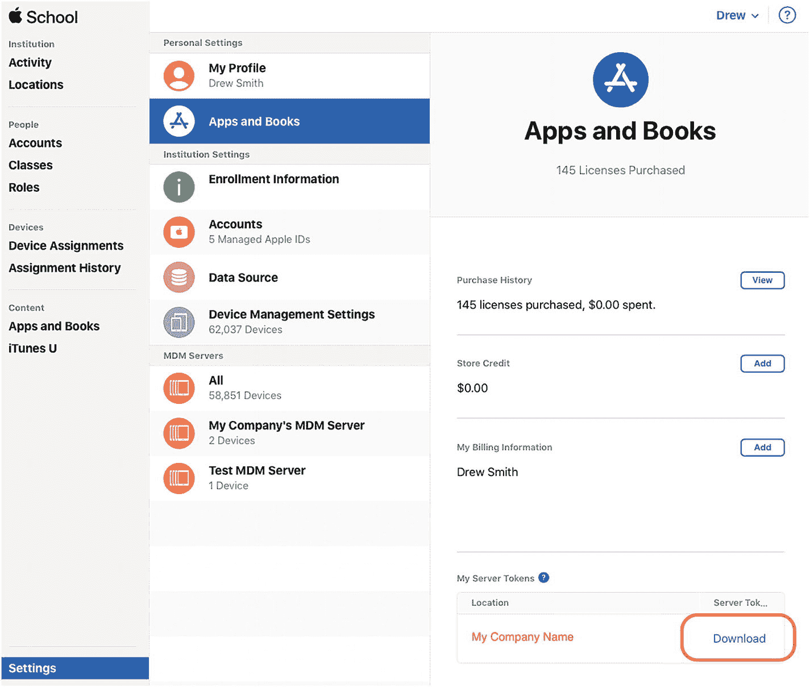

图 8-19
点击“App 和图书”窗格上的下载按钮

3.  一旦它将 `*.vpptoken` 文件下载到您的计算机，点击批量购买配置助手里的`选择…`按钮，然后选择 VPP 令牌文件，如图 8-20 所示，然后点击`继续`。

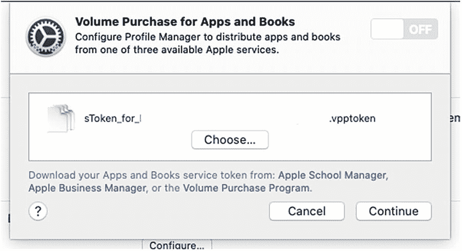

图 8-20
将 VPP 令牌文件上传到描述文件管理器

4.  完成后，`App 和图书批量购买`将启用，我们可以使用 MDM 通过描述文件管理器向用户和设备部署 App 和图书。点击`完成`退出。

## 总结

在本章中，您深入了解了关于移动设备管理 (MDM)、批量购买计划 (VPP) 以及 Apple 校园教务管理/Apple 商务管理的概念基础。现在我们已经配置了与描述文件管理器服务器的连接，并添加了几个测试设备，我们已准备好开始对这些测试端点进行无线管理。

在第 9 章中，我们将运用所学的概念，使用描述文件管理器作为我们的 MDM，远程配置我们的 `iOS` 和 `macOS` 设备。

