# 9. 描述文件管理器

虽然苹果的营销材料中并未过多提及，但苹果确实提供了自家的第一方移动设备管理（MDM）解决方案。`描述文件管理器`是包含在 `macOS 服务器`产品中的一项服务。对于中小规模的 `macOS` 和 `iOS` 部署，它足以胜任工作，使得您的组织可能无需购买第三方的 MDM 方案。无论选择何种 MDM，其核心概念是相通的。本章我们将使用描述文件管理器来解释所有商业 MDM 解决方案中都具备的基本功能。

## 描述文件管理器简介

本章将继续第 7 章和第 8 章的内容。至此，您应该已经在 `macOS 服务器`上配置好了 `描述文件管理器`。它应该能够在公共互联网上访问，并且 DEP 和 VPP 配置也已就绪。最后（也是最重要的），您的 `描述文件管理器`服务应正在使用来自受信任证书颁发机构的已签名证书。

您还应在 Apple 校园教务管理/Apple 商务管理中，将至少两台测试设备分配至您的 MDM 服务器——一台 Mac 和一台 iOS 设备。完成所有设置后，从任意电脑上打开您选择的网页浏览器，并访问 `https://yourdomain/profilemanager/`。例如，在我的例子中，我会像第 7 章末尾所做的那样，访问 `https://579testing.com/profilemanager`。使用您的服务器管理员账户登录以继续。

> **专业提示**
> 在生产环境中，您应在服务器上创建一个标准用户账户，并在网页上使用描述文件管理器时用该账户登录，而不是使用本地管理员账户。

### 描述文件管理器的用户界面

首次登录描述文件管理器时，满屏的复选框、选项卡和列表可能会让人有些不知所措。图 9-1 和随附的项目列表简要概述了所有这些界面元素的功能。本章我们将通过一些实际操作练习，与其中的大多数选项进行交互。

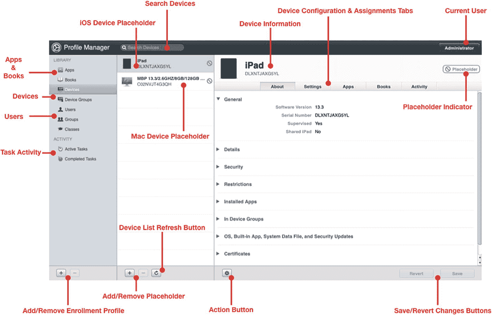
*图 9-1 描述文件管理器用户界面*

*   **iOS 设备占位符：** 这是运行 `iOS` 但尚未连接到您的 MDM 且当前未被管理的设备。
*   **Mac 设备占位符：** 这是运行 `macOS` 但尚未连接到您的 MDM 且当前未被管理的设备。
*   **占位符指示器：** 此指示器表明该设备记录仅仅是一个占位符。一旦我们在设备上安装了 `注册描述文件`并且设备已向 MDM 报到，此消息就会消失。
*   **添加/移除占位符：** 允许您根据序列号、UDID、IMEI 和 MEID 手动为任何设备创建占位符。
*   **搜索设备字段：** 允许您在您的所有设备中搜索特定的一台。
*   **设备信息：** 所选设备的快速摘要，包括名称和序列号。
*   **设备配置和分配选项卡：** 这是我们将特定 `配置描述文件` 载荷、App 和图书分配给所选设备的区域。
*   **当前用户：** 指示当前登录 `描述文件管理器` 网站的用户。点击此按钮会显示其他账户选项，包括注销。
*   **保存/恢复更改按钮：** 允许您保存并应用配置更改，或取消您所做的更改。
*   **操作按钮：** 此按钮允许您向受管设备发送命令。一些较常见的操作包括 `清除激活锁`、`获取设备位置`、`清除密码`、`抹掉` 和 `锁定`。可供您使用的操作取决于设备类型（`iOS` 与 `macOS`）以及是否受监督。
*   **设备列表刷新按钮：** `描述文件管理器` 会始终在后台通过 Apple 校园教务管理或 Apple 商务管理与 VPP 和 DEP 同步。点击此按钮会强制在服务之间立即同步数据。
*   **添加/移除注册描述文件：** 这些按钮允许您创建或移除自定义的 `配置描述文件`，这些描述文件可以手动应用到系统上，以便将它们注册到您的 MDM 中。
*   **任务活动：** 提供当前任务的状态，并提供已应用到设备的任务历史记录。
*   **用户或群组：** 按用户或群组管理设备设置、描述文件和 App。
*   **设备或设备群组：** 按设备或设备群组管理设备设置、描述文件和 App。
*   **App 和图书：** 用于添加或查看 VPP 授权，并可将其应用于用户、群组或设备的界面。

### 注册设置

我们将在本章后面探索用户和群组区域，但在开始将设备注册到 MDM 之前，我们需要快速修改一个设置。点击描述文件管理器窗口左侧边栏中的 `群组` 按钮。点击 `所有人` 群组，然后展开 `关于` 选项卡下的 `限制` 选项，以显示如图 9-2 所示的设置。请确保此示例中勾选的选项与您的设置匹配，特别是 `允许使用设备注册程序配置的设备在“设置助理”过程中进行注册` 选项。我们需要此项设置到位，DEP 注册练习才能正常工作。如果您做了任何更改，请点击 `保存` 按钮来应用更改。

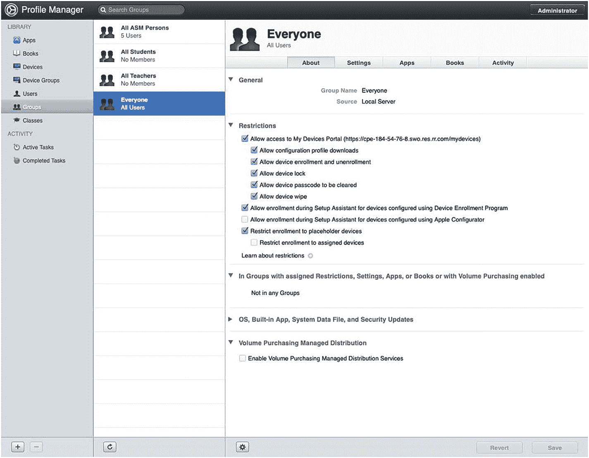
*图 9-2 “所有人”群组的注册设置*

> **专业提示**
> 我还建议勾选 `将注册限制为占位符设备` 旁边的复选框，这样只有您已为其创建占位符的设备才真正能够注册。这将有助于设备管理，并防止不受控的设备出现在您的 `设备` 列表中。请记住，您的 `描述文件管理器` 实例可从公共互联网访问，因此如果未勾选此项，随机人员可能会自行注册。

## MDM 注册

有几种方法可以将设备注册到您的 MDM 解决方案。注册过程基本上包括将 `配置描述文件` 应用到设备上，该描述文件会引导设备连接到您的特定 MDM。有多种方法可以实现这一点，您选择的方法将决定管理该设备时可用的设置、选项和安全级别。在本节中，我们将探讨四种最常见的方法，并分析每种方法的优缺点。


## 设备注册计划（DEP）与设置助手的集成

目前，在 MDM 中注册设备的最佳选项是在设备运行`设置助手`时使用`DEP`。通过这种方式，你不仅可以强制注册，而且每次设备激活时都会进行注册，这意味着即使设备被重置或恢复，它也会在用户登录之前再次自动被管理。当设备以这种方式注册时，必要的信任证书也会被安装，因此设备将自动配置为信任你的`MDM`。当信任证书到位后，通过我们的`MDM`解决方案推送`配置描述文件`时，我们就不需要对其签名了。

这种注册方法的主要缺点是，你需要将`Apple 校园教务管理`或`Apple 商务管理`与你的`MDM`配置好，并且设备必须位于你的`DEP`数据库中。如果你确实已将`DEP`集成与`MDM`配置好，并且你直接从苹果或通过参与的`苹果授权经销商`购买设备，那么这就是你应该选择的方法。

### 使用 DEP 进行 MDM 注册

在这个例子中，我们将使用`设置助手`集成功能将一台测试`iPad`注册到我们的`描述文件管理器 MDM`中。承接前一章的内容，我们应该已经有一台测试`iOS`设备作为占位符添加到了`MDM`中。`描述文件管理器`的`设备`列表应类似于图 9-3，其中至少列出了一台`iOS`设备。

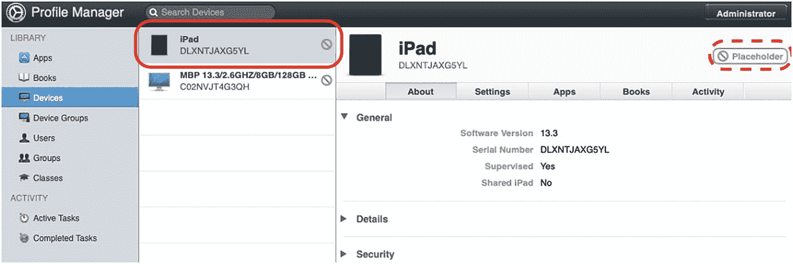

**图 9-3**

在`Apple 校园教务管理`中将设备分配给我们的`MDM`服务器时，由`DEP`创建的`iPad`占位符

1.  注册设备的第一步是点击`设备`列表中的`iPad`占位符，然后点击`设置`选项卡。
2.  向下滚动到`注册设置`➤`设置助手期间注册`，如图 9-4 所示。勾选以下复选框：
    1.  `在设置助手期间提示用户注册设备`
    2.  `不允许用户跳过注册步骤`
    3.  `监督`
    4.  `允许与 Mac 配对（已弃用）`
    这些设置将强制设备在`设置助手`期间注册，并且允许任何最终用户注册它。一旦注册完成，它也将被监督，这样我们就可以使用全套配置工具来管理它。

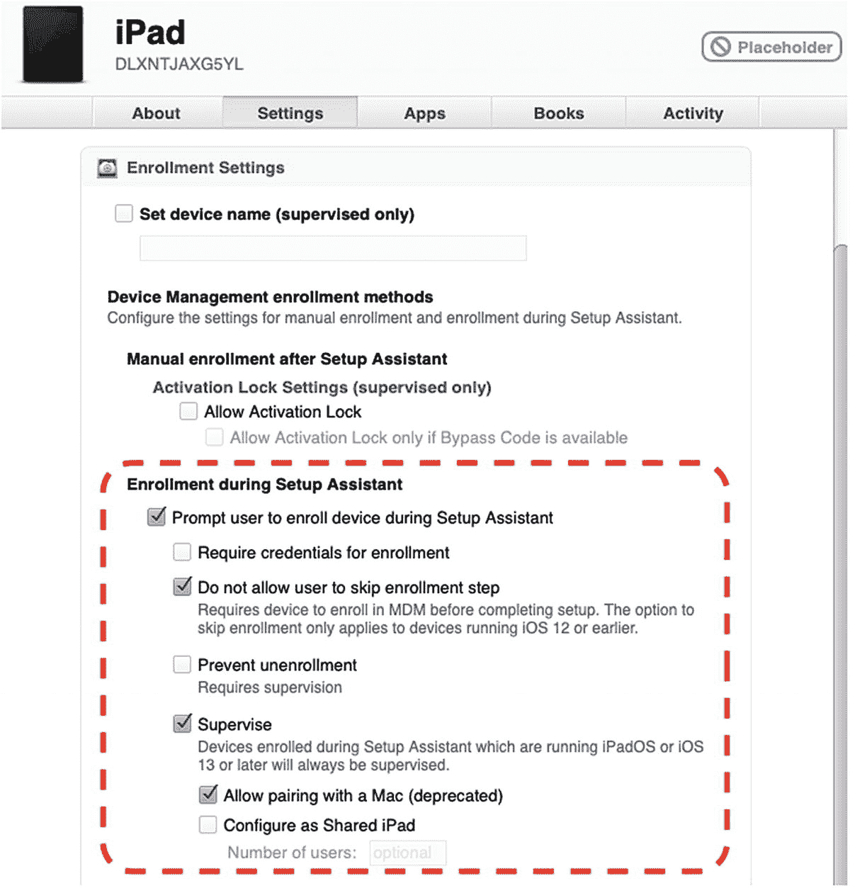

**图 9-4**

`设置助手期间注册`设置

3.  接下来，再向下滚动一点到`设置助手选项`部分，如图 9-5 所示。除以下项外，取消勾选所有选项：
    1.  `密码锁`
    2.  `外观`
    3.  `新功能亮点`
    4.  `欢迎`
    我们将使用此设置来测试注册是否成功，方法是跳过除密码锁设置、暗色模式提示、`iPadOS`功能演示和`欢迎`屏幕之外的所有选项。点击窗口右下角的`保存`按钮。

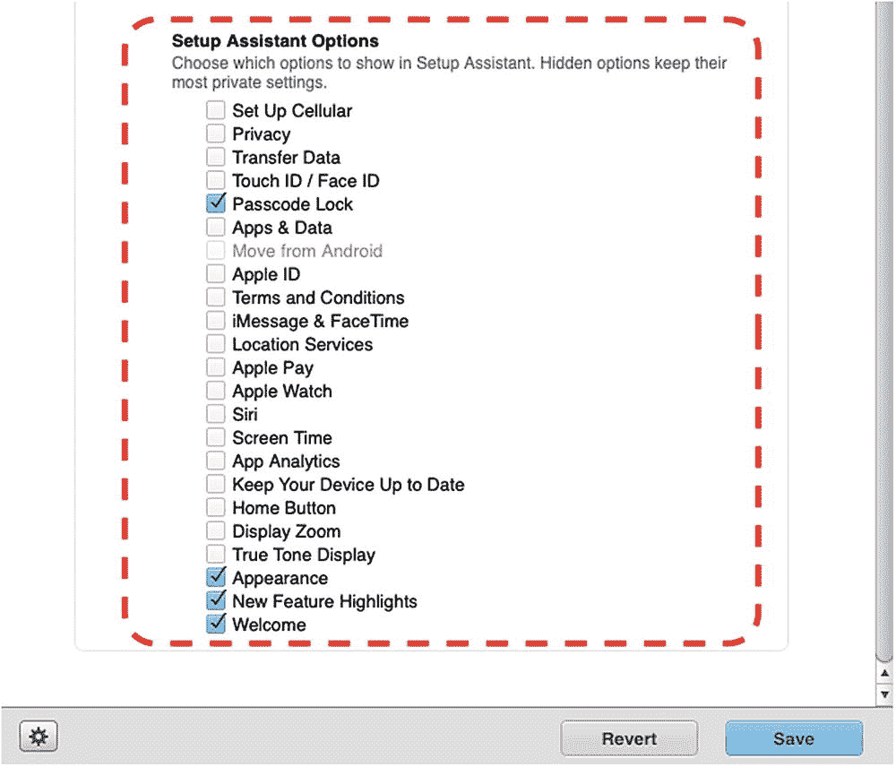

**图 9-5**

`设置助手选项`

4.  你可以点击`活动`选项卡，确认`iPad`的`DEP 描述文件`已上传到`Apple 校园教务管理`/`Apple 商务管理`，从而准备好在`设置助手`期间进行注册，如图 9-6 所示。

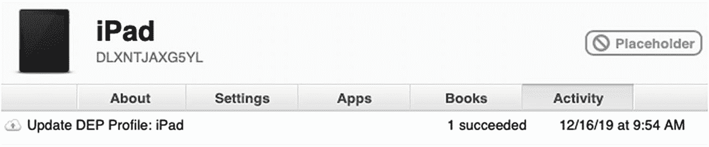

**图 9-6**

确认我们的设置更改已上传至`ASM`

5.  接下来，拿起测试`iPad`，确保它运行的是全新安装的操作系统。如果它已经被激活，在尝试将其注册到`MDM`之前，请使用`抹掉所有内容和设置`选项或通过`iTunes`/`访达`进行恢复。
6.  启动`iPad`，逐步完成加入`Wi-Fi`网络和激活过程。一旦通过初始激活步骤，它应该会提示你安装`配置描述文件`，如图 9-7 所示。如果没有显示此屏幕，请重新检查这些步骤，恢复/重置`iOS`设备，然后重试。

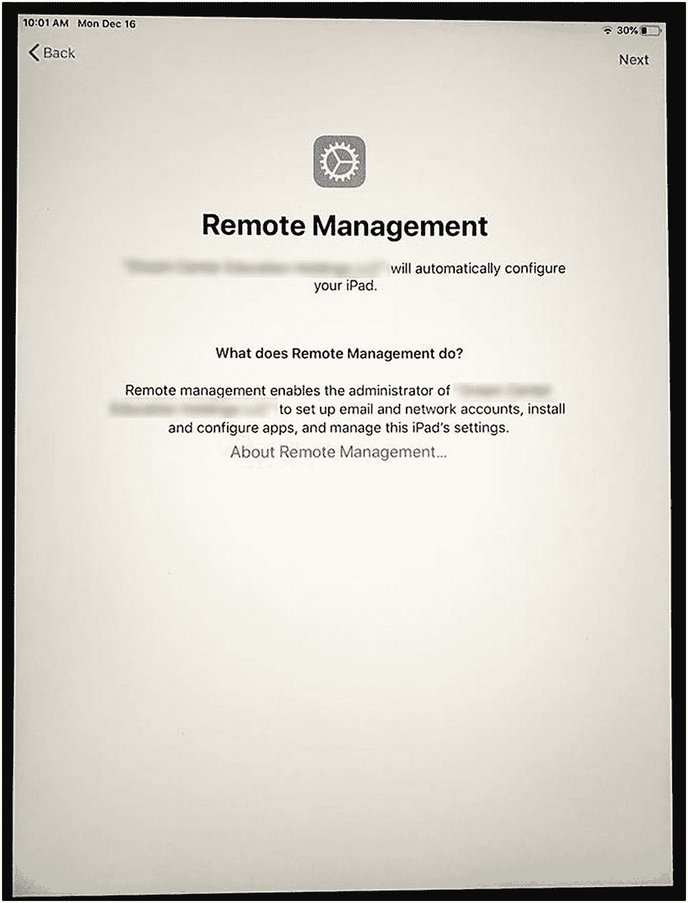

**图 9-7**

我们测试`iPad`上的`远程管理`提示

7.  如果回到`描述文件管理器`，你会看到`活动`选项卡将显示设备已注册，并且我的设备上的`占位符`标签已被移除，如图 9-8 所示，表明它现在已被管理。

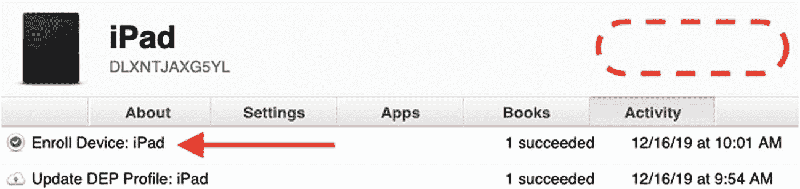

**图 9-8**

设备注册确认和时间/日期戳

8.  你也可以浏览到`设置`➤`远程管理`，看到我们的“MyCompany”`MDM 描述文件`和证书已安装，如图 9-9 所示。你的用户还将在`设置`窗口的左上角看到你的监督标识。

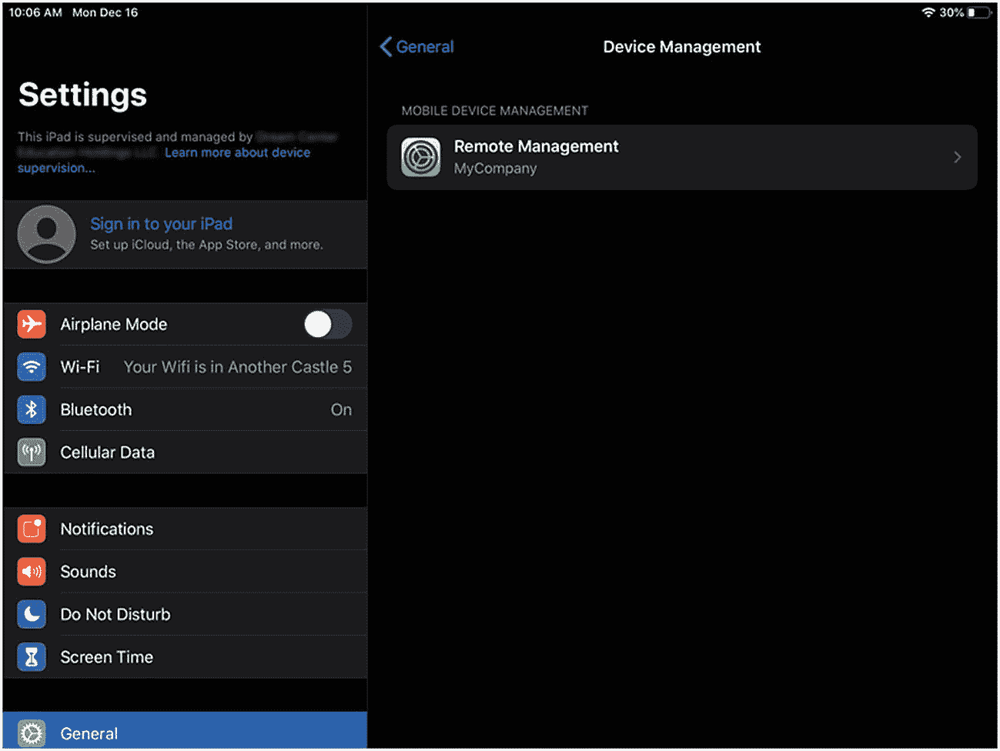

**图 9-9**

我们的`管理描述文件`已安装，设备已受监督

9.  点击`下一步`以逐步完成配置过程。这将需要几分钟时间来配置设备并将其注册到`MDM`中。然后它会提示你设置密码、选择浅色或深色模式、向你介绍`iPadOS`功能，最后用`欢迎`和`开始使用`按钮问候你，带你进入`主屏幕`。

### 专业提示

如果你在使用了`网络地址转换 (NAT)`的无线网络上大规模部署`iOS`设备，需要记住的一件事是：如果`iOS`设备从同一个公网`IP`地址连续快速地进行空中激活，苹果可能会限制多台设备的激活。例如，在学校这样的大型组织中，你可能同时有数十或数百台设备在激活，你可能会遇到激活失败的问题。我建议与你所在机构的苹果代表沟通，将你的公网`IP`地址加入白名单，以避免此问题。

对于`macOS`客户端，此过程非常相似，除了少数仅适用于 Mac 的独特功能。探索基本注册设置，并将你的`测试 Mac`配置为在`设置助手`期间注册，并跳过除`条款与条件`提示之外的所有步骤。你应该能够使用`DEP`轻松地将你的测试`Mac`客户端注册到`MDM`中。试试看！


### 我的设备门户

接下来一种设备注册方式是使用内置于 `Profile Manager` 的自助服务式 `我的设备门户`。使用设备门户注册方法有一些注意事项。这确实旨在用于“自带设备”部署场景，因此你的 iOS 设备将无法被监督。除了这一限制之外，最终用户可以随时移除 MDM 注册，而你却毫不知情。使用 `我的设备门户` 的主要好处是，你组织的用户可以在无需将设备交给你（IT 部门）进行配置的情况下，注册 MDM。

要配置自助服务注册，我们需要做一些快速调整。我建议你禁用“所有人”组访问 `我的设备门户` 的权限，如图 9-10 所示。

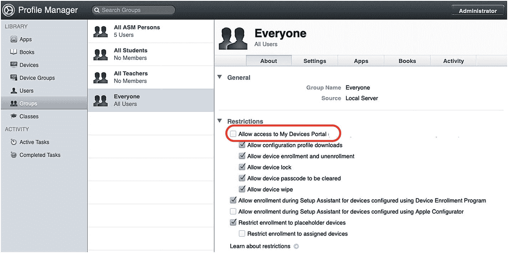

图 9-10

取消勾选“允许访问我的设备门户”选项

我还建议创建一个名为 `BYOD` 或 `自服务` 的新用户组，并将 `我的设备门户` 的访问权限限制为该组成员。你应该实施某种访问管理流程，例如通过一个 Web 表单或向 IT 部门提交故障工单，让用户在其中请求 BYOD 访问权限并向你提供其设备序列号，这样你就能为该设备设置一个占位符并将用户添加到 `BYOD` 组中。这样一来，就不会有任何未经你知情或同意的设备被添加进来。

**专业提示**

如果你正在使用 `Apple 校园教务管理` 或 `Apple 商务管理`，你应该通过管理门户管理你的用户和群组，或者配置 `Azure AD` 集成。否则，你可以使用 `服务器` 应用中的 `用户与群组` 来创建这些账户。

一旦你按要求设置了必要的用户和群组，请确保你创建的新 `BYOD` 组有能力访问 `我的设备门户` 及相关设置，如图 9-11 中我的 `所有 ASM 人员` 组所示。接下来，我们需要为个人设备配置一个占位符，并将其与我们的最终用户关联。

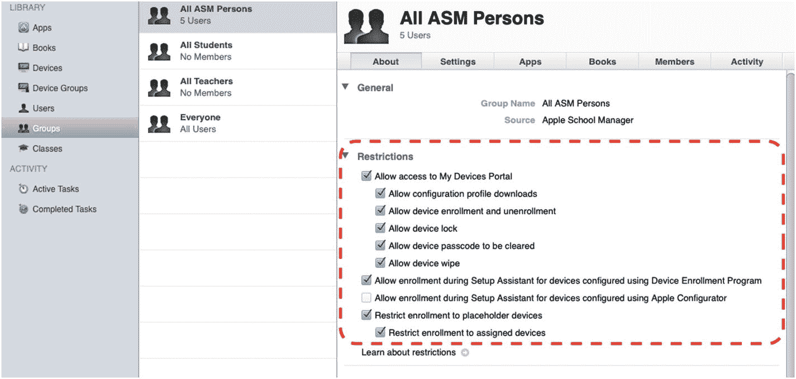

图 9-11

配置自助服务群组的限制以允许访问我的设备门户

## 为 BYOD 注册创建占位符设备

对于本例，我将设置我的个人 iPhone 作为占位符，并将其分配给我在 `Apple 校园教务管理` 中的用户。

1.  我们需要做的第一件事是为这部 iPhone 配置一个占位符。点击侧边栏中的 `设备` 按钮，然后点击 `+` 按钮并选择 `添加占位符` 以创建一个新的占位符，如图 9-12 所示。

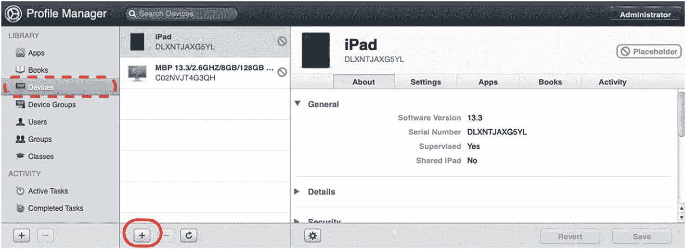

图 9-12

点击 + 按钮以定义新占位符

2.  当提示创建新占位符时，我将选择 `iOS` 作为 `设备类型`，并输入 `设备名称` 以及序列号或其他唯一标识符，如 `UDID` 或 `MEID`。请继续为你自己的设备输入信息。完成后，你应该会得到一个占位符设备，类似于我在图 9-13 中所示。

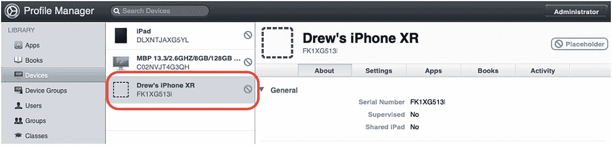

图 9-13

我为个人设备创建的占位符

3.  现在我们有了一个占位符设备，我们需要将该设备分配给我们的用户。我已在 `Apple 校园教务管理` 中创建了一个名为 `Drew Smith` 的测试用户。在 `描述文件管理器` 中，选择侧边栏中的 `用户`，然后选择你的测试用户并点击 `设备` 选项卡，如图 9-14 所示。点击 `+` 按钮 ➤ `添加设备`，然后在弹出的对话框中将 BYOD 占位符设备添加到该用户。点击 `完成` 按钮，然后点击 `保存` 按钮以继续。

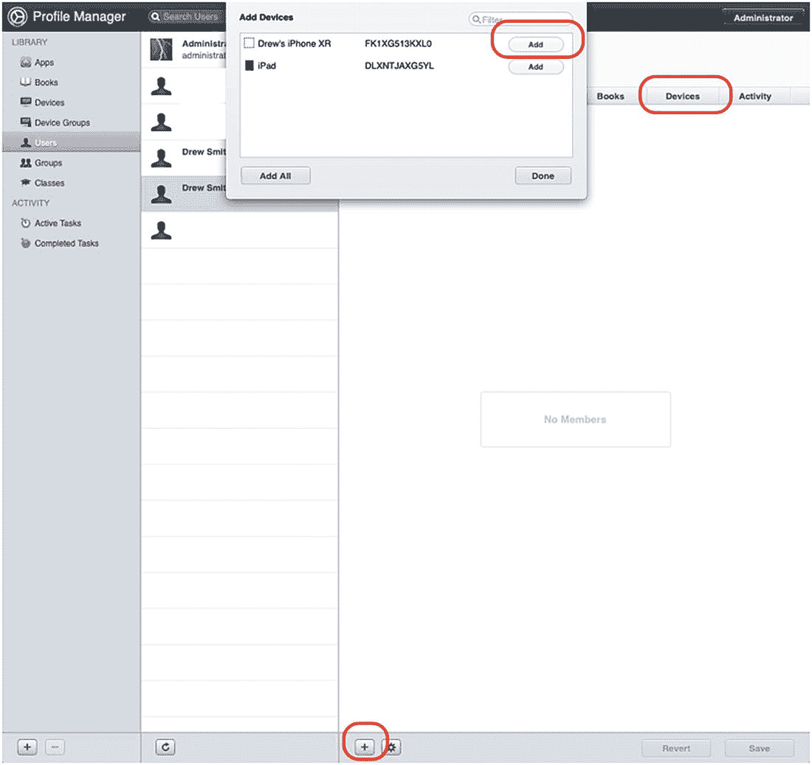

图 9-14

将占位符设备添加到测试用户

现在我们已经配置好了一切，让我们以最终用户的身份来测试一下。在个人设备上，打开 `Safari` 或你选择的其他浏览器，访问 `http://yourdomain/mydevices` —— 其中 *yourdomain* 是你用于 `描述文件管理器` 的域名。在我的例子中，它是 `http://579testing.com/mydevices`。使用与占位符设备关联的用户名登录，如图 9-15 所示。

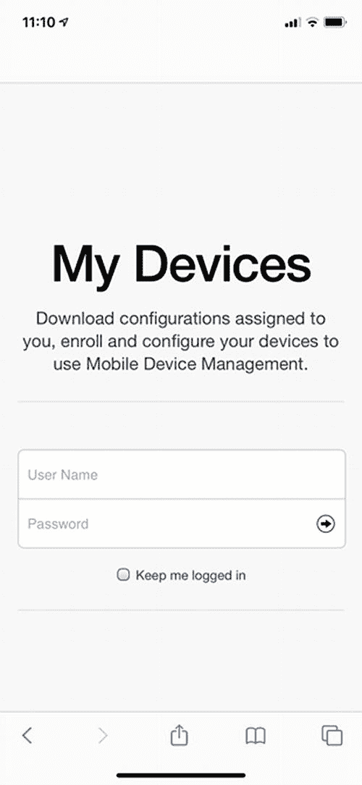

图 9-15

我的 iPhone 上的我的设备门户

登录后，你需要做两件事。首先，你需要注册设备，所以点击那个大的蓝色 `注册` 按钮，并按照提示下载 `注册描述文件`，如图 9-16 所示。

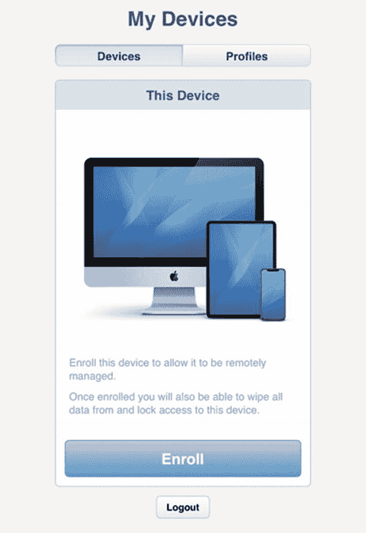

图 9-16

点击注册按钮以下载注册描述文件

接下来，点击 `描述文件` 选项卡，然后点击大的 `安装` 按钮，为你的组织安装一个 `信任描述文件`，如图 9-17 所示。这将确保设备信任从你的 MDM 发送到该设备的所有描述文件和命令。

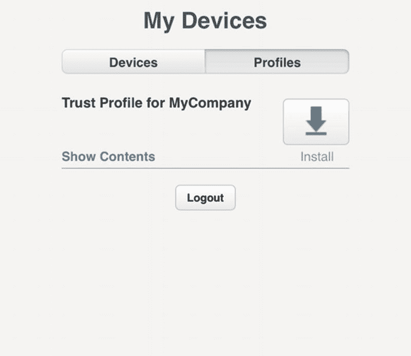

图 9-17

将我们 MDM 的信任描述文件下载到设备

最后，关闭 `Safari`，打开 `设置` 应用，浏览至 `通用` ➤ `描述文件`，找到我们下载的 `远程管理描述文件`。点击 `安装` 按钮以在测试设备上启用 MDM，如图 9-18 所示。你可以通过浏览至 `通用` ➤ `设备管理` 来确认它已安装在设备上，你将在这里看到我们的 `远程管理` 服务器信息。

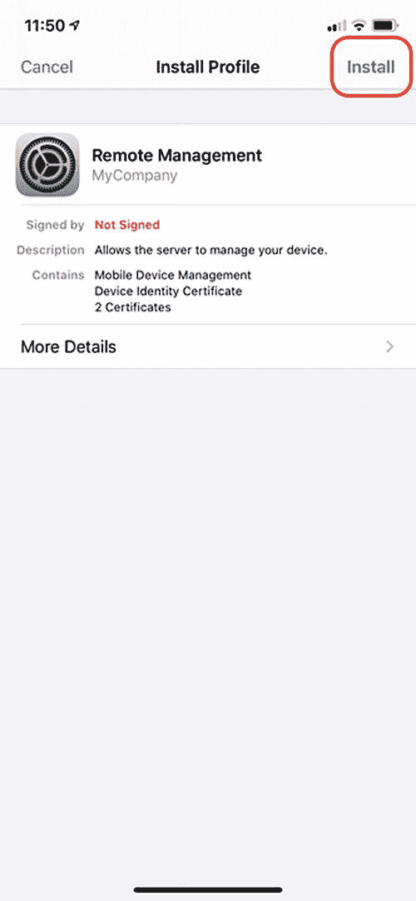

图 9-18

安装移动管理描述文件

我们也可以在 `描述文件管理器` 中确认设备已成功添加。再次打开 `描述文件管理器` 控制台，点击侧边栏中的 `设备` 按钮。你应该会看到我们的新设备现在已经在那里，并且不再是一个占位符，如图 9-19 所示。

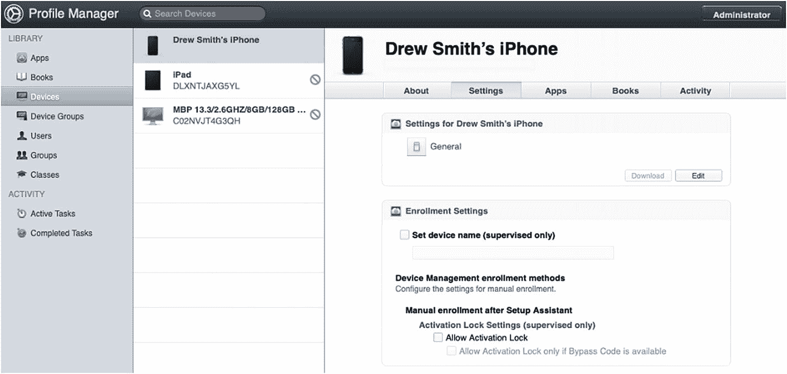

图 9-19

我的 iPhone 现已注册到我的 MDM 并可以被管理

至此，只要最终用户不移除 `管理描述文件`，我们就可以管理此设备。请注意，由于这不是被监督的设备，应用某些有效负载的能力将受到限制。

在我们继续之前，这是一个很好的时机来演示如何使用 `描述文件管理器` 控制台来 `取消注册` 设备。你可能出于多种原因希望这样做。例如，如果这是一个 BYOD 设备且用户已离开你的组织，你很可能想要移除该设备，特别是如果用户在离开时不够精通技术，未能自行移除 `管理描述文件`。


## 移除设备

要移除设备，请打开`Profile Manager`，点击侧边栏中的`Devices`按钮。选择您想要移除的设备以高亮显示它，然后点击`–`按钮，如图 9-20 所示。

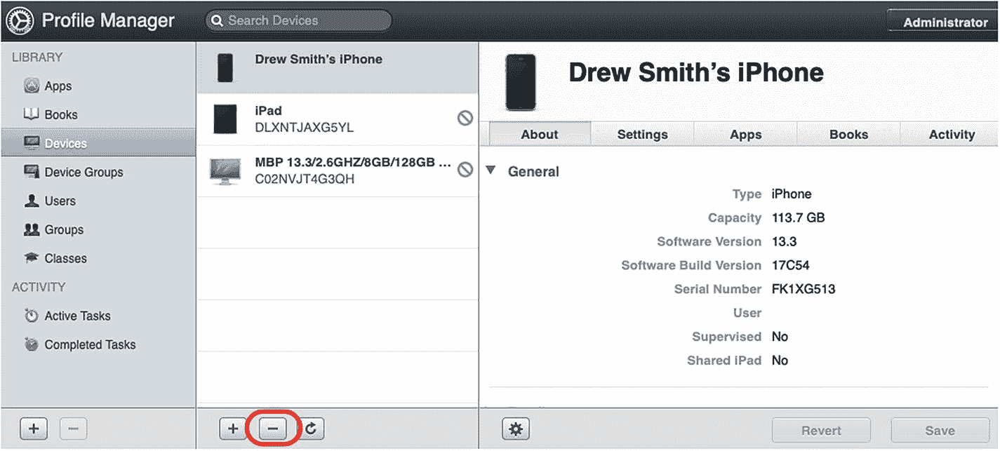

**图 9-20：从 Profile Manager 中注销设备**

`Profile Manager`会提示您选择`Unenroll`设备或`Revert to Placeholder`，如图 9-21 所示。如果您知道用户已经自行移除了管理配置文件，可以选择`Revert to Placeholder`。如果您不确定配置文件是否已被移除，请选择`Unenroll`，这将把设备恢复为占位符，并远程从设备中移除管理配置文件。我们将点击`Unenroll`按钮。

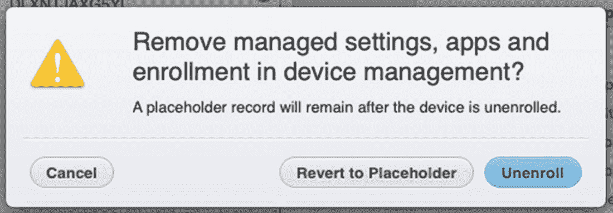

**图 9-21：当被提示时，如果您不知道用户是否已自行移除管理配置文件，请选择注销**

几分钟后，设备将恢复为“占位符”标签状态，您可以直接通过`Settings`应用 ➤ `General`在设备上确认设备管理配置文件现已消失。由于这是 BYOD 设备，我们可以点击占位符设备，然后再次点击`–`按钮，确认我们也想移除该占位符。

## Apple Configurator

将设备注册到 MDM 的第三种方法是通过`Apple Configurator`。在第 5 章中，我们跳过了 MDM 提示，并承诺将在后面的章节中介绍，现在就是时候了。使用`Apple Configurator`将设备注册到 MDM 的主要缺点是**(a)**它仅限于 iOS 设备，以及**(b)**您仍然需要物理接触每台设备。`Apple Configurator`的好处是，如果您已经在物理接触每台设备、应用蓝图等，那么添加 MDM 支持以实现未来对配置的无线更新是快速且容易的。

### 在 Apple Configurator 中启用 MDM 注册

我们需要调整一些设置，以便开始将`Apple Configurator`与我们的 MDM 一起使用。

1.  当提示时，使用您的 Apple School Manager/Apple Business Manager 管理员*Apple ID*和密码登录 DEP。
2.  当提示时，选择您希望向用户显示的 iOS 设置助理屏幕，然后点击`Prepare`按钮。

**专业提示** 如果您使用的是通过设置助手用于 DEP 注册的同一台测试设备，在尝试使用`Apple Configurator`激活设备之前，您应该从 MDM 中移除该设备并删除占位符。否则，当设备到达激活步骤时，它会提示错误，说明您需要使用 DEP 来激活并将设备注册到 MDM。

3.  点击`Next`按钮以完成配置。
4.  接下来，让我们用另一台 iOS 设备测试我们的 MDM 配置。使用 USB 电缆将测试设备连接到`Apple Configurator`。设备出现后，选中它并点击工具栏中的`Prepare`按钮。
5.  在出现的“准备设备助理”对话框中，选中`Supervise devices`旁边的复选框，然后点击`Next`按钮继续。
6.  在`Enroll in MDM Server`选项中，如图 9-25 所示，从弹出菜单中选择我们的服务器。点击`Next`继续。

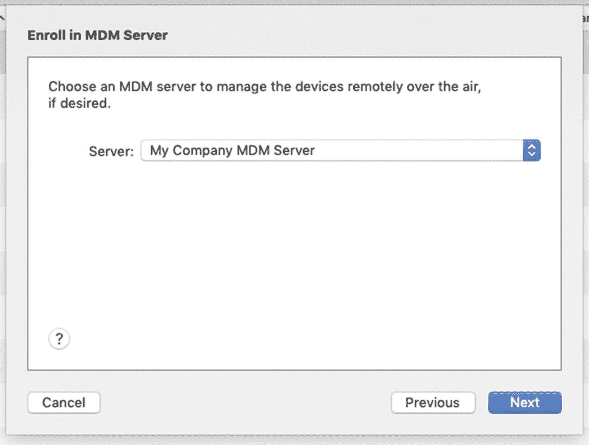

**图 9-25：当提示时，选择您的 MDM 服务器**

7.  点击`+`按钮向`Apple Configurator`添加一个新的 MDM 服务器。为服务器起一个描述性的名称，然后编辑`Host name or URL`字段，将“myserver.local”替换为您的服务器域名。例如，我的服务器是[`579testing.com`](http://579testing.com)，如图 9-24 所示。更新域名时，请务必保持 URL 的其他部分不变。

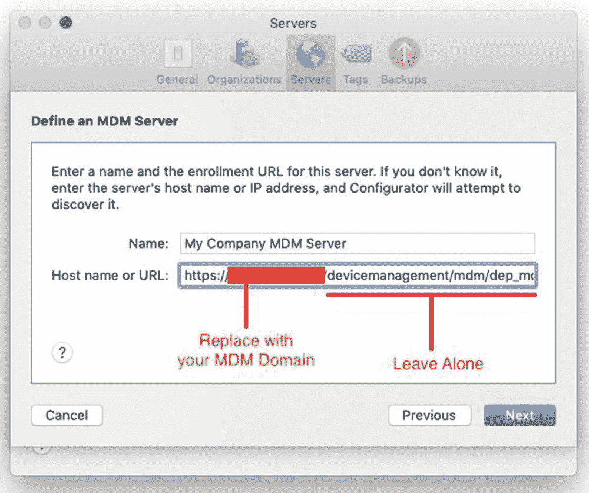

**图 9-24：编辑域名以使 Apple Configurator 指向您的 MDM**

8.  接下来，在您计划用于配置设备的 Mac 上，从应用程序文件夹中打开`Apple Configurator`。从`Apple Configurator`菜单中选择`Preferences…`，然后点击`Servers`选项卡，如图 9-23 所示。

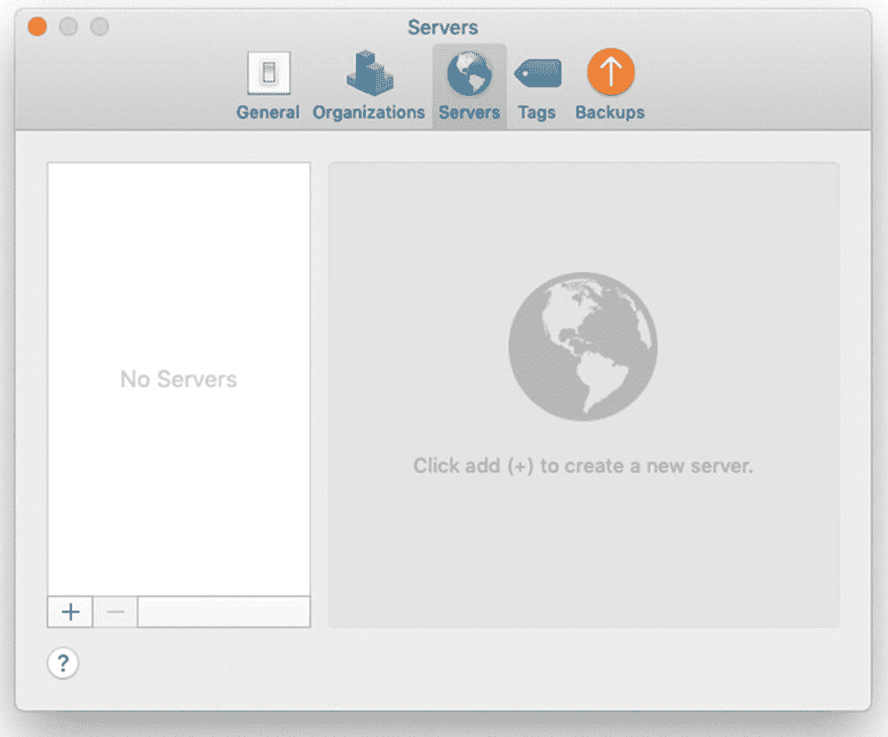

**图 9-23：Apple Configurator 偏好设置面板中的 Servers 选项卡**

9.  我们需要做的第一个更改是选择用于`Apple Configurator`的监管身份。登录到您的 Mac 服务器并打开`Server`应用程序。从侧边栏点击`Profile Manager`服务，然后根据您的服务，在 Apple School Manager 或 Apple Business Manager 下点击`Configure…`按钮。
10. 点击`Supervision`选项卡，然后选中`Use Apple Configurator to configure enrolled devices`旁边的复选框。接下来，如图 9-22 所示，从`Supervision Identity`下拉菜单中选择您签名的信任证书。点击`Done`按钮继续。

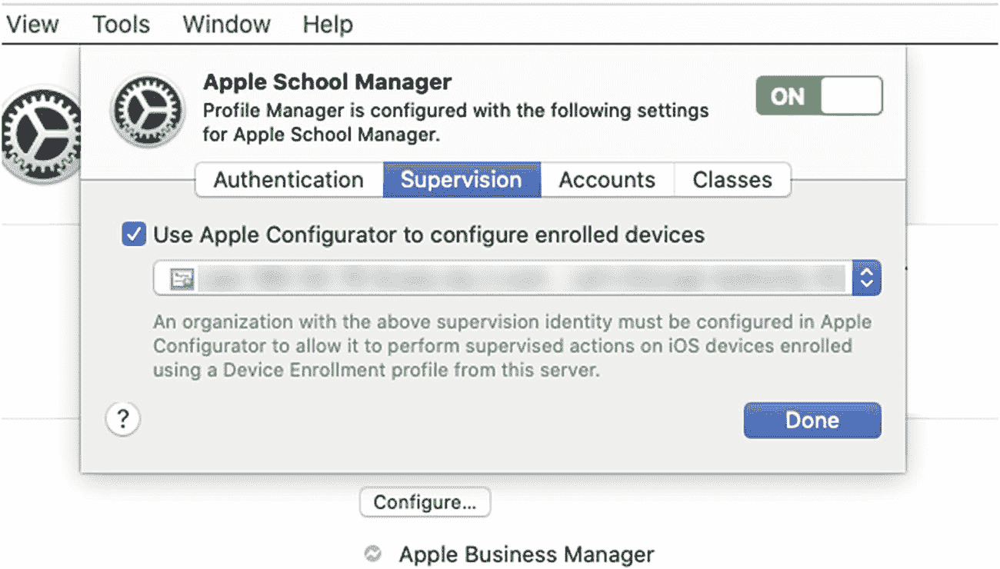

**图 9-22：为 Apple Configurator MDM 注册配置监管身份**

当准备过程完成后，点击设备上的 iOS 设置助手，它应该会抑制我们为其选择的提示。当您到达主屏幕时，打开`Settings`应用并浏览到`General` ➤ `Device Management`，我们的`Management Profile`应该已经存在。您可以打开`Profile Manager`并点击`Devices`，以确保我们的设备现在也可用于额外的管理。

**专业提示**

您是否在“准备设备助理”中看到了`Add to Device Enrollment Program`复选框？这是一个很好的附加选项，您可以使用它将任何通过非 Apple 或支持 DEP 的 Apple 授权经销商购买的组织设备添加到 DEP 数据库中。当您选中此框时，它会将设备添加到 DEP 数据库。


### 手动安装或使用安装脚本

最后一种选择是手动创建并下载注册配置文件，然后在设备上交互式地安装它们。对于 Mac，可以使用 `Apple Remote Desktop` 脚本完成；对于 iOS 设备，可以将其托管在内部网站上或通过电子邮件发送给最终用户。使用此方法的主要缺点是自动化程度最低，并且在 macOS 客户端的情况下，使用脚本会导致额外的交互操作，以启用用户批准的 MDM。

## 使用注册配置文件添加设备

1.  首先，我们需要创建注册配置文件。打开 `Profile Manager` 并单击 `+` 按钮 ➤ **新建注册配置文件**。命名注册配置文件，现在我们**取消选中占位符要求**，如图 9-26 所示，这样任何安装此配置文件的设备都会被添加到我们的 MDM 中。

    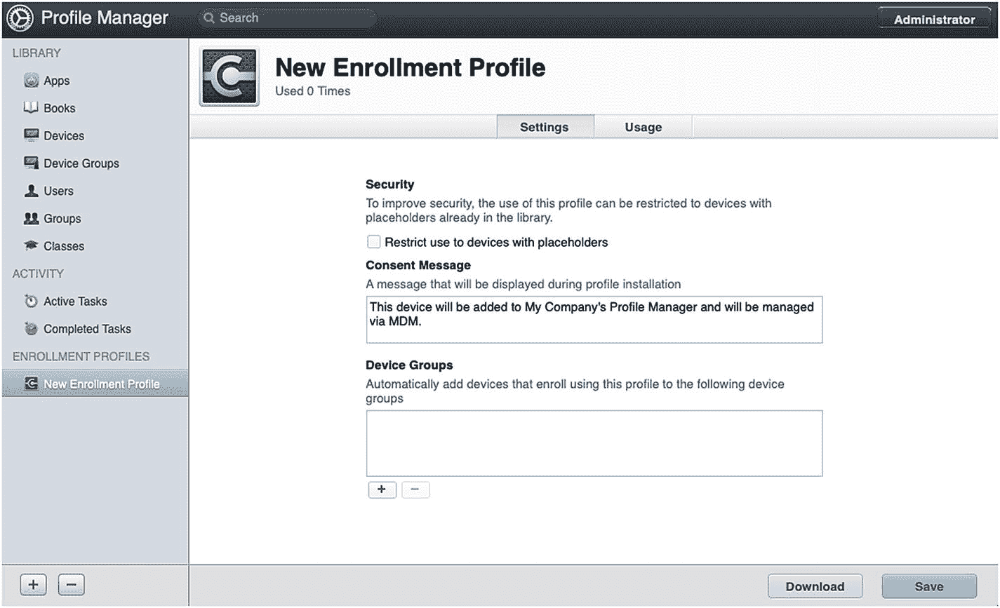

    图 9-26
    创建新的注册配置文件

2.  点击 `保存` 按钮，然后点击 `下载` 按钮以下载*注册配置文件*。它会将一个新的 `*.mobileconfig` 配置文件下载到您的 Mac。如果它尝试安装，请取消，然后将其从“下载”文件夹移出，放到桌面上。

3.  接下来，我们需要下载一份*信任配置文件*的副本。单击 `Profile Manager` 窗口右上角的 `已登录用户` 按钮，选择 `下载信任配置文件`，如图 9-27 所示。同样，如果它尝试安装，请取消，然后将信任配置文件从“下载”文件夹拖到桌面。

    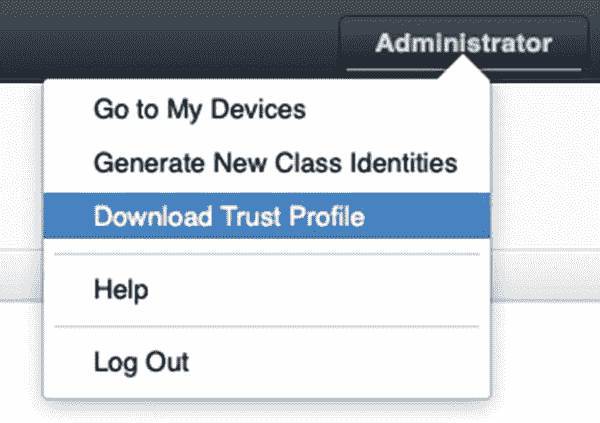

    图 9-27
    将信任配置文件下载到桌面

4.  现在您的桌面上应该有两个 `*.mobileconfig` 文件。一个是信任配置文件，以便我们添加的设备信任我们的 MDM 服务器；另一个是指引我们设备连接到 MDM 服务器的注册配置文件。这本质上与自助注册过程中安装的两个文件相同。

5.  对于下一步，您应该有一台已添加到 `Apple Remote Desktop` 的测试 Mac。我们将编写一个脚本，在那台远程 Mac 上安装这两个配置文件。继续操作，使用 `复制` 命令将两个 `*.mobileconfig` 文件复制到远程计算机上的 `/tmp` 目录，如图 9-28 所示。

    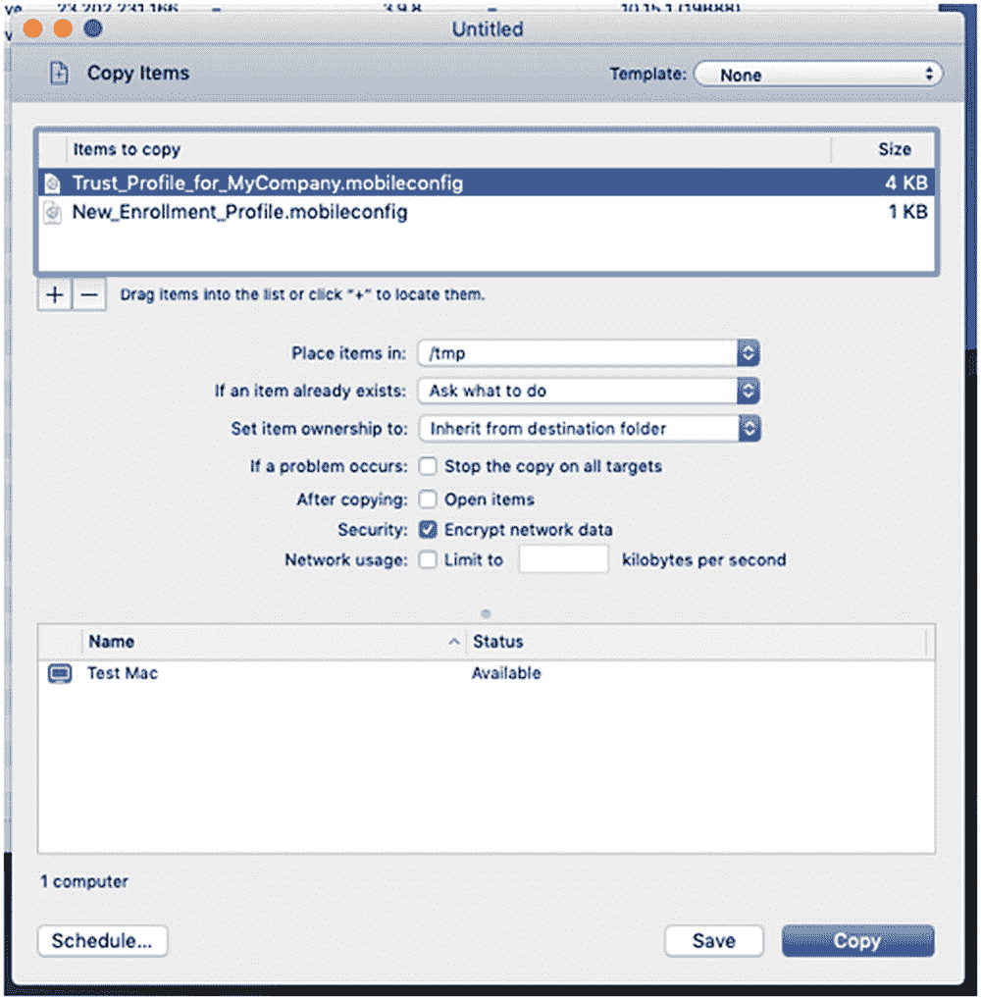

    图 9-28
    Apple Remote Desktop 中的复制文件对话框

6.  接下来，我们可以继续选择向测试 Mac 发送 Unix 命令来安装这些配置文件。我们将使用位于 `/usr/bin/` 中的 `profiles` 命令。在 ARD 的 Unix 窗口中，输入以下命令，如果您的两个 `*.mobileconfig` 文件名与我的不同，请相应指定：

    ```
    /usr/bin/profiles -I -F /tmp/Trust_Profile_for_MyCompany.mobileconfig
    /usr/bin/profiles -I -F /tmp/New_Enrollment_Profile.mobileconfig
    ```

    `-I` 代表安装，`-F` 代表文件，后面跟着要安装的文件的路径。您的**ARD 发送 Unix 命令**窗口应如图 9-29 所示。

    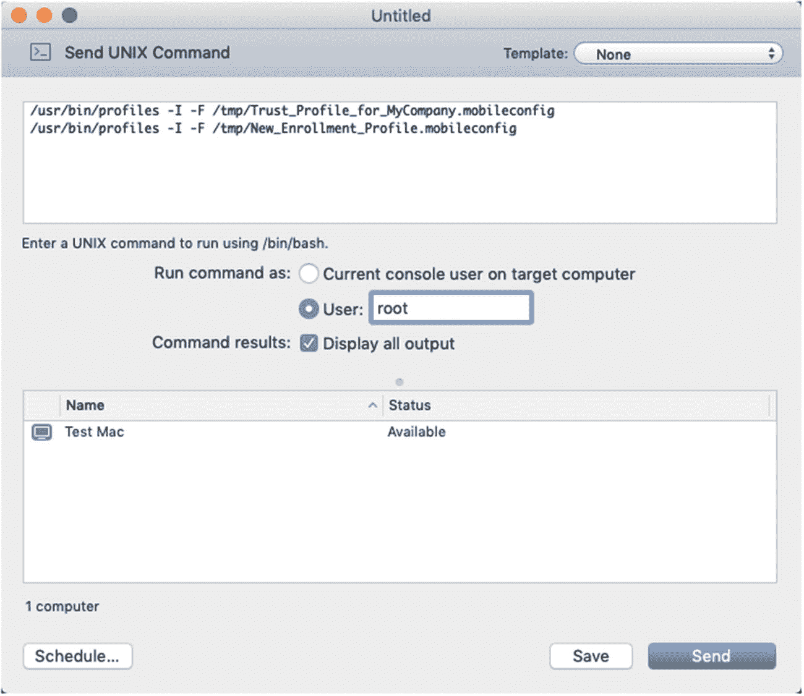

    图 9-29
    Apple Remote Desktop 中的发送 Unix 命令窗口

7.  接下来，让我们登录到测试 Mac，查看配置文件是否已安装。如果脚本运行正确，您应该会看到一个新的 `配置文件系统偏好设置`。点击 `配置文件系统偏好设置`，您应该会看到两个**设备配置文件**，如图 9-30 所示。

    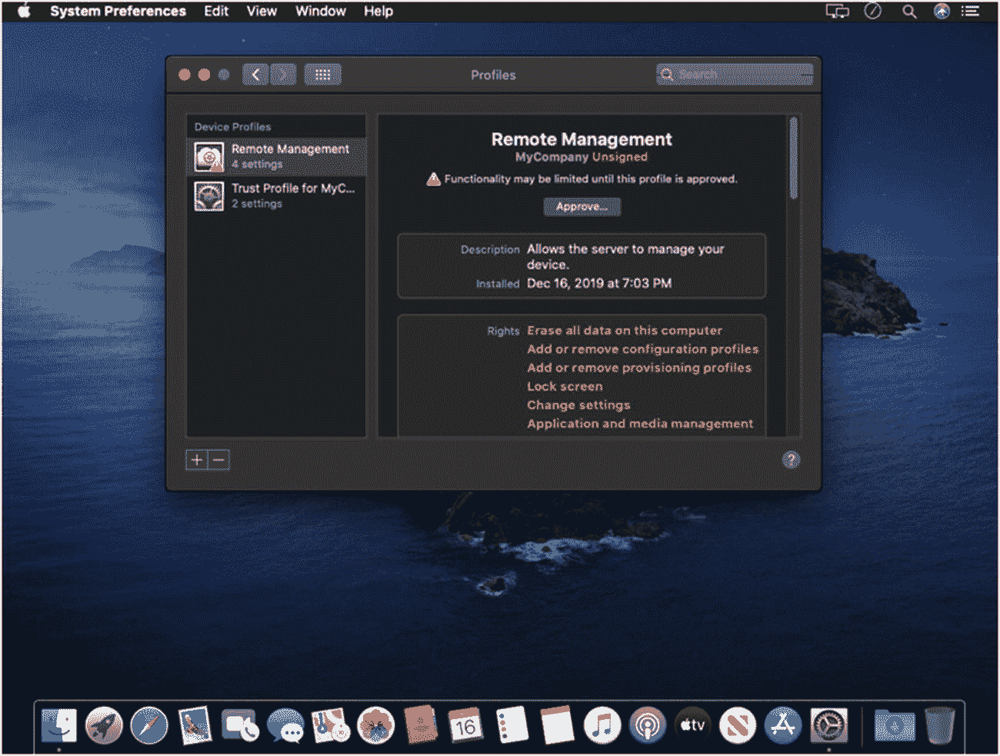

    图 9-30
    新安装的设备配置文件

8.  将命令发送到测试 Mac。如果我们希望将来再次运行，可以将其保存为模板。

9.  返回 `Profile Manager` 并查看设备列表。您的设备列表中应该会有一个新的 Mac，就像我在图 9-31 中那样。这代表了我们刚刚使用 `Apple Remote Desktop` 脚本添加的 Mac。

    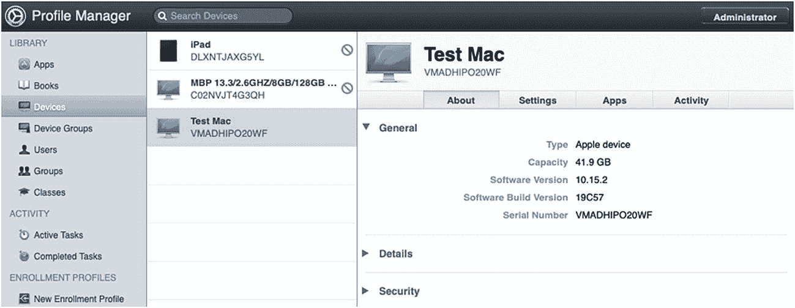

    图 9-31
    我们的测试 Mac 已添加到 Profile Manager

10. 现在返回测试 Mac，并再次浏览 `配置文件系统偏好设置`。点击 `远程管理配置文件`。您是否看到一条*提示信息“在批准此配置文件之前，功能可能受限。”*？这是指用户批准的 MDM（UAMDM）。我们在第 8 章简要讨论过 UAMDM。因此，虽然此 Mac 现在列在 `Profile Manager` 中，但在我们将此 Mac 转换为用户批准状态之前，我们可以使用的负载类型存在一些限制。

11. 将此设备转换为用户批准的 MDM 只有一种方法，那就是直接在设备上交互式地单击 `批准…` 按钮。没有可以用于转换的脚本；您可以尝试屏幕共享或使用 ARD 的远程控制选项来点击 `批准…` 按钮，但 Apple 已将其阻止。您需要坐在那台特定的机器前并单击 `批准…` 按钮。点击 `批准…` 按钮并进行确认，如图 9-32 所示。

    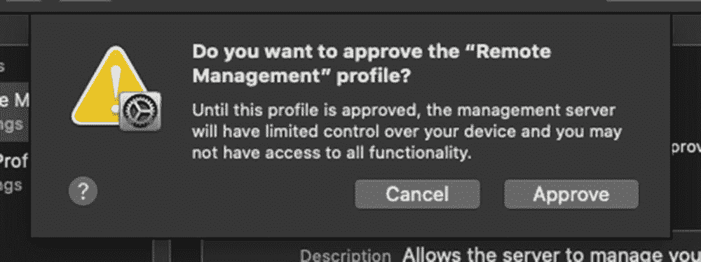

    图 9-32
    点击批准按钮以启用用户批准的 MDM

我们现在已通过在测试 macOS 客户端上使用脚本手动配置了 MDM。

### 专业提示

将 `macOS` 设备成功注册到 MDM 并自动配置为用户批准状态的唯一方法是使用 DEP 注册方法。如果您在设置助理期间使用 DEP 推送注册配置文件，该设备将成为用户批准状态，无需任何额外的交互操作。

## 使用 Profile Manager 管理 iOS

既然我们已经了解了在 `macOS` 和 `iOS` 客户端上注册和取消注册的各种方式，现在让我们探索一下 Profile Manager 控制台中可用的一些管理功能。在本节中，我们将重点关注 iOS 功能和负载。如果尚未进行，请继续使用您喜欢的方法将一台测试 iOS 设备注册到 `Profile Manager` 中，并确保它已被监督。


### iOS 配置描述文件

现在来点有趣的。让我们首先在配置文件管理器的`Devices`区域选择我们的测试设备。点击我们之前配置激活和注册选项的`Settings`选项卡。在设置页面的顶部，你应该会看到一个`Settings for iPad`部分，如图 9-33 所示。点击`Edit`按钮。

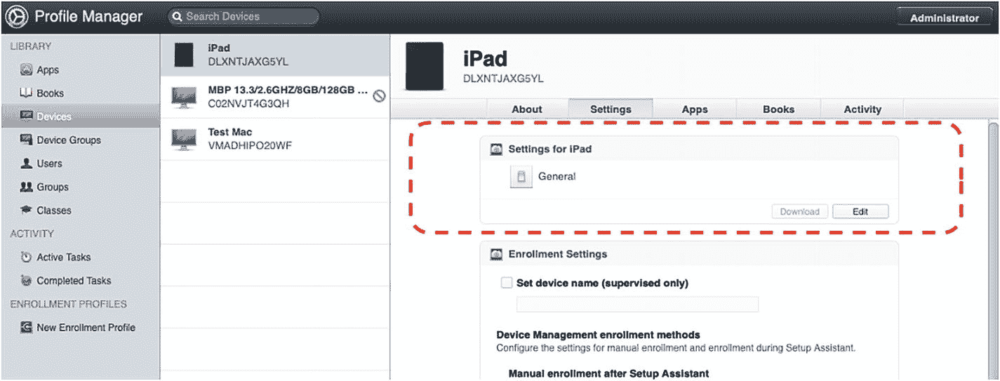

**图 9-33**
点击编辑按钮以访问测试设备的配置描述文件设置

`Settings for iPad`窗口对你来说会非常熟悉，因为它与 Apple Configurator 中看到的类似。这基本上就是我们前几章用过的、与`iOS`兼容的配置描述文件列表。请按要求配置`General`描述文件，确保选择`Automatic Push`作为`Profile Distribution Type`。接下来，我们将配置几个会改变主屏幕可见布局的描述文件，用于演示目的。

向下滚动到`Home Screen Layout`描述文件。点击`Configure`按钮来自定义描述文件设置。使用`Dock`字段下的`+`按钮，将`App Store`、`Mail`和`News`添加到 Dock 中，如图 9-34 所示。

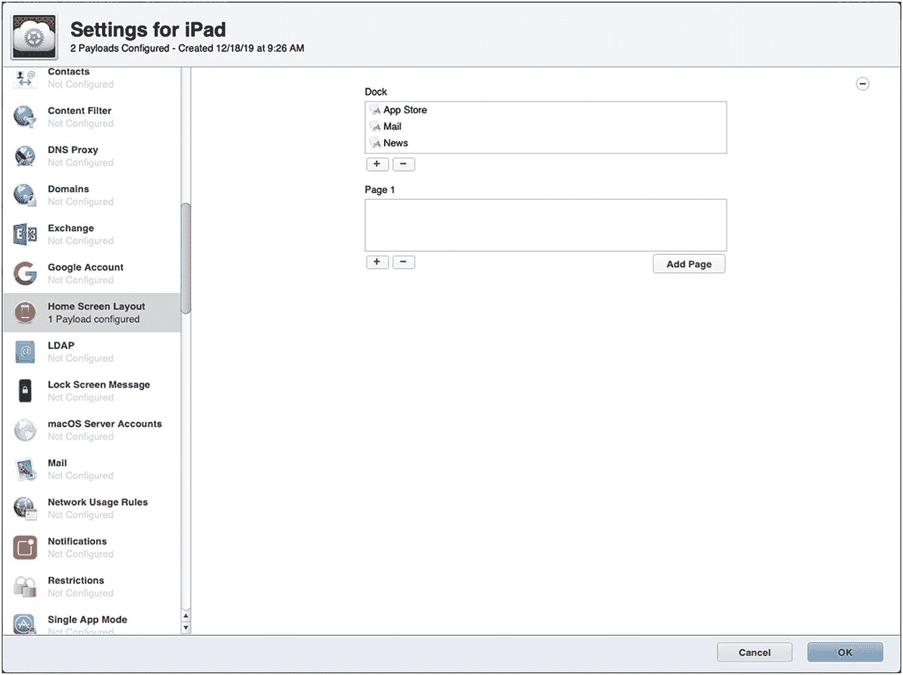

**图 9-34**
配置主屏幕布局描述文件

接下来，点击`Lock Screen Message`描述文件。点击`Configure`按钮，输入你想在锁屏上显示的`lost message`和`asset tag info`。最后，点击`Restrictions`，然后点击`Configure`来自定义这些选项。

我们将取消勾选以下项目：
*   允许使用 FaceTime（仅受监管设备）
*   允许使用 iMessage（仅受监管设备）
*   允许使用 Apple Music（仅受监管设备）
*   允许使用收音机（仅受监管设备）
*   允许移除应用程序（仅受监管设备）
*   允许移除系统应用（仅受监管设备）
*   允许应用内购买

你的屏幕应该类似于图 9-35。点击`OK`按钮继续。

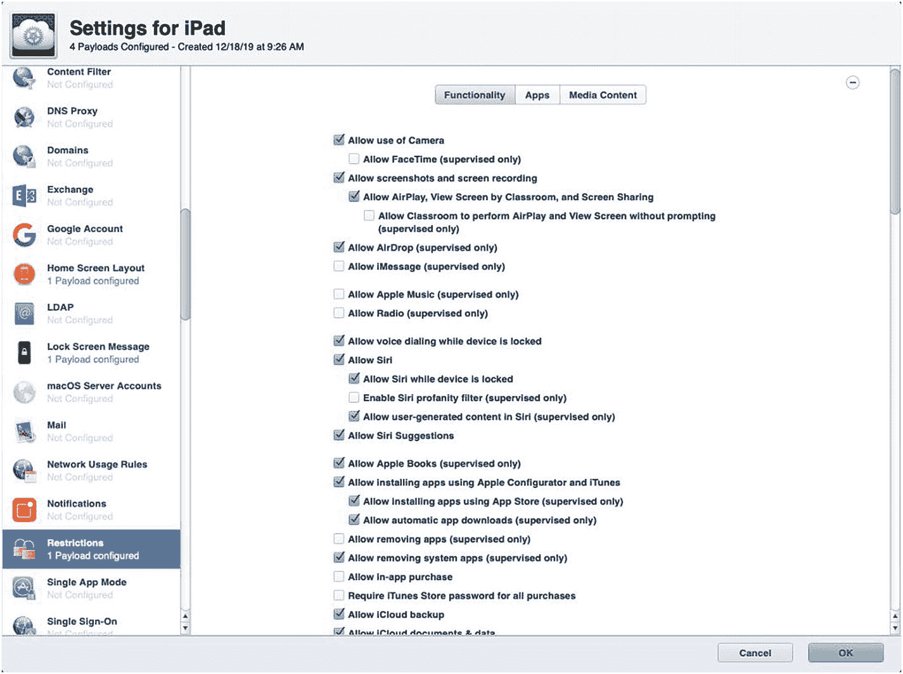

**图 9-35**
配置限制描述文件

现在你会在`Settings for iPad`部分下看到我们配置的各种描述文件。点击`Save`按钮将这些设置应用到我们的测试 iPad 上。如果你的 iPad 已开机并停留在主屏幕，几秒钟后你会看到一些变化发生。Dock 会更新为我们指定的三个应用，Messages 和 FaceTime 应用会从设备上完全消失，并且尝试删除任何已安装的应用程序。祝你好运！你的设备应该看起来类似图 9-36。

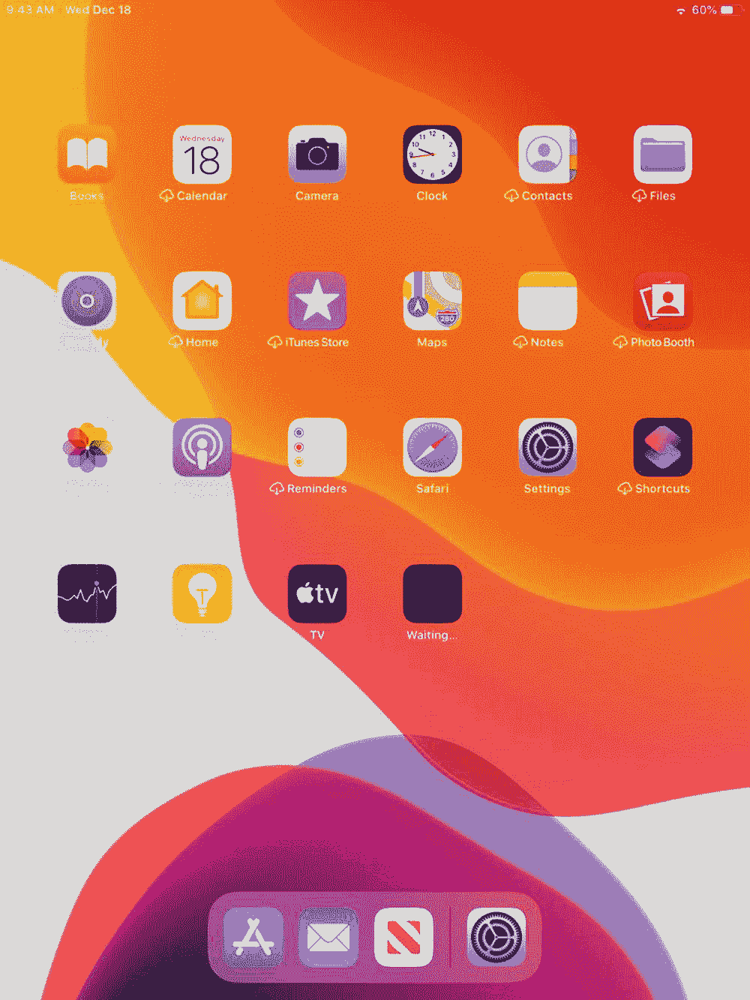

**图 9-36**
我们被管理的 iPad，具有指定的限制和设置

回到锁屏界面，你会看到一条关于联系支持的信息和一个资产标签号。

接下来，让我们返回配置文件管理器并撤销其中一些设置。点击设备`Settings for iPad`部分下的`Edit`按钮。点击`Restrictions`描述文件下的`-`按钮以移除它，然后点击`OK`继续。点击`Save`按钮，将这些更改无线应用到测试 iPad 上。几秒钟后，FaceTime 和 Messages 应用将返回主屏幕，现在你几乎可以删除任何你想删除的应用了。删除 Stocks 应用来确认一下。太棒了！

这非常类似于我们在 Apple Configurator 中配置和部署描述文件的方式，但额外的好处是能够实时更新设备，而无需通过 USB 线缆将其连接到我们的 Mac。这就是 MDM 的力量。此时，你可以试验所有种类的`iOS`描述文件，将它们应用到你的测试 iOS 设备或从中移除，看看设备如何反应。有很多非常棒的功能可供你使用，所以我鼓励你花时间尝试这些功能，看看它们如何融入你的整体部署和管理策略。

### iOS 远程管理

除了应用配置描述文件之外，`Actions`按钮的子菜单中还提供了一些很好的远程管理功能。为了演示，请在你的测试 iOS 设备上交互式地设置一个密码。密码是什么或有多复杂都没关系。将设备返回锁屏并确认其已锁定。一旦设备被锁定，返回配置文件管理器，从`Devices`列表中选择测试 iOS 设备。点击`Action`按钮并选择`Clear Passcode`，如图 9-37 所示。

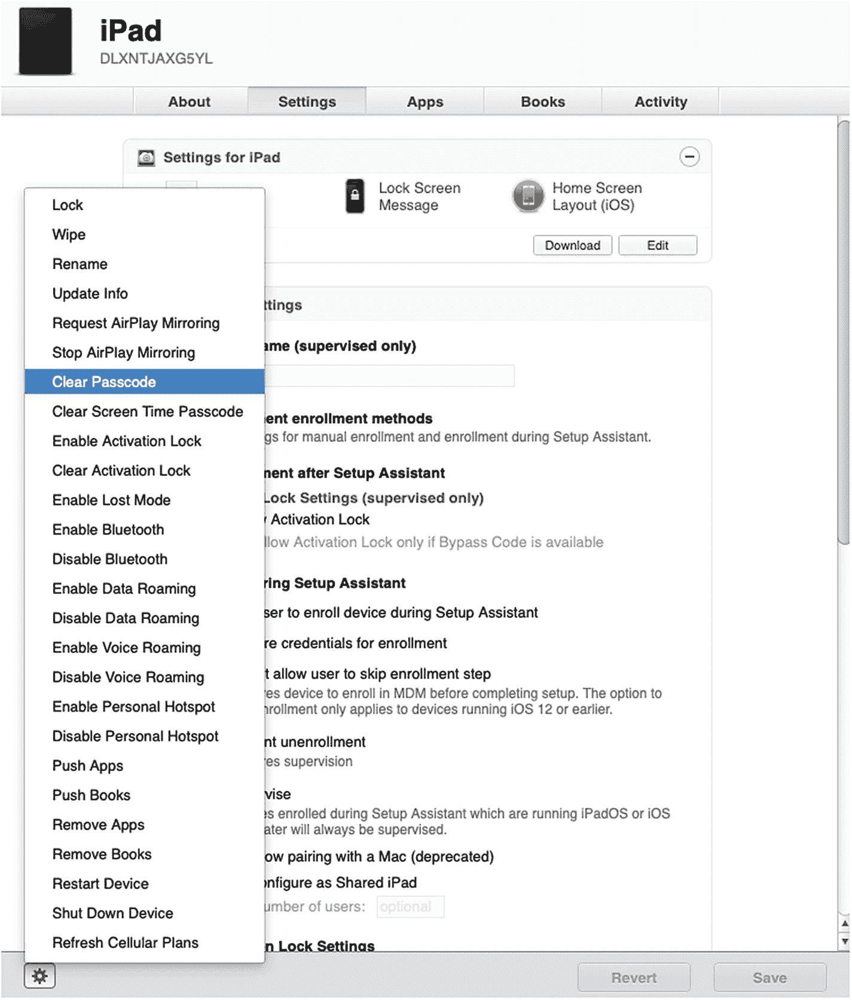

**图 9-37**
从操作子菜单发送清除密码命令

提示时点击`Confirm`。经过几秒钟的活动后，回到你的测试 iPad，瞧！iPad 被解锁了。这不仅是一个有趣的小把戏，你实际上还可以用它来进入那些用户忘记了密码或已不在组织内的被管理设备。

你可以试验许多不同的操作：`Restart`、`Shut Down`、`Wipe`等等。只要设备连接到互联网，它就会响应任何远程管理命令。

## 使用配置文件管理器进行 macOS 管理

我们已经探索了 iOS 设备可用的一些描述文件和操作，但`macOS`客户端也有一些独特的选项。在本节中，我们将重点介绍`macOS`的能力和描述文件。如果你还没有这样做，请使用你喜欢的方法将一台测试 Mac 客户端注册到配置文件管理器中，并确保它是用户批准的。


### macOS 负载

与 iOS 设备类似，我们也可以配置特定的 `macOS` 负载。在配置文件管理器（Profile Manager）中浏览您所管理的测试 Mac，并点击**设置**标签页。就像我们对测试 iPad 所做的操作一样，点击 **测试 Mac 的设置** 部分下方的**编辑**按钮。配置描述文件窗口出现后，您会注意到设置被分成了不同的区块，以标识负载适用于哪个操作系统。您应小心谨慎，仅配置专门针对 `macOS` 的负载，或那些适用于包括 macOS 在内的多种操作系统的负载。

首先配置 **通用** 负载，并确保 **配置文件分发类型** 选择了 **自动推送**。接下来，让我们向下滚动到仅适用于**macOS**的负载部分，并点击 **登录窗口**。点击**配置**按钮，并按照图 9-38 所示自定义设置。

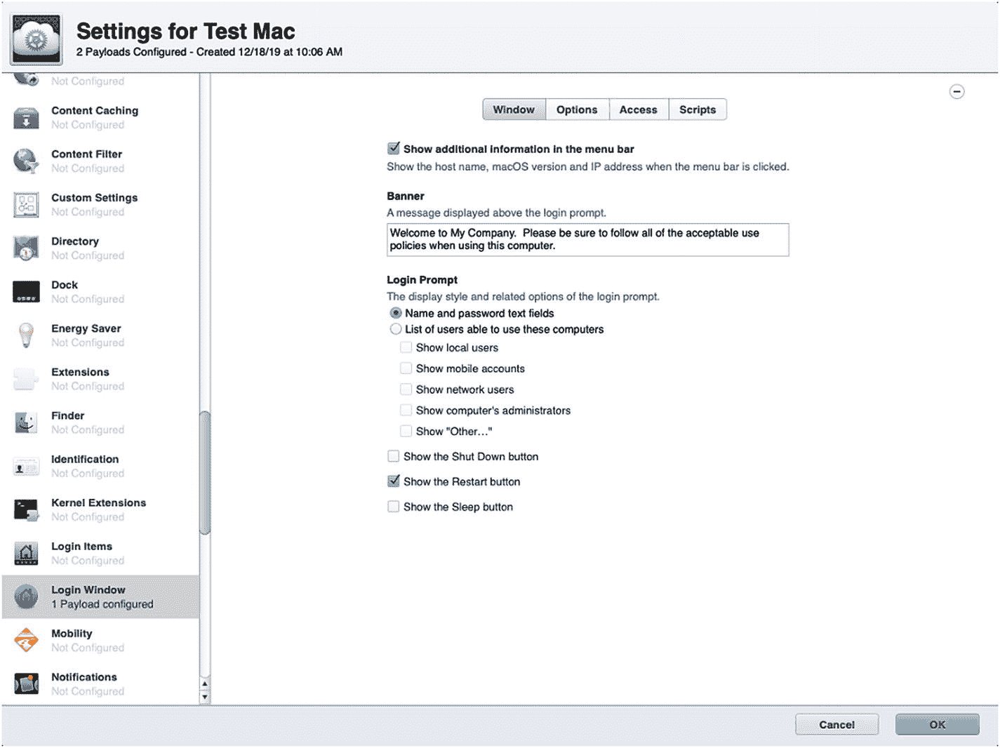

图 9-38 登录窗口负载设置

接下来，我们可以向下滚动到 **安全性与隐私** 并点击**配置**按钮来编辑该负载。点击 **隐私** 标签页，并自定义设置以匹配图 9-39 中的设置。我们在这里所做的操作是将 `Finder` 应用添加到 `~/Documents` 文件夹，并设置为始终允许 `Finder` 访问它，而无需在每次被新用户帐户访问时提示用户。这是 `Mojave` 和 `Catalina` 中的新“透明度、同意与控制”功能之一，您需要花一些时间进行配置和测试。

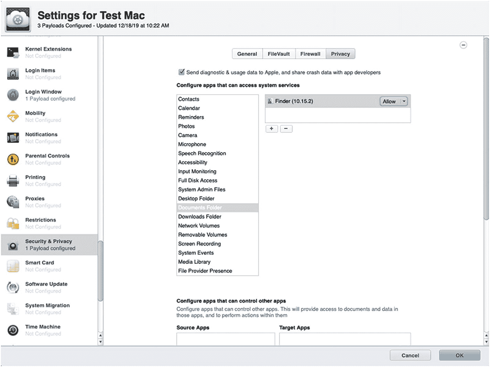

图 9-39 安全性与隐私负载中的 TCC/PPPC 设置

最后，点击 **限制** 并点击**配置**按钮来编辑该负载。在 **偏好设置** 标签页中，选择 **限制系统偏好设置中的项目**，然后取消勾选 **启动磁盘** 和 **软件更新**，如图 9-40 所示。

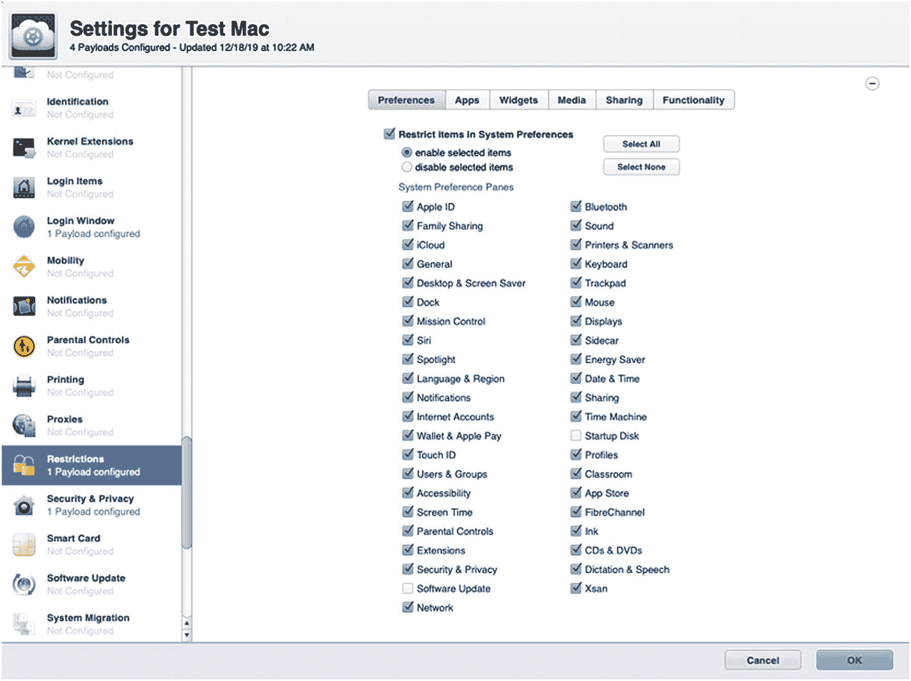

图 9-40 禁用对特定系统偏好设置的访问

点击 **确定** 以保存 **测试 Mac 的设置**，然后点击**保存**按钮以应用它们。

几分钟后，让我们来看看我们一直在测试的 `macOS` 客户端发生了什么变化。如果您**注销**，您会看到登录窗口已更改为简单的用户名和密码字段；点击屏幕右上角的时钟将允许您切换查看计算机名称、IP 地址等信息。从登录窗口**关机**的能力也被禁用了，但如果需要，您仍然可以**重启**计算机。

以本地用户身份登录，并从 **Apple** 菜单打开 **系统偏好设置**。如图 9-41 所示，*启动磁盘*和*软件更新系统偏好设置*已被禁用并呈灰色显示。

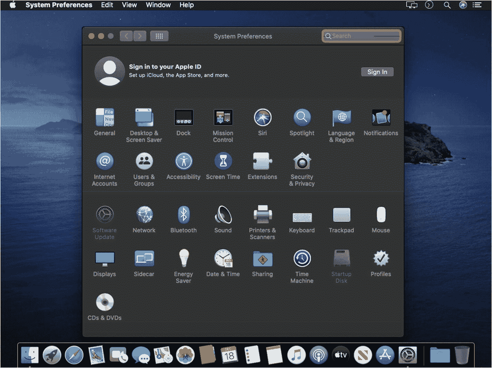

图 9-41 被禁用的系统偏好设置面板显示为灰色

### 专业提示

如果您打算使用配置文件管理器（Profile Manager）限制系统偏好设置，您需要在 **登录窗口** 负载中调整一个设置，以允许本地管理员能够访问这些被禁用的系统偏好设置。如图 9-42 所示，您应在**选项**标签页下启用**计算机管理员可以刷新或禁用管理**设置。应用此设置后，当本地管理员登录时，他们应按住 **option 键** 或 **左 shift 键**，直到 Mac 提示如图 9-43 所示的对话框。在此对话框中选择**禁用设置**将重新启用所有被禁用的系统偏好设置。此修饰键仅对具有管理员访问权限的用户帐户有效。

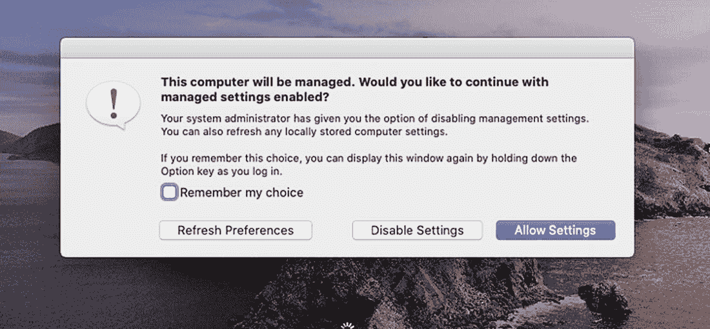

图 9-43 选择“禁用设置”以重新启用系统偏好设置

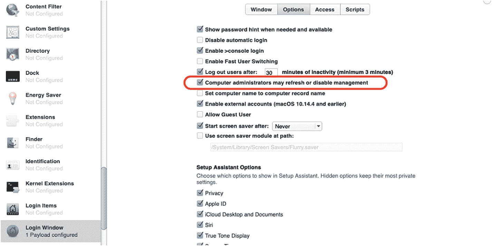

图 9-42 如果您计划使用 Profile Manager 禁用任何系统偏好设置，请确保选中此设置

### macOS 远程管理

与 `iOS` 类似，有一些特定功能可以通过 **操作** 菜单来调用。您可以通过在**设备**中选择您的测试 Mac，然后点击配置文件管理器窗口底部的**操作**菜单并选择一个功能来测试这一点。您可以尝试这些功能，您会注意到，与同样具有这些控制的 Apple Remote Desktop 不同，您的 Mac 无需连接到局域网即可响应这些命令。因为 MDM 在公共互联网上是活跃的，只要 Mac 有互联网访问权限，它就会执行命令。

说到 Apple Remote Desktop，配置文件管理器的一个非常酷的功能是能够在单台或多台 Mac 上激活 Apple Remote Desktop。在 **设备** 列表中选择您的测试 Mac，点击 **操作** 按钮并选择 **启用远程桌面**，如图 9-44 所示。

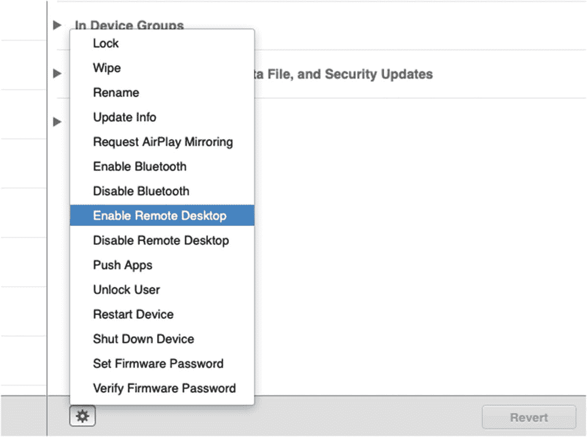

图 9-44 macOS 客户端可用的操作列表

几秒钟后，在您的测试 Mac 上打开 *共享系统偏好设置*，您应该看到 **远程管理** 选项已被勾选，如图 9-45 所示。如果您点击 **选项...** 按钮，您将看到所有选项都已启用。

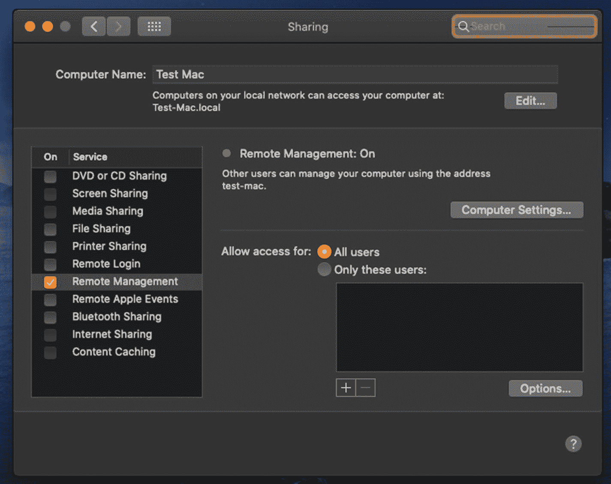

图 9-45 执行“启用远程桌面”操作后的共享系统偏好设置

现在您可以进入您的 Apple Remote Desktop 控制台，将设备添加到您的 ARD 计算机列表中。如果您在设置助理（Setup Assistant）期间通过 DEP 注册 `macOS` 设备，一旦它们在您的 MDM 中激活，您就可以打开 Apple Remote Desktop，然后通过 ARD 推送各种脚本和额外的安装包。这为远程阶段化部署系统（从激活到账户创建和软件包安装）提供了完整的端到端解决方案。

## 使用 Profile Manager 进行软件分发

除了管理设备，配置文件管理器还与批量购买计划（VPP）结合使用，以实现从 App Store 和 Mac App Store 远程安装应用。

### 托管式分发

Apple 使用一种称为 *托管式分发* 的概念，为通过配置文件管理器部署的应用提供设备许可证。其工作方式是，组织购买 App Store 信用额度（类似于一张非常大的 *iTunes 礼品卡*），然后使用该信用额度兑换多个应用许可证。例如，您可以购买十份 *Angry Birds*，然后将它们分配给十台独立的 iPad，无论谁在使用它们。然后几个月后，您可以从其中四台 iPad 上移除 *Angry Birds*，并将其安装到另外四台 iPad 上。这样，组织可以将特定应用分配给特定设备，并在用户需求发生变化时重新分配它们，而无需购买额外的许可证。


## 兑换应用程序

在分配应用程序时，首先要做的是兑换一批许可证。为了方便本练习，我们无需购买`App Store credit`，只需选择几个免费应用来操作即可。打开`Profile Manager`，点击侧边栏中的`Apps`图标。在屏幕右下角，点击`Get More Apps`链接。这会重定向到 Apple School Manager 或 Apple Business Manager。请使用您的机构管理员账户登录。

登录后，点击侧边栏`Content`标题下的`Apps and Books`链接，如图 9-46 所示。您会看到我这里已有一些免费许可证，我们将再添加几个。使用屏幕顶部的`search bar`开始搜索`App Store`。本次练习我们将主要关注`iOS`应用，但这里也能找到`macOS`应用。

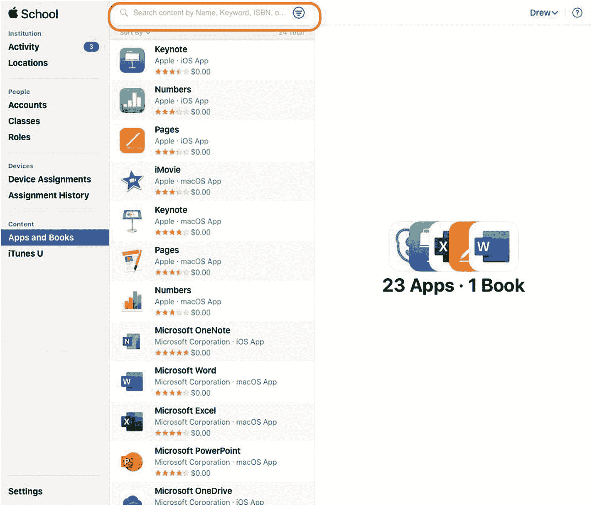

图 9-46
Apple School Manager 中的 Apps and Books 部分

为了乐趣，我们继续以`Angry Birds`为例，在搜索栏中输入“Angry Birds”。在搜索结果列表顶部附近选择`Angry Birds 2`。点击后，会提示为该应用`Buy Licenses`。从弹出菜单中选择`Organization`并输入数量。本例中我们选择`three`个。您的屏幕应类似于图 9-47。点击`Get`按钮购买许可证并将其添加到我们的托管分发池中。

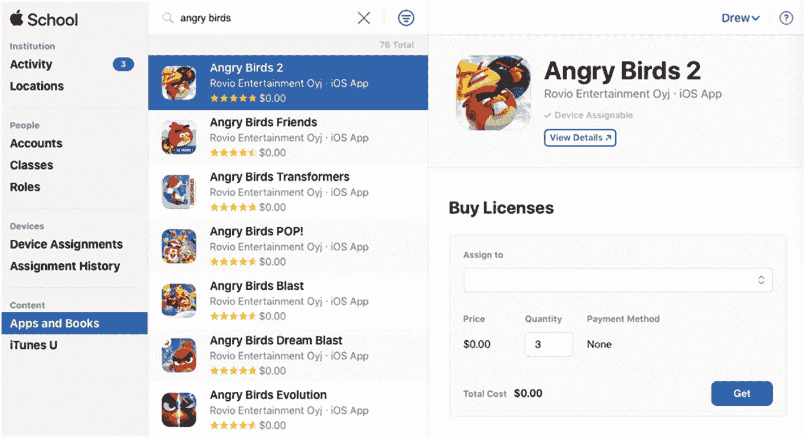

图 9-47
输入数量并点击 Get 按钮购买许可证

购买许可证后，兑换过程可能需要五到十分钟才能完成，之后您最终会在 Apps and Books 列表中看到`Angry Birds 2`出现。请继续为`Keynote`、`Pages`、`Numbers`、`iMovie`、`Microsoft Word`、`Microsoft Excel`和`Microsoft PowerPoint`完成此过程。完成后，返回`Profile Manager`，您应该会看到一系列与图 9-48 中类似的应用。

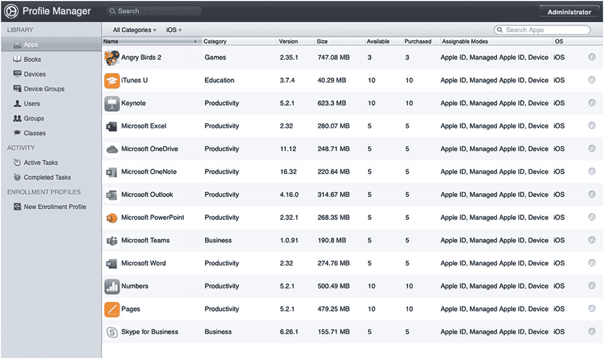

图 9-48
Profile Manager 中可供我们使用的托管分发应用程序池

**专业提示：** `Profile Manager`和`VPP`/`DEP`会定期同步，但如果您没有耐心，可以通过点击`Devices`，然后点击添加/删除占位符按钮旁边的刷新按钮来强制同步。

## 应用分发

现在我们已经兑换了应用并在`Profile Manager`中可用，是时候将它们分配给我们的测试设备了。点击侧边栏中的`Devices`图标，然后选择我们的测试 iOS 设备。本例中是我们本章一直在使用的 iPad。点击`Apps`选项卡，然后点击`+`按钮，如图 9-49 所示。

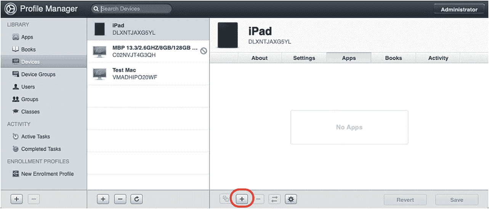

图 9-49
向测试设备分配应用程序

出现提示时，我们将勾选`Angry Birds 2`、`Keynote`和`Microsoft Excel`旁边的复选框。您会注意到还有安装模式的选项。为了查看差异，请为其中一个选择`Automatic`，另一个选择`Tethered`，第三个选择`Manual`。您的窗口应类似于图 9-50。点击`OK`按钮继续，然后点击`Save`按钮应用到设备。

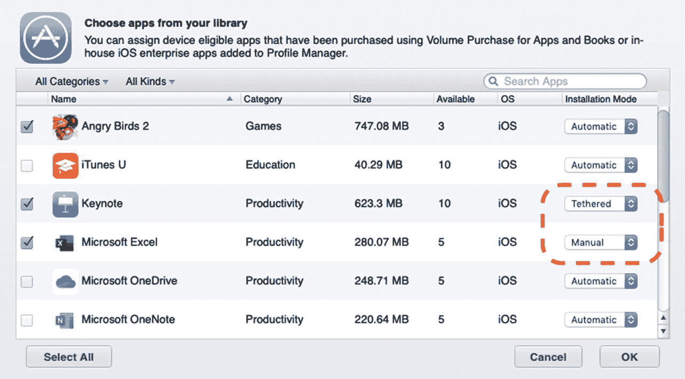

图 9-50
选择不同的安装模式选项以查看它们之间的差异

如果查看测试设备，您会看到`Angry Birds 2`应该在主屏幕上开始下载和安装。根据您的网速，这可能需要几分钟。您不会看到另外两个应用，因为它们未设置为自动安装。因为`Excel`被设置为`Manual`，所以用户需要去`App Store`手动下载，除非设备在某个时间点提示他们安装。而`Keynote`只会在我们使用`Tethered Content Caching`（但我们没有）的情况下才会下载。

**专业提示：** 对于设备众多但共享带宽有限的学校或企业来说，系留功能非常有用。对于像`iMovie`或`GarageBand`这样的大型应用，可能更倾向于强制应用仅在设备与运行了`content caching`服务的 Mac 配置的子网连接时才安装到设备上。

让我们强制将所有这三个应用都`automatically`安装，因此对`Installation Mode`选项进行必要的更改，并再次点击`Save`进行更新，如图 9-51 所示。现在所有应用都将安装到 iPad 上。

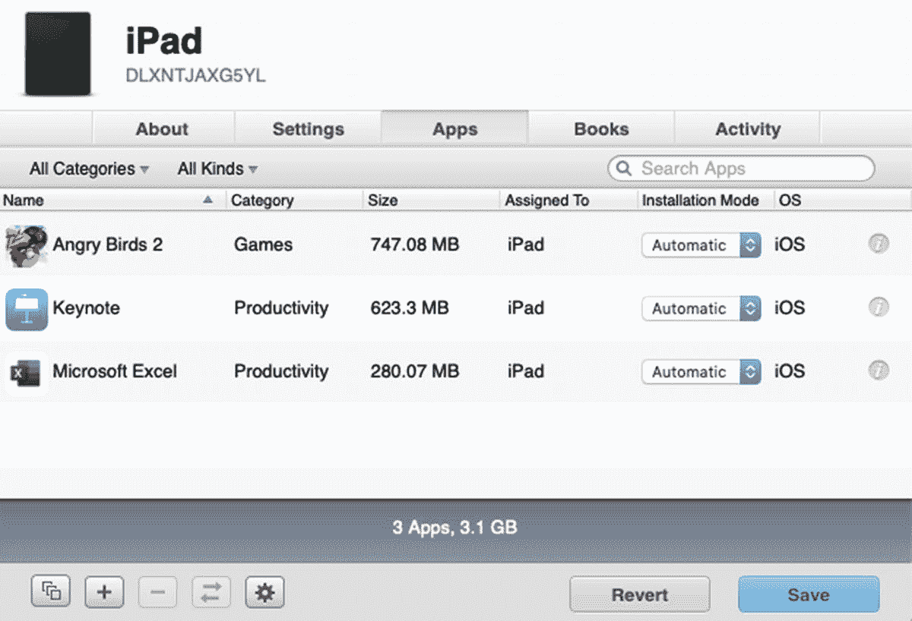

图 9-51
将所有分配的应用的安装模式更新为自动

您可能已经猜到，将图书分配给设备的方式完全相同。另一点需要注意的是，虽然本章中我们一直将应用、图书和配置描述文件应用到设备，但您也可以将这些应用到特定用户或用户组。分配图书时唯一的注意事项是，与应用程序不同，一旦您将图书分发给用户，就无法收回该许可证。如果您的组织使用`iBooks Author`应用程序创建自定义的`iBooks Textbooks`，您可以使用`Profile Manager`分发这些书籍，但只能将它们分配给用户，而不是设备。

除了通过`Apple School Manager`使用托管分发与托管`Apple IDs`外，您还可以将组织购买的应用程序许可证提供给拥有非托管`Apple IDs`的用户。要启用此功能，请点击`Profile Manager`侧边栏中的`Groups`按钮，然后选择`Everyone group`。向下滚动并展开`Volume Purchasing Managed Distribution`部分，勾选`Enable Volume Purchasing Managed Distribution Services`旁边的复选框，如图 9-52 所示。

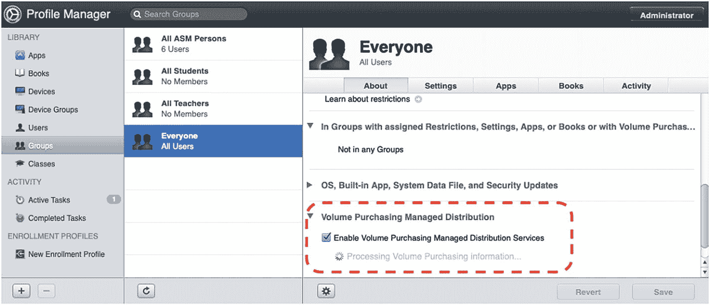

图 9-52
为组织外的 Apple IDs 启用批量购买托管分发

启用此功能后，为该用户创建一个新的`User account`，并使用图 9-53 中所示的按钮向他们发送加入贵组织`Volume Purchase Managed Distribution`的`email invitation`。当他们收到邮件时，系统会提示他们使用个人`Apple ID`登录`App Store`。然后，您可以像处理托管 Apple ID 或设备一样为该用户分配应用程序。

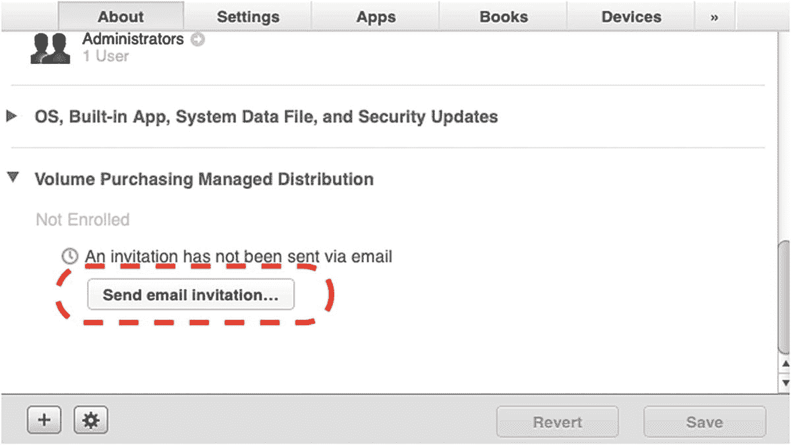

图 9-53
“Send email invitation…” 按钮

分发应用和图书相对直观，因此也请在`macOS`客户端上花些时间测试一下。该过程基本相同，只是应用来自`Mac App Store`而非`iOS`应用。


## 摘要

在本章中，我们介绍了使用 `配置文件管理器` 进行移动设备管理的许多核心功能。`macOS` 和 `iOS` 系统管理员可以利用众多有用的配置文件和功能来简化工作，而我们所涉及的仅仅是冰山一角！在进入下一章之前，请花些时间进行实验，以便更熟悉各种可用的配置文件和命令的效果。

