# 10. 使用 Munki 自动化部署 macOS 应用程序

在本章中，我们将使用来自 **华特迪士尼动画工作室** (`Walt Disney Animation Studios`) (`www.munki.org`) 的一款名为 `Munki` 的开源解决方案。`Munki` 是一个简单、有效且免费可用的软件部署解决方案，适用于中型和大型组织中的 Mac 管理。

## 简介

`Munki` 是用 `Python` 编写的，并在您的 Mac 客户端上作为应用程序运行。在最基本的层面上，客户端软件每小时检查一次指定的 Web 服务器，查看是否有任何更改。然后它会同步、下载并安装软件包。这使得一名技术人员可以在 `Munki Admin` 控制台上按设定的时间表，将应用程序打包并部署到近乎无限数量的地点的任意多台 Mac 上。

随着我们学习本章内容，我们将构建一个用于 `Munki` 的 Web 服务器，配置我们的 `Munki Admin` 工作站，为部署打包一些应用程序，然后将这些应用程序部署到一台运行 `Munki Managed Software Center` 应用程序的测试 Mac 上。我发现，由于苹果对 `macOS` 做出的各种底层更改，使用像这样的工具来部署软件是取代现已过时的单一系统映像任务的最佳替代方案。

`Munki` 的最佳功能之一是它将所有数据存储在 `*.plists` 等 XML 文件中，这些文件可以在多台服务器之间轻松同步。这使得负载均衡和多地点支持成为可能，而无需担心集中式数据库或商业解决方案中常见的其他复杂性。我个人曾使用 `Munki` 管理跨 50 个地点的超过一万台 `macOS` 客户端的软件部署。我认为您会发现它是 Mac 部署和支持工具库中一个强大的补充。

## 为 Munki 配置 Apache Web 服务器

让我们开始构建我们的 `Munki` Web 服务器。在开始此练习之前，请先准备好一台将用作我们 Web 服务器的 Mac。您的服务器不需要运行 `macOS Server`，因为客户端版 `macOS` 中的内置工具将提供我们所需的所有必要功能。您可能想使用现有的 `配置文件管理器` 服务器；但是，这不推荐，因为这两种服务都使用 Apache Web 服务器，可能会相互冲突。

`Munki` 服务器只需要在内网可用，并且在其上不运行任何其他服务时效果最佳。如果您正在构建一个生产环境的 `Munki` 服务器，您可能需要考虑一台具有充足磁盘空间的机器作为主要要求，因为您的所有安装包都将存放在这台机器上。

**专业提示**

如果您认真对待生产环境的 `Munki` 服务器，您可能希望配置一个基于 Linux 或 Windows 的 Web 服务器，具备冗余性、RAID 存储和快速 I/O。您也可以为此购买一台 2019 年的 `Mac Pro`，但从成本角度看，使用标准的非苹果硬件可能是最佳选择。对于本书中的练习，一台小型 `Mac mini` 或 Mac 虚拟机就可以很好地工作。

### 配置 Web 服务器

安装好 `macOS Catalina` 后，按照 `设置助理` 的步骤配置本地用户账户，然后配置壁纸、日期和时间以及静态 IP 地址。最后，为您的服务器取一个简单的名称，如 `MunkiServer01`。此时，您应该拥有一台准备就绪的服务器，它具有名称、静态 IP 地址、互联网访问能力、能够 ping 通您的客户端（并且您的客户端也能 ping 通它），并且已完成所有必要的服务器安全加固。如果需要，您可以参考第 `7` 章来完成此步骤。

**配置 Apache 服务器设置**

我们需要做的第一件事是在开启 Web 服务器服务之前，对 Apache 配置文件进行一些修改。打开 `终端` 并按此练习逐步配置并启动 Web 服务器：

1.  我们的下一步是在内置的 Unix 文本编辑器 `VI` 中打开并编辑此文件。为此，键入 `vi httpd.conf` 并按 **回车** 在 `VI` 中打开配置文件。

2.  在 `VI` 中，您将看到 `httpd.conf` 文件的内容。如果您愿意，可以通读此文档。它说明此文件是 Apache HTTP 服务器的主要配置文件。您可以使用键盘上的**方向键**在文档中导航。

3.  在滚动浏览时，有两行需要我们注意。第一行是 `DocumentRoot "/Library/WebServer/Documents"`。这是我们的 Mac 上 Web 服务器根目录的路径，我们将在此处放置我们的文件和文件夹。

4.  第二行在其正下方的 `Options` 部分中，内容是 `Options FollowSymLinks Multiviews`。我们需要编辑这一行，因为默认情况下它被配置为将文件解析并显示为网页，但对于 `Munki`，我们希望我们的 Web 服务器将内容显示为 *文件夹和文件*。因此，我们将使用**方向键**将光标移动到 `Options` 和 `FollowSymLinks` 之间，然后按键盘上的 **i** 键切换到**插入模式**，如图 `10-3` 所示。

   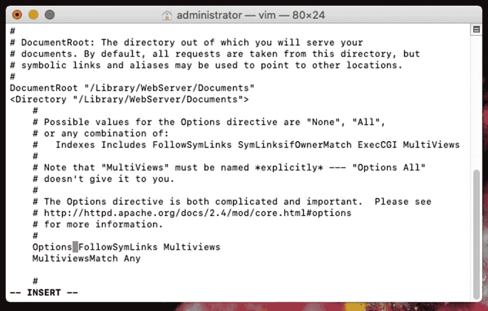

   图 10-3

   在 VI 中启用插入模式以编辑 httpd.conf 文件

5.  接下来，在这一行中输入 `Indexes`，使其现在显示为 `Options Indexes FollowSymLinks Multiviews`，这将使我们能够在 Web 服务器上看到文件和文件夹，而不是 HTML 内容。完成此更改后，按 **esc** 键退出**插入模式**。您的 `终端` 窗口应类似于图 `10-4`。

   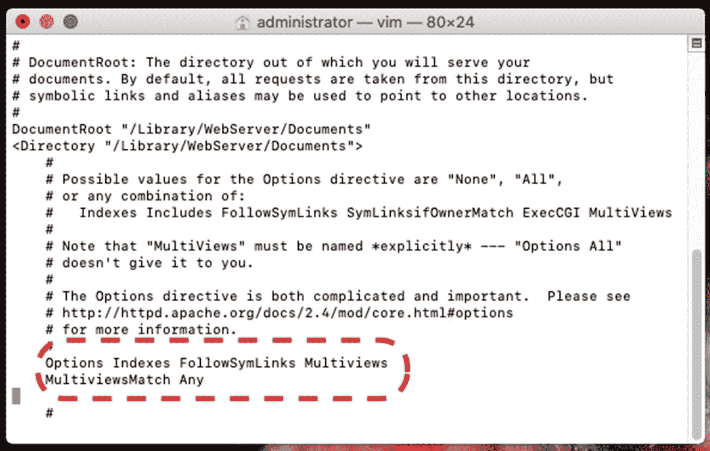

   图 10-4

   您的 Options 行现在应如图所示

6.  现在我们已经完成了必要的更改并记下了 Web 服务器根目录的路径，可以保存更改并退出文档了。在 `VI` 中，键入 `:wq` 并按 **回车**。**冒号** (`:`) 表示接下来是一个命令，**w** 代表**写入**更改（保存），**q** 将**退出**文档，使我们退出 `VI` 并返回到命令提示符。

7.  回到命令提示符，我们现在可以启用我们的 Web 服务器服务。输入 `apachectl start` 以启用该服务。打开一个浏览器窗口并输入 `http://localhost/`，您应该会看到一条显示 **"It works!"** 的消息，如图 `10-5` 所示。至此，我们已经配置了 Web 服务器并启动了服务。

   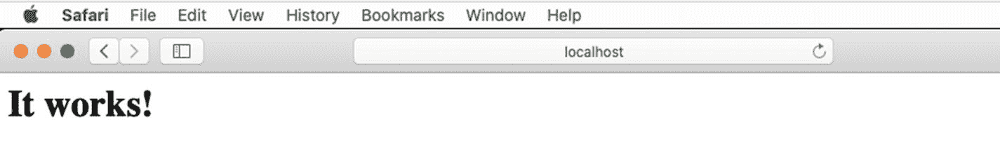

   图 10-5

   确认我们的 Web 服务器服务已启动


### 修改 Unix 八进制文件权限

我们已经成功配置并启动了 Apache Web 服务器服务，但在服务器准备就绪以供 *Munki* 使用之前，我们还有一些工作要做。接下来我们需要在 Web 服务器上创建一个 Munki 客户端需要访问的特殊文件夹。

我们需要通过**终端**创建此目录，并使用 *Unix 八进制表示法系统* 设置文件权限。让我们回到终端并使用 `cd /Library/WebServer/Documents/` 命令切换到 Web 服务器的根目录。使用 `ls` 命令，但也使用 `-l` 选项以 *长列表* 格式查看目录。您的终端窗口应如图 10-6 所示。

您应该会看到三行，每行对应此目录中的一个文件。第一列表示每个文件的八进制文件权限，称为 *八位字节*。第二列表示硬链接的数量，第三列是文件的所有者，第四列是组。第五列是文件大小，第六列是最后修改日期/时间，最后一列是文件名本身。

如您所见，***root*** 是这些文件的所有者，***wheel*** 是组。这些权限将与我们之前在第三章中使用 *macOS* 图形用户界面 **获取信息** 对话框中查看的权限一致。我们将在此处创建一个新目录。*Munki* 需要一个名为 ***munki_repo*** 的文件夹，它是所有 Munki XML 文件和安装介质的仓库，我们的客户端将在软件安装过程中访问。让我们使用 `mkdir` 命令创建此目录。输入 `mkdir munki_repo` 并按 **回车**。现在再执行一次 `ls -l` 命令，查看我们的新文件夹是否已创建及其默认设置的权限。您的终端窗口应类似于图 10-7。

让我们花点时间看看新目录的八位字节。默认情况下，我们看到 `drwxr-xr-x`，那么这在与权限相关时意味着什么？好问题！这串字母表示 *所有者*（本例中为 root）、*组*（本例中为 wheel）和 *所有人* 组的 *读、写和执行* 权限。正如我们在第 3 章中学到的，所有人组确实意味着 *其他所有人*。图 10-8 很好地展示了目录、所有者、组和所有人权限之间的细分。

**d** 标识这是一个目录而不是一个文件。这就是为什么我们的 ***munki_repo*** 文件夹前面有一个 `d`，而此目录中的其他三个文件没有。接下来的三个字符表示所有者的权限。看起来 root 对这个文件夹拥有读、写和执行权限。接下来的三个显示 wheel 组的成员拥有读和执行权限，而所有人组只有执行权限。图 10-9 提供了一个权限和目录列表的图表，您可以用作参考来确定每个字符集代表什么。

我们需要使 ***munki_repo*** 目录对 Mac 客户端可读/写访问，以便 *Munki* 正常运行，因此我们需要更改此文件夹的文件权限。为此，我们将使用 `chmod` 命令。如果您之前在本书中花时间查看了 `chmod` 和 `chown` 的手册页，您可能已经知道我们可以用这些命令更改文件的所有者和权限。使用 `chmod` 命令并参考图 10-9 中的表格，我们可以为所有者、组和所有人分配八个可能值之一，代表他们对此文件夹的权限。正如您所看到的，如果我们使用值 7，它将授予读、写和执行权限；这正是我们希望为 ***munki_repo*** 文件夹的所有者、组和所有人设置的权限。

请继续在提示符处输入 `chmod -R 777 munki_repo/` 并按 **回车**。我们使用此命令修改 ***munki_repo*** 目录的权限，以允许 root、wheel 和所有人拥有读、写和执行权限。让我们再次使用 `ls -l` 命令，确保我们做的更改生效。您的终端窗口应如图 10-10 所示。

接下来，让我们确保可以从我们的 Web 服务器访问 ***munki_repo*** 文件夹。打开浏览器窗口并输入 `http://localhost/munki_repo`，您应该会看到一个空目录的索引列表，如图 10-11 所示。

请继续关闭浏览器并退出终端应用程序。


### 为 Munki 创建网络文件共享

为使我们的服务器准备好与 `Munki` 配合使用，我们需要执行的最后一步是将 `munki_repo` 文件夹作为 SMB 共享分享到我们的局域网上。我们将使用 `共享系统偏好设置` 来启用 `文件共享` 服务。点击 `+` 按钮并浏览到 `Macintosh HD/Library/WebServer/Documents/` 中的 `munki_repo` 目录来添加一个新的共享文件夹，如图 10-12 所示。您将看到文件共享权限是从目录继承的，应该为所有人提供读写能力。

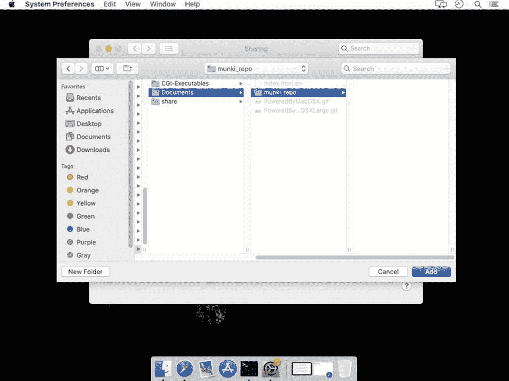

图 10-12

将 munki_repo 文件夹共享为网络文件共享

关闭系统偏好设置。此时，我们应该从网络上的另一台计算机进行快速验证，以确保一切按预期工作。我将使用我的管理工作站来将 `munki_repo` 文件夹映射为一个共享，同时通过网页浏览器点击 `munki_repo` 目录。

使用 Finder 中的 `连接到服务器` 选项，如图 10-13 所示，并进行身份验证以挂载 `munki_repo` 文件夹的 SMB 共享。

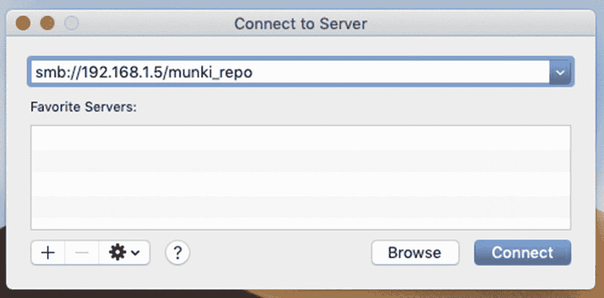

图 10-13

使用 SMB 协议映射 munki_repo 共享

我还将打开我的 Safari 网页浏览器并访问 `http://192.168.1.5/munki_repo/`。如果一切配置正确，您应该能够通过网络共享和网页浏览器浏览该目录，如图 10-14 所示。

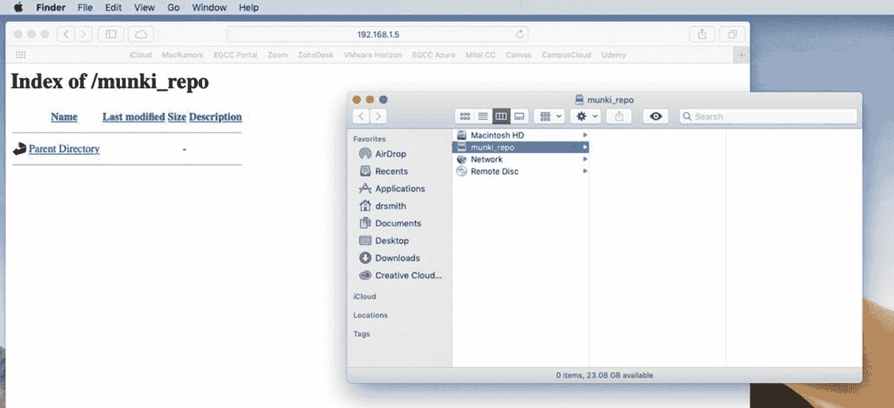

图 10-14

通过 Safari 和 Finder 在远程计算机上浏览 munki_repo 目录

恭喜！您的 Web 服务器现已配置好，可以与 Munki 配合使用了！

**专业提示**

如果您希望使用 Munki 支持多个站点，可以为每个地点的服务器重复这些相同的步骤，然后使用实用程序在服务器之间同步 `munki_repo` 目录。由于无需担心集中式数据库或专有文件，只需在服务器之间同步平面文件和文件夹即可轻松扩展您的 Munki 环境。

## 配置 Munki 管理工作站

现在我们的服务器已经启动并运行，下一步是配置我们的 `Munki` 系统管理员将用来创建软件包、向服务器上传数据和管理 `Munki` 环境的工作站。我通常使用已安装 `Apple Remote Desktop` 的同一台工作站，以便将我所有的 Mac 管理工具集中在一处。

### 安装 MunkiTools 和 MunkiAdmin

我们需要做的第一件事是下载几个安装包。第一个是来自 `Munki 项目的 GitHub` 页面的官方 `MunkiTools` 版本。您可以在 `https://github.com/munki/munki/releases` 找到客户端安装程序，我将下载支持 `macOS 10.10 Yosemite` 到 `macOS 10.15 Catalina` 的 `Munki 3.6.4` 版本。

**专业提示**

Munki 最近在其 GitHub 页面上发布了 4.x 版本，该版本包含其自己的 Python 支持，而不是依赖 Apple 的内置版本。您应该评估此版本对旧版 macOS 的支持情况，并根据您的 Mac 设备群的年限决定是安装 Munki 4 还是继续使用 3.x 变体。在本章的练习中，我们将使用 3.6.4 的稳定版本。

从该页面下载 `munkitools-3.6.4.3786.pkg` 并保存到您的桌面。接下来，`双击` 下载的安装包，按照提示进行 `安装`。如果 `Gatekeeper` 阻止安装，您可能需要 `右键点击` 安装包，从上下文菜单中选择 `打开`，并同意打开来自未知开发者的文件。完成后需要重启。请根据提示进行 `重启`。

我们还将下载 `MunkiAdmin` 工具并将其安装到此工作站上。`MunkiAdmin` 是另一个开源项目。它是一个用于管理 `Munki` 环境的 GUI 工具。当前版本是 1.7.1，可以在 `https://github.com/hjuutilainen/munkiadmin/releases/` 找到。下载此版本并保存到您的桌面。解压缩磁盘映像，然后将 `MunkiAdmin` 应用程序 `拖放` 到您的 `/应用程序` 或 `/应用程序/实用工具` 文件夹中以完成安装。我将把它安装到我的工作站的 `/应用程序` 文件夹中。

### 在管理工作站上配置 Munki 客户端

重启管理工作站后，重新连接到 `munki_repo` 网络共享，并确保仍然可以通过 Finder 浏览它。接下来，我们需要通过终端进行一些安装后配置，将我们的管理工作站指向 `Munki` 仓库。打开终端，在命令提示符下输入 `munkiimport --configure`，如图 10-15 所示。

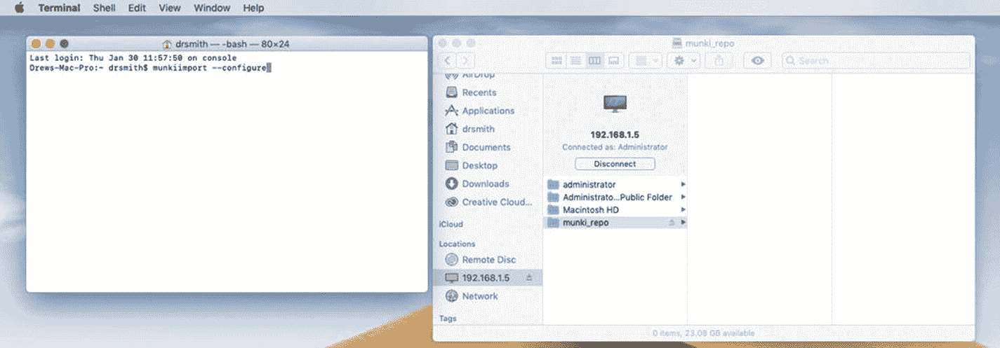

图 10-15

在终端中调用配置命令行实用程序

在逐步执行命令行配置实用程序时，我们需要回答一些问题。首先，它询问的是 `Repo URL`。这可能有些迷惑，因为它这里需要的是我们的 `munki_repo` 共享的路径，而不是 Web 服务器的 URL。请按此格式输入完整路径 `smb://192.168.1.5/munki_repo/`，其中 IP 地址是您的 `Munki` Web 服务器的域名或 IP。

**专业提示**

我使用 IP 地址是因为我没有为此演示服务器创建 DNS 记录。但是，在生产环境中，您可能希望将 FQDN 作为 `munki_repo` 共享路径的一部分输入。

接下来，它将询问我们喜欢为 `pkginfo` 文件使用什么文件扩展名。这些是 Munki 读取以确定我们希望各种安装程序如何运行的文件。我们将保持默认值 `*.plist`，因此按 `回车` 键接受默认值。现在它将提示我们为 `pkginfo` 文件选择一个编辑器。我们将使用 GUI `MunkiAdmin` 应用程序，因此可以在此处接受默认值。按 `回车` 键继续。

当提示我们输入 `catalog` 时，接受默认值 `testing`。我们将在本章的下一节讨论目录。按 `回车` 键继续。最后，最后一个提示将询问 `plug-ins`。也按 `回车` 键接受此处的默认值。至此，我们已完成在管理工作站上配置 `MunkiTools`。设置这些选项后，您的终端窗口应类似于图 10-16。

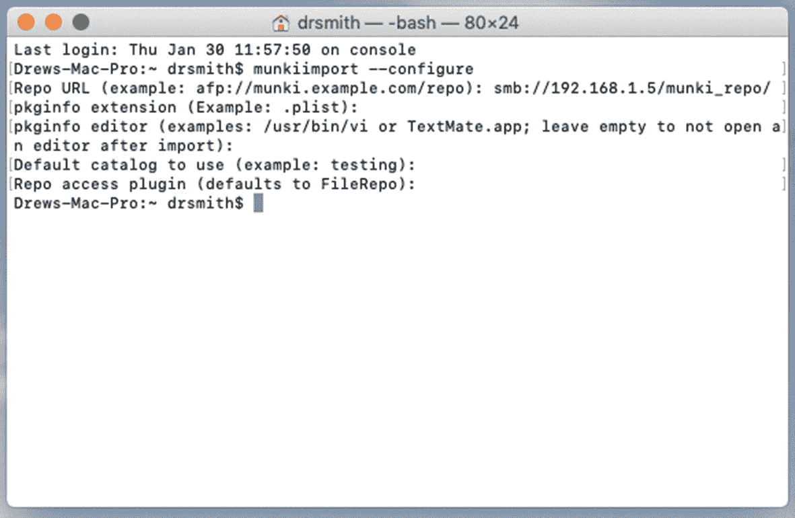

图 10-16

对配置提示的建议响应


## Munki 组件

在客户端计算机上，`Munki` 通过多个组件来运作。`Munki` 的全部功能都存在于客户端软件中，该软件作为 `MunkiTools` 的一部分安装。本章稍后，我们将在测试客户端上安装并配置 `MunkiTools`，以便观察其实际运行。在此之前，理解 `Munki` 客户端软件的主要组件至关重要：

*   **受管软件中心：** 这是一个 GUI 实用程序，由 `MunkiTools` 软件包安装到 `/Applications` 目录中。它允许最终用户选择授权的软件，并在其 Mac 上安装，而无需本地管理员权限。
*   **安装项目：** 这些是驻留在您 `Munki` 服务器上的软件包或磁盘映像，用于将通过 `Munki` 客户端或 `受管软件中心` 安装和管理的应用程序。
*   **目录：** 这些是管理员导入到 `Munki` 中的软件列表，包含关于应用程序应如何安装、脚本和特定设置的元数据。我们将有一个测试目录，用于存放尚未准备好安装在最终用户系统上的应用程序，以及一个生产目录，用于存放已批准进行大规模安装的应用程序。
*   **清单：** 这是一个列出应在给定计算机上安装哪些软件的清单。您可以为每台计算机、每个位置或每个工作组创建一个清单。通常，最佳实践是尽可能减少清单数量，以保持简单和一致。
*   **安装收据：** 虽然这不专属于 `Munki`，但当软件包安装在 Mac 上时，会创建一个收据。`Munki` 利用收据来判断客户端工作站上需要安装什么以及已经安装了什么。如果某个软件包存在收据，`Munki` 将不会尝试再次安装它。
*   **物料清单：** 与收据类似，物料清单并非 `Munki` 特有，它在软件包安装时创建。这是一个特定软件应用程序的组件列表，`Munki` 在卸载过程中会参考此列表来移除软件及其相关依赖项。

## 导入 MunkiTools 软件包

我们要做的第一件事是从命令行将第一个软件包导入 `Munki`，以便了解其工作原理。我们可以直接开始使用 `MunkiTools` 软件包，因为它正方便地放在我们的桌面上，随时可用。

### 导入我们的第一个安装软件包

1.  首先再次打开终端，在命令提示符处输入 `munkiimport`，然后将 `munkitools.pkg` 文件从桌面拖拽并放入命令行中。您的终端窗口应类似于图 10-17。

    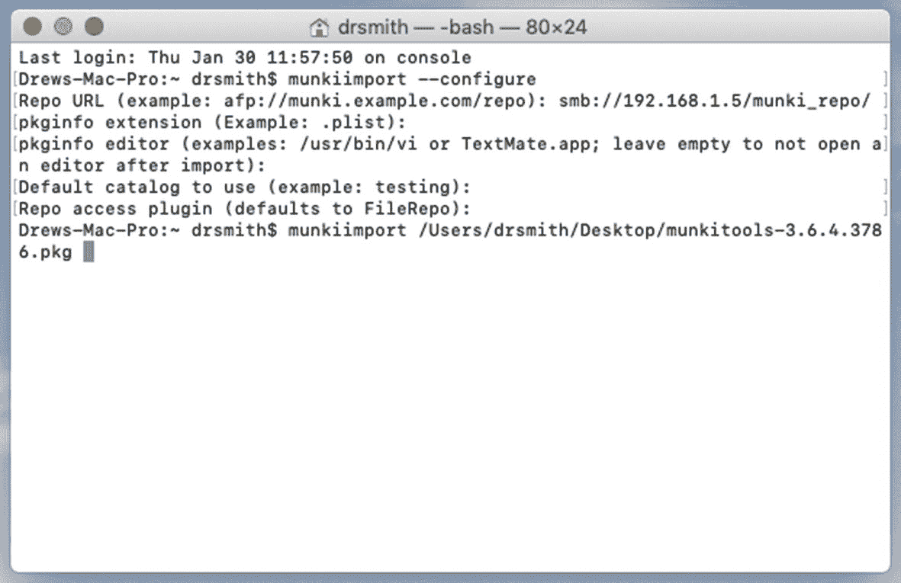

    图 10-17
    使用 `munkiimport` 命令及 `*.pkg` 文件路径

2.  接下来，按回车键在我们的软件包文件上执行 `munkimport` 命令。现在它将开始提示我们通过导入命令行工具编辑或接受默认选项。我们将在本章后面打包其他应用程序时更详细地介绍每一项，但此刻请按如下方式配置：

    如果您的终端窗口看起来类似于图 10-18，请对 **导入此项？** 的提示回答 `y`。

    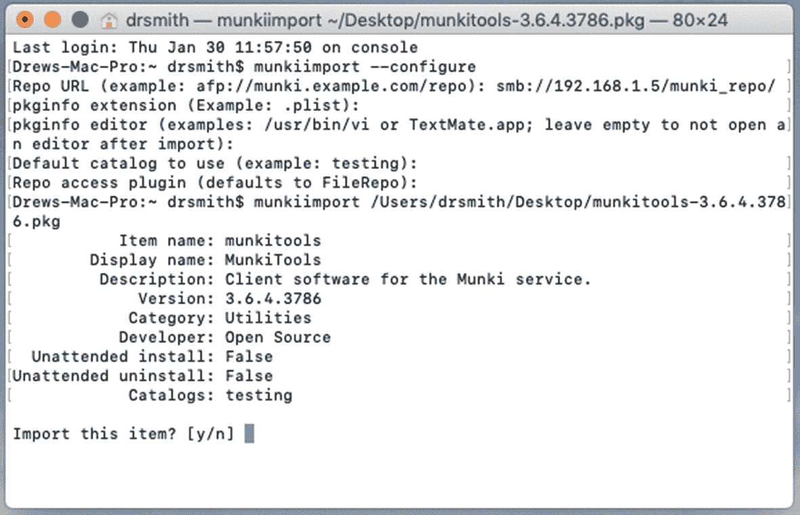

    图 10-18
    使用 `munkiimport` 命令行工具配置安装程序软件包

    ```
    Item name: munkitools
    Display name: MunkiTools
    Description: Client software for the Munki service.
    Version: 3.6.4.3786
    Category: Utilities
    Developer: Open Source
    Unattended install: False
    Unattended Uninstall: False
    Catalogs: testing
    ```

3.  当提示 `上传项目到子目录路径` 时，按回车接受默认值。
4.  当提示 `尝试创建产品图标？` 时，回答 `y` 并按回车。您将看到一些关于导入和复制软件包到我们服务器的输出文本。
5.  当它提示您 `重建目录` 时，回答 `y` 并按回车。它会提供一些输出，如果您查看您的 `munki_repo` 共享，您会看到出现了许多新文件夹，如图 10-19 所示。

    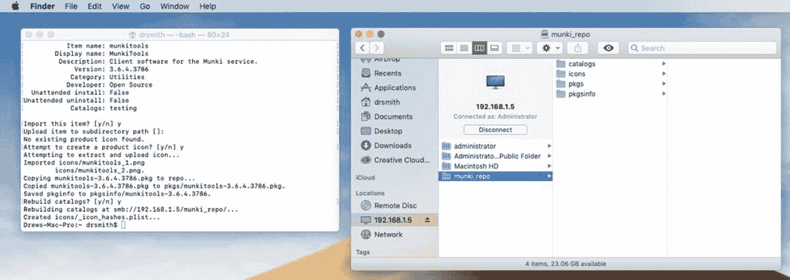

    图 10-19
    导入第一个安装软件包后我们的 `munki_repo` 目录

恭喜！您刚刚将第一个安装软件包导入了 `Munki`。

## MunkiAdmin 简介

现在我们已经将一个软件包导入 `Munki`，并且在 `munki_repo` 目录的根目录下创建了几个文件夹，让我们打开 `MunkiAdmin` 应用程序。当您打开 `MunkiAdmin` 时，它会提示我们指向我们的 `munki_repo` 网络共享。浏览到该共享，单击选择它，然后点击 **打开** 按钮，如图 10-20 所示。

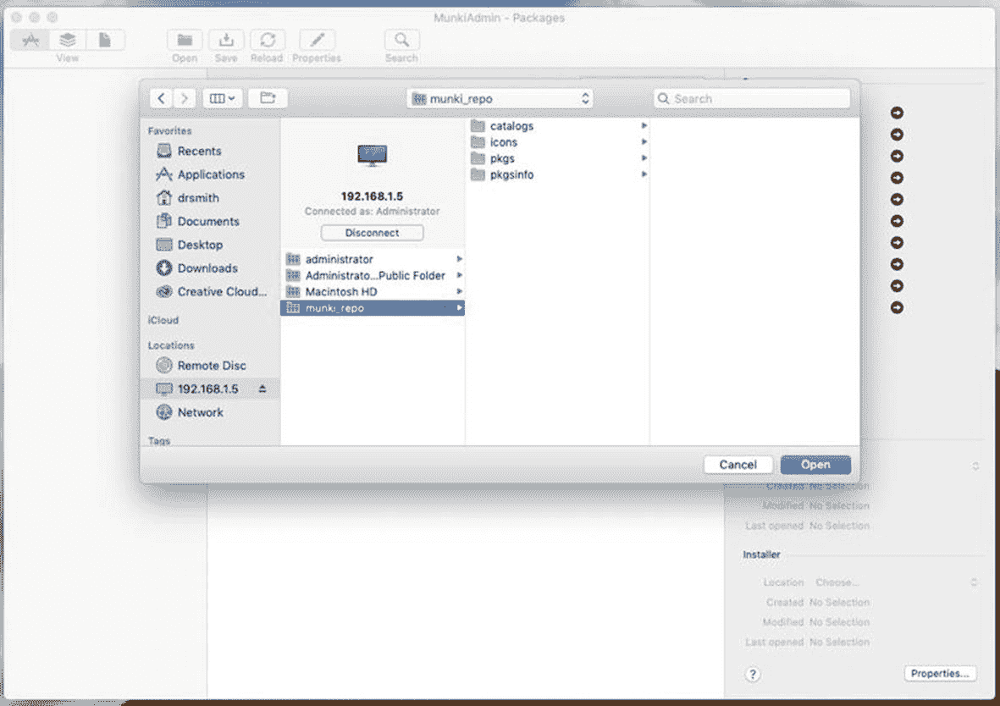

图 10-20
当 `MunkiAdmin` 提示时，指向我们 `munki_repo` 的 SMB 共享

选择了 `munki_repo` 共享后，您将看到主 `MunkiAdmin` 控制台界面，我们的 `MunkiTools` 软件包已在列表中。

图 10-21 及以下描述将为您提供 `MunkiAdmin` 界面的快速参考。

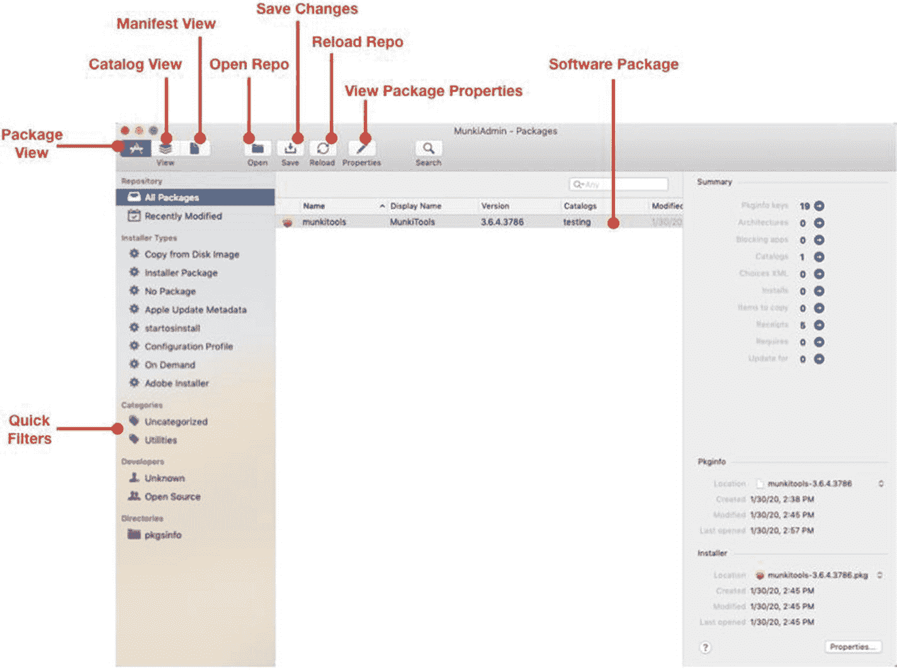

图 10-21
`MunkiAdmin` 界面

*   **软件包视图：** 列出所有已导入 `Munki` 的软件包的视图。
*   **目录视图：** 显示所有目录并允许我们管理目录的视图。
*   **清单视图：** 显示所有清单并允许我们管理清单的视图。
*   **打开仓库：** 按下此按钮连接到特定的 `munki_repo` 网络共享。
*   **保存更改：** 将对当前软件包、目录或清单所做的更改保存到 `munki_repo`。
*   **重新加载仓库：** 将更改保存到 `munki_repo` 后刷新 `MunkiAdmin` 控制台。
*   **查看软件包属性：** 加载包含所有软件包安装选项的对话框。
*   **软件包列表：** 已导入 `Munki` 的可用软件包列表。
*   **快速过滤器：** 此侧边栏将根据类别或开发者填充，并会根据该搜索条件过滤您的软件包列表。例如，如果您想仅筛选出 Adobe 的软件包，可以点击 Adobe 开发者过滤器。

## 将软件打包进 Munki

现在我们的管理工作站已准备就绪，我们需要开始打包一些软件。`Munki` 支持导入和安装标准 *macOS 安装程序* `∗.pkg` 格式、`∗.dmg` 磁盘映像安装以及 *Adobe CC* 软件包，无需任何特殊的重新打包要求。`Munki` 还可以创建卸载软件包，因此您可以在需要从旧版本升级到新版本时用它来移除软件。

> 专业提示
> 如果您有在 Microsoft Windows 系统上安装软件的经验，可以将 Apple 原生的 `*.pkg` 安装包看作是 *macOS* 下与 Microsoft `*.msi` 安装文件等效的格式。


## 将软件导入 Munki

在本节中，我们将建立一个安装程序包的目录。开始之前，您应该从管理工作站访问互联网，并将以下安装程序下载到您的桌面。如果这些应用程序既可以通过 *Mac App Store* 获取，也可以直接从开发者的网站获取，请下载开发者版本而非 *App Store* 版本：

*   **Adobe Reader:** [`https://get.adobe.com/reader/`](https://get.adobe.com/reader/)
*   **Adobe Flash Player:** [`https://get.adobe.com/flashplayer/`](https://get.adobe.com/flashplayer/)
*   **VLC:** [`www.videolan.org/vlc/download-macosx.html`](http://www.videolan.org/vlc/download-macosx.html)
*   **Mozilla Firefox:** [`www.mozilla.org/en-US/firefox/new/`](http://www.mozilla.org/en-US/firefox/new/)
*   **Google Chrome:** [`www.google.com/chrome/`](http://www.google.com/chrome/)
*   **Audacity:** [`www.audacityteam.org/download/`](http://www.audacityteam.org/download/)

### 导入软件包

您的计算机应该已映射了 ***munki_repo*** 网络共享，并且桌面应有六个 ***.dmg** 文件，即前面列出的每个应用程序对应一个。在本练习中，我们将把这些软件应用程序导入 *Munki*。我们将从 *Firefox* 和 *Adobe Flash Player* 开始，因为它们使用不同类型的安装过程。*Firefox* 是简单的将应用程序拖放到 ***/Applications*** 文件夹中，而 *Adobe Flash* 则使用安装包文件。

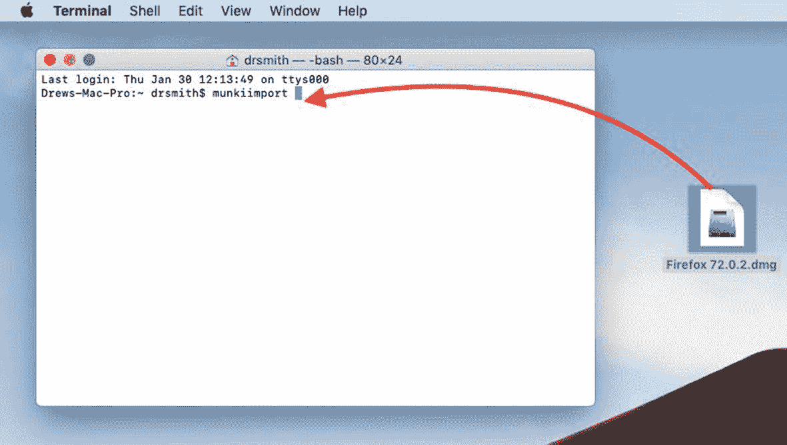
*图 10-22 对 *.dmg 文件使用 munkiimport 命令*

1.  我们将从 Firefox 开始。打开一个新的终端窗口，在命令提示符后输入 `munkiimport`，然后将 Firefox 的 *.dmg 文件拖放到窗口中，如图 10-22 所示。按键盘上的回车键开始命令行 `munkiimport` 实用程序。

这将类似于本章前面导入 *MunkiTools* 时使用的过程。请通过命令行逐步完成这些选项。以下是这些选项用途的更多信息：

*   **Item Name:** *Munki* 中包的名称。
*   **Display Name:** 在 *Managed Software Center* 中显示的软件标题。
*   **Description:** 在 *Managed Software Center* 中提供的软件描述。
*   **Version:** 软件的版本。*Munki* 会尝试从包中确定版本，但如果无法确定，您需要手动提供版本号。版本号很重要，因为 *Munki* 在未来需要升级软件时会引用它。
*   **Category:** 这将把软件放在特定类别中，以便在 *MunkiAdmin* 和 *Managed Software Center* 中过滤。
*   **Developer:** 这将把软件放在特定的开发者组中，以便在 *MunkiAdmin* 中过滤。
*   **Unattended Install:** 这是一个布尔值（`true` 或 `false`）。如果设置为默认的 `false`，软件不会自动安装，需要最终用户从 *Managed Software Center* 手动选择并安装。如果设置为 `true`，软件将无需任何交互自动安装。
*   **Unattended Uninstall:** 类似于无人值守安装，如果此值设为 `true`，当我们从清单中移除软件时，它将自动卸载。否则，如果保持默认值 `false`，则需要用户或系统管理员手动移除软件。
*   **Catalogs:** 标识软件应列在哪个（哪些）目录中。我们稍后也可以在 *MunkiAdmin* 中修改此设置。

请按照图 10-23 中所示回答问题。

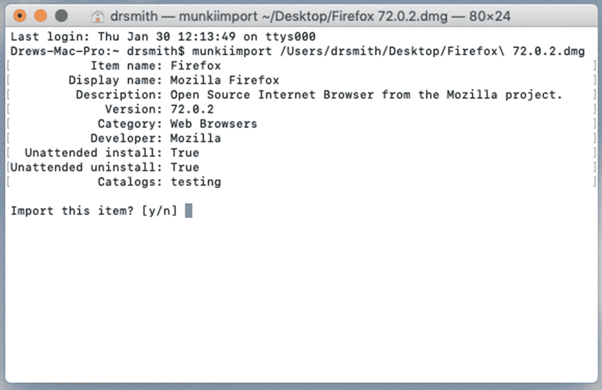
*图 10-23 Mozilla Firefox 提示的推荐答案*

1.  当提示导入项目时，输入 `y` 继续。
2.  当询问是否要将项目上传到子目录路径时，我们将采用默认值。我们不会将软件包放在各种子目录中，只放在 ***munki_repo*** 共享的 ***pkgs*** 目录下的单个默认目录中。按**回车**键接受默认值并继续。
3.  接下来，它会提示您尝试创建产品图标。对此回答 `y` 以继续。Munki 会尝试从包中找到图标并创建它，该图标将显示在 *Managed Software Center* 中。
4.  现在它将把包复制到 ***munki_repo*** 共享，并根据安装程序包和我们的命令行输入保存所需的 **pkginfo.plist** 数据。它会询问是否重新构建目录，由于我们刚刚通过添加新应用程序更改了目录，我们将回答 `y` 并按**回车**继续。

目录重新构建完成后，我们就成功导入了 *Firefox* 应用程序。如果想检查工作以确保应用程序可用，可以打开 ***munki_repo*** 网络共享并浏览 ***/pkgs*** 和 ***/pkgsinfo*** 目录，查看 *Firefox* 是否可用。也可以从 Web 浏览器访问您的 ***munki_repo*** 页面，确保包可以通过 Web 访问。最后，可以打开 *MunkiAdmin* 并**重新加载**仓库，查看 *Firefox* 是否可用。如图 10-24 所示，我工作站上的一切都已同步且可用。

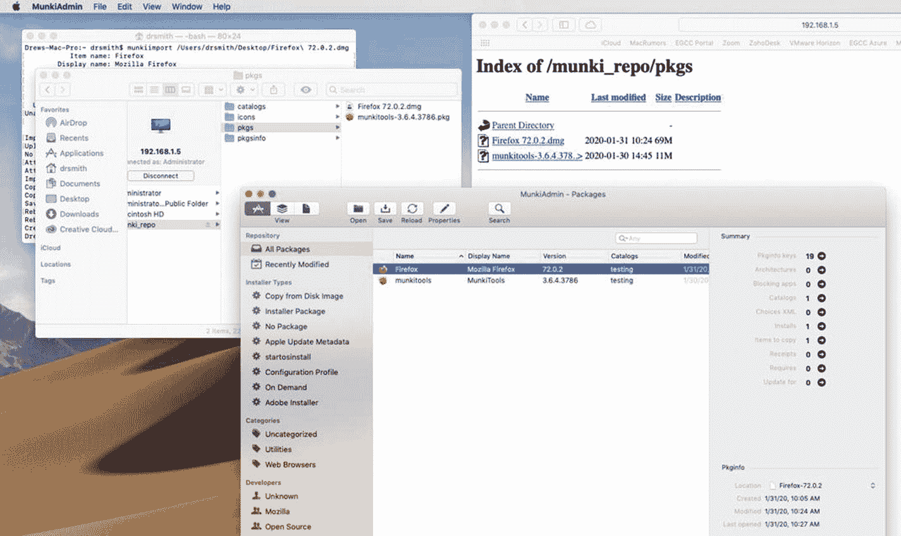
*图 10-24 Firefox 包在 MunkiAdmin、munki_repo 共享和 Web 服务器中可用*

1.  接下来，我们可以导入 *Adobe Flash Player*。**双击** **Install Flash Player *.dmg** 文件以将磁盘映像挂载到桌面。在内部，您需要**右键单击** **Install Adobe Flash Player** 应用程序并选择**显示包内容**。然后，浏览 ***/Contents/Resources/*** 目录并找到 **Adobe Flash Player *.pkg** 文件，因为那是我们的安装程序。使用 `munkiimport` 命令，并将 ***.pkg** 文件**拖放**到终端窗口以指定路径。按**回车**键开始导入过程，就像对 *Firefox* 所做的那样。
2.  出现提示时，输入如图 10-25 所示的信息。请注意，我们需要修改其中一些选项。

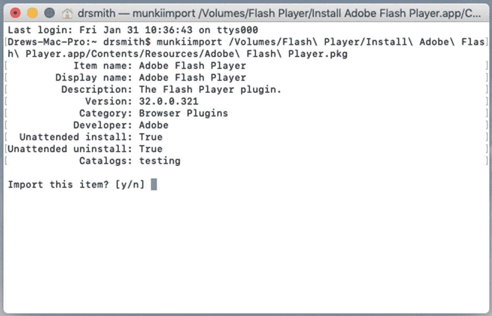
*图 10-25 Adobe Flash Player 安装包的推荐设置*

1.  出现提示时，接受所有默认设置导入项目。当提示有关图标时回答 `y` 并重新构建目录。
2.  一旦它完成将软件导入 *Munki*，请继续验证所有内容是否正确复制。
3.  对其余四个软件标题重复导入过程，在提示时将全部设置为无人值守安装/卸载。完成后，在 *MunkiAdmin* 中**重新加载** ***munki_repo***，您的软件列表应如图 10-26 所示。

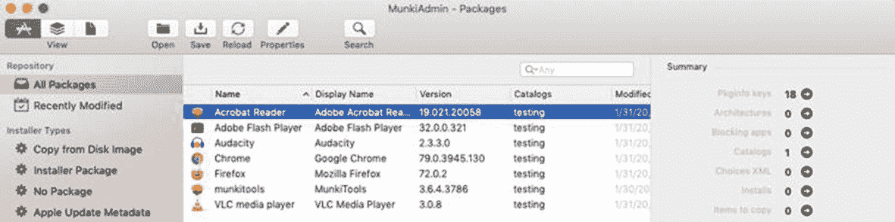
*图 10-26 导入的软件标题完整列表*


### 应用程序包属性

将软件导入 `Munki` 后，您可以通过双击列表中的软件包或选中它并点击工具栏中的**属性**按钮来更改其设置。这里我不会详细介绍所有选项，但确实有一些强大的设置可供您用来微调部署过程。以下是一些需要考虑的更重要的设置：

*   **基本信息选项卡：** 允许您修改我们通过命令行工具导入软件时设置的选项。您可以指定安装后的重启操作，并为强制软件安装（如有必要）设置截止日期。
*   **要求选项卡：** 允许您根据系统上已安装的现有软件来设置依赖关系，并为每个单独的软件包设置最低操作系统和最高操作系统版本。如果您想为运行较旧操作系统的客户端提供较旧版本的应用程序，并为使用较新操作系统的用户提供新版本的软件，这将特别有用。
*   **安装脚本选项卡：** 在此处，您可以指定在软件安装运行前后要执行的脚本。这是在软件安装后自定义应用程序的强大方式。
*   **卸载选项卡：** 在此处，您可以指定卸载过程，包括使用卸载脚本以及在卸载过程运行前后的脚本。

### 创建用于执行脚本的 Munki 包

如果您还记得第 6 章，我们能够使用**发送 Unix 命令**工具将脚本发送到远程计算机。任何可以通过 `Apple Remote Desktop` 发送的单条命令或多个命令的脚本，都可以由 `Munki` 打包并执行。在本节中，我们将探讨如何创建一个用于交付脚本的自定义包。

在本节中，我们将使用一个新工具来创建自定义包。市面上有很多实用工具可以创建 `*.pkg` 文件。我们将使用一个名为 `Munki-Pkg` 的工具，它可以在以下地址获取：[`https://github.com/munki/munki-pkg`](https://github.com/munki/munki-pkg)。`Munki-Pkg` 是一个命令行实用程序，因此没有图形用户界面。我们只需下载它，解压缩，并将解压后的文件夹复制到桌面。我们将通过终端切换到 `~/Desktop/munki-pkg-master/` 目录来运行它。

#### 创建用于运行脚本的包

在本练习中，我们将创建一个用于运行脚本的包，该脚本将强制客户端 Mac 立即重启。

1.  我们首先要做的是开发我们的脚本。这个脚本非常简单，因为它只有一个命令，但您可以创建一个包含多个命令、变量等的更高级脚本。使用终端或 Apple Remote Desktop 测试此命令，确保它能立即重启计算机：

```
shutdown -r now
```

计算机应立即重启。如果运行成功，我们现在就准备好了要在 `Munki` 中打包的脚本。

**专业提示** 本练习的目的是演示如何创建自定义包来运行脚本。此示例重启脚本不建议在生产环境中与 Munki 一起使用，因为它可能导致您的客户端系统在不通知最终用户的情况下重启。

2.  我们将继续创建一个新的空包。在 `munkipkg` 可执行文件的路径之后，在命令行中添加 `--create RestartClientScript`，然后按下**回车**键，如图 10-28 所示。这将创建一个名为 `RestartClientScript` 的新空包。

3.  如果成功，它会在您的主目录根目录下创建一个名为 `RestartClientScript` 的文件夹，在该文件夹内，您会看到 *build*、*payload* 和 *scripts* 文件夹。我们将忽略 payload 文件夹，专注于 scripts 文件夹。继续在终端中通过输入 `cd /RestartClientScript/scripts/` 切换到 scripts 目录。

4.  进入 scripts 文件夹后，我们将再次使用 `VI` 来创建一个运行我们脚本的文件。输入 `vi postinstall`，在 `VI` 文本编辑器中创建一个名为 `postinstall` 的新文件。该文件必须命名为 `postinstall`，以便在执行脚本时正确打包和运行。

**专业提示** 软件打包超出了本书的范围，但网上有很多关于创建自定义安装包及其工作原理的好文章。您会发现，在任何包中都可以运行两个脚本：一个是 preinstall 脚本，另一个是 postinstall 脚本。`macOS 安装器`会查找这两个文件，并在安装过程的适当时机执行它们。

5.  使用**方向键**在文件中导航，然后按 **i** 键插入文本，就像本章前面使用 `VI` 时一样。输入我们的脚本，然后按 **Esc** 键退出插入模式。使用 `:wq` 命令保存文件并退出 `VI`。您的终端窗口应类似于图 10-29。

6.  您可以在 Finder 中浏览 scripts 文件夹，或在 `/scripts` 目录上执行 `ls` 命令，您会看到该目录下现在有一个 `postinstall` 文件。最后一步是将此项目打包成一个 `*.pkg` 文件，然后可以上传到 `Munki`。**再次拖放** `munkipkg` 可执行文件到终端窗口，就像我们之前做的那样。**接着，拖放** `RestartClientScript` 文件夹到终端窗口，以附加项目路径，或直接输入项目文件的路径。当您的终端窗口看起来如图 10-30 所示时，按**回车**键以创建 `RestartClientScript.pkg` 文件。

7.  当命令成功运行时，我们应在终端中看到输出，表明在 `RestartClientScript` 项目文件夹的 `/build` 文件夹中创建了一个 `*.pkg` 文件。如果您浏览到该目录，将会看到 `RestartClientScript-1.0.pkg` 文件，如图 10-31 所示。

8.  现在，您可以像处理其他任何软件一样，使用 `munkiimport` 将此包添加到您的 `Munki` 环境中。

## 使用 Munki 部署软件

我们已经学习了如何打包一个基本的自定义安装程序来运行脚本，以及如何将商业软件安装包导入到 Munki 中。在下一节中，我们将学习如何构建目录（Catalogs）和清单（Manifests）来自动化这些应用程序的安装过程。使用 `Munki` 部署软件的第一步是让客户端指向我们 Web 服务器上的 `munki_repo` 文件夹。


## 在客户端工作站上安装和配置 Munki

我们将从在测试客户端上安装 `MunkiTools` 应用开始。您可以通过运行本章节前面下载的 `MunkiTools` 安装包在客户端系统上交互式地完成此操作，或者使用 `Apple Remote Desktop` 来完成。很可能您会在生产环境中的多台 Mac 上部署 `Munki`，因此让我们在此任务中使用 `ARD`。

### 使用 ARD 安装 Munkitools

在开始此练习之前，请准备一台测试用的 Mac，如果尚未添加，请将其添加到您的 `ARD` 控制台中。

1.  第一步是安装 `MunkiTools`。打开 `ARD` 并点击您的测试 Mac 以选中它。点击工具栏中的 `Install` 按钮，将 `munkitools.pkg` 安装程序添加到软件包列表中。然后点击 `Install` 按钮，如图 10-32 所示。

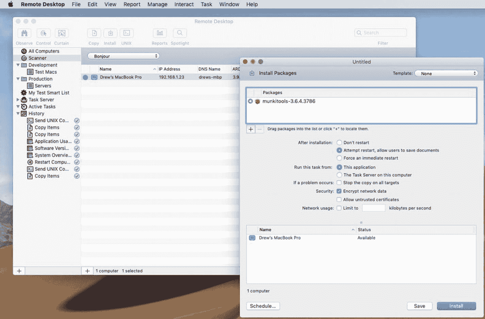

图 10-32

使用 ARD 在您的测试 Mac 上安装 MunkiTools 软件包

2.  安装完成后，它将强制计算机重新启动。接下来我们需要运行一个脚本，该脚本将修改客户端上存储在`/Library/Preferences/`目录中的 `ManagedInstalls.plist` 文件的几个键。在 `ARD` 中选中客户端，然后单击工具栏中的 `Unix` 按钮。在脚本窗口中输入以下几行，如图 10-33 所示。别忘了将命令设置为以 `root` 身份运行：

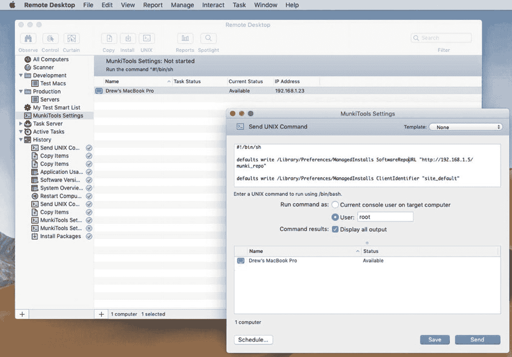

图 10-33

将脚本输入到“发送 Unix 命令”窗口中

```bash
#!/bin/sh
defaults write /Library/Preferences/ManagedInstalls SoftwareRepoURL "http://192.168.1.5/munki_repo"
defaults write /Library/Preferences/ManagedInstalls ClientIdentifier "site_default"
defaults write /Library/Preferences/ManagedInstalls SuppressUserNotification -bool true
```

我们来逐步了解这些行的作用。第一行是所有脚本都必需的，用于标识其为 shell 脚本。第 2–4 行使用 `defaults write` 命令来修改在`/Library/Preferences/`文件夹中找到的 `ManagedInstalls.plist` 文件中的键。

`SoftwareURL` 键将客户端指向我的 Web 服务器。您应确保其通过 `http` 指向您的 `Munki` Web 服务器的 `munki_repo` 文件夹。

`ClientIdentifier` 指向此客户端将用于确定哪些软件可用的清单。我们将在本章后面更详细地介绍清单。

`SuppressUserNotification` 键是一个布尔值，我们将把它从默认值 `false` 更改为 `true`。根据您的环境，您可能希望保留默认值。其作用是当 `Munki` 中有新的应用程序可供最终用户安装/更新时，向他们提供通知（或不提供）。因为我们打算自动化安装和升级过程，所以我们将其设置为 `true`，这将 *不* 向最终用户提供通知。

输入脚本后，您可以点击 `Send` 按钮在客户端上执行它。

**专业提示** 如果这将是您组织中所有（或大多数）客户端的默认设置，请考虑使用此处的 `Save` 按钮保存此脚本，以便在以后安装 `Munki` 时再次运行。

3.  脚本成功运行后，我们可以在客户端上通过浏览到`/Library/Preferences/`目录并使用 Finder 中的 `QuickLook` 选项查看 `ManagedInstalls.plist` 来再次检查我们的设置。您应该会看到 `SoftwareURL` 已更新，指向我们的 `munki_repo`。您的 `ManagedInstalls.plist` 文件应类似于图 10-34。

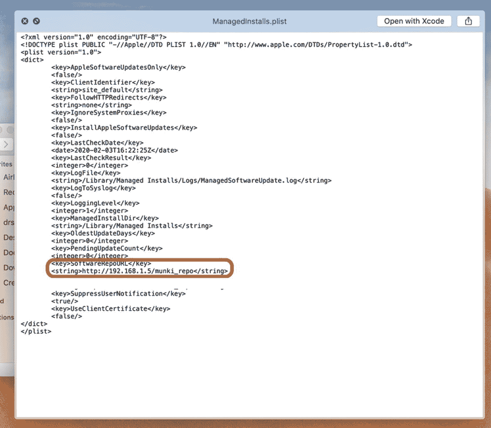

图 10-34

包含我们自定义项的 ManagedInstalls.plist 文件

4.  如果一切看起来正确，请继续重启您的测试计算机，因为在继续之前，它需要使用新的首选项停止并启动 `Munki` 服务。现在，我们已成功在测试 Mac 客户端上安装并配置了 `Munki`。


## 清单

你可能还记得本章前面的内容，清单是一份需要在特定计算机上安装的软件列表。我们可以创建任意数量的清单，但建议保持较小的清单数量，以使你的 Munki 环境尽可能精简简单。在本节中，我们将构建一个名为 `site_default` 的清单，因为我们将测试客户端指向了该清单。

开始之前，我们需要在 `munki_repo` 目录中创建一个 `manifests` 文件夹。确保你已在 Mac 管理员工作站上挂载了 `munki_repo` 网络共享，然后打开终端。使用 `cd` 命令，并将 `munki_repo` 共享拖动到终端窗口，以将目录切换到网络共享。输入 `ls -l`，你应该会看到如图 10-35 所示的目录。

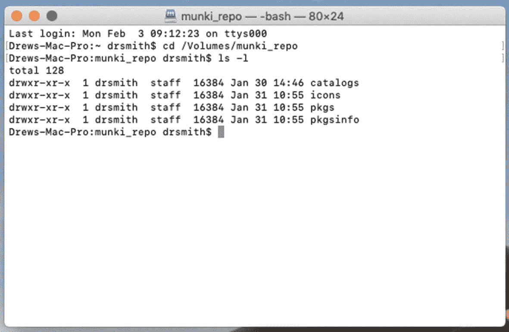

图 10-35
使用终端浏览 munki_repo 共享

接下来，输入 `mkdir manifests`，在 `munki_repo` 共享中创建一个名为 `manifests` 的新文件夹。使用 `ls -l` 或通过访达查看共享，以确认该文件夹已存在，如图 10-36 所示。

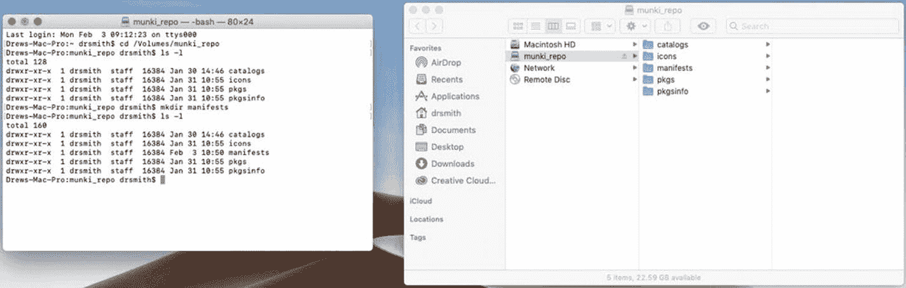

图 10-36
确认新目录现已可用

现在，让我们打开 MunkiAdmin 并连接到我们的 `munki_repo`。点击工具栏中的“清单”选项卡。我们将通过从“文件”菜单中选择“新建清单”来创建一个新清单。出现提示时，将其命名为 `site_default` 并保存到 `munki_repo` 共享上的 `manifests` 文件夹中，如图 10-37 所示。

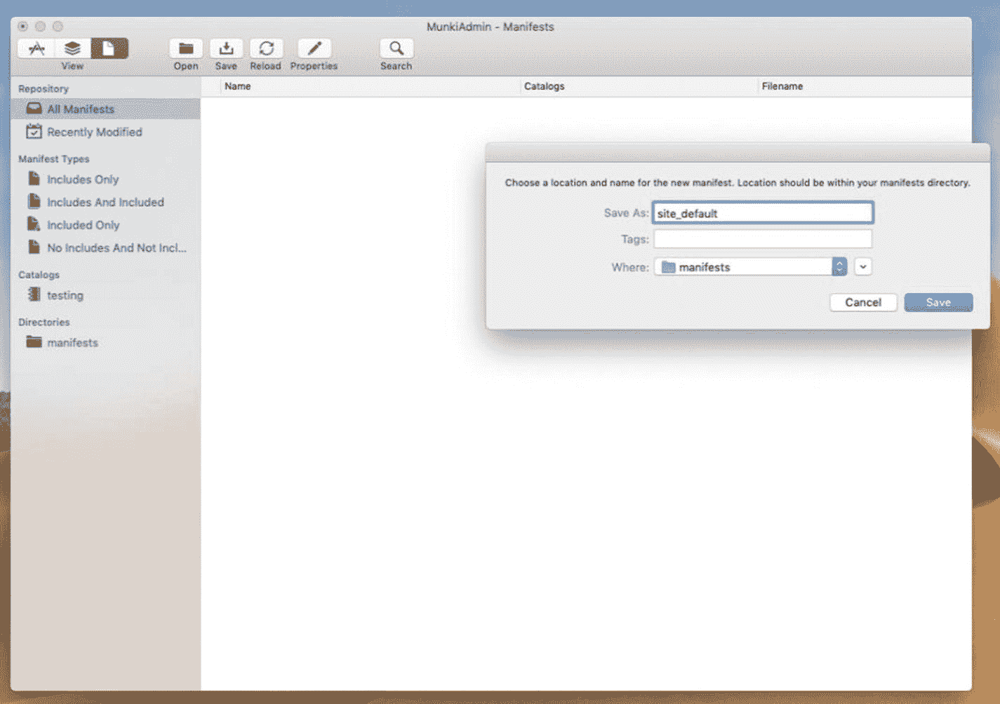

图 10-37
在 MunkiAdmin 中创建 site_default 清单

在 MunkiAdmin 的清单视图中，你现在应该能看到一个 `site_default` 清单。双击它以打开“清单属性”。

### 自定义清单

在这个练习中，我们将自定义 `site_default` 清单。

1.  首先，在“通用”选项卡中，我们将为此清单分配一个软件目录。我们目前有一个可用的目录 `testing`。点击 testing 目录左侧的复选框，将此清单指向测试目录中列出的软件，如图 10-38 所示。

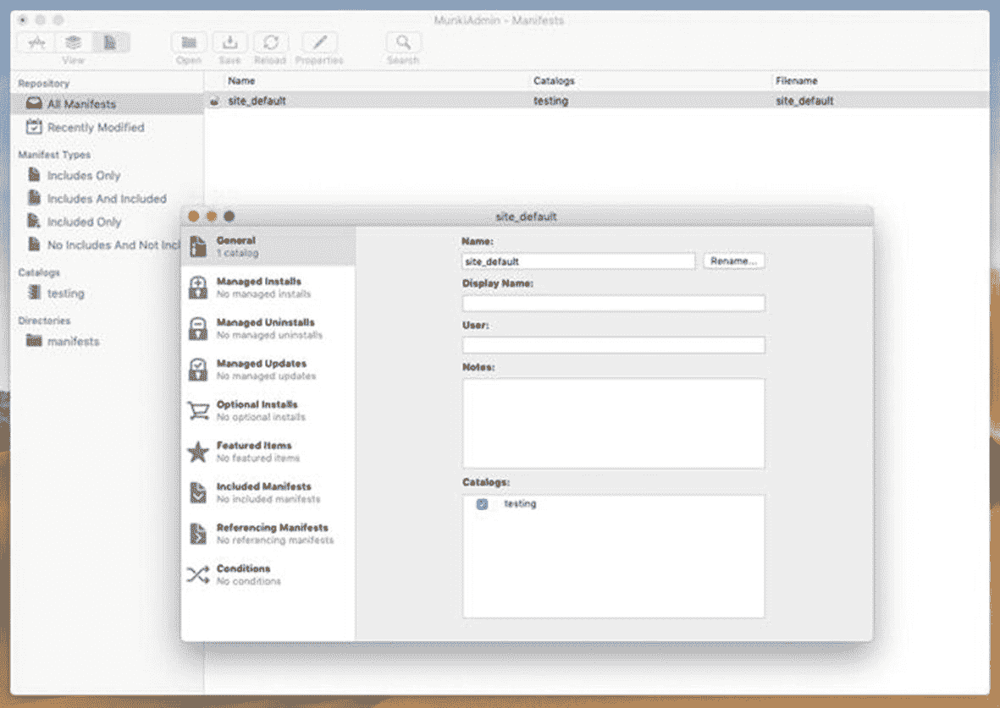

图 10-38
将 testing 目录添加到 site_default 清单

2.  接下来，我们将选择“托管安装”选项卡。使用此窗口底部的“+”按钮，我们可以将特定的应用程序添加到此列表中，供使用此清单的客户端使用。由于这些软件包设置为无需用户交互即可安装，当 Munki 再次运行时，它们将自动安装。我们将把 Firefox 和 Acrobat Reader 添加到此托管安装列表中。按照图 10-39 所示进行选择并添加。

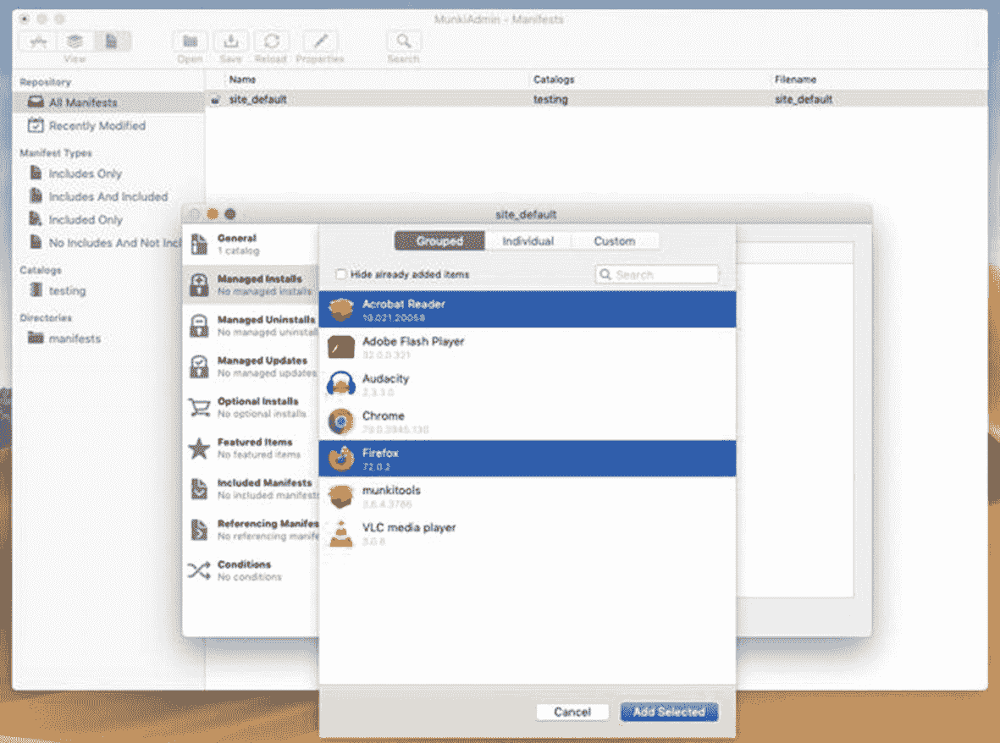

图 10-39
选择并添加 Firefox 和 Acrobat Reader 作为托管安装项

3.  接下来，我们将添加几个可选安装项。可选安装项不会自动安装，但会提供给最终用户，如果他们愿意，可以选择并安装。点击“可选安装”选项卡，然后使用“+”按钮添加 Adobe Flash Player、Audacity 和 VLC Media Player，如图 10-40 所示。

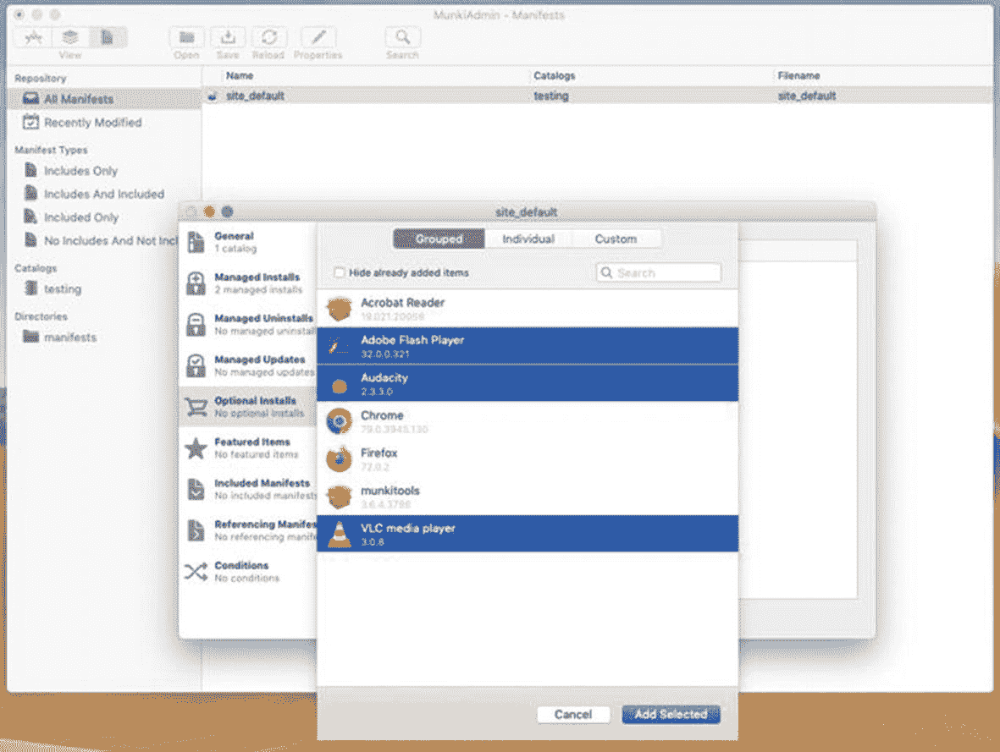

图 10-40
选择 Flash Player、VLC 和 Audacity 作为可选安装项

4.  对 `site_default` 清单进行这些更改后，点击“保存”按钮，然后点击工具栏中的“重新加载”按钮以发布更改并刷新 MunkiAdmin 控制台。

现在我们已经配置好了清单，在我们测试 Mac 上运行的 Munki 客户端软件将能够查看 `site_default` 清单并执行列表中的项目。下一次 Munki 运行时（大约在接下来的一小时内），它将自动安装 Firefox 和 Acrobat Reader。

### 专业提示

默认情况下，Munki 代理大约每小时与服务器联系一次。此时，它会查找服务器上的任何更改，然后下载并安装自上次联系后已部署到生产环境的任何软件包或运行任何脚本。

如果我们想立即测试（我们确实想），而不是等待，我们可以在客户端 Mac 上通过终端使用几个命令来强制 Munki 下载并安装清单中的可用软件包。

在命令提示符下，输入 `sudo managedsoftwareupdate` 以强制运行 Munki。输入本地管理员密码后，你会看到命令行输出，显示 Munki 正在联系你的服务器并检查清单中是否有待处理的更新。它将找到并列出所有可用软件，如图 10-41 所示。

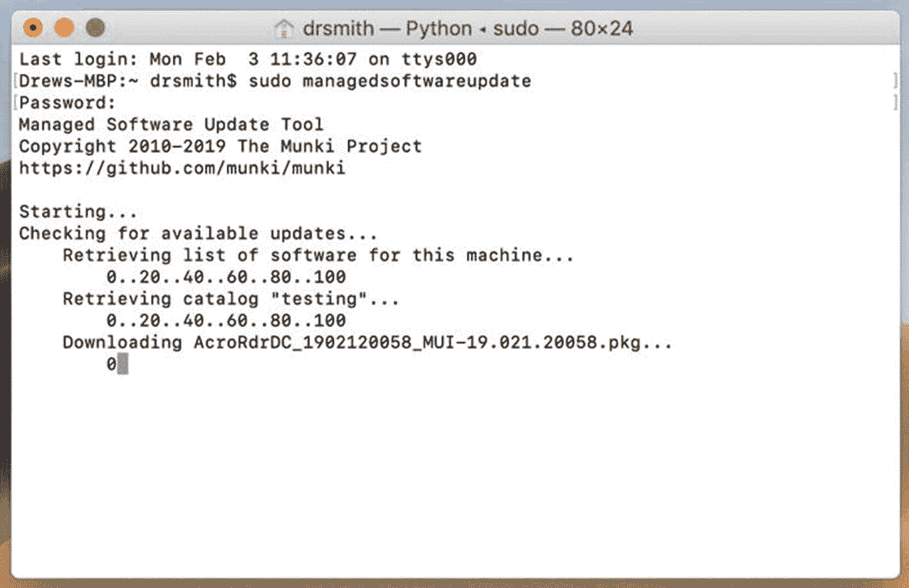

图 10-41
Munki 正在运行并为我们的测试机检查可用更新

接下来，我们可以输入 `sudo managedsoftwareupdate --installonly`，它将开始安装我们在清单中列为托管安装项的软件。图 10-42 显示了命令行的进度输出，因为它会在后台运行安装程序，先安装 Adobe Acrobat Reader，然后是 Firefox。

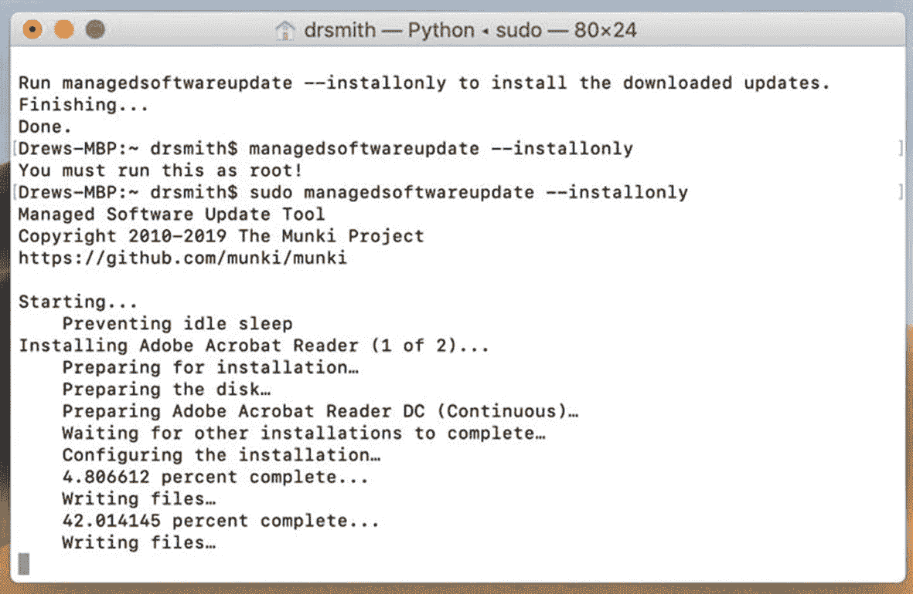

图 10-42
安装软件包

完成后，浏览你的 `/应用程序` 目录，你应该会看到 Adobe Acrobat Reader 和 Firefox 现在已可用。随意打开它们，以确保它们安装成功并按预期工作。


### 管理软件中心

我们已经成功安装了托管应用程序，但那些提供给最终用户、由他们选择是否安装的**可选安装**在哪里呢？您的最终用户可以通过作为 `MunkiTools` 的一部分安装、位于 `/Applications` 目录下的 `Managed Software Center` 应用程序来浏览这些应用并进行安装。在您的测试 Mac 客户端上，按照图 10-43 所示打开 `Managed Software Center`。

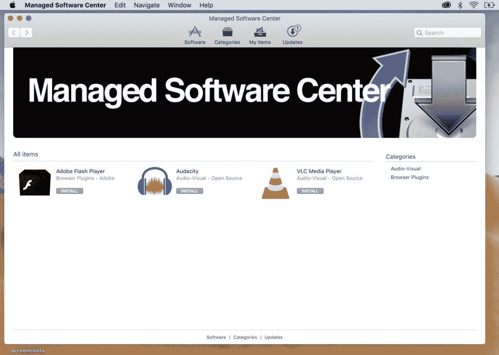

图 10-43
用于最终用户交互的管理软件中心应用程序

`Managed Software Center` 的外观类似 `Mac App Store` 应用程序，功能也非常相似。它为用户提供购物车般的体验，以选择可选应用程序；对于通过清单分配给其计算机的任何应用程序，他们只需点击**安装**按钮即可安装。安装时无需管理员权限，并且他们可以按照自己的时间线管理更新。请在我们的测试 Mac 上继续安装 `Adobe Flash Player`、`Audacity` 和 `VLC Media Player`，以便感受其工作原理。

专业提示

您是否注意到，将软件包导入 `Munki` 时所使用的各类别在 `Managed Software Center` 中得到了利用？如果您计划使用此工具管理大量应用程序，在构建测试和生产目录时，这些类别将非常有用。

### 目录

现在我们已经处理了清单并向测试机器部署了软件，应该更详细地讨论一下 `Catalogs`。为了让 `Munki` 环境尽可能简单，我们应该考虑需要多少个目录。我通常使用两个目录：一个用于测试，一个用于生产。我的测试目录仅用于非生产机器，以确保软件包在安装到组织内所有机器之前能按预期安装和运行。

在 `MunkiAdmin` 中，点击工具栏的**目录**按钮以切换到目录视图。我们应该在这个列表中看到我们的**测试**目录。我总是喜欢将测试目录作为导入软件包的默认位置。测试完成后，我再将这些软件包添加到生产目录中。让我们创建一个**生产**目录，以便您了解其工作方式。从**文件**菜单中选择**新建目录**。在提示时，将此目录命名为 **production**，如图 10-44 所示。

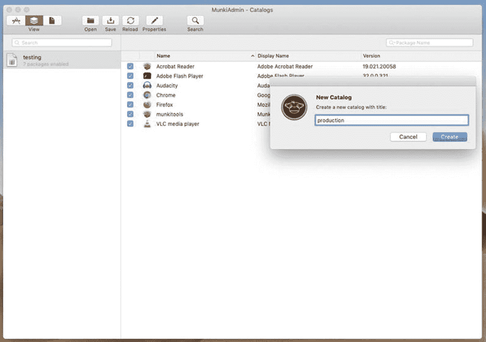

图 10-44
创建一个名为“production”的新目录

默认情况下，新目录中没有启用任何软件包。在左侧边栏中点击新建的**生产**目录以选中它，然后在我们想要投入生产的软件包旁边**勾选复选框**。我们将勾选除 `Adobe Acrobat Reader` 和 `MunkiTools` 之外的所有应用程序旁边的复选框。您的 `MunkiAdmin` 窗口应类似于图 10-45。

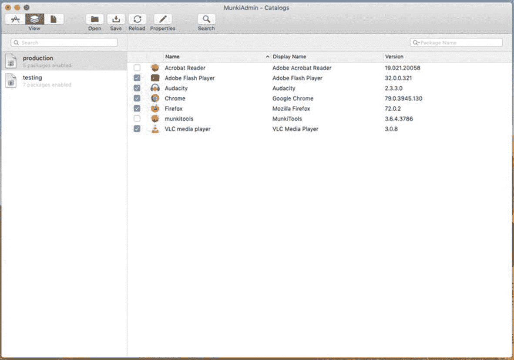

图 10-45
选择将列在我们生产目录中的应用程序

**保存**对目录的更改并**重新加载** `MunkiAdmin` 控制台。接下来，我们将编辑 **site_default** 清单，移除**测试**目录，并用**生产**目录替换它。这将确保仅包含在生产目录中且已获批准的应用程序会应用到订阅了我们 **site_default** 清单的客户端。

打开 **site_default** 清单的属性，并对**常规**选项卡做一个小修改。**取消勾选** **testing** 目录并**勾选** **production** 目录。转到**托管安装**选项卡，从列表中移除 `Acrobat Reader`。**保存**并**重新加载** `MunkiAdmin` 控制台。下次 `Munki` 在客户端机器上运行时，它将只在**生产**目录中查找可用软件。

专业提示

因为我们从生产目录中移除了 `Adobe Acrobat Reader`，但这并不意味着它会从任何已安装该软件的客户端上卸载它。这只是防止它在后续运行中被安装。

### 卸载应用程序

我们在测试系统上安装了 `Acrobat Reader`，但现在我们想卸载它。我们可以使用 `Munki` 来为我们完成此操作。首先，我们可以**编辑** **site_default** 清单，将**测试**目录添加回来。由于每个清单中可以包含多个目录，我们将同时启用生产和测试目录。接下来，我们可以转到**托管卸载**选项卡，点击 **+** 按钮，从列表中选择 `Adobe Acrobat Reader`。**保存**并**重新加载**。在测试客户端上，强制运行 `Munki`，它将从系统中卸载 `Acrobat Reader`。

我通过终端使用了 `managedsoftwareupdate --installonly` 命令，并且运行成功。从图 10-46 可以看出，在扫描 Adobe Acrobat Reader 卸载程序的物料清单时，它发现了我的系统上不再需要的文件并将其移除。由于 `Adobe Acrobat Reader` 已不在托管安装列表中，它将不会尝试重新安装该软件。

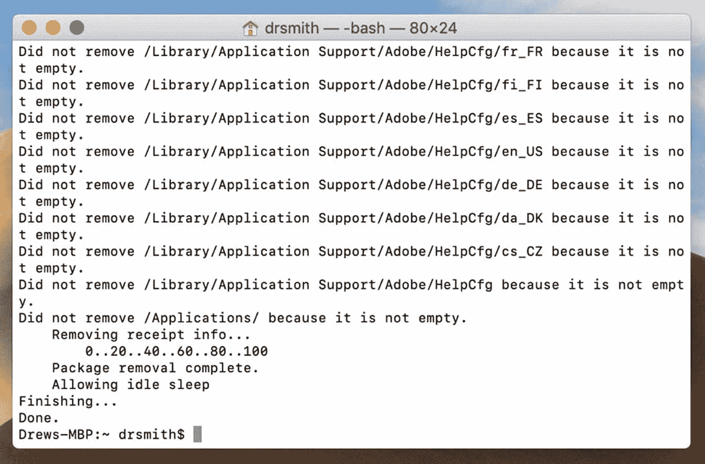

图 10-46
卸载 Adobe Acrobat Reader

专业提示

注意到它也移除了 `Adobe Acrobat Reader` 的收据信息吗？如果日后我们想将 `Acrobat Reader` 重新添加到此机器上，`Munki` 将看到此软件包不再有收据，并会再次安排其安装。

## 总结

`Munki` 是一个非常强大的工具，而我们目前只触及了其所有功能的表面。如果您计划在生产环境中使用 `Munki` 来管理所有软件部署，我建议访问 `Munki` 的 GitHub 页面以了解更多信息。那里有一个非常活跃的 `Munki` 管理员社区，可以在您规划部署策略和构建 `Munki` 环境时为您提供许多思路。

