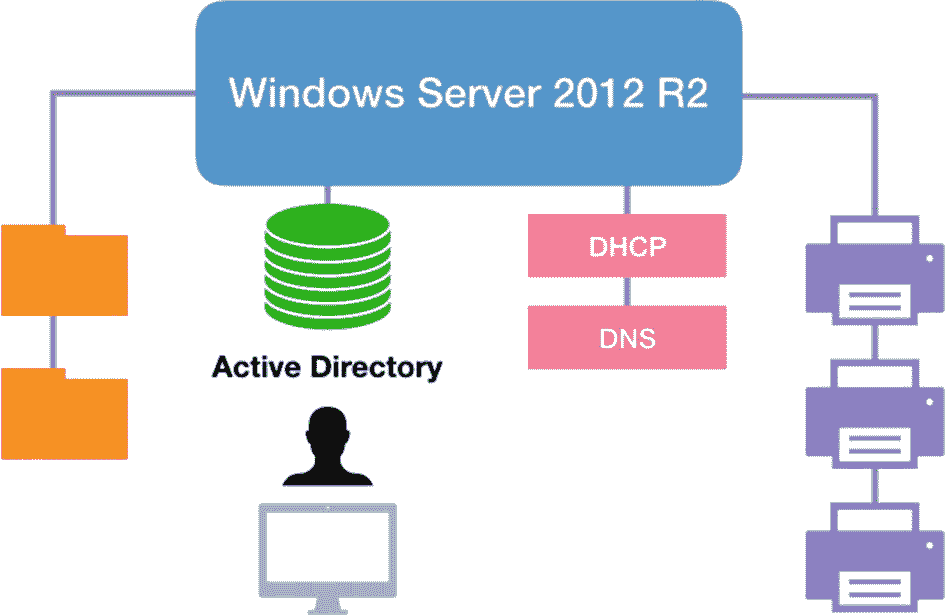
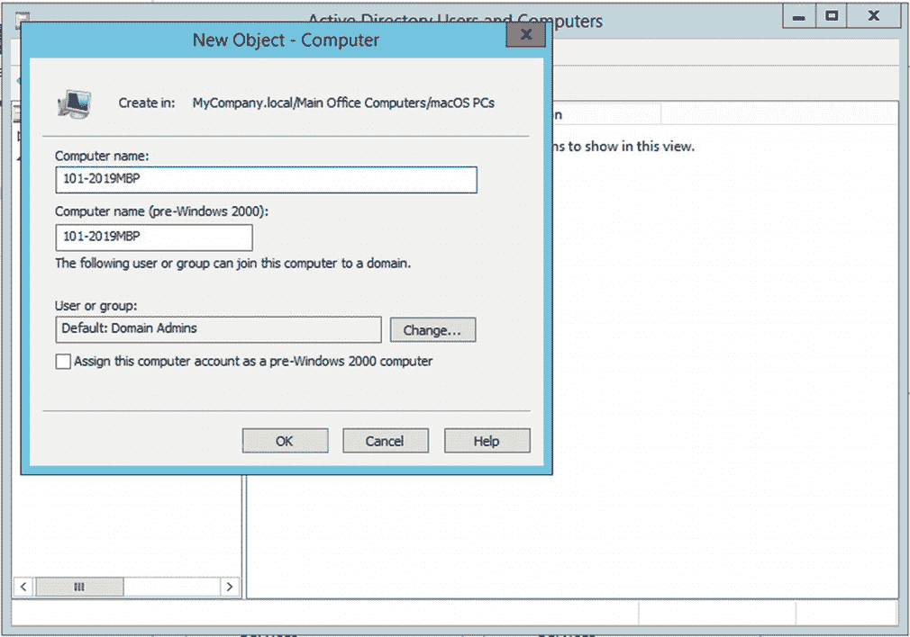
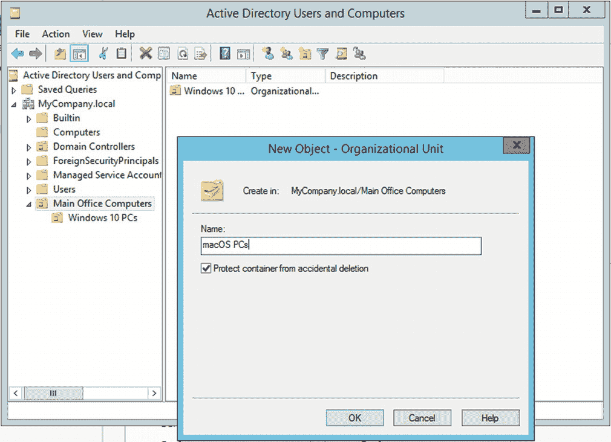
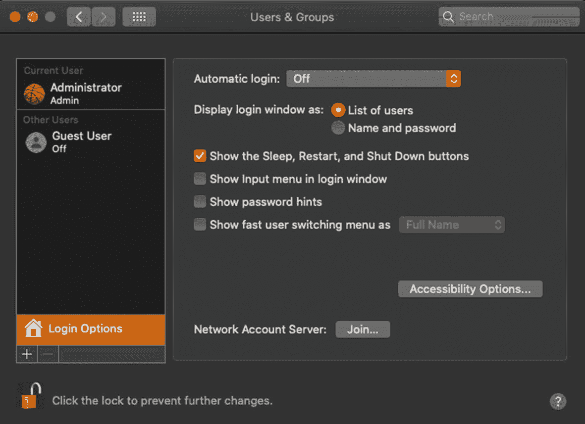
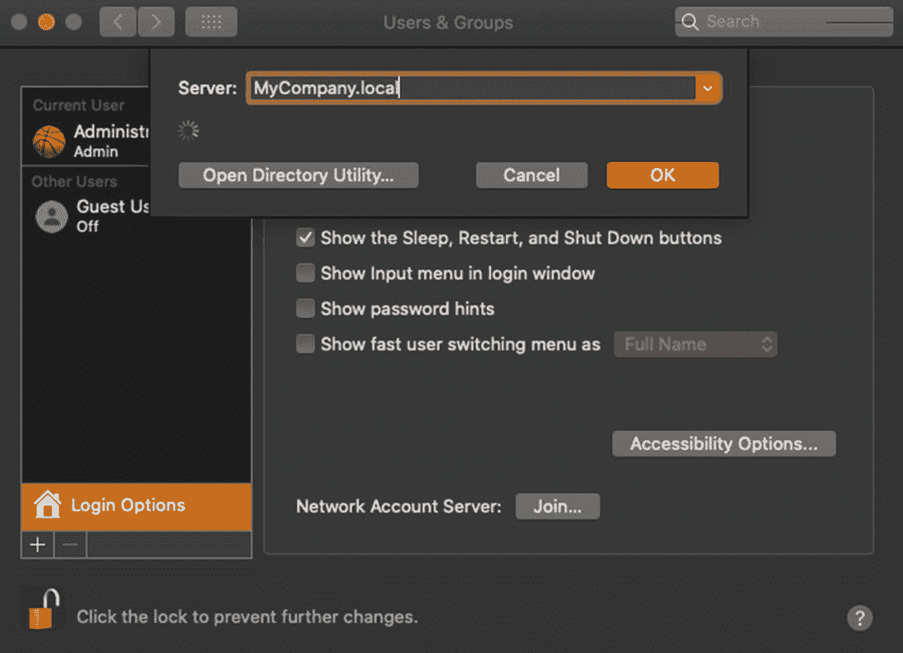
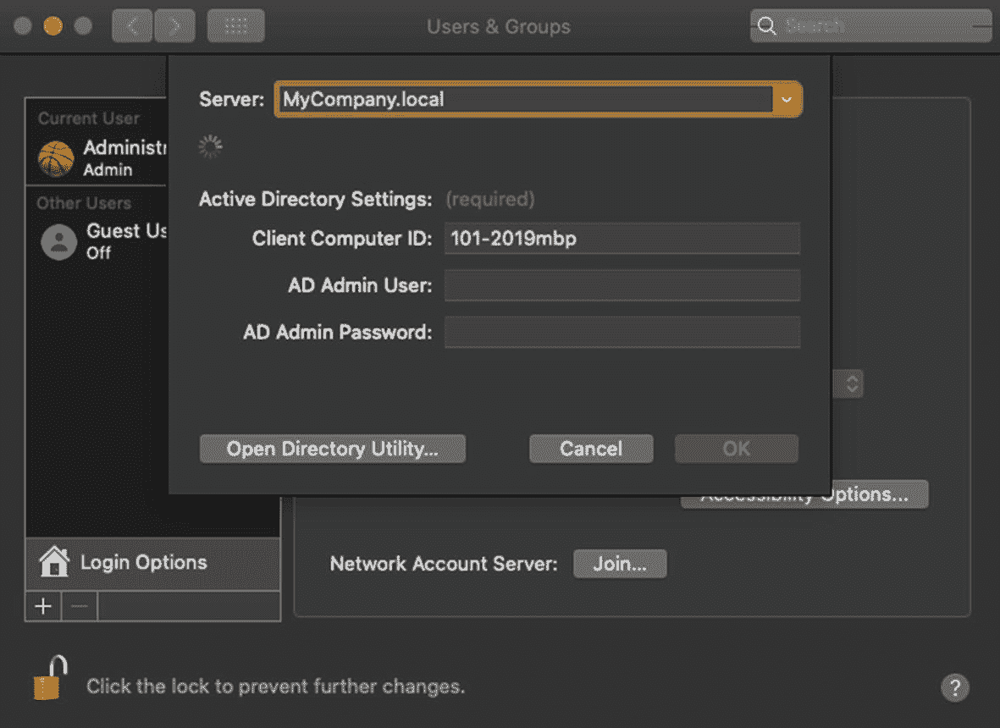
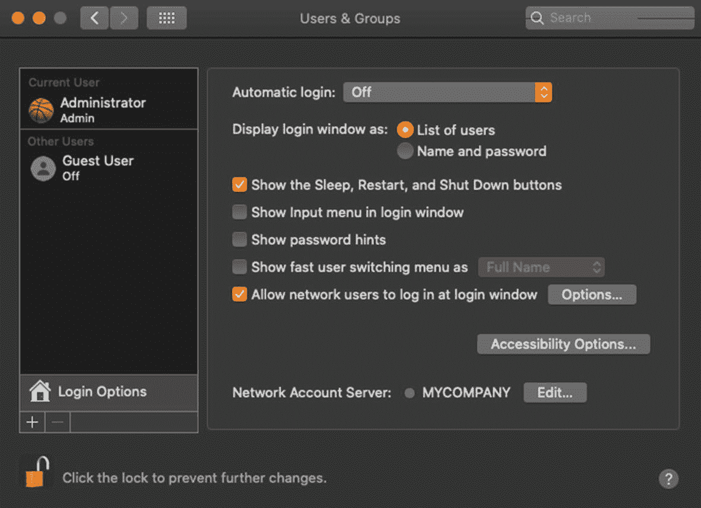
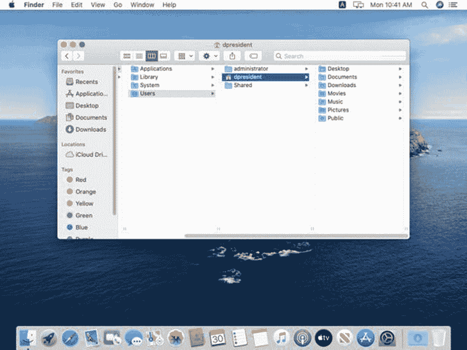

# 11. Microsoft 集成

在过去十年中，苹果公司持续更新其操作系统，以使其在异构环境中更好地工作。在本章中，我们将探讨 Mac 或 iOS 设备可以无缝集成到主要基于微软公司技术的企业网络中的各种方式。苹果提供了一些内置解决方案来帮助实现这种多平台集成，但也有一些第三方解决方案可以做得更多。在本章中，我们将讨论几种内置解决方案及相关策略，以在对企业网络进行最小化重新配置或成本投入的情况下支持苹果产品。

## Apple 与 Microsoft 集成简介

在过去的几个`macOS`和`macOS Server`版本迭代中，苹果公司选择降级或完全移除其第一方服务，转而支持行业标准解决方案。例如，数十年来，`AppleTalk`一直是 Mac 的标准网络协议。苹果文件协议（`AFP`）曾是 Mac 操作系统中的文件共享标准。然而，近年来，服务器消息块（`SMB`）文件共享已取代其成为`macOS`中的默认文件共享协议。`AFP`仍然存在，但已被降级为一种在需要时可用的解决方案，而首选方案是使用与 Linux 和 Windows 客户端相同的文件共享方案。

**专业提示**

服务器消息块（`SMB`）是一种通过网络共享数据的协议。微软在`Windows 95`中采用了此协议。Linux 和 macOS 客户端使用一个名为`Samba`的与`SMB`兼容的解决方案来访问`SMB`共享的资源。

除了在`macOS`中采用`SMB`文件共享以取代苹果文件协议外，我们还可以看到 Open Directory 的持续降级，转而支持 Active Directory，并且`macOS Server`中移除了`DHCP`服务器、邮件、消息和`CalDAV`服务器解决方案。其中许多服务已被云托管版本所取代，例如`iCloud`、`Office 365 (O365)`和`Google Docs`。这对于我们 Mac 系统管理员来说实际上是有利的，因为我们可以更轻松地将 Apple 设备集成到现有系统中，而不必建立专用的仅适用于 Apple 的技术，或实施复杂且昂贵的中间件。

### 我的 Microsoft 环境

在我们深入探讨将 Apple 平台集成到企业 Microsoft 环境的细节之前，先快速概述一下我当前的网络状况会很有帮助。图 11-1 直观地展示了在我开始将 Mac 和 iOS 设备加入混合环境之前的企业网络概况。

图 11-1

我的 Microsoft 网络、服务、打印机和共享

*   **Microsoft Active Directory:** 本地 Windows 域，名为`MyCompany.local`。我按地理位置设置了几个组织单位（`OUs`），并为本次演示应用了最简化的`组策略`。
*   **用户账户和组成员资格:** 我有几个用户账户和几个组，用于控制对各种网络文件共享和打印机的访问。每个用户使用其域账户登录其 PC。
*   **组策略:** 为了本次演示，我有一个应用了基本`组策略（GPO）`的`OU`，它控制着我的`Internet Explorer（IE）`浏览器的默认主页。
*   **DNS:** 我在我的 Windows 服务器上运行`DNS`服务器，为我的 PC 网络提供`DNS`服务。
*   **DHCP 服务器:** 我运行着微软的`DHCP`服务器，并通过此服务为我的 PC 网络提供`DNS`。
*   **文件共享:** 我在 Windows 服务器上运行文件共享服务，共享几个网络驱动器，PC 用户可以在这些驱动器上相互共享文件。
*   **打印共享:** 我在 Windows 服务器上运行打印机共享服务，将工作组打印机共享给办公室里的各个用户。
*   除了本地解决方案，我们还运行`Microsoft Office 365`，用户可以访问云端的`OneDrive`和`Microsoft Exchange`。我们的电子邮件是通过`O365`上的`Exchange`传递的。

现在我们已经定义了 Microsoft 环境，我们需要规划 Apple 平台的集成，并确定我们的 Mac 和 iOS 用户将需要哪些服务。

### Apple 用户所需的 Microsoft 服务

我们将在网络中为公司总裁增加一台`MacBook Pro`。他将需要访问以下服务：

*   能够在办公室内和远程登录到他的 Mac
*   访问主公司办公室服务器上的共享文件
*   能够向他办公室的共享`HP LaserJet`打印机打印
*   访问`Exchange`电子邮件
*   访问`Microsoft OneDrive`
*   在他的 Mac 上原生运行`Microsoft Office`套件（包括`Microsoft Outlook`）
*   当他打开`Safari`时，默认访问公司内联网
*   从他旧的 Windows 笔记本电脑迁移现有的`Internet Explorer`收藏夹、`Outlook`个人文件夹和数据

我们还将为公司总裁提供一部`iPhone 11`。他需要从他的`iPhone`上访问这些服务：

*   访问`Microsoft OneDrive`
*   访问他的`Exchange`电子邮件
*   在`电话`应用中可用的来自其`Exchange`账户的联系人
*   能够在`iPhone`上打开和编辑`Word`和`Excel`文档

最后，我们将为公司销售经理提供一部`iPad`，她需要能够每天在主公司办公室文件服务器上更新几个报告。她需要能够从她的`iPad`映射网络驱动器，并在那里更新几个`Excel`文件：

*   在`iPad`上访问`Microsoft Excel`
*   访问主公司办公室服务器上的共享文件

在本章中，我们将使用这三个场景，将一台运行`iPadOS`的`iPad`、一部`iPhone`和一台`Mac`集成到我们现有的企业网络中。

## macOS 的 Active Directory 集成

在第一部分，我们将重点介绍针对 macOS 客户端的 Active Directory 身份验证。在开始此练习之前，您应该已有一台安装了干净操作系统并配置了本地管理员账户的 Mac。通过 `Sharing System Preference`，将这台新 Mac 命名为 `101-2019MBP`，这表示它是我们主办公室 101 中的一台 *2019 年款 MacBook Pro*。打开 `Terminal`，将本地主机名和主机名设置为与之匹配。为了使 Active Directory 集成正常工作，我们需要 Mac 的三个名称都保持一致。

**专业提示**
您的组织可能使用某种公司命名规范。虽然苹果设备会尝试以机器上创建的第一个用户账户来命名自己，但您应该以命名 Windows PC 的相同方式来命名您的 Mac。

我们的 Mac 现在已准备好加入到 MyCompany 域。让我们切换到域控制器并打开 `Active Directory Users and Computers` 以开始操作。

### 为 Mac 客户端准备域控制器

作为一个最佳实践，我倾向于在将 macOS 客户端添加到域*之前*，先在 Active Directory 中为其创建记录。这样做有几个目的：它可以防止 Mac 加入错误的组织单位（OU），并且能预先避免 Mac 客户端在加入域时无法在 AD 中写入新计算机记录的任何奇怪错误。在这个练习中，我们将在 Active Directory 中为我们的新 MacBook Pro 准备一个位置。

图 11-3
在 Active Directory 中添加新的计算机记录

1.  打开 `Active Directory Users and Computers`。如图 11-2 所示，我有一个名为 *Main Office Computers* 的 OU。在该 OU 内部，我有一个 *Windows 10 PCs* OU，用于存放主办公室所有 Windows PC 的计算机记录。这也是我为主办公室计算机应用特定 Windows 10 组策略对象（GPO）的地方。在此处为我们的 Mac 创建一个新的 OU，并将其命名为 `macOS PCs`。
    
    图 11-2
    创建 macOS PCs 组织单元

2.  现在我们已经创建了 OU，我们可以用 Mac 的计算机记录来填充它。选中 *macOS PCs* OU，在右侧面板的任何位置**右键单击**并选择 **新建 ➤ 计算机**，将其命名为 `101-2019MBP`，如图 11-3 所示。点击 **确定** 创建记录。

现在我们已经为 Mac 客户端创建了记录，可以将其添加到域中了。切换回您的 MacBook Pro 并打开 `Users & Groups System Preference` 继续。

### 将 Mac 添加到 Active Directory 域

1.  在 `Users & Groups System Preference` 中，点击**锁形图标**，使用本地管理员账户进行身份验证，然后点击 `Login Options` 按钮。您的对话框应类似于图 11-4。
    
    图 11-4
    Users & Groups System Preference 中的登录选项面板

2.  点击 `Network Account Server` 提示旁边的 `Join...` 按钮。

3.  在这里，我们将输入 AD 域的域名。我将输入 `MyCompany.local`，如图 11-5 所示，系统将开始搜索该域。
    
    图 11-5
    在服务器字段中输入域名

4.  找到域后，系统会提示您输入计算机名和凭据。如果我们正确设置了本地主机名和主机名，它会自动填充我们想要使用的计算机名，如图 11-6 所示。在下个字段中输入您的域管理员用户名和密码，然后点击 **OK**。
    
    图 11-6
    确认计算机名并使用域管理员账户进行身份验证

5.  接下来，系统会提示您修改 Mac 上的目录配置，并要求您输入本地 Mac 管理员账户的用户名和密码。输入该信息并点击 `Modify Configuration` 按钮继续。

6.  您的 Mac 现在将开始配置 Active Directory，大约一分钟后，您会在 Windows 域名称旁边看到一个绿点，如图 11-7 所示。这表示您的 Mac 现已成功加入到 MyCompany 域。
    
    图 11-7
    域名旁边的绿点确认我们的 Mac 已成功加入

**专业提示** 如果您在查找域时遇到问题，应检查 Mac 上的 `DNS` 设置，确保它从 Windows 服务器获取 `DNS`，并确保您可以正向和反向解析 IP 地址和域名。如果您有多个 `DNS` 服务器，请确保您的 Windows 服务器是主 `DNS` 服务器。

**专业提示** 如果在加入域时出现错误，需要检查的一件事是域控制器和 Mac 的时区、日期和时间。通常，您的客户端或服务器时间会偏差几分钟，这将导致域绑定失败并出现各种隐晦的错误消息。

现在我们的 Mac 已在域上，我们应该注销本地管理员账户，并使用来自 Windows Active Directory 域的网络账户用户登录。*Don President* 是我们的幸运用户，他将获得这台全新的 *MacBook Pro*。让我们使用他的账户测试此登录，如图 11-8 所示。

图 11-8
使用网络用户账户登录

完成设置助理后，我们会进入默认新用户的主目录。使用 `Finder` 浏览到 `Home`，可以看到我们是以 *dpresident* 用户身份登录的。您的屏幕应类似于图 11-9。很好！现在可以注销并以管理员身份重新登录。

图 11-9
macOS Catalina 中的默认新用户桌面

让我们试一下。请先禁用 `Wi-Fi`，确保您的 MacBook Pro 不再连接到网络。注销，然后尝试再次使用网络用户账户登录。您会遇到一个小问题。因为域不可达，您将无法进行身份验证。登录屏幕的右上角有一个红色指示按钮，显示我们已与网络断开连接，如图 11-10 所示。

图 11-10
红点表示 Windows 域不可达

