# 设置此笔记本的要求之一，是让 Don 总统能够在断网状态下登录。要解决此问题，我们需要将此 Mac 上的`dpresident`账户转换为移动账户。使用本地管理员账户登录，并重新启用网络访问。注销后，确保你能以`dpresident`用户身份重新登录。以 Don 总统身份登录后，转到`用户与群组系统偏好设置`，如图 11-11 所示。注意当前列出的用户类型是`网络`类型？我们需要将其转换为`移动`账户类型。

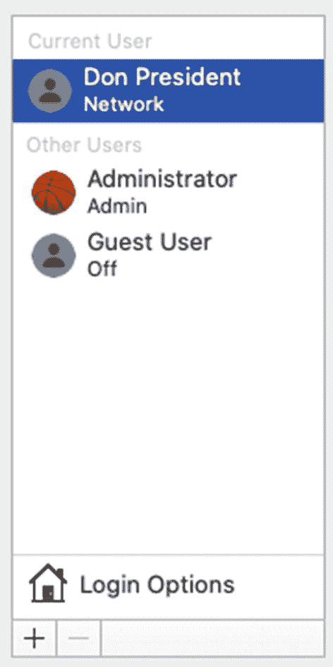

**图 11-11**  
注意 Don 总统的用户账户类型标识

点击`挂锁`图标，以本地管理员身份认证。然后如图 11-12 所示点击 Don 总统用户。点击`移动账户`提示旁边的`创建...`按钮。

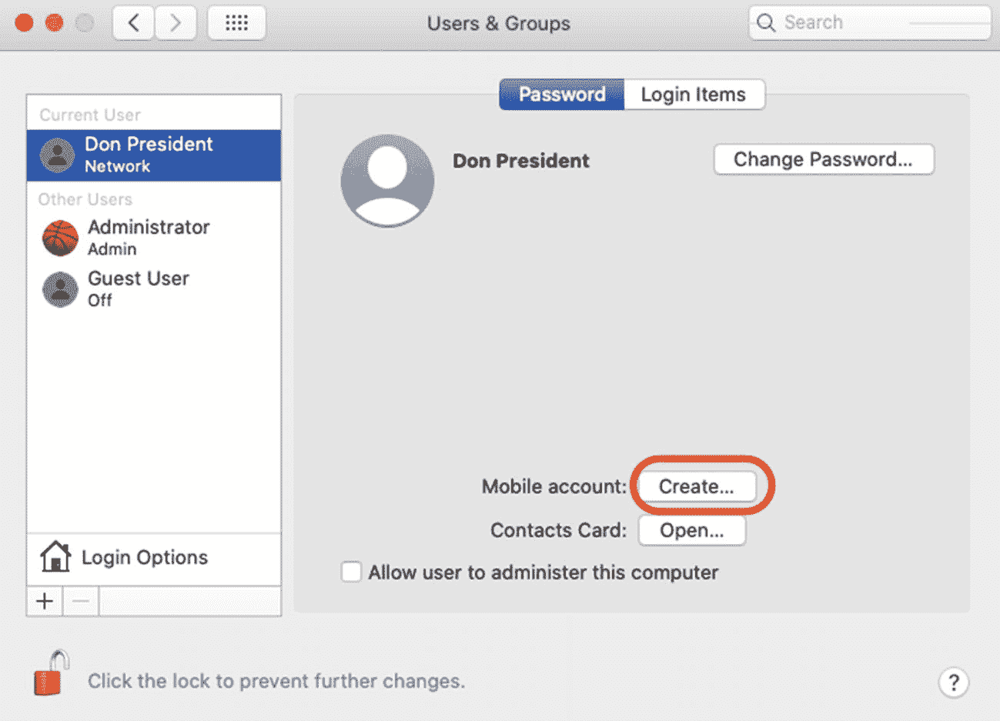

**图 11-12**  
将 Don 总统的网络账户转换为移动账户

当提示时，将个人文件夹位置选择为`Macintosh HD（启动磁盘）`选项，然后点击`创建`按钮继续。系统会警告你将注销以创建本地个人文件夹，如图 11-13 所示。点击`创建`按钮继续。

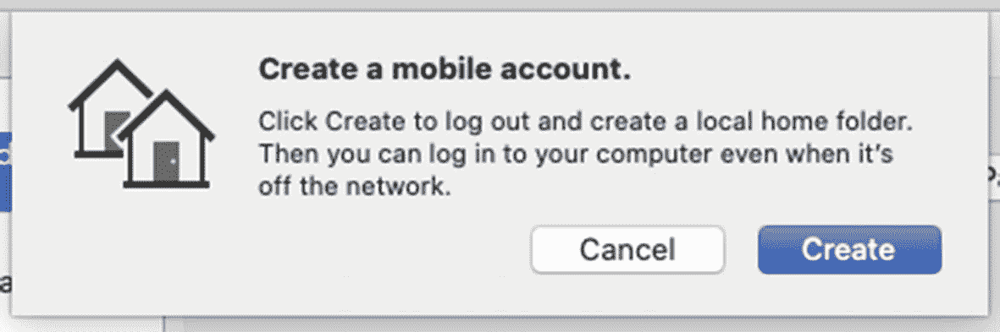

**图 11-13**  
按照提示注销并创建移动账户

根据您为 FileVault 等设置的内容，此过程可能会要求您输入用户的 Active Directory 密码以及本地管理员的用户名和密码。完成后，您将返回到登录窗口。

通过断开网络连接来测试此操作，并等待屏幕右上角出现红色指示符。现在以 Don 总统身份登录，它将正常工作。打开`用户与群组系统偏好设置`，您将看到该用户现在是一个`移动`账户类型，而非`网络`账户类型，如图 11-14 所示。

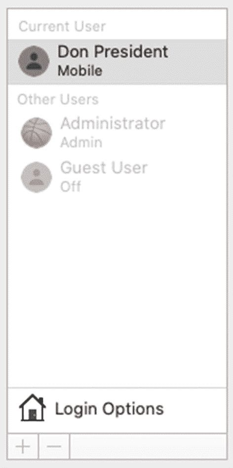

**图 11-14**  
用户账户现在被列为移动类型

**专业提示**  
请注意，如果多个网络用户需要在此 Mac 离线时访问它，您需要将此 Mac 上的每个用户账户从网络类型转换为移动类型。目前，当此 MacBook Pro 与网络断开连接时，唯一可以登录的 Active Directory 用户是 Don 总统。

如我们所示，将 Mac 添加到 Windows 域几乎不需要在 Windows 服务器上进行额外的配置，也无需扩展 Active Directory，只需使用`macOS`中的移动用户账户类型即可支持身份验证和缓存凭据。我们已经以交互方式将 Mac 加入了域，但我们也可以通过使用配置描述文件或脚本来实现此任务的自动化。

### 使用配置描述文件将 Mac 添加到 Active Directory

开始此练习前，您应该在一台测试 Mac 上从全新安装`macOS`开始。您应该为其命名，并在 Active Directory 中创建一个匹配的计算机记录。然后使用您喜欢的方法，将其注册到 MDM 中并将其提升为“用户批准”，以便我们能完全访问所有配置描述文件选项。

我已经创建了一台名为`101-2019MPRO`的测试 Mac，并相应地为其命名（包括本地主机名和主机名）。我已将其添加到 Profile Manager 中，并在 AD 中为其创建了计算机记录，但尚未将其加入域。

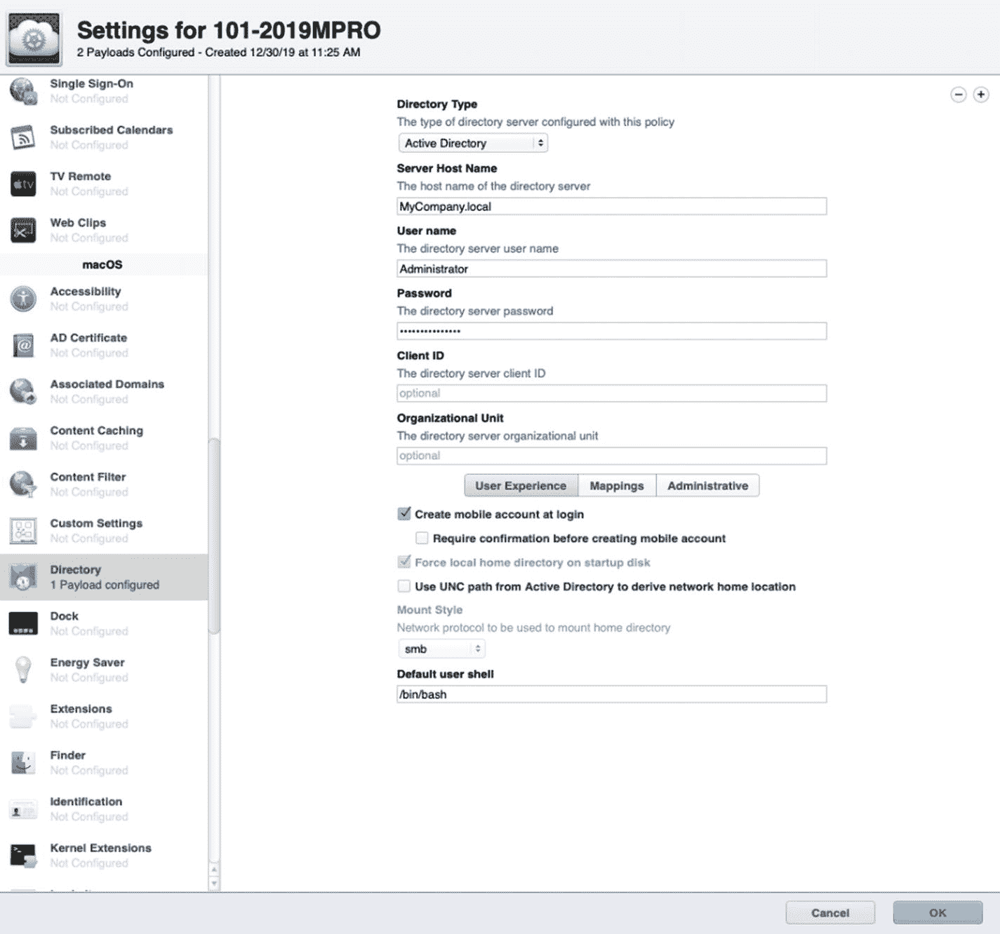

**图 11-15**  
为绑定到我们的 Active Directory 域配置目录负载

1.  打开 Profile Manager，浏览至`设备`部分中的`101-2019MPRO` Mac。点击`设置`选项卡，然后点击`编辑`按钮以应用新的配置描述文件设置。
2.  像以往一样配置`通用`负载，确保`自动推送`已启用，并可选择性地输入描述。
3.  向下滚动到可用负载的`macOS`部分，选择`目录`负载，然后点击`配置`按钮。
4.  如图 11-15 所示自定义负载。请注意，我们有几个新选项，包括一个在登录时为首次登录此 Mac 的所有域用户创建移动账户的选项。因为我们在 AD 中已经有一个计算机记录，所以我们不会指定特定 OU 的路径。

**专业提示**  
`映射`和`管理`选项卡下有一些可选设置，在本练习中我们将保留其默认值，但我鼓励您和您的 Windows 系统管理员查看这些设置，并确定适合您特定环境的最佳设置。如果您的计算机将长时间离开局域网，那么客户端计算机上域密码更改频率（默认是每 14 天）的设置尤其值得注意。

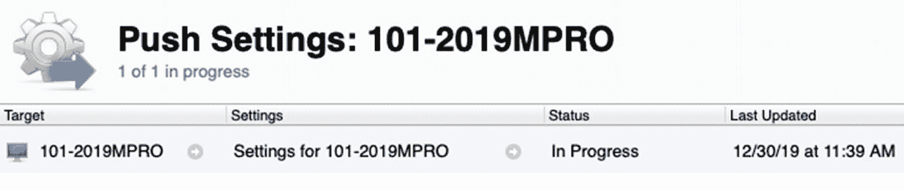

**图 11-16**  
使用 MDM 将我们的域负载应用到测试 Mac

1.  自定义负载后，点击`好`按钮保存配置并关闭配置描述文件编辑器。在 Profile Manager 中点击`存储`按钮，将设置应用到`101-2019MPRO`客户端，如图 11-16 所示。

它应成功完成推送设置任务，您的 Mac 现在将被配置为登录到域。请注意，在首次登录时，它会在计算机上自动将 Don 总统转换为移动账户类型。

**专业提示**  
您可能还想配置其他负载，例如 Active Directory 证书或登录窗口，以进一步自定义用户体验，或应用任何所需的安全证书，并将这些与您的目录负载一起包含。

### 使用脚本将 Mac 绑定到 Active Directory

Apple 还提供了一个名为`dsconfigad`的命令行工具，用于编写 Active Directory 配置脚本。在 Apple Remote Desktop 的`发送 Unix`任务中使用此命令，可以有效地一次性将多台 Mac 加入域，并进一步自动化该过程。如果您所在的组织没有使用 MDM 解决方案，这尤其有用。

开始此练习前，您应该在一台测试 Mac 上从全新安装`macOS`开始。您应该为其命名，并在 Active Directory 中创建一个匹配的计算机记录。我已经创建了一台名为`101-2013MPRO`的测试 Mac 并相应命名，但这次我将主机名留为`unset`，以便在本练习中与您分享一个快捷方式。我已经在 AD 中为其创建了计算机记录，但尚未将其加入域。

1.  现在我们的计算机名称和主机名一致了，我们可以准备使用`dsconfigad`命令加入域了。您可以查看`dsconfigad`的手册以了解更多关于此命令功能和额外选项的信息，但在本练习中，我们将只介绍基础知识。我们需要定义四个参数：
    1.  `客户端 ID` (`-c`) 代表我们要用来将 Mac 加入域的名称。
    2.  `管理员账户` (`-u`) 代表域管理员账户的用户名。


### 3. 管理员密码

`-p` 参数代表域管理员账户的密码。

### 4. 域

`-domain` 参数代表我们要将 Mac 加入的域。

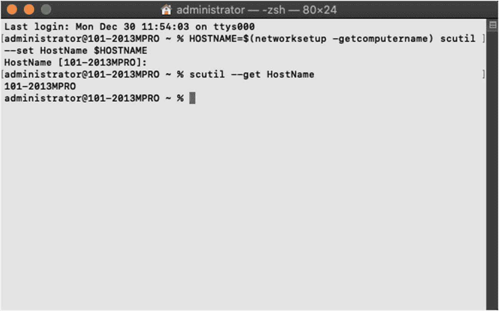
*图 11-17：使用脚本将计算机名称复制到主机名*

1.  我们将使用 `Terminal` 应用程序在测试 Mac 上交互式地开发此脚本，但一旦您完善了它，就可以在 Apple Remote Desktop 中创建一个模板并将其应用于整个 Mac 机群。在 `101-2013MPRO` 上打开 `终端` 以开始操作。

2.  我们将编写一个简短的小脚本，用于捕获 Mac 的计算机名称并将其保存为变量，然后使用 `scutil --set` 命令相应地设置主机名。因此，在终端命令行提示符处输入：

```
HOSTNAME=$(networksetup -getcomputername)
scutil --set HostName $HOSTNAME
```

按下 **Enter** 键，然后在提示 `HostName [计算机名称]` 输出时再次按下 **Enter** 键，接着在提示时输入本地管理员密码。一旦完成更改并再次回到命令行提示符，输入 `scutil --get HostName`，现在它应该与其他设置匹配为 `101-2013MPRO`。如果您在 Apple Remote Desktop 中使用此脚本，它将始终将 Mac 客户端的主机名更改为与计算机名称匹配。此时，您的终端窗口应类似于图 11-17。

**专业提示：** 您还可以在此处定义一个额外选项，即您希望将 Mac 客户端分配到的 OU。但是，由于我们已经在我们想要的位置创建了计算机记录，所以可以跳过此参数。如果您想手动定义放置此 Mac 的 OU，可以使用 `-ou` 参数，后跟 `"OU=, DC=, DC="` 格式的路径，例如 `"OU=macOS PCs, OU=Main Office Computers, DC=MyCompany, DC=local"`。

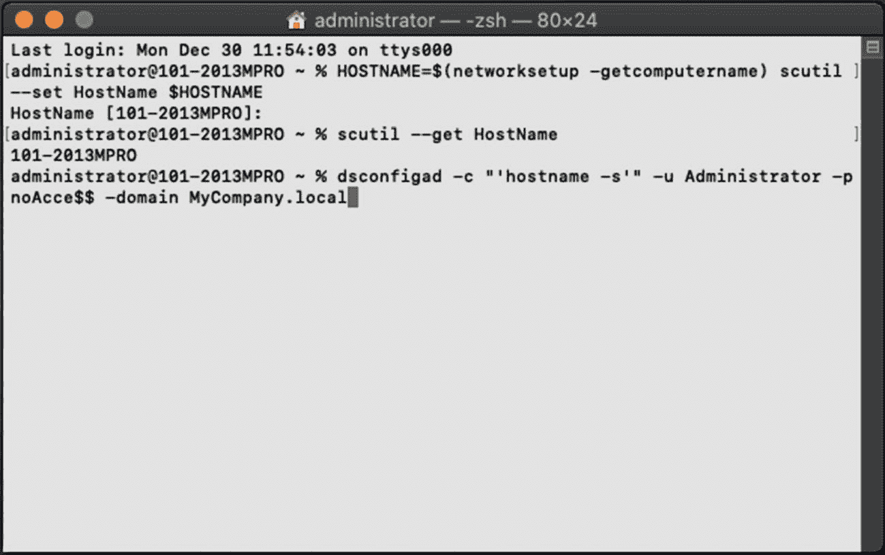
*图 11-18：重命名计算机并将其加入域的完整脚本*

1.  让我们开始输入带有客户端 ID 参数的 `dsconfigad` 命令。因为我们将在多台计算机上使用相同的脚本，所以我们将使用一个令牌，而不是为此计算机指定确切的名称。我们可以使用 `"hostname -s"` 令牌，以便在脚本中自动应用此 Mac 的主机名作为客户端 ID。这将模仿我们通过*用户与群组系统偏好设置*将 Mac 加入域时的 GUI 行为。

2.  接下来，我们将为 `MyCompany.local` 域指定域管理员账户的用户名和密码。最后，我们将添加指定域名的参数。包含所有参数的完整脚本应类似于图 11-18。

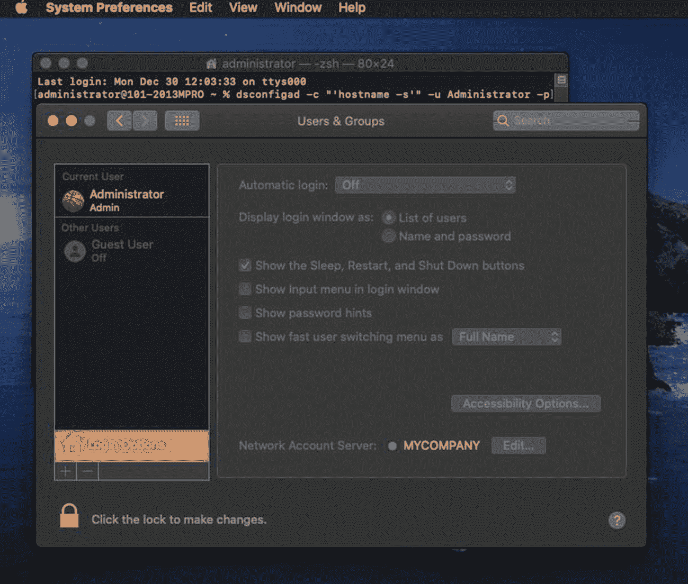
*图 11-19：脚本运行后，我们可以在"用户与群组系统偏好设置"中确认 Mac 已在域中*

1.  它将提示您输入本地管理员账户的密码。一两分钟后，它将成功完成。打开*用户与群组系统偏好设置*，单击 **登录选项** 按钮，确认现在列出了 Windows 域，并且**网络账户服务器**旁边有一个绿色指示器图标，如图 11-19 所示。

```
dsconfigad -c "'hostname -s'" -u Administrator -p noAcce$$ -domain MyCompany.local
```

**专业提示：** 您可以将其他命令与 `dsconfigad` 结合使用来设置其他设置，例如 `-mobile enable` 以支持移动账户选项，以及 `-passinterval` 来调整域计算机密码更改的频率，以便长时间脱网的系统不会脱离域。如果您对此有疑问，请咨询您的 Windows 系统管理员，以确定是否需要此选项或其他选项。

我们已经成功配置了 Active Directory，并使用三种不同的方法将我们的 Mac 加入了域。现在我们的 Mac 已在域上，我们可以访问 Windows 服务器上的其他资源。


### 使用配置文件管理器模拟 Microsoft 组策略

我们正在逐一完成针对 Don President 的 MacBook Pro 的各项集成任务。他可以使用其 Active Directory 凭据登录，并且可以在机器离线时登录。然而，我们仍需要配置他的 Mac 以符合我们的企业标准。这可能包括我们 Windows 组策略中定义的许多项目，例如默认壁纸、屏幕保护程序启动所需时间、屏幕保护程序是否需要密码、节能器设置（如计算机或显示器何时进入睡眠状态）以及默认主页等等。

幸运的是，这些选项大多数在 `Profile Manager` 中可用，我们可以使用 `配置描述文件` 来向 Don 的 Mac 提供这些设置，并模拟我们公司 GPO 中内置的设置。出于本次演示的目的，我们将简单地设置节能器和一些自定义的 Safari 设置。为此，请打开 `Profile Manager` 并浏览到 `设备` 下的 `101-2019MBP` 计算机。点击 `设置` 选项卡，然后点击 `编辑`。

让我们首先配置 `节能器` 负载。点击 `节能器`，然后点击 `配置` 按钮来定义此负载的设置。您的设置应与图 11-20 中我的设置类似。

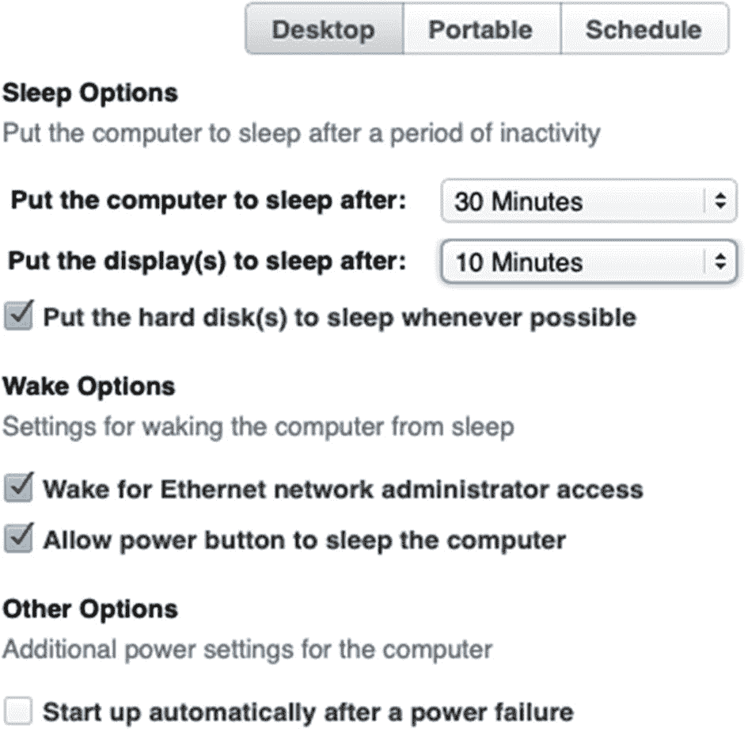

*图 11-20*: 配置节能器负载

接下来，我们需要做一些更定制化的操作来配置 Safari 的设置。我们将添加一个名为 `自定义设置` 的新负载，并按图 11-21 所示进行配置。这种方式的工作机制是，我们将用我们的设置覆盖特定应用程序（本例中是 `Safari`）的本地用户设置。我们将在 `偏好设置域` 字段中输入 `com.apple.Safari`，然后就可以逐项添加条目并按每个键定义特定的行为，就像在创建我们自己的自定义 `*.plist` xml 文件一样。

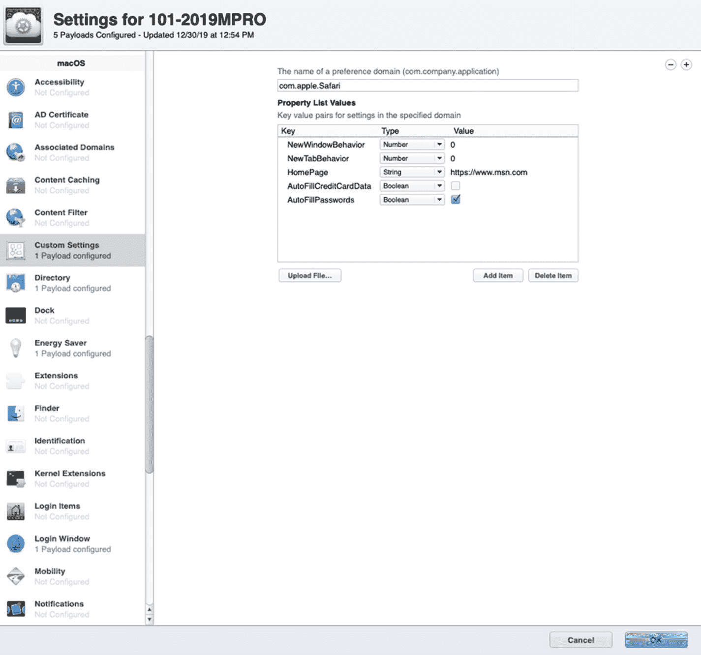

*图 11-21*: 为 Safari 创建自定义键和值以定制用户体验

您可能会好奇我从哪里找到这些用来覆盖 `Safari` 默认行为的选项。这因应用程序而异，但通常我会在 `~/Library/Preferences/` 目录中查找对应的 `*.plist` 文件。最容易修改的应用程序是那些将其设置保存在该目录中的，然后我只需使用 `上传文件` 按钮将修改后的 `*.plist` 文件上传到 `Profile Manager` 的 `自定义设置` 负载中即可。不幸的是，有些应用程序（如 Safari）稍微棘手一些。

`Safari` 在 `Safari.app` 应用程序包 ➤ `Contents` ➤ `Resources` ➤ `com.apple.Safari.manifest` ➤ `Contents` ➤ `Resources` 中有一个名为 `com.apple.Safari.manifest` 的文件。我知道，它藏得很深！如果您在 `TextEdit` 中打开这个 xml 文件，您会看到各种键及其匹配的选项，如图 11-22 所示。

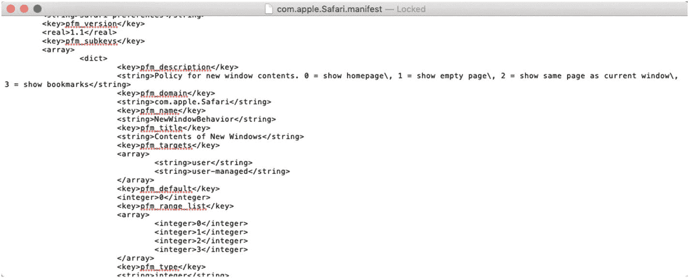

*图 11-22*: 用于覆盖 Safari 偏好设置的键和值选项

我从中挑选了几个添加到 `自定义设置` 负载中，并通过点击 `添加项目` 按钮并输入值的方式手动添加了它们。至于 MyCompany 主页，我使用了一个 `string` 类型来定义 URL 为 [`www.msn.com`](http://www.msn.com)。为本次演示的目的，我们将称之为我们公司的"内网主页"。您可以在此处放入任何 URL 并将其应用为 `Safari` 的新默认主页。

**专业提示**

当您选择为特定应用程序上传 `*.plist` 偏好设置文件时，它允许您以类似于使用 `组策略管理模板` 的方式调整 `属性列表值`。为应用程序创建 `自定义设置` 负载可能需要大量时间，但如果您需要管理数百或数千台 Mac，那么这些努力是值得的。

点击 `确定` 按钮关闭 `配置设置` 窗口，然后点击 `保存` 按钮将设置应用到我们的 Mac。切换回 Don 的 MacBook Pro 并启动 `Safari`。您将看到，我们的新窗口和新标签页行为现在被设置为加载主页而不是收藏夹，并且加载的主页是我们之前在 `自定义设置` 负载中定义的 [`www.msn.com`](http://www.msn.com)。您的屏幕应类似于图 11-23。

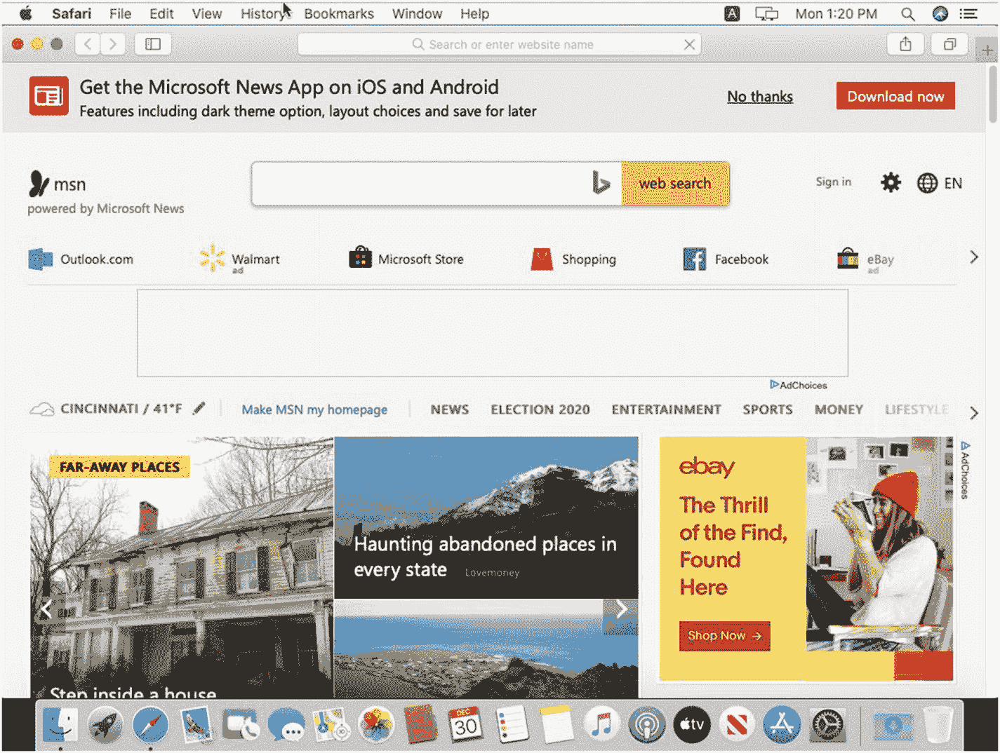

*图 11-23*: 我们的自定义设置已应用于测试 Mac 上的 Safari

## Windows 打印机共享集成

我们为 Don 列出的下一项任务是将他的网络打印机映射到他的 Mac。我们在主办公室有一台从 Windows 服务器共享的 HP LaserJet 9050 打印机。Don 有权使用该共享打印机，我们需要做的就是从他的 Mac 连接到它。您可以在以 Don 身份登录时执行此任务。

**连接到 Windows 共享打印机**

1.  打开 `打印机与扫描仪系统偏好设置`，点击挂锁图标并以本地 `管理员` 账户进行身份验证。
2.  点击左侧窗格中的 `+` 按钮，如图 11-24 所示。

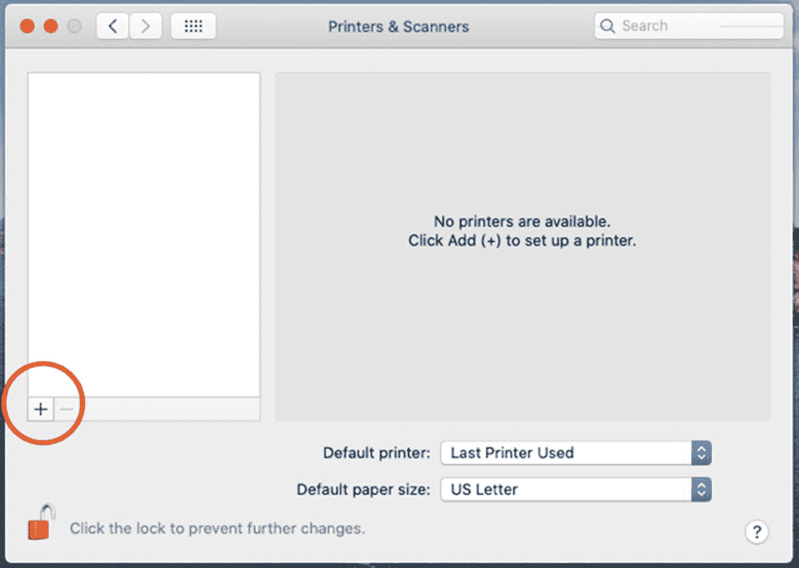

*图 11-24*: 使用打印机与扫描仪系统偏好设置添加新打印机

3.  Mac 将在目录域中搜索可用的网络打印机并列出它们。我们将从列表中选择我们的打印机，然后在"使用"弹出菜单下选择 `选择软件`，然后浏览找到 `HP LaserJet Series PCL` 驱动程序。一旦您的窗口看起来像图 11-25 那样，点击 `添加` 按钮以完成该过程。打印一张测试页以确保其正常工作。

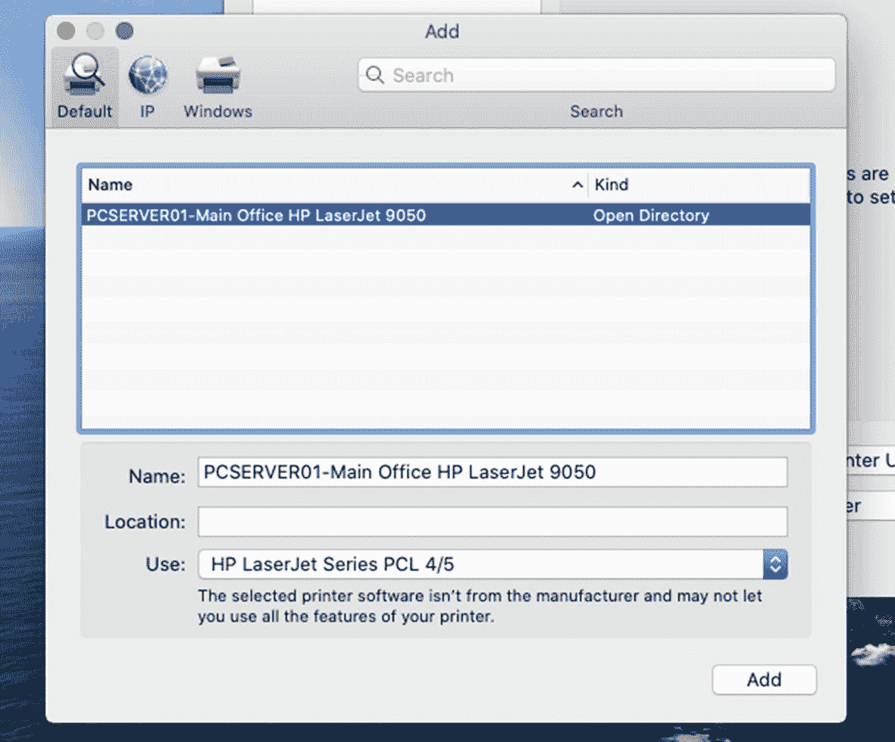

*图 11-25*: 查找我们的网络打印机并选择合适的驱动程序

## Windows 文件共享集成

接下来，我们需要配置一些 Windows 文件共享。Don 需要在他的 Mac 上访问 `Executive Shared` 驱动器，销售经理也需要在她的 `iPad` 上访问同一个网络驱动器，以便她可以更新 Don 审阅的每日销售报告。我们将从在 Don 的 Mac 上连接到网络共享开始。


### macOS 文件共享

在登录为 Don 时，我们可以使用 `Go` 菜单 ➤ `Connect to Server`（连接到服务器）选项，手动映射托管在我们 Windows 服务器上的 `Exec Shared` 驱动器。如图 11-26 所示，输入共享的完整路径。作为最佳实践，在定义服务器名称时，你可能希望使用**完全限定域名**。请注意，在 Mac 上定义网络路径时，我们需要使用正斜杠（`/`）而不是反斜杠（`\`）。

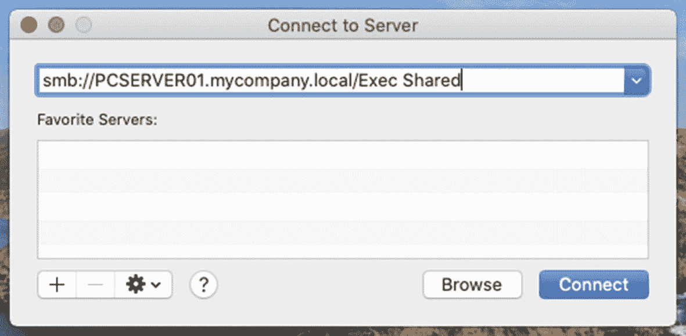

图 11-26: "连接到服务器" 对话框

输入网络共享路径后，你还可以点击 `+` 按钮将其保存为**收藏服务器**，这样 Don 在每次需要连接时就不必记住这个路径。点击 `Connect`（连接）按钮，它应该会在一个新窗口中映射该驱动器。由于我们已经使用 Don 的域账户登录到这台 MacBook Pro，因此应该不需要任何额外的身份验证。

**专业提示**：很可能你会希望像在 Windows 上那样，在登录时自动映射 Don 的网络驱动器。为此，你可以进入 `Users & Groups System Preference`（用户与群组系统偏好设置）➤ `Login Items`（登录项）标签页；使用 `+` 按钮，你可以将网络卷添加到列表中，如图 11-27 所示。这样在登录 Mac 后，系统将尝试自动连接到这些驱动器。

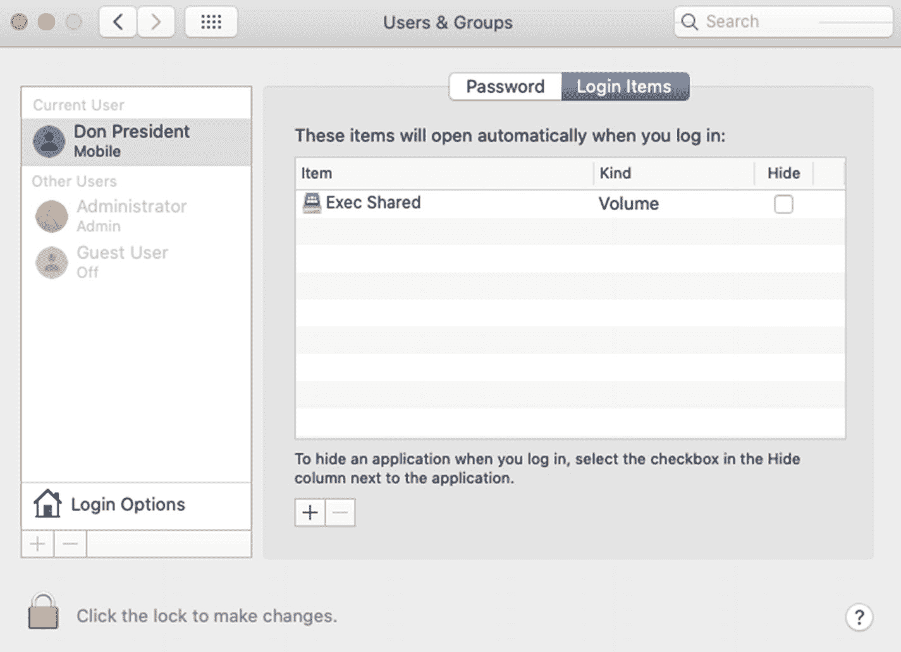

图 11-27: 为 Don President 的登录项添加 Exec Shared 卷

**专业提示**：你也可以配置一个 MDM 有效载荷，以便在登录时自动映射网络驱动器。如图 11-28 所示，你可以选择添加一个 `Authenticated Network Mount`（已验证的网络挂载），然后指定文件共享协议、服务器名称和共享名称。

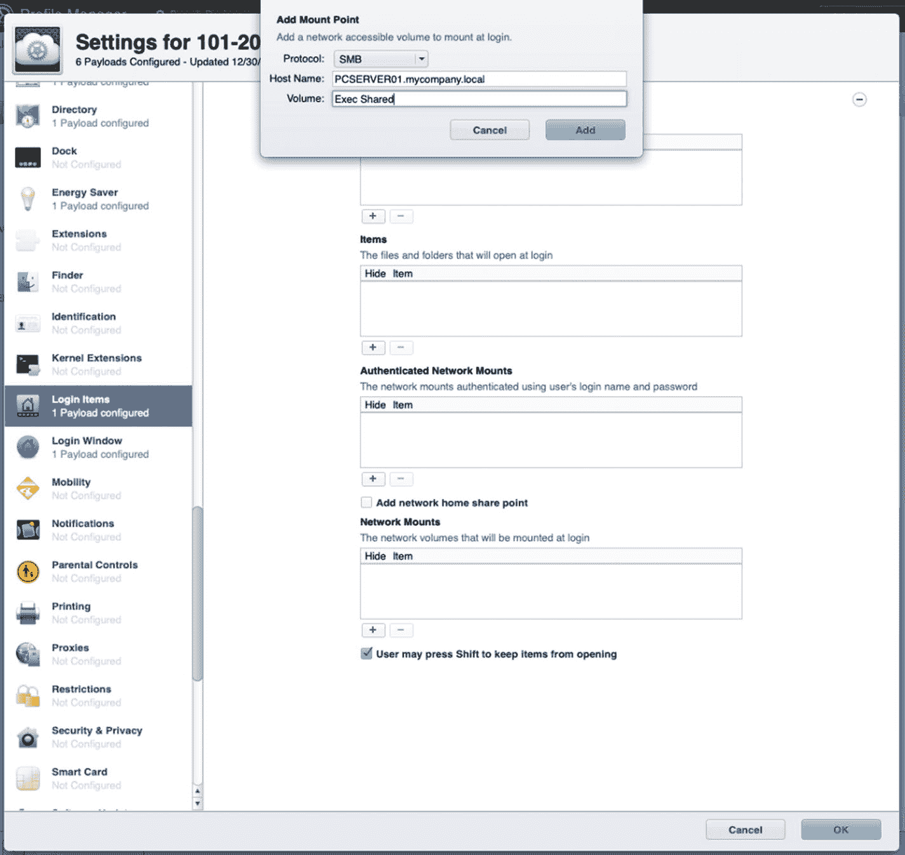

图 11-28: 通过描述文件管理器在登录项有效载荷中添加挂载点

### iPadOS 文件共享

现在 Don 的 Mac 已经全部设置好了，让我们切换到 Sally 的新 iPad。由于她运行的是 `iPadOS`，因此在“文件”应用中有一个额外的选项，允许她连接到网络共享。要访问此选项，请从主屏幕打开“文件”应用，然后点击 `…` 按钮并选择 `Connect to Server`（连接到服务器），如图 11-29 所示。

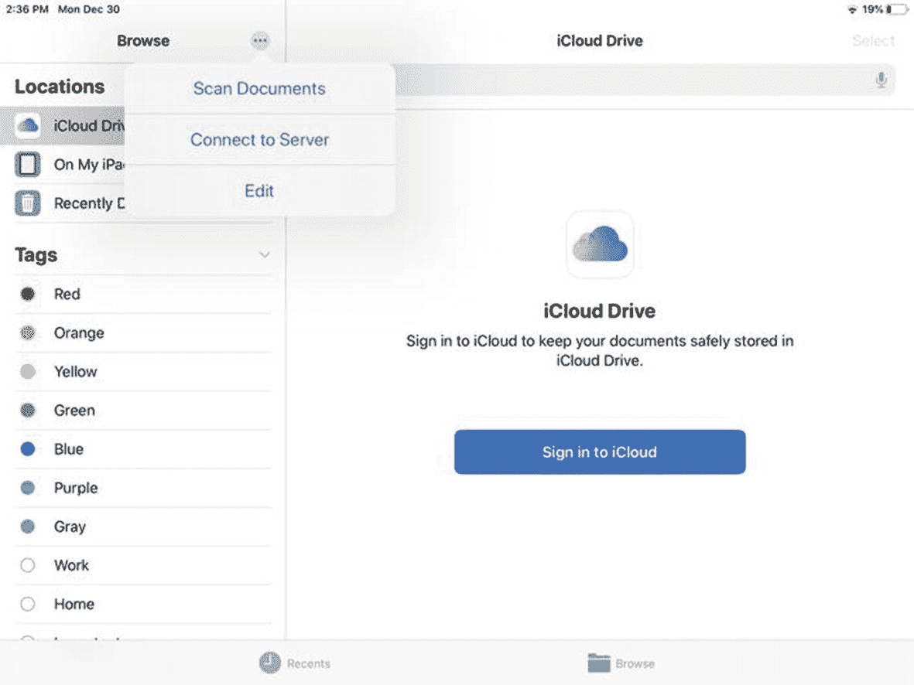

图 11-29: 在文件应用中访问“连接到服务器”选项

当提示输入服务器路径时，在 `Server`（服务器）字段中输入 `smb://PCSERVER01.mycompany.local`（或服务器的 IP 地址），然后点击 `Connect`（连接）按钮。系统会提示你进行身份验证，因此请输入有权访问 Windows 共享的用户的用户名和密码。我在图 11-30 中使用了 `sjones`，但 `dpresident` 也可以。输入用户凭据后，点击 `Next`（下一步）按钮继续。

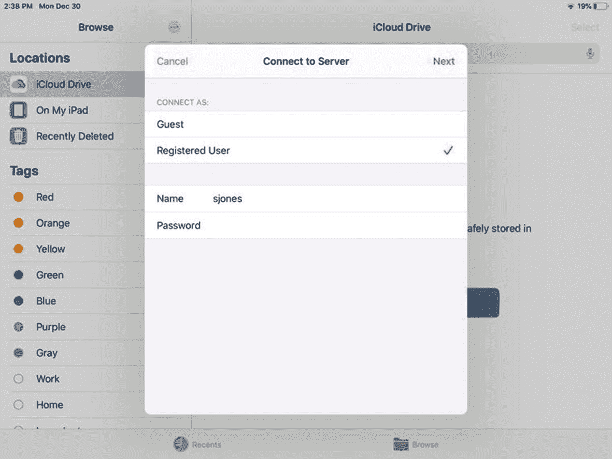

图 11-30: 输入用户名和密码以验证文件服务器身份

系统将把你连接到服务器，并显示你已通过身份验证的用户有权访问的所有共享。你的屏幕应该类似于图 11-31。Sally 现在可以浏览到 `Exec Shared` 文件夹，然后找到她的销售报告，用 `iPad` 上的 `Microsoft Excel` 打开并进行编辑。

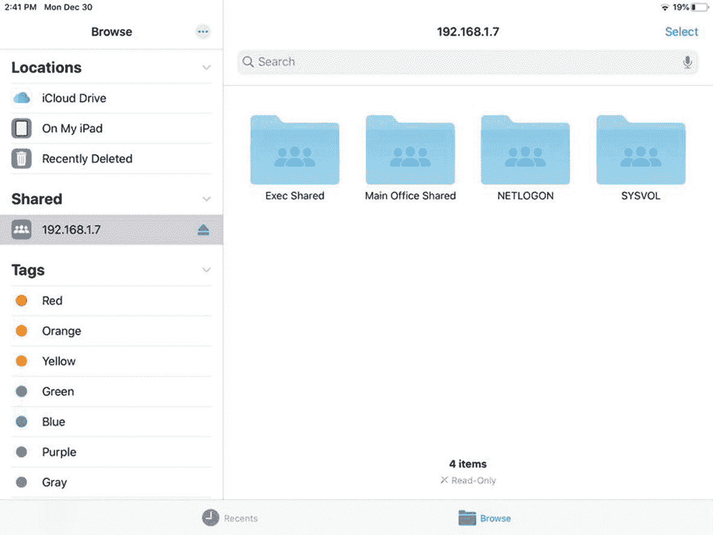

图 11-31: 从 iPad 浏览我们的网络文件共享

我们已成功在 `macOS` 和 `iPadOS` 客户端上配置了本地的 Windows 文件共享。Apple 设备的用户可以无缝地与 Windows PC 用户共享数据。

## Microsoft Exchange 集成

Apple 在 `macOS` 和 `iOS` 的操作系统层面都提供了 `Microsoft Exchange` 集成。你可以使用描述文件来为邮件、联系人、日历和任务配置 Exchange 账户设置。对于 Don 的新款 `iPhone 11`，我们将直接使用描述文件管理器远程为他的设备配置 Exchange 设置。对于他的 Mac，他想要使用 Microsoft Outlook，因此我们将在下一节下载并激活 Office 365 应用程序后进行手动配置。

### 使用有效载荷变量配置 Microsoft Exchange 账户

在开始此练习之前，请务必在描述文件管理器中为 Don President 创建一个新用户，用户名使用 `dpresident`。注册一台测试用的 iOS 设备并将其命名为 `Don's iPhone`，这样你就可以修改并向该设备推送新的描述文件。既然我们已经创建了一个账户，我们将创建一个 Exchange 有效载荷，该有效载荷将使用他的用户名作为 `payload variable`（有效载荷变量）来配置其设备上的账户。

1.  打开 `Profile Manager`（描述文件管理器），浏览 `Devices`（设备）部分，找到 `Don's iPhone`。点击选择它，然后点击 `Settings`（设置）标签页并 `Edit`（编辑）描述文件。
2.  在描述文件编辑器中，向下滚动到 `iOS` 部分，选择 `Exchange` 有效载荷。点击 `Configure`（配置）按钮以指定设置。
3.  如图 11-32 所示，根据 Exchange 有效载荷的要求，在各个字段中输入 Exchange 服务器信息。对于用户名，我们将使用 `%short_name%` 而不是 `dpresident`。这样做可以让我们将此有效载荷应用于我们组织中的其他用户，并且在应用描述文件时，`%short_name%` 变量将解析为当前用户的用户名，在此例中为 `dpresident`。

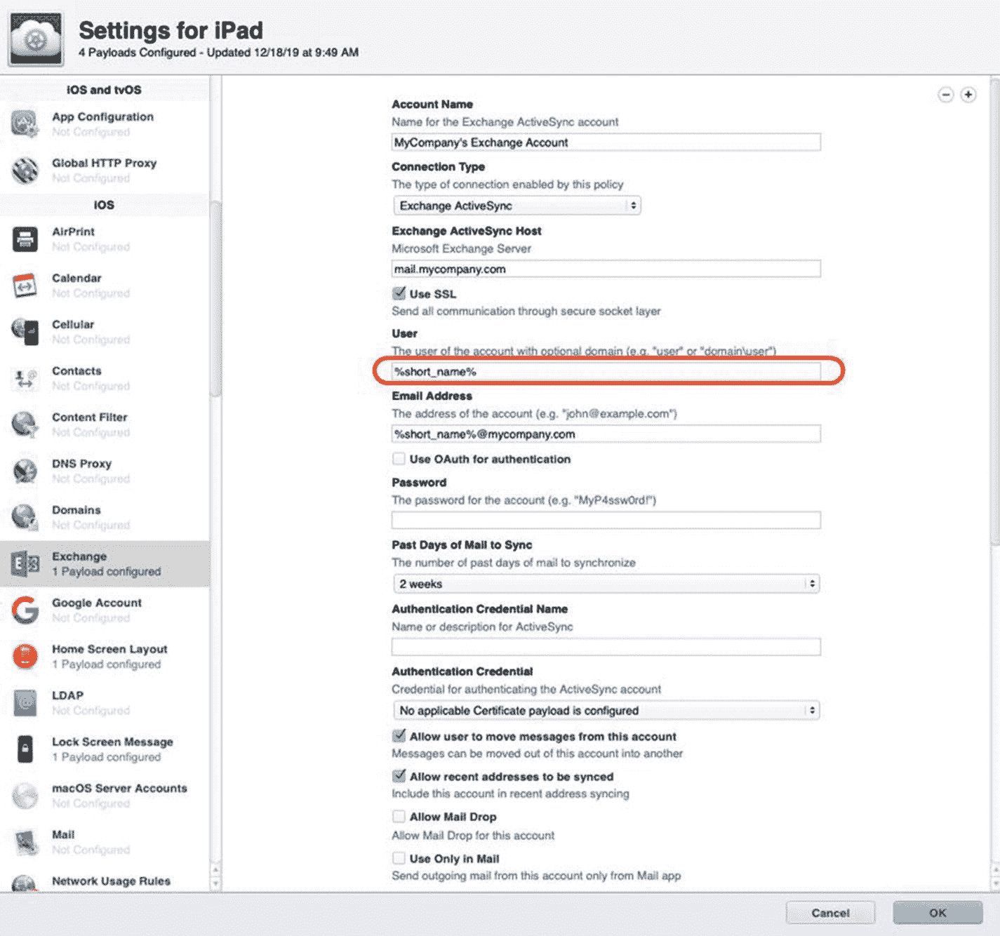

图 11-32: 使用有效载荷变量设置 Exchange 配置

4.  向下滚动到有效载荷的 `Enabled Services`（已启用的服务）部分，确保所有这些选项都已勾选，如图 11-33 所示。这将使整个 `iOS` 系统能够访问来自 Microsoft Exchange 的数据，包括“电话”应用的通讯录。

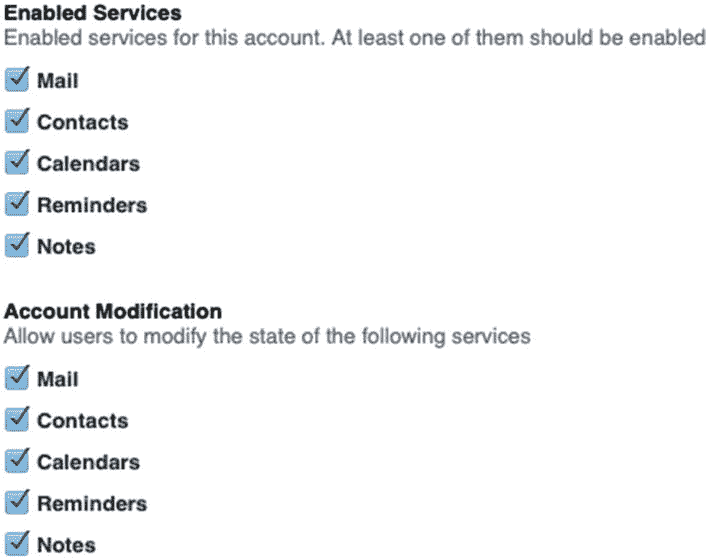

图 11-33: 配置启用哪些服务

5.  点击 `OK`（确定）按钮保存配置有效载荷，然后点击 `Save`（保存）进行应用。在描述文件应用时，系统会提示用户输入密码，之后 Exchange 配置将完全完成。

**专业提示**：请注意，如果你的公司使用了 ActiveSync 中包含的一些 MDM 功能，这些功能也将应用于设备。例如，最小密码长度要求等将适用于设备，并且限制性更强的有效载荷将优先于其他。例如，如果你在描述文件管理器中要求最小密码长度为四个字符，但 ActiveSync 设置为要求至少六个字符，那么在 Exchange 数据开始同步到设备之前，设备将提示用户设置一个新的六位数密码。

无论你使用的是**自带设备**（BYOD），还是在描述文件管理器中管理公司拥有的设备，你都可以看到使用描述文件来应用特定设置（如 Microsoft Exchange）比手动配置每台单独的设备要好得多。


## Microsoft Office 365 应用程序与 OneDrive

下一步是在 Don 的 MacBook Pro 上安装 Office 365 应用程序。与此同时，我们也可以在他的 iPhone 上安装 Word 和 Excel。使用 `Profile Manager`，浏览到特定设备，并使用 **应用程序** 选项卡将 `Word`、`Excel`、`PowerPoint`、`Outlook` 和 `OneDrive` 的副本应用于他的 Mac，如图 11-34 所示。

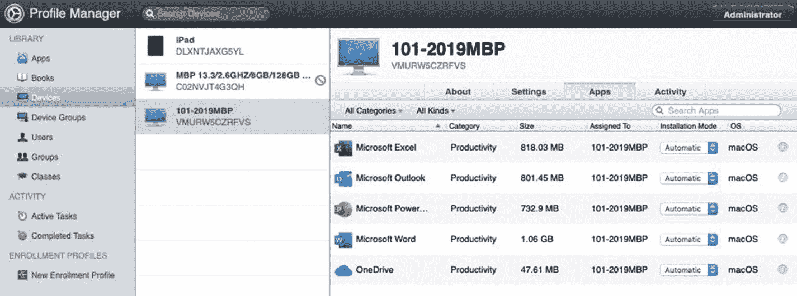
图 11-34. 在 Don 的 MacBook Pro 上安装 Microsoft Office 365 应用程序

这个过程非常简单直接，因为这与我们在第 9 章中遵循的步骤相同。将 **安装模式** 设置为 **自动**，然后点击 **保存** 按钮以推送配置并开始应用程序安装过程。安装所有这些应用程序需要相当长的时间，你可以使用“活动任务”窗口来监控进度，直到安装完成。

### 激活 Office 365 应用程序

一旦 Office 应用程序在 Don 的 MacBook Pro 上安装完成，我们就可以启动其中一个应用程序，并使用激活向导通过我们的 `O365` 帐户进行身份验证并激活软件许可证，如图 11-35 所示。

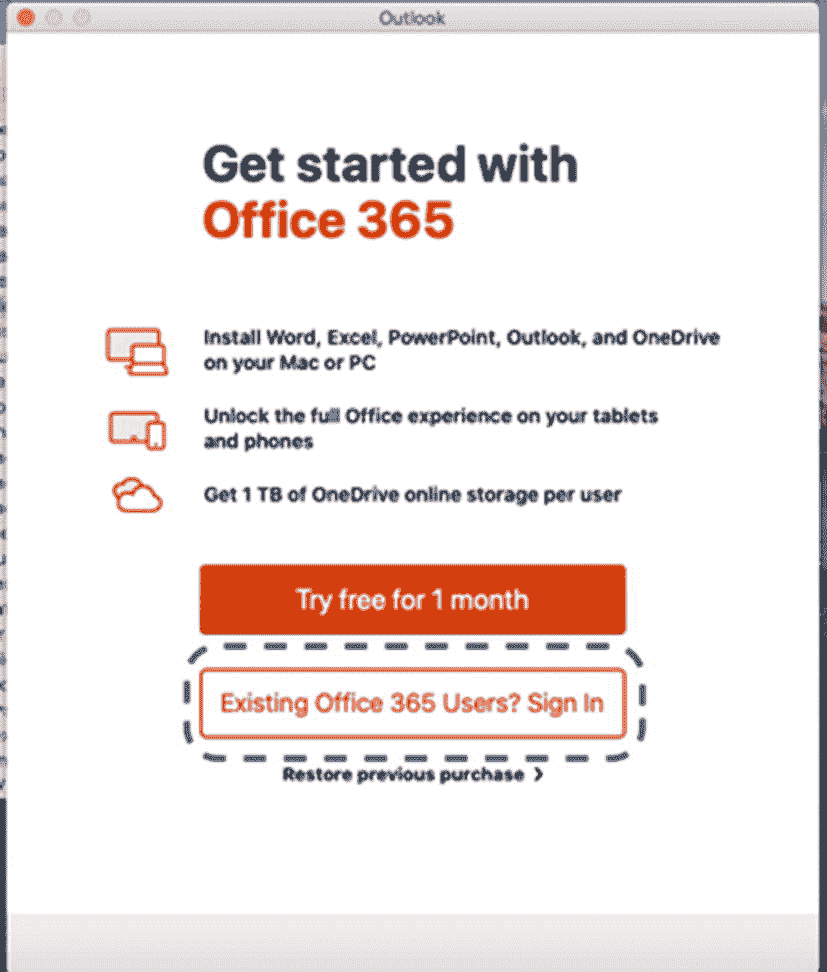
图 11-35 点击按钮登录现有 O365 帐户以激活

当我们打开 Microsoft Outlook 时，可以按照提示配置 Exchange 信息并完成与邮件服务器的同步。现在，Don 的电子邮件已完全配置并准备就绪。我们可以在配置他的 OneDrive 的同时，让它在后台同步收件箱。

专业提示
如果你的用户仍有个人文件夹（`*.pst`）文件，一旦将这些文件迁移到 Mac，就可以使用 **Outlook** 菜单下的 **导入** 功能将它们导入到 Outlook for Mac 中。

### 配置 OneDrive for Business

当 Outlook 在后台忙于刷新他的收件箱时，我们可以从 `/Applications` 文件夹中打开 **OneDrive**。当出现提示时，输入 Don 的电子邮件地址和 Office 365 密码以继续。我们将选择 `/Users/dpresident/` 目录作为我们 OneDrive 文件夹的位置，如图 11-36 所示。选择 **登录时打开** 以允许 Don 的文件自动同步，并按照提示完成设置向导。

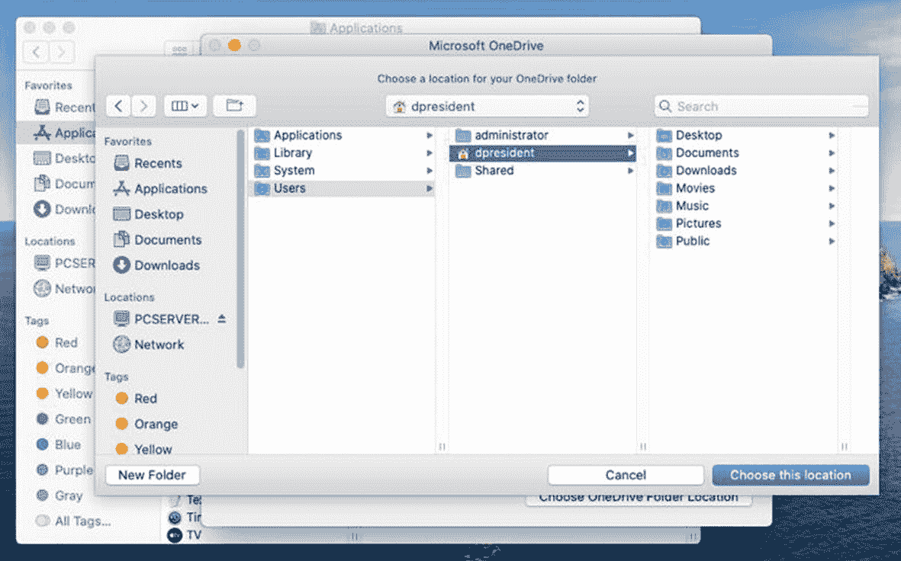
图 11-36 选择 Don 的主目录作为其 OneDrive 文件夹的位置

现在，我们已经完成了在 Don 的 MacBook Pro 上配置 Office 365 和 Microsoft OneDrive for Business。

## 将用户从 Windows 迁移到 macOS

如果 Don 之前使用 OneDrive 存储所有数据，并且在他的 Windows PC 上没有使用 `*.pst` 文件，那么可能没有太多需要迁移的内容。然而，许多用户可能仍在其旧 PC 上存有需要转移到 Mac 的数据。为了完成 Don President 从 PC 到 Mac 迁移的最后一个步骤，我们需要将任何剩余的数据迁移到他的 Mac。

幸运的是，苹果提供了一个相当有用的迁移工具来协助此过程。首先，确保他的新 Mac 和旧 PC 连接到同一网络，然后在 Don 的 Mac 上浏览到 `/Applications/Utilities/` 文件夹，并打开 **迁移助手** 实用程序。

### 使用迁移助手

启动迁移助手后，系统会警告你将关闭所有打开的应用程序，点击 **继续** 以开始。系统会提示输入本地管理员凭据以继续。认证成功后，包括 Finder 在内的所有应用程序都将关闭，迁移助手将开始运行。当提示选择要从中迁移的计算机时，应选择 **从 Windows PC**，如图 11-37 所示。

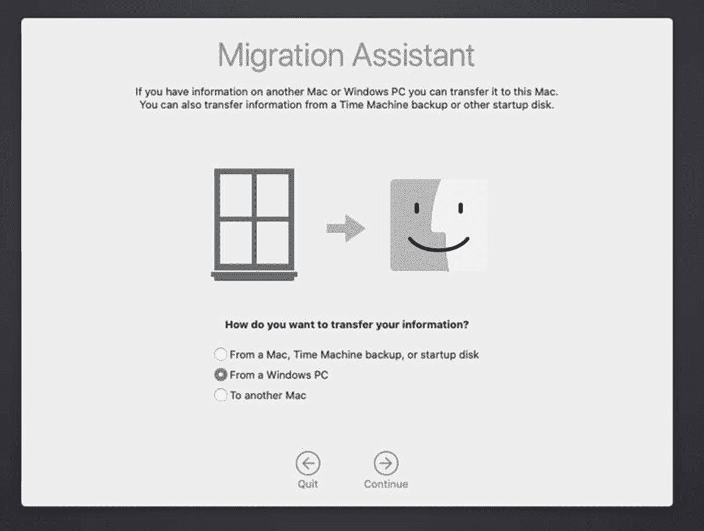
图 11-37 迁移助手使用“从 Windows PC”选项

在 Don 的旧 Windows PC 上，打开浏览器并访问 [`www.apple.com/migrate-to-mac`](http://www.apple.com/migrate-to-mac)，下载 **Windows 迁移助手**。当出现提示时，继续 **运行** 下载的 `setup.exe` 文件，按照安装向导的步骤完成安装以及所需的任何附加组件。安装完成后，从“开始”菜单或 Windows 桌面打开 **Windows 迁移助手** 应用程序。按照提示操作，直到你看到 PC 的名称出现在 Mac 上，如图 11-38 所示。

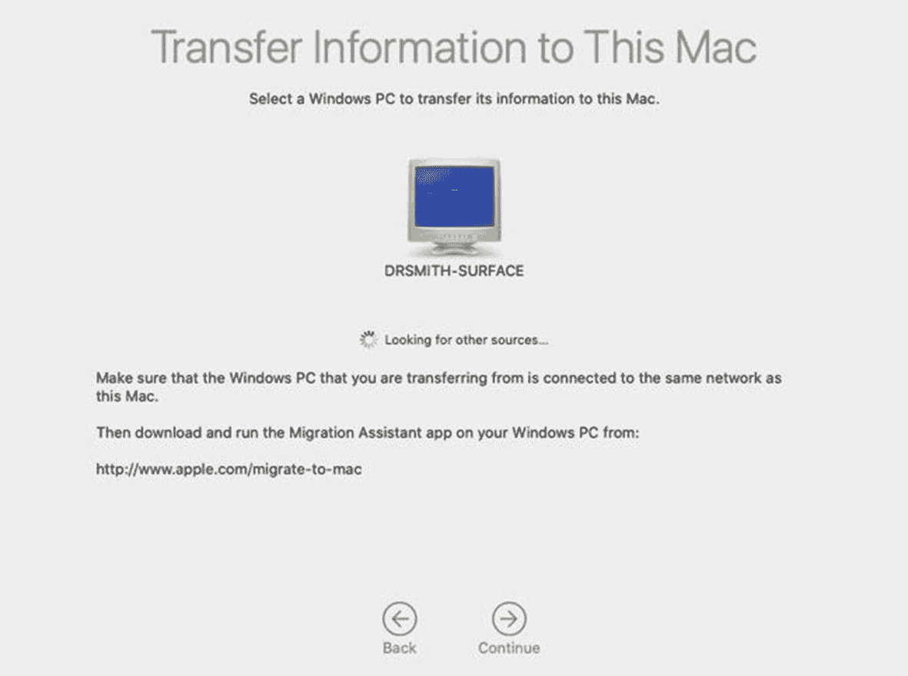
图 11-38 选择要从中迁移的 PC

当要从中迁移的计算机出现时，**选择它**，然后点击 **继续**。切换回 Windows PC，确保 Mac 和 Windows PC 上的安全代码匹配。确认匹配后，点击 Windows PC 上的 **继续** 按钮。它将开始收集数据并与新的 Mac 通信。这可能需要几分钟时间。

当提示选择各种文件和用户帐户时，**选择相关信息**，如图 11-39 所示。选择要迁移的信息后，点击 **继续** 按钮。

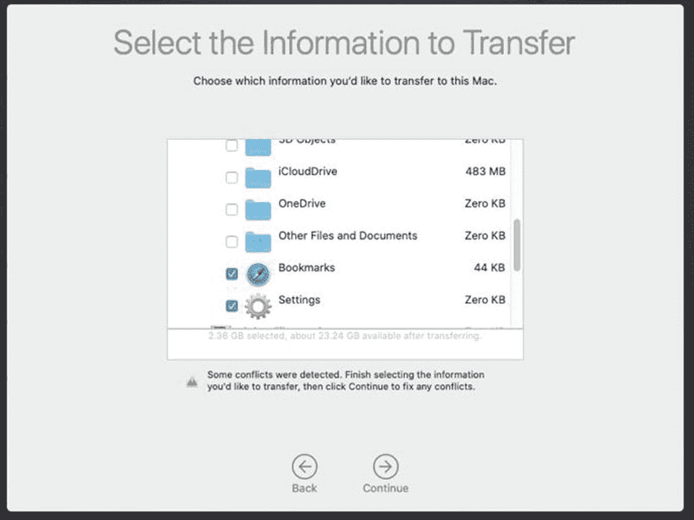
图 11-39 选择要迁移的文件和设置

系统将提示你在 Mac 上以管理员身份进行身份验证。出现提示时点击 **授权** 按钮，并输入本地管理员凭据。然后点击 **继续** 按钮继续。现在，它将开始通过网络将数据从旧 PC 传输到新 Mac，如图 11-40 所示。

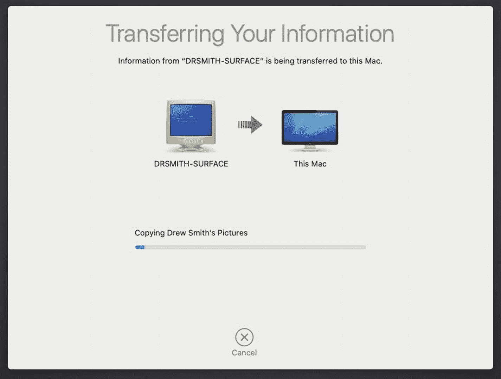
图 11-40 通过网络传输数据


### 将迁移后的数据归位

如果使用迁移助理，默认情况下数据迁移后需要进行一些清理工作。完成后，您将能够使用新的本地用户账户登录，所有数据都将在新的主目录中可用。要完成迁移，我们需要对迁移用户的 `home` 目录使用 `显示简介` 设置，然后为此计算机上的 `所有人` 组对整个目录应用 `只读权限`。您可以在 `显示简介` 对话框的 `共享与权限` 部分执行此操作，并从 `高级设置弹出菜单` 中选择 `应用到包含的项目`，如图 11-41 所示。

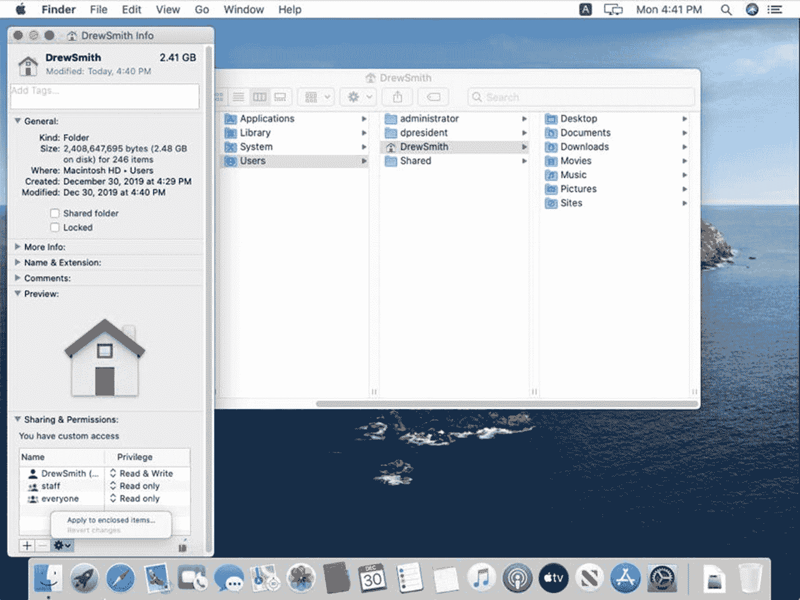

图 11-41
使用显示简介 ➤ 共享与权限选项更改迁移文件夹的权限

现在，我们可以以 Don President 身份登录，浏览旧用户文件夹并收集我们可能需要的任何数据，包括 `migrateduser/Library/Safari/` 目录中的文件，该目录包含我们旧的 Internet Explorer 收藏夹，如图 11-42 所示。将该目录 `拖放` 到 `dpresident/Library/Safari` 文件夹中，以恢复对其的访问。

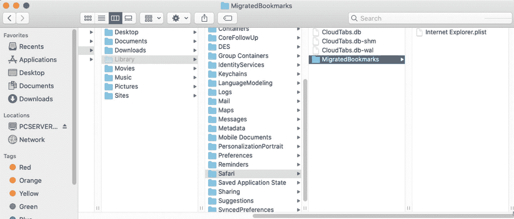

图 11-42
从迁移的库文件夹中移动 Safari 数据

复制完所有用户数据后，确认迁移的数据可供用户访问，如图 11-43 所示。接下来，我们可以打开 `用户与群组系统偏好设置`，并从 Mac 中删除迁移的用户账户。至此，迁移完成。

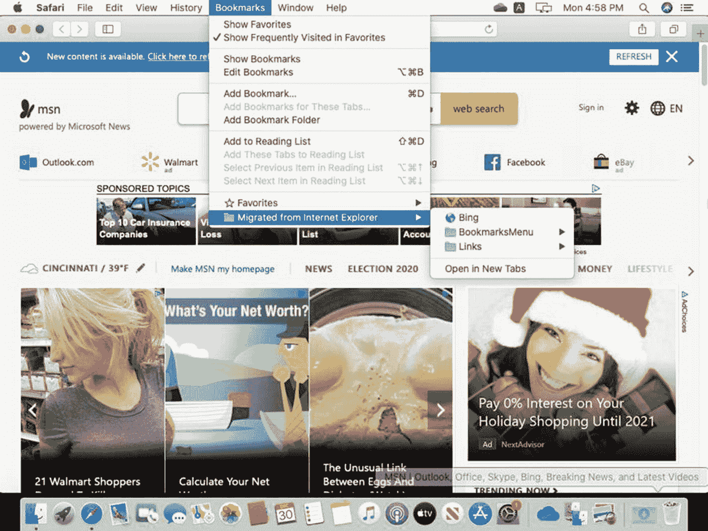

图 11-43
确认迁移的 IE 收藏夹已在 Don 的 Safari 书签菜单中可用

**专业提示**
除非我有大量数据需要迁移，否则我倾向于使用 OneDrive 将用户数据从旧 PC 移动到新 PC 上。我会使用 IE 中的 `文件 ➤ 导出` 选项导出 Internet Explorer 收藏夹，然后将它们保存到单个目录中。之后，我可以将它们导入到新 Mac 的 Safari 中。此方法将用户数据备份在 Microsoft 云中，并且加快了恢复过程，因为我不必在两个主目录之间复制数据，也无需删除迁移助理创建的用户账户。

## 总结

在本章中，我们学习了如何将 Apple 解决方案集成到由 Microsoft 解决方案构成的企业网络中。我们将一位高级用户从 Windows PC 迁移到 `MacBook Pro`，同时让他们能够继续使用他们习惯的打印机、文件共享和应用程序，而不会损失任何生产力。运用本章中学到的相同工具和策略，您应该能够轻松地将 Mac、iPhone 或 iPad 集成到您现有的 Microsoft 环境中，只需付出最少的努力或进行广泛的基础设施变更。

