# 12. iOS 设备的大规模部署

## 引言

到目前为止，我们一直在使用一两个测试设备，但现在我们将配置我们的配置文件管理器 MDM 以促进 iOS 设备的大规模部署。在本章中，我们将在几个实际场景中运用一些 iOS 技能。第一个场景是标准的 BYOD 部署，我们将员工自有的设备配置到 MDM 中并提供基本管理。第二个场景是配置和部署十台公司所有的设备，这些设备将分配给远程销售团队，并需要使用空中 OTA MDM 工具进行远程管理。

## 规划您的部署

在开发最终将投入生产的技术解决方案之前，花时间进行逻辑上的部署规划总是一个好主意。在我们开始使用配置文件管理器之前，让我们花些时间回顾一下我们每个示例场景的需求、目标和支持需求。

### BYOD 场景

任何技术部署的第一步都是确定新服务要实现的主要目标。在此场景中，主要目标是减少目前公司为员工采购和支持公司自有 iPhone 所花费的预算。提出的解决方案是采用自带设备（BYOD）模式，允许员工在个人 iPhone 上处理公司工作。这将使员工能够选择他们喜欢的 iPhone 型号，他们不再需要携带两台设备，取而代之的是，他们每月将在实得工资中获得一小笔津贴，以帮助抵消个人设备的成本。

下一步是需求收集阶段。您已经与组织中的各位领导会面，大家一致认为，与其继续向每位员工提供公司所有的 iPhone，未来的最佳策略是允许员工在公司网络上使用个人 iPhone。您已经与高层领导讨论了各种安全要求、数据丢失预防策略和设备恢复场景。您得出结论，用户需要将他们的个人设备加入到您的 MDM 解决方案中，以确保设备符合这些要求。

为了保护这些个人设备并确保符合公司信息安全标准，我们已确定任何 BYOD 设备必须实施以下控制措施：

*   **最小密码锁**，每 90 天更换一次
*   设备丢失时的**远程擦除能力**
*   配置公司办公室 **Wi-Fi 访问**
*   远程工作时配置 **VPN 服务**
*   在本地备份时，**强制加密备份**以保护公司数据
*   **在锁定屏幕上禁用通知**，以保护可能敏感的数据（例如，电子邮件预览）

我们需要确保本章稍后介绍的 BYOD 配置档案提供所有这些功能。

## iPad 向远程销售团队的部署

与 BYOD 场景类似，我们的第一步是确定技术项目的目标。此部署的目标也相当简单。公司有十名远程销售人员，每个人位于全国不同地区且经常在外奔波。销售与营销副总裁向 IT 部门提出要求，为销售团队的每位成员配备一台 iPad，以便他们在旅途中保持联系。此事已获得预算批准并完成采购。iPad 已准备好为每位远程用户进行部署和配置。

作为需求收集流程的一部分，销售副总裁向 IT 部门提出了几项要求。首先，他们希望设备的配置方式能确保销售团队必须使用经批准的工具和渠道与客户沟通。例如，他们希望团队使用 `Salesforce CRM` 和 `Zoom`，以便跟踪和管理通信记录。

销售副总裁担心，如果销售团队可以使用 `FaceTime`、`信息` 等应用，可能会导致客户联系和沟通偏离公司标准。基于同样的考虑，副总裁还要求只允许在 iPad 上安装经批准的应用程序，并且应锁定 `App Store`。最后，重要的是设备能够被远程管理，并且在必要时，如果设备出现任何软件问题，可以远程擦除和重建。这些销售人员经常出差，设备不能长时间离手，并且他们并不总是在 `Apple 零售店` 附近。

为了实现这些限制并提供无线配置/重新配置，我们需要确保在 `描述文件管理器` 中为这些设备设置以下选项：

*   最短 90 天更改一次的密码锁
*   设备丢失时的远程擦除功能
*   配置公司办公室 Wi-Fi 接入
*   远程工作时配置 VPN 服务
*   在 `设置助理` 期间启用通过 `DEP` 进行 MDM 注册
*   禁用使用 `信息` 和 `FaceTime` 的功能
*   禁用 `App Store`
*   预安装 `Zoom` 和 `Salesforce`

我们稍后需要在本章中确保我们的销售团队 iPad 配置描述文件提供所有这些功能。

## 预期的支持需求

至此，我们已为这两项部署制定了目标和技术策略。虽然难以预测所有可能的支持需求，但我们可以预见一些情况并制定相应计划。对于 BYOD 场景，最常见的支持需求将是 MDM 注册过程。我们将创建并向最终用户分发一封公司范围内的电子邮件，引导他们完成设备注册流程，包括一个允许他们请求 BYOD 服务的网络表单以及分步注册指南。

对于销售团队 iPad 场景，我们将培训服务台人员，引导销售团队完成 `设置助理` 并提供一些基本的软件故障排除，包括在需要时对设备进行完全重置。因为我们使用的是无线配置，只要对设备执行完全重置，它将自动配置正确的设置、安装所需的应用程序并应用任何设备限制。至此，我们已经准备好开始在 `描述文件管理器` 内进行技术工作。

## 为 BYOD 场景配置描述文件管理器

我们需要做一系列准备工作来使 `描述文件管理器` 适应 BYOD 部署。我们要做的第一件事是创建一个设备群组。打开 `描述文件管理器`，点击左侧边栏上的 `设备群组` 按钮，如图 12-1 所示。

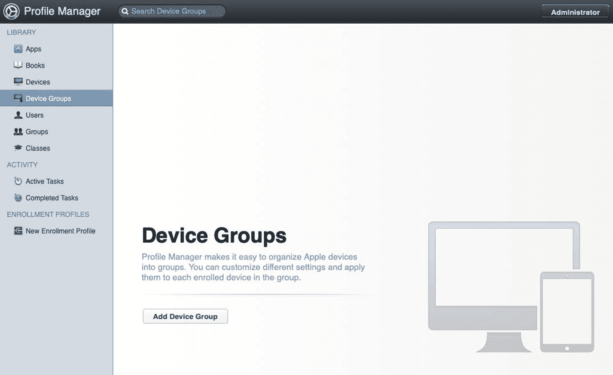

图 12-1
查看描述文件管理器中的设备群组

继续点击 `添加设备群组` 按钮，或点击设备群组窗格下方的 `+` 按钮。`双击` 名称并将其重命名为 `MyCompany BYOD`，如图 12-2 所示。点击 `存储` 以应用名称更改。

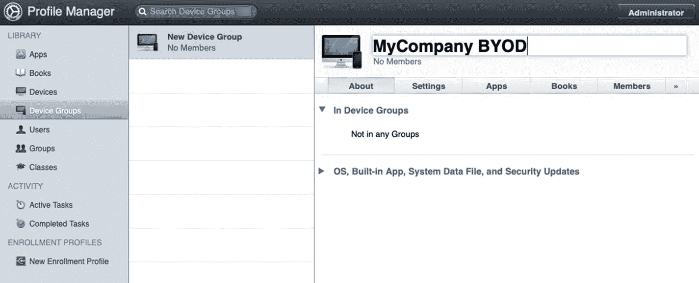

图 12-2
创建新的设备群组

接下来，我们需要为 `MyCompany BYOD` 群组中的设备定义设置。过去，我们为每个单独的设备修改设置。在大规模操作中，这将非常耗时且容易出错，因此我们将在群组级别定义所有设置，然后每次将新的 iPhone 注册到 MDM 时，只需将设备分配到我们的群组。点击 `设置` 选项卡，然后点击 *MyCompany BYOD 的设置* 标题下的 `编辑` 按钮，如图 12-3 所示。

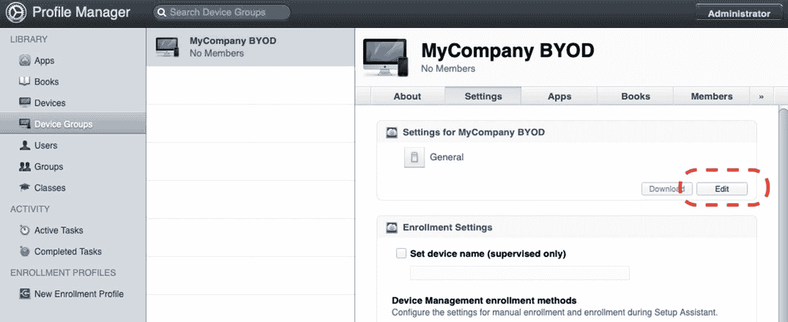

图 12-3
编辑新设备群组的配置描述文件

现在，我们将以与配置单个设备相同的方式配置移动配置描述文件，但这次是在群组级别。“通用”有效负载与以往类似。只需将其设置为“自动推送”并提供一个基本的 BYOD 描述。我们将采用默认的安全选项，因为这些设备无论如何都不会是受监管的设备。

接下来，我们需要开始配置我们的有效负载，以匹配本章前面提到的要求。需要注意的是，我们无需配置任何特殊选项来启用远程擦除或远程管理功能，因为当设备加入我们的 MDM 时会自动设置。我们确实需要配置其他安全选项。

首先，点击 `密码` 有效负载，让我们按照公司标准将其配置为 `复杂密码`，并要求 `每 90 天更改一次`，如图 12-4 所示。

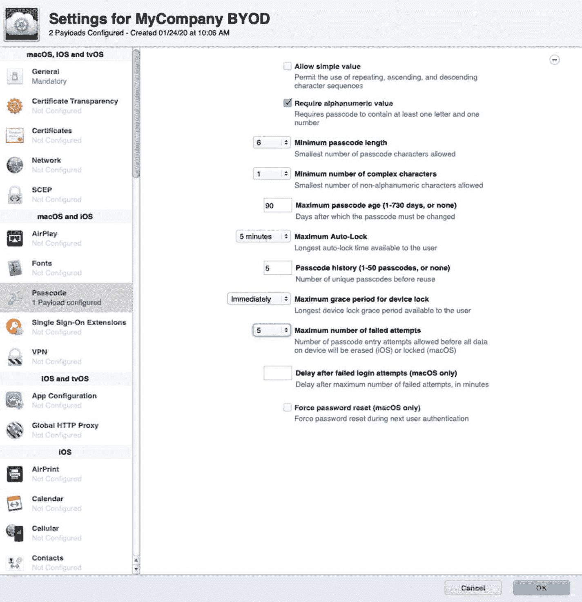

图 12-4
设置密码有效负载

接下来是无线网络。点击 `网络` 有效负载，我们可以配置公司无线网络，如图 12-5 所示。您的设置将根据您的网络、SSID、安全配置等而有所不同。

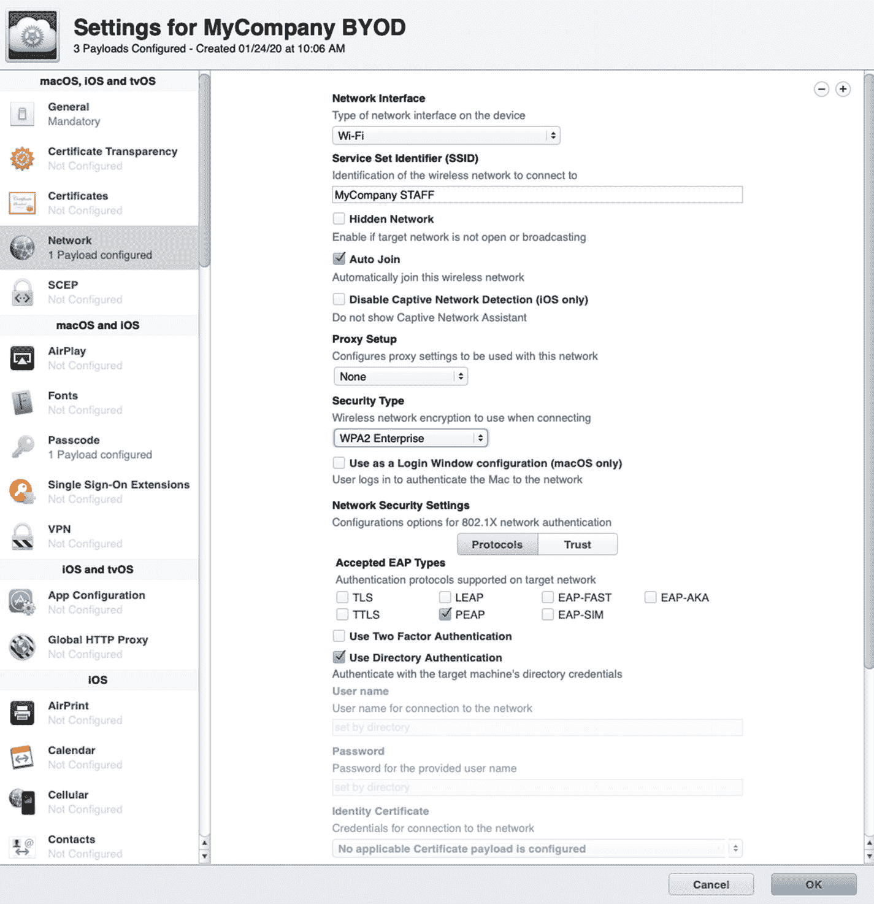

图 12-5
配置您的公司无线设置

接下来，我们需要配置 VPN，所以点击 `VPN` 有效负载并按图 12-6 所示进行配置。

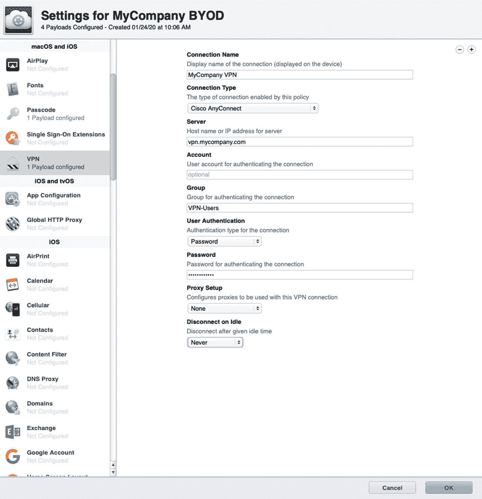

图 12-6
配置 VPN 有效负载

最后，我们需要配置一些限制。点击 `限制` 有效负载，滚动浏览 `功能` 选项卡上的选项。我们需要 *启用* `强制加密备份` 并 *禁用* `在锁定屏幕显示通知中心`，如图 12-7 所示。

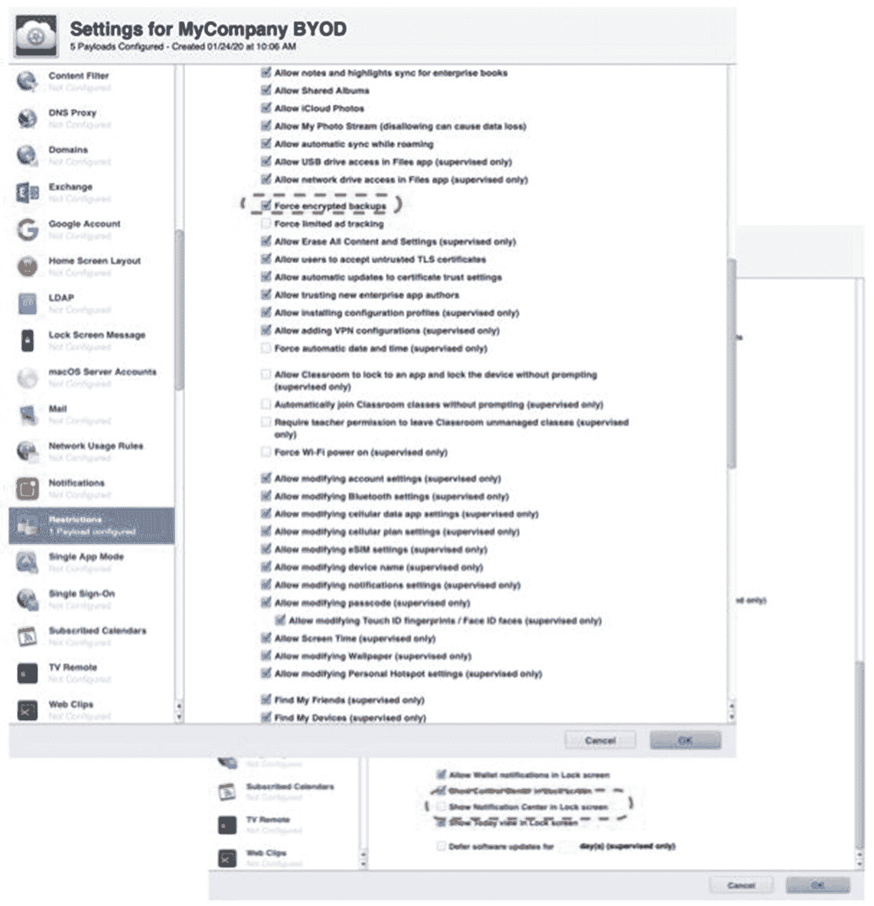

图 12-7

配置“限制”负载

既然我们已通过五个负载完成所有配置，请点击`OK`按钮保存配置，然后如图 12-8 所示点击`Save`按钮，将新设置应用到`MyCompany BYOD`设备组。

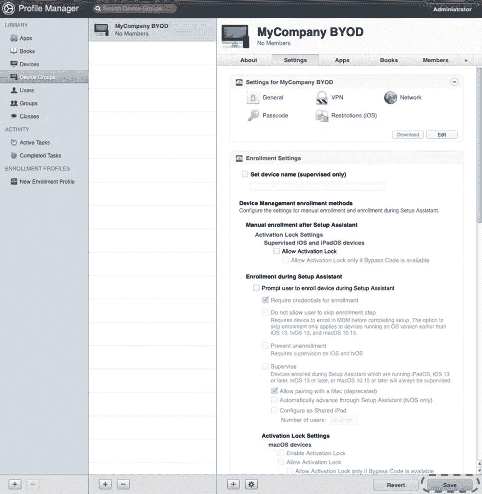

图 12-8

点击保存以将配置应用到我们的设备组

非常好！现在我们的 BYOD 组已准备就绪，所有加入此组的设备都将获得这些设置和要求。接下来我们需要做的是在“MyCompany BYOD”设备组中为我们的设备添加一些占位符。幸运的是，这可以通过我们为最终用户定义的流程轻松完成，即他们通过我们的网页表单提交工单来申请此访问权限。

**专业提示**

你可以根据公司规模以及津贴、审批等相关流程，以多种方式实现这一点。这真的取决于每个公司的具体情况。我见过 IT 部门直接通过电子邮件向每位用户发送配置描述文件，也见过在 IT 获准为指定设备启用注册前需要经过包含多个审批步骤的完整流程。

我们有三项新 BYOD 成员的待处理请求。现在，让我们通过创建匹配的占位符并将它们添加到我们的`MyCompany BYOD`设备组来满足这些请求。操作方式与我们在前几章所做的类似，只是多了一个额外步骤——将占位符分配给设备组，而不是为每个设备单独配置设置。

点击左侧边栏的`Devices`按钮，然后点击设备窗格右下角的`+`按钮并选择`Add Placeholder`。如图 12-9 所示输入占位符信息。我们将使用`Serial Number`作为标识符。

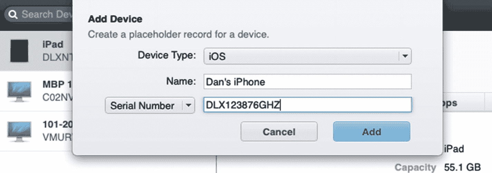

图 12-9

为每台 BYOD 设备创建一个占位符

当`Dan’s iPhone`的占位符出现在设备列表中后，再次点击左侧边栏的`Device Groups`按钮，然后点击`MyCompany BYOD`设备组将其选中。接着，在`Members`选项卡上，如图 12-10 所示点击`+`按钮并选择`Add Devices`。

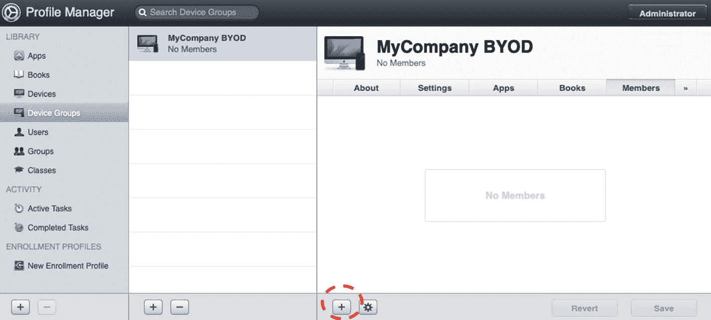

图 12-10

将设备成员添加到设备组

点击`Dan’s iPhone`旁边的`Add`按钮，然后如图 12-11 所示点击`Done`按钮关闭对话框。点击`Save`按钮以保存我们对`MyCompany BYOD`设备组成员资格所做的更改。再为另外两个占位符设备重复这些步骤，并确保其中一个的序列号与你的物理测试设备匹配，以便我们可以进行测试并查看结果。

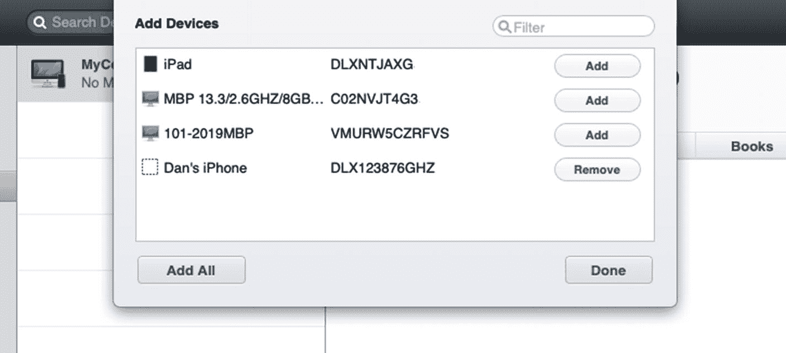

图 12-11

将占位符添加到组中

现在我们已经将占位符设备分配到了设备组，接下来是向用户提供注册描述文件，以便他们能够将自己的设备添加到 MDM 并接收我们的配置设置。有几种方法可以做到这一点。如果你的 Profile Manager 服务器连接到公司 LDAP（如 Active Directory），你可以将`Dan’s iPhone`与其用户账户关联，并允许他使用`My Devices Portal`加入设备，同时限制只能注册已分配的设备，如图 12-12 所示。

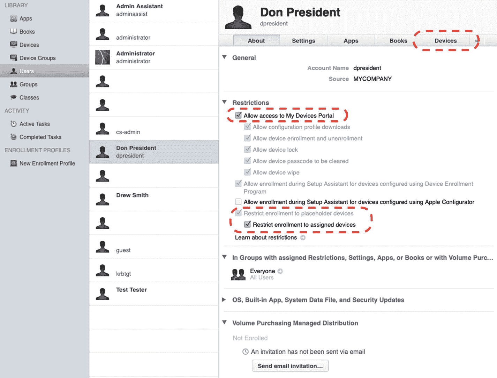

图 12-12

选择一个现有用户账户，将设备分配给该用户，并允许其访问“我的设备”门户

你也可以简单地创建一个新的注册描述文件，通过电子邮件发送给用户，这样他们就可以在手机上将其作为附件访问，并按照提示安装。或者，你可以将注册描述文件托管在内部 Web 服务器上，并指引用户到该位置下载和安装。

最后，你可以引导用户访问`My Devices Portal`并将`Everyone`组配置为允许注册，但要确保如图 12-13 所示启用`Restrict enrollment to placeholder devices`。以上任何选项都是可以接受的，你需要根据具体情况决定哪种方式最适合。

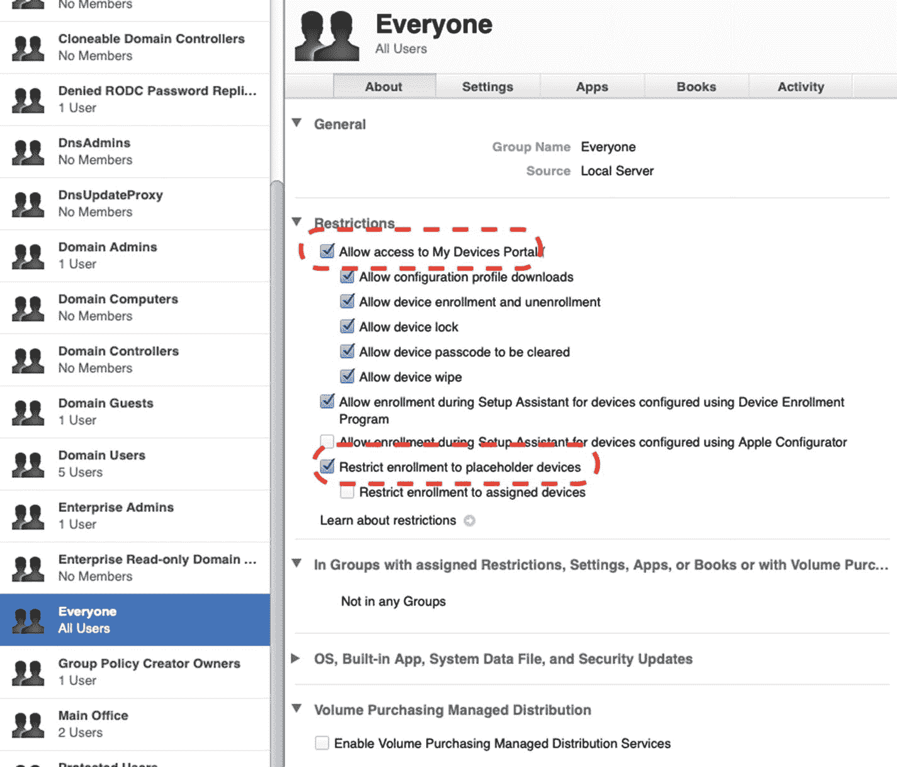

图 12-13

为设备自助注册配置“所有人”组

在我们的示例中，我们将为`Everyone`组使用`My Devices Portal`选项。现在，打开你的测试 iPhone 并浏览到 MDM 服务器的`/mydevices`子目录。例如，我的网址是[`https://579testing.com/mydevices`](https://579testing.com/mydevices)。完成身份验证后，页面加载时点击蓝色的`Enroll`按钮，并按照提示下载和安装注册描述文件。此时，系统将找到匹配的占位符并开始应用我们的负载。

完成后，浏览你的设备以确保 Wi-Fi、VPN 和应用的限制已就位。你可以随意使用 Profile Manager 中的管理选项擦除测试设备，或直接在设备上手动删除描述文件以查看即时效果。这就是你可以从一台非受监管的 BYOD 设备上预期的行为。

**专业提示**

随着业务需求的变化，你可能需要更新、修改或添加新的配置设置和负载。你可以随时修改 MyCompany BYOD 设备组的设置，这些更改将立即应用于属于该组的所有设备。

现在，你已经启用了一个大规模的 BYOD 解决方案。将来，你只需创建额外的占位符，并让你的最终用户自助注册，MDM 将为你处理其余的工作。

## 为销售团队 iPad 场景配置 Profile Manager

配置销售团队的 iPad 也相当简单，我们将创建一个设备组并为这个场景应用适当的设置。这里的主要区别在于，由于这些是公司拥有的设备，我们将使用监管和 `DEP` 将设备分配到特定的设备组，并在 `设置助理` 激活步骤中强制注册。

让我们开始操作，打开 `Profile Manager` 并再次浏览到 `设备组` 部分。点击 `+` 按钮添加一个新的 `设备组`。这次我们将其命名为 `销售团队 iPad`。点击 `销售团队 iPad` 设备组以选中它，然后点击 `设置` 选项卡。在 `销售团队 iPad 的设置` 部分下点击 `编辑` 按钮，如图 12-14 所示。

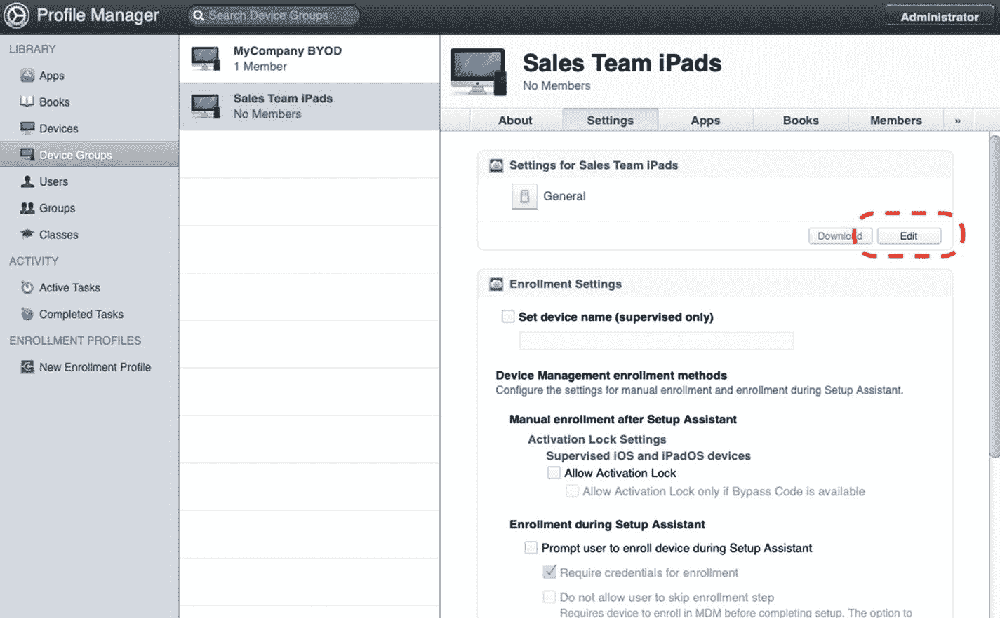

图 12-14
为我们的新设备组分配配置设置

我们需要做的第一件事是配置所有与 `BYOD` 组相同的 `VPN`、`网络` 和 `密码` 载荷。你可以继续配置这些载荷以匹配。

### 专业提示
如果你的组织规模非常庞大，且每台设备都有类似的无线网络和密码要求，你可能希望创建一个名为“安全标准”或类似名称的设备组。接着，你可以在一种嵌套组场景中，将新设备组添加为安全标准组的成员，这样就不必每次都重复在多个组上配置相同的设置了。

接下来，我们需要限制 `信息`、`FaceTime` 和 `App Store` 的使用。按如下方式配置 `限制` 载荷：
*   *取消选中* `允许信息（仅限受监管设备）`。
*   *取消选中* `允许 FaceTime（仅限受监管设备）`。
*   *取消选中* `允许删除 App（仅限受监管设备）`。
*   *取消选中* `允许删除系统 App（仅限受监管设备）`。
*   *取消选中* `允许 App 内购买`。
*   *取消选中* `允许使用 App Store 安装 App（仅限受监管设备）`。

你的限制设置应类似于图 12-15。点击 `好` 按钮保存 `销售团队 iPad` 组的配置设置，然后点击 `存储` 按钮应用。

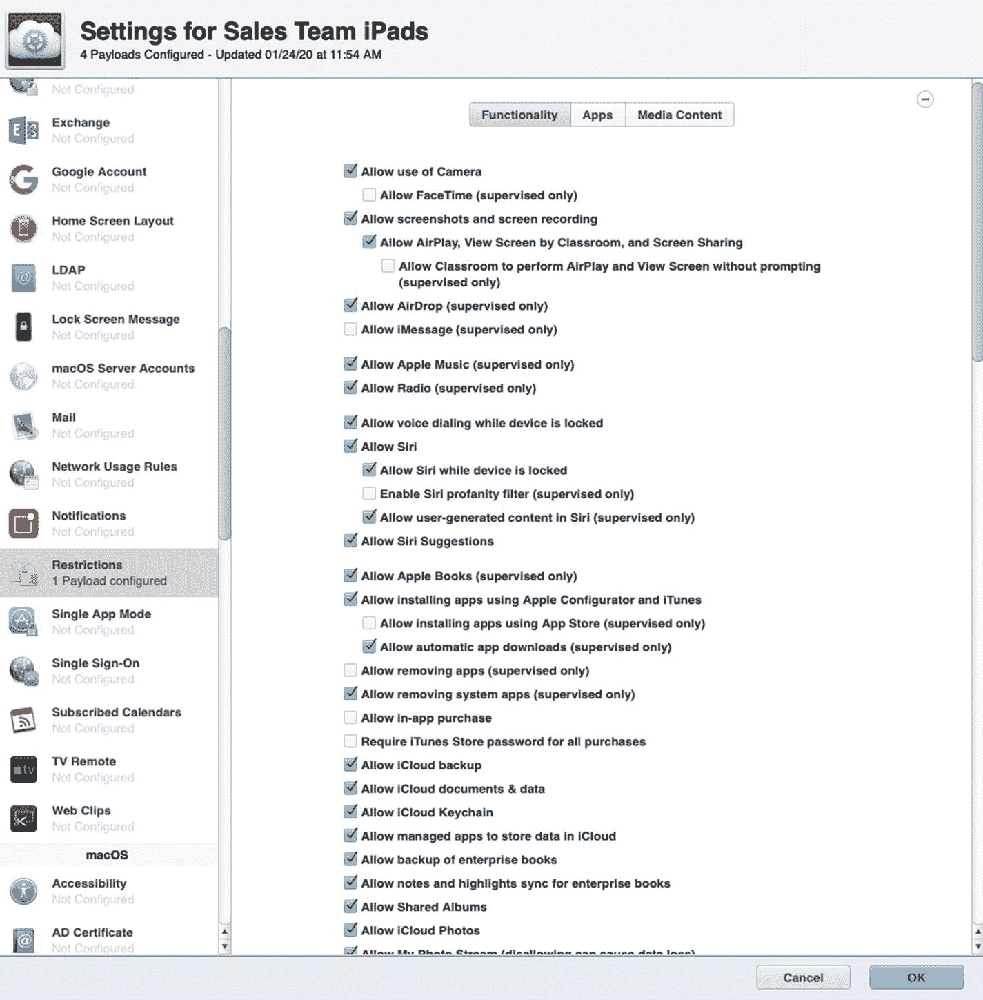

图 12-15
配置限制载荷

现在我们已经配置了限制和配置设置，接下来需要配置注册和 `设置助理` 选项。在 `设置` 选项卡中，向下滚动到 `设置助理期间的注册部分`，并更改设置以匹配图 12-16 中的内容。

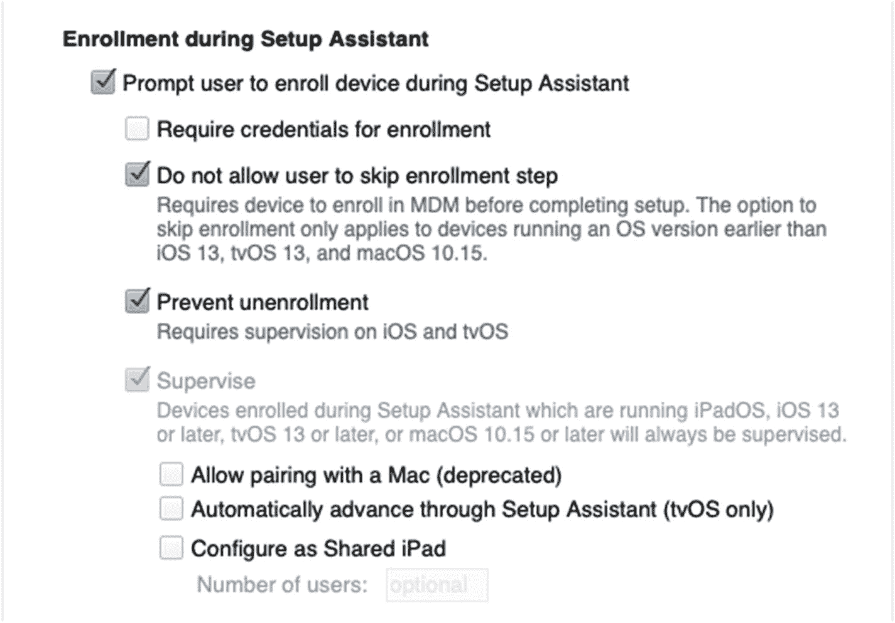

图 12-16
启用设置助理期间注册的设置

再向下滚动一点，更改 `设置助理选项` 以隐藏若干设置。这将简化最终用户完成设备设置的步骤，并有望节省时间和减少联系 `IT 服务台` 的次数。更改你的设置以匹配图 12-17 中的内容。

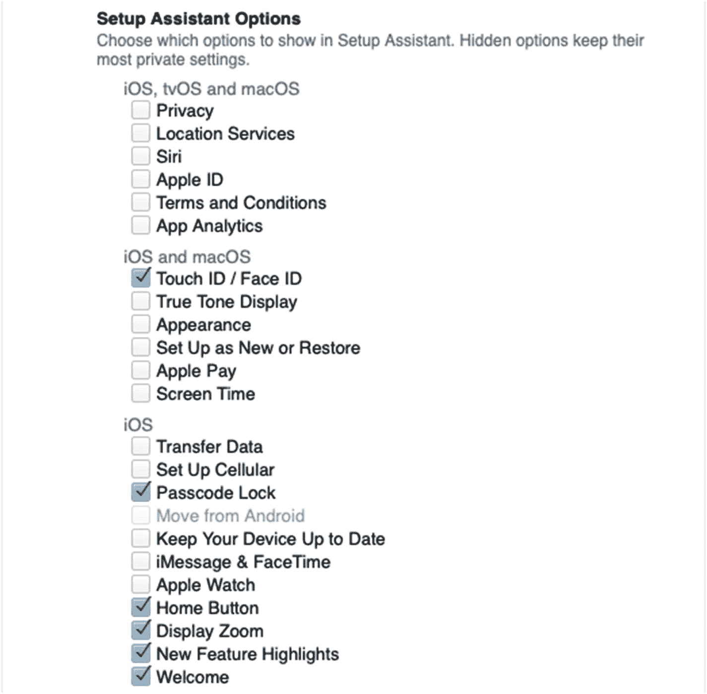

图 12-17
取消选中不需要的设置助理提示

点击 `存储` 按钮将这些设置应用到 `销售团队 iPad` 设备组。

### 专业提示
可选地，你也可以在此配置 `激活锁` 设置并强制实施设备命名标准。我通常会启用 `激活锁` 并设置设备名称。

目前，我们在 `Profile Manager` 中的工作已完成。接下来，我们需要兑换一些 App，并在 Apple 教务管理/商务管理中将这些新 iPad 分配到我们的 `MDM`。理论上，你应该有办法通过序列号来识别你的新 iPad。检查装箱单或发票，找到我们将使用 `DEP` 分配的十台新 iPad 的序列号，然后前往 Apple 管理门户。根据你的情况，这将是 `http://school.apple.com` 或 `http://business.apple.com`。

在那里登录，然后进入 `设备分配` 区域。我们将在这里输入要分配给销售团队的十台 iPad 的序列号。将每台设备输入 `序列号` 字段后，使用 `执行操作` 下拉菜单将其分配到我们的 `MDM`，然后点击 `完成` 以应用，如图 12-18 所示。

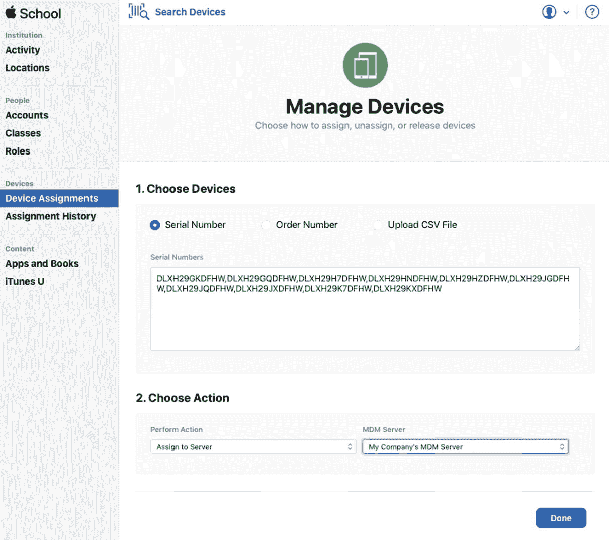

图 12-18
列出我们全部十台 iPad 的序列号（用逗号分隔）并将它们分配到我们的 MDM 服务器

### 专业提示
正如你可能已经推断出的那样，你可以应用单个订单号下的所有设备，或者上传一个 `*.csv` 文件，而不是逐个输入每个序列号。由于十台设备差不多是我愿意手动操作的数量上限，我就直接手动输入了。

成功分配设备后，前往 `App 和图书` 部分，我们可以兑换 `Zoom` 和 `Salesforce` App。使用与前面章节中处理 `Microsoft Office` 套件相同的流程，查找 `Salesforce` 和 `Zoom` 并各兑换十份，如图 12-19 所示。

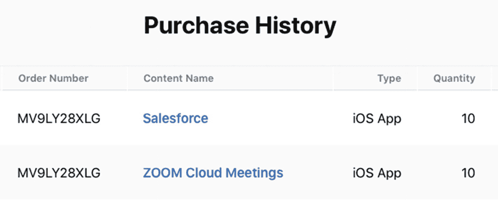

图 12-19
确保你有十份所需的 App 可用于分配

现在我们已经兑换了 App 并将 iPad 分配给了 `MDM` 服务器，返回 `Profile Manager`。此时你应该能看到新的 App 和新的 iPad 占位符；但如果没有看到，请点击 `Profile Manager` 窗口中的 `刷新` 按钮，强制与 Apple 服务器同步，App 和占位符现在应该会显示出来，如图 12-20 所示。

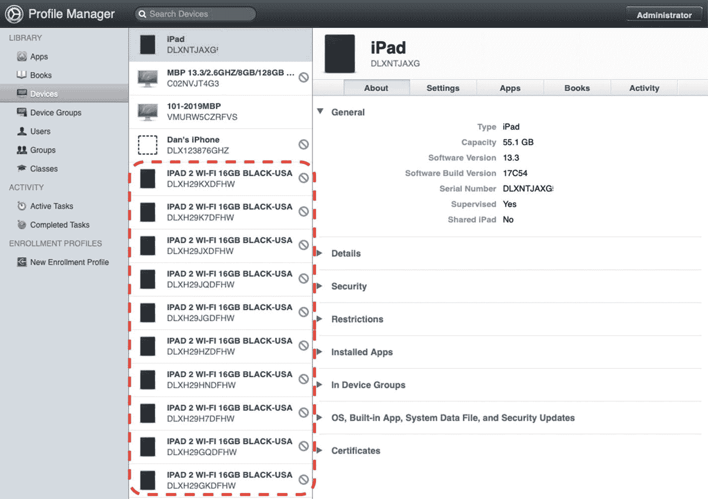

图 12-20
感谢 DEP，新的占位符设备现已可用

现在我们有了占位符设备和 App 许可证，让我们回到 `Profile Manager` 的 `设备组` 区域，点击选择 `销售团队 iPad` 组。点击 `App` 选项卡，然后点击 `+` 按钮为此组分配一些许可证。添加 `Salesforce` 和 `Zoom`，如图 12-21 所示，并将默认的 `安装模式` 保留为 `自动`。接着，点击 `好` 按钮保存这些设置，然后点击 `存储` 将这些设置应用到设备组。

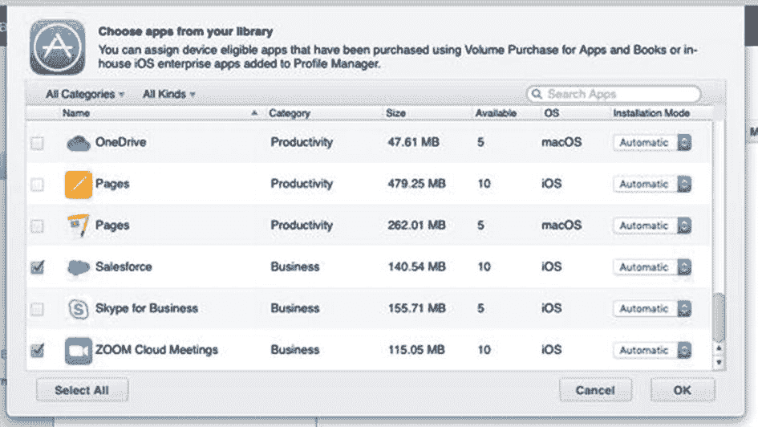

图 12-21
为我们的设备组分配 App

最后，我们需要采取的最后一个步骤是将十台新 iPad 分配到 `销售团队 iPad` 设备组。点击 `成员` 选项卡，在 `成员` 窗格中点击 `+` 按钮，将所有十台新 iPad 添加到此组，如图 12-22 所示。

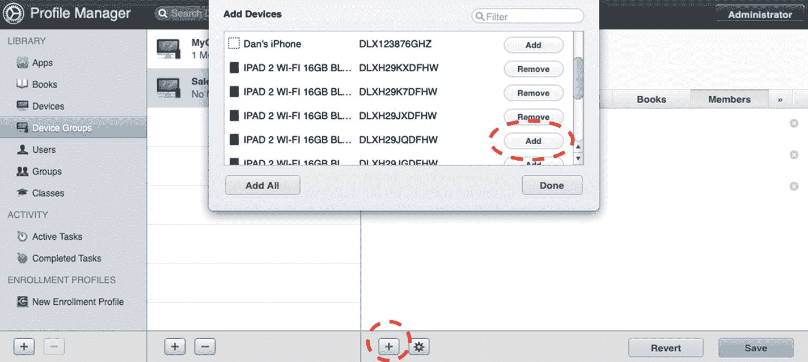

图 12-22
将每个占位符 iPad 添加到设备组

在为每台新设备点击旁边的`添加`按钮后，点击`完成`按钮，然后点击`保存`按钮，将这些更改应用到设备组。至此，您已向`销售团队 iPad`设备组添加了十台占位符 iPad，配置了设置和限制，并分配了两个必需的应用程序。现在，**描述文件管理器**已配置完毕，随时可以将这些新设备部署给最终用户。

如果您想向该组添加第十一台 iPad，可以使用一台测试设备进行尝试。在一台全新安装`iPadOS`、属于`销售团队 iPad`组的设备上，逐步完成设置助理，您将跳过设置助理的多个屏幕。现在，到达主屏幕后，信息、FaceTime 和 App Store 应用程序将会消失；几分钟后，Zoom 和 Salesforce 应用程序将会出现。

专业提示

由于我们在设置助理的激活过程中将这些设备注册到 MDM 中，最终用户可以随意擦除和重置设备；一旦设备再次运行设置助理，它将立即以完全相同的方式被管理和重新配置。这有效地允许这些远程用户按需自行重新部署设备，而只需 IT 部门提供最少的协助。

## 总结

在本章中，我们演练了在许多大中型企业中 iOS 设备日常支持中常见的几种场景。我们建立了一个简单的 BYOD 模式，并制定了一个用于远程配置任意数量公司自有 iOS 设备的流程，该流程可以根据需要从十台设备扩展到数百台设备。任何 IT 部门都可以遵循这些基本步骤，以最小的努力制定 iOS 设备的部署和支持计划。

