# 第 13 章 macOS 客户端的部署

## 引言

在本书中，我们涵盖了众多`macOS`概念，从基本支持工具、客户端实用程序、`描述文件管理器`，到与`微软公司`技术的集成，以及如`Munki`和`Munki-Pkg`等开源部署工具。在这最后一章中，我们将综合所有这些概念，并逐步演练构建一个标准 Mac 办公环境的过程。

在本场景中，我们将为即将招聘的新网页设计部门部署十台 Mac。虽然整个部门都将使用基于`macOS`的计算机，但他们需要与公司其他使用基于 Windows PC 的用户使用相同的解决方案进行交互和共享数据。

### 规划部署

正如我们在第 12 章中讨论的，在制定将投入生产的技术解决方案之前，从逻辑上规划我们的部署是一个好主意。首先，我们需要了解可用的系统、基础设施和工具。图 13-1 提供了我们公司网络的最新示意图。我们拥有第 11 章中的标准`Windows 服务器`和`Active Directory`架构、第 10 章中的`Munki`环境，以及第 9 章中支持 DEP 集成的`描述文件管理器`。我们的 Mac 管理桌面运行着`Apple Remote Desktop`和`MunkiAdmin`。我们已经具备了支持 Mac 用户部门所需的所有组件。

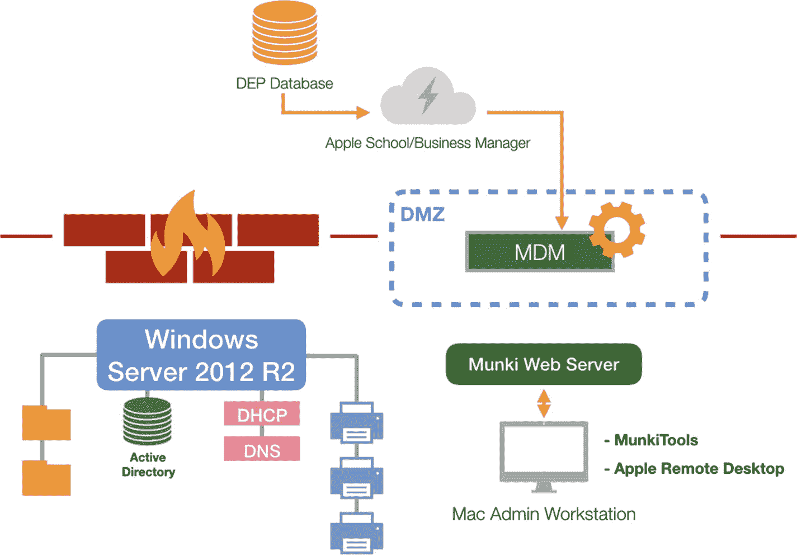

图 13-1
示例公司当前网络基础设施

接下来，我们可以开始需求收集工作。在与公司领导层的讨论中，您了解到虽然有十名设计师加入公司，但在未来 12-18 个月内，随着新团队承担更多的组织战略项目，这个新部门预计将呈指数级增长。您还获悉，即使该部门规模扩大，IT 人员开支也必须保持不变。幸运的是，您拥有的工具可以以几乎相同的投入水平来部署十台甚至一百台新 Mac。

除了保持这是一个非常高效的部署和支持流程外，我们还需要确保与`Windows`有共同的用户体验。这将最大限度地减少支持难题，提供更一致的办公环境，并促进不同平台用户之间的协作。这也具有保持基础设施成本可控的额外好处。以下是我们构建 Mac 部署项目时需满足的快速需求清单：

*   对于部署这些系统的 IT 桌面技术人员，尽可能接近"零接触"
*   与公司的`Active Directory`和`Office 365`解决方案集成
*   访问基于 Windows 的网络共享
*   访问基于 Windows 的网络打印机
*   桌面安全和 UI 自定义与 Windows GPO 设置相当
*   必需的软件应用程序套件，包括`Microsoft Office`和`Adobe`产品，以及访问多个用于测试的网页浏览器

基于此列表，我们需要让 IT 团队能够轻松设置和部署这些 Mac，我们可以使用设备注册计划将这些新设备指向我们的`描述文件管理器`环境。我们将使用`Active Directory`和`描述文件管理器`来配置与公司现有`Windows` PC 安装密切相关的设置和服务。最后，我们需要将几个`Adobe`安装程序打包到`Munki`中，并通过 VPP 部署`Microsoft Office`，以便 Mac 自动下载并安装这些必需的应用程序。让我们开始吧！

## 配置 Active Directory

我们要做的第一件事是配置`Active Directory`。与我组织中任何新用户的典型做法一样，我需要为每位新员工创建用户帐户，并将其添加到适当的组中。打开`Active Directory 用户和计算机`，创建十个新的用户帐户。任意命名它们并为每个设置默认密码。创建这些帐户后，打开`主办公室组`并将这些新员工作为成员添加进去。完成后，主办公室组应类似于图 13-2。

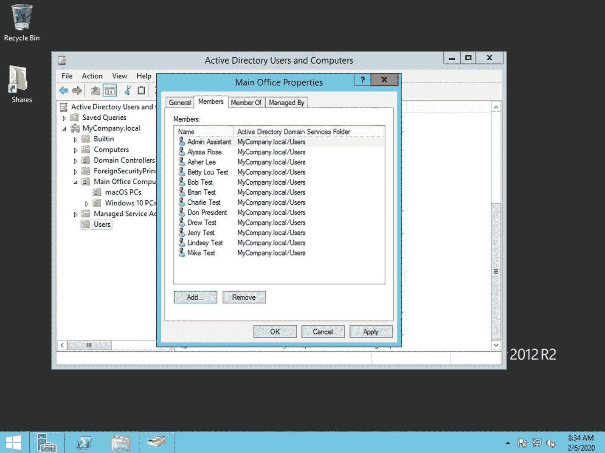

图 13-2
在 Active Directory 中创建十个新用户帐户作为我们主办公室组的成员

接下来，我们将转到`主办公室计算机`➤`macOS 电脑 OU`，并为这些新 Mac 添加十个计算机记录。请随意命名这些记录。我将遵循第 11 章中使用的命名方案以保持一致性。一旦您创建了十个新的计算机记录来代表我们将分配给这个新网页开发团队的新 Mac，您的`macOS 电脑 OU`应如图 13-3 所示。

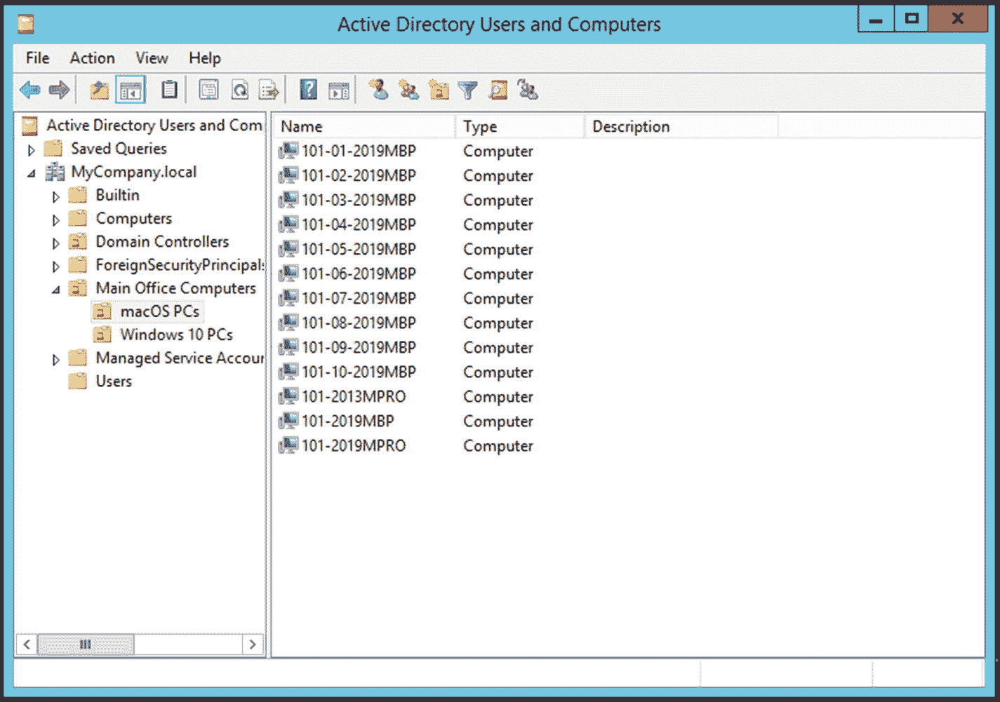

图 13-3
在 macOS 电脑 OU 中创建十个新的计算机记录

至此，我们已完成 Active Directory 的配置。

## 配置描述文件管理器

现在我们已经 Active Directory 中创建了用户帐户和计算机记录，可以开始配置`描述文件管理器`以注册我们的新设备了。在本节中，我们将使用 DEP 在`设置助理`期间将 Mac 注册到我们的 MDM，并配置描述文件管理器使用`设备组`来强制执行安全限制。我们还将创建一些配置文件有效负载，以将 Mac 加入域、映射网络共享等。

### 使用 DEP 创建占位符

我们接下来的议程是将十台新的 Mac 添加到 Apple 校园教务管理/Apple 商务管理中的 Profile Manager MDM 群组。我有这些新机器包装盒上的十个序列号，因此我将登录管理器门户，使用 `Device Assignments` 选项卡将这些设备分配给我的 MDM。正如我们在第 12 章中对 iPad 所做的那样，我们将用逗号分隔的序列号输入到 `Choose Devices` 字段中；然后在 `Choose Action` 标题下，我们将选择 `Assign to Server` 并选择 `My Company's MDM Server`，如图 13-4 所示。准备就绪后，点击 `Done` 按钮继续。

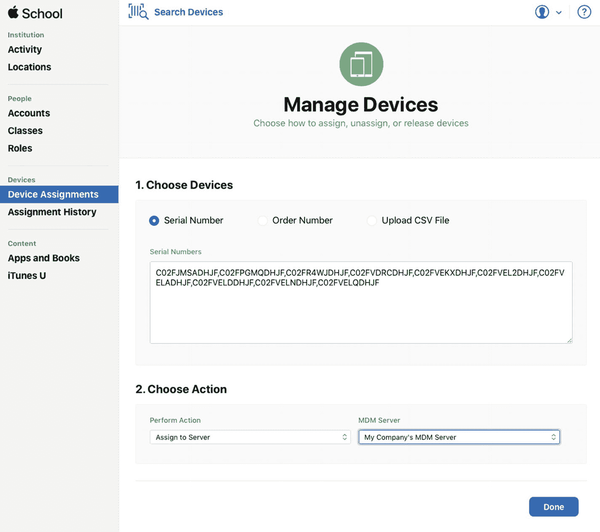

图 13-4
将十台新 Mac 分配给我们的 MDM

分配处理完成后，退出管理器门户。打开 `Profile Manager` 并进入 `Devices` 视图。如果需要，点击 `refresh button`，确保所有新的 Mac 都出现在 `Devices` 列表中，如图 13-5 所示。

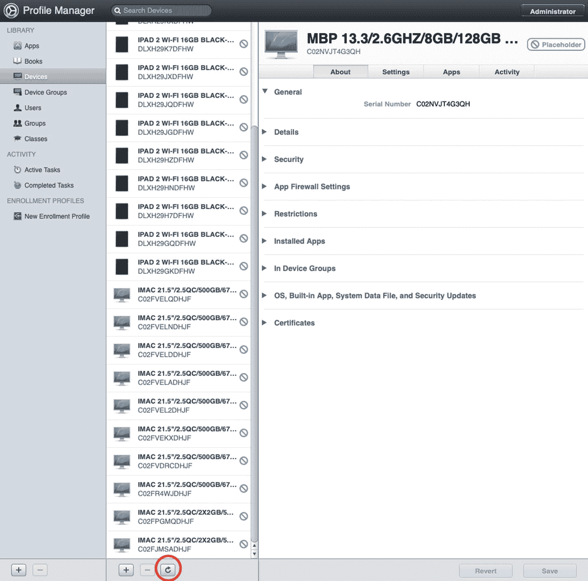

图 13-5
强制与 DEP 同步后，新 Mac 应出现在我们的设备列表中

### 设置设备名称

现在我们在 Profile Manager 中有了所有的 `Placeholders`，可以看到它们已使用一些基本产品信息作为默认名称。我们将对这些设备占位符的名称做一些更改，以便于在列表中识别它们。在 `Devices` 视图中，逐个点击每个设备以选中它，然后点击视图右上角的临时名称来编辑名称。为我们的十台机器 `Assign a name`，使其与在 Active Directory 中创建新计算机记录时使用的名称相匹配。我将我的设备命名为 `101-01-2019MBP` 到 `101-10-2019MBP`。接下来，点击列表中每个设备的 `Settings` 选项卡，勾选 `Set device named (supervised only)` 旁边的复选框，它应会自动填入占位符的新名称。

### 创建设备组

我们将把所有这些 Mac 占位符设备添加到一个 `Device Group` 中。这将允许我们在群组级别配置设置，该群组中的每台 Mac 都将继承这些设置。点击 Profile Manager 左侧边栏中的 `Device Groups` 按钮。点击页面中下部的 `+` 按钮，如图 13-6 所示，一个新的设备组将会出现。

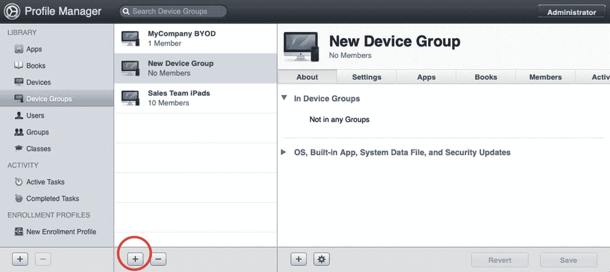

图 13-6
添加一个新的设备组

将此新组重命名为 `Design Team`，然后点击 `Save` 按钮应用名称更改。我们要做的第一件事是将占位符 Mac 记录分配给这个设备组。点击 `Design Team` 设备组以选中它，然后点击 `Members` 选项卡。点击页面右下角的 `+` 按钮，选择 `Add Devices`。在出现的对话框中，点击每个 Mac 占位符右侧的 `Add` 按钮，如图 13-7 所示。

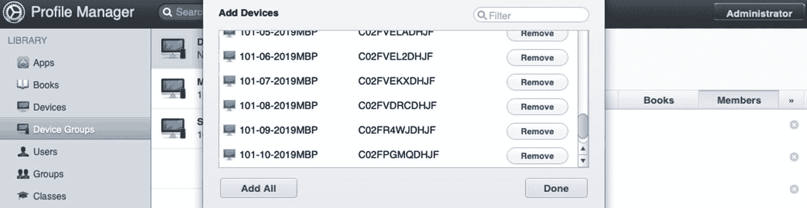

图 13-7
将十个 Mac 占位符添加到设计团队设备组中

将设备添加到组中后，点击 `Done` 按钮，然后点击 `Save` 按钮。我们现在已成功创建了设备组。

### 配置 MDM 注册

我们将从配置设备注册和设置助理设置开始。这里我们有一些 macOS 特有的选项。在设备组视图中，点击设计团队群组以选中它，然后点击设置选项卡。向下滚动到 `Enrollment Settings` 部分，其中列出了 `Enrollment during Setup Assistant`。勾选 `Prompt user to enroll device during Setup Assistant` 旁边的复选框。取消勾选要求注册凭证的选项，并确保 `Do not allow user to skip enrollment step` 已勾选。您的设置应如图 13-8 所示。

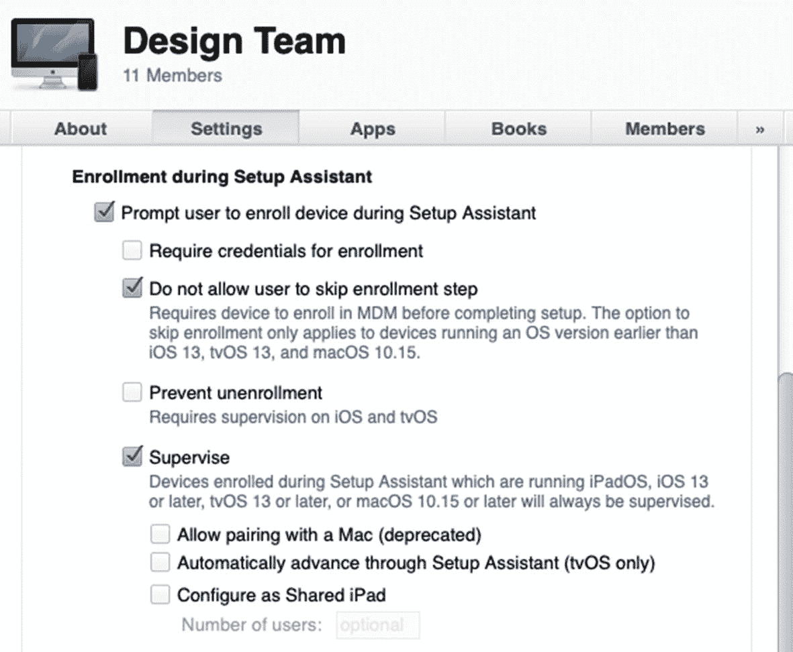

图 13-8
在设置助理期间配置 MDM 注册

继续向下滚动到 `Setup Assistant Options` 区域。我们只关注此处复选框的前两个部分和最后一个部分，因为这些是唯一适用于 `macOS` 的部分。这些是计算机在首次启动以及新最终用户的后续首次登录时，在设置助理期间会询问的提示。我们将选择禁止显示所有这些提示。`Uncheck` 此列表中的每个复选框。

继续向下滚动到 `macOS Primary Account Setup` 部分。因为我们使用 Active Directory 来管理用户账户，所以我们不会在机器上创建本地标准用户。如果我们不使用网络用户账户，我们可以将其配置为提示用户创建自己的用户名/密码。就我们的目的而言，我们将取消勾选 `Prompt user to create an account of type` 选项。

不过，我们确实希望在系统上自动创建一个本地 `macOS` 管理员账户。请填写字段，以使用所需密码生成一个本地管理员用户。您可以选择是否在“用户与群组”系统偏好设置中列出此账户。在此示例中，我将保留该框为 `checked` 状态。当您的设置看起来类似图 13-9 时，点击 `Save` 按钮以应用设置。

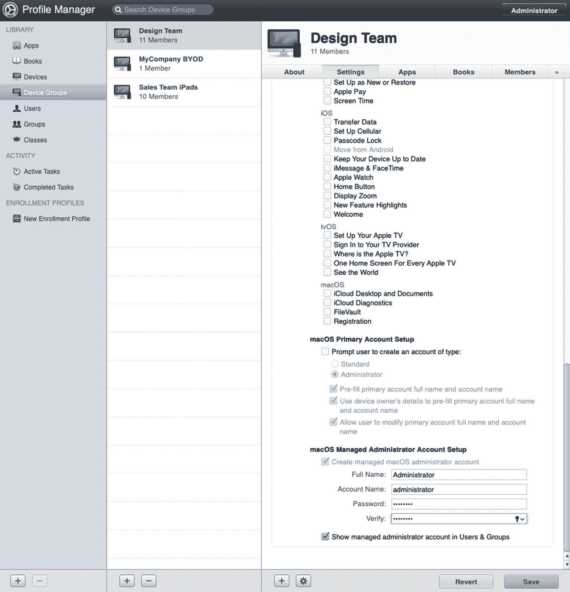

图 13-9
禁止所有设置助理提示并自动创建本地管理员账户

### 配置描述文件设置

Profile Manager 的最后一步是向我们 `Design Team Device Group` 的成员分配设置。选中“设计团队”分组后，点击 `Settings` 标签页，然后在 `Settings for Design Team` 标题下点击 `Edit` 按钮。这将打开我们的 `Configuration Profile` 窗口，用于分配限制和设置。

我们将在这里配置一些基本项，以符合我们 Windows 环境的观感。首先填写 `General` 有效负载部分，输入配置描述文件的名称和描述，并将 `Security` 设置为 `With Authorization` 并设置一个密码。

接下来，我们可以配置 `Passcode` 有效负载。将密码要求设置为最少八位字符的密码长度，并要求使用复杂字符，并设置登录尝试失败后的延迟时间，数值与本书前面多次使用过的类似。

接着，我们将设置一些仅适用于 `macOS` 的特定设置。第一个是 `Directory` 有效负载。点击 `Configure`，然后从 `Directory Type` 弹出菜单中选择 `Active Directory`。我们需要提供域控制器的 `FQDN` 或 `IP 地址`，以及一个域管理员账户的用户名和密码。对于 `Client ID`，我使用了变量 `%ComputerName%`，这样它就会使用我们分配给机器的名称，以匹配 AD 中现有的计算机记录。我们将把 `Organizational Unit` 留空，因为它应该基于现有记录加入到正确的 OU 中。你的 Directory 有效负载应类似于图 13-10。

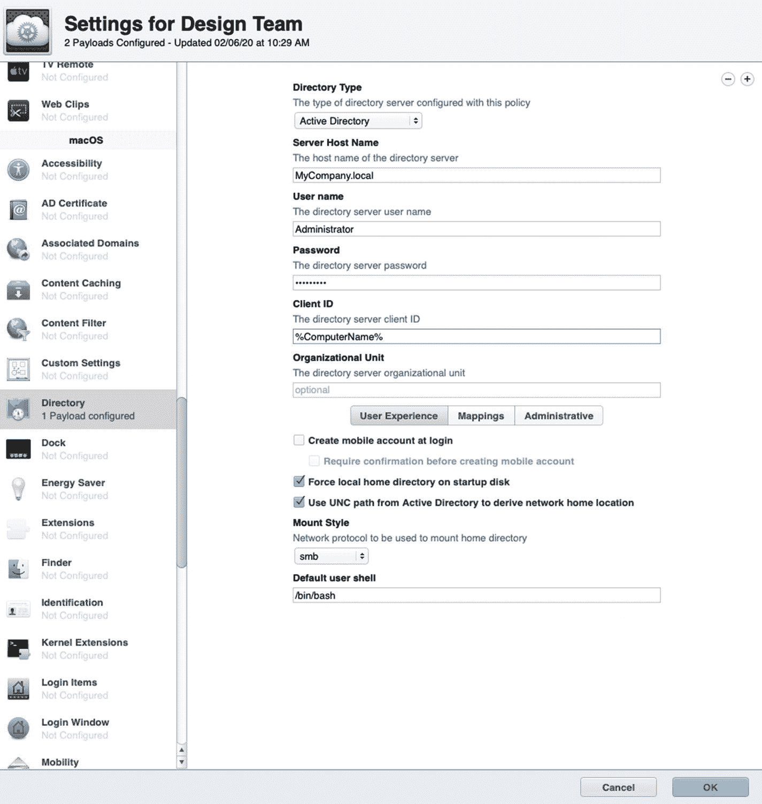

图 13-10

在 Directory 有效负载中定义 Active Directory 设置

接下来，我们将配置 `Login Items` 有效负载，以自动映射 `Main Office Shared` 网络驱动器。点击 `Configure` 按钮，如图 13-11 所示，将 SMB 共享添加到“已验证网络挂载”部分。

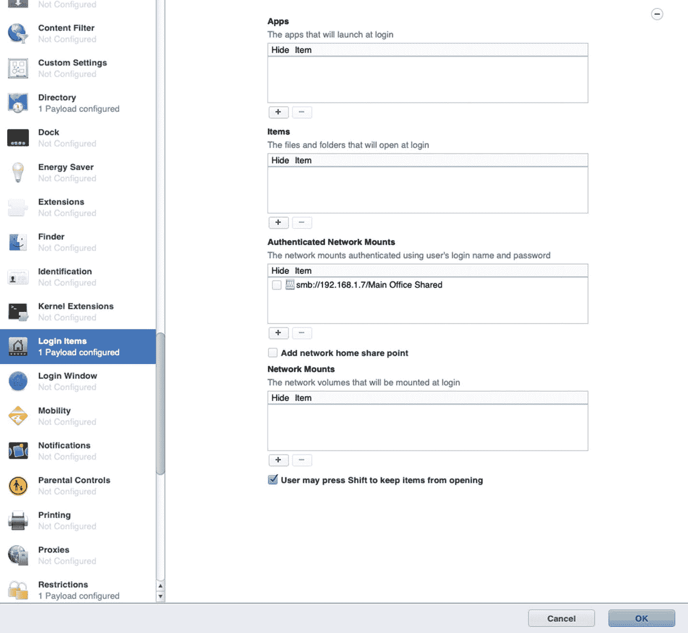

图 13-11

设置我们的主办公室共享驱动器在登录时挂载

接下来，我们将配置一些特定于 macOS 的 `restrictions`。请注意，此列表中有两组 `Restrictions` 有效负载。我们要选择 `macOS` 标题下的那一组。点击 `Configure`，首先开始限制对大部分“系统偏好设置”的访问。你的“偏好设置”标签页应与图 13-12 匹配。

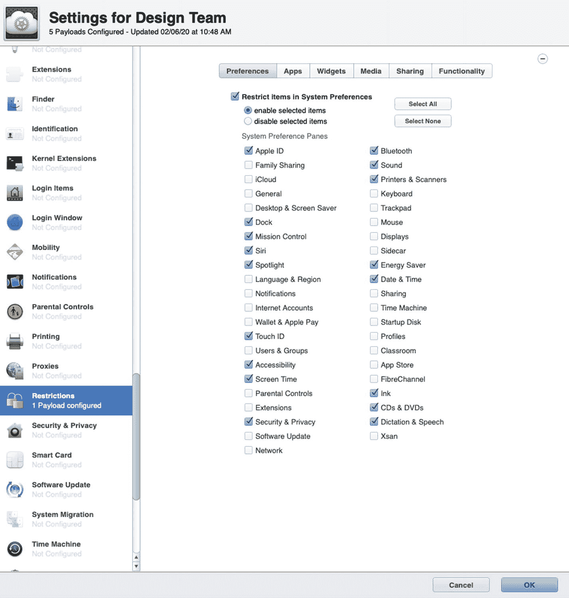

图 13-12

识别我们希望用户能够交互的系统偏好设置以及我们希望限制的那些

专业提示

请记住，这将限制机器所有用户对这些系统偏好设置的访问。如果您希望允许管理员禁用管理功能，请务必同时配置 `Login Window` 有效负载，并在 `Options` 标签页中启用此功能。

最后，我们将点击 `Functionality` 标签页。在这里，我们将勾选 `Lock desktop picture` 旁边的复选框，并为 `Desktop picture path` 提供指向 `Color Burst 1.jpg` 图像的路径，如图 13-13 所示。这将设置我们的壁纸，以与办公室里的其他人保持一致，并在 Mac 和 Windows 客户端之间设定一致的用户体验。

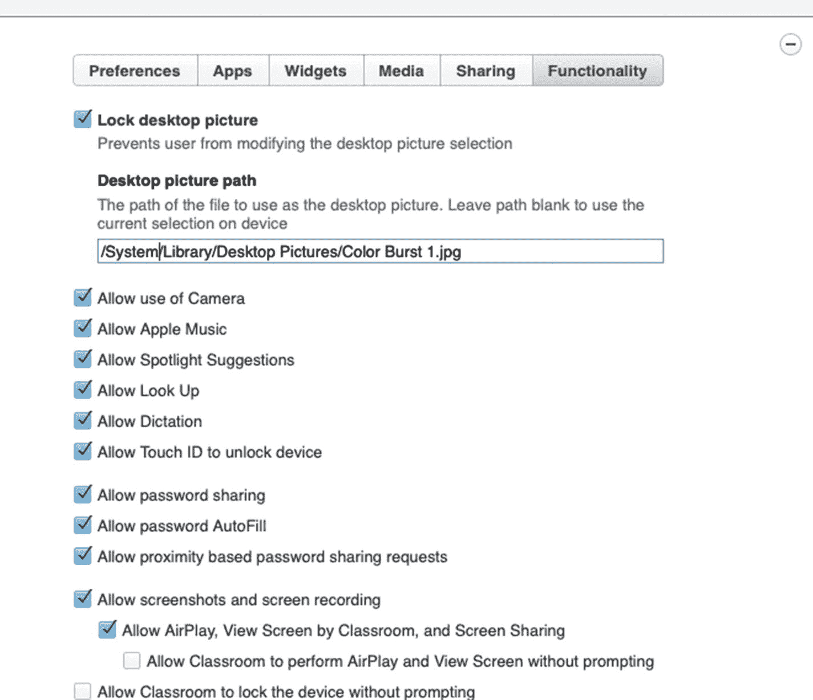

图 13-13

配置标准桌面壁纸的路径

专业提示

在 `macOS Catalina` 中，桌面图片目录的路径与操作系统旧版本不同。在旧版本中，路径是 `/Library/Desktop Pictures/`，而在 `Catalina` 中是 `/System/Library/Desktop Pictures/`。

完成所有这些更改后，点击 `OK` 按钮关闭配置描述文件编辑器，然后点击 `Save` 按钮。

## 配置应用程序

我们已基本准备好部署这些新 Mac。最后一步是指定将通过 Profile Manager 和 `Munki` 安装的应用程序。

### 分配 App Store 应用

既然我们在 Profile Manager 中，不妨也分配我们的 `Microsoft Office` 应用程序。像在前几章中一样，选择 `Design Team` 设备组，然后点击 `Apps` 标签页。点击页面底部的 `+` 按钮，调出可用应用程序库。点击 `All Kinds` 菜单并选择 `macOS`，以过滤掉 iOS 版本，如图 13-14 所示。

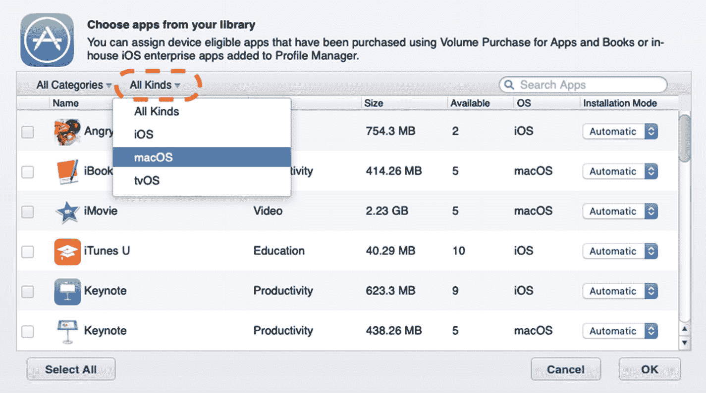

图 13-14

选择 macOS 以过滤掉与 macOS 不兼容的应用

将 `Microsoft Word`、`Excel`、`PowerPoint` 和 `Outlook` 的 `macOS` 版本分配给我们的设备组，并将默认的 `Installation Mode` 保持为 `Automatic`。点击 `OK` 分配应用程序，然后点击 `Save` 应用它们。

专业提示

如果你看到有关这些应用程序许可证不足的消息，随时可以返回 Apple 校园教务管理/Apple 商务管理门户的批量购买区域，获取额外的席位。

## 导入 Munki 软件包

我已下载 `Adobe Dreamweaver CC` 安装包和一份 `Atom` 副本，后者是一款业内常用的开发者工具。我将沿用第 10 章中的步骤，使用 `munkiimport` 命令将这两款软件添加到我们的 Munki 环境中。我会将两者都设置为无人值守安装/卸载，并都添加到 `testing` 目录中。

**专业提示**

如果你在本次练习中无法使用 `Adobe Dreamweaver`，这没关系。只需替换成任何其他应用程序即可。目的是通过 Munki 安装几个 App Store 中没有的应用程序。之所以使用 `Dreamweaver`，是因为它符合场景需求。

完成软件包导入后，打开 `MunkiAdmin` 并查看软件包列表。你的 `MunkiAdmin` 窗口应类似于图 13-15。

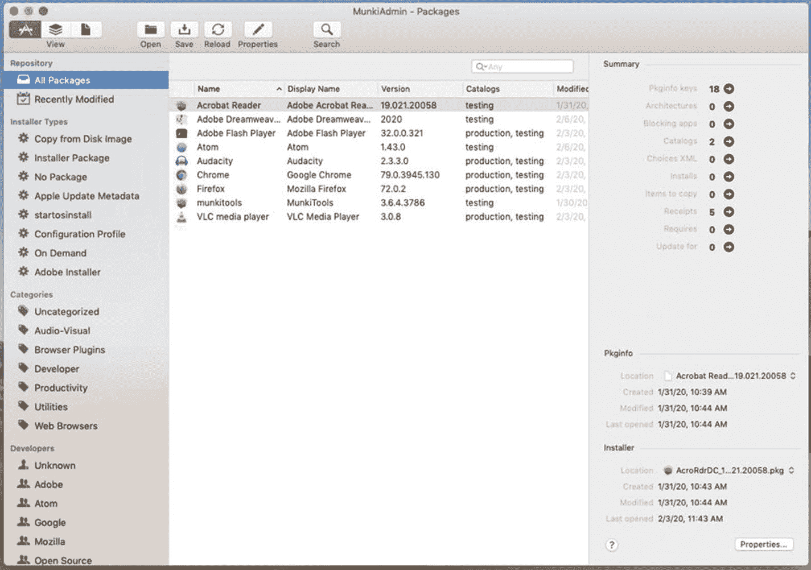

**图 13-15**
我们截至目前已导入的完整软件包列表

现在，你可以在其中一台测试机上测试新应用程序的安装。满意结果后，我们就可以将新软件包移入 `production` 目录，并将其添加到 `site_default` 清单中。如图 13-16 所示，在 `目录` 视图中，`勾选` `Adobe Dreamweaver CC` 和 `Atom` 旁边的`复选框`。然后`保存`并`重新加载` `MunkiAdmin` 控制台。

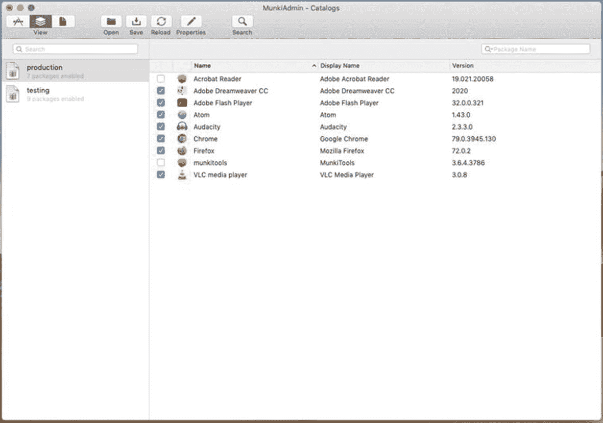

**图 13-16**
在 production 目录中启用 Dreamweaver 和 Atom

接下来，点击 `清单` 视图并选择我们的 `site_default` 清单。`双击`打开它。我们将通过添加 `Atom` 来修改 `托管安装`。点击 `+` 按钮并选择 `Atom`。完成后，你的 `托管安装` 标签页应如图 13-17 所示。

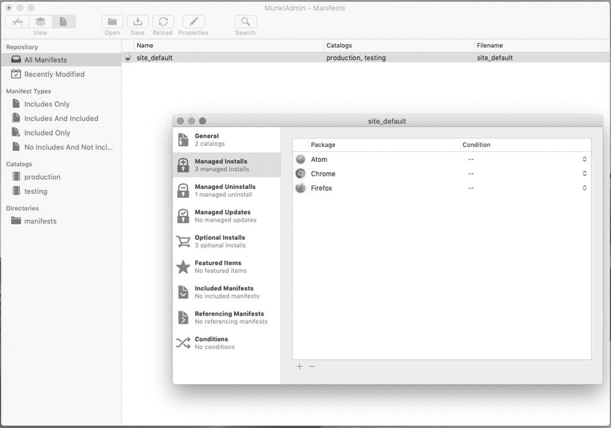

**图 13-17**
托管安装现在包含了 Atom 以及 Chrome 和 Firefox

点击 `可选安装` 标签页，将 `Adobe Dreamweaver CC` 添加到列表中。完成后，你的 `可选安装` 标签页应如图 13-18 所示。

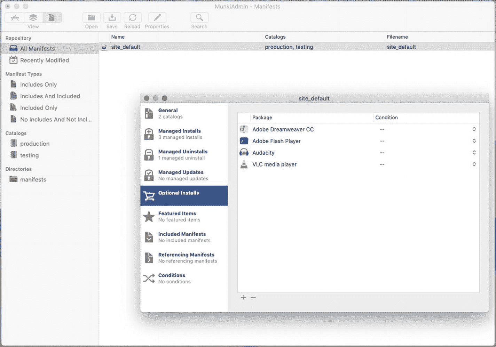

**图 13-18**
将 Adobe Dreamweaver CC 添加到 Optional Installs 列表

关闭 `site_default` 清单，点击 `保存` 和 `重新加载`。完成后，你可以关闭 `MunkiAdmin` 应用程序。我们的应用程序和设置现在已准备就绪。接下来，我们需要在一台新 Mac 上进行测试部署。

## 部署

我们的部署过程将包含两个阶段。第一阶段将涉及开箱硬件、在桌面上设置并启动它。当我们逐步完成 `设置助理` 时，我们的 Mac 将连接到 Apple 的 DEP 服务器，然后被重定向以注册到我们的 Profile Manager MDM。一旦它在 Profile Manager 中激活，我们将使用 MDM 管理命令启用 `Apple 远程桌面`。第二阶段将包括使用 ARD 安装 `Munki`，然后 `托管软件中心` 将完成安装清单中列出的所需应用程序。

### 激活与 MDM 注册

我将从启动 `101-01-2019MBP` 开始，这是我们的第一台新 Mac。我们将在这台机器上逐步完成部署，以确保所有配置都符合预期。开机后，它会提示我们选择语言、键盘设置以及无线网络设置。

连接到网络后，Mac 会向 DEP 签到，并提示我将设备注册到 MyCompany 的 MDM。经过大约 3-5 分钟的配置，系统会提示输入时区，然后会跳转到登录窗口，显示我的本地管理员账户和 `其他…` 按钮，用于登录域账户，如图 13-19 所示。

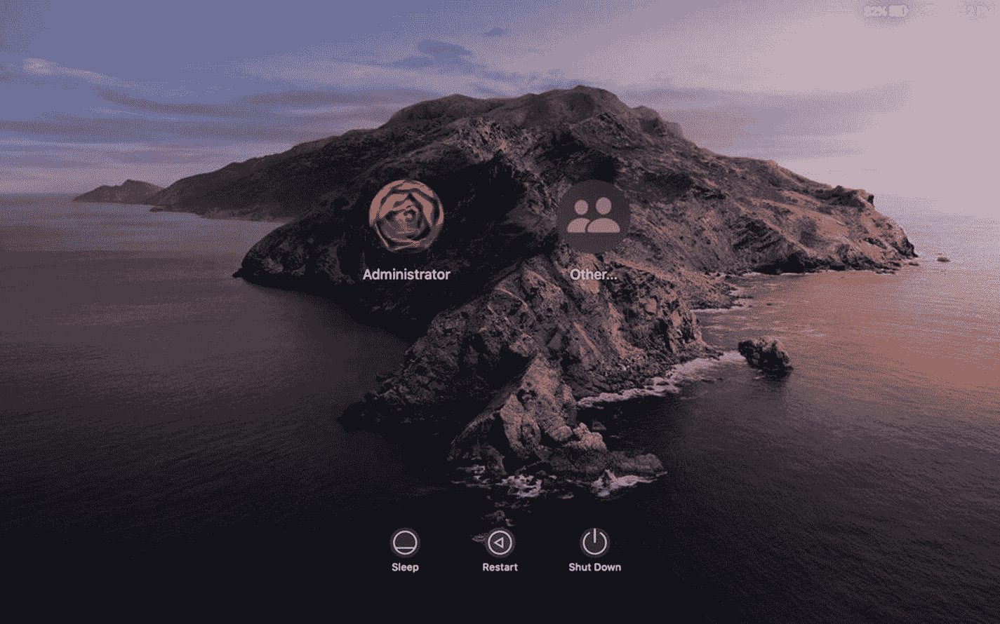

**图 13-19**
成功应用我们的设置后，登录窗口显示了用于以域用户身份登录的 `其他…` 按钮

### 启用 Apple 远程桌面

我们现在不登录。首先，我们需要完成安装 `MunkiTools` 和其他应用程序。如果我返回 Profile Manager 并查看我的系统，会发现它不再是设备列表中的一个占位符，而是一个实际的计算机记录。现在我们可以使用 MDM 管理工具与之交互了。在 Profile Manager 中，`点击`设备 `101-01-2019MBP` 以选中它，然后点击 `操作` 按钮显示管理工具弹出菜单。选择 `启用远程桌面`，如图 13-20 所示。

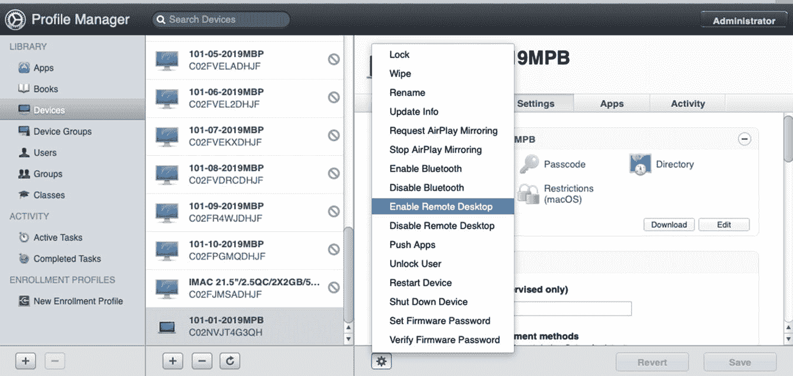

**图 13-20**
使用 Profile Manager 启用 Apple 远程桌面访问

`确认`你想要启用远程桌面。几分钟后，打开 `Apple 远程桌面`，使用 `扫描器` 搜索网络。你应该会找到一台名为 `101-01-2019MBP` 的机器，如图 13-21 所示。`拖放`找到的计算机记录到 `所有计算机` 组中，并使用 Profile Manager 为我们创建的本地管理员账户进行身份验证，以将该机器添加到我们的 ARD 控制台。

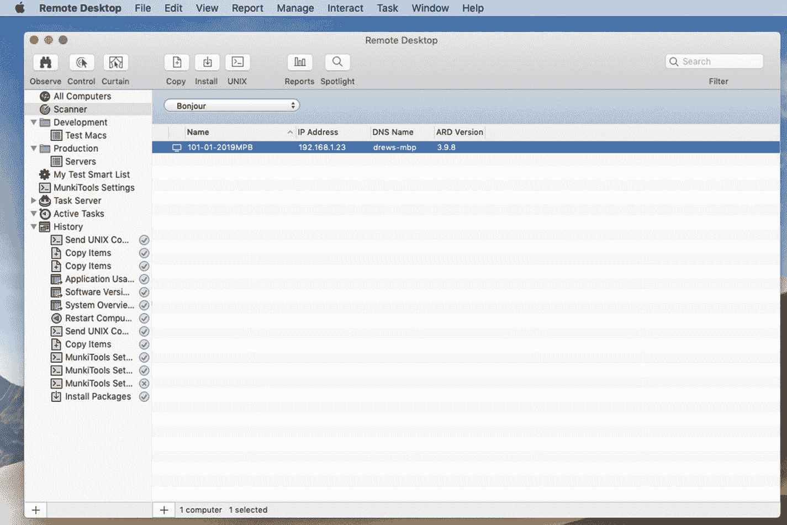

**图 13-21**
将新 Mac 添加到我们的 Apple 远程桌面控制台

### 安装 MunkiTools

接下来，我们将重复第 10 章中使用的相同步骤来安装和配置 `MunkiTools`。如果你保存了 `MunkiTools 设置` Unix 脚本，操作应该非常简单。如图 13-22 所示，在新计算机上安装 `MunkiTools.pkg` 并运行 Unix 脚本。这将把它配置为指向我们的 `munki_repo`，并将其分配到 `site_default` 清单。

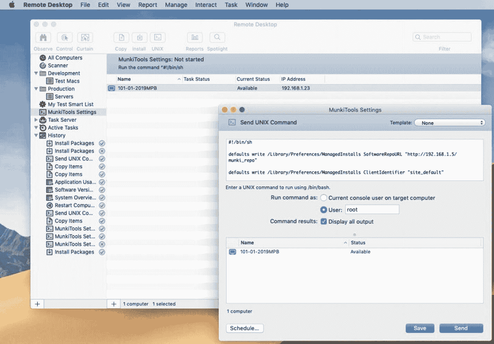

**图 13-22**
安装 MunkiTools.pkg 软件包，然后运行 Unix 脚本修改 ManagedInstalls.plist 以指向我们的 Munki 环境

完成后，重新启动计算机，我们就可以以最终用户身份登录，并看到该机器已准备就绪。

#### 最终用户登录

使用我们为新员工创建的测试用户账户之一，登录到测试 Mac。如图 13-23 所示，我们所有的应用程序、设置和网络服务都已准备就绪。

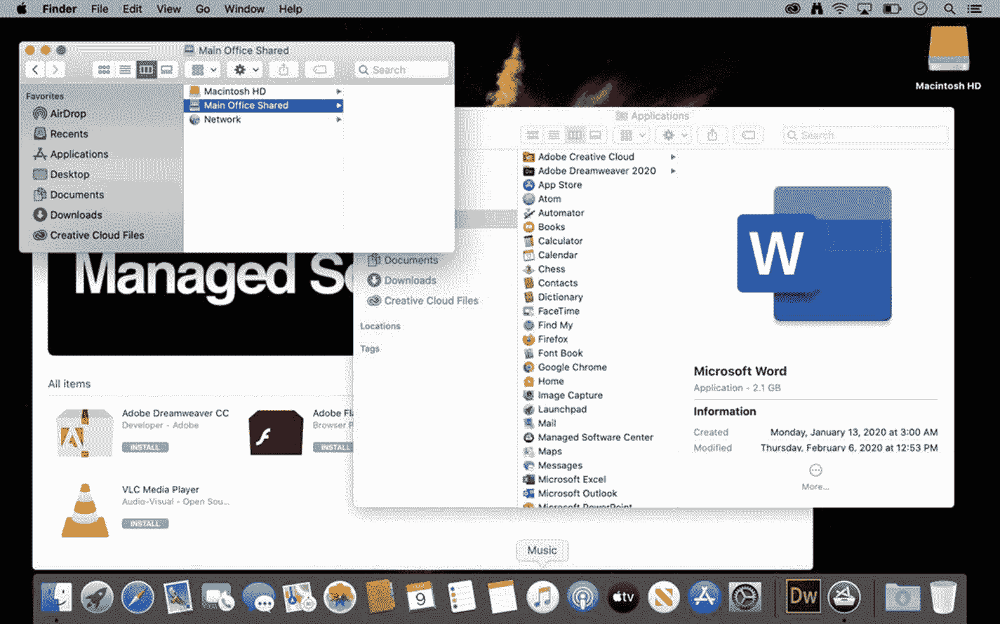

**图 13-23**
我们定制的最终用户体验，已安装所需应用程序并应用了设置。

*   使用 `Windows` 域用户账户登录按预期工作，并在首次登录时提示更改默认密码。
*   已安装 `Atom`，且 `Munki Managed Software Center` 显示了可用的其他应用程序。
*   `Microsoft Word`、`Excel`、`PowerPoint` 和 `Outlook` 均可在“应用程序”文件夹中找到。
*   壁纸已设置为我们的 `Color Burst 1.jpg` 选择。
*   系统偏好设置仅限于我们指定的部分。
*   用户可以浏览可用的 Windows 打印机并添加所需的打印机。
*   `Main Office Shared` 网络驱动器已挂载，并在 Finder 中可用。

**专业提示**
在 `Mojave` 和 `Catalina` 上，您可能需要通过 Finder 中的 `Network` 图标来浏览 `Main Office Shared` 驱动器。在 Finder 中选择时，它不应提示用户输入凭据，而是通过将 Mac 的 AD 凭据传递给 Windows 服务器来直接映射驱动器。

如果您发现某些功能未按预期工作，请返回 `Profile Manager` 并调整设置。每次进行更改并点击保存后，新设置会立即应用到测试机器上。一旦确认我们的部署按我们期望的方式工作，您就可以使用相同的两阶段过程来部署其他九台 Mac。

## 后续步骤

在本章中，我们演示了如何使用 `Munki`、`Profile Manager` 和现有的 `Microsoft` 企业解决方案，来为添加到办公环境中的新 `macOS` 客户端进行配置。虽然这只是对一些最重要功能的有效演示，但在您规划 Macintosh 支持策略时，还有许多其他选项值得探索。我鼓励您进行探索、实验，并参与在线的 Apple 系统管理员社区。

本书为您在管理 Apple 硬件的现代化部署方面打下了坚实的基础。Apple 的平台随着每个版本的发布而不断变化和发展。我强烈建议您加入 Apple 开发者社区，即使只是为了每年夏天都能获取 `macOS` 和 `iOS` 的预览版和测试版。每个新的迭代都会带来新的挑战和机遇，并且通常您将被迫跟上步伐，因为新的硬件将需要新的操作系统。

