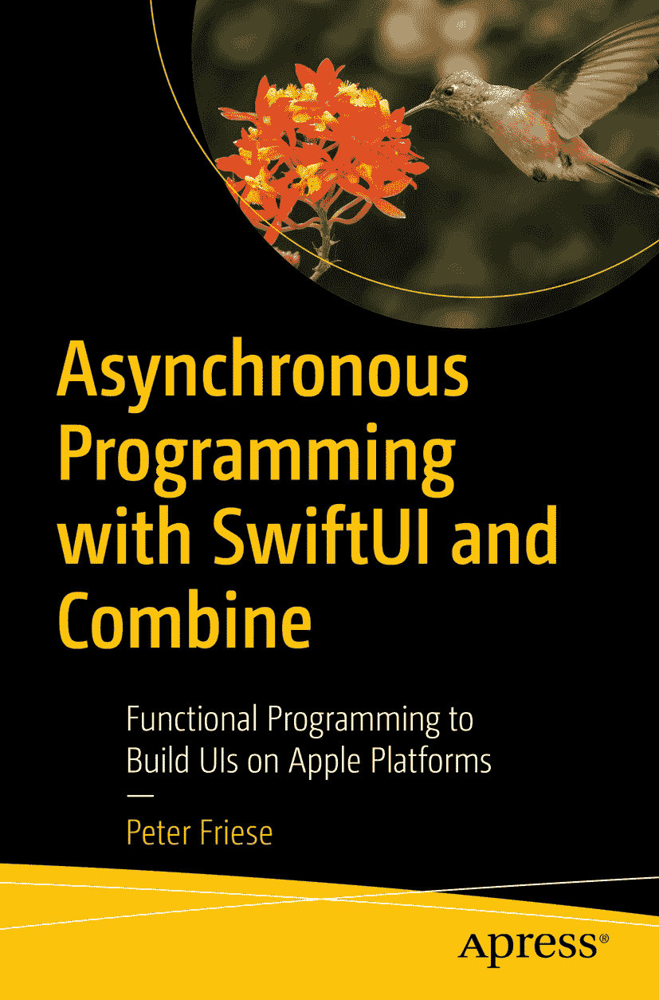

+   [SwiftUI 和 Combine 异步编程](README.md)
+   
+   [本书目标](asynchronous-programming-with-swiftui-and-combine_02.md)
+   [第一部分](asynchronous-programming-with-swiftui-and-combine_03.md)
+   [1. SwiftUI：新的开端](asynchronous-programming-with-swiftui-and-combine_04.md)
+   [2. 初识 SwiftUI](asynchronous-programming-with-swiftui-and-combine_05.md)
+   [3. SwiftUI 构建块](asynchronous-programming-with-swiftui-and-combine_06.md)
+   [4. 状态管理](asynchronous-programming-with-swiftui-and-combine_07.md)
+   [5. 在列表中显示数据](asynchronous-programming-with-swiftui-and-combine_08.md)
+   [6. 构建输入表单](asynchronous-programming-with-swiftui-and-combine_09.md)
+   [排版后的文档](asynchronous-programming-with-swiftui-and-combine_10.md)
+   [第二部分](asynchronous-programming-with-swiftui-and-combine_11.md)
+   [7. 初识 Combine](asynchronous-programming-with-swiftui-and-combine_12.md)
+   [8. 使用 Combine 驱动 UI 状态](asynchronous-programming-with-swiftui-and-combine_13.md)
+   [使用 Combine 进行网络请求](asynchronous-programming-with-swiftui-and-combine_14.md)
+   [10. Combine 中的错误处理](asynchronous-programming-with-swiftui-and-combine_15.md)
+   [11. 实现自定义 Combine 运算符](asynchronous-programming-with-swiftui-and-combine_16.md)
+   [12. 在 Combine 中封装现有 API](asynchronous-programming-with-swiftui-and-combine_17.md)
+   [13. Combine 调度器与 SwiftUI](asynchronous-programming-with-swiftui-and-combine_18.md)
+   [第三部分](asynchronous-programming-with-swiftui-and-combine_19.md)
+   [14. 开始使用 async/await](asynchronous-programming-with-swiftui-and-combine_20.md)
+   [15. 在 SwiftUI 中使用 `async/await`](asynchronous-programming-with-swiftui-and-combine_21.md)
+   [排版后的文档](asynchronous-programming-with-swiftui-and-combine_22.md)
+   [16. 融会贯通：SwiftUI、async/await 和 Combine](asynchronous-programming-with-swiftui-and-combine_23.md)