# 1. SwiftUI：新的开端

每年在全球开发者大会 (WWDC) 上，Apple 都会为其平台和操作系统推出新功能和新特性。这场盛会备受期待，因为这意味着开发者们终于能够亲身体验 Apple 工程师在过去一年里一直致力于开发的新 API 和框架，并将它们整合到自己的应用中。

为了让开发者能够利用这些新功能，Apple 提供了新的 API、用于使用它们的 SDK，以及通常是新的工具，例如 Xcode。

虽然 Apple 多年来在 WWDC 上推出的所有这些新功能都令人兴奋、有时甚至令人叹为观止，但有时他们也会发布具有非凡重要性的更新。

> 每隔一段时间，就会有一款革命性的产品出现，改变一切。
>
> —史蒂夫·乔布斯，2007 年

显然，2007 年第一代 iPhone 的发布就是这样一个时刻。

2014 年 Swift 编程语言的发布是另一个重要时刻。Swift 使软件开发变得比以往任何时候都更加容易和易于上手，对于可能被 Objective-C 及其相当特殊的语法和类似 Smalltalk 的调用语义所吓跑的开发者来说尤其如此。可以毫不夸张地说，Swift 和 Swift Playgrounds 为 Apple 平台带来的开发者数量比以往任何时期都多。Swift Playgrounds——一个旨在探索性和趣味性地与 Swift 互动的交互式编程环境——使 Swift 成为任何希望以低门槛探索和学习编程的人的绝佳语言。Swift 和 Swift Playgrounds 让软件开发变得大众化。这一大胆举措的成果每年在 WWDC 上都清晰可见，当 Tim Cook 登台宣布 App Store 上有多少应用以及其中使用 Swift 的百分比时。在 WWDC 2021 上，Susan Prescott（开发者关系副总裁）透露，“App Store 上排名前 1000 的应用中，大多数都是使用 Swift 构建的。”^(⁵)

2019 年 SwiftUI 的发布是又一个这样的时刻。当 Josh Shaffer 走上舞台宣布 SwiftUI 时，^(⁶) 人们为其易用性以及从零开始构建 UI 的速度之快感到震惊。但同样，可能更重要的是，人们对 SwiftUI 包含了一种管理应用程序状态的原生方式感到兴奋——这通常是出了名的复杂。Apple 甚至更进一步，实现了他们自己版本的 RxSwift：Combine——一个以“应用程序可被视为随时间转换事件的软件”这一思想为核心的功能响应式框架。

为了更好地理解这一切意味着什么，以及为什么 Apple 选择实现一个新的 UI 工具包，让我们深入探讨一下。


## 为什么需要一个新的 UI 框架？

你可能会问，既然已经有了 `UIKit` 和 `AppKit`，为什么还要实现一个新的 UI 工具包？你有这种疑问情有可原。毕竟，实现一个 UI 工具包绝非易事，更不用说将其打磨到生产级品质、发布并让整个应用开发者社区采用它了。

以下是可能影响苹果做出这一决定的一些驱动因素。

首先也是最重要的一点，我们必须承认苹果将 `SwiftUI` 定位为一个跨平台 UI 工具包。`SwiftUI` 登陆页面上的介绍特别提到：“`SwiftUI` 借助 `Swift` 的强大能力，帮助你用极少的代码，在所有苹果平台上构建出外观精美的应用。你只需使用一套工具和 API，就能在任意苹果设备上为每个人带来更好的体验。” 苹果现在拥有不少于五个面向消费者的平台（`iOS`、`iPadOS`、`watchOS`、`tvOS` 和 `macOS`），任何尝试过确保跨平台功能一致性的人都会告诉你，对于开发者来说，支持多个平台正变得越来越繁重。通过提供一种统一的方式来思考并为尽可能多的这些平台构建 UI，苹果正在减轻开发者的这一负担。但需要指出的是，`SwiftUI` 并不试图适应“一次编写，到处运行”的模式——相反，它确实包含平台特定的部分。但学习一个 UI 工具包并在所有平台上使用它，要比为每个单独的平台学习一套新范式容易得多。

其次，`SwiftUI` 与苹果帮助开发者编写更优质软件、减少 App Store 中应用潜在 bug 数量的投入方向一致。bug 更少的应用往往在 App Store 上获得更高的评分——从而带来更高的收入。`Swift` 语言包含许多有助于编写无 bug 软件的特性。其语言设计者和编译器工程师一直在努力消除潜在的 bug 成因，例如：

- 空指针解引用
- 类型不匹配
- 不完整的决策树
- ……以及更多

`SwiftUI` 有两个主要属性有助于提升软件质量：

1.  它内置了状态管理，这是 UI 开发中一个出了名具有挑战性的方面。`SwiftUI` 的状态管理使得构建能够始终反映应用状态的 UI 变得更容易——即使跨多个屏幕也是如此。
2.  它围绕一种领域特定语言（`DSL`）构建，使得描述 UI 更加容易，消除了因错误实例化和构建 UI 结构可能导致的任何问题，并使编写和理解 UI 变得更加简单。

最后，`SwiftUI` 让软件开发变得更加平易近人。我们看到越来越多的 Web 开发者和设计师开始使用 `SwiftUI` 构建 UI，这并非没有原因。用 `SwiftUI` 拼凑出一个可用的原型变得越来越可行，这有助于改善 UI 设计师和开发者之间的协作。Xcode 为 `SwiftUI` 提供的预览画布极大地缩短了周转时间，为开发者和设计师提供了对他们所做更改的即时反馈。这种即时反馈使得更多学生和初学者能够开始进行应用开发，并在几分钟内取得成果，而不是需要花费数小时甚至数天。

## SwiftUI 原则

在我们迈出 `SwiftUI` 的第一步之前，值得先看看它的一些关键特性。

### 声明式 vs. 命令式

传统上，开发者构建 UI 主要有两种方式：

1.  使用可视化工具（例如 Interface Builder）布局 UI 元素，然后将应用的代码连接到 UI 元素
2.  以编程方式布局 UI 元素

在过去几年中，越来越多的 UI 工具包遵循声明式方法来构建 UI。这些工具包利用所谓的内部或外部领域特定语言（`DSL`）让开发者指定 UI 的结构。此类工具包的例子有 `Angular`、`React` 和 `JetPack Compose`。

在命令式世界中，你需要自己实现所有内容：布局、行为、数据绑定。相比之下，声明式方法允许你简单地告诉框架你想要做什么，它会为你处理具体的实现细节。这有点类似于自己做饭（命令式）与去餐厅点餐，然后获得一盘精心烹制的菜肴（声明式）。

### 状态管理

管理状态是编写应用程序时的主要挑战之一。当你的应用只有一个屏幕时，这相当简单，但随着屏幕数量的增加，保持 UI 的所有部分和底层数据模型同步的复杂性也随之增加。

在与后端共享数据并通过互联网同步数据的应用中，这变得更加具有挑战性。更不用说在编写需要确保同时处理同一份数据（例如，`Google Docs` 中的共享文档，或待办事项列表应用中的任务列表）的所有用户的数据都是最新且同步的多用户应用时，你将面临的挑战了。

可能我们所有人都使用过这样的应用：尽管你在详情对话框中更新了地址，但购物车中并未反映地址的变更。真是令人抓狂！

数据绑定在苹果平台上并非一个全新的概念——`macOS` 上的 `Cocoa Bindings` 已经存在多年，为开发者提供了在 UI 元素和底层数据模型之间映射数据的基本工具。尽管开发者一直呼吁为 `iOS` 提供数据绑定框架，但苹果至今从未提供过。开发者只好自谋出路，提出自己的原生解决方案，没过多久社区就涌现出了 `iOS` 特定的函数式响应式框架实现，例如 `RxSwift` 或 `ReactiveSwift`。

通过 `SwiftUI`，苹果终于承认了需要一个原生框架来保持数据模型和 UI 的同步。`SwiftUI` 提供了许多工具来帮助你构建能够始终反映模型状态、并在整个应用中保持同步的 UI。

最重要的是，`SwiftUI` 可以与苹果自己的响应式框架实现 `Combine` 很好地结合，使得将应用中的数据流表达为一系列随时间变化的事件成为可能，这些事件通过业务规则和逻辑运算符进行转换，以满足应用的需求。

### 组合优于继承

与 `UIKit` 和许多其他 UI 框架不同，`SwiftUI` 鼓励开发者通过将许多小 UI 组件拼凑在一起来组合他们的 UI。从 `UIKit` 转向 `SwiftUI` 的开发者会发现这相当令人惊讶，因为他们之前学到的做法是尽量减少 UI 元素的数量——尤其是在滚动视图（如 `UITableView` 或 `UICollectionView`）中，以优化应用的性能。

这样做的原因是 `SwiftUI` 是一个用于描述 UI 外观的 `DSL`，而不是规定构成它的 UI 原语。`SwiftUI` 团队从一开始就鼓励开发者大量使用视图来组合他们的 UI——在 `WWDC 2019` 舞台上首次公开演示 `SwiftUI` 时，SwiftUI 工程师 Jacob Xiao 就说道：“在 SwiftUI 中，视图非常轻量级，所以你不用担心为了更好封装或分离逻辑而创建额外的视图。”


### 一切皆是视图——但并非如此

一旦你开始用 SwiftUI 构建用户界面，你会很快注意到所有 UI 元素都被称为 `View`——甚至一个屏幕也被视为一个 `View`！人们很容易认为所有这些视图都等同于 `UIView`（或其相应的子类）。事实上，SwiftUI 可能会选择使用 `UIView` 的某个子类来渲染你 UI 的某些部分。但值得注意的是，当 SwiftUI 谈论 `View` 时，它并非指屏幕上 UI 元素的特定实例，而是指对该元素的*描述*。

实际上，如果 SwiftUI 团队决定说“一切皆是视图描述”，可能会更容易理解——当然，这样就不那么朗朗上口了。

### UI 是状态的一种函数

构建 UI 时最大的挑战之一，是确保 UI 始终反映底层数据模型的状态。过去，开发者必须使用各种工具和机制来确保模型的任何变化都能反映到 UI 中，反之亦然。针对这一挑战，人们设计出了多种架构模式：MVC（模型-视图-控制器）、MVVM（模型-视图-视图模型）、MVP（模型-视图-展示器）、VIPER（视图-交互器-展示器-实体-路由）等。而 SwiftUI 则决定将状态管理直接内置到框架中。在 SwiftUI 中，UI 是模型状态的一种函数。这一点值得牢记。

*在 SwiftUI 中，UI 是模型状态的一种函数*

要更新 UI，你不再需要直接操作单个 UI 组件。相反，你将 UI 元素绑定到底层模型。每次更改模型上的属性时，SwiftUI 都会刷新绑定到该属性的 UI 元素，确保 UI 和模型始终同步。

这也意味着，意外忘记更新 UI 的某些部分变得非常困难：所有绑定到底层模型的 UI 部分都会由 SwiftUI 自动为你更新。

## SwiftUI 快速入门

为了更好地理解 SwiftUI 及其工作原理，让我们构建一个传统的“Hello World”示例应用。但这一次，我们不只是显示“Hello World”，而是利用 SwiftUI 内置的状态管理功能，按你的名字来打招呼。

通过这个简短教程，你将学会如何：

- 在 Xcode 中创建一个新的 SwiftUI 项目
- 使用代码编辑器和`属性`检查器，对 UI 进行双向更改
- 使用 SwiftUI 的简单状态管理功能，确保 UI 和模型保持同步

### 先决条件

要学习本教程（以及本书中的所有其他教程），你需要满足以下条件：

- 最新版本的 Xcode（14 或更高版本）
- 一台运行 macOS Monterey 的 Mac 电脑

### 创建一个新的 SwiftUI 应用

1. 启动 Xcode，点击*创建新的 Xcode 项目*。

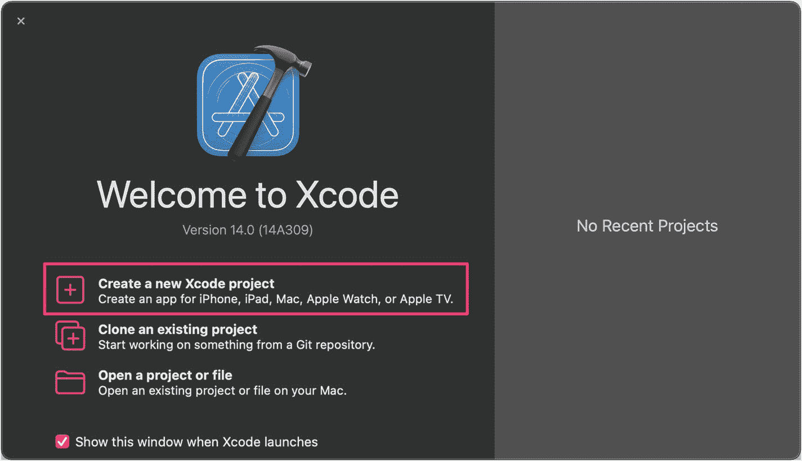

*图 1-1. 在 Xcode 中创建新项目*

2. 确保选择了`iOS`部分，然后选择`App`模板。

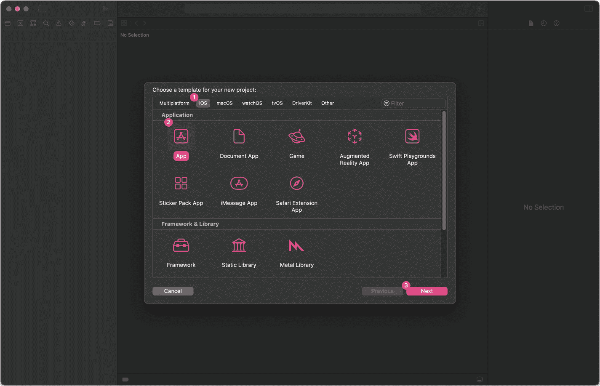

*图 1-2. 选择 iOS App 模板*

3. 为你的项目提供一个名称（我选择了`Hello SwiftUI`），并确保设置了以下选项：
   - 界面：`SwiftUI`
   - 生命周期：`SwiftUI App`
   - 语言：`Swift`

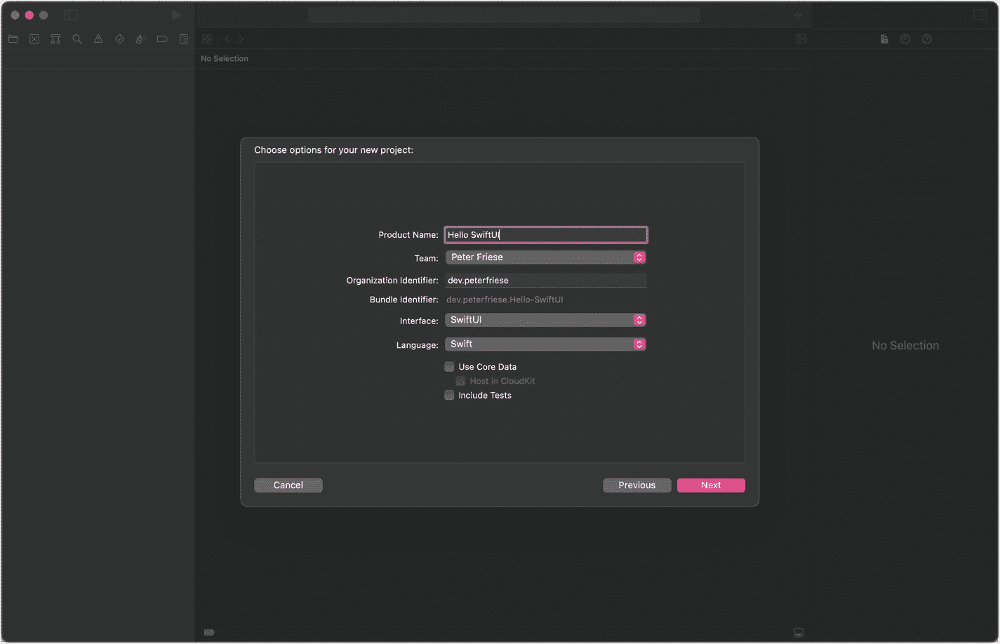

*图 1-3. 设置项目名称和其他项目选项*

目前，你可以保持*包含测试*选项未被选中。

4. 点击“下一步”，选择保存项目的位置。你可以保留*在我的 Mac 上创建 Git 仓库*选项，如果愿意也可以取消勾选。

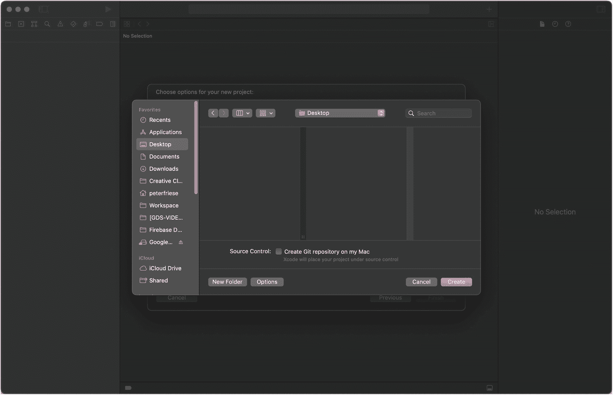

*图 1-4. 选择保存项目的文件夹*

Xcode 将为你创建项目，之后你会进入 `ContentView.swift` 的编辑界面：

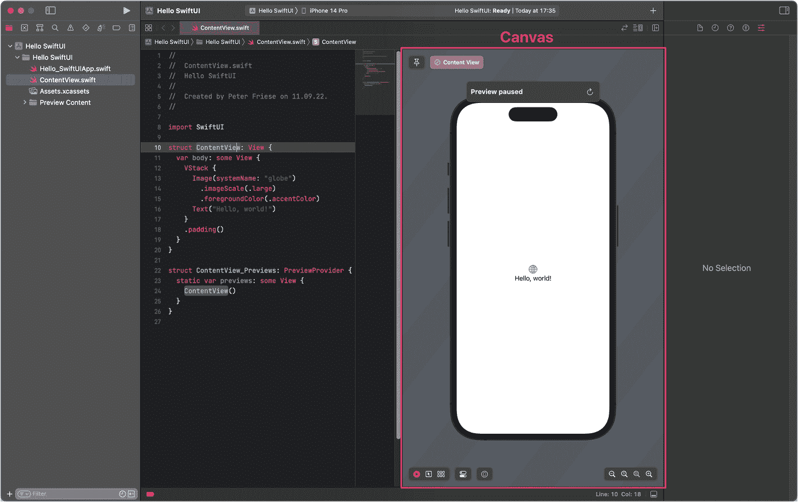

*图 1-5. Xcode 源代码编辑器和预览画布*

在编辑器的右侧，你会看到`画布`，它会显示你的 UI 预览。如果它显示“预览已暂停”的消息，请点击“恢复”按钮或按下 `Option + Command + P`。片刻之后，你将看到 UI 的预览：

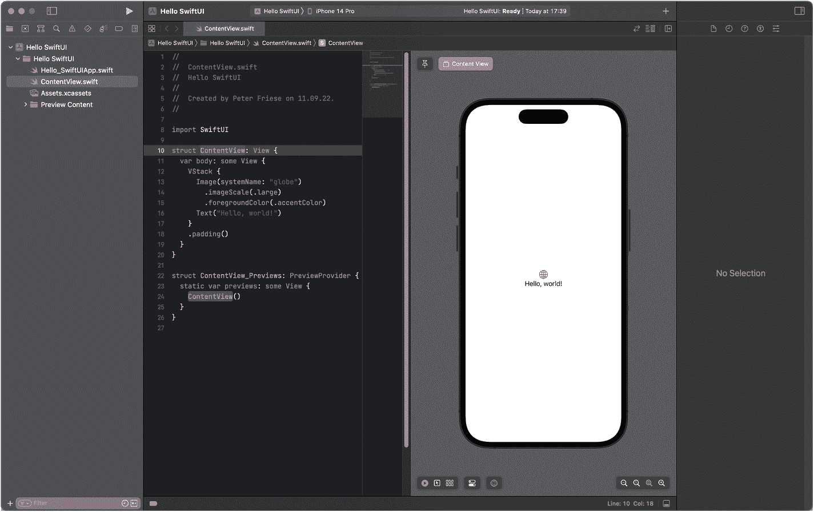

*图 1-6. Xcode 编辑器和 UI 预览*

让我们做一些更改，感受一下 SwiftUI 的双向工具：

- 在代码编辑器中，将问候语文本中的 world 改为你的名字。例如，对我来说，`"Hello, world!"` 就变成了 `"Hello Peter!"`。
- 观察一下，你每输入一个字符，预览都会立即更新——无需编译并重新在手机或模拟器上启动应用。

现在我们来改变文本的外观：

- 确保光标仍在第 16 行（即 `Text("Hello, (你的名字)")` 这一行）。
- 在`属性`检查器（Xcode 窗口的右侧）中，打开`颜色`下拉菜单，选择一种不同的颜色。
- 观察一下，当你做出更改时，Xcode 会立即在预览画布和代码编辑器中反映出这一变化。

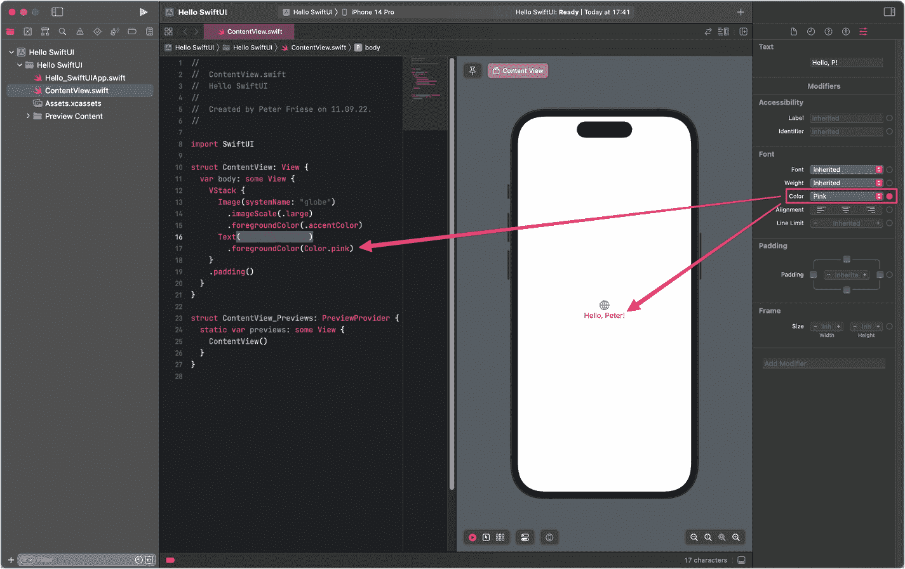

*图 1-7. 更新后的文本颜色同时反映在编辑器和预览画布中*


在继续之前，我们再做一个修改：

- 在源代码编辑器中，按住 `Command` 键并点击 `Text` 视图。
- 在弹出的菜单中选择*显示 SwiftUI 检查器*。
- Xcode 会在弹出窗口中显示检查器。
- 将字体从*继承*更改为*标题*。
- 观察 Xcode 如何同步更新源代码和预览。

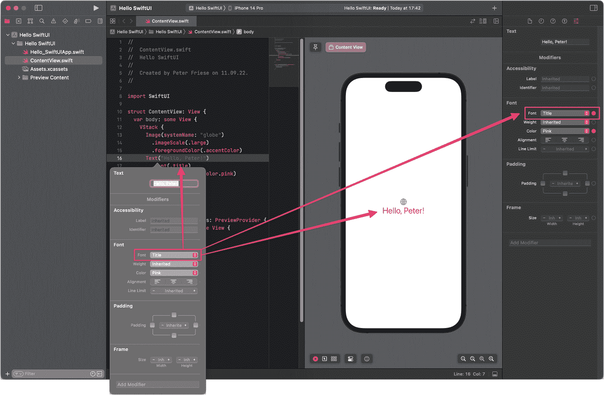

**图 1-8** — 使用 SwiftUI 检查器更新字体

恭喜，你刚刚体验了 Xcode 为 SwiftUI 提供的双向编辑工具！请注意，你可以随时使用其中任何一种工具。SwiftUI 检查器是探索 SwiftUI 视图属性和功能的绝佳工具。一旦你更加熟悉各个 SwiftUI 视图后，你可能会发现使用源代码编辑器及其代码补全功能直接修改视图会更高效。

你对 `Text` 视图所做的修改称为*视图修饰符*，我们将在第 3 章中更深入地讨论它们。

### 为你的 App 添加交互

现在，让我们为你的 App 添加一些交互——并在此过程中学习如何使用*Xcode 资源库*！

- 确保你仍然在源代码编辑器中，并且预览窗格仍然可见。
- 通过点击带有鼠标指针图标的小按钮，使画布中的元素可被选中。

  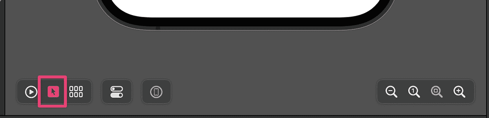

  **图 1-9** — 使画布上的元素可被选中

- 点击 Xcode 工具栏（预览窗格正上方）中的 *+* 图标，或按下 `Command+Shift+L` 以打开*资源库*窗口。
- 确保选中了*视图库*（最左侧的图标）。

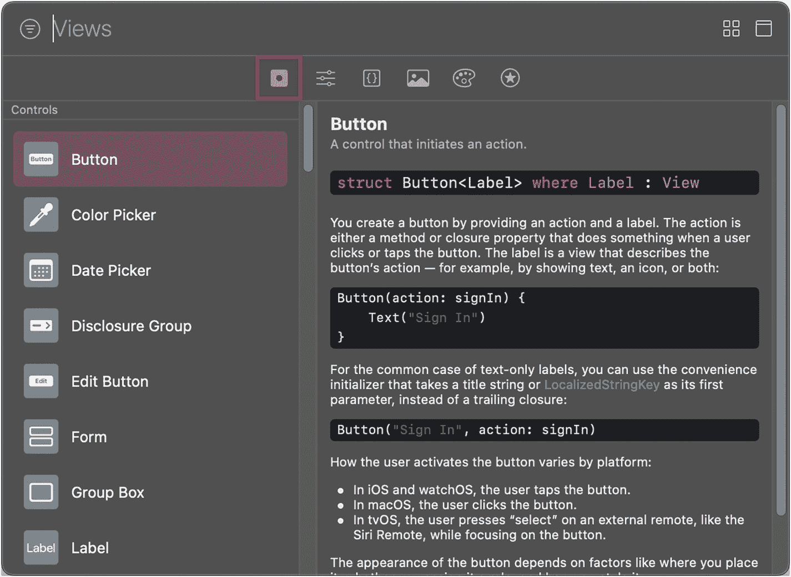

**图 1-10** — *视图库*

- 找到*Button*视图，将其从资源库拖拽到预览画布中，放在 *Hello, (你的名字)* 文本正下方。
- 注意观察，当你在预览画布上拖拽按钮视图时，Xcode 会高亮显示放置位置。

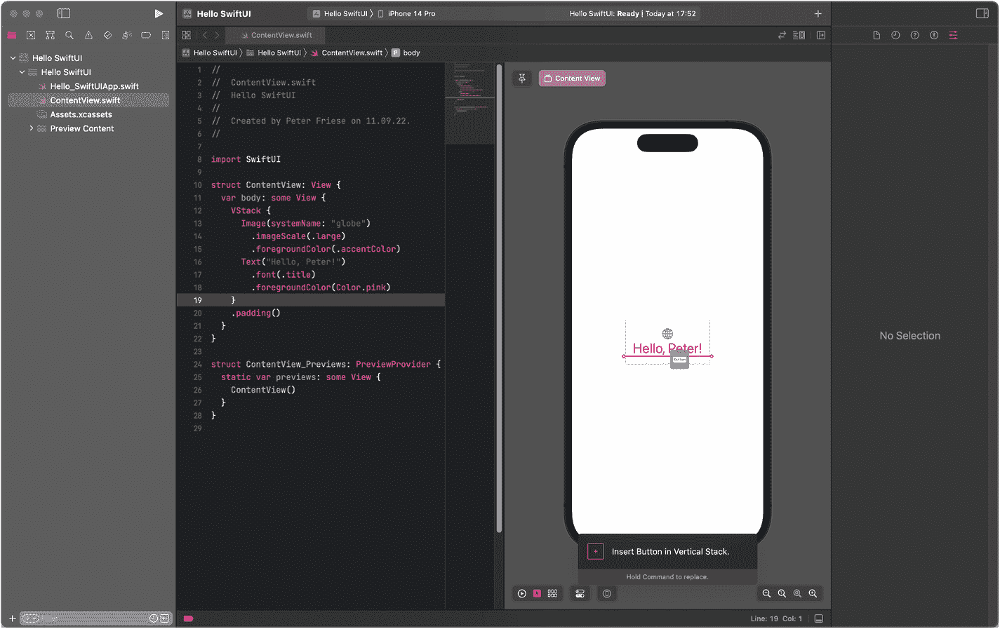

**图 1-11** — 在预览画布上，将按钮拖拽到文本视图下方

当你将 Button 放入代码编辑器后，Xcode 会自动更新源代码——现在看起来应该是这样：

```
struct ContentView: View {
var body: some View {
VStack {
Image(systemName: "globe")
.imageScale(.large)
.foregroundColor(.accentColor)
Text("Hello, Peter!")
.font(.title)
.foregroundColor(Color.pink)
Button("Button") {
Action
}
}
.padding()
}
}
```

注意，`Action` 和 `Content` 的颜色略有不同——这表明这两段文本是*编辑器占位符*。你可以通过按键盘上的 *Tab* 键在这些占位符之间导航。

- 点击 `Action` 占位符，然后按 *Enter* 键，将其替换为以下文本：`{ print("Hello") }`。
- 点击 `Content` 占位符（或按 *Tab* 键），将其替换为以下文本：`Text("Tap me")`。

此时，你的 `ContentView` 的源代码应该看起来像这样：

```
struct ContentView: View {
var body: some View {
VStack {
Image(systemName: "globe")
.imageScale(.large)
.foregroundColor(.accentColor)
Text("Hello, Peter!")
.font(.title)
.foregroundColor(Color.pink)
Button("Tap me") {
print("Hello")
}
}
.padding()
}
}
}
```

要实际查看你到目前为止的工作成果，我们需要在模拟器上运行该 App：^(¹⁶)

- 展开 Xcode 工具栏中的目标菜单（或按下 `CTRL + Shift + 0`），然后选择一个 iOS 模拟器。
- 点击*运行*按钮（或按下 `CMD+R`）。
- 打开*调试控制台*（*视图* ➤ *调试区域* ➤ *激活控制台*，或按下 `Command+Shift+C` 键）。
- 当 App 在模拟器中启动后，点击 *Tap me* 按钮。
- 你应该会在调试输出中看到文本 *“Hello”*。

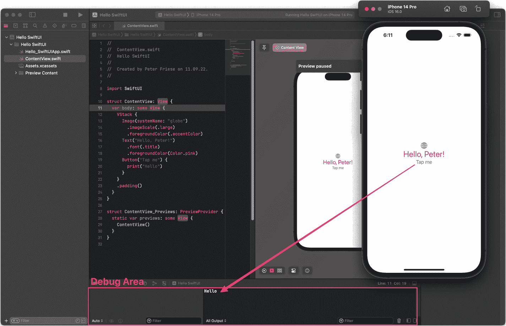

**图 1-12** — App 在模拟器上运行，调试控制台中显示输出


好的，作为一名高级文档工程师和翻译员，我将严格遵循您的注意事项和示例，将以下英文文本翻译成中文。


### 使用 SwiftUI 的状态管理保持 UI 与模型同步

为了激发你对 SwiftUI 的更多兴趣，作为本章的最后一步，让我们利用 SwiftUI 的状态管理，在用户输入姓名时更新问候语。

这是我们想要实现的 UI。

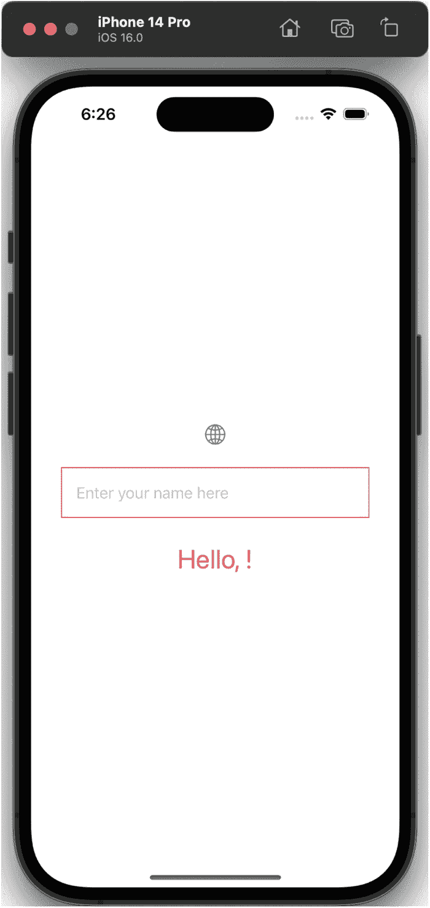

一个手机屏幕显示了一个圆形标志和一个带有“在此输入你的名字”文本的矩形框。其下方显示了“你好,”文本。顶部有时间、网络和 Wi-Fi 符号。

图 1-13 – 自动更新的问候语

让我们首先更新现有的 UI：

-   从源代码中移除 `Button`——我们不再需要它了，因为只要用户输入文本，我们就会更新 UI。
-   打开*库*（使用 *+* 按钮或按 *Command+Shift+L*）。
-   找到*文本字段*视图（在库的搜索栏中输入“Text”）。

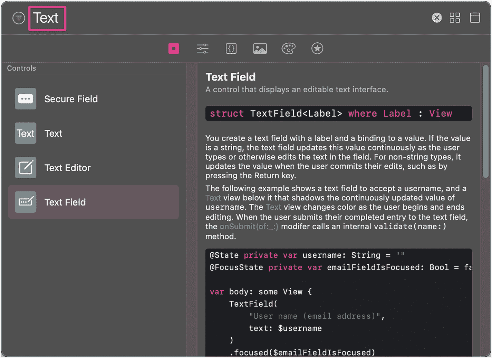

一个对话框在左侧有控件。其下方选中了文本字段。右侧是语法、两个段落和一个程序。

图 1-14 – 过滤视图列表

-   将*文本字段*视图拖入预览画布中，放在显示“*你好, 彼得!*”的标签上方。

现在 `ContentView` 的源代码应该如下所示：

```
struct ContentView: View {
var body: some View {
VStack {
Image(systemName: "globe")
.imageScale(.large)
.foregroundColor(.accentColor)
TextField("Placeholder", text: Value)
Text("Hello, Peter!")
}
.padding()
}
}
```

再次强调，*Placeholder* 和 *Value* 被高亮显示，表明它们只是编辑器中的占位符：

-   将 *“Placeholder”* 文本替换为 `"在此输入你的名字"`。
-   在以 `var body` 开头的行正上方，插入以下文本：`@State var name = ""`。这将定义一个名为 *name* 的空实例变量，并告知 SwiftUI 为你管理其状态<sup>17</sup>。
-   将 *Value* 编辑器占位符替换为 `$name`——这将告诉 SwiftUI 将 *name* 变量绑定到 `TextField`。每当用户输入文本时，*name* 变量的值就会被更新。反之，如果变量的值发生改变，SwiftUI 将更新 `TextField` 实例并显示更新后的值。你现在已经建立了一个双向绑定<sup>18</sup>。
-   将 `Text` 视图的内容更改为 `"你好, \(name)!"`。这被称为*字符串插值*——Swift 会用 `name` 变量的当前值替换 `\(name)`。

为了让输入字段更赏心悦目，让我们添加一些内边距和边框：

-   将光标放在以 `TextField` 开头的行内某处，以确保选中了 `TextField`。
-   在 *SwiftUI 检查器*中，点击*内边距* 部分右侧边缘的小圆圈。这将为文本字段周围添加一些内边距。
-   在 *SwiftUI 检查器*底部，将光标放在标记为*添加修饰符* 的输入字段内。
-   输入 *border*，然后点击*边框*下拉菜单项，为你的 `TextField` 添加一个边框。你可以选择自己喜欢的颜色。
-   最后，再次在*添加修饰符*字段中输入 *padding*，为边框周围添加一些内边距。点击*内边距*下拉菜单项来插入内边距。

你的代码现在应该如下所示：<sup>19</sup>

```
struct ContentView: View {
@State var name = ""
var body: some View {
VStack {
Image(systemName: "globe")
.imageScale(.large)
.foregroundColor(.accentColor)
TextField("Enter your name here", text:$name)
.padding(.all)
.border(Color.pink, width: 1)
.padding(.all)
Text("Hello, \(name)!")
.font(.title)
.foregroundColor(Color.pink)
}
.padding()
}
}
```

要查看代码的实际效果，请点击预览画布底部工具栏上的*实时*按钮。稍等片刻后，你就可以开始与实时预览进行交互了。尝试输入你的名字，观察问候语如何随着每次按键即时更新。

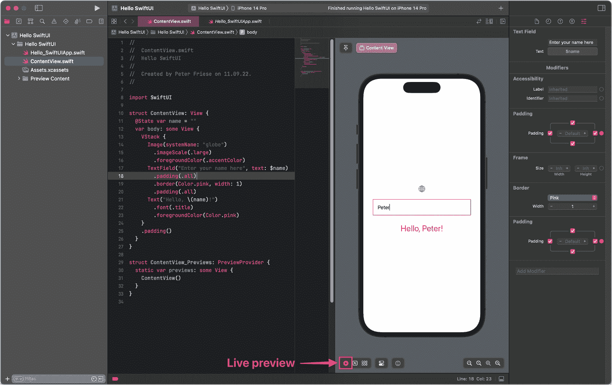

一个窗口在左侧面板选中了“ContentView.swift”。中间是程序代码。右侧是一个用于预览的手机屏幕，包含一个标志、一个带有文本“peter”的矩形框以及文本“hello, Peter!”，下方有预览按钮。右侧还有“Text Field”、“Frame”等。

图 1-15 – 在实时预览中运行应用

要在 iOS 模拟器或物理设备上运行应用，请在 Xcode 标题栏的*运行目标*下拉菜单中选择设备，然后按下*运行*按钮。

恭喜！你已经实现了你的第一个由 SwiftUI 强大的状态管理驱动的 SwiftUI 应用。

## 练习

-   添加一个按钮，将 `name` 变量重置为空字符串。
-   当 `name` 变量为空时，问候语将显示为“你好, ！”，这看起来有点尴尬。运用你在本章学到的知识，你能尝试想出一种方法，只在 `name` 包含至少一个字符时才显示逗号吗？

## 总结

在本章中，我们了解了 SwiftUI 的一些特定属性，以及 Apple 为何要推出一个全新的 UI 工具包。我们学习了声明式与命令式 UI 框架之间的区别，了解到 SwiftUI 更倾向于组合而非继承，以及一切都是视图。我们讨论了 SwiftUI 的状态管理，以及它如何成为 SwiftUI 核心理念（即 UI 是应用状态的函数）的基础。

接下来，你亲身体验了构建一个 SwiftUI 应用是多么容易。你学习了如何使用 Xcode 的双向工具来构建 SwiftUI 用户界面，并开始培养判断何时使用图形工具、何时使用源代码编辑器更高效的能力。

最后，你初步涉猎了 SwiftUI 的状态管理，希望这让你感到兴奋，因为相比手动连接 UI 更新，这要简单得多。

掌握了这些知识之后，现在是时候更深入地了解 SwiftUI 及其一些关键 UI 元素了。

脚注 <sup>1</sup> <sup>2</sup> <sup>3</sup> <sup>4</sup> <sup>5</sup> <sup>6</sup> <sup>7</sup> <sup>8</sup> <sup>9</sup> <sup>10</sup> <sup>11</sup> <sup>12</sup> <sup>13</sup> <sup>14</sup> <sup>15</sup>


