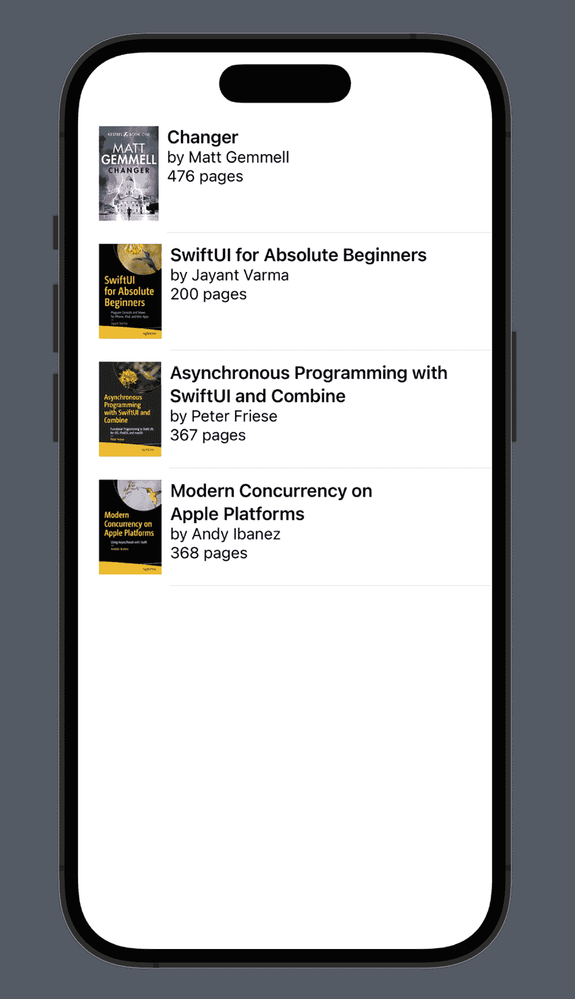
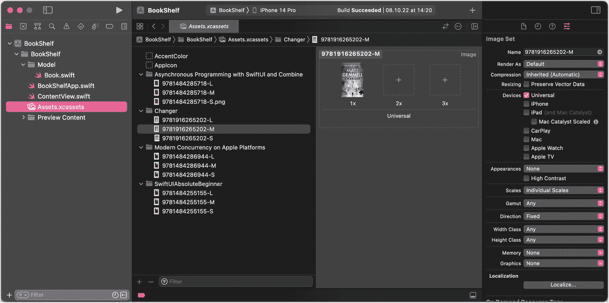
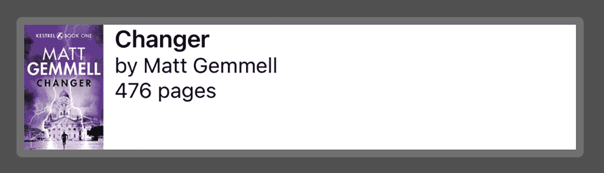
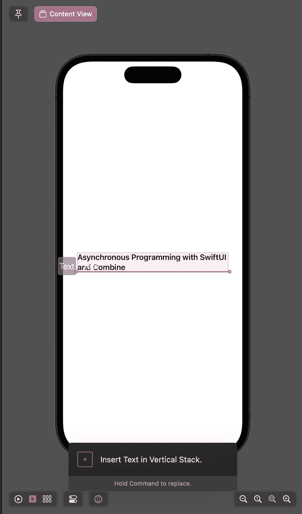
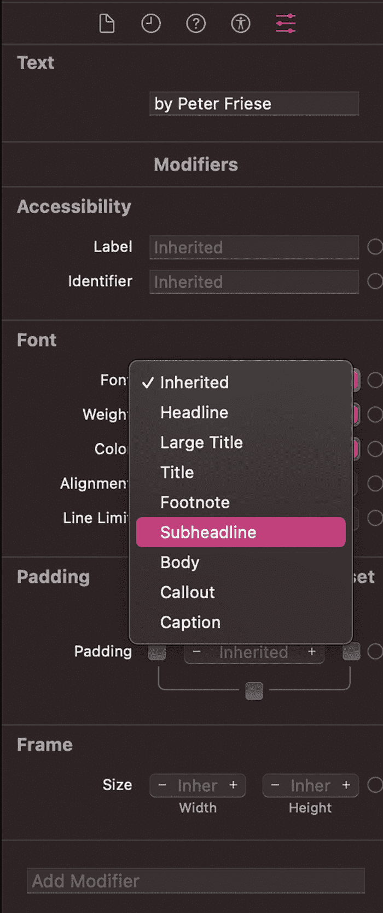
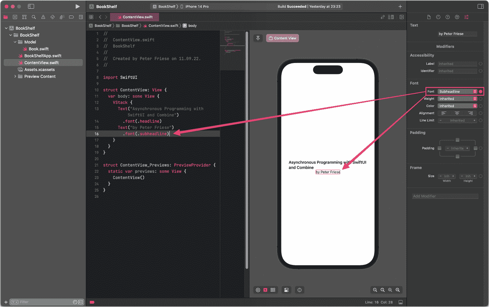
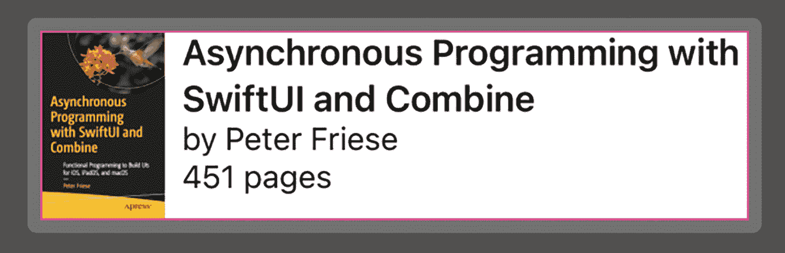
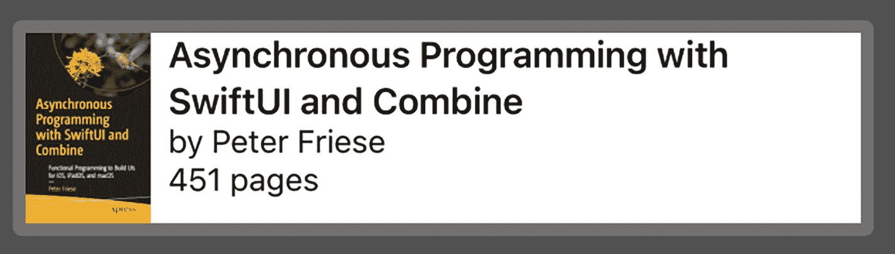
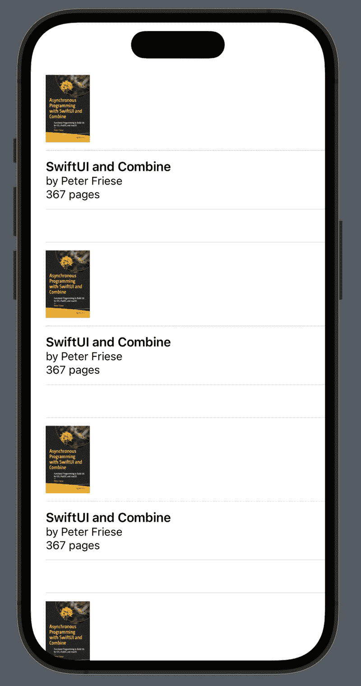
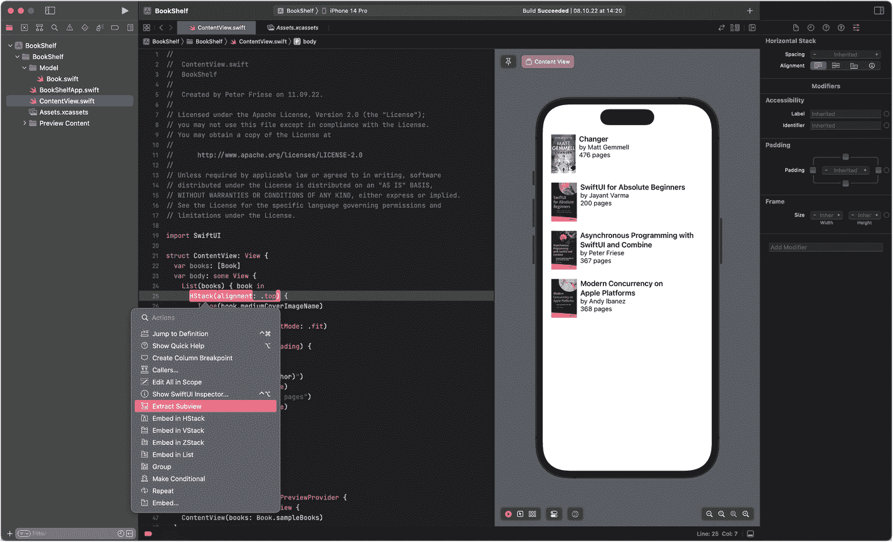

# 2. 初识 SwiftUI

在上一章中，你已经了解了 SwiftUI 的基本原理，以及为什么苹果在已经拥有多个运行完美的 UI 工具包的情况下，还要实现一个新的 UI 框架。此外，我们还快速浏览了 SwiftUI 以及 Xcode 为构建 SwiftUI 应用提供的工具。

在本章中，我们将深入探讨如何使用 SwiftUI。学习的最好方法就是动手实践，因此我们将构建一个简单的应用，它最终可能会对你很有用。

我们将学习使用简单的 SwiftUI 视图，例如 `Text` 和 `Image`，以及如何通过堆叠（stack）将简单的 UI 元素组合成可复用的视图，从而构建出既简单又复杂的用户界面。

SwiftUI 非常注重^(²⁰)构建可复用的 UI 组件，因此我们将花些时间来理解其工作原理，以及 Xcode 提供了哪些工具来简化这一过程。组合视图并将它们分解为可复用的组件，是开发 SwiftUI 应用的核心概念，这将帮助你编写易于管理和维护的代码。

在本章后面，我们将开始学习如何构建 `List` 视图，这是许多 iOS 应用中的核心组件。

整个章节中，我们将使用*视图*、*视图修饰符*和*属性包装器*。在本章结束时，你将了解这些概念是什么，以及它们如何协同工作，使 SwiftUI 成为一种神奇的体验。

## 我们将要构建的内容

本章中我们要构建的示例应用将显示一个书籍列表，其中包括书名、作者姓名和书籍封面。

为简单起见，我们将专注于 UI 方面，数据访问层则留待以后处理。因此，我们不会从远程 API 获取图书数据，而是定义一个静态的图书数组，并从应用的素材目录中获取书籍封面。

基于你在第 1 章中学到的内容，我们将首先组合一个用于显示书籍封面、书名、作者和其他一些细节的视图。


一张截图显示文本：《Changer》，作者 Matt Gemmell，476 页。左侧显示该书封面。

图 2-1

用于显示书籍详细信息的视图

下一步，我们将在一个列表视图中使用这个自定义视图，以列表形式显示多本书。



一个移动屏幕显示了四本书的详细信息、作者和封面。1. 《Changer》，作者 Matt Gemmell，476 页。2. 《SwiftUI for Absolute Beginners》，作者 Jayant Varma，200 页。3. 《Asynchronous Programming with SwiftUI and Combine》，作者 Peter Friese，367 页。4. 《Modern Concurrency on Apple Platforms》，作者 Andy Ibanez，368 页。

图 2-2

本章中我们要构建的应用

最后，我们将重构代码以使其更具可复用性。在这一步，你将了解*末日金字塔*以及如何通过组合许多小的、特定用例的组件来避免它。

让我们开始吧！

## 组合用于显示书籍的视图

为了帮助你入门，我为本章准备了一个启动项目，其中已经包含了一些书籍封面和一个简单的书籍数据模型。

克隆本书附带的 GitHub 仓库^(²¹)

*   进入本章启动项目的文件夹
*   在 Xcode 中打开该项目。

在项目的 `Model` 文件夹中，你会找到 `Book.swift`，它包含了定义此应用数据模型的 `Book` 结构体。

```
struct Book {
var title: String
var author: String
var isbn: String
var pages: Int
}
```

同一个文件中包含一个 `Book` 的扩展，其中带有几个计算属性，可以更方便地确定每本书的封面图片名称。

```
extension Book {
var smallCoverImageName: String { return "\(isbn)-S" }
var mediumCoverImageName: String { return "\(isbn)-M" }
var largeCoverImageName: String { return "\(isbn)-L" }
}
```

最后，还有一个全局常量 `sampleBooks`，它包含一组示例书籍——这使我们能够显示一些演示数据，而无需从 API 获取数据。

```
extension Book {
static let sampleBooks = [
Book(title: "Changer", author: "Matt Gemmell", isbn: "9781916265202", pages: 476),
Book(title: "SwiftUI for Absolute Beginners", author: "Jayant Varma", isbn: "9781484255155", pages: 200),
Book(title: "Asynchronous Programming with SwiftUI and Combine", author: "Peter Friese", isbn: "9781484285718", pages: 367),
Book(title: "Modern Concurrency on Apple Platforms", author: "Andy Ibanez", isbn: "9781484286944", pages: 368)
]
}
```

应用的素材目录包含了 `sampleBooks` 中定义的书籍的封面图片——如你所见，它们提供了三种不同的尺寸：小、中、大。



BookShelf 窗口的截图，左侧面板选中了 Assets.xcassets。Assets.xcassets 标签页中选中了一本书的封面。右侧显示该图片集的选项。

图 2-3

素材目录包含了示例数组中书籍的封面图片

应用的入口点定义在 `BookShelfApp.swift` 中——在这里，你实例化用户启动应用时将看到的主视图。

```
import SwiftUI
@main
struct BookShelfApp: App {
var body: some Scene {
WindowGroup {
ContentView()
}
}
}
```

这个主视图 `ContentView` 可以在 `ContentView.swift` 中找到，本章剩余的大部分时间我们将在这里度过。

```
import SwiftUI
struct ContentView: View {
var body: some View {
Text("Hello, world!")
}
}
struct ContentView_Previews: PreviewProvider {
static var previews: some View {
ContentView()
}
}
```

每当你使用 Xcode 创建新的 SwiftUI 视图时，它都会创建一个类似于此的文件，因此值得仔细看看 SwiftUI `View` 的结构。

前面的代码片段创建了一个名为 `ContentView` 的新结构体，它遵循 `View` 协议。该视图的名称是 `ContentView`，因此可以像这样实例化：`ContentView()`。

在视图内部，你会注意到一个名为 `body` 的属性。该属性的类型是 `some View`。如果你之前使用 Swift 进行开发，可能会好奇 `some` 的含义。简而言之，这表示所谓的*不透明返回类型*，它表明 `body` 返回一个类型为 `View` 的值。

`body` 在 SwiftUI 中扮演着重要角色——你将在其中定义视图的外观。在这个代码片段中，视图仅包含一个显示 "Hello, world" 的简单 `Text` 视图，但在本章后面，你将学习如何通过在 `body` 属性中组合多个视图来构建更复杂的布局。

该源文件中的第二个结构体名为 `ContentView_Previews`，它遵循 `PreviewProvider`。这是 SwiftUI 用于在 Xcode 窗口右侧的预览画布中显示视图预览的特殊构造。在本章后面，你将学习如何修改预览，以在浅色模式和深色模式下显示你的视图。


## 使用静态数据构建视图

现在我们已经对 SwiftUI 视图有了基本的了解，是时候来探讨视图的另一个重要方面了：**可组合性**。

SwiftUI 视图可以由其他视图构成。这一点怎么强调都不过分，它本质上意味着你可以通过将单个原始视图组合成更大、更复杂的视图，从而用 SwiftUI 构建出任意复杂的用户界面。

SwiftUI 通过提供少量容器组件（`HStack`、`VStack` 和 `ZStack`）、一个能在其他组件之间动态占据空间的组件（`Spacer`），以及一种简单直接的方式来在视图内部嵌套视图，使得这一切成为可能。

为了让你更清楚地理解这意味着什么，以及它在实际中如何运作，让我们来看一下如何构建一个用于显示图书详情的视图。



一张屏幕截图显示文字：Changer，作者 Matt Gemmell，共 476 页。左侧展示了图书封面。

**图 2-4** —— 用于显示图书详情的视图

在此过程中，你将学会使用 Xcode 提供的工具来构建 SwiftUI 视图的几种不同方法。

首先，让我们通过在代码编辑器中做出以下更改来显示图书标题：

*   将 `Text` 视图的标签从 `"Hello world"` 更改为 `"Asynchronous Programming with SwiftUI and Combine"`。
*   通过向 `Text` 视图添加 `.font(.headline)` 来更改文本的字体。

现在代码应该如下所示：

```
struct ContentView: View {
    var body: some View {
        Text("Asynchronous Programming with SwiftUI and Combine")
            .font(.headline)
    }
}
```

为了显示作者，在图书标题下方再添加一个 `Text` 视图。这次我们不手动编码，而是使用 Xcode 的图形化工具来确保布局正确。

*   确保预览是激活状态。如果预览画布不可见，请从主菜单中选择 *Editor* ➤ *Canvas*（或按下 `CMD + Option + Enter`）。如果 Xcode 停止了预览，你可以点击 *Resume preview* 按钮或按下 `CMD + Option + P` 来重新启动。
*   通过点击预览画布底部的鼠标指针图标，确保画布处于 *selectable*（可选择）模式。


一张屏幕截图从左到右水平排列着播放、鼠标指针、菜单、开关和电源图标。鼠标指针图标已被选中。

**图 2-5** —— 处于可选择模式下的画布

*   通过点击工具栏中的 *+* 按钮（或按下 `CMD+Shift+L`）打开 Xcode 的 *Library*（库）。
*   在 *Library* 窗口中，输入 *text* 来找到 `Text` 视图。
*   将 `Text` 视图元素从 *Library* 窗口拖拽到预览画布中。*先别松开鼠标按钮！*
*   当你在预览画布上拖拽 `Text` 视图时，你会注意到 Xcode 会高亮显示当前的放置位置，以指示如果松开鼠标，元素将被放置在哪里。



一张屏幕截图，中央有一个手机屏幕，显示文字：Asynchronous Programming with Swift U I and Combine。屏幕上有内容视图、在垂直插槽中插入文本等选项。

**图 2-6** —— 在现有视图下方插入新的 Text 视图

*   将新的 `Text` 视图放置在文本 *Asynchronous Programming with SwiftUI and Combine* 的正下方。
*   请注意，Xcode 的双向工具会自动更新源代码。

```
struct ContentView: View {
    var body: some View {
        VStack {
            Text("Asynchronous Programming with SwiftUI and Combine")
                .font(.headline)
            Text("Placeholder")
        }
    }
}
```

*   将占位文本替换为 `"by Peter Friese"`。
*   光标仍停留在同一行时，使用 *Attributes Inspector*（属性检查器）将此 `Text` 的字体更改为 *Subheadline*（副标题）。



文本属性窗口的屏幕截图，包含辅助功能、字体、内边距和框架选项。一个选项菜单中 *subheadline* 被高亮显示，并且勾选了“继承”选项。

**图 2-7** —— 属性检查器

Xcode 会相应地更新源代码并刷新预览。



Bookshelf 窗口的屏幕截图，左侧面板中选中了 content view dot swift。其标签页中有箭头，一个指向左侧的代码，另一个指向右侧手机屏幕上的文本。箭头来源于右侧字体下的副标题选项。

**图 2-8** —— 更新后的用户界面

如果预览没有刷新，请点击预览窗格顶部的 *Refresh* 按钮，或按下 `CMD+Option+P`。

```
import SwiftUI

struct ContentView: View {
    var body: some View {
        VStack {
            Text("Asynchronous Programming with SwiftUI and Combine")
                .font(.headline)
            Text("by Peter Friese")
                .font(.subheadline)
        }
    }
}

struct ContentView_Previews: PreviewProvider {
    static var previews: some View {
        ContentView()
    }
}
```

注意，Xcode 自动插入了一个 `VStack` 容器，将两个 `Text` 视图嵌套在一个垂直堆栈中。

使用代码编辑器再插入一个 `Text` 视图来显示页数：

```
import SwiftUI

struct ContentView: View {
    var body: some View {
        VStack {
            Text("Asynchronous Programming with SwiftUI and Combine")
                .font(.headline)
            Text("by Peter Friese")
                .font(.subheadline)
            Text("451 pages")
                .font(.subheadline)
        }
    }
}

struct ContentView_Previews: PreviewProvider {
    static var previews: some View {
        ContentView()
    }
}
```

为了匹配我们所需的布局，让我们更新垂直堆栈内文本视图的对齐方式。

*   在代码编辑器中，选中 `VStack`，然后使用 *Attributes Inspector*（属性检查器）将文本视图左对齐。
*   这会将 `VStack` 的 `alignment` 属性更改为 `.leading`。

为了在两个 `Text` 视图的左侧插入一张图片，我们需要将 `VStack` 和一个 `Image` 视图嵌套在一个水平堆栈内。这次我们不使用拖放，而是使用代码编辑器。

*   在代码编辑器中，`CMD+单击` 选中 `VStack`，然后选择 *Embed in HStack*。
*   在 `HStack` 内部，`VStack` 之前，插入一个 `Image` 视图：`Image("9781484285718-M")`。这将从资源目录中获取名为 *9781484285718-M* 的图片。

现在你的代码应该如下所示：

```
struct ContentView: View {
    var body: some View {
        HStack(alignment: .top) {
            Image("9781484285718-M")
            VStack(alignment: .leading) {
                Text("Asynchronous Programming with SwiftUI and Combine")
                    .font(.headline)
                Text("by Peter Friese")
                    .font(.subheadline)
                Text("451 pages")
                    .font(.subheadline)
            }
        }
    }
}
```

然而，你会注意到图片太大了，所以我们需要将其缩小一些。

*   打开库（点击 *+* 按钮或按下 `CMD+Shift+L`），点击刻度盘图标切换到 *Modifiers*（修饰符）库，输入 *resi* 找到 *Image Resizable*（图片可调整大小）修饰符。
*   抓住该修饰符，将其拖出库，并放到预览中的图书封面上。图片现在将占据预览的整个高度。
*   我们还没做完。再次打开库，输入 *aspect*，然后将 *Aspect Ratio*（宽高比）修饰符拖到封面图片上。
*   在代码编辑器中，将 `contentMode` 的值从 `.fill` 更改为 `.fit`。
*   最后，在库中找到 *Frame*（框架）修饰符并将其拖到图片上。
*   使用代码编辑器，移除 `width` 属性（包括其后面的逗号），并将 `height` 属性设置为 `90`。
*   使用 *Attribute Inspector*（属性检查器）将 `HStack` 的对齐方式设置为 `.top`，以使图片和图书标题对齐良好。

现在你的代码应该如下所示：


```swift
import SwiftUI
struct ContentView: View {
var body: some View {
HStack(alignment: .top) {
Image("9781484285718-M")
.resizable()
.aspectRatio(contentMode: .fit)
.frame(height: 90)
VStack(alignment: .leading) {
Text("Asynchronous Programming with SwiftUI and Combine")
.font(.headline)
Text("by Peter Friese")
.font(.subheadline)
Text("451 pages")
.font(.subheadline)
}
}
}
}
struct ContentView_Previews: PreviewProvider {
static var previews: some View {
ContentView()
}
}
```

## 使用预览确保视图按预期工作

到目前为止，预览窗口都在设备框架内显示视图，导致我们难以判断视图实际占用的空间大小。由于预览画布本身也是一个 SwiftUI 视图，我们可以轻松解决这个问题。

-   在代码编辑器中，选中预览提供器中的 `ContentView()` 这一行（第 31 行）
-   在属性检查器中，找到*预览*（Preview）部分的*布局*（Layout）属性，并将其设置为*适应大小*（Size that fits）

设备框架将消失，预览现在会精确分配视图所需的空间。你会注意到，视图实际占用的空间比我们预期的要小：



**图 2-9** — 书籍详情视图预览过窄

为了解决这个问题，我们需要在视图的右侧插入一个 `Spacer` 视图。这是一个透明视图，它会扩展以占用周围容器布局方向上的尽可能多的空间。你可以把它想象成一个弹簧，将你的视图推开。

-   向布局中添加间隔器的最简单方法是使用代码编辑器，在包含 `Text` 视图的 `VStack` 的闭合大括号之后添加 `Spacer()`。

现在的代码应该如下所示：

```swift
import SwiftUI
struct ContentView: View {
var body: some View {
HStack(alignment: .top) {
Image("9781484285718-M")
.resizable()
.aspectRatio(contentMode: .fit)
.frame(height: 90)
VStack(alignment: .leading) {
Text("Asynchronous Programming with SwiftUI and Combine")
.font(.headline)
Text("by Peter Friese")
.font(.subheadline)
Text("451 pages")
.font(.subheadline)
}
Spacer()
}
}
}
struct ContentView_Previews: PreviewProvider {
static var previews: some View {
ContentView()
.previewLayout(.sizeThatFits)
}
}
```

在预览中，我们可以看出视图现在占据了`设备`((22))的整个宽度。



**图 2-10** — 书籍详情视图预览宽度正确

## 显示书籍列表

既然我们已经有了显示书籍详情的视图，现在让我们把它变成一个书籍列表。稍后你会看到，这出奇地简单，而且 Xcode 为该过程提供了便利。

-   在代码编辑器中，*Command+单击*书籍视图外层的 `HStack`。
-   从弹出菜单中选择*嵌入到列表*（Embed in List）。

Xcode 将视图包裹在一个列表中，该列表遍历从 0 到 5（不含）的半开区间，从而生成五个书籍视图实例，显示在一个垂直滚动的列表中。稍后，我们会将 `List` 视图连接到我们的示例书籍数组，以显示比重复显示同一本书更有意义的内容。

但在那之前，我想提请你注意文本视图的布局。正如你所看到的，书名不再与书籍封面顶部对齐。查看源代码，你可能会注意到，当我们要求 Xcode 将 `HStack` 包裹在 `List` 中时，之前包裹 `Image` 视图和 `VStack` 的 `HStack` 消失了。虽然你可能会认为这是 Xcode 编辑器的一个错误，但这实际上是设计使然，因为 `List` 视图包含一个隐式的 `HStack`。然而，由于我们无法修改这个隐式的 `HStack`，我们不得不手动重新插入之前使用的那个 `HStack`。



**图 2-11** — 将视图包裹在列表内后布局异常

有三种方法可以解决这个问题：

1.  在将额外的 `HStack` 包裹到 `List` 视图*之前*，先将原来的 `HStack(alignment: .top)` 包裹在另一个 `HStack` 中。
2.  手动将书籍视图的内部视图包裹在 `HStack(alignment: .top) { ... }` 中。
3.  不借助 Xcode 的帮助，手动将书籍视图包裹在 `List` 视图中。

选择哪种方法很大程度上取决于个人偏好，一旦你更熟悉 SwiftUI 的 API 和 Xcode 的特性，你就能很快熟练地选择最高效的方式来构建 UI。

现在，让我们在 `List` 视图之后立即手动插入 `HStack(alignment: .top) {`，并在 `Spacer()` 之后的下一行插入闭合的 `}`。

我们还将在 `List` 视图的闭合大括号后附加 `.listStyle(.plain)`，以将列表显示为普通列表视图。

你的代码现在应该如下所示：^((23))

```swift
struct ContentView: View {
var body: some View {
List(0 ..< 5) { item in
HStack(alignment: .top) {
Image("9781484285718-M")
.resizable()
.aspectRatio(contentMode: .fit)
.frame(height: 90)
VStack(alignment: .leading) {
Text("Asynchronous Programming with SwiftUI and Combine")
.font(.headline)
Text("by Peter Friese")
.font(.subheadline)
Text("367 pages")
.font(.subheadline)
}
Spacer()
}
}
.listStyle(.plain)
}
}
```


## 设置数据绑定

当然，我们想要达成的目标并不是显示五本完全相同的书。相反，让我们将视图与 `Book.swift` 中定义的示例书籍集合连接起来。

SwiftUI 的 `List` 视图能够显示来自 `RandomAccessCollection`（随机访问集合）的元素。很方便的是，Swift 数组符合该协议，这意味着我们可以向书籍列表视图提供一个 `Book` 数组。

在将 `List` 视图与 `Book.swift` 中定义的示例书籍集合连接之前，我们需要在 `ContentView` 上声明一个属性，用于持有对 `sampleBooks` 数组的引用。

*   在 `ContentView` 顶部添加 `var books: [Book]`。
*   通过更新预览和 `BookShelfApp` 中对 `ContentView()` 的调用，将其改为 `ContentView(books: sampleBooks)`，来修复编译器错误。

现在我们可以将 `List` 视图与这个新属性连接起来。首先，让我们用对 `books` 属性的引用来替换封闭区间 `0..<5`。

*   将 `List(1..<5)` 改为 `List(books)`。
*   将闭包参数 `item` 重命名为 `book`。

编译器会报错，提示 `Book` 不符合 `Identifiable`（可识别）协议。这是因为 `List` 需要能够识别其显示的元素，以便按确定顺序显示它们。如果元素没有唯一标识符，那么每当数据集合发生更新时，列表行就会到处跳动。

请按照以下步骤确保 `Book` 符合 `Identifiable` 协议：

*   在 `Book.swift` 中，将 `struct Book {` 改为 `struct Book: Identifiable {`。
*   在 `Book` 的属性中添加 `var id = UUID().uuidString`。

这应该能修复编译错误。你可能需要重新编译代码（按下 `CMD+B`）。

在下一步中，我们将把各个 UI 元素连接到 `Book` 结构体的相应属性上。

*   为了显示当前 `Book` 实例中指定的书籍封面，将 `Image("9781484285718-M")` 改为 `Image(book.mediumCoverImageName)`。
*   对于标题，将硬编码的字符串改为 `book.title`。
*   对于作者和页数，我们可以使用字符串插值。将 `"by Peter Friese"` 替换为 `"by \(book.author)"`，将 `"367 pages"` 替换为 `"\(book.pages) pages"`。

最后，让我们更改预览配置，以确保列表视图在设备框架中显示。为此，只需删除 `previewLayout(.sizeThatFits)` 这一行。

你的代码现在应该如下所示：

```
import SwiftUI
struct ContentView: View {
    var books: [Book]
    var body: some View {
        List(books) { book in
            HStack(alignment: .top) {
                Image(book.mediumCoverImageName)
                    .resizable()
                    .aspectRatio(contentMode: .fit)
                    .frame(height: 90)
                VStack(alignment: .leading) {
                    Text(book.title)
                        .font(.headline)
                    Text("by \(book.author)")
                        .font(.subheadline)
                    Text("\(book.pages) pages")
                        .font(.subheadline)
                }
                Spacer()
            }
            .listStyle(.plain)
        }
    }
}
```

## 调整预览画布

为了监测用户界面在浅色模式和深色模式下是否都显示良好，请使用预览画布工具栏中的*变体*按钮，并选择*配色方案变体*选项。预览画布现在将同时显示浅色和深色模式下的用户界面。

一张并排显示手机屏幕浅色和深色模式的截图，展示了书籍详情、作者和封面。1. 《Changer》，作者 Matt Gemmell，476 页。2. 《SwiftUI for Absolute Beginners》，作者 Jayant Varma，200 页。3. 《Asynchronous Programming with SwiftUI and Combine》，作者 Peter Friese，451 页。4. 《Modern Concurrency on Apple Platforms》，作者 Andy Ibanez，368 页。底部选择了“配色方案变体”选项。

**图 2-12** 并排预览浅色和深色模式

## 使代码可复用

在结束本章并进入下一个主题之前，我们需要讨论一个关键问题：*厄运金字塔*。

以这种方式组合视图的便捷性很容易导致代码嵌套过深，难以导航——因此得名“厄运金字塔”。

好消息是 SwiftUI 提供了多种机制，允许我们将视图结构分解为更小的模块，使我们的代码更易于阅读和维护：

*   提取子视图
*   提取为方法
*   提取为属性

在整本书中，我们将使用其中几种技术，但现在，我们将使用最流行的一种：*提取子视图*。


### 使用提取子视图重构代码

在 SwiftUI 视图中管理复杂性的最重要技术之一，可能是将视图层次结构中可重用的部分提取到子视图中。

显然，我们示例应用中的图书视图就是这种重构的理想候选对象——回想一下，我们甚至一开始就是将其作为一个单独的视图来构建的。

以下是应用“提取子视图”重构的方法：

- 确保*预览画布*可见。否则，SwiftUI 的重构功能将无法激活。^(²⁵)
- 在代码编辑器中，`CMD + 单击`构成图书视图的列表行中的`HStack`。
- 在上下文菜单中，选择*提取子视图*。



Bookshelf 窗口的截图显示了从左侧面板选择的 `ContentView.swift`。`ContentView.swift` 标签页中，从左侧的代码中选择了“提取子视图”选项，右侧则显示了包含书籍、作者和封面详情的移动设备屏幕。右侧提供了水平堆栈、辅助功能、内边距和框架等选项。

**图 2-13** — 使用“提取为子视图”重构

Xcode 会将整个视图结构提取到当前源代码文件底部的一个新视图中，并将其命名为 `ExtractedView`。

你会注意到提取后的视图中存在一个编译错误：*“Cannot find ‘book’ in scope”*——这是因为此视图中显示的 `Book` 实例不在作用域内。

要修复此问题，我们需要在新视图中定义一个新属性：

- 在 `BookRowView` 内部，声明一个名为 `book` 的新属性，类型为 `Book`。

```
struct BookRowView: View {
var book: Book
var body: some View {
...
}
}
```

编译错误将会消失，但会出现一个新的错误——在调用处，编译器告诉我们缺少 `book` 参数。

要修复此问题，请将当前的 `book` 实例添加到 `ExtractedView()` 调用中。

由于 `ExtractedView` 对于我们的视图来说不是一个好名字，让我们将其重命名为 `BookRowView`。为此，将光标放在符号名称 `ExtractedView` 内的某个位置，然后使用快捷键 `CMD + Shift + A` 调出*代码操作*上下文菜单。

选择“重命名”重构后，Xcode 会显示所选符号的所有出现位置。输入新名称 `(BookRowView)`，然后按 Enter 键应用更改。

代码现在应如下所示：

```
import SwiftUI
struct ContentView: View {
var books: [Book]
var body: some View {
List(books) { book in
BookRowView(book: book)
}
.listStyle(.plain)
}
}
struct ContentView_Previews: PreviewProvider {
static var previews: some View {
ContentView(books: Book.sampleBooks)
}
}
struct BookRowView: View {
var book: Book
var body: some View {
HStack(alignment: .top) {
Image(book.mediumCoverImageName)
.resizable()
.aspectRatio(contentMode: .fit)
.frame(height: 90)
VStack(alignment: .leading) {
Text(book.title)
.font(.headline)
Text("by \(book.author)")
.font(.subheadline)
Text("\(book.pages) pages")
.font(.subheadline)
}
Spacer()
}
}
}
```

至此，“提取子视图”重构基本完成，但还有两个可选步骤你可能会考虑：

1.  将提取的子视图标记为 `private`。如果你不打算在其他任何上下文中使用此视图，这将非常有用。
2.  如果你*打算*在其他地方使用提取的子视图，请将其移动到一个单独的文件中。为此，使用 Xcode 的“新建文件”对话框创建一个新的 *SwiftUI View* 文件，然后选择 `BookRowView` 作为文件名。这可以确保新文件包含一个名为 `BookRowView_Previews` 的预览提供程序。它还包含一个名为 `BookRowView` 的视图，你可以直接用我们在前面步骤中提取的 `BookRowView` 实现替换它^(²⁶)。

### 重命名 ContentView

当你开始为应用添加新功能和屏幕时，如果你的某个屏幕仍然名为 `ContentView`，可能会感觉有点奇怪，因此你应该重命名它，并选择一个能更贴近屏幕功能的名称。

为此，将光标放在名称 `ContentView` 上，然后从编辑器上下文菜单中选择*重构* ➤ *重命名*。Xcode 会折叠你的代码，并显示重构后代码的外观预览。只需开始输入新名称（例如 `BooksListView`），完成后按 *Enter* 键。

### 控制复杂性

将嵌套的视图结构分解为更小的组件是 SwiftUI 的最佳实践，Apple 本身也在其 WWDC 视频^(²⁷)和开发者文档^(²⁸)中积极鼓励这种做法。在使用 SwiftUI 构建用户界面时，请牢记我向您展示的技术，并记得在发现代码开始变得失控时立即进行重构。

## 视图与视图修饰符

让我们在此稍作停顿，回顾一下我们到目前为止学到的东西。

**视图**是 SwiftUI 的核心构建块——每个视图都定义了用户界面的一部分。

视图可以被**组合**成新的视图，从而产生功能更丰富、更复杂的用户界面。一个组合可能简单到将一张图片放在一个文本标签旁边，但事情很容易变得更复杂。

SwiftUI 不主张使用绝对坐标来定位 UI 元素，而是推动使用垂直和水平的**堆栈和间隔器**系统来布局 UI 元素。

大多数视图会**紧贴**其内容（例如 `Text`），而其他视图则会**向外扩展**以消耗所有可用空间（例如 `Spacer`）。

**配置**视图主要有两种方式：

1.  视图的主要属性可以使用构造器参数进行配置（例如，`Text` 视图上显示的文本，或 `HStack` 的对齐方式）。
2.  视图的次要属性则使用*视图修饰符*进行配置。

**视图修饰符**是你在 SwiftUI 视图上调用的函数（例如 `Text("hello").font(.headline)`）。其中大多数允许你指定视图的外观（例如，通过设置字体、前景色和背景色、框架大小等）。正如我们将在后续章节中看到的，还有一些视图修饰符允许你注册在某些事件（例如按钮点击）发生时调用的闭包。

## 练习

1.  添加另一个 `Text` 视图，在显示页数的同一行显示每本书的 ISBN。
2.  将页码文本左对齐，将 ISBN 右对齐。

## 技巧与窍门

如果你不确定某个特定视图如何工作或如何配置，可以使用*库*来学习如何使用该视图。将某个视图从*库*拖入预览画布（或代码编辑器）以获取初始实现。或者，将某个修饰符从库中拖出并放到某个视图上，以了解如何使用它。这样重复操作几次后，你就会理解各个视图和视图修饰符的工作方式，然后就可以使用代码编辑器手动输入代码（或使用代码补全功能）。


## 总结

在本章中，你学习了如何使用简单的 SwiftUI 视图，逐步构建一个应用，该应用以列表视图的形式展示数据模型中的信息。

我们探讨了如何使用 `Image` 和 `Text` 视图来组成一个用于展示书籍封面、标题及其他详细信息的单元格，并且你运用了 `HStack`、`VStack` 和 `Spacer` 来进行 UI 元素的布局。

通过使用 Xcode 的双向工具，你亲身体验了如何利用*库*、*预览画布*、代码编辑器及其上下文菜单，快速构建一个用户界面。

最后，你使用了 Xcode 的重构功能，将代码组织成可复用的组件，使其更易于阅读和维护。

如果你是从 UIKit 转过来的，习惯了以编程方式构建视图，那么用 SwiftUI 轻松构建出等同于带有自定义单元格的 `UITableView` 的功能，应该会是一个令人愉快的惊喜。但这还不是全部——正如你将在后续章节中看到的，SwiftUI 的状态管理使得确保应用的所有部分都能反映数据模型的当前状态变得容易得多——再也不必担心不同步的问题了！

本章为你概述了如何使用 SwiftUI 构建用户界面，但我们只是浅尝辄止。在接下来的章节中，我们将深入探讨各个主题，以更好地理解 SwiftUI 如何运作（及其原因），并学习如何利用其响应式状态管理系统构建更好的应用。

