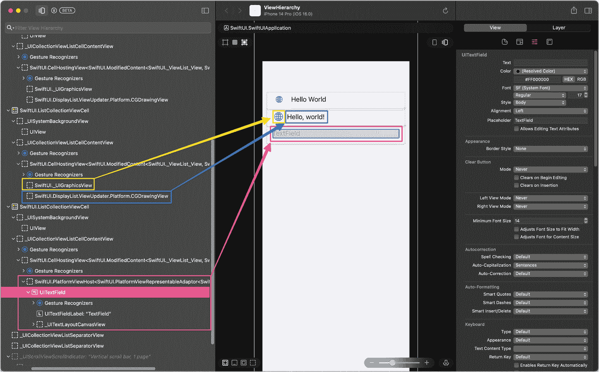
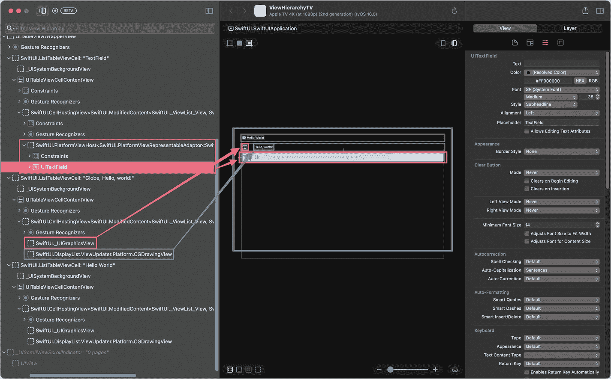
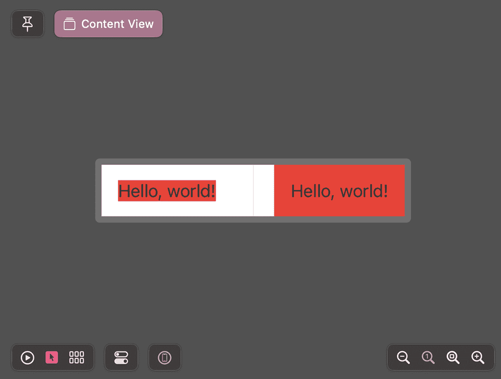
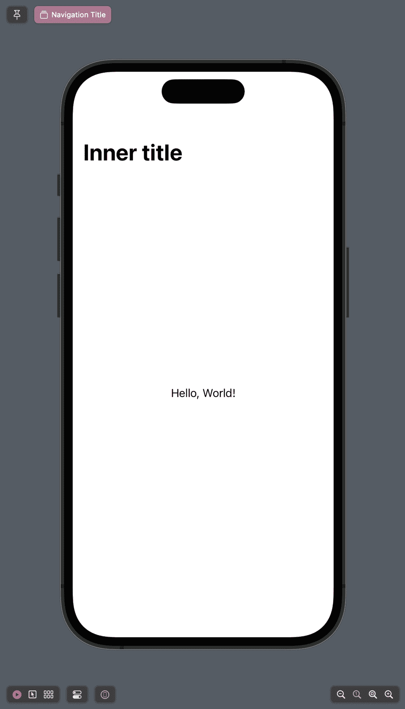

# 3. SwiftUI 构建块

在上一章中，你学习了如何使用 SwiftUI 构建一个简单的用户界面，以及如何利用 Xcode 的重构工具来保持代码结构清晰且可复用。你还使用了 SwiftUI 的状态管理系统，它能使应用视图与数据模型始终保持同步。

现在你已经使用了 SwiftUI 的关键组件，比如*视图*、*视图修饰符*和*属性包装器*，让我们更仔细地看看并了解它们是如何工作的。

在本章中，我们将探讨 SwiftUI 的构建块，了解它们如何工作，以及它们如何让开发者高效地构建用户界面。具体来说：

-   你将了解视图的*真正*含义，以及它们如何帮助你以声明方式描述用户界面
-   我们将讨论 SwiftUI 中不同类型的视图——用户界面视图和容器视图
-   我们还将研究视图修饰符及其在配置视图中的作用

本章结束时，你将更深入地理解 SwiftUI 是如何工作的，以及各个概念是如何协同作用，使 SwiftUI 成为一个易于使用的、用于构建用户界面的领域特定语言。

## 视图

SwiftUI 采用声明式方法来描述用户界面。你无需手动实例化 UI 元素（如按钮、标签、列表等），只需声明你希望 UI 呈现的样子。视图是 SwiftUI 中构建用户界面最基本的组件。要定义应用的 UI，你可以利用 SwiftUI 的内置视图，创建你的用户界面的轻量级描述。如此，你便可以组合出自己的视图，然后在你的应用中使用它们。

除了在自己的应用中使用这些视图，你还可以将它们提取到 Swift 包中，使其可复用。这使你能够在其他应用中使用它们，或与团队中的其他开发者分享。你甚至可以通过将它们上传到 GitHub 并注册到 Swift 包索引，使其对其他开发者也可用。

在第 1 章和第 2 章中，你已经使用了以下技巧来构建可复用的 SwiftUI 组件：

-   你使用了一些 SwiftUI 内置视图（例如 `Text` 和 `Image`）来创建简单的 UI（例如第 1 章中的 *Hello World* 示例）。
-   在第 2 章中，你创建了一个可复用的视图（`BookRowView`）用于展示书籍的详细信息，然后在 `List` 视图中复用了它。

让我们看看一个 SwiftUI 视图的基本结构。当你在 Xcode 中创建一个新的 SwiftUI 文件时，你会得到类似下面这样的代码：

```
import SwiftUI
struct ContentView: View {
    var body: some View {
        VStack {
            Image(systemName: "globe")
                .imageScale(.large)
                .foregroundColor(.accentColor)
            Text("Hello, world!")
        }
        .padding()
    }
}
struct ContentView_Previews: PreviewProvider {
    static var previews: some View {
        ContentView()
    }
}
```

`PreviewProvider` 负责在 Xcode 的预览画布中显示该视图。

**图 3-1** Xcode 预览画布中的一个简单视图

先暂时将 `PreviewProvider` 放在一边，让我们关注简化版的 `ContentView`：

```
struct ContentView: View {
    var body: some View {
        Text("Hello, world!")
    }
}
```

这段简短的代码片段定义了一个名为 `ContentView` 的简单视图，其中包含一个显示 *Hello World* 的 `Text` 视图。

尽管这只是一段很短的代码，但我们能从中了解到 SwiftUI 的强大之处。

SwiftUI 视图是结构体，它们需要遵循 `View` 协议。查看 `View` 协议的源代码，我们可以看到遵循者需要实现一个名为 `body` 的计算属性，该属性返回*一个* `View`：

```
@available(iOS 13.0, macOS 10.15, tvOS 13.0, watchOS 6.0, *)
public protocol View {
    associatedtype Body : View
    @ViewBuilder @MainActor var body: Self.Body { get }
}
```

我们简单的 Hello World 代码段包含一个计算属性 `body`，它返回一个简单的 `Text` 视图，因此它满足了 `View` 协议的要求。

为了实现更复杂的视图，比如带有前置图标的标签，我们可以使用 SwiftUI 的容器视图，例如 `Group`、`HStack` 或 `VStack`。容器视图允许我们对子视图进行分组，并按照特定的布局（例如，水平或垂直）排列它们。以下代码片段使用 `VStack` 垂直排列了一个 `Image` 和一个 `Text`：

```
struct ContentView: View {
    var body: some View {
        VStack {
            Image(systemName: "globe")
                .imageScale(.large)
                .foregroundColor(.accentColor)
            Text("Hello, world!")
        }
        .padding()
    }
}
```


通过使用容器视图，我们可以满足`View`协议的要求，即从`body`计算属性返回*单个*`View`。我们将在本章后面进一步讨论容器视图。

你可能好奇为什么返回类型是`some View`，而不是简单的`View`，以及为什么`body`的返回类型不能直接是`View`。

在组合视图时（如前面的示例所示），具体的返回类型取决于各个视图的类型及其排列顺序。例如，在前面代码片段中，我们从`body`属性返回的视图类型是`HStack<TupleView<(Image, ModifiedContent<Text, _PaddingLayout>)>>`。更改视图的顺序将导致不同的类型：将`Image`放在`Text`之后会将结果类型更改为`HStack<TupleView<(ModifiedContent<Text, _PaddingLayout>, Image)>>`。

显然，这有点冗长繁琐，而`some`关键字就派上了用场：它将类型转换为所谓的*不透明类型*。这意味着编译器仍然能够访问底层具体类型（例如`HStack<TupleView<(Image, ModifiedContent<Text, _PaddingLayout>)>>`），但模块的客户端看不到这一点^(³¹)——他们只能看到返回值的协议。

这意味着：通过将视图的`body`结果作为`some View`返回，调用方只会看到一个视图，而不会了解该视图的具体结构。因此，我们可以使用常规类型名称来引用自定义类型（对于前面的代码片段：`ContentView`），而不必使用从`body`属性返回的视图结构的具体类型（对于前面的代码片段：`HStack<TupleView<(Image, ModifiedContent<Text, _PaddingLayout>)>>`）。

### 用户界面视图

`SwiftUI`提供了广泛的视图，涵盖了 iOS、iPadOS、macOS、watchOS 和 tvOS 中常见的大部分 UI 元素，例如`Text`、`Image`、`Button`、`TextField`等。

这些视图是构建应用程序 UI 的基本构建块。您还可以使用这些构建块创建自己的自定义组件，就像我们在第 2 章中创建的用于显示书籍封面和标题的`List`行一样。

以下是 SwiftUI 用户界面元素的概览：

#### 文本输入与输出

**文本输出**

| 名称 | 描述 |
| --- | --- |
| `Text` | 显示一行或多行只读文本 |
| `Label` | 显示图片和只读文本 |

**文本输入**

| 名称 | 描述 |
| --- | --- |
| `TextField` | 显示可编辑文本 |
| `SecureField` | 允许用户安全输入文本 |
| `TextEditor` | 可显示和编辑长文本的控件 |

#### 图片

**图片**

| 名称 | 描述 |
| --- | --- |
| `Image` | 显示图片 |
| `AsyncImage` | 异步下载并显示图片 |

#### 控件与指示器

**按钮**

| 名称 | 描述 |
| --- | --- |
| `Button` | 触发操作的控件 |
| `EditButton` | 切换*编辑模式*环境值的按钮 |

**链接**

| 名称 | 描述 |
| --- | --- |
| `Link` | 用于导航到 URL 的控件 |

**菜单**

| 名称 | 描述 |
| --- | --- |
| `Menu` | 用于呈现操作菜单的控件 |

**值输入**

| 名称 | 描述 |
| --- | --- |
| `Slider` | 用于从有界线性范围中选择值的控件 |
| `Stepper` | 执行递增和递减操作的控件 |
| `Toggle` | 在开和关状态之间切换的控件 |

**选择器**

| 名称 | 描述 |
| --- | --- |
| `Picker` | 用于从一组互斥值中选择的控件 |
| `DatePicker` | 用于选择绝对日期的控件 |
| `ColorPicker` | 用于从系统颜色选择器 UI 中选择颜色的控件 |

**指示器**

| 名称 | 描述 |
| --- | --- |
| `Gauge` | 显示范围内数值的视图 |
| `ProgressView` | 显示任务完成进度的视图 |

#### 形状

**形状**

| 名称 | 描述 |
| --- | --- |
| `Shape` | 绘制视图时可使用的 2D 形状 |
| `InsettableShape` | 能够内缩自身以产生另一种形状的形状类型 |
| `Rectangle` | 在其包含视图的框架内对齐的矩形形状 |
| `RoundedRectangle` | 带有圆角的矩形形状，在其包含视图的框架内对齐 |
| `Circle` | 以其包含视图的框架为中心的圆形 |
| `Ellipse` | 在其包含视图的框架内对齐的椭圆 |
| `Capsule` | 在其包含视图的框架内对齐的胶囊形状 |
| `Path` | 2D 形状的轮廓 |

### 容器视图

大多数用户界面比屏幕中央简单的`Text`或`Image`要复杂得多。实际上，绝大多数用户界面都由多个单独的视图构建而成。`SwiftUI`没有要求开发者在屏幕上的绝对或相对位置手动定位视图，而是使用视图容器^(³²)，通过将多个视图组合在一起并在屏幕上排列，从而更轻松地创建复杂布局。

`SwiftUI`有几种容器视图类别：

*   布局容器，例如`HStack`、`VStack`或`ZStack`，允许我们水平、垂直或通过叠加方式布局其子视图。
*   集合容器，例如`List`、`Form`、`Table`、`Group`或`ScrollView`，提供滚动、滑动、过滤等内置功能。
*   展示容器（`NavigationView`、`NavigationStack`、`NavigationSplitView`、`TabView`、`Toolbar`等）旨在定义应用程序 UI 的结构。

由于容器视图本身也是视图，我们可以嵌套它们，从而轻松构建复杂的用户界面。

除此之外，每个视图还具有覆盖层和背景层，可以通过`overlay`和`background`视图修饰符（下一节将详细介绍视图修饰符）进行访问。这可用于创建一些高级布局。

### 布局行为

你会注意到，某些视图的布局行为似乎与其他视图不同。

从高层次来看，SwiftUI 的布局过程如下：

1.  父视图向其子视图提供一些尺寸。
2.  子视图根据自身尺寸（内在尺寸）和父视图提供的尺寸（子视图可以完全忽略该尺寸）来决定需要多少空间。然后，它将此尺寸返回给父视图。
3.  父视图使用子视图返回的尺寸，在步骤 1 提供的空间范围内将子视图放置在某个位置。它会尊重子视图为自己请求的尺寸。

在确定子视图占用多少空间的步骤 2 中，SwiftUI 使用了两种不同的策略：

#### 紧缩

视图选择最适合其内容的尺寸，而不考虑父视图提供的尺寸。`Text`是具有此行为的视图示例：即使容器提供更多空间，它也只消耗文本所需的那么多空间。

#### 扩展

视图尝试用尽父视图提供的尽可能多的空间。`Color`是具有此行为的视图示例：它会占据父视图提供的全部空间。


## 视图只是 UI 的描述

在 2019 年 WWDC 上 SwiftUI 的首次演示中，^(³³)苹果公司极力强调 SwiftUI 视图的创建成本很低。事实上，他们鼓励^(³⁴)开发者大量使用视图，并将视图分解为子视图，以便单个屏幕和视图的代码易于阅读和维护。

这样做的原因是，SwiftUI 视图并非真正的视图——而只是对视图的*描述*。

或者，正如苹果在其 SwiftUI 文档^(³⁵)中所说：“[…] *通过声明式方法，你可以通过以反映所需界面布局的层级结构来声明视图，从而创建用户界面的轻量级描述。之后 SwiftUI 会负责绘制并更新这些视图，以响应用户输入或状态更改等事件。*”

为了证明这一点，让我们来看一个简单的视图以及最终在屏幕上渲染出的视图层级。

```
struct ContentView: View {
    @State var text = ""
    var body: some View {
        List {
            Label("Hello World", systemImage: "globe")
            HStack {
                Image(systemName: "globe")
                    .imageScale(.large)
                    .foregroundColor(.accentColor)
                Text("Hello, world!")
            }
            TextField("TextField", text: $text)
        }
    }
}
```



在 iPhone 14 Pro 上视图层级窗口的截图中，左侧面板中高亮显示的代码指向右侧屏幕上的“Hello World”、一个地球图标和一个文本字段。右侧提供了用于 UI 文本字段、外观、清除按钮、自动关联和自动格式化等选项。

**图 3-2** —— 上述代码片段在 iOS 上运行时的视图层级（使用 Reveal 应用）

请注意，`TextField`视图被映射为一个`UITextField`，而`Text`视图则被映射为一个`SwiftUI.DisplayList.ViewUpdater.Platform.CGDrawingView`。

这也是 SwiftUI 可用于定义跨平台 UI 的关键原因之一。由于视图只是 UI 的描述，SwiftUI 可以在不同平台上使用不同的原语来渲染 UI。让我们再看一个例子来理解这一点。以下是和前面相同的代码，但运行在 tvOS 上。请注意，视图层级显示的是 tvOS 原生的 UI 控件。



在 Apple TV 上 TV 视图层级窗口的截图中，左侧面板中高亮显示的代码指向右侧屏幕上的“Hello World”、一个地球图标和一个文本字段。右侧提供了用于 UI 文本字段、外观、清除按钮、自动关联、自动格式化和键盘的选项。

**图 3-3** —— 相同代码片段在 tvOS 上运行时的视图层级（使用 Reveal 应用）

在 SwiftUI 中创建 UI 时，你应始终牢记，视图只是 UI 的描述，而非实际的 UI 元素本身。同时也要记住，SwiftUI 可能会在渲染过程中多次调用你的视图——这就是为什么你不应在视图的初始化器中执行任何开销巨大的处理或计算。

## 视图修饰符

视图修饰符是 SwiftUI 中的另一个关键概念——它们允许我们自定义应用中视图的外观和行为。例如，你可以使用视图修饰符来：

*   设置视图样式
*   响应事件（例如用户点击按钮）
*   配置辅助视图（例如滑动操作、上下文菜单或工具栏）

视图修饰符是可以在任何 SwiftUI `View`上调用的 Swift 方法。它们作为`View`协议的扩展实现，这意味着你可以在任何`View`上调用它们——无论是像`Text`或`Image`这样的内置视图，还是你自己的自定义视图。

让我们深入了解它们的工作原理。

### 配置视图

要修改视图的外观或行为，只需在视图实例上调用 SwiftUI 的内置视图修饰符之一即可。例如，下面是将`Text`视图的前景色更改为红色的方法：

```
Text("Hello World")
    .foregroundColor(.red)
```

通过在视图上调用修饰符，修饰符会创建一个包裹原始视图的新视图，并在视图层级中替换掉原始视图。例如，修改后的`Text`视图的类型将是`ModifiedContent<Text, _PaddingLayout>`。

你可以对同一个视图应用多个视图修饰符，以更改其外观的多个方面。例如，要在更改前景色的同时更改文本的字体，只需调用`font`视图修饰符：

```
Text("Hello, world!")
    .foregroundColor(.red)
    .font(.title)
```

值得指出的是，视图修饰符添加到视图上的顺序至关重要。在以下代码片段中，对`Text`视图应用的视图修饰符顺序不同，导致输出结果也不同：

```
struct ContentView: View {
    var body: some View {
        HStack(spacing: 20) {
            // 左侧
            Text("Hello, world!")
                .background(.red)
                .padding()
            Divider()
            // 右侧
            Text("Hello, world!")
                .padding()
                .background(.red)
        }
        .frame(maxHeight: 50)
    }
}
```



一张截图中，“hello world”并排写在文本框内，呈现不同的颜色渐变。左上角给出了“content view”选项。下方提供了播放、鼠标指针、切换和缩放等选项。

**图 3-4** —— 应用视图修饰符的顺序会影响视图的外观

在第一个示例中，背景色是在添加内边距之前应用到`Text`视图上的。这导致只有文本本身被红色背景衬底。

在第二个代码片段中，首先应用了内边距。正如前面提到的，应用视图修饰符会导致视图的修改版本取代原始视图的位置。这意味着，内边距化后的`Text`视图如今取代了原始`Text`视图的位置。将此修改后的版本视为（应用了`background`视图修饰符的）目标视图，会导致整个带有内边距的背景区域被填满红色背景色。

### 将视图修饰符应用于子视图

视图修饰符作用于其所应用的视图本身。例如，在前面的代码片段中，我们将`background`视图修饰符应用到了一个`Text`视图上。

然而，大多数视图修饰符也会影响其所应用的视图的子视图。考虑以下代码片段，它将相同的等宽字体应用于`VStack`内的所有标签：

```
VStack(alignment: .leading) {
    Text("Hello, World!")
    Text("How are you today?")
}
.font(.system(.body, design: .monospaced))
```

当你想要一次性配置多个视图的外观时，这非常有用。通过将相应的视图修饰符应用到你想配置的视图的共享容器视图上，你可以一次性更改所有包含在内视图的外观。

也有一些视图修饰符会将其值向上传播到视图层级，例如`navigationTitle`：

```
NavigationStack {
    HStack {
        Text("Hello, World!")
            .navigationTitle("内部标题")
    }
    .navigationTitle("外部标题")
}
```



一张手机屏幕的截图中，显示了文本“内部标题”和“hello world”。左上角给出了“navigation title”选项。下方提供了播放、鼠标指针、切换和缩放等选项。

**图 3-5** —— 在子视图上设置导航标题

在这种情况下，内部的`navigationTitle`优先级更高——你可以通过注释掉`.navigationTitle("内部标题")`这行代码来亲自验证——结果屏幕的标题会变为“外部标题”。


### 使用视图修饰符注册操作处理程序

到目前为止，我们接触的大多数视图修饰符都是修改视图的外观。这些视图修饰符通常接受 `String`、`Int`、`Color`、`Font` 或 Swift 其他类型的参数。

除了能够声明视图的外观，我们还需要能够指定用户点击按钮、在输入字段中输入文本或执行其他操作时会发生什么。为此，SwiftUI 还允许我们为特定事件注册闭包，例如视图出现或消失时、用户点击按钮或菜单项时、在 `List` 视图中触发滑动手势时，等等。

例如，以下是如何注册一个在用户每次点击按钮时被调用的闭包：

```
Button("点我", action: {
self.message = "你点了我！"
})
```

借助 Swift 的尾随闭包语法，我们可以进一步将其简化为：

```
Button("点我") {
self.message = "你点了我！"
}
```

与影响视图外观的视图修饰符类似，这些操作处理程序视图修饰符可以应用于容器视图，并随之应用于所有子视图。以下示例展示了一个包含两个 `TextField` 视图的输入表单，允许用户输入名字和姓氏。每当用户更改其中一个 `TextField` 时，代码会更新 `dirty` 属性。我们通过将 `onChange(of:perform:)` 视图修饰符应用于相应的 `TextField` 来实现这一点，该修饰符允许我们指定要监视哪个模型属性的变化。类似地，我们应用 `onSubmit` 视图修饰符并注册一个闭包来调用视图模型的 `save` 方法，将数据保存到磁盘。

```
import SwiftUI
private class PersonViewModel: ObservableObject {
@Published var firstName = ""
@Published var lastName = ""
func save() {
print("保存到磁盘")
}
}
struct ClosuresDemoView: View {
@State var message = ""
@State var dirty = false
@StateObject private var viewModel = PersonViewModel()
var body: some View {
Form {
Section("\(self.dirty ? "* " : "")输入字段") {
TextField("名", text: $viewModel.firstName)
.onChange(of: viewModel.firstName) { newValue in
self.dirty = true
}
.onSubmit {
viewModel.save()
}
TextField("姓", text: $viewModel.lastName)
.onChange(of: viewModel.lastName) { newValue in
self.dirty = true
}
.onSubmit {
viewModel.save()
}
}
}
}
}
```

由于这两个 `onSubmit` 闭包执行相同的操作，我们可以重构之前的代码，将 `onSubmit` 视图修饰符移到外层的 `Section` 上：

```
struct ClosuresDemoView: View {
@State var message = ""
@State var dirty = false
@StateObject private var viewModel = PersonViewModel()
var body: some View {
Form {
Section("\(self.dirty ? "* " : "")输入字段") {
TextField("名", text: $viewModel.firstName)
.onChange(of: viewModel.firstName) { newValue in
self.dirty = true
}
TextField("姓", text: $viewModel.lastName)
.onChange(of: viewModel.lastName) { newValue in
self.dirty = true
}
}
.onSubmit {
viewModel.save()
}
}
}
}
```

## 总结

SwiftUI 是一个用于构建用户界面的灵活的内部特定领域语言（DSL），在本章中，你学习了它的基本构建块：

*   **SwiftUI 视图只是 UI 的描述**，因此我们可以自由地使用它们来构建 UI——只需记住，不要在 `View` 的初始化器中执行任何长时间运行或内存密集型操作。

*   **视图可以组合以创建更复杂的视图**，并且我们了解了一些 SwiftUI 的容器视图，例如 `HStack`、`VStack` 和 `ZStack`，正是它们使这种组合成为可能。

*   **视图修饰符可用于自定义视图**——我们可以使用它们来修改视图的外观和感觉，例如 `Label` 的前景色或字体。但我们也可以注册在特定事件发生时被调用的闭包（例如，当视图出现时，或用户按回车提交表单时）。

掌握了这些知识后，现在是时候深入探讨状态管理这个重要话题了。在下一章中，你将学习 SwiftUI 如何利用函数式响应式方法来确保 UI 始终与底层数据模型保持同步。

脚注 1   2   3   4   5   6   7

