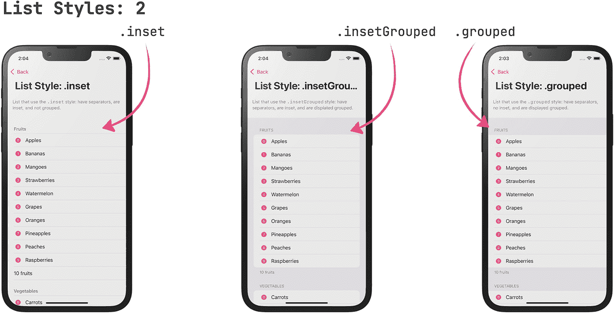
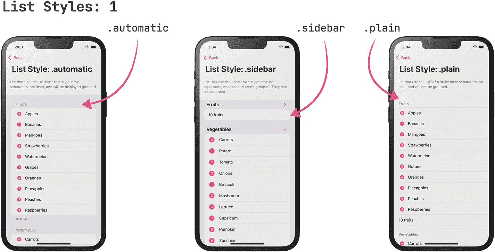
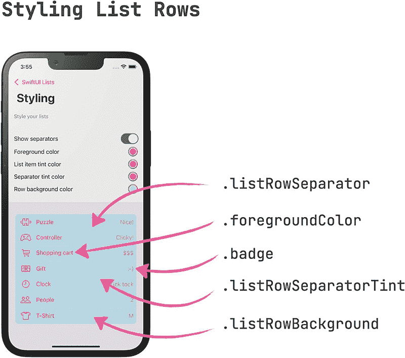
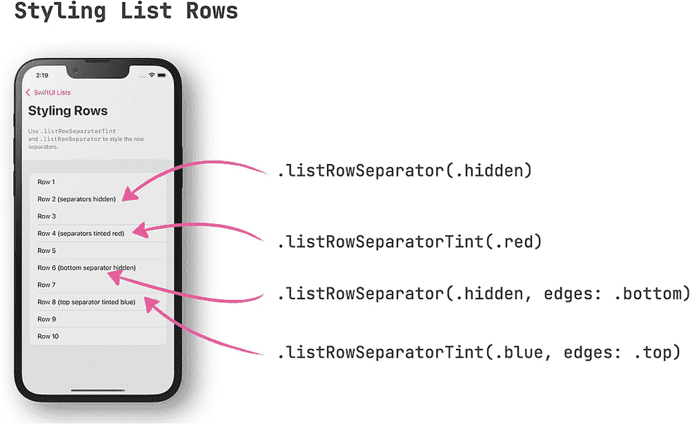
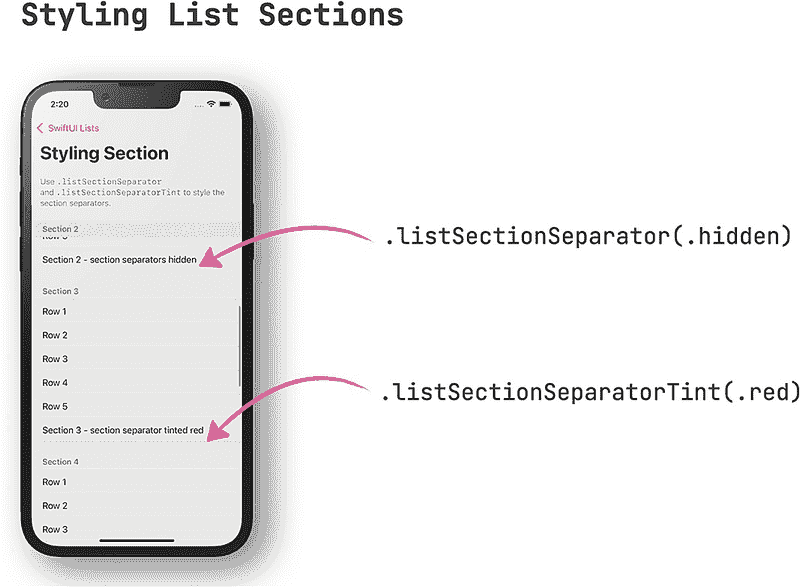
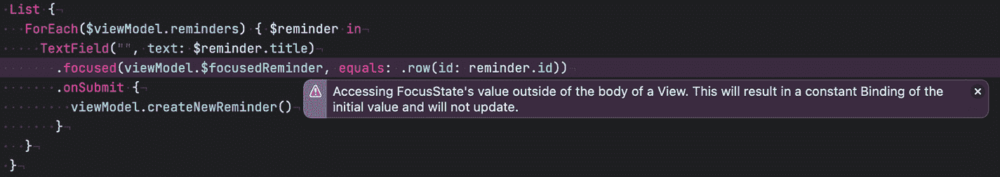

# 5. 在列表中显示数据

列表视图可能是 iOS 应用中最重要的 UI 结构之一，你很难找到一个不使用某种列表的应用。

SwiftUI 使得构建列表视图变得特别容易：只需三行代码就能创建一个简单的列表！同时，SwiftUI 的 `List` 视图非常强大且用途广泛，因此深入了解它将会物有所值。

在本章中，你将学习关于 `List` 视图所需的一切知识，从简单的列表、样式化列表及其项目、在列表视图中显示数据集合、实现列表和单个列表项上的操作，涵盖 iOS、iPadOS 和 macOS。

## SwiftUI 中的列表入门

当你创建一个新的 SwiftUI 视图时，Xcode 会使用一个如下所示的模板：

```
struct ContentView: View {
var body: some View {
Text("Hello, world!")
}
}
```

构建列表最简单的方法是创建一个新的 SwiftUI 视图，并将 *Hello World* 文本包裹在 `List` 中：

```
struct StaticListView: View {
var body: some View {
List {
Text("Hello, world!")
}
}
}
```

这将在列表视图中显示一个静态文本。

一个窗口截图的左侧显示一组程序代码。一个手机屏幕显示文本“a list with simple rows, hello world”。

图 5-1：包含一个静态文本项的简单列表视图

要向列表添加更多项，我们只需添加另一行代码：

```
List {
Text("Hello, world!")
Text("Hello, SwiftUI!")
}
```

### 在列表行内使用其他 SwiftUI 视图

`List` 视图的酷炫之处在于，你可以使用任何类型的 SwiftUI 视图作为列表行，而不仅仅是 `Text`。`Label`、`Slider`、`Stepper`、`Toggle`、`TextField`、用于输入密码的 `SecureField`、`ProgressView` 和 `Picker`——应有尽有。

```
struct StaticListView2: View {
@State var number: Int = 42
@State var degrees: Double = 37.5
@State var toggle = true
@State var name = "Peter"
@State var secret = "s3cr3t!"
var fruits = ["Apples", "Bananas", "Mangoes"]
@State var fruit = "Mangoes"
var body: some View {
List {
Text("Hello, world!")
Label("The answer", systemImage: "42.circle")
Slider(value: $degrees, in: 0...50) {
Text("\(degrees)")
} minimumValueLabel: {
Text("min")
} maximumValueLabel: {
Text("max")
}
Stepper(value: $number, in: 0...100) {
Text("\(number)")
}
Toggle(isOn: $toggle) {
Text("Checked")
}
TextField("Name", text: $name)
SecureField("Secret", text: $secret)
ProgressView(value: 0.3)
Picker(selection: $fruit, label: Text("Pick your favourite fruit")) {
ForEach(fruits, id: \.self) { fruit in
Text(fruit)
}
}
}
}
}
```

一个窗口屏幕的左侧显示一组程序代码。一个手机屏幕显示文本“a list with multiple sims, the answer, and the checked option is enabled, and pick your favorite fruit is on the right”。

图 5-2：包含高级 SwiftUI 视图的列表

### 构建自定义列表行

得益于 SwiftUI 基于堆栈的布局系统，你也可以轻松创建自定义行。在这个例子中，我们使用 `VStack` 将两个 `Text` 视图上下堆叠，复制了在许多 iOS 应用中广泛使用的典型标题和详情布局。

```
struct StaticListWithSimpleCustomRowView: View {
var body: some View {
List {
VStack(alignment: .leading) {
Text("Apples")
.font(.headline)
Text("Eat one a day")
.font(.subheadline)
}
VStack(alignment: .leading) {
Text("Bananas")
.font(.headline)
Text("High in potassium")
.font(.subheadline)
}
}
}
}
```

像这样添加自定义行虽然快速简单，但随着我们添加更多行，代码会迅速膨胀，这使得在需要进行修改时更难理解和更新。为了防止这种情况发生，我们可以将列表行的代码提取到单独的视图中，使其可重用：

```
struct StaticListWithSimpleCustomRowView: View {
var body: some View {
List {
CustomRowView(title: "Apples", subtitle: "Eat one a day")
CustomRowView(title: "Bananas", subtitle: "High in potassium")
}
}
}
private struct CustomRowView: View {
var title: String
var subtitle: String
var body: some View {
VStack(alignment: .leading) {
Text(title)
.font(.headline)
Text(subtitle)
.font(.subheadline)
}
}
}
```

一个窗口屏幕的左侧显示一组程序代码。一个手机屏幕显示文本“a list with custom row, apples eat one a day, bananas high in potassium”。

图 5-3：自定义列表行

要了解更多关于重构 SwiftUI 代码的信息，请观看此视频^(³⁸)，我在其中更详细地展示了重构 SwiftUI 视图的过程。

### 更复杂的列表行

SwiftUI 的布局系统既灵活又易于使用，并且可以轻松地通过组合使用 `HStack`、`VStack`、`ZStack` 和其他 SwiftUI 视图来创建复杂的布局。以下是如何创建包含标题、副标题、前导图片和尾随数字的列表行：

一段包含苹果、香蕉和芒果列表的代码块，以及它们各自的描述：每天吃一个、钾含量高、柔软香甜。第一行代码显示：“struct static list with custom row view”。

```
private struct CustomRowView: View {
var title: String
var description: String?
var titleIcon: String
var count: Int
init(_ title: String, description: String? = nil, titleIcon: String, count: Int = 1) {
self.title = title
self.description = description
self.titleIcon = titleIcon
self.count = count
}
var body: some View {
HStack {
Text(titleIcon)
.font(.title)
.padding(4)
.background(Color(UIColor.tertiarySystemFill))
.cornerRadius(10)
VStack(alignment: .leading) {
Text(title)
.font(.headline)
if let description = description {
Text(description)
.font(.subheadline)
}
}
Spacer()
Text("\(count)")
.font(.title)
}
}
}
```

注意我们是如何为 `CustomRowView` 使用自定义初始化器的，这使我们能够省略 `title` 属性的参数名称，并为某些属性定义默认值。结果就是，现在使用这个自定义行视图更加方便了。

一个窗口屏幕的左侧显示一组程序代码。一个手机屏幕显示文本“a list with extracted row, apple 2, banana 3, and mango 1”。

图 5-4：复杂的列表行

## 动态列表

到目前为止，我们研究了如何使用 `List` 视图创建*静态*列表视图。静态列表视图对于在 iOS 应用中创建菜单或设置屏幕很有用，但是当我们将 `List` 视图连接到数据源时，它们会变得更加有用。

现在让我们看几个示例，了解如何使用 `List` 视图显示数据的*动态*列表，例如书籍列表。我们还将学习如何使用 Apple 在 iOS 15 的最新版本 SwiftUI 中添加的一些新功能，例如下拉刷新、搜索 UI，以及使用 async/await 从异步 API（如远程服务）获取数据的简便方法。


### 显示元素列表

创建列表有多种方式，你既可以创建*扁平*列表，也可以创建*分层*或*嵌套*列表。由于所有列表行都是按需计算的，因此即使集合包含大量项目，`List` 视图也能保持良好的性能。

基于元素集合创建 `List` 视图的最简单方法是使用其构造函数，该函数接受一个 `RandomAccessCollection` 和一个用于行内容的视图构建器：

```
List(collection) { element in
// 使用 SwiftUI 视图渲染单个显示 `element` 的行
}
```

在视图构建器内部，我们可以以类型安全的方式访问集合中的单个元素。这意味着我们可以访问集合元素的属性，并使用 `Text` 等 SwiftUI 视图来渲染各个行，如下例所示：

```
struct Book: Identifiable {
    var id = UUID()
    var title: String
    var author: String
    var isbn: String
    var pages: Int
    var isRead: Bool = false
}
extension Book {
    static let samples = [
        Book(title: "Changer", author: "Matt Gemmell", isbn: "9781916265202", pages: 476),
        Book(title: "SwiftUI for Absolute Beginners", author: "Jayant Varma", isbn: "9781484255155", pages: 200),
        Book(title: "Why we sleep", author: "Matthew Walker", isbn: "9780141983769", pages: 368),
        Book(title: "The Hitchhiker's Guide to the Galaxy", author: "Douglas Adams", isbn: "9780671461492", pages: 216)
    ]
}
private class BooksViewModel: ObservableObject {
    @Published var books: [Book] = Book.samples
}
struct BooksListView: View {
    @StateObject fileprivate var viewModel = BooksViewModel()
    var body: some View {
        List(viewModel.books) { book in
            Text("\(book.title) by \(book.author)")
        }
    }
}
```

由于这个视图充当我们要显示的数据的所有者，我们使用 `@StateObject` 来持有视图模型。视图模型暴露了一个已发布的属性，该属性持有 `books` 列表。为简单起见，这是一个静态列表，但在实际应用中，你会从远程 API 或本地数据库获取这些数据。

请注意，我们如何在 `List` 内部通过编写 `book.title` 或 `book.author` 来访问 `Book` 元素的属性。在这里，我们使用 `Text` 视图通过字符串插值来显示书籍的标题和作者。

得益于 SwiftUI 的声明式语法，我们可以轻松构建更复杂的自定义 UI 来呈现数据。

让我们将前面代码片段中的 `Text` 视图替换为更精细的行，以显示书籍封面、标题、作者和页数：

```
// ...
List(viewModel.books) { book in
    HStack(alignment: .top) {
        Image(book.mediumCoverImageName)
            .resizable()
            .aspectRatio(contentMode: .fit)
            .frame(height: 90)
        VStack(alignment: .leading) {
            Text(book.title)
                .font(.headline)
            Text("by \(book.author)")
                .font(.subheadline)
            Text("\(book.pages) pages")
                .font(.subheadline)
        }
        Spacer()
    }
}
// ...
```

使用 Xcode 针对 SwiftUI 的重构工具，我们可以将此代码提取到自定义视图中，以使代码更易于阅读^(³⁹)。

```
private struct BookRowView: View {
    var book: Book
    var body: some View {
        HStack(alignment: .top) {
            Image(book.mediumCoverImageName)
                .resizable()
                .aspectRatio(contentMode: .fit)
                .frame(height: 90)
            VStack(alignment: .leading) {
                Text(book.title)
                    .font(.headline)
                Text("by \(book.author)")
                    .font(.subheadline)
                Text("\(book.pages) pages")
                    .font(.subheadline)
            }
            Spacer()
        }
    }
}
```

由于我们不打算在列表行（或详情视图）内部修改数据，我们将列表项作为简单引用传递给行。如果我们想修改列表行内的数据（例如，将一本书标记为收藏，或将其传递到用户可编辑书籍详情的子界面），则必须使用列表绑定。

### 使用列表绑定以允许修改列表项

通常，视图内的数据是不可修改的。要修改数据，需要将其作为 `@State` 属性或 `@ObservedObject` 视图模型进行管理。为了允许用户在子视图（例如 `TextField` 或详情界面）中修改数据，我们需要使用绑定将子视图中的数据连接到父视图中的状态。

在 SwiftUI 3 之前，没有直接的方法来获取列表元素的绑定，因此人们不得不提出自己的解决方案。我之前在这篇博客文章^(⁴⁰)中写过相关内容，其中讨论了实现此目的的正确与错误方法。

使用 SwiftUI 3，苹果引入了一种直接的方法，可以使用以下语法将列表项作为绑定进行访问：

```
List($collection) { $element in
    TextField("Name", text: $element.name)
}
```

为了允许我们的示例应用用户在列表视图中内联编辑书籍标题，我们只需按如下方式更新书籍列表视图：

```
List($viewModel.books) { $book in
    TextField("Book title",
              text: $book.title,
              prompt: Text("Enter the book title"))
}
```

当然，这也适用于自定义视图——以下是更新 `BookRowView` 以使书籍标题可编辑的方法：

```
struct EditableBooksListView: View {
    // ...
    var body: some View {
        List($viewModel.books) { $book in
            EditableBookRowView(book: $book)
        }
    }
}
private struct EditableBookRowView: View {
    @Binding var book: Book
    var body: some View {
        HStack(alignment: .top) {
            Image(book.mediumCoverImageName)
                .resizable()
                .aspectRatio(contentMode: .fit)
                .frame(height: 90)
            VStack(alignment: .leading) {
                TextField("Book title", text: $book.title, prompt: Text("Enter the book title"))
                    .font(.headline)
                Text("by \(book.author)")
                    .font(.subheadline)
                Text("\(book.pages) pages")
                    .font(.subheadline)
            }
            Spacer()
        }
    }
}
```

这里的关键点是在子视图中使用 `@Binding`。通过这样做，父视图保留了对你传递给子视图的数据的所有权，同时允许子视图修改数据。*数据源*是父视图中 `ObservableObject` 上的 `@Published` 属性。

要了解更多关于列表绑定以及此功能在底层如何工作的信息，请查看我的文章 SwiftUI 列表绑定^(⁴¹)。


好的，作为一名高级文档工程师和翻译员，我将遵循您提供的注意事项和示例，将给定的英文文本翻译成中文。

以下是翻译后的内容：


### 异步获取数据

本章接下来的部分有一个共同点——它们都基于 Apple 用于处理异步代码的新 API。

在 WWDC 21 上，Apple 引入了 Swift 新的并发模型，作为 Swift 5.5 的一部分。

在之前的例子中，我们使用了静态数据列表。这种方法的好处是我们不需要获取（并等待）这些数据，因为它们已经在内存中了。这对于示例来说没问题，因为它让我们能够专注于关键内容，但这并不反映现实情况。在实际应用中，我们通常会显示来自远程 API 的数据，这通常意味着要执行异步调用：在等待远程 API 返回结果的同时，应用程序需要继续更新 UI。如果不这样做，用户可能会觉得应用程序卡住了，甚至崩溃了。

因此，在接下来的示例中，我将演示如何利用 Swift 新的并发模型来处理异步代码。

获取数据的一个好时机是当用户导航到一个新屏幕并且屏幕刚刚出现时。在早期版本的 SwiftUI 中，使用 `.onAppear` 视图修饰符是请求数据的好地方。从 iOS 15 开始，SwiftUI 包含了一个新的视图修饰符，使这变得更容易：`.task`。它会在视图出现时启动一个异步的 `Task`，并在视图消失时取消这个任务（如果任务仍在运行）。如果你的任务是长时间运行的下载，并且希望在用户离开屏幕时自动中止，这将非常有用。

使用 `.task` 就像将其应用于你的 `List` 视图一样简单：

```
struct AsyncFetchBooksListView: View {
    @StateObject fileprivate var viewModel = AsyncFetchBooksViewModel()
    var body: some View {
        List(viewModel.books) { book in
            AsyncFetchBookRowView(book: book)
        }
        .overlay {
            if viewModel.fetching {
                ProgressView("正在获取数据，请稍候...")
                    .progressViewStyle(CircularProgressViewStyle(tint: .accentColor))
            }
        }
        .animation(.default, value: viewModel.books)
        .task {
            await viewModel.fetchData()
        }
    }
}
```

在视图模型中，你可以使用异步 API 来获取数据。在这个例子中，我模拟了后端以使代码更易于阅读，并添加了一个人为的延迟：

```
private class AsyncFetchBooksViewModel: ObservableObject {
    @Published var books = [Book]()
    @Published var fetching = false
    func fetchData() async {
        fetching = true
        await Task.sleep(2_000_000_000)
        books = Book.samples
        fetching = false
    }
}
```

如果你尝试这样运行代码，你会遇到一个运行时警告，提示“不允许从后台线程发布更改；确保在模型更新时从主线程（通过 `receive(on:)` 等操作符）发布值。”

此运行时错误的原因是 `fetchData` 内部的代码未在主线程上执行。然而，UI 更新*必须*在主线程上执行。过去，我们必须使用 `DispatchQueue.main.async { ... }` 来确保任何 UI 更新都在主线程上执行。但是，使用 Swift 新的并发模型，有一个更简单的方法：我们只需要使用 `@MainActor` 属性包装器来标记任何执行 UI 更新的方法（或类）。这会指示编译器在执行此代码时切换到主参与者，从而确保所有 UI 更新都在主线程上运行。以下是更新后的代码：

```
private class AsyncFetchBooksViewModel: ObservableObject {
    @Published var books = [Book]()
    @Published var fetching = false
    @MainActor
    func fetchData() async {
        fetching = true
        await Task.sleep(2_000_000_000)
        books = Book.samples
        fetching = false
    }
}
```

要了解更多关于 Swift 新并发模型的信息，请查看我的视频系列^(⁴²)，以及我博客上的以下文章：

* 在 SwiftUI 中开始使用 `async/await`^(⁴³)
* 协作式任务取消 - SwiftUI 并发性要点^(⁴⁴)

### 下拉刷新

除非你使用像 Cloud Firestore^(⁴⁵) 这样可以实时监听后端更新的 SDK，否则你会希望为你的应用添加一些 UI 元素，让用户能够轻松请求最新数据。最常见的让用户刷新数据的方式之一是*下拉刷新*，它在 2008 年由 Loren Brichter 在 Tweetie 应用^(⁴⁶)中推广开来（后来被 Twitter 收购，并重新发布为 Twitter for iOS）。

SwiftUI 凭借其声明式特性，只需几行代码就能轻松地将此功能添加到你的应用程序中。正如前面提到的，此功能也利用了 Swift 新的并发模型，以确保即使在等待更新到达时，你的应用 UI 也能保持响应。

只需将 `refreshable` 视图修饰符添加到你的 `List` 视图中，即可为你的应用添加*下拉刷新*功能：

```
struct RefreshableBooksListView: View {
    @StateObject var viewModel = RefreshableBooksViewModel()
    var body: some View {
        List(viewModel.books) { book in
            RefreshableBookRowView(book: book)
        }
        .refreshable {
            await viewModel.refresh()
        }
    }
}
```

正如 `await` 关键字所示，`refreshable` 打开了一个异步执行上下文。这要求你在 `refreshable` 内部调用的代码能够异步执行（如果你调用的代码可以同步执行，因为它会立即返回，那也没问题，但通常情况下，你会希望与需要异步调用的远程 API 进行通信）。

为了让您了解其可能的样子，我创建了一个视图模型，通过添加一些人为的等待时间来模拟异步远程 API：

```
class RefreshableBooksViewModel: ObservableObject {
    @Published var books: [Book] = Book.samples
    private func generateNewBook() -> Book {
        let title = Lorem.sentence
        let author = Lorem.fullName
        let pageCount = Int.random(in: 42...999)
        return Book(title: title, author: author, isbn: "9781234567890", pages: pageCount)
    }
    func refresh() async {
        await Task.sleep(2_000_000_000)
        let book = generateNewBook()
        books.insert(book, at: 0)
    }
}
```

让我们看看这段代码，了解发生了什么。

1. 与前面的示例一样，`books` 是一个发布属性，视图订阅了它。
2. `generateNewBook` 是一个局部函数，它使用优秀的 LoremSwiftum^(⁴⁷) 库生成一个随机的新的 `Book` 实例。
3. 在 `refresh` 内部，我们调用 `generateBook` 生成一个新书，然后将其插入到发布属性 `books` 中，但在执行此操作之前，我们使用 `Task.sleep` 调用让应用程序休眠 2 秒。这是一个异步调用，因此我们需要使用 `await` 来调用它。

与前面的示例一样，此代码会产生一个紫色运行时警告：“不允许从后台线程发布更改；确保在模型更新时从主线程（通过 `receive(on:)` 等操作符）发布值”，因此我们需要使用 `@MainActor` 来确保所有更新都发生在主参与者上。这次，我们不只标记 `refresh` 方法，而是要将整个视图模型标记为 `@MainActor`：

```
@MainActor
class RefreshableBooksViewModel: ObservableObject {
    // ...
    func refresh() async {
        // ...
    }
}
```

在结束本节之前，还有最后一项调整：您会注意到，通过下拉刷新向列表添加新项目时，新添加的项目会立即出现，没有平滑的过渡。

得益于 SwiftUI 的声明式语法，添加动画使其感觉更自然变得超级简单：我们只需要在 `List` 视图上添加一个 `animation` 视图修饰符即可：

```
// ...
List(viewModel.books) { book in
    RefreshableBookRowView(book: book)
}
.animation(.default, value: viewModel.books)
// ...
```

通过提供 `value` 参数，我们可以确保仅当列表视图的内容发生变化时（例如，当插入或删除新项目时），才会运行动画。


为了完善动画效果，我们还会在视图模型的`refresh`函数末尾添加一个短暂暂停——这能确保在进度旋转图标消失前，新行以平滑过渡的方式出现：

```swift
func refresh() async {
    await Task.sleep(2_000_000_000)
    let book = generateNewBook()
    books.insert(book, at: 0)
    // 以下这一行与`.animation`修饰符结合，确保我们有平滑的动画效果
    await Task.sleep(500_000_000)
}
```

### 搜索

SwiftUI 让在`List`视图中实现搜索变得轻而易举——你只需要对列表视图应用`.searchable`视图修饰符，SwiftUI 就会自动为你处理所有 UI 方面的问题：它会显示一个搜索字段（并确保在首次显示列表视图时它位于屏幕外，就像你在原生应用中所期望的那样）。它还具有触发搜索和清除搜索字段的所有 UI 便利功能。

剩下的唯一一件事就是实际执行搜索并提供适当的结果集。

一般来说，搜索屏幕可以是在本地运行（即，过滤列表视图中显示的项），也可以是远程运行（即，对远程 API 执行查询并仅显示此调用的结果）。

在本节中，我们将着眼于过滤列表视图中显示的元素。为此，我们将结合使用`async/await`和 Combine。

首先，我们将构建一个简单的`List`视图，该视图显示来自视图模型的书籍列表。这看起来应该非常熟悉，因为我们实际上重用了之前示例中的大量代码：

```swift
struct SearchableBooksListView: View {
    @StateObject var viewModel = SearchableBooksViewModel()
    var body: some View {
        List(viewModel.books) { book in
            SearchableBookRowView(book: book)
        }
    }
}

struct SearchableBookRowView: View {
    var book: Book
    var body: some View {
        HStack(alignment: .top) {
            Image(book.mediumCoverImageName)
                .resizable()
                .aspectRatio(contentMode: .fit)
                .frame(height: 90)
            VStack(alignment: .leading) {
                Text(book.title)
                    .font(.headline)
                Text("作者：\(book.author)")
                    .font(.subheadline)
                Text("\(book.pages) 页")
                    .font(.subheadline)
            }
            Spacer()
        }
    }
}
```

该视图模型与我们之前使用的非常相似，但有一个重要的区别——书籍集合最初是空的：

```swift
class SearchableBooksViewModel: ObservableObject {
    @Published var books = [Book]()
}
```

为了给`SearchableBooksListView`添加搜索 UI，我们应用`.searchable`视图修饰符，并将其`text`参数绑定到视图模型上的一个新属性`searchTerm`：

```swift
class SearchableBooksViewModel: ObservableObject {
    @Published var books = [Book]()
    @Published var searchTerm: String = ""
}

struct SearchableBooksListView: View {
    @StateObject var viewModel = SearchableBooksViewModel()
    var body: some View {
        List(viewModel.books) { book in
            SearchableBookRowView(book: book)
        }
        .searchable(text: $viewModel.searchTerm)
    }
}
```

这会在`List`视图中安装搜索 UI，但如果你运行此代码，什么也不会发生。实际上，你甚至不会在列表视图中看到任何书籍。

要改变这一点，我们将向视图模型添加一个新的私有属性，该属性保存原始的、未过滤的书籍列表。最后，我们将设置一个 Combine 管道，根据用户输入的搜索词过滤此列表：

```swift
class SearchableBooksViewModel: ObservableObject {
    @Published private var originalBooks = Book.samples
    @Published var books = [Book]()
    @Published var searchTerm: String = ""
    init() {
        Publishers.CombineLatest($originalBooks, $searchTerm) // (1)
            .map { books, searchTerm in // (2)
                books.filter { book in // (3)
                    searchTerm.isEmpty
                        ? true
                        : (book.title.matches(searchTerm)
                            || book.author.matches(searchTerm))
                }
            }
            .assign(to: &$books)
    }
}
```

这个 Combine 管道是如何工作的？

1. 我们使用`Publishers.CombineLatest`来获取两个发布者（`$originalBooks`和`$searchTerm`）的最新状态。在真实的应用程序中，我们可能会在后台收到书籍集合的更新，并且我们希望这些更新也包含在搜索结果中。每当其中一个发布者发送新事件时，`CombineLatest`发布者都会发布一个新的元组，其中包含`originalBooks`和`searchTerm`的最新值。

2. 然后我们使用`.map`操作符将`(books, searchTerm)`元组转换成一个书籍数组，我们最终会将其赋值给已发布的`$books`属性，该属性连接到`SearchableBooksListView`。

3. 在`.map`闭包内部，我们使用`filter`仅返回那些标题或作者姓名中包含搜索词的书籍。这部分过程实际上并非 Combine 特有——`filter`是`Array`的一个方法。

如果你运行此代码，你会注意到你输入搜索字段的每个字符都会自动大写。为了防止这种情况，我们可以在`searchable`视图修饰符*之后*应用`.autocapitalization`视图修饰符：

```swift
struct SearchableBooksListView: View {
    @StateObject var viewModel = SearchableBooksViewModel()
    var body: some View {
        List(viewModel.books) { book in
            SearchableBookRowView(book: book)
        }
        .searchable(text: $viewModel.searchTerm)
        .autocapitalization(.none)
    }
}
```

## 样式设计

列表提供了广泛的样式选项，随着 SwiftUI 3 的推出，现在几乎可以配置列表视图的所有方面：

* 列表本身的整体外观（即列表样式）
* 列表单元格的外观
* 分隔线（终于可以了！）
* ……以及更多

让我们来看看有哪些可能。

### 列表样式

列表视图的整体外观和感觉可以通过`.listStyle`视图修饰符来控制。SwiftUI 支持六种不同的外观：

1. `.automatic`
2. `.grouped`
3. `.inset`
4. `.insetGrouped`
5. `.plain`
6. `.sidebar`

```swift
List(items) { item in
    Text("\(item.label)")
}
.listStyle(.plain)
```

如果你不提供样式，SwiftUI 将假定为`.automatic`。在 iOS 上，`.automatic`和`.insetGrouped`的外观相同。

与其试图用文字描述每种样式的外观，不如用图片来展示每种样式。



三张手机屏幕截图，分别标注为：a，列表样式 .inset — 列出 10 种水果；b，列表样式 .insetGrouped — 列出蔬菜和水果；c，列表样式 .grouped — 下方列出水果名称。箭头显示了不同的样式类型。

**图 5-6**：更多列表样式



三张手机屏幕截图，分别标注为：a，列表样式 .automatic — 列出 10 种水果；b，列表样式 .sidebar — 蔬菜和水果隐藏在侧边栏下；c，列表样式 .plain — 列出水果。标签分别为 .automatic、.sidebar 和 .plain。

**图 5-5**：列表样式


### 页眉与页脚

所有`List`视图样式都支持页眉和页脚。要为某个分区指定页眉和/或页脚，请使用接受`header`或`footer`参数的构造器之一。

不过，我偏爱的页眉页脚创建方式似乎已被标记为弃用：

```
@available(iOS 13.0, macOS 10.15, tvOS 13.0, watchOS 6.0, *)
extension Section where Parent : View, Content : View, Footer : View {
/// 创建一个包含页眉、页脚和提供的内容的分区。
/// - 参数:
///   - header: 用作分区页眉的视图。
///   - footer: 用作分区页脚的视图。
///   - content: 分区的内容。
@available(iOS, deprecated: 100000.0, renamed: "Section(content:header:footer:)")
@available(macOS, deprecated: 100000.0, renamed: "Section(content:header:footer:)")
@available(tvOS, deprecated: 100000.0, renamed: "Section(content:header:footer:)")
@available(watchOS, deprecated: 100000.0, renamed: "Section(content:header:footer:)")
public init(header: Parent, footer: Footer, @ViewBuilder content: () -> Content)
}
```

以下是我偏好的为分区设置页眉和页脚的方式：

```
List {
Section(header: Text("水果"), footer: Text("共 \(fruits.count) 种水果")) {
ForEach(fruits, id: \.self) { fruit in
Label(fruit, systemImage: "\(fruits.firstIndex(of: fruit) ?? 0).circle.fill" )
}
}
}
```

以下是实现相同效果的新方式：

```
List {
Section {
ForEach(fruits, id: \.self) { fruit in
Label(fruit, systemImage: "\(fruits.firstIndex(of: fruit) ?? 0).circle.fill" )
}
} header: {
Text("水果")
} footer: {
Text("共 \(fruits.count) 种水果")
}
}
```

哪种写法更简洁，由你来判断——执行时，它们的效果完全相同。

### 列表单元格

在`UITableViewController`的早期，设计自定义单元格曾是一件相当复杂的事情，值得庆幸的是，从那以后事情变得简单多了。

在 SwiftUI 中，设计自定义的`List`行入门很容易（只需使用一个简单的`Text`视图来展示当前项目），但可能性是无限的，因为你可以利用 SwiftUI 灵活的基于堆栈的布局系统。关于构建自定义`List`行的通用介绍，请查看本系列的第一部分，其中涵盖了一些基础技术。

此外，SwiftUI 支持多种方式来样式化`List`行的常见方面，例如它们的背景、缩进、强调色、色调和徽章。

以下是一个代码片段，展示了如何配置一个列表行：

```
List(items, id: \.title) { item in
Label(item.title, systemImage: item.iconName)
.badge(item.badge)
// listItemTint 和 foregroundColor 互斥
// .listItemTint(listItemTintColor)
.foregroundColor(foregroundColor)
.listRowSeparator(showSeparators == true ? .visible : .hidden)
.listRowSeparatorTint(separatorTintColor)
.listRowBackground(rowBackgroundColor)
}
}
```



**图 5-7** 列表样式

### 分隔符

任何设计师都会告诉你，项目之间的空间与项目本身同等重要。在 SwiftUI 3 中，现在可以影响行分隔符和分区分隔符的样式：色调颜色和可见性都可控。SwiftUI 灵活的 DSL 使得为整个`List`视图或单个行和分区控制这些属性变得容易。

要控制行分隔符的外观，可以使用`.listRowSeparator()`和`.listRowSeparatorTint()`。你可以指定要配置的边（`.top`或`.bottom`）。如果没有为`edges`参数提供任何值，则顶部*和*底部都将被修改。

```
List {
Text("第 1 行")
Text("第 2 行（分隔符隐藏）")
.listRowSeparator(.hidden)
Text("第 3 行")
Text("第 4 行（分隔符着色为红色）")
.listRowSeparatorTint(.red)
Text("第 5 行")
Text("第 6 行（底部分隔符隐藏）")
.listRowSeparator(.hidden, edges: .bottom)
Text("第 7 行")
Text("第 8 行（顶部分隔符着色为蓝色）")
.listRowSeparatorTint(.blue, edges: .top)
Text("第 9 行")
Text("第 10 行")
}
```



**图 5-8** 样式化列表行

要控制分区分隔符的外观，可以使用`.listSectionSeparator()`和`.listSectionSeparatorTint()`。就像列表行的视图修饰符一样，这两种视图修饰符都支持指定要修改的边。

```
List {
Section(header: Text("分区 1"), footer: Text("分区 1 - 无样式")) {
Text("第 1 行")
}
Section(header: Text("分区 2"), footer: Text("分区 2 - 分区分隔符隐藏")) {
Text("第 1 行")
}
.listSectionSeparator(.hidden)
Section(header: Text("分区 3"), footer: Text("分区 3 - 分区分隔符着色为红色")) {
Text("第 1 行")
}
.listSectionSeparatorTint(.red)
Section(header: Text("分区 4"), footer: Text("分区 4 - 分区分隔符着色为绿色")) {
Text("第 1 行")
}
.listSectionSeparatorTint(.green, edges: [.top, .bottom])
Section(header: Text("分区 5"), footer: Text("分区 5 - 分区分隔符（底部）隐藏")) {
Text("第 1 行")
}
.listSectionSeparator(.hidden, edges: .bottom)
Section("分区 6") {
Text("第 1 行")
}
}
```



**图 5-9** 样式化列表分区

## 操作

现在让我们来看看滑动操作。滑动操作被广泛应用于许多应用中，最突出的是苹果自家的邮件应用。它提供了一种广为人知且易于使用的界面交互方式，允许用户对列表项执行操作。

UIKit 自 iOS 11 起就支持滑动操作，但 SwiftUI 直到 WWDC 2021 才支持滑动操作。

在这篇文章中，我们将探讨以下功能：

* **使用`onDelete`修饰器进行滑动删除**
* **使用`EditButton`和`.editMode`环境值来删除和移动项目**
* **使用滑动操作**（这是最灵活的方法，也为我们提供了丰富的样式选项）


### 滑动删除

这个功能从 SwiftUI 诞生之初就存在了。它用起来非常直接，但也相当基础（或者说不够灵活）。要为 `List` 视图添加滑动删除功能，你只需要在 `List` 视图内的 `ForEach` 循环上应用 `onDelete` 修饰符即可。该修饰符需要一个带有一个参数的闭包，该参数包含一个 `IndexSet`，用于指示要删除哪些行。

以下代码片段展示了一个带有 `onDelete` 修饰符的简单 `List`。当用户滑动删除时，闭包会被调用，从而从支撑 `List` 视图的项目数组中移除相应的行：

```swift
struct SwipeToDeleteListView: View {
    @State fileprivate var items = [
        Item(title: "拼图", iconName: "puzzlepiece", badge: "不错！"),
        Item(title: "手柄", iconName: "gamecontroller", badge: "咔哒响！"),
        Item(title: "购物车", iconName: "cart", badge: "$$$"),
        Item(title: "礼物", iconName: "giftcard", badge: ":-)"),
        Item(title: "时钟", iconName: "clock", badge: "滴答"),
        Item(title: "人群", iconName: "person.2", badge: "2"),
        Item(title: "T 恤", iconName: "tshirt", badge: "M")
    ]
    var body: some View {
        List {
            ForEach(items) { item in
                Label(item.title, systemImage: item.iconName)
            }
            .onDelete { indexSet in
                items.remove(atOffsets: indexSet)
            }
        }
    }
}
```

实际上，`onDelete` 传递一个 `IndexSet` 来指示哪些项目应被删除，这非常方便，因为 `Array` 提供了一个接收 `IndexSet` 的 `remove(atOffsets:)` 方法。

值得注意的是，你不能直接将 `onDelete` 应用于 `List`——你需要改用 `ForEach` 循环，并将其嵌套在 `List` 内部^(⁴⁸)。

### 使用编辑模式移动和删除项目

对于某些应用来说，让用户通过拖动来重新排列列表中的项目是合理的。SwiftUI 让实现这一点变得极其简单——你只需在 `List` 上应用 `onMove` 视图修饰符，然后相应地更新底层数据结构即可。

以下代码片段展示了如何为简单数组实现此功能：

```swift
List {
    ForEach(items) { item in
        Label(item.title, systemImage: item.iconName)
    }
    .onDelete { indexSet in
        items.remove(atOffsets: indexSet)
    }
    .onMove { indexSet, index in
        items.move(fromOffsets: indexSet, toOffset: index)
    }
}
```

这同样很简单，得益于 `Array.move`，它期望的参数与我们接收到的 `onDelete` 闭包参数完全一致。

要开启 `List` 的编辑模式，有两种选择：

*   使用 `.editMode` 环境值
*   使用 `EditButton` 视图

在底层，这两种方法都利用了 SwiftUI 的环境。以下代码片段演示了如何使用 `EditButton` 允许用户开启列表的编辑模式：

```swift
List {
    ForEach(items) { item in
        Label(item.title, systemImage: item.iconName)
    }
    .onDelete { indexSet in
        items.remove(atOffsets: indexSet)
    }
    .onMove { indexSet, index in
        items.move(fromOffsets: indexSet, toOffset: index)
    }
}
.toolbar {
    EditButton()
}
```

### 滑动操作

对于超出滑动删除和 `EditMode` 的功能，SwiftUI 现在支持滑动操作。这个新的 API 让我们对如何显示滑动操作有了很多控制：

*   我们可以为每行定义不同的滑动操作。
*   我们可以为每个单独的操作指定文本、图标和色调颜色。
*   我们可以在行的前缘和后缘添加操作。
*   我们可以启用或禁用行任一端第一个操作的完全滑动，允许用户通过将行完全滑动到相应边缘来触发该操作。

#### 基本滑动操作

让我们看一个关于如何使用这个新 API 的简单示例。要为 `List` 行注册一个滑动操作，我们需要调用 `swipeActions` 视图修饰符。在此视图修饰符的闭包中，我们可以设置一个（或多个）`Button` 来实现操作本身。

以下代码演示了如何向 `List` 视图添加一个简单的滑动操作：

```swift
List(viewModel.items) { item in
    Text(item.title)
        .fontWeight(item.isRead ? .regular : .bold)
        .swipeActions {
            Button (action: { viewModel.markItemRead(item) }) {
                if let isRead = item.isRead, isRead == true {
                    Label("已读", systemImage: "envelope.badge.fill")
                }
                else {
                    Label("未读", systemImage: "envelope.open.fill")
                }
            }
            .tint(.blue)
        }
}
```

值得注意的是，`swipeActions` 修饰符是在代表行的视图上调用的。在本例中，它是一个简单的 `Text` 视图，但对于更复杂的列表，它也可能是一个 `HStack` 或 `VStack`。这与 `onDelete` 修饰符（需要应用于 `List` 视图内的 `ForEach` 循环）不同，它使我们能够根据不同的行灵活地应用不同的操作集。

另请注意，每个滑动操作都由一个 `Button` 表示。如果你使用任何其他视图，SwiftUI 将不会注册它，也不会显示任何操作。同样，如果你尝试将 `swipeActions` 修饰符应用于 `List` 或 `ForEach` 循环，该修饰符将被忽略。

#### 指定边缘

默认情况下，滑动操作将添加到行的后缘。这就是为什么在前面的例子中，*标记为已读/未读*操作被添加到了后缘。要将操作添加到前缘（就像 Apple 的邮件应用那样），我们只需要指定 `edge` 参数，如下所示：

```swift
List(viewModel.items) { item in
    Text(item.title)
        .fontWeight(item.isRead ? .regular : .bold)
        .swipeActions(edge: .leading) {
            Button (action: { viewModel.markItemRead(item) }) {
                if let isRead = item.isRead, isRead == true {
                    Label("已读", systemImage: "envelope.badge.fill")
                }
                else {
                    Label("未读", systemImage: "envelope.open.fill")
                }
            }
            .tint(.blue)
        }
}
```

要在任一边缘添加操作，我们可以多次调用 `swipeActions` 修饰符，指定要添加操作的边缘。

如果你同时在前缘和后缘添加滑动操作，最好明确指定要在哪里添加操作。在以下代码片段中，我们向前缘添加了一个操作，向后缘添加了另一个操作：

```swift
List(viewModel.items) { item in
    Text(item.title)
        .fontWeight(item.isRead ? .regular : .bold)
        .swipeActions(edge: .leading) {
            Button (action: { viewModel.markItemRead(item) }) {
                if let isRead = item.isRead, isRead == true {
                    Label("已读", systemImage: "envelope.badge.fill")
                }
                else {
                    Label("未读", systemImage: "envelope.open.fill")
                }
            }
            .tint(.blue)
        }
        .swipeActions(edge: .trailing) {
            Button(role: .destructive, action: { viewModel.deleteItem(item) } ) {
                Label("删除", systemImage: "trash")
            }
        }
}
```

你可能注意到，我们在 `Button` 上使用了 `role` 参数来指示它是 `.destructive`——这指示 SwiftUI 为此按钮使用红色背景颜色。不过，我们仍然需要自己实现删除项目的逻辑。而且，由于 `Button` 的 `action` 闭包在当前行的作用域内，因此更容易直接访问当前列表的 `item`——这是此 API 设计相对于之前 `onDelete` 设计的另一个优势。

#### 滑动操作与 onDelete

在阅读了前面的代码片段后，你可能想知道为什么我们不使用 `onDelete` 视图修饰符，而是自己实现删除操作。答案很简单：如文档所述，一旦你使用了 `swipeActions` 修饰符，SwiftUI 将停止合成删除功能。


#### 添加更多滑动操作

要为任意边缘添加多个滑动操作，可以多次调用 `swipeActions` 修饰符：

```
List(viewModel.items) { item in
    Text(item.title)
        .fontWeight(item.isRead ? .regular : .bold)
        .swipeActions(edge: .leading) {
            Button(action: { viewModel.markItemRead(item) }) {
                if let isRead = item.isRead, isRead == true {
                    Label("已读", systemImage: "envelope.badge.fill")
                } else {
                    Label("未读", systemImage: "envelope.open.fill")
                }
            }
            .tint(.blue)
        }
        .swipeActions(edge: .trailing) {
            Button(role: .destructive, action: { viewModel.deleteItem(item) }) {
                Label("删除", systemImage: "trash")
            }
        }
        .swipeActions(edge: .trailing) {
            Button(action: { selectedItem = item }) {
                Label("标记", systemImage: "tag")
            }
            .tint(Color(UIColor.systemOrange))
        }
}
```

如果你觉得这样不太习惯，也可以在同一条 `swipeActions` 修饰符中添加多个按钮。以下代码片段产生的界面效果与上一段相同：

```
List(viewModel.items) { item in
    Text(item.title)
        .fontWeight(item.isRead ? .regular : .bold)
        .badge(item.badge)
        .swipeActions(edge: .leading) {
            Button(action: { viewModel.markItemRead(item) }) {
                if let isRead = item.isRead, isRead == true {
                    Label("已读", systemImage: "envelope.badge.fill")
                } else {
                    Label("未读", systemImage: "envelope.open.fill")
                }
            }
            .tint(.blue)
        }
        .swipeActions(edge: .trailing) {
            Button(role: .destructive, action: { viewModel.deleteItem(item) }) {
                Label("删除", systemImage: "trash")
            }
            Button(action: { selectedItem = item }) {
                Label("标记", systemImage: "tag")
            }
            .tint(Color(UIColor.systemOrange))
        }
}
```

如果在同一侧边缘添加了多个滑动操作，它们将从外侧开始排列，这意味着第一个按钮始终会最靠近对应的边缘。

> 请注意，虽然从理论上讲，在行任意一侧添加的滑动操作数量没有限制，但用户能够舒适使用的操作数量取决于他们的设备。例如，竖屏模式下的 iPhone 13 列表行最多可以容纳五个滑动操作，但此时它们会完全填满整行，不仅看起来奇怪，而且在尝试点击正确按钮时也会出现问题。较小的设备（如 iPhone 6 甚至 iPhone 5）能容纳的滑动操作更少。三到四个滑动操作似乎是合理的上限，应当能在大多数设备上正常工作。

#### 全滑动

默认情况下，通过全滑动可以触发任意滑动方向上的第一个操作。你可以将 `allowsFullSwipe` 参数设置为 `false` 来禁用此行为：

```
.swipeActions(edge: .trailing, allowsFullSwipe: false) {
    Button(role: .destructive, action: { viewModel.deleteItem(item) }) {
        Label("删除", systemImage: "trash")
    }
}
```

#### 美化滑动操作样式

如前所述，将滑动操作 `Button` 的 `role` 设置为 `.destructive` 会自动将按钮颜色变为红色。如果不指定 `role`，`Button` 的颜色将是浅灰色。你可以通过对滑动操作的 `Button` 使用 `tint` 修饰符指定任何其他颜色——示例如下：

```
.swipeActions(edge: .trailing) {
    Button(action: { selectedItem = item }) {
        Label("标记", systemImage: "tag")
    }
    .tint(Color(UIColor.systemOrange))
}
```

在 `Button` 内部，你可以使用 `Image`、`Text` 或 `Label` 同时显示文本标签和/或图标。

## 管理列表中的焦点

对于几乎任何类型的用户界面而言，焦点管理都是一个重要方面——处理好这一点有助于用户更快速、更高效地导航你的应用。在桌面界面中，我们通常期望能够通过按 Tab 键在表单的输入字段间导航，而在移动设备上这一点同样重要。例如，在苹果的“提醒事项”应用中，当你创建新提醒时，光标会自动定位到该提醒处，并且当你按下 Enter 键时，光标会移至下一行。这样，你就能非常高效地添加新元素。

苹果在 iOS 15 中为 SwiftUI 添加了对焦点管理的支持——这包括设置和观察焦点。

无论是在苹果官方文档中，还是在其他开发者的博客和视频中，大部分示例仅讨论了如何在简单表单（如登录表单）中使用焦点管理。更高级的用例，例如在可编辑列表中管理焦点，则未被涵盖。

接下来，我将向你展示如何在一个允许用户编辑列表元素的应用中管理焦点状态。作为示例，我将使用我正在开发的一款待办事项应用 Make It So。Make It So 是苹果“提醒事项”应用的复刻版本，其目标在于探索仅使用 SwiftUI 和 Firebase（用于存储等后端服务）能多大程度上还原原版应用^(⁴⁹)。

### 如何在 SwiftUI 中管理焦点

在 WWDC 2021 上，苹果引入了 `@FocusState`，这是一个属性包装器，可用于跟踪和修改场景中的焦点。

你可以使用 `Bool` 或 `enum` 来跟踪用户界面中哪个元素获得了焦点。

以下示例使用一个包含两个枚举值的 `enum` 来跟踪一个简单的用户资料表单的焦点。正如你在 `Button` 的闭包中所见，我们可以通过编程方式设置焦点，例如当用户忘记填写必填字段时。

```
enum FocusableField: Hashable {
    case firstName
    case lastName
}

struct FocusUsingEnumView: View {
    @FocusState private var focus: FocusableField?
    @State private var firstName = ""
    @State private var lastName = ""

    var body: some View {
        Form {
            TextField("名字", text: $firstName)
                .focused($focus, equals: .firstName)
            TextField("姓氏", text: $lastName)
                .focused($focus, equals: .lastName)
            Button("保存") {
                if firstName.isEmpty {
                    focus = .firstName
                } else if lastName.isEmpty {
                    focus = .lastName
                } else {
                    focus = nil
                }
            }
        }
    }
}
```

这种方法对于输入元素寥寥无几的简单输入表单效果很好，但对于显示不定量元素的 `List` 视图或其他动态视图而言并不可行。

### 如何在列表中管理焦点

要在 `List` 视图中管理焦点，我们可以利用 Swift `enum` 支持关联值的特性。这使我们能够定义一个可以持有待焦点列表元素 `id` 的 `enum`：

```
enum Focusable: Hashable {
    case none
    case row(id: String)
}
```

有了这个基础，我们可以定义一个类型为 `Focusable` 的局部变量 `focusedReminder`，并使用 `@FocusState` 对其进行包装：

```
struct Reminder: Identifiable {
    var id: String = UUID().uuidString
    var title: String
}

struct FocusableListView: View {
    @State var reminders: [Reminder] = Reminder.samples
    @FocusState var focusedReminder: Focusable?

    var body: some View {
        List {
            ForEach($reminders) { $reminder in
                TextField("", text: $reminder.title)
                    .focused($focusedReminder, equals: .row(id: reminder.id))
            }
        }
        .toolbar {
            ToolbarItemGroup(placement: .bottomBar) {
                Button(action: { createNewReminder() }) {
                    Text("新建提醒")
                }
            }
        }
    }
    // ...
}
```

当用户点击“新建提醒”工具栏按钮时，我们会向 `reminders` 数组中添加一个新的 `Reminder`。要将焦点设置到这条新创建的提醒所在的行，我们只需使用新提醒的 `id` 作为关联值创建一个 `Focusable` 枚举实例，并将其赋值给 `focusedReminder` 属性即可：

```
struct FocusableListView: View {
    // ...
    func createNewReminder() {
        let newReminder = Reminder(title: "")
        reminders.append(newReminder)
        focusedReminder = .row(id: newReminder.id)
    }
}
```


### 处理回车键

现在让我们将注意力转向苹果“提醒事项”应用的另一个功能，该功能将改善我们应用的用户体验：当用户按下`Enter`键时，添加新元素（并使其获得焦点）。

我们可以使用`.onSubmit`视图修饰符，在用户向视图提交值时运行代码。默认情况下，这将在用户点击`Enter`键时触发：

```
...
TextField("", text: $reminder.title)
.focused($focusedTask, equals: .row(id: reminder.id))
.onSubmit {
createNewTask()
}
...
```

这运行良好，但所有新元素都将添加到列表末尾。如果用户刚刚在列表开头或中间编辑待办事项，这会有些出乎意料。

让我们更新插入新项目的代码，确保新项目直接插入到当前获得焦点的元素之后：

```
...
func createNewTask() {
let newReminder = Reminder(title: "")
// 如果任何行获得焦点，则在焦点行之后插入新任务
if case .row(let id) = focusedTask {
if let index = reminders.firstIndex(where: { $0.id == id } ) {
reminders.insert(newReminder, at: index + 1)
}
}
// 没有行获得焦点：附加到列表末尾
else {
reminders.append(newReminder)
}
// 让新任务获得焦点
focusedTask = .row(id: newReminder.id)
}
...
```

这效果很好，但有一个小问题：如果用户连续多次按下`Enter`键却不输入任何文本，最终会出现大量空白行——这不太理想。“提醒事项”应用会自动移除空白行，所以让我们看看能否也实现这一点。

如果你一直跟着操作，可能会注意到另一个问题：视图的代码变得越来越拥挤，我们将声明式 UI 代码与大量命令式代码混合在了一起。

### MVVM 模式呢？

现在，那些一直关注我博客和视频的朋友知道，我热衷于在 SwiftUI 中使用 MVVM 方法。那么，让我们看看如何引入一个视图模型来整理视图代码，*同时*实现移除空白行的解决方案。

理想情况下，视图模型应包含`Reminder`数组、焦点状态以及创建新提醒的代码：

```
class ReminderListViewModel: ObservableObject {
@Published var reminders: [Reminder] = Reminder.samples
@FocusState
var focusedReminder: Focusable?
func createNewReminder() {
let newReminder = Reminder(title: "")
// 如果任何行获得焦点，则在焦点行之后插入新提醒
if case .row(let id) = focusedReminder {
if let index = reminders.firstIndex(where: { $0.id == id } ) {
reminders.insert(newReminder, at: index + 1)
}
}
// 没有行获得焦点：附加到列表末尾
else {
reminders.append(newReminder)
}
// 让新提醒获得焦点
focusedReminder = .row(id: newReminder.id)
}
}
```

注意，我们在`createNewReminder`内部访问了`focusedReminder`焦点状态，以确定在哪里插入新提醒，然后对新增/插入的提醒设置焦点。

显然，`FocusableListView`视图也需要更新，以反映我们不再使用局部的`@State`变量，而是改用`@ObservableObject`：

```
struct FocusableListView: View {
@StateObject var viewModel = ReminderListViewModel().
var body: some View {
List {
ForEach($viewModel.reminders) { $reminder in
TextField("", text: $reminder.title)
.focused(viewModel.$focusedReminder, equals: .row(id: reminder.id))
.onSubmit {
viewModel.createNewReminder()
}
}
}
.toolbar {
ToolbarItem(placement: .bottomBar) {
Button(action: { viewModel.createNewReminder() }) {
Text("新提醒")
}
}
}
}
}
```

这一切看起来很棒，但在运行这段代码时，你会发现焦点处理不再正常工作，反而会收到一个 SwiftUI 运行时警告，提示“在视图主体外部访问 FocusState 的值。这将导致初始值恒定绑定，且不会更新。”



一个包含一组程序代码的窗口屏幕。显示一条警告消息，内容为在视图主体外部访问焦点状态值，将导致恒定绑定。

**图 5-10** 在视图主体外部访问`FocusState`时的运行时警告

这是因为`@FocusState`遵循了`DynamicProperty`协议，而该协议只能在视图内部使用。

因此，我们需要寻找另一种方法来同步视图和视图模型之间的焦点状态。一种响应视图属性变化的方式是使用`.onChange(of:)`视图修饰符。

为了同步视图模型和视图之间的焦点状态，我们可以：

1. 将`@FocusState`移回视图
2. 将`focusedReminder`标记为视图模型上的`@Published`属性
3. 并使用`onChange(of:)`同步它们

就像这样：

> *附注：通过将同步代码提取到* `View` *的扩展中，可以进一步清理代码。*

```
class ReminderListViewModel: ObservableObject {
@Published var reminders: [Reminder] = Reminder.samples
@Published var focusedReminder: Focusable?
// ...
}
struct FocusableListView: View {
@StateObject var viewModel = ReminderListViewModel()
@FocusState var focusedReminder: Focusable?
var body: some View {
List {
ForEach($viewModel.reminders) { $reminder in
// ...
}
}
.onChange(of: focusedReminder)  {
viewModel.focusedReminder = $0
}
.onChange(of: viewModel.focusedReminder) {
focusedReminder = $0
}
// ...
}
}
```

至此，我们清理了实现——视图专注于显示方面，而视图模型则负责更新数据模型以及在视图和模型之间进行转换。

### 消除空元素

使用视图模型还带来了另一个好处——由于视图模型上的`focusedReminder`属性是一个已发布的属性，我们可以为其附加一个 Combine 管道，并对属性的变化做出反应。这将使我们能够检测先前获得焦点的元素是否为空元素，并据此将其移除。

为此，我们需要在视图模型上添加一个额外的属性来跟踪先前获得焦点的`Reminder`，然后安装一个 Combine 管道，一旦空`Reminder`的行失去焦点，就将其移除：

```
class ReminderListViewModel: ObservableObject {
@Published var reminders: [Reminder] = Reminder.samples
@Published var focusedReminder: Focusable?
var previousFocusedReminder: Focusable?
private var cancellables = Set()
init() {
$focusedReminder
.compactMap { focusedReminder -> Int? in
defer { self.previousFocusedReminder = focusedReminder }
guard focusedReminder != nil else { return nil }
guard case .row(let previousId) = self.previousFocusedReminder else { return nil }
guard let previousIndex = self.reminders.firstIndex(where: { $0.id == previousId } ) else { return nil }
guard self.reminders[previousIndex].title.isEmpty else { return nil }
return previousIndex
}
.delay(for: 0.01, scheduler: RunLoop.main)
// <-- 这有助于减少视觉干扰
.sink { index in
self.reminders.remove(at: index)
}
.store(in: &cancellables)
}
// ...
}
```


## 总结

恭喜你，坚持读完了本书最长章节之一！在 SwiftUI 中，列表不仅是最常用的 UI 模式之一，而且非常灵活，可以通过多种方式进行定制。

在本章中，你学到了很多关于列表的外观和感觉的知识；我们讨论了静态列表和动态列表（以及如何将它们连接到你的应用数据模型）、如何为列表及其单元格设置样式，以及如何通过添加滑动操作来为列表增加交互性。

最后，我们将迄今为止学到的知识整合起来，深入探讨了如何在动态列表视图中管理焦点。

掌握了这些知识，你将能够构建更加复杂的用户界面。

在下一章中，我们将介绍 `List` 视图的“近亲”——表单，你将学习如何以出人意料地少量工作来构建优雅的输入`表单`。

脚注 1   2   3   4   5   6   7   8   9   10   11   12

