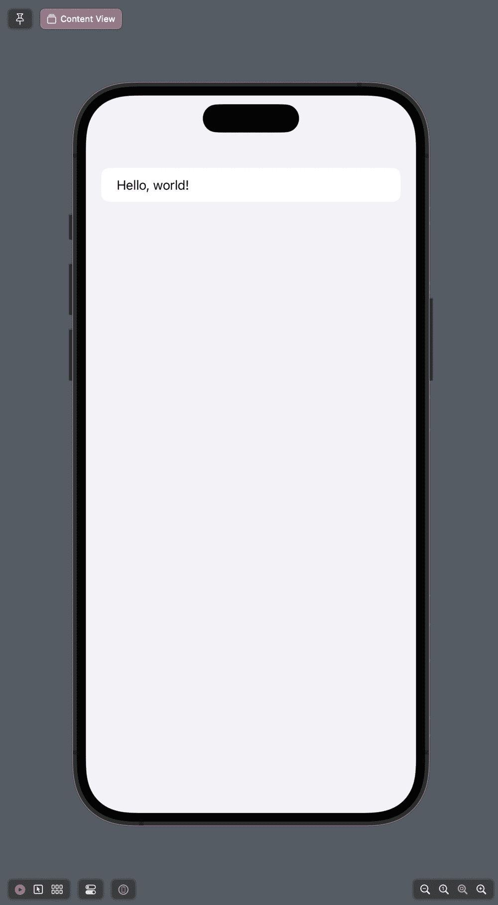
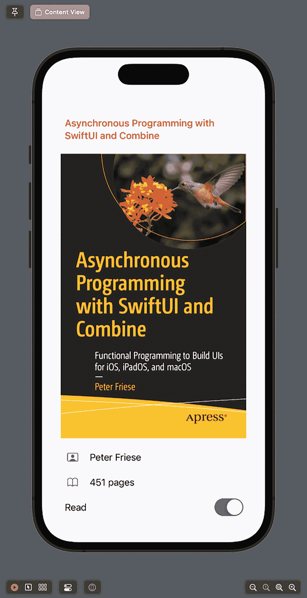
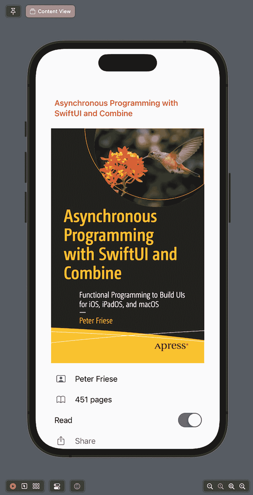

# 6. 构建输入表单

当你听到“表单”这个词时，你可能不认为你的应用需要很多表单，而且你肯定也不会感到兴奋（除非你是一个喜欢填写表单的人）。然而，你可能会惊讶地发现，表单是构建用户界面的一种重要方式，尤其是在苹果平台上。

试想一下：你的应用很可能有一个设置界面——从技术上讲，这就是一个表单。你的应用可能还有一个登录界面——同样，这也是一个表单！如果你有任何数据输入功能——猜猜看，那也是一个表单。

当苹果首次发布 iPhone iOS SDK（当时是这么称呼的）时，他们并没有提供一种一流的方式来构建输入表单。开发者们很快发现，原本用于表格数据展示的 `UITableView` 也可以用来显示输入表单。然而，由于 `UITableView` 的 API（`UITableViewDataSource` 和 `UITableViewDelegate`）在设计之初并未考虑这种用例，基于这些 API 构建表单一直有些繁琐——例如，你必须跟踪当前所在的行，以决定提供哪个 `UITableViewCell` 子类来显示正确的表单单元格。

SwiftUI 为苹果提供了一个从零开始的机会，提出了更好地满足现代应用需求的概念和 API，并最终解决了开发者多年来一直反馈的问题。

作为许多 iOS 应用的重要组成部分，苹果在 SwiftUI 中为构建表单添加了专用的 API。

在本章中，你将会看到构建外观精美的表单是多么简单直接，而且——谁知道呢？——也许到本章结束时，你也会对表单感到兴奋不已！

## 构建简单表单

我们将首先介绍基础知识，看看如何构建一个用于显示静态数据的简单表单。我们还将学习如何将表单的 UI 元素绑定到你的数据模型。在此基础上，只需一小步，就能学会如何使用 `TextField` 或 `Toggle` 等输入元素来编辑表单数据。这也会让我们有机会讨论是使用 `@State` 还是 `@StateObject`（或者说何时使用它们）。

开始使用表单非常简单——SwiftUI 团队设计表单 API 的方式是，你可以继续使用你已经熟悉的 UI 元素（例如 `Text`、`Label`、`Button`、`Image` 等），而 SwiftUI 会负责渲染它们，使其看起来像我们从 iOS 设置应用中熟知的标准表单 UI。

这是 SwiftUI 中反复出现的主题——作为开发者/设计师，你指定*想要*显示什么内容，而 SwiftUI 会决定*如何*在特定平台上最好地实现这一点。最终，这是一个混合体——你最终会对代码进行相当多的调整，以使 UI 完全符合你的期望。

在 SwiftUI 中，你能构建的最简单的表单就是将 SwiftUI 应用模板中的“Hello World”文本包裹在一个 `Form` 中，就像这样：

```
struct ContentView: View {
    var body: some View {
        Form {
            Text("Hello, world!")
        }
    }
}
```

这将 `Text` 视图转换为一个简单的表格形式。



> *如果你以前做过 UIKit 开发，这看起来会非常像 `UITableView`，而且苹果可能实际上在底层使用了 `UITableView` 来实现这种外观和感觉——但我们不应做任何假设，因为苹果并未对其如何在屏幕上渲染 SwiftUI 视图做出任何保证。*

让我们构建一个用于显示书籍信息的简单表单，以便了解一些额外的表单元素。

我们将从使用静态文本开始，但随着学习的深入，我们会将其替换为数据模型，以便用户能够在表单上实际编辑数据。

你可以在 `Form` 视图内使用大多数 SwiftUI 视图，并且你已经学会了如何在表单中使用简单的 `Text` 视图。我们还可以使用视图修饰符来为视图设置样式，所以这里是一个红色的标题文本：

```
struct ContentView: View {
    var body: some View {
        Form {
            Text("Asynchronous Programming with SwiftUI and Combine")
                .font(.headline).foregroundColor(.red)
        }
    }
}
```

并非所有可能的事情都是好主意，所以在设置表单元素样式时，请做出明智的判断。

也可以在表单内使用 `Image`，所以让我们显示书籍封面，就像这样：

```
struct ContentView: View {
    var body: some View {
        Form {
            Text("Asynchronous Programming with SwiftUI and Combine")
                .font(.headline).foregroundColor(.red)
            Image("book-cover-combine")
        }
    }
}
```

现在，我们可以使用 `Text` 视图来显示书籍作者和页数，但在文本旁边显示一个小图标，让用户能够更快速地一眼区分这些字段，岂不是更好？为此，我们可以使用 `Label`：

```
struct ContentView: View {
    var body: some View {
        Form {
            Text("Asynchronous Programming with SwiftUI and Combine")
                .font(.headline).foregroundColor(.red)
            Image("book-cover-combine")
            Label("Peter Friese",
                  systemImage: "person.crop.rectangle")
            Label("451 pages", systemImage: "book")
        }
    }
}
```


### 排版后的内容

截图显示了一个手机屏幕，屏幕上有一本名为《Asynchronous Programming with SwiftUI and Combine》的书籍封面。封面右上角有一张鸟和植物的照片。Apress 的徽标位于封面右下角。文字显示作者为 Peter Friese，共 451 页，封面下方有两个图标。

**图 6-3**  
使用 `Label` 在文本旁显示图标

为了追踪用户是否已阅读过这本书，我们可能想显示一个开关，如下所示：

```
struct ContentView: View {
    var body: some View {
        Form {
            Text("Asynchronous Programming with SwiftUI and Combine")
                .font(.headline).foregroundColor(.red)
            Image("book-cover-combine")
            Label("Peter Friese",
                  systemImage: "person.crop.rectangle")
            Label("451 pages", systemImage: "book")
            Toggle("Read", isOn: .constant(true))
        }
    }
}
```

由于我们还没有将任何真实数据绑定到表单，所以我们使用 `.constant()` 绑定将 `Toggle` 视图绑定到一个 `true` 常量。



截图显示了一个手机屏幕，屏幕上有一本名为《Asynchronous Programming with SwiftUI and Combine》的书籍封面。封面右上角有一张鸟和植物的照片。Apress 的徽标位于封面右下角。文字显示作者为 Peter Friese，共 451 页，封面下方有两个图标。其下方是一个用于“已读”的开关选项。

**图 6-4**  
在表单中显示开关

通常，用户需要在表单上执行操作，而向表单添加按钮也有一个简单的方法：

```
struct ContentView: View {
    var body: some View {
        Form {
            Text("Asynchronous Programming with SwiftUI and Combine")
                .font(.headline).foregroundColor(.red)
            Image("book-cover-combine")
            Label("Peter Friese",
                  systemImage: "person.crop.rectangle")
            Label("451 pages", systemImage: "book")
            Toggle("Read", isOn: .constant(true))
            Button(action: {}) {
                Label("Share", systemImage: "square.and.arrow.up")
            }
        }
    }
}
```

在这个例子中，我使用了 `Label` 在按钮标签旁显示一个图标，但如果你不想显示图标，也可以同样使用常规的 `Text`。



截图显示了一个手机屏幕，屏幕上有一本名为《Asynchronous Programming with SwiftUI and Combine》的书籍封面。封面右上角有一张鸟和植物的照片。Apress 的徽标位于封面右下角。文字显示作者为 Peter Friese，共 451 页，封面下方有两个图标。其下方是一个“已读”的开关选项和一个分享按钮。

**图 6-5**  
在表单中显示按钮

## 在表单中显示数据

能够显示静态数据对于不需要任何动态更新的用户界面（例如应用的设置界面）很有用。然而，大多数应用需要显示动态更新的数据，所以让我们看看如何将表单的 UI 绑定到一个数据模型，并在下一步中使其也可编辑。

由于 Forms API 使用了 SwiftUI 的常规 UI 视图，它们的所有功能都能按预期正常工作——Forms API 唯一影响的是 UI 元素在表单内部的显示方式。

因此，我们可以使用 SwiftUI 的所有状态管理工具将诸如 `Text`、`Label`、`Image` 等 UI 元素，甚至是更复杂的元素（如选择器）绑定到我们的数据模型。

继续我们的例子，假设我们有如下数据模型来表示书籍：

```
struct Book: Hashable, Identifiable {
    var id = UUID()
    var title: String
    var author: String
    var isbn: String
    var pages: Int
    var isRead: Bool = false
}

extension Book {
    var smallCoverImageName: String { return "\(isbn)-S" }
    var mediumCoverImageName: String { return "\(isbn)-M" }
    var largeCoverImageName: String { return "\(isbn)-L" }
}
```

为了显示 `Book` 实例中的数据，我们需要替换之前代码片段中使用的静态文本，并访问模型属性。Swift 的所有字符串插值功能在 SwiftUI 中同样适用，因此以下语法：`"\(book.pages) pages"` 会将 `Book` 实例的 `pages` 属性的当前值注入到 `Text` 中。

有一个值得注意的例外——`Toggle` 期望一个绑定，这样当用户切换开关时，它可以更新底层的属性。由于我们想在 `BookDetailsView` 上以只读模式显示所有信息，我们将使用 `.constant()` 将绑定转换为常量值。这有效地防止了用户对模型的 `read` 状态进行任何更改。

每当模型（`book`）更新时，SwiftUI 会重新渲染所有绑定到此模型的 UI 元素。

```
struct BookDetailsView: View {
    @State var book: Book
    var body: some View {
        Form {
            Text(book.title)
            Image(book.largeCoverImageName)
            Label(book.author, systemImage: "person.crop.rectangle")
            Label("\(book.pages) pages", systemImage: "book")
            Toggle("Read", isOn: .constant(book.isRead))
            Button(action: { /* 添加代码以显示编辑界面 */ }) {
                Label("Edit", systemImage: "pencil")
            }
        }
        .navigationTitle(book.title)
    }
}
```

正如预期，结果看起来与我们静态示例完全相同。


截图显示了一个手机屏幕，屏幕上有一本名为《Asynchronous Programming with SwiftUI and Combine》的书籍封面。封面右上角有一张鸟和植物的照片。Apress 的徽标位于封面右下角。文字显示作者为 Peter Friese，共 451 页，封面下方有两个图标。其下方是一个“已读”的开关选项和一个分享按钮。

**图 6-6**  
显示动态数据


### 使其可编辑

显示信息只是迈向完全数据驱动应用的一部分，下一步，我们将创建此表单的可编辑版本。

iPhone 的成功部分归功于其流畅且强大的用户界面，而它的大部分 UI 元素自 2007 年初代 iPhone 发布以来就一直存在。与 UIKit 一样，SwiftUI 包含一组核心的输入元素，使开发者能够在（相对）较小的屏幕上构建易于使用、强大且灵活的 UI 来输入数据。

我们将仅使用其中几个输入元素来构建一个用于编辑图书的表单，但本章末尾会介绍其余元素。

可能最通用（也是最常用）的输入元素是 `TextField`——它接受字母数字输入，并且可以自定义以支持多种数据类型，例如电子邮件地址、电话号码、URL 等。

要在 SwiftUI 中创建 `TextField`，你必须提供标题以及一个用于显示和编辑值的绑定：`TextField("title", $model.property)`。

以下是编辑图书表单的基础版本：

```
struct BookEditView: View {
    @State var book: Book
    var body: some View {
        Form {
            TextField("Book title", text: $book.title)
            Image(book.largeCoverImageName)
            TextField("Author", text: $book.author)
        }
    }
}
```

如你所见，我们使用 `TextField` 来编辑当前 `Book` 实例的 `title` 和 `author` 属性。

但是页数呢？

如果你查看 `TextField` 的 API，你会注意到它支持编辑任意数据类型——你只需提供一个 `Formatter` 实例，该实例负责在数据类型和用户编辑的文本表示之间进行转换。

要编辑像页数这样的 `Int` 属性，我们可以使用 `NumberFormatter`，如下所示：

```
struct BookEditView: View {
    @State var book: Book
    var body: some View {
        Form {
            TextField("Book title", text: $book.title)
            Image(book.largeCoverImageName)
            TextField("Author", text: $book.author)
            TextField("Pages", value: $book.pages, formatter: NumberFormatter())
        }
    }
}
```

如果你还记得，图书还有一个布尔属性 `isRead`，用于追踪用户是否已阅读过这本书。之前，我们使用常量来显示此属性的状态，但现在我们让它可编辑：

```
struct BookEditView: View {
    @State var book: Book
    var body: some View {
        Form {
            TextField("Book title", text: $book.title)
            Image(book.largeCoverImageName)
            TextField("Author", text: $book.author)
            TextField("Pages", value: $book.pages, formatter: NumberFormatter())
            Toggle("Read", isOn: $book.isRead)
        }
    }
}
```

要查看效果，我们需要更新预览提供程序，将其中一本示例图书注入到视图中：

```
struct BookEditView_Previews: PreviewProvider {
    static var previews: some View {
        BookEditView(book: Book.samples[0])
    }
}
```

## 钻取导航

钻取导航是 iOS 应用中一种流行的 UI 模式，最著名的可能来自内置的 *通讯录* 应用：用户从所有联系人列表开始，可以导航进入单个联系人查看其详细信息并执行诸如拨打电话或进行 FaceTime 通话等操作。联系人详情屏幕还包含一个 *编辑* 按钮，该按钮会以可编辑表单的形式打开当前显示的联系人。用户完成编辑联系人后，更新后的联系人详情将在整个 *通讯录* 应用中更新。

在本节中，我们将快速了解如何基于已有的构建块（`BookDetailsView` 和 `BookEditView`）为我们的图书管理应用实现此模式。

除了用作单个图书模型的 `Book` 结构体外，我们还需要建立一个包含应用中所有图书集合的**数据源**。由于我们尚未实现任何数据存储或后端连接器，我们将使用一个静态图书列表来初始化这个数据源。

如第 4 章所述，保存元素集合并向任何订阅者通知列表更改的最佳方法是使用带有标记为 `@Published` 的属性的 `ObservableObject`：

```
class BooksViewModel: ObservableObject {
    @Published var books: [Book] = Book.samples
}
```

在后续阶段，我们可能希望将此视图模型连接到数据库，但目前，我们分配一个静态图书列表，如下所示：

```
extension Book {
    static let sampleBooks = [
        Book(title: "Changer", author: "Matt Gemmell", isbn: "9781916265202", pages: 476),
        Book(title: "SwiftUI for Absolute Beginners", author: "Jayant Varma", isbn: "9781484255155", pages: 200),
        Book(title: "Asynchronous Programming with SwiftUI and Combine", author: "Peter Friese", isbn: "9781484285718", pages: 451),
        Book(title: "Modern Concurrency on Apple Platforms", author: "Andy Ibanez", isbn: "9781484286944", pages: 368)
    ]
}
```

现在需要实例化此视图模型，并将其传递到应用中的各个视图。一个好的位置是在主 `App` 结构体中执行此操作——这可以确保我们的数据源在应用的所有窗口之间共享。当你的用户在允许同时显示应用多个窗口的设备（例如 iPad）上运行应用时，这一点变得很重要：用户在一个窗口中做出的任何更改都会立即反映在另一个窗口中。

如第 4 章所述，我们需要使用 `@StateObject` 来告诉 SwiftUI，它需要确保此 `BooksViewModel` 实例在任意屏幕重绘期间保持存活。

要沿着视图层级向下传递视图模型，我们可以使用环境，或者将实例注入到视图的初始化器中。

就个人而言，我更喜欢使用初始化器注入，因为它往往比使用环境更明确。

```
import SwiftUI

@main
struct BookShelfApp: App {
    @StateObject var booksViewModel = BooksViewModel()

    var body: some Scene {
        WindowGroup {
            NavigationStack {
                BooksListView(booksViewModel: booksViewModel)
                    .navigationTitle("图书")
            }
        }
    }
}
```

我们的导航层级的根视图是 `BooksListView`，它显示一个图书列表。由于我们应用的视图模型由 `BookShelfApp` 拥有，我们可以在此处使用 `ObservableObject` 来引用它：

```
import SwiftUI

struct BooksListView: View {
    @ObservedObject var booksViewModel: BooksViewModel

    var body: some View {
        List {
            ForEach($booksViewModel.books) { $book in
                BookRowView(book: $book)
            }
            .onDelete { indexSet in
                booksViewModel.books.remove(atOffsets: indexSet)
            }
        }
        .navigationTitle("图书")
    }
}
```

你会注意到我们使用了 `List` 绑定来确保列表中的各个项目是可编辑的。如果你需要复习其工作原理，请参阅第 5 章。


