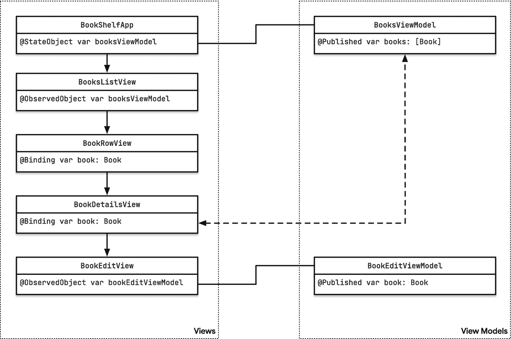
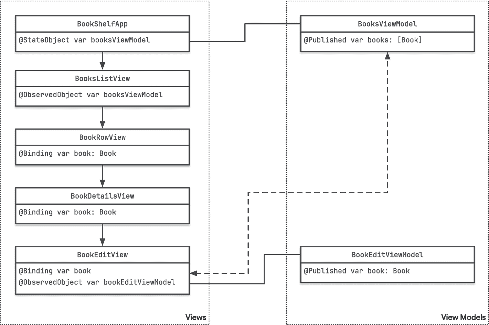

# 排版后的文档

当前`Book`实例的绑定现在可以传递给`BookRowView`，它会在`BookListView`中显示书籍详细信息：

```swift
struct BookRowView: View {
    @Binding var book: Book
    var body: some View {
        NavigationLink(destination: BookDetailsView(book: $book)) {
            HStack(alignment: .top) {
                Image(book.mediumCoverImageName)
                    .resizable()
                    .aspectRatio(contentMode: .fit)
                    .frame(height: 90)
                VStack(alignment: .leading) {
                    Text(book.title)
                        .font(.headline)
                    Text("by \(book.author)")
                        .font(.subheadline)
                    Text("\(book.pages) pages")
                        .font(.subheadline)
                }
                Spacer()
            }
        }
    }
}
```

你会注意到我们如何使用`NavigationLink`来指定用户点击列表中某一本书时的目标视图。为了传递绑定，我们使用了`$`语法：`NavigationLink(destination: BookDetailsView(book: $book))`。

在`BookDetailsView`中，我们需要将`@State`改为`@Binding`，以表示父视图拥有数据的所有权：

```swift
struct BookDetailsView: View {
    @Binding var book: Book
    @State var showEditBookView = false
    var body: some View {
        Form {
            Text(book.title)
            Image(book.largeCoverImageName)
                .resizable()
                .scaledToFit()
                .shadow(radius: 10)
                .padding()
            Label(book.author, systemImage: "person.crop.rectangle")
            Label("ISBN: \(book.isbn)", systemImage: "number")
            Label("\(book.pages) pages", systemImage: "book")
            Toggle("Read", isOn: .constant(book.isRead))
            Button(action: { showEditBookView.toggle() }) {
                Label("Edit", systemImage: "pencil")
            }
        }
        .sheet(isPresented: $showEditBookView) {
            BookEditView(book: $book)
        }
        .navigationTitle(book.title)
    }
}
```

当用户点击`BookDetailsView`上的*Edit*按钮时，我们会打开一个模态表单来显示`BookEditView`。

为了将可修改的`Book`实例传递给`BookEditView`，我们使用了之前相同的模式：`BookEditView(book: $book)`。

最后，这是`BookEditView`的代码：

```swift
struct BookEditView: View {
    @Binding var book: Book
    var body: some View {
        Form {
            TextField("Book title", text: $book.title)
            Image(book.largeCoverImageName)
                .resizable()
                .scaledToFit()
                .shadow(radius: 10)
                .padding()
            TextField("Author", text: $book.author)
            TextField("Pages", value: $book.pages, formatter: NumberFormatter())
            Toggle("Read", isOn: .constant(true))
        }
        .navigationTitle(book.title)
    }
}
```

用户在此界面所做的任何更改都会立即反映在整个应用中。你可以通过在 iPad 模拟器上运行应用、并排打开两个应用窗口，然后更新书籍标题来亲自尝试：当你输入时，书籍标题会在详情视图和另一个窗口中同时更新。

**图 6-7：** 并排编辑一本书，所有更新都会反映在应用的所有实例中

一张 12.9 英寸 iPad Pro 的屏幕截图，显示 Matt Gemmell 所著《Changer》的封面，右侧是书籍面板。箭头指向高亮文本“123,476 页”，该文本在所有窗格中均可见。

## 输入验证

在输入表单中，我们经常需要一定程度的输入验证。一些众所周知的输入验证示例是注册表单中的密码字段，你需要确保用户输入的密码满足某些条件。其他应用则不强制进行输入验证——例如，你会发现 iOS 的*通讯录*应用根本不执行任何输入验证。

在我们的示例应用中，有一个字段可以从输入验证中受益：ISBN 字段。ISBN（*国际标准书号*）遵循特定的方案，最后一位是校验码。确保用户输入有效的 ISBN 非常重要，因为我们使用 ISBN 来查找书籍封面，所以让我们添加一个简单的验证逻辑。

我们将分多个步骤进行：

-   **第一步：** 我们直接将验证逻辑添加到`BookEditView`中。这是实现此功能最直接的方法，但也是可维护性和可扩展性最差的，正如我们将看到的那样。

-   **第二步：** 我们将验证逻辑提取到视图模型中。这看起来可能增加了很多额外工作，但你会看到这种方法更具可扩展性，并且使得为其他字段添加验证变得更加容易。

-   **最后一步：** 我们将在此第二种方法的基础上加入 Combine。这允许我们将多个验证步骤组合成一个，这对于需要同时满足多个条件的表单非常有用（注册表单是一个众所周知的例子：密码需要满足某些条件，并且密码和密码确认需要匹配）。

### 使用 `.onChange(of:)`

你可以在任何 SwiftUI 视图上调用`.onChange(of:)`，以便在属性发生变化时触发副作用。这可以是视图上的任何`Environment`键或`Binding`。

要观察当前编辑书籍的 ISBN 属性的变化，我们可以将`.onChange(of: book.isbn)`添加到`BookEditView`中的任何一个视图上。是将其添加到 ISBN 的`TextField`上，还是添加到`Form`本身，这取决于你。在闭包内部，你将接收到*新*的值：

```swift
struct BookEditView: View {
    @Binding var book: Book
    @State var isISBNValid = false
    var body: some View {
        Form {
            // ...
            VStack(alignment: .leading) {
                if !isISBNValid {
                    Text("ISBN is invalid")
                        .font(.caption)
                        .foregroundColor(.red)
                }
                TextField("ISBN", text: $book.isbn)
            }
            // ...
        }
        .onChange(of: book.isbn) { value in
            self.isISBNValid = checkISBN(isbn: book.isbn)
        }
        .navigationTitle(book.title)
    }
}
```

我们使用`checkISBN`（这是`Utils`文件夹中的一个函数）来验证 ISBN，并将验证结果存储在状态属性`isISBNValid`中。该属性绑定到一个条件语句，该条件语句将根据需要显示或隐藏包含警告消息的`Text`。

虽然这种方法确实有效，但它的扩展性不佳。试想一下，如果你尝试为超过几个输入字段实现验证逻辑，情况会变得多么复杂——这很快就会变得难以管理。


### 使用 View Model 处理表单验证

到目前为止，我们一直使用 `@State` 和 `@Binding` 来访问希望在屏幕上显示或编辑的数据。这遵循了第 4 章中讨论的指导原则：

> 如果你希望在视图中显示的数据是枚举、结构体或简单类型，你可以使用 `@State` 或 `@Binding` 来包装变量，或者直接绑定到该变量。

然而，现在我们需要添加一些业务逻辑，这就需要进行一些改动。将验证逻辑添加到数据模型听起来可能是个好主意，但这最终会用仅在应用程序中特定位置才需要的代码污染我们的数据模型：在输入表单中验证数据是合适的，但你可能不需要在持久化或网络层中这样做。

相反，我们使用*视图模型*来封装*特定于视图*的业务逻辑。除了能够执行数据验证之外，这也让我们有机会为任何想要显示的警告或错误信息定义额外的属性。

为了能够将视图模型的属性绑定到视图，视图模型需要实现 `ObservableObject` 协议：

```
class BookEditViewModel: ObservableObject {
}
```

然后，我们可以将 `Book` 变量移动到视图模型中，并将其标记为 `@Published`。类没有自动的成员初始化器，^(⁵⁰) 因此我们必须自己实现一个接受 `Book` 实例的初始化器，如下所示：

```
class BookEditViewModel: ObservableObject {
@Published var book: Book
init(book: Book) {
self.book = book
}
}
```

最后，我们也可以将 `isISBNValid` 检查移到视图模型中：

```
class BookEditViewModel: ObservableObject {
@Published var book: Book
var isISBNValid: Bool {
checkISBN(isbn: book.isbn)
}
init(book: Book) {
self.book = book
}
}
```

为了在 `BookEditView` 内部使用这个视图模型，我们首先需要使用 `@ObservedObject` 来设置它，并声明一个 `BookEditView` 可以调用的初始化器：

```
struct BookEditView: View {
@ObservedObject var bookEditViewModel: BookEditViewModel
init(book: Book) {
self.bookEditViewModel = BookEditViewModel(book: book)
}
var body: some View {
// ...
}
}
```

在 `body` 内部，所有之前连接到 `book` 的视图现在都需要连接到 `$bookEditViewModel.book`：

```
var body: some View {
NavigationView {
Form {
TextField("Book title", text: $bookEditViewModel.book.title)
Image(bookEditViewModel.book.largeCoverImageName)
TextField("Author", text: $bookEditViewModel.book.author)
VStack(alignment: .leading) {
if !bookEditViewModel.isISBNValid {
Text("ISBN is invalid")
.font(.caption)
.foregroundColor(.red)
}
TextField("ISBN", text: $bookEditViewModel.book.isbn)
}
TextField("Pages", value: $bookEditViewModel.book.pages, formatter: NumberFormatter())
Toggle("Read", isOn: $bookEditViewModel.book.isRead)
}
.navigationTitle(bookEditViewModel.book.title)
}
}
```

### 通过使用 `@Binding` 和 `@ObservableObject` 将本地数据源与全局数据源同步

如果你现在运行这个应用程序，你会注意到一些奇怪的事情：向下钻取导航按预期工作，并且你可以使用 `BookEditView` 编辑书籍。但任何更改都不会反映在 `BookDetailsView` 或 `BooksListView` 中。

这是因为每次显示 `BookEditView` 时，我们都会创建一个新的 `@ObservableObject`，实际上就安装了一个新的数据源。

为了理解为什么会这样，让我们仔细看看信息的流动：

*   `BookShelfApp` 持有对 `BooksViewModel` 的引用。通过使用 `@StateObject` 属性包装器，我们确保这个 `ObservableObject` 只被实例化一次，从而有效地将其转变为应用程序的根数据源。
*   `BookShelfApp` 然后将这个数据源的引用传递给 `BooksListView`，后者将其作为 `@ObservedObject` 存储在一个本地属性中。由于这是对根数据源的引用，我们在 `BooksListView` 内部对其所做的所有更改不仅会反映在 `BooksListView` 及其子视图中，还会反映在应用程序本身以及任何连接到 `BookShelfApp` 中 `@StateObject` 的子视图上。
*   `BooksListView` 使用列表绑定来遍历 `BooksViewModel` 上书籍数组中的各个书籍，并实例化一个新的 `BookRowView`，将一个 `Binding` 传递给该书籍。
*   `BookRowView` 显示书籍的一些属性，并将这个 `Binding` 传递给 `BookDetailsView`。
*   `BookDetailsView` 将这个 `Binding` 传递给 `BookEditView`。

到目前为止，信息的流动仍然是双向连接的：对 `BookShelfApp` 中根数据源的任何更改都会向下渗透到视图层次结构中，并反映在相应的视图上。同样，对 `book` 实例（它是 `BookEditView` 中的一个 `@Binding`）的任何更改也会反映在 `BookShelfApp` 的根数据源上。

然而，通过在 `BookEditView` 中实例化一个新的 `@ObservedObject`（即 `BookEditViewModel`），我们建立了一个新的数据源。`BookEditView` 中的所有 UI 元素都连接到了这个本地数据源，因此用户在 UI 中做的所有更改只会反映在这个实例上。



流程图描绘了书架应用、书籍列表视图、书籍行视图、书籍详情视图和书籍编辑视图，以及书籍视图模型和书籍编辑视图模型的流动。

**图 6-8** – 使用 `@Binding` 更新数据源

有几种方法可以解决这个问题：

首先，我们可以将 `BookEditViewModel` 中的 `book` 属性改为 `@Binding` 而不是 `@Published` 属性。然而，这会阻止我们将其用作 Combine 发布者（我们稍后会讲到这一点）。

第二种选择是向 `BookEditViewModel` 添加一个完成处理程序，我们可以在用户完成编辑书籍后调用它。当完成处理程序被调用时，我们可以在原始根数据源上更新已编辑的书籍。不过，这个选项感觉不太符合 SwiftUI 的风格。如果你查看其他类似的 SwiftUI 组件，例如 `ColorPicker`，你会注意到它们接受一个 `Binding`。

因此，让我们看看另一个选项：尝试传入一个 `Binding`，将其值复制到仅在 `BookEditView` 本地的视图模型上的一个 `@Published` 属性中，待用户完成编辑后，再将其赋值回 `Binding`。

为了正确实现此功能，我们首先向 `BookEditView` 添加一个*取消*按钮和一个*保存*按钮，并为它们的*点击*事件添加处理程序。


```swift
struct BookEditView: View {
    @ObservedObject var bookEditViewModel: BookEditViewModel
    @Environment(\.dismiss) var dismiss
    // ...
    func cancel() {
        dismiss()
    }
    func save() {
        // (添加代码以更新绑定)
        dismiss()
    }
    var body: some View {
        NavigationStack {
            Form {
                // ...
            }
            .navigationTitle(bookEditViewModel.book.title)
            .toolbar {
                ToolbarItem(placement: .navigationBarLeading) {
                    Button(action: cancel) {
                        Text("取消")
                    }
                }
                ToolbarItem(placement: .navigationBarTrailing) {
                    Button(action: save) {
                        Text("保存")
                    }
                }
            }
        }
    }
}
```

通过从环境中引入 `dismiss` 操作，我们能够在用户点击任一按钮时以编程方式关闭 `BookEditView`。

> *注意：如果你想阻止用户关闭对话框，可以使用* `interactiveDismissDisabled()` *视图修饰符。*

有了这个基础，我们现在可以实现对绑定的处理。为此，我们需要将绑定添加到视图中，然后在初始化器中使用它来创建视图模型：

```swift
struct BookEditView: View {
    @Binding var book: Book
    @ObservedObject var bookEditViewModel: BookEditViewModel
    @Environment(\.dismiss) var dismiss

    init(book: Binding<Book>) {
        self._book = book
        self.bookEditViewModel = BookEditViewModel(book: book.wrappedValue)
    }
    // ...
}
```

通过使用下划线，我们可以将初始化器中接收到的绑定赋值给 `book` 属性（该属性本身是一个 `Binding<Book>`）。

然后，通过使用绑定的 `wrappedValue` 创建视图模型，我们将底层值对象传递给视图模型，并在视图模型中使用 `@Published` 属性包装器将其转换为发布者。

将用户的任何更改发送回调用方（在本例中为 `BookDetailsView`）的缺失环节是更新 `save` 函数：

```swift
func save() {
    self.book = bookEditViewModel.book
    dismiss()
}
```

这将从视图模型中获取更新后的 `Book` 并将其赋值回绑定。这会导致*数据源*被更新，并且该更新将反映在整个应用程序中。

  
一张图表展示了书架应用、书籍列表视图、书籍行视图、书籍详情视图和书籍编辑视图的流程。书籍视图模型通过一条带双向箭头的虚线连接到书籍编辑视图。

**图 6-9** 使用 `@ObservedObject` 和 `@Binding` 更新局部和全局数据源

## 使用 Combine 执行表单验证

在最后一步中，我们将使用 Combine 来改进验证逻辑。

目前，验证逻辑存在于视图模型中的一个计算属性中：

```swift
class BookEditViewModel: ObservableObject {
    @Published var book: Book
    var isISBNValid: Bool {
        checkISBN(isbn: book.isbn)
    }

    init(book: Book) {
        self.book = book
    }
}
```

虽然这确实有效，但不太理想：只有当 SwiftUI 接收到视图所订阅的已发布属性的事件时，它才会更新视图。

由于 `isISBNValid` 不是一个 `@Published` 属性，它在更新时不会发送任何通知。那么，视图为何仍然能更新并正确反映该属性的状态呢？事实上，这只是巧合：每当 `book`（或其任何属性）被更新时，视图模型都会发送一个更新事件。碰巧 ISBN 也是 `Book` 的一个属性，因此当你编辑书籍的 ISBN 时，`book` 会发送一个事件，导致 SwiftUI 重新渲染。在此过程中，它还会重新渲染 `VStack`，该 `VStack` 会根据 `isISBNValid` 属性的状态有条件地显示错误消息。

为了使这一点更加可靠而非依赖巧合，让我们使用 Combine 来计算 `isISBNValid` 的状态。

首先，将 `isISBNValid` 变成一个已发布的属性：

```swift
class BookEditViewModel: ObservableObject {
    @Published var book: Book
    @Published var isISBNValid: Bool = true
    // ...
}
```

然后，在初始化器中，我们可以订阅 `book` 发布者发送的任何更改。这些事件将包含 `book` 属性的当前值。为了确定书籍当前的 ISBN 是否有效，我们将 `map` 作用于 `book` 值，验证其 ISBN，并将结果 `Bool` 值赋值给 `isISBNValid` 属性：

```swift
init(book: Book) {
    self.book = book
    self.$book
        .map { book in
            return checkISBN(isbn: book.isbn)
        }
        .assign(to: &$isISBNValid)
}
```

得益于隐式返回和隐式参数，我们可以进一步精简 `map` 闭包：

```swift
self.$book
    .map { checkISBN(isbn: $0.isbn) }
    .assign(to: &$isISBNValid)
```

至此，我们为数据驱动应用实现了一个功能完整的下钻导航，其中包含一个用于验证表单输入的简单 Combine 管道。

## 总结

在本章中，你看到了在 SwiftUI 中构建基于表单的用户界面是多么容易。通过使用 `Form` 视图，SwiftUI 会调整常规视图，使其匹配我们在 iOS 设置界面中熟悉的样式和感觉。SwiftUI 的 DSL 在此处真正发挥了其优势，你可以看到 SwiftUI 团队如何利用 DSL 的能力，让开发者能够快速构建灵活且功能丰富的用户界面。

在研究了静态表单之后，我们深入探讨了如何使用 SwiftUI 的状态管理工具为数据驱动应用构建下钻导航——这是你在许多应用中都会找到的一种用户界面模式。

最后，我们实现了一个简单的业务逻辑来验证表单输入。通过使用视图模型，我们得以封装此逻辑并避免污染视图。使用视图模型为我们的下钻导航带来了一些挑战，但我们通过同时使用 `@Binding` 和 `@ObservableObject` 克服了这些挑战，从而允许用户编辑数据，同时赋予他们改变主意并取消所做更改的灵活性。得益于 Combine 的使用，我们能够以一种与 SwiftUI 兼容的方式实现这一点。

虽然内容颇多，但这仅仅是个开始！在下一章中，我们将探讨函数式响应式编程，了解它为何如此出色，以及它与 Combine 的关系！

脚注 1

