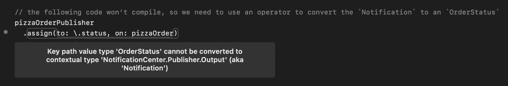

# 7. 初识 Combine

现在，我们在前几章中已经使用了一点 Combine，希望它们在结合 SwiftUI 用户界面的上下文中足够容易理解。但你可能想知道 Combine 究竟是如何工作的，以及 SwiftUI 响应式状态管理系统幕后发生了什么。在本章中，我们将深入探讨 Combine，你将了解其基本原理，以及它为何能与 SwiftUI 如此完美地结合。

> *本章代码片段对应的源代码可以在本书的 GitHub 仓库中找到。*^(⁵¹)


## 什么是函数式响应式编程？

计算机中发生的所有事情都可以被视为事件——用户点击按钮、时间流逝、API 请求返回某个值、网络请求失败。大多数事件以异步方式发生，这使得处理它们变得具有挑战性。

处理异步行为有几种方法。作为 iOS 开发者，我们非常熟悉使用委托和回调，但它们有几个缺点，会导致代码分散各处且难以推理。

响应式编程是处理这种情况的另一种方法。响应式编程的基本思想是：一切都是事件，并且这些事件是异步发生的。事件由事件源发送，感兴趣的一方可以注册以接收特定事件。通常情况下，这些事件流需要进行转换，使其对相应的订阅者更有用。

响应式编程有众多实现。最著名的可能是 Reactive Extensions（ReactiveX^(⁵²)），“一个用于异步编程的、带有可观察流的 API”。ReactiveX 的优美之处在于它适用于多种平台和语言：Java、^(⁵³) JavaScript、^(⁵⁴) C#、^(⁵⁵) Kotlin、^(⁵⁶) Swift、^(⁵⁷) 等等。^(⁵⁸)

Apple 在 WWDC 2019 上推出了 Combine 作为他们对响应式编程的实现，它与`RxSwift`非常相似。使用 Combine 而非`RxSwift`的主要原因是它与 Apple 平台的集成更深。它与`SwiftUI`配合得特别好，因此如果您以 iOS 13 或更高版本为目标（这是 Combine 和 SwiftUI 的最低目标平台），您应该仔细看看。

> Combine 是一个统一的、声明式的 API，用于处理随时间变化的值。

Combine 定义了三个主要概念来实现响应式编程的思想：

1. 发布者
2. 订阅者
3. 操作符

**发布者**随时间传递值，**订阅者**在接收这些值时对其执行操作。**操作符**位于发布者和订阅者之间，可用于操纵值流。

让我们仔细看看。

## 发布者

顾名思义，发布者随时间发出值。为了指示错误条件，发布者也可能发布错误。每个发布者定义它发布哪些类型的值和错误（如果有的话）。

最基本的发布者是`Just`——它只发出一个值并且永远不会失败：

```
Just(42)
```


一条线段，左侧圆圈内标有数字 42。右侧表格中的数据为输出类型 int，失败类型 never。

**图 7-1** 发出单个值的发布者

发送单个值在许多情况下确实很有用，但大多数时候我们需要发送多个值。Combine 使得几乎任何东西都可以转变为发布者。例如，下面是如何将十个最受欢迎^(⁵⁹) 的披萨配料^(⁶⁰) 数组转变为发布者：

```
["意大利辣香肠", "蘑菇", "洋葱", "香肠", "培根", "额外奶酪", "黑橄榄", "青椒"].publisher
```


一条线段，三个块上分别标有意大利辣香肠、蘑菇、洋葱。右侧表格中的数据为输出类型 string，失败类型 never。

**图 7-2** 发出一些披萨配料后终止的发布者

使用简单的值或序列作为发布者可能看起来有点乏味，但当我们需要从多个 Combine 发布者组合管道时，这无疑会派上用场。

是时候让它更有趣一点了！

假设我们正在构建一个披萨订购应用。以下是一些创建订单并设置发布者的代码。这个特定的发布者会在`NotificationCenter`向`pizzaOrder`对象发送名为`.didUpdateOrderStatus`的通知时发出事件。

```
// 创建订单
let pizzaOrder = Order()
let pizzaOrderPublisher = NotificationCenter
.default
.publisher(for: .didUpdateOrderStatus, object: pizzaOrder)
```

当用户想要下订单时，应用的另一部分将使用`NotificationCenter`发送此通知。这可能在用户点击“下订单”按钮时被调用。

```
// 一旦用户准备好下订单
NotificationCenter
.default
.post(name: .didUpdateOrderStatus,
object: pizzaOrderPublisher,
userInfo: ["status": OrderStatus.processing])
```

如果您运行这段代码，什么也不会发生——这是因为发布者只有在订阅者注册到发布者后才会开始发出事件。那么现在让我们看看订阅者。

## 订阅者

订阅者从其订阅的上游发布者接收值。每个订阅者定义它愿意接收哪些类型的值和错误。

Combine 框架提供了两个极其通用的主要订阅者——`sink`和`assign`。

* `sink`是最通用的一个；您可以使用它来接收来自 Combine 发布者的值，然后在其闭包内执行您想要的任何代码。
* `assign`允许您将任何接收到的值分配给一个属性或另一个`Publisher`。

在前面的示例中，发布者并没有真正做任何事情。让我们使用`sink`来订阅最受欢迎披萨配料的列表，并将发出的值打印到控制台。

```
["意大利辣香肠", "蘑菇", "洋葱", "意大利腊肠", "培根", "额外奶酪", "黑橄榄", "青椒"]
.publisher
.sink { topping in
print("\(topping) 是一种受欢迎的披萨配料")
}
```

您会注意到我擅自将*香肠*替换为*意大利腊肠*……

回到我们的披萨订购示例，下面是如何订阅`pizzaOrderPublisher`并打印任何订单状态更新：

```
// 创建订单
let pizzaOrder = Order()
let pizzaOrderPublisher = NotificationCenter
.default.publisher(for: .didUpdateOrderStatus, object: pizzaOrder)
pizzaOrderPublisher.sink { notification in
print(notification)
}
// 一旦用户准备好下订单
NotificationCenter
.default
.post(name: .didUpdateOrderStatus,
object: pizzaOrder,
userInfo: ["status": OrderStatus.processing])
```

将值打印到控制台固然不错，但让我们更进一步，将订单状态分配给订单。为此，我们将使用`assign`订阅者。^(⁶¹)

第一次尝试将订单状态分配给披萨订单上的状态字段可能如下所示：

```
pizzaOrderPublisher
.assign(to: \.status, on: pizzaOrder)
```

然而，这段代码无法编译。相反，编译器会报错：`Key path value type 'OrderStatus' cannot be converted to contextual type 'NotificationCenter.Publisher.Output' (aka 'Notification')`



输出屏幕显示 3 行代码和一个通知框，框内文字：键路径值类型 OrderStatus 无法转换为上下文类型 NotificationCenter.Publisher.Output。

**图 7-3** `pizzaOrderPublisher`发出`Notification`，但期望的是`OrderStatus`

这是因为`pizzaOrderPublisher`发出的是`Notification`值，但状态属性的类型是`OrderStatus`。我们总得想办法从`Notification`的`UserInfo`字典中提取出`OrderStatus`。

为了转换来自上游发布者的值，Combine 提供了一个名为**操作符**的概念。


## 运算符

通常，你需要在值被订阅者使用之前对其进行修改。这些操作可以是简单的转换，比如从更复杂的值中提取特定属性，或者过滤元素，以便订阅者只接收满足特定条件的元素。Combine 提供了丰富的运算符，你可以将它们组合起来（请允许我在这里玩个文字游戏）形成强大的处理管线。

许多运算符的名称对你来说可能并不陌生，因为 Combine 团队决定沿用 Swift 标准库其他部分中已有的操作名称来命名它们。

其中一个运算符是 `map`——你可能已经在数组或其他序列中使用过它的同名兄弟^(⁶²)来转换元素。类似地，在 Combine 中，`map` 用于转换来自上游发布者的元素^(⁶³)。

在我们的示例中，我们可以使用 `map` 将接收到的 `Notifications` 转换为想要赋值给 `status` 属性的 `OrderStatus` 值：

```
pizzaOrderPublisher
.map { notification in
notification.userInfo?["status"] as? OrderStatus ?? OrderStatus.placing
}
.assign(to: \.status, on: pizzaOrder)
```

在 `map` 的闭包中，我们从通知的 `UserInfo` 字典中提取出 `OrderStatus` 枚举。由于这是可选的，并且可能为 `nil`，我们需要执行这种略显笨拙的检查，并在没有 `status` 时返回一个默认值。

幸运的是，Combine 提供了一个运算符，让我们能够更优雅、更安全地处理这类情况：`.compactMap`。`CompactMap` *对每个接收到的元素调用一个闭包，并发布任意一个有值的可选类型*（苹果文档^(⁶⁴)）。这意味着两件事：

1.  所有 `nil` 值都将从结果中移除。
2.  结果将不再是可选类型。

```
pizzaOrderPublisher
.compactMap { notification in
notification.userInfo?["status"] as? OrderStatus
}
.assign(to: \.status, on: pizzaOrder)
```

最终的代码更加简洁，也更加……紧凑^(⁶⁵)。

### 组合运算符

让我们更仔细地看看运算符，以更好地理解它们的工作原理。运算符之所以特别，是因为它们既可以订阅一个发布者，同时又可以充当发布者。例如，以下是 `CompactMap` 的简化声明，以及 `Publisher` 协议的扩展，使我们能够使用流畅的语法组合 Combine 管线：^(⁶⁶)

```
extension Publishers {
public struct CompactMap : Publisher where Upstream : Publisher {
public typealias Failure = Upstream.Failure
public let upstream: Upstream
public let transform: (Upstream.Output) -> Output?
}
}
extension Publisher {
public func compactMap(_ transform: @escaping (Self.Output) -> T?) -> Publishers.CompactMap
}
```

由于所有运算符都遵循这种模式，这意味着我们可以将多个运算符串联起来，创建更强大的管线。

为了展示实际效果，让我们为披萨配送服务创建一个新的发布者。这次，我们想要实现为现有订单添加新配料的功能。

让我们从一份简单的玛格丽特披萨开始：

```
let margheritaOrder = Order(toppings: [
Topping("tomatoes", isVegan: true),
Topping("vegan mozarella", isVegan: true),
Topping("basil", isVegan: true)
])
```

现在，在 `NotificationCenter` 上创建一个发布者，用于发布所有包含名为 `.addTopping` 消息的 `Notifications`：

```
let extraToppingPublisher = NotificationCenter
.default
.publisher(for: .addTopping,
object: margheritaOrder)
extraToppingPublisher
.compactMap { notification in
notification.userInfo?["extra"] as? Topping
}
.sink { value in
if margheritaOrder.toppings != nil {
margheritaOrder.toppings!.append(value)
print("Adding \(value.name)")
print("Your order now contains \(margheritaOrder.toppings!.count) toppings")
}
}
// 发送一些通知来添加额外配料
NotificationCenter
.default
.post(name: .addTopping,
object: margheritaOrder,
userInfo: ["extra": Topping("salami", isVegan: false)])
NotificationCenter
.default
.post(name: .addTopping,
object: margheritaOrder,
userInfo: ["extra": Topping("olives", isVegan: true)])
NotificationCenter
.default
.post(name: .addTopping,
object: margheritaOrder,
userInfo: ["extra": Topping("pepperoni", isVegan: true)])
NotificationCenter
.default
.post(name: .addTopping,
object: margheritaOrder,
userInfo: ["extra": Topping("capers", isVegan: true)])
```

就像我们之前的例子一样，我们使用 `.compactMap` 来提取 `Topping`。最后，我们使用 `sink` 订阅者来接收配料并将其添加到订单中。

到目前为止，这与我们之前所做的非常相似。但最近，配送服务的老板决定转向纯素食。所以，让我们更新管线，确保只接受纯素配料。我们可以通过将 `filter` 运算符插入到管线中来实现这一点：

```
let extraToppingPublisher = NotificationCenter
.default
.publisher(for: .addTopping,
object: margheritaOrder)
extraToppingPublisher
.compactMap { notification in
notification.userInfo?["extra"] as? Topping
}
.filter{ topping in
return topping.isVegan
}
.sink { value in
if margheritaOrder.toppings != nil {
margheritaOrder.toppings!.append(value)
print("Adding \(value.name)")
print("Your order now contains \(margheritaOrder.toppings!.count) toppings")
}
}
// 发送一些通知来添加额外配料
NotificationCenter
.default
.post(name: .addTopping,
object: margheritaOrder,
userInfo: ["extra": Topping("salami", isVegan: false)])
NotificationCenter
.default
.post(name: .addTopping,
object: margheritaOrder,
userInfo: ["extra": Topping("extra cheese", isVegan: true)])
```

借助隐式参数和隐式返回，我们可以进一步简化它：

```
extraToppingPublisher
.compactMap { notification in
// ...
}
.filter { $0.isVegan }
.sink { value in
// ...
}
```

那么，如何确保人们只能添加三种*额外*配料呢？使用 `.prefix` 运算符就很简单——该运算符只发布指定数量的值：

```
extraToppingPublisher
.compactMap { notification in
// ...
}
.filter { $0.isVegan }
.prefix(3)
.sink { value in
// ...
}
```

当然，确保只在披萨还没放进烤箱（或尚未送出）之前接受对配料列表的更改，也是个好主意：

```
extraToppingPublisher
.compactMap { notification in
// ...
}
.filter { $0.isVegan }
.prefix(3)
.prefix(while: { topping in
margheritaOrder.status == .placing
})
.sink { value in
// ...
}
```


## 组合发布者

构建应用时，我们常常需要观察多个事件。以披萨配送服务为例，为了不让配送员久等，我们会要求他们在订单实际下达且地址验证通过后再开始准备。

更新订单状态和验证地址是两个不同的流程，因此我们需要为它们分别设置两个发布者：

```
let orderStatusPublisher = NotificationCenter
.default
.publisher(for: .didUpdateOrderStatus, object: margheritaOrder)
.compactMap { notification in
notification.userInfo?["status"] as? OrderStatus
}
.eraseToAnyPublisher()
let shippingAddressValidPublisher = NotificationCenter
.default
.publisher(for: .didValidateAddress,
object: margheritaOrder)
.compactMap { notification in  notification.userInfo?["addressStatus"] as? AddressStatus
}
.eraseToAnyPublisher()
```

通过在管道的末尾调用 `.eraseToAnyPublisher()` 操作符，管道的类型会被擦除为 `AnyPublisher<Output, Never>`。该发布者未擦除前的类型是 `Publishers.CompactMap<NotificationCenter.Publisher, OrderStatus>`，可读性更差。对于想要传递给代码另一部分的任何管道结果类型（例如作为函数或属性的返回类型），进行类型擦除是一个好习惯。

要判断是否可以发货，我们需要评估这两个管道的结果。只有订单已下达且地址有效时，我们才会分配配送员。

为此，我们需要创建一个新的发布者，它会订阅 `orderStatusPublisher` 和 `shippingAddressValidPublisher`，并在订单状态为 `.placed` 且地址状态为 `.valid` 时返回 `true`。在 Combine 中，将多个管道合并为一个是非常常见的任务，我们可以选择以下几种发布者：

*   `Zip`
*   `Merge`
*   `CombineLatest`
*   …以及其他

最适用于我们场景的是 `CombineLatest`——它会从每个上游发布者中获取最新的值。

```
let readyToProducePublisher = Publishers
.CombineLatest(orderStatusPublisher,
shippingAddressValidPublisher)
readyToProducePublisher
.print()
.map { (orderStatus, addressStatus) in
orderStatus == .placed && addressStatus == .valid
}
.sink {
print("- 准备发货订单: \($0)")
}
```

为了更清晰地看到事件流，我在管道中加入了 `.print()` 操作符。让我们发送一些事件来模拟披萨的订购流程：

```
NotificationCenter
.default
.post(name: .didValidateAddress,
object: margheritaOrder,
userInfo: ["addressStatus": AddressStatus.invalid])
NotificationCenter
.default
.post(name: .didUpdateOrderStatus,
object: margheritaOrder,
userInfo: ["status": OrderStatus.placed])
NotificationCenter
.default
.post(name: .didValidateAddress,
object: margheritaOrder,
userInfo: ["addressStatus": AddressStatus.valid])
```

一开始，地址尚未验证通过，而订单在地址验证完成前就已下达（我们可能使用了需要一些时间进行验证的第三方服务）。

以下是输出结果：

```
receive subscription: (CombineLatest)
request unlimited
receive value: ((Combine_Playground_Sources.OrderStatus.placed, Combine_Playground_Sources.AddressStatus.invalid))
- 准备发货订单: false
receive value: ((Combine_Playground_Sources.OrderStatus.placed, Combine_Playground_Sources.AddressStatus.valid))
- 准备发货订单: true
receive cancel
```

不以短横线开头的行是 `.print()` 操作符的调试输出。你可以看到，只有当我们同时收到 `OrderStatus` 为 `.placed` 和 `AddressStatus` 为 `.valid` 时，订单才被视为可以发货。

## 总结

在本章中，你学习了 Combine 的基础知识：

*   发布者会随时间发出值（例如用户在文本输入框中输入的文本）。
*   订阅者可以接收值，并将其分配给变量（使用 `.assign` 订阅者），或进行进一步处理（使用 `.sink` 订阅者）。
*   通常，你需要对值进行转换以使其对订阅者有用，这就是操作符发挥作用的地方。

你学习了如何使用 Combine 的操作符来转换从上游发布者接收到的事件，以及这如何让订阅者更容易地消费事件。应用通常需要观察多个事件流（例如配送表单上各字段的状态），你学习了如何使用 Combine 的操作符将多个事件流合并为一个。

Combine 几乎就像是用于描述应用中事件处理流程的领域特定语言（DSL）。这种声明式方法使其与 SwiftUI 非常相似，这也是它们能良好协同工作的原因之一。

在下一章中，我们将深入探讨如何结合 SwiftUI 和 Combine，以及在你的 SwiftUI 应用中使用 Combine 如何使实现面向用户的应用程序逻辑变得更加容易。

