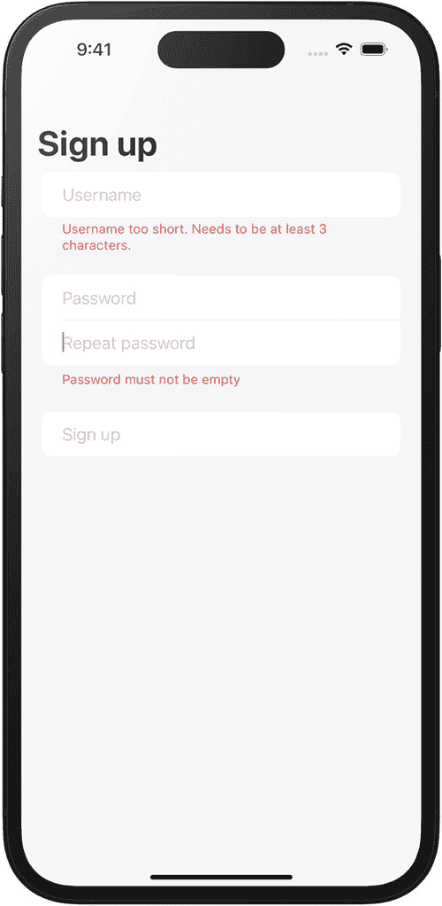

# 8. 使用 Combine 驱动 UI 状态

现代用户界面必须同时响应多种输入信号：用户可以通过键盘输入、多点触控、物理手势乃至语音命令与应用交互。除此之外，应用还可能从远程服务器和本地 API 接收数据。

对我们开发者而言，协调所有这些输入源及其发出的海量事件是一项具有挑战性的任务，因为我们经常需要组合多个输入源，并确保应用及其用户界面始终同步。

在本章及后续章节中，我们将探讨 Combine 如何帮助我们构建能够同时处理多个事件源的 UI，例如用户的输入以及来自本地和远程验证逻辑的结果，确保 UI 始终反映应用的当前状态。

在第六章的结尾，你已经看到如何使用 Combine 为输入表单上的单个输入字段实现输入验证。当时，我们使用 `onChange(of:)` 和 Combine 为 ISBN 字段实现了验证逻辑。为了展示 Combine 的强大功能，我们将实现一个包含多个事件源的更复杂的示例。


## 使用 Combine 实现输入验证

假设我们决定为图书追踪应用添加一些社交功能。为此，我们需要让用户注册并创建账户。注册时，用户需要选择用户名和密码：



一张移动设备屏幕的示意图，显示文本“注册”。下方字段依次为：用户名、密码、重复密码等。

图 8-1

简单的注册表单

为了保障用户数据的安全，我们需要满足以下几个前提条件：

- `username` 至少包含三个字符。这一点可以在用户输入期望用户名时进行本地校验。
- 用户名必须唯一，我们需要确保所选用户名未被其他用户使用。这需要在后端进行校验——我们需要查询某个 API 端点来确认该用户名是否仍可用。
- 用户密码必须满足一定的复杂程度要求（即，密码需要足够强健）。
- 为确保用户能记住密码，我们会要求用户在第二个密码输入字段中重复输入密码。

只有当所有这些条件都满足时，我们才能创建新用户账户。创建新账户的按钮应保持禁用状态，直到所有条件都满足。

如你所见，我们需要处理多个事件：

- 仅当表单有效时，*注册*按钮才可启用。
- 如果用户名太短或不可用，*用户名*输入字段需要显示警告。
- 如果密码不够强健或两次输入不匹配，*密码*字段需要显示警告。

### 注册表单视图

在本章中，我们将使用 `Form` 来处理所有用户输入。为了显示任何错误消息或警告，我们将使用相应表单 `Section` 的页眉/页脚。在第十四章中，我们将更进一步，构建一个可复用且可配置的文本输入字段，该字段带有浮动标签，并可以内联显示错误信息。

> ***注*** *你可以在本书的 Git-Hub 仓库*^(⁶⁷)*中找到示例应用的代码，位于第 8 章——使用 Combine 驱动 UI 状态文件夹中。各个步骤可以在* steps *文件夹中找到，最终版本位于* final *文件夹中。*

```
struct SignUpForm: View {
    @StateObject var viewModel = SignUpFormViewModel()
    var body: some View {
        Form {
            // 用户名
            Section {
                TextField("用户名", text: $viewModel.username)
                    .autocapitalization(.none)
                    .disableAutocorrection(true)
            } footer: {
                Text(viewModel.usernameMessage)
                    .foregroundColor(.red)
            }
            // 密码
            Section {
                SecureField("密码",
                            text: $viewModel.password)
                SecureField("重复密码",
                            text: $viewModel.passwordConfirmation)
            } footer: {
                Text(viewModel.passwordMessage)
                    .foregroundColor(.red)
            }
            // 提交按钮
            Section {
                Button("注册") {
                    print("正在以用户名 \(viewModel.username) 注册")
                }
                .disabled(!viewModel.isValid)
            }
        }
    }
}
```

处理所有输入字段并确保所有表单元素针对表单的不同状态显示正确的信息（或警告）通常需要编写大量代码，并且很容易出错或遗漏重要条件——尤其是在需要处理像远程 API 这样的异步事件源时。

通过使用 Combine 和函数式响应式编程，实现这个注册表单会变得容易得多。

在本章中，我们将重点验证用户名的长度要求和密码强度要求。在下一章中，我们将探讨如何使用 Combine 进行网络请求，以及如何利用它连接服务器并检查用户选择的用户名是否仍然可用。

### 视图模型

为了执行输入验证，我们的代码需要响应用户对注册表单所做的任何更改。我们特别关注对 `username`、`password` 和 `passwordConfirmation` 文本输入字段的更改观察。正如我们在前几章中已经看到的，无法直接操作 SwiftUI 视图或通过访问其属性来获取其状态。相反，SwiftUI 在视图元素之外管理 UI 状态，这被称为*数据源*。

为此，SwiftUI 提供了许多属性包装器，我们可以用它们将数据源连接到应用的视图。在第四章中，我们讨论了这些属性包装器的工作原理以及在何种情况下使用它们。

你可能还记得，我们可以使用 `@State` 来处理视图中的局部状态，因此你可能会想使用局部 `@State` 属性来保存注册表单的用户名、密码和密码确认。然而，`@State` 并非发布者，因此我们无法用它来驱动任何 Combine 管道。

相反，我们将创建一个视图模型，其中包含已发布属性 `username`、`password` 和 `passwordConfirmation`，这些属性可以绑定到相应的 UI 视图。

```
class SignUpFormViewModel: ObservableObject {
    // 输入
    @Published var username: String = ""
    @Published var password: String = ""
    @Published var passwordConfirmation: String = ""
    
    // 输出
    @Published var usernameMessage: String = ""
    @Published var passwordMessage: String = ""
    @Published var isValid: Bool = false
}
```

将属性标记为 `@Published` 会将其转换为 Combine 发布者。这不仅允许我们将属性绑定到 UI 元素，还可以将 Combine 管道附加到该属性，并在管道内部执行验证逻辑。然后，我们可以将管道的结果分配给另一个已发布属性，从而用结果驱动 UI。例如，只要表单输入无效，就可以禁用*提交*按钮。

通过使视图模型遵循 `ObservableObject` 协议，我们使其变得可观察。每当某个已发布属性发生变化时，视图模型将发出变化后的值，通知 SwiftUI 更新所有受影响的视图。

以这种方式使用 Combine 有助于我们以函数式的方式定义应用的行为，确保 UI 和应用状态始终保持同步。

从高层次来看，信息流如下所示：

- 用户在用户名字段中输入偏好的用户名。
- 每当用户键入一个字符，`TextField` 视图就会将当前输入的文本分配给 `SignUpFormViewModel` 的已发布属性 `username`。
- 由于 `username` 是一个发布者，它会对任何更改向其所有订阅者发送事件。
- 其中一个订阅者是一个 Combine 管道，用于检查 `username` 的长度是否大于三个字符。
- 该管道的结果将与其他管道的结果结合使用，以确定输入表单的整体验证结果。

视图模型的基本版本已经连接到注册表单的视图，因此现在让我们来看看如何使用 Combine 实现验证逻辑。


#### 验证用户名

首先进行一个简单的验证，检查用户名字符长度。我们可以使用 `$propertyName` 语法来访问已发布属性的发布者。这样我们就能订阅该发布者发送的任何事件（例如，当用户开始输入用户名导致底层属性发生变化时）。

我们管道的输入类型是 `String`，但我们需要返回一个 `Bool` 值来指示用户名长度是否有效。对于此类转换，我们可以使用 Combine 的 `map` 操作符。在其闭包内，我们可以对从上游发布者接收到的元素进行操作，并将其转换为所需的结果。

因此，要验证 `username` 是否至少包含三个字符，我们可以检查输入字符串的 `count` 属性是否大于等于三。此检查将返回 `true` 或 `false`：

```
$username
.map { username in
    return username.count >= 3
}
```

由于此检查是我们在闭包中执行的唯一语句，我们可以使用隐式返回来简化代码：

```
$username
.map { username in
    username.count >= 3
}
```

或者，使用位置参数：

```
$username
.map { $0.count >= 3 }
```

最终，此管道（以及其他管道）的结果需要赋值给视图模型的 `isValid` 属性。由于目前这是我们唯一的管道，我们可以在视图模型的初始化器中完成此操作：

```
class SignUpFormViewModel: ObservableObject {
    // 输入
    @Published var username: String = ""
    @Published var password: String = ""
    @Published var passwordConfirmation: String = ""
    // 输出
    @Published var usernameMessage: String = ""
    @Published var passwordMessage: String = ""
    @Published var isValid: Bool = false

    init() {
        $username
            .map { $0.count >= 3 }
            .assign(to: &$isValid)
    }
}
```

在管道的末尾，我们使用 `assign(to:)` 操作符将管道的结果赋值给 `isValid` 属性。

**图 8-2** – 用于验证用户名长度的 Combine 管道

如果你现在运行应用，你会发现*提交*按钮将处于禁用状态，直到你输入至少包含三个字符的用户名。但是，用户没有任何反馈，他们可能会疑惑为什么按钮被禁用，或者想知道用户名的最大长度是多少。

#### 显示验证消息

因此，在继续实现密码验证之前，让我们确保为用户提供一些指导，并显示合适的验证消息。视图模型中已经有一个 `usernameMessage` 属性，它绑定到包含 `username` 输入字段的表单部分的页脚。我们需要做的只是实现 Combine 管道，根据 `username` 的长度计算验证消息。

一个初级的实现可能如下所示：

```
class SignUpFormViewModel: ObservableObject {
    // ...

    init() {
        $username
            .map { $0.count >= 3 }
            .assign(to: &$isValid)

        $username
            .map {
                $0.count >= 3
                    ? ""
                    : "用户名必须至少包含三个字符！"
            }
            .assign(to: &$usernameMessage)
    }
}
```

虽然这个解决方案运行良好，但它有一些缺点：

1.  它包含了用于检查用户名的长度的重复逻辑。现在这可能不是问题，但一旦我们添加更多管道，其中包含硬编码的“用户名必须至少包含三个字符”的要求，这最终可能会成为维护负担。
2.  它不可扩展。目前只有一个规则，但如果添加另一个规则（例如用户名必须唯一），这需要与后端系统通信，会发生什么？使用这种方法，组合多个规则将非常复杂，甚至不可能。

为了解决这些问题，我们将通过将 Combine 管道封装在计算属性中，使其可重用。

#### 将 Combine 管道封装在计算属性中

使 Combine 发布者可重用的一种简单方法是将它们封装在私有计算属性中。

正如你在第 7 章中学到的，`Publisher` 是一个泛型类型，它有两个关联类型用于指定结果和错误情况。在我们的例子中，结果是 `Bool` 类型，管道永远不会失败，因此失败类型是 `Never`。

在组装管道时，管道的类型将是一个嵌套的泛型类型，表示我们沿途组装的所有发布者和操作符的返回类型。在我们的例子中，这将是 `Publishers.Map<Published<String>.Publisher, Bool>`。为了避免处理如此复杂的类型，我们可以使用类型擦除。Combine 提供了一个 `eraseToAnyPublisher` 操作符，它将管道的类型擦除为 `AnyPublisher`，这使我们能够像这样将管道包装在计算属性中：

```
private var isUsernameLengthValidPublisher: AnyPublisher<Bool, Never> {
    $username
        .map { $0.count >= 3 }
        .eraseToAnyPublisher()
}
```

将管道移入计算属性后，我们现在可以更新视图模型初始化器中的调用点：

```
init() {
    isUsernameLengthValidPublisher
        .assign(to: &$isValid)
}
```

下一步是重用该发布者来驱动用于计算验证消息的管道：

```
init() {
    isUsernameLengthValidPublisher
        .assign(to: &$isValid)

    isUsernameLengthValidPublisher
        .map {
            $0 ? ""
                : "用户名太短。至少需要 3 个字符。"
        }
        .assign(to: &$usernameMessage)
}
```

通过像这样重构代码，我们将业务逻辑（“用户名必须至少包含三个字符”）移到了单个位置，从而更易于更新。这也使我们能够重用该发布者来组合更复杂的规则，我们稍后会看到。

但在那之前，我想提请您注意一个小但可能很严重的方面：我们移入 `isUsernameLengthValidPublisher` 属性的代码将在每次被调用时创建一个新的管道。当在多个上下文中使用此发布者时（就像我们刚做的那样），我们最终将得到同一个管道的多个实例，而不是一个实例。这不仅会浪费内存，而且一旦我们构建一个进行网络调用或访问数据库的管道，它就会成为一个更严重的问题。创建和使用管道的多个实例，每个实例在处理事件时都执行网络访问，将导致每个额外的管道实例产生重复的网络请求——这绝对不是我们想要的。

为了防止这种情况发生，我们需要将计算属性转换为惰性属性。惰性属性只计算一次，并且仅在第一次访问它们时计算。将计算属性转换为惰性属性只需要少量更改：

```
private lazy var isUsernameLengthValidPublisher: AnyPublisher<Bool, Never> = {
    $username
        .map { $0.count >= 3 }
        .eraseToAnyPublisher()
}()
```

好处在于，我们可以像使用任何其他属性一样使用惰性属性——无需更改调用点。通过这项更改，我们确保只在视图模型初始化时创建一次管道。


#### 密码验证

有效的用户名只是能在我们应用中创建新用户账户的一个必要条件——提供密码则是另一个。在本节中，我们将基于上一节所学内容，构建一条 Combine 管道，以实现一种灵活且易于扩展的密码验证机制。

第一步是确保密码不为空。我们可以使用一个简单的发布者来实现这一验证，类似于我们实现用户名长度检查的方式：

```
private lazy var isPasswordEmptyPublisher:
AnyPublisher =
{
$password
.map { $0.isEmpty }
.eraseToAnyPublisher()
}()
```

和之前一样，我们使用惰性计算属性来确保只创建管道的一个实例。

作为一项小优化，我们可以通过键路径来访问密码字符串的 `isEmpty` 属性。Combine 在 `Publisher` 上包含了一个扩展，提供了 `map` 函数的重载版本，允许我们在 `map` 运算符中处理最多三个键路径。

```
private lazy var isPasswordEmptyPublisher:
AnyPublisher =
{
$password
.map(\.isEmpty)
.eraseToAnyPublisher()
}()
```

接下来，我们将比较密码和密码确认字段，以确保用户两次输入的密码一致。`$password` 和 `$passwordConfirmation` 都是已发布的属性，因此我们可以订阅它们，以便在用户输入密码时接收事件。

但我们如何获取最新的密码和最新确认的密码呢？

Combine 提供了许多运算符，允许我们在同一条管道中组合多个发布者。`Publishers.CombineLatest` 允许我们使用两个上游发布者发送的最新事件。以下代码片段订阅了 `$password` 和 `$passwordConfirmation`，并使用相等运算符 `==` 比较它们的最新输出（即用户输入到密码字段中的文本）：

```
private lazy var isPasswordMatching:
AnyPublisher =
{
Publishers.CombineLatest($password, $passwordConfirmation)
.map(==)
.eraseToAnyPublisher()
}()
```

你会注意到我使用了 `map` 运算符的键路径版本——闭包版本看起来像这样：`map { $0 == $1 }`。使用哪种主要取决于风格和个人偏好。

现在我们已经能够判断密码是否为空，以及密码和确认密码是否匹配，接下来需要确定密码的总体有效性：如果密码不为空且与确认密码匹配，则密码有效。

你可能已经猜到了：我们将使用 `Publishers.CombineLatest` 将 `isPasswordEmptyPublisher` 和 `isPasswordMatchingPublisher` 的最新状态组合成另一个发布者，命名为 `isPasswordValidPublisher`：

```
private lazy var isPasswordValidPublisher:
AnyPublisher =
{
Publishers.CombineLatest(
isPasswordEmptyPublisher,
isPasswordMatchingPublisher
)
.map { !$0 && $1 }
.eraseToAnyPublisher()
}()
```

至此，这段代码应该看起来很熟悉了。为了显示有意义的验证消息，请将以下代码添加到视图模型的初始化器中：

```
Publishers.CombineLatest(
isPasswordEmptyPublisher,
isPasswordMatchingPublisher
)
.map { isPasswordEmpty, isPasswordMatching in
if isPasswordEmpty {
return "密码不能为空"
}
else if !isPasswordMatching {
return "两次输入的密码不匹配"
}
return ""
}
.assign(to: &$passwordMessage)
```

#### 综合应用

作为最后一步，我们需要将用户名验证和密码验证结合起来，并将结果赋值给视图模型的 `isValid` 属性。这样，如果表单有效，提交按钮将被启用。

类似于我们计算密码整体验证状态的方式，我们将使用 `Publishers.CombineLatest` 基于 `isUsernameLengthValidPublisher` 和 `isPasswordValidPublisher` 来确定表单的整体状态：

```
private lazy var isFormValidPublisher:
AnyPublisher =
{
Publishers.CombineLatest(
isUsernameLengthValidPublisher,
isPasswordValidPublisher
)
.map { $0 && $1 }
.eraseToAnyPublisher()
}()
```

在视图模型的初始化器中，替换第一行（仅使用 `isUsernameLengthValidPublisher` 的那行），改用 `isFormValidPublisher` 来驱动提交按钮的状态：

```
init() {
isFormValidPublisher
.assign(to: &$isValid)
isUsernameLengthValidPublisher
.map {
$0 ? ""
: "用户名太短。需要至少 3 个字符。"
}
.assign(to: &$usernameMessage)
Publishers.CombineLatest(
isPasswordEmptyPublisher,
isPasswordMatchingPublisher
)
.map { isPasswordEmpty, isPasswordMatching in
if isPasswordEmpty {
return "密码不能为空"
}
else if !isPasswordMatching {
return "两次输入的密码不匹配"
}
return ""
}
.assign(to: &$passwordMessage)
}
```

## 练习^(⁷¹)

选择一个强密码并不容易，许多注册表单会提供视觉提示来帮助用户选择强密码。我们的注册表单在这方面相当宽松，允许用户选择任何内容作为密码，这样并不安全。利用你目前学到的知识，鼓励用户选择强密码：

1.  实现密码长度要求：确保用户密码长度至少为 8 个字符。如果少于 8 个字符，在表单密码区域的底部显示警告信息。

2.  验证密码强度，拒绝任何强度不足的密码。一个简单的方法是使用像 *Navajo-Swift*^(⁷²) 这样的库，它会按 `非常弱`、`弱`、`一般`、`强`、`非常强` 的等级计算强度。确保注册表单仅在用户选择至少达到 `一般` 强度的密码时才会变为有效。

3.  在密码区域底部添加一个进度条，显示密码强度，并将进度条分别着色为红色、黄色和绿色以指示密码强度。


## 总结

在本章中，你学会了如何使用 Combine 发布器来驱动具有复杂业务逻辑的 UI 状态，以及如何将应用逻辑分解为更小的 Combine 管道，从而保持代码的可管理性。

我们探讨了如何将业务逻辑从 UI 中分离出来，并将其迁移至视图模型中。这有助于保持视图简洁且易于阅读。

接着，你学习了创建 Combine 管道的几种技巧，以及如何在视图模型中管理它们。对于简单的管道，可以在视图模型的初始化器中创建。当需要复用某个管道时，最好将其移至私有属性中。请记住，应使用惰性计算属性来确保不会创建同一管道的多个实例，从而避免内存浪费以及潜在的多余网络请求。

Combine 提供了丰富的运算符来转换来自上游发布器的输出。在本章中，我们使用了以下运算符：

- `map` 允许我们将一个发布器的输入转换为不同的格式。你看到了如何通过闭包使用 `map` 来执行更复杂的转换逻辑，或者利用其键路径重载来创建简洁而强大的转换，直接访问输入的属性。
- `Publishers.CombineLatest` 是另一个你会频繁使用的运算符——它会合并多个上游发布器的最新事件，并将其提供给其闭包。你可以把它想象成一个 *Y* 形连接器，允许你连接多个事件流，并将它们转换为一个统一的输出流。

本章初步展示了 Combine 与 SwiftUI 结合的可能性，以及如何使用 Combine 简化 SwiftUI 应用的编写。

在下一章中，我们将转换视角，看看如何利用 Combine 访问网络，并将远程 API 调用的结果与应用 UI 中的本地事件相结合。

