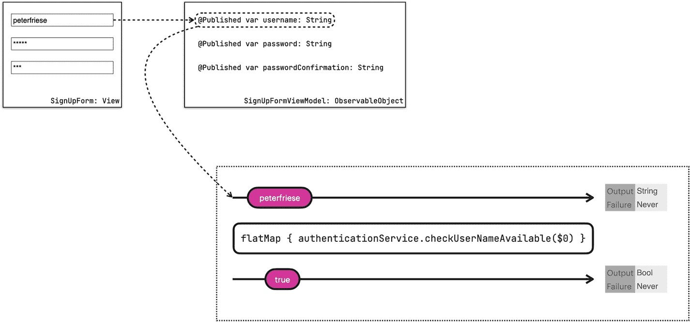

# 使用 Combine 进行网络请求

我们生活在一个互联的世界里，大多数现代应用都需要访问网络来检索存储在互联网（或用户本地网络）服务器上的信息。

即使在超高速连接上，一个请求通常也需要几毫秒。在应用的前台线程中使用阻塞式 I/O 并等待响应是不可取的，因为这会导致应用冻结，从而带来极差的用户体验。用户可能会以为你的应用已崩溃而将其关闭。为防止这种行为，我们需要将异步工作卸载到后台线程，这样前台线程就能自由地执行 UI 更新并响应用户交互。这就是为什么现代网络 API 必须以异步方式调用的原因。

在 Swift 中实现异步 API 最流行的方法是使用*回调*。这些通常以闭包的形式实现，得益于 Swift 的尾随闭包语法，一旦你理解了它们的工作原理，它们看起来相当优雅且易于使用。

调用异步 API 的其他方式包括 *async/await* 和 *Combine*。在本章中，我们将深入探讨如何使用 Combine 为你的应用实现网络层。我们首先会介绍使用 `URLSession` 从网络获取数据的传统回调驱动方式。然后，我们将重构这段代码，以利用 Combine 的 `DataTaskPublisher`。你将学习 Combine 如何使数据映射和错误处理变得更加容易，从而产生更易读且更少 bug 的代码。在第 14 章和第 15 章中，你将学习如何使用 `async/await` 执行异步调用，并将探讨 Combine 与 `async/await` 之间的区别。

保持应用的用户界面与应用状态的同步一直是个难题，开发社区也提出了大量方法来解决这一挑战。

响应式编程就是其中一种方法，而 SwiftUI 的响应式状态管理通过引入*数据源*（source of truth）的概念使这一点变得容易得多。这个数据源可以使用 SwiftUI 的属性包装器（如 `@EnvironmentObject`、`@StateObject` 和 `@ObservedObject`）在应用中共享。

这个*数据源*通常就是你的内存数据模型，将本地数据源与网络结合起来听起来可能很复杂。在本章中，你将学习如何使用 Combine 来将本地数据源与远程服务的数据结合起来，这可能会比你想象的简单得多。

你将首先学习如何将网络驱动的 Combine 管道连接到 SwiftUI 用户界面。接着，我们将优化实现，以确保你的应用不会让你的后端服务器不堪重负。Combine 提供了一些运算符，能帮助我们显著减少应用发送到服务器的请求数量。这也会改善你应用的用户体验，让你不禁惊叹以往没有 Combine 的日子是怎么过来的。

让我们开始吧，首先探讨如何使用 Combine 从服务器获取数据，并将结果映射到 Swift 的 `struct`。


## 使用 URLSession 获取数据

我们将继续构建上一章开始设计的注册表单。假设其中一项需求是检查用户偏好的用户名是否仍然可用。

这要求我们与授权服务器通信，以确认所需的用户名是否已被他人占用。以下是一个请求示例，展示了我们如何尝试查询用户名 `sjobs` 是否可用：

```
GET localhost:8080/isUserNameAvailable?userName=sjobs HTTP/1.1
```

服务器将回复一个简短的 JSON 文档，说明该用户名是否仍可用：

```
HTTP/1.1 200 OK
content-type: application/json; charset=utf-8
content-length: 39
connection: close
date: Thu, 06 Jan 2022 16:09:08 GMT
{"isAvailable":false, "userName":"sjobs"}
```

要在 Swift 中执行此请求，我们可以使用 `URLSession`。使用 `URLSession` 从网络获取数据的传统方式如下所示：

```
func checkUserNameAvailableOldSchool(userName: String, completion: @escaping (Result) -> Void) {
    guard let url = URL(string: "http://localhost:8080/isUserNameAvailable?userName=\(userName)") else {
        completion(.failure(.invalidRequestError("URL invalid")))
        return
    }
    let task = URLSession.shared.dataTask(with: url) { data, response, error in
        if let error = error {
            completion(.failure(.transportError(error)))
            return
        }
        if let response = response as? HTTPURLResponse, !(200...299).contains(response.statusCode) {
            completion(.failure(.serverError(statusCode: response.statusCode)))
            return
        }
        guard let data = data else {
            completion(.failure(.noData))
            return
        }
        do {
            let decoder = JSONDecoder()
            let userAvailableMessage = try decoder.decode(UserNameAvailableMessage.self, from: data)
            completion(.success(userAvailableMessage.isAvailable))
        } catch {
            completion(.failure(.decodingError(error)))
        }
    }
    task.resume()
}
```

虽然这段代码运行良好，本身也没有什么问题，但它确实存在几个问题：

1.  成功路径并不一目了然——唯一返回成功结果的位置相当隐蔽。

2.  对于不熟悉完成处理程序的开发者来说，成功路径甚至没有使用 `return` 语句将网络调用的结果返回给调用者，这可能会让人感到困惑。

3.  错误处理分散在各处。

4.  存在多个出口点，很容易忘记在 `if let` 条件中写某个 `return` 语句。

5.  总体而言，即使对于经验丰富的 Swift 开发者，这段代码也难以阅读和维护。

6.  很容易忘记调用 `resume()` 来实际执行请求。我确信我们大多数人在使用 `URLSession` 时都曾疯狂地寻找 bug，最后才发现忘了使用 `resume` 来启动请求。是的，我认为对于本应*发送*请求的 API 来说，`resume` 并非一个很合适的名称。

**运行代码示例**

*你可以在随附的 GitHub 仓库中找到所有代码示例，位于* `Networking` *文件夹中。为了让你能更好地受益，我还在* `server` *子文件夹中提供了一个演示服务器（使用 Vapor 构建）。要在你的机器上运行它，请执行以下操作：*

```
$ cd server
$ swift run
```

## 使用 Combine 获取数据

在引入 Combine 时，Apple 为许多自己的异步 API 添加了发布者。开发者现在可以使用这些发布者来替换现有的、基于回调的代码。

重构后的代码具有更少的出口点，遵循线性流程，因此更易于阅读和维护。它也不太容易出现隐蔽的 bug。

为了更好地理解这意味着什么，让我们看看之前的（基于回调的）代码片段在使用 Combine 重构后是什么样子：

```
func checkUserNameAvailableNaive(userName: String) -> AnyPublisher {
    guard let url = URL(string: "http://127.0.0.1:8080/isUserNameAvailable?userName=\(userName)") else {
        return Just(false).eraseToAnyPublisher()
    }
    return URLSession.shared.dataTaskPublisher(for: url)
        .map { data, response in
            do {
                let decoder = JSONDecoder()
                let userAvailableMessage = try decoder.decode(UserNameAvailableMessage.self, from: data)
                return userAvailableMessage.isAvailable
            } catch {
                return false
            }
        }
        .replaceError(with: false)
        .eraseToAnyPublisher()
}
```

让我们逐步分析这段代码：

1.  我们使用 `dataTaskPublisher` 来执行请求。这个发布者是一个一次性发布者，会在请求的数据到达后发出一个事件。值得记住的是，如果没有订阅者，Combine 发布者不会执行任何工作。这意味着，在添加至少一个订阅者之前，该发布者不会对给定的 URL 执行任何调用。稍后我将向你展示如何将这个管道连接到 UI，并确保每次用户在用户名字段中输入文本时都会调用它。

2.  一旦请求返回，发布者会发出一个包含 `data` 和 `response` 的值。在这一行，我们使用 `map` 运算符来转换这个结果。如你所见，除了少数细微的变化外，我们可以复用之前版本代码中的大部分数据映射代码。

3.  我们不再调用 `completion` 闭包，而是返回一个 `Boolean` 值来指示用户名是否仍然可用。这个值将沿管道向下传递。

4.  如果数据映射失败，我们会捕获错误并返回 `false`，这似乎是一个不错的折中方案。

5.  对于访问网络时可能发生的任何错误，我们也进行同样的处理。这是一个简化的做法，将来可能需要重新审视。

另外请注意，（除了确保我们拥有有效 URL 的 `guard` 语句外）这里只有*一个*出口点。

这看起来比最初版本好多了，也更容易阅读。我们完全可以就此打住，在应用中使用这段代码。

但我们可以做得更好。在接下来的三个小节中，我们将探讨一些能使代码更加线性且更易于推理的改动。

#### 使用键路径解构元组

我们经常需要从变量中提取特定属性。在前面的代码中，`dataTaskPublisher` 返回一个包含我们所发送 URL 请求的 `data` 和 `response` 的结果。从 `DataTaskPublisher` 的声明中可以看出，结果的类型是一个元组：

```
public struct DataTaskPublisher : Publisher {
    /// 该发布者发布的值的类型。
    public typealias Output = (data: Data, response: URLResponse)
    ...
}
```

从元组中提取各个元素称为*解构*。Combine 提供了一个重载版本的 `map` 运算符，允许我们解构元组并只访问我们关心的属性：

```
return URLSession.shared.dataTaskPublisher(for: url)
    .map(\.data)
```

#### 映射数据

由于映射数据是一项非常常见的任务，Combine 为此提供了一个专用的运算符 `decode(type:decoder:)`，使其更简单：

```
return URLSession.shared.dataTaskPublisher(for: url)
    .map(\.data)
    .decode(type: UserNameAvailableMessage.self, decoder: JSONDecoder())
```

这将从上游发布者提取 `data` 值，并将其解码为 `UserNameAvailableMessage` 实例。

最后，我们可以再次使用 `map` 运算符来解构 `UserNameAvailableMessage` 并访问其 `isAvailable` 属性：

```
return URLSession.shared.dataTaskPublisher(for: url)
    .map(\.data)
    .decode(type: UserNameAvailableMessage.self, decoder: JSONDecoder())
    .map(\.isAvailable)
```


#### 使用 Combine 简化数据获取

经过上述所有修改，我们现在拥有一个易于阅读且流程线性的管道版本：

```
class AuthenticationService {
    func checkUserNameAvailable(userName: String) -> AnyPublisher<Bool, Never> {
        guard let url = URL(string: "http://127.0.0.1:8080/isUserNameAvailable?userName=\(userName)") else {
            return Just(false).eraseToAnyPublisher()
        }
        return URLSession.shared.dataTaskPublisher(for: url)
            .map(\.data)
            .decode(type: UserNameAvailableMessage.self, decoder: JSONDecoder())
            .map(\.isAvailable)
            .replaceError(with: false)
            .eraseToAnyPublisher()
    }
}
```

最好将此代码与任何其他直接与身份验证服务器通信的代码一起保存在一个独立的类型中。像这样模块化代码有助于我们保持代码库的整洁有序。

#### 连接到 UI

现在，让我们看看如何将这个新的 Combine 管道集成到我们在上一章开始的注册表单中。

以下是注册表单的简化版本。我删除了一些代码，以免分散你在本章中的注意力。在本章的讨论中，我们只关心用户名字段、用于显示消息的 `Text` 标签以及一个注册按钮。我已注释掉上一章讨论的密码字段的代码。

```
struct SignUpForm: View {
    @StateObject private var viewModel = SignUpFormViewModel()
    var body: some View {
        Form {
            // 用户名
            Section {
                TextField("用户名", text: $viewModel.username)
                    .autocapitalization(.none)
                    .disableAutocorrection(true)
            } footer: {
                Text(viewModel.usernameMessage)
                    .foregroundColor(.red)
            }
            // （为简洁起见，已移除密码字段的代码）
            // 提交按钮
            Section {
                Button("注册") {
                    print("正在以 \(viewModel.username) 注册")
                }
                .disabled(!viewModel.isValid)
            }
        }
    }
}
```

以下是视图模型中与我们讨论相关的部分——同样，为简单起见，已删除了上一章中的部分代码。

```
class SignUpScreenViewModel: ObservableObject {
    private var authenticationService = AuthenticationService()
    // MARK: 输入
    @Published var username: String = ""
    // MARK: 输出
    @Published var usernameMessage: String = ""
    @Published var isValid: Bool = false
    ...
}
```

由于 `@Published` 属性是 Combine 发布者，我们可以订阅它们，以便在其值发生变化时接收更新。

这将使我们能够获取用户的最新输入，并将其传递给 `checkUserNameAvailable` 发布者，以查看该用户名是否仍然可用。

为了将事件从一个发布者传递到另一个发布者，我们可以使用 `flatMap` 操作符：

```
$username
    .flatMap { username -> AnyPublisher<Bool, Never> in
        self.authenticationService.checkUserNameAvailable(userName: username)
    }
```



一个包含 3 个字段的注册表单截图链接到两个区块。一个区块中给出了表单模型模板和每个字段的字符类型。下一个区块中则展示了通过输出表和失败表检查用户名可用性的过程。

**图 9-1** 调用身份验证服务检查用户名是否可用的 Combine 管道

此管道从 `username` 发布者获取输入事件（即用户在*用户名*文本输入字段中输入的内容），并将其发送到 `checkUserNameAvailable` 发布者。该发布者将为每个输入事件返回一个 `Bool` 值，指示相应的用户名是否仍然可用。这意味着订阅者将收到一个 `Bool` 值流。

我们希望使用此管道的结果来驱动注册表单的状态：只要管道返回 `true` 表示所选用户名可用，我们就希望启用*提交*按钮。同时，一旦管道结果为 `false`，我们希望显示一条错误消息。

这意味着我们需要向管道添加两个不同的订阅者：*提交*按钮的启用状态和错误消息标签的文本。

为了节省内存并避免浪费 CPU 周期，让我们使管道可重用。实现此目的的一种方法是将其包装在惰性计算属性中。惰性计算属性只计算一次，并且仅在访问时计算。

提醒一下，惰性计算属性的一般形式如下：

```
lazy var propertyName: Type = {
    // 在闭包内计算属性的值
}() // <- 不要忘记括号
```

使用惰性计算属性可确保管道只被实例化一次，从而确保我们为每个订阅者使用相同的实例。

```
private lazy var isUsernameAvailablePublisher:
    Publishers.FlatMap<AnyPublisher<Bool, Never>, Published<String>.Publisher> = {
    $username
        .flatMap { username in
            self.authenticationService
                .checkUserNameAvailable(userName: username)
        }
}()
```

此时，管道的结果类型是 `Publishers.FlatMap<AnyPublisher<Bool, Never>, Published<String>.Publisher>`。这不仅难以阅读，而且在调用代码中使用也很困难。为了避免使用如此复杂的签名，Combine 提供了 `eraseToAnyPublisher` 操作符，它允许我们将管道的类型擦除为 `AnyPublisher<Type, Error>`。通过将此操作符附加到管道的末尾，我们将管道的类型擦除为 `AnyPublisher<Bool, Never>`——使用起来更加方便。

```
private lazy var isUsernameAvailablePublisher:
    AnyPublisher<Bool, Never> = {
    $username
        .flatMap { username in
            self.authenticationService
                .checkUserNameAvailable(userName: username)
        }
        .eraseToAnyPublisher()
}()
```

下一步，我们将把 `isUsernameAvailablePublisher` 的结果连接到 UI。看一下视图模型：我们在视图模型的输出部分有两个属性——一个用于与用户名相关的任何消息，另一个保存表单的整体验证状态。

Combine 发布者可以连接到多个订阅者，因此我们可以将 `isValid` 和 `usernameMessage` 都连接到 `isUsernameAvailablePublisher`：

```
class SignUpScreenViewModel: ObservableObject {
    ...
    init() {
        isUsernameAvailablePublisher
            .assign(to: &$isValid)
        isUsernameAvailablePublisher
            .map {
                $0 ? "" : "用户名不可用。请尝试其他用户名。"
            }
            .assign(to: &$usernameMessage)
    }
}
```

使用这种方法，我们可以重用 `isUsernameAvailablePublisher`，并用它来驱动表单的整体 `isValid` 状态（这将启用/禁用*提交*按钮）和 `usernameMessage` 标签，该标签通知用户他们选择的用户名是否仍然可用。

确保演示服务器正在运行，启动应用程序，并尝试输入几个不同的用户名。演示服务器有一个硬编码的用户名列表，它将这些用户名视为不可用，因此请尝试以下用户名，看看我们迄今为止开发的 Combine 管道如何驱动 UI：`peterfriese`、`johnnyappleseed`、`page`、`johndoe`。

在输入时观察服务器的控制台输出，你会注意到一些事情：

1.  每输入一个字符，API 端点就会被调用多次。
2.  Xcode 会提示你不应该在后台线程更新 UI。

让我们看看这些问题，并尝试了解如何修复它们。


## 处理多线程

在构建访问网络的 Combine 管道时，你可能会在 Xcode 的控制台输出中看到类似如下的错误信息：

```
[SwiftUI] 不允许从后台线程发布更改；请确保在主线程上（通过诸如 receive(on:) 之类的操作符）发布模型更新。
```

有时候，^(⁷⁴) Xcode 会在代码编辑器中显示紫色警告，从而更容易定位有问题的代码段。

出现此错误信息的原因是 `URLSession` 会在后台线程执行网络请求。当请求完成后，`dataTaskPublisher` 会将包含请求结果的事件发送到管道中。我们的代码会获取此结果，将其映射到 UI 所需的数据类型，并赋值给视图模型的某个已发布属性。这反过来会提示 SwiftUI 用属性的新值更新 UI。

所有这些操作都发生在同一个线程——一个后台线程上。然而，不推荐从后台线程访问 UI，这就是 SwiftUI 发出警告的原因。

要防止这种情况发生，我们需要指示 Combine 在收到网络请求结果后切换到前台线程。为了告诉 Combine 在特定线程上接收事件，我们可以使用 `receive(on:)` 操作符：

```
private lazy var isUsernameAvailablePublisher:
AnyPublisher =
{
$username
.flatMap { username -> AnyPublisher in
self.authenticationService
.checkUserNameAvailable(userName: username)
}
.receive(on: DispatchQueue.main)
.eraseToAnyPublisher()
}()
```

我们将在关于 Combine 调度器的章节中深入探讨线程问题，但目前，这行代码可以解决我们的线程问题。

## 优化网络访问

由于大多数地方都提供了高速、低延迟的互联网，我们很容易忘记并非所有用户在使用我们的应用时都处于快速、低延迟的网络连接中。即使在汉堡或伦敦这样的城市，你也会发现一些网络信号不佳或完全没有连接的区域。

在构建访问互联网的应用时，我们应该注意到这一点，并确保不浪费带宽。

当运行应用并检查测试服务器的日志时，你会看到，每输入一个字符，`isUserNameAvailable` 端点就被调用多次。这显然不理想：不仅浪费了我们服务器上的 CPU 周期（如果你使用的是按调用次数或 CPU 运行时间收费的云服务提供商，这可能成为一个问题），还意味着我们为应用增加了额外的网络开销。

当你在本地运行测试服务器时可能几乎注意不到这一点，但当你通过 Edge 连接与远程服务器实例通信时，就一定会察觉。

如果你的 API 端点不是**幂等**的，问题就会变得更糟：想象一下调用一个用于预订座位或购买音乐会门票的 API 端点。发送两个（或更多）请求而不是一个，会导致你预订了超出需求的座位，或者购买了超出想要的音乐会门票。

### 查找根本原因

首先，我们需要找出是什么导致了所有这些额外的请求。

了解 Combine 管道中发生了什么的一个简单方法是添加一些调试代码。让我们在管道中添加 `print()` 操作符：

```
private lazy var isUsernameAvailablePublisher:
AnyPublisher =
{
$username
.print("username")
.flatMap { username -> AnyPublisher in
self.authenticationService
.checkUserNameAvailable(userName: username)
}
.receive(on: DispatchQueue.main)
.eraseToAnyPublisher()
}()
```

此操作符会将一些有用的信息记录到控制台：

1. 管道的任何生命周期事件（例如，添加订阅）
2. 任何发送/接收的值

我们可以指定一个前缀（`"username"`）来使日志语句在控制台中更加突出。

重新运行应用后，我们立即看到以下输出——即使在文本字段中未输入任何内容：

```
username: receive subscription: (PublishedSubject)
username: request unlimited
username: receive value: ()
username: receive subscription: (PublishedSubject)
username: request unlimited
username: receive value: ()
```

这表明我们的发布者有两个订阅者！

查看我们的代码，可以在视图模型的初始化器中找到这些订阅者：

```
init() {
isUsernameAvailablePublisher
.assign(to: &$isValid)
isUsernameAvailablePublisher
.map {
$0 ? ""
: "用户名不可用。请尝试其他用户名。"
}
.assign(to: &$usernameMessage)
}
```

第一个订阅者是用于填充 `isValid` 属性的管道，我们最终用它来启用/禁用注册表单上的提交按钮。

第二个订阅者是当所选用户名不可用时生成错误消息的管道。此管道的结果也会显示在注册表单上。

每当用户输入一个字符时，`isUsernameAvailablePublisher` 管道都需要处理 `username` 字段的当前值，以便最终将结果赋值给订阅者。

对于本地运行的管道来说，这没什么大不了的（尽管我们应该尽量减少 CPU 周期的浪费），但对于像我们这样访问网络的管道来说，这就成为了一个更大的问题。

现在我们已经确定了导致发布者有多个订阅的原因，让我们看看如何解决这个问题。


### 使用 `share` 操作符共享发布者

单个发布者拥有多个订阅者是常见的模式，尤其是在 UI 开发中，一个 UI 元素可能会影响多个其他视图。

如果你需要与多个订阅者共享发布者的结果，可以使用 `share()` 操作符。根据苹果的文档：

> 此操作符返回的发布者支持多个订阅者，所有订阅者都会从上游发布者接收到未更改的元素和完成状态。

这正是我们所需要的。通过在 `isUsernameAvailablePublisher` 管道的末尾应用 `share` 操作符，我们将每个事件（即用户在用户名字段中输入的每个字符）的管道结果与发布者的所有订阅者共享：

```
private lazy var isUsernameAvailablePublisher:
AnyPublisher =
{
$username
.print("username")
.flatMap { username -> AnyPublisher in
self.authenticationService
.checkUserNameAvailable(userName: username)
}
.receive(on: DispatchQueue.main)
.share()
.eraseToAnyPublisher()
}()
```

运行更新后的代码，我们可以看到 `$username` 发布者不再有两个订阅者，而只有一个：

```
username: receive subscription: (PublishedSubject)
username: request unlimited
username: receive value: ()
```

现在，你可能会好奇为什么只有一个订阅者，因为我们显然仍然有两个已发布的属性（`isValid` 和 `usernameMessage`）订阅了该管道。

答案很简单：`share` 操作符本质上就是这个唯一的订阅者，而 `isValid` 和 `isUsernameAvailablePublisher` 则是订阅了它。为了证明这一点，让我们在管道中再添加一个 `print()` 操作符：

```
private lazy var isUsernameAvailablePublisher:
AnyPublisher =
{
$username
.print("username")
.flatMap { username -> AnyPublisher in
self.authenticationService
.checkUserNameAvailable(userName: username)
}
.receive(on: DispatchQueue.main)
.share()
.print("share")
.eraseToAnyPublisher()
}()
```

在生成的输出中，我们可以看到 `share` 收到了两个订阅 (1, 2)，而 `username` 只收到了一个 (3)：

```
share: receive subscription: (Multicast)           // (1)
share: request unlimited
username: receive subscription: (PublishedSubject) // (3)
username: request unlimited
username: receive value: ()
share: receive subscription: (Multicast)           // (2)
share: request unlimited
share: receive value: (true)
share: receive value: (true)
```

你可以将 `share()` 想象成一个分叉点，它从其上游发布者接收事件，然后将这些事件多播给它的所有订阅者。

**这是一个错误还是一个特性？**

*继续在用户名字段中输入几个字符，你会发现每输入一个字符，仍然会向服务器发出两个请求。*

*这可能是 iOS 15 中的一个问题——我对此进行了一些调试，看起来 `TextField` 会重复发出每一次按键。在较早版本的 iOS 中，情况并非如此，我倾向于认为这是 iOS 15 中的一个错误，因此我创建了一个示例项目来重现此问题（参见 AppleFeedback/FB9826727 at main · peterfriese/AppleFeedback (*[`github.com/peterfriese/AppleFeedback/tree/main/FB9826727`](https://github.com/peterfriese/AppleFeedback/tree/main/FB9826727)*)），并向 Apple 提交了一个反馈（FB9826727）。*

*如果你也认为这是一个回归问题，请考虑也提交一个反馈——一个 bug 收到的重复报告越多，它就越有可能被解决。*

### 使用 `debounce` 进一步优化用户体验

在构建与远程系统通信的 UI 时，我们需要记住，用户打字的速度通常比系统提供反馈的速度要快得多。

例如，在选择用户名时，我通常会一口气输入我最喜欢的用户名，而不会在中间停下来。我不关心这个用户名的前几个字母是否可用——我关心的是完整的名字。每按一次键就将不完整的用户名发送到服务器并没有太大意义，而且似乎非常浪费。

为了避免这种情况，我们可以使用 Combine 的 `debounce` 操作符：它会丢弃所有事件，直到出现一个暂停。然后它会将最近的事件传递给下游的发布者：

```
private lazy var isUsernameAvailablePublisher:
AnyPublisher =
{
$username
.debounce(for: 0.8, scheduler: DispatchQueue.main)
.print("username")
.flatMap { username -> AnyPublisher in
self.authenticationService
.checkUserNameAvailable(userName: username)
}
.receive(on: DispatchQueue.main)
.share()
.print("share")
.eraseToAnyPublisher()
}()
```

通过这样做，我们告诉 Combine 忽略所有对 `username` 的更新，直到出现 0.8 秒的暂停，然后将最新的 `username` 发送给管道上的下一个操作符（在本例中是 `print` 操作符，然后它会将事件传递给 `flatMap` 操作符）。

这更符合正常的用户输入行为，并将使应用程序向服务器发送更少的请求。

### 使用 `removeDuplicates` 避免重复发送相同请求

你是否曾和某人说话，把同一个问题问了两遍？这会有点尴尬，对方可能会怀疑你是否在认真听他们说话。

现在，尽管人工智能在进步，但我确信计算机没有情感，所以如果你两次发送相同的 API 请求，它们不会记仇。但为了给用户提供尽可能好的体验，我们应该尽可能避免发送重复的请求。

Combine 为此提供了一个操作符：`removeDuplicates`——如果事件流中的事件是*连续*出现的，它将移除所有重复的事件。

这与 `debounce` 操作符配合得非常好，我们可以将这两个操作符结合使用（抱歉，我想你只能忍受这个双关语了），对我们的用户名可用性检查进行一些进一步的优化：

```
private lazy var isUsernameAvailablePublisher:
AnyPublisher =
{
$username
.debounce(for: 0.8, scheduler: DispatchQueue.main)
.removeDuplicates()
.print("username")
.flatMap { username -> AnyPublisher in
self.authenticationService
.checkUserNameAvailable(userName: username)
}
.receive(on: DispatchQueue.main)
.share()
.print("share")
.eraseToAnyPublisher()
}()
```

它们一起工作，可以进一步减少在用户输入错误然后更正拼写时，我们发送到服务器的请求数量。

让我们来看一个例子：

```
jonyive [暂停] s [退格键]
```

这将发送以下请求：

1.  `jonyive`

2.  不发送 `jonyives` 的请求（因为在去抖动超时之前，`s` 已经被删除了）

3.  不发送第二个 `jonyive` 的请求，因为它被 `removeDuplicates` 过滤掉了

这只是一个微小的改变，影响可能不大——但积少成多。


## 整合所有内容

在上一章中，我们实现了一个检查，确保用户名至少包含三个字符。为了验证用户名长度是否达标且仍可使用，我们需要结合 `isUsernameLengthPublisher` 和 `isUsernameAvailablePublisher`。就像我们之前做的那样，可以使用 `Publishers.CombineLatest()` 来实现这一点。

让我们创建一个新的发布器 `isUsernameValidPublisher`，它用于合并 `isUsernameLengthValidPublisher` 和 `isUsernameAvailablePublisher` 发送的事件：

```swift
enum UserNameValid {
    case valid
    case tooShort
    case notAvailable
}
private lazy var isUsernameValidPublisher:
    AnyPublisher =
{
    Publishers.CombineLatest(
        isUsernameLengthValidPublisher, isUsernameAvailablePublisher
    )
    .map { longEnough, available in
        if !longEnough {
            return .tooShort
        }
        if !available {
            return .notAvailable
        }
        return .valid
    }
    .share()
    .eraseToAnyPublisher()
}()
```

引入 `UserNameValid` 枚举有助于我们向管道的订阅者返回语义明确的结果。

为了使用这个新的发布器，我们需要相应地更新 `isFormValidPublisher`：

```swift
private lazy var isFormValidPublisher:
    AnyPublisher =
{
    Publishers.CombineLatest(
        isUsernameValidPublisher,
        isPasswordValidPublisher
    )
    .map { ($0 == .valid) && $1 }
    .eraseToAnyPublisher()
}()
```

## 练习

1.  `isUsernameValidPublisher` 效率有些低下：即使用户名太短，它也会向服务器发送请求。尝试通过根据用户名长度来控制管道输出来改进这一点。

2.  改进错误处理。不要将服务器错误映射为用户名不可用，而是让 `checkUsernameAvailable` 返回一个 `Result`。如果成功，结果应包含 `UserAvailableMessage`，否则包含服务器错误。更新管道逻辑，以便告知用户：由于服务器不可用，我们无法确定用户名是否可用，暂时假定其可用，并在用户实际点击提交按钮时执行最终的可用性检查。

## 总结

在本章中，我向您展示了如何使用 Combine 访问网络，以及如何借此编写相比传统回调驱动代码更易于阅读和维护的线性代码。

我们还探讨了如何通过使用视图模型并将 Combine 管道附加到 `@Published` 属性上，将发出网络请求的 Combine 管道与 SwiftUI 连接起来。

我们还讨论了 Combine 如何能更高效地与远程服务器（或实际上任何异步 API）进行通信。

通过使用 `share` 运算符，我们可以为同一个发布器/管道附加多个订阅者，并避免为每个订阅者都运行耗时/昂贵的处理过程。这在访问比进程内模块（如远程服务器或任何涉及 I/O 的操作）延迟更高的 API 时尤为有用。

`debounce` 运算符允许我们更高效地处理短时间密集发生的事件，例如用户输入。我们不会处理管道中的每一个事件，而是等待输入暂停，然后仅对最新的事件进行操作。

我们可以使用 `removeDuplicates` 运算符来避免处理重复事件。顾名思义，它会移除任何直接相邻的重复事件，例如当用户添加字符后又删除字符时（这也适用于我们同时使用 `debounce` 运算符的情况）。

总之，这些运算符可以帮助我们构建更高效的客户端，用于访问远程服务器和其他异步 API。

我们需要花更多时间研究的事情是如何妥善处理错误和其他意外情况。在本章中，我们使用 `replaceError(with:)` 将所有错误替换为 `nil` 值。这帮助我们解决了燃眉之急，但在实际应用中，我们需要一种更灵活的方式来处理错误。在下一章中，我们将讨论几种实现方法。

脚注 1 2

