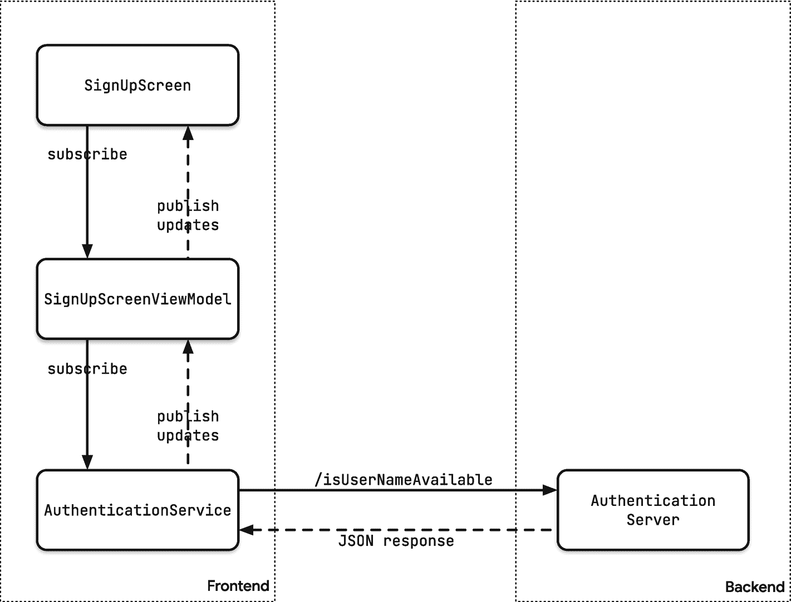
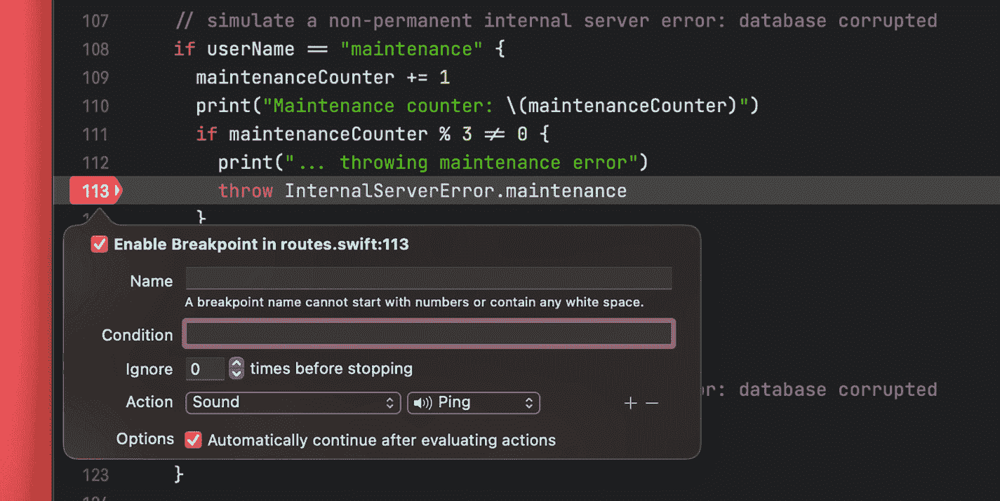

# 10. Combine 中的错误处理

作为开发者，我们往往是一群相当乐观的人。至少从我们编写的代码中能看出这种倾向——我们大多数时候关注的是常规路径（happy path），而在错误处理上花的时间和精力要少得多。

即使在上一章中，我们也一直在忽略错误处理。事实上，我们基本上忽视了它：我们用默认值替换了所有错误，这对于应用的原型开发来说还可以，但对于任何投入生产的应用来说，这可能不是一个可靠的策略。

在本章中，让我们深入探讨一下如何恰当地处理错误！

我们将继续处理前几章开始构建的注册表单。提醒一下，我们使用 Combine 来验证用户的输入，作为验证的一部分，应用还会调用认证服务器上的一个端点来检查用户选择的用户名是否仍然可用。该端点会根据名称是否仍然可用，返回 `true` 或 `false`。此外，如果验证用户名时出现任何问题，服务器将返回相应的 HTTP 状态码和一个错误负载。

## 错误处理策略

在我们深入探讨如何处理错误之前，先来讨论几种错误处理策略，以及它们是否适用于我们的场景。

### 忽略错误

乍一听这似乎是个糟糕的主意，但在特定情况下处理某些类型的错误时，这实际上是一个可行的选择。以下是一些例子：

*   用户的设备*暂时*离线，或者有其他原因导致应用无法连接到服务器。
*   服务器此刻宕机，但*很快*会恢复上线。

在许多情况下，用户可以继续离线工作，一旦设备重新上线，应用就可以与服务器同步。当然，这需要某种支持离线的同步解决方案（如 Cloud Firestore）^( [75]^(#fn75) )。

最佳实践是向用户提供一些反馈，确保他们理解自己的数据尚未同步。许多应用会显示一个图标（例如，带向上箭头的云朵）来表示同步过程仍在进行中，或者显示一个警告标志，提醒用户需要在上线后手动触发同步。

### 重试（带指数退避）

在其他情况下，忽略错误是不可行的。想象一下热门活动的预订系统：服务器可能会被大量的请求压垮。在这种情况下，我们希望确保系统不会因为用户每隔几秒钟就点击“刷新”而崩溃。相反，我们希望分散重试之间的时间间隔。使用指数退避策略符合用户和系统运营者的最佳利益：运营者可以确保他们的服务器不会因为用户不断刷新页面试图通过而承受更多压力，而用户由于应用自动重试，最终应该能够成功预订。

### 显示错误消息

某些错误需要用户采取行动——例如，如果文档保存失败。在这种情况下，显示一个模态对话框来吸引用户的注意力并询问他们如何进行下一步操作是合适的。对于不太严重的问题，显示一个弹出提示（一种短暂出现然后消失的覆盖层）可能就足够了。


### 使用错误视图替换整个界面

在某些情况下，用错误 UI 替换整个 UI 可能是合适的。一个著名的例子是 Chrome——当设备离线时，它会显示 Chrome 小恐龙，让用户知道设备已离线，并通过一款有趣的跳跃奔跑游戏帮助他们度过等待网络恢复的时间。


Chrome 小恐龙游戏的截图。画面中有一只恐龙和路径上的仙人掌，上方有一朵云。右上角的文字显示：H I 00047 00034。

图 10-1

*Chrome 小恐龙游戏*

### 显示内联错误消息

当用户提供的数据无效时，这是一个不错的选择。并非所有输入错误都能通过本地表单验证检测到。例如，一家在线商店可能有一条业务规则，规定价值超过一定金额的货物必须使用特定的运输提供商运送。在客户端应用中实现所有这些业务规则并不总是可行的（可配置的规则引擎可能对此有所帮助），因此我们需要准备好处理这类语义错误。

理想情况下，我们应该在相应的输入字段旁边显示这类错误，以帮助用户提供正确的输入。

## 典型错误条件及处理方法

为了更好地理解如何在实际场景中应用这些方法，让我们为本系列之前创建的注册表单添加一些错误处理。具体来说，我们将处理以下错误条件：

- 设备/网络离线
- 语义验证错误
- 响应解析错误/无效 URL
- 内部服务器错误

> *如果你想跟着操作，可以在本书的 GitHub 仓库*^(⁷⁶)*中找到本章的代码，位于本章对应的文件夹中。* *server* *子文件夹包含一个本地服务器，帮助我们模拟我们将覆盖的所有错误条件。*

### 实现一个可能出错的网络 API

在上一章中，我们实现了一个与认证服务器交互的 `AuthenticationService`。这有助于我们保持一切组织有序且职责分离：

- 视图（`SignUpScreen`）显示状态并接收用户输入。
- 视图模型（`SignUpScreenViewModel`）持有视图显示的状态。反过来，它使用其他 API 来响应用户的操作。在这个特定应用中，视图模型使用 `AuthenticationService` 与认证服务器交互。
- 服务（`AuthenticationService`）与认证服务器交互。其主要职责是将服务器的响应转换为客户端可用的格式。例如，它将 JSON 转换为 Swift 结构体，并且（与本文最相关的是）处理任何网络层错误，并将其转换为客户端能更好处理的 UI 级错误。

下图概述了各个类型如何协同工作。



注册屏幕的流程图，随后通过用户名和 JSON 响应连接视图模型、认证服务和服务器。

图 10-2

*构成注册表单的组件*

如果你查看我们在上一章编写的代码，你会注意到 `checkUserNamerAvailablePublisher` 的错误类型为 `Never`——这意味着它声称永远不会出现错误。

```
func checkUserNameAvailablePublisher(userName: String) -> AnyPublisher { ... }
```

这是一个相当大胆的声明，尤其是考虑到网络错误非常常见！我们之所以能保证这一点，是因为我们将所有错误替换为返回值 `false`：

```
func checkUserNameAvailablePublisher(userName: String)
-> AnyPublisher {
guard let url = URL(string: "http://127.0.0.1:8080/isUserNameAvailable?userName=\(userName)") else {
return Just(false).eraseToAnyPublisher()
}
return URLSession.shared.dataTaskPublisher(for: url)
.map(\.data)
.decode(type: UserNameAvailableMessage.self,
decoder: JSONDecoder())
.map(\.isAvailable)
.replaceError(with: false)
.eraseToAnyPublisher()
}
```

要将这个相当宽松的实现转变为能向调用者返回有意义错误消息的形式，我们首先需要更改发布者的错误类型，并停止通过返回 `false` 来掩盖任何错误：

```
enum APIError: LocalizedError {
/// 无效请求，例如无效的 URL
case invalidRequestError(String)
}
struct AuthenticationService {
func checkUserNameAvailablePublisher(userName: String)
-> AnyPublisher {
guard let url =
URL(string: "http://127.0.0.1:8080/isUserNameAvailable?userName=\(userName)") else {
return Fail(error: APIError.invalidRequestError("URL invalid"))
.eraseToAnyPublisher()
}
return URLSession.shared.dataTaskPublisher(for: url)
.map(\.data)
.decode(type: UserNameAvailableMessage.self,
decoder: JSONDecoder())
.map(\.isAvailable)
//      .replaceError(with: false)
.eraseToAnyPublisher()
}
}
```

我们还引入了一个自定义错误类型 `APIError`。这将使我们能够将 API 内部可能发生的任何错误（无论是网络错误还是数据映射错误）转换为语义丰富的错误，从而在视图模型中更容易处理。


### 调用 API 并处理错误

既然 API 已经有了失败类型，我们也需要更新调用方。一旦发布者发出失败信号，管线的运行就会终止——除非你捕获了该错误。在使用 `flatMap` 时，处理错误的典型做法是将其与 `catch` 操作符结合使用：

```
somePublisher
.flatMap { value in
    callSomePotentiallyFailingPublisher()
        .catch { error in
            return Just(someDefaultValue)
        }
}
.eraseToAnyPublisher()
```

将这一策略应用于我们视图模型中的代码，会得到如下代码：

```
private lazy var isUsernameAvailablePublisher:
    AnyPublisher =
{
    $username
        .debounce(for: 0.8, scheduler: DispatchQueue.main)
        .removeDuplicates()
        .flatMap { username -> AnyPublisher in
            self.authenticationService
                .checkUserNameAvailablePublisher(userName: username)
                .catch { error in // (1)
                    return Just(false) // (2)
                }
                .eraseToAnyPublisher()
        }
        .receive(on: DispatchQueue.main)
        .share()
        .eraseToAnyPublisher()
}()
```

就这样，我们又回到了原点！如果 API 发出失败信号（例如，用户名太短），我们会捕获该错误（1），并将其替换为 `false`（2）——这和我们之前的行为完全一样。只不过，我们写了更多的代码……

这种方法似乎毫无进展，所以让我们退一步，重新审视一下我们对解决方案的需求：

- 我们希望使用管线发出的值来控制提交按钮的状态，并在所选用户名不可用时显示警告消息。
- 如果管线发出失败信号，我们希望禁用提交按钮，并在用户名输入框下方的错误标签中显示错误消息。
- 错误的具体处理方式将取决于失败的类型，我们将在本章后面讨论。

这意味着：
- 我们需要确保既能接收失败信号，也能接收成功信号
- 我们需要确保管线在接收到失败信号时不会终止

为了实现这一切，我们将把 `checkUserNameAvailablePublisher` 的结果映射为 `Result` 类型。`Result` 是一个枚举，可以同时捕获 `success` 和 `failure` 状态。将 `checkUserNameAvailablePublisher` 的结果映射为 `Result`，也意味着管线在发出失败信号时不会再终止。

我们先为 `Result` 类型定义一个类型别名，让生活更轻松一些：

```
typealias Available = Result
```

为了将发布者的结果转换为 `Result` 类型，我们可以使用 John Sundell 在其文章 “The power of extensions in Swift”^((77)) 中实现的以下操作符：

```
extension Publisher {
    func asResult() ->
        AnyPublisher, Never>
    {
        self
            .map(Result.success)
            .catch { error in
                Just(.failure(error))
            }
            .eraseToAnyPublisher()
    }
}
```

这使得我们可以像这样更新视图模型中的 `isUsernameAvailablePublisher`：

```
private lazy var isUsernameAvailablePublisher:
    AnyPublisher =
{
    $username
        .debounce(for: 0.8, scheduler: DispatchQueue.main)
        .removeDuplicates()
        .flatMap { username -> AnyPublisher in
            self.authenticationService
                .checkUserNameAvailablePublisher(userName: username)
                .asResult()
        }
        .receive(on: DispatchQueue.main)
        .share()
        .eraseToAnyPublisher()
}()
```

有了这些基本框架，让我们来看看如何处理我之前概述的不同错误场景。

### 处理设备/网络离线错误

在移动设备上，连接不稳定是很常见的情况：尤其是当你移动时，可能会处于信号差或无信号的区域。

是否应该显示错误消息取决于具体情况：

对于我们的用例，我们可以假设用户至少是间歇性联网的。在用户填写表单时，告诉他们无法连接到服务器可能会相当分散注意力。相反，对于表单验证，我们应该忽略任何连接错误（而是运行我们本地的表单验证逻辑）。

一旦用户输入了所有详细信息并提交表单，如果设备仍然离线，我们应该显示错误消息。

捕获这种类型的错误需要我们在两个不同的地方进行修改。首先，在 `checkUserNameAvailablePublisher` 中，我们使用 `mapError` 来捕获任何上游错误，并将其转换为 `APIError`：

```
enum APIError: LocalizedError {
    /// 无效请求，例如无效的 URL
    case invalidRequestError(String)
    /// 表示传输层错误，
    /// 例如无法连接到服务器
    case transportError(Error)
}

struct AuthenticationService {
    func checkUserNameAvailablePublisher(userName: String)
        -> AnyPublisher
    {
        guard let url = URL(string: "http://127.0.0.1:8080/isUserNameAvailable?userName=\(userName)") else {
            return Fail(error: APIError.invalidRequestError("URL 无效"))
                .eraseToAnyPublisher()
        }
        return URLSession.shared.dataTaskPublisher(for: url)
            .mapError { error -> Error in
                return APIError.transportError(error)
            }
            .map(\.data)
            .decode(type: UserNameAvailableMessage.self,
                    decoder: JSONDecoder())
            .map(\.isAvailable)
            .eraseToAnyPublisher()
    }
}
```

然后，在我们的视图模型中，我们映射结果以检测它是否为 `failure`（1, 2）。如果是，我们提取错误并检查它是否是网络传输错误。如果是这种情况，我们返回一个空字符串（3）来抑制错误消息：

```
class SignUpScreenViewModel: ObservableObject {
    // ...
    init() {
        isUsernameAvailablePublisher
            .map { result in
                switch result {
                case .failure(let error): // (1)
                    if case APIError.transportError(_) = error {
                        return "" // (3)
                    }
                    else {
                        return error.localizedDescription
                    }
                case .success(let isAvailable):
                    return isAvailable ? ""
                        : "此用户名不可用"
                }
            }
            .assign(to: &$usernameMessage) // (4)

        isUsernameAvailablePublisher
            .map { result in
                if case .failure(let error) = result { // (2)
                    if case APIError.transportError(_) = error {
                        return true
                    }
                    return false
                }
                if case .success(let isAvailable) = result {
                    return isAvailable
                }
                return true
            }
            .assign(to: &$isValid) // (5)
    }
}
```

如果 `isUsernameAvailablePublisher` 返回了 `success`，我们提取出表示所需用户名是否可用的 `Bool` 值，并将其映射为适当的消息。

最后，我们将管线的结果分配给 `usernameMessage`（4）和 `isValid`（5）这两个已发布的属性，它们驱动视图上的 UI。

请记住，对于这类 UI，忽略网络错误是一个可行的选择——但对你的用例来说，情况可能完全不同，因此在应用此技术时请自行判断。

到目前为止，我们还没有向用户暴露任何错误，所以让我们继续讨论一类我们实际希望让用户知道的错误。


### 处理验证错误

大多数验证错误应在客户端本地处理，但有时我们无法避免在服务器上运行一些额外的验证步骤。理想情况下，服务器应返回`4xx`范围内的 HTTP 状态码，并可选择提供包含更多详细信息的有效负载。

在我们的示例应用中，服务器要求用户名至少为四个字符，并且我们有一个禁止使用的用户名列表（例如"admin"或"superuser"）。针对这些情况，我们希望显示警告消息并禁用提交按钮。

我们的后端实现基于 Vapor，对于任何验证错误，它都会返回 HTTP 状态码`400`和一个错误有效负载。如果你对实现细节感兴趣，可以查看服务器实现中的`routes.swift`代码。

处理这种错误场景需要在两个地方进行修改：服务实现和视图模型。我们先来看服务实现。

由于我们应在尝试从响应中提取有效负载之前处理任何错误，因此处理服务器错误的代码需要在检查`URLErrors`之后、映射数据之前运行：

```
struct APIErrorMessage: Decodable {
var error: Bool
var reason: String
}
// ...
struct AuthenticationService {
func checkUserNameAvailablePublisher(userName: String) -> AnyPublisher {
guard let url = URL(string: "http://127.0.0.1:8080/isUserNameAvailable?userName=\(userName)") else {
return Fail(error: APIError.invalidRequestError("URL invalid"))
.eraseToAnyPublisher()
}
return URLSession.shared.dataTaskPublisher(for: url)
// 处理 URL 错误（很可能无法连接到服务器）
.mapError { error -> Error in
return APIError.transportError(error)
}
// 处理所有其他错误
.tryMap { (data, response) -> (data: Data, response: URLResponse) in
print("已收到服务器响应，正在检查状态码")
guard let urlResponse = response as? HTTPURLResponse else {
throw APIError.invalidResponse // (1)
}
if (200..<300) ~= urlResponse.statusCode { // (2)
}
else {
let decoder = JSONDecoder()
let apiError = try decoder.decode(APIErrorMessage.self,
from: data) // (3)
if urlResponse.statusCode == 400 { // (4)
throw APIError.validationError(apiError.reason)
}
}
return (data, response)
}
.map(\.data)
.decode(type: UserNameAvailableMessage.self,
decoder: JSONDecoder())
.map(\.isAvailable)
//      .replaceError(with: false)
.eraseToAnyPublisher()
}
}
```

我们来仔细分析这段代码的作用：

1. 如果响应不是`HTTPURLResonse`，我们返回`APIError.invalidResponse`。
2. 我们使用 Swift 的模式匹配来检测请求是否成功执行，即 HTTP 状态码在`200`到`299`范围内。
3. 否则，服务器上发生了某些错误。由于我们使用 Vapor，服务器会以 JSON 有效负载形式返回错误详情（`https://docs.vapor.codes/4.0/errors/`），因此我们现在可以将此信息映射到`APIErrorMessage`结构体，并在后续代码中用它来创建更有意义的错误消息。
4. 如果服务器返回 HTTP 状态码`400`，我们知道这是一个验证错误（详情参见服务器实现），并返回一个`APIError.validationError`，其中包含从服务器收到的详细错误消息。

在视图模型中，我们现在可以利用这些信息告诉用户所选用户名不符合要求：

```
init() {
isUsernameAvailablePublisher
.map { result in
switch result {
case .failure(let error):
if case APIError.transportError(_) = error {
return ""
}
else if case APIError.validationError(let reason) = error {
return reason
}
else {
return error.localizedDescription
}
case .success(let isAvailable):
return isAvailable ? "" : "此用户名不可用"
}
}
.assign(to: &$usernameMessage)
```

没错——只需三行代码。我们已经完成了所有繁重的工作，现在是时候享受成果了。 一个黑白像素艺术图案，呈现倒锥形，带有 3 个类似细丝的粗延伸物，周围散布着点状图案。

### 处理响应解析错误

在许多情况下，服务器发送的数据与客户端预期的数据不匹配：

* 响应中包含额外数据，或者某些字段被重命名。
* 客户端通过强制门户（例如在酒店中）进行连接。

在这些情况下，客户端接收到了数据，但格式不正确。为了帮助用户解决问题，我们需要分析响应并提供适当的指导，例如：

* 下载最新版本的应用。
* 通过系统浏览器登录强制门户。

当前实现使用`decode`运算符来解码响应有效负载，并在无法映射有效负载时抛出错误。这种方法效果很好，任何解码错误都会被捕获并显示在用户界面上。然而，像"无法读取数据，因为数据缺失"这样的错误消息对用户并不友好。相反，我们尝试显示一个对用户更有意义的消息，并建议用户升级到最新版本的应用（假设服务器返回了额外数据，新版应用可以利用这些数据）。

为了能够提供关于解码错误的更精细信息，我们需要放弃`decode`运算符，回退到手动映射数据（别担心，借助`JSONDecoder`和 Swift 的`Codable`协议，这相当简单）：

```
// ...
.map(\.data)
// .decode(type: UserNameAvailableMessage.self,
//         decoder: JSONDecoder())
.tryMap { data -> UserNameAvailableMessage in
let decoder = JSONDecoder()
do {
return try decoder.decode(UserNameAvailableMessage.self,
from: data)
}
catch {
throw APIError.decodingError(error)
}
}
.map(\.isAvailable)
// ...
```

通过让`APIError`遵循`LocalizedError`协议并实现`errorDescription`属性，我们可以提供更用户友好的错误消息（我也为其他错误情况添加了自定义消息）：

```
enum APIError: LocalizedError {
/// 无效请求，例如无效 URL
case invalidRequestError(String)
/// 传输层错误，例如无法连接到服务器
case transportError(Error)
/// 收到无效响应，例如非 HTTP 结果
case invalidResponse
/// 服务器端验证错误
case validationError(String)
/// 服务器发送了意外格式的数据
case decodingError(Error)
var errorDescription: String? {
switch self {
case .invalidRequestError(let message):
return "无效请求：\(message)"
case .transportError(let error):
return "传输错误：\(error)"
case .invalidResponse:
return "无效响应"
case .validationError(let reason):
return "验证错误：\(reason)"
case .decodingError:
return "服务器返回了意外格式的数据。请尝试更新应用。"
}
}
}
```

现在，为了向用户清楚表明他们应该更新应用，我们还将显示一个弹窗。以下是弹窗的代码：

```
struct SignUpScreen: View {
@StateObject private var viewModel = SignUpScreenViewModel()
var body: some View {
Form {
// ...
}
// 显示更新对话框
.alert("请更新", isPresented: $viewModel.showUpdateDialog, actions: {
Button("升级") {
// 打开应用在 App Store 的详情页面
}
Button("稍后再说", role: .cancel) { }
}, message: {
Text("您似乎正在使用此应用的旧版本。请更新您的应用。")
})
}
}
```

你会注意到，这个弹窗的呈现状态由视图模型上的一个已发布属性`showUpdateDialog`驱动。让我们相应地更新视图模型 (1)，并添加将`isUsernameAvailablePublisher`的结果映射到此新属性的 Combine 管道。


```swift
class SignUpScreenViewModel: ObservableObject {
    // ...
    @Published var showUpdateDialog: Bool = false // (1)
    // ...
    private lazy var isUsernameAvailablePublisher:
        AnyPublisher =
        $username
            .debounce(for: 0.8, scheduler: DispatchQueue.main)
            .removeDuplicates()
            .flatMap { username -> AnyPublisher in
                self.authenticationService
                    .checkUserNameAvailablePublisher(userName: username)
                    .asResult()
            }
            .receive(on: DispatchQueue.main)
            .share() // (3)
            .eraseToAnyPublisher()
    }()
    init() {
        // ...
        // 解码错误：显示错误信息
        // 建议下载新版本
        isUsernameAvailablePublisher
            .map { result in
                if case .failure(let error) = result {
                    if case APIError.decodingError = error // (2) {
                        return true
                    }
                }
                return false
            }
            .assign(to: &$showUpdateDialog)
    }
}
```

可以看到，这并不复杂——我们本质上是获取来自 `isUsernameAvailablePublisher` 的所有事件，并将它们转换为 `Bool` 值，只有收到 `.decodingError` (2) 时该值才变为 `true`。

现在我们使用 `isUsernameAvailablePublisher` 来驱动三个不同的 Combine 管道，我想特别指出——由于 `isUsernameAvailablePublisher` 最终会触发网络请求——确保我们每次按键最多只发送*一个*网络请求非常重要。前一章详细解释了如何使用 `share()` 运算符 (3) 来实现这一点。

## 处理内部服务器错误

在极少数情况下，我们应用的后端可能会出现问题——可能是部分系统因维护而离线、某个进程崩溃，或者服务器过载。通常，服务器会返回 `5xx` 范围内的 HTTP 状态码来指示这种情况。

模拟错误条件

> *示例服务器包含模拟本文讨论的部分错误条件的代码。您可以通过发送特定的* `username` *值来触发这些错误条件：*
>
> *   任何少于四个字符的用户名都将导致 `tooshort` 验证错误，通过 `HTTP 400` 状态码和一个包含详细错误信息的 JSON 负载来指示。
> *   空的用户名将导致 `emptyName` 错误信息，指示用户名不能为空。
> *   某些用户名被禁止：“admin”或“superuser”将导致 `illegalName` 验证错误。
> *   其他用户名如“peterfriese”、“johnnyappleseed”、“page”和“johndoe”已被占用，因此服务器会告知客户端这些用户名不再可用。
> *   发送“illegalresponse”作为用户名将返回一个字段过少的 JSON 响应，导致客户端出现解码错误。
> *   发送“servererror”将模拟一个数据库问题（`databaseCorrupted`），并以 `HTTP 500` 状态码指示，不带重试提示（因为我们假设这不是临时情况，重试将是徒劳的）。
> *   发送“maintenance”作为用户名将返回一个 `maintenance` 错误，同时带有一个 `retry-after` 头部，指示客户端可以在一段时间后重试此调用（这里的想法是服务器正在进行计划内维护，重启后会恢复运行）。

让我们添加处理服务器端错误所需的代码。与我们之前处理错误场景的方式类似，我们需要添加一些代码来将 HTTP 状态码映射到我们的 `APIError` 枚举：

```swift
if (200..<300) ~= urlResponse.statusCode {
}
else {
    let decoder = JSONDecoder()
    let apiError = try decoder.decode(APIErrorMessage.self,
                                      from: data)
    if urlResponse.statusCode == 400 {
        throw APIError.validationError(apiError.reason)
    }
    if (500..<600) ~= urlResponse.statusCode {
        let retryAfter = urlResponse.value(
            forHTTPHeaderField: "Retry-After")
        throw APIError.serverError(
            statusCode: urlResponse.statusCode,
            reason: apiError.reason,
            retryAfter: retryAfter)
    }
}
```

为了在我们的 UI 中显示用户友好的错误信息，我们只需要在视图模型中添加几行代码：

```swift
isUsernameAvailablePublisher
    .map { result in
        switch result {
        case .failure(let error):
            if case APIError.transportError(_) = error {
                return ""
            }
            else if case APIError.validationError(let reason) = error {
                return reason
            }
            else if case APIError.serverError(statusCode: _, reason: let reason, retryAfter: _) = error {
                return reason ?? "服务器错误"
            }
            else {
                return error.localizedDescription
            }
        case .success(let isAvailable):
            return isAvailable ? "" : "此用户名不可用"
        }
    }
    .assign(to: &$usernameMessage)
```

到目前为止，一切顺利。

对于某些服务器端错误场景，稍等片刻后重试请求可能是值得的。例如，如果服务器正在进行维护，它可能在几秒钟后重新上线。

Combine 包含一个 `retry` 运算符，我们可以用它来自动重试任何失败的操作。将其添加到我们的代码中只需一行：

```swift
return URLSession.shared.dataTaskPublisher(for: url)
    .mapError { ... }
    .tryMap { ... }
    .retry(3)
    .map(\.data)
    .tryMap { ... }
    .map(\.isAvailable)
    .eraseToAnyPublisher()
```

但是，当您运行应用时，您会发现这将导致*任何*失败的请求都被重试三次。这不是我们想要的——例如，我们希望任何验证错误都能向上传递到视图模型。而实际上，它们也会被 `retry` 运算符捕获。


## 改进错误处理与实现自定义 Combine 运算符

### 重试策略中的暂停问题

更重要的是，重试之间没有暂停。如果我们的目标是减轻已经不堪重负的服务器的压力，那么发送四个请求（原始请求加上三次重试）反而会使情况变得更糟。

那么，我们如何确保：

1. 只重试特定类型的失败？
2. 在重试失败请求之前有一个暂停？

我们的实现需要能够捕获任何上游错误，并将它们沿管道传播到下一个运算符。然而，当捕获到`serverError`时，我们希望暂停片刻，然后重新启动整个管道，以便重试 URL 请求。

首先，确保我们能够：(1) 捕获所有错误，(2) 过滤出`serverError`，(3) 沿管道传播所有其他错误。`tryCatch`运算符“通过用另一个发布者替换上游发布者或抛出新错误来处理来自上游发布者的错误”。这正是我们需要的：

```swift
return URLSession.shared.dataTaskPublisher(for: url)
    .mapError { ... }
    .tryMap { ... }
    .tryCatch { error -> AnyPublisher in // (1)
        if case APIError.serverError(_, _, let retryAfter) = error { // (2)
            // ...
        }
        throw error // (3)
    }
    .map(\.data)
    .tryMap { ... }
    .map(\.isAvailable)
    .eraseToAnyPublisher()
```

当捕获到`serverError`时，我们希望等待一小段时间，然后重新启动管道。

我们可以通过触发一个新事件（使用`Just`发布者），用`delay`延迟几秒钟，然后使用`flatMap`启动一个新的`dataTaskPublisher`来实现这一点。我们不在`if`语句中粘贴管道的完整代码，而是将`dataTaskPublisher`赋值给一个局部变量：

```swift
let dataTaskPublisher = URLSession.shared.dataTaskPublisher(for: url)
    .mapError { ... }
    .tryMap { ... }

return dataTaskPublisher
    .tryCatch { error -> AnyPublisher in
        if case APIError.serverError = error {
            return Just(()) // (1)
                .delay(for: 3, scheduler: DispatchQueue.global())
                .flatMap { _ in
                    return dataTaskPublisher
                }
                .retry(10) // (2)
                .eraseToAnyPublisher()
        }
        throw error
    }
    .map(\.data)
    .tryMap { ... }
    .map(\.isAvailable)
    .eraseToAnyPublisher()
```

关于这段代码的几点说明：

1. `Just`发布者期望*某个*它可以发布的值。由于我们使用哪个值并不重要，我们可以发送任何想要的内容。我决定发送一个空元组，这通常用于表示“无意义”的情况。
2. 我们重试发送请求 10 次，这意味着总共最多发送 11 次（原始调用加上 10 次重试）。

这个数字如此高的唯一原因是，当服务器返回成功结果时，更容易观察到管道的结束。当您发送`maintenance`作为用户名时，演示服务器可以模拟从计划维护中恢复：对于每一次和第二次请求，它会抛出`InternalServerError.maintenance`（映射为 HTTP `500`）。每次第三次请求，它会返回`success`（即 HTTP `200`）。查看这一效果的最佳方法是从 Xcode 内部运行服务器（打开`server`项目并按下*运行*按钮）。然后，为包含`throw InternalServerError.maintenance`的行创建一个*声音*断点。



一段程序代码中，第 113 行被选中，下方有一个弹出对话框。该框已勾选启用断点复选框，并包含名称、条件、忽略、操作和选项的输入框和复选框。

图 10-3

*设置声音断点*

每次服务器收到`username=maintenance`的请求时，您都会听到声音。现在，运行示例应用程序并输入`maintenance`作为用户名。您会听到服务器响应错误两次，然后返回成功。

## 总结

在上一章中使用相当宽松的方法处理错误之后，这一次我们更加认真地对待了错误处理。

在本章中，我们使用了几种策略来处理错误并将其暴露给 UI。错误处理是开发高质量软件的重要方面，而且有很多相关资料。然而，如何将错误暴露给用户这一方面并不常被讨论，希望本文能让您更好地理解如何实现这一点。

与原始代码相比，代码变得稍微复杂了一些，这是我们将在下一章中解决的问题，届时我们将研究如何实现自己的 Combine 运算符。为了演示其工作原理，我们将实现一个运算符，使处理增量退避就像在 Combine 管道中添加一行代码一样简单！

脚注 1 2 3

