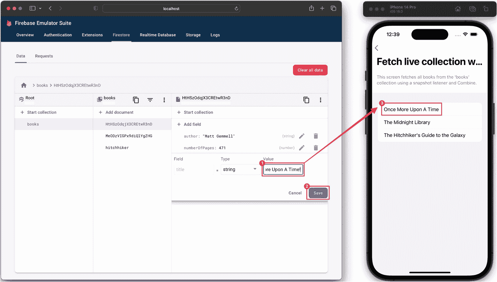
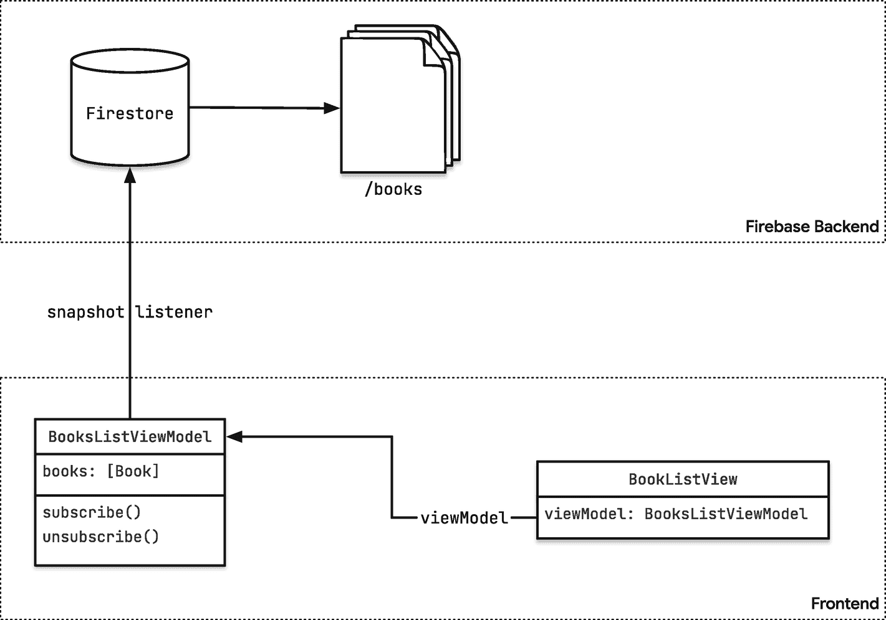

# 12. 在 Combine 中封装现有 API

Apple 为许多 API 提供了 Combine 发布者，这让我们可以轻松地将这些 API 集成到我们的 Combine 管道中。然而，还有许多 API 即使随时间产生事件，也并不支持 Combine。幸运的是，Apple 为我们提供了所需的工具，可以将 API 封装到 Combine 发布者中，使其能够被 Combine 管道访问。

在本章中，我将引导你完成使用 Combine 封装现有 API 的整个过程。

## 案例研究

我们将以 Firebase API 作为案例研究。Firebase 是一种后端即服务（BaaS），它提供了一系列服务，使开发应用变得更加容易。例如，它提供了身份验证服务（Firebase Authentication）、基于文档的 NoSQL 数据库（Cloud Firestore）、云端大文件存储服务（Cloud Storage）、崩溃报告服务（Crashlytics）等等。^(⁸²)

Firebase 的大部分 API 都是异步的，这意味着每当你发起调用时，它会被发送到某个 Firebase 后端服务进行处理。一旦结果准备好，它会被返回到客户端 SDK，你的代码将收到回调。调用 Firebase 服务有多种异步方式：完成处理器（completion handlers）、Combine 以及 async/await。我之前在 *从 Swift 调用异步 Firebase API - Callbacks, Combine, and async/await*^(⁸³) 中提到过这一点——并且还发布了关于此主题的视频^(⁸⁴)。

在本章中，我们将从 Cloud Firestore 中选取两个方法，并将它们转换为 Combine 发布者。Cloud Firestore 是云端的一种水平扩展的基于文档的 NoSQL 数据库。类似于 CloudKit，^(⁸⁵) 但它是一个真正的跨平台解决方案：你可以从 iOS、Android、Web 以及通过 REST API 访问 Cloud Firestore。^(⁸⁶) 存储在 Firestore 中的数据被组织成文档——文档类似于 Swift 结构体：它可以具有任意数量的不同类型字段。文档被组织成集合，而文档可以包含子集合，这使你能够构建嵌套的数据结构。

Firestore SDK 提供了访问单个文档和集合中数据的方法。例如，以下代码片段展示了如何从 Firestore 文档集合中获取数据，并使用 Swift 的 `Codable` API 将其映射到 Swift 结构体数组：

```
db.collection("books").getDocuments { querySnapshot, error in
    guard let documents = querySnapshot?.documents else {
        return
    }
    let books = documents.compactMap { [weak self] queryDocumentSnapshot in
        let result = Result {
            try queryDocumentSnapshot.data(as: Book.self)
        }
        switch result {
        case .success(let book):
            return book
        case .failure(let error):
            return nil
        }
    }
    print(books.count)
}
```

除了能够按需获取数据之外，Firestore 还支持实时同步。这意味着你的应用会实时接收它所订阅的任何文档或文档集合的更新。对于任何允许用户与其他用户共享数据（例如聊天应用），或与用户的其他设备共享数据（例如可在 iPhone、iPad、Mac 和 Web 应用上使用的待办事项列表应用）的应用来说，这都是一项很棒的功能。

要接收更新，你需要为特定的文档或文档集合注册一个快照监听器。每当该文档或集合中的某个文档被更新或删除，或者有新文档被插入集合时，Firestore 将触发快照监听器，你将在监听器的闭包中收到更新。以下代码片段展示了如何接收书籍集合的任何更改的更新：

```
db.collection("books")
    .addSnapshotListener { [weak self] (querySnapshot, error) in
        guard let documents = querySnapshot?.documents else {
            return
        }
        self?.books = documents.compactMap { queryDocumentSnapshot in
            let result = Result {
                try queryDocumentSnapshot.data(as: Book.self)
            }
            switch result {
            case .success(let book):
                return book
            case .failure(let error):
                return nil
            }
        }
    }
```

本章的示例代码是一个演示应用程序，展示了如何使用基于闭包的 API 以及我们在本章中构建的基于 Combine 的版本。请注意，适用于 Apple 平台的 Firebase SDK 包含对 Combine 的实验性支持——你可以通过导入相应模块在你的应用中使用它。本章旨在解释 Firebase 团队是如何实现这种 Combine 支持的。

要运行示例应用程序，请遵循以下步骤：

1.  通过 Firebase 控制台创建一个新的 Firebase 项目。^(⁸⁷)
2.  将你的 Xcode 项目添加到 Firebase 项目。
3.  下载 `GoogleService-Info.plist` 文件并将其添加到你的项目中。
4.  安装本地 Firebase 模拟器套件。^(⁸⁸)
5.  通过在示例项目的根目录中执行 `start.sh` 来运行 Firebase 模拟器套件。
6.  在模拟器上启动 iOS 应用（这样它才能连接到模拟器）。

`start.sh` 脚本将确保向 Firebase 模拟器中填充一些种子数据，以便你可以从 Firestore 获取数据。

应用程序启动后，进入使用快照监听器进行实时同步的菜单项之一。然后，在浏览器中打开模拟器控制台 `http://localhost:4000/firestore`，并对 Firestore 文档进行更改。一旦你在模拟器 UI 中提交更改，观察数据如何立即在应用的 UI 中更新。



一张 Firebase 模拟器套件的截图，底部的任务栏选中了 firestore。在 data 标签页下，有 root、books 和文件名的面板，以及 start collection 和 add field 选项。add field 选项的值为 once upon a time，并且 save 选项被高亮显示，指向右侧的 iPhone 14 Pro 手机屏幕，屏幕上显示标题“fetch live collection”和该值。

图 12-1

在 Firebase 模拟器 UI 中进行的更改，只要你点击 Save，就会立即反映在应用 UI 中

## 使用 Combine 访问 Firestore

现在让我们看看如何使我们从 Firestore 接收的数据能够被 Combine 访问。这样做的一个常见原因是转换数据，并将其与我们从其他 Combine 发布者接收的事件（例如，搜索/筛选对话框中的过滤条件）结合起来。


### 使用视图模型与已发布属性

将数据输入 Combine 管道的一种简单且相当常见的方式是在视图模型中创建一个已发布属性。你可能在我的博客中的许多代码示例^(⁸⁹)或 Firebase 快速入门^(⁹⁰)中看到过这种方式。



一个框图包含两个层级，分别标题为 firebase 后端和前端。前端包含图书列表视图和图书列表视图模型块，并通过视图模型连接了订阅与取消订阅选项。它通过快照监听器连接到 firebase 后端。firebase 后端包含 firestore，firestore 连接到多个斜杠图书。

图 12-2：应用程序架构的概念概览

在代码中，这看起来如下所示：

```
private class BookListViewModel: ObservableObject {
    @Published var books = [Book]()
    @Published var errorMessage: String?
    private var db = Firestore.firestore()
    private var listenerRegistration: ListenerRegistration?
    
    public func unsubscribe() {
        if listenerRegistration != nil {
            listenerRegistration?.remove()
            listenerRegistration = nil
        }
    }
    
    func subscribe() {
        if listenerRegistration == nil {
            listenerRegistration = db.collection("books")
                .addSnapshotListener { [weak self] (querySnapshot, error) in
                    guard let documents = querySnapshot?.documents else {
                        self?.errorMessage = "No documents in 'books' collection"
                        return
                    }
                    self?.books = documents.compactMap { queryDocumentSnapshot in
                        let result = Result {
                            try queryDocumentSnapshot.data(as: Book.self)
                        }
                        switch result {
                        case .success(let book):
                            self?.errorMessage = nil
                            return book
                        case .failure(let error):
                            self?.errorMessage = "\(error.localizedDescription)"
                            return nil
                        }
                    }
                }
        }
    }
}
```

通过让 `BookListViewModel` 遵循 `ObservableObject` 协议，并使用 `@Published` 属性包装器标记 `books` 属性，我们可以将 SwiftUI 的 `List` 视图连接到该属性，并确保每当收到更新时 UI 都会刷新。

```
struct LiveBooksListViewWithClosures: View {
    @StateObject private var viewModel = BookListViewModel()
    
    var body: some View {
        List(viewModel.books) { book in
            Text(book.title)
        }
        .onAppear {
            viewModel.subscribe()
        }
        .onDisappear {
            viewModel.unsubscribe()
        }
    }
}
```

仅用几行代码，我们就构建了一个 UI，当有人对数据进行更改时，它会自动刷新——无论这个更改发生在前端还是后端。

但我们还能做更多！例如，假设我们想要显示图书数量，并确保当有人在 Cloud Firestore 中向 `books` 集合添加新书时，UI 上的这个数字能够更新。

请记住，已发布属性会暴露一个 Combine 发布者。我们可以通过该属性的*投影值*（此处为 `$books`）访问这个发布者。这允许我们创建一个 Combine 管道来确定图书数量。使用 `assign(to:)` 订阅者，我们可以将结果分配给另一个发布者，然后将其连接到 UI 以显示一个始终最新的数字。设置此类 Combine 管道的合适位置是在视图模型的初始化器中。

```
private class BookListViewModel: ObservableObject {
    @Published var books = [Book]()
    @Published var numberOfBooks = 0
    ...
    init() {
        $books.map { books in
            books.count
        }
        .assign(to: &$numberOfBooks)
    }
    ...
}
```

### 使用 Combine 封装 API

这是在结合使用 Combine 的 SwiftUI 应用中集成数据源最常用的方法，并且效果非常好。然而，它相当冗长，需要大量样板代码。

与其显式设置快照监听器，不如看看我们是否可以将代码封装到 Combine 发布者中，以便用更具声明性的方式调用它。

回顾我们迄今讨论过的代码，可以看到我们有两种不同类型的调用：

-   获取单个文档、集合中的所有文档或查询结果属于所谓的单次调用：我们发起调用来获取一个文档（或集合/查询中的所有文档），然后使用回调处理程序接收调用的结果。

-   监听单个文档、集合或查询的更新则不同：我们不会只收到一次调用的结果，而是每次有更新时都会收到一个新的快照。我们接收到的是一个更新流。这听起来与 Combine 的定义非常相似：

> *Combine 框架提供了一个声明式 Swift API，用于处理随时间变化的值。*^(⁹¹)

让我们看看能否实现我们自己的发布者来处理这些事件流！

然而，Apple 积极劝阻开发者不要使用 Combine 的低层级原语（例如 `Publisher`、`Subscription` 和 `Subscriber`）来实现自己的发布者。

## 创建你自己的发布者

与其自己实现 `Publisher`^(⁹²) 协议，不如通过使用 Combine 框架提供的几种类型之一来创建你自己的发布者：

-   使用 `Subject`^(⁹³) 的具体子类，例如 `PassthroughSubject`^(⁹⁴)，通过调用其 `send(_:)`^(⁹⁵) 方法按需发布值。

-   使用 `CurrentValueSubject`^(⁹⁶)，在更新主体的底层值时进行发布。

-   将 `@Published` 注解添加到你自己的某个类型的属性上。这样做之后，该属性会获得一个发布者，每当属性值发生变化时，该发布者就会发出事件。参见 `Published`^(⁹⁷) 类型以了解此方法的示例。

因此，与其从头构建发布者，不如遵循 Apple 的建议，使用 Combine 更高级别的构建块（如 `PassthroughSubject` 和 `Future`）来创建我们的自定义发布者。


### 使用 `PassthroughSubject` 封装快照监听器

为了使与现有代码的集成更简单，Combine 包含了 `Subject` 协议。`Subject` 是一种特殊类型的发布者，允许外部调用方向 Combine 管道中注入事件。`Subject` 协议定义了一个 `send(_:)` 方法，可用于向管道发送特定值。

Combine 中有两种内置的 `Subject` 类型：`CurrentValueSubject` 和 `PassthroughSubject`。它们之间的主要区别在于，`CurrentValueSubject` 会记住最近发布的元素，而 `PassthroughSubject` 则不会追踪它传递的值。

`Subject` 对于将现有的命令式代码适配到 Combine 特别有用。在我们的案例中，我们不需要追踪最近发送的事件，因此可以使用 `PassthroughSubject` 为 Firebase API 创建自定义的发布者，这些 API 会发送连续的事件流，例如 Firestore 快照监听器。

让我们来看看为 Firestore 集合或 Firestore 查询上的快照监听器实现自定义 Combine 发布者所需的步骤。

我们将把这个功能作为 `Query` 的一个扩展来实现。由于 `CollectionReference` 扩展了 `Query` 接口，该发布者将同样适用于 Firestore 集合和查询：

```
public extension Query {
func snapshotPublisher(includeMetadataChanges: Bool = false)
-> AnyPublisher
{
...
addSnapshotListener(includeMetadataChanges: includeMetadataChanges) { snapshot, error in
...
}
...
}
}
```

这段代码片段向 `Query` 接口添加了一个方法，该方法返回一个泛型为 `QuerySnapshot` 和 `Error` 类型的 `AnyPublisher`。在该方法内部，我们调用了原始的 `addSnapshotListener` 方法，该方法接受一个闭包，我们需要实现这个闭包来处理调用的结果。如前所述，当被观察的集合或查询发生更改（例如，通过添加、更改或删除文档）时，这个闭包就会被调用。闭包的 `snapshot` 参数将包含该集合或查询中所有文档的快照。如果发生错误，会通过 `error` 参数来传递。

为了将闭包的结果注入 Combine 管道，我们需要设置一个 `PassthroughSubject` 并将其返回给 `snapshotPublisher` 的调用者：

```
public extension Query {
func snapshotPublisher(includeMetadataChanges: Bool = false)
-> AnyPublisher
{
let subject = PassthroughSubject()
addSnapshotListener(includeMetadataChanges: includeMetadataChanges) { snapshot, error in
...
}
return subject.eraseToAnyPublisher()
}
}
```

通过擦除主题的具体类型，我们确保了 `snapshotPublisher` 方法的返回类型保持简洁。

最后，在闭包内部，我们可以使用 `PassthroughSubject` 向我们的订阅者发送事件。我们需要处理两种情况：当收到快照时，我们可以将其 `send` 给 `subject`。如果出现 `error`，我们必须向 subject 发送一个 `failure`，以向 Combine 发出信号，表明管道应该被取消。

```
public extension Query {
func snapshotPublisher(includeMetadataChanges: Bool = false)
-> AnyPublisher
{
let subject = PassthroughSubject()
addSnapshotListener(includeMetadataChanges: includeMetadataChanges) { snapshot, error in
if let error = error {
subject.send(completion: .failure(error))
} else if let snapshot = snapshot {
subject.send(snapshot)
}
}
return subject.eraseToAnyPublisher()
}
}
```

到目前为止看起来不错，但还有一个细节我们需要处理。当调用 `addSnapshotListener` 时，我们会收到一个句柄，之后可以使用它来移除快照监听器。当你不再关心某个查询或集合的监听时，应该移除所有 Firestore 快照监听器。

但是，我们如何在 `snapshotPublisher` 方法内部存储和管理这个快照监听器句柄呢？事实证明，我们可以利用 Combine 的 `handleEvents` 操作符。这个操作符允许我们监听 Combine 管道的生命周期事件，例如，当管道被取消时。因此，我们可以将快照监听器句柄存储在一个局部变量中，随后在管道被取消时用它来移除快照监听器。

```
public extension Query {
func snapshotPublisher(includeMetadataChanges: Bool = false)
-> AnyPublisher
{
let subject = PassthroughSubject()
let listenerHandle =
addSnapshotListener(includeMetadataChanges: includeMetadataChanges) { snapshot, error in
if let error = error {
subject.send(completion: .failure(error))
} else if let snapshot = snapshot {
subject.send(snapshot)
}
}
return
subject
.handleEvents(receiveCancel: listenerHandle.remove)
.eraseToAnyPublisher()
}
}
```

以上就是将现有 API 适配到 Combine 的方法！

让我们更新之前的代码示例，以使用这个新的发布者：

```
private class BookListViewModel: ObservableObject {
@Published var books = [Book]()
@Published var errorMessage: String?
private var db = Firestore.firestore()
private var cancellable: AnyCancellable?
func subscribe() {
cancellable = db.collection("books").snapshotPublisher()
.tryMap { querySnapshot in
try querySnapshot.documents.compactMap { documentSnapshot in
try documentSnapshot.data(as: Book.self)
}
}
.replaceError(with: [Book]())
.handleEvents(receiveCancel: {
print("Cancelled")
})
.assign(to: \.books, on: self)
}
func unsubscribe() {
cancellable?.cancel()
}
}
```


### 使用 `Future` 从 Firestore 实现一次性数据读取

实时同步是 Firestore 的关键特性之一，但并非所有场景都需要或不适合采用实时更新。通常，按需获取数据就足够了。Firestore 支持一次性读取数据（无论是单个文档、集合还是查询结果），本章开头部分已经展示了相关示例。

如何在 Combine 中实现这一功能？本质上，我们需要发起一次请求，等待其完成，然后将结果发送到 Combine 管线中。

这正是 `Future` 的用途。`Future` 是一种 `Publisher`，它能“最终生成单个值，然后正常结束或失败”。

让我们用 `Future` 创建一个一次性 Publisher 来从 Firestore 获取单个文档。这次，我们将为 `DocumentReference` 创建一个扩展：

```
extension DocumentReference {
func getDocument(source: FirestoreSource = .default)
-> Future<DocumentSnapshot, Error>
{
...
self.getDocument(source: source) { snapshot, error in
...
}
...
}
}
```

与其他 Publisher 一样，`Future` 也是泛型类型，包含值类型和错误类型。在我们的例子中，值类型是 `DocumentSnapshot`。你可能会疑惑为什么返回 `Future` 而不是 `AnyPublisher`。`Future` 具有一些特殊属性，使其与其他 Publisher 不同。例如，`Future` 会立即触发执行。普通的 Publisher 只有在有订阅者时才会触发。为了对调用方透明，我们显式返回 `Future`，而不使用类型擦除将其转为 `AnyPublisher`。

现在，我们将基于闭包的 `getDocument` 方法调用封装在 `Future` 中：

```
extension DocumentReference {
func getDocument(source: FirestoreSource = .default)
-> Future<DocumentSnapshot, Error>
{
Future { promise in
self.getDocument(source: source) { snapshot, error in
...
}
}
}
}
```

当 Firestore 返回错误或文档快照时，闭包内的代码将被调用。`Future` 闭包的 `promise` 参数可用于与调用方通信：

```
extension DocumentReference {
func getDocument(source: FirestoreSource = .default)
-> Future<DocumentSnapshot, Error>
{
Future { promise in
self.getDocument(source: source) { snapshot, error in
if let error = error {
promise(.failure(error))
} else if let snapshot = snapshot {
promise(.success(snapshot))
}
}
}
}
}
```

我们检查是否收到了快照或错误，并据此调用 promise。这段代码看起来很熟悉，因为它类似于我们之前为 `snapshotPublisher` 编写的代码，但我需要指出的是，promise 期望接收一个 `Result` 类型，因此 `.failure` 和 `.success` 是 `Result` 类型中的枚举值。

至此，我们通过将基于闭包的 Firestore 单个文档获取 API 封装在 `Future` 中，成功将其适配到 Combine 框架。

以下是调用该新的一次性 Combine Publisher 来获取文档并将其映射到自定义 Swift 结构体的方式：

```
private class BookListViewModel: ObservableObject {
@Published var book = Book.empty
private var db = Firestore.firestore()
func fetchBook() {
db.collection("books").document("hitchhiker").getDocument()
.tryMap { documentSnapshot in
try documentSnapshot.data(as: Book.self)
}
.replaceError(with: Book.empty)
.assign(to: &$book)
}
}
```

## 总结

苹果为自家许多 API 提供了优秀的 Combine Publisher，但对于第三方 API，我们可能需要自行完成这项工作。

在本章中，我们讨论了几种将现有命令式代码适配到 Combine 的方法：

-   你了解了如何实现一个带有 `@Published` 属性的 `ObservableObject`，从而通过 Publisher 暴露数据。这不仅允许我们将 SwiftUI 视图连接到发布的属性，还使我们能够将 Combine 管线连接到该属性。
-   也可以使用 Combine 的低级原语（如 `Publisher`、`Subscription` 和 `Subscriber`）创建自定义 Publisher。然而，苹果明确不鼓励开发者这样做，因为这种方法需要我们自行管理背压。
-   相反，苹果推荐使用 `PassthroughSubject` 和 `Future` 这样的便捷 Publisher 来实现自定义 Publisher，并且我们深入研究了如何使用这种方法封装现有的基于闭包的 API。

采用哪种方法取决于你的使用场景——在大多数情况下，使用视图模型可能是最实用、最高效的方式。但如果你是 SDK 提供者，则绝对应该考虑为你的 API 实现 Combine Publisher。这正是我们在 Firebase 所做的：我们使用 `PassthroughSubject` 和 `Future` 为大多数异步 Firebase API 实现了 Combine Publisher。

