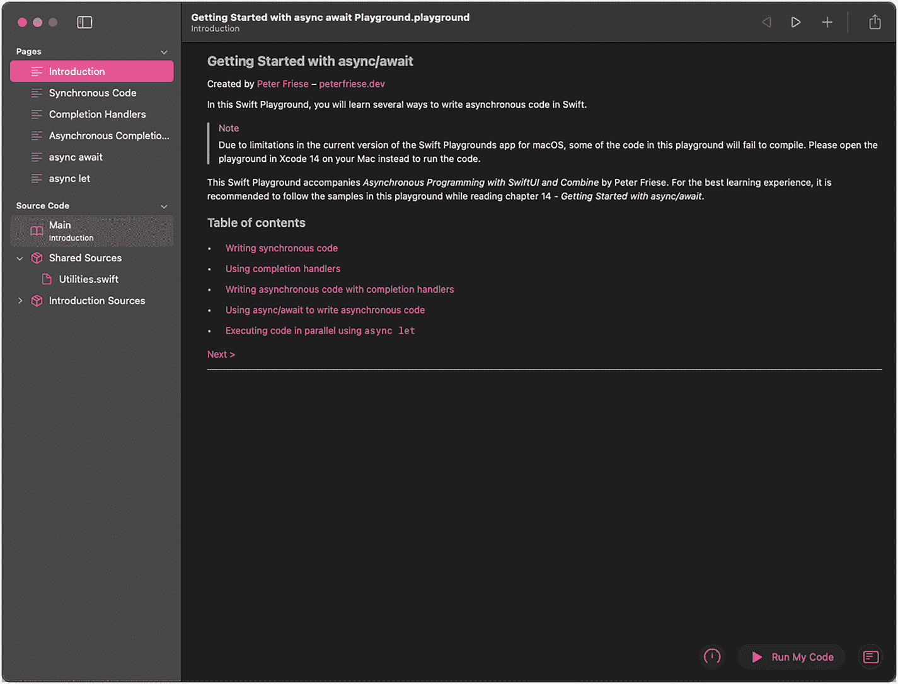
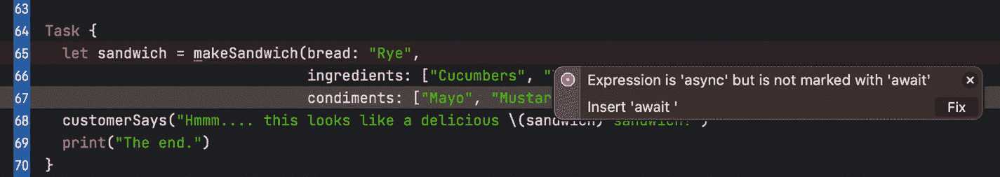

# 14. 开始使用 async/await

我们生活在一个异步的世界里。作为用户，我们已经习惯于期望与设备和应用的交互能够几乎瞬时产生结果。但我们往往忽略了一个事实，那就是我们与之交互的系统通常是分布式系统：点赞推文或 Instagram 故事、归档电子邮件、将商品加入购物车——所有这些操作最终都会导致网络调用、数据库表的更新，有时甚至会在服务器上执行业务逻辑。

当处理分布式、独立执行的系统时，异步行为是常态，而非例外：任何涉及 I/O（无论是磁盘还是网络相关的操作），甚至与本地系统上的其他进程通信，都是以异步方式发生的。

剑桥词典将*异步*定义为*不以相同的时间或速度发生或完成*，^(¹⁰⁷) 我们可以在许多情况下观察到这类行为：

-   服务器需要同时处理许多客户端，但它的处理器或处理器核心数量可能少于需要同时处理的客户端数量。
-   多核系统并行运行多个独立执行的操作。
-   客户端应用接收它之前发起的网络调用的结果。
-   本地应用需要处理用户的输入，同时还要渲染 UI 更新。

作为开发者，我们习惯于大多数方法和函数调用几乎立即执行并返回，这让我们能够编写线性、直接的代码，就像 Swift 编程语言指南^(¹⁰⁸)中的这个例子：

```swift
func greet(person: String) -> String {
let greeting = "Hello, " + person + "!"
return greeting
}
print(greet(person: "Anna"))
// 打印 "Hello, Anna!"
print(greet(person: "Brian"))
// 打印 "Hello, Brian!"
```

对 `greet` 函数的调用会立即返回，对 Anna 和 Brian 的问候会顺序打印。Brian 总是会在 Anna 之后被问候。

这个例子中的 `greet` 函数是*同步*执行的。这是可能的，因为它没有执行任何复杂的工作，也不依赖于任何其他（远程）子系统。

但也存在*异步*执行的函数。函数异步执行的最常见原因包括：它们需要等待慢速资源的响应（例如，需要通过网络访问的服务器，甚至是本地文件系统上的文件），或者它们执行了开销较大的工作（即长时间运行的计算）。

计算图像的缩略图是一项需要花费一点时间的操作——取决于原始图像的大小。`UIImage` 有两种方法可以做到这一点：同步版本（`preparingThumbnail(of:)`^(¹⁰⁹)) 会阻塞调用线程直到方法返回。在一个包含许多缩略图的 UI（例如集合视图）中使用此方法时，当用户快速滚动时，必然会导致卡顿。为了防止这种情况，`UIImage` 有该方法的第二个版本，允许开发者异步调用此 API：`prepareThumbnail(of:completionHandler:)`^(¹¹⁰)。此方法不会阻塞主线程，而是异步执行，因此即使在后台计算大量缩略图时，滚动也能保持流畅。


## 在慢速资源上调用函数时，大多数情况下阻塞调用方是不可行的

在大多数操作系统中，用户界面运行在主线程上，阻塞调用会导致界面无响应和卡顿。如果应用在特定时间内没有响应，iOS 甚至可能会终止你的应用。^(¹¹¹) 我们都经历过这种情况，这绝非良好的用户体验。在服务器上阻塞调用会导致生成更多线程来处理可能的其他请求，从而引发`线程爆炸`，^(¹¹²) 并导致服务器资源迅速耗尽。同样，如果服务器无法生成更多线程，它将无法处理传入的请求，导致 HTTP `503`（*服务不可用*）错误消息。

因此，我们需要一种在应用中处理异步操作的方法。接下来，我们将探讨如何使用不同的技术实现异步代码。我们将使用的示例是一个生产手工三明治的简易三明治店。^(¹¹³)

通用算法如下：

* 烘烤面包。
* 切片其他食材（黄瓜、洋葱、西红柿）。
* 面包烤好后，
  * 在面包上涂抹酱料。
* 将食材堆叠在一片面包上。
* 在上面放上生菜。
* 盖上另一片面包。
* 将三明治包裹好，交给顾客。

你会注意到，其中一些步骤需要顺序执行，而另一些则可以并行进行。例如，在烘烤面包时，我们无需干等——可以趁机切蔬菜。

*本章的代码可以在本书的 GitHub 仓库^(¹¹⁴) 中找到，位于第 14 章^(^(509862_1_En_14_Chapter.xhtml)) 的文件夹内。在该文件夹中，你会找到一个 `.playground` 文件。请在 Swift Playgrounds 应用^(¹¹⁵) 中打开此文件，并展开项目导航器（`CMD+1`）和调试控制台（`CMD+Shift+Y`），以便更轻松地在各个示例之间导航。*



一个软件页面的截图，展示了开始使用 async await playground 的界面。左侧面板列出了页面和源代码。页面显示了笔记和目录。

**图 14-1** Swift Playgrounds 应用中的 playground

### 使用函数的同步编程

首先，让我们看看三明治制作算法的同步实现：

```swift
public func customerSays(_ message: String) {
    print("[Customer] \(message)")
}

public func sandwichMakerSays(_ message: String, waitFor time: UInt32 = 0) {
    print("[Sandwich maker] \(message)")
    if time > 0 {
        print("                 ... this will take \(time)s")
        sleep(time)
    }
}

func makeSandwich(bread: String, ingredients: [String], condiments: [String]) -> String {
    sandwichMakerSays("Preparing your sandwich...")
    let toasted = toastBread(bread)
    let sliced = slice(ingredients)
    sandwichMakerSays("Spreading \(condiments.joined(separator: ", and ")) on \(toasted)")
    sandwichMakerSays("Layering \(sliced.joined(separator: ", "))")
    sandwichMakerSays("Putting lettuce on top")
    sandwichMakerSays("Putting another slice of bread on top")
    return "\(ingredients.joined(separator: ", ")), \(condiments.joined(separator: ", ")) on \(toasted)"
}

func toastBread(_ bread: String) -> String {
    sandwichMakerSays("Toasting the bread... Standing by...", waitFor: 5)
    return "Crispy \(bread)"
}

func slice(_ ingredients: [String]) -> [String] {
    let result = ingredients.map { ingredient in
        sandwichMakerSays("Slicing \(ingredient)", waitFor: 1)
        return "sliced \(ingredient)"
    }
    return result
}

//: The main program follows
sandwichMakerSays("Hello to Cafe Synchronous, where we execute your order serially.")
sandwichMakerSays("Please place your order.")

// We're using a `ContinuousClock` to determine how long it took to make the sandwich.
let clock = ContinuousClock()
let time = clock.measure {
    let sandwich = makeSandwich(bread: "Rye", ingredients: ["Cucumbers", "Tomatoes"], condiments: ["Mayo", "Mustard"])
    customerSays("Hmmm.... this looks like a delicious \(sandwich) sandwich!")
}

// This should be roughly 7 seconds (5 for toasting, and 1 for each ingredient we sliced)
print("Making this sandwich took \(time)")
```

主要工作^(¹¹⁶) 发生在 `makeSandwich` 函数中，它接受一些参数，让顾客告诉我们面包类型、食材和酱料。

所有步骤都是顺序执行的，即使是一些耗时步骤，例如烘烤面包。烘烤面包通过休眠几秒来模拟。这会有效地阻塞线程，`toastBread` 函数只有在 5 秒过后才会返回调用方。

该程序的输出如下：

```
[Sandwich maker] Hello to Cafe Synchronous, where we execute your order serially.
[Sandwich maker] Please place your order.
[Sandwich maker] Preparing your sandwich...
[Sandwich maker] Toasting the bread... Standing by...
... this will take 5s
[Sandwich maker] Slicing Cucumbers
... this will take 1s
[Sandwich maker] Slicing Tomatoes
... this will take 1s
[Sandwich maker] Spreading Mayo, and Mustard on Crispy Rye
[Sandwich maker] Layering sliced Cucumbers, sliced Tomatoes
[Sandwich maker] Putting lettuce on top
[Sandwich maker] Putting another slice of bread on top
[Customer] Hmmm.... this looks like a delicious Cucumbers, Tomatoes, Mayo, Mustard on Crispy Rye sandwich!
Making this sandwich took 7.00992275 seconds
```

由于我们串行执行了所有步骤，整个程序耗时约 7 秒（烘烤 5 秒，切西红柿和黄瓜各 1 秒）。

这个版本的算法易于编写和理解，因为它遵循线性流程——一条语句接一条语句。当我们调用一个函数时，我们知道程序只有在函数返回后才会继续主流程。

这对于我们编写的大部分代码来说都很好，但一旦我们需要处理异步 API，基于前面提到的原因，使用阻塞调用就不再可行了。


### 使用闭包进行异步编程

Swift 的初始版本并未包含任何语言级的一等并发特性。这实际上是核心团队有意做出的决定（参见 Swift 并发宣言^(¹¹⁷)），因此开发者不得不另寻他法来处理异步代码。

一种常见的实现需要异步运行代码的方式是使用 GCD（Grand Central Dispatch）结合闭包。*闭包*是自包含的功能模块，可以在代码中传递和使用。^(¹¹⁸) 闭包通常用于实现回调函数和完成处理器，这使得它们非常适合处理异步代码：一旦长时间运行的任务完成，我们可以使用闭包将结果返回给调用者。

使用闭包时，上一节中的 `toastBread` 函数将如下所示：

```
func toastBread(_ bread: String,
completion: (String) -> Void) {
sandwichMakerSays("烤面包中... 请稍候...", waitFor: 5)
completion("松脆的 \(bread)")
}
```

要调用此方法，你需要像这样更新调用点：

```
toastBread(bread, completion: { toasted in
print("\(bread) 现在是 \(toasted)")
// 输出 "黑麦面包 现在是 松脆的黑麦面包"
})
```

当你将此版本与原始函数进行比较时，会注意到以下几点：

1.  `toastBread` 函数不再有返回值。
2.  取而代之的是一个额外的参数 `completion`，其签名看起来有点复杂。
3.  `completion: (String) -> Void)` 意味着 `completion` 参数将一个函数作为输入值。这个函数期望一个 `String` 类型的参数，并且不返回任何值（即 `Void`）。
4.  当 `toastBread` 函数准备好将操作结果返回给调用者时，它会通过调用 `completion` 并传入一个 `String` 来调用闭包。
5.  在调用点，我们传入一个闭包，该闭包的签名与 `completion` 参数所期望的相匹配。

在处理异步代码时，闭包最常用作*尾随闭包*。这是 Swift 的一个语言特性，允许我们简化调用点：

```
toastBread(bread) { toasted in
print("\(bread) 现在是 \(toasted)")
}
```

到目前为止，我们的代码还不是真正的异步；唯一改变的是我们如何将结果返回给调用者。

让我们更新 `toastBread` 和 `slice` 函数，将它们的主体包裹在 `DispatchQueue.global().async { }` 调用中，以在全局调度队列上异步运行：

```
func toastBread(_ bread: String,
completion: @escaping (String) -> Void)
{
DispatchQueue.global().async {
sandwichMakerSays("烤面包中... 请稍候...",
waitFor: 5)
completion("松脆的 \(bread)")
}
}
func slice(_ ingredients: [String],
completion: @escaping ([String]) -> Void)
{
DispatchQueue.global().async {
let result = ingredients.map { ingredient in
sandwichMakerSays("正在切 \(ingredient)", waitFor: 1)
return "切好的 \(ingredient)"
}
completion(result)
}
}
```

在调用点，我们现在可以使用完成处理器语义。由于我们希望在 `toastBread` 调用完成后才调用 `slice`，因此需要像这样嵌套它们：

```
toastBread(bread) { toasted in
slice(ingredients) { sliced in
sandwichMakerSays("涂抹 \(condiments.joined(separator: ", 和 ")) 在 \(toasted) 上")
// ...
}
}
print("这段代码会在面包烤好和食材切好*之前*执行。")
```

我们可能希望在全局线程上异步运行 `toastBread` 和 `slice` 的一个原因是，我们正在调用应用程序的独立子系统来执行这些操作，或者我们需要访问远程服务器来实现此功能。

使用闭包处理异步代码是一种成熟的做法，苹果自己的 API 以及许多第三方 SDK（如 Firebase）都采用了这种方法。

但这并不意味着它是完美的。事实上，在我们的应用程序中使用闭包处理异步行为存在许多问题：

**很容易陷入厄运金字塔**。这指的是你必须将所有依赖于调用结果的代码嵌套在闭包内部。在我们的示例中，只需要嵌套两层，但请看这个来自 Swift 并发宣言^(¹¹⁹) 的示例：

```
func processImageData1(completionBlock: (result: Image) -> Void) {
loadWebResource("dataprofile.txt") { dataResource in
loadWebResource("imagedata.dat") { imageResource in
decodeImage(dataResource, imageResource) { imageTmp in
dewarpAndCleanupImage(imageTmp) { imageResult in
completionBlock(imageResult)
}
}
}
}
}
```

这是一个典型的例子，代码需要调用多个异步 API，并将一个调用的结果传递给下一个。

如果你把代码侧过来看，就会明白为什么这被称为*厄运金字塔*。将这与我们第一个示例中的线性代码进行比较，你就会理解为什么这种代码更难理解。

**错误处理会让代码更难阅读**。这是来自 Swift 并发宣言的同一段代码，添加了错误处理：

```
func processImageData2(completionBlock: (result: Image?, error: Error?) -> Void) {
loadWebResource("dataprofile.txt") { dataResource, error in
guard let dataResource = dataResource else {
completionBlock(nil, error)
return
}
loadWebResource("imagedata.dat") { imageResource, error in
guard let imageResource = imageResource else {
completionBlock(nil, error)
return
}
decodeImage(dataResource, imageResource) { imageTmp, error in
guard let imageTmp = imageTmp else {
completionBlock(nil, error)
return
}
dewarpAndCleanupImage(imageTmp) { imageResult in
guard let imageResult = imageResult else {
completionBlock(nil, error)
return
}
completionBlock(imageResult)
}
}
}
}
}
```

这段代码不仅冗长得多，还要求调用者检查回调是否返回了结果或错误。这很容易被遗忘，而且不幸的是，编译器无法在调用点强制执行这种错误处理。

**回调所在线程通常不明确**。`toastBread` 和 `slice` 的调用者无法得知回调将在哪个线程上执行，除非他们能访问源代码，或者函数的文档明确说明了所使用的线程模型。调用者可以通过将这些调用包裹在 `DispatchQueue.main.async { }` 调用中来解决这个问题，但这可能会导致在调用多个运行在不同线程上的函数时发生线程跳转。

**无法强制调用完成处理器**。这对调用者来说尤其成问题。他们能否期望完成处理器一定会被调用？它会被多次调用吗？错误将如何处理？回调会收到错误句柄吗？苹果在其文档中提供了一些指导原则，^(¹²⁰) 但编译器无法对它们做出任何保证。这使得构建好的 API 比应有的难度更大。

总的来说，使用闭包将不可避免地导致代码错综复杂、难以阅读且容易出错。

### 使用 async/await 进行异步编程

Swift 5.5 引入的 Swift 新并发模型使异步编程变得容易得多。它引入了一些语言级概念（最突出的是 `async/await` 关键字），使我们能够明确代码的异步特性。这使得编译器能够执行一些编译时检查，从而帮助我们编写更好、更不易出错的程序。

在本章的剩余部分，我们将了解一些新概念，并将基于闭包的代码重构为基于 `async/await` 的实现，这种实现更易于阅读和维护。


#### 定义与调用异步函数



一段从第 63 行到第 70 行的程序代码中，第 65 行出现了一个错误弹窗，提示信息为：“表达式是异步的但未标注 await，请插入 await”。该弹窗的右下角提供了修复选项。

**图 14-2** 当你在调用异步函数时没有使用 `await` 关键字，编译器会报错

在 Swift 中，异步函数（或异步方法）可以在执行过程中被挂起。当函数需要等待一个缓慢的资源时，例如网络调用，这一点尤其有用：函数不是阻塞线程等待网络调用返回，而是可以暂停执行并将线程让给应用程序的其他部分。这样可以更充分地利用系统资源，并实现无卡顿的用户界面。

函数可以被挂起的位置称为*挂起点*，当你调用异步函数或方法时，通过使用 `await` 关键字来标记它们：

```
let result = await someAsyncFunction()
```

要定义异步函数或方法，你需要使用 `async` 关键字：

```
func someAsyncFunction() async -> String {
    let result = // ... 此处为异步代码
    return result
}
```

让我们来看看当我们使用 `async/await` 时，三明治制作器的代码会是什么样子。

首先，我们来更新烤面包的代码。如果你还记得，我们假设我们将使用某个子系统来烤面包（例如，烤面包机），并且这个过程需要花费一些时间。在代码中，这通过休眠 5 秒来表示：

```
func toastBread(_ bread: String) async -> String {
    sandwichMakerSays("正在烤面包... 请稍候...")
    await Task.sleep(5_000_000_000)
    return "脆皮 \(bread)"
}
```

当将这个代码与基于完成处理器的版本进行比较时，你会注意到几点变化：

1.  我们不再需要为尾随闭包提供一个参数。相反，我们使用 `async` 关键字来表明这是一个异步函数。这使得函数签名更容易阅读。
2.  我们现在可以指定这个函数的返回值。请记住，当使用完成处理器时，返回值必须是完成处理器签名的一部分。这使得方法签名更容易阅读，并且正如你稍后将看到的，它也使得调用点更简洁。
3.  不再需要使用 `DispatchQueue.global().async { }` —— SwiftUI 的新并发模型使用线程池，并会自动为我们管理线程。

更新后的 `slice` 函数的代码看起来非常相似：

```
func slice(_ ingredients: [String]) async -> [String] {
    var result = [String]()
    for ingredient in ingredients {
        sandwichMakerSays("正在切 \(ingredient)")
        await Task.sleep(1_000_000_000)
        result.append("切好的 \(ingredient)")
    }
    return result
}
```

现在让我们看看如何调用这两个更新后的函数。在调用点，我们需要使用 `await` 关键字来表明对 `toastBread` 和 `slice` 的调用是潜在的挂起点：

```
func makeSandwich(bread: String, ingredients: [String], condiments: [String]) async -> String {
    sandwichMakerSays("正在准备您的三明治...")
    let toasted = await toastBread(bread)
    let sliced = await slice(ingredients)
    sandwichMakerSays("正在将 \(condiments.joined(separator: ", 和 ")) 涂抹在 \(toasted) 上")
    sandwichMakerSays("正在分层摆放 \(sliced.joined(separator: ", "))")
    sandwichMakerSays("在上面放生菜")
    sandwichMakerSays("在上面再放一片面包")
    return "在 \(toasted) 上放有 \(ingredients.joined(separator: ", ")), \(condiments.joined(separator: ", "))"
}
```

注意，我们现在可以调用 `toastBread` 和 `slice`，而无需使用嵌套闭包。这产生了几乎是直线型的代码，读起来就像普通的、线性的代码，如同三明治制作算法的其余部分。

由于 `makeSandwich` 现在也是一个异步函数，就像 `toastBread` 和 `slice` 一样，我们也需要将其标记为 `async`。

但是，我们如何从同步上下文中调用异步代码呢？

Swift 提供了 `Task` API，它代表一个异步工作单元。通过将对异步函数的调用封装在 `Task { }` 内部，你可以从同步上下文中调用它，例如在你的 UI 中的动作处理器或 Swift Playground 中。以下是调用 `makeSandwich` 的样子：

```
Task {
    let sandwich = await makeSandwich(bread: "黑麦面包", ingredients: ["黄瓜", "番茄"], condiments: ["蛋黄酱", "芥末酱"])
    customerSays("嗯.... 这看起来像一个美味的 \(sandwich) 三明治！")
    print("结束。")
}
```

由于 `makeSandwich` 现在是一个异步函数，我们需要使用 `await` 关键字来调用它。如果我们忘记这样做，编译器将会报错：

#### 并行调用异步函数

你可能已经注意到，我们的三明治制作过程是可以优化的。

目前，我们首先调用 `toastBread` 并等待它完成。然后，我们调用 `slice` 来切食材并等待它完成，然后再继续组装三明治。这显然有优化的空间——在烤面包的同时，我们可以开始切食材，从而减少顾客的整体等待时间。

Swift 的新并发模型支持使用 `async let` 语法同时执行多个异步函数。要并行执行代码，可以在调用一个或多个异步函数时加上 `async let` 前缀：

```
async let x = someAsyncFunction()
async let y = someAsyncFunction()
async let z = someAsyncFunction()
print("这段代码会立即执行")
```

只要有足够的资源可用，系统将同时、并行地运行这些函数。这些调用都不会创建挂起点，这意味着之后的任何代码都会立即执行——就像代码片段中的 `print` 语句一样。

要创建一个挂起点，请对常量（此处为 `x`、`y` 和 `z`）使用 `await`：

```
let result = await [x, y, z]
print("结果是 \(result)")
```

让我们看看如何使用它来优化我们的三明治制作过程：

```
func makeSandwich(bread: String, ingredients: [String], condiments: [String]) async -> String {
    sandwichMakerSays("正在准备您的三明治...")
    async let toasted = toastBread(bread)
    async let sliced = slice(ingredients)
    sandwichMakerSays("正在将 \(condiments.joined(separator: ", 和 ")) 涂抹在 \(await toasted) 上")
    sandwichMakerSays("正在分层摆放 \(await sliced.joined(separator: ", "))")
    sandwichMakerSays("在上面放生菜")
    sandwichMakerSays("在上面再放一片面包")
    return "在 \(await toasted) 上放有 \(ingredients.joined(separator: ", ")), \(condiments.joined(separator: ", "))"
}
```

如你所见，可以在代码的任何位置使用 `await <常量>`——甚至在字符串插值内部也可以。使用这种方法，`toastBread` 和 `slice` 现在将并行运行。通过在我们的代码中添加计时，我们可以看到这确实减少了顾客的等待时间：

```
let clock = ContinuousClock()
Task {
    let time = await clock.measure {
        let sandwich = await makeSandwich(bread: "黑麦面包", ingredients: ["黄瓜", "番茄"], condiments: ["蛋黄酱", "芥末酱"])
        customerSays("嗯.... 这看起来像一个美味的 \(sandwich) 三明治！")
        print("结束。")
    }
    print("制作这个三明治花了 \(time)")
}
```

顾客现在只需等待大约 5 秒，而不是 7 秒——这是一个很不错的改进！


## 摘要

在本章中，你了解了并发性，以及 Swift 新的并发模型如何改进我们编写和使用异步代码的方式。

你学习了如何使用完成处理器来构建异步 API，以及如何调用它们。完成处理器和闭包是实现异步行为的一种非常常见的方式，至今，它们仍被许多苹果自家的 API 和大量第三方库所使用。它们为开发者社区提供了良好的服务，但也带来了一些缺点，例如可能导致"回调金字塔"，以及不确定会在哪个线程上回调。然而，使用完成处理器处理异步代码的最大缺点是，与直线式代码相比，它们更难阅读，尤其是对于刚接触异步代码概念的开发者来说。

Swift 新的并发模型（最广为人知的是 `async/await`）使得实现和使用异步 API 都变得更加容易。在本章中，你看到了如何使用 `async` 关键字来声明异步函数和方法，以及如何使用 `await` 关键字来调用这些异步函数。你了解了什么是挂起点，以及 Swift 如何使用线程池来管理异步代码的执行。我们还研究了 `async let`，它可以让你并行运行多个异步函数或方法，以及如何创建挂起点（使用 `await <constant>` 来等待调用的结果）。

这是对 Swift 新并发模型的快速介绍。要了解更多，我建议阅读《Swift 编程语言指南》中的并发章节^(¹²¹)或观看我的视频系列。^(¹²²) 在下一章中，我们将研究如何将 Swift 的新并发模型与 SwiftUI 结合使用。

脚注 1 2 3 4 5 6 7 8 9 10 11 12 13 14 15 16

