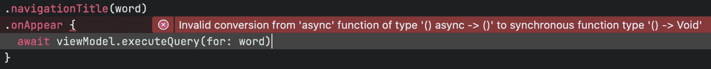
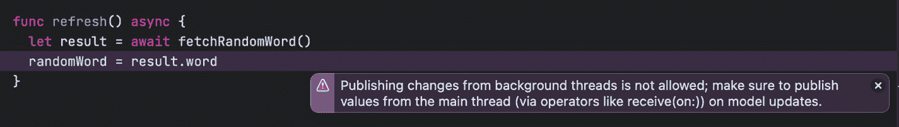
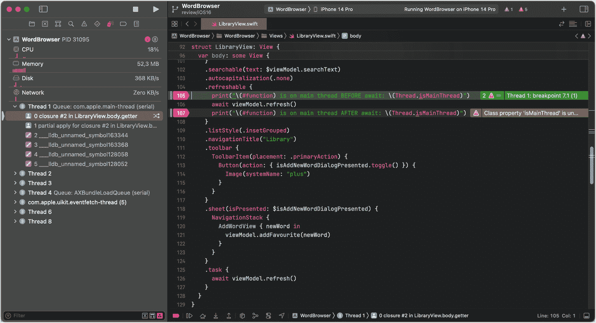
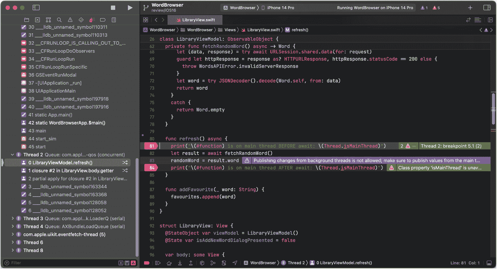
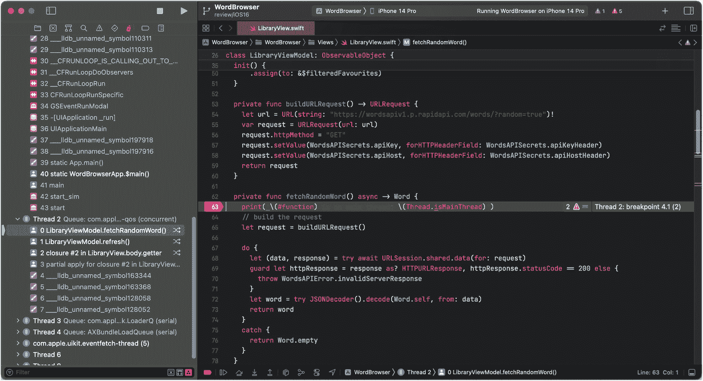
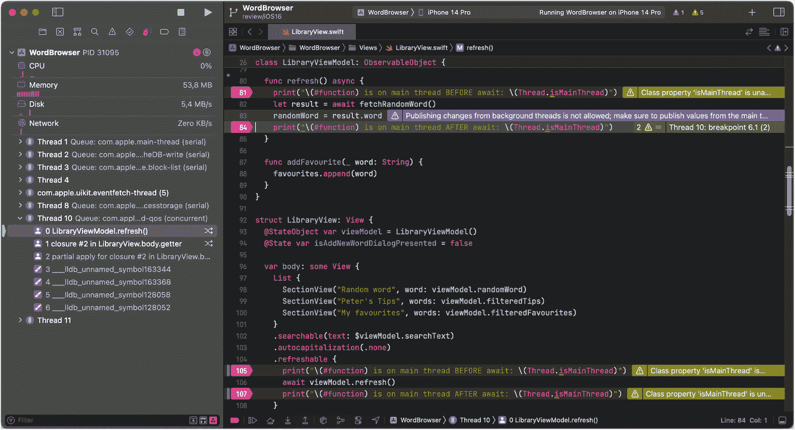
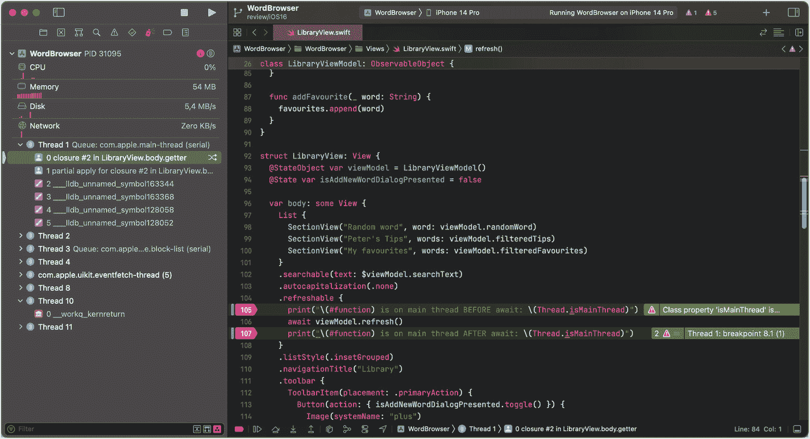

# 15. 在 SwiftUI 中使用 `async/await`

现在你已经对 Swift 新并发模型的工作原理有了基本了解，让我们看看如何在 SwiftUI 应用程序中使用它。

我们在本章中要构建的示例应用使用了 WordsAPI。^(¹²³) 这是一个有趣的小型 API，提供大量关于单词的有趣信息。你向它发送一个单词，比如 "Swift"，它会返回关于这个单词的一系列信息——例如，"移动非常快"、"一种类似燕子的鸟"或"一位出生于爱尔兰的英国讽刺作家"。

该示例应用会显示一个建议单词列表，用户可以点击以获取更多信息。然后，应用会从 WordsAPI.com 获取该单词的不同含义，并在详情屏幕中显示。

在本章中，我们将研究如何从应用中的不同场景调用这些异步代码，例如，当用户点击按钮时，当用户下拉刷新时，等等。

## 使用 `URLSession` 异步获取数据

`URLSession` 是苹果升级以支持 `async/await` 的众多 API 之一，因此使用 `URLSession` 获取数据现在只需一行代码：

```
let (data, response) =
try await URLSession.shared.data(for: urlRequest)
```

配合一些最少的错误处理和 JSON 解析（使用 `Codable`），从 WordsAPI.com 获取单词详情的代码如下所示：

```
private func search(for searchTerm: String) async -> Word {
// 构建请求
let request = buildURLRequest(for: searchTerm)
do {
let (data, response) =
try await URLSession.shared.data(for: request)
guard let httpResponse = response as? HTTPURLResponse,
httpResponse.statusCode == 200 else
{
throw WordsAPIError.invalidServerResponse
}
let word = try JSONDecoder().decode(Word.self, from: data)
return word
}
catch {
return Word.empty
}
}
```

通过在方法签名中添加 `async` 关键字，我们声明了该方法是异步的。编译器将使用此信息确保此方法从异步上下文中调用，如果我们忘记使用 `await` 关键字调用该方法，则会发出编译时错误。

使用 `await` 调用异步方法会创建一个所谓的挂起点。当函数被挂起时，运行时可以重用其正在执行的线程来执行应用程序中的其他代码。

你可以想象成正在与呼叫中心客服通话，被告知"请稍等"：当你听着或多或少的等待音乐时，你可以继续做其他事情，比如喝茶、想象下一次度假，或者与房间里的其他人聊天。一旦客服人员查到了那个重要信息，你就会把全部注意力转回他们身上，本质上就是恢复因被告知稍等而挂起的对话流程。

## 调用异步代码

要调用异步代码，我们需要处于异步上下文中。正如我们在上一章中看到的，有几种方法可以建立异步上下文。创建一个新的 `Task` 是其中之一：

```
Task {
let result = search(for: "Swift")
}
```

虽然这足够简单，但在面向 UI 的代码中反复编写这段代码会显得很繁琐。幸运的是，苹果已经更新了 SwiftUI，使得从 UI 上下文内部调用异步代码变得尽可能简单。特别是，它们添加了一些 API，允许我们在以下情况调用异步代码：

- 当视图出现时（使用 `.task` 视图修饰符）
- 当用户在 `List` 视图中下拉刷新时

对于其他情况，我们仍需要自己创建异步上下文，例如：

- 当用户点击 `Button` 时
- 当用户在 `View` 的搜索栏中键入搜索词时

在接下来的章节中，我们将通过一些场景来具体了解这些调用异步代码的方式。

## 任务视图修饰符

最常见的数据获取场景之一是当视图出现在屏幕上时。以前，你可能使用 `.onAppear` 视图修饰符在视图出现时运行代码。当你尝试从 `.onAppear` 内部调用异步代码时，编译器会发出错误，提示不允许从非异步上下文中调用异步代码：



程序代码片段显示类型为上方同步函数的无效转换错误文本。

要修复这个编译时错误，我们可以将代码包装在新的 `Task` 中，像这样：

```
struct WordDetailsView: View {
...
var body: some View {
List {
...
}
.navigationTitle(word)
.onAppear {
Task {
await viewModel.executeQuery(for: word)
}
}
}
}
```

虽然这运行良好，但略显冗长，实际上有一个更好的解决方案：因为在视图出现时获取数据是一个非常常见的场景，SwiftUI 提供了一个新的视图修饰符，它会自动创建一个新的 `Task`，*并且*在视图消失时取消它：

```
struct WordDetailsView: View {
...
var body: some View {
List {
...
}
.navigationTitle(word)
.task {
await viewModel.executeQuery(for: word)
}
}
}
```

这使得我们的代码更加简洁且易于阅读。


### 在用户点击按钮时调用异步代码

通常，当用户点击`Button`时，我们需要异步执行代码——例如，我们可能想要刷新列表视图中的数据。

在 Xcode 13 的某些测试版本中，部分`Button`的初始化器支持注册异步事件处理程序。这似乎只是一次实验，因为 Xcode 13.1 的正式发布版已不再包含这些初始化器。这意味着，如果我们想在`Button`的事件处理程序中运行异步代码，就需要使用`Task`来创建一个异步上下文。以下是一个工具栏按钮的示例，用于触发当前显示数据的刷新：

```
.toolbar {
    ToolbarItem(placement: .primaryAction) {
        Button("刷新") {
            async {
                await viewModel.refresh()
            }
        }
    }
}
```

### 使用下拉刷新异步更新视图

点击按钮刷新界面固然不错，但你是否尝试过下拉刷新？这一手势已存在多年，而 SwiftUI 使其在应用中的实现比以往更简单。你只需在视图上添加`.refreshable`视图修饰符即可。该修饰符接受一个可以异步运行代码的闭包。以下是一个简单示例，触发列表视图中显示数据的刷新：

```
struct LibraryView: View {
    ...
    var body: some View {
        List {
            ...
        }
        .refreshable {
            await viewModel.refresh()
        }
    }
}
```

### 可搜索视图与 async/await

你可以通过应用`.searchable`视图修饰符，为 SwiftUI 视图添加特定于平台的搜索界面。该修饰符最多可接受三个参数：第一个是绑定到`String`的`Binding`，用于存储用户输入的搜索词；其他参数允许你控制搜索栏的位置，并提供建议搜索词列表。由于第一个参数是`Binding`，你可以使用 Combine 来驱动搜索。以下代码片段展示了如何通过 Combine 管道过滤`List`视图中显示的元素：

```
class LibraryViewModel: ObservableObject {
    @Published var searchText = ""
    @Published var tips: [String] = ["Swift", "authentication", "authorization"]
    @Published var favourites: [String] = ["stunning", "brilliant", "marvelous"]
    @Published var filteredTips = [String]()
    @Published var filteredFavourites = [String]()

    init() {
        Publishers.CombineLatest($searchText, $tips)
            .map { filter, items in
                items.filter { item in
                    filter.isEmpty ? true : item.contains(filter)
                }
            }
            .assign(to: &$filteredTips)

        Publishers.CombineLatest($searchText, $favourites)
            .map { filter, items in
                items.filter { item in
                    filter.isEmpty ? true : item.contains(filter)
                }
            }
            .assign(to: &$filteredFavourites)
    }
    ...
}

struct LibraryView: View {
    @StateObject var viewModel = LibraryViewModel()

    var body: some View {
        List {
            ...
            SectionView("Peter 的建议", words: viewModel.filteredTips)
            SectionView("我的收藏", words: viewModel.filteredFavourites)
        }
        .searchable(text: $viewModel.searchText)
        .autocapitalization(.none)
        ...
    }
}
```

这对于需要即时反馈的界面非常有用，例如像前一个示例那样，在本地过滤结果列表。

然而，如果你希望仅在用户点击*搜索*按钮或按下*回车*键时才开始搜索，则需要使用`.onSubmit(of:)`视图修饰符：

```
struct WordSearchView: View {
    @StateObject var viewModel = WordsAPIViewModel()

    var body: some View {
        List {
            ...
        }
        .searchable(text: $viewModel.searchTerm)
        .autocapitalization(.none)
        .onSubmit(of: .search) {
            Task {
                await viewModel.executeQuery()
            }
        }
        .navigationTitle("搜索")
    }
}
```

在这段代码中，当用户输入搜索词时，`viewModel`上的`searchTerm`属性会持续更新。只有当用户按下键盘上的*回车*键或点击*搜索*按钮时，`onSubmit`修饰符的闭包才会被执行。同样，由于该闭包未标记为`async`，我们需要自己创建所需的异步上下文，然后才能调用视图模型上的异步方法`executeQuery`。


## 从主线程更新 UI

运行我们目前编写的代码时，你可能会发现 Xcode 对部分代码发出了运行时警告，例如以下代码片段：



**图 15-2.** 从后台线程更新 UI

这段代码异步地从 WordsAPI 获取一个随机单词，然后将其赋值给一个 `@Published` 属性：

```swift
class LibraryViewModel: ObservableObject {
    @Published var randomWord = "partially"
    // ...
    private func fetchRandomWord() async -> Word {
        let request = buildURLRequest()
        do {
            let (data, response) = try await URLSession.shared.data(for: request)
            guard let httpResponse = response as? HTTPURLResponse,
                  httpResponse.statusCode == 200 else {
                throw WordsAPIError.invalidServerResponse
            }
            let word = try JSONDecoder().decode(Word.self, from: data)
            return word
        } catch {
            return Word.empty
        }
    }
    func refresh() async {
        let result = await fetchRandomWord()
        randomWord = result.word
    }
}
```

这为什么是个问题呢？

要回答这个问题，我们先来看看代码运行在哪些线程上。有几种方法可以检查，我们将介绍其中两种：

1.  使用 *Debug Inspector*（调试检查器）
2.  使用 `Thread.isMainThread` 记录当前线程的信息

我们先在代码中插入日志，记录代码执行时的当前线程信息：

```swift
struct LibraryView: View {
    @StateObject var viewModel = LibraryViewModel()
    // ...
    var body: some View {
        List {
            // ...
        }
        // ...
        .refreshable {
            print("\(#function) 在 await 之前是否在主线程：\(Thread.isMainThread)")
            await viewModel.refresh()
            print("\(#function) 在 await 之后是否在主线程：\(Thread.isMainThread)")
        }
        // ...
    }
}

class LibraryViewModel: ObservableObject {
    // ...
    private func fetchRandomWord() async -> Word {
        print("\(#function) 是否在主线程：\(Thread.isMainThread)")
        // ...
    }
    func refresh() async {
        print("\(#function) 在 await 之前是否在主线程：\(Thread.isMainThread)")
        let result = await fetchRandomWord()
        randomWord = result.word
        print("\(#function) 在 await 之后是否在主线程：\(Thread.isMainThread)")
    }
    // ...
}
```

再次运行应用时，我们可以在控制台中观察到以下输出：

```
body 在 await 之前是否在主线程：true
refresh() 在 await 之前是否在主线程：false
fetchRandomWord() 是否在主线程：false
2022-10-01 16:43:10.043735+0200 WordBrowser[44309:2075098] [SwiftUI] Publishing changes from background threads is not allowed; make sure to publish values from the main thread (via operators like receive(on:)) on model updates.
refresh() 在 await 之后是否在主线程：false
body 在 await 之后是否在主线程：true
```

看起来，当用户下拉视图进行刷新时（毕竟这是用户发起的交互），代码最初在主线程上启动。然而，一旦调用了 `refresh()`，我们就不在主线程上了。所有非 UI 代码都在后台线程上执行，只有当执行流程返回到视图时，代码才会恢复在主线程上执行（参见日志输出的最后一行）。

现在，我们使用 *Debug Inspector* 来更仔细地分析这个问题。

在五个 `print` 语句处设置断点，然后再次启动应用。当调试器在 `refreshable` 视图修饰器的闭包中第一次命中第一个断点时，你可以看到这段代码实际上是在主线程上执行的：



**图 15-3.** `refreshable` 视图修饰器的闭包在主线程上执行

恢复应用运行，当它第二次命中断点（在 `LibraryViewModel` 的 `refresh()` 方法内部）时，代码现在在后台线程上执行：



**图 15-4.** `refresh` 方法在后台线程上执行

再次恢复运行并继续执行，直到调试器命中 `fetchRandomWord` 内部的第一个断点，观察发现我们仍然在后台线程上。



**图 15-5.** 仍在后台线程上执行：`fetchRandomWord`

再次恢复运行，片刻之后，第三个断点被命中——位于 `refresh()` 中，正是我们异步调用 `fetchRandomWord` 的位置。代码仍在后台线程上运行。



**图 15-6.** 回到 `refresh`，仍在后台线程上

再恢复一次运行，直到调试器命中 `refreshable` 视图修饰器闭包中的第二个断点，我们回到了主线程！



**图 15-7.** 回到 `refreshable` 视图修饰器的闭包中，代码继续在主线程上执行

如果比较图 15-3 和图 15-7 中的调用栈，你会发现它们都在同一个线程（线程 1）上执行，但所有其他方法都是在不同的线程上执行的，那么这里到底发生了什么？

如前一章所述，Swift 的新并发模型会使用与电脑/手机核心数一样多的线程，并从该线程池中选取任意线程来执行代码。特别是，在主线程上调用 `await` 时，Swift 会挂起当前函数，并继续在主线程上执行其他与 UI 相关的代码（以确保应用对用户保持响应）。一旦我们等待的代码恢复执行，它将在另一个非主线程上运行。

要将代码带回主线程，有几种策略：

-   你可以将任何更新 UI 的代码包裹在 `MainActor.run { }` 的调用中。
-   你可以使用 `@MainActor` 属性包装器标记任何更新 UI 的函数。
-   你可以使用 `@MainActor` 属性包装器标记包含更新 UI 代码的整个类。

这些策略的粒度依次递减。因此，如果你需要对主线程上运行的代码部分进行精细控制，请使用 `MainActor.run { }`。另一方面，通过用 `@MainActor` 注解整个视图模型（通常是一个遵循 `@ObservableObject` 的类），你可以确保其内部的所有代码都在主线程上运行，除非是使用 `await` 调用的，这种情况下它会在并发线程池上运行。

因此，要解决我们代码中的问题，我们可以用 `@MainActor` 注解 `refresh` 函数：


