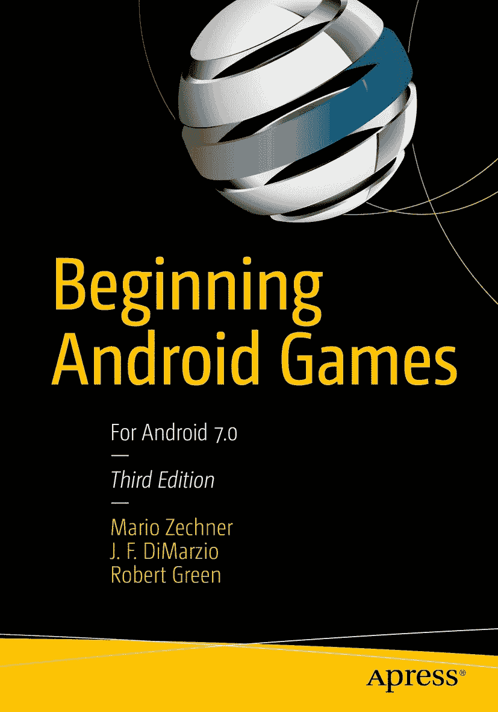

 马里奥·泽克纳、J.F. 迪马尔齐奥和罗伯特·格林 *《Beginning Android Games》* 第 3 版。

作者在本书中引用的任何源代码或其他补充材料，读者均可在 [`www.apress.com`](http://www.apress.com) 获取。关于如何找到本书源代码的详细信息，请访问 [`www.apress.com/source-code/`](http://www.apress.com/source-code/)。读者也可以通过 SpringerLink 在每章的“补充材料”部分访问源代码。

ISBN 978-1-4842-0473-3  
电子版 ISBN 978-1-4842-0472-6  
DOI 10.1007/978-1-4842-0472-6  
美国国会图书馆控制号：2016961227

© 马里奥·泽克纳、J.F. 迪马尔齐奥和罗伯特·格林 2016  
本作品受版权保护。出版商保留所有权利，涉及材料的全部或部分内容，具体包括翻译、重印、插图重用、朗诵、广播、微缩胶片或其他任何物理形式的复制，以及信息存储与检索的传输、电子改编、计算机软件，或目前已知或未来开发的任何类似或不同方法的权利。本书中可能出现商标名称、徽标和图像。我们仅在编辑性用途中使用这些名称、徽标和图像，以维护商标所有者的利益，并无意侵犯商标权，而非每次出现时都使用商标符号。本书中使用的商品名称、商标、服务标志及类似术语，即使未被明确标识，也不应被视为对它们是否受专有权利保护的立场表达。

尽管本书中的建议和信息在出版时被认为是真实准确的，但作者、编辑或出版商均不对可能出现的任何错误或疏漏承担法律责任。出版商对本书内容不作任何明示或暗示的保证。

印刷于无酸纸上  
全球图书贸易由 Springer Science+Business Media New York 发行，地址：233 Spring Street, 6th Floor, New York, NY 10013。电话：1-800-SPRINGER，传真：(201) 348-4505，电子邮件：orders-ny@springer-sbm.com，或访问 www.springeronline.com。Apress Media, LLC 是一家加利福尼亚州的有限责任公司，其唯一成员（所有者）是 Springer Science + Business Media Finance Inc.（SSBM Finance Inc）。SSBM Finance Inc 是一家特拉华州的公司。

谨以此书献给我的偶像——父母，以及我的挚爱——斯蒂芬妮。  
——马里奥·泽克纳

谨以此书献给我的孩子们，以及所有帮助本书得以问世的人。加油，红袜队。  
——J.F. 迪马尔齐奥

谨以此书献给我的家人和一路帮助我们的所有人。  
——罗伯特·格林

