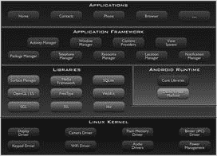
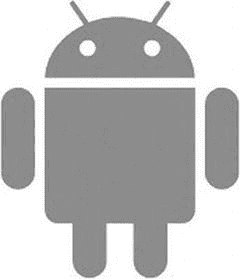
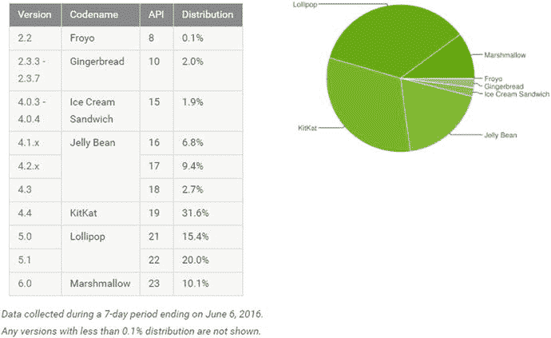

# 1. 家家户户的安卓设备

电子补充材料 本章在线版本(doi:`10.1007/978-1-4842-0472-6_1`)包含补充材料，仅限授权用户访问。

作为八零后和九零后的孩子，我们自然是伴随着可靠的任天堂 Game Boy 和世嘉 Game Gear 一起长大的。我们花了无数时间帮助马里奥拯救公主、在俄罗斯方块中冲击最高分、以及通过连接线与朋友在《超级越野赛车》中竞速。我们随身携带这些了不起的硬件，走到哪里都不离手。对游戏的热情让我们渴望创造自己的世界，并与朋友们分享。我们开始在个人电脑上编程，但很快意识到无法将我们的小杰作移植到当时的便携式游戏机上。随着我们继续保持着编程的热情，对实际玩电子游戏的兴趣逐渐消退。而且，我们的 Game Boy 最终还是坏了……

时光快进到今天。智能手机和平板电脑已成为这个时代的新移动游戏平台，与任天堂 3DS 和 PlayStation Vita 等经典的专用掌机系统竞争。这一发展重新点燃了我们的兴趣，我们开始研究哪些移动平台适合我们的开发需求。苹果的 iOS 系统似乎是我们游戏编程技能的一个不错选择。然而，我们很快意识到该系统并不开放，只有获得苹果的允许才能与他人分享作品，而且开发 iOS 应用还需要一台 Mac 电脑。就在这时，我们发现了安卓。

我们两人都对安卓一见钟情。它的开发环境在所有主流平台上都能运行——毫无限制。它拥有一个充满活力的开发者社区，乐于帮助你解决遇到的任何问题，并提供了详尽的文档。你可以免费与任何人分享你的游戏，如果你想将作品变现，只需几分钟就能将你的最新、最伟大的创新发布到拥有数百万用户的全球市场。

剩下的唯一问题就是弄清楚如何为安卓编写游戏，以及如何将我们在个人电脑上的游戏开发知识迁移到这个新系统上。在接下来的章节中，我们希望与你分享我们的经验，并带你入门安卓游戏开发。当然，这也有点私心：我们想在移动端有更多游戏可玩！

让我们先来认识一下我们的新朋友——安卓。

## 安卓简史

安卓首次公开亮相是在 2005 年，当时谷歌收购了一家名为 Android Inc.的小型初创公司。这引发了外界对谷歌有意进军移动设备领域的猜测。2008 年，安卓 1.0 版本的发布终结了所有猜测，安卓开始成为移动市场上的新挑战者。自那时起，安卓便与 iOS（当时称为 iPhone OS）、黑莓 OS 和 Windows Phone 7 等已站稳脚跟的平台展开了激烈竞争。安卓的增长势头惊人，其市场份额逐年攀升。尽管移动技术的未来总是在变化，但有一点是确定的：安卓会一直存在。

由于安卓是开源的，手机制造商使用这个新平台的门槛很低。他们可以生产覆盖所有价位段的设备，甚至修改安卓本身以适应特定设备的处理能力。因此，安卓不仅限于高端设备，也可以部署在低成本设备中，从而覆盖更广泛的用户群体。

安卓成功的一个关键因素，是 2007 年末开放手机联盟（OHA）的成立。OHA 的成员包括 HTC、高通、摩托罗拉和英伟达等公司，它们共同合作，为移动设备制定开放标准。虽然安卓的代码主要由谷歌开发，但所有 OHA 成员都以某种形式为其源代码做出了贡献。

安卓本身是一个基于 Linux 内核 2.6 和 3.x 版本的移动操作系统和平台，可免费用于商业和非商业用途。OHA 的许多成员为其设备构建了带有定制用户界面（UI）的专属安卓版本。安卓的开源特性也使得爱好者能够创建和分发自己的版本。这些版本通常被称为 Mod、固件或 ROM。在撰写本书时，最著名的 ROM 由史蒂夫·康迪克（又名 Cyanogen）和众多贡献者开发。它旨在为各种安卓设备带来最新、最好的改进，并为那些已被抛弃或老旧设备注入新的活力。

自 2008 年发布以来，安卓经历了多次重大版本更新，大多数版本的代号都以甜点命名。大多数安卓平台版本都增加了新功能——通常以应用程序编程接口（API）或新开发工具的形式出现——这些功能以某种方式与游戏开发者息息相关：

-   **版本 1.5（纸杯蛋糕）：** 增加了对在安卓应用中包含原生库的支持，此前应用只能用纯 Java 编写。在对性能要求极高的情况下，原生代码非常有用。
-   **版本 1.6（甜甜圈）：** 引入了对不同屏幕分辨率的支持。本书中我们会多次提及这一发展，因为它对我们编写安卓游戏的方式有一定影响。
-   **版本 2.0（闪电泡芙）：** 增加了对多点触控屏幕的支持。
-   **版本 2.2（冻酸奶）：** 为 Dalvik 虚拟机（VM）增加了即时（JIT）编译功能，该虚拟机是驱动安卓上所有 Java 应用的软件。JIT 能显著提升安卓应用的执行速度——根据场景不同，速度最多可提升五倍。
-   **版本 2.3（姜饼）：** 为 Dalvik 虚拟机增加了新的并发垃圾回收器。
-   **版本 3.0（蜂巢）：** 创建了安卓的平板电脑版本。蜂巢于 2011 年初发布，其 API 的变动比当时已发布的任何其他安卓版本都更为重大。到 3.1 版本，蜂巢增加了对分割和管理大型高分辨率平板屏幕的广泛支持。它添加了更多类似个人电脑的功能，如 USB 主机支持以及对外设（包括键盘、鼠标和摇杆）的支持。此版本唯一的问题是它仅针对平板电脑。小屏幕/智能手机版的安卓停留在 2.3 版本。
-   **安卓 4.0（冰淇淋三明治）：** 将蜂巢（3.1）和姜饼（2.3）的功能合并为一套通用特性，使其在平板和手机上都能良好运行。
-   **安卓 4.1（果冻豆）：** 改进了 UI 的合成方式和整体渲染性能。这项努力被称为“黄油计划”；第一款搭载果冻豆的设备是谷歌自家的 Nexus 7 平板电脑。
-   **安卓 4.4（奇巧）：** 包含了更新的图标集和更精致的字体。奇巧还允许应用全屏运行。
-   **安卓 5（棒棒糖）：** 棒棒糖对通知面板进行了重大改版，并增加了创建访客用户账户的功能。
-   **安卓 6（棉花糖）：** 包含了一个新的安全模型，允许用户批准或拒绝特定的应用安全请求，而此前的安全模型是全有或全无的。
-   **安卓 7（牛轧糖）：** SDK 的变更包括转向使用 OpenJDK，以及支持在屏幕上同时运行多个应用程序（此前该功能仅内置在三星 Note 系列手机中）。

### 碎片化

Android 的高度灵活性是有代价的：选择开发自有用户界面的公司，必须努力追赶 Android 新版本快速发布的步伐。这可能导致，由于运营商和手机制造商拒绝创建集成新版本 Android 改进功能的更新，仅上市几个月的手机就会变得过时。这一过程的产物便是那个名为“碎片化”的巨大梦魇。

碎片化有多种表现形式。对于最终用户而言，它意味着由于固守老旧版本的 Android，导致无法安装和使用某些应用程序和功能。对于开发者而言，这意味着在创建旨在兼容所有 Android 版本的应用程序时，必须多加小心。虽然为早期 Android 版本编写的应用程序通常能在新版本上正常运行，但反之则不成立。当然，一些添加到较新 Android 版本中的功能（例如多点触控支持）在旧版本上是不可用的。因此，开发者被迫为不同的 Android 版本创建独立的代码路径。

2011 年，许多知名的 Android 设备制造商同意在设备生命周期（18 个月）内支持最新的 Android 操作系统。这看似时间不长，但却是帮助减少碎片化迈出的一大步。这也意味着 Android 的新特性（例如新的 API）能够更快地在更多手机上得以应用。五年后，这一承诺并未像许多人期望的那样得到很好的履行。市场上仍有相当大一部分设备在运行较旧的 Android 版本，主要是 Jelly Bean。如果一款游戏的开发者希望获得大众市场的认可，那么这款游戏需要能够在不少于五种不同的 Android 版本上运行，并且这些版本分布在 600 多种设备类型上（而且还在增加！）。

但别担心。尽管这听起来很可怕，但事实证明，为了适配多个 Android 版本所需采取的措施是极少的。大多数情况下，你甚至可以忽略这个问题，假装只有一个 Android 版本存在。作为游戏开发者，我们不太关心 API 的差异，更关心的是硬件性能。这是碎片化的另一种形式，对于 iOS 等平台来说同样是个问题，尽管不那么突出。在本书中，我们将介绍在你为 Android 开发下一款游戏时可能遇到的、相关的碎片化问题。

### Google 的角色

尽管 Android 官方是开放手持设备联盟的产物，但在实现 Android 本身以及为其发展提供必要生态系统方面，Google 是明确的领导者。

#### Android 开源项目

Google 的努力集中体现在 Android 开源项目中。大部分代码采用 Apache 许可证 2.0 授权，与 GNU 通用公共许可证等其他开源许可证相比，该许可证非常开放且限制较少。任何人都可以自由使用这些源代码来构建自己的系统。但是，宣称兼容 Android 的系统必须首先通过 Android 兼容性计划，该过程旨在确保与开发者编写的第三方应用程序保持基本兼容性。兼容的系统被允许参与 Android 生态系统，其中也包括 Google Play。

### Google Play

Google Play（原名 Android Market）于 2008 年 10 月由 Google 向公众开放。它是一个在线商店，使用户能够购买音乐、视频、书籍以及第三方应用程序，并在其设备上使用。Google Play 主要在 Android 设备上可用，但也提供了一个 Web 前端，用户可以在其中搜索、评分、下载和安装应用。虽然不是必需的，但大多数 Android 设备都默认安装了 Google Play 应用。

Google Play 允许第三方开发者免费或有偿发布他们的程序。许多国家都提供付费应用的购买服务，集成支付系统通过 Google Checkout 处理汇率问题。Google Play 还允许开发者选择按国家/地区手动为应用定价。

用户在设置 Google 帐户后即可访问该商店。应用程序可以通过 Google Checkout 使用信用卡，或使用运营商计费方式购买。买家可以在购买后 15 分钟内决定退货，并获得全额退款。之前，退款窗口是 24 小时，但为了限制对该系统的滥用而缩短了。

开发者需要向 Google 注册一个 Android 开发者帐户，并一次性支付 25 美元的费用，才能在商店中发布应用程序。成功注册后，开发者可以在几分钟内开始发布新应用。

Google Play 没有审批流程，而是依赖于权限系统。在安装应用程序之前，用户会看到一组必需的权限，这些权限涉及对电话服务、网络、安全数字卡等的访问。在 Marshmallow 版本之前，用户可能因权限问题而选择不安装某个应用，但用户无法简单地拒绝授予某个特定权限。然而，自 Android Marshmallow 起，用户现在可以在运行时接受或拒绝特定的应用权限。

为了销售应用，开发者还需要额外注册一个免费的 Google Checkout 商家帐户。所有金融交易都通过此帐户处理。Google 还有一个与 Google Play 和 Google Checkout 集成的应用内购买系统。开发者可以使用一个独立的 API 来处理应用内购买交易。

## Google I/O

一年一度的 Google I/O 大会是所有 Android 开发者每年都翘首以盼的活动。在 Google I/O 上，会揭晓最新的、最棒的 Google 技术和项目，其中 Android 近年来占据了特殊地位。Google I/O 通常设有多个关于 Android 相关主题的会议环节；这些环节的视频也会发布在 YouTube 上的 Google Developers 频道。在 2011 年的 Google I/O 大会上，三星和 Google 向所有常规与会者发放了 Galaxy Tab 10.1 设备。这真正标志着 Google 开始大力推动其在平板电脑领域市场份额的增长。

## Android 的功能与架构

Android 不仅仅是为移动设备设计的另一个 Linux 发行版。在为 Android 进行开发时，你不太可能直接接触到 Linux 内核本身。面向开发者的 Android 是一个平台，它抽象了底层的 Linux 内核，并通过 Java 进行编程。从高层次来看，Android 拥有以下一些出色的特性：

- 一个应用程序框架，提供了丰富的 API 用于创建各种类型的应用程序。它还允许重用和替换由平台及第三方应用程序提供的组件。
- Dalvik 虚拟机，负责在 Android 上运行应用程序。
- 一套用于 2D 和 3D 编程的图形库。
- 对常见音频、视频和图像格式（如 Ogg Vorbis、MP3、MPEG-4、H.264 和 PNG）的媒体支持。甚至还有一个专门用于播放音效的 API，这将为你的游戏开发之旅带来便利。
- 用于访问外围设备的 API，如摄像头、全球定位系统 (GPS)、指南针、加速度计、触摸屏、轨迹球、键盘、手柄和摇杆。请注意，并非所有 Android 设备都具备所有这些外设——硬件碎片化现象确实存在。

当然，Android 的功能远不止上面提到的这几项，但对于你的游戏开发需求，这些功能最为相关。

Android 的架构由堆叠的组件群组成，每一层都建立在下一层组件的基础之上。图 1-1 展示了 Android 主要组件的概览。

图 1-1. Android 架构概览

### 内核

从堆栈底部开始，可以看到 Linux 内核为硬件组件提供了基本驱动程序。此外，内核还负责内存与进程管理、网络等底层事务。

### 运行时与 Dalvik

Android 运行时构建于内核之上，负责生成并运行 Android 应用程序。每个 Android 应用程序都在自己的进程中运行，并拥有自己的 Dalvik 虚拟机。

Dalvik 以 Dalvik 可执行文件 (DEX) 字节码格式运行程序。通常，你需要使用一个名为 `dx` 的特殊工具（由软件开发工具包 (SDK) 提供）将常见的 Java `.class` 文件转换为 DEX 格式。与传统的 Java `.class` 文件相比，DEX 格式旨在占用更小的内存空间。这是通过高度压缩、数据表以及合并多个 `.class` 文件来实现的。

Dalvik 虚拟机与核心库交互，这些核心库提供了暴露给 Java 程序的基本功能。核心库通过使用 Apache Harmony Java 实现的一个子集，提供了 Java 标准版 (SE) 中可用类的部分（而非全部）。这也意味着没有可用的 Swing 或抽象窗口工具包 (AWT)，也找不到 Java 微型版 (ME) 中的任何类。不过，只要稍加注意，你仍然可以在 Dalvik 上使用许多适用于 Java SE 的第三方库。

在 Android 2.2 (Froyo) 之前，所有字节码都是解释执行的。Froyo 引入了一个追踪式 JIT 编译器，它会即时将部分字节码编译为机器码。这大大提高了计算密集型应用程序的性能。JIT 编译器可以利用专门为特殊计算（例如专用浮点运算单元 (FPU)）而设计的 CPU 特性。几乎每个新版本的 Android 都会改进 JIT 编译器并提升其性能，但通常是以增加内存消耗为代价。不过，这是一个可扩展的解决方案，因为新设备标配的 RAM 容量越来越大。

Dalvik 还集成有一个垃圾回收器 (GC)，在早期版本中，它有时有让开发者抓狂的倾向。不过，只要注意一些细节，你就能在日常游戏开发中与 GC 和平共处。自 Android 2.3 起，Dalvik 采用了改进的并发式 GC，减轻了部分痛苦。在本书后面，你将更详细地研究 GC 问题。

在 Dalvik 虚拟机实例中运行的每个应用程序，总共至少有 16MB 的堆内存可用。较新的设备，尤其是平板电脑，具有更高的堆内存限制，以适应更高分辨率的图形。尽管如此，在游戏中很容易耗尽所有这些内存，因此在处理图像和音频资源时必须牢记这一点。

### 系统库

除了提供部分 Java SE 功能的核心库之外，还有一组原生 C/C++ 库（图 1-1 中的第二层），它们构成了应用程序框架（图 1-1 中的第三层）的基础。这些系统库主要负责计算密集型任务（如图形渲染、音频播放和数据库访问），这些任务不太适合由 Dalvik 虚拟机处理。这些 API 由应用程序框架中的 Java 类封装，当开始编写游戏时，你将用到它们。你将以某种形式使用以下库：

- **Skia 图形库 (Skia)**：该 2D 图形软件用于渲染 Android 应用程序的用户界面。你将用它来绘制你的第一个 2D 游戏。
- **嵌入式系统 OpenGL (OpenGL ES)**：这是硬件加速图形渲染的行业标准。`OpenGL ES 1.0` 和 `1.1` 在所有版本的 Android 上都暴露给 Java。`OpenGL ES 2.0` 引入了着色器，仅从 Android 2.2 (Froyo) 开始支持。值得一提的是，Froyo 中 `OpenGL ES 2.0` 的 Java 绑定不完整，缺少一些关键方法。幸运的是，这些方法在版本 `2.3` 中已被添加。`OpenGL ES 3.0` 在 KitKat 中引入。最后，`OpenGL ES 3.1` 在 Marshmallow 中引入。就你的目的而言，坚持使用 `OpenGL ES 2.0` 以最大化兼容性，并让你轻松进入 Android 3D 编程的世界。
- **OpenCore**：这是一个用于音频和视频的媒体播放与录制库。它支持多种格式，例如 Ogg Vorbis、MP3、H.264、MPEG-4 等。你将主要处理音频部分，这部分没有直接暴露给 Java 端，而是被封装在几个类和服务中。
- **FreeType**：这是一个用于加载和渲染位图和矢量字体（尤其是 TrueType 格式）的库。FreeType 支持 Unicode 标准，包括针对阿拉伯语及类似特殊文本的从右到左字形渲染。与 OpenCore 一样，FreeType 没有直接暴露给 Java 端，而是被封装在几个便捷的类中。

这些系统库为游戏开发者提供了广泛的支持，并承担了大部分繁重的工作。这就是你可以使用纯 Java 编写游戏的原因。

**注意**：尽管 Dalvik 的能力通常足以满足你的需求，但有时你可能需要更高的性能。例如，对于非常复杂的物理模拟或繁重的 3D 计算，你通常需要编写原生代码。我们将在本书的后续章节中探讨这个问题。目前已经存在一些针对 Android 的开源库，可以帮助你继续使用 Java 进行开发。可参阅 `http://code.google.com/p/libgdx/` 以获取示例。

#### 应用框架

应用框架将系统库与运行时绑定在一起，构成了 Android 的用户端。该框架管理着应用程序，并为应用程序的运行提供了精密的结构。开发者通过一组 Java API 为该框架创建应用程序，这些 API 涵盖了 UI 编程、后台服务、通知、资源管理、外设访问等领域。Android 提供的所有开箱即用的核心应用程序（如邮件客户端）都是使用这些 API 编写的。

应用程序（无论它们是 UI 还是后台服务）都可以向其他应用程序公布自身的能力。这种通信使一个应用程序能够复用其他应用程序的组件。一个简单的例子是，某个应用程序需要拍照，然后对照片执行一些操作。该应用程序会向系统查询另一个提供此服务的应用程序的组件。然后，第一个应用程序就可以复用该组件（例如，内置的相机应用程序或相册）。这大大降低了程序员的负担，也使你能自定义 Android 行为的诸多方面。

作为一名游戏开发者，你将在此框架内创建 UI 应用程序。因此，你会对应用程序的架构、生命周期以及它与用户的交互感兴趣。后台服务在游戏开发中通常扮演次要角色，这就是不会对其进行详细讨论的原因。

#### 软件开发工具包

要为 Android 开发应用程序，你将使用 Android 软件开发工具包（`SDK`）。`SDK` 包含一套全面的工具、文档、教程和示例，可帮助你快速上手。其中还包含了为 Android 创建应用程序所需的 Java 库。这些库包含了应用框架的 API。所有主流桌面操作系统都支持作为开发环境。

`SDK` 的显著特性如下：

*   调试器，能够调试在设备或模拟器上运行的应用程序。
*   内存和性能分析器，用于帮助你发现内存泄漏和定位慢速代码。
*   设备模拟器，虽然有时有点慢但很准确，它基于 `QEMU`（一种用于模拟不同硬件平台的开源虚拟机）。有一些可用于加速模拟器的选项，例如 Intel 硬件加速执行管理器（`HAXM`），我们将在第 2 章讨论。
*   用于与设备通信的命令行工具。
*   用于打包和部署应用程序的构建脚本和工具。

`SDK` 可以与 Android Studio 集成，这是一个流行且功能丰富的集成开发环境（`IDE`）。Android Studio 2 版本包含许多新特性，包括备受期待的 Instant Run 功能，该功能允许将代码变更更快地推送到你的模拟器中。

> **注意**
>
> 第 2 章介绍了如何设置 Android Studio。

任何优秀的 `SDK` 都会附带详尽的文档。Android 的 `SDK` 在这方面并不逊色，并且包含大量示例应用程序。你还可以在 [`http://developer.android.com/guide/index.html`](http://developer.android.com/guide/index.html) 找到开发者指南以及应用框架所有模块的完整 API 参考。

除了 Android `SDK`，使用 OpenGL 的游戏开发者可能还想安装并使用来自高通、PowerVR、英特尔和英伟达的各种分析器。这些分析器提供的关于游戏在设备上的性能需求的数据，比 Android `SDK` 中的任何工具都要丰富得多。我们将在第 2 章更详细地讨论这些分析器。

#### 开发者社区

Android 成功的一部分归功于其开发者社区，他们聚集在网络上的各个地方。开发者交流最常去的站点是位于 [`http://groups.google.com/group/android-developers`](http://groups.google.com/group/android-developers) 的 Android 开发者论坛。当你遇到看似无法解决的问题时，这里是提问或寻求帮助的首选之地。该论坛聚集了各类 Android 开发者，从系统程序员到应用程序开发者，再到游戏程序员。偶尔，负责 Android 部分功能的谷歌工程师也会通过提供宝贵的见解来提供帮助。注册是免费的，我们强烈建议你现在就加入这个论坛！它除了为你提供提问的场所外，也是一个搜索已解答问题和解决方案的好地方。所以，在提问之前，请先检查问题是否已经有了答案。

另一个信息和帮助的来源是位于 [`http://www.stackoverflow.com`](http://www.stackoverflow.com) 的 Stack Overflow。你可以通过关键词搜索，或按标签浏览最新的 Android 问题。

每个像样的开发者社区都有自己的吉祥物。Linux 有企鹅 Tux，GNU 有……呃，它的角马，Mozilla Firefox 有它时髦的 Web 2.0 狐狸。Android 也不例外，它选择了一个小绿机器人作为吉祥物。图 1-2 展示了那个小精灵。

**图 1-2.** Android 机器人

Android 机器人已经在一些流行的 Android 游戏中担任主角。它最引人注目的亮相是在《副本岛》中，这是一款由前谷歌开发者倡导者 Chris Pruett 作为 20% 项目创建的免费开源平台。（“20% 项目”这个术语指的是谷歌员工每周可以有一天时间花在自己选定的项目上。）

#### 设备、设备、还是设备！

Android 并不局限于单一的硬件生态系统。许多著名的手机制造商，如 HTC、摩托罗拉、三星和 LG，都已加入 Android 阵营，并提供一系列运行 Android 的设备。除了手机，还有大量基于 Android 的平板设备、可穿戴设备、汽车设备和电视设备。不过，所有设备都共享一些关键概念，这会让你的游戏开发之路更加轻松。

#### 硬件

谷歌最初规定了以下最低硬件规格。几乎所有现有的 Android 设备都满足，并且往往显著超出这些建议：

- **128MB 内存**：此规格为最低要求。当前高端设备已配备 1GB 内存，根据摩尔定律，这一上升趋势短期内不会结束。
- **256MB 闪存**：这是存储系统映像和应用程序所需的最小内存量。长期以来，内存不足一直是 Android 用户最大的抱怨，因为第三方应用程序只能安装到闪存中。这一情况在 Froyo 发布后得以改变。
- **迷你或微型 SD 卡存储**：大多数设备配备了几 GB 的 SD 卡存储空间，用户可将其更换为容量更大的 SD 卡。部分设备（如三星 Galaxy Nexus）取消了可扩展的 SD 卡插槽，仅集成闪存。
- **16 位彩色四分之一视频图形阵列（QVGA）薄膜晶体管液晶显示器（TFT-LCD）**：在 Android 1.6 版本之前，操作系统仅支持半尺寸 VGA（HVGA）屏幕（480 × 320 像素）。自 1.6 版本起，开始支持更低和更高分辨率的屏幕。当前高端手机配备宽 VGA（WVGA）屏幕（800 × 480、848 × 480 或 852 × 480 像素），而部分低端设备支持 QVGA 屏幕（320 × 280 像素）。平板电脑屏幕尺寸多样，通常约为 1280 × 800 像素，Android TV 则支持高清电视的 1920 × 1080 分辨率！尽管许多开发者认为每台设备都具备触摸屏，但事实并非如此。Android 正在向配备传统显示器的机顶盒和类 PC 设备进军。这两类设备均不具备手机或平板电脑那样的触摸屏输入方式。

当然，大多数 Android 设备配备的硬件远远超过最低规格要求。几乎所有手机都具备 GPS、加速度计和指南针。许多设备还配有距离传感器和光线传感器。这些外设为游戏开发者提供了让用户与游戏互动的新方式；我们将在本书后面用到其中的一些功能。少数设备甚至拥有完整的 QWERTY 键盘和轨迹球。后者最常见于 HTC 设备。几乎所有当前的便携设备也都配备了摄像头。

专用图形处理单元（GPU）对游戏开发尤为重要。最早运行 Android 的手机已具备兼容 OpenGL ES 1.0 的 GPU。较新的便携设备拥有性能堪比旧款 Xbox 或 PlayStation 2 的 GPU，并支持 OpenGL ES 2.0、OpenGL ES 3.0 和 OpenGL ES 3.1。如果没有图形处理器，平台会提供一个名为 `PixelFlinger` 的软件渲染器作为后备方案。许多低价手机依赖软件渲染器，其速度对于大多数低分辨率屏幕来说已经足够。

除了图形处理器，当前任何可用的 Android 设备也都具备专用音频硬件。许多硬件平台包含用于解码不同媒体格式（如 H.264）的特殊电路。网络连接通过用于移动电话、Wi-Fi 和蓝牙的硬件组件实现。Android 设备中的所有硬件模块通常集成在单个片上系统（SoC）中，这种系统设计也常见于嵌入式硬件。

#### 设备范围

最初是 G1 手机。开发者们热切期待更多设备，随后几款差异微小的手机问世，它们被视为“第一代”产品。多年来，硬件性能越来越强大，如今产品涵盖手机、平板电脑、智能手表和机顶盒，从配备 2.5 英寸 QVGA 屏幕、仅依赖 500MHz ARM CPU 软件渲染器的设备，一直到拥有四核 2+GHz CPU 和强大 GPU、可支持高清电视的机器。

我们已经讨论过碎片化问题，但开发者还需要应对屏幕尺寸、功能和性能的巨大差异。最好的方法是了解最低硬件配置，并将其作为游戏设计和性能测试的最低通用标准。

##### 最低实际目标

截至 2016 年中，运行 Android 版本低于 Jelly Bean 的设备占比不到 4%。这一点很重要，因为这意味着你现在启动的游戏只需支持 API 级别 16（Android 4.1）的最低版本，到游戏完成时，它仍将覆盖 96% 的 Android 设备（按版本计）。这并不是说你不能使用最新的功能！你当然可以，我们将向你展示如何实现。你只需在设计游戏时加入一些后备机制，使其向下兼容至 4.1 版本。最新数据可通过 Google 访问 [`http://developer.android.com/resources/dashboard/platform-versions.html`](http://developer.android.com/resources/dashboard/platform-versions.html) 获取，图 1-3 显示了 2016 年 6 月收集的图表。

*图 1-3. 2016 年 6 月 6 日的 Android 版本分布情况*

###### 全设备兼容性

在讨论了手机、平板、芯片组、外设等诸多内容之后，显而易见的是，支持安卓设备市场与支持个人电脑市场并无二致。屏幕尺寸从微小的 320×240 像素一直延伸到 4K。在最入门级的第一代设备上，你只有可怜的 500MHz ARM5 CPU 和显存极其有限的 GPU；而在另一端，你则有高带宽、多核 2GHz 以上的 CPU，搭配大规模并行处理的 GPU 和大量内存。第一代手机的多点触控系统很不稳定，无法识别分散的触控点。新款平板能支持十个分散触控点。机顶盒则根本没有任何触控功能！开发者该怎么办？

首先，这一切并非毫无章法。安卓本身有一套兼容性程序，规定了安卓兼容设备各项指标的最低规格和范围。如果设备未达到标准，则不允许搭载谷歌 Play 应用。呼，总算松了口气！该兼容性程序可在[`http://source.android.com/compatibility/overview.html`](http://source.android.com/compatibility/overview.html)找到。

安卓兼容性程序在一份名为《兼容性定义文档》（CDD）的文件中概述，该文件可在兼容性程序网站上获取。该文档会随安卓平台的每次发布而更新，硬件厂商必须对新设备进行更新和重新测试以保持合规。

CDD 中与游戏开发者相关的若干要求如下：

*   最低音频延迟（因设备而异）
*   最低屏幕尺寸（目前为 426×320）
*   最低屏幕密度（目前为 120 dpi）
*   可接受的屏幕宽高比（目前为 4:3 至 16:9）
*   3D 图形加速（要求支持`OpenGL ES 1.0`和`OpenGL 2.0`）
*   输入设备

即使你对列表中的某些条目不太理解，也无需担心。本书后续章节会更详细地探讨其中许多主题。从这个列表中我们可以得出的核心结论是：存在一种设计游戏的方法，使其能在绝大多数安卓设备上运行。通过规划好用户界面和游戏中的通用视图，使其适配不同的屏幕尺寸和宽高比，并理解你不仅需要触控功能，还需要键盘或其他输入方式，你就能成功开发出一款兼容性很强的游戏。要在不同硬件上实现良好的用户体验，不同的游戏需要采用不同的技术，因此不幸的是，解决这些问题并没有灵丹妙药。但请放心：只要投入时间并进行适当的规划，你就能获得不错的结果。

### 移动游戏，大不相同

早在 iPhone 和安卓出现之前，游戏就已经是一个巨大的市场。然而，随着这类新型混合设备的出现，格局开始发生变化。游戏不再是书呆子孩子的专属。严肃的商务人士被看到在公共场合玩着手机上的最新热门游戏，报纸报道着成功的小型游戏开发者在手机应用市场上赚得盆满钵满，而老牌游戏发行商则难以跟上移动领域的发展步伐。游戏开发者必须认识到这一变化并做出相应调整。让我们来看看这个新生态系统带来了什么。

#### 人人兜里都有游戏机

移动设备无处不在。这大概是从本节中应该记住的关键点。由此，你可以轻易推导出关于移动游戏的所有其他事实。

由于硬件价格不断下降，且新设备的计算能力日益增强，移动设备成为了游戏的理想平台。如今手机已成为必需品，因此市场渗透率极高。许多人正在将老式经典手机更换为新一代智能手机，并发现了种类极其丰富的应用程序所带来的全新选择。

过去，如果你想玩电子游戏，必须有意识地购买一台游戏主机或游戏电脑。而现在，你在手机、平板和其他设备上免费获得了这一功能。它没有额外的成本（至少如果你不算上你可能需要的数据套餐的话），而且你的新游戏设备随时可用。只需从口袋或包里拿出来，就能开始玩——无需随身携带另一个专用设备，因为一切都集成在一个设备里。

除了只需携带一个设备就能满足电话、互联网和游戏需求之外，还有另一个因素让手机游戏更容易被更广泛的受众接受：你可以在设备上启动专用的市场应用，挑选一款看起来有趣的游戏，下载它，然后立即开始玩。无需去商店，也无需通过电脑下载却发现，比如，你没有所需的 USB 线将游戏传输到手机。

当前一代设备处理能力的提升，也影响了作为游戏开发者你能实现什么。即使是中端设备，也能提供类似于老款 Xbox 和 PlayStation 2 平台游戏的体验。凭借这些强大的硬件平台，你还可以开始探索带有物理模拟的复杂游戏，这是一个充满巨大创新潜力的领域。

新设备带来了新的输入方式，这一点已经有所提及。一些游戏已经利用了大多数安卓设备中可用的 GPS 和/或指南针。加速度计的使用已成为许多游戏的必备功能，而多点触控屏幕为用户与游戏世界的交互提供了新方式。虽然已经取得了不少进展，但仍有创新的方法来运用所有这些功能。

#### 永远在线

安卓设备通常随数据套餐一起出售。这推动了网络流量的增长。智能手机用户很可能会随时连接到网络（忽略因硬件设计缺陷导致的信号不佳情况）。

永久连接为移动游戏开启了一个全新的世界。用户可以挑战地球另一端的对手下一盘快棋，探索由真人组成的虚拟世界，或是在一场绅士死亡竞赛中试图击杀来自另一个城市的好友。更重要的是，这一切都在移动中进行——在公交车上、火车上，或是在当地公园最心爱的角落。

除了多人游戏功能，社交网络也开始影响移动游戏。游戏提供功能，让你能自动将最新的高分直接推送到推特账户，或通知好友你在你们共同喜爱的赛车游戏中取得的最新成就。尽管在传统游戏领域（例如 Xbox Live 或 PlayStation Network）也存在不断增长的社交网络，但 Facebook 和 Twitter 这类服务的市场渗透率要高得多，因此用户无需同时管理多个社交网络。

##### 休闲玩家与硬核玩家

移动设备的广泛普及意味着，那些从未碰过 NES（任天堂娱乐系统）手柄的人也突然发现了游戏世界。他们对好游戏的理解往往与硬核玩家大相径庭。

根据手机的使用场景，典型用户往往倾向于休闲类的游戏，他们可以在公交车上或在快餐店排队时花几分钟玩上一把。这些游戏就像是 PC 上那些令人上瘾的小型 Flash 游戏，让许多上班族一感觉到身后有人，就疯狂地按下 `Alt+Tab`（切换窗口快捷键）。请扪心自问：你每天愿意花多少时间在手机上玩游戏？你能想象在这样一台设备上玩一局“快速”的《*文明*》吗？

当然，可能有些重度玩家愿意献出自己的一切，只要能让他们在手机上玩起心爱的《*高级龙与地下城*》变体版。但这个群体是极少数，iPhone App Store 和 Google Play 上的畅销游戏就是证明。最畅销的游戏通常本质极为休闲，但它们都有一个绝妙的招数：每局游戏的平均时间只有几分钟，但它们通过各种“邪恶”的机制让你不断回来玩。有的游戏可能提供一套精心设计的在线成就系统，让你可以虚拟地炫耀自己的技巧。有的游戏实际上可能是伪装成休闲游戏的硬核游戏。给用户提供一种简单的方法来保存进度，你就把一款史诗级 RPG（角色扮演游戏）当成可爱的益智游戏来卖了！

##### 大市场，小开发者

移动游戏市场的低准入门槛是吸引众多爱好者及独立开发者的主要因素。就 Android 而言，这个门槛尤其低：只需获取 SDK（软件开发工具包）并开始编程即可。你甚至不需要设备——使用模拟器就行了（尽管建议至少拥有一台开发设备）。Android 的开放性也导致了网上的大量活跃讨论。关于该系统编程各方面的信息都可以在网上免费找到。无需签署保密协议，也无需等待某个权威机构授权你进入他们神圣的生态系统。

起初，市场上许多最成功的游戏都是由一人公司或小团队开发的。大型发行商很长一段时间都没有涉足这个市场，至少没有成功过。`Gameloft` 就是一个典型的例子。尽管在 iPhone 上很强大，但`Gameloft` 在 Android 上很长时间都无法立足，并决定改为在自己的网站上销售游戏。`Gameloft` 可能对当时缺乏数字版权管理方案（现在 Android 上已经有了）感到不满。最终，`Gameloft` 与其他大公司如 `Zynga` 和 `Glu Mobile` 一起，重新开始在 Google Play 上发布游戏。

Android 环境也允许大量的实验和创新，因为无聊的人们在浏览 Google Play 时，会寻找那些包含新创意和游戏机制的小宝石。在 PC 或主机等经典游戏平台上进行实验，往往以失败告终。然而，Google Play 能让你接触到大量愿意尝试实验性新创意的受众，并且可以用更少的精力触及他们。

当然，这并不意味着你不需要为游戏做营销。一种方法是向网上的各种博客和专门网站介绍你的最新游戏。许多 Android 用户都是爱好者，他们会定期访问此类网站，关注下一个热门游戏。

另一种接触大量受众的方式是让你的应用在 Google Play 上获得推荐。一旦被推荐，你的应用就会出现在用户启动 Google Play 应用时显示的列表中。许多开发者报告称，下载量的大幅增长与在 Google Play 上被推荐直接相关。不过，如何获得推荐有点神秘。拥有一个绝佳的创意，并以尽可能完美的方式实现它，是你最好的赌注，无论你是大型发行商还是小型的一人公司。

最后，社交网络可以通过简单的口碑传播，极大地提升你应用的下载量和销售额。病毒式传播的游戏通常通过直接集成 Facebook 或 Twitter，让玩家更容易参与这个过程。让游戏实现病毒式传播是一门“黑魔法”，通常更多依赖于天时地利，而非事先规划。

## 总结

Android 是一个令人兴奋的“猛兽”。你已经了解了它的构成，并对它的开发者生态系统有了一点了解。从开发的角度来看，它在软件和硬件方面都为你提供了一个非常有趣的系统，并且考虑到免费提供的 SDK，准入门槛极低。设备本身对便携设备来说性能相当强大，它们将让你能够向用户呈现画面丰富的游戏世界。使用加速度计等传感器，你可以创造出具有新颖用户交互的创新游戏创意。当你完成游戏开发后，几分钟内就能将它们部署到数百万潜在玩家手中。听起来很刺激吗？是时候动手写点代码了！

