# 2. Android Studio 初步上手

Android Studio 和 Android SDK 提供了一套工具，让你能够在短时间内创建应用。本章将指导你使用 SDK 工具构建一个简单的 Android 应用。这包括以下步骤：

1. 搭建开发环境。
2. 在 Android Studio 中创建新项目并编写代码。
3. 在模拟器或设备上运行应用。
4. 调试和分析应用。

我们将通过介绍一些有用的第三方工具来结束本章。让我们从搭建开发环境开始。

## 搭建开发环境

Android SDK 非常灵活，并且能很好地与多种开发环境集成。纯粹主义者可能会选择使用命令行工具走硬核路线。但我们希望事情能更舒适一些，因此我们将选择更简单、更直观的方式，使用 IDE（集成开发环境）。

以下是你需要按给定顺序下载和安装的软件列表：

1. Java 开发工具包（JDK），版本 8
2. Android Studio
3. Android 软件开发工具包（Android SDK）

让我们来完成正确设置一切所需的步骤。

> 注意：由于网络情况不断变化，我们在此不提供具体的下载链接。请打开你最喜欢的搜索引擎，找到获取所列项目的地方。

### 安装 JDK

下载特定于你操作系统的 JDK 版本。在大多数系统上，JDK 以安装程序或软件包的形式提供，因此应该不会有什么障碍。安装 JDK 后，你应该添加一个名为 `JDK_HOME` 的环境变量，指向 JDK 安装的根目录。此外，你应该将 `$JDK_HOME/bin` 目录（在 Windows 上是 `%JDK_HOME%\bin`）添加到你的 `PATH` 环境变量中。

### 安装 Android Studio

在编写本书时，Android Studio 的版本是 2.2。只需在 Android 开发者网站上找到最新版本的下载，并将其解压到你选择的文件夹中。安装完成后，你可以在桌面上为 Android Studio 安装根目录下的 `Android Studio` 可执行文件创建一个快捷方式。


### 设置 Android SDK

Android SDK 可用于三种主流桌面操作系统。请选择适合你平台的版本并下载。SDK 以 ZIP 或 tar gzip 压缩包的形式提供。只需将其解压到一个合适的文件夹（例如，Windows 系统下的 `c:\android-sdk` 或 Linux 系统下的 `/opt/android-sdk`）。SDK 在 `tools/` 文件夹中包含多个命令行实用程序。创建一个名为 `ANDROID_HOME` 的环境变量，指向 SDK 安装的根目录，然后将 `$ANDROID_HOME/tools`（Windows 系统下为 `%ANDROID_HOME%\tools`）添加到你的 `PATH` 环境变量中。这样，如果后续需要，你就可以方便地从终端调用这些命令行工具。

**注意**：对于 Windows 系统，你也可以下载一个合适的安装程序，它会为你完成所有设置。

完成以上步骤后，你将拥有一个基础安装，其中包含创建、编译和部署 Android 项目所需的基本命令行工具，以及 SDK 管理器（用于安装 SDK 组件）和 AVD 管理器（负责创建模拟器使用的虚拟设备）。仅有这些工具还不足以开始开发，你还需要安装额外的组件。这时就需要用到 SDK 管理器。管理器是一种包管理器，非常类似于你在 Linux 上找到的包管理工具。该管理器允许你安装以下类型的组件：

-   Android 平台：针对每个官方 Android 版本，SDK 都有一个平台组件，其中包括运行时库、模拟器使用的系统镜像以及任何特定于该版本的开发工具。
-   SDK 附加组件：附加组件通常是外部库和工具，不特定于某个平台。一些例子是允许你在应用程序中集成 Google 地图的 Google API。
-   Windows 版 USB 驱动程序：在 Windows 系统上，此驱动程序是运行和调试物理设备上的应用程序所必需的。在 Mac OS X 和 Linux 上，你不需要特殊驱动程序。
-   示例代码：每个平台都有一套特定于该平台的示例。这些是了解如何使用 Android 运行时库实现特定目标的绝佳资源。
-   文档：这是最新 Android 框架 API 文档的本地副本。

作为贪心的开发者，我们希望安装所有这些组件，以便拥有完整的功能集供我们使用。因此，我们首先要启动 SDK 管理器。在 Windows 上，SDK 根目录中有一个名为 `SDK manager.exe` 的可执行文件。或者，你也可以在 Android Studio 中通过点击 Tools >> Android >> SDK Manager 来启动 SDK 管理器。然后，点击 Launch Standalone SDK Manager。

首次启动时，SDK 管理器会连接到包服务器并获取可用包的列表。然后，管理器会显示如图 2-1 所示的对话框，允许你安装单个包。只需点击“Select”旁边的“New”链接，然后点击“Install”按钮。系统会弹出一个对话框，要求你确认安装。勾选“Accept All”复选框，然后再次点击“Install”按钮。接下来，去为自己泡杯好茶或咖啡吧。管理器需要一段时间来安装所有包。安装程序可能会要求你为某些包提供登录凭据。你可以忽略这些请求，直接点击“Cancel”。

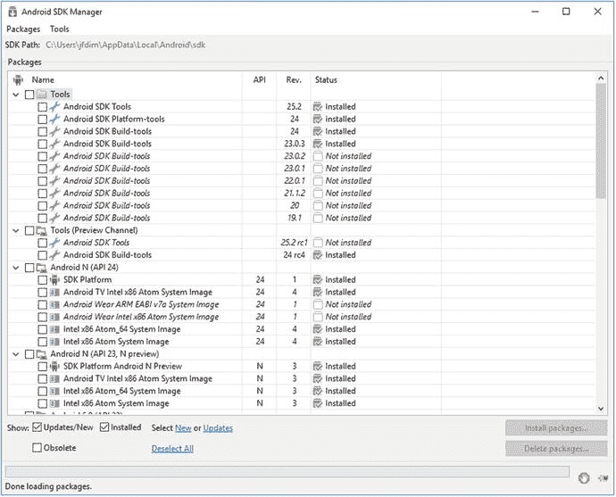

图 2-1. 首次使用 SDK 管理器

你可以随时使用 SDK 管理器来更新组件或安装新组件。安装过程完成后，你就可以继续进行开发环境设置的下一步了。

### Android Studio 快速巡览

IntelliJ，或称为 IntelliJ IDEA，是由 JetBrains 开发的一款 Java 集成开发环境。凭借其强大的功能集，它已成为 Java 开发的事实标准 IDE。Android Studio 基于 IntelliJ IDEA 的开源社区版。这意味着很多让 IntelliJ IDEA 成为杰出 Java 开发 IDE 的特性，也同样让 Android Studio 成为出色的 Android Java 开发 IDE。

IntelliJ 拥有许多通用功能，同时还拥有一整套专为辅助代码生成而设计的工具，这些工具已移植到 Android Studio 中。以下各节将重点介绍其中的一些功能。

#### 代码补全

代码补全是 IntelliJ 在 Android 开发中最常用的功能之一。假设我们创建了一个如下的函数：

```
String mystring;
public void setMyProperty(String mystring) {
this.mystring = mystring;
}
private void DoSomething(String someValue){
setMyProperty();
}
```

这个非常简单的函数接收一个字符串变量 `someValue`。注意，该函数调用了 `setMyProperty()`。我们可以假定 `setMyProperty()` 是一个接受字符串值的 setter 方法（如前面的代码示例所示）。将光标放在 `setMyProperty()` 的括号内，然后按下 `Ctrl+Alt+Space`。这将弹出 Android Studio 的自动补全窗口，如图 2-2 所示。

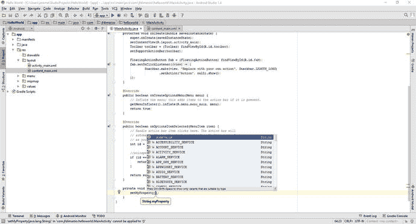

图 2-2. IntelliJ 自动补全窗口

关于此窗口，主要需要注意的是，它不仅为你列出了可以传递给 `setMyProperty()` 的可用的字符串值，而且还根据其认为你最可能使用的顺序对它们进行了排序。在此例中，`someValue`——即传递给函数的那个值——被列在首位。

#### 断点

在本书的后续部分，我将引导你完成游戏的调试。不过，我们先花点时间了解一下断点。断点就像是你代码中的书签，它告诉 Android Studio 在调试时你希望在哪里暂停执行。

要放置断点，请在代码编辑器的右侧空白处，单击你希望代码执行暂停的行旁边。图 2-3 展示了一个已设置的断点。

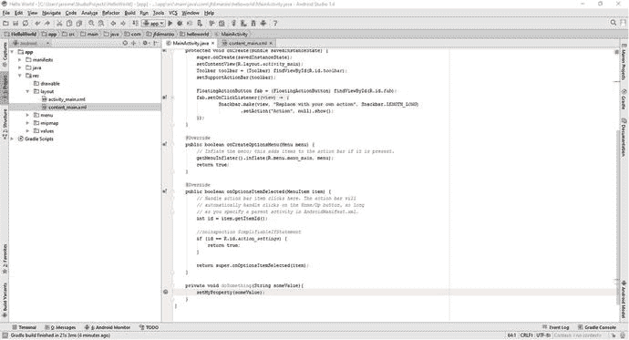

图 2-3. 一个已设置的断点

Android Studio 中断点的一个出色之处在于，你可以为它们设置条件。如果你右键单击断点，会出现一个可以展开的上下文菜单，如图 2-4 所示。

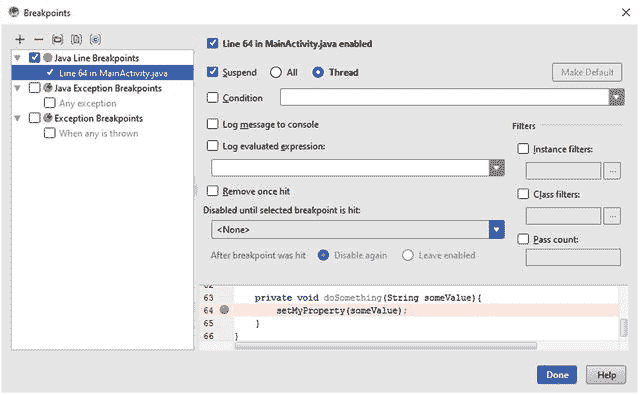

图 2-4. 断点上下文菜单

在此窗口中，你可以为你的断点设置条件。例如，如果你有一个名为 `myInteger` 的整数值并对其设置了断点，你可以设置一个条件，使得仅在 `myInteger` 的值大于 100 时才中断。

任何可以求值为 true 或 false 的条件都可以用作断点条件。

## 在 Android Studio 中创建新项目并编写你的代码

开发环境设置好后，我们现在可以在 Android Studio 中创建我们的第一个 Android 项目。内置的向导使得创建新的 Android 项目变得非常容易。


### 创建项目

创建新 Android 项目有两种方式。第一种是从菜单栏点击 `File >> New >> New Project`，这是 Android Studio 中创建新项目的标准方式，随后会打开 `Create New Project` 向导。

如果是首次打开 Android Studio，或者刚刚关闭了一个活动项目，只需在 `Welcome to Android Studio` 窗口中点击“Start a new Android studio project”，同样会打开该向导。

进入 `Create New Project` 向导对话框后，需要做出一些决定。请按照以下步骤操作：

1. 定义应用程序名称。这是 Android 启动器中显示的名称，我们将使用“Hello World”。
2. 指定包名。该包名下将存放所有 Java 代码。向导会根据项目名称尝试推测包名，但你可根据需求自由修改。本示例中我们将使用 `helloworld.com`。点击 `Next` 继续。
3. 选择 `Phone and Tablet` 作为目标运行设备形态。
4. 指定最低支持 SDK 版本。这是应用程序支持的最低 Android 版本，我们将选择 Android 7.0 (Nougat, API 24)（当 Nougat 完全发布时 API 级别可能为 25）。**注意**：在第 1 章中，你看到每个新 Android 版本都会向 Android 框架 API 添加新类。构建 SDK 指定你希望在应用中使用的 API 版本。例如，选择 Android 6.X 构建 SDK 就能使用最新最强的 API 功能。但这也存在风险：如果应用运行在更低 API 版本的设备上（例如 Android 4.3），当用户访问仅存在于版本 7 的 API 功能时，应用就会崩溃。在这种情况下，你需要在运行时检测支持的 SDK 版本，并仅在确认设备 Android 版本支持时才访问版本 7 的功能。这听起来很麻烦，但正如你将在第 5 章中看到的，良好的应用架构能让你轻松启用或禁用特定版本的功能，而无需冒崩溃风险。
5. 点击 `Next`。系统会显示对话框让你选择应用的默认 Activity。我们将选择 `Empty Activity` 并点击 `Next`。
6. 在最终对话框中，你可以修改向导为你创建的空白 Activity 的某些属性。我们将 Activity 名称设为 `HelloWorldActivity`，布局名称设为 `activity_hello_world`。点击 `Finish` 即可创建第一个 Android 项目。

**注意**：设置最低支持 SDK 版本会带来一些影响。应用只能运行在 Android 版本等于或高于指定最低 SDK 版本的设备上。当用户通过 Google Play 应用浏览商店时，只有具备适当最低 SDK 版本的应用才会显示。

### 探索项目

在 Package Explorer 中，你应该能看到 Hello World 项目。展开项目及其所有子项后，会看到类似图 2-5 的界面（如果布局与图 2-5 不同，请从布局上方的下拉框切换到 Project 视图）。这是大多数 Android 项目的通用结构。我们来简单探索一下。

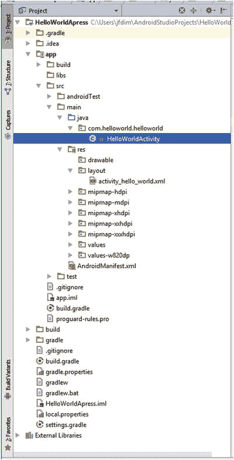

**图 2-5.** Hello World 项目结构

*   `src/` 包含所有 Java 源文件。注意包名与你之前在 `Create New Project` 向导中指定的名称一致。
*   `build/generated/` 包含 Android 构建系统生成的 Java 源文件，请勿修改，因为它们会被自动重新生成。
*   `libs/` 存放应用依赖的额外 JAR 文件。
*   `res/` 存放应用所需的资源，如图标、国际化字符串和通过 XML 定义的 UI 布局。与 assets 一样，资源也会被打包到应用中。
*   `AndroidManifest.xml` 描述了你的应用。它定义了构成应用的 Activity 和服务、（理论上）应用运行的最低和目标 Android 版本，以及需要的权限（例如访问 SD 卡或网络）。

你可以在 Project 视图中右键点击目标文件夹，选择 `New` 及相应资源类型，轻松添加新的源文件、文件夹和其他资源。不过目前我们保持所有设置不变。接下来，我们将研究如何修改基本应用设置和配置，使其尽可能兼容更多 Android 版本和设备。


### 编写应用程序代码

我们至今尚未编写一行代码，现在该改变这一状况了。新建项目向导为我们创建了一个名为`HelloWorldActivity`的模板活动类，当我们在模拟器或设备上运行应用时，该类将被显示。通过在项目视图中双击该文件来打开类的源代码，我们将用清单 2-1 中的代码替换该模板代码。

```
package com.helloworld.helloworld;
import android.support.v7.app.AppCompatActivity;
import android.os.Bundle;
import android.view.View;
import android.widget.Button;
public class HelloWorldActivity extends AppCompatActivity
implements View.OnClickListener {
Button button;
int touchCount;
@Override
public void onCreate(Bundle savedInstanceState) {
super.onCreate(savedInstanceState);
button = new Button(this);
button.setText( "Touch me!" );
button.setOnClickListener(this);
setContentView(button);
}
public void onClick(View v) {
touchCount++;
button.setText("Touched me " + touchCount + " time(s)");
}
}
```

我们来剖析清单 2-1 的代码，以便理解其功能。细节问题留待后续章节探讨，当前只需大致了解运行原理即可。

源代码文件以标准的 Java 包声明和几个导入语句开头。大多数 Android 框架类都位于`android`包中。

```
package com.helloworld.helloworld;
import android.support.v7.app.AppCompatActivity;
import android.os.Bundle;
import android.view.View;
import android.widget.Button;
```

接下来，我们定义`HelloWorldActivity`，并让它继承 Android 框架 API 提供的基类`AppCompatActivity`。活动（Activity）非常类似于经典桌面界面中的窗口，区别在于活动始终填充整个屏幕（根据设备不同，Android UI 顶部的通知栏和屏幕底部的“软键”除外）。此外，我们让`HelloWorldActivity`实现接口`OnClickListener`。如果你有其他 UI 工具包的经验，可能已经猜到接下来要做什么了。稍后会有更多说明。

```
public class HelloWorldActivity extends AppCompatActivity
implements View.OnClickListener {
```

我们让活动拥有两个成员：一个`Button`和一个`int`，用于记录`Button`被触摸的次数。

```
Button button;
int touchCount;
```

每个活动都可以实现`Activity.onCreate()`方法，该方法在活动第一次启动时由 Android 系统调用一次，这取代了通常用于创建类实例的构造函数。

```
@Override
public void onCreate(Bundle savedInstanceState) {
super.onCreate(savedInstanceState);
```

接下来，我们创建一个按钮并设置其初始文本。`Button`是 Android 框架 API 提供的众多控件之一。在 Android 中，UI 控件被称为视图（View）。注意，`Button`是我们的`HelloWorldActivity`类的一个成员，后续需要保留对其的引用。

```
button = new Button(this);
button.setText( "Touch me!" );
```

`onCreate()`中的下一行设置了按钮的`OnClickListener`。`OnClickListener`是一个回调接口，包含一个名为`OnClickListener.onClick()`的方法，当按钮被点击时会调用该方法。我们希望收到点击通知，因此让`HelloWorldActivity`实现该接口，并将其注册为按钮的`OnClickListener`。

```
button.setOnClickListener(this);
```

`onCreate()`方法的最后一行将按钮设置为活动的内容视图。视图可以嵌套，而活动的内容视图是这一层次结构的根节点。在这里，我们简单地将按钮设置为活动要显示的视图。为简化起见，我们不再深入探讨该内容视图下活动的布局细节。

```
setContentView(button);
}
```

下一步是接口要求活动必须实现的`OnClickListener.onClick()`方法。每次按钮被点击时都会调用该方法。在此方法中，我们递增`touchCount`计数器，并将按钮的文本设置为新的字符串。

```
public void onClick(View v) {
touchCount++;
button.setText("Touched me" + touchCount + "times");
}
```

因此，总结我们的`Hello World`应用，我们构建了一个包含按钮的活动。每次点击按钮时，都会相应地更新其文本。这可能算不上世界上最激动人心的应用，但足以用于后续演示。

请注意，我们从未需要手动编译任何内容。每次添加、修改或删除源文件或资源时，Android Studio 都会重新编译项目。编译过程的结果是一个 APK 文件，可随时部署到模拟器或 Android 设备上。APK 文件位于项目的`bin/`文件夹中。

你将在后续部分使用此应用，学习如何在模拟器实例和设备上运行并调试 Android 应用。

## 在设备或模拟器上运行应用

编写完应用代码的第一个迭代版本后，我们希望运行并测试，以找出潜在问题，或者只是惊叹于它的出色表现。实现这一目标有两种方式：

- 我们可以通过 USB 将应用运行在连接到开发电脑的真实设备上。
- 我们可以启动 SDK 附带的模拟器，并在其中测试应用。

无论哪种情况，在最终看到应用运行之前，都需要进行一些设置工作。

### 连接设备

在连接设备进行测试之前，我们必须确保操作系统能识别该设备。在 Windows 上，这需要安装合适的驱动程序，该驱动程序是我们之前安装的 SDK 的一部分。只需连接设备，然后按照 Windows 的标准驱动安装程序操作，将安装过程指向 SDK 安装根目录下的`driver/`文件夹即可。对于某些设备，你可能需要从制造商网站获取驱动程序。许多设备可以使用 SDK 附带的 Android ADB 驱动程序；不过，通常还需要将特定设备的硬件 ID 添加到 INF 文件中。快速在谷歌上搜索设备名称和“Windows ADB”，通常就能找到连接该设备所需的信息。

在 Linux 和 Mac OS X 上，通常无需安装驱动程序，因为操作系统已自带。根据你使用的 Linux 发行版，可能需要对 USB 设备发现进行一些调整，通常是通过为`udev`创建新的规则文件。这因设备而异。快速上网搜索应该能找到适用于你设备的解决方案。


### 创建安卓虚拟设备

SDK 附带一个可以运行安卓虚拟设备 (AVD) 的模拟器。安卓虚拟设备由特定安卓版本的系统映像、皮肤以及一组属性（包括屏幕分辨率、SD 卡大小等）组成。

要创建 AVD，您需要启动安卓虚拟设备管理器。为此，请单击 `Tools >> Android >> AVD Manager`。下面我们来一步步创建一个自定义 AVD：

1.  单击 AVD 管理器屏幕左下角的 `Create Virtual Device…` 按钮，这将打开虚拟设备配置对话框，如图 2-6 所示。

    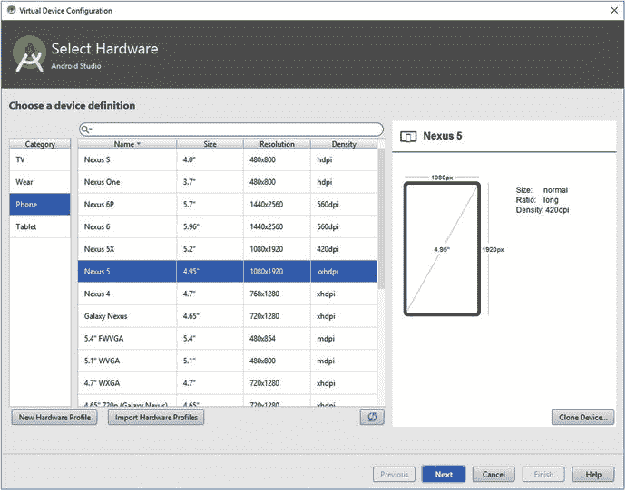

    图 2-6.

    虚拟设备配置对话框  
2.  选择正确的硬件配置文件。在本例中，我们将选择 `Phone >> Nexus 5`。单击 `Next` 继续。  
3.  系统映像指定了 AVD 应使用的安卓版本。对于我们简单的“Hello World”项目，您可以选择 `x86Images >> Jelly Bean`。注意：您可能需要先下载它才能选择。不过不用担心，AVD 管理器已简化此过程；只需单击“Download”链接，AVD 管理器将处理其余部分。  
4.  单击 `Finish` 创建您的模拟器。  

注意

除非您有几十种具有不同安卓版本和屏幕尺寸的设备，否则您应该使用模拟器对其他安卓版本和屏幕尺寸组合进行额外测试。

### 安装高级模拟器功能

目前有一些硬件虚拟化实现支持安卓模拟器，英特尔是其中之一。如果您拥有英特尔 CPU，您应该能够安装英特尔硬件加速执行管理器 (HAXM)，它与 x86 模拟器映像配合使用，可以虚拟化您的 CPU，并且运行速度比普通的完整模拟映像快得多。与此相结合，启用 GPU 加速（理论上）将提供一个合理的性能测试环境。我们使用这些工具当前版本的体验是，它们仍然有些小问题，但前景看起来不错，所以请务必关注 Google 的官方公告。与此同时，让我们开始设置：

1.  打开独立 SDK 管理器。找到 `Intel x86 Emulator Accelerator (HAXM installer)`，选中它并安装（参见图 2-7）。

    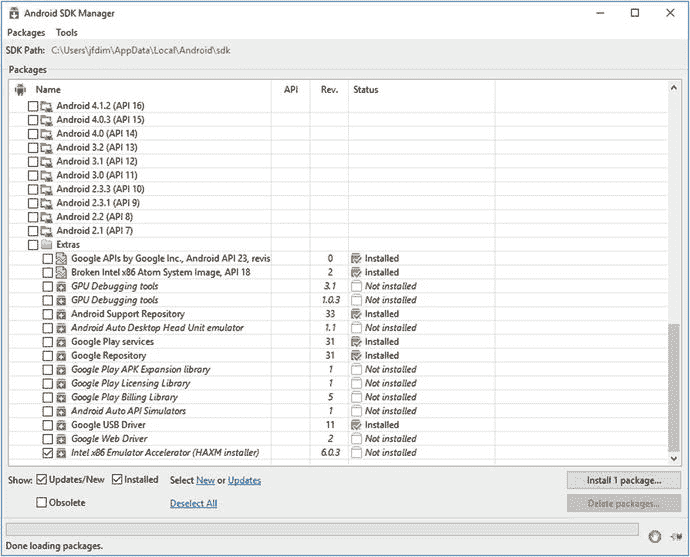

    图 2-7.

    选择 HAXM 安装程序  
2.  现在，通过打开 AVD 管理器并单击模拟器名称旁边的绿色铅笔图标来编辑模拟器的映像。将图形设置为 `Hardware GLES20`，如图 2-8 所示。注意，如果您在较旧的计算机上运行，并且您的 GPU 无法胜任模拟安卓屏幕的任务，您可能需要选择 `Software GLES20`。

    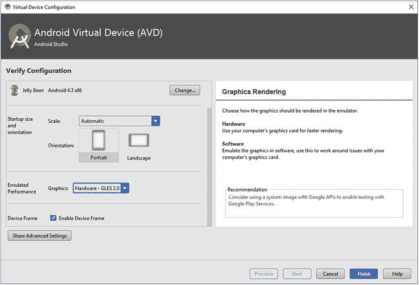

    图 2-8.

    创建启用 GPU 模拟的 x86 AVD

### 运行应用程序

现在您已经设置好了设备和 AVD，终于可以运行 `Hello World` 应用程序了。您可以在 Android Studio 中通过单击工具栏上的 `Run` 按钮轻松实现。Android Studio 随后将在后台执行以下步骤：

1.  如果自上次编译后有任何文件发生更改，则使用 Gradle 将项目编译为 APK 文件。  
2.  通过启动或复用已运行的、具有合适安卓版本的模拟器实例，或者在已连接的设备（该设备也必须至少运行您在创建项目时指定的最低 SDK 级别所对应的安卓版本）上部署并运行应用程序，来安装和运行该应用程序。  

如果您没有连接设备，ADT 插件将启动一个您在 AVD 管理器窗口中看到的 AVD。输出应如图 2-9 所示。

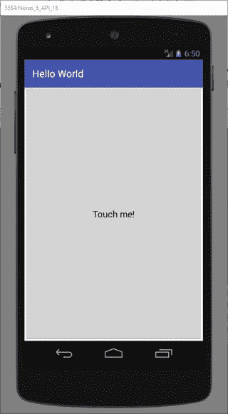

图 2-9.

正在运行的 Hello World 应用程序

模拟器的工作原理几乎与真实设备完全相同，您可以通过鼠标与它交互，就像在设备上用手指操作一样。以下是真实设备与模拟器的一些区别：

*   默认情况下，模拟器仅支持单点触控输入。只需使用鼠标光标，将其视为您的手指即可。要模拟多点触控，请在按住 Windows 上的 `CTRL` 键（或 Mac 上的 `Command` 键）的同时单击鼠标。
*   模拟器缺少一些应用程序，例如 Google Play 应用。
*   要更改屏幕上设备的方向，请勿倾斜您的显示器。而是单击 `Rotate Left` 或 `Rotate Right` 按钮。
*   模拟器可能运行缓慢。不要通过在模拟器上运行来评估您的应用程序的速度性能。
*   4.0.3 之前的模拟器版本仅支持 OpenGL ES 1.x。OpenGL ES 2.0 在 4.0.3 及更高版本的模拟器上受支持。我们将在第 7 章讨论 OpenGL ES。对于我们的基本测试，模拟器可以正常工作。一旦我们更深入地学习 OpenGL，您就需要一个真实设备进行测试，因为即使是我们使用过的最新模拟器，其 OpenGL 实现（虚拟化和软件）仍然有些小问题。目前，在模拟器上测试 OpenGL ES 应用程序时请谨慎行事。

稍微试玩一下，熟悉熟悉。

注意

启动一个新的模拟器实例可能需要相当长的时间（根据您的硬件，最多可能需要十分钟）。您可以保留模拟器在整个开发会话期间运行，这样就不必反复重启它，或者在创建或编辑 AVD 时勾选“Snapshot”选项，这将允许您保存和恢复虚拟机 (VM) 的快照，从而实现快速启动。


## 应用程序的调试与性能分析

有时，你的应用程序会出现意外行为，甚至崩溃。要弄清楚具体出了什么问题，你需要能够调试应用程序。

`Android Studio` 为我们提供了极其强大的 Android 应用程序调试功能。我们可以在源代码中设置断点、检查变量和当前堆栈跟踪等。

通常，你会在调试之前设置断点，以便检查程序在特定点时的状态。要设置断点，只需在 `Android Studio` 中打开源文件，然后点击你想要设置断点那一行前面的灰色区域即可。为了演示，请在 `HelloWorldActivity` 类的第 23 行执行此操作。这将使调试器在你每次点击按钮时停止。点击后，编辑器标签页应该会在该行前面显示一个小圆圈，如图 2-10 所示。你可以通过在编辑器标签页中再次点击断点来移除它。

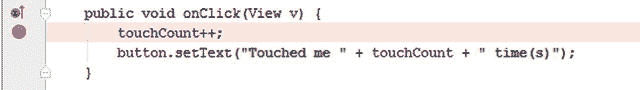

图 2-10. 设置断点

启动调试与运行应用程序非常相似，如上一节所述。不过，不要点击运行按钮，而是点击调试按钮。

让我们看看调试应用程序时，有哪些信息可供你使用。

-   左下角的调试器会显示所有当前正在运行的应用程序，以及如果这些应用程序以调试模式运行并被挂起时，它们所有线程的堆栈跟踪。
-   控制台窗口会打印来自 ADT 插件的消息，告诉我们它正在做什么。
-   Android Monitor 视图中的 `logcat` 视图将成为你开发旅程中最好的伙伴之一。该视图会显示来自你应用程序正在运行的模拟器/设备的日志输出。日志输出来自系统组件、其他应用程序和你自己的应用程序。当你的应用程序崩溃时，`logcat` 视图会显示堆栈跟踪，并允许你在运行时输出你自己的日志消息。我们将在下一节中更详细地了解 `logcat`。
-   变量视图对于调试尤其有用。当调试器命中一个断点时，你将能够检查和修改程序当前作用域内的变量。

如果你好奇的话，可能已经在运行中的应用程序里点击了按钮，看看调试器会如何反应。它会按照我们通过设置断点的指示，在第 23 行停止。你还会注意到，变量视图现在显示了当前作用域内的变量，这些变量包括活动本身（`this`）和方法的参数（`v`）。你可以通过展开这些变量来进一步深入查看。

调试视图会显示从当前堆栈向下到你当前所在方法的堆栈跟踪。请注意，你可能运行了多个线程，并且可以在调试视图中随时暂停它们。

最后，注意我们设置断点的那一行会被高亮显示，这表示程序当前暂停在代码中的那个位置。

你可以指示调试器执行当前语句（按 `F8`），单步进入当前方法中被调用的任何方法（按 `F7`），或者正常继续执行程序（按 `F9`）。或者，你也可以使用运行菜单中的项目来实现相同的功能。此外，请注意，除了我们刚才提到的，还有更多的单步执行选项。与所有事情一样，我们建议你通过实验来找出哪些方法对你有用，哪些没用。

**注意：** 好奇心是成功开发 Android 游戏的基础。你必须深入了解你的开发环境，才能最大限度地利用它。一本这种篇幅的书不可能解释 `Android Studio` 所有繁琐的细节，因此我们强烈建议你去尝试。

### LogCat

最有用的视图之一是 `logcat` 视图，我们在上一节中简要提到过它。

`Logcat` 是 Android 的事件日志系统，它允许系统组件和应用程序输出不同日志级别的日志信息。每条日志条目由时间戳、日志级别、产生日志的进程 ID、由记录日志的应用程序自身定义的标签以及实际的日志消息组成。

`logcat` 视图从连接的模拟器或设备收集并显示这些信息。图 2-11 显示了来自 `logcat` 视图的一些示例输出。

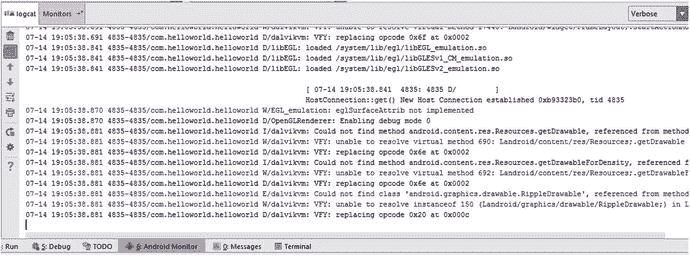

图 2-11. `logcat` 视图

如果当前连接了多个设备和模拟器，那么 `logcat` 视图将只输出其中一个的日志数据。

## 总结

Android 开发环境有时可能会让人望而生畏。幸运的是，你只需要掌握可用选项中的一部分就可以上手，本章应该已经为你提供了足够的信息来开始一些基本的编码。

本章最重要的收获是理解各个部分如何协同工作。JDK 和 Android SDK 为所有 Android 开发提供了基础。它们提供了在模拟器实例和设备上编译、部署和运行应用程序的工具。为了加快开发速度，我们使用 `Android Studio`，它帮我们完成了原本需要在命令行中使用 JDK 和 SDK 工具才能完成的所有繁重工作。`Android Studio` 提供了特定的功能，例如源代码编辑、`logcat` 输出和调试。

掌握所有这些的秘诀在于实践，尽管这听起来可能有些枯燥。在本书中，我们将实现多个项目，这些项目应该能让你对 Android 开发环境更加熟悉。不过，最终能否更上一层楼，取决于你自己。

掌握了这些信息，你就可以进入一开始阅读本书的原因了：开发游戏。


