# 3. 游戏开发入门指南

游戏开发之所以困难，并非因其高深莫测，而是因为在真正开始编写你梦想中的游戏之前，需要消化海量的信息。从编程角度来看，你需要处理诸如文件输入/输出（I/O）、用户输入处理、音频与图形编程以及网络代码等基础事务。而这些还仅仅只是开始！在此之上，你还需要构建实际的游戏机制。相关的代码同样需要合理架构，但如何设计出游戏的体系结构并非总是显而易见。你实际上必须决定如何让游戏世界运转起来。能否不依赖物理引擎，而是自己编写简单的模拟代码？游戏世界采用怎样的单位与比例尺度？这些又如何映射到屏幕上？

事实上，许多初学者还会忽略另一个问题：在开始动手编写代码之前，你首先得设计好游戏。无数项目从未见天日，始终停留在技术演示阶段，就是因为对游戏应如何运作始终缺乏清晰的概念。这里说的并非普通第一人称射击游戏的基础玩法机制——那反而是简单的部分：用`WASD`键控制移动加上鼠标即可完成。你需要思考诸如：是否有启动画面？它如何过渡？主菜单界面包含什么？实际游戏界面上有哪些平视显示器元素？按下暂停键会发生什么？设置界面应提供哪些选项？你的用户界面设计在不同屏幕尺寸和宽高比下如何呈现？

有趣的是，面对这些问题并没有万能灵药，也没有标准化的处理方式。我们不会假装能为你提供游戏开发的终极解决方案。相反，我们将尝试展示我们通常如何设计一款游戏。你可以选择完全借鉴，或根据自身需求进行修改。没有固定规则——适合你的方法就是好方法。但无论在代码层面还是纸面设计上，你都应始终追求简洁的解决方案。

## 游戏类型：各有所爱

项目启动时，你通常需要确定游戏所属的类型。除非你能想出完全新颖、前所未见的创意，否则你的游戏理念大概率会落入当前流行的几大类型范畴。大多数类型都有既定的机制标准（例如操作方案、特定目标等）。背离这些标准可能让游戏大获成功，因为玩家总是渴望新鲜感；但这也可能带来巨大风险，因此请谨慎考虑你新的平台跳跃/第一人称射击/即时战略游戏是否真的有受众。

让我们看看 Google Play 上一些更受欢迎的游戏类型实例。

## 休闲游戏

Google Play 上最大的游戏板块大概就是所谓的休闲游戏。那么，究竟什么是休闲游戏？这个问题没有确切答案，但休闲游戏确实具有一些共同特征。通常，它们拥有极高的易上手性，即使是非游戏玩家也能轻松掌握，这极大地扩展了潜在玩家群体。单个游戏回合通常只需几分钟。然而，休闲游戏简单玩法中蕴含的成瘾性往往能让玩家沉迷数小时。其具体玩法机制从极简的益智游戏，到一键式平台跳跃游戏，甚至简单到将纸团扔进篮筐。由于休闲游戏类型定义的模糊性，其可能性是无限的。

Imangi Studios 开发的《神庙逃亡》（见图 3-1）是休闲游戏的完美范例。你引导角色穿越布满障碍的多条跑道。整个操作体系基于滑动屏幕：向左或向右滑动，角色即转向对应方向（前提是前方有岔路）；向上滑动，角色跳跃；向下滑动，角色滑铲穿越障碍。沿途你可以收集各种奖励和增益道具。易于理解的操作、清晰的目标以及精美的 3D 画面，使这款游戏在苹果 App Store 和 Google Play 上迅速走红。

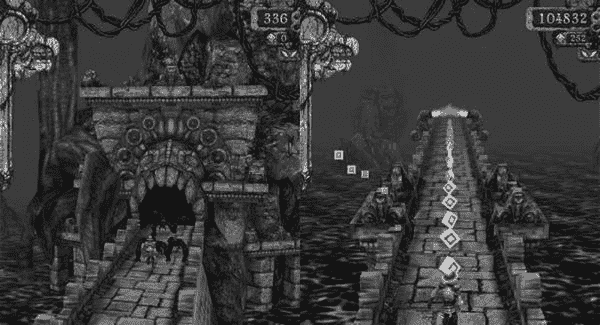

图 3-1. Imangi Studios 出品的《神庙逃亡》

由单人团队 Psym Mobile 开发的《宝石矿工：深挖》（见图 3-2）则完全是另一回事。它是同一家公司大获成功的《宝石矿工》的续作，仅对原作进行了小幅迭代。你扮演一名矿工，试图在随机生成的矿洞中寻找有价值的矿石、金属和宝石。这些宝藏可以兑换更好的装备，从而挖掘更深，寻获更珍贵的宝物。该游戏利用了人们对“刷宝”概念的偏爱：无需太多努力，你就能持续获得新玩意作为奖励，让你欲罢不能。该游戏的另一个有趣之处在于矿洞是随机生成的。这在不增加额外游戏机制的前提下，极大地提升了游戏的重玩价值。为了增加趣味性，游戏还提供了挑战关卡，设有具体目标和任务，完成后可获得奖牌。这是一个非常轻量级的成就系统。

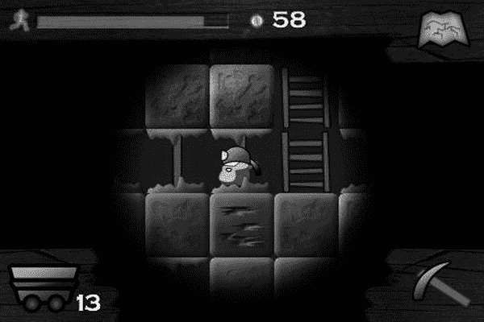

图 3-2. Psym Mobile 出品的《宝石矿工：深挖》

这款游戏的另一个有趣之处在于其盈利模式。尽管当前“免费增值”游戏（游戏本身免费，但附加内容价格往往高得离谱）大行其道，它却采用了“老派”的付费模式。每份售价约 2 美元，下载量超过 10 万次，对于一款非常简单的游戏来说，这相当赚钱。这种销量在安卓平台上实属罕见，尤其是考虑到 Psym Mobile 基本没为这款游戏做任何广告。前作的成功及其庞大的玩家基础，几乎确保了续作的成功。

要列出休闲游戏类别下所有可能的子类型，恐怕能填满这本书的大半篇幅。在这个类型中可以找到更多创新的游戏概念，值得在应用市场中浏览该类别以获取灵感。


## 益智游戏

益智游戏无需介绍。我们都熟悉像 `Tetris`（俄罗斯方块）和 `Bejeweled`（宝石迷阵）这样的经典游戏。它们是安卓游戏市场的重要组成部分，深受各个年龄段人群的欢迎。与通常只是将三个同色或同形物体放在一起的 PC 益智游戏不同，安卓上的许多益智游戏偏离了经典的三消模式，采用了更精巧的、基于物理的谜题。

`ZeptoLab` 出品的 `Cut the Rope`（割绳子）（见图 3-3）是物理益智游戏的绝佳范例。游戏的目标是喂食每个关卡中的小生物糖果。玩家需要切断糖果连着的绳子，将其放入气泡中使其上浮，绕过障碍物等方式，引导糖果到达小生物处。每个游戏对象都在一定程度上进行了物理模拟。游戏由 2D 物理引擎 `Box2D` 驱动。`Cut the Rope` 在 iOS App Store 和 Google Play 上迅速获得成功，甚至被移植到了浏览器中运行！

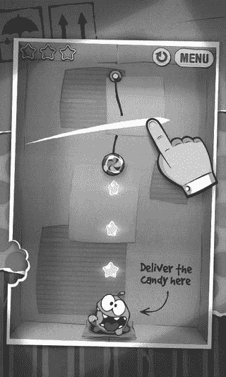

**图 3-3.** `ZeptoLab` 出品的 `Cut the Rope`

`Bithack`（另一家一人公司）出品的 `Apparatus`（见图 3-4）深受老式 Amiga 和 PC 经典游戏 `Incredible Machines` 的影响。和 `Cut the Rope` 一样，它也是一款物理益智游戏，但赋予了玩家更多掌控如何解决每个谜题的自由度。各种构建模块，如可以钉在一起的简单原木、绳索、马达等，可以创造性地组合起来，将一个蓝色球从关卡一端运送到目标区域。

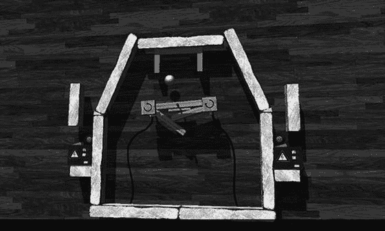

**图 3-4.** `Bithack` 出品的 `Apparatus`

除了包含预设关卡的战役模式外，还有一个沙盒环境，你可以在这里尽情发挥创造力。更棒的是，你自制的奇妙装置可以轻松与他人分享。`Apparatus` 的这一特性保证了即使玩家通关，仍有海量额外内容等待探索。

当然，你也能在市场上找到各种 `Tetris` 的克隆版、三消游戏以及其他标准模式的游戏。

#### 动作与街机游戏

动作与街机游戏通常能充分发挥安卓平台的潜力。其中许多游戏拥有令人惊叹的 3D 视觉效果，展示了当前一代硬件所能实现的效果。这一类型包含许多子类型，包括竞速游戏、射击游戏、第一人称和第三人称射击游戏以及平台游戏。随着大型游戏工作室开始将其游戏移植到安卓平台，安卓市场的这一细分领域在过去几年中获得了极大的发展。

`MADFINGER Games` 出品的 `SHADOWGUN`（见图 3-5）是一款视觉惊艳的第三人称射击游戏，充分展示了现代安卓手机和平板电脑的计算能力。与许多 AAA 大作一样，它同时登陆了安卓和 iOS 平台。`SHADOWGUN` 利用了跨平台游戏引擎 `Unity`，是展示 `Unity` 在移动设备上强大能力的典范之一。在玩法上，它是一款双摇杆射击游戏，甚至包含了在板条箱后掩护和其他通常在移动动作游戏中找不到的精巧机制。

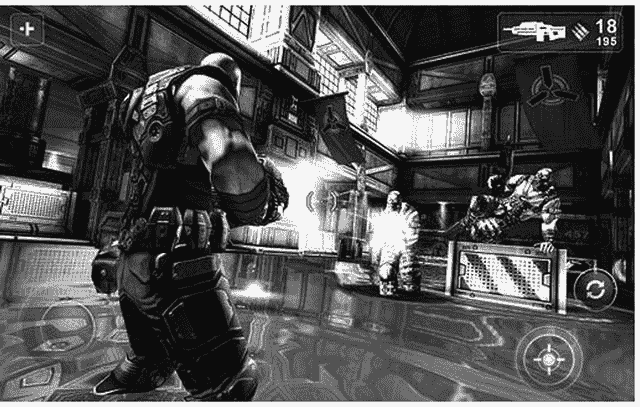

**图 3-5.** `MADFINGER Games` 出品的 `SHADOWGUN`

虽然很难获取确切数字，但安卓市场的统计数据似乎表明，`SHADOWGUN` 的下载量与之前讨论的 `Gem Miner` 大致相当。这表明，创建一个成功的安卓游戏并不一定需要一个庞大的 AAA 团队。

`Tank Hero: Laser Wars`（坦克英雄：激光战争）（见图 3-6）是 `Tank Hero` 的续作，由一个非常小的独立团队 `Clapfoot, Inc.` 开发。你指挥一辆坦克，可以为其装备越来越疯狂的配件，比如射线枪、声波炮等等。关卡是狭小封闭的平坦战场，散布着可交互元素，你可以利用它们来消灭战场上的所有敌方坦克。操作坦克只需简单点击敌人或战场区域，坦克便会做出相应的动作（分别为射击或移动）。虽然它在视觉上无法与 `SHADOWGUN` 相提并论，但它拥有相当出色的动态光照系统。这里可以学到的教训是，即使是小团队，如果能对内容施加限制，例如限制战场大小，也能创造出视觉上令人愉悦的体验。

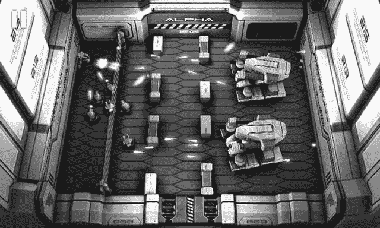

**图 3-6.** `Clapfoot Inc.` 出品的 `Tank Hero: Laser Wars`

`Four Pixels` 出品的 `Dragon, Fly!`（见图 3-7）是对 `Andreas Illiger` 那款极其成功的游戏 `Tiny Wings` 的改编，后者在撰写本书时仅限于 iOS 平台。你控制一只小龙，在近乎无尽的斜坡上上下翻飞，同时收集各种宝石。如果小龙加速足够快，它就可以起飞翱翔。操作方法是在下坡时触摸屏幕。游戏机制极其简单，但随机生成的世界和对更高分数的渴望驱使玩家不断挑战。

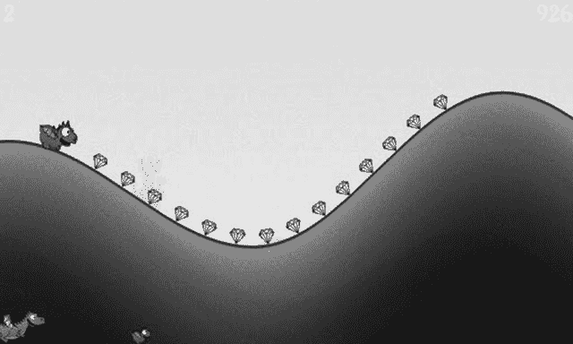

**图 3-7.** `Four Pixels` 出品的 `Dragon, Fly!`

`Dragon, Fly!` 很好地说明了一种现象：特定的移动游戏类型常常首先出现在 iOS 上。即便需求巨大，原创者往往也不会将他们的游戏移植到安卓平台。其他游戏开发者便可以介入，为安卓市场提供一个替代版本。但如果这款“灵感之作”抄袭成分过多，也可能会完全适得其反，正如 `Zynga` 模仿 `NimbleBit` 的 `Tiny Tower` 时所遭遇的情况。扩展一个创意通常会受到欢迎，而公然抄袭另一款游戏则通常会招致敌意。

`Rockstar Games` 出品的 `Max Payne`（马克思·佩恩）（见图 3-8）是 2001 年发行的一款老 PC 游戏的移植版。我们在此提及它，是为了说明一个日益增长的趋势：大型发行商将其旧有知识产权移植到移动平台。`Max Payne` 讲述了一名警察的家人被贩毒集团杀害的故事。为了复仇，马克思大开杀戒。整个故事被嵌入黑色电影风格的叙事中，通过连环漫画和过场短片来呈现。原作严重依赖我们在 PC 上玩射击游戏时惯用的标准鼠标/键盘组合操作方式。`Rockstar Games` 成功地创建了基于触摸屏的操作方式。虽然控制精度不如 PC，但仍然足够让游戏在触摸屏上玩得愉快。

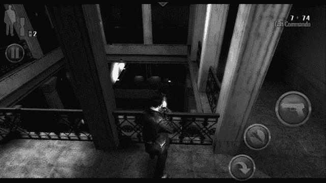

**图 3-8.** `Rockstar Games` 出品的 `Max Payne`

动作与街机游戏在市场上的占比仍然有些不足。玩家们渴望优秀的动作类游戏，所以这或许可以成为你的专属领域！


## 塔防游戏

鉴于塔防游戏在安卓平台上的巨大成功，我们认为有必要将其作为独立游戏类型进行讨论。塔防游戏最初作为电脑即时战略游戏的变体，由模组社区开发而流行起来，随后很快演变出独立游戏版本。目前，塔防游戏是安卓平台上最畅销的游戏类型。

在典型的塔防游戏中，通常会有一些邪恶力量派遣怪物以“波次”形式攻击你的城堡/基地/水晶/任何你能想到的目标。你的任务是在游戏地图上这个特殊地点布置防御炮塔，射击来袭的敌人。每击杀一个敌人，你通常会获得一定数量的金钱或积分，可用于购买新炮塔或升级现有装备。游戏概念极为简单，但要让这类游戏达到完美的平衡却相当困难。

DroidHen 开发的《防御者》（`Defender`，见图 3-9）是 Google Play 上最受欢迎的免费游戏之一。它对塔防玩法进行了巧妙简化，在 Flash 游戏玩家中广为人知。游戏中你不需要建造多个炮塔，而是控制一座可升级的单一炮塔，升级选项涵盖攻击力提升到分裂箭矢等多种功能。除了主武器，还有不同的法术技能树可供施放，用以扫荡入侵的敌军。这款游戏的优点在于简单易懂、制作精良。画面干净整洁，主题搭配和谐，而 DroidHen 对平衡性的精准把控会让你不由自主地玩得远超预期。游戏在变现方面也设计得很聪明：你既能获取大量免费升级，也能让性急的玩家用真实货币提前购买物品，获得即时满足感。

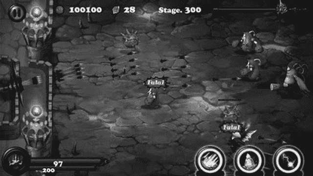

图 3-9. DroidHen 开发的《防御者》（`Defender`）

《防御者》虽然只有一个关卡，但通过变换不同的敌人带来一波又一波的攻击。由于画面非常精美，你会将注意力更多地放在敌人、武器和法术上，几乎察觉不到它只有一个关卡。总的来说，这为小型开发团队在合理时间内打造出休闲玩家喜爱的游戏类型提供了良好启发。

## 社交游戏

你该不会以为我们会跳过社交游戏吧？在当今的现代科技领域，“社交”这个词可是最热门的话题（也是最赚钱的领域之一）。什么是社交游戏？就是你与朋友和熟人分享体验、通常在病毒式互动循环中相互交流的游戏。这种模式威力惊人，一旦运营得当，就能像滚雪球一样走向巨大的成功。

Zynga 开发的《与朋友拼词》（`Words with Friends`，见图 3-10）为字母牌拼词这一成熟游戏类型加入了回合制玩法。这款游戏真正的创新之处在于集成了聊天功能和多局游戏同时进行。你可以同时进行多局游戏，从而免去了等待单一游戏回合的烦恼。约翰·梅尔（John Mayer）在一篇知名评论中说道：“《与朋友拼词》应用就是新的推特。”这很好地概括了 Zynga 如何充分利用社交空间，并将其融入一款极易上手的游戏中。

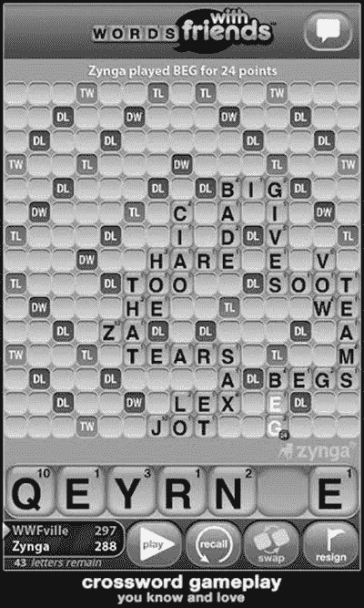

图 3-10. Zynga 开发的《与朋友拼词》（`Words with Friends`）

OMGPOP 开发的《你画我猜》（`Draw Something`，见图 3-11）是一款玩家猜测他人一笔一划画作内容的游戏。它不仅有趣，而且其他玩家还会将自己的画作提交给朋友，由此产生了众包内容的奇妙效果。这款游戏乍一看像是个基础的手指绘画应用，但玩上几分钟，你就能立刻体会到它的精髓：你会迫不及待地当场提交自己的猜测，然后继续猜下一幅画，自己再画一幅，拉上朋友一起享受乐趣。

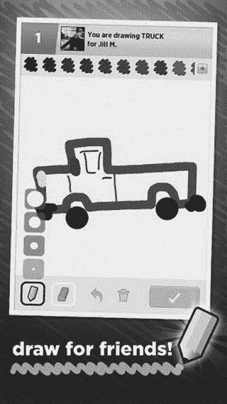

图 3-11. OMGPOP 开发的《你画我猜》（`Draw Something`）

#### 超越类型

许多新游戏、新创意、新类型和新应用起初看起来并不像游戏，但实际却是。因此，在进入 Google Play 时，很难精确界定什么才算真正的创新。我们见过这样的游戏：平板电脑充当游戏主机，连接到电视上，再通过蓝牙连接多部安卓手机，每部手机都作为控制器使用。休闲社交游戏已经风靡了相当长的时间，许多在苹果平台走红的游戏也已被移植到安卓平台。难道所有可能性都已经穷尽了吗？绝非如此！对于那些愿意在新游戏创意上承担风险的人来说，总会有尚未开发的市场和游戏点子。硬件性能越来越强大，这开辟了过去因 CPU 算力不足而无法实现的全新可能性领域。

现在，既然你已经了解了安卓平台已有的游戏类型，我们建议你启动 Google Play 应用，试试上面提到的一些游戏。关注它们的结构（例如，哪些界面会跳转到哪些界面，每个按钮的功能是什么，游戏元素如何相互交互等）。要感受这些东西，实际上需要带着分析思维去玩游戏。暂时抛开娱乐因素，专注于解构游戏。完成之后，再回来继续阅读。我们将从纸面设计一个非常简单的游戏。

## 游戏设计：笔锋胜于代码

正如我们之前所说，启动 IDE 随手拼凑一个漂亮的技术演示确实很有诱惑力。如果你想制作实验性游戏机制的原型并验证其可行性，这倒也无妨。但一旦完成，请扔掉这个原型。拿起笔和纸，坐在舒适的椅子上，仔细思考游戏的所有高层概念。暂时不要关注技术细节——那是之后要做的事。现在，你应该专注于设计游戏的用户体验。最好的方法就是勾勒出以下内容：

*   核心游戏机制，包括游戏关卡概念（如适用）
*   包含主要角色的粗略背景故事
*   物品、强化道具或其他可改变角色、机制或环境的元素清单（如适用）
*   基于背景故事和角色的美术风格草图
*   所有涉及界面的草图、界面转换示意图以及触发转换的条件（例如游戏结束状态）

如果你之前瞥过目录，就会知道我们将在安卓上实现《贪吃蛇》（Snake）。《贪吃蛇》是手机市场上最受欢迎的游戏之一。如果你还不了解它，请在继续阅读前先上网查查。我们在这里等你……

欢迎回来。既然你已经了解了《贪吃蛇》是什么，让我们假设这是我们自己刚刚想到的创意，并开始为其设计布局。先从游戏机制开始吧。


### 核心游戏机制

开始之前，先列出我们需要的物品清单：

- 一把剪刀
- 书写工具
- 大量纸张

在这个游戏设计阶段，一切都在不断变化中。我们建议你别费力在`Paint`、`Gimp`或`Photoshop`中精心绘制精美图片，而是用纸张制作基础构件，在桌面上不断调整摆放位置，直到满意为止。这样你可以轻松进行物理层面的调整，无需受鼠标操作束缚。当纸质设计完成后，可以拍照或扫描存档备用。现在让我们开始创建核心游戏界面的基础构件。图 3-12 展示了我们设计的核心游戏机制所需的版本。

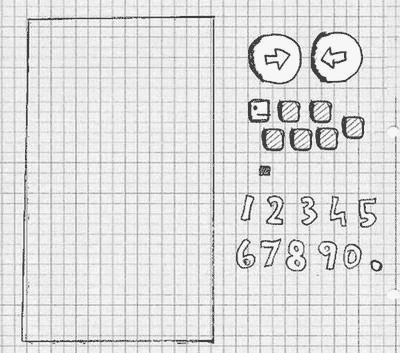

图 3-12. 游戏设计构件

最左侧的矩形是屏幕，尺寸大致相当于`Nexus One`屏幕。我们将在此放置所有其他元素。接下来的构件是两个方向箭头按钮，用于控制蛇的移动。最后是蛇头、几节尾部部件，以及可被蛇吃掉的食物。我们还剪裁了一些数字，用于显示得分。图 3-13 展示了对初始游戏场的设想。

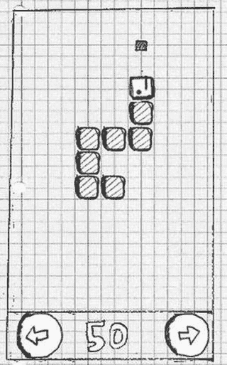

图 3-13. 初始游戏场

现在定义游戏机制：

- 蛇沿头部朝向方向前进，并拖拽尾部移动。头部和尾部由大小相同的部件组成，外观差异不大。
- 如果蛇超出屏幕边界，会从另一侧重新进入屏幕。
- 按下右箭头或左箭头按钮时，蛇会顺时针（右）或逆时针（左）转向 90 度。
- 如果蛇撞到自己（例如尾部某个部分），游戏结束。
- 如果蛇头撞到食物，食物消失，得分增加 10 分，同时在游戏场上未被蛇占据的位置生成新食物。蛇也会增加一节尾部，新尾部连接在蛇的末端。

对于如此简单的游戏而言，这段描述相当复杂。注意我们按照难度递增的顺序排列了这些条目。其中蛇吃掉场上食物的行为机制可能是最复杂的。当然，更复杂的游戏无法用如此简洁的方式描述。通常你需要将这些机制拆分成独立部分，分别设计，最后在流程结束时整合连接。

最后一条游戏机制意味着：游戏终将结束，因为屏幕上的所有空间最终都会被蛇占据。

既然我们独创的游戏机制看起来不错，现在来为它构思一个背景故事吧。

### 故事与艺术风格

虽然设计一个包含僵尸、飞船、矮人和大量爆炸场面的史诗故事会很有趣，但我们必须意识到资源有限。如图 3-12 所示，我们的绘画能力有所欠缺。就算性命攸关，我们也画不出僵尸。于是我们采取了任何自重独立游戏开发者都会做的选择：采用涂鸦风格，并相应调整设定。

欢迎来到诺姆先生的世界。诺姆先生是一条纸蛇，他总渴望吃掉从不明来源滴落在纸上的墨水渍。诺姆先生极其自私，只有一个并不崇高的目标：成为世界上最大的墨水纸蛇！

这个小背景故事让我们能定义更多内容：

- 艺术风格是涂鸦风。我们后续会将纸质构件扫描进游戏，用作图形资源。
- 由于诺姆先生是个特立独行的角色，我们会稍作修改，给他一副像样的蛇脸，再加一顶帽子。
- 可食用物将变成一组墨水渍。
- 我们将让诺姆先生每次吃掉墨水渍时发出咕噜声，以此提升游戏的音频体验。
- 与其用“涂鸦蛇”这样无聊的标题，不如将游戏命名为“诺姆先生”——一个更具吸引力的名字。

图 3-14 展示了诺姆先生的完整风采，以及替代原始方块的一组墨水渍。我们还草拟了一个涂鸦风格的诺姆先生 Logo，可在游戏中反复使用。

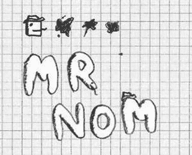

图 3-14. 诺姆先生、他的帽子、墨水渍及 Logo


## 屏幕与切换

在确定了游戏机制、背景故事、角色和美术风格后，我们现在可以开始设计游戏屏幕及其之间的切换。不过，首先需要准确理解屏幕的构成要素：

-   一个屏幕是填充整个显示区域的原子单元，它恰好负责游戏的一个部分（例如，主菜单、设置菜单或正在发生动作的游戏屏幕）。
-   一个屏幕可由多个组件构成（例如，按钮、控件、抬头显示或游戏世界的渲染画面）。
-   一个屏幕允许用户与屏幕上的元素进行交互。这些交互可以触发屏幕切换（例如，在主菜单上按下“新游戏”按钮，当前激活的主菜单屏幕可被切换为游戏屏幕或关卡选择屏幕）。

基于这些定义，我们可以开动脑筋，为我们的《Nom 先生》游戏设计所有屏幕。

游戏首先向玩家呈现的是主菜单屏幕。一个好的主菜单屏幕应具备哪些要素？

-   可能有些人不知道“贪吃蛇”游戏。让我们通过一个“帮助”按钮为他们提供一些帮助，该按钮将切换至帮助屏幕。
-   虽然我们的音效设计会很棒，但有些玩家可能仍喜欢静音游戏。给他们一个象征性的开关按钮来启用和禁用声音即可解决问题。
-   原则上，显示游戏名称是个好主意，因此我们会放置《Nom 先生》的标识。
-   为了使整体外观更协调，我们还需要一个背景。我们将复用游戏场地的背景。
-   玩家通常想要玩游戏，所以让我们添加一个“开始”按钮。
-   这将是我们的第一个交互组件。
-   玩家希望跟踪自己的进度和成就，因此我们还将添加一个高分按钮，如图 3-15 所示，这是另一个交互组件。

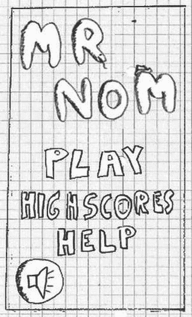

图 3-15. 主菜单屏幕

我们如何实际布局这些屏幕组件取决于个人品味。你可以开始研究计算机科学的一个子领域——人机交互（HCI），以获取关于如何向用户呈现应用程序的最新科学观点。不过，对于《Nom 先生》来说，这或许有些大材小用了。我们最终采用了图 3-15 所示的简洁设计。

请注意，所有这些元素（标识、菜单按钮等）都是独立的图片。

从主菜单屏幕开始，我们立即获得一个优势：可以直接从交互组件派生出更多屏幕。就《Nom 先生》而言，我们将需要一个游戏屏幕、一个高分屏幕和一个帮助屏幕。由于唯一的设置选项（声音）已经出现在主菜单屏幕上，因此无需包含单独的设置屏幕。

我们先暂不考虑游戏屏幕，集中精力设计高分屏幕。我们决定高分记录将本地存储在《Nom 先生》中，因此我们只追踪单个玩家的成就。我们还决定只记录最高分的前五名。因此，高分屏幕将如图 3-16 所示：顶部显示 `"HIGHSCORES"` 文本，接着是五个最高分，以及一个带有箭头标记的按钮，表示可以切换回某处。我们将再次复用游戏场地的背景，因为我们喜欢这种经济实惠的做法。

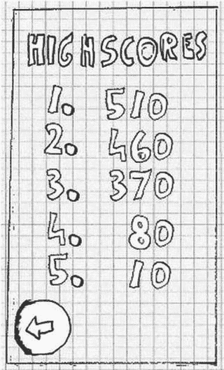

图 3-16. 高分屏幕

接下来是帮助屏幕。它将向玩家介绍背景故事和游戏机制。这些信息量太大，无法在一个屏幕上呈现。因此，我们将帮助屏幕拆分成多个屏幕。每个屏幕将向用户传达一条关键信息：Nom 先生是谁、他想要什么，如何控制 Nom 先生使他吃掉墨渍，以及 Nom 先生不喜欢什么（即吃掉自己）。总共是三个帮助屏幕，如图 3-17 所示。请注意，我们在每个屏幕上添加了一个按钮，以提示还有更多信息可阅读。稍后我们会将这些屏幕串联起来。

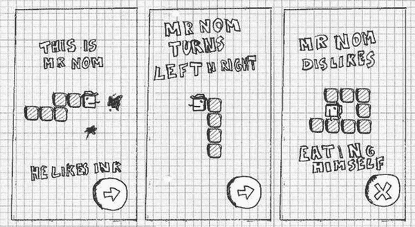

图 3-17. 帮助屏幕

最后是我们的游戏屏幕，我们之前已经看到它的运行情况。不过，还有一些细节我们未曾提及。首先，游戏不应立即开始；我们应该给玩家一些时间做准备。因此，屏幕会以请求触摸屏幕开始吞噬的提示开始。这不需要一个单独的屏幕；我们将直接在游戏屏幕中实现这个初始暂停。

说到暂停，我们还将添加一个按钮，允许用户暂停游戏。一旦暂停，我们还需要给用户一个恢复游戏的方式。在这种情况下，我们只需显示一个大的“继续”按钮。在暂停状态下，我们还将显示另一个按钮，允许用户返回主菜单屏幕。另外再添加一个“退出”按钮，让用户返回主菜单。

如果 Nom 先生咬到了自己的尾巴，我们需要通知玩家游戏结束。我们可以实现一个单独的游戏结束屏幕，或者停留在游戏屏幕内，仅覆盖显示一个大的“游戏结束”消息。在这里，我们选择后者。最后，我们还将显示玩家获得的分数，以及一个返回主菜单的按钮。

将游戏屏幕的这些不同状态视为子屏幕。我们共有四个子屏幕：初始的准备就绪状态、正常的游戏进行状态、暂停状态和游戏结束状态。图 3-18 展示了这些子屏幕。

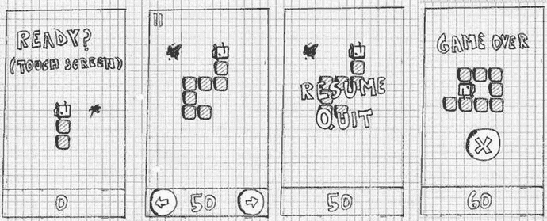

图 3-18. 游戏屏幕及其四种不同状态

现在是将这些屏幕串联起来的时候了。每个屏幕都有一些交互组件，用于切换到另一个屏幕。

-   从主菜单屏幕，我们可以通过各自的按钮进入游戏屏幕、高分屏幕和帮助屏幕。
-   从游戏屏幕，我们可以通过暂停状态下的按钮或游戏结束状态下的按钮返回主菜单屏幕。
-   从高分屏幕，我们可以返回主菜单屏幕。
-   从第一个帮助屏幕，我们可以进入第二个帮助屏幕；从第二个到第三个；从第三个到第四个；从第四个，我们将返回主菜单屏幕。

这就是我们所有的切换！看起来没那么复杂，对吧？图 3-19 以可视化方式总结了所有切换，箭头从每个交互组件指向目标屏幕。我们还标注了构成我们屏幕的所有元素。

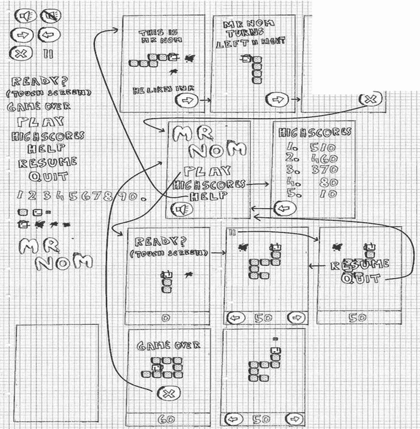

图 3-19. 所有设计元素与切换

我们现在已经完成了第一个完整的游戏设计。剩下的事情就是实现了。我们究竟如何将这个设计变成一个可执行的游戏呢？

> **注：** 我们刚刚用来创建游戏设计的方法对于小型游戏来说非常不错。这本书名为《Android 游戏开发入门》，所以这是一种合适的方法。对于较大的项目，你很可能会在团队中工作，每个团队成员专攻一个方面。虽然在该情境下你仍然可以应用此处描述的方法，但可能需要根据不同的环境进行一些调整和优化。你还会以更迭代的方式工作，不断精炼你的设计。


## 代码：核心细节

这又是一个鸡生蛋蛋生鸡的问题：我们只想了解与游戏编程相关的 Android API，但还不知如何实际编写游戏程序。虽然我们有了游戏设计思路，但将其转化为可执行程序仍如同巫术般神秘。在接下来的章节中，我们将概述构成游戏的基本元素。我们会查看一些伪代码形式的接口，后续将使用 Android 提供的功能来实现这些接口。接口之所以强大有两个原因：它们让我们无需了解实现细节就能专注于语义，同时也允许我们日后更换实现方式（例如，我们可以用 OpenGL ES 代替 2D CPU 渲染来显示"诺姆先生"）。

每个游戏都需要一个基础框架，用于抽象化并简化与底层操作系统的通信。这通常分为以下几个模块：

*   **应用程序与窗口管理**：负责创建窗口，并处理窗口关闭、Android 应用暂停/恢复等事务。
*   **输入**：与窗口管理模块相关，负责追踪用户输入（即触摸事件、按键、外设和加速计读数）。
*   **文件 I/O**：允许我们从磁盘将资源文件的字节数据读入程序。
*   **图形**：这可能是除游戏本体外最复杂的模块。负责加载图形并绘制到屏幕上。
*   **音频**：负责加载和播放所有音频内容。
*   **游戏框架**：将上述所有模块整合在一起，为编写游戏提供一个易用的基础。

每个模块都由一个或多个接口组成。每个接口至少有一个具体实现，该实现基于底层平台（此处为 Android）提供的功能来应用接口的语义。

> **注意**  
> 是的，我们从上述列表中刻意省略了网络功能。本书不会实现多人游戏。根据游戏类型的不同，这属于较为高级的话题。如果你对此感兴趣，可以在网络上使用 Google Play 游戏服务找到一系列教程。（[`www.gamedev.net`](http://www.gamedev.net) 是一个不错的起点。）

在接下来的讨论中，我们将尽可能保持平台无关性。这些概念在所有平台上都是相通的。

## 应用程序与窗口管理

游戏就像任何其他具有用户界面的计算机程序一样。它包含在某种窗口中（如果底层操作系统的 UI 范式是基于窗口的，而所有主流操作系统都是如此）。窗口充当容器，我们基本上将其视为绘制游戏内容的画布。

大多数操作系统允许用户以特殊方式与窗口交互，而不仅仅是触摸客户区域或按键。在桌面系统上，通常可以拖动窗口、调整大小或将其最小化到任务栏。在 Android 中，调整大小被适应方向变化所取代，而最小化类似于通过按下主页按钮将应用程序置于后台，或作为来电的反应。

应用程序与窗口管理模块还负责实际设置窗口，并确保窗口由一个 UI 组件填充——我们后续可以渲染到该组件，并接收用户通过触摸或按键形式提供的输入。该 UI 组件可能通过 CPU 渲染，也可能是硬件加速的（如 OpenGL ES 的情况）。

应用程序与窗口管理模块没有一套具体的接口。我们稍后会将其与游戏框架合并。我们需要记住的是必须管理的应用程序状态和窗口事件：

*   **创建**：在窗口（因此也是应用程序）启动时调用一次。
*   **暂停**：当应用程序因某种机制而被暂停时调用。
*   **恢复**：当应用程序恢复且窗口再次位于前台时调用。

> **注意**  
> 此时一些 Android 发烧友可能会不以为然。为什么只使用一个窗口（Android 中的 activity）？为什么不为游戏使用多个 UI 控件——比如实现游戏可能需要的复杂 UI？主要原因是我们希望完全控制游戏的外观和感觉。这也让我们能专注于 Android 游戏编程，而非 Android UI 编程——关于后者已有更出色的书籍（例如，Mark Murphy 的优秀著作《Beginning Android 3》，Apress 出版社，2011 年）。


### 输入

用户无疑会希望以某种方式与我们的游戏进行交互。这正是输入模块发挥作用的地方。在大多数操作系统上，触摸屏幕或按下按键等输入事件会被分发给当前获得焦点的窗口。然后，窗口会进一步将事件分发给拥有焦点的 UI 组件。这个分发过程通常对我们来说是透明的；我们唯一关心的是从获得焦点的 UI 组件获取事件。操作系统的 UI API 提供了一种机制，可以让我们接入事件分发系统，从而轻松地注册和记录事件。这种事件的钩取和记录就是输入模块的主要任务。

我们能用记录下来的信息做什么呢？有两种操作模式：

*   **轮询（Polling）**：采用轮询方式时，我们只检查输入设备的当前状态。上次检查与本次检查之间的任何状态都会丢失。这种输入处理方式适用于检查诸如用户是否触摸了某个特定按钮等情况。它不适合追踪文本输入，因为按键事件的顺序会丢失。
*   **基于事件的处理（Event-based handling）**：这种方式提供了自上次检查以来发生的所有事件的完整时间顺序历史记录。它非常适合执行文本输入或任何其他依赖事件顺序的任务。它对于检测手指何时首次触摸屏幕或何时抬起手指也很有用。

我们需要处理哪些输入设备呢？在 Android 上，我们有三种主要的输入方式：触摸屏、键盘/轨迹球和加速度计。前两种方式既适用于轮询，也适用于基于事件的处理。加速度计通常仅用于轮询。

触摸屏可以产生三种事件：

*   **触摸按下（Touch down）**：当手指触摸到屏幕时发生。
*   **触摸拖动（Touch drag）**：当手指在屏幕上拖动时发生。在拖动之前，总会有一个按下事件。
*   **触摸抬起（Touch up）**：当手指从屏幕抬起时发生。

每个触摸事件都带有附加信息：相对于 UI 组件原点的位置，以及用于在多指触摸环境中识别和追踪不同手指的指针索引。

键盘可以产生两种类型的事件：

*   **按键按下（Key down）**：当按下某个键时发生。
*   **按键抬起（Key up）**：当抬起某个键时发生。此事件之前总是有一个按键按下事件。

按键事件也携带附加信息。按键按下事件存储被按下键的**键码**。按键抬起事件存储键的键码和一个实际的 Unicode 字符。键的键码与按键抬起事件生成的 Unicode 字符之间存在区别。对于后者，还会考虑其他键的状态，例如 Shift 键。这样，我们就能在按键抬起事件中获得大写和小写字母。而通过按键按下事件，我们只知道某个键被按下了；我们无法得知这次按键实际会产生哪个字符。

寻求使用自定义 USB 硬件的开发者，包括操纵杆、模拟控制器、特殊键盘、触摸板或其他 Android 支持的外设，可以通过使用 `android.hardware.usb` 包中的 API 来实现。该 API 在 API 级别 12（Android 3.1）中引入，并通过 `com.android.future.usb` 包回溯移植到了 Android 2.3.4。USB API 使 Android 设备能够在主机模式或配件模式下运行。主机模式允许外设连接到 Android 设备并被其使用；配件模式则允许该设备作为另一个 USB 主机的配件。这些 API 并不完全是初学者的内容，因为设备访问处于非常低的层级，仅提供到 USB 配件的数据流 I/O，但重要的是要知道该功能确实存在。如果你的游戏设计围绕某个特定的 USB 配件展开，你肯定会希望为该配件开发一个通信模块并使用其进行原型开发。

最后，还有加速度计。重要的是要理解，尽管几乎所有手机和平板电脑都将加速度计作为标准硬件，但许多新设备，包括机顶盒，可能没有加速度计，所以始终要规划多种输入模式！

要使用加速度计，我们总是轮询加速度计的状态。加速度计报告的是我们星球的重力作用于加速度计三个轴之一的加速度。这些轴被称为 `x`、`y` 和 `z`。图 3-20 描绘了每个轴的方向。每个轴上的加速度以米每平方秒（m/s²）表示。从物理课上我们知道，一个物体在地球上自由落体时，加速度约为 9.8 m/s²。其他行星的重力不同，所以加速度常数也不同。为简单起见，我们这里只讨论地球。当一个轴指向远离地心的方向时，它会受到最大的正加速度。如果一个轴指向地心方向，我们得到的是最大的负加速度。例如，如果你将手机垂直竖屏拿着，那么 `y` 轴会报告 9.8 m/s²的加速度。在图 3-20 中，`z` 轴会报告 9.8 m/s²的加速度，而 `x` 和 `y` 轴会报告加速度为零。

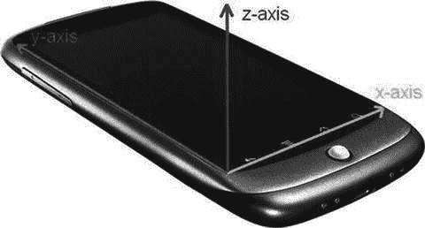

图 3-20. Android 手机上的加速度计轴。`z` 轴指向手机外部

现在，让我们定义一个接口，该接口为我们提供对触摸屏、键盘和加速度计的轮询访问，同时也为我们提供对触摸屏和键盘的基于事件的访问（见代码清单 3-1）。

```
package com.badlogic.androidgames.framework;
import java.util.List;
public interface Input {
    public class KeyEvent {
        public static final int KEY_DOWN = 0;
        public static final int KEY_UP = 1;
        public int type;
        public int keyCode;
        public char keyChar;
    }
    public static class TouchEvent {
        public static final int TOUCH_DOWN = 0;
        public static final int TOUCH_UP = 1;
        public static final int TOUCH_DRAGGED = 2;
        public int type;
        public int x, y;
        public int pointer;
    }
    public boolean isKeyPressed(int keyCode);
    public boolean isTouchDown(int pointer);
    public int getTouchX(int pointer);
    public int getTouchY(int pointer);
    public float getAccelX();
    public float getAccelY();
    public float getAccelZ();
    public List getKeyEvents();
    public List getTouchEvents();
}
```

**代码清单 3-1.** 输入接口以及 `KeyEvent` 和 `TouchEvent` 类

我们的定义从两个类开始：`KeyEvent` 和 `TouchEvent`。`KeyEvent` 类定义了编码 `KeyEvent` 类型的常量；`TouchEvent` 类也是如此。一个 `KeyEvent` 实例记录其类型、键的键码，并且如果事件的类型是 `KEY_UP`，还会记录其 Unicode 字符。

`TouchEvent` 代码类似，它包含 `TouchEvent` 的类型、手指相对于 UI 组件原点的位置，以及触摸屏驱动程序分配给该手指的指针 ID。只要手指还在屏幕上，该手指的指针 ID 就会保持不变。如果两个手指都按下，然后手指 0 抬起，那么只要手指 1 还在触摸屏幕，它就会保留其 ID。一个新的手指将会获得第一个空闲的 ID，在本例中就是 0。指针 ID 通常是顺序分配的，但不能保证总是如此。例如，索尼 Xperia Play 使用 15 个 ID，并以轮询方式将它们分配给触摸。在代码中永远不要对新指针的 ID 做任何假设——你只能通过索引读取指针的 ID，并在该指针抬起之前引用它。


接下来是输入接口的轮询方法，这些方法不言自明。`Input.isKeyPressed()` 接收一个 `keyCode` 参数，返回对应按键当前是否被按下。`Input.isTouchDown()`、`Input.getTouchX()` 和 `Input.getTouchY()` 返回指定触摸点是否被按下，以及其当前的 x 和 y 坐标。请注意，如果对应触摸点并未实际接触屏幕，这些坐标将是未定义的。

`Input.getAccelX()`、`Input.getAccelY()` 和 `Input.getAccelZ()` 分别返回每个加速度计轴的加速度值。

最后两个方法用于基于事件的处理。它们返回自上次调用这些方法以来记录的 `KeyEvent` 和 `TouchEvent` 实例。事件根据发生时间排序，最新的事件位于列表末尾。通过这个简单的接口和这些辅助类，我们涵盖所有输入需求。接下来让我们处理文件操作。

> **注意**  
> 虽然具有公共成员的可变类是一种糟粕，但在本例中我们可以容忍它们，原因有二：Dalvik 调用方法（本例中的 getter）时仍然较慢；并且事件类的可变性不会影响 `Input` 实现的内部逻辑。请记住，这通常是不良风格，但出于性能原因，我们会时不时代入这种捷径。

## 文件 I/O

对于我们的游戏开发工作而言，读写文件相当重要。由于我们身处 Java 领域，主要关心的是创建 `InputStream` 和 `OutputStream` 实例，这是从特定文件读写数据的标准 Java 机制。在我们的场景中，主要关心读取随游戏打包的文件，例如关卡文件、图片和音频文件。写入文件的操作则少得多。通常，只有在需要维护高分记录或游戏设置，或保存游戏状态以便用户从中断处继续时，我们才会写入文件。

我们希望使用最简单的文件访问机制。代码清单 3-2 展示了我们提出的简洁接口。

```
package com.badlogic.androidgames.framework;
import java.io.IOException; import java.io.InputStream; import java.io.OutputStream;
public interface FileIO {
    InputStream readAsset(String fileName) throws IOException;
    InputStream readFile(String fileName) throws IOException;
    OutputStream writeFile(String fileName) throws IOException;
}
```

这相当精简实用。我们只需指定文件名即可获得一个流。与 Java 惯例一致，如果出现错误，我们会抛出 `IOException`。读写文件的具体位置当然取决于实现。资源将从应用的 APK 文件中读取，而常规文件将从 SD 卡（也称为外部存储）中读写。

返回的 `InputStream` 和 `OutputStream` 是标准的 Java 流。当然，使用完毕后需要关闭它们。

## 音频

虽然音频编程是一个相当复杂的主题，但我们可以通过非常简单的抽象来应付。我们不会进行任何高级音频处理；仅仅播放从文件加载的音效和音乐，这与图形模块中加载位图的方式类似。

在深入探讨模块接口之前，让我们先暂停一下，了解声音的实际本质及其数字表示方式。

### 声音的物理学原理

声音通常被建模为在空气或水等介质中传播的一组波。波并不是实际的物理物体，而是介质内分子的运动。想象一下，你向一个小池塘扔一块石头。当石头撞击池塘表面时，它会推开池塘中大量的水分子，这些被推开的分子会将其能量传递给邻居，邻居们也会开始移动和推动。最终，你会看到圆形波纹从石头落点处扩散开来。

声音产生时也会发生类似的事情。不过，你得到的是球形运动，而非圆形运动。正如你小时候可能进行过的高度科学实验所知，水波可以相互作用；它们可以相互抵消或相互增强。声波也是如此。环境中所有的声波结合起来，形成了你听音乐时听到的音调和旋律。声音的响度取决于移动和推动的分子对其邻居最终对你的耳朵施加了多少能量。


#### 录音与回放

音频录制与回放的原理在理论上其实相当简单。录音时，我们记录的是构成声波的分子在空间中对某个区域施加特定压力的时间点。而回放这些数据，只需让扬声器周围的空气分子像我们录音时那样摆动和运动即可。

在实践中，这当然要稍微复杂一些。音频通常以两种方式之一录制：模拟方式或数字方式。在这两种情况下，声波都是通过某种麦克风记录的，麦克风通常由一个振膜组成，该振膜将分子的推动转化为某种信号。这种信号的处理和存储方式，是模拟录音与数字录音之间的区别所在。我们采用数字方式工作，因此让我们来看看这种情况。

以数字方式录制音频意味着，在离散的时间步长上测量并存储麦克风振膜的状态。根据周围分子的推动程度，振膜可以相对于中性状态向内或向外被推动。这个过程被称为采样，因为我们是在离散的时间点上采集振膜状态的样本。每单位时间采集的样本数量称为采样率。通常时间单位是秒，该单位称为赫兹（`Hz`）。每秒采样的数量越多，音频的质量就越高。CD 的回放采样率为 `44,100Hz`，即 `44.1KHz`。例如，在电话线上传输语音时，会发现较低的采样率（这种情况下通常为 `8KHz`）。

采样率只是决定录音质量的一个属性。我们存储每个振膜状态样本的方式也起着作用，并且这种方式同样需要数字化。让我们回想一下振膜状态究竟是什么：它是振膜距离其中性状态的距离。由于振膜是被向内推还是向外推会产生差异，我们记录的是带符号的距离。因此，在特定时间步长上的振膜状态是一个负值或正值的数。我们可以通过多种方式存储这个带符号的数：作为有符号的 8 位、16 位或 32 位整数，作为 32 位浮点数，甚至作为 64 位浮点数。每种数据类型都有有限的精度。一个 8 位有符号整数可以存储 127 个正距离值和 128 个负距离值。

32 位整数则提供了更高的分辨率。当存储为浮点数时，振膜状态通常被归一化到 `-1` 到 `1` 的范围内。最大正值和最小负值代表了振膜距离其中心状态的最远距离。振膜状态也称为振幅。它代表了撞击它的声音的响度。使用单个麦克风，我们只能录制单声道声音，这会丢失所有空间信息。使用两个麦克风，我们可以在空间中的不同位置测量声音，从而获得所谓的立体声。例如，你可以通过将一只麦克风放置在发声物体的左侧，另一只放置在右侧来实现立体声。当声音通过两个扬声器同时回放时，我们可以合理地再现音频的空间成分。但这同时也意味着，在存储立体声音频时，我们需要存储两倍的样本数量。

最后，回放是一件简单的事情。一旦我们以数字形式、特定的采样率和数据类型获得了音频样本，我们就可以将这些数据发送给音频处理单元，该单元会将信息转换为连接扬声器的信号。扬声器解释这个信号，并将其转换为振膜的振动，进而引起周围空气分子的运动并产生声波。这与录音时所做的完全相同，只是方向相反！

#### 音频质量与压缩

哇，好多理论。我们为什么关心这个？如果你注意到了，你现在就可以根据采样率和用于存储每个样本的数据类型来判断一个音频文件的质量是高是低。采样率越高，数据类型的精度越高，音频的质量就越好。然而，这也意味着我们需要更多的存储空间来存放音频信号。

想象一下，我们录制同一段长度为 60 秒的声音，但录制两次：一次采用 `8KHz` 的采样率，每个样本 8 位；另一次采用 `44KHz` 的采样率，16 位精度。存储每段声音需要多少内存？在第一种情况下，每个样本需要 1 个字节。将此乘以 `8,000Hz` 的采样率，我们每秒需要 `8,000` 字节。对于我们 60 秒的完整录音，那就是 `480,000` 字节，大约半兆字节（`MB`）。我们质量更高的录音则需要多得多的内存：每个样本需要 2 个字节，每秒需要 2 乘以 `44,000` 字节。也就是每秒 `88,000` 字节。再乘以 60 秒，我们得到 `5,280,000` 字节，即略高于 `5MB`。一首普通的三分钟流行歌曲，以这种质量将占用超过 `15MB` 的空间，而这还仅仅是单声道录音。对于立体声录音，你需要两倍大小的内存。为了区区一首歌，这字节量可真不少！

许多聪明人想出了减少音频录制所需字节数的方法。他们发明了相当复杂的心理声学压缩算法，这些算法分析未压缩的音频录制，并输出一个更小的压缩版本。这种压缩通常是有损的，意味着原始音频中一些微小的部分会被省略。当你回放 `MP3` 或 `OGG` 时，实际上听到的是经过压缩的有损音频。因此，使用诸如 `MP3` 或 `OGG` 之类的格式，将有助于减少在磁盘上存储音频所需的空间。

那么，如何从压缩文件中回放音频呢？尽管存在针对各种压缩音频格式的专用解码硬件，但常见的音频硬件通常只能处理未压缩的样本。在实际将样本馈送给声卡之前，我们必须先读取并解压缩它们。我们可以一次性完成此操作，并将所有未压缩的音频样本存储在内存中，或者根据需求仅从音频文件中流式读取部分数据。


##### 实践应用

你已经看到，即使是三分钟的歌曲也会占用大量内存。因此，在播放游戏音乐时，我们将实时流式传输音频样本，而不是将所有音频样本预加载到内存中。通常，我们只有一个音乐流在播放，所以只需访问磁盘一次。

对于短促的音效，例如爆炸声或枪声，情况则略有不同。我们经常需要同时多次播放同一个音效。为每个音效实例从磁盘流式传输音频样本并非良策。不过，幸运的是，短促的声音不会占用太多内存。因此，我们会将一个音效的所有样本读取到内存中，这样就能直接从内存中同时播放它们。

我们有以下需求：

*   需要一种方式来加载音频文件，以支持流式播放和从内存中播放。
*   需要一种方式来控制流式音频的播放。
*   需要一种方式来控制完全加载的音频的播放。

这些需求直接转化为了音频（Audio）、音乐（Music）和音效（Sound）接口（分别见代码清单 3-3 至 3-5）。

```
package com.badlogic.androidgames.framework;
public interface Audio {
    Music newMusic(String filename);
    Sound newSound(String filename);
}
```

音频接口是我们创建新的音乐和音效实例的方式。音乐实例代表一个流式音频文件。音效实例代表一个完全保存在内存中的短促音效。`Audio.newMusic()` 和 `Audio.newSound()` 方法都接受一个文件名作为参数。这些文件名指向我们应用 APK 文件中的资源文件。

```
package com.badlogic.androidgames.framework;
public interface Music {
    public void play();
    public void stop();
    public void pause();
    void setLooping(boolean looping);
    void setVolume(float volume);
    public boolean isPlaying();
    public boolean isStopped();
    public boolean isLooping();
    public void dispose();
}
```

音乐接口稍微复杂一些。它提供了启动音乐流播放、暂停和停止播放、以及设置循环播放的方法（循环播放意味着当音频文件播放到末尾时会自动从头开始）。此外，我们可以将音量设置为一个 0（静音）到 1（最大音量）之间的浮点数。还有一些 getter 方法，允许我们查询音乐实例的当前状态。

一旦不再需要音乐实例，我们必须释放它。这将关闭所有系统资源，例如用于流式播放音频的文件。

```
package com.badlogic.androidgames.framework;
public interface Sound {
    void play(float volume);
    ...
    void dispose();
}
```

音效接口则更简单。我们只需调用它的 `play()` 方法，该方法同样接受一个浮点参数来指定音量。我们可以随时调用 `play()` 方法（例如，当小诺姆先生吃到墨点时）。一旦不再需要音效实例，我们必须释放它，以释放其样本占用的内存以及其他可能关联的系统资源。

**注**  
虽然本章内容已相当丰富，但关于音频编程还有很多值得学习的地方。为了让本节内容简洁明了，我们简化了一些内容。例如，通常你不会线性地指定音频音量。在我们的上下文中，忽略这个小细节是可以接受的。但请记住，音频领域远不止于此！

### 图形

我们游戏框架核心的最后一个模块是图形模块。你可能已经猜到，它将负责在屏幕上绘制图像（也称为位图）。这听起来简单，但如果想要高性能的图形，你至少需要了解图形编程的基础知识。让我们从 2D 图形的基础开始。

我们需要问的第一个问题是：图像究竟是如何输出到我的显示器上的？答案相当复杂，而我们并不需要了解所有细节。我们只需快速回顾一下计算机和显示器内部发生的事情。


#### 关于光栅、像素和帧缓冲区

如今的显示器都是基于光栅的。光栅是一个由所谓图像元素组成的二维网格。你可能知道它们叫像素，下文我们也将这样称呼。光栅网格有有限的宽度和高度，我们通常用每行和每列的像素数来表示。如果你胆子够大，可以打开电脑，尝试分辨显示器上的单个像素。不过，我们不对因此对眼睛造成的任何损伤负责。

一个像素有两个属性：网格中的位置和颜色。像素的位置由离散坐标系中的二维坐标给出。离散意味着坐标始终是整数位置。坐标是在施加于网格的欧几里得坐标系中定义的。坐标系的原点是网格的左上角。x 轴正方向指向右，y 轴正方向指向下。最后一点是最让人困惑的。我们稍后会解释；这有一个简单的原因。

忽略奇怪的 y 轴，我们可以看到，由于坐标的离散性质，原点与网格左上角的像素重合，该像素位于 `(0,0)`。原点像素右侧的像素位于 `(1,0)`，原点像素下方的像素位于 `(0,1)`，以此类推（见图 3-21 左侧）。显示器的光栅网格是有限的，因此有意义的坐标数量有限。负坐标位于屏幕之外。大于或等于光栅宽度或高度的坐标也位于屏幕之外。请注意，最大的 x 坐标是光栅宽度减 1，最大的 y 坐标是光栅高度减 1。这是因为原点与左上角像素重合。差一错误是图形编程中常见的挫败感来源。

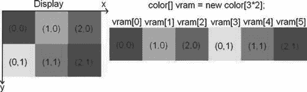

图 3-21. 显示器光栅网格和显存（极度简化）

显示器会从图形处理器接收持续不断的信息流。它根据控制屏幕绘制的程序或操作系统的指定，对显示器光栅中每个像素的颜色进行编码。显示器每秒会刷新其状态几十次。确切的频率称为刷新率，以赫兹为单位。液晶显示器通常有 60 赫兹的刷新率；阴极射线管显示器和等离子显示器通常有更高的刷新率。

图形处理器可以访问一个称为视频随机存取存储器（显存）的特殊内存区域。在显存中，有一个保留区域用于存储要在屏幕上显示的每个像素。这个区域通常被称为帧缓冲区。因此，一整个屏幕图像被称为一帧。对于显示器光栅网格中的每个像素，帧缓冲区中都有一个对应的内存地址来保存该像素的颜色。当我们要更改屏幕上显示的内容时，只需更改显存中该内存区域的像素颜色值即可。

现在，是时候解释为什么显示器坐标系中的 y 轴指向下方了。内存，无论是显存还是普通内存，都是线性和一维的。可以把它想象成一个一维数组。那么，我们如何将二维像素坐标映射到一维内存地址呢？图 3-21 展示了一个非常小的 3×2 像素的显示器光栅网格，以及它在显存中的表示。（我们假设显存仅由帧缓冲区内存组成。）由此，我们可以轻松推导出以下公式，用于计算位于 `(x,y)` 处像素的内存地址：

```
int address = x + y * rasterWidth;
```

我们也可以反过来，从地址得到像素的 x 和 y 坐标：

```
int x = address % rasterWidth;
int y = address / rasterWidth;
```

因此，y 轴之所以指向下方，是因为显存中像素颜色的内存布局。这实际上是计算机图形学早期遗留下来的一种传统。显示器会更新屏幕上每个像素的颜色，从左上角开始，向右移动，然后在下一行折返到左边，直到到达屏幕底部。将显存内容以方便将颜色信息传输到显示器的方式进行布局，在过去是很方便的。

**注意：**

如果我们能完全访问帧缓冲区，就可以使用前面的公式编写一个完整的图形库，来绘制像素、线条、矩形、加载到内存中的图像等等。出于各种原因，现代操作系统不允许我们直接访问帧缓冲区。相反，我们通常绘制到一个内存区域，然后由操作系统将其复制到实际的帧缓冲区。不过，总体概念在这种情况下仍然适用！如果你对如何高效地完成这些底层操作感兴趣，可以在网上搜索一个叫 Bresenham 的人，以及他的直线和圆绘制算法。


#### 垂直同步与双缓冲

现在，如果你还记得关于刷新率的段落，你可能会注意到这些刷新率似乎相当低，并且我们向帧缓冲写入数据的速度可能比显示器刷新速度更快。这种情况确实会发生。更糟糕的是，我们并不知道显示器何时从显存中抓取最新的帧副本，如果我们正在绘制某些东西的过程中，这就会产生问题。在这种情况下，显示器会同时显示旧帧缓冲的部分内容和当前状态的部分内容，这是一种不理想的情况。你可以在许多电脑游戏中看到这种效果，它表现为画面撕裂（即屏幕上同时显示上一帧的部分内容和当前帧的部分内容）。

解决这个问题的第一部分方案叫做双缓冲。图形处理单元（GPU）并非只管理一个帧缓冲，而是实际管理两个：一个前缓冲和一个后缓冲。前缓冲用于提供像素颜色，可供显示器读取；后缓冲则用于绘制我们的下一帧画面，而显示器可以愉快地从前缓冲读取内容。当我们完成当前帧的绘制后，就告诉 GPU 交换这两个缓冲，这通常意味着只需交换前缓冲和后缓冲的地址。在图形编程文献和 API 文档中，你可能会找到“翻页”和“缓冲交换”这两个术语，它们指的就是这个过程。

然而，仅靠双缓冲并不能完全解决问题：在屏幕刷新其内容的过程中，交换操作仍然可能发生。这时，垂直同步（也称为垂直同步）就派上了用场。当我们调用缓冲交换方法时，GPU 会阻塞，直到显示器发出信号，表明它已完成当前刷新。当这个信号发出时，GPU 就可以安全地交换缓冲地址，一切就都正常了。

幸运的是，如今我们几乎不需要关心这些烦人的细节。显存、双缓冲和垂直同步的具体细节都被很好地隐藏起来，使我们无法对其进行破坏。相反，我们得到了一组 API，这些 API 通常限制我们只能操作应用程序窗口的内容。其中一些 API，例如 OpenGL ES，提供了硬件加速功能，它基本上不过是利用图形芯片上的专用电路来操作显存。看到了吧，这并不是魔法！你应该了解这些内部工作原理（至少是高级概念）的原因是，这能帮助你理解应用程序的性能特性。当垂直同步启用时，你的帧率永远无法超过屏幕的刷新率，如果你只是在绘制单个像素，这可能会让你感到困惑。

当我们使用非硬件加速的 API 进行渲染时，我们不直接与显示器本身打交道。相反，我们绘制到窗口的某个 UI 组件。在我们的场景中，我们处理的是一个覆盖整个窗口的单一 UI 组件。因此，我们的坐标系不会覆盖整个屏幕，而只覆盖我们的这个 UI 组件。该 UI 组件实际上变成了我们自己的“显示器”，拥有它自己的虚拟帧缓冲。操作系统将负责合成所有可见窗口的内容，并确保这些内容被正确地传输到它们在真实帧缓冲中覆盖的区域。

#### 什么是颜色？

你会注意到，到目前为止我们一直方便地忽略了颜色。我们在图 3-21 中设定了一个名为 `color` 的类型，并假装一切都很好。让我们来看看颜色到底是什么。从物理上讲，颜色是你的视网膜和视觉皮层对电磁波的反应。这种波的特征在于其波长和强度。我们可以看到波长大约在 400 到 700 纳米（nm）之间的波。电磁波谱的这个子波段也称为可见光谱。彩虹展示了可见光谱中的所有颜色，从紫色到靛蓝，到蓝色，到绿色，到黄色，然后是橙色，最后是红色。

显示器所做的，就是为每个像素发射特定的电磁波，而我们则感受到每个像素的颜色。不同类型的显示器使用不同的方法来实现这一目标。这个过程的一个简化版本是这样的：屏幕上的每个像素都由三种不同的荧光粒子组成，这些粒子会分别发出红色、绿色或蓝色的光。

当显示器刷新时，每个像素的荧光粒子会通过某种方式发光（例如，在 CRT 显示器的情况下，像素的粒子会受到一束电子的轰击）。显示器可以控制每个粒子发出的光量。例如，如果一个像素完全是红色的，那么只有红色粒子会以最大强度被电子轰击。如果我们想要三种基色以外的其他颜色，可以通过混合基色来实现。混合是通过改变每个粒子发出其颜色的强度来完成的。这些电磁波在到达我们视网膜的途中会相互叠加。我们的大脑会将这种混合解读为一种特定的颜色。因此，一种颜色可以通过红、绿、蓝三种基色强度的混合来指定。

#### 色彩模型

我们刚才讨论的内容被称为色彩模型，具体来说是 RGB 色彩模型。RGB 当然代表红色、绿色和蓝色。我们还可以使用许多其他的色彩模型，例如 YUV 和 CMYK。不过，在大多数图形编程 API 中，RGB 色彩模型几乎是标准，因此我们这里只讨论它。

RGB 色彩模型被称为加法色彩模型，这是因为最终颜色是通过混合加色法原色（红、绿、蓝）得出的。你可能在学校里就尝试过混合原色。图 3-22 为你展示了一些 RGB 颜色混合的示例，以帮助你回忆一下。

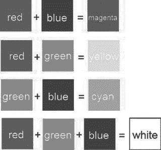

图 3-22.

混合原色红、绿、蓝的有趣尝试

当然，通过改变红、绿、蓝分量的强度，我们可以生成比图 3-22 所示的颜色多得多的颜色。每个分量的强度值可以在 0 和某个最大值（例如 1）之间。如果我们将每个颜色分量解释为三维欧几里得空间中三个轴上的一个值，我们就可以绘制出一个所谓的颜色立方体，如图 3-23 所示。通过改变每个分量的强度，我们可以获得更多种颜色。一种颜色由三元组 `(red, green, blue)` 表示，其中每个分量在 0.0 到 1.0 之间（0.0 表示该颜色没有强度，1.0 表示最大强度）。黑色位于原点 `(0,0,0)`，白色位于 `(1,1,1)`。

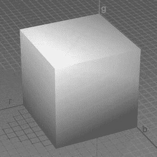

图 3-23.

强大的 RGB 颜色立方体


#### 数字颜色编码

我们如何在计算机内存中对 RGB 颜色三元组进行编码？首先，我们必须定义要为颜色分量使用何种数据类型。我们可以使用浮点数，并将有效范围指定为 0.0 到 1.0 之间。这样每个分量都会获得相当的分辨率，使我们能够使用大量不同的颜色。遗憾的是，这种方法会占用大量空间（每个像素需要 3 个 4 字节或 8 字节的浮点数，具体取决于我们使用 32 位还是 64 位浮点数）。

我们可以做得更好——代价是损失一些颜色——这完全可以接受，因为显示器通常只能发射有限范围的颜色。与其为每个分量使用浮点数，不如使用无符号整数。现在，如果我们为每个分量使用 32 位整数，就没有任何节省。相反，我们为每个分量使用一个无符号字节。这样每个分量的强度范围就是 0 到 255。对于 1 个像素，我们需要 3 个字节，即 24 位。这相当于 2 的 24 次方（16,777,216）种不同的颜色。这足以满足我们的需求。

我们还能进一步减少空间吗？是的，可以。我们可以将每个分量打包到一个 16 位字中，这样每个像素只需要 2 个字节的存储空间。红色使用 5 位，绿色使用 6 位，蓝色使用剩下的 5 位。给绿色分配 6 位的原因是，我们的眼睛能分辨出比红色或蓝色更多的绿色色调。所有这些位加起来，可以编码 2 的 16 次方（65,536）种不同的颜色。图 3-24 展示了如何使用前面描述的三种编码方式对一种颜色进行编码。


**图 3-24.** 一种漂亮的粉色调的颜色编码（抱歉，在本书的印刷版中显示为灰色）

对于浮点数情况，我们可以使用三个 32 位 Java 浮点数。在 24 位编码的情况下，我们有个小问题：Java 中没有 24 位整数类型，因此我们要么将每个分量存储在一个单独的字节中，要么使用一个 32 位整数，让高 8 位闲置。在 16 位编码的情况下，我们可以再次选择使用两个单独的字节，或者将分量存储在一个单一的 short 值中。请注意，Java 没有无符号类型。由于二进制补码的特性，我们可以安全地使用有符号整数类型来存储无符号值。

对于 16 位和 24 位整数编码，我们还需要指定在 short 或 integer 值中存储三个分量的顺序。通常使用两种方法：RGB 和 BGR。图 3-23 使用的是 RGB 编码。蓝色分量位于最低的 5 位或 8 位，绿色分量占用接下来的 6 位或 8 位，红色分量占用最高的 5 位或 8 位。BGR 编码则反转此顺序。绿色位保持不变，而红色和蓝色位互换位置。本书将全程使用 RGB 顺序，因为 Android 的图形 API 也使用此顺序。让我们总结一下迄今为止讨论过的颜色编码：

-   32 位浮点 RGB 编码：每个像素 12 个字节，强度在 0.0 到 1.0 之间变化。
-   24 位整数 RGB 编码：每个像素 3 或 4 个字节，强度在 0 到 255 之间变化。分量的顺序可以是 RGB 或 BGR。在某些圈内这也被称为 RGB888 或 BGR888，其中 8 指定每个分量的位数。
-   16 位整数 RGB 编码：每个像素 2 个字节；红色和蓝色的强度在 0 到 31 之间，绿色的强度在 0 到 63 之间。分量的顺序可以是 RGB 或 BGR。在某些圈内这也被称为 RGB565 或 BGR565，其中 5 和 6 指定了相应分量的位数。

我们使用的编码类型也称为颜色深度。我们在磁盘或内存中创建和存储的图像具有定义的颜色深度，实际图形硬件的帧缓冲区和显示器本身也是如此。今天的显示器通常默认颜色深度为 24 位，在某些情况下可以配置为使用更低的深度。图形硬件的帧缓冲区也相当灵活，可以使用多种不同的颜色深度。当然，我们自己的图像也可以具有任何我们喜欢的颜色深度。

> **注意**  
> 还有很多其他方法来编码每像素的颜色信息。除了 RGB 颜色，我们还可以有灰度像素，它只有一个分量。由于这些不常用，我们在此暂时忽略它们。

#### 图像格式与压缩

在某游戏开发阶段，美术人员会提供使用 Gimp、Paint.NET 或 Photoshop 等图形软件创建的图像。这些图像可以以多种格式存储在磁盘上。为什么首先需要这些格式？我们不能直接将光栅数据作为字节块存储在磁盘上吗？

嗯，可以，但让我们算算这需要多少内存。假设我们想要最佳质量，因此选择以 RGB888 格式编码像素，每像素 24 位。图像大小为 1024 × 1024 像素。仅这一张小小的图像就需要 3MB！使用 RGB565，我们可以将其降低到大约 2MB。

与音频的情况类似，人们在如何减少存储图像所需的内存方面进行了大量研究。通常采用专门为存储图像并尽可能保留原始颜色信息的需求而定制的压缩算法。两种最流行的格式是 JPEG 和 PNG。JPEG 是一种有损格式。这意味着在压缩过程中会丢弃一些原始信息。PNG 是一种无损格式，它能够 100% 真实地再现原始图像。有损格式通常表现出更好的压缩特性，占用更少的磁盘空间。因此，我们可以根据磁盘内存限制来选择使用哪种格式。

与音效类似，当我们加载图像到内存中时，必须完全解压缩它。因此，即使你的图像在磁盘上压缩后只有 20KB，在 RAM 中仍然需要完整的宽度乘以高度乘以颜色深度的存储空间。

一旦加载和解压缩，图像将以与 VRAM 中帧缓冲区布局完全相同的方式，以像素颜色数组的形式提供。唯一的区别是这些像素位于普通的 RAM 中，并且颜色深度可能与帧缓冲区的颜色深度不同。加载的图像也像帧缓冲区一样具有坐标系统，原点在其左上角，x 轴指向右方，y 轴指向下方。

图像加载后，我们可以通过简单地将像素颜色从图像传输到帧缓冲区中的适当位置，将其从 RAM 绘制到帧缓冲区。我们不需要手动操作，而是使用提供此功能的 API。


#### Alpha 合成与混合

在开始设计图形模块接口之前，我们还需要处理一件事：图像合成。为了便于讨论，假设我们有一个可供渲染的帧缓冲区，并且有一堆加载到内存中的图像，待会儿我们会将它们绘制到帧缓冲区中。图 3-25 展示了一张简单的背景图片，以及鲍勃（一位斩妖除魔的万人迷）。

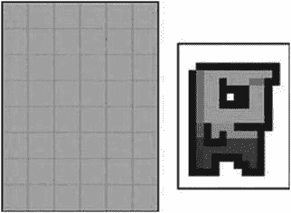

**图 3-25.** 简单的背景与宇宙之主鲍勃

要绘制鲍勃的世界，我们首先将背景图像绘制到帧缓冲区，然后将鲍勃绘制在帧缓冲区中的背景图像之上。这个过程称为合成，因为我们是将不同的图像合成为最终的图像。我们绘制图像的顺序至关重要，因为任何新的绘制操作都会覆盖帧缓冲区中的现有内容。那么，我们合成的最终输出会是什么样子呢？图 3-26 给出了答案。

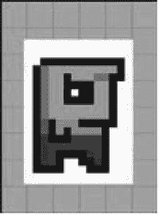

**图 3-26.** 将背景和鲍勃合成到帧缓冲区中（这不是我们想要的结果）

哎呀，这不是我们想要的结果。在图 3-26 中，请注意鲍勃周围环绕着白色像素。当我们在帧缓冲区中将鲍勃绘制到背景上时，这些白色像素也会被绘制出来，从而覆盖了背景。我们怎样才能绘制鲍勃的图像，使得只有鲍勃的像素被绘制出来，而白色的背景像素被忽略呢？

这就需要引入 Alpha 混合了。嗯，对于鲍勃的情况，严格来说应该叫 Alpha 遮罩，但这只是 Alpha 混合的一个子集。图形软件通常不仅允许我们指定像素的 RGB 值，还可以指示其半透明度。可以将其视为像素颜色的另一个分量。我们可以像编码红、绿、蓝分量一样来编码它。

我们之前曾暗示，可以将一个 24 位的 RGB 三元组存储在一个 32 位整数中。这个 32 位整数中有 8 个未使用的位，我们可以利用它们来存储我们的 Alpha 值。然后，我们可以指定像素的半透明度，范围从 0 到 255，其中 0 表示完全透明，255 表示不透明。这种编码方式根据颜色分量的顺序，被称为 `ARGB8888` 或 `BGRA8888`。当然，也有 `RGBA8888` 和 `ABGR8888` 格式。

在 16 位编码的情况下，我们有个小问题：我们 16 位短整数中的所有位都被颜色分量占用了。让我们模仿 `ARGB8888` 格式，类似地定义一个 `ARGB4444` 格式。这样总共剩下 12 位用于我们的 RGB 值——每个颜色分量 4 位。

我们可以很容易地想象出针对完全透明或不透明像素的渲染方法是如何工作的。在第一种情况下，我们只需忽略 Alpha 分量为零的像素。在第二种情况下，我们只需覆盖目标像素。然而，当一个像素的 Alpha 分量既不是完全透明也不是完全不透明时，情况会变得稍微复杂一些。

当以正式方式讨论混合时，我们需要定义几个概念：

- 混合有两个输入和一个输出，每个都表示为一个 RGB 三元组（`C`）加上一个 Alpha 值（`a`）。
- 这两个输入被称为源和目标。源是我们想要绘制到目标图像（即帧缓冲区）上的图像中的像素。目标是我们要用源像素（部分）覆盖的像素。
- 输出同样是一种颜色，表示为 RGB 三元组和 Alpha 值。不过，我们通常忽略 Alpha 值。为简单起见，本章我们将采用这种做法。
- 为了简化计算，我们将 RGB 和 Alpha 值表示为 0.0 到 1.0 范围内的浮点数。

有了这些定义，我们就可以创建所谓的混合方程。最简单的方程如下所示：

```
red = src.red * src.alpha + dst.red * (1  - src.alpha)
green  = src.green  * src.alpha + dst.green  * (1  - src.alpha)
blue = src.blue * src.alpha + dst.blue * (1  - src.alpha)
```

`src` 和 `dst` 是我们要混合在一起的源像素和目标像素。我们逐分量混合这两种颜色。请注意这些混合方程中不存在目标 Alpha 值。我们来看一个例子，看看它的效果：

```
src  = (1, 0.5,  0.5), src.alpha = 0.5,  dst  = (0, 1,  0)
red = 1 * 0.5  + 0 * (1  - 0.5)  = 0.5
blue  = 0.5  * 0.5  + 1 * (1  - 0.5)  = 0.75 red = 0.5  * 0.5  + 0 * (1  - 0.5)  = 0.25
```

图 3-27 说明了上述方程。我们的源颜色是粉红色调，目标颜色是绿色调。两种颜色对最终输出颜色的贡献相同，结果产生了一种有些脏兮兮的绿色或橄榄色。


**图 3-27.** 混合两个像素

两位名为 Porter 和 Duff 的杰出人物提出了大量混合方程。不过，我们将坚持使用上述方程，因为它能满足我们大部分的使用场景。尝试在纸上或你选择的图形软件中进行实验，以感受混合对你合成图像的影响。

> **注**  
> 混合是一个广阔的领域。如果你想充分利用其潜力，我们建议你在网络上搜索 Porter 和 Duff 在此主题上的原创著作。不过，对于我们将要编写的游戏而言，上述方程已经足够了。

请注意，上述方程涉及大量乘法运算（确切地说，是六次）。乘法运算是高成本的，我们应该尽可能避免。在混合的情况下，我们可以通过将源像素颜色的 RGB 值预乘源 Alpha 值来省去其中的三次乘法。大多数图形软件支持将图像的 RGB 值与其对应的 Alpha 值进行预乘。如果不支持，你可以在加载时于内存中完成此操作。然而，当我们使用图形 API 通过混合来绘制图像时，我们必须确保使用正确的混合方程。我们的图像仍然包含 Alpha 值，因此上述方程会输出错误的结果。源 Alpha 值不得与源颜色相乘。幸运的是，所有 Android 图形 API 都允许我们完全指定如何混合图像。

在鲍勃的例子中，我们只需在我们偏好的图形软件程序中将所有白色像素的 Alpha 值设置为零，以 `ARGB8888` 或 `ARGB4444` 格式加载图像，也许再进行 Alpha 预乘，然后使用能通过正确混合方程执行实际 Alpha 混合的绘制方法。结果将如图 3-28 所示。

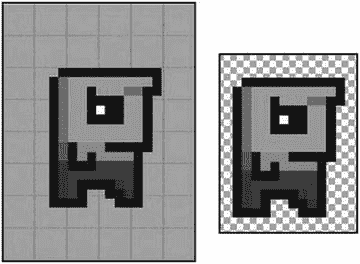

**图 3-28.** 左侧是经过混合的鲍勃，右侧是 Paint.NET 中的鲍勃。棋盘格背景说明白色背景像素的 Alpha 值为零，因此背景棋盘格能够透显出来。

> **注**  
> JPEG 格式不支持存储每个像素的 Alpha 值。在这种情况下，请使用 PNG 格式。


##### 实际应用

有了这些信息，我们终于可以开始设计图形模块的接口了。让我们来定义这些接口的功能。请注意，当我们提到帧缓冲时，我们实际上指的是我们进行绘制的 UI 组件的虚拟帧缓冲。我们只是假装直接绘制到真正的帧缓冲上。我们需要能够执行以下操作：

*   从磁盘加载图像并将其存储在内存中，以便后续绘制。
*   用某种颜色清除帧缓冲，从而擦除上一帧留下的内容。
*   在帧缓冲的特定位置将像素设置为特定颜色。
*   在帧缓冲上绘制线条和矩形。
*   将之前加载的图像绘制到帧缓冲上。我们希望既能绘制完整图像，也能绘制其部分区域。此外，还需要能够对图像进行带混合与不带混合的绘制。
*   获取帧缓冲的尺寸。

我们提出了两个简单的接口：`graphics` 和 `pixmap`。让我们从 `graphics` 接口开始，如清单 3-6 所示。

```
package com.badlogic.androidgames.framework;
public interface Graphics {
public static enum PixmapFormat   {
ARGB8888,  ARGB4444,  RGB565
}
public Pixmap  newPixmap(String fileName,  PixmapFormat format);
public void  clear(int color);
public void  drawPixel(int  x, int y, int color);
public void  drawLine(int  x, int y, int x2,  int y2,  int color);
public void  drawRect(int  x, int y, int width, int height, int color);
public void  drawPixmap(Pixmap pixmap, int x, int y, int srcX,  int srcY,
int srcWidth,  int srcHeight);
public void  drawPixmap(Pixmap pixmap, int x, int y);
public int  getWidth();
public int  getHeight();
}
```

我们从名为 `PixmapFormat` 的公共静态枚举开始。它对我们将要支持的不同像素格式进行了编码。接下来，我们介绍 `Graphics` 接口的不同方法：

*   `Graphics.newPixmap()` 方法将加载以 JPEG 或 PNG 格式提供的图像。我们为生成的像素图指定一个期望的格式，这是对加载机制的一个提示。生成的像素图可能具有不同的格式。我们这样做是为了能在一定程度上控制加载图像的内存占用（例如，将 RGB888 或 ARGB8888 图像加载为 RGB565 或 ARGB4444 图像）。文件名指定了我们应用程序 APK 文件中的一个资源。
*   `Graphics.clear()` 方法用给定的颜色清除整个帧缓冲。在我们这个小框架中，所有颜色都将被指定为 32 位 ARGB8888 值（当然，像素图可能有不同的格式）。
*   `Graphics.drawPixel()` 方法会将帧缓冲中位于 (`x`,`y`) 的像素设置为给定颜色。屏幕外的坐标将被忽略。这称为裁剪。
*   `Graphics.drawLine()` 方法与 `Graphics.drawPixel()` 方法类似。我们指定线条的起点和终点，以及一种颜色。任何位于帧缓冲光栅之外的线条部分都将被忽略。
*   `Graphics.drawRect()` 方法在帧缓冲上绘制一个矩形。
*   (`x`,`y`) 指定了矩形的左上角在帧缓冲中的位置。参数 `width` 和 `height` 指定了 x 和 y 方向的像素数量，矩形将从 (`x`,`y`) 开始填充。我们沿 y 轴向下填充。颜色参数是用于填充矩形的颜色。
*   `Graphics.drawPixmap()` 方法将像素图的矩形部分绘制到帧缓冲上。(`x`,`y`) 坐标指定了像素图目标位置（在帧缓冲中）的左上角。参数 `srcX` 和 `srcY` 指定了从像素图中使用的矩形区域的相应左上角，该坐标基于像素图自身的坐标系。最后，`srcWidth` 和 `srcHeight` 指定了我们从像素图中取出的部分的大小。
*   最后，`Graphics.getWidth()` 和 `Graphics.getHeight()` 方法返回帧缓冲的宽度和高度（以像素为单位）。

除了 `Graphics.clear()` 之外，所有绘图方法都会自动对其接触的每个像素执行混合，如上一节所述。我们可以在个别情况下禁用混合以加快绘图速度，但这会使我们的实现变得复杂。通常，对于像《Mr. Nom》这样的简单游戏，我们可以一直启用混合而无需担心。

`Pixmap` 接口如清单 3-7 所示。

```
package com.badlogic.androidgames.framework;
import  com.badlogic.androidgames.framework.Graphics.PixmapFormat;
public interface Pixmap  {
public int  getWidth();
public int  getHeight();
public PixmapFormat getFormat();
public void  dispose();
}
```

我们保持它非常简单且不可变，因为合成操作是在帧缓冲中完成的：

*   `Pixmap.getWidth()` 和 `Pixmap.getHeight()` 方法返回像素图的宽度和高度（以像素为单位）。
*   `Pixmap.getFormat()` 方法返回像素图在内存中存储时使用的 `PixmapFormat`。
*   最后是 `Pixmap.dispose()` 方法。`Pixmap` 实例会占用内存以及可能的其他系统资源。如果我们不再需要它们，应使用此方法将其释放。

有了这个简单的图形模块，我们后续就可以轻松实现《Mr. Nom》。让我们以对游戏框架本身的讨论来结束本章。


## 游戏框架

在完成所有基础工作后，我们终于可以讨论如何实现游戏本身了。为此，让我们先明确游戏需要执行哪些任务：

- 游戏被划分为不同的屏幕。每个屏幕执行相同的任务：评估用户输入、将输入应用于屏幕状态，以及渲染场景。有些屏幕可能不需要任何用户输入，只需经过一段时间后自动切换到另一个屏幕（例如启动画面）。
- 这些屏幕需要以某种方式进行管理（也就是说，我们需要追踪当前屏幕，并找到切换至新屏幕的方法，这归根结底就是销毁旧屏幕并将新屏幕设置为当前屏幕）。
- 游戏需要让屏幕能够访问不同的模块（用于图形、音频、输入等），以便它们能够加载资源、获取用户输入、播放声音、渲染到帧缓冲等。
- 由于我们的游戏是实时运行的（这意味着事物会不断移动和更新），我们必须尽可能频繁地让当前屏幕更新自身状态并进行渲染。这通常会在一个称为主循环的循环内部完成。当用户退出游戏时，循环将终止。这个循环的每一次迭代被称为一帧。我们可以计算的每秒帧数（FPS）被称为帧率。
- 说到时间，我们还需要追踪自上一帧以来经过的时间跨度。这用于实现帧率无关的运动，我们稍后会讨论这一点。
- 游戏需要追踪窗口状态（即它是被暂停还是恢复），并将这些事件通知当前屏幕。
- 游戏框架将负责设置窗口以及创建我们用来渲染和接收输入的 UI 组件。

让我们将其简化为一些伪代码，暂时忽略像暂停和恢复这样的窗口管理事件：

```
createWindowAndUIComponent();
Input input = new Input();
Graphics graphics = new Graphics();
Audio audio = new Audio();
Screen currentScreen = new MainMenu();
float lastFrameTime = currentTime();
while (!userQuit()) {
    float deltaTime = currentTime() - lastFrameTime;
    lastFrameTime = currentTime();
    currentScreen.updateState(input, deltaTime);
    currentScreen.present(graphics, audio, deltaTime);
}
cleanupResources();
```

我们首先创建游戏的窗口以及用于渲染和接收输入的 UI 组件。接下来，我们实例化所有执行底层工作所需的模块。我们实例化起始屏幕并将其设为当前屏幕，并记录当前时间。然后我们进入主循环，如果用户表示想要退出游戏，该循环将终止。

在游戏循环内部，我们计算所谓的增量时间。这是自上一帧开始以来经过的时间。然后我们记录当前帧开始的时间。增量时间和当前时间通常以秒为单位给出。对于屏幕而言，增量时间表示自其上次更新以来经过了多少时间——如果我们希望实现帧率无关的运动（稍后会回顾），就需要这些信息。

最后，我们只需更新当前屏幕的状态并将其呈现给用户。更新过程依赖于增量时间和输入状态；因此，我们将这些信息提供给屏幕。呈现过程包括将屏幕状态渲染到帧缓冲，以及播放屏幕状态所要求的任何音频（例如，由于上一次更新中触发了射击）。呈现方法可能还需要知道自上次调用以来过去了多少时间。

当主循环终止时，我们可以清理并释放所有资源，然后关闭窗口。

这就是几乎所有游戏在高层设计上的工作方式：处理用户输入，更新状态，向用户呈现状态，然后无限重复（直到用户对我们的游戏感到厌倦）。

现代操作系统上的 UI 应用程序通常不会实时运行。它们采用基于事件的范式工作，由操作系统通知应用程序输入事件，以及何时进行自我渲染。这是通过应用程序在启动时向操作系统注册的回调函数实现的。这些回调函数负责处理接收到的事件通知。所有这些都发生在一个所谓的 UI 线程中——即 UI 应用程序的主线程。

通常最好尽可能快地返回回调函数，因此我们不想在其中实现主循环。

相反，我们将游戏的主循环托管在一个单独的线程中，该线程在游戏启动时生成。这意味着当我们需要接收 UI 线程事件（例如输入事件或窗口事件）时，必须采取一些预防措施。但这些细节我们将在后续为 Android 实现游戏框架时再处理。只需要记住，我们需要在特定时刻同步 UI 线程和游戏主循环线程。


## 游戏与屏幕接口

话已至此，让我们尝试设计一个游戏接口。该接口的实现必须完成以下任务：

*   设置窗口和 UI 组件，并接入回调函数，以便接收窗口和输入事件。
*   启动主循环线程。
*   跟踪当前屏幕，并在每个主循环迭代（即帧）中通知其更新和呈现自身。
*   将窗口事件（例如暂停和恢复事件）从 UI 线程传递到主循环线程，并转发给当前屏幕，以便其相应地更改状态。
*   授权访问我们之前开发的所有模块：输入、文件 I/O、图形和音频。

作为游戏开发者，我们无需关心主循环运行在哪个线程上，也无需关心是否需要与 UI 线程同步。我们只希望在低级模块的一点帮助和一些窗口事件通知下，能够实现不同的游戏画面。因此，我们将创建一个非常简单的游戏接口，它为我们隐藏了所有这些复杂性，同时还将创建一个抽象的 `Screen` 类，用于实现所有屏幕。清单 3-8 展示了这个游戏接口。

```
package com.badlogic.androidgames.framework;
public interface Game  {
public Input  getInput(); public  FileIO  getFileIO(); public Graphics getGraphics(); public Audio getAudio();
public void  setScreen(Screen screen);
public Screen getCurrentScreen();
public Screen getStartScreen();
}
清单 3-8.
游戏接口
```

如您所料，这里提供了一些 getter 方法，用于返回我们低级模块的实例，这些实例将由 `Game` 的实现来实例化和跟踪。

`Game.setScreen()` 方法允许我们设置游戏的当前屏幕。该方法将实现一次，并包含所有内部的线程创建、窗口管理和主循环逻辑，主循环逻辑会持续要求当前屏幕进行呈现和更新。

`Game.getCurrentScreen()` 方法返回当前活跃的 `Screen` 实例。稍后我们将使用一个名为 `AndroidGame` 的抽象类来实现游戏接口，该类将实现除 `Game.getStartScreen()` 之外的所有方法。`Game.getStartScreen()` 方法将是一个抽象方法。如果我们为实际游戏创建 `AndroidGame` 实例，我们将扩展它并重写 `Game.getStartScreen()` 方法，返回一个指向游戏第一个屏幕的实例。

为了让您了解设置我们的游戏是多么容易，这里有一个示例（假设我们已经实现了 `AndroidGame` 类）：

```
public class  MyAwesomeGame  extends AndroidGame  {
public Screen getStartScreen  () {
return new  MySuperAwesomeStartScreen(this);
}
}
```

这相当酷，不是吗？我们只需实现想要用来启动游戏的屏幕，剩下的工作将由 `AndroidGame` 类完成。从那时起，`AndroidGame` 实例将在主循环线程中要求我们的 `MySuperAwesomeStartScreen` 进行更新和渲染。请注意，我们将 `MyAwesomeGame` 实例本身传递给了 Screen 实现的构造函数。

**注意**

如果您想知道实际上是谁实例化了我们的 `MyAwesomeGame` 类，我们给您一个提示：`AndroidGame` 将从 `Activity` 派生，当用户启动我们的游戏时，Android 操作系统会自动实例化 `Activity`。

谜题的最后一部分是抽象的 `Screen` 类。我们将其设为抽象类而不是接口，以便实现一些簿记功能。这样，我们在实际实现抽象的 `Screen` 类时，就可以减少编写样板代码。清单 3-9 展示了抽象的 `Screen` 类。

```
package com.badlogic.androidgames.framework;
public abstract class  Screen {
protected  final Game  game;
public Screen(Game  game)  {
this.game = game;
}
public abstract void  update(float  deltaTime);
public abstract void  present(float  deltaTime);
public abstract void  pause();
public abstract void  resume();
public abstract void  dispose();
}
清单 3-9.
Screen 类
```

事实证明，簿记功能其实并不复杂。构造函数接收 `Game` 实例并将其存储在一个所有子类都能访问的 final 成员变量中。通过这种机制，我们可以实现两件事：

*   我们可以访问游戏接口的低级模块，来播放音频、在屏幕上绘制、获取用户输入以及读写文件。
*   我们可以在适当的时候（例如，当按下触发切换到新屏幕的按钮时）通过调用 `Game.setScreen()` 来设置新的当前屏幕。

第一点显而易见：我们的 Screen 实现需要访问这些模块，以便能执行一些有意义的操作，比如渲染大量患有狂犬病的独角兽。

第二点允许我们在 `Screen` 实例内部轻松实现屏幕切换。每个屏幕都可以根据自身状态（例如，当按下菜单按钮时）决定何时切换到哪个其他屏幕。

`Screen.update()` 和 `Screen.present()` 方法现在应该不言自明了：它们将更新屏幕状态并相应地呈现屏幕。`Game` 实例将在主循环的每次迭代中调用它们一次。

`Screen.pause()` 和 `Screen.resume()` 方法将在游戏暂停或恢复时被调用。这同样由 `Game` 实例完成，并作用于当前活跃的屏幕。

如果调用了 `Game.setScreen()`，`Game` 实例将调用 `Screen.dispose()` 方法。`Game` 实例通过此方法销毁当前屏幕，从而使该屏幕有机会释放其所有系统资源（例如，存储在像素图中的图形资源），以便为内存中的新屏幕资源腾出空间。调用 `Screen.dispose()` 方法也是屏幕确保需要持久化的任何信息都已保存的最后机会。


## 一个简单的示例

继续以我们的`MySuperAwesomeGame`示例为例，下面是一个非常简单的`MySuperAwesomeStartScreen`类实现：

```
public class MySuperAwesomeStartScreen extends Screen {
    Pixmap awesomePic;
    int x;

    public MySuperAwesomeStartScreen(Game game) {
        super(game);
        awesomePic = game.getGraphics().newPixmap("data/pic.png", PixmapFormat.RGB565);
        MySuperAwesomeGame.getStartScreen(awesomePic);
    }

    @Override
    public void update(float deltaTime) {
        x += 1;
        if (x > 100)
            x = 0;
    }

    @Override
    public void present(float deltaTime) {
        game.getGraphics().clear(0);
        game.getGraphics().drawPixmap(awesomePic, x, 0, 0, 0,
            awesomePic.getWidth(), awesomePic.getHeight());
    }

    @Override
    public void pause() {
        // 这里无需操作
    }

    @Override
    public void resume() {
        // 这里无需操作
    }

    @Override
    public void dispose() {
        awesomePic.dispose();
    }
}
```

让我们看看这个类与`MySuperAwesomeGame`类结合后，将会实现什么功能：

1. 当`MySuperAwesomeGame`类被创建时，它会初始化窗口、用于渲染和接收事件的 UI 组件、接收窗口和输入事件的回调函数，以及主循环线程。最后，它会调用自身的`MySuperAwesomeGame.getStartScreen()`方法，该方法返回`MySuperAwesomeStartScreen()`类的一个实例。
2. 在`MySuperAwesomeStartScreen`构造函数中，我们从磁盘加载一个位图，并将其存储在一个成员变量中。至此，屏幕设置完成，控制权交还给`MySuperAwesomeGame`类。
3. 主循环线程将不断调用我们刚创建的实例中的`MySuperAwesomeStartScreen.update()`和`MySuperAwesomeStartScreen.present()`方法。
4. 在`MySuperAwesomeStartScreen.update()`方法中，我们每帧将一个名为`x`的成员变量增加 1。该成员变量保存了我们要渲染的图像的 x 坐标。当 x 坐标值大于 100 时，我们将其重置为 0。
5. 在`MySuperAwesomeStartScreen.present()`方法中，我们用黑色（`0x00000000 = 0`）清除帧缓冲区，并在位置（`x,0`）渲染我们的像素图。
6. 主循环线程将重复步骤 3 到 5，直到用户按下设备上的返回键退出游戏。`Game`实例随后会调用`MySuperAwesomeStartScreen.dispose()`方法，该方法会释放像素图资源。

这就是我们的第一个（并不那么）激动人心的游戏！用户所能看到的，只是一个图像在屏幕上从左向右移动。这算不上多么愉快的用户体验，但我们稍后会对此进行改进。请注意，在 Android 系统上，游戏可以在任意时刻暂停和恢复。我们的`MyAwesomeGame`实现随后会调用`MySuperAwesomeStartScreen.pause()`和`MySuperAwesomeStartScreen.resume()`方法。只要应用程序本身暂停，主循环线程也会暂停。

我们还有一个最后需要讨论的问题：帧速率无关的运动。

## 帧速率无关的运动

假设用户设备能够以 60FPS 运行我们上一节的游戏。由于我们每帧将`MySuperAwesomeStartScreen.x`成员增加 1 个像素，所以我们的像素图在 100 帧内将移动 100 个像素。以 60FPS 的帧率计算，大约需要 1.66 秒才能到达位置(100,0)。

现在，假设第二个用户在不同的设备上玩我们的游戏。该设备能以 30FPS 运行游戏。每秒我们的像素图移动 30 个像素，因此需要 3.33 秒才能到达位置(100,0)。

这很糟糕。对于我们这个简单的游戏来说，可能对用户体验影响不大，但如果把像素图替换成超级马里奥，想想以帧依赖的方式移动他会产生什么后果。假设我们按住方向键右键，让马里奥向右跑。每帧我们让他移动 1 个像素，就像处理像素图一样。在能以 60FPS 运行游戏的设备上，马里奥的奔跑速度将是在 30FPS 设备上的两倍！这将完全改变用户体验，完全取决于设备性能。我们需要解决这个问题。

这个问题的解决方案被称为**帧速率无关的运动**。与其每帧以固定量移动像素图（或马里奥），我们改用每秒移动的单位来指定移动速度。假设我们希望像素图每秒移动 50 个像素。除了每秒 50 像素这个值之外，我们还需要知道自上次移动像素图以来经过了多少时间。这就是奇怪的 delta time 参数发挥作用的地方。它精确地告诉我们自上次更新以来经过了多少时间。因此，我们的`MySuperAwesomeStartScreen.update()`方法应该如下所示：

```
@Override
public void update(float deltaTime) {
    x += 50 * deltaTime;
    if (x > 100)
        x = 0;
}
```

如果我们的游戏以恒定的 60FPS 运行，传递给该方法的 delta time 将始终是`1 / 60 ~ 0.016`秒。因此，每帧我们移动`50 × 0.016 ~ 0.83`像素。以 60FPS 计算，每秒我们移动`60 × 0.83 ~ 50`像素！让我们用 30FPS 测试一下：`50 × 1 / 30 ~ 1.66`。乘以 30FPS，我们每秒同样总共移动 50 像素。所以，无论运行我们游戏的设备速度多快，我们的动画和移动始终与实际挂钟时间保持一致。

如果我们尝试用前面的代码实际运行，在 60FPS 下，我们的像素图根本不会移动。这是因为我们代码中的一个 bug。我们给你一点时间来找出来。这个 bug 相当隐蔽，但却是游戏开发中常见的陷阱。我们每帧递增的`x`成员实际上是一个整数。给整数加上`0.83`不会有任何效果。要解决这个问题，我们只需将`x`存储为`float`类型而不是整数。这也意味着在调用`Graphics.drawPixmap()`时，我们必须添加一个强制转换为`int`的操作。

**注意**：虽然在 Android 上浮点运算通常比整数运算慢，但影响大多可以忽略不计，因此我们可以使用成本更高的浮点运算。

以上就是我们游戏框架的全部内容。我们可以直接将 Mr. Nom 设计中的各个屏幕转化为我们的类以及框架的接口。当然，一些实现细节仍需注意，但我们将留到后面的章节讨论。现在，你可以为自己感到非常自豪。你坚持读完了这一章，现在你已经准备好成为一名 Android（以及其他平台）的游戏开发者了！

## 总结

在阅读了这 60 多页高度浓缩且信息量丰富的内容之后，你应该对创建一款游戏所涉及的内容有了很好的了解。我们考察了 Google Play 上一些最流行的游戏类型，并得出了一些结论。我们仅用剪刀、笔和一些纸，从头设计了一款完整的游戏。最后，我们探索了游戏开发的理论基础，甚至基于这些理论概念创建了一套接口和抽象类，并将在本书中始终使用它们来实现我们的游戏设计。

如果你觉得自己想超越这里介绍的基础知识，那么请务必上网查询更多信息。你手中已经掌握了所有关键词。理解这些原理是开发稳定且性能良好的游戏的关键。话不多说，让我们为 Android 实现我们的游戏框架吧！


