# 面向游戏开发者的 Android

Android 的应用框架庞大且时常令人困惑。但凡你能想到的每个任务，都有相应的 API 可供使用。当然，你必须先学习这些 API。幸运的是，我们游戏开发者只需用到这些 API 中极其有限的一部分。我们所需要的只是一个包含单一 UI 组件的窗口，方便我们进行绘制，并能够从中接收输入，同时还要具备音频播放的能力。这足以满足我们实现第 3 章中设计的游戏框架的所有需求，而且是以一种相当平台无关的方式。

在本章中，你将学习让 Mr. Nom 成为现实所必需的、最精简的 Android API。你会惊讶地发现，要实现这一目标，实际上只需了解这些 API 中极少的一部分。让我们回顾一下需要哪些要素：

*   窗口管理
*   输入
*   文件 I/O
*   音频
*   图形

在应用框架 API 中，每个模块都有对应的实现。我们将挑选出处理这些模块所需的 API，探讨其内部机制，最后实现我们在第 3 章中设计的游戏框架的相应接口。

如果你恰好有 iOS / Xcode 背景，我们在本章末尾有一个小章节，会提供一些转换说明和指导。然而，在深入探讨 Android 上的窗口管理之前，我们必须重新审视一下我们在第 2 章中仅简要讨论过的内容：通过清单文件定义应用程序。

## 定义 Android 应用程序：清单文件

一个 Android 应用程序可以由多种不同的组件构成：

*   Activity（活动）：这些是面向用户的组件，提供用户界面以供交互。
*   Service（服务）：这些是在后台运行、没有可见界面的进程。例如，一个服务可能负责轮询邮件服务器以获取新邮件。
*   Content Provider（内容提供者）：这些组件让你的部分应用数据可供其他应用程序使用。
*   Intent（意图）：这些是由系统或应用程序本身创建的消息，然后被传递给任何感兴趣的接收方。Intent 可能通知我们系统事件，例如 SD 卡被移除或 USB 线缆被连接。系统也使用 Intent 来启动我们应用程序的组件，例如 Activity。我们也可以触发自己的 Intent，请求其他应用程序执行某个操作，比如打开相册显示图片，或启动相机应用拍照。
*   Broadcast Receiver（广播接收者）：这些组件响应特定的 Intent，并可能执行某个操作，例如启动特定的 Activity 或向系统发送另一个 Intent。

Android 应用程序没有我们习惯在桌面操作系统（例如，以 Java 的 `main()` 方法的形式）上见到的那种单一入口点。相反，Android 应用程序的组件是由特定的 Intent 来启动或要求其执行特定操作的。

我们的应用程序由哪些组件构成，以及这些组件响应哪些 Intent，都在应用程序的清单文件中定义。Android 系统使用这个清单文件来了解我们应用程序的构成，例如，当从应用启动器启动应用程序时要显示的默认 Activity。

**注意：** 本书中我们只关心 Activity，因此我们将仅讨论这种类型组件在清单文件中的相关部分。如果你想了解详情，可以访问 Android 开发者网站（[`http://developer.android.com`](http://developer.android.com)）了解更多关于清单文件的信息。

清单文件的用途远不止定义应用程序的组件。以下列表总结了游戏开发背景下清单文件的相关部分：

*   我们的应用程序所需的硬件配置（即，多点触控、特定屏幕分辨率，或对 OpenGL ES 2.0 的支持）
*   使用特定组件的权限，例如写入 SD 卡或访问网络栈

在接下来的小节中，我们将创建一个模板清单文件，稍作修改后，可在本书所有项目中重复使用。为此，我们将遍历所有需要用来定义应用程序的相关 XML 标签。

### `<manifest>` 元素

`<manifest>` 标签是 `AndroidManifest.xml` 文件的根元素。这是一个基本示例：

```
...
```

我们假设你之前使用过 XML，因此你应该熟悉第一行。`<manifest>` 标签指定了一个名为 `android` 的命名空间，该命名空间会在清单文件的其余部分中被使用。`package` 属性定义了应用程序的根包名。稍后，我们将基于此包名引用我们应用程序的特定类。

只有当我们把 Android 项目的构建目标设置为 Android 2.2 或更新版本时，`installLocation` 属性才可用。它指定了应用程序应被安装的位置。字符串 `preferExternal` 告诉系统，我们希望将应用程序安装到 SD 卡上。这仅适用于 Android 2.2 或更新版本，旧版本的 Android 应用会忽略此字符串。在 Android 2.2 或更新版本上，应用程序会尽可能安装到外部存储设备。

如前所示，清单文件中 XML 元素的所有属性通常都以 `android` 命名空间作为前缀。为简洁起见，在后续小节中讨论特定属性时，我们不会指定该命名空间。

在 `<manifest>` 元素内部，我们接着定义应用程序的组件、权限、硬件配置和支持的 Android 版本。


### `<application>` 元素

与 `<manifest>` 元素类似，我们通过一个示例来讨论 `<application>` 元素：

```
...
```

现在，这是否看起来有点奇怪？`@mipmap/ic_launcher` 和 `@string/app_name` 这些字符串是怎么回事？在开发标准 Android 应用时，我们通常会编写大量 XML 文件，每个文件定义了应用的一个特定部分。要完整定义这些部分，我们需要能够引用 XML 文件中未定义的资源，例如图片或国际化字符串。这些资源位于 `res/` 文件夹的子文件夹中，正如我们在第 2 章解剖 Android Studio 中的 Hello World 项目时所讨论的那样。

为了引用资源，我们使用上述表示法。`@` 表示我们要引用一个在其他地方定义的资源。接下来的字符串标识了我们要引用的资源类型，它可以映射到 `res/` 目录下的某个文件夹或文件。最后一部分指定了资源的名称。在上述例子中，这是一张名为 `ic_launcher` 的图片和一个名为 `app_name` 的字符串。对于图片来说，我们指定的是实际文件名，该文件位于 `res/mipmap-xxx/` 文件夹中。请注意，图片名称没有 `.png` 或 `.jpg` 这样的后缀。Android 会根据 `res/mipmap-xxx/` 文件夹中的内容自动推断后缀。`app_name` 字符串定义在 `res/values/strings.xml` 文件中，该文件存储了应用使用的所有字符串。字符串的名称是在 `strings.xml` 文件中定义的。

**注意**：Android 上的资源处理虽然极其灵活，但也相当复杂。出于两个原因，本书决定跳过大部分资源处理：对于游戏开发来说，这完全是过度设计；并且我们希望完全控制自己的资源。Android 习惯修改放入 `res/` 文件夹中的资源，尤其是图片（称为 drawable）。这是我们作为游戏开发者不希望看到的。在游戏开发中，我们建议唯一使用的 Android 资源系统功能是字符串国际化。本书不会深入探讨这个主题；相反，我们将创建一个更适合游戏开发的 `assets/` 文件夹，这样我们的资源就不会被修改，并且我们能够指定自己的文件夹层级结构。

现在，`<application>` 元素各属性的含义应该更清晰了。`icon` 属性指定了 `res/mipmap-xxx/` 文件夹中用作应用图标的图片。这个图标也是我们在 `<application>` 元素内定义的所有活动的默认图标。

`label` 属性指定了在应用启动器中为我们的应用显示的字符串。在上述示例中，它引用了 `res/values/string.xml` 文件中的一个字符串，这正是我们在 Android Studio 中创建 Android 项目时指定的内容。我们也可以将其设置为原始字符串，例如 `我的超级酷游戏`。这个标签也是我们在 `<application>` 元素中定义的所有活动的默认标签。该标签会显示在应用的标题栏中。

我们只讨论了可以为 `<application>` 元素指定的属性中非常小的一部分。不过，这些对于我们的游戏开发需求来说已经足够了。如果你想了解更多信息，可以查阅 Android 开发者网站上的完整文档。

### `<activity>` 元素

现在，有趣的地方来了。以下是我们为 Mr. Nom 游戏假设的一个示例：

```
android:configChanges="keyboard|keyboardHidden|orientation">
```

我们先来看一下 `<activity>` 标签的属性：

- `name`：指定了活动类相对于我们在 `<manifest>` 元素中指定的 `package` 属性的名称。你也可以在此指定完全限定的类名。
- `label`：我们在 `<application>` 元素中已经指定了相同的属性。这个标签显示在活动的标题栏中（如果有的话）。如果我们定义的活动是应用的一个入口点，该标签也会用作应用启动器中显示的文本。如果没有指定，则会使用 `<application>` 元素中的标签。请注意，这里我们使用了原始字符串，而不是引用 `string.xml` 文件中的字符串。
- `screenOrientation`：该属性指定了活动将使用的屏幕方向。这里，我们为 Mr. Nom 游戏指定了 `portrait`（竖屏），因此它只能在竖屏模式下运行。或者，如果我们想以横屏模式运行，可以指定 `landscape`（横屏）。这两个配置都会强制活动在其生命周期内保持相同的屏幕方向，无论设备实际如何旋转。如果省略此属性，活动将使用设备的当前屏幕方向，通常基于加速度计数据。这也意味着每当设备方向改变时，活动将被销毁并重新启动——这对于游戏来说是不可取的。我们通常会固定游戏活动的方向，要么是横屏模式，要么是竖屏模式。
- `configChanges`：重新调整设备方向或滑出键盘被视为配置变更。发生此类变更时，Android 会销毁并重启我们的应用以适应变化。这对于游戏来说是不可取的。`<activity>` 元素的 `configChanges` 属性可以解决这个问题。它允许我们指定哪些配置变更由我们自己处理，而无需销毁和重新创建活动。可以使用 `|` 字符连接多个配置变更。在上述示例中，我们自己处理了 `keyboard`、`keyboardHidden` 和 `orientation` 这三种变更。

与 `<application>` 元素一样，当然也可以为 `<activity>` 元素指定更多属性。对于游戏开发，我们使用刚才讨论的四个属性就足够了。

现在，你可能已经注意到 `<activity>` 元素并非空元素，而是包含另一个元素，该元素本身又包含两个子元素。这些是做什么用的？

正如我们之前指出的，Android 中没有单一的应用程序主入口点的概念。相反，我们可以有多个入口点，形式为响应系统或第三方应用发出的特定意图而启动的活动和服务。我们需要以某种方式告知 Android，我们应用中的哪些活动和服务会响应特定的意图（以及以何种方式响应）。这就是 `<intent-filter>` 元素发挥作用的地方。

在上述示例中，我们指定了两种类型的意图过滤器：一个 `<action>` 和一个 `<category>`。`<action>` 元素告诉 Android，我们的活动是应用的一个主入口点。`<category>` 元素指定我们希望将该活动添加到应用启动器中。这两个元素一起使得 Android 能够推断出：当按下应用中应用启动器的图标时，它应该启动那个特定的活动。


对于`<action>`和`<category>`这两个元素，唯一需要指定的是`name`属性，它标识了该活动将要响应的意图。意图`android.intent.action.MAIN`是一个特殊的意图，Android 系统使用它来启动应用程序的主活动。意图`android.intent.category.LAUNCHER`用于告知 Android，应用程序中的特定活动是否应在应用启动器中拥有一个入口。

通常，我们只有一个活动会指定这两个意图过滤器。然而，一个标准的 Android 应用程序几乎总是包含多个活动，这些活动也需要在`manifest.xml`文件中定义。以下是此类子活动的一个示例定义：

```
<activity android:name=".SubActivity"
    android:label="该子活动的名称"
    android:exported="false"
    android:theme="@android:style/Theme.NoTitleBar" />
```

在此处，并未指定任何意图过滤器——只包含了我们之前讨论过的活动的四个属性。当我们像这样定义一个活动时，它仅对自身应用可用。我们通过一种特殊的意图以编程方式启动此类活动；例如，当一个按钮在一个活动中被按下，以触发一个新活动打开时。我们将在后续章节中了解如何以编程方式启动一个活动。

总而言之，我们有一个活动为其指定了两个意图过滤器，使其成为应用程序的主入口点。对于所有其他活动，我们省略了意图过滤器规范，使其成为应用内部活动，并以编程方式启动它们。

**注意**

如前所述，在我们的 Mr. Nom 游戏中，我们只会有一个活动。该活动将具有与之前展示完全相同的意图过滤器规范。我们之所以讨论如何指定多个活动，是因为我们即将创建一个包含多个活动的特殊示例应用程序。别担心——这会很简单。

### `<uses-permission>` 元素

我们现在离开`<application>`元素，回到通常被定义为`<manifest>`元素子元素的元素。其中一个元素就是`<uses-permission>`元素。

Android 拥有一个精细的安全模型。每个应用程序在其自己的进程和虚拟机（VM）中运行，拥有自己的 Linux 用户和组，并且不能影响其他应用程序。Android 还限制了对系统资源的使用，例如网络设施、SD 卡和音频录制硬件。如果我们的应用程序想要使用这些系统资源中的任何一个，我们必须请求权限。这是通过`<uses-permission>`元素来完成的。

一个权限通常具有以下形式，其中`string`指定了我们希望被授予的权限名称：

```
<uses-permission android:name="string" />
```

以下是一些可能会派上用场的权限名称：

*   `android.permission.RECORD_AUDIO`：授予我们访问音频录制硬件的权限。
*   `android.permission.INTERNET`：授予我们访问所有网络 API 的权限，以便我们能够，例如，从互联网获取图片或上传高分。
*   `android.permission.WRITE_EXTERNAL_STORAGE`：允许我们在外部存储（通常是设备的 SD 卡）上读写文件。
*   `android.permission.WAKE_LOCK`：允许我们获取一个唤醒锁。有了这个唤醒锁，即使屏幕在一段时间内未被触摸，我们也能防止设备进入睡眠状态。例如，在仅由加速度计控制的游戏中就可能发生这种情况。
*   `android.permission.ACCESS_COARSE_LOCATION`：这是一个非常有用的权限，因为它允许您获取非 GPS 级别的访问权限，例如获取用户所在的国家/地区，这对于语言默认设置和分析非常有用。
*   `android.permission.NFC`：允许应用程序通过近场通信（NFC）执行 I/O 操作，这对于涉及快速交换少量信息的各种游戏功能非常有用。

因此，为了访问网络 API，我们需要在`<manifest>`元素下指定以下子元素：

```
<uses-permission android:name="android.permission.INTERNET" />
```

对于任何额外的权限，我们只需添加更多的`<uses-permission>`元素。您可以指定的权限远不止于此列表；我们再次建议您参考官方 Android 文档。我们只需要刚刚讨论过的这些。

忘记添加某些权限（例如访问 SD 卡的权限）是常见的错误来源。这通常表现为设备日志中的一条消息，因此可能会因为日志中的大量信息而被忽略。对于其他权限，如果您尝试使用它们而未检查用户是否已授予该权限，应用程序将会崩溃。在后续章节中，我们将更详细地描述日志。请思考您的游戏将需要的权限，并在最初创建项目时就指定它们。

另外需要注意的一点是，由于我们将使用 Nougat——它利用运行时权限——用户在运行您的游戏时，将被要求接受或拒绝每个权限。许多用户不会注意这些，并且会愉快地安装他们能找到的任何东西。有些用户则对自己的决定更加谨慎，会详细审查权限。如果您请求可疑的权限，例如发送短信或获取用户位置的能力，当您的应用程序在 Google Play 上时，您可能会在评论区收到用户一些尖锐的反馈。如果您必须使用这些有问题的权限之一，您的应用描述也应该告诉用户您为何使用它。最好的做法是首先避免这些权限，或者提供合法使用这些权限的功能。

### `<uses-feature>` 元素

如果您自己是 Android 用户，并且拥有一台搭载像 1.5 这样旧版 Android 系统的旧设备，您会注意到一些很棒的应用程序不会出现在您设备上的 Google Play 应用中。其中一个原因可能是应用程序的清单文件中使用了`<uses-feature>`元素。

Google Play 应用会根据您的硬件配置文件过滤所有可用应用程序。使用`<uses-feature>`元素，应用程序可以指定它需要哪些硬件特性；例如，多点触控或对 OpenGL ES 2.0 的支持。任何不具备指定特性的设备都将触发该过滤器，以便最终用户一开始就不会看到该应用程序。

一个`<uses-feature>`元素具有以下属性：

```
<uses-feature android:name="android.hardware.touchscreen.multitouch"
    android:required="true" />
```

`name` 属性指定了该特性本身。`required` 属性告知过滤器我们是否在所有情况下都确实需要该特性，或者它仅仅是锦上添花。最后一个属性是可选的，仅当需要特定的 OpenGL ES 版本时才使用。

对于游戏开发者来说，以下特性最为相关：

*   `android.hardware.touchscreen.multitouch`：要求设备具备能够处理基本多点触控交互（如捏合缩放等）的多点触控屏幕。这类屏幕在独立跟踪多个手指方面存在问题，因此您必须评估这些能力是否足以满足您的游戏需求。
*   `android.hardware.touchscreen.multitouch.distinct`：这是前一个特性的“大哥”。它要求具备完整的多点触控能力，适用于实现诸如屏幕虚拟双摇杆控制等功能。

我们将在本章后面部分探讨多点触控。现在，只需记住：当我们的游戏需要多点触控屏幕时，我们可以通过指定一个包含上述某个特性名称的`<uses-feature>`元素来剔除所有不支持该特性的设备，如下所示：

```
<uses-feature android:name="android.hardware.touchscreen.multitouch" android:required="true" />
```


游戏开发者需要做的另一件有用的事是指定所需的 OpenGL ES 版本。在本书中，我们将关注 OpenGL ES 1（我们将在第 7 章解释原因）。以下是具体做法：

```
<uses-feature android:glEsVersion=”0x00010000″ />
```

这将使我们的游戏仅显示在支持 OpenGL ES 1 的设备上，因此可以假设这些设备拥有相当强大的图形处理器。

假设你想为游戏提供可选的 USB 外设支持，使设备充当 USB 主机，并连接手柄或其他外设。正确的处理方式是添加以下内容：

```
<uses-feature android:name=”android.hardware.usb.host” android:required=”false” />
```

将 `android:required` 设置为 `false` 相当于告诉 Google Play：“我们可能会使用此功能，但下载和运行游戏并非必须。”声明可选硬件功能的使用，是让你的游戏能够适应未来可能遇到的各种硬件的好方法。这允许制造商将提供的应用限制为仅那些已声明支持其特定硬件的应用；而如果你声明了可选支持，你的游戏就会包含在可为该设备下载的应用列表中。

现在，你在硬件方面的每一个具体需求都可能会减少能安装你游戏的设备数量，这将直接影响你的销量。在指定上述任何选项之前，请三思。

## 六步轻松完成游戏项目设置

现在，让我们结合以上所有信息，制定一个在 Android Studio 中创建新 Android 游戏项目的简单分步方法。以下是我们的项目需求：

- 能够使用最新 SDK 版本的功能，同时保持与某些旧设备仍在使用的最低 SDK 版本兼容。这意味着我们希望支持 Android 4.3 及以上版本。
- 在可能的情况下安装到 SD 卡，以免占满设备的内部存储空间。
- 应有一个单一的主 Activity 来处理所有配置更改，这样当硬件键盘弹出或设备方向改变时，它不会被销毁。
- Activity 应固定为竖屏或横屏模式。
- 应允许我们访问 SD 卡。
- 应允许我们获取唤醒锁。

利用你刚刚获得的信息，这些是很容易实现的目标。步骤如下：

1.  在 Android Studio 中，通过打开“创建新项目”向导来创建一个新的 Android 项目，如第 2 章所述。
2.  项目创建后，打开 `AndroidManifest.xml` 文件。
3.  为了使 Android 在 SD 卡可用时将游戏安装到 SD 卡，请将 `installLocation` 属性添加到 `<manifest>` 元素，并将其设置为 `preferExternal`。
4.  要固定 Activity 的方向，请将 `screenOrientation` 属性添加到 `<activity>` 元素，并指定你想要的方位（`portrait` 或 `landscape`）。
5.  要告诉 Android 我们希望处理 `keyboard`、`keyboardHidden` 和 `orientation` 配置更改，请将 `<activity>` 元素的 `configChanges` 属性设置为 `keyboard|keyboardHidden|orientation`。
6.  将两个 `<uses-permission>` 元素添加到 `<manifest>` 元素，并分别指定 `name` 属性为 `android.permission.WRITE_EXTERNALSTORAGE` 和 `android.permission.WAKE_LOCK`。

完成了！只需六个简单步骤，即可生成一个完全定义的应用程序，它将安装到 SD 卡，具有固定方向，不会因配置更改而崩溃，允许你访问 SD 卡和唤醒锁，并且可以在从 4.3 到最新版本的所有 Android 版本上运行。执行上述步骤后，最终的 `AndroidManifest.xml` 内容如下：

```
<?xml version=”1.0″ encoding=”utf-8″?>
<manifest xmlns:android=”http://schemas.android.com/apk/res/android”
    package=”com.yourcompany.yourapp”
    android:installLocation=”preferExternal” >
    <uses-permission android:name=”android.permission.WRITE_EXTERNAL_STORAGE” />
    <uses-permission android:name=”android.permission.WAKE_LOCK” />
    <application
        android:icon=”@mipmap/ic_launcher”
        android:label=”@string/app_name” >
        <activity
            android:name=”.MainActivity”
            android:label=”@string/app_name”
            android:configChanges=”keyboard|keyboardHidden|orientation”
            android:screenOrientation=”portrait” >
            <intent-filter>
                <action android:name=”android.intent.action.MAIN” />
                <category android:name=”android.intent.category.LAUNCHER” />
            </intent-filter>
        </activity>
    </application>
</manifest>
```

正如你所见，我们删除了 `<application>` 和 `<activity>` 元素中 `label` 属性里的 `@string/app_name`。这并不是必须的，但将应用程序定义放在一个地方更可取。从现在开始，一切就看代码了！或者不是吗？

## Google Play 过滤器

Android 设备种类繁多，功能各异，硬件制造商有必要只允许兼容的应用程序在其设备上下载和运行；否则，用户尝试运行一个与其设备不兼容的应用时，会带来糟糕的体验。为了解决这个问题，Google Play 会从特定设备的可用应用列表中过滤掉不兼容的应用。例如，如果你的设备没有摄像头，而你搜索一个需要摄像头的游戏，那么它根本不会显示。不管好坏，对于用户来说，这个应用就好像根本不存在一样。

我们之前讨论过的许多清单元素都被用作过滤器，包括 `<uses-feature>` 和 `<uses-permission>`。以下是另外三个特定于过滤器的元素，你应该牢记：

- `<supports-screens>`：这允许你声明你的游戏可以运行的屏幕尺寸和密度。理想情况下，你的游戏能在所有屏幕上运行，我们将会展示如何确保这一点。但是，在清单文件中，你最好为每一种可能的屏幕尺寸显式声明支持。
- `<uses-configuration>`：这允许你显式声明对设备上的输入配置类型的支持，例如硬键盘、QWERTY 专用键盘、触摸屏或轨迹球导航输入。理想情况下，你会支持所有这些输入方式，但如果你的游戏需要非常特定的输入方式，你应该了解并使用此标签在 Google Play 上进行过滤。
- `<uses-library>`：这允许声明你的游戏所依赖的第三方库必须存在于设备上。例如，你可能需要一个很大的但很常见的文字转语音库。使用此标签声明该库，可确保只有安装了该库的设备才能看到并下载你的游戏。一个常见的用途是让基于 GPS/地图的游戏仅在安装了 Google Maps 库的设备上运行。

随着 Android 的发展，可能会出现更多的过滤器标签，因此请务必在发布前查看官方 Google Play 过滤器页面 [`http://developer.android.com/guide/google/play/filters.html`](http://developer.android.com/guide/google/play/filters.html)，以获取最新信息。

## 定义游戏图标

当你将游戏部署到设备并打开应用启动器时，你会看到它的条目有一个漂亮但并不独特的 Android 图标。在 Google Play 上，你的游戏也会显示相同的图标。如何将其更改为自定义图标呢？

仔细看看 `<application>` 元素。我们在其中定义了一个名为 `icon` 的属性。它引用 `res/mipmap-xxx` 目录中名为 `icon` 的图像。因此，该怎么做就很明显了：将 `mipmap` 文件夹中的图标图像替换为你自己的图标图像。

按照六个简单步骤创建 Android 项目后，你将在 `res/` 文件夹中看到类似于图 4-1 的内容。

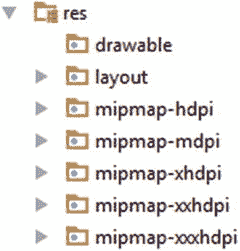

**图 4-1.** 我的 `res/` 文件夹怎么了？


我们已经在第 1 章中看到设备有不同的尺寸，但我们没有讨论 Android 如何处理这些不同的尺寸。事实上，Android 有一套精巧的机制，允许你为一组屏幕密度定义图形资源。屏幕密度是物理屏幕尺寸和屏幕像素数量的结合。我们将在第 5 章中更详细地探讨这个主题。目前，只需知道 Android 定义了五种密度：`mdpi`（标准密度屏幕）、`hdpi`（高密度屏幕）和`xhdpi`（超高密度屏幕）；随后是超超高密度和超超超高密度（分别为 480dpi 和 640dpi）。对于标准屏幕，我们通常使用较小的图像，而对于更高密度的屏幕，则使用高分辨率资源。

因此，对于我们的图标，需要提供五个版本：每种密度一个。但是每个版本的大小应该是多少？幸运的是，在`res/mipmap`文件夹中已经有默认图标，我们可以用来逆向工程我们自己图标的大小。`res/mipmap-mdpi`中的图标分辨率为 48×48 像素；`res/mipmap-hdpi`中的图标分辨率为 72×72 像素；`res/mipmap-xhdpi`中的图标分辨率为 96×96 像素；`res/mipmap-xxhdpi`文件夹中的图标分辨率为 144×144；最后，`res/mipmap-xxxhdpi`文件夹中的图标分辨率为 192×192。我们需要做的就是创建具有相同分辨率的自定义图标版本，并将每个文件夹中的`ic_launcher.png`文件替换为我们自己的`ic_launcher.png`文件。只要我们将图标图像文件命名为`ic_launcher.png`，就可以保持清单文件不变。请注意，清单文件中的文件引用是区分大小写的。资源文件始终使用全小写字母。

最后，我们已准备好进行一些 Android 编码。

## Android API 基础

在本章的剩余部分，我们将专注于使用与我们游戏开发需求相关的 Android API。为此，我们将做一些相当方便的事情：设置一个测试项目，该项目将包含我们即将使用的不同 API 的所有小测试示例。让我们开始吧。

## 创建测试项目

从前面的章节中，我们已经知道如何设置我们所有的项目。因此，我们要做的第一件事是执行前面概述的八个步骤。创建一个名为`Ch04 Android Basics`的应用程序，使用包名`androidgames.badlogic.com`，并带有一个名为`MainActivity`的主活动。我们将使用一些较旧和较新的 API，因此我们将最低 SDK 版本设置为 18（Android 4.3）。对于其他设置，例如应用程序的标题，您可以填写任意值。从现在开始，我们要做的就是创建新的活动实现，每个实现演示 Android API 的一部分。

然而，请记住我们只有一个主活动。那么，我们的主活动应该是什么样的？我们想要一种方便的方法来添加新活动，并且希望能够轻松启动特定活动。对于一个主活动，它应该清楚该活动将提供一种启动特定测试活动的方法。如前所述，主活动将在清单文件中被指定为主要入口点。我们添加的每个额外活动都将不带`<intent-filter>`子元素进行指定。我们将从主活动以编程方式启动它们。

### `AndroidBasicsStarter` 活动

Android API 为我们提供了一个名为`ListActivity`的特殊类，它派生自我们在 Hello World 项目中使用的`Activity`类。`ListActivity`类是一种特殊类型的活动，其唯一目的是显示事物列表（例如，字符串）。我们用它来显示测试活动的名称。当我们触摸列表项之一时，我们将以编程方式启动相应的活动。清单 4-1 显示了我们的`AndroidBasicsStarter`主活动的代码。

```java
package com.badlogic.androidgames.ch04androidbasics;
import android.app.ListActivity;
import android.content.Intent;
import android.os.Bundle;
import android.view.View;
import android.widget.ArrayAdapter;
import android.widget.ListView;
public class MainActivity extends ListActivity {
    String tests[] = { "LifeCycleTest", "SingleTouchTest", "MultiTouchTest",
    "KeyTest", "AccelerometerTest", "AssetsTest",
    "ExternalStorageTest", "SoundPoolTest", "MediaPlayerTest",
    "FullScreenTest", "RenderViewTest", "ShapeTest", "BitmapTest",
    "FontTest", "SurfaceViewTest" };
    public void onCreate(Bundle savedInstanceState) {
        super.onCreate(savedInstanceState);
        setListAdapter(new ArrayAdapter(this,
        android.R.layout.simple_list_item_1, tests));
    }
    @Override
    protected void onListItemClick(ListView list, View view, int position,
    long id) {
        super.onListItemClick(list, view, position, id);
        String testName = tests[position];
        try {
            Class clazz = Class.forName("com.badlogic.androidgames.ch04androidbasics." + testName);
            Intent intent = new Intent(this, clazz);
            startActivity(intent);
        } catch (ClassNotFoundException e) {
            e.printStackTrace();
        }
    }
}
```
*清单 4-1. `AndroidBasicsStarter.java`，我们负责列出并启动所有测试的主活动*

我们选择的包名是`com.badlogic.androidgames.ch04androidbasics`。导入应该也很容易解释；它们只是我们将要在代码中使用的所有类。我们的`MainActivity`类派生自`ListActivity`类——仍然没什么特别的。字段`tests`是一个字符串数组，保存了我们的启动器应用程序应显示的所有测试活动的名称。请注意，该数组中的名称是我们稍后将实现的活动类的确切 Java 类名。

下一段代码应该很熟悉；它是`onCreate()`方法，我们为每个活动实现该方法，并且当活动创建时会被调用。

抛开这些，接下来我们调用一个名为`setListAdapter()`的方法。这个方法是由它派生出的`ListActivity`类提供给我们的。它允许我们指定希望`ListActivity`类为我们显示的列表项。这些需要以实现了`ListAdapter`接口的类实例的形式传递给该方法。我们使用方便的`ArrayAdapter`类来实现这一点。该类的构造函数接受三个参数：第一个是我们的上下文，第二个我们将在下一段中解释，第三个是`ListActivity`应该显示的数组项。我们愉快地为第三个参数指定了之前定义的`tests`数组，这就完成了。


#### 那么，`ArrayAdapter` 构造函数的第二个参数到底是什么？

要解释这个问题，我们得深入探讨 Android UI 相关的 API，但本书并不会用到这些内容。因此，与其浪费篇幅介绍我们不需要的东西，不如直接给你一个简单粗暴的说明：列表中的每一项都是通过一个 `View` 来显示的。这个参数定义了每个 `View` 的布局及其类型。`android.R.layout.simple_list_item_1` 是 UI API 提供的一个预定义常量，用于快速启动和运行。它代表一个标准的列表项 `View`，用于显示文本。简单回顾一下，`View` 是 Android 上的 UI 组件，比如按钮、文本框或滑块。在剖析第 2 章的 `HelloWorldActivity` 时，我们曾以 `Button` 实例的形式介绍过视图。

如果我们的 Activity 只包含这个 `onCreate()` 方法，启动后就会看到类似图 4-2 所示的屏幕。

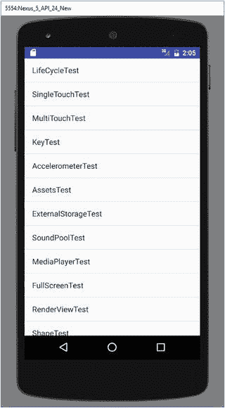

图 4-2. 我们的测试启动 Activity，看起来花哨，但功能有限

现在，让我们实现当触摸列表项时触发某个操作。我们想要启动对应所触摸列表项的 Activity。

## 以编程方式启动 Activity

`ListActivity` 类有一个名为 `onListItemClick()` 的受保护方法，当点击列表项时会调用该方法。我们只需要在 `AndroidBasicsStarter` 类中重写这个方法即可。这正是我们在代码清单 4-1 中所做的。

该方法的参数包括：`ListActivity` 用来显示列表项的 `ListView`、被触摸且包含在该 `ListView` 中的 `View`、所触摸项在列表中的 `position`（位置），以及一个我们不太关心的 ID。我们真正关注的是 `position` 参数。

`onListItemClicked()` 方法以良好的规范开头，首先调用基类方法。这是重写 Activity 方法时总是推荐的做法。接着，我们根据 `position` 参数从 `tests` 数组中获取类名。这是解决问题的第一步。

前面我们提到过，可以通过 Intent 以编程方式启动已在清单文件中定义的 Activity。`Intent` 类有一个简洁的构造函数用于此操作，它接受两个参数：一个 `Context` 实例和一个 `Class` 实例。后者代表我们要启动的 Activity 的 Java 类。

`Context` 是一个接口，为我们提供应用程序的全局信息。`Activity` 类实现了该接口，所以我们只需将 `this` 引用传递给 `Intent` 构造函数即可。

为了获取代表要启动的 Activity 的 `Class` 实例，我们使用了少量反射技术。如果你用过 Java，应该对此比较熟悉。反射允许我们在运行时以编程方式检查、实例化和调用类。静态方法 `Class.forName()` 接受一个字符串，其中包含我们要为其创建 `Class` 实例的类的完全限定名。我们稍后要实现的所有测试 Activity 都将位于 `com.badlogic.androidgames.ch04androidbasics` 包中。将包名与从 `tests` 数组中获取的类名拼接起来，就能得到要启动的 `Activity` 类的完全限定名。我们将该名称传递给 `Class.forName()`，获得一个可用于 `Intent` 构造函数的 `Class` 实例。

一旦构造好 `Intent` 实例，我们就可以通过调用 `startActivity()` 方法来启动它。该方法也定义在 `Context` 接口中。由于我们的 Activity 实现了该接口，我们只需调用它对该方法的实现。就这么简单！

那么，我们的应用程序将如何表现呢？首先，会显示启动 Activity。每次触摸列表中的某个项，就会启动相应的 Activity。启动 Activity 将被暂停并进入后台。新 Activity 将由我们发出的 Intent 创建，并替换屏幕上的启动 Activity。当我们按下 Android 设备的返回键时，该 Activity 会被销毁，启动 Activity 会恢复并重新占据屏幕。

## 创建测试 Activity

在创建新的测试 Activity 时，我们需要执行以下步骤：

1.  在 `com.badlogic.androidgames.ch04androidbasics` 包中创建对应的 Java 类，并实现其逻辑。
2.  在清单文件中为 Activity 添加条目，并根据需要使用相应的属性（例如 `android:configChanges` 或 `android:screenOrientation`）。注意，我们不会指定 `<intent-filter>` 元素，因为我们将以编程方式启动该 Activity。
3.  将 Activity 的类名添加到 `AndroidBasicsStarter` 类的 `tests` 数组中。

只要遵循这一流程，其他所有事务都将由我们在 `AndroidBasicsStarter` 类中实现的逻辑自动处理。新 Activity 会自动出现在列表中，只需轻轻一触即可启动。

你可能会好奇，触摸启动的测试 Activity 是否在自己的进程和虚拟机中运行。答案是否定的。由多个 Activity 组成的应用程序有一个称为 Activity 栈的结构。每次启动一个新 Activity，它就会被压入该栈中。当我们关闭新 Activity 时，最后压入栈中的 Activity 会被弹出并恢复，成为屏幕上新的活动 Activity。

这带来了一些其他影响。首先，应用程序中的所有 Activity（栈中暂停的 Activity 和当前活动的 Activity）共享同一个虚拟机。它们也共享同一个内存堆。这既可能是福音，也可能是诅咒。如果你的 Activity 中有静态字段，一旦它们启动，就会在堆上分配内存。作为静态字段，它们会存活于 Activity 销毁及后续的垃圾回收之后。如果粗心地使用静态字段，可能会导致严重的内存泄漏。在使用静态字段之前请三思。

如前所述，我们在实际游戏中只会使用单个 Activity。前面的 Activity 启动器是此规则的一个例外，目的是让我们的工作更轻松。但请放心，即使只有一个 Activity，我们也有很多机会遇到麻烦。

> **注：** 这就是我们对 Android UI 编程的深入程度。从现在开始，我们将始终在 Activity 中使用单个 `View` 来输出内容和接收输入。如果你想了解布局、视图组以及 Android UI 库提供的各种功能，建议你查阅 Grant Allen 的著作《Beginning Android 4》（Apress, 2011），或者 Android 开发者网站上的优秀开发者指南。

## Activity 的生命周期

在为 Android 编程时，首先要弄清楚的是 Activity 的行为方式。在 Android 中，这被称为 Activity 的生命周期。它描述了 Activity 可能经历的状态以及这些状态之间的转换。让我们先讨论其背后的理论。

### 理论部分

一个 Activity 可以处于以下三种状态之一：

* **运行中**：在此状态下，它是占据屏幕的顶层 Activity，直接与用户交互。


*   `Paused`（暂停）：当 Activity 在屏幕上仍然可见，但被透明 Activity 或对话框部分遮挡，或者设备屏幕被锁定时，会发生此状态。暂停的 Activity 随时可能被 Android 系统终止（例如，由于内存不足）。请注意，Activity 实例本身仍在虚拟机堆中活跃运行，并等待恢复为运行状态。
*   `Stopped`（停止）：当 Activity 被另一个 Activity 完全遮挡，从而在屏幕上不再可见时，会发生此状态。例如，如果我们启动一个测试 Activity，`AndroidBasicsStarter` Activity 就会处于此状态。当用户按下主页按钮暂时返回主屏幕时，也会发生此状态。如果内存不足，系统可能再次决定完全终止该 Activity 并将其从内存中移除。

在暂停和停止状态下，Android 系统都可能随时决定终止 Activity。它既可以礼貌地通过调用其 `finished()` 方法先通知 Activity，也可以不礼貌地直接静默终止 Activity 的进程。

Activity 可以从暂停或停止状态恢复到运行状态。再次注意，当 Activity 从暂停或停止状态恢复时，它在内存中仍是同一个 Java 实例，因此所有状态和成员变量都与 Activity 暂停或停止之前完全相同。

Activity 有一些我们可以重写以获取状态变化信息的保护方法：

*   `Activity.onCreate()`：当我们的 Activity 首次启动时调用。在这里，我们设置所有 UI 组件并接入输入系统。在 Activity 的生命周期中，此方法只会被调用一次。
*   `Activity.onRestart()`：当 Activity 从停止状态恢复时调用。它位于 `onStop()` 调用之后。
*   `Activity.onStart()`：在 `onCreate()` 之后或当 Activity 从停止状态恢复时调用。在后一种情况下，它位于 `onRestart()` 调用之后。
*   `Activity.onResume()`：在 `onStart()` 之后或当 Activity 从暂停状态恢复时调用（例如，当屏幕解锁时）。
*   `Activity.onPause()`：当 Activity 进入暂停状态时调用。这可能是我们收到的最后一次通知，因为 Android 系统可能决定静默终止我们的应用。我们应该在此方法中保存所有想要持久化的状态！
*   `Activity.onStop()`：当 Activity 进入停止状态时调用。它位于 `onPause()` 调用之后。这意味着 Activity 在暂停之前已经停止。与 `onPause()` 一样，这可能是我们在 Android 系统静默终止 Activity 之前收到的最后一次通知。我们也可以在此处保存持久状态。但是，系统可能决定不调用此方法而直接终止 Activity。由于 `onPause()` 总是在 `onStop()` 之前且 Activity 被静默终止之前调用，我们更应该在 `onPause()` 方法中保存所有内容。
*   `Activity.onDestroy()`：在 Activity 生命周期结束时，当 Activity 被不可逆地销毁时调用。这是我们能持久化任何信息以在下次 Activity 重新创建时恢复的最后机会。请注意，如果系统在调用 `onPause()` 或 `onStop()` 之后静默销毁了 Activity，此方法实际上可能永远不会被调用。

图 4-3 展示了 Activity 生命周期和方法调用顺序。

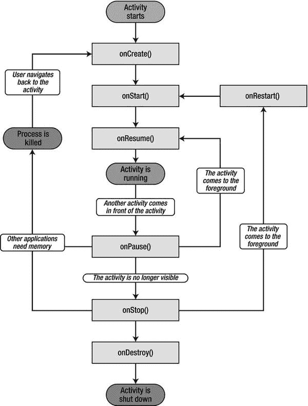

图 4-3.

强大而令人困惑的 Activity 生命周期

以下是我们应从中学到的三个重要经验：

1.  在我们的 Activity 进入运行状态之前，无论我们是从停止状态还是暂停状态恢复，`onResume()` 方法总会被调用。因此，我们可以安全地忽略 `onRestart()` 和 `onStart()` 方法。我们不关心是从停止状态还是暂停状态恢复。对于我们的游戏，我们只需要知道我们现在确实在运行，而 `onResume()` 方法向我们发出了这个信号。
2.  在 `onPause()` 之后，Activity 可能被静默销毁。我们绝不应该假设 `onStop()` 或 `onDestroy()` 一定会被调用。我们也知道 `onPause()` 总是在 `onStop()` 之前被调用。因此，我们可以安全地忽略 `onStop()` 和 `onDestroy()` 方法，只需重写 `onPause()`。在此方法中，我们必须确保所有想要持久化的状态（如最高分和关卡进度）都被写入外部存储（例如 SD 卡）。在 `onPause()` 之后，一切都无法保证，我们不知道我们的 Activity 是否还有机会再次运行。
3.  我们知道，如果系统决定在 `onPause()` 或 `onStop()` 之后终止 Activity，`onDestroy()` 可能永远不会被调用。然而，有时我们想知道 Activity 是否真的要被终止。那么，如果 `onDestroy()` 不会被调用，我们该如何做呢？`Activity` 类有一个名为 `Activity.isFinishing()` 的方法，我们可以随时调用它来检查我们的 Activity 是否要被终止。我们至少可以保证在 Activity 被终止之前，`onPause()` 方法会被调用。我们只需要在 `onPause()` 方法内调用这个 `isFinishing()` 方法，就能判断 Activity 在 `onPause()` 调用之后是否即将结束。

这让事情变得简单多了。我们只需重写 `onCreate()`、`onResume()` 和 `onPause()` 方法。

*   在 `onCreate()` 中，我们设置窗口以及用于渲染和接收输入的 UI 组件。
*   在 `onResume()` 中，我们（重新）启动主循环线程（在第 3 章中讨论）。
*   在 `onPause()` 中，我们只需暂停我们的主循环线程，并且如果 `Activity.isFinishing()` 返回 `true`，我们还将任何想要持久化的状态保存到磁盘。

许多人在 Activity 生命周期中挣扎，但如果我们遵循这些简单的规则，我们的游戏将能够处理暂停、恢复和清理工作。

#### 实践

让我们编写第一个测试示例来演示 Activity 生命周期。我们想要某种输出来显示到目前为止发生了哪些状态变化。我们将通过两种方式来实现：

1.  Activity 将显示的唯一 UI 组件是一个 `TextView`。顾名思义，它显示文本，我们在之前的主页 Activity 中隐式地使用它来显示每个条目。每次我们进入一个新状态时，我们都会向 `TextView` 追加一个字符串，它将显示到目前为止发生的所有状态变化。
2.  我们无法在 `TextView` 中显示 Activity 的销毁事件，因为它会从屏幕上消失得太快，所以我们也会将所有状态变化输出到 `logcat`。我们使用 `Log` 类来实现，它提供了一些向 `logcat` 追加消息的静态方法。

还记得我们需要做什么来向测试应用添加一个测试 Activity 吗？首先，我们在清单文件中以 `<activity>` 元素的形式定义它，该元素是 `<application>` 元素的子元素：

```
<activity>...</activity>
```

接下来，我们向 `com.badlogic.androidgames.ch04androidbasics` 包中添加一个名为 `LifeCycleTest` 的新 Java 类。最后，我们将该类名称添加到我们之前定义的 `AndroidBasicsStarter` 类的 `tests` 成员中。（当然，在我们之前为了演示目的编写该类时，它已经在那里了。）


我们必须在接下来的章节中为任何创建的活动重复所有这些步骤。为简洁起见，我们不再赘述这些步骤。另外请注意，我们没有为`LifeCycleTest`活动指定方向。在此示例中，根据设备方向，我们可以处于横屏模式或竖屏模式。我们这样做是为了让您能够看到方向变化对生命周期的影响（由于我们设置了`configChanges`属性，所以没有影响）。清单 4-2 展示了整个活动的代码。

```
package com.badlogic.androidgames.ch04androidbasics.ch04androidbasics;
import android.support.v7.app.AppCompatActivity;
import android.os.Bundle;
import android.util.Log;
import android.widget.TextView;
public class LifeCycleTest extends AppCompatActivity {
StringBuilder builder = new StringBuilder();
TextView textView;
private void log(String text) {
Log.d("LifeCycleTest", text);
builder.append(text);
builder.append('\n');
textView.setText(builder.toString());
}
@Override
public void onCreate(Bundle savedInstanceState) {
super.onCreate(savedInstanceState);
textView = new TextView(this);
textView.setText(builder.toString());
setContentView(textView);
log("created");
}
@Override
protected void onResume() {
super.onResume();
log("resumed");
}
@Override
protected void onPause() {
super.onPause();
log("paused");
if (isFinishing()) {
log("finishing");
}
}
}
```

 清单 4-2. `LifeCycleTest.java`，演示活动生命周期

让我们快速浏览一下这段代码。该类继承自`AppCompatActivity`。该活动最初是在 SDK 22 中提供的，用于兼容 21 及更早版本。我们定义了两个成员：一个`StringBuilder`，它将保存到目前为止产生的所有消息；以及`TextView`，我们用它直接在活动中显示这些消息。

接下来，我们定义一个私有辅助方法，该方法会将文本记录到 logcat，将其追加到`StringBuilder`中，并更新`TextView`的文本。对于 logcat 输出，我们使用静态的`Log.d()`方法，该方法接受一个标签作为第一个参数，实际消息作为第二个参数。

在`onCreate()`方法中，我们首先调用父类方法。我们创建`TextView`并将其设置为活动的内容视图。它将填充活动的整个空间。最后，我们将“created”消息记录到 logcat，并使用之前定义的辅助方法`log()`更新`TextView`的文本。

接下来，我们重写活动的`onResume()`方法。与我们重写的任何活动方法一样，我们首先调用父类方法。我们所做的只是再次调用`log()`，并以`resumed`作为参数。

重写的`onPause()`方法看起来很像`onResume()`方法。我们首先将消息记录为“paused”。我们还想知道活动在`onPause()`方法调用后是否即将被销毁，因此我们检查了`Activity.isFinishing()`方法。如果它返回`true`，我们也会记录销毁事件。当然，我们将无法看到更新后的`TextView`文本，因为活动在屏幕显示更改之前就会被销毁。因此，我们也将所有内容输出到 logcat，如前所述。

运行应用程序并稍微试验一下这个测试活动。以下是您可以执行的一系列操作：

1.  从启动器活动启动测试活动。
2.  锁定屏幕。
3.  解锁屏幕。
4.  按主页按钮（这将带您回到主屏幕）。
5.  从正在运行的应用程序列表中选择您的应用程序。
6.  按返回按钮（这将带您回到启动器活动）。

如果您的系统在活动暂停时没有在任何时刻决定静默地杀死它，您将看到如图 4-4 所示的输出（当然，前提是您还没有按下返回按钮）。


图 4-4. 运行`LifeCycleTest`活动

启动时，调用`onCreate()`，然后调用`onResume()`。当我们锁定屏幕时，调用`onPause()`。当我们解锁屏幕时，调用`onResume()`。当我们按主页按钮时，调用`onPause()`。返回活动将再次调用`onResume()`。相同的消息当然也会显示在 logcat 中，您可以在 Android Studio 的 logcat 视图中观察到。图 4-5 显示了在执行上述操作序列（加上按返回按钮）时我们写入 logcat 的内容。

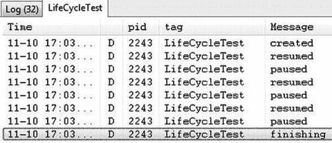

图 4-5. `LifeCycleTest`的 logcat 输出

再次按返回按钮会调用`onPause()`方法。由于它也会销毁活动，`onPause()`中的`if`语句也会被触发，通知我们这是该活动的最后一次出现。

这就是活动生命周期，为我们的游戏编程需求进行了简化和揭秘。我们现在可以轻松处理任何暂停和恢复事件，并且保证在活动被销毁时收到通知。

### 输入设备处理

如前面章节所述，我们可以从 Android 上的许多不同输入设备获取信息。在本节中，我们将讨论 Android 上最相关的四个输入设备以及如何处理它们：触摸屏、键盘、加速度计和指南针。

### 获取（多点）触摸事件

触摸屏可能是从用户那里获取输入的最重要方式。直到 Android 2.0 版本，API 只支持处理单指触摸事件。多点触控是在 Android 2.0（SDK 版本 5）中引入的。多点触控事件报告被附加到单点触控 API 上，在可用性上产生了一些混合的结果。我们将首先研究处理所有 Android 版本上可用的单点触控事件。

#### 处理单点触控事件

当我们在第 2 章中处理按钮上的点击时，我们看到监听器接口是 Android 向我们报告事件的方式。触摸事件也不例外。触摸事件被传递给我们注册到`View`的`OnTouchListener`接口实现。`OnTouchListener`接口只有一个方法：

```
boolean onTouch (View v, MotionEvent event)
```

第一个参数是接收触摸事件的`View`。第二个参数是我们需要解析以获取触摸事件的内容。

`OnTouchListener`可以通过`View.setOnTouchListener()`方法注册到任何`View`实现。在将`MotionEvent`分派给`View`本身之前，会先调用`OnTouchListener`。我们可以在`onTouch()`方法的实现中通过返回`true`来向`View`指示我们已经处理了该事件。如果我们返回`false`，`View`本身将处理该事件。

`MotionEvent`实例有三个与我们相关的方法：

*   `MotionEvent.getX()`和`MotionEvent.getY()`：这些方法报告触摸事件相对于`View`的 x 和 y 坐标。坐标系原点在视图的左上角，x 轴向右，y 轴向下。坐标以像素为单位。请注意，这些方法返回浮点数，因此坐标具有亚像素精度。
*   `MotionEvent.getAction()`：该方法返回触摸事件的类型。它是一个整数，取`MotionEvent.ACTION_DOWN`、`MotionEvent.ACTION_MOVE`、`MotionEvent.ACTION_CANCEL`或`MotionEvent.ACTION_UP`之一的值。


听起来很简单，事实也确实如此。当手指触摸屏幕时，会触发`MotionEvent.ACTION_DOWN`事件。手指移动时，会触发类型为`MotionEvent.ACTION_MOVE`的事件。请注意，你始终会收到`MotionEvent.ACTION_MOVE`事件，因为手指无法保持绝对静止来避免触发它们。触摸传感器能够识别最细微的变化。当手指再次抬起时，会报告`MotionEvent.ACTION_UP`事件。如果用户触摸某个元素并将手指拖离该元素，从而未完成操作，则可能会发生`MotionEvent.ACTION_CANCEL`事件。不过，在开始实现我们的第一个游戏时，我们仍会处理它，并将其视为`MotionEvent.ACTION_UP`事件。

让我们编写一个简单的测试 Activity 来看看它在代码中是如何工作的。该 Activity 应在屏幕上显示手指的当前位置以及事件类型。清单 4-3 展示了我们设计的内容。

```
package com.badlogic.androidgames.ch04androidbasics;

import android.support.v7.app.AppCompatActivity;
import android.os.Bundle;
import android.util.Log;
import android.view.MotionEvent;
import android.view.View;
import android.view.View.OnTouchListener;
import android.widget.TextView;

public class SingleTouchTest extends Activity implements OnTouchListener {
    StringBuilder builder = new StringBuilder();
    TextView textView;

    public void onCreate(Bundle savedInstanceState) {
        super.onCreate(savedInstanceState);
        textView = new TextView(this);
        textView.setText("Touch and drag (one finger only)!");
        textView.setOnTouchListener(this);
        setContentView(textView);
    }

    public boolean onTouch(View v, MotionEvent event) {
        builder.setLength(0);
        switch (event.getAction()) {
            case MotionEvent.ACTION_DOWN:
                builder.append("down, ");
                break;
            case MotionEvent.ACTION_MOVE:
                builder.append("move, ");
                break;
            case MotionEvent.ACTION_CANCEL:
                builder.append("cancel, ");
                break;
            case MotionEvent.ACTION_UP:
                builder.append("up, ");
                break;
        }
        builder.append(event.getX());
        builder.append(", ");
        builder.append(event.getY());
        String text = builder.toString();
        Log.d("TouchTest", text);
        textView.setText(text);
        return true;
    }
}
```

清单 4-3. `SingleTouchTest.java`：测试单点触摸处理

我们让 Activity 实现了`OnTouchListener`接口。我们还有两个成员变量：一个用于`TextView`，另一个是`StringBuilder`，用于构建事件字符串。

`onCreate()`方法不言自明。唯一的新颖之处在于调用了`TextView.setOnTouchListener()`，在此处我们向`TextView`注册了 Activity，以便它能接收`MotionEvents`。

剩下的就是`onTouch()`方法的实现。我们忽略了`view`参数，因为我们知道它一定就是`TextView`。我们只关心获取触摸事件类型，将标识该类型的字符串追加到`StringBuilder`中，添加触摸坐标，然后更新`TextView`的文本。仅此而已。我们还将事件记录到`logcat`中，以便查看事件发生的顺序，因为`TextView`只会显示我们处理的最后一个事件（每次调用`onTouch()`时，我们都会清空`StringBuilder`）。

`onTouch()`方法中有一个细微之处是`return`语句，我们返回了`true`。通常，我们会遵循监听器概念并返回`false`，以免干扰事件分发过程。但是，如果我们在示例中这样做，除了`MotionEvent.ACTION_DOWN`事件之外，我们将收不到任何其他事件。因此，我们告诉`TextView`我们刚刚消费了这个事件。这种行为在不同的`View`实现中可能会有所不同。幸运的是，在本书的其余部分，我们只需要另外三个视图，而且它们会很乐意让我们消费我们想要的任何事件。

如果在模拟器或连接的设备上启动该应用程序，我们会看到`TextView`始终显示报告给`onTouch()`方法的最后一个事件类型和位置。此外，你可以在`logcat`中看到相同的消息。

我们没有在清单文件中固定 Activity 的方向。如果旋转设备使 Activity 处于横屏模式，坐标系统当然会发生变化。图 4-6 显示了竖屏模式（左）和横屏模式（右）下的 Activity。在这两种情况下，我们都试图触摸`View`的中间位置。请注意 x 和 y 坐标似乎如何互换。该图还显示了这两种情况下的 x 和 y 轴（黄色线条），以及我们大致触摸到的屏幕上的点（绿色圆圈）。在这两种情况下，原点都在`TextView`的左上角，x 轴指向右，y 轴指向下。

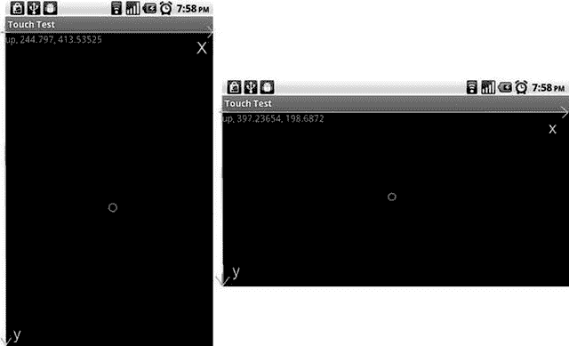

图 4-6. 在竖屏和横屏模式下触摸屏幕

当然，取决于方向，我们的最大 x 和 y 值会发生变化。由于触摸坐标是相对于视图给出的，并且视图并没有填满整个屏幕，所以我们的最大 y 值将小于屏幕分辨率的高度。稍后我们将看到如何启用全屏模式，以便标题栏和通知栏不会妨碍我们。

遗憾的是，在较老的 Android 版本和第一代设备上，触摸事件存在一些问题：

- **触摸事件洪流**：当手指按下触摸屏时，驱动程序会尽可能多地报告触摸事件——在某些设备上，每秒可达数百次。我们可以通过在`onTouch()`方法中添加一个`Thread.sleep(16)`调用来解决这个问题，这将使分发这些事件的 UI 线程休眠 16 毫秒。这样，我们每秒最多收到 60 个事件，这对于一个响应迅速的游戏来说已经绰绰有余。

- **触摸屏幕消耗 CPU**：即使我们在`onTouch()`方法中休眠，系统也必须在内核中处理驱动程序报告的事件。在较旧的设备上，例如 Hero 或 G1，这可能会消耗高达 50% 的 CPU，给我们的主循环线程留下的处理能力就少得多了。结果，我们原本完美的帧率会大幅下降，有时甚至会导致游戏无法运行。在第二代设备上，这个问题要小得多，通常可以忽略。遗憾的是，在较旧的设备上没有解决方案。

### 处理多点触摸事件

警告：前方剧痛！多点触摸 API 是附加到`MotionEvent`类上的，该类最初只处理单点触摸。这使得解码多点触摸事件时会非常混乱。让我们试着理清头绪。

处理多点触摸事件与处理单点触摸事件非常相似。我们仍然实现之前为单点触摸事件实现的`OnTouchListener`接口。我们还会得到一个`MotionEvent`实例，从中读取数据。我们也处理之前处理过的事件类型，比如`MotionEvent.ACTION_UP`，再加上一些不太复杂的新类型。

#### 指针 ID 和索引

处理多点触摸事件和处理单点触摸事件之间的区别始于我们想要访问触摸事件的坐标时。`MotionEvent.getX()`和`MotionEvent.getY()`返回屏幕上单个手指的坐标。当处理多点触摸事件时，我们使用这些方法的重载变体，它们接受一个指针索引。这可能如下所示：

```
event.getX(pointerIndex);
event.getY(pointerIndex);
```


现在，你可能会认为 `pointerIndex` 直接对应触摸屏幕的某个手指（例如，最先触摸的手指对应 `pointerIndex` 0，随后触摸的手指对应 `pointerIndex` 1，以此类推）。但遗憾的是，实际情况并非如此。

`pointerIndex` 是 `MotionEvent` 内部数组的索引，这些数组保存了屏幕上特定触摸手指的事件坐标。屏幕上手指的真实标识符被称为指针标识符（pointer identifier）。指针标识符是一个随机数，它唯一标识了触摸屏幕的一个指针实例。有一个名为 `MotionEvent.getPointerIdentifier(int pointerIndex)` 的独立方法，可以根据指针索引返回指针标识符。只要手指接触屏幕，其指针标识符就会保持不变。但指针索引却未必如此。理解这两者之间的区别至关重要，并且要明白你不能依赖第一次触摸的索引是 0 且 ID 是 0，因为在某些设备上，特别是初代 Xperia Play，指针 ID 会一直递增到 15，然后从 0 重新开始，而不是重复使用可用的最小 ID 数字。

让我们先来研究如何获取事件的指针索引。我们暂时忽略事件类型。

```
int pointerIndex = (event.getAction() & MotionEvent.ACTION_POINTER_INDEX_MASK) >> MotionEvent.ACTION_POINTER_INDEX_SHIFT;
```

你此刻的想法，大概和我们当初首次实现这段代码时一样。在对人性失去信心之前，让我们先来解读一下这里发生的事情。我们通过 `MotionEvent.getAction()` 从 `MotionEvent` 中获取事件类型。很好，这个我们之前做过。接着，我们对从 `MotionEvent.getAction()` 方法获取的整数和一个名为 `MotionEvent.ACTION_POINTER_INDEX_MASK` 的常量进行按位 **与** 运算。现在，有趣的部分来了。

这个常量的值是 `0xff00`，所以我们实际上把除了第 8 到第 15 位之外的所有位都置为 0，而这第 8 到第 15 位正好保存了事件的指针索引。`event.getAction()` 返回的整数的最低 8 位保存了事件类型的值，例如 `MotionEvent.ACTION_DOWN` 及其同类事件。通过这个按位运算，我们实际上舍弃了事件类型。现在，移位操作的含义应该更清晰了。我们右移 `MotionEvent.ACTION_POINTER_INDEX_SHIFT` 位，该常量的值是 8，所以我们基本上是把第 8 到第 15 位移到了第 0 到第 7 位，从而得到事件实际的指针索引。有了这个索引，我们就可以获取事件的坐标，以及指针标识符。

请注意，我们的魔术常量被命名为 `XXX_POINTER_INDEX_XXX`，而不是 `XXX_POINTER_ID_XXX`（后者听起来更合理，因为我们实际上是要提取指针索引，而不是指针标识符）。嗯，大概是 Android 工程师自己也被搞糊涂了。在 SDK 版本 8 中，他们弃用了这些常量，并引入了名为 `XXX_POINTER_ID_XXX` 的新常量，这些新常量与已弃用的旧常量有着完全相同的值。为了让那些基于 SDK 版本 5 编写的旧版应用能在新版 Android 上继续运行，这些旧常量仍然可用。

所以，我们现在知道了如何获取那个神秘的指针索引，并可以用它来查询事件的坐标和指针标识符。

### 动作掩码与更多事件类型

接下来，我们需要获取纯粹的事件类型，去掉 `MotionEvent.getAction()` 返回的整数中编码的额外指针索引。我们只需屏蔽掉指针索引：

```
int action = event.getAction() & MotionEvent.ACTION_MASK;
```

好的，这很容易。不过，只有当你理解了什么是指针索引，并且知道它确实被编码在 action 中时，才能明白这行代码的作用。

剩下的工作就是像之前一样解码事件类型。我们已经提到过有一些新的事件类型，现在来逐一了解：

*   `MotionEvent.ACTION_POINTER_DOWN`：当第一个手指触摸之后，任何额外的手指触摸屏幕时，就会触发此事件。第一个手指触摸时仍然会产生 `MotionEvent.ACTION_DOWN` 事件。
*   `MotionEvent.ACTION_POINTER_UP`：这个与前一个动作类似。当有手指从屏幕上抬起，且屏幕上仍有一个以上手指触摸时，会触发此事件。最后一个离开屏幕的手指会产生 `MotionEvent.ACTION_UP` 事件。这个手指不一定是最先触摸屏幕的那个手指。

幸运的是，我们可以直接把这两种新事件类型当作旧的 `MotionEvent.ACTION_UP` 和 `MotionEvent.ACTION_DOWN` 事件来处理。

最后一个不同点在于：一个单独的 `MotionEvent` 对象可能包含多个事件的数据。是的，你没看错。要实现这一点，合并的事件必须具有相同的类型。实际上，这种情况只会发生在 `MotionEvent.ACTION_MOVE` 事件上，所以我们在处理该事件类型时只需要考虑这一点。要检查一个 `MotionEvent` 中包含多少个事件，我们使用 `MotionEvent.getPointerCount()` 方法，它能告诉我们有多少个手指的坐标数据位于这个 `MotionEvent` 中。然后，我们可以通过 `MotionEvent.getX()`、`MotionEvent.getY()` 和 `MotionEvent.getPointerId()` 方法，获取从 0 到 `MotionEvent.getPointerCount() – 1` 的指针索引对应的指针标识符和坐标。

#### 实践

我们来为这个优秀的 API 编写一个示例。我们希望最多追踪十个手指。Android 设备通常会在我们向屏幕添加更多手指时分配连续的指针索引，但这并不总是保证成立的，因此我们依靠指针索引来管理数组，并简单显示每个触摸点分配的 ID。我们追踪每个指针的坐标和触摸状态（是否正在触摸），然后通过一个 `TextView` 将这个信息输出到屏幕上。我们将测试 Activity 命名为 `MultiTouchTest`。清单 4-4 展示了完整的代码。

```
package com.badlogic.androidgames.ch04androidbasics;
import android.support.v7.app.AppCompatActivity;
import android.os.Bundle;
import android.view.MotionEvent;
import android.view.View;
import android.view.View.OnTouchListener;
import android.widget.TextView;
public class MultiTouchTest extends AppCompatActivity implements OnTouchListener {
StringBuilder builder = new StringBuilder();
TextView textView;
float[] x = new float[10];
float[] y = new float[10];
boolean[] touched = new boolean[10];
int[] id = new int[10];
private void updateTextView() {
builder.setLength(0);
for (int i = 0; i < 10; i++) {
builder.append(touched[i]);
builder.append(", ");
builder.append(id[i]);
builder.append(", ");
builder.append(x[i]);
builder.append(", ");
builder.append(y[i]);
builder.append("\n");
}
textView.setText(builder.toString());
}
@Override
public void onCreate(Bundle savedInstanceState) {
super.onCreate(savedInstanceState);
textView = new TextView(this);
textView.setText("触摸并拖动（支持多指）！");
textView.setTextSize(10);
setContentView(textView);
textView.setOnTouchListener(this);
}
@Override
public boolean onTouch(View v, MotionEvent event) {
int action = event.getAction() & MotionEvent.ACTION_MASK;
int pointerIndex = (event.getAction() & MotionEvent.ACTION_POINTER_INDEX_MASK) >> MotionEvent.ACTION_POINTER_INDEX_SHIFT;
int pointerCount = event.getPointerCount();
for (int i = 0; i < 10; i++) {
if (i >= pointerCount) {
touched[i] = false;
id[i] = -1;
continue;
}
if (event.getAction() != MotionEvent.ACTION_MOVE && i != pointerIndex) {
// 如果是 up/down/cancel/out 事件，通过 id 来屏蔽，以判断是否应该处理此触摸点
continue;
}
int pointerId = event.getPointerId(i);
switch (action) {
case MotionEvent.ACTION_DOWN:
case MotionEvent.ACTION_POINTER_DOWN:
touched[i] = true;
id[i] = pointerId;
x[i] = (int) event.getX(i);
y[i] = (int) event.getY(i);
break;
case MotionEvent.ACTION_UP:
case MotionEvent.ACTION_POINTER_UP:
case MotionEvent.ACTION_OUTSIDE:
case MotionEvent.ACTION_CANCEL:
touched[i] = false;
id[i] = -1;
x[i] = (int) event.getX(i);
y[i] = (int) event.getY(i) ;
break;
case MotionEvent.ACTION_MOVE:
touched[i] = true;
id[i] = pointerId;
x[i] = (int) event.getX(i);
y[i] = (int) event.getY(i);
break;
}
}
updateTextView();
return true;
}
}
```

*清单 4-4.* `MultiTouchTest.java`：测试多点触控 API


我们实现`OnTouchListener`接口与之前一样。为了跟踪十根手指的坐标和触摸状态，我们添加了三个新的成员数组来保存这些信息。数组`x`和`y`保存每个指针 ID 的坐标，数组`touched`存储具有该指针 ID 的手指是否按下。

接下来，我们创建了一个小辅助方法，将手指的当前状态输出到`TextView`。该方法简单地遍历所有十个手指状态，并通过`StringBuilder`将它们连接起来。最终的文本被发送到`TextView`。

`onCreate()`方法设置我们的活动，并将其注册为`TextView`的`OnTouchListener`。这部分我们已经非常熟悉了。

现在，进入令人头疼的部分：`onTouch()`方法。

我们首先通过屏蔽`event.getAction()`返回的整数来获取事件类型。接着，我们提取指针索引，并根据之前的讨论，从`MotionEvent`中获取对应的指针标识符。

`onTouch()`方法的核心是那个巨大的`switch`语句，我们之前以简化形式使用它来处理单点触摸事件。我们从高层次将所有事件分为三类：

- 触摸按下事件发生（`MotionEvent.ACTION_DOWN`或`MotionEvent.ACTION_POINTER_DOWN`）：我们将该指针标识符的触摸状态设置为`true`，并保存该指针的当前坐标。
- 触摸抬起事件发生（`MotionEvent.ACTION_UP`、`MotionEvent.ACTION_POINTER_UP`或`MotionEvent.CANCEL`）：我们将该指针标识符的触摸状态设置为`false`，并保存其最后已知坐标。
- 一根或多根手指在屏幕上拖动（`MotionEvent.ACTION_MOVE`）：我们检查`MotionEvent`中包含多少个事件，然后更新指针索引从 0 到`MotionEvent.getPointerCount()-1`的坐标。对于每个事件，我们获取对应的指针 ID 并更新坐标。

事件处理完成后，我们通过调用之前定义的`updateView()`方法来更新`TextView`。最后，我们返回`true`，表示我们处理了触摸事件。

图 4-7 显示了在 Samsung Galaxy Nexus 上触摸五根手指并稍微拖动它们后，活动产生的输出。

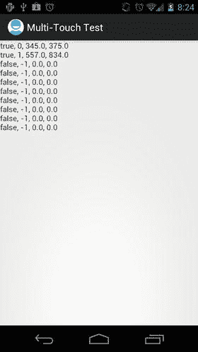

图 4-7. 多点触摸的乐趣

运行此示例时，我们可以观察到几点：

- 模拟器上不支持多点触摸。如果我们创建运行 Android 2.0 或更高版本的模拟器，API 是存在的，但我们只有一个鼠标。要模拟多点触摸，在 Windows 上按住 CTRL 键，在 Mac 上按住 COMMAND 键。
- 触摸两根手指，抬起第一根，然后再次触摸它。抬起第一根手指后，第二根手指将保留其指针 ID。当第一根手指第二次触摸时，它会获得一个新的指针 ID，通常为 0，但可以是任何整数。任何新触摸屏幕的手指都会获得一个新的指针 ID，该 ID 可以是当前未被其他活动触摸使用的任何值。这是需要记住的规则。
- 如果你在低端智能手机上尝试，当你在同一轴上交叉两根手指时，可能会注意到一些奇怪的行为。这是因为这些设备的屏幕不完全支持单独手指的跟踪。这是一个大问题，但我们可以通过精心设计 UI 来在一定程度上绕开它。我们将在后面的章节中再次讨论这个问题。需要记住的一句话是：不要交叉！

这就是 Android 上多点触摸处理的原理。虽然有点痛苦，但一旦你理清了所有术语并接受了位操作，你会对实现感到更加得心应手，并像专家一样处理所有触摸点。

注意

如果这部分内容让你的大脑爆炸，我们深表歉意。这节内容相当繁重。遗憾的是，该 API 的官方文档非常欠缺，大多数人只是通过反复尝试来“学习”API。我们建议你多玩玩前面的代码示例，直到完全理解其中的原理。

处理按键事件

经历了上一节的疯狂之后，你应该得到一些非常简单的东西。欢迎来到按键事件处理。

要捕获按键事件，我们需要实现另一个监听器接口，即`OnKeyListener`。它有一个名为`onKey()`的单一方法，签名如下：

```
public boolean onKey(View view, int keyCode, KeyEvent event)
```

`View`参数指定接收按键事件的视图，`keyCode`参数是`KeyEvent`类中定义的常量之一，最后一个参数是按键事件本身，它包含一些附加信息。

什么是键码？每个（屏幕上的）键盘键和每个系统键都有一个唯一的数字与之对应。这些键码在`KeyEvent`类中定义为静态公共最终整型。其中一个键码是`KeyEvent.KEYCODE_A`，它是 A 键的代码。这与在文本字段中按下按键时生成的字符无关。它只是标识按键本身。

`KeyEvent`类类似于`MotionEvent`类。它有两个与我们相关的方法：

- `KeyEvent.getAction()`：此方法返回`KeyEvent.ACTION_DOWN`、`KeyEvent.ACTION_UP`和`KeyEvent.ACTION_MULTIPLE`。就我们的目的而言，我们可以忽略最后一种按键事件类型。其他两种将在按键被按下或释放时发送。
- `KeyEvent.getUnicodeChar()`：此方法返回按键在文本字段中会产生的 Unicode 字符。假设我们按住 Shift 键并按下 A 键。这将报告为一个键码为`KeyEvent.KEYCODE_A`但 Unicode 字符为`A`的事件。如果我们想自己进行文本输入，可以使用此方法。

要接收键盘事件，`View`必须获得焦点。这可以通过以下方法调用来强制实现：

```
View.setFocusableInTouchMode(true);
View.requestFocus();
```

第一个方法将保证`View`可以获得焦点。第二个方法请求特定的`View`获得焦点。

让我们实现一个简单的测试活动，看看这如何组合工作。我们想要获取按键事件，并在`TextView`中显示我们接收到的最后一个事件。我们将显示的信息是按键事件类型、键码以及 Unicode 字符（如果有的话）。请注意，某些按键本身不会产生 Unicode 字符，而只能与其他字符组合产生。清单 4-5 演示了如何用少量代码行实现所有这些功能。


```java
package com.badlogic.androidgames.ch04androidbasics.ch04androidbasics;
import android.support.v7.app.AppCompatActivity;
import android.os.Bundle;
import android.util.Log;
import android.view.KeyEvent;
import android.view.View;
import android.view.View.OnKeyListener;
import android.widget.TextView;
public class KeyTest extends AppCompatActivity implements OnKeyListener {
StringBuilder builder = new StringBuilder();
TextView textView;
public void onCreate(Bundle savedInstanceState) {
super.onCreate(savedInstanceState);
textView = new TextView(this);
textView.setText("Press keys (if you have some)!");
textView.setOnKeyListener(this);
textView.setFocusableInTouchMode(true);
textView.requestFocus();
setContentView(textView);
}
public boolean onKey(View view, int keyCode, KeyEvent event) {
builder.setLength(0);
switch (event.getAction()) {
case KeyEvent.ACTION_DOWN:
builder.append("down, ");
break;
case KeyEvent.ACTION_UP:
builder.append("up, ");
break;
}
builder.append(event.getKeyCode());
builder.append(", ");
builder.append((char) event.getUnicodeChar());
String text = builder.toString();
Log.d("KeyTest", text);
textView.setText(text);
return event.getKeyCode() != KeyEvent.KEYCODE_BACK;
}
}
```

代码清单 4-5. `KeyTest.Java`：测试按键事件 API

首先，我们声明该 Activity 实现了 `OnKeyListener` 接口。接着，我们定义两个已经熟悉的成员变量：一个 `StringBuilder` 用于构建要显示的文本，以及一个 `TextView` 用于显示文本。

在 `onCreate()` 方法中，我们确保 `TextView` 获得焦点，以便其能接收按键事件。我们还通过 `TextView.setOnKeyListener()` 方法将 Activity 注册为 `OnKeyListener`。

`onKey()` 方法也很直接了当。我们在 `switch` 语句中处理两种事件类型，向 `StringBuilder` 追加相应的字符串。接着，我们追加按键码以及来自 `KeyEvent` 本身的 Unicode 字符，并将 `StringBuffer` 实例的内容输出到 logcat 和 `TextView` 中。

最后一个 `if` 语句很有意思：如果按下了返回键，我们从 `onKey()` 方法中返回 `false`，让 `TextView` 处理该事件。否则，我们返回 `true`。为什么在这里要区分处理呢？

如果我们在返回键的情况下返回 `true`，就会稍微干扰 Activity 的生命周期。由于我们决定自己消费返回键事件，Activity 将不会关闭。当然，在某些场景下我们确实需要捕获返回键，以防止 Activity 关闭。但强烈建议除非万不得已，不要这样做。

图 4-8 展示了在 Droid 设备的键盘上同时按住 Shift 键和 A 键时 Activity 的输出结果。

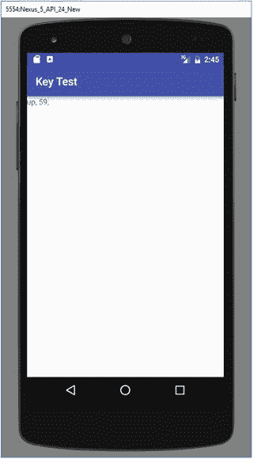

图 4-8. 同时按下 Shift 键和 A 键

这里有几点需要注意：

*   观察 logcat 输出时，请注意我们可以轻松处理同时发生的按键事件。同时按住多个按键不是问题。
*   按下方向键和滚动轨迹球都会作为按键事件上报。
*   与触摸事件类似，按键事件在旧版 Android 系统和第一代设备上可能会消耗大量 CPU 资源。不过，它们不会产生事件洪流。

与上一节相比，这一节的内容相当轻松，不是吗？

**注意**

按键处理 API 实际上比我们这里展示的要复杂一些。不过，对于我们游戏编程项目而言，这里包含的信息已经绰绰有余。如果你需要更复杂的功能，请参考 Android 开发者网站上的官方文档。

## 读取加速度计状态

对于游戏来说，一个非常有趣的输入选项是加速度计。所有 Android 设备都必须配备一个三轴加速度计。我们在第 3 章中简单讨论过加速度计。通常，我们只需要轮询加速度计的状态即可。

那么，我们该如何获取加速度计信息呢？如果你说通过注册监听器，那就猜对了。我们需要实现的接口叫做 `SensorEventListener`，它包含两个方法：

```java
public void onSensorChanged(SensorEvent event);
public void onAccuracyChanged(Sensor sensor, int accuracy);
```

第一个方法在新的加速度计事件到达时被调用。第二个方法在加速度计精度发生变化时被调用。出于我们的目的，可以放心地忽略第二个方法。

那么，我们在哪里注册我们的 `SensorEventListener` 呢？为此，我们需要做一点准备工作。首先，我们需要检查设备上是否确实安装了加速度计。我们刚才告诉你所有 Android 设备都必须包含加速度计。这一点目前仍然成立，但未来可能会改变。因此，我们希望 100% 确保这个输入方法对我们可用。

我们需要做的第一件事是获取一个 `SensorManager` 实例。这个管理器会告诉我们是否安装了加速度计，同时，我们也是通过它来注册监听器。要获取 `SensorManager`，我们使用 `Context` 接口的一个方法：

```java
SensorManager manager = (SensorManager)context.getSystemService(Context.SENSOR_SERVICE);
```

`SensorManager` 是 Android 系统提供的一个系统服务。Android 由多个系统服务组成，每个服务都会向请求者提供不同部分的系统信息。

一旦我们获得了 `SensorManager`，就可以检查加速度计是否可用：

```java
boolean hasAccel = manager.getSensorList(Sensor.TYPE_ACCELEROMETER).size() > 0;
```

通过这段代码，我们向 `SensorManager` 查询所有已安装且类型为 `accelerometer` 的传感器。虽然这暗示设备可能拥有多个加速度计，但实际上，这通常只会返回一个加速度计传感器。

如果安装了加速度计，我们可以从 `SensorManager` 中获取它，并注册 `SensorEventListener`，如下所示：

```java
Sensor sensor = manager.getSensorList(Sensor.TYPE_ACCELEROMETER).get(0);
boolean success = manager.registerListener(listener, sensor, SensorManager.SENSOR_DELAY_GAME);
```

参数 `SensorManager.SENSOR_DELAY_GAME` 指定了监听器应以多高的频率接收加速度计的最新状态更新。这是一个专为游戏设计的特殊常量，因此我们很乐意使用它。请注意，`SensorManager.registerListener()` 方法返回一个 `Boolean` 值，指示注册过程是否成功。这意味着我们需要随后检查该 `Boolean` 值，以确保我们确实能从传感器接收到任何事件。

一旦我们注册了监听器，就会在 `SensorEventListener.onSensorChanged()` 方法中收到 `SensorEvents`。方法名称暗示它仅在传感器状态发生变化时被调用。这有点令人困惑，因为加速度计的状态是不断变化的。当我们注册监听器时，实际上就是在指定我们希望接收传感器状态更新的期望频率。

那么，我们该如何处理 `SensorEvent` 呢？这相当简单。`SensorEvent` 有一个名为 `SensorEvent.values` 的公共浮点数数组成员，它保存了加速度计三个轴各自的当前加速度值。`SensorEvent.values[0]` 保存 x 轴的值，`SensorEvent.values[1]` 保存 y 轴的值，`SensorEvent.values[2]` 保存 z 轴的值。我们在第 3 章中讨论了这些值的含义，所以如果你忘记了，请回头查看“输入”部分。


有了这些信息，我们就可以编写一个简单的测试活动。我们只需在 `TextView` 中输出每个加速度计轴的数值即可。
清单 4-6 展示了如何实现。

```
package com.badlogic.androidgames.ch04androidbasics;
import android.support.v7.app.AppCompatActivity;
import android.content.Context;
import android.hardware.Sensor;
import android.hardware.SensorEvent;
import android.hardware.SensorEventListener;
import android.hardware.SensorManager;
import android.os.Bundle;
import android.widget.TextView;
public class AccelerometerTest extends AppCompatActivity implements SensorEventListener {
TextView textView;
StringBuilder builder = new StringBuilder();
@Override
public void onCreate(Bundle savedInstanceState) {
super.onCreate(savedInstanceState);
textView = new TextView(this);
setContentView(textView);
SensorManager manager = (SensorManager) getSystemService(Context.SENSOR_SERVICE);
if (manager.getSensorList(Sensor.TYPE_ACCELEROMETER).size() == 0) {
textView.setText("No accelerometer installed");
} else {
Sensor accelerometer = manager.getSensorList(
Sensor.TYPE_ACCELEROMETER).get(0);
if (!manager.registerListener(this, accelerometer,
SensorManager.SENSOR_DELAY_GAME)) {
textView.setText("Couldn't register sensor listener");
}
}
}
public void onSensorChanged(SensorEvent event) {
builder.setLength(0);
builder.append("x: ");
builder.append(event.values[0]);
builder.append(", y: ");
builder.append(event.values[1]) ;
builder.append(", z: ");
builder.append(event.values[2]);
textView.setText(builder.toString());
}
public void onAccuracyChanged(Sensor sensor, int accuracy) {
// 这里无需执行任何操作
}
}
清单 4-6.
AccelerometerTest.java：测试加速度计 API
```

我们首先检查加速度计传感器是否可用。如果可用，我们就从 `SensorManager` 中获取它，并尝试注册我们的活动——该活动实现了 `SensorEventListener` 接口。如果上述任何一步失败，我们就设置 `TextView` 显示一条适当的错误消息。

`onSensorChanged()` 方法会从传递给它的 `SensorEvent` 中直接读取各轴数值，并相应地更新 `TextView` 的文本。

`onAccuracyChanged()` 方法的存在是为了让我们完整实现 `SensorEventListener` 接口，除此之外并无其他实质用途。

图 4-9 展示了设备垂直于地面时，在竖屏和横屏模式下各轴的取值情况。

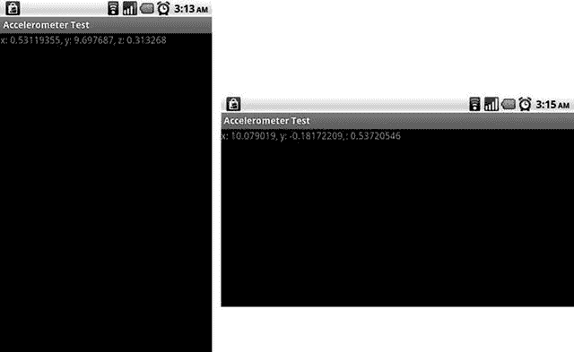

图 4-9.  
设备垂直于地面时，加速度计在竖屏模式（左）和横屏模式（右）下的各轴数值

处理安卓加速度计时有一个容易疏忽的地方：加速度计的数值是相对于设备的默认方向来提供的。这意味着，如果你的游戏只在横屏模式下运行，那么默认方向为竖屏的设备上显示的数值，会与默认方向为横屏的设备相差 90 度！例如，平板电脑就是这种情况。那么，该如何应对呢？使用下面这段方便实用的代码片段，问题就迎刃而解了：

```
int screenRotation;
public void onResume() {
super.onResume();
WindowManager windowMgr = (WindowManager)activity.getSystemService(Activity.WINDOW_SERVICE);
screenRotation = windowMgr.getDefaultDisplay().getRotation();
}
static final int ACCELEROMETER_AXIS_SWAP[][] = {
{1, -1, 0, 1}, // ROTATION_0
{-1, -1, 1, 0}, // ROTATION_90
{-1, 1, 0, 1}, // ROTATION_180
{1, 1, 1, 0}}; // ROTATION_270
public void onSensorChanged(SensorEvent event) {
final int[] as = ACCELEROMETER_AXIS_SWAP[screenRotation];
float screenX = (float)as[0] * event.values[as[2]];
float screenY = (float)as[1] * event.values[as[3]];
float screenZ = event.values[2];
// 现在就可以将 screenX、screenY 和 screenZ 用作加速度计数值了！
}
```

以下是关于加速度计的一些补充说明：

*   如图 4-9 右侧截图所示，加速度计的数值有时可能会超出其规定范围。这是由于传感器存在微小误差导致的，因此如果你需要这些数值尽可能精确，就必须对此进行调整。
*   无论你的活动处于何种方向，加速度计各轴报告的数值顺序始终相同。
*   应用程序开发者有责任根据设备的自然方向对加速度计数值进行旋转处理。

> **注意**  
> 顾名思义，`SensorManager` 类也允许你访问其他传感器，包括指南针和光线传感器。如果你想发挥创意，可以构思一个使用这些传感器的游戏创意。处理它们的事件方式与我们处理加速度计数据的方式类似。Android 开发者网站上的文档将为你提供更多信息。

### 文件处理

安卓为我们提供了几种读写文件的方式。在本节中，我们将探讨 assets（资源文件）的用法；了解如何访问外部存储（通常以 SD 卡形式实现）；并介绍共享首选项（Shared Preferences），它类似于一个持久化的哈希映射。让我们先从 assets 开始。

### 读取 Assets

在第 2 章中，我们简要了解了安卓项目的所有文件夹。我们提到 `assets/` 和 `res/` 文件夹是存放需要随应用程序一起分发的文件的地方（你必须创建 `assets/` 文件夹，因为 Android Studio 不会自动创建）。在讨论清单文件时，我们曾表示不会使用 `res/` 文件夹，因为它对我们组织文件结构的方式有所限制。`assets/` 目录才是存放所有文件的地方，你可以按照任何想要的文件夹层级来组织。

`assets/` 文件夹中的文件通过一个名为 `AssetManager` 的类提供。我们可以通过以下方式为应用程序获取该管理器的引用：

```
AssetManager assetManager = context.getAssets();
```

我们之前已经见过 `context` 接口；`Activity` 类实现了这个接口。在实际操作中，我们会从自己的活动中获取 `AssetManager`。

一旦有了 `AssetManager`，我们就可以开始大量打开文件了：

```
InputStream inputStream = assetManager.open("dir/dir2/filename.txt");
```

请记住，上面的示例可能会抛出 `IOException`，因此应将其包裹在 try/catch 块中。不过，这个方法会返回一个普通的 Java `InputStream`，我们可以用它来读取任何类型的文件。`AssetManager.open()` 方法唯一的参数是相对于 asset 目录的文件名。在上面的示例中，`assets/` 文件夹下有两个目录，其中第二个目录（`dir2/`）是第一个目录（`dir/`）的子目录。在我们的 Android Studio 项目中，该文件将位于 `assets/dir/dir2/`。请确保你是在项目视图（Project view）而非安卓视图（Android view）中操作，否则将看不到这些目录。在 Android Studio 中添加 assets 文件夹最安全的方法是：在项目视图中右键点击项目，然后选择 **New >> Folder >> Assets Folder**。

让我们编写一个简单的测试活动来检验这个功能。我们想从 `assets/` 目录下一个名为 `texts` 的子目录中加载一个名为 `myawesometext.txt` 的文本文件。该文本文件的内容将显示在一个 `TextView` 中。清单 4-7 展示了这个令人惊叹的活动的源代码。


```java
package com.badlogic.androidgames.ch04androidbasics;
import java.io.ByteArrayOutputStream;
import java.io.IOException;
import java.io.InputStream;
import android.support.v7.app.AppCompatActivity;
import android.content.res.AssetManager;
import android.os.Bundle;
import android.widget.TextView;
public class AssetsTest extends AppCompatActivity {
@Override
public void onCreate(Bundle savedInstanceState) {
super.onCreate(savedInstanceState);
TextView textView = new TextView(this);
setContentView(textView);
AssetManager assetManager = this.getAssets();
InputStream inputStream = null;
try {
inputStream = assetManager.open("texts/myawesometext.txt");
String text = loadTextFile(inputStream);
textView.setText(text);
} catch (IOException e) {
textView.setText("无法加载文件");
} finally {
if (inputStream != null)
try {
inputStream.close();
} catch (IOException e) {
textView.setText("无法关闭文件");
}
}
}
public String loadTextFile(InputStream inputStream) throws IOException {
ByteArrayOutputStream byteStream = new ByteArrayOutputStream();
byte[] bytes = new byte[4096];
int len = 0;
while ((len = inputStream.read(bytes)) > 0)
byteStream.write(bytes, 0, len);
return new String(byteStream.toByteArray(), "UTF8");
}
}
```
清单 4-7. `AssetsTest.java`：演示如何读取资产文件

这里没有什么大惊喜，唯一值得注意的是，在 Java 中从`InputStream`加载简单的文本相当冗长。我们编写了一个名为`loadTextFile()`的小方法，它会从`InputStream`中提取所有字节，并以字符串形式返回这些字节。我们假定文本文件采用 UTF-8 编码。其余部分只是捕获和处理各种异常。图 4-10 显示了这个小活动的输出结果。

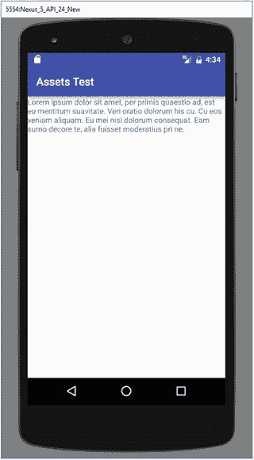

图 4-10.

`AssetsTest`的文本输出

你应该从本节中记住以下几点：

*   在 Java 中从`InputStream`加载文本文件真是麻烦！我们把这个留给你作为练习自己完成。
*   我们只能读取资产文件，而不能写入。
*   我们可以轻松修改`loadTextFile()`方法，改为加载二进制数据。我们只需要返回字节数组，而不是字符串。

#### 访问外部存储

虽然资产文件非常适合随应用程序一起打包发送所有图像和声音，但有时我们需要能够持久保存一些信息并在之后重新加载。一个常见的例子就是高分榜。

Android 提供了多种实现方式，例如使用应用的本地共享首选项、使用小型 SQLite 数据库等。所有这些选项都有一个共同点：它们处理大型二进制文件都不太优雅。但我们为什么需要这个功能呢？虽然我们可以告诉 Android 将应用程序安装到外部存储设备上，从而避免占用内部存储空间，但这仅适用于 Android 2.2 及以上版本。对于更早的版本，所有应用程序数据都会安装在内部存储中。理论上，我们只能将应用程序的代码包含在 APK 文件中，并且必须在应用程序首次启动时从服务器将所有资产文件下载到 SD 卡。Android 上许多知名游戏就是这么做的。

还有其他一些场景需要我们能够访问 SD 卡（在当前所有可用的设备上，SD 卡基本上等同于外部存储）。我们可以允许用户使用游戏内编辑器创建自己的关卡。我们需要将这些关卡存储在某处，而 SD 卡正好适合这个目的。

那么，既然我们已经说服你不要使用 Android 提供的那些花哨的机制来存储应用首选项，让我们来看看如何在 SD 卡上读写文件。

首先，我们必须请求访问外部存储的权限。这需要在清单文件中使用本章前面讨论过的`<uses-permission>`元素来完成，如下所示：

接下来，我们需要检查用户的 Android 设备上是否确实有外部存储设备。例如，如果你创建一个 Android 虚拟设备（AVD），可以选择不模拟 SD 卡，那么你的应用程序就无法向其写入数据。无法访问 SD 卡的另一个原因可能是外部存储设备正在被其他程序使用（例如，用户可能正在通过 USB 在桌面电脑上浏览它）。那么，这里介绍如何获取外部存储的状态：

```
String state = Environment.getExternalStorageState();
```

嗯，我们得到的是一个字符串。`Environment`类定义了几个常量。其中之一是`Environment.MEDIA_MOUNTED`。它也是一个字符串。如果上述方法返回的字符串等于这个常量，我们就具有对外部存储的完全读/写权限。请注意，你必须使用`equals()`方法来比较这两个字符串；引用相等性并非在所有情况下都有效。

一旦确定我们可以实际访问外部存储，就需要获取其根目录名称。然后，如果我们要访问特定文件，需要指定相对于该目录的路径。要获取根目录，我们使用另一个`Environment`的静态方法：

```
File externalDir = Environment.getExternalStorageDirectory();
```

从这里开始，我们可以使用标准的 Java I/O 类来读写文件。

让我们快速编写一个示例，该示例向 SD 卡写入一个文件，然后读回该文件，将其内容显示在`TextView`中，最后从 SD 卡中删除该文件。清单 4-8 显示了此操作的源代码。


```java
package com.badlogic.androidgames.ch04androidbasics ;
import java.io.BufferedReader;
import java.io.BufferedWriter;
import java.io.File;
import java.io.FileReader;
import java.io.FileWriter;
import java.io.IOException;
import android.Manifest;
import android.content.pm.PackageManager;
import android.os.Bundle;
import android.os.Environment;
import android.support.v4.app.ActivityCompat;
import android.support.v4.content.ContextCompat;
import android.support.v7.app.AppCompatActivity;
import android.widget.TextView;
import android.widget.Toast;
public class ExternalStorageTest extends AppCompatActivity {
final private int REQUEST_READ_EXTERNAL_STORAGE = 123;
final private int REQUEST_WRITE_EXTERNAL_STORAGE = 123;
TextView textView ;
@Override
public void onCreate(Bundle savedInstanceState) {
super.onCreate(savedInstanceState);
textView = new TextView(this);
setContentView(textView);
if (ContextCompat.checkSelfPermission(this,       Manifest.permission.READ_EXTERNAL_STORAGE) != PackageManager.PERMISSION_GRANTED &&
ContextCompat.checkSelfPermission(this, Manifest.permission.WRITE_EXTERNAL_STORAGE) != PackageManager.PERMISSION_GRANTED    ) {
ActivityCompat.requestPermissions(this,
new String[]{Manifest.permission.READ_EXTERNAL_STORAGE},
REQUEST_READ_EXTERNAL_STORAGE);
ActivityCompat.requestPermissions(this,
new String[]{Manifest.permission.WRITE_EXTERNAL_STORAGE},
REQUEST_WRITE_EXTERNAL_STORAGE);
} else {
ReadExternalStorage();
}
}
@Override
public void onRequestPermissionsResult(int requestCode, String[] permissions, int[] grantResults) {
super.onRequestPermissionsResult(requestCode, permissions, grantResults);
switch (requestCode) {
case REQUEST_READ_EXTERNAL_STORAGE :
for (int i = 0; i < permissions.length; i++) {
String permission = permissions[i];
int grantResult = grantResults[i] ;
if (permission.equals(Manifest.permission.READ_EXTERNAL_STORAGE) || permission.equals(Manifest.permission.WRITE_EXTERNAL_STORAGE)) {
if (grantResult == PackageManager.PERMISSION_GRANTED) {
ReadExternalStorage();
} else {
Toast.makeText(ExternalStorageTest.this, "Permission Denied",    Toast.LENGTH_SHORT).show();
}
}
}
break;
default:
super.onRequestPermissionsResult(requestCode, permissions, grantResults);
}
}
public void ReadExternalStorage() {
String state = Environment.getExternalStorageState();
if (!state.equals(Environment.MEDIA_MOUNTED)) {
textView.setText("No external storage mounted");
} else {
File externalDir = Environment.getExternalStorageDirectory();
File textFile = new File(externalDir.getAbsolutePath()
+ File.separator + "text.txt");
try {
writeTextFile(textFile, "This is a test. Roger");
String text = readTextFile(textFile);
textView.setText(text);
if (!textFile.delete()) {
textView.setText("Couldn't remove temporary file");
}
} catch (IOException e) {
textView.setText("Something went wrong! " + e.getMessage());
}
}
}
private void writeTextFile(File file, String text) throws IOException {
BufferedWriter writer = new BufferedWriter(new FileWriter(file));
writer.write(text);
writer.close();
}
private String readTextFile(File file) throws IOException {
BufferedReader reader = new BufferedReader(new FileReader(file));
StringBuilder text = new StringBuilder();
String line;
while ((line = reader.readLine()) != null) {
text.append(line);
text.append("\n");
}
reader.close();
return text.toString() ;
}
}
```

**清单 4-8.** `ExternalStorageTest` 活动

首先，我们检查用户是否已授予我们访问外部存储的权限。如果这是我们的应用第一次检查，Android 会弹出一个对话框询问用户是否授予或拒绝权限。然后，我们检查 SD 卡是否已挂载。如果没有，我们就提前退出。接下来，我们获取外部存储目录，并构造一个新的 `File` 实例，该实例指向我们将在下一条语句中创建的文件。 `writeTextFile()` 方法使用标准的 Java I/O 类来完成其工作。如果文件不存在，该方法会创建它；否则，它会覆盖已有的文件。成功将测试文本写入外部存储设备上的文件后，我们再次读取该文件，并将其设置为 `TextView` 的文本。最后一步，我们从外部存储中删除该文件。所有这些操作都采用了标准的安全措施，如果出现问题，会通过向 `TextView` 输出错误消息来报告。图 4-11 显示了该活动的输出。

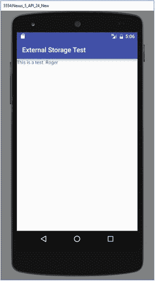

**图 4-11.** 收到！

以下是从本节中应吸取的教训：

*   不要乱动不属于你的任何文件。如果你删除了用户上次度假的照片，他们会非常生气。
*   始终检查外部存储设备是否已挂载。
*   不要乱动外部存储设备上的任何文件！

因为删除外部存储设备上的所有文件非常容易，所以在从 Google Play 安装下一个请求 SD 卡权限的应用之前，你可能需要三思。一旦安装，该应用将对你的文件拥有完全控制权。

### 共享首选项

Android 提供了一个简单的 API 来为你的应用存储键值对，称为 `SharedPreferences`。 `SharedPreferences` API 与标准的 Java Properties API 并无不同。一个活动可以有一个默认的 `SharedPreferences` 实例，也可以根据需要使用任意多个不同的 `SharedPreferences` 实例。以下是从活动中获取 `SharedPreferences` 实例的典型方法：

```java
SharedPreferences prefs = PreferenceManager.getDefaultSharedPreferences(this);
```

或

```java
SharedPreferences prefs = getPreferences(Context.MODE_PRIVATE);
```

第一种方法提供一个通用的 `SharedPreferences` 实例，该实例将在该上下文中（在我们的例子中是活动）共享。第二种方法做同样的事情，但它允许你选择共享首选项的隐私级别。选项包括 `Context.MODE_PRIVATE`（默认值）、`Context.MODE_WORLD_READABLE` 和 `Context.MODE_WORLD_WRITEABLE`。使用除 `Context.MODE_PRIVATE` 之外的任何选项都更高级，对于保存游戏设置之类的事情并非必需。

要使用共享首选项，你首先需要获取编辑器。这通过以下方式完成：

```java
Editor editor = prefs.edit()
```

现在，我们可以插入一些值：

```java
editor.putString("key1", "banana");
editor.putInt("key2", 5);
```

最后，当我们想要保存时，只需添加以下代码：

```java
editor.commit();
```

准备好读取回来了吗？正如预期的那样：

```java
String value1 = prefs.getString("key1", null);
int value2 = prefs.getInt("key2", 0);
```

在我们的示例中，`value1` 将是 `"banana"`，`value2` 将是 `5`。`SharedPreferences` 的 "get" 调用中的第二个参数是默认值。如果在首选项中找不到该键，则将使用这些默认值。例如，如果从未设置过 `"key1"`，则在 `getString` 调用之后 `value1` 将为 `null`。`SharedPreferences` 非常简单，我们实际上不需要任何测试代码来演示。只需记住始终提交这些编辑！

## 音频编程

Android 提供了几个易于使用的 API 来播放音效和音乐文件——非常适合我们的游戏编程需求。让我们来看看这些 API。

### 设置音量控制


如果你有一个安卓设备，你会注意到，当你按下音量加减按钮时，根据你当前使用的应用，你控制的是不同的音量设置。在通话中，你控制的是来电语音流的音量；在播放 YouTube 视频时，你控制的是视频音频的音量；而在主屏幕上，你控制的是系统声音的音量，例如铃声或收到即时消息的声音。

安卓系统针对不同用途设有不同的音频流。当我们在游戏中播放音频时，我们会使用一些类将音效和音乐输出到一个特定的音频流，即音乐流。在考虑播放音效或音乐之前，我们首先要确保音量按钮能控制正确的音频流。为此，我们使用`context`接口的另一个方法：

```
context.setVolumeControlStream(AudioManager.STREAM_MUSIC);
```

一如既往，我们选择的`Context`实现就是我们的 Activity。调用此方法后，音量按钮将控制音乐流，我们之后会将音效和音乐输出到这个流中。在 Activity 的生命周期中，我们只需要调用一次此方法。`Activity.onCreate()`方法是最合适的位置。

编写一个只包含一行代码的示例有点小题大做，因此我们暂时不做。只需记住要在所有输出声音的 Activity 中使用此方法。

### 播放音效

在第 3 章中，我们讨论了流式播放音乐和播放音效之间的区别。后者存储在内存中，通常持续时间只有几秒。安卓为我们提供了一个名为`SoundPool`的类，它使得播放音效变得非常简单。

我们可以像下面这样简单地实例化新的`SoundPool`实例：

```
SoundPool soundPool = new SoundPool();
```

要从一个音频文件将音效加载到堆内存中，我们可以使用`SoundPool.load()`方法。我们将所有文件存储在`assets/`目录下，因此我们需要使用接受`AssetFileDescriptor`的`SoundPool.load()`方法的重载版本。如何获取`AssetFileDescriptor`？很简单——通过我们之前使用过的`AssetManager`。下面展示了如何通过`SoundPool`从`assets/`目录加载一个名为`explosion.ogg`的 OGG 文件：

```
AssetFileDescriptor descriptor = assetManager.openFd("explosion.ogg");
int explosionId = soundPool.load(descriptor, 1);
```

通过`AssetManager.openFd()`方法获取`AssetFileDescriptor`非常直接。通过`SoundPool`加载音效也同样容易。`SoundPool.load()`方法的第一个参数是我们的`AssetFileDescriptor`，第二个参数指定了音效的优先级。目前此参数尚未使用，为了将来的兼容性，应将其设为`1`。

`SoundPool.load()`方法返回一个整数，作为已加载音效的句柄。当我们想要播放这个音效时，我们指定这个句柄，以便`SoundPool`知道要播放哪个音效。

播放音效同样非常简单：

```
soundPool.play(explosionId, 1.0f, 1.0f, 0, 0, 1);
```

第一个参数是我们从`SoundPool.load()`方法接收到的句柄。接下来的两个参数指定左右声道的音量。这些值应在`0`（静音）到`1`（最大音量）之间。

接下来是两个我们很少使用的参数。第一个是优先级，目前未使用，应设为`0`。另一个参数指定音效应循环播放的次数。不建议循环播放音效，因此通常在这里使用`0`。最后一个参数是播放速率。将其设为高于`1`会使音效播放速度比录制时更快，而设为低于`1`则会使播放速度变慢。

当我们不再需要一个音效并想释放一些内存时，可以使用`SoundPool.unload()`方法：

```
soundPool.unload(explosionId);
```

我们只需传入从`SoundPool.load()`方法接收到的该音效的句柄，它就会从内存中卸载。

通常，我们会在游戏中只使用一个`SoundPool`实例，用它来根据需要加载、播放和卸载音效。当我们完成所有音频输出，不再需要`SoundPool`时，应该始终调用`SoundPool.release()`方法，该方法会释放`SoundPool`通常占用的所有资源。释放后，你当然不能再使用该`SoundPool`，并且由该`SoundPool`加载的所有音效也会消失。

让我们编写一个简单的测试 Activity，每次点击屏幕时播放一个爆炸音效。我们已经知道实现此功能所需的一切，因此下面的代码列表应该不会有什么大惊喜。

```
package com.badlogic.androidgames.ch04androidbasics;
import java.io.IOException;
import android.support.v7.app.AppCompatActivity;
import android.content.res.AssetFileDescriptor;
import android.content.res.AssetManager;
import android.media.AudioManager;
import android.media.SoundPool;
import android.os.Bundle;
import android.view.MotionEvent;
import android.view.View;
import android.view.View.OnTouchListener;
import android.widget.TextView;
public class SoundPoolTest extends AppCompatActivity implements OnTouchListener {
SoundPool soundPool;
int explosionId = -1;
@Override
public void onCreate(Bundle savedInstanceState) {
super.onCreate(savedInstanceState);
TextView textView = new TextView(this);
textView.setOnTouchListener(this);
setContentView(textView);
setVolumeControlStream(AudioManager.STREAM_MUSIC);
soundPool = new SoundPool(20, AudioManager.STREAM_MUSIC, 0);
try {
AssetManager assetManager = this.getAssets();
AssetFileDescriptor descriptor = assetManager
.openFd("explosion.ogg");
explosionId = soundPool.load(descriptor, 1);
} catch (IOException e) {
textView.setText("Couldn't load sound effect from asset, "
+ e.getMessage()) ;
}
}
public boolean onTouch(View v, MotionEvent event) {
if (event.getAction() == MotionEvent.ACTION_UP) {
if (explosionId != -1) {
soundPool.play(explosionId, 1, 1, 0, 0, 1);
}
}
return true;
}
}
列表 4-9.
SoundPoolTest.java；播放音效
```

我们首先从`AppCompatActivity`派生我们的类，并让它实现`OnTouchListener`接口，以便我们之后能处理屏幕点击。我们的类有两个成员：`SoundPool`和我们将要加载和播放的音效句柄。我们将其初始化为`–1`，表示音效尚未加载。

在`onCreate()`方法中，我们做了之前做过几次的事情：创建一个`TextView`，将 Activity 注册为`OnTouchListener`，并将`TextView`设置为内容视图。

下一行设置了音量控件以控制音乐流，如前所述。接着我们创建`SoundPool`并配置它，使其能同时播放 20 个并发音效。这对于大多数游戏来说应该足够了。

最后，我们从`AssetManager`为放置在`assets/`目录下的`explosion.ogg`文件获取一个`AssetFileDescriptor`。要加载该音效，我们只需将该描述符传递给`SoundPool.load()`方法并存储返回的句柄。如果加载过程中出现问题，`SoundPool.load()`方法会抛出异常，在这种情况下我们会捕获它并显示一条错误消息。

在`onTouch()`方法中，我们简单地检查是否有手指抬起，这表示屏幕被点击了。如果是这种情况，并且爆炸音效已成功加载（由句柄不是`–1`指示），我们就播放该音效。


当你执行这个简单操作时，只需触摸屏幕即可让世界爆炸。如果快速连续触摸屏幕，你会发现音效会以重叠的方式多次播放。我们配置的 `SoundPool` 最大支持 20 次播放重叠，这几乎是很难超越的。但如果真的发生了这种情况，当前正在播放的某个音效就会停止，为新请求的播放腾出空间。

请注意，在前面的例子中，我们没有卸载音效或释放 `SoundPool`。这是为了简洁起见。通常，你会在 Activity 即将被销毁时的 `onPause()` 方法中释放 `SoundPool`。请记住，始终要释放或卸载你不再需要的任何资源。

虽然 `SoundPool` 类非常易用，但请记住 `SoundPool.load()` 方法是异步执行实际加载的。这意味着，在你使用该音效调用 `SoundPool.play()` 方法之前，需要稍等片刻，因为加载可能尚未完成。通常这不成问题，因为在该音效首次播放之前，你很可能还会加载其他资源。

**注意**

正如我们讨论的任何 API 一样，`SoundPool` 还有更多功能。我们简单提过，你可以循环播放音效。为此，你可以从 `SoundPool.play()` 方法获取一个 ID，用于暂停或停止循环播放的音效。如果你需要该功能，请查阅 Android 开发者网站上的 `SoundPool` 文档。

### 流式播放音乐

小的音效可以放入 Android 应用程序从操作系统获得的有限堆内存中。包含较长音乐片段的大型音频文件则不行。因此，我们需要将音乐流式传输到音频硬件，这意味着我们一次只读取一小块数据，足以将其解码为原始 PCM 数据并发送给音频芯片。

这听起来很令人望而生畏。幸运的是，有 `MediaPlayer` 类可以为我们处理所有这些事务。我们只需将其指向音频文件并告诉它播放即可。

实例化 `MediaPlayer` 类非常简单：

```
MediaPlayer mediaPlayer = new MediaPlayer();
```

接下来，我们需要告诉 `MediaPlayer` 要播放哪个文件。同样通过 `AssetFileDescriptor` 完成：

```
AssetFileDescriptor descriptor = assetManager.openFd("music.ogg");
mediaPlayer.setDataSource(descriptor.getFileDescriptor(), descriptor.getStartOffset(), descriptor.getLength());
```

这里的步骤比 `SoundPool` 的情况要多一些。`MediaPlayer.setDataSource()` 方法不直接接受 `AssetFileDescriptor`。相反，它需要一个 `FileDescriptor`，我们通过 `AssetFileDescriptor.getFileDescriptor()` 方法获取。此外，我们还必须指定音频文件的偏移量和长度。为什么要指定偏移量？实际上，所有资源都存储在单个文件中。为了让 `MediaPlayer` 找到文件的起始位置，我们必须为其提供该文件在包含它的资源文件中的偏移量。

在我们可以开始播放音乐文件之前，还必须调用另一个方法来准备 `MediaPlayer` 进行播放：

```
mediaPlayer.prepare();
```

这将实际打开文件并检查它是否可以被 `MediaPlayer` 实例读取和播放。至此，我们就可以自由地播放、暂停、停止音频文件，设置循环播放以及调整音量。

要开始播放，我们只需调用以下方法：

```
mediaPlayer.start();
```

请注意，此方法只能在成功调用 `MediaPlayer.prepare()` 方法后调用（如果它抛出运行时异常，你会注意到）。

在开始播放后，我们可以通过调用 `pause()` 方法来暂停播放：

```
mediaPlayer.pause();
```

调用此方法同样仅在成功准备 `MediaPlayer` 并已开始播放后才有效。要恢复已暂停的 `MediaPlayer`，我们可以再次调用 `MediaPlayer.start()` 方法，无需任何准备。

要停止播放，我们调用以下方法：

```
mediaPlayer.stop();
```

请注意，当我们想要启动一个已停止的 `MediaPlayer` 时，必须首先再次调用 `MediaPlayer.prepare()` 方法。

我们可以使用以下方法将 `MediaPlayer` 设置为循环播放：

```
mediaPlayer.setLooping(true);
```

要调节音乐播放的音量，我们可以使用以下方法：

```
mediaPlayer.setVolume(1, 1);
```

这将设置左右声道的音量。

最后，我们需要一种方法来检查播放是否已完成。我们可以通过两种方式做到这一点。其一，我们可以向 `MediaPlayer` 注册一个 `OnCompletionListener`，当播放完成时将调用该监听器：

```
mediaPlayer.setOnCompletionListener(listener);
```

如果我们想轮询 `MediaPlayer` 的状态，也可以使用以下方法：

```
boolean isPlaying = mediaPlayer.isPlaying();
```

请注意，如果 `MediaPlayer` 设置为循环播放，上述两种方法都不会指示 `MediaPlayer` 已停止。

最后，如果我们处理完该 `MediaPlayer` 实例，可以通过调用以下方法来确保释放其占用的所有资源：

```
mediaPlayer.release();
```

在丢弃该实例之前始终执行此操作，这被认为是一种良好的实践。

如果我们没有将 `MediaPlayer` 设置为循环播放且播放已完成，我们可以通过再次调用 `MediaPlayer.prepare()` 和 `MediaPlayer.start()` 方法重新启动 `MediaPlayer`。

这些方法中的大多数是异步工作的，因此即使你调用了 `MediaPlayer.stop()`，之后短时间内 `MediaPlayer.isPlaying()` 方法仍可能返回 `true`。这通常无需担心。在大多数游戏中，我们将 `MediaPlayer` 设置为循环播放，然后在需要时（例如，切换到需要播放其他音乐的不同屏幕时）停止它。

让我们编写一个小测试 Activity，以循环模式播放来自 `assets/` 目录的音频文件。该音效将根据 Activity 生命周期暂停和恢复——当我们的 Activity 暂停时，音乐也应暂停；当 Activity 恢复时，音乐应从暂停处继续播放。清单 4-10 展示了如何实现。

```
package com.badlogic.androidgames.ch04androidbasics;
import java.io.IOException;
import android.support.v7.app.AppCompatActivity;
import android.content.res.AssetFileDescriptor;
import android.content.res.AssetManager;
import android.media.AudioManager;
import android.media.MediaPlayer;
import android.os.Bundle;
import android.widget.TextView;
public class MediaPlayerTest extends AppCompatActivity {
MediaPlayer mediaPlayer;
@Override
public void onCreate(Bundle savedInstanceState) {
super.onCreate(savedInstanceState);
TextView textView = new TextView(this);
setContentView(textView);
setVolumeControlStream(AudioManager.STREAM_MUSIC);
mediaPlayer = new MediaPlayer();
try {
AssetManager assetManager = getAssets();
AssetFileDescriptor descriptor = assetManager.openFd("music.ogg");
mediaPlayer.setDataSource(descriptor.getFileDescriptor(),
descriptor.getStartOffset(), descriptor.getLength());
mediaPlayer.prepare();
mediaPlayer.setLooping(true);
} catch (IOException e) {
textView.setText("无法加载音乐文件， " + e.getMessage());
mediaPlayer = null;
}
}
@Override
protected void onResume() {
super.onResume();
if (mediaPlayer != null) {
mediaPlayer.start();
}
}
protected void onPause() {
super.onPause();
if (mediaPlayer != null) {
mediaPlayer.pause();
if (isFinishing()) {
mediaPlayer.stop();
mediaPlayer.release();
}
}
}
}
清单 4-10.
MediaPlayerTest.java：播放音频流
```


#### MediaPlayer 使用与全屏设置

我们持有`MediaPlayer`的引用，作为 Activity 的成员变量。在`onCreate()`方法中，我们创建一个`TextView`用于输出错误信息，一如既往。

在开始使用`MediaPlayer`之前，我们确保音量控制实际控制的是音乐流。设置完成后，我们实例化`MediaPlayer`。我们从`AssetManager`中获取`AssetFileDescriptor`，该文件位于`assets/`目录下，名为`music.ogg`，并将其设置为`MediaPlayer`的数据源。剩下要做的就是准备`MediaPlayer`实例并设置循环播放。如果出现任何问题，我们将`MediaPlayer`成员变量设为`null`，以便稍后判断加载是否成功。此外，我们向`TextView`输出一些错误文本。

在`onResume()`方法中，我们直接启动`MediaPlayer`（如果创建成功）。`onResume()`方法是执行此操作的理想位置，因为它会在`onCreate()`之后和`onPause()`之后被调用。在前一种情况下，它将首次启动播放；在后一种情况下，它将恢复暂停的`MediaPlayer`。

`onPause()`方法暂停`MediaPlayer`。如果 Activity 即将被销毁，我们停止`MediaPlayer`并释放其所有资源。

如果你尝试使用这些功能，请务必测试锁屏或暂时切换到主屏幕时，Activity 暂停和恢复的响应情况。当恢复时，`MediaPlayer`将从暂停处继续播放。

以下是需要记住的几点：

- `MediaPlayer.start()`、`MediaPlayer.pause()`和`MediaPlayer.resume()`方法只能在特定状态下被调用，如前所述。在尚未准备好`MediaPlayer`时，切勿尝试调用它们。仅在准备`MediaPlayer`之后，或者在你通过调用`MediaPlayer.pause()`显式暂停后希望恢复时，才能调用`MediaPlayer.start()`。
- `MediaPlayer`实例相当重量级。实例化过多会占用大量资源。我们应始终尽量只保留一个用于音乐播放。音效更适合用`SoundPool`类处理。
- 记得将音量控制设置为处理音乐流，否则你的播放器将无法调整游戏音量。

本章即将结束，但还有一个重要主题摆在面前：2D 图形。

## 基本图形编程

Android 提供了两个主要的 API 用于屏幕绘制。一个主要用于简单的 2D 图形编程，另一个用于硬件加速的 3D 图形编程。本节和下一章将重点介绍使用`Canvas` API 进行 2D 图形编程，这是 Skia 库的一个优秀封装，适用于中等复杂度的 2D 图形。从第 7 章开始，我们将研究使用 OpenGL 渲染 2D 和 3D 图形。在此之前，我们需要先讨论两件事：全屏显示和唤醒锁。

## 全屏显示

在我们使用 Android API 绘制第一个图形之前，先解决另一个问题。到目前为止，我们所有的 Activity 都显示标题栏。通知栏也是可见的。我们希望消除这些元素，让玩家更沉浸。我们可以通过两个简单调用来实现：

```
requestWindowFeature(Window.FEATURE_NO_TITLE);
getWindow().setFlags(WindowManager.LayoutParams.FLAG_FULLSCREEN, WindowManager.LayoutParams.FLAG_FULLSCREEN);
```

第一个调用消除了 Activity 的标题栏。为了使 Activity 进入全屏模式并消除通知栏，我们调用第二个方法。注意，我们必须先调用这些方法，然后才能设置 Activity 的内容视图。

清单 4-11 展示了一个非常简单的测试 Activity，演示如何进入全屏模式。

```
package com.badlogic.androidgames.ch04androidbasics;
import android.os.Bundle;
import android.view.Window;
import android.view.WindowManager;
public class FullScreenTest extends SingleTouchTest {
@Override
public void onCreate(Bundle savedInstanceState) {
requestWindowFeature(Window.FEATURE_NO_TITLE);
getWindow().setFlags(WindowManager.LayoutParams.FLAG_FULLSCREEN,
WindowManager.LayoutParams.FLAG_FULLSCREEN);
super.onCreate(savedInstanceState);
}
}
```

清单 4-11. `FullScreenTest.java`: 使 Activity 全屏

这里发生了什么？我们简单地从之前创建的`TouchTest`类派生，并重写`onCreate()`方法。在`onCreate()`方法中，我们启用全屏模式，然后调用超类（本例中为`TouchTest` Activity）的`onCreate()`方法，该方法将设置 Activity 的其余部分。再次注意，我们必须在设置内容视图之前调用这两个方法。因此，在执行这两个方法之后才调用超类的`onCreate()`方法。

我们还在清单文件中将 Activity 的朝向固定为竖屏模式。你没有忘记为每个测试在清单文件中添加`<activity>`元素吧？从现在开始，我们将始终固定为竖屏模式或横屏模式，因为我们不希望坐标系不断变化。

通过从`TouchTest`派生，我们获得了一个可工作的完整示例，现在可以用它来探索绘图所用的坐标系。该 Activity 会像之前的`TouchTest`示例一样，显示你触摸屏幕的坐标。不同之处在于这次是全屏模式，这意味着触摸事件的最大坐标等于屏幕分辨率（每个维度减一，因为我们从[0,0]开始）。对于 Nexus 6，在竖屏模式下，坐标系范围从(0,0)到(1080,1780)（总共 1080×1780 个可用像素）。

虽然屏幕看起来是连续重绘的，但实际上并非如此。回想一下我们的`TouchTest`类，我们每次处理触摸事件时都会更新`TextView`。这反过来又会使`TextView`重绘自身。如果不触摸屏幕，`TextView`不会重绘。对于游戏来说，我们需要尽可能频繁地重绘屏幕，最好是在我们的主循环线程中进行。我们先从简单的开始，在 UI 线程中实现连续渲染。

## UI 线程中的连续渲染

到目前为止，我们所做的只是在需要时设置`TextView`的文本。实际的渲染工作是由`TextView`自身完成的。现在让我们创建自定义视图，其唯一目的是让我们将内容绘制到屏幕上。我们还希望它尽可能频繁地重绘自身，并且希望有一种简单的方法在那个神秘的绘制方法中执行自己的绘图。

虽然这听起来可能很复杂，但实际上 Android 让我们很容易实现这样的功能。我们所要做的就是创建一个派生自`View`的类，并重写`View.onDraw()`方法。每当系统需要我们的视图重绘自身时，就会调用此方法。示例如下：

```
class RenderView extends View {
public RenderView(Context context) {
super(context);
}
@Override
protected void onDraw(Canvas canvas) {
// 待实现
}
}
```

这不算什么高科技，对吧？我们得到一个`Canvas`类的实例，它被传递给`onDraw()`方法。这将是我们在后续章节中的主力工具。它允许我们在另一个位图或视图（或`Surface`，稍后会谈到）上绘制形状和位图。


我们可以将`RenderView`当作`TextView`来使用。只需将其设置为 Activity 的内容视图，并连接所需的输入监听器即可。然而，目前它还不是很有用，原因有二：它实际上没有绘制任何内容；即使它能绘制内容，也只有在 Activity 需要重绘时才会执行（例如，当 Activity 创建或恢复时，或者当覆盖其上的对话框消失时）。我们如何让它自行重绘呢？

很简单，像这样：

```
protected void onDraw(Canvas canvas) {
    // 所有绘制代码都放在这里
    invalidate();
}
```

在`onDraw()`方法末尾调用`View.invalidate()`方法，会告知 Android 系统在下次有空闲时尽快重绘`RenderView`。所有这些操作仍然发生在 UI 线程上，这有点像一头懒马。不过，我们确实通过`onDraw()`方法实现了连续渲染，尽管是相对较慢的连续渲染。我们稍后会改进这一点；目前，它足以满足我们的需求。

那么，让我们回到神秘的`Canvas`类。它是一个非常强大的类，封装了一个名为 Skia 的自定义底层图形库，该库专门用于在 CPU 上执行 2D 渲染。`Canvas`类为我们提供了许多用于绘制各种形状、位图甚至文本的绘图方法。

这些绘图方法绘制到哪里？这取决于具体情况。一个`Canvas`实例可以渲染到`Bitmap`实例；`Bitmap`是 Android 2D API 提供的另一个类，我们将在本章后面深入探讨。在本例中，它渲染到视图在屏幕上占据的区域。当然，这只是一个极其简化的说法。在底层，它不会直接绘制到屏幕，而是绘制到某种位图，系统稍后会将这个位图与 Activity 中所有其他视图的位图组合起来，合成最终的输出图像。然后，该图像将被交给 GPU，再通过另一组神秘的路径显示在屏幕上。

我们实际上不需要关心这些细节。从我们的角度来看，我们的`View`似乎覆盖了整个屏幕，因此可以认为它是在系统的帧缓冲区上绘制。在接下来的讨论中，我们将假装直接绘制到帧缓冲区，而系统为我们处理所有精巧的事情，例如垂直回扫和双缓冲。

`onDraw()`方法会被尽可能频繁地调用。对我们而言，它非常类似于我们理论上的游戏主循环的主体。如果我们想用这个方法来实现一个游戏，我们会把所有游戏逻辑都放在这个方法中。由于多种原因（其中性能是一个原因），我们不会这么做。

那么，让我们来做一些有趣的事情。每次你接触一个新的绘图 API 时，都应该编写一个简单的小测试来检查屏幕是否真的被频繁重绘。这有点像穷人的灯光秀。你需要在每次调用重绘方法时所做的，就是用一种新的随机颜色填充屏幕。这样，你只需要找到该 API 中允许你填充屏幕的方法，而无需了解太多繁琐的细节。让我们用自定义的`RenderView`实现来编写这样一个测试。

`Canvas`类中用于使用特定颜色填充其渲染目标的方法是`Canvas.drawRGB()`：

```
Canvas.drawRGB(int r, int g, int b);
```

参数`r`、`g`和`b`分别代表我们将用于填充屏幕的颜色的一个分量。每个分量的取值范围必须是 0 到 255，因此我们实际上是在这里指定一种 RGB888 格式的颜色。如果你不记得关于颜色的详细信息，请重新查阅第 3 章的“数字编码颜色”部分，因为我们在本章余下部分都会用到这些信息。

清单 4-12 展示了我们这个小灯光秀的代码。

**警告**

运行此代码将快速用随机颜色填充屏幕。如果您患有癫痫症或对光敏感，请不要运行它。

```
package com.badlogic.androidgames.ch04androidbasics;

import java.util.Random;
import android.support.v7.app.AppCompatActivity;
import android.content.Context;
import android.graphics.Canvas;
import android.os.Bundle;
import android.view.View;
import android.view.Window;
import android.view.WindowManager;

public class RenderViewTest extends AppCompatActivity {
    class RenderView extends View {
        Random rand = new Random();

        public RenderView(Context context) {
            super(context);
        }

        protected void onDraw(Canvas canvas) {
            canvas.drawRGB(rand.nextInt(256), rand.nextInt(256),
                    rand.nextInt(256));
            invalidate();
        }
    }

    @Override
    public void onCreate(Bundle savedInstanceState) {
        super.onCreate(savedInstanceState);
        requestWindowFeature(Window.FEATURE_NO_TITLE);
        getWindow().setFlags(WindowManager.LayoutParams.FLAG_FULLSCREEN,
                WindowManager.LayoutParams.FLAG_FULLSCREEN);
        setContentView(new RenderView(this));
    }
}
```

**清单 4-12. `RenderViewTest` Activity。**

对于我们的第一个图形演示来说，这已经相当简洁了。我们将`RenderView`类定义为`RenderViewTest` Activity 的内部类。`RenderView`类派生自`View`类，正如之前讨论的那样，它有一个必需的构造函数以及重写的`onDraw()`方法。它还拥有一个`Random`类的实例作为成员变量；我们将用它来生成随机颜色。

`onDraw()`方法非常简单。我们首先告诉`Canvas`类用一种随机颜色填充整个视图。对于每个颜色分量，我们只需指定一个 0 到 255 之间的随机数（`Random.nextInt()`方法返回的值不包含上限）。之后，我们告诉系统我们希望尽快再次调用`onDraw()`方法。

Activity 的`onCreate()`方法启用了全屏模式，并将我们`RenderView`类的一个实例设置为内容视图。为了保持示例简短，我们暂时省略了唤醒锁。

为这个示例截取屏幕截图意义不大。它所做的只是以 UI 线程允许的最快速度用随机颜色填充屏幕。这没什么值得大书特书的。让我们做一些更有趣的事情：绘制一些形状……

**注意**

上述连续渲染的方法是可行的，但我们强烈建议不要使用它！我们应该尽可能少地在 UI 线程上工作。稍后，我们将使用一个单独的线程来展示如何正确地进行操作，并且我们也可以在该线程中实现我们的游戏逻辑。

**获取屏幕分辨率（和坐标系）**

在第 2 章中，我们讨论了很多关于帧缓冲区及其属性的内容。请记住，帧缓冲区保存着要显示在屏幕上的像素颜色。我们可以使用的像素数量由屏幕分辨率定义，分辨率由屏幕的宽度和高度（以像素为单位）给出。

现在，通过我们的自定义`View`实现，我们实际上并没有直接渲染到帧缓冲区。但是，由于我们的`View`覆盖了整个屏幕，我们可以假装如此。为了知道我们可以在哪里渲染游戏元素，我们需要知道 x 轴和 y 轴上有多少个像素，也就是屏幕的宽度和高度。

`Canvas`类有两个方法可以为我们提供这些信息：

```
int width = canvas.getWidth();
int height = canvas.getHeight();
```

这会返回`Canvas`实例渲染目标的宽度和高度（以像素为单位）。请注意，根据 Activity 的方向，宽度可能小于或大于高度。例如，HTC Thunderbolt 在竖屏模式下的分辨率为 480×800 像素，因此`Canvas.getWidth()`方法会返回`480`，而`Canvas.getHeight()`方法会返回`800`。在横屏模式下，这两个值会互换：`Canvas.getWidth()`会返回`800`，而`Canvas.getHeight()`会返回`480`。


我们需要知道的第二项信息是我们要渲染的坐标系的组织方式。首先，只有整数像素坐标才有意义（有一个叫做子像素的概念，但我们暂时忽略它）。我们还知道，无论纵向模式还是横向模式，该坐标系的原点`(0,0)`始终位于屏幕的左上角。`x`轴的正方向始终指向右侧，而`y`轴的正方向始终指向下方。图 4-12 展示了一个假设的屏幕，其分辨率为 48×32 像素，处于横向模式。


图 4-12. 一个 48×32 像素屏幕的坐标系

请注意，图 4-12 中坐标系的原点与屏幕左上角的像素重合。因此，屏幕左下角的像素并不像我们预期的那样位于`(48,32)`，而是位于`(47,31)`。通常，`(width – 1, height – 1)`始终是屏幕右下角像素的位置。

图 4-12 展示了一个横向模式下的假设屏幕坐标系。现在你应该能够想象出该坐标系在纵向模式下是什么样子了。

`Canvas`类的所有绘图方法都在这种坐标系统内操作。通常，我们可以处理的像素数量远多于 48×32 像素的例子（例如，800×480）。话虽如此，让我们最终开始绘制一些像素、线条、圆形和矩形。

注意

你可能已经注意到，不同的设备可能有不同的屏幕分辨率。我们将在下一章探讨这个问题。现在，让我们专注于最终自主地在屏幕上绘制出内容。

绘制基本形状

我们已经深入到了第 4 章，终于要开始绘制我们的第一个像素了。我们将快速浏览一下`Canvas`类提供给我们的一些绘图方法。

绘制像素

我们要解决的第一件事是如何绘制单个像素。这可以通过以下方法完成：

```
Canvas.drawPoint(float x, float y, Paint paint);
```

需要立刻注意两件事：像素的坐标是用`float`类型指定的，并且`Canvas`类不让我们直接指定颜色，而是需要我们提供一个`Paint`类的实例。

不要因为我们将坐标指定为浮点数而感到困惑。`Canvas`类有一些非常高级的功能，允许我们渲染到非整数坐标，这就是浮点数的来源。不过，我们现在还不需要那个功能；我们将在下一章中再回到这个问题。

`Paint`类包含用于绘制形状、文本和位图的样式和颜色信息。对于绘制形状，我们只关心两件事：画笔持有的颜色和样式。由于像素没有样式，我们先集中讨论颜色。下面是我们如何实例化`Paint`类并设置颜色：

```
Paint paint = new Paint();
paint.setARGB(alpha, red, green, blue);
```

实例化`Paint`类非常简单。`Paint.setARGB()`方法也应该很容易理解。每个参数分别代表颜色的一个分量，取值范围为 0 到 255。因此，我们指定了一个 ARGB8888 颜色。

或者，我们可以使用以下方法来设置`Paint`实例的颜色：

```
Paint.setColor(0xff00ff00);
```

我们向这个方法传递一个 32 位整数。它再次编码了一个 ARGB8888 颜色；在这个例子中，它是绿色，alpha 值设置为完全不透明。`Color`类定义了一些用于编码标准颜色的静态常量，例如`Color.RED`、`Color.YELLOW`等。如果你不想自己指定十六进制值，可以使用这些常量。

绘制线条

要绘制一条线，我们可以使用以下`Canvas`类方法：

```
Canvas.drawLine(float startX, float startY, float stopX, float stopY, Paint paint);
```

前两个参数指定线条起点的坐标，接着两个参数指定线条终点的坐标，最后一个参数指定一个`Paint`实例。绘制出的线条将是一个像素宽。如果我们希望线条更粗，可以通过设置`Paint`实例的描边宽度来指定其以像素为单位的厚度：

```
Paint.setStrokeWidth(float widthInPixels);
```

绘制矩形

我们还可以使用以下`Canvas`类方法绘制矩形：

```
Canvas.drawRect(float left, float top, float right, float bottom, Paint paint);
```

前两个参数指定矩形左上角的坐标，接着两个参数指定矩形右下角的坐标，`Paint`实例指定矩形的颜色和样式。那么，我们可以使用哪些样式，又如何设置呢？

要设置`Paint`实例的样式，我们调用以下方法：

```
Paint.setStyle(Style style);
```

`Style`是一个枚举类型，包含`Style.FILL`、`Style.STROKE`和`Style.FILL_AND_STROKE`这几个值。如果我们指定`Style.FILL`，矩形会使用画笔的颜色进行填充。如果我们指定`Style.STROKE`，则只绘制矩形的轮廓线，同样使用画笔的颜色和描边宽度。如果设置了`Style.FILL_AND_STROKE`，矩形将被填充，同时使用给定的颜色和描边宽度绘制轮廓线。

绘制圆形

绘制圆形（填充或描边，或两者兼具）会更有趣：

```
Canvas.drawCircle(float centerX, float centerY, float radius, Paint paint);
```

前两个参数指定圆心坐标，下一个参数指定以像素为单位的半径，最后一个参数同样是一个`Paint`实例。与`Canvas.drawRect()`方法一样，画笔的颜色和样式将用于绘制圆形。

混合

最后一件重要的事情是，所有这些绘图方法都会执行 alpha 混合。只需将颜色的 alpha 值指定为除 255（`0xff`）以外的值，你的像素、线条、矩形和圆形就会变得半透明。

综合运用

让我们编写一个快速的测试活动，来演示前面提到的方法。这一次，我们希望你先分析代码清单 4-13 中的代码。请思考在 480×800 像素、纵向模式的屏幕上，不同的形状会被绘制在什么位置。在进行图形编程时，最重要的事情之一就是想象你发出的绘图命令会如何执行。这需要一些练习，但确实会带来丰厚的回报。


```java
package com.badlogic.androidgames.ch04androidbasics;
import android.support.v7.app.AppCompatActivity;
import android.content.Context;
import android.graphics.Canvas;
import android.graphics.Color;
import android.graphics.Paint;
import android.graphics.Paint.Style;
import android.os.Bundle;
import android.view.View;
import android.view.Window;
import android.view.WindowManager;
public class ShapeTest extends AppCompatActivity {
class RenderView extends View {
Paint paint;
public RenderView(Context context) {
super(context);
paint = new Paint();
}
protected void onDraw(Canvas canvas) {
canvas.drawRGB(255, 255, 255);
paint.setColor(Color.RED);
canvas.drawLine(0, 0, canvas.getWidth()-1, canvas.getHeight()-1, paint);
paint.setStyle(Style.STROKE);
paint.setColor(0xff00ff00);
canvas.drawCircle(canvas.getWidth() / 2, canvas.getHeight() / 2, 40, paint);
paint.setStyle(Style.FILL);
paint.setColor(0x770000ff);
canvas.drawRect(100, 100, 200, 200, paint);
invalidate() ;
}
}
@Override
public void onCreate(Bundle savedInstanceState) {
super.onCreate(savedInstanceState);
requestWindowFeature(Window.FEATURE_NO_TITLE);
getWindow().setFlags(WindowManager.LayoutParams.FLAG_FULLSCREEN,
WindowManager.LayoutParams.FLAG_FULLSCREEN);
setContentView(new RenderView(this));
}
}
代码清单 4-13.
ShapeTest.java：疯狂绘制图形

你是否已在脑海中形成那个画面？接下来，我们快速分析一下`RenderView.onDraw()`方法，其余部分与上一个示例相同。

首先，我们用白色填充屏幕。接着，从原点开始绘制一条到屏幕右下角像素的直线。我们使用的画笔颜色设置为红色，因此直线将为红色。

然后，我们稍微修改画笔，将其样式设置为`Style.STROKE`，颜色设为绿色，alpha 值设为 255。使用刚修改的画笔，在屏幕中心绘制一个半径为 40 像素的圆。由于画笔的样式设置，只会绘制圆的轮廓。

最后，我们再次修改画笔。将样式设为`Style.FILL`，颜色设为纯蓝色。注意，这次我们将 alpha 值设为`0x77`，相当于十进制中的 119。这意味着接下来调用绘制的图形将有大约 50%的透明度。

图 4-13 展示了该测试活动在 480×800 和 320×480 竖屏屏幕上的输出（黑色边框是后来添加的）。

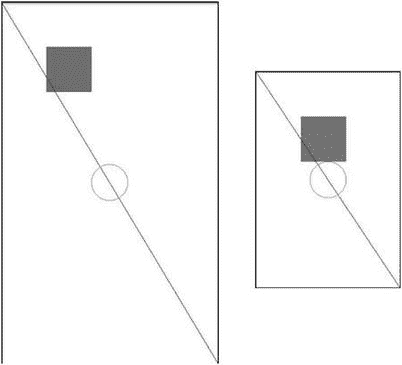

**图 4-13.** `ShapeTest`在 480×800 屏幕（左）和 320×480 屏幕（右）上的输出

哦，天哪，这是怎么回事？这就是在不同屏幕分辨率下使用绝对坐标和尺寸进行渲染的结果。两张图片中唯一保持不变的是那条红色直线，它只是从左上角绘制到右下角。这个操作是与屏幕分辨率无关的。

矩形的位置在(100,100)。根据屏幕分辨率的不同，到屏幕中心的距离也会不同。矩形的大小为 100×100 像素。在大屏幕上，它占用的相对空间比小屏幕上要小得多。

圆的位置同样与屏幕分辨率无关，但其半径并非如此。因此，它在小屏幕上占用的相对空间比大屏幕上更大。

我们已经看到，处理不同的屏幕分辨率可能是一个问题。如果再考虑不同的物理屏幕尺寸，情况会变得更糟。不过，我们将在下一章尝试解决这个问题。请记住，屏幕分辨率和物理尺寸都很重要。

**注意**  
`Canvas`和`Paint`类提供的功能远不止我们刚才提到的那些。实际上，所有标准的 Android 视图都使用这个 API 来绘制自身，所以你可以想象其中还有更多内容。和往常一样，请查阅 Android 开发者网站了解更多信息。

## 使用位图

虽然用直线或圆等基本形状来制作游戏是可行的，但这并不出彩。我们希望有出色的艺术家为我们创建精灵、背景等素材，然后从 PNG 或 JPEG 文件中加载它们。在 Android 上，这非常容易。

### 加载与检查位图

`Bitmap`类将成为我们的最佳伙伴。我们通过使用`BitmapFactory`单例从文件加载位图。由于我们将图像以资源形式存储，下面介绍如何从`assets/`目录加载图像：

```java
InputStream inputStream = assetManager.open("bob.png");
Bitmap bitmap = BitmapFactory.decodeStream(inputStream);
```

`Bitmap`类本身有一些我们感兴趣的方法。首先，我们想获取`Bitmap`实例的宽度和高度（以像素为单位）：

```java
int width = bitmap.getWidth();
int height = bitmap.getHeight();
```

接下来，我们可能想知道`Bitmap`实例的颜色格式：

```java
Bitmap.Config config = bitmap.getConfig();
```

`Bitmap.Config`是一个枚举，包含以下值：

- `Config.ALPHA_8`
- `Config.ARGB_4444`
- `Config.ARGB_8888`
- `Config.RGB_565`

从第 3 章你应该知道这些值的含义。如果不清楚，我们强烈建议你重新阅读第 3 章的“数字颜色编码”部分。

有趣的是，没有 RGB888 颜色格式。PNG 只支持 ARGB8888、RGB888 和调色板颜色。加载 RGB888 PNG 时会使用哪种颜色格式？答案是`Bitmap.Config.RGB_565`。对于通过`BitmapFactory`加载的任何 RGB888 PNG，都会自动进行这种转换。原因是大多数 Android 设备的实际帧缓冲区都使用这种颜色格式。如果以更高的每像素比特深度加载图像，会浪费内存，因为像素最终渲染时仍需转换为 RGB565。

那么，为什么会有`Config.ARGB_8888`配置呢？因为在将最终图像绘制到帧缓冲区之前，可以在 CPU 上完成图像合成。对于 alpha 分量，其比特深度远高于`Config.ARGB_4444`，这对于某些高质量的图像处理可能是必要的。

ARGB8888 PNG 图像会以`Config.ARGB_8888`配置加载到`Bitmap`实例中。其他两种颜色格式很少使用。但是，我们可以告诉`BitmapFactory`尝试以特定的颜色格式加载图像，即使其原始格式不同。

```java
InputStream inputStream = assetManager.open("bob.png");
BitmapFactory.Options options = new BitmapFactory.Options();
options.inPreferredConfig = Bitmap.Config.ARGB_4444;
Bitmap bitmap = BitmapFactory.decodeStream(inputStream, null, options);
```

我们使用重载的`BitmapFactory.decodeStream()`方法，通过`BitmapFactory.Options`类的实例向图像解码器传递一个提示。如前所示，我们可以通过`BitmapFactory.Options.inPreferredConfig`成员指定`Bitmap`实例所需的颜色格式。在这个假设的示例中，`bob.png`文件是 ARGB8888 PNG，我们希望`BitmapFactory`加载它并将其转换为 ARGB4444 位图。不过，`BitmapFactory`可以忽略这个提示。

这将释放该`Bitmap`实例使用的所有内存。当然，调用此方法后，不能再使用该位图进行渲染。

你也可以使用以下静态方法创建一个空的`Bitmap`实例：

```java
Bitmap bitmap = Bitmap.createBitmap(int width, int height, Bitmap.Config config);
```

如果你想自行进行实时图像合成，这会非常有用。`Canvas`类也可以用于位图：

```java
Canvas canvas = new Canvas(bitmap);
```

然后你可以像修改视图内容一样修改你的位图。

### 处理位图
```


`BitmapFactory`可以帮助我们在加载图像时减少内存占用。如第 3 章所述，`Bitmap`会占用大量内存。通过使用较小的色彩格式来降低每像素位数（bits per pixel）确实有所帮助，但如果我们持续不断地加载一个又一个位图，最终仍会耗尽内存。因此，我们应始终通过以下方法释放不再需要的`Bitmap`实例：

```java
Bitmap.recycle();
```

### 绘制位图

加载完位图后，我们可以通过`Canvas`类来绘制它们。最简单的方法如下：

```java
Canvas.drawBitmap(Bitmap bitmap, float topLeftX, float topLeftY, Paint paint);
```

第一个参数不言自明。参数`topLeftX`和`topLeftY`指定了位图左上角在屏幕上的坐标。最后一个参数可以为`null`。虽然我们可以使用`Paint`类指定一些非常高级的绘制参数，但通常并不需要。

另一个非常实用的方法如下：

```java
Canvas.drawBitmap(Bitmap bitmap, Rect src, Rect dst, Paint paint);
```

这个方法非常强大。它允许我们通过第二个参数指定要绘制的`Bitmap`的一部分。`Rect`类保存了一个矩形的左上角和右下角坐标。当我们通过`src`指定`Bitmap`的一部分时，使用的是`Bitmap`自身的坐标系。如果指定为`null`，则会使用完整的`Bitmap`。

第三个参数定义了将`Bitmap`的这部分绘制到何处，同样是以`Rect`实例的形式给出。不过，这次给出的角坐标是在`Canvas`类目标对象（可以是`View`或另一个`Bitmap`）的坐标系中。最令人惊讶的是，这两个矩形的大小不必相同。如果目标矩形比源矩形小，`Canvas`类会自动为我们进行缩放；反之，如果目标矩形更大，也同样会进行缩放。我们通常会将最后一个参数设为`null`。但请注意，这种缩放操作开销很大，应仅在必要时使用。

那么，你可能会想，如果拥有不同色彩格式的`Bitmap`实例，是否需要先将它们转换为某种标准格式，然后才能通过`Canvas`类进行绘制？答案是不需要。`Canvas`类会自动为我们完成转换。当然，如果使用与原生帧缓冲区格式相同的色彩格式，速度会稍快一些。通常情况下，我们可以忽略这一点。

混合（Blending）默认也是启用的，因此如果图像包含每像素的 alpha 分量，它会被正确解析。

## 综合运用

了解了这些信息后，我们终于可以加载并渲染一些 Bob 图像了。清单 4-14 展示的是我们为演示目的而编写的`BitmapTest`活动（Activity）的源码。

```java
package com.badlogic.androidgames.ch04androidbasics;
import java.io.IOException;
import java.io.InputStream;
import android.support.v7.app.AppCompatActivity;
import android.content.Context;
import android.content.res.AssetManager;
import android.graphics.Bitmap;
import android.graphics.BitmapFactory;
import android.graphics.Canvas;
import android.graphics.Rect;
import android.os.Bundle;
import android.util.Log;
import android.view.View;
import android.view.Window;
import android.view.WindowManager;
public class BitmapTest extends AppCompatActivity {
    class RenderView extends View {
        Bitmap bob565;
        Bitmap bob4444;
        Rect dst = new Rect();
        public RenderView(Context context) {
            super(context);
            try {
                AssetManager assetManager = context.getAssets();
                InputStream inputStream = assetManager.open("bobrgb888.png");
                bob565 = BitmapFactory.decodeStream(inputStream);
                inputStream.close();
                Log.d("BitmapText",
                    "bobrgb888.png format: " + bob565.getConfig());
                inputStream = assetManager.open("bobargb8888.png");
                BitmapFactory.Options options = new BitmapFactory.Options();
                options.inPreferredConfig = Bitmap.Config.ARGB_4444;
                bob4444 = BitmapFactory
                    .decodeStream(inputStream, null, options);
                inputStream.close();
                Log.d("BitmapText",
                    "bobargb8888.png format: " + bob4444.getConfig());
            } catch (IOException e) {
                // silently ignored, bad coder monkey, baaad!
            } finally {
                // we should really close our input streams here.
            }
        }
        protected void onDraw(Canvas canvas) {
            canvas.drawRGB(0, 0, 0);
            dst.set(50, 50, 350, 350);
            canvas.drawBitmap(bob565, null, dst, null);
            canvas.drawBitmap(bob4444, 100, 100, null);
            invalidate();
        }
    }
    @Override
    public void onCreate(Bundle savedInstanceState) {
        super.onCreate(savedInstanceState);
        requestWindowFeature(Window.FEATURE_NO_TITLE);
        getWindow().setFlags(WindowManager.LayoutParams.FLAG_FULLSCREEN,
            WindowManager.LayoutParams.FLAG_FULLSCREEN);
        setContentView(new RenderView(this));
    }
}
```

清单 4-14. `BitmapTest`活动（Activity）

activity 中的`onCreate()`方法已是老生常谈，因此我们直接来看自定义视图。它包含两个`Bitmap`成员变量：一个以 RGB565 格式存储 Bob 图像（第 3 章中介绍过），另一个以 ARGB4444 格式存储 Bob 图像。我们还有一个`Rect`成员变量，用于存储渲染的目标矩形。

在`RenderView`类的构造函数中，我们首先将 Bob 图像加载到视图的`bob565`成员变量中。请注意，该图像是从一个 RGB888 的 PNG 文件加载的，`BitmapFactory`会自动将其转换为 RGB565 图像。为证明这一点，我们还将该`Bitmap`的`Bitmap.Config`输出到了 logcat 中。RGB888 版本的 Bob 图像具有不透明的白色背景，因此无需进行混合操作。

接下来，我们从存储在`assets/`目录下的 ARGB8888 PNG 文件中加载 Bob 图像。为了节省内存，我们指示`BitmapFactory`将此 Bob 图像转换为 ARGB4444 位图。不过，工厂可能会出于未知原因而拒绝此请求。为了确认它是否配合，我们也将其`Bitmap.Config`输出到了 logcat。

`onDraw()`方法很简单。我们只是将屏幕填充为黑色，将`bob565`缩放至 250×250 像素（原图为 160×183 像素）进行绘制，然后将`bob4444`在`bob565`之上进行绘制，不缩放但进行混合（由`Canvas`类自动完成）。图 4-14 展示了两位 Bob 的全貌。

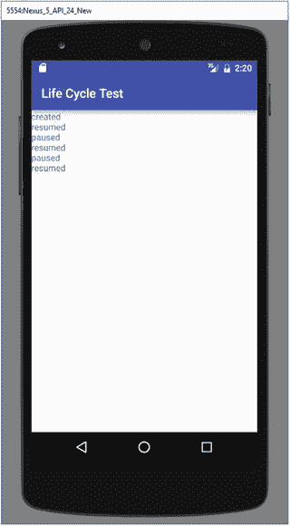

图 4-14. 两位 Bob 叠在一起（在 480×800 像素分辨率下）

Logcat 报告显示，`bob565`确实采用了`Config.RGB_565`色彩格式，而`bob4444`被转换成了`Config.ARGB_4444`。`BitmapFactory`没有让我们失望！

以下是你在本部分中应记住的一些要点：

*   使用能接受的、最小的色彩格式以节省内存。但这可能会牺牲一定的视觉效果，并略微降低渲染速度。


## 排版后的文档

除非绝对必要，否则应避免绘制缩放后的位图。如果知道它们的缩放尺寸，请预先离线缩放或在加载时缩放。

始终确保在不再需要位图时调用`Bitmap.recycle()`方法。否则，会导致内存泄漏或内存不足。

一直使用`logcat`进行文本输出有点繁琐。让我们看看如何通过`Canvas`类渲染文本。

**注意**
与其他类一样，`Bitmap`的内容远不止我们在这简短章节中所描述的。我们只介绍了编写 Mr. Nom 游戏所需的最低限度内容。如需更多信息，请查看 Android 开发者网站上的文档。

### 渲染文本

虽然我们在 Mr. Nom 游戏中输出的文本将是手绘的，但了解如何通过 TrueType 字体绘制文本并无坏处。让我们从从`assets/`目录加载自定义 TrueType 字体文件开始。

#### 加载字体

Android API 提供了一个名为`Typeface`的类，它封装了 TrueType 字体。它提供了一个简单的静态方法，用于从`assets/`目录加载此类字体文件：

```java
Typeface font = Typeface.createFromAsset(context.getAssets(), "font.ttf");
```

有趣的是，如果字体文件无法加载，此方法不会抛出任何类型的异常。相反，会抛出一个`RuntimeException`。此方法为何不显式抛出异常有点神秘。

#### 使用字体绘制文本

一旦我们有了字体，就将其设置为`Paint`实例的`Typeface`：

```java
paint.setTypeFace(font);
```

通过`Paint`实例，我们还指定了渲染字体的大小：

```java
paint.setTextSize(30);
```

最后，我们可以通过以下`Canvas`方法使用此字体绘制文本：

```java
canvas.drawText("This is a test!", 100, 100, paint);
```

第一个参数是要绘制的文本。接下来的两个参数是文本应绘制位置的坐标。最后一个参数很熟悉：它是`Paint`实例，指定了要绘制文本的颜色、字体和大小。通过设置画笔的颜色，您同时也设置了要绘制文本的颜色。

#### 文本对齐与边界

现在，您可能想知道上述方法中的坐标与文本字符串填充的矩形有何关系。它们是否指定了文本所在矩形的左上角？答案有点复杂。`Paint`实例有一个名为对齐设置的属性。它可以通过`Paint`类的此方法进行设置：

```java
Paint.setTextAlign(Paint.Align align);
```

`Paint.Align`枚举有三个值：`Paint.Align.LEFT`、`Paint.Align.CENTER`和`Paint.Align.RIGHT`。根据设置的对齐方式，传递给`Canvas.drawText()`方法的坐标被解释为矩形的左上角、矩形的顶部中心像素或矩形的右上角。标准对齐方式是`Paint.Align.LEFT`。

有时，了解特定字符串的像素边界也很有用。为此，`Paint`类提供了以下方法：

```java
Paint.getTextBounds(String text, int start, int end, Rect bounds);
```

第一个参数是我们想要获取其边界的字符串。第二个和第三个参数指定要测量的字符串内的起始字符和结束字符。结束参数是独占的。最后一个参数`bounds`是我们自己分配并传入方法的`Rect`实例。该方法会将边界矩形的宽度和高度写入`Rect.right`和`Rect.bottom`字段。为方便起见，我们可以调用`Rect.width()`和`Rect.height()`来获取相同的值。

请注意，所有这些方法仅适用于单行文本。如果我们要渲染多行，我们必须自己进行布局。

## 综合运用

说得够多了。让我们多写一些代码。清单 4-15 展示了文本渲染的实际应用。

```java
package com.badlogic.androidgames.ch04androidbasics;
import android.support.v7.app.AppCompatActivity;
import android.content.Context;
import android.graphics.Canvas;
import android.graphics.Color;
import android.graphics.Paint;
import android.graphics.Rect;
import android.graphics.Typeface;
import android.os.Bundle;
import android.view.View;
import android.view.Window;
import android.view.WindowManager;
public class FontTest extends AppCompatActivity {
    class RenderView extends View {
        Paint paint;
        Typeface font;
        Rect bounds = new Rect();
        public RenderView(Context context) {
            super(context);
            paint = new Paint();
            font = Typeface.createFromAsset(context.getAssets(), "font.ttf");
        }
        protected void onDraw(Canvas canvas) {
            canvas.drawRGB(0, 0, 0);
            paint.setColor(Color.YELLOW);
            paint.setTypeface(font);
            paint.setTextSize(28);
            paint.setTextAlign(Paint.Align.CENTER);
            canvas.drawText("This is a test!", canvas.getWidth() / 2, 100, paint);
            String text = "This is another test o_O";
            paint.setColor(Color.WHITE);
            paint.setTextSize(18);
            paint.setTextAlign(Paint.Align.LEFT);
            paint.getTextBounds(text, 0, text.length(), bounds);
            canvas.drawText(text, canvas.getWidth() - bounds.width(), 140, paint);
            invalidate();
        }
    }
    @Override
    public void onCreate(Bundle savedInstanceState) {
        super.onCreate(savedInstanceState);
        requestWindowFeature(Window.FEATURE_NO_TITLE);
        getWindow().setFlags(WindowManager.LayoutParams.FLAG_FULLSCREEN,
                WindowManager.LayoutParams.FLAG_FULLSCREEN);
        setContentView(new RenderView(this));
    }
}
```
**清单 4-15.** `FontTest`活动

我们不会讨论活动的`onCreate()`方法，因为之前已经见过。

我们的`RenderView`实现有三个成员：`Paint`、`Typeface`和`Rect`，稍后将在其中存储文本字符串的边界。

在构造函数中，我们创建一个新的`Paint`实例，并从`assets/`目录中的`font.ttf`文件加载字体。

在`onDraw()`方法中，我们用黑色清除屏幕，将`Paint`类设置为黄色，设置字体及其大小，并指定在调用`Canvas.drawText()`时解释坐标所使用的文本对齐方式。实际的绘制调用渲染了字符串`This is a test!`，在 y 轴上的坐标 100 处水平居中。

对于第二次文本渲染调用，我们做了些不同的事情。我们希望文本与屏幕右边缘右对齐。我们可以通过使用`Paint.Align.RIGHT`和 x 坐标为`Canvas.getWidth() - 1`来实现。相反，我们使用字符串的边界以困难的方式实现，以便稍微练习一下非常基本的文本布局。我们还更改了渲染的颜色和字体大小。图 4-15 显示了此活动的输出。


**图 4-15.** 文本的乐趣（480×800 像素分辨率）。

`Typeface`类的另一个神秘之处是，它没有明确允许我们释放其所有资源。我们必须依赖垃圾收集器为我们完成这项脏活。

**注意**
我们这里只是浅尝辄止地介绍了文本渲染。如果您想了解更多……好吧，现在您知道该去哪里找了。

## 使用`SurfaceView`进行连续渲染

这是我们将成为真正男子汉和女强人的部分。它涉及线程，以及与之相关的所有痛苦。我们会挺过去的。我们保证！

### 动机

当我们在本章前面首次尝试进行连续渲染时，我们做错了。占用 UI 线程是不可接受的；我们需要一个在单独线程中完成所有脏活的解决方案。欢迎使用`SurfaceView`。


### SurfaceView 类

顾名思义，`SurfaceView`类是一个处理`Surface`（Android API 的另一个类）的视图。什么是`Surface`？它是屏幕合成器用于渲染特定视图的原始缓冲区的一种抽象。屏幕合成器是 Android 上所有渲染背后的核心，它最终负责将所有像素推送到 GPU。`Surface`在某些情况下可以进行硬件加速。不过，我们并不太关心这一点。我们只需要知道，这是一种更直接的将内容渲染到屏幕上的方式。

我们的目标是在一个单独的线程中执行渲染，这样就不会占用忙于处理其他事务的 UI 线程。`SurfaceView`类为我们提供了一种从 UI 线程之外的线程向其渲染内容的方法。

### SurfaceHolder 和锁定

为了从不同于 UI 线程的线程渲染到`SurfaceView`，我们需要获取`SurfaceHolder`类的实例，如下所示：

```
SurfaceHolder holder = surfaceView.getHolder();
```

`SurfaceHolder`是`Surface`的一个包装器，它为我们执行一些记账工作。它为我们提供了两个方法：

```
Canvas SurfaceHolder.lockCanvas();
SurfaceHolder.unlockAndPost(Canvas canvas);
```

第一个方法锁定`Surface`用于渲染，并返回一个我们可以使用的`Canvas`实例。第二个方法再次解锁`Surface`，并确保我们通过`Canvas`实例绘制的内容显示在屏幕上。我们将在渲染线程中使用这两个方法来获取`Canvas`实例，使用它进行渲染，最后让刚刚渲染的图像在屏幕上可见。我们必须传递给`SurfaceHolder.unlockAndPost()`方法的`Canvas`实例必须是我们从`SurfaceHolder.lockCanvas()`方法接收到的那个。

当`SurfaceView`被实例化时，`Surface`类并不会立即创建。相反，它是异步创建的。`Surface`类会在每次 Activity 暂停时被销毁，并在 Activity 恢复时被重新创建。

### Surface 创建与有效性

只要`Surface`实例尚未有效，我们就无法从`SurfaceHolder`类获取`Canvas`实例。但是，我们可以通过以下语句检查`Surface`实例是否已创建：

```
boolean isCreated = surfaceHolder.getSurface().isValid();
```

如果此方法返回`true`，我们就可以安全地锁定 surface 并通过我们接收到的`Canvas`实例绘制。我们必须绝对确保在调用`SurfaceHolder.lockCanvas()`之后再次解锁`Surface`类，否则我们的 Activity 可能会导致手机死锁！

### 整合在一起

那么，我们如何将所有这一切与一个单独的渲染线程以及 Activity 生命周期结合起来呢？弄清楚这个问题的最佳方法是查看一些实际代码。列表 4-16 显示了一个完整的示例，该示例在`SurfaceView`类的单独线程中执行渲染。

```
package com.badlogic.androidgames.ch04androidbasics;
import android.support.v7.app.AppCompatActivity;
import android.content.Context;
import android.graphics.Canvas;
import android.os.Bundle;
import android.view.SurfaceHolder;
import android.view.SurfaceView;
import android.view.Window;
import android.view.WindowManager;
public class SurfaceViewTest extends AppCompatActivity {
FastRenderView renderView;
public void onCreate(Bundle savedInstanceState) {
super.onCreate(savedInstanceState);
requestWindowFeature(Window.FEATURE_NO_TITLE);
getWindow().setFlags(WindowManager.LayoutParams.FLAG_FULLSCREEN,
WindowManager.LayoutParams.FLAG_FULLSCREEN);
renderView = new FastRenderView(this);
setContentView(renderView);
}
protected void onResume() {
super.onResume();
renderView.resume();
}
protected void onPause() {
super.onPause();
renderView.pause();
}
class FastRenderView extends SurfaceView implements Runnable {
Thread renderThread = null;
SurfaceHolder holder;
volatile boolean running = false;
public FastRenderView(Context context) {
super(context);
holder = getHolder();
}
public void resume() {
running = true;
renderThread = new Thread(this);
renderThread.start();
}
public void run() {
while(running) {
if(!holder.getSurface().isValid())
continue;
Canvas canvas = holder.lockCanvas();
canvas.drawRGB(255, 0, 0);
holder.unlockCanvasAndPost(canvas);
}
}
public void pause() {
running = false;
while(true) {
try {
renderThread.join();
return;
} catch (InterruptedException e) {
// retry
}
}
}
}
}
列表 4-16. SurfaceViewTest 活动
```

这看起来并不那么令人畏惧，不是吗？我们的 Activity 持有一个`FastRenderView`实例作为成员。这是一个自定义的`SurfaceView`子类，它将为我们处理所有线程事务和 surface 锁定。对于 Activity 来说，它看起来就像一个普通的`View`。

在`onCreate()`方法中，我们启用全屏模式，创建`FastRenderView`实例，并将其设置为 Activity 的内容视图。

这次我们还重写了`onResume()`方法。在此方法中，我们将通过调用`FastRenderView.resume()`方法间接启动渲染线程，该方法在内部完成了所有神奇的工作。这意味着当 Activity 最初创建时，线程将启动（因为`onCreate()`之后总是会调用`onResume()`）。当 Activity 从暂停状态恢复时，线程也会重新启动。

这当然意味着我们必须在某个地方停止线程；否则，每次调用`onResume()`时我们都会创建一个新线程。这就是`onPause()`的作用所在。它调用`FastRenderView.pause()`方法，该方法将完全停止线程。在线程完全停止之前，该方法不会返回。

那么，我们来看看这个示例的核心类：`FastRenderView`。它与我们之前几个示例中实现的`RenderView`类类似，因为它派生自另一个`View`类。在本例中，我们直接派生自`SurfaceView`类。它还实现了`Runnable`接口，以便我们可以将其传递给渲染线程，使其执行渲染线程逻辑。

`FastRenderView`类有三个成员。`renderThread`成员只是对`Thread`实例的引用，该实例将负责执行我们的渲染线程逻辑。`holder`成员是对`SurfaceHolder`实例的引用，我们从派生出的`SurfaceView`超类中获取该实例。最后，`running`成员是一个简单的布尔标志，我们将用它来向渲染线程发出信号，指示其应停止执行。`volatile`修饰符具有特殊含义，我们稍后会介绍。

在构造函数中，我们所做的就是调用超类构造函数，并将对`SurfaceHolder`的引用存储在`holder`成员中。


接下来是`FastRenderView.resume()`方法。它负责启动渲染线程。注意，每次调用此方法时，我们都会创建一个新的`Thread`实例。这与我们之前讨论 Activity 的`onResume()`和`onPause()`方法时提到的内容一致。我们还将`running`标志设置为`true`。稍后你会看到它在渲染线程中的用途。最后需要理解的一点是，我们将`FastRenderView`实例本身设置为线程的`Runnable`接口。这将让新线程执行`FastRenderView`的下一个方法。

`FastRenderView.run()`方法是我们自定义`View`类的主力。它的主体在渲染线程中执行。如你所见，它仅由一个循环组成，一旦`running`标志被设置为`false`，循环就会停止执行。当这种情况发生时，线程也将停止并消亡。在`while`循环内部，我们首先检查`Surface`是否有效。如果有效，我们就锁定它、进行渲染，然后再次解锁，如前所述。在这个例子中，我们简单地将`Surface`填充为红色。

`FastRenderView.pause()`方法看起来有点奇怪。首先，我们将`running`标志设置为`false`。如果你向上看看代码，会发现`FastRenderView.run()`方法中的`while`循环最终会因此终止，从而停止渲染线程。在接下来的几行代码中，我们通过调用`Thread.join()`来等待线程完全消亡。这个方法会等待线程结束，但在线程实际结束前可能会抛出`InterruptedException`异常。由于在从该方法返回之前，我们必须绝对确保线程已死，因此我们在一个无限循环中执行`join()`，直到成功为止。

让我们回到`running`标志的`volatile`修饰符。为什么我们需要它？原因很微妙：如果编译器发现`FastRenderView.pause()`方法中的第一行与`while`块之间没有依赖关系，它可能会决定重排其中的语句。如果编译器认为这能使代码执行得更快，它就被允许这样做。然而，我们依赖于在该方法中指定的执行顺序。想象一下，如果`running`标志是在我们尝试`join()`线程之后才被设置的。那么由于线程永远不会终止，我们将陷入无限循环。

`volatile`修饰符阻止了这种情况的发生。任何引用此成员的语句都将按顺序执行。这让我们避免了一个讨厌的“海森堡”问题——一个无法被稳定复现、时有时无的 bug。

还有一件事，你可能认为会导致这段代码崩溃。如果在调用`SurfaceHolder.getSurface().isValid()`和`SurfaceHolder.lock()`之间，`Surface`被销毁了怎么办？好吧，我们很幸运——这永远不会发生。要理解原因，我们得退一步，看看`Surface`的生命周期是如何工作的。

我们知道`Surface`是异步创建的。我们的渲染线程很可能在`Surface`生效之前就开始执行了。我们通过确保在`Surface`有效时才锁定它来防止这种情况。这涵盖了`Surface`创建的情况。

渲染线程代码不会因为在有效性检查和锁定之间`Surface`被销毁而出错，其原因与`Surface`被销毁的时间点有关。`Surface`总是在我们从 Activity 的`onPause()`方法返回之后才被销毁。由于我们在该方法中通过调用`FastRenderView.pause()`等待线程结束，因此当`Surface`实际被销毁时，渲染线程将不再存活。这很性感，不是吗？但同时也很令人困惑。

我们现在以正确的方式执行连续渲染。我们不再占用 UI 线程，而是使用一个单独的渲染线程。我们也让它尊重 Activity 的生命周期，这样在 Activity 暂停时，它就不会在后台运行、消耗电池。世界又变得美好了。当然，我们需要将 UI 线程中输入事件的处理与我们的渲染线程同步。这将变得非常简单，你将在下一章中看到，届时我们将基于你在本章中吸收的所有信息来实现我们的游戏框架。

## 硬件加速的 Canvas 渲染

Android 3.0 (Honeycomb) 增加了一个了不起的特性，即为标准 2D 画布绘制调用启用 GPU 硬件加速。这个特性的价值因应用和设备而异，有些设备在 CPU 上执行 2D 绘制实际性能更好，而另一些设备则能从 GPU 中获益。在底层，硬件加速会分析绘制调用并将其转换为 OpenGL。例如，如果我们指定一条线应从(0,0)绘制到(100,100)，那么硬件加速将使用 OpenGL 组合成一个特殊的画线调用，并将其绘制到一个硬件缓冲区中，该缓冲区随后会合成到屏幕上。

启用此硬件加速非常简单，只需在`AndroidManifest.xml`文件的`<application />`标签下添加以下内容：

```
android:hardwareAccelerated="true"
```

请务必在多种设备上分别测试开启和关闭加速时的游戏表现，以确定哪种方式适合你。将来，也许一直开启它也没问题，但任何事都一样，我们建议你自行测试和判断。当然，还有更多配置选项可以让你为特定的应用、Activity、窗口或视图设置硬件加速，但由于我们是做游戏，每种对象我们只计划有一个，因此通过应用全局设置它是最合理的。

Android 此项功能的开发者 Romain Guy，有一篇非常详细的博客文章，介绍了硬件加速的注意事项以及使用它获得不错性能的一些通用准则。该博客文章的 URL 是：[`android-developers.blogspot.com/2011/03/android-30-hardware-acceleration.html`](http://android-developers.blogspot.com/2011/03/android-30-hardware-acceleration.html)

## 最佳实践

Android（或者说 Dalvik）有时会有一些奇怪的性能特征。在本节中，我们将向你介绍一些最重要的最佳实践，让你的游戏如丝般顺滑。

*   垃圾收集器是你最大的敌人。一旦它获得 CPU 时间来处理其“脏活”，它会停止所有线程长达 600 毫秒。这意味着你的游戏会有半秒钟无法更新或渲染。用户会抱怨的。尽可能避免创建对象，尤其是在你的内层循环中。

*   对象可能会在一些不那么明显的地方被创建，你需要避免这些情况。不要使用迭代器，因为它们会创建新对象。不要使用任何标准的`Set`或`Map`集合类，因为每次插入它们都会创建新对象；相反，请使用 Android API 提供的`SparseArray`类。使用`StringBuffer`来拼接字符串，而不是使用`+`运算符。后者每次都会创建一个新的`StringBuffer`。此外，看在上帝的份上，不要使用装箱的基本类型（boxed primitives）！


### 方法调用与性能

*   在`Dalvik`虚拟机中，方法调用的开销比其他虚拟机更大。如果可能，尽量使用静态方法，因为它们的性能最佳。静态方法通常被认为是不好的设计，就像静态变量一样，因为它们会助长不良的设计风格，所以请尽量保持设计的整洁。或许你也应该避免使用 getter 和 setter 方法。在没有 JIT 编译器的情况下，直接访问字段的速度大约是方法调用的三倍，而在有 JIT 编译器的情况下，速度则大约是七倍。尽管如此，在移除所有 getter 和 setter 之前，请先考虑你的设计。
*   在没有 JIT 编译器的旧设备或`Dalvik`版本（即 Android 2.2 版本之前的任何版本）上，浮点运算是在软件层面实现的。老派游戏开发者会立即回退到定点数学运算。但不要这样做，因为整数除法同样很慢。大多数情况下，使用浮点数就足够了，而且新设备都配备了浮点运算单元（FPU），一旦 JIT 编译器介入，这能极大地提升运算速度。
*   尽量将频繁访问的值放入方法内部的局部变量中。访问局部变量比访问成员变量或调用 getter 方法更快。

当然，你还需要注意许多其他方面。在本书的其余部分，我们会在合适的上下文中穿插一些性能优化提示。如果你遵循了上述建议，基本上就能确保安全。只要别让垃圾收集器得逞就行！

## 总结

本章涵盖了编写一个像样的 Android 2D 游戏所需的所有知识。我们了解了使用一些默认设置来创建一个新游戏项目是多么简单。我们讨论了神秘的 Activity 生命周期以及如何与之共存。我们与触摸事件（更重要的是多点触控）进行了“较量”，处理了按键事件，并通过加速度计检测了设备的方向。我们探索了如何读写文件。在 Android 上输出音频非常简单，除了`SurfaceView`的线程问题外，在屏幕上绘制内容也并不困难。现在，Mr. Nom 游戏终于可以成为现实了——一个糟糕透顶、令人饥肠辘辘的现实！

