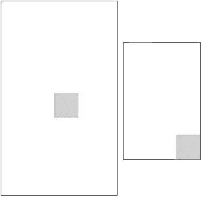
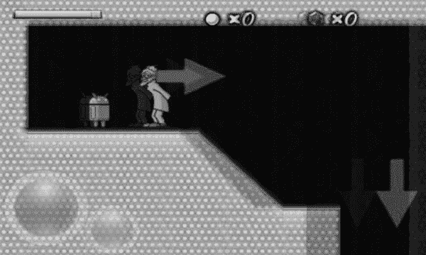

# 5. 一个 Android 游戏开发框架

你可能已经注意到，我们已经度过了四个章节，却没有编写一行游戏代码。我们让你经受所有这些枯燥的理论并让你实现测试程序的原因很简单：如果你想编写游戏，就必须确切了解其中的原理。你不能只是从网上各处复制粘贴代码，就指望它能成为下一款第一人称射击大作。到现在，你应该已经牢牢掌握了如何从零开始设计一个简单的游戏，如何为 2D 游戏开发构建一个良好的 API，以及哪些 Android API 能提供实现你想法的功能。

为了让 Mr. Nom 成为现实，我们必须做两件事：实现我们在第 3 章中设计的游戏框架接口和类，并在此基础上编写 Mr. Nom 的游戏逻辑。让我们先从游戏框架开始，将我们在第 3 章中设计的部分与我们在第 4 章中讨论的内容结合起来。其中百分之九十的代码你应该已经很熟悉了，因为我们在前一章的测试程序中已经涵盖了大部分内容。

## 行动计划

在第 3 章中，我们为游戏框架设计了一个最小化的方案，该方案抽象了所有平台特性，以便我们能专注于核心任务：游戏开发。现在，我们将采用自底向上的方式，从最简单到最复杂，实现所有这些接口和抽象类。

如果你已经下载了本章的代码，第 3 章中的接口位于名为`com.badlogic.androidgames.framework`的包中。我们会将本章的实现代码放在`com.badlogic.androidgames.framework.impl`包中，这表明它是 Android 框架的实际实现。我们会在所有接口实现类名前加上`Android`前缀，以便将它们与接口区分开来。让我们从最简单的部分——文件 I/O——开始。

如果你没有下载本章的代码，只需创建一个新项目，并将刚才提到的两个包添加到其中。在第一个包中，添加第 3 章的接口代码。在第二个包中，你将放置本章的所有代码。本章和下一章的代码将合并到一个 Android Studio 项目中。现在，你可以按照第 4 章的步骤创建一个新的 Android 项目。此时，你为默认 Activity 取什么名字都无关紧要。

## `AndroidFileIO` 类

原始的文件 I/O 接口简洁而高效。它包含四个方法：一个用于获取资源文件的`InputStream`，一个用于获取外部存储文件的`InputStream`，一个用于返回外部存储设备文件的`OutputStream`，以及最后一个用于获取游戏共享首选项的方法。在第 4 章中，你学习了如何使用 Android API 打开资源文件和外部存储上的文件。以下代码清单 5-1 展示了基于第 4 章知识的文件 I/O 接口实现。

```
package com.badlogic.androidgames.framework.impl;
import java.io.File;
import java.io.FileInputStream;
import java.io.FileOutputStream;
import java.io.IOException;
import java.io.InputStream;
import java.io.OutputStream;
import android.content.Context;
import android.content.SharedPreferences;
import android.content.res.AssetManager;
import android.os.Environment;
import android.preference.PreferenceManager;
import com.badlogic.androidgames.framework.FileIO;
public class AndroidFileIO implements FileIO {
Context context;
AssetManager assets;
String externalStoragePath;
public AndroidFileIO(Context context) {
this.context = context;
this.assets = context.getAssets();
this.externalStoragePath = content.getExternalFilesDir(null)
.getAbsolutePath() + File.separator;
}
public InputStream readAsset(String fileName) throws IOException {
return assets.open(fileName);
}
public InputStream readFile(String fileName) throws IOException {
return new FileInputStream(externalStoragePath + fileName);
}
public OutputStream writeFile(String fileName) throws IOException {
return new FileOutputStream(externalStoragePath + fileName);
}
public SharedPreferences getPreferences() {
return PreferenceManager.getDefaultSharedPreferences(context);
}
}
代码清单 5-1.
AndroidFileIO.java: 实现 FileIO 接口
```

一切都很直接。我们实现了文件 I/O 接口，存储了`Context`实例（它是通往 Android 几乎所有功能的门户），存储了从`Context`实例获取的`AssetManager`，存储了特定于我们应用程序的外部存储路径，并基于此路径实现了四个方法。最后，我们传递了任何可能抛出的`IOException`，以便在调用方了解是否有任何异常情况。

我们的游戏接口实现将持有一个此类的实例，并通过`Game.getFileIO()`返回它。这也意味着，为了使`AndroidFileIO`实例正常工作，我们的游戏实现需要传递`Context`实例。


### 关于外部存储可用性的说明

请注意，我们不会检查外部存储是否可用。如果外部存储不可用，或者我们忘记在清单文件中添加适当的权限，应用程序将抛出异常，因此错误检查是隐式完成的。现在，我们可以继续构建框架的下一部分——音频部分。

## `AndroidAudio`、`AndroidSound` 和 `AndroidMusic`：崩溃、巨响、轰隆！

在第 3 章中，我们为所有音频需求设计了三个接口：`Audio`、`Sound` 和 `Music`。`Audio` 负责从资源文件中创建 `Sound` 和 `Music` 实例。`Sound` 允许我们播放存储在 RAM 中的音效，而 `Music` 接口则负责将较大的音乐文件从磁盘流式传输到声卡。在第 4 章中，你学习了实现此功能所需的 Android API。我们将从 `AndroidAudio` 的实现开始，如代码清单 5-2 所示，并在适当位置穿插说明文字。

```java
package com.badlogic.androidgames.framework.impl;
import java.io.IOException;
import android.app.Activity;
import android.content.res.AssetFileDescriptor;
import android.content.res.AssetManager;
import android.media.AudioManager;
import android.media.SoundPool;
import com.badlogic.androidgames.framework.Audio;
import com.badlogic.androidgames.framework.Music;
import com.badlogic.androidgames.framework.Sound;
public class AndroidAudio implements Audio {
AssetManager assets;
SoundPool soundPool;
代码清单 5-2.
AndroidAudio.java：实现音频接口
```

`AndroidAudio` 的实现包含一个 `AssetManager` 实例和一个 `SoundPool` 实例。当调用 `AndroidAudio.newSound()` 时，需要 `AssetManager` 来将音效从资源文件加载到 `SoundPool` 中。同时，`AndroidAudio` 实例也负责管理 `SoundPool`。

```java
public AndroidAudio(Activity activity) {
activity.setVolumeControlStream(AudioManager.STREAM_MUSIC);
this.assets = activity.getAssets();
this.soundPool = new SoundPool();
}
public Music newMusic(String filename) {
try {
AssetFileDescriptor assetDescriptor = assets.openFd(filename);
return new AndroidMusic(assetDescriptor);
} catch (IOException e) {
throw new RuntimeException("Couldn't load music '" + filename + "'");
}
}
```

`newMusic()` 方法创建一个新的 `AndroidMusic` 实例。该类的构造函数接收一个 `AssetFileDescriptor` 参数，并利用它来创建一个内部的 `MediaPlayer`（稍后会详细说明）。如果出现错误，`AssetManager.openFd()` 方法会抛出 `IOException`。我们捕获此异常，并将其重新抛出为 `RuntimeException`。为什么不让调用者处理 `IOException`？首先，这会使调用代码变得相当臃肿，因此我们更倾向于抛出一个无需显式捕获的 `RuntimeException`。其次，我们从资源文件加载音乐。只有在忘记将音乐文件添加到 `assets/` 目录，或者音乐文件包含错误字节时，才会加载失败。错误的字节属于不可恢复的错误，因为我们需要该 `Music` 实例才能使游戏正常运行。为了避免这种情况发生，在游戏框架的另外几个地方，我们也使用了抛 `RuntimeException` 的方式，而非受检异常。

```java
public Sound newSound(String filename) {
try {
AssetFileDescriptor assetDescriptor = assets.openFd(filename);
int soundId = soundPool.load(assetDescriptor, 0);
return new AndroidSound(soundPool, soundId);
} catch (IOException e) {
throw new RuntimeException("Couldn't load sound '" + filename + "'");
}
}
}
```

最后，`newSound()` 方法从资源文件中加载音效到 `SoundPool`，并返回一个 `AndroidSound` 实例。该实例的构造函数接收一个 `SoundPool` 和所需音效的 ID（该 ID 由 `SoundPool` 分配）。同样，我们捕获所有 `IOException`，并将其重新抛出为非受检的 `RuntimeException`。

> **注意**
>
> 我们没有在任何方法中释放 `SoundPool`。这是因为始终会存在一个单一的 `Game` 实例，该实例持有一个单一的 `Audio` 实例，而该 `Audio` 实例又持有一个单一的 `SoundPool` 实例。因此，只要 Activity（以及我们的游戏）存在，`SoundPool` 实例就会保持存活。当 Activity 结束时，它会被自动销毁。

接下来，我们将讨论 `AndroidSound` 类，该类实现了 `Sound` 接口。代码清单 5-3 展示了其实现。

```java
package com.badlogic.androidgames.framework.impl;
import android.media.SoundPool;
import com.badlogic.androidgames.framework.Sound;
public class AndroidSound implements Sound {
int soundId;
SoundPool soundPool;
public AndroidSound(SoundPool soundPool, int soundId) {
this.soundId = soundId;
this.soundPool = soundPool;
}
public void play(float volume) {
soundPool.play(soundId, volume, volume, 0, 0, 1);
}
public void dispose() {
soundPool.unload(soundId);
}
}
代码清单 5-3.
使用 AndroidSound.java 实现 Sound 接口
```

这里没有什么特别之处。通过 `play()` 和 `dispose()` 方法，我们只是存储了 `SoundPool` 和已加载音效的 ID，以便稍后进行播放和释放。得益于 Android API，没有比这更简单的实现了。

最后，我们需要实现由 `AndroidAudio.newMusic()` 返回的 `AndroidMusic` 类。代码清单 5-4 展示了该类的代码，看起来比之前稍微复杂一些。这是因为 `MediaPlayer` 使用了一个状态机，如果在某些状态下调用其方法，它会持续抛出异常。请注意，该代码清单同样被分段展示，并在适当位置插入了注释。

```java
package com.badlogic.androidgames.framework.impl;
import java.io.IOException;
import android.content.res.AssetFileDescriptor;
import android.media.MediaPlayer;
import android.media.MediaPlayer.OnCompletionListener;
import com.badlogic.androidgames.framework.Music;
public class AndroidMusic implements Music, OnCompletionListener {
MediaPlayer mediaPlayer;
boolean isPrepared = false;
代码清单 5-4.
AndroidMusic.java：实现音频接口
```

`AndroidMusic` 类存储了一个 `MediaPlayer` 实例和一个名为 `isPrepared` 的布尔变量。请记住，只有当 `MediaPlayer` 处于准备状态时，我们才能调用 `MediaPlayer.start()`/`stop()`/`pause()` 方法。这个成员变量帮助我们跟踪 `MediaPlayer` 的状态。

`AndroidMusic` 类同时实现了 `Music` 接口和 `OnCompletionListener` 接口。在第 4 章中，我们简单地将此接口定义为一个通知机制，用于告知我们 `MediaPlayer` 实例何时停止播放音乐文件。如果发生这种情况，在调用其他任何方法之前，需要再次准备 `MediaPlayer`。`OnCompletionListener.onCompletion()` 方法可能会在单独的线程中被调用，并且由于我们在此方法中设置了 `isPrepared` 成员变量，因此必须确保其免受并发修改的影响。

```java
public AndroidMusic(AssetFileDescriptor assetDescriptor) {
mediaPlayer = new MediaPlayer();
try {
mediaPlayer.setDataSource(assetDescriptor.getFileDescriptor(),
assetDescriptor.getStartOffset(),
assetDescriptor.getLength());
mediaPlayer.prepare();
isPrepared = true;
mediaPlayer.setOnCompletionListener(this);
} catch (Exception e) {
throw new RuntimeException("Couldn't load music");
}
}
```

在构造函数中，我们根据传入的 `AssetFileDescriptor` 创建并准备 `MediaPlayer` 实例，设置 `isPrepared` 标志，并将 `AndroidMusic` 实例注册为 `MediaPlayer` 的 `OnCompletionListener`。如果出现任何问题，我们将再次抛出一个非受检的 `RuntimeException`。

```java
public void dispose() {
if (mediaPlayer.isPlaying())
mediaPlayer.stop();
mediaPlayer.release();
}
```


## 文档排版

`dispose()`方法检查`MediaPlayer`是否仍在播放，如果是则停止它。否则，调用`MediaPlayer.release()`将抛出`RuntimeException`。

```
public boolean isLooping() {
return mediaPlayer.isLooping();
}
public boolean isPlaying() {
return mediaPlayer.isPlaying();
}
public boolean isStopped() {
return !isPrepared;
}
```

方法`isLooping()`、`isPlaying()`和`isStopped()`很直接。前两个使用`MediaPlayer`提供的方法；最后一个使用`isPrepared`标志，该标志指示`MediaPlayer`是否已停止。这是`MediaPlayer.isPlaying()`不一定能告诉我们的，因为它会在`MediaPlayer`暂停但未停止时返回`false`。

```
public void pause() {
if (mediaPlayer.isPlaying())
mediaPlayer.pause();
}
```

`pause()`方法简单地检查`MediaPlayer`实例是否正在播放，如果是则调用其`pause()`方法。

```
public void play() {
if (mediaPlayer.isPlaying())
return;
try {
synchronized (this) {
if (!isPrepared)
mediaPlayer.prepare();
mediaPlayer.start();
}
} catch (IllegalStateException e) {
e.printStackTrace();
} catch (IOException e) {
e.printStackTrace();
}
}
```

`play()`方法稍微复杂一些。如果我们已经在播放，则直接返回。接下来，我们有一个庞大的`try/catch`块，在其中我们检查`MediaPlayer`是否已经根据我们的标志准备好了；如果需要，我们准备它。如果一切顺利，我们调用`MediaPlayer.start()`方法，它将开始播放。这是在同步块中进行的，因为我们使用`isPrepared`标志，该标志可能由于实现`OnCompletionListener`接口而在单独的线程上设置。如果出现问题，我们会抛出未经检查的`RuntimeException`。

```
public void setLooping(boolean isLooping) {
mediaPlayer.setLooping(isLooping);
}
public void setVolume(float volume) {
mediaPlayer.setVolume(volume, volume);
}
```

`setLooping()`和`setVolume()`方法可以在`MediaPlayer`的任何状态下调用，并委托给相应的`MediaPlayer`方法。

```
public void stop() {
mediaPlayer.stop();
synchronized (this) {
isPrepared = false;
}
}
```

`stop()`方法停止`MediaPlayer`并在同步块中设置`isPrepared`标志。

```
public void onCompletion(MediaPlayer player) {
synchronized (this) {
isPrepared = false;
}
}
}
```

最后，有`OnCompletionListener.onCompletion()`方法，由`AndroidMusic`类实现。它所做的只是在同步块中设置`isPrepared`标志，以便其他方法不会突然抛出异常。接下来，我们将继续讨论与输入相关的类。

## AndroidInput 和 AccelerometerHandler

使用几个便捷的方法，我们在第[3]章(#A340874_3_En_3_Chapter.html)设计的输入接口允许我们以轮询和事件模式访问加速度计、触摸屏和键盘。将实现该接口的所有代码放入一个文件的想法有些混乱，因此我们将所有输入事件处理外包给处理程序类。`Input`实现将使用这些处理程序来假装它实际上在执行所有工作。

## AccelerometerHandler：哪边朝上？

让我们从最简单的处理程序`AccelerometerHandler`开始。清单 5-5 显示其代码。

```
package com.badlogic.androidgames.framework.impl;
import android.content.Context;
import android.hardware.Sensor;
import android.hardware.SensorEvent;
import android.hardware.SensorEventListener;
import android.hardware.SensorManager;
public class AccelerometerHandler implements SensorEventListener {
float accelX;
float accelY;
float accelZ;
public AccelerometerHandler(Context context) {
SensorManager manager = (SensorManager) context
.getSystemService(Context.SENSOR_SERVICE);
if (manager.getSensorList(Sensor.TYPE_ACCELEROMETER).size() != 0) {
Sensor accelerometer = manager.getSensorList(
Sensor.TYPE_ACCELEROMETER).get(0);
manager.registerListener(this, accelerometer,
SensorManager.SENSOR_DELAY_GAME);
}
}
public void onAccuracyChanged(Sensor sensor, int accuracy) {
// 这里无需任何操作
}
public void onSensorChanged(SensorEvent event) {
accelX = event.values[0];
accelY = event.values[1];
accelZ = event.values[2];
}
public float getAccelX() {
return accelX;
}
public float getAccelY() {
return accelY;
}
public float getAccelZ() {
return accelZ;
}
}
```
*清单 5-5.* `AccelerometerHandler.java`：执行所有加速度计处理

不出所料，该类实现了我们第[4]章(#A340874_3_En_4_Chapter.html)中使用的`SensorEventListener`接口。该类通过保存加速度计三个轴上的加速度来存储三个成员。

构造函数接受一个`Context`，从中获取`SensorManager`实例来设置事件监听。其余代码与我们第[4]章(#A340874_3_En_4_Chapter.html)所做的相同。请注意，如果没有安装加速度计，那么在整个生命周期中，处理程序将愉快地返回所有轴上的零加速度。因此，我们不需要任何额外的错误检查或异常抛出代码。

接下来的两个方法`onAccuracyChanged()`和`onSensorChanged()`应该很熟悉。在第一个方法中，我们不执行任何操作，因此没有太多可报告的。在第二个方法中，我们从提供的`SensorEvent`中获取加速度计值，并将其存储在处理程序的成员中。最后三个方法简单地返回每个轴的当前加速度。

请注意，这里我们不需要执行任何同步，即使`onSensorChanged()`方法可能在不同线程中被调用。Java 内存模型保证对布尔值、整数或字节等基本类型的读写是原子的。在这种情况下，依赖这个事实是可以的，因为我们所做的只是赋值新值，没有更复杂的操作。如果不是这样（例如，我们在`onSensorChanged()`方法中对成员变量进行了某些操作），那么我们就需要适当的同步。

## CompassHandler

只是为有趣，我们将提供一个与`AccelerometerHandler`类似的示例，但这次我们将提供指南针值以及手机的俯仰角和翻滚角，如清单 5-6 所示。我们将指南针值称为`yaw`，因为这是一个标准的方位术语，很好地定义了我们看到的值。

Android 通过相同的接口处理所有传感器，因此此示例向您展示如何处理这种情况。清单 5-6 与之前的加速度计示例的唯一区别在于，传感器类型更改为`TYPE_ORIENTATION`，并且字段名称从`accel`重命名为`yaw`、`pitch`和`roll`。否则，它以相同的方式工作，并且您可以轻松地将此代码作为控制处理程序交换到游戏中！


```java
package com.badlogic.androidgames.framework.impl;
import android.content.Context;
import android.hardware.Sensor;
import android.hardware.SensorEvent;
import android.hardware.SensorEventListener;
import android.hardware.SensorManager;
public class CompassHandler implements SensorEventListener {
float yaw;
float pitch;
float roll;
Sensor mAccelerometer;
Sensor mMagnetometer;
float[] mLastAccelerometer = new float[3];
float[] mLastMagnetometer = new float[3];
boolean mLastAccelerometerSet = false;
boolean mLastMagnetometerSet = false;
float[] mR = new float[9];
float[] mOrientation = new float[3];
public CompassHandler(Context context) {
SensorManager manager = (SensorManager) context
.getSystemService(Context.SENSOR_SERVICE);
mAccelerometer = mSensorManager.getDefaultSensor(Sensor.TYPE_ACCELEROMETER);
mMagnetometer = mSensorManager.getDefaultSensor(Sensor.TYPE_MAGNETIC_FIELD);        }
}
@Override
public void onAccuracyChanged(Sensor sensor, int accuracy) {
// 此处无需处理
}
@Override
public void onSensorChanged(SensorEvent event) {
if (event.sensor == mAccelerometer) {
System.arraycopy(event.values, 0, mLastAccelerometer,
0, event.values.length);
mLastAccelerometerSet = true;
} else if (event.sensor == mMagnetometer) {
System.arraycopy(event.values, 0,
mLastMagnetometer, 0, event.values.length);
mLastMagnetometerSet = true;
}
if (mLastAccelerometerSet && mLastMagnetometerSet) {
SensorManager.getRotationMatrix(mR, null,
mLastAccelerometer, mLastMagnetometer);
SensorManager.getOrientation(mR, mOrientation);
yaw = mOrientation[0];
pitch = mOrientation[1];
roll = mOrientation[2];
}
}
public float getYaw() {
return yaw;
}
public float getPitch() {
return pitch;
}
public float getRoll() {
return roll;
}
}
```
代码清单 5-6. `CompassHandler.java`：执行所有指南针处理

本书中的游戏不会使用指南针，但如果你打算复用我们开发的框架，这个类可能会派上用场。

## Pool 类：复用有益无害！

作为 Android 开发者，最糟糕的事情是什么？是导致世界停滞的垃圾回收！如果你查看第 3 章中的输入接口定义，会发现 `getTouchEvents()` 和 `getKeyEvents()` 方法。这些方法返回 `TouchEvent` 和 `KeyEvent` 列表。在键盘和触摸事件处理器中，我们不断创建这两个类的实例，并将其存储在处理器内部的列表中。Android 输入系统在按下按键或手指触摸屏幕时会触发大量此类事件，因此我们不断创建新实例，而垃圾回收器会在短时间内回收它们。为避免这种情况，我们必须实现一种称为实例池化的概念。与其重复创建类的新实例，不如直接复用先前创建的实例。`Pool` 类是实现这一行为的便捷方式。让我们看看代码清单 5-7 中的代码，该代码已分段并包含相应的注释。

```java
package com.badlogic.androidgames.framework;
import java.util.ArrayList;
import java.util.List;
public class Pool {
```
代码清单 5-7. `Pool.java`：与垃圾回收器友好协作

以下是泛型部分：首先要认识到这是一个泛型类型类，与 `ArrayList` 或 `HashMap` 等集合类类似。泛型允许我们在 `Pool` 中存储任何类型的对象，而无需持续进行强制类型转换。那么，`Pool` 类究竟是做什么的呢？

```java
public interface PoolObjectFactory {
public T createObject();
}
```

首先定义的是一个名为 `PoolObjectFactory` 的接口，同样也是泛型的。它有一个方法 `createObject()`，该方法将返回一个与 `Pool`/`PoolObjectFactory` 实例泛型类型相同的新对象。

```java
private final List freeObjects;
private final PoolObjectFactory factory;
private final int maxSize;
```

`Pool` 类有三个成员。其中包括一个用于存储池化对象的 `ArrayList`、一个用于生成该类所持有类型新实例的 `PoolObjectFactory`，以及一个存储池最大可容纳对象数量的成员。最后一项是必需的，以确保池不会无限增长；否则，我们可能会遇到内存不足异常。

```java
public Pool(PoolObjectFactory factory, int maxSize) {
this.factory = factory;
this.maxSize = maxSize;
this.freeObjects = new ArrayList(maxSize);
}
```

`Pool` 类的构造函数接受一个 `PoolObjectFactory` 和最大可存储对象数量。我们将这两个参数分别存储到对应成员变量中，并实例化一个新的 `ArrayList`，其容量设置为最大对象数量。

```java
public T newObject() {
T object = null;
if (freeObjects.isEmpty())
object = factory.createObject();
else
object = freeObjects.remove(freeObjects.size() - 1);
return object;
}
```

`newObject()` 方法负责通过 `PoolObjectFactory.newObject()` 方法返回一个该类所持有类型的新实例，或者，如果 `freeObjects` 列表中有池化实例，则返回该实例。使用此方法时，只要池的 `freeObjects` 列表中存有对象，我们就会获得可回收的对象。否则，该方法会通过工厂创建一个新对象。

```java
public void free(T object) {
if (freeObjects.size() < maxSize)
freeObjects.add(object);
}
}
```

`free()` 方法允许我们重新插入不再使用的对象。它会在列表未满时将对象插入到 `freeObjects` 列表中。如果列表已满，则不添加该对象，该对象很可能会在垃圾回收器下次执行时被回收。

那么，如何使用这个类呢？我们将通过一些伪代码来展示 `Pool` 类与触摸事件的结合使用。

```java
PoolObjectFactory factory = new PoolObjectFactory() {
@Override
public TouchEvent createObject() {
return new TouchEvent();
}
};
Pool touchEventPool = new Pool(factory, 50);
TouchEvent touchEvent = touchEventPool.newObject();
... 在此处执行某些操作 ...
touchEventPool.free(touchEvent);
```

首先，我们定义一个 `PoolObjectFactory`，用于创建 `TouchEvent` 实例。接着，实例化 `Pool` 类，指定使用我们的工厂，并设置最大存储 50 个 `TouchEvent`。当我们想从池中获取新的 `TouchEvent` 时，调用池的 `newObject()` 方法。初始时池为空，因此它会要求工厂创建一个全新的 `TouchEvent` 实例。当不再需要该 `TouchEvent` 时，通过调用 `free()` 方法将其重新插入池中。下次调用 `newObject()` 方法时，我们将获得相同的 `TouchEvent` 实例并进行回收，从而避免垃圾回收器带来的问题。这个类在多个场景中都很有用。请注意，从池中获取复用对象时，务必确保完全重新初始化这些对象。

## KeyboardHandler：上、上、下、下、左、右……

`KeyboardHandler` 类需完成多项任务。首先，它必须与接收键盘事件的视图建立连接。其次，它必须存储每个按键的当前状态，以供轮询。同时，它还必须维护一个 `KeyEvent` 实例列表（我们在第 3 章中为此设计了事件型输入处理），用于基于事件的输入处理。最后，由于它将在 UI 线程上接收事件，同时又被我们主游戏循环（在另一线程上执行）轮询，因此必须正确同步所有操作。工作量相当大！为了便于回顾，我们在此展示第 3 章中作为输入接口一部分定义的 `KeyEvent` 类。

```java
public static class KeyEvent {
public static final int KEY_DOWN = 0;
public static final int KEY_UP = 1;
public int type;
public int keyCode;
public char keyChar;
}
```


### 排版后内容

该类仅定义了三个成员变量，用于编码按键事件类型，同时保存事件的类型、键码和 Unicode 字符。借助此类，我们可以实现事件处理程序。

清单 5-8 展示了使用之前讨论的 Android API 和我们新建的 `Pool` 类所实现的事件处理程序。该清单通过注释进行了分段解析。

```
package com.badlogic.androidgames.framework.impl;
import java.util.ArrayList;
import java.util.List;
import android.view.View;
import android.view.View.OnKeyListener;
import com.badlogic.androidgames.framework.Input.KeyEvent;
import com.badlogic.androidgames.framework.impl.Pool.PoolObjectFactory;
public class KeyboardHandler implements OnKeyListener {
boolean[] pressedKeys = new boolean[128];
Pool keyEventPool;
List keyEventsBuffer = new ArrayList();
List keyEvents = new ArrayList();
Listing 5-8.
KeyboardHandler.java: Handling keys since 2010
```

`KeyboardHandler` 类实现了 `OnKeyListener` 接口，以便从视图接收按键事件。其成员变量如下：

第一个成员变量是一个包含 128 个布尔值的数组。我们用它存储每个按键的当前状态（按下或未按下），并通过按键的键码进行索引。幸运的是，`android.view.KeyEvent.KEYCODE_XXX` 常量（编码了键码）的取值范围均在 0 到 127 之间，因此我们可以采用对垃圾回收器友好的方式存储它们。需要注意的是，由于意外重名，我们的 `KeyEvent` 类与 Android 的 `KeyEvent` 类名称相同，Android 的实例会传递给我们的 `OnKeyEventListener.onKeyEvent()` 方法。这种轻微混淆仅限于此处理程序代码。由于没有比 `KeyEvent` 更适合按键事件的名称，我们选择接受这种短暂的混淆。

第二个成员变量是一个 `Pool` 类，用于持有 `KeyEvent` 类的实例。我们不希望激怒垃圾回收器，因此会回收所有创建的 `KeyEvent` 对象。

第三个成员变量存储尚未被游戏消费的 `KeyEvent` 实例。每当我们在 UI 线程上收到新的按键事件时，都会将其添加到此列表中。

最后一个成员变量存储通过调用 `KeyboardHandler.getKeyEvents()` 返回的按键事件。在后续章节中，我们将了解为何需要对按键事件进行双缓冲。

```
public KeyboardHandler(View view) {
PoolObjectFactory factory = new PoolObjectFactory() {
public KeyEvent createObject() {
return new KeyEvent();
}
};
keyEventPool = new Pool(factory, 100);
view.setOnKeyListener(this);
view.setFocusableInTouchMode(true);
view.requestFocus();
}
```

构造方法接收一个参数，即我们希望从中接收按键事件的视图。我们通过适当的 `PoolObjectFactory` 创建 `Pool` 实例，将处理程序注册为视图的 `OnKeyListener`，最后通过将视图设置为焦点视图来确保其能够接收按键事件。

```
public boolean onKey(View v, int keyCode, android.view.KeyEvent event) {
if (event.getAction() == android.view.KeyEvent.ACTION_MULTIPLE)
return false;
synchronized (this) {
KeyEvent keyEvent = keyEventPool.newObject();
keyEvent.keyCode = keyCode;
keyEvent.keyChar = (char) event.getUnicodeChar();
if (event.getAction() == android.view.KeyEvent.ACTION_DOWN) {
keyEvent.type = KeyEvent.KEY_DOWN;
if(keyCode > 0 && keyCode < 127)
pressedKeys[keyCode] = true;
}
if (event.getAction() == android.view.KeyEvent.ACTION_UP) {
keyEvent.type = KeyEvent.KEY_UP;
if(keyCode > 0 && keyCode < 127)
pressedKeys[keyCode] = false;
}
keyEventsBuffer.add(keyEvent);
}
return false;
}
```

接下来，我们将讨论 `OnKeyListener.onKey()` 接口方法的实现，该方法在视图每次收到新的按键事件时被调用。我们首先忽略任何编码为 `KeyEvent.ACTION_MULTIPLE` 的（Android）按键事件。这些事件在我们的上下文中不相关。随后是一个同步块。请记住，事件是在 UI 线程上接收的，而在主循环线程上读取，因此我们必须确保成员变量不会被并行访问。

在同步块内，我们首先从 `Pool` 类中获取一个（我们 `KeyEvent` 实现的）`KeyEvent` 实例。根据对象池的状态，这可能会返回一个回收的实例或一个全新的实例。接着，我们根据传递给方法的 Android `KeyEvent` 的内容设置 `KeyEvent` 的 `keyCode` 和 `keyChar` 成员变量。然后，我们解码 Android `KeyEvent` 的类型，并相应地设置我们 `KeyEvent` 的类型以及 `pressedKey` 数组中的元素。最后，我们将 `KeyEvent` 添加到之前定义的 `keyEventBuffer` 列表中。

```
public boolean isKeyPressed(int keyCode) {
if (keyCode < 0 || keyCode > 127)
return false;
return pressedKeys[keyCode];
}
```

处理程序的另一个方法是 `isKeyPressed()`，它实现了 `Input.isKeyPressed()` 的语义。首先，我们传入一个指定键码（Android `KeyEvent.KEYCODE_XXX` 常量之一）的整数，并返回该键是否被按下。为此，我们在进行范围检查后，在 `pressedKey` 数组中查找该键的状态。请记住，我们在之前的方法中设置了该数组的元素，而该方法是在 UI 线程上调用的。由于我们再次使用基本类型，因此无需同步。

```
public List getKeyEvents() {
synchronized (this) {
int len = keyEvents.size();
for (int i = 0; i < len; i++) {
keyEventPool.free(keyEvents.get(i));
}
keyEvents.clear();
keyEvents.addAll(keyEventsBuffer);
keyEventsBuffer.clear();
return keyEvents;
}
}
}
```

处理程序的最后一个方法名为 `getKeyEvents()`，它实现了 `Input.getKeyEvents()` 方法的语义。我们再次从同步块开始，要记住该方法将从不同的线程调用。

接下来，我们遍历 `keyEvents` 数组，并将其所有 `KeyEvent` 插入 `Pool` 类。请记住，我们是在 UI 线程的 `onKey()` 方法中从对象池获取实例的。这里，我们将它们重新插入对象池。但 `keyEvents` 列表难道不是空的吗？是的，但仅在第一次调用该方法时。要理解原因，需要理解该方法剩余部分。

在我们神秘的 `Pool` 插入循环之后，我们清空 `keyEvents` 列表，并用 `keyEventsBuffer` 列表中的事件填充它。最后，我们清空 `keyEventsBuffer` 列表，并将新填充的 `keyEvents` 列表返回给调用者。这里发生了什么？

我们将通过一个简单示例来说明这一点。首先，我们检查每当 UI 线程上到达新事件或游戏在主游戏线程中获取事件时，`keyEvents` 列表、`keyEventsBuffer` 列表以及 `Pool` 类会发生什么：

1.  我们在 UI 线程上收到一个新事件。对象池中还没有内容，因此会创建一个新的 `KeyEvent` 实例（`KeyEvent1`）并插入到 `keyEventsBuffer` 列表中。
2.  我们在主线程上调用 `getKeyEvents()`。`getKeyEvents()` 从 `keyEventsBuffer` 列表中取出 `KeyEvent1`，并将其放入返回给调用者的 `keyEvents` 列表中。
3.  我们在 UI 线程上收到另一个事件。对象池中仍然没有内容，因此会创建一个新的 `KeyEvent` 实例（`KeyEvent2`）并插入到 `keyEventsBuffer` 列表中。
4.  主线程再次调用 `getKeyEvents()`。现在，有趣的事情发生了。进入该方法时，`keyEvents` 列表仍然持有 `KeyEvent1`。插入循环会将该事件放入对象池。然后清空 `keyEvents` 列表，并将 `keyEventsBuffer` 中的 `KeyEvent` 插入（在本例中为 `KeyEvent2`）。我们刚刚回收了一个按键事件。
5.  又一个按键事件在 UI 线程上到达。这次，对象池中有一个空闲的 `KeyEvent1`，我们愉快地重用了它。令人难以置信的是，没有产生垃圾回收！


```
UI 线程：onKey() ->
keyEvents = { }, keyEventsBuffer = {KeyEvent1}, pool = { }
游戏线程：getKeyEvents() ->
keyEvents = {KeyEvent1}, keyEventsBuffer = { }, pool = { }
UI 线程：onKey() ->
keyEvents = {KeyEvent1}, keyEventsBuffer = {KeyEvent2}, pool = { }
游戏线程：getKeyEvents() ->
keyEvents = {KeyEvent2}, keyEventsBuffer = { }, pool = {KeyEvent1}
UI 线程：onKey() ->
keyEvents = {KeyEvent2}, keyEventsBuffer = {KeyEvent1}, pool = { }
```

该机制有一个注意事项：我们必须频繁调用`KeyboardHandler.getKeyEvents()`，否则`keyEvents`列表会迅速填满，且没有对象会被回收到对象池。只要记住这一点，就可以避免问题。

## Touch Handlers（触摸处理器）

为了可互换地使用我们的两个处理程序类，我们需要定义一个通用接口。清单 5-9 展示了`TouchHandler`接口。

```java
package com.badlogic.androidgames.framework.impl;
import java.util.List;
import android.view.View.OnTouchListener;
import com.badlogic.androidgames.framework.Input.TouchEvent;
public interface TouchHandler extends OnTouchListener {
public boolean isTouchDown(int pointer);
public int getTouchX(int pointer);
public int getTouchY(int pointer);
public List getTouchEvents();
}
清单 5-9.
TouchHandler.java
```

所有触摸处理程序都必须实现`OnTouchListener`接口，该接口用于将处理程序注册到视图。该接口的方法分别对应第 3 章定义的输入接口的相应方法。前三个方法用于轮询特定指针 ID 的状态，最后一个方法用于获取触摸事件以进行基于事件驱动的输入处理。请注意，轮询方法接受的指针 ID 可以是任意数字，并由触摸事件给出。

## The SingleTouchHandler Class（单点触摸处理程序类）

对于单点触摸处理程序，我们忽略除零之外的任何 ID。回顾第 3 章中作为输入接口一部分定义的`TouchEvent`类。

```java
public static class TouchEvent {
public static final int TOUCH_DOWN = 0;
public static final int TOUCH_UP = 1;
public static final int TOUCH_DRAGGED = 2;
public int type;
public int x, y;
public int pointer;
}
```

与`KeyEvent`类类似，`TouchEvent`类定义了一些常量来表示触摸事件的类型，以及触摸事件在视图坐标系中的 x 和 y 坐标和指针 ID。清单 5-10 展示了适用于 Android 1.5 和 1.6 的`TouchHandler`接口实现，并附有注释说明。

```java
package com.badlogic.androidgames.framework.impl;
import java.util.ArrayList;
import java.util.List;
import android.view.MotionEvent;
import android.view.View;
import com.badlogic.androidgames.framework.Input.TouchEvent;
import com.badlogic.androidgames.framework.impl.Pool.PoolObjectFactory;
public class SingleTouchHandler implements TouchHandler {
boolean isTouched;
int touchX;
int touchY;
Pool touchEventPool;
List touchEvents = new ArrayList();
List touchEventsBuffer = new ArrayList();
float scaleX;
float scaleY;
清单 5-10.
SingleTouchHandler.java: 适用于单点触摸，不适用于多点触摸
```

我们首先让这个类实现`TouchHandler`接口，这也意味着它必须实现`OnTouchListener`接口。接着，我们使用三个成员变量来存储单根手指的触摸屏当前状态，然后是一个`Pool`类和两个存储触摸事件的列表。这与`KeyboardHandler`中的结构相同。我们还有两个成员变量`scaleX`和`scaleY`。我们将在后续章节中处理它们，并用它们来适配不同的屏幕分辨率。

> **注意**：当然，我们可以通过从处理对象池和同步的基类派生出`KeyboardHandler`和`SingleTouchHandler`来使代码更优雅。但这会使解释变得更加复杂，因此我们选择多写几行代码。

```java
public SingleTouchHandler(View view, float scaleX, float scaleY) {
PoolObjectFactory factory = new PoolObjectFactory() {
@Override
public TouchEvent createObject() {
return new TouchEvent();
}
};
touchEventPool = new Pool(factory, 100);
view.setOnTouchListener(this);
this.scaleX = scaleX;
this.scaleY = scaleY;
}
```

在构造函数中，我们将该处理程序注册为一个`OnTouchListener`，并设置用于回收`TouchEvent`实例的`Pool`类。我们还存储了传递给构造函数的`scaleX`和`scaleY`参数（暂时忽略它们）。

```java
public boolean onTouch(View v, MotionEvent event) {
synchronized(this) {
TouchEvent touchEvent = touchEventPool.newObject();
switch (event.getAction()) {
case MotionEvent.ACTION_DOWN:
touchEvent.type = TouchEvent.TOUCH_DOWN;
isTouched = true;
break;
case MotionEvent.ACTION_MOVE:
touchEvent.type = TouchEvent.TOUCH_DRAGGED;
isTouched = true;
break;
case MotionEvent.ACTION_CANCEL:
case MotionEvent.ACTION_UP:
touchEvent.type = TouchEvent.TOUCH_UP;
isTouched = false;
break;
}
touchEvent.x = touchX = (int)(event.getX() * scaleX);
touchEvent.y = touchY = (int)(event.getY() * scaleY);
touchEventsBuffer.add(touchEvent);
return true;
}
}
```

`onTouch()`方法达到了与`KeyboardHandler`的`onKey()`方法相同的效果；唯一的区别是我们现在处理的是触摸事件而非按键事件。所有的同步、对象池和`MotionEvent`处理都是我们熟悉的。唯一值得注意的地方是，我们将触摸事件报告的 x 和 y 坐标乘以了`scaleX`和`scaleY`。这一点很重要，我们将在后续章节中再次提及。

```java
public boolean isTouchDown(int pointer) {
synchronized(this) {
if(pointer == 0)
return isTouched;
else
return false;
}
}
public int getTouchX(int pointer) {
synchronized(this) {
return touchX;
}
}
public int getTouchY(int pointer) {
synchronized(this) {
return touchY;
}
}
```

方法`isTouchDown()`、`getTouchX()`和`getTouchY()`允许我们根据在`onTouch()`方法中设置的成员变量来轮询触摸屏的状态。它们唯一值得注意的是，它们仅对指针 ID 为零的情况返回有用数据，因为此类仅支持单点触摸屏。

```java
public List getTouchEvents() {
synchronized(this) {
int len = touchEvents.size();
for( int i = 0; i < len; i++ )
touchEventPool.free(touchEvents.get(i));
touchEvents.clear();
touchEvents.addAll(touchEventsBuffer);
touchEventsBuffer.clear();
return touchEvents;
}
}
}
```

最后一个方法`SingleTouchHandler.getTouchEvents()`对您来说应该很熟悉，它与`KeyboardHandler.getKeyEvents()`方法类似。请记住，我们需要频繁调用此方法，以防止`touchEvents`列表被填满。

## The MultiTouchHandler（多点触摸处理程序）

对于多点触摸处理，我们使用一个名为`MultiTouchHandler`的类，如清单 5-11 所示。


```java
package com.badlogic.androidgames.framework.impl;
import java.util.ArrayList;
import java.util.List;
import android.view.MotionEvent;
import android.view.View;
import com.badlogic.androidgames.framework.Input.TouchEvent;
import com.badlogic.androidgames.framework.impl.Pool.PoolObjectFactory;
public class MultiTouchHandler implements TouchHandler {
private static final int MAX_TOUCHPOINTS = 10;
boolean[] isTouched = new boolean[MAX_TOUCHPOINTS];
int[] touchX = new int[MAX_TOUCHPOINTS];
int[] touchY = new int[MAX_TOUCHPOINTS];
int[] id = new int[MAX_TOUCHPOINTS];
Pool touchEventPool;
List touchEvents = new ArrayList();
List touchEventsBuffer = new ArrayList();
float scaleX;
float scaleY;
public MultiTouchHandler(View view, float scaleX, float scaleY) {
PoolObjectFactory factory = new PoolObjectFactory() {
public TouchEvent createObject() {
return new TouchEvent();
}
};
touchEventPool = new Pool(factory, 100);
view.setOnTouchListener(this);
this.scaleX = scaleX;
this.scaleY = scaleY;
}
public boolean onTouch(View v, MotionEvent event) {
synchronized (this) {
int action = event.getAction() & MotionEvent.ACTION_MASK;
int pointerIndex = (event.getAction() & MotionEvent.ACTION_POINTER_ID_MASK) >> MotionEvent.ACTION_POINTER_ID_SHIFT;
int pointerCount = event.getPointerCount();
TouchEvent touchEvent;
for (int i = 0; i < MAX_TOUCHPOINTS; i++) {
if (i >= pointerCount) {
isTouched[i] = false;
id[i] = -1;
continue;
}
int pointerId = event.getPointerId(i);
if (event.getAction() != MotionEvent.ACTION_MOVE && i != pointerIndex) {
// 如果是抬起/按下/取消/移出事件，检查 id 以确定是否应对此触点进行处理
continue;
}
switch (action) {
case MotionEvent.ACTION_DOWN:
case MotionEvent.ACTION_POINTER_DOWN:
touchEvent = touchEventPool.newObject();
touchEvent.type = TouchEvent.TOUCH_DOWN;
touchEvent.pointer = pointerId;
touchEvent.x = touchX[i] = (int) (event.getX(i) * scaleX);
touchEvent.y = touchY[i] = (int) (event.getY(i) * scaleY);
isTouched[i] = true;
id[i] = pointerId;
touchEventsBuffer.add(touchEvent);
break;
case MotionEvent.ACTION_UP:
case MotionEvent.ACTION_POINTER_UP:
case MotionEvent.ACTION_CANCEL:
touchEvent = touchEventPool.newObject();
touchEvent.type = TouchEvent.TOUCH_UP;
touchEvent.pointer = pointerId;
touchEvent.x = touchX[i] = (int) (event.getX(i) * scaleX);
touchEvent.y = touchY[i] = (int) (event.getY(i) * scaleY);
isTouched[i] = false;
id[i] = -1;
touchEventsBuffer.add(touchEvent);
break;
case MotionEvent.ACTION_MOVE:
touchEvent = touchEventPool.newObject();
touchEvent.type = TouchEvent.TOUCH_DRAGGED;
touchEvent.pointer = pointerId;
touchEvent.x = touchX[i] = (int) (event.getX(i) * scaleX);
touchEvent.y = touchY[i] = (int) (event.getY(i) * scaleY);
isTouched[i] = true;
id[i] = pointerId;
touchEventsBuffer.add(touchEvent);
break;
}
}
return true;
}
}
public boolean isTouchDown(int pointer) {
synchronized (this) {
int index = getIndex(pointer);
if (index < 0 || index >= MAX_TOUCHPOINTS)
return false;
else
return isTouched[index];
}
}
public int getTouchX(int pointer) {
synchronized (this) {
int index = getIndex(pointer);
if (index < 0 || index >= MAX_TOUCHPOINTS)
return 0;
else
return touchX[index];
}
}
public int getTouchY(int pointer) {
synchronized (this) {
int index = getIndex(pointer);
if (index < 0 || index >= MAX_TOUCHPOINTS)
return 0;
else
return touchY[index];
}
}
public List getTouchEvents() {
synchronized (this) {
int len = touchEvents.size();
for (int i = 0; i < len; i++)
touchEventPool.free(touchEvents.get(i));
touchEvents.clear();
touchEvents.addAll(touchEventsBuffer);
touchEventsBuffer.clear();
return touchEvents;
}
}
// 返回给定 pointerId 对应的索引，若不存在则返回 -1。
private int getIndex(int pointerId) {
for (int i = 0; i < MAX_TOUCHPOINTS; i++) {
if (id[i] == pointerId) {
return i;
}
}
return -1;
}
}
```

**清单 5-11.** `MultiTouchHandler.java`（内容类似）

`onTouch()`方法看起来和我们第 4 章的测试示例一样令人生畏。然而，我们只需要将那个测试代码与我们之前详细讨论过的事件池和同步机制结合起来。与`SingleTouchHandler.onTouch()`方法的唯一真正区别在于，我们处理了多指触摸，并相应地设置了`TouchEvent.pointer`成员（而不是使用值 0）。

轮询方法——`isTouchDown()`、`getTouchX()`和`getTouchY()`——也应该看起来很熟悉。我们进行一些错误检查，然后从我们在`onTouch()`方法中填充的成员数组中获取相应触摸索引对应的触摸状态。

最后一个公共方法`getTouchEvents()`与`SingleTouchHandler.getTouchEvents()`中的对应方法完全相同。现在我们拥有了所有这些处理器，我们可以实现输入接口了。

该类中的最后一个方法是辅助方法，用于查找触摸点 ID 对应的索引。

### AndroidInput：伟大的协调器

游戏框架的`Input`实现将所有我们开发的处理器整合在一起。任何方法调用都被委托给相应的处理器。该实现唯一有趣的地方在于，根据设备运行的 Android 版本选择合适的`TouchHandler`实现。清单 5-12 展示了一个名为`AndroidInput`的实现，并附有注释。

```java
package com.badlogic.androidgames.framework.impl;
import java.util.List;
import android.content.Context;
import android.os.Build.VERSION;
import android.view.View;
import com.badlogic.androidgames.framework.Input;
public class AndroidInput implements Input {
AccelerometerHandler accelHandler;
KeyboardHandler keyHandler;
TouchHandler touchHandler;
```

**清单 5-12.** `AndroidInput.java`: 优雅地处理处理器

我们首先让该类实现在第 3 章定义的输入接口`AndroidInput`。这为我们带来了三个成员：`AccelerometerHandler`、`KeyboardHandler`和`TouchHandler`。

```java
public AndroidInput(Context context, View view, float scaleX, float scaleY) {
accelHandler = new AccelerometerHandler(context);
keyHandler = new KeyboardHandler(view);
touchHandler = new MultiTouchHandler(view, scaleX, scaleY);
}
```

这些成员在构造函数中初始化，该构造函数接受`Context`、`View`以及`scaleX`和`scaleY`参数（后两个我们可以忽略）。`AccelerometerHandler`通过`Context`参数实例化，而`KeyboardHandler`需要传入的`View`。

```java
public boolean isKeyPressed(int keyCode) {
    return keyHandler.isKeyPressed(keyCode);
}
public boolean isTouchDown(int pointer) {
    return touchHandler.isTouchDown(pointer);
}
public int getTouchX(int pointer) {
    return touchHandler.getTouchX(pointer);
}
public int getTouchY(int pointer) {
    return touchHandler.getTouchY(pointer);
}
public float getAccelX() {
    return accelHandler.getAccelX();
}
public float getAccelY() {
    return accelHandler.getAccelY();
}
public float getAccelZ() {
    return accelHandler.getAccelZ();
}
public List getTouchEvents() {
    return touchHandler.getTouchEvents();
}
public List getKeyEvents() {
    return keyHandler.getKeyEvents();
}
}
```

该类的其余部分不言自明。每个方法调用都被委托给相应的处理器，由它们完成实际工作。至此，我们完成了游戏框架的输入 API。接下来，我们将讨论图形。

### AndroidGraphics 与 AndroidPixmap：双重彩虹


### 图形编程

是时候回到我们最钟爱的话题了：图形编程。在第 3 章中，我们定义了两个接口：`graphics` 和 `pixmap`。现在，我们将基于第 4 章所学的内容来实现它们。不过，还有一件事我们尚未考虑：如何处理不同的屏幕尺寸和分辨率。

## 处理不同的屏幕尺寸和分辨率

Android 从 1.6 版本开始就支持不同的屏幕分辨率。它可以处理从 426×320 像素到 2560×1440 像素的分辨率。在第 4 章中，我们讨论了不同屏幕分辨率和物理屏幕尺寸带来的影响。例如，使用像素指定的绝对坐标和尺寸进行绘图会产生意想不到的结果。图 5-1 展示了在 480×800 和 320×480 屏幕上，将一个 100×100 像素的矩形（左上角位于 (219,379)）渲染出来时的效果。



**图 5-1.** 在 480×800 屏幕（左图）和 320×480 屏幕（右图）上，在 (219,379) 位置绘制的一个 100×100 像素矩形

这种差异会带来两个问题。首先，我们不能在假设分辨率固定的情况下绘制游戏。第二个问题则更为微妙：在图 5-1 中，我们假设两个屏幕具有相同的密度（即，两个设备上每个像素的物理尺寸相同），但现实中情况很少如此。

### 密度

密度通常以每英寸像素数或每厘米像素数来指定（有时你会听到每英寸点数，但这在技术上是正确的）。Nexus 6 和 Galaxy s7 Edge 拥有 2560×1440 像素的屏幕，物理尺寸为 13.19×7.42 厘米。这相当于两个轴上都是每厘米 194 像素。我们可以通过以下公式轻松计算每厘米像素数：

```
每厘米像素数（x 轴）= 宽度（像素）/ 宽度（厘米）
```

或

```
每厘米像素数（y 轴）= 高度（像素）/ 高度（厘米）
```

通常，我们只需要在单个轴上进行计算，因为物理像素是正方形的（实际上是三个子像素——分别对应红、蓝、绿——但这里我们忽略这一点）。

一个 100×100 像素的矩形在厘米上有多大？在 Nexus 6 上，我们将得到一个 0.51×0.51 厘米的矩形。例如，如果我们试图在所有屏幕尺寸上提供适合普通拇指大小的按钮，就需要考虑到这一点。这个例子表明这是一个可能带来巨大问题的主要问题；然而，通常情况并非如此。我们需要确保按钮在高密度屏幕上具有适当的大小，因为它们在中等密度屏幕上会自动足够大。

### 宽高比

宽高比是另一个需要考虑的问题。屏幕的宽高比是宽度与高度之比，可以用像素或厘米来表示。我们可以通过以下公式计算宽高比：

```
像素宽高比 = 宽度（像素）/ 高度（像素）
```

或

```
物理宽高比 = 宽度（厘米）/ 高度（厘米）
```

这里，宽度和高度通常指横屏模式下的宽度和高度。Nexus 6 的像素和物理宽高比约为 1.78。

> **注**  
> 本书使用公制单位。我们知道，如果你熟悉英寸和磅，这可能会带来不便。然而，由于我们将在后续章节中考虑一些物理问题，最好现在就开始习惯，因为物理问题通常使用公制单位定义。请记住，1 英寸约等于 2.54 厘米。

### 应对不同的宽高比

Replica Island 是一款流行的开源 Android 游戏，它是宽高比问题的一个非常有用的示例。该游戏最初设计用于 480×320 像素的屏幕，包括所有“精灵”（如机器人和医生）、“世界”的图块以及 UI 元素（屏幕左下角的按钮和屏幕顶部的状态信息）。当游戏在 Hero 设备上渲染时，精灵位图中的每个像素正好映射到屏幕上的一个像素。而在 Nexus One 上，渲染时所有内容都会被放大，因此精灵的一个像素实际上会占据屏幕上的 1.5 个像素。换句话说，一个 32×32 像素的精灵在屏幕上将是 48×48 像素。这个缩放因子可以通过以下公式轻松计算：

```
缩放因子（x 轴）= 屏幕宽度（像素）/ 目标宽度（像素）
```

```
缩放因子（y 轴）= 屏幕高度（像素）/ 目标高度（像素）
```

目标宽度和高度等于图形资源所设计的分辨率；在 Replica Island 中，尺寸为 480×320 像素。对于 Nexus One，x 轴的缩放因子是 1.66，y 轴的缩放因子是 1.5。为什么两个轴的缩放因子不同？

这是因为两个屏幕分辨率具有不同的宽高比。如果我们简单地将 480×320 像素的图像拉伸到 800×480 像素，原始图像会在 x 轴方向上被拉伸。对于大多数游戏来说，这影响不大，因此我们可以简单地为特定目标分辨率绘制图形资源，并在渲染时将其拉伸到实际屏幕分辨率（还记得 `Bitmap.drawBitmap()` 方法吗？）。

然而，对于某些游戏，你可能希望使用更复杂的方法。图 5-2 展示了 Replica Island 从 480×320 像素缩放到 800×480 像素的效果，并叠加了它实际渲染效果的半透明图像。



**图 5-2.** Replica Island 从 480×320 像素拉伸到 800×480 像素，并叠加了它在 800×480 像素显示屏上未经拉伸渲染时的半透明效果图像

Replica Island 使用我们刚刚计算的 y 轴缩放因子（1.5）进行正常的 y 轴拉伸，但在 x 轴上，它并未使用 x 轴缩放因子（1.66）——这会导致图像被挤压——而是采用了 y 轴的缩放因子。这个技巧使得屏幕上所有对象都能保持它们的宽高比。一个 32×32 像素的精灵会变成 48×48 像素，而不是 53×48 像素。然而，这也意味着我们的坐标系不再局限于 (0,0) 到 (479,319)，而是扩展到 (0,0) 到 (533,319)。

但请注意，对于某些游戏，使用这种巧妙的方法可能并不合适。例如，如果世界的大小取决于屏幕宽高比，那么拥有更宽屏幕的玩家可能会获得不公平的优势。《星际争霸 2》这类游戏就属于这种情况。最后，如果你希望整个游戏适配单个屏幕（例如《小顽童》），那么使用更简单的拉伸方法更好；如果我们使用第二种方法，在更宽的屏幕上会留下空白区域。

### 一个更简单的解决方案

Replica Island 的一个优势是它通过硬件加速的 OpenGL ES 来完成所有这些拉伸和缩放操作。到目前为止，我们只讨论了如何通过 `Canvas` 类在 `Bitmap` 和 `View` 上进行绘制，在旧版 Android 上，这涉及 CPU 上缓慢的数值运算，并且不涉及 GPU 上的硬件加速。


#### 基于此，我们通过一个简单技巧来解决这个问题：创建一个以目标分辨率为尺寸的 `Bitmap` 实例作为帧缓冲。这样一来，在设计图形资源或通过代码渲染时，就无需关心实际的屏幕分辨率。相反，我们假定所有设备的屏幕分辨率相同，所有绘制指令都通过 `Canvas` 实例指向这个“虚拟”帧缓冲 `Bitmap`。当一帧渲染完成后，只需调用 `Canvas.drawBitmap()` 方法，将这个帧缓冲 `Bitmap` 绘制到 `SurfaceView` 上，该方法支持对 `Bitmap` 进行拉伸。

如果采用与 Replica Island 相同的技术，则需要调整帧缓冲在较长轴上的尺寸（即在横屏模式下调整 x 轴，在竖屏模式下调整 y 轴）。同时，必须填充多余的像素以避免出现空白区域。

## 实现方法

下面将所有内容总结为一份工作计划：

- 所有图形资源均按照固定的目标分辨率设计，以 Android mdpi 为例（在 Mr. Nom 游戏中为 320×480）。
- 创建一个与目标分辨率大小相同的 `Bitmap`，将所有绘制指令指向它，从而在固定坐标系中操作。
- 完成一帧绘制后，将帧缓冲 `Bitmap` 拉伸后绘制到 `SurfaceView` 上。在屏幕分辨率较低的设备上，图像会被缩小；在分辨率较高的设备上，图像则会被放大。
- 在执行缩放技巧时，需确保所有用户交互的 UI 元素在所有屏幕密度下都足够大。这可以在图形资源设计阶段，通过结合实际设备尺寸与前述公式来实现。

现在我们已经了解如何处理不同屏幕分辨率和密度，可以解释前几节实现 `SingleTouchHandler` 和 `MultiTouchHandler` 时遇到的 `scaleX` 和 `scaleY` 变量了。

所有游戏代码都将基于固定的目标分辨率（320×480 像素）运行。如果在分辨率更高或更低的设备上接收触摸事件，这些事件的 x 和 y 坐标将定义在 `View` 的坐标系中，而非目标分辨率坐标系。因此，需要根据缩放因子将这些坐标从原始系统转换到我们的系统。为此，我们使用以下公式：

```
转换后的触摸 x = 实际触摸 x * (目标像素在 x 轴上 / 实际像素在 x 轴上)
转换后的触摸 y = 实际触摸 y * (目标像素在 y 轴上 / 实际像素在 y 轴上)
```

让我们计算一个简单示例：目标分辨率为 320×480 像素，设备分辨率为 480×800 像素。触摸屏幕中央时，收到坐标为 (240,400) 的事件。使用上述两个公式，得到以下结果，恰好位于目标坐标系的正中央：

```
转换后的触摸 x = 240 * (320 / 480) = 160
转换后的触摸 y = 400 * (480 / 800) = 240
```

再举一个例子：假设实际分辨率为 240×320，同样触摸屏幕中央，坐标为 (120,160)：

```
转换后的触摸 x = 120 * (320 / 240) = 160
转换后的触摸 y = 160 * (480 / 320) = 240
```

这个方法在两种情况下都适用。如果我们将实际触摸事件的坐标乘以目标因子除以实际因子，就无需在游戏代码中进行额外的坐标转换。所有触摸坐标都将以固定目标坐标系的形式呈现。

解决了这个问题后，就可以实现游戏框架的最后几个类了。

## `AndroidPixmap`：面向用户的像素

根据第 3 章中像素图接口的设计，实现内容并不多。代码清单 5-13 展示了具体实现。

```
package com.badlogic.androidgames.framework.impl;
import android.graphics.Bitmap;
import com.badlogic.androidgames.framework.Graphics.PixmapFormat;
import com.badlogic.androidgames.framework.Pixmap;
public class AndroidPixmap implements Pixmap {
    Bitmap bitmap;
    PixmapFormat format;
    public AndroidPixmap(Bitmap bitmap, PixmapFormat format) {
        this.bitmap = bitmap;
        this.format = format;
    }
    public int getWidth() {
        return bitmap.getWidth();
    }
    public int getHeight() {
        return bitmap.getHeight();
    }
    public PixmapFormat getFormat() {
        return format;
    }
    public void dispose() {
        bitmap.recycle();
    }
}
```

**代码清单 5-13.** `AndroidPixmap.java`：封装 `Bitmap` 实例的像素图实现

我们需要做的就是存储所封装的 `Bitmap` 实例及其格式（格式存储为第 3 章定义的 `PixmapFormat` 枚举值）。此外，我们实现了像素图接口中的必需方法，以便查询像素图的宽度、高度和格式，并确保像素可以从 RAM 中释放。注意，`Bitmap` 成员是包内私有的，这样我们就可以在 `AndroidGraphics` 中访问它——接下来将实现这个类。

## `AndroidGraphics`：满足我们的绘制需求

我们在第 3 章设计的图形接口同样精简高效。它负责将像素、线条、矩形和像素图绘制到帧缓冲中。如前所述，我们将使用 `Bitmap` 作为帧缓冲，并通过 `Canvas` 类将所有绘制指令指向该帧缓冲。它还负责从资源文件创建 `Pixmap` 实例。因此，我们还需要另一个 `AssetManager`。代码清单 5-14 展示了接口实现类 `AndroidGraphics` 的代码及注释。

```
package com.badlogic.androidgames.framework.impl;
import java.io.IOException;
import java.io.InputStream;
import android.content.res.AssetManager;
import android.graphics.Bitmap;
import android.graphics.Bitmap.Config;
import android.graphics.BitmapFactory;
import android.graphics.BitmapFactory.Options;
import android.graphics.Canvas;
import android.graphics.Paint;
import android.graphics.Paint.Style;
import android.graphics.Rect;
import com.badlogic.androidgames.framework.Graphics;
import com.badlogic.androidgames.framework.Pixmap;
public class AndroidGraphics implements Graphics {
    AssetManager assets;
    Bitmap frameBuffer;
    Canvas canvas;
    Paint paint;
    Rect srcRect = new Rect();
    Rect dstRect = new Rect();
```

**代码清单 5-14.** `AndroidGraphics.java`：实现图形接口

该类实现了图形接口。它包含一个用于加载 `Bitmap` 实例的 `AssetManager` 成员、一个表示人工帧缓冲的 `Bitmap` 成员、一个用于向人工帧缓冲绘制的 `Canvas` 成员、一个绘制所需的 `Paint` 成员，以及两个用于实现 `AndroidGraphics.drawPixmap()` 方法的 `Rect` 成员。后三个成员的存在是为了避免每次绘制调用时都创建这些类的新实例，否则会给垃圾回收器带来一系列问题。

```
public AndroidGraphics(AssetManager assets, Bitmap frameBuffer) {
    this.assets = assets;
    this.frameBuffer = frameBuffer;
    this.canvas = new Canvas(frameBuffer);
    this.paint = new Paint();
}
```

在构造函数中，我们从外部接收一个 `AssetManager` 和一个代表人工帧缓冲的 `Bitmap`。我们将它们存储在各自对应的成员中，并创建用于绘制人工帧缓冲的 `Canvas` 实例，以及将在某些绘制方法中使用的 `Paint` 成员。


```java
public Pixmap newPixmap(String fileName, PixmapFormat format) {
    Config config = null;
    if (format == PixmapFormat.RGB565)
        config = Config.RGB_565;
    else if (format == PixmapFormat.ARGB4444)
        config = Config.ARGB_4444;
    else
        config = Config.ARGB_8888;
    Options options = new Options();
    options.inPreferredConfig = config;
    InputStream in = null;
    Bitmap bitmap = null;
    try {
        in = assets.open(fileName);
        bitmap = BitmapFactory.decodeStream(in);
        if (bitmap == null)
            throw new RuntimeException("Couldn't load bitmap from asset '"
                    + fileName + "'");
    } catch (IOException e) {
        throw new RuntimeException("Couldn't load bitmap from asset '"
                + fileName + "'");
    } finally {
        if (in != null) {
            try {
                in.close();
            } catch (IOException e) {
            }
        }
    }
    if (bitmap.getConfig() == Config.RGB_565)
        format = PixmapFormat.RGB565;
    else if (bitmap.getConfig() == Config.ARGB_4444)
        format = PixmapFormat.ARGB4444;
    else
        format = PixmapFormat.ARGB8888;
    return new AndroidPixmap(bitmap, format);
}
```

`newPixmap()` 方法尝试从资源文件中加载一个`Bitmap`实例，并使用指定的`PixmapFormat`。我们首先将`PixmapFormat`转换为第 4 章中使用的 Android `Config`类常量之一。接着，创建一个新的`Options`实例并设置首选颜色格式。然后，尝试通过`BitmapFactory`从资源中加载`Bitmap`，如果出现任何问题则抛出`RuntimeException`。否则，我们检查`BitmapFactory`实际用于加载`Bitmap`的格式，并将其转换为`PixmapFormat`枚举值。请记住，`BitmapFactory`可能会忽略我们期望的颜色格式，因此我们必须通过检查来确定它实际用于解码图像的格式。最后，根据加载的`Bitmap`及其`PixmapFormat`构造一个新的`AndroidBitmap`实例，并将其返回给调用者。

```java
public void clear(int color) {
    canvas.drawRGB((color & 0xff0000) >> 16, (color & 0xff00) >> 8,
            (color & 0xff));
}
```

`clear()` 方法提取指定 32 位 ARGB 颜色参数中的红色、绿色和蓝色分量，并调用 `Canvas.drawRGB()` 方法，该方法用该颜色清除我们的人工帧缓冲区。此方法会忽略指定颜色的任何 Alpha 值，因此我们无需提取它。

```java
public void drawPixel(int x, int y, int color) {
    paint.setColor(color);
    canvas.drawPoint(x, y, paint);
}
```

`drawPixel()` 方法通过 `Canvas.drawPoint()` 方法绘制人工帧缓冲区中的一个像素。首先，我们设置 `Paint` 成员变量的颜色，然后将该颜色连同像素的 x 和 y 坐标一起传递给绘制方法。

```java
public void drawLine(int x, int y, int x2, int y2, int color) {
    paint.setColor(color);
    canvas.drawLine(x, y, x2, y2, paint);
}
```

`drawLine()` 方法绘制人工帧缓冲区中的指定线条，在调用 `Canvas.drawLine()` 方法时使用 `Paint` 成员变量来指定颜色。

```java
public void drawRect(int x, int y, int width, int height, int color) {
    paint.setColor(color);
    paint.setStyle(Style.FILL);
    canvas.drawRect(x, y, x + width - 1, y + width - 1, paint);
}
```

`drawRect()` 方法设置 `Paint` 成员变量的颜色和样式属性，以便绘制填充的彩色矩形。在实际的 `Canvas.drawRect()` 调用中，我们必须将参数的 `x`、`y`、`width` 和 `height` 转换为矩形左上角和右下角的坐标。对于左上角，我们直接使用 `x` 和 `y` 参数。对于右下角，我们将 `width` 和 `height` 加到 `x` 和 `y` 上，并减去 1。例如，如果我们渲染一个 `x` 和 `y` 为 (10,10)、`width` 和 `height` 为 2 和 2 的矩形，并且不减去 1，那么屏幕上生成的矩形尺寸将是 3×3 像素。

```java
public void drawPixmap(Pixmap pixmap, int x, int y, int srcX, int srcY,
        int srcWidth, int srcHeight) {
    srcRect.left = srcX;
    srcRect.top = srcY;
    srcRect.right = srcX + srcWidth - 1;
    srcRect.bottom = srcY + srcHeight - 1;
    dstRect.left = x;
    dstRect.top = y;
    dstRect.right = x + srcWidth - 1;
    dstRect.bottom = y + srcHeight - 1;
    canvas.drawBitmap(((AndroidPixmap) pixmap).bitmap, srcRect, dstRect, null);
}
```

`drawPixmap()` 方法允许我们绘制像素图的一部分，它设置了实际绘制调用中使用的 `Rect` 成员的源和目标。与绘制矩形一样，我们必须将 x、y 坐标以及宽度和高度转换为左上角和右下角坐标。同样，我们也要减去 1，否则我们会多画 1 个像素。接下来，我们通过 `Canvas.drawBitmap()` 方法执行实际绘制，如果绘制的像素图具有 `PixmapFormat.ARGB4444` 或 `PixmapFormat.ARGB8888` 颜色深度，该方法将自动进行混合。请注意，我们必须将 `Pixmap` 参数强制转换为 `AndroidPixmap`，以便获取 `Bitmap` 成员，从而使用 `Canvas` 实例进行绘制。这有点复杂，但我们可以确定传入的 `Pixmap` 实例将是 `AndroidPixmap`。

```java
public void drawPixmap(Pixmap pixmap, int x, int y) {
    canvas.drawBitmap(((AndroidPixmap)pixmap).bitmap, x, y, null);
}
```

第二个 `drawPixmap()` 方法在给定坐标处将整个像素图绘制到人工帧缓冲区。同样，我们必须进行一些类型转换才能获取 `AndroidPixmap` 中的 `Bitmap` 成员。

```java
public int getWidth() {
    return frameBuffer.getWidth();
}
public int getHeight() {
    return frameBuffer.getHeight();
}
```

最后，我们有 `getWidth()` 和 `getHeight()` 方法，它们仅仅返回 `AndroidGraphics` 类内部渲染到的人工帧缓冲区的大小。

`AndroidFastRenderView` 是我们实现所需功能的最后一个类。

### AndroidFastRenderView：循环、拉伸、循环、拉伸

这个类的名称应该能暗示后续内容。在第 4 章中，我们讨论了使用 `SurfaceView` 在单独的线程中执行连续渲染，该线程也可以容纳我们游戏的主循环。我们开发了一个名为 `FastRenderView` 的非常简单的类，它派生自 `SurfaceView` 类；我们确保它与活动生命周期良好协作；并设置了一个线程来通过 `Canvas` 实例持续渲染 `SurfaceView`。在这里，我们将重用这个 `FastRenderView` 类，并对其进行增强以执行更多操作：

-   它保留一个对 `Game` 实例的引用，从中可以获取活动屏幕。我们不断从 `FastRenderView` 线程内部调用 `Screen.update()` 和 `Screen.present()` 方法。
-   它追踪传递给活动屏幕的帧间增量时间。
-   它获取 `AndroidGraphics` 实例绘制到的人工帧缓冲区，并将其绘制到 `SurfaceView`，如果需要，会进行缩放。

清单 5-15 展示了 `AndroidFastRenderView` 类的实现，并在适当位置添加了注释。

```java
package com.badlogic.androidgames.framework.impl;
import android.graphics.Bitmap;
import android.graphics.Canvas;
import android.graphics.Rect;
import android.view.SurfaceHolder;
import android.view.SurfaceView;
public class AndroidFastRenderView extends SurfaceView implements Runnable {
    AndroidGame game;
    Bitmap framebuffer;
    Thread renderThread = null;
    SurfaceHolder holder;
    volatile boolean running = false;
    // 清单 5-15.
    // AndroidFastRenderView.java：执行我们游戏代码的线程化 SurfaceView
}
```


这看起来应该很熟悉。我们只需要添加两个新成员——一个`AndroidGame`实例和一个代表人工帧缓冲区的`Bitmap`实例。其余成员与第三章中的`FastRenderView`相同。

```
public AndroidFastRenderView(AndroidGame game, Bitmap framebuffer) {
super(game);
this.game = game;
this.framebuffer = framebuffer;
this.holder = getHolder();
}
```

在构造函数中，我们只需用`AndroidGame`参数（这是一个 Activity，将在后续章节讨论）调用基类的构造函数，并将参数存储在相应的成员中。与前面章节一样，我们再次获取一个`SurfaceHolder`。

```
public void resume() {
running = true;
renderThread = new Thread(this);
renderThread.start();
}
```

`resume()`方法完全复制了`FastRenderView.resume()`方法，因此不再赘述。简而言之，该方法确保线程能够很好地与 Activity 生命周期交互。

```
public void run() {
Rect dstRect = new Rect();
long startTime = System.nanoTime();
while(running) {
if(!holder.getSurface().isValid())
continue;
float deltaTime = (System.nanoTime()-startTime) / 1000000000.0f;
startTime = System.nanoTime();
game.getCurrentScreen().update(deltaTime);
game.getCurrentScreen().present(deltaTime);
Canvas canvas = holder.lockCanvas();
canvas.getClipBounds(dstRect);
canvas.drawBitmap(framebuffer, null, dstRect, null);
holder.unlockCanvasAndPost(canvas);
}
}
```

`run()`方法增加了一些新功能。第一个新增功能是能够追踪每帧之间的时间差（delta time）。为此，我们使用`System.nanoTime()`，它以`long`类型返回当前时间的纳秒数。

> **注意**：1 纳秒等于十亿分之一秒。

在每个循环迭代中，我们首先计算上一轮循环开始时间与当前时间之间的差值。为了使这个时间差更易于使用，我们将其转换为秒。接下来，我们保存当前时间戳，用于下一轮循环迭代以计算下一个时间差。有了时间差后，我们调用当前`Screen`实例的`update()`和`present()`方法，这些方法会更新游戏逻辑并将内容渲染到人工帧缓冲区。最后，我们获取`SurfaceView`的`Canvas`实例，并绘制人工帧缓冲区。如果传递给`Canvas.drawBitmap()`方法的目标矩形比帧缓冲区小或大，则会自动进行缩放。

注意，这里我们使用了一个快捷方式，通过`Canvas.getClipBounds()`方法获取一个覆盖整个`SurfaceView`的目标矩形。该方法会将`dstRect`的`top`和`left`成员分别设为 0 和 0，并将`bottom`和`right`成员设为实际的屏幕尺寸（例如，Nexus One 竖屏模式下为 480×800）。该方法的其余部分与上一章`FastRenderView`测试中的内容完全相同。该方法只是确保当 Activity 暂停或销毁时，线程能够停止。

```
public void pause() {
running = false;
while(true) {
try {
renderThread.join();
return;
} catch (InterruptedException e) {
// 重试
}
}
}
}
```

`pause()`方法是该类的最后一个方法，与`FastRenderView.pause()`方法相同——它只是终止渲染/主循环线程，并等待其完全结束后再返回。

我们的框架已基本完成。最后一块拼图是实现`Game`接口。

## AndroidGame：整合一切

我们的游戏开发框架已接近完成。我们需要做的就是将松散的部分整合起来，实现我们在第三章中设计的游戏接口。为此，我们将使用在本章前面章节中创建的类。以下是职责列表：

-   执行窗口管理。在我们的上下文中，这意味着设置一个 Activity 和一个`AndroidFastRenderView`，并以干净的方式处理 Activity 生命周期。
-   使用并管理一个`WakeLock`，以防止屏幕变暗。
-   实例化并向相关方提供`Graphics`、`Audio`、`FileIO`和`Input`的引用。
-   管理屏幕并将其与 Activity 生命周期集成。
-   我们的总体目标是创建一个名为`AndroidGame`的类，我们可以从中派生。稍后我们将实现`Game.getStartScreen()`方法，以以下方式启动游戏。（我们将在后面介绍`MainMenu`。）

```
public class MrNom extends AndroidGame {
public Screen getStartScreen() {
return new MainMenu(this);
}
}
```

我们希望你能理解，在开始实际游戏编程之前，设计一个可行的框架是有益的。我们可以将这个框架复用于所有未来图形要求不高的游戏。现在，让我们讨论清单 5-16，其中展示了`AndroidGame`类，并通过注释分段呈现。

```
package com.badlogic.androidgames.framework.impl;
import android.app.Activity;
import android.content.res.Configuration;
import android.graphics.Bitmap;
import android.graphics.Bitmap.Config;
import android.os.Bundle;
import android.view.Window;
import android.view.WindowManager;
import com.badlogic.androidgames.framework.Audio;
import com.badlogic.androidgames.framework.FileIO;
import com.badlogic.androidgames.framework.Game;
import com.badlogic.androidgames.framework.Graphics;
import com.badlogic.androidgames.framework.Input;
import com.badlogic.androidgames.framework.Screen;
public abstract class AndroidGame extends Activity implements Game {
AndroidFastRenderView renderView;
Graphics graphics;
Audio audio;
Input input;
FileIO fileIO;
Screen screen;
Listing 5-16.
AndroidGame.java: 整合一切
```

类的定义以`AndroidGame`扩展`Activity`类并实现游戏接口开始。接下来，我们定义了几个应该熟悉的成员。第一个成员是`AndroidFastRenderView`，我们将向其进行绘制，并且它将为我们管理主循环线程。当然，我们将`Graphics`、`Audio`、`Input`和`FileIO`成员设置为`AndroidGraphics`、`AndroidAudio`、`AndroidInput`和`AndroidFileIO`的实例。下一个成员保存当前活动的屏幕。最后，还有一个成员保存着一个`WakeLock`，我们用它来防止屏幕变暗。

```
@Override
public void onCreate(Bundle savedInstanceState) {
super.onCreate(savedInstanceState);
requestWindowFeature(Window.FEATURE_NO_TITLE);
getWindow().setFlags(WindowManager.LayoutParams.FLAG_FULLSCREEN,
WindowManager.LayoutParams.FLAG_FULLSCREEN);
getWindow().addFlags(WindowManager.LayoutParams.FLAG_KEEP_SCREEN_ON);
boolean isLandscape = getResources().getConfiguration().orientation == Configuration.ORIENTATION_LANDSCAPE;
int frameBufferWidth = isLandscape ? 480 : 320;
int frameBufferHeight = isLandscape ? 320 : 480;
Bitmap frameBuffer = Bitmap.createBitmap(frameBufferWidth,
frameBufferHeight, Config.RGB_565);
float scaleX = (float) frameBufferWidth
/ getWindowManager().getDefaultDisplay().getWidth();
float scaleY = (float) frameBufferHeight
/ getWindowManager().getDefaultDisplay().getHeight();
renderView = new AndroidFastRenderView(this, frameBuffer);
graphics = new AndroidGraphics(getAssets(), frameBuffer);
fileIO = new AndroidFileIO(this);
audio = new AndroidAudio(this);
input = new AndroidInput(this, renderView, scaleX, scaleY);
screen = getStartScreen();
setContentView(renderView);
}
```


`onCreate()` 方法，作为 `Activity` 类中熟悉的启动方法，首先按要求调用了基类的 `onCreate()` 方法。接着，我们让 Activity 全屏显示，正如我们在第 [4] 章的其他几个测试中所做的那样。在接下来的几行代码中，我们设置了人工帧缓冲。根据 Activity 的方向，我们想要使用一个 320×480 的帧缓冲（竖屏模式）或一个 480×320 的帧缓冲（横屏模式）。为了确定 Activity 的屏幕方向，我们从一个名为 `Configuration` 的类中获取 `Orientation` 成员，而获取方式是通过调用 `getResources().getConfiguration()`。基于该成员的值，我们随后设置了帧缓冲的大小，并实例化了一个 `Bitmap`，我们将在后续章节中将其传递给 `AndroidFastRenderView` 和 `AndroidGraphics` 实例。

> **注意**  
> `Bitmap` 实例采用 RGB565 颜色格式。这样我们就不会浪费内存，并且绘制速度也会稍快一些。

对于我们的第一个游戏“Mr. Nom”，我们将使用 320×480 像素的目标分辨率。`AndroidGame` 类已将这些值硬编码。如果您想使用不同的目标分辨率，请相应地修改 `AndroidGame`！

我们还计算了 `scaleX` 和 `scaleY` 值，`SingleTouchHandler` 和 `MultiTouchHandler` 类将使用这些值在我们的固定坐标系中转换触摸事件坐标。

接下来，我们使用必要的构造函数参数实例化 `AndroidFastRenderView`、`AndroidGraphics`、`AndroidAudio`、`AndroidInput` 和 `AndroidFileIO`。最后，我们调用`getStartScreen()` 方法（我们的游戏将实现此方法），并将 `AndroidFastRenderView` 设置为 Activity 的内容视图。当然，所有之前实例化的辅助类都会在后台执行一些额外的工作。例如，`AndroidInput` 类会通知选定的触摸处理器与 `AndroidFastRenderView` 进行通信。

```java
@Override
public void onResume() {
super.onResume();
screen.resume();
renderView.resume();
}
```

接下来是 `Activity` 类的 `onResume()` 方法，我们对其进行了重写。像往常一样，我们首先调用父类的方法。然后，我们确保当前屏幕已获知游戏（以及 Activity）已恢复。最后，我们通知 `AndroidFastRenderView` 恢复渲染线程，这也会启动我们的游戏主循环，在每次迭代中，我们都会让当前屏幕更新并绘制自身。

```java
@Override
public void onPause() {
super.onPause();
renderView.pause();
screen.pause();
if (isFinishing())
{
screen.dispose();
}
}
```

首先，`onPause()` 方法再次调用了父类的方法。接着，它确保渲染线程被终止。如果我们在调用当前屏幕的 `onPause()` 方法之前不终止线程，可能会遇到并发问题，因为 UI 线程和主循环线程将同时访问屏幕。一旦我们确定主循环线程不再活跃，我们就通知当前屏幕它应该暂停自身。如果 Activity 即将被销毁，我们还会通知屏幕，以便它能够执行必要的清理工作。

```java
public Input getInput() {
return input;
}
public FileIO getFileIO() {
return fileIO;
}
public Graphics getGraphics() {
return graphics;
}
public Audio getAudio() {
return audio;
}
```

`getInput()`、`getFileIO()`、`getGraphics()` 和 `getAudio()` 方法无需解释。我们只是将相应的实例返回给调用者。调用者将始终是我们游戏中的 `Screen` 实现类之一。

```java
public void setScreen(Screen screen) {
if (screen == null)
throw new IllegalArgumentException("Screen must not be null");
this.screen.pause();
this.screen.dispose();
screen.resume();
screen.update(0);
this.screen = screen;
}
```

起初，我们从游戏接口继承的 `setScreen()` 方法看起来很简单。我们进行了一些传统的空值检查，因为我们不允许存在空屏幕。接着，我们让当前屏幕暂停并释放自身，以便为新屏幕腾出空间。新的屏幕被要求恢复自身，并以零增量时间更新一次。最后，我们将 `Screen` 成员设置为新的屏幕。

让我们考虑一下谁以及何时会调用此方法。在设计“Mr. Nom”时，我们确定了各种 `Screen` 实例之间的所有转换。我们通常会在某个 `Screen` 实例的 `update()` 方法中调用 `AndroidGame.setScreen()` 方法。

例如，假设我们有一个主菜单屏幕，在 `update()` 方法中我们会检查“开始”按钮是否被按下。如果是这样，我们就会从 `MainMenu.update()` 方法内部调用 `AndroidGame.setScreen()` 方法，并传入一个全新的下一屏幕实例，从而转换到下一个屏幕。主菜单屏幕在调用 `AndroidGame.setScreen()` 后重新获得控制权，并应立即返回给调用者，因为它已不再是活动屏幕。在这种情况下，调用者是主循环线程中的 `AndroidFastRenderView`。如果您检查负责更新和渲染活动屏幕的主循环部分，您会发现 `update()` 方法将在 `MainMenu` 类上被调用，但 `present()` 方法将在新的当前屏幕上被调用。这可能会产生问题，因为我们定义屏幕接口的方式确保了在屏幕被要求绘制自身之前，`resume()` 和 `update()` 方法至少会被调用一次。这就是为什么我们在 `AndroidGame.setScreen()` 方法中为新屏幕调用这两个方法的原因。`AndroidGame` 类会处理一切。

```java
public Screen getCurrentScreen() {
return screen;
}
}
```

最后一个方法是 `getCurrentScreen()` 方法，它只是简单地返回当前活动的屏幕。

最后，请记住 `AndroidGame` 派生自 `Game`，后者还包含一个名为 `getStartScreen()` 的方法。这是我们必须实现的方法，以便让我们的游戏启动运行！

现在，我们已经创建了一个易于使用的 Android 游戏开发框架。我们只需要实现我们游戏的各个屏幕。我们也可以将这个框架复用于任何未来的游戏，只要它们不需要强大的图形处理能力。如果需要强大的图形能力，我们就必须使用 OpenGL ES。然而，要做到这一点，我们只需要替换框架中的图形部分。所有其他用于音频、输入和文件 I/O 的类都可以重用。

## 总结

在本章中，我们从零开始实现了一个完整的 2D Android 游戏开发框架，它可以被复用于所有未来的游戏（只要它们在图形方面要求不高）。我们非常注重实现一个良好、可扩展的设计。我们可以获取代码，并将其渲染部分替换为 OpenGL ES，从而使“Mr. Nom”变成 3D 游戏。

有了所有这些样板代码，让我们专注于我们此行的目标：编写游戏！

