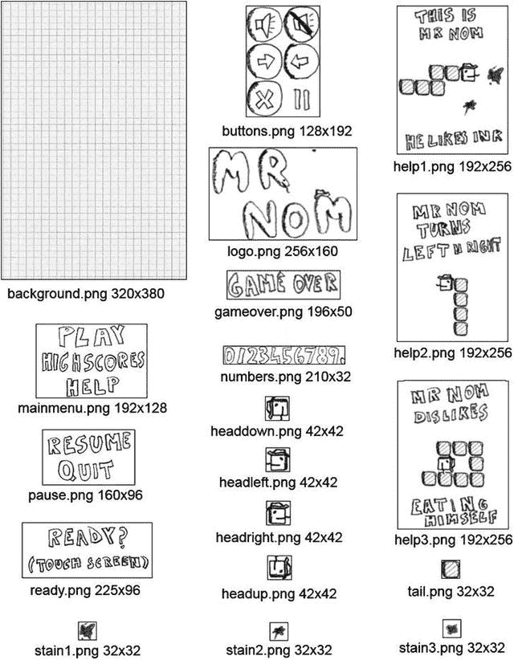
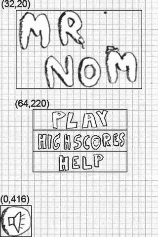
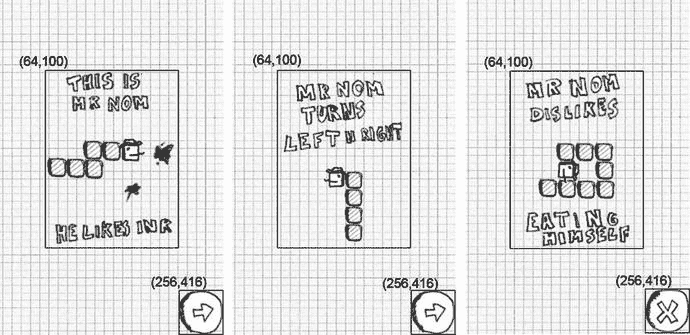
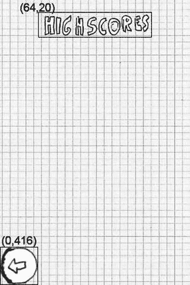
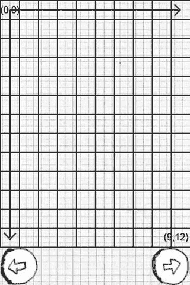
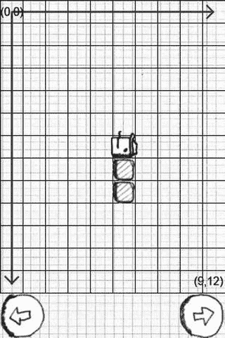
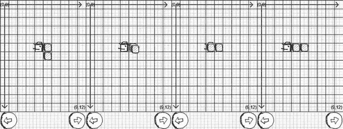
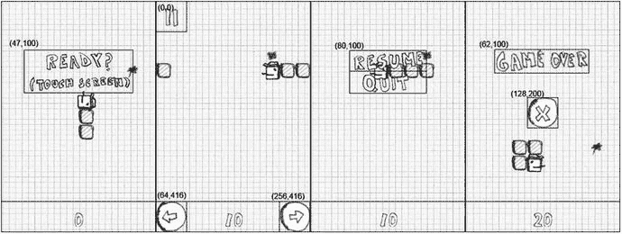

# 6. Mr. Nom 入侵 Android

在第 [3] 章中，我们为“Mr. Nom”设计了完整的方案，包括游戏机制、简单的背景故事、手工制作的图形资源，以及基于一些纸模定义的所有屏幕界面。在第 [5] 章中，我们开发了一个完整的游戏开发框架，使我们能够轻松地将设计好的屏幕转换为代码。但话不多说，让我们开始编写我们的第一个游戏吧！

### 创建资源


在 Mr. Nom 中，我们拥有两类资源：音频资源和图形资源。我们通过一款名为 Audacity 的优秀开源应用程序以及一台性能不佳的上网本麦克风录制了音频资源。我们创建了三种音效：一种在按下按钮或选择菜单项时播放，一种在 Mr. Nom 吃掉墨渍时播放，还有一种在他吃掉自己时播放。我们将这些音效保存为 OGG 格式，并分别命名为 `click.ogg`、`eat.ogg` 和 `bitten.ogg`，存放在 `assets/` 文件夹中。你可以发挥创意，使用 Audacity 和麦克风自行创建这些文件，也可以从 SVN 仓库 [`http://code.google.com/p/beginnginandroidgames2/`](http://code.google.com/p/beginnginandroidgames2/) 中获取。如果你不熟悉 SVN，请参阅前文关于如何获取源代码的说明。

之前，我们提到希望在游戏开发阶段重复使用设计阶段的剪纸图形作为实际游戏图形。为此，我们首先需要让它们适配目标分辨率。

我们选择了固定的目标分辨率 320×480（竖屏模式，Android mdpi 分辨率），并据此设计所有图形资源。这个分辨率看似较小，但能让我们非常快速、轻松地开发游戏和图形，毕竟这里的重点是让你了解完整的 Android 游戏开发流程。

对于你的正式游戏，请考虑所有分辨率并使用更高分辨率的图形，这样游戏即使在平板尺寸的屏幕上也能看起来不错，或许可以将 1440×2560 作为基准分辨率。我们扫描了所有剪纸图形并略微调整了它们的大小。我们将大部分资源保存在独立的文件中，并将其中一些合并到单个文件中。所有图像均保存为 PNG 格式。背景是唯一采用 RGB888 格式的图像；其他所有图像均为 ARGB8888 格式。图 6-1 展示了我们最终得到的成果。



图 6-1. Mr. Nom 的所有图形资源及其各自的文件名和像素尺寸

让我们稍微分解一下这些图像：

*   `background.png`：这是我们的背景图像，将是我们在帧缓冲区中绘制的第一张图。显然，它的尺寸与目标分辨率相同。
*   `buttons.png`：该文件包含了游戏中所需的所有按钮。我们将它们放在一个文件中，因为我们可以通过 `Graphics.drawPixmap()` 方法轻松绘制它们，该方法允许绘制图像的某一部分。在开始使用 OpenGL ES 进行绘制时，我们会更频繁地使用这种技术，所以最好现在就习惯它。将多张图像合并到一张图像中的做法通常称为图集化（atlasing），而这张图像本身被称为图像图集（image atlas，或纹理图集、精灵表）。每个按钮的尺寸为 64×64 像素，这在判断触摸事件是否按下屏幕上的按钮时会非常有用。
*   `help1.png`、`help2.png` 和 `help3.png`：这些图像将显示在 Mr. Nom 的三个帮助屏幕上。它们尺寸相同，这使得将它们放置到屏幕上更加容易。
*   `logo.png`：这是显示在主菜单屏幕上的徽标。
*   `mainmenu.png`：该文件包含了我们在主菜单上向玩家展示的三个选项。选择其中一个将触发跳转到相应的屏幕。每个选项的高度约为 42 像素，我们可以利用这点轻松检测哪个选项被触摸。
*   `ready.png`、`pause.png` 和 `gameover.png`：我们将在游戏即将开始、游戏暂停以及游戏结束时绘制这些图像。
*   `numbers.png`：此文件包含我们稍后渲染高分所需要的所有数字。关于这张图像需要记住的是，除了结尾的点（尺寸为 10×32 像素）外，每个数字都具有相同的宽度和高度，即 20×32 像素。我们可以用它来渲染任何遇到的数字。
*   `tail.png`：这是 Mr. Nom 的尾巴，或者更确切地说是他尾巴的一部分。尺寸为 32×32 像素。
*   `headdown.png`、`headleft.png`、`headright.png` 和 `headup.png`：这些图像用于 Mr. Nom 的头部；对应他可能移动的每个方向都有一张。由于他戴着帽子，我们必须让这些图像比尾巴图像稍大一些。每张头部图像的尺寸为 42×42 像素。
*   `stain1.png`、`stain2.png` 和 `stain3.png`：这是我们可以渲染的三种类型的墨渍。拥有三种类型会让游戏画面更加多样化。它们的尺寸均为 32×32 像素，与尾巴图像相同。

很好，现在让我们开始实现屏幕吧！

## 设置项目

如第 5 章所述，我们将把 Mr. Nom 的代码与框架代码合并。所有与 Mr. Nom 相关的类都将放置在 `com.badlogic.androidgames.mrnom` 包中。此外，根据第 4 章的说明，我们必须修改清单文件。我们的默认活动将命名为 `MrNomGame`。只需按照第 4 章“Android 游戏项目设置六步法”一节中概述的八个步骤进行操作，即可正确设置 `<activity>` 属性（即确保游戏固定为竖屏模式，且配置变更由应用程序处理），并为我们的应用程序授予适当的权限（写入外部存储、使用唤醒锁等）。

前面部分的所有资源都位于项目的 `assets/` 文件夹中。此外，我们还需要将 `ic_launcher.png` 文件放入 `res/mipmap-mdpi`、`res/mipmap-hdpi`、`res/mipmap-xdpi`、`res/mipmap-xxdpi` 和 `res/mipmap-xxxdpi` 文件夹中。我们只需取用 Mr. Nom 的 `headright.png`，将其重命名为 `ic_launcher.png`，然后将经过适当大小调整的版本放入每个文件夹中。

剩下的工作就是将我们的游戏代码放入 Android Studio 项目的 `com.badlogic.androidgames.mrnom` 包中！

## MrNomGame：主活动

我们的应用程序需要一个主入口点，在 Android 中被称为默认活动。我们将这个默认活动命名为 `MrNomGame`，并让它继承自我们在第 5 章中实现的 `AndroidGame` 类，用于运行我们的游戏。它稍后将负责创建和运行我们的第一个屏幕。清单 6-1 展示了我们的 `MrNomGame` 类。

```
package com.badlogic.androidgames.mrnom;
import com.badlogic.androidgames.framework.Screen;
import com.badlogic.androidgames.framework.impl.AndroidGame;
public class MrNomGame extends AndroidGame {
public Screen getStartScreen() {
return new LoadingScreen(this);
}
}
清单 6-1. MrNomGame.java: 我们的主活动/游戏混合体
```

我们唯一需要做的就是继承 `AndroidGame` 并实现 `getStartScreen()` 方法，该方法将返回一个 `LoadingScreen` 类的实例（我们稍后会实现它）。请记住，这将为我们启动游戏所需的一切，从设置音频、图形、输入和文件 I/O 的不同模块，到启动主循环线程。相当简单，对吧？

## Assets：便捷的资源存储

加载屏幕将加载我们游戏的所有资源。但是我们把它们存储在哪里呢？为了存储它们，我们将采用一种在 Java 领域不太常见的方式：创建一个类，该类包含大量公开的静态成员，用于保存我们从资源中加载的所有像素图和声音。清单 6-2 展示了这个类。


```java
package com.badlogic.androidgames.mrnom;
import com.badlogic.androidgames.framework.Pixmap;
import com.badlogic.androidgames.framework.Sound;
public class Assets {
public static Pixmap background;
public static Pixmap logo;
public static Pixmap mainMenu;
public static Pixmap buttons;
public static Pixmap help1;
public static Pixmap help2;
public static Pixmap help3;
public static Pixmap numbers;
public static Pixmap ready;
public static Pixmap pause;
public static Pixmap gameOver;
public static Pixmap headUp;
public static Pixmap headLeft;
public static Pixmap headDown;
public static Pixmap headRight;
public static Pixmap tail;
public static Pixmap stain1;
public static Pixmap stain2;
public static Pixmap stain3;
public static Sound click;
public static Sound eat;
public static Sound bitten;
}
```
列表 6-2. `Assets.java`：持有所有图片和声音资源，便于访问

我们为从资产中加载的每个图像和声音都设置了一个静态成员。如果想使用这些资源之一，可以这样操作：

```java
game.getGraphics().drawPixmap(Assets.background, 0, 0);
```

或者这样：

```java
Assets.click.play(1);
```

这样确实很方便。但请注意，由于这些静态成员没有声明为 `final`，我们无法阻止他人覆盖它们。不过只要我们不主动覆盖，就是安全的。这些公开的非 final 成员实际上让这种“设计模式”成了一种反模式。不过对于我们的游戏而言，稍微偷懒一下也没关系。更优雅的解决方案是将资源隐藏在所谓的单例类中的 setter 和 getter 之后。我们选择坚持使用这个简易资源管理器。

## 设置：追踪用户选择与最高分

在加载界面中，还需要加载另外两项内容：用户设置和最高分。回顾第 3 章的主菜单和最高分界面，我们会发现允许用户切换音效，并且会存储前五名的最高分。我们会将这些设置保存到外部存储中，以便游戏下次启动时重新加载。为此，我们将实现另一个简单的类，叫做 `Settings`，如列表 6-3 所示。该列表被拆分显示，并穿插了注释。

```java
package com.badlogic.androidgames.mrnom;
import java.io.BufferedReader;
import java.io.BufferedWriter;
import java.io.IOException;
import java.io.InputStreamReader;
import java.io.OutputStreamWriter;
import com.badlogic.androidgames.framework.FileIO;
public class Settings {
public static boolean soundEnabled = true;
public static int[] highscores = new int[] { 100, 80, 50, 30, 10 };
```

列表 6-3. `Settings.java`：存储设置并实现加载/保存功能

是否播放音效由一个名为`soundEnabled`的公共静态布尔值决定。最高分存储在一个包含五个元素的整数数组中，按从高到低排序。我们为这两个设置定义了合理的默认值。我们可以像访问`Assets`类的成员一样访问这两个成员。

```java
public static void load(FileIO files) {
BufferedReader in = null;
try {
in = new BufferedReader(new InputStreamReader(
files.readFile(".mrnom")));
soundEnabled = Boolean.parseBoolean(in.readLine());
for (int i = 0; i < 5; i++) {
highscores[i] = Integer.parseInt(in.readLine());
}
} catch (IOException e) {
// :( 没关系，我们有默认值
} catch (NumberFormatException e) {
// :/ 没关系，默认值能解决问题
} finally {
try {
if (in != null)
in.close();
} catch (IOException e) {
}
}
}
```

静态方法`load()`会尝试从外部存储中名为`.mrnom`的文件加载设置。为此，它需要一个`FileIO`实例，我们将其传递给该方法。该方法假定声音设置和每个最高分条目都存储在不同的行中，并直接逐行读取。如果出现任何问题（例如外部存储不可用或设置文件尚不存在），我们会直接回退到默认值并忽略错误。

```java
public static void save(FileIO files) {
BufferedWriter out = null;
try {
out = new BufferedWriter(new OutputStreamWriter(
files.writeFile(".mrnom")));
out.write(Boolean.toString(soundEnabled));
for (int i = 0; i < 5; i++) {
out.write(Integer.toString(highscores[i]));
}
} catch (IOException e) {
} finally {
try {
if (out != null)
out.close();
} catch (IOException e) {
}
}
}
```

接下来是一个名为`save()`的方法。它获取当前设置，并将其序列化到外部存储的`.mrnom`文件中（即`/sdcard/.mrnom`）。声音设置和每个最高分条目都存储在该文件的不同行中，这与`load()`方法的预期一致。如果出现问题，我们会忽略错误，并使用之前定义的默认值。在 AAA 级大作中，你可能需要将此类加载错误告知用户。

```java
public static void addScore(int score) {
for (int i = 0; i < 5; i++) {
if (highscores[i] < score) {
for (int j = 4; j > i; j--)
highscores[j] = highscores[j - 1];
highscores[i] = score;
break;
}
}
}
```

最后一个方法是`addScore()`，它是一个便捷方法。我们将用它来向最高分列表中添加新分数，并根据要插入的分数值自动重新排序。

## LoadingScreen：从磁盘获取资源

有了这些类，我们现在可以轻松实现加载界面。列表 6-4 展示了相关代码。

```java
package com.badlogic.androidgames.mrnom;
import com.badlogic.androidgames.framework.Game;
import com.badlogic.androidgames.framework.Graphics;
import com.badlogic.androidgames.framework.Screen;
import com.badlogic.androidgames.framework.Graphics.PixmapFormat;
public class LoadingScreen extends Screen {
public LoadingScreen(Game game) {
super(game);
}
```

列表 6-4. `LoadingScreen.java`：加载所有资源和设置

我们让`LoadingScreen`类继承自第 3 章定义的`Screen`类。这要求我们实现一个接受`Game`实例的构造函数，并将其传递给父类构造函数。请注意，该构造函数将在我们之前定义的`MrNomGame.getStartScreen()`方法中被调用。


```java
public void update(float deltaTime) {
    Graphics g = game.getGraphics();
    Assets.background = g.newPixmap("background.png", PixmapFormat.RGB565);
    Assets.logo = g.newPixmap("logo.png", PixmapFormat.ARGB4444);
    Assets.mainMenu = g.newPixmap("mainmenu.png", PixmapFormat.ARGB4444);
    Assets.buttons = g.newPixmap("buttons.png", PixmapFormat.ARGB4444);
    Assets.help1 = g.newPixmap("help1.png", PixmapFormat.ARGB4444);
    Assets.help2 = g.newPixmap("help2.png", PixmapFormat.ARGB4444);
    Assets.help3 = g.newPixmap("help3.png", PixmapFormat.ARGB4444);
    Assets.numbers = g.newPixmap("numbers.png", PixmapFormat.ARGB4444);
    Assets.ready = g.newPixmap("ready.png", PixmapFormat.ARGB4444);
    Assets.pause = g.newPixmap("pausemenu.png", PixmapFormat.ARGB4444);
    Assets.gameOver = g.newPixmap("gameover.png", PixmapFormat.ARGB4444);
    Assets.headUp = g.newPixmap("headup.png", PixmapFormat.ARGB4444);
    Assets.headLeft = g.newPixmap("headleft.png", PixmapFormat.ARGB4444);
    Assets.headDown = g.newPixmap("headdown.png", PixmapFormat.ARGB4444);
    Assets.headRight = g.newPixmap("headright.png", PixmapFormat.ARGB4444);
    Assets.tail = g.newPixmap("tail.png", PixmapFormat.ARGB4444);
    Assets.stain1 = g.newPixmap("stain1.png", PixmapFormat.ARGB4444);
    Assets.stain2 = g.newPixmap("stain2.png", PixmapFormat.ARGB4444);
    Assets.stain3 = g.newPixmap("stain3.png", PixmapFormat.ARGB4444);
    Assets.click = game.getAudio().newSound("click.ogg");
    Assets.eat = game.getAudio().newSound("eat.ogg");
    Assets.bitten = game.getAudio().newSound("bitten.ogg");
    Settings.load(game.getFileIO());
    game.setScreen(new MainMenuScreen(game));
}
```

接下来是我们实现的 `update()` 方法，我们在其中加载资源和设置。对于图像资源，我们只需通过 `Graphics.newPixmap()` 方法创建新的像素图。请注意，我们指定了像素图应采用的色彩格式。背景采用 RGB565 格式，所有其他图像采用 ARGB4444 格式（前提是 `BitmapFactory` 尊重我们的提示）。我们这样做是为了节省内存，并稍后提高渲染速度。我们的原始图像以 PNG 格式存储，分别为 RGB888 和 ARGB8888 格式。我们还加载了三种音效，并将它们存储在 `Assets` 类的相应成员中。接着，我们通过 `Settings.load()` 方法从外部存储加载设置。最后，我们启动屏幕切换，跳转到一个名为 `MainMenuScreen` 的`Screen`，它将接管后续的执行。

```java
public void present(float deltaTime) {
}
public void pause() {
}
public void resume() {
}
public void dispose() {
}
}
```

其他方法只是存根，不执行任何操作。由于 `update()` 方法在加载完所有资源后会立即触发屏幕切换，因此此屏幕上无需再做其他事情。

##### 主菜单屏幕

主菜单屏幕非常简单。它仅渲染徽标、主菜单选项以及以切换按钮形式呈现的音效设置。它所做的一切就是响应对主菜单选项或音效设置切换按钮的触摸。为了实现此行为，我们需要知道两件事：我们在屏幕上渲染图像的位置，以及哪些触摸区域会触发屏幕切换或切换音效设置。图 6-2 展示了我们将在屏幕上渲染不同图像的位置。由此我们可以直接推导出触摸区域。



**图 6-2.** 主菜单屏幕。坐标指定了我们将渲染不同图像的位置，轮廓线显示了触摸区域。

徽标和主菜单选项图像的 x 坐标经过计算，使其在 x 轴上居中。

接下来，让我们实现 `Screen`。清单 6-5 展示了代码。

```java
package com.badlogic.androidgames.mrnom;
import java.util.List;
import com.badlogic.androidgames.framework.Game;
import com.badlogic.androidgames.framework.Graphics;
import com.badlogic.androidgames.framework.Input.TouchEvent;
import com.badlogic.androidgames.framework.Screen;
public class MainMenuScreen extends Screen {
    public MainMenuScreen(Game game) {
        super(game);
    }
}
```

**清单 6-5.** `MainMenuScreen.java`: 主菜单屏幕

我们让该类再次继承自 `Screen`，并为其实现一个合适的构造函数。

```java
public void update(float deltaTime) {
    Graphics g = game.getGraphics();
    List touchEvents = game.getInput().getTouchEvents();
    game.getInput().getKeyEvents();
    int len = touchEvents.size();
    for(int i = 0; i < len; i++) {
        TouchEvent event = touchEvents.get(i);
        if(event.type == TouchEvent.TOUCH_UP) {
            if(inBounds(event, 0, g.getHeight() - 64, 64, 64)) {
                Settings.soundEnabled = !Settings.soundEnabled;
                if(Settings.soundEnabled)
                    Assets.click.play(1);
            }
            if(inBounds(event, 64, 220, 192, 42) ) {
                game.setScreen(new GameScreen(game));
                if(Settings.soundEnabled)
                    Assets.click.play(1);
                return;
            }
            if(inBounds(event, 64, 220 + 42, 192, 42) ) {
                game.setScreen(new HighscoreScreen(game));
                if(Settings.soundEnabled)
                    Assets.click.play(1);
                return;
            }
            if(inBounds(event, 64, 220 + 84, 192, 42) ) {
                game.setScreen(new HelpScreen(game));
                if(Settings.soundEnabled)
                    Assets.click.play(1);
                return;
            }
        }
    }
}
```

接下来，我们有一个 `update()` 方法，在其中我们将进行所有的触摸事件检查。我们首先从 `Game` 实例提供的 `Input` 实例中获取 `TouchEvent` 和 `KeyEvent` 实例。请注意，我们并没有使用 `KeyEvent` 实例，但我们还是获取它们以清除内部缓冲区（是的，这有点不优雅，但我们还是要养成这个习惯）。然后我们遍历所有 `TouchEvent` 实例，直到找到一个类型为 `TouchEvent.TOUCH_UP` 的事件。（我们也可以查找 `TouchEvent.TOUCH_DOWN` 事件，但在大多数 UI 中，抬起事件用于指示 UI 组件已被按下。）

一旦找到合适的事件，我们就检查它是否按下了音效切换按钮或某个菜单项。为了使代码更简洁，我们编写了一个名为 `inBounds()` 的方法，它接收一个触摸事件、x 和 y 坐标以及宽度和高度。该方法检查触摸事件是否位于由这些参数定义的矩形内，并返回 `true` 或 `false`。

如果按下了音效切换按钮，我们只需反转 `Settings.soundEnabled` 布尔值。如果按下了任何主菜单项，我们通过实例化相应的 `Screen` 并使用 `Game.setScreen()` 设置它来切换到该屏幕。在这种情况下，我们可以立即返回，因为 `MainMenuScreen` 已经无事可做。如果切换按钮或主菜单项被按下且音效已启用，我们还会播放点击音效。

请记住，所有触摸事件都将相对于我们 320×480 像素的目标分辨率进行报告，这要归功于我们在第 5 章讨论的触摸事件处理程序中执行的缩放魔法。

```java
private boolean inBounds(TouchEvent event, int x, int y, int width, int height) {
    if(event.x > x && event.x < x + width - 1 && event.y > y && event.y < y + height - 1)
        return true;
    else
        return false;
}
```

`inBounds()` 方法的工作原理如前所述：传入一个触摸事件和一个矩形，它会告知你触摸事件的坐标是否在该矩形内。

```java
public void present(float deltaTime) {
    Graphics g = game.getGraphics();
    g.drawPixmap(Assets.background, 0, 0);
    g.drawPixmap(Assets.logo, 32, 20);
    g.drawPixmap(Assets.mainMenu, 64, 220);
    if(Settings.soundEnabled)
        g.drawPixmap(Assets.buttons, 0, 416, 0, 0, 64, 64);
    else
        g.drawPixmap(Assets.buttons, 0, 416, 64, 0, 64, 64);
}
```


`present()`方法可能是你最期待的方法，但它并没有那么令人兴奋。我们的小游戏框架让渲染主菜单屏幕变得非常简单。我们只需在坐标`(0,0)`处渲染背景，这基本上会清空帧缓冲区，因此无需调用`Graphics.clear()`。接下来，我们在图 6-2 所示的坐标处绘制 Logo 和主菜单项。最后，我们根据当前设置绘制声音切换按钮来结束该方法。如你所见，我们使用相同的像素图，但只绘制其适当的区域（声音切换按钮；见图 6-1）。这很简单。

```java
public void pause() {
    Settings.save(game.getFileIO());
}
```

我们需要讨论的最后一部分是`pause()`方法。由于我们可以在该屏幕上更改设置，因此必须确保将其持久化到外部存储。使用我们的`Settings`类，这也非常简单！

```java
public void resume() {
}
public void dispose() {
}
}
```

`resume()`和`dispose()`方法在此屏幕中不需要执行任何操作。

### HelpScreen 类

接下来，让我们实现在之前的`update()`方法中使用过的`HelpScreen`、`HighscoreScreen`和`GameScreen`类。

我们在第 3 章定义了三个帮助屏幕，每个屏幕或多或少都解释了游戏玩法的一个方面。我们现在直接将它们转换为名为`HelpScreen`、`HelpScreen2`和`HelpScreen3`的`Screen`实现。它们都有一个按钮，用于启动屏幕转换。`HelpScreen3`屏幕将转换回主菜单屏幕。图 6-3 显示了三个帮助屏幕及其绘制坐标和触摸区域。



**图 6-3. 三个帮助屏幕、绘制坐标和触摸区域**

现在，这看起来实现起来很简单。让我们从`HelpScreen`类开始，如清单 6-6 所示。

```java
package com.badlogic.androidgames.mrnom;
import java.util.List;
import com.badlogic.androidgames.framework.Game;
import com.badlogic.androidgames.framework.Graphics;
import com.badlogic.androidgames.framework.Input.TouchEvent;
import com.badlogic.androidgames.framework.Screen;
public class HelpScreen extends Screen {
public HelpScreen(Game game) {
super(game);
}
@Override
public void update(float deltaTime) {
List touchEvents = game.getInput().getTouchEvents();
game.getInput().getKeyEvents();
int len = touchEvents.size();
for(int i = 0; i < len; i++) {
TouchEvent event = touchEvents.get(i);
if(event.type == TouchEvent.TOUCH_UP) {
if(event.x > 256 && event.y > 416 ) {
game.setScreen(new HelpScreen2(game));
if(Settings.soundEnabled)
Assets.click.play(1);
return;
}
}
}
}
@Override
public void present(float deltaTime) {
Graphics g = game.getGraphics();
g.drawPixmap(Assets.background, 0, 0);
g.drawPixmap(Assets.help1, 64, 100);
g.drawPixmap(Assets.buttons, 256, 416, 0, 64, 64, 64);
}
@Override
public void pause() {
}
@Override
public void resume() {
}
@Override
public void dispose() {
}
}
```

**清单 6-6. HelpScreen.java：第一个帮助屏幕**

再次强调，这非常简单。我们继承自`Screen`并实现了一个适当的构造函数。接下来是我们熟悉的`update()`方法，它只是检查底部的按钮是否被按下。如果是，我们播放点击声音并转换到`HelpScreen2`。

`present()`方法只是再次渲染背景，然后是帮助图像和按钮。

`HelpScreen2`和`HelpScreen3`类看起来相同；唯一的区别是它们绘制的帮助图像以及转换到的屏幕。我们可以同意不必查看它们的代码。接下来进入高分屏幕！

##### 高分屏幕

高分屏幕只是绘制存储在`Settings`类中的前五个高分，加上一个告诉玩家他/她正在高分屏幕上的花哨标题，以及在左下角的一个按钮，按下时将转换回主菜单。有趣的部分是我们如何渲染高分。让我们先看看我们在哪里渲染图像，如图 6-4 所示。



**图 6-4. 没有高分的高分屏幕**

这看起来和我们实现的其他屏幕一样简单。但是，我们如何绘制动态分数呢？

## 渲染数字：一个插曲

我们有一个名为`numbers.png`的资源图像，其中包含从 0 到 9 的所有数字以及一个点。每个数字是 20×32 像素，点是 10×32 像素。数字从左到右按升序排列。高分屏幕应显示五行，每行显示五个高分之一。其中一行将以高分的名次（例如“1.”或“5.”）开头，后跟一个空格，然后是该分数的实际值。我们该怎么做呢？

我们拥有两样东西：`numbers.png`图像和`Graphics.drawPixmap()`方法，该方法允许我们将图像的一部分绘制到屏幕上。假设我们希望默认高分的第一个字符串（值为“1. 100”）在`(20,100)`处渲染，以便数字 1 的左上角与该坐标重合。我们像这样调用`Graphics.drawPixmap()`：

```java
game.getGraphics().drawPixmap(Assets.numbers, 20, 100, 20, 0, 20, 32);
```

我们知道数字 1 的宽度是 20 像素。字符串中的下一个字符必须在`(20+20,100)`处渲染。在字符串“1. 100”的情况下，这个字符是点，它在`numbers.png`图像中的宽度是 10 像素：

```java
game.getGraphics().drawPixmap(Assets.numbers, 40, 100, 200, 0, 10, 32);
```

字符串中的下一个字符需要在`(20+20+10,100)`处渲染。该字符是一个空格，我们不需要绘制它。我们需要做的就是在 x 轴上再前进 20 像素，因为我们假设这就是空格字符的宽度。因此，下一个字符 1 将在`(20+20+10+20,100)`处渲染。看到规律了吗？

给定字符串中第一个字符的左上角坐标，我们可以遍历字符串的每个字符，绘制它，并根据刚刚绘制的字符将下一个要绘制字符的 x 坐标增加 20 或 10 像素。

我们还需要根据当前字符确定应该绘制`numbers.png`图像的哪个部分。为此，我们需要该部分左上角的 x 和 y 坐标，以及它的宽度和高度。y 坐标始终为 0，这在看图 6-1 时应该是显而易见的。高度也是一个常量——在我们的例子中是 32。宽度要么是 20 像素（如果字符串的字符是数字），要么是 10 像素（如果是一个点）。我们唯一需要计算的是`numbers.png`图像中该部分的 x 坐标。我们可以通过使用以下巧妙的小技巧来实现。

字符串中的字符可以解释为 Unicode 字符或 16 位整数。这意味着我们可以对这些字符代码进行计算。幸运的是，字符 0 到 9 具有递增的整数表示形式。我们可以利用这一点来计算数字的`number.png`图像部分的 x 坐标，如下所示：

```java
char character = string.charAt(index);
int x = (character - '0') * 20;
```


表达式 `(character - '0')` 将 ASCII 字符转换为其数值。对于字符 `'0'`，这会得到 `0`；对于字符 `'3'`，这会得到 `3 * 20 = 60`，依此类推。这恰好是每个数字对应图块区域的 x 坐标。当然，这种方法对点号字符不起作用，所以我们需要特殊处理它。让我们将这个功能总结为一个方法，该方法可以根据给定的字符串行以及渲染起始位置的 `x` 和 `y` 坐标，渲染一条高分榜行：

```java
public void drawText(Graphics g, String line, int x, int y) {
    int len = line.length();
    for (int i = 0; i < len; i++) {
        char character = line.charAt(i);
        if (character == ' ') {
            x += 20;
            continue;
        }
        int srcX;
        int srcWidth;
        if (character == '.') {
            srcX = 200;
            srcWidth = 10;
        } else {
            srcX = (character - '0') * 20;
            srcWidth = 20;
        }
        g.drawPixmap(Assets.numbers, x, y, srcX, 0, srcWidth, 32);
        x += srcWidth;
    }
}
```

我们遍历字符串中的每个字符。如果当前字符是空格，我们只需将 `x` 坐标增加 20 像素。否则，我们计算当前字符在 `numbers.png` 图像中对应区域的 `x` 坐标和宽度。该字符要么是数字，要么是点号。然后我们渲染当前字符，并将渲染的 `x` 坐标增加刚刚绘制字符的宽度。如果我们的字符串包含空格、数字和点号以外的任何字符，此方法当然会出错。你能想出办法让它能处理任意字符串吗？

## 实现屏幕

掌握了这些新知识，我们现在可以轻松地实现 `HighscoreScreen` 类，如代码清单 6-7 所示。

```java
package com.badlogic.androidgames.mrnom;

import java.util.List;

import com.badlogic.androidgames.framework.Game;
import com.badlogic.androidgames.framework.Graphics;
import com.badlogic.androidgames.framework.Screen;
import com.badlogic.androidgames.framework.Input.TouchEvent;

public class HighscoreScreen extends Screen {
    String lines[] = new String[5];

    public HighscoreScreen(Game game) {
        super(game);
        for (int i = 0; i < 5; i++) {
            lines[i] = "" + (i + 1) + ". " + Settings.highscores[i];
        }
    }
}
```

*代码清单 6-7. `HighscoreScreen.java`：展示我们迄今为止的最佳成就*

为了与垃圾回收器保持友好关系，我们将五条高分榜行的字符串存储在一个字符串数组成员中。我们在构造函数中，基于 `Settings.highscores` 数组构造这些字符串。

```java
    @Override
    public void update(float deltaTime) {
        List touchEvents = game.getInput().getTouchEvents();
        game.getInput().getKeyEvents();
        int len = touchEvents.size();
        for (int i = 0; i < len; i++) {
            TouchEvent event = touchEvents.get(i);
            if (event.type == TouchEvent.TOUCH_UP) {
                if (event.x < 64 && event.y > 416) {
                    if(Settings.soundEnabled)
                        Assets.click.play(1);
                    game.setScreen(new MainMenuScreen(game));
                    return;
                }
            }
        }
    }
```

接下来，我们定义 `update()` 方法，它平淡无奇。我们所要做的只是检查是否有触摸抬起事件按下了左下角的按钮。如果是这种情况，我们就播放点击音效并切换回主菜单屏幕。

```java
    @Override
    public void present(float deltaTime) {
        Graphics g = game.getGraphics();
        g.drawPixmap(Assets.background, 0, 0);
        g.drawPixmap(Assets.mainMenu, 64, 20, 0, 42, 196, 42);
        int y = 100;
        for (int i = 0; i < 5; i++) {
            drawText(g, lines[i], 20, y);
            y += 50;
        }
        g.drawPixmap(Assets.buttons, 0, 416, 64, 64, 64, 64);
    }
```

借助我们之前定义的强大 `drawText()` 方法，`present()` 方法相当简单。像往常一样，我们首先渲染背景图像，然后是 `Assets.mainmenu` 图像中的“HIGHSCORES”部分。我们本可以将它存储在单独的文件中，但为了释放更多内存而重用了它。

接下来，我们遍历构造函数中为每条高分榜行创建的五个字符串。我们使用 `drawText()` 方法绘制每一行。第一行从 `(20,100)` 开始，下一行在 `(20,150)` 处渲染，依此类推。我们只是将文本渲染的 `y` 坐标每行增加 50 像素，这样行与行之间就有了漂亮的垂直间距。最后，我们绘制按钮来结束此方法。

```java
    public void drawText(Graphics g, String line, int x, int y) {
        int len = line.length();
        for (int i = 0; i < len; i++) {
            char character = line.charAt(i);
            if (character == ' ') {
                x += 20;
                continue;
            }
            int srcX = 0;
            int srcWidth = 0;
            if (character == '.') {
                srcX = 200;
                srcWidth = 10;
            } else {
                srcX = (character - '0') * 20;
                srcWidth = 20;
            }
            g.drawPixmap(Assets.numbers, x, y, srcX, 0, srcWidth, 32);
            x += srcWidth;
        }
    }

    @Override
    public void pause() {
    }

    @Override
    public void resume() {
    }

    @Override
    public void dispose() {
    }
}
```

其余的方法应该不言自明。让我们进入 Mr. Nom 游戏中缺失的最后一部分：游戏屏幕。

## 抽象 Mr. Nom 的世界：模型、视图、控制器

到目前为止，我们只实现了枯燥的 UI 内容以及一些用于资源和设置的管理代码。现在，我们将抽象 Mr. Nom 的世界及其中的所有对象。我们还将把 Mr. Nom 从屏幕分辨率中解放出来，让它在自己独立的小世界中活动，使用它自己的小坐标系。

如果你是一位资深程序员，你可能听说过设计模式。它们或多或少是针对特定场景设计代码的策略。其中一些是理论性的，另一些则在现实世界中有实际用途。对于游戏开发，我们可以从模型-视图-控制器（MVC）设计模式中借鉴一些理念。它经常被数据库和 Web 社区用来将数据模型与表示层和数据操作层分离。我们不会严格遵循这种设计模式，而是将其简化后加以应用。

那么，这对 Mr. Nom 意味着什么呢？首先，我们需要一个世界的抽象表示，它独立于任何位图、声音、帧缓冲区或输入事件。相反，我们将以面向对象的方式，用几个简单的类来建模 Mr. Nom 的世界。我们将有一个用于世界中污渍的类，以及一个用于 Mr. Nom 本身的类。Mr. Nom 由一个头部和若干尾部部分组成，我们也用单独的类来表示它们。为了将所有内容联系在一起，我们将有一个无所不包的类来表示 Mr. Nom 的完整世界，包括污渍和 Mr. Nom 本身。所有这些构成了 MVC 中的模型部分。

MVC 中的视图将是负责渲染 Mr. Nom 世界的代码。我们将有一个类或方法，它接收世界类，读取其当前状态，并将其渲染到屏幕上。如何渲染并不涉及模型类，这是从 MVC 中学到的最重要的经验。模型类独立于一切，但视图类和方法依赖于模型类。

最后，我们有 MVC 中的控制器。它根据用户输入或时间流逝等因素，指示模型类改变其状态。模型类向控制器提供方法（例如，使用“让 Mr. Nom 向左转”这样的指令），控制器随后可以使用这些方法来修改模型的状态。我们在模型类中没有任何直接访问触摸屏或加速度计等内容的代码。这样，我们可以保持模型类不受任何外部依赖的影响。


### Mr. Nom 的世界：模型、视图与控制器

这听起来可能有些复杂，您或许会疑惑为何要采用这种方式。然而，这种做法有许多好处。我们可以在无需了解图形、音频或输入设备的情况下实现所有游戏逻辑。我们可以修改游戏世界的渲染方式，而无需更改模型类本身。我们甚至可以用 3D 世界渲染器替换 2D 世界渲染器。通过使用控制器，我们可以轻松添加对新输入设备的支持。控制器所做的一切就是将输入事件转换为模型类的方法调用。想通过加速度计控制 Mr. Nom？没问题——只需在控制器中读取加速度计数值，并将其转换为对 Mr. Nom 模型的“向左转”或“向右转”方法调用。想添加对 Zeemote 手柄的支持？也没问题，只需像处理加速度计那样做就行！使用控制器最棒的一点是，我们无需修改 Mr. Nom 的代码中的任何一行，就能实现这一切。

让我们从定义 Mr. Nom 的世界开始。为此，我们将稍微偏离严格的 MVC 模式，借助图形素材来说明基本概念。这也有助于我们后续实现视图组件（将 Mr. Nom 的抽象世界渲染为像素）。

图 6-5 显示了游戏屏幕，Mr. Nom 的世界以网格形式叠加在其上。



**图 6-5.** Mr. Nom 的世界叠加在游戏屏幕上

请注意，Mr. Nom 的世界被限定在一个 10×13 的网格中。我们使用坐标系来定位单元格，原点位于左上角`(0,0)`，延伸至右下角`(9,12)`。Mr. Nom 的每个部分都必须位于这些单元格之一内，因此在这个世界中具有整数`x`和`y`坐标。这个世界的污渍也是如此。Mr. Nom 的每个部分都恰好占据一个 1×1 单位的单元格。请注意，单位类型无关紧要——这是我们自己的想象世界，不受国际单位制或像素的束缚！

Mr. Nom 不能离开这个小世界。如果他穿过了某条边界，他就会从另一边出现，他的所有部位也会随之移动。（顺便说一句，我们在地球上也面临同样的问题——朝任何一个方向走足够远，你最终会回到起点。）Mr. Nom 也只能一个单元格一个单元格地前进。他的所有部位始终位于整数坐标上。例如，他永远不可能占据两个半单元格。

> **注意：** 如前所述，我们这里使用的并非严格的 MVC 模式。如果您对 MVC 模式的实际定义感兴趣，我们建议您阅读[Erich Gamma](http://www.amazon.com/Erich-Gamma/e/B000AQ3QWI/ref=ntt_athr_dp_pel_1)、[Richard Helm](http://www.amazon.com/Richard-Helm/e/B000AQ1ZP8/ref=ntt_athr_dp_pel_2)、[Ralph Johnson](http://www.amazon.com/Ralph-Johnson/e/B000AQ6RMY/ref=ntt_athr_dp_pel_3)和[John M. Vlissides](http://www.amazon.com/s/ref=ntt_athr_dp_sr_4?_encoding=UTF8&sort=relevancerank&search-alias=books&field-author=John%20M.%20Vlissides)（即“四人帮”）合著的《设计模式：可复用面向对象软件的基础》（Addison-Wesley, 1994）。在他们的书中，MVC 模式被称为观察者模式。

### 污渍类

Mr. Nom 世界中最简单的对象是污渍。它只是静静地待在世界的某个单元格中，等待被吃掉。在设计 Mr. Nom 时，我们为污渍创建了三种不同的视觉表现形式。在 Mr. Nom 的世界中，污渍的类型并无区别，但我们仍然将其包含在`Stain`类中。代码清单 6-8 展示了`Stain`类。

```java
package com.badlogic.androidgames.mrnom;
public class Stain {
    public static final int TYPE_1 = 0;
    public static final int TYPE_2 = 1;
    public static final int TYPE_3 = 2;
    public int x, y;
    public int type;
    public Stain(int x, int y, int type) {
        this.x = x;
        this.y = y;
        this.type = type;
    }
}
```

**代码清单 6-8.** `Stain.java`

`Stain`类定义了三个公共静态常量，用于编码污渍的类型。每个`Stain`实例有三个成员：在 Mr. Nom 世界中的`x`和`y`坐标，以及一个`type`，它是之前定义的某个常量。为了让代码更简洁，我们没有按照常规做法包含 getter 和 setter 方法。最后，我们添加了一个便捷的构造函数，可以轻松实例化`Stain`对象。

需要注意的是，该类与图形、声音或其他类没有任何关联。`Stain`类是独立的，自豪地编码了 Mr. Nom 世界中污渍的各个属性。

### 蛇与蛇身部位类

Mr. Nom 就像一条移动的链条，由相互连接的部位组成；当我们抓住一个部位并拖动它时，所有部位都会随之移动。每个部位占据 Mr. Nom 世界中的一个单元格，就像污渍一样。在我们的模型中，不区分头部和尾部，因此可以使用一个类来表示 Mr. Nom 的两种部位。代码清单 6-9 展示了`SnakePart`类，用于定义 Mr. Nom 的各个部位。

```java
package com.badlogic.androidgames.mrnom;
public class SnakePart {
    public int x, y;
    public SnakePart(int x, int y) {
        this.x = x;
        this.y = y;
    }
}
```

**代码清单 6-9.** `SnakePart.java`

这基本上与`Stain`类相同——只是移除了`type`成员。Mr. Nom 世界模型中第一个真正有趣的类是`Snake`类。让我们思考一下它需要具备哪些功能：

* 必须存储头部和尾部部位。
* 必须知道 Mr. Nom 当前朝向哪个方向。
* 当 Mr. Nom 吃掉污渍时，必须能够长出一个新的尾部。
* 必须能够沿当前方向移动一个单元格。

第一点和第二点很容易实现。我们只需要一个`SnakePart`实例的列表——列表中的第一个部位是头部，其余部位构成尾部。Mr. Nom 可以向上、下、左、右移动。我们可以用一些常量来编码这些方向，并将当前方向存储在`Snake`类的成员中。

第三点也并不复杂。我们只需在已有的部位列表中添加一个新的`SnakePart`。问题是，应该把这个新部位添加在什么位置？听起来可能有点令人惊讶，我们将它放在与列表中最后一个部位相同的位置。这样做的原因，在探讨如何实现最后一点（移动 Mr. Nom）时会变得更加清晰。

图 6-6 显示了 Mr. Nom 的初始配置。他由三个部位组成：位于`(5,6)`的头部，以及位于`(5,7)`和`(5,8)`的两个尾部。



**图 6-6.** Mr. Nom 的初始配置

列表中的部位是有序的，从头部开始，到最后一个尾部结束。当 Mr. Nom 前进一个单元格时，头部之后的所有部位都必须跟随。然而，Mr. Nom 的部位可能并非像图 6-6 那样呈直线排列，因此仅仅将所有部位沿 Mr. Nom 前进的方向平移是不够的。我们需要采用更巧妙的方法。

尽管听起来可能违反直觉，但我们需要从列表中的最后一个部位开始。我们将其移动到前一个部位的位置，并对列表中除头部外的所有其他部位重复此操作，因为头部之前没有部位。对于头部，我们检查 Mr. Nom 当前朝向哪个方向，并相应地修改头部的位置。图 6-7 用 Mr. Nom 的一个更复杂的配置来说明这一点。




**图 6-7.** 诺姆先生前进并带动尾巴

这种移动策略与我们的进食策略配合得很好。每次我们给诺姆先生添加一个新部位时，该部位在诺姆先生下一次移动时，会停留在其前一个部位所在的位置。此外，请注意，这将使我们能够轻松实现：如果诺姆先生越过世界边缘，他会从世界另一侧绕回来。我们只需相应地设置头部的位置，其余部分便会自动完成。

有了这些信息，我们现在可以实现代表诺姆先生的`Snake`类了。清单 6-10 展示了相关代码。

```
package com.badlogic.androidgames.mrnom;
import java.util.ArrayList;
import java.util.List;
public class Snake {
public static final int UP = 0;
public static final int LEFT = 1;
public static final int DOWN = 2;
public static final int RIGHT = 3;
public List parts = new ArrayList();
public int direction;
Listing 6-10.
Snake.java: 代码中的诺姆先生
```

首先，我们定义一组常量，用于编码诺姆先生的方向。请记住，诺姆先生只能左转和右转，因此我们定义常量值的方式至关重要。稍后，通过简单地将当前方向常量加一或减一，我们就能轻松地让方向旋转正负 90 度。

接下来，我们定义一个名为`parts`的列表，用于保存诺姆先生的所有部分。该列表中的第一项是头部，其余项是尾部各部分。`Snake`类的第二个成员变量保存了诺姆先生当前朝向的方向。

```
public Snake() {
direction = UP;
parts.add(new SnakePart(5, 6));
parts.add(new SnakePart(5, 7));
parts.add(new SnakePart(5, 8));
}
```

在构造函数中，我们设定诺姆先生由他的头部和另外两个尾部部分组成，它们大致位于世界的中央，如前文图 6-6 所示。我们还将方向设置为`Snake.UP`，这样下一次请求诺姆先生前进时，他就会向上移动一个单元格。

```
public void turnLeft() {
direction += 1;
if(direction > RIGHT)
direction = UP;
}
public void turnRight() {
direction -= 1;
if(direction < UP)
direction = RIGHT;
}
```

`turnLeft()`和`turnRight()`方法仅修改`Snake`类的`direction`成员变量。左转时，我们将它加一；右转时，则减一。同时，如果`direction`值超出我们之前定义的常量范围，我们必须确保诺姆先生会绕回。

```
public void eat() {
SnakePart end = parts.get(parts.size()-1);
parts.add(new SnakePart(end.x, end.y));
}
```

接下来是`eat()`方法。它所做的一切就是在列表末尾添加一个新的`SnakePart`。这个新部位的位置将与当前末尾部位的位置相同。当下一次诺姆先生前进时，这两个重叠的部位将会分开，如前所述。

```
public void advance() {
SnakePart head = parts.get(0);
int len = parts.size() - 1;
for(int i = len; i > 0; i--) {
SnakePart before = parts.get(i-1);
SnakePart part = parts.get(i);
part.x = before.x;
part.y = before.y;
}
if(direction == UP)
head.y -= 1;
if(direction == LEFT)
head.x -= 1;
if(direction == DOWN)
head.y += 1;
if(direction == RIGHT)
head.x += 1;
if(head.x < 0)
head.x = 9;
if(head.x > 9)
head.x = 0;
if(head.y < 0)
head.y = 12;
if(head.y > 12)
head.y = 0;
}
```

下一个方法`advance()`实现了图 6-7 所示的逻辑。首先，我们从最后一个部位开始，将每个部位移动到它前一个部位的位置。我们将头部排除在此机制之外。然后，根据诺姆先生当前的方向移动头部。最后，我们进行一些检查，确保诺姆先生不会离开他的世界。如果发生了这种情况，我们只需让他绕到世界的另一侧出现。

```
public boolean checkBitten() {
int len = parts.size();
SnakePart head = parts.get(0);
for(int i = 1; i < len; i++) {
SnakePart part = parts.get(i);
if(part.x == head.x && part.y == head.y)
return true;
}
return false;
}
}
```

最后一个方法`checkBitten()`是一个辅助方法，用于检查诺姆先生是否咬到了自己的尾巴。它所做的就是检查是否有任何一个尾部部分与头部处于相同位置。如果是这样，诺姆先生就会死亡，游戏结束。

#### World 类

我们模型类的最后一个是`World`类。`World`类需要完成以下几项任务：

- 追踪诺姆先生（以`Snake`实例的形式）以及掉落在地图上的`Stain`实例。我们的世界中一次只会有一个污渍。
- 提供一个基于时间更新诺姆先生的方法（例如，他每 0.5 秒前进一个单元格）。此方法还将检查诺姆先生是否吃了一个污渍或是否咬到了自己。
- 跟踪分数；这基本上就是迄今为止吃掉的污渍数量乘以 10。
- 在诺姆先生每吃掉十个污渍后增加他的速度。这会让游戏更具挑战性。
- 跟踪诺姆先生是否还活着。稍后我们将使用它来判断游戏是否结束。
- 在诺姆先生吃掉当前污渍后生成一个新的污渍（这是一项微妙但重要且出奇复杂的任务）。

这个任务列表中，我们尚未讨论的只有两项：基于时间更新世界以及放置新的污渍。

### 诺姆先生的基于时间移动

在第 3 章中，我们讨论了基于时间的移动。这基本上意味着我们定义所有游戏对象的速度，测量自上次更新以来经过的时间（即增量时间），并通过将速度乘以增量时间来移动对象。在第 3 章的例子中，我们使用浮点值来实现这一点。然而，诺姆先生的各部分具有整数坐标，因此我们需要弄清楚如何在这种情况下移动对象。

让我们先定义诺姆先生的速度。诺姆先生的世界存在时间，我们以秒为单位进行测量。最初，诺姆先生应该每 0.5 秒前进一个单元格。我们需要做的就是跟踪自上次更新诺姆先生以来已经过去了多少时间。如果累积的时间超过我们 0.5 秒的阈值，我们就调用`Snake.advance()`方法并重置我们的时间累加器。这些增量时间从何而来？还记得`Screen.update()`方法吗？它获取帧的增量时间。我们只需将其传递给`World`类的`update()`方法，该方法将进行累加。为了使游戏更具挑战性，每次诺姆先生再吃掉十个污渍时，我们会将该阈值减少 0.05 秒。当然，我们必须确保阈值不会降到 0，否则诺姆先生将以无限速度移动——这是爱因斯坦所无法容忍的。

### 放置污渍

我们必须解决的第二个问题是，当诺姆先生吃掉当前污渍后，如何放置一个新的污渍。它应该出现在世界上的一个随机单元格中。所以，我们只需用随机位置实例化一个新的`Stain`，对吧？遗憾的是，事情并没有那么简单。

想象一下，诺姆先生占据了相当多的单元格。那么污渍就有可能被放置在一个已被诺姆先生占据的单元格中，而且随着诺姆先生变得越来越大，这种可能性也会增加。因此，我们必须找到一个当前未被诺姆先生占据的单元格。这很容易，对吧？只需遍历所有单元格，使用第一个未被诺姆先生占据的单元格即可。


好的，这是根据您的要求和示例风格翻译的 Markdown 文档。


再次强调，这种方式有点不太理想。如果每次从同一个位置开始搜索，污渍的放置就不是随机的了。相反，我们会从世界中的一个随机位置开始，扫描所有单元格直至世界边缘，如果还没有找到空闲单元格，再扫描起始位置以上的所有单元格。

如何检查一个单元格是否空闲？最天真的办法是遍历所有单元格，获取每个单元格的 `x` 和 `y` 坐标，然后用这些坐标去检查贪吃蛇先生的所有部分。我们有 10 × 13 = 130 个单元格，而贪吃蛇先生最多可以占据 55 个单元格。这意味着需要 130 × 55 = 7,150 次检查！诚然，大多数设备都能处理这个量级，但我们能做到更好。

我们将创建一个二维布尔数组，其中每个数组元素代表世界中的一个单元格。当我们需要放置一个新污渍时，首先遍历贪吃蛇先生的所有部分，并将数组中这些部分占据的元素设置为 `true`。然后，我们只需选择一个随机位置开始扫描，直到找到一个可以放置新污渍的空闲单元格。当贪吃蛇先生由 55 个部分组成时，这只需要 130 + 55 = 185 次检查，效率高多了！

### 判断游戏何时结束

还有最后一件事需要考虑：如果所有单元格都被贪吃蛇先生占据了怎么办？在这种情况下，游戏就结束了，因为贪吃蛇先生正式成为了整个世界。鉴于贪吃蛇先生每吃一个污渍，得分就增加 10，那么最高可得分数为 ((10 × 13) – 3) × 10 = 1,270 分（请记住，贪吃蛇先生一开始就有三个部分）。

### 实现 World 类

呼，有很多东西需要实现，让我们开始吧。清单 6-11 展示了 `World` 类的代码。

```
package com.badlogic.androidgames.mrnom;
import java.util.Random;
public class World {
static final int WORLD_WIDTH = 10;
static final int WORLD_HEIGHT = 13;
static final int SCORE_INCREMENT = 10;
static final float TICK_INITIAL = 0.5f;
static final float TICK_DECREMENT = 0.05f;
public Snake snake;
public Stain stain;
public boolean gameOver = false;;
public int score = 0;
boolean fields[][] = new boolean[WORLD_WIDTH][WORLD_HEIGHT];
Random random = new Random();
float tickTime = 0;
float tick = TICK_INITIAL;
Listing 6-11.
World.java
```

一如既往，我们从定义一些常量开始——在本例中，它们分别是：世界的宽度和高度（以单元格为单位）、每次贪吃蛇先生吃到一个污渍时得分增加的数值、用于推进贪吃蛇先生的初始时间间隔（称为一个 tick）、以及每次贪吃蛇先生吃掉十个污渍后为了稍微加快速度而减少的 tick 值。

接下来，是一些公共成员，它们保存了 `Snake` 实例、`Stain` 实例、一个用于存储游戏是否结束的布尔值，以及当前得分。

我们又定义了四个包级私有的成员：一个用于放置新污渍的二维数组；一个 `Random` 类的实例，用于生成随机数来放置污渍和生成其类型；一个时间累加器变量 `tickTime`，用于累加帧的增量时间；以及当前一个 tick 的持续时间，它定义了推进贪吃蛇先生的频率。

```
public World() {
snake = new Snake();
placeStain();
}
```

在构造函数中，我们创建了一个 `Snake` 类的实例，它将呈现图 6-6 所示的初始配置。我们还会通过 `placeStain()` 方法放置第一个随机污渍。

```
private void placeStain() {
for (int x = 0; x = WORLD_WIDTH) {
stainX = 0;
stainY += 1;
if (stainY >= WORLD_HEIGHT) {
stainY = 0;
}
}
}
stain = new Stain(stainX, stainY, random.nextInt(3));
}
```

`placeStain()` 方法实现了前面讨论过的放置策略。我们首先清空单元格数组。接着，将蛇身各部分占据的所有单元格设置为 `true`。最后，从随机位置开始扫描数组，寻找一个空闲单元格。一旦找到空闲单元格，我们就创建一个具有随机类型的 `Stain` 实例。请注意，如果所有单元格都被贪吃蛇先生占据，那么循环将永远不会终止。我们将在下一个方法中确保这种情况不会发生。

```
public void update(float deltaTime) {
if (gameOver)
return;
tickTime += deltaTime;
while (tickTime > tick) {
tickTime -= tick;
snake.advance();
if (snake.checkBitten()) {
gameOver = true;
return;
}
SnakePart head = snake.parts.get(0);
if (head.x == stain.x && head.y == stain.y) {
score += SCORE_INCREMENT;
snake.eat();
if (snake.parts.size() == WORLD_WIDTH * WORLD_HEIGHT) {
gameOver = true;
return;
} else {
placeStain();
}
if (score % 100 == 0 && tick - TICK_DECREMENT > 0) {
tick -= TICK_DECREMENT;
}
}
}
}
}
```

`update()` 方法负责根据传入的增量时间更新世界及其中的所有对象。此方法将在游戏画面的每一帧中被调用，以便世界持续更新。我们首先检查游戏是否结束。如果是，则无需更新任何内容。接着，将增量时间添加到累加器中。该 `while` 循环将消耗掉所有累积的 tick（例如，当 `tickTime` 是 1.2 且一个 tick 需要 0.5 秒时，我们可以更新世界两次，累加器中剩余 0.2 秒）。这被称为固定时间步长模拟。

在每次迭代中，我们首先从累加器中减去 tick 间隔。接着，让贪吃蛇先生前进。我们检查它是否咬到了自己，如果是，则设置游戏结束标志。最后，检查贪吃蛇先生的头部是否与污渍处于同一单元格。如果是，则增加得分，并让贪吃蛇先生长大。接着，我们检查贪吃蛇先生拥有的部分数量是否等于世界中的单元格总数。如果是，则游戏结束，我们从函数中返回。否则，我们使用 `placeStain()` 方法放置一个新污渍。最后要做的就是检查贪吃蛇先生是否刚刚又吃掉了十个污渍。如果是，并且我们的阈值大于零，则将其减少 0.05 秒。这样 tick 将变得更短，从而使贪吃蛇先生移动得更快。

这样就完成了一组模型类。我们需要实现的最后一个是游戏画面！

#### GameScreen 类

只剩下一个画面需要实现了。让我们看看这个画面要做些什么：

-   如第 3 章中《贪吃蛇先生》的设计所定义的，游戏画面可以处于四种状态之一：等待用户确认已准备就绪、运行游戏、处于暂停等待状态、或在游戏结束状态下等待用户点击按钮。
-   在就绪状态下，我们只需提示用户触摸屏幕以开始游戏。
-   在运行状态下，我们更新世界、渲染世界，并且当玩家按下屏幕底部的按钮时，指示贪吃蛇先生向左或向右转。
-   在暂停状态下，我们简单地显示两个选项：一个是继续游戏，另一个是退出游戏。
-   在游戏结束状态下，我们告诉用户游戏已结束，并提供一个触摸按钮，以便用户可以返回主菜单。
-   对于每种状态，我们都有不同的 `update()` 和 `present()` 方法需要实现，因为每种状态做的动作不同，显示的 UI 也不同。
-   游戏结束后，我们必须确保在获得高分时将其存储起来。


这确实是一份不小的责任，转化为了比平常更多的代码。因此，我们将拆分这个类的源代码清单。在深入代码之前，我们先规划一下如何在每个状态下排列不同的 UI 元素。图 6-8 展示了四种不同的状态。



图 6-8. 游戏屏幕的四种状态：准备、运行、暂停和游戏结束

请注意，我们还在屏幕底部渲染了得分，以及一条将 Nom 先生的世界与底部按钮分隔开的线条。得分使用与 `HighscoreScreen` 中相同的例程进行渲染。此外，我们根据得分的字符串宽度将其水平居中。

最后缺失的信息是如何根据 Nom 先生世界的模型来渲染它。这实际上相当简单。再次查看图 6-1 和图 6-5。每个单元格的大小正好是 32×32 像素。污渍图像的大小也是 32×32 像素，Nom 先生的尾巴部分也是如此。Nom 先生各个方向的头部图像大小为 42×42 像素，因此它们不能完全放入单个单元格中。不过这不成问题。要渲染 Nom 先生的世界，我们需要做的就是获取每个污渍和蛇的部分，并将其世界坐标乘以 32，从而得到该物体在屏幕上的像素中心——例如，在世界坐标中 (3,2) 处的污渍，其中心在屏幕上位于 96×64。基于这些中心点，剩下要做的就是获取相应的资源，并以这些坐标为中心进行渲染。让我们开始编码吧。清单 6-12 显示了 `GameScreen` 类。

```
package com.badlogic.androidgames.mrnom;
import java.util.List;
import android.graphics.Color;
import com.badlogic.androidgames.framework.Game;
import com.badlogic.androidgames.framework.Graphics;
import com.badlogic.androidgames.framework.Input.TouchEvent;
import com.badlogic.androidgames.framework.Pixmap;
import com.badlogic.androidgames.framework.Screen;
public class GameScreen extends Screen {
enum GameState {
Ready,
Running,
Paused,
GameOver
}
GameState state = GameState.Ready;
World world;
int oldScore = 0;
String score = "0";
Listing 6-12. GameScreen.java
```

我们首先定义一个名为 `GameState` 的枚举，它对我们的四种状态（准备、运行、暂停和游戏结束）进行了编码。接下来，我们定义一个成员来保存屏幕的当前状态，另一个成员保存 `World` 实例，还有两个成员分别以整数和字符串形式保存当前显示的得分。我们之所以需要最后两个成员，是因为我们不希望在每次绘制得分时，都从 `World.score` 成员中不断创建新的字符串。相反，我们将缓存该字符串，并且仅在得分发生变化时创建一个新的字符串。这样，我们就能很好地配合垃圾收集器。

```
public GameScreen(Game game) {
super(game);
world = new World();
}
```

构造函数调用了父类构造函数，并创建了一个新的 `World` 实例。游戏屏幕在构造函数返回给调用者后，将处于准备状态。

```
@Override
public void update(float deltaTime) {
List touchEvents = game.getInput().getTouchEvents();
game.getInput().getKeyEvents();
if(state == GameState.Ready)
updateReady(touchEvents);
if(state == GameState.Running)
updateRunning(touchEvents, deltaTime);
if(state == GameState.Paused)
updatePaused(touchEvents);
if(state == GameState.GameOver)
updateGameOver(touchEvents);
}
```

接下来是屏幕的 `update()` 方法。它所做的就是从输入模块获取 `TouchEvent` 和 `KeyEvent`，然后根据当前状态，将更新操作委托给我们实现的四个更新方法之一。

```
private void updateReady(List touchEvents) {
if(touchEvents.size() > 0)
state = GameState.Running;
}
```

下一个方法叫做 `updateReady()`。当屏幕处于准备状态时，它会被调用。它所做的就是检查屏幕是否被触摸。如果是，它将状态更改为运行。

```
private void updateRunning(List touchEvents, float deltaTime) {
int len = touchEvents.size();
for(int i = 0; i < len; i++) {
TouchEvent event = touchEvents.get(i);
if(event.type == TouchEvent.TOUCH_UP) {
if(event.x < 64 && event.y < 64) {
if(Settings.soundEnabled)
Assets.click.play(1);
state = GameState.Paused;
return;
}
}
if(event.type == TouchEvent.TOUCH_DOWN) {
if(event.x < 64 && event.y > 416) {
world.snake.turnLeft();
}
if(event.x > 256 && event.y > 416) {
world.snake.turnRight();
}
}
}
world.update(deltaTime);
if(world.gameOver) {
if(Settings.soundEnabled)
Assets.bitten.play(1);
state = GameState.GameOver;
}
if(oldScore != world.score) {
oldScore = world.score;
score = "" + oldScore;
if(Settings.soundEnabled)
Assets.eat.play(1);
}
}
```

`updateRunning()` 方法首先检查屏幕左上角的暂停按钮是否被按下。如果是，它将状态设置为暂停。然后它检查屏幕底部的一个控制按钮是否被按下。请注意，我们这里检查的是触摸按下事件，而不是触摸抬起事件。如果其中任何一个按钮被按下，我们就通知世界的 `Snake` 实例向左或向右转。没错——`updateRunning()` 方法包含了我们 MVC 模式中的控制代码！检查完所有触摸事件后，我们通知世界用给定的增量时间更新自身。如果世界发出游戏结束的信号，我们就相应地更改状态，并播放 `bitten.ogg` 音效。接下来，我们检查缓存中的旧得分是否与世界存储的得分不同。如果是，我们就知道两件事：Nom 先生吃到了一个污渍，并且得分字符串必须更改。在这种情况下，我们会播放 `eat.ogg` 音效。这就是运行状态更新的全部内容。

```
private void updatePaused(List touchEvents) {
int len = touchEvents.size();
for(int i = 0; i < len; i++) {
TouchEvent event = touchEvents.get(i);
if(event.type == TouchEvent.TOUCH_UP) {
if(event.x > 80 && event.x < 240 && event.y > 100 && event.y < 148) {
if(Settings.soundEnabled)
Assets.click.play(1);
state = GameState.Running;
return;
}
if(event.x > 80 && event.x < 240 && event.y > 148 && event.y < 196) {
if(Settings.soundEnabled)
Assets.click.play(1);
game.setScreen(new MainMenuScreen(game));
return;
}
}
}
}
```

`updatePaused()` 方法只检查是否触摸了菜单选项之一，并相应地更改状态。

```
private void updateGameOver(List touchEvents) {
int len = touchEvents.size();
for(int i = 0; i < len; i++) {
TouchEvent event = touchEvents.get(i);
if(event.type == TouchEvent.TOUCH_UP) {
if(event.x >= 128 && event.x <= 192 && event.y >= 200 && event.y <= 264) {
if(Settings.soundEnabled)
Assets.click.play(1);
game.setScreen(new MainMenuScreen(game));
return;
}
}
}
}
```

`updateGameOver()` 方法也检查屏幕中间的按钮是否被按下。如果被按下，我们就启动屏幕切换，回到主菜单屏幕。

```
@Override
public void present(float deltaTime) {
Graphics g = game.getGraphics();
g.drawPixmap(Assets.background, 0, 0);
drawWorld(world);
if(state == GameState.Ready)
drawReadyUI();
if(state == GameState.Running)
drawRunningUI();
if(state == GameState.Paused)
drawPausedUI();
if(state == GameState.GameOver)
drawGameOverUI();
drawText(g, score, g.getWidth() / 2 - score.length()*20 / 2, g.getHeight() - 42);
}
```

接下来是渲染方法。`present()` 方法首先绘制背景图像，因为所有状态都需要它。然后，它根据当前状态调用相应的绘制方法。最后，它渲染 Nom 先生的世界，并在屏幕底部中央绘制得分。


```java
private void drawWorld(World world) {
    Graphics g = game.getGraphics();
    Snake snake = world.snake;
    SnakePart head = snake.parts.get(0);
    Stain stain = world.stain;
    Pixmap stainPixmap = null;
    if(stain.type == Stain.TYPE_1)
        stainPixmap = Assets.stain1;
    if(stain.type == Stain.TYPE_2)
        stainPixmap = Assets.stain2;
    if(stain.type == Stain.TYPE_3)
        stainPixmap = Assets.stain3;
    int x = stain.x * 32;
    int y = stain.y * 32;
    g.drawPixmap(stainPixmap, x, y);
    int len = snake.parts.size();
    for(int i = 1; i < len; i++) {
        SnakePart part = snake.parts.get(i);
        x = part.x * 32;
        y = part.y * 32;
        g.drawPixmap(Assets.tail, x, y);
    }
    Pixmap headPixmap = null;
    if(snake.direction == Snake.UP)
        headPixmap = Assets.headUp;
    if(snake.direction == Snake.LEFT)
        headPixmap = Assets.headLeft;
    if(snake.direction == Snake.DOWN)
        headPixmap = Assets.headDown;
    if(snake.direction == Snake.RIGHT)
        headPixmap = Assets.headRight;
    x = head.x * 32 + 16;
    y = head.y * 32 + 16;
    g.drawPixmap(headPixmap, x - headPixmap.getWidth() / 2, y - headPixmap.getHeight() / 2);
}
```

`drawWorld()`方法绘制世界，正如我们刚才讨论的那样。它首先选择用于渲染污渍的像素图，然后绘制它并将其水平居中于屏幕位置。接下来，我们渲染 Mr. Nom 的所有尾部部分，这相当简单。最后，根据 Mr. Nom 的方向选择要使用的头部像素图，并在屏幕坐标中头部的中心绘制该像素图。与其他对象一样，我们也围绕该位置使图像居中。这就是 MVC 中视图的代码。

```java
private void drawReadyUI() {
    Graphics g = game.getGraphics();
    g.drawPixmap(Assets.ready, 47, 100);
    g.drawLine(0, 416, 480, 416, Color.BLACK);
}

private void drawRunningUI() {
    Graphics g = game.getGraphics();
    g.drawPixmap(Assets.buttons, 0, 0, 64, 128, 64, 64);
    g.drawLine(0, 416, 480, 416, Color.BLACK);
    g.drawPixmap(Assets.buttons, 0, 416, 64, 64, 64, 64);
    g.drawPixmap(Assets.buttons, 256, 416, 0, 64, 64, 64);
}

private void drawPausedUI() {
    Graphics g = game.getGraphics();
    g.drawPixmap(Assets.pause, 80, 100);
    g.drawLine(0, 416, 480, 416, Color.BLACK);
}

private void drawGameOverUI() {
    Graphics g = game.getGraphics();
    g.drawPixmap(Assets.gameOver, 62, 100);
    g.drawPixmap(Assets.buttons, 128, 200, 0, 128, 64, 64);
    g.drawLine(0, 416, 480, 416, Color.BLACK);
}

public void drawText(Graphics g, String line, int x, int y) {
    int len = line.length();
    for (int i = 0; i < len; i++) {
        char character = line.charAt(i);
        if (character == ' ') {
            x += 20;
            continue;
        }
        int srcX = 0;
        int srcWidth = 0;
        if (character == '.') {
            srcX = 200;
            srcWidth = 10;
        } else {
            srcX = (character - '0') * 20;
            srcWidth = 20;
        }
        g.drawPixmap(Assets.numbers, x, y, srcX, 0, srcWidth, 32);
        x += srcWidth;
    }
}
```

方法`drawReadUI()`、`drawRunningUI()`、`drawPausedUI()`和`drawGameOverUI()`并不新鲜。它们根据图 6-8 中所示的坐标执行与以往相同的 UI 渲染。`drawText()`方法与`HighscoreScreen`中的相同，因此我们也不再讨论它。

```java
@Override
public void pause() {
    if(state == GameState.Running)
        state = GameState.Paused;
    if(world.gameOver) {
        Settings.addScore(world.score);
        Settings.save(game.getFileIO());
    }
}

@Override
public void resume() {
}

@Override
public void dispose() {
}
```

最后，还有一个至关重要的方法`pause()`，当活动暂停或游戏屏幕被另一个屏幕替换时，会调用该方法。这是保存设置的绝佳位置。首先，我们将游戏状态设置为暂停。如果`pause()`方法是由于活动暂停而被调用，这将确保用户在返回游戏时会被提示恢复游戏。这是一种良好的行为，因为立即从离开游戏的地方继续会带来压力。接下来，我们检查游戏屏幕是否处于游戏结束状态。如果是，我们将玩家获得的分数添加到高分榜中（是否添加取决于其值），并将所有设置保存到外部存储。

就这样。我们从零开始为 Android 编写了一个完整的游戏！你可以为自己感到自豪，因为你已经掌握了创建几乎任何你喜欢的游戏所需的所有必要主题。从此以后，基本上就只剩下锦上添花了。

## 总结

在本章中，我们在框架之上实现了一个功能完备的游戏，拥有所有必要的功能（除了音乐）。你了解了为什么将模型与视图和控制器分开是有意义的，并且你知道了不需要以像素为单位来定义你的游戏世界。我们可以采用这些代码，并将渲染部分替换为 OpenGL ES，让 Mr. Nom 进入 3D 世界。我们还可以通过添加动画、增加色彩、添加新的游戏机制等方式来提升当前渲染器的效果。然而，我们只是浅尝辄止了这些可能性。

在继续阅读本书之前，我们建议你尝试游戏代码并对其进行修改。添加一些新的游戏模式、能量道具和敌人——任何你能想到的东西。

当你回来时，在下一章中，你将加深对图形编程的了解，使你的游戏看起来更华丽，并且你将迈出进入第三维度的第一步！

