# 7. OpenGL ES：温和入门

Mr. Nom 取得了巨大成功。由于其坚实的初始设计和游戏框架，实现 Mr. Nom 对我们来说轻而易举。最重要的是，即使在低端设备上，游戏也能流畅运行。当然，Mr. Nom 并不是一个非常复杂或图形密集型的游戏，因此使用`Canvas` API 进行渲染被证明是一个好主意。

然而，当你想做更复杂的事情时，你会碰到一堵墙：`Canvas`无法跟上这类游戏的视觉复杂性。如果你想追求华丽的 3D 效果，`Canvas`也无能为力。那么……你能做什么呢？

这时 OpenGL ES 就派上了用场。在本章中，我们将首先简要了解 OpenGL ES 是什么以及它做什么。然后，我们将专注于使用 OpenGL ES 进行 2D 图形处理，而无需深入使用 API 进行 3D 图形时涉及的更复杂的数学领域（我们将在后面的章节中讨论）。我们将循序渐进地学习，因为 OpenGL ES 可能会变得相当复杂。你准备好接触 OpenGL ES 了吗？

## 什么是 OpenGL ES，为什么我要关心它？

OpenGL ES 是（3D）图形编程的行业标准。它特别针对移动和嵌入式设备。它由 Khronos Group 维护，这是一个行业联盟，其成员包括 ATI、NVIDIA 和英特尔等公司；这些公司共同定义和扩展该标准。


说到标准，`OpenGL ES` 目前有六个增量版本：1.0、1.1、2.0、3.0、3.1 和 3.2。尽管 Android Nougat 刚刚发布并支持所有这些版本，但本书关注的是 `OpenGL ES` 1.0，因为它能提供最广泛的兼容性，无需担心支持问题。许多开发团队，尤其是那些专注于多平台游戏的团队，仍然在为 `OpenGL ES` 1.0 编写代码。这是因为它简单、灵活且实现标准化。所有 Android 设备都支持 `OpenGL ES` 1.0，大多数设备也支持 2.0 版本（而 JellyBean 之后的任何设备都支持 `OpenGL ES` 3.0）。然而，`OpenGL ES` 2.0 与 1.x 版本不兼容。你可以使用 1.x 或 2.0，但不能同时使用两者。原因在于，1.x 版本采用了一种称为固定功能管线的编程模型，而 2.0 及更高版本则允许你通过着色器以编程方式定义渲染管线的部分功能。

> **注意：** 模拟器支持所有版本的 `OpenGL ES`。然而，模拟并非完美无缺。此外，尽管 `OpenGL ES` 是一个标准，但不同的制造商对其有不同的解读，不同设备之间的性能差异也很大，因此请务必在多种设备上进行测试以确保兼容性。我们将设计一些在任何设备上都能工作的实用类。

`OpenGL ES` 是一个 API，它由 Khronos 集团提供的一组 C 头文件以及一份非常详细的规范组成，该规范描述了这些头文件中定义的 API 应该如何运行。这包括像素和线条如何渲染等内容。然后，硬件制造商会依据这份规范，在 GPU 驱动程序之上为其 GPU 实现该 API。你可以在 [`http://www.khronos.org/opengles`](http://www.khronos.org/opengles) 找到所有规范及更多信息。

这些实现的质量略有差异：一些公司严格遵守标准（如 PowerVR），而另一些公司似乎难以做到。这有时会导致实现中出现与 GPU 相关的错误，这些错误与 Android 本身无关，而是与制造商提供的硬件驱动有关。在你进入 `OpenGL ES` 领域的旅程中，我们会为你指出任何特定于设备的问题。

> **注意：** `OpenGL ES` 或多或少是功能更丰富的桌面版 `OpenGL` 标准的兄弟版本。它与其不同之处在于，某些功能被削减或完全移除。尽管如此，编写一个能同时兼容这两种规范的应用程序是可能的，如果你想将游戏移植到桌面平台，这将会非常棒。

那么，`OpenGL ES` 到底是做什么的呢？简而言之，它是一台精简而高效的三角形渲染机器。详细回答则要更深入一些。

## 编程模型：一个类比

一般来说，`OpenGL ES` 是一个 3D 图形编程 API。因此，它拥有一个非常不错且易于理解的编程模型，我们可以用一个简单的类比来说明。

将 `OpenGL ES` 想象成一台相机的工作原理。要拍照，你必须前往想要拍摄的场景。你的场景由物体组成——比如，一张桌子上放着更多东西。它们都具有相对于你相机的位置和方向，以及不同的材质和纹理。玻璃是半透明且有反射的；桌子可能是木制的；杂志上有政治家最新的照片，等等。有些物体甚至可能移动（例如，一只果蝇）。你的相机也有属性，例如焦距、视野、图像分辨率、将要拍摄的照片大小，以及在世界中的特定位置和方向（相对于某个原点）。即使物体和相机都在移动，当你按下快门时，你会捕捉到场景的一个静止图像（暂时不考虑快门速度，它可能导致图像模糊）。在那个无限小的瞬间，一切都是静止且定义明确的，照片精确地反映了位置、方向、纹理、材质和光照的所有配置。图 7-1 展示了一个包含相机、光源和三个具有不同材质的物体的抽象场景。

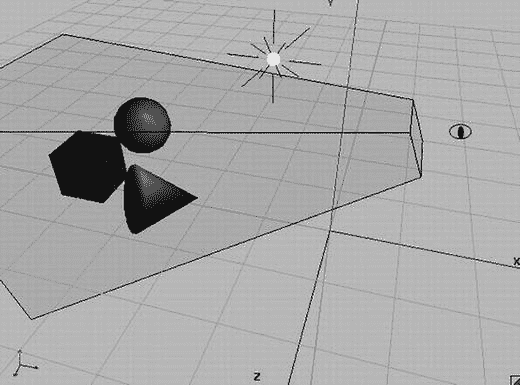

*图 7-1. 一个抽象场景*

每个物体都有相对于场景原点的位置和方向。由眼睛图形表示的相机，也有相对于场景原点的位置。图 7-1 中的棱锥体是所谓的视见体或视锥体，它显示了相机捕捉了多少场景以及相机是如何定向的。带有光线的小白色球体是场景中的光源，它也有相对于原点的位置。

我们可以将这个场景直接映射到 `OpenGL ES`，但为此我们需要定义以下内容：

- **物体（又称模型）：** 这些通常由四组属性组成：几何、颜色、纹理和材质。几何体被指定为一组三角形。每个三角形由 3D 空间中的三个点组成，因此我们有相对于坐标系原点定义的 `x`、`y` 和 `z` 坐标，如图 7-1 所示。请注意，`z` 轴指向我们。颜色通常指定为 RGB 三元组，这我们已经很熟悉了。纹理和材质则稍微复杂一些。我们稍后会讲到这些。
- **光源：** `OpenGL ES` 提供了几种不同类型的光源，各有不同的属性。它们只是数学对象，在 3D 空间中具有位置和/或方向，以及颜色等属性。
- **相机：** 这也是一个数学对象，在 3D 空间中具有位置和方向。此外，它还有控制我们看到多少图像的参数，类似于真实相机。所有这些因素共同定义了一个视见体或视锥体（由图 7-1 中截去顶部的棱锥体表示）。这个棱锥体内的任何东西都可以被相机看到；外部的任何东西都不会出现在最终图像中。
- **视口：** 这定义了最终图像的尺寸和分辨率。可以把它想象成你放入模拟相机中的胶卷类型，或者你用数码相机拍照时获得的图像分辨率。

有了这些，`OpenGL ES` 就可以从相机的视角构建我们场景的 2D 位图。请注意，我们在 3D 空间中定义了一切。那么，`OpenGL ES` 如何将其映射到二维呢？

### 投影


### OpenGL ES 中的投影与矩阵

这种二维映射是通过称为投影的方式完成的。我们之前提到过，`OpenGL ES` 主要处理三角形。单个三角形在三维空间中定义了三个点。要将这样的三角形渲染到帧缓冲区，`OpenGL ES` 需要知道这些三维点在帧缓冲区基于像素的坐标系中的坐标。一旦知道了这三个角点的坐标，它就可以直接绘制出帧缓冲区中位于三角形内部的像素。我们甚至可以通过 `Canvas` 将三维点投影到二维并绘制它们之间的连线，来编写一个简单的小型 `OpenGL ES` 实现。

在三维图形中，通常使用两种投影：

- **平行（或正交）投影**：如果你曾经使用过 CAD 应用程序，你可能已经了解这种投影。平行投影不关心物体离摄像头有多远；物体在最终图像中的大小始终保持不变。这种投影通常用于在 `OpenGL ES` 中渲染二维图形。

- **透视投影**：你的眼睛每天都在使用这种投影。离你较远的物体在你的视网膜上看起来更小。当我们使用 `OpenGL ES` 进行三维图形渲染时，通常使用透视投影。

在两种情况下，都需要一个称为投影平面的东西，它几乎与你的视网膜完全相同——光线在这里被实际记录以形成最终图像。虽然数学上的平面面积是无限的，但我们的视网膜是有限的。我们的 `OpenGL ES` “视网膜”相当于图 7-1 中视锥体顶部的矩形区域。视锥体的这一部分是 `OpenGL ES` 投影点的地方。这个区域被称为**近裁剪平面**，它拥有自己独立的二维坐标系。图 7-2 再次从摄像头的视角展示了近裁剪平面，并叠加了坐标系。

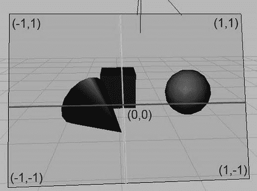

**图 7-2.** 近裁剪平面（也称为投影平面）及其坐标系

请注意，这个坐标系绝不是固定的。我们可以对其进行操控，以便在任何我们喜欢的投影坐标系中工作；例如，我们可以指示 `OpenGL ES` 将原点设在左下角，让“视网膜”的可见区域在 x 轴上为 480 单位，在 y 轴上为 320 单位。听起来很熟悉？是的，`OpenGL ES` 允许你为投影点指定任何你想要的坐标系。

一旦我们指定了视锥体，`OpenGL ES` 就会获取三角形的每个点，并从该点向投影平面发射一条射线。平行投影和透视投影之间的区别在于这些射线方向是如何构建的。图 7-3 从俯视角度展示了这两种投影的区别。

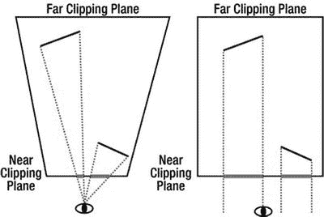

**图 7-3.** 透视投影（左）和平行投影（右）

透视投影从三角形的点出发，穿过摄像头（或视点，在此例中）发射射线。因此，距离较远的物体在投影平面上会显得更小。当我们使用平行投影时，射线垂直于投影平面发射。在这种情况下，无论物体距离多远，它在投影平面上的大小都将保持不变。

如前所述，在 `OpenGL ES` 术语中，我们的投影平面被称为**近裁剪平面**。视锥体的所有侧面都有类似的名称。距离摄像头最远的那个面被称为**远裁剪平面**。其他的面被称为**左、右、上、下裁剪平面**。任何位于这些平面之外或之后的对象都不会被渲染。部分位于视锥体内的对象将根据这些平面进行裁剪，这意味着视锥体之外的部分会被切除。这就是**裁剪平面**名称的由来。

你可能想知道图 7-3 中平行投影的视锥体为什么是矩形的。事实证明，投影实际上是由我们定义裁剪平面的方式决定的。在透视投影的情况下，左、右、上、下裁剪平面并不垂直于近裁剪平面和远裁剪平面（参见图 7-3，图中仅显示了左、右裁剪平面）。而在平行投影的情况下，这些平面是垂直的，这会告诉 `OpenGL ES` 无论物体离摄像头多远，都按相同大小渲染它。

#### 标准化设备空间和视口

一旦 `OpenGL ES` 计算出三角形在近裁剪平面上的投影点，它就可以最终将这些点转换为帧缓冲区中的像素坐标。为此，它必须首先将这些点转换到所谓的**标准化设备空间**。这等同于图 7-2 中描述的坐标系。基于这些标准化设备空间坐标，`OpenGL ES` 通过以下简单公式计算最终的帧缓冲区像素坐标：

```
pixelX = (norX + 1) / (viewportWidth + 1) + norX
pixelY = (norY + 1) / (viewportHeight + 1) + norY
```

其中 `norX` 和 `norY` 是三维点的标准化设备坐标，`viewportWidth` 和 `viewportHeight` 是视口在 x 轴和 y 轴上以像素为单位的大小。我们不需要过多担心标准化设备坐标，因为 `OpenGL` 会自动为我们完成转换。然而，我们真正关心的是视口和视锥体。稍后，你将看到如何指定视锥体，从而指定投影。

#### 矩阵

`OpenGL ES` 以矩阵的形式表达投影。我们不需要了解矩阵的内部原理。我们只需要知道它们对我们场景中定义的点做了什么。以下是矩阵的要点总结：

- 矩阵编码了将要应用于点的变换。变换可以是投影、平移（移动点）、绕另一个点和轴旋转、缩放等。
- 通过将这样的矩阵与点相乘，我们将变换应用于该点。例如，将一个点与一个编码了沿 x 轴平移 10 单位的矩阵相乘，将使该点沿 x 轴移动 10 单位，从而修改其坐标。
- 我们可以通过矩阵乘法将存储在多个独立矩阵中的变换连接成一个矩阵。当我们用这个单一的连接矩阵与一个点相乘时，该矩阵中存储的所有变换都将应用于该点。变换应用的顺序取决于我们矩阵相乘的顺序。
- 有一种特殊的矩阵称为**单位矩阵**。如果我们将一个矩阵或一个点与它相乘，什么也不会发生。可以将点或矩阵与单位矩阵相乘想象为数字乘以 1。它没有任何效果。当你了解 `OpenGL ES` 如何处理矩阵时，单位矩阵的相关性就会变得清晰（参见“矩阵模式和活动矩阵”一节）——这是一个经典的“先有鸡还是先有蛋”问题。

##### 注意

当我们在上下文中讨论点时，实际上是指三维向量。


### OpenGL ES 矩阵与渲染管线

`OpenGL ES` 有三种不同的矩阵，它们被应用到我们模型的点上：

* **模型-视图矩阵（Model-view matrix）**：我们可以使用此矩阵来移动、旋转或缩放三角形顶点（这是模型-视图矩阵的“模型”部分）。此矩阵还用于指定相机的位置和朝向（这是“视图”部分）。

* **投影矩阵（Projection matrix）**：顾名思义，此矩阵编码了投影，从而定义了相机的视锥体（view frustum）。

* **纹理矩阵（Texture matrix）**：此矩阵允许我们操作纹理坐标（稍后将讨论）。不过，在本书中我们将避免使用此矩阵，因为由于驱动程序错误，`OpenGL ES` 的这一部分在某些设备上存在问题。

## 渲染管线（The Rendering Pipeline）

`OpenGL ES` 会跟踪这三个矩阵。每当我们设置其中一个矩阵时，`OpenGL ES` 都会记住它，直到我们再次更改该矩阵。用 `OpenGL ES` 的行话来说，这被称为“状态”。不过，`OpenGL` 不仅仅跟踪矩阵状态；它还跟踪我们是否想要对三角形进行 Alpha 混合、是否要考虑光照、应该将哪个纹理应用于几何体等等。事实上，`OpenGL ES` 是一个庞大的状态机；我们设置其当前状态，将对象的几何体输入其中，并让它为我们渲染图像。让我们看看一个三角形如何通过这个强大的三角形渲染机器。图 7-4 展示了 `OpenGL ES` 流水线的一个非常高层级、简化的视图。

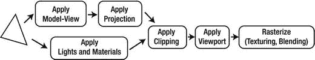

**图 7-4.**

三角形在此流水线中的路径如下所示：

1. 我们勇敢的三角形首先由模型-视图矩阵变换。这意味着其所有顶点都与此矩阵相乘。此乘法将有效地在世界中移动三角形的顶点。

2. 然后，产生的输出乘以投影矩阵，从而有效地将 3D 点变换到 2D 投影平面上。

3. 在这两步之间（或并行地），当前设置的光照和材质也会应用到我们的三角形上，赋予其颜色。

4. 完成所有这些后，投影后的三角形会被裁剪到我们的“视网膜”上，并通过应用视口变换转换到帧缓冲坐标。

5. 作为最后一步，`OpenGL` 根据光照阶段的颜色、要应用到三角形的纹理以及混合状态（三角形的每个像素可能会或可能不会与帧缓冲中的像素组合）来填充三角形的像素。

你只需要学习如何将几何体和纹理交给 `OpenGL ES`，以及如何设置前面每个步骤所使用的状态。在此之前，你需要了解 `Android` 如何授予你访问 `OpenGL ES` 的权限。

> **注意**
>
> 虽然对 `OpenGL ES` 流水线的高层描述基本正确，但它被极大地简化了，并省略了一些将在后续章节中变得重要的细节。另一件需要注意的事情是，当 `OpenGL ES` 执行投影时，它实际上并非投影到 2D 坐标系，而是投影到称为**齐次坐标系**的东西，它实际上是四维的。这是一个非常复杂的数学话题，为了简单起见，我们将坚持简化后的说法，即 `OpenGL ES` 投影到 2D 坐标。

## 开始之前（Before We Begin）

在本章的其余部分，我们将提供许多简短的示例，就像我们在第 4 章讨论 `Android API` 基础时那样。我们将使用与第 4 章相同的启动类，它会向您显示一个可以启动的启动活动列表。唯一会改变的是您通过反射实例化的活动的名称以及它们所在的包。本章其余部分的所有示例都将在包`com.badlogic.androidgames.glbasics`中。其余代码将保持不变。您的新启动活动将被命名为`GLBasicsStarter`。您还将复制第 5 章的所有源代码，即`com.badlogic.androidgames.framework`包及其所有子包。在本章中，您将编写一些新的框架和辅助类，这些类将放入`com.badlogic.androidgames.framework`包及其子包中。

我们再次需要一个清单文件。由于以下每个示例都将是一个活动，我们还需要确保每个示例在清单中都有一个条目。所有示例都将使用固定的方向（纵向或横向，取决于示例）。这与我们在第 4 章中使用的设置几乎完全相同。

解决了这个问题之后，让乐趣开始吧！

## GLSurfaceView：自 2008 年起让事情变得简单

我们首先需要的是某种类型的`View`，它允许我们通过 `OpenGL ES` 进行绘制。幸运的是，`Android API` 中就有这样一个`View`。它叫做`GLSurfaceView`，是`SurfaceView`类的后代，我们之前已经使用`SurfaceView`来绘制 Mr. Nom 的世界。

我们还需要一个单独的主循环线程，这样就不会拖慢 UI 线程。惊喜的是：`GLSurfaceView`已经为我们设置好了这样一个线程！我们需要做的就是实现一个名为`GLSurfaceView.Renderer`的监听器接口，并将其注册到`GLSurfaceView`。该接口有三个方法：

```java
interface Renderer {
public void onSurfaceCreated(GL10 gl, EGLConfig config);
public void onSurfaceChanged(GL10 gl, int width, int height);
public void onDrawFrame(GL10 gl);
}
```

`onSurfaceCreated()`方法在每次创建`GLSurfaceView`表面时被调用。这发生在我们第一次启动活动时，以及每次我们从暂停状态回到活动时。该方法接受两个参数：一个`GL10`实例和一个`EGLConfig`。`GL10`实例允许我们向 `OpenGL ES` 发出命令。`EGLConfig`实例则告诉我们表面的属性，例如颜色深度、深度缓冲等。我们通常忽略它。我们将在`onSurfaceCreated()`方法中设置几何体和纹理。

`onSurfaceChanged()`方法在每次表面大小改变时被调用。作为参数，我们得到表面的新宽度和高度（以像素为单位），以及一个`GL10`实例（如果我们想发出 `OpenGL ES` 命令的话）。

`onDrawFrame()`方法是乐趣所在。它在精神上类似于我们的`Screen.render()`方法，由`GLSurfaceView`为我们设置的渲染线程尽可能频繁地调用。在这个方法中，我们执行所有的渲染工作。

除了注册一个`Renderer`监听器之外，我们还需要在我们的活动的`onPause()`/`onResume()`方法中调用`GLSurfaceView.onPause()`/`onResume()`。原因很简单。`GLSurfaceView`会启动其`onResume()`方法中的渲染线程，并在其`onPause()`方法中将其销毁。这意味着当我们的活动暂停时，我们的监听器不会被调用，因为调用我们监听器的渲染线程也会被暂停。

> **注意**


实际上，`EGL`负责上下文的创建和销毁以及表面的创建与销毁。`EGL`是另一个 Khronos Group 标准；它定义了操作系统如何与`OpenGL ES`协作，以及操作系统如何授予`OpenGL ES`对底层图形硬件的访问权限。这包括表面创建和上下文管理。由于`GLSurfaceView`为我们处理了所有与`EGL`相关的内容，因此在几乎所有情况下我们都可以安全地忽略它。

按照传统，我们编写一个小示例，该示例每帧用随机颜色清除屏幕。清单 7-1 展示了代码。该清单被拆分成多段，并穿插了注释。

```
package com.badlogic.androidgames.glbasics;
import java.util.Random;
import javax.microedition.khronos.egl.EGLConfig;
import javax.microedition.khronos.opengles.GL10;
import android.app.Activity;
import android.opengl.GLSurfaceView;
import android.opengl.GLSurfaceView.Renderer;
import android.os.Bundle;
import android.util.Log;
import android.view.Window;
import android.view.WindowManager;
public class GLSurfaceViewTest extends Activity {
GLSurfaceView glView;
public void onCreate(Bundle savedInstanceState) {
super.onCreate(savedInstanceState);
requestWindowFeature(Window.FEATURE_NO_TITLE);
getWindow().setFlags(WindowManager.LayoutParams.FLAG_FULLSCREEN,
WindowManager.LayoutParams.FLAG_FULLSCREEN);
glView = new GLSurfaceView(this);
glView.setRenderer(new SimpleRenderer());
setContentView(glView);
}
```

**清单 7-1** `GLSurfaceViewTest.java`：屏幕清除狂想曲

我们将`GLSurfaceView`实例的引用作为类的成员变量保存。在`onCreate()`方法中，我们使应用程序全屏，创建`GLSurfaceView`，设置我们的`Renderer`实现，并将`GLSurfaceView`设置为活动的内容视图。

```
@Override
public void onResume() {
super.onResume();
glView.onResume();
}
@Override
public void onPause() {
super.onPause();
glView.onPause();
}
```

在`onResume()`和`onPause()`方法中，我们调用父类方法以及相应的`GLSurfaceView`方法。这些方法将启动和拆除`GLSurfaceView`的渲染线程，这反过来将在适当的时间触发我们的`Renderer`实现的回调方法。

```
static class SimpleRenderer implements Renderer {
Random rand = new Random();
public void onSurfaceCreated(GL10 gl, EGLConfig config) {
Log.d("GLSurfaceViewTest", "surface created");
}
public void onSurfaceChanged(GL10 gl, int width, int height) {
Log.d("GLSurfaceViewTest", "surface changed: " + width + "x"
+ height);
}
public void onDrawFrame(GL10 gl) {
gl.glClearColor(rand.nextFloat(), rand.nextFloat(),
rand.nextFloat(), 1);
gl.glClear(GL10.GL_COLOR_BUFFER_BIT);
}
}
}
```

代码的最后一部分是我们的`Renderer`实现。它仅在`onSurfaceCreated()`和`onSurfaceChanged()`方法中记录一些信息。真正有趣的部分是`onDrawFrame()`方法。

如前所述，`GL10`实例使我们能够访问`OpenGL ES API`。`GL10`中的`10`表示它提供了`OpenGL ES 1.0`标准中定义的所有函数。目前，我们可以对此感到满意。该类的所有方法都映射到标准中定义的相应 C 函数。每个方法都以`gl`前缀开头，这是`OpenGL ES`的一个古老传统。

我们调用的第一个`OpenGL ES`方法是`glClearColor()`。您可能已经知道它的作用。它设置了当我们发出清除屏幕命令时要使用的颜色。在`OpenGL ES`中，颜色几乎总是 RGBA 格式，其中每个分量的取值范围是 0 到 1。也有其他定义颜色的方式，比如 RGB565，但我们现在先使用浮点数表示。我们只需设置一次用于清除的颜色，`OpenGL ES`就会记住它。通过`glClearColor()`设置的颜色是`OpenGL ES`的状态之一。

下一个调用实际上使用我们刚刚指定的清除颜色来清除屏幕。`glClear()`方法接受一个参数，该参数指定要清除哪个缓冲区。除了帧缓冲区，`OpenGL`还有一些其他缓冲区。您将在第 10 章中了解它们，但现在，我们只关心保存像素的帧缓冲区，`OpenGL ES`称之为颜色缓冲区。为了告诉`OpenGL ES`我们要清除这个缓冲区，我们指定常量`GL10.GL_COLOR_BUFFER_BIT`。

`OpenGL ES`有很多常量，它们都定义为`GL10`接口的静态公共成员。与方法一样，每个常量都有`GL_`前缀。

好了，这就是我们的第一个`OpenGL ES`应用程序。我们就不展示令人印象深刻的截图了，因为您可能知道它是什么样子。

> **注意**
> 
> 你绝不能在另一个线程中调用`OpenGL ES`！这是第一条也是最后一条戒律！原因是`OpenGL ES`被设计为仅在单线程环境中使用，并且它不是线程安全的。虽然可以在多个线程上使其在一定程度上工作，但许多驱动程序对此存在问题，而且这样做并没有真正的好处。

## `GLGame`：实现游戏接口

在上一章中，我们实现了`AndroidGame`类，它整合了音频、文件 I/O、图形和用户输入处理的所有子模块。我们希望在我们即将推出的 2D`OpenGL ES`游戏中重用其中的大部分内容，因此我们实现一个名为`GLGame`的新类，该类实现了我们之前定义的`game`接口、一个`GLSurfaceView`和一个`Renderer`。

您首先会注意到，以您目前对`OpenGL ES`的了解，您不可能实现图形接口。这里有一个惊喜：您不需要实现它。`OpenGL`不太适用于您的图形接口的编程模型；相反，我们将实现一个新类`GLGraphics`，它将跟踪我们从`GLSurfaceView`获得的`GL10`实例。清单 7-2 展示了代码。

```
package com.badlogic.androidgames.framework.impl;
import javax.microedition.khronos.opengles.GL10;
import android.opengl.GLSurfaceView;
public class GLGraphics {
GLSurfaceView glView;
GL10 gl;
GLGraphics(GLSurfaceView glView) {
this.glView = glView;
}
public GL10 getGL() {
return gl;
}
void setGL(GL10 gl) {
this.gl = gl;
}
public int getWidth() {
return glView.getWidth();
}
public int getHeight() {
return glView.getHeight();
}
}
```

**清单 7-2** `GLGraphics.java`：跟踪`GLSurfaceView`和`GLES20`实例

这个类只有几个 getter 和 setter 方法。请注意，我们将在`GLSurfaceView`设置的渲染线程中使用这个类。因此，调用主要位于 UI 线程上的`View`的方法可能会出现问题。在这种情况下，这是可以的，因为我们只查询`GLSurfaceView`的宽度和高度，所以不会出现问题。

`GLGame`类稍微复杂一些。它从`AndroidGame`类借用了大部分代码。渲染线程和 UI 线程之间的同步稍微复杂一些。让我们在清单 7-3 中看看它。


```java
package com.badlogic.androidgames.framework.impl;
import javax.microedition.khronos.egl.EGLConfig;
import javax.microedition.khronos.opengles.GL10;
import android.app.Activity;
import android.content.Context;
import android.opengl.GLSurfaceView;
import android.opengl.GLSurfaceView.Renderer;
import android.os.Bundle;
import android.view.Window;
import android.view.WindowManager;
import com.badlogic.androidgames.framework.Audio;
import com.badlogic.androidgames.framework.FileIO;
import com.badlogic.androidgames.framework.Game;
import com.badlogic.androidgames.framework.Graphics;
import com.badlogic.androidgames.framework.Input;
import com.badlogic.androidgames.framework.Screen;
public abstract class GLGame extends Activity implements Game, Renderer {
enum GLGameState {
Initialized,
Running,
Paused,
Finished,
Idle
}
GLSurfaceView glView;
GLGraphics glGraphics;
Audio audio;
Input input;
FileIO fileIO;
Screen screen;
GLGameState state = GLGameState.Initialized;
Object stateChanged = new Object();
long startTime = System.nanoTime();
```
*列表 7-3.* `GLGame.java`：强大的 OpenGL ES 游戏实现

该类继承 `Activity` 类并实现了 `Game` 和 `GLSurfaceView.Renderer` 接口。它有一个名为 `GLGameState` 的枚举，用于跟踪 `GLGame` 实例所处的状态。稍后将看到这些枚举的用法。

该类的成员包括一个 `GLSurfaceView` 实例和一个 `GLGraphics` 实例。该类还包含 `Audio`、`Input`、`FileIO` 和 `Screen` 实例，它们用于编写游戏，就像我们在 `AndroidGame` 类中所做的那样。`state` 成员通过 `GLGameState` 枚举之一来跟踪状态。`stateChanged` 成员是一个对象，我们将使用它来同步 UI 线程和渲染线程。

```java
@Override
protected void onCreate(Bundle savedInstanceState) {
super.onCreate(savedInstanceState);
requestWindowFeature(Window.FEATURE_NO_TITLE);
getWindow().setFlags(WindowManager.LayoutParams.FLAG_FULLSCREEN,
WindowManager.LayoutParams.FLAG_FULLSCREEN);
getWindow().addFlags(WindowManager.LayoutParams.FLAG_KEEP_SCREEN_ON);
glView = new GLSurfaceView(this);
glView.setRenderer(this);
setContentView(glView);
glGraphics = new GLGraphics(glView);
fileIO = new AndroidFileIO(this);
audio = new AndroidAudio(this);
input = new AndroidInput(this, glView, 1, 1);
}
```

在 `onCreate()` 方法中，我们执行了通常的设置流程。我们使 Activity 全屏，并实例化 `GLSurfaceView`，将其设置为内容视图。我们还实例化了所有其他实现框架接口的类，例如 `AndroidFileIO` 和 `AndroidInput` 类。请注意，我们重用了在 `AndroidGame` 类中使用的类，但 `AndroidGraphics` 除外。另一个重要点是，我们不再让 `AndroidInput` 类像在 `AndroidGame` 中那样将触摸坐标缩放到目标分辨率。缩放值均为 1，因此我们将获得真实的触摸坐标。

```java
@Override
public void onResume() {
super.onResume();
glView.onResume();
}
```

在 `onResume()` 方法中，我们让 `GLSurfaceView` 通过调用其 `onResume()` 方法来启动渲染线程。

```java
@Override
public void onSurfaceCreated(GL10 gl, EGLConfig config) {
glGraphics.setGL(gl);
synchronized(stateChanged) {
if(state == GLGameState.Initialized)
screen = getStartScreen();
state = GLGameState.Running;
screen.resume();
startTime = System.nanoTime();
}
}
```

接下来将调用 `onSurfaceCreate()` 方法，该方法当然是在渲染线程上调用的。在这里，您可以看到 `state` 枚举的用法。如果应用程序是首次启动，`state` 将为 `GLGameState.Initialized`。在这种情况下，我们调用 `getStartScreen()` 方法来返回游戏的起始屏幕。如果游戏不处于初始化状态但已在运行，我们知道我们刚刚从暂停状态恢复。无论如何，我们将 `state` 设置为 `GLGameState.Running`，并调用当前屏幕的 `resume()` 方法。我们还记录当前时间，以便稍后计算增量时间。

同步是必要的，因为我们在同步块中操作的成员可能会在 UI 线程上的 `onPause()` 方法中被操作。我们必须防止这种情况，因此我们使用一个对象作为锁。我们也可以使用 `GLGame` 实例本身或适当的锁。

```java
@Override
public void onSurfaceChanged(GL10 gl, int width, int height) {
}
```

`onSurfaceChanged()` 方法基本上只是一个存根。这里没有我们需要做的事情。

```java
public void onDrawFrame(GL10 gl) {
GLGameState state = null;
synchronized(stateChanged) {
state = this.state;
}
if(state == GLGameState.Running) {
float deltaTime = (System.nanoTime()-startTime) / 1000000000.0f;
startTime = System.nanoTime();
screen.update(deltaTime);
screen.present(deltaTime);
}
if(state == GLGameState.Paused) {
screen.pause();
synchronized(stateChanged) {
this.state = GLGameState.Idle;
stateChanged.notifyAll();
}
}
if(state == GLGameState.Finished) {
screen.pause();
screen.dispose();
synchronized(stateChanged) {
this.state = GLGameState.Idle;
stateChanged.notifyAll();
}
}
}
```

`onDrawFrame()` 方法是执行大部分工作的地方。它由渲染线程尽可能频繁地调用。在这里，我们检查游戏所处的 `state` 并做出相应反应。由于 `state` 可以通过 UI 线程上的 `onPause()` 方法设置，我们必须同步对其的访问。

如果游戏正在运行，我们计算增量时间，并告诉当前屏幕更新和呈现自身。

如果游戏暂停，我们也告诉当前屏幕暂停自身。然后我们将状态更改为 `GLGameState.Idle`，表示我们已收到来自 UI 线程的暂停请求。由于我们在 UI 线程的 `onPause()` 方法中等待这种情况发生，我们通知 UI 线程现在可以真正暂停应用程序。此通知是必需的，因为如果我们的 Activity 在 UI 线程上被暂停或关闭，我们必须确保渲染线程被正确暂停/关闭。

如果 Activity 正在被关闭（而不是暂停），我们对 `GLGameState.Finished` 做出反应。在这种情况下，我们告诉当前屏幕暂停并释放自身，然后向等待渲染线程正确关闭事物的 UI 线程发送另一个通知。

```java
@Override
public void onPause() {
synchronized(stateChanged) {
if(isFinishing())
state = GLGameState.Finished;
else
state = GLGameState.Paused;
while(true) {
try {
stateChanged.wait();
break;
} catch(InterruptedException e) {
}
}
}
glView.onPause();
super.onPause();
}
```

`onPause()` 方法是当 Activity 暂停时在 UI 线程上调用的常规 Activity 通知方法。根据应用程序是关闭还是暂停，我们相应地设置 `state`，并等待渲染线程处理新状态。这是通过标准的 Java wait/notify 机制实现的。

最后，我们告诉 `GLSurfaceView` 和 `Activity` 暂停自身，从而有效地关闭渲染线程。

```java
public GLGraphics getGLGraphics() {
return glGraphics;
}
```

`getGLGraphics()` 方法是一个只能通过 `GLGame` 类访问的新方法。它返回我们存储的 `GLGraphics` 实例，以便我们以后可以在 `Screen` 实现中访问 `GL10` 接口。


```java
public Input getInput() {
    return input;
}
public FileIO getFileIO() {
    return fileIO;
}
public Graphics getGraphics() {
    throw new IllegalStateException("We are using OpenGL!");
}
public Audio getAudio() {
    return audio;
}
public void setScreen(Screen newScreen) {
    if (screen == null)
        throw new IllegalArgumentException("Screen must not be null");
    this.screen.pause();
    this.screen.dispose();
    newScreen.resume();
    newScreen.update(0);
    this.screen = newScreen;
}
public Screen getCurrentScreen() {
    return screen;
}
```

类的其余部分与之前一致。如果我们意外尝试访问标准的 `Graphics` 实例，会抛出一个异常，因为 `GLGame` 不支持该实例。我们将改用通过 `GLGame.getGLGraphics()` 方法获得的 `GLGraphics` 方法。

为什么我们要费尽周折与渲染线程同步呢？好吧，这将使我们的 `Screen` 实现完全在渲染线程上运行。`Screen` 的所有方法都将在此执行，如果要访问 OpenGL ES 功能，这是必需的。请记住，我们只能在渲染线程上访问 OpenGL ES。

让我们通过一个示例来收尾。清单 7-4 展示了本章第一个示例在使用 `GLGame` 和 `Screen` 时的样子。

```java
package com.badlogic.androidgames.glbasics;
import java.util.Random;
import javax.microedition.khronos.opengles.GL10;
import com.badlogic.androidgames.framework.Game;
import com.badlogic.androidgames.framework.Screen;
import com.badlogic.androidgames.framework.impl.GLGame;
import com.badlogic.androidgames.framework.impl.GLGraphics;
public class GLGameTest extends GLGame {
    public Screen getStartScreen() {
        return new TestScreen(this);
    }
    class TestScreen extends Screen {
        GLGraphics glGraphics;
        Random rand = new Random();
        public TestScreen(Game game) {
            super(game);
            glGraphics = ((GLGame) game).getGLGraphics();
        }
        @Override
        public void present(float deltaTime) {
            GL10 gl = glGraphics.getGL();
            gl.glClearColor(rand.nextFloat(), rand.nextFloat(),
                rand.nextFloat(), 1);
            gl.glClear(GL10.GL_COLOR_BUFFER_BIT);
        }
        @Override
        public void update(float deltaTime) {
        }
        @Override
        public void pause() {
        }
        @Override
        public void resume() {
        }
        @Override
        public void dispose() {
        }
    }
}
清单 7-4.
```

这与我们上一个示例的程序相同，区别在于我们现在继承自 `GLGame` 而不是 `Activity`，并且提供了 `Screen` 实现而不是 `GLSurfaceView.Renderer` 实现。

在接下来的示例中，我们将只关注每个示例 `Screen` 实现的相关部分。我们示例的整体结构将保持不变。当然，我们必须将示例 `GLGame` 实现添加到启动 Activity 以及清单文件中。

处理完这些之后，让我们来渲染第一个三角形。

## 看好了，我画好了一个红色三角形！

你已经了解到，在告诉 OpenGL ES 绘制几何图形之前，需要设置一些东西。我们最关心的两件事是投影矩阵（以及与之相关的视锥体）和视口，视口控制着输出图像的大小以及渲染输出在帧缓冲中的位置。

### 定义视口

OpenGL ES 使用视口来将投影到近裁剪平面的点坐标转换为帧缓冲像素坐标。我们可以通过以下方法告诉 OpenGL ES 只使用帧缓冲的一部分或全部：

```java
GL10.glViewport(int x, int y, int width, int height)
```

`x` 和 `y` 坐标指定视口在帧缓冲中的左上角位置，`width` 和 `height` 指定视口以像素为单位的尺寸。请注意，OpenGL ES 假定帧缓冲坐标系的原点在屏幕的左下角。由于我们使用全屏模式，通常将 `x` 和 `y` 设置为 0，将 `width` 和 `height` 设置为屏幕分辨率。我们可以通过此方法指示 OpenGL ES 仅使用帧缓冲的一部分。然后它会获取渲染输出并自动将其拉伸到该部分。

> **注意**
> 
> 虽然此方法看起来像是为我们设置了一个用于渲染的 2D 坐标系，但实际上并非如此。它仅定义了 OpenGL ES 用于输出最终图像的帧缓冲部分。我们的坐标系是通过投影矩阵和模型视图矩阵定义的。

### 定义投影矩阵

我们需要定义的下一件事是投影矩阵。由于本章只关心 2D 图形，我们希望使用平行投影。我们该如何做呢？

#### 矩阵模式与活动矩阵

我们已经讨论过，OpenGL ES 会跟踪三个矩阵：投影矩阵、模型视图矩阵和纹理矩阵（我们继续忽略它）。OpenGL ES 提供了几种特定方法来修改这些矩阵。然而，在使用这些方法之前，我们必须告诉 OpenGL ES 我们要操作哪个矩阵。我们通过以下方法来实现：

```java
GL10.glMatrixMode(int mode)
```

`mode` 参数可以是 `GL10.GL_PROJECTION`、`GL10.GL_MODELVIEW` 或 `GL10.GL_TEXTURE`。显然，这些常量分别对应哪个矩阵处于活动状态。任何后续对矩阵操作方法的调用都将针对我们通过此方法设置的矩阵，直到我们再次调用此方法来更改活动矩阵。此矩阵模式是 OpenGL ES 的状态之一（如果我们的应用程序暂停并恢复，当上下文丢失时，此状态也会丢失）。要通过任何后续调用来操作投影矩阵，我们可以像这样调用该方法：

```java
gl.glMatrixMode(GL10.GL_PROJECTION);
```

#### 使用 glOrthof 进行正交投影

OpenGL ES 提供了以下方法，用于将活动矩阵设置为正交（平行）投影矩阵：

```java
GL10.glOrthof(int left, int right, int bottom, int top, int near, int far)
```

嘿，这看起来与我们的视锥体裁剪平面有关……没错，确实如此！那么，我们应该在这里指定什么值呢？

OpenGL ES 有一个标准坐标系，如图 7-5 所示。正 x 轴指向右侧，正 y 轴指向上方，正 z 轴指向我们。使用 `glOrthof()`，我们可以在这个坐标系中定义平行投影的视锥体。如果你回顾一下图 7-3，可以看到平行投影的视锥体是一个盒子。我们可以将 `glOrthof()` 的参数解释为指定视锥体盒子的两个对角。图 7-5 对此进行了说明。

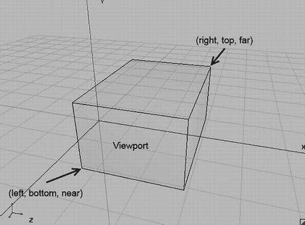

**图 7-5.** 正交视锥体

我们视锥体的正面将直接映射到视口。如果视口是全屏的，例如从 (0,0) 到 (480,320)（以 Hero 设备横屏模式为例），则正面的左下角将映射到屏幕左下角，正面的右上角将映射到屏幕左上角。OpenGL 会自动为我们执行拉伸。

由于我们要进行 2D 图形处理，我们将指定角点——left、bottom、near 和 right、top、far（参见图 7-5），以便我们可以在一种像素坐标系中工作，就像我们使用 `Canvas` API 和 Mr. Nom 时一样。以下是我们建立这样一个坐标系的方法：


`gl.glOrthof(0, 480, 0, 320, 1, -1);`

图 7-6 展示了视锥体。

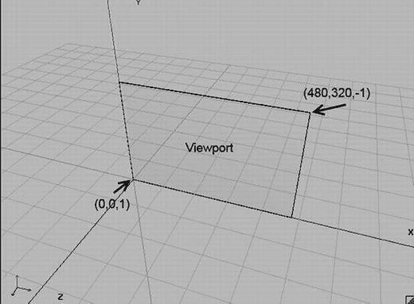

图 7-6. 用于 OpenGL ES 2D 渲染的平行投影视锥体

我们的视锥体非常薄，但这没关系，因为我们只会在 2D 环境中工作。坐标系中可见部分的范围是 `(0,0,1)` 到 `(480,320,-1)`。只要是在这个方框内指定的点，都会在屏幕上可见。这些点会被投影到该方框的前面，也就是我们所钟爱的近裁剪平面。无论视口尺寸如何，投影都会被拉伸到视口上。假设我们有一部 Nexus One 手机，在横屏模式下分辨率为 800×480 像素。当我们指定视锥体时，可以在 480×320 的坐标系中工作，OpenGL 会将其拉伸到 800×480 的帧缓冲区（如果我们指定视口覆盖整个帧缓冲区）。最棒的是，我们可以毫无阻碍地使用更奇葩的视锥体。我们也可以使用角点为 `(-1,-1,100)` 和 `(2,2,-100)` 的视锥体。我们指定在这个方框内的所有物体都会可见，并自动被拉伸——非常巧妙！

注意，我们还设置了近裁剪平面和远裁剪平面。由于本章将完全忽略 `z` 坐标，你可能会倾向于将近裁剪和远裁剪都设为 `0`；但是，出于多种原因，这并不是一个好主意。为了稳妥起见，我们在 `z` 轴上为视锥体留出一点余量。我们所有几何图形的点都定义在 `z` 值为 `0` 的 x-y 平面上——自始至终都是 2D。

**注意**

你可能已经注意到，`y` 轴现在指向上方，原点位于屏幕的左下角。尽管 `Canvas`、UI 框架以及许多其他 2D 渲染 API 使用 y 轴向下、原点在左上角的惯例，但在游戏编程中使用这个“新”坐标系实际上更为方便。例如，如果超级马里奥在跳跃，难道你不希望在他上升的过程中，他的 `y` 坐标是增加而不是减少吗？想使用另一种坐标系？没关系，只需交换 `glOrthof()` 中的底部和顶部参数即可。另外，虽然从几何角度来看，视锥体的图示基本正确，但 `glOrthof()` 对近裁剪平面和远裁剪平面的解释其实略有不同。由于这涉及一些细节，我们姑且认为前面的图示是正确的。

## 有用的代码片段

下面是一小段代码，本章的所有示例都将用到它。这段代码用黑色清屏，将视口设置为覆盖整个帧缓冲区，并设置投影矩阵（从而设置视锥体），以便我们可以在一个坐标系中舒适地工作——该坐标系的原点位于屏幕左下角，`y` 轴指向上方。

```
gl.glClearColor(0,0,0,1);
gl.glClear(GL10.GL_COLOR_BUFFER_BIT);
gl.glViewport(0, 0, glGraphics.getWidth(), glGraphics.getHeight());
gl.glMatrixMode(GL10.GL_PROJECTION);
gl.glLoadIdentity();
gl.glOrthof(0, 320, 0, 480, 1, -1);
```

等等，这里面的 `glLoadIdentity()` 是做什么的？实际上，OpenGL ES 提供给我们的用于操作活动矩阵的大多数方法并不会直接设置矩阵；相反，它们会根据所传入的参数构造一个临时矩阵，然后与当前矩阵相乘。`glOrthof()` 方法也不例外。例如，如果我们在每一帧都调用 `glOrthof()`，那就会把投影矩阵反复乘到“死”。所以我们不会这么做，而是确保在乘以投影矩阵之前，先有一个干净的单位矩阵。记住，一个矩阵乘以单位矩阵的结果还是它本身，而这正是 `glLoadIdentity()` 的作用。可以把它想象成先加载值 `1`，然后再将其与我们拥有的任何矩阵相乘——在此例中，就是与 `glOrthof()` 生成的投影矩阵相乘。

请注意，我们的坐标系现在范围是 `(0,0,1)` 到 `(320,480,-1)`——这是针对竖屏渲染模式。

## 指定三角形

首先，我们必须弄清楚如何告诉 OpenGL ES 我们想要它渲染的三角形。我们先定义三角形的构成要素：

*   一个三角形由三个点组成。
*   每个点称为一个顶点。
*   一个顶点在 3D 空间中有一个位置。
*   3D 空间中的一个位置由三个浮点数指定，分别表示 `x`、`y` 和 `z` 坐标。
*   一个顶点可以有额外的属性，例如颜色或纹理坐标（我们稍后会讨论）。这些属性也可以用浮点数表示。

OpenGL ES 期望我们以数组的形式传递三角形定义。然而，鉴于 OpenGL ES 实际上是一个 C 语言 API，我们不能直接使用标准的 Java 数组。相反，我们必须使用 Java NIO 缓冲区，它本质上是连续的字节内存块。Java NIO（即非阻塞 I/O）缓冲区是一种处理缓冲区数据的底层方式。

### 一点关于 NIO 缓冲区的内容

为了完全精确起见，我们需要使用直接 NIO 缓冲区。这意味着内存不是在虚拟机的堆内存中分配的，而是在原生堆内存中分配的。要构造这样一个直接 NIO 缓冲区，我们可以使用以下代码片段：

```
ByteBuffer buffer = ByteBuffer.allocateDirect(NUMBER_OF_BYTES);
buffer.order(ByteOrder.nativeOrder());
```

这将分配一个能够总共容纳 `NUMBER_OF_BYTES` 个字节的 `ByteBuffer`，并确保字节顺序与底层 CPU 使用的字节顺序一致。一个 NIO 缓冲区有三个属性：

*   **容量**：缓冲区总共能容纳的元素数量。
*   **位置**：下一个元素将被写入或读取的当前位置。
*   **界限**：最后一个已定义元素的索引加一。

缓冲区的容量是其实际大小。对于 `ByteBuffer` 来说，它以字节为单位。位置和界限属性可以看作是定义了缓冲区内部从位置开始、到界限结束（但不包含界限）的一个区间。

由于我们希望用浮点数来指定顶点，最好能避免处理字节。幸运的是，我们可以将 `ByteBuffer` 实例转换为 `FloatBuffer` 实例，这恰好允许我们使用浮点数来工作。

```
FloatBuffer floatBuffer = buffer.asFloatBuffer();
```

对于 `FloatBuffer` 而言，容量、位置和界限都以浮点数表示。这些缓冲区的使用模式相当有限——通常是这样的：

```
float[] vertices = { ... 顶点位置等定义 ... };
floatBuffer.clear();
floatBuffer.put(vertices);
floatBuffer.flip();
```

我们首先在标准的 Java 浮点数组中定义数据。在将浮点数组放入缓冲区之前，我们通过 `clear()` 方法告诉缓冲区清除自身。这实际上并不会擦除任何数据，而是将位置设为 `0`，界限设为容量。接下来，我们使用 `FloatBuffer.put(float[] array)` 方法，从缓冲区的当前位置开始，将整个数组的内容复制到缓冲区中。复制完成后，缓冲区的位置会向后移动数组长度那么多的位置。接着，对 `put()` 方法的调用会将额外的数据追加到我们上次复制到缓冲区的数组数据之后。最后调用 `FloatBuffer.flip()` 只是交换位置和界限的值。


在本例中，我们假设顶点数组的大小为五个浮点数，并且 `FloatBuffer` 有足够的容量来存储这五个浮点数。调用 `FloatBuffer.put()` 后，缓冲区的位置 (position) 将变为 5（索引 0 到 4 被数组中的五个浮点数占用）。限制 (limit) 仍将等于缓冲区的容量。调用 `FloatBuffer.flip()` 后，缓冲区位置将被设置为 0，限制将被设置为 5。任何希望从该缓冲区读取数据的对象都会知道，它应该读取索引从 0 到 4 的浮点数（请记住，限制是排除在外的），而这也正是 OpenGL ES 需要知道的信息。但请注意，它会愉快地忽略这个限制。通常，除了将缓冲区传递给它之外，我们还必须告诉它要读取的元素数量。这里没有错误检查，所以要小心。

有时，在填充缓冲区后手动设置其位置很有用。这可以通过调用以下方法来实现：

```
FloatBuffer.position(int position)
```

稍后，当我们为了 OpenGL ES 能从特定位置开始读取，而临时将已填充缓冲区的位置设置为 0 以外的值时，这将派上用场。

## 将顶点发送到 OpenGL ES

那么，我们如何定义第一个三角形的三个顶点的位置呢？很简单！假设我们的坐标系是从 (0,0,1) 到 (320,480,-1)，就像我们在前面的代码片段中定义的那样，我们可以这样做：

```
ByteBuffer byteBuffer = ByteBuffer.allocateDirect(3 * 2 * 4);
byteBuffer.order(ByteOrder.nativeOrder());
FloatBuffer vertices = byteBuffer.asFloatBuffer();
vertices.put(new float[] {    0.0f,   0.0f,
319.0f,   0.0f,
160.0f, 479.0f  });
vertices.flip();
```

前三行应该已经很熟悉了。唯一有趣的部分是我们分配了多少字节。我们有三个顶点，每个顶点由 x 和 y 坐标表示的位置构成。每个坐标都是一个浮点数，因此占用 4 个字节。所以，对于我们的三角形，总共需要 3 个顶点乘以 2 个坐标再乘以 4 个字节，共计 24 个字节。

注意：我们可以仅用 x 和 y 坐标指定顶点，OpenGL ES 会自动将 z 坐标设置为 0。

接下来，我们将一个包含顶点位置的浮点数组放入缓冲区。我们的三角形从左下角 (0,0) 开始，延伸到视景体/屏幕的右边缘 (319,0)，然后再延伸到视景体/屏幕顶边的中间位置。作为优秀的 NIO 缓冲区用户，我们还在缓冲区上调用了 `flip()` 方法。因此，位置将变为 0，限制将变为 6（请记住，`FloatBuffer` 的限制和位置是以浮点数而不是字节为单位的）。

准备好 NIO 缓冲区后，我们可以告诉 OpenGL ES 使用其当前状态（即视口和投影矩阵）来绘制它。这可以通过以下代码片段来完成：

```
gl.glEnableClientState(GL10.GL_VERTEX_ARRAY);
gl.glVertexPointer( 2, GL10.GL_FLOAT, 0, vertices);
gl.glDrawArrays(GL10.GL_TRIANGLES, 0, 3);
```

调用 `glEnableClientState()` 有点像是历史遗留问题。它告诉 OpenGL ES 我们要绘制的顶点有一个位置。这有点傻，原因有两个：

- 这个常量被命名为 `GL10.GL_VERTEX_ARRAY`，这有点令人困惑。如果它被命名为 `GL10.GL_POSITION_ARRAY` 会更有意义。
- 没有办法绘制没有位置的东西，所以调用这个方法有点多余。不过，为了让 OpenGL ES 满意，我们还是这样做。

在调用 `glVertexPointer()` 时，我们告诉 OpenGL ES 在哪里可以找到顶点位置，并提供一些额外信息。第一个参数告诉 OpenGL ES，每个顶点位置由两个坐标（x 和 y）组成。如果我们指定了 x、y 和 z，我们就需要向该方法传递 `3`。第二个参数告诉 OpenGL ES 我们用来存储每个坐标的数据类型。在这个例子中，它是 `GL10.GL_FLOAT`，表明我们使用了每个编码为四个字节的浮点数。第三个参数 `stride`（步长）告诉 OpenGL 我们的顶点位置在字节上相距多远。在前面的例子中，`stride` 是 0，因为位置是紧密排列的 [顶点 1 (x, y)，顶点 2 (x, y)，依此类推]。最后一个参数是我们的 `FloatBuffer`，关于它有两件事需要记住：

- `FloatBuffer` 代表本地堆中的一块内存，因此有一个起始地址。
- `FloatBuffer` 的 position（位置）是相对于该起始地址的偏移量。

当我们告诉 OpenGL ES 绘制缓冲区内容时，它会获取缓冲区的起始地址，并加上缓冲区的 position，从而定位到缓冲区中它将开始读取顶点的那个浮点数。顶点指针（再次强调，它应该被称为位置指针）是 OpenGL ES 的一个状态。只要我们不改变它（并且上下文没有丢失），OpenGL ES 就会记住它，并将其用于所有后续需要顶点位置的调用。

最后，还有对 `glDrawArrays()` 的调用。它将绘制我们的三角形。第一个参数指定了我们要绘制的基本图元类型。在这个例子中，我们说我们要渲染一个三角形列表，这是通过 `GL10.GL_TRIANGLES` 来指定的。下一个参数是相对于顶点指针所指向的第一个顶点的偏移量。该偏移量是以顶点为单位的，而不是字节或浮点数。如果我们指定了多个三角形，就可以使用此偏移量来仅渲染三角形列表的一个子集。最后一个参数告诉 OpenGL ES 它应该使用多少个顶点进行渲染。在我们的例子中，是三个顶点。请注意，如果我们绘制 `GL10.GL_TRIANGLES`，我们总是必须指定一个 3 的倍数。每个三角形由三个顶点组成，所以这是有道理的。对于其他基本图元类型，规则会略有不同。

一旦我们发出了 `glVertexPointer()` 命令，OpenGL ES 就会将顶点位置传输到 GPU，并将其存储在那里，用于所有后续的渲染命令。每次我们告诉 OpenGL ES 渲染顶点时，它都会从我们上次通过 `glVertexPointer()` 指定的数据中获取它们的位置。

我们的每个顶点可能拥有比位置更多的属性。另一个属性可能是顶点的颜色。我们通常将这些属性称为顶点属性。

你可能想知道 OpenGL ES 是如何知道我们的三角形应该是什么颜色的，因为我们只指定了位置。事实证明，对于任何我们没有指定的顶点属性，OpenGL ES 都有合理的默认值。其中大多数默认值可以直接设置。例如，如果我们想为所有绘制的顶点设置一个默认颜色，我们可以使用以下方法：

```
GL10.glColor4f(float r, float g, float b, float a)
```

此方法将为所有未指定颜色的顶点设置一个默认颜色。该颜色以 RGBA 值的形式给出，范围在 0.0 到 1.0 之间，就像之前的清除颜色一样。OpenGL ES 启动时的默认颜色是 (1,1,1,1)，即完全不透明的白色。


好的，作为一名高级文档工程师和翻译员，我将严格遵循您提供的注意事项和示例，对给定的英文文本进行翻译。


我们只需要这些代码就能渲染出一个带有自定义平行投影的三角形——仅仅 16 行代码，用于清屏、设置视口和投影矩阵、创建一个用于存储顶点位置的 NIO 缓冲区，以及绘制三角形！现在，将其与我们花了六页篇幅向您解释这些内容的过程进行对比。当然，我们本可以省略细节，使用更粗略的语言。但问题是，OpenGL ES 有时确实是一个非常复杂的“怪兽”，为了避免只得到一个黑屏，最好的方法是理解其原理，而不是简单地复制粘贴代码。

## 整合

为了巩固这一部分的内容，让我们通过一个简洁的 `GLGame` 和 `Screen` 实现来整合所有内容。清单 7-5 展示了完整的示例。

```
package com.badlogic.androidgames.glbasics;
import java.nio.ByteBuffer;
import java.nio.ByteOrder;
import java.nio.FloatBuffer;
import javax.microedition.khronos.opengles.GL10;
import com.badlogic.androidgames.framework.Game;
import com.badlogic.androidgames.framework.Screen;
import com.badlogic.androidgames.framework.impl.GLGame;
import com.badlogic.androidgames.framework.impl.GLGraphics;
public class FirstTriangleTest extends GLGame {
public Screen getStartScreen() {
return new FirstTriangleScreen(this);
}
Listing 7-5.
FirstTriangleTest.java
```

`FirstTriangleTest` 类继承自 `GLGame`，因此必须实现 `Game.getStartScreen()` 方法。在该方法中，我们创建了一个新的 `FirstTriangleScreen`，`GLGame` 将频繁地调用它来进行更新和呈现。请注意，当这个方法被调用时，我们已经在主循环——或者更准确地说，在 `GLSurfaceView` 的渲染线程中——因此我们可以在 `FirstTriangleScreen` 类的构造函数中使用 OpenGL ES 方法。让我们仔细看看这个 `Screen` 的实现。

```
class FirstTriangleScreen extends Screen {
GLGraphics glGraphics;
FloatBuffer vertices;
public FirstTriangleScreen(Game game) {
super(game);
glGraphics = ((GLGame)game).getGLGraphics();
ByteBuffer byteBuffer = ByteBuffer.allocateDirect(3 * 2 * 4);
byteBuffer.order(ByteOrder.nativeOrder());
vertices = byteBuffer.asFloatBuffer();
vertices.put( new float[] {    0.0f,   0.0f,
319.0f,   0.0f,
160.0f, 479.0f});
vertices.flip();
}
```

`FirstTriangleScreen` 类包含两个成员：一个 `GLGraphics` 实例和我们熟悉的 `FloatBuffer`，用于存储三角形三个顶点的 2D 位置。在构造函数中，我们从 `GLGame` 获取 `GLGraphics` 实例，并按照之前的代码片段创建并填充 `FloatBuffer`。由于 `Screen` 构造函数接收一个 `Game` 实例，我们必须将其强制转换为 `GLGame` 实例，以便使用 `GLGame.getGLGraphics()` 方法。

```
@Override
public void present(float deltaTime) {
GL10 gl = glGraphics.getGL();
gl.glViewport(0, 0, glGraphics.getWidth(), glGraphics.getHeight());
gl.glClear(GL10.GL_COLOR_BUFFER_BIT);
gl.glMatrixMode(GL10.GL_PROJECTION);
gl.glLoadIdentity();
gl.glOrthof(0, 320, 0, 480, 1, -1);
gl.glColor4f(1, 0, 0, 1);
gl.glEnableClientState(GL10.GL_VERTEX_ARRAY);
gl.glVertexPointer( 2, GL10.GL_FLOAT, 0, vertices);
gl.glDrawArrays(GL10.GL_TRIANGLES, 0, 3);
}
```

`present()` 方法反映了我们刚刚讨论的内容：设置视口、设置默认顶点颜色（此处为红色）、清屏、设置矩阵以便在自定义坐标系中工作、指定我们的顶点将包含位置信息、告诉 OpenGL ES 在哪里可以找到这些顶点位置、创建并将着色器链接到一个程序中，最后，渲染我们那个令人惊叹的小红三角形。

```
@Override
public void update(float deltaTime) {
game.getInput().getTouchEvents();
game.getInput().getKeyEvents();
}
@Override
public void pause() {
}
@Override
public void resume() {
}
@Override
public void dispose() {
}
}
}
```

类的其余部分只是些样板代码。在 `update()` 方法中，我们确保事件缓冲区不会被填满。其余代码不执行任何操作。

**注意：** 从现在开始，我们将只关注 `Screen` 类本身，因为作为外部包装的 `GLGame` 派生类（例如 `FirstTriangleTest`）始终是相同的。我们还会通过省略 `Screen` 类的任何空方法或样板方法来稍微精简代码量。接下来的示例将仅在成员、构造函数和 present 方法上有所不同。

图 7-7 展示了清单 7-5 的输出结果。

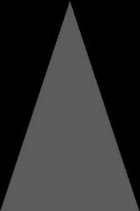

*图 7-7. 我们的第一个吸引人的三角形*

从 OpenGL ES 最佳实践的角度来看，这个示例中我们做错了几件事：

*   我们重复地、毫无必要地将相同的状态设置为相同的值。在 OpenGL ES 中，状态变更的开销很大——有些稍大，有些稍小。我们应该始终尝试减少单帧中的状态变更次数。
*   视口和投影矩阵一旦设置后就不会改变。我们可以将该代码移到 `resume()` 方法中，该方法仅在 OpenGL ES 表面被（重新）创建时调用；这也处理了 OpenGL ES 上下文丢失的问题。
*   我们也可以将设置清屏颜色和默认顶点颜色的代码移到 `resume()` 方法中。这两种颜色也不会改变。
*   我们也可以将 `glEnableClientState()` 和 `glVertexPointer()` 方法移到 `resume()` 方法中。
*   每帧我们只需要调用 `glClear()` 和 `glDrawArrays()`。只要我们不更改它们，并且不因 Activity 被暂停和恢复而丢失上下文，它们将维持当前的 OpenGL ES 状态。

如果我们实施了这些优化，主循环中只会剩下少数几个 OpenGL ES 调用。为了清晰起见，我们暂时不采用这种最小化状态变更的优化。然而，当我们开始编写第一个 OpenGL ES 游戏时，我们必须尽可能地遵循这些实践，以保证良好的性能。

现在，让我们为三角形的顶点添加更多属性，先从颜色开始。

**注意：** 非常非常细心的读者可能已经注意到，图 7-7 中的三角形实际上在右下角缺少了一个像素。这看起来像是一个典型的“差一错误”，但实际上是由于 OpenGL ES 光栅化（绘制像素）三角形的方式造成的。有一种特定的三角形光栅化规则导致了这种伪影。别担心——我们主要关心的是渲染 2D 矩形（由两个三角形组成），在这种情况下，这种效果会消失。

## 指定逐顶点颜色

在前一个示例中，我们通过 `glColor4f()` 为绘制的所有顶点设置了全局默认颜色。有时我们希望有更细粒度的控制（例如，我们希望为每个顶点设置一种颜色）。OpenGL ES 为我们提供了此功能，而且使用起来非常简单。我们所要做的就是为每个顶点添加 RGBA 浮点分量，并告诉 OpenGL ES 在哪里可以找到每个顶点的颜色，这类似于我们告诉它在哪里可以找到每个顶点的位置。让我们先从为每个顶点添加颜色开始。

```
int VERTEX_SIZE = (2 + 4) * 4;
ByteBuffer byteBuffer = ByteBuffer.allocateDirect(3 * VERTEX_SIZE);
byteBuffer.order(ByteOrder.nativeOrder());
FloatBuffer vertices = byteBuffer.asFloatBuffer();
vertices.put( new float[] {   0.0f,   0.0f, 1, 0, 0, 1,
319.0f,   0.0f, 0, 1, 0, 1,
160.0f, 479.0f, 0, 0, 1, 1});
vertices.flip();
```


首先，我们需为三个顶点分配一个`ByteBuffer`。这个`ByteBuffer`应该有多大？每个顶点有两个坐标和四个（RGBA）颜色分量，因此总共是六个浮点数。每个浮点值占四个字节，所以单个顶点需要 24 字节。我们将此信息存储在`VERTEX_SIZE`中。当调用`ByteBuffer.allocateDirect()`时，只需将`VERTEX_SIZE`乘以我们想要存储在`ByteBuffer`中的顶点数量。其余部分不言自明。我们获得一个`FloatBuffer`视图来操作`ByteBuffer`，并通过`put()`将顶点数据放入`ByteBuffer`。浮点数组的每一行依次存储顶点的 x 和 y 坐标，以及 R、G、B、A 分量。

如果要渲染此内容，我们必须告诉 OpenGL ES，我们的顶点不仅包含位置，还包含颜色属性。和之前一样，我们首先调用`glEnableClientState()`：

```c
gl.glEnableClientState(GL10.GL_VERTEX_ARRAY);
gl.glEnableClientState(GL10.GL_COLOR_ARRAY);
```

既然 OpenGL ES 知道每个顶点都包含位置和颜色信息，我们必须告诉它在哪里可以找到这些信息：

```c
vertices.position(0);
gl.glVertexPointer(2, GL10.GL_FLOAT, VERTEX_SIZE, vertices);
vertices.position(2);
gl.glColorPointer(4, GL10.GL_FLOAT, VERTEX_SIZE, vertices);
```

我们从设置`FloatBuffer`（它持有我们的顶点数据）的位置为 0 开始。该位置指向缓冲区中第一个顶点的 x 坐标。接着，我们调用`glVertexPointer()`。与之前的示例唯一不同的是，我们现在还指定了顶点大小（请记住，它以字节为单位）。OpenGL ES 将从我们指定的起始位置开始读取顶点位置。对于第二个顶点位置，它会在第一个位置地址上加上`VERTEX_SIZE`字节，以此类推。

接下来，我们将缓冲区的位置设置为第一个顶点的 R 分量，并调用`glColorPointer()`，它告诉 OpenGL ES 在哪里可以找到顶点的颜色。第一个参数是每个颜色的分量数。这总是 4，因为 OpenGL ES 要求我们为每个顶点提供 R、G、B、A 分量。第二个参数指定每个分量的类型。与顶点坐标一样，我们再次使用`GL10.GL_FLOAT`来表示每个颜色分量是 0 到 1 之间的浮点数。第三个参数是顶点颜色之间的跨度（stride）。它当然与顶点位置之间的跨度相同。最后一个参数还是我们的顶点缓冲区。

由于我们在调用`glColorPointer()`之前调用了`vertices.position(2)`，OpenGL ES 知道第一个顶点的颜色可以从缓冲区的第三个浮点数开始找到。如果我们没有将缓冲区的位置设置为 2，OpenGL ES 就会从位置 0 开始读取颜色。那样会很糟糕，因为那是我们第一个顶点 x 坐标的位置。图 7-8 展示了 OpenGL ES 将从哪里读取我们的顶点属性，以及它如何为每个属性从一个顶点跳到下一个顶点。

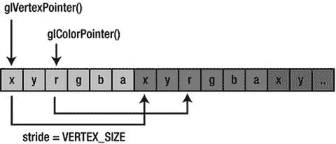

**图 7-8.** 我们的`FloatBuffer`持有顶点数据，OpenGL ES 用于读取位置/颜色的起始地址，以及用于跳到下一个位置/颜色的跨度（stride）

为了绘制三角形，我们再次调用`glDrawElements()`，它告诉 OpenGL ES 使用`FloatBuffer`中的前三个顶点来绘制一个三角形：

```c
gl.glDrawElements(GL10.GL_TRIANGLES, 0, 3);
```

由于我们启用了`GL10.GL_VERTEX_ARRAY`和`GL10.GL_COLOR_ARRAY`，OpenGL ES 知道它应该使用由`glVertexPointer()`和`glColorPointer()`指定的属性。它将忽略默认颜色，因为我们提供了自己的逐顶点颜色。

> **注意**：我们刚刚指定顶点位置和颜色的方式称为**交错（interleaving）**。这意味着我们将一个顶点的所有属性打包在一个连续的内存块中。还有另一种实现方式：非交错顶点数组。我们可以使用两个`FloatBuffer`，一个用于位置，一个用于颜色。但是，由于内存局部性，交错方式性能更好，因此我们不会在此讨论非交错顶点数组。

将所有内容整合到一个新的`GLGame`和`Screen`实现中应该很容易。清单 7-6 展示了文件`ColoredTriangleTest.java`的摘录。我们省略了模板代码。

```java
class ColoredTriangleScreen extends Screen {
    final int VERTEX_SIZE = (2 + 4) * 4;
    GLGraphics glGraphics;
    FloatBuffer vertices;

    public ColoredTriangleScreen(Game game) {
        super(game);
        glGraphics = ((GLGame) game).getGLGraphics();
        ByteBuffer byteBuffer = ByteBuffer.allocateDirect(3 * VERTEX_SIZE);
        byteBuffer.order(ByteOrder.nativeOrder());
        vertices = byteBuffer.asFloatBuffer();
        vertices.put( new float[] {   0.0f,   0.0f, 1, 0, 0, 1,
                                     319.0f,   0.0f, 0, 1, 0, 1,
                                     160.0f, 479.0f, 0, 0, 1, 1});
        vertices.flip();
    }

    @Override
    public void present(float deltaTime) {
        GL10 gl = glGraphics.getGL();
        gl.glViewport(0, 0, glGraphics.getWidth(), glGraphics.getHeight());
        gl.glClear(GL10.GL_COLOR_BUFFER_BIT);
        gl.glMatrixMode(GL10.GL_PROJECTION);
        gl.glLoadIdentity();
        gl.glOrthof(0, 320, 0, 480, 1, -1);
        gl.glEnableClientState(GL10.GL_VERTEX_ARRAY);
        gl.glEnableClientState(GL10.GL_COLOR_ARRAY);
        vertices.position(0);
        gl.glVertexPointer(2, GL10.GL_FLOAT, VERTEX_SIZE, vertices);
        vertices.position(2);
        gl.glColorPointer(4, GL10.GL_FLOAT, VERTEX_SIZE, vertices);
        gl.glDrawArrays(GL10.GL_TRIANGLES, 0, 3);
    }
}
```

**清单 7-6.** `ColoredTriangleTest.java` 摘录：交错存储位置和颜色属性

酷——看起来仍然很简单。与之前的示例相比，我们只需在`FloatBuffer`中为每个顶点添加了四个颜色分量，并启用了`GL10.GL_COLOR_ARRAY`。最好的地方在于，我们在后续示例中添加的任何其他顶点属性都将以相同的方式工作。我们只需告诉 OpenGL ES 不要使用该特定属性的默认值；相反，我们告诉它在我们的`FloatBuffer`中查找属性，从特定位置开始，并按`VERTEX_SIZE`字节从一个顶点移动到下一个顶点。

现在，我们也可以关闭`GL10.GL_COLOR_ARRAY`，以便 OpenGL ES 再次使用默认的顶点颜色，我们可以像之前一样通过`glColor4f()`指定。为此，我们可以调用：

```c
gl.glDisableClientState(GL10.GL_COLOR_ARRAY);
```

OpenGL ES 将关闭从`FloatBuffer`读取颜色的功能。如果我们已经通过`glColorPointer()`设置了颜色指针，即使我们刚告诉 OpenGL ES 不要使用它，OpenGL ES 也会记住该指针。

为了完善这个示例，让我们看看前面程序的输出。图 7-9 显示了一个屏幕截图。

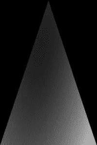

**图 7-9.** 逐顶点颜色三角形

哇，这真是太棒了！我们没有对 OpenGL ES 将如何使用我们指定的三种颜色（左下角顶点为红色，右下角顶点为绿色，顶部顶点为蓝色）做过任何假设。结果表明，它会在顶点之间为我们插值颜色。有了这个，我们可以轻松创建漂亮的渐变；然而，仅靠颜色并不能让我们长期满足。我们想要用 OpenGL ES 绘制图像。这就是纹理映射发挥作用的地方。

## 纹理映射：让壁纸变得简单


在编写《贪吃蛇先生》时，我们加载了一些位图，并直接将它们绘制到帧缓冲上——无需旋转，仅需少量缩放，实现起来相当简单。在 OpenGL ES 中，我们主要关注三角形，这些三角形可以具有我们想要的任意朝向或缩放比例。那么，我们该如何用 OpenGL ES 渲染位图呢？很简单——只需将位图加载到 OpenGL ES（为此，也需要加载到拥有独立专用 RAM 的 GPU），然后为每个三角形的顶点添加一个新属性，并告诉 OpenGL ES 渲染三角形并将位图（在 OpenGL ES 术语中也称为纹理）应用到三角形上。让我们先来看看这些新顶点属性实际上指定了什么。

## 纹理坐标

为了将位图映射到三角形，我们需要为三角形的每个顶点添加纹理坐标。什么是纹理坐标？它指定了纹理（我们上传的位图）中的某个点，该点将被映射到三角形的一个顶点。纹理坐标通常是二维的。

虽然我们将位置坐标称为 `x`、`y` 和 `z`，但纹理坐标通常被称为 `u` 和 `v` 或 `s` 和 `t`，这取决于你所属的图形程序员圈子。OpenGL ES 将它们称为 `s` 和 `t`，因此我们将沿用这个命名。如果你在网上看到的资料使用 `u`/`v` 命名法，请不要混淆：它们与 `s` 和 `t` 是相同的。这个坐标系是什么样的？图 7-10 展示了鲍勃在我们将其上传到 OpenGL ES 后，在纹理坐标系中的情况。

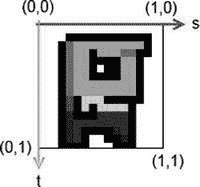

**图 7-10.** 鲍勃，上传到 OpenGL ES 后，在纹理坐标系中显示

这里有一些有趣的地方。首先，`s` 相当于标准坐标系中的 `x` 坐标，而 `t` 相当于 `y` 坐标。`s` 轴指向右方，`t` 轴指向下方。坐标系的原点与鲍勃图片的左上角重合。图片的右下角映射到 `(1,1)`。

那么，像素坐标去哪里了呢？事实证明 OpenGL ES 并不太喜欢它们。相反，我们上传的任何图像，无论其像素宽度和高度是多少，都会被嵌入到这个坐标系中。图片的左上角始终位于 `(0,0)`，右下角始终位于 `(1,1)`——即使，比如说，宽度是高度的两倍。我们称这些坐标为归一化坐标，它们有时确实能让我们的工作更轻松。现在，我们如何将鲍勃映射到我们的三角形上呢？很简单，我们只需为三角形的每个顶点指定一对在鲍勃坐标系中的纹理坐标。图 7-11 展示了几个配置。

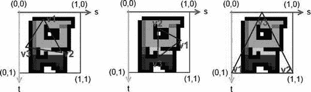

**图 7-11.** 映射到鲍勃的三个不同三角形；标签 `v1`、`v2` 和 `v3` 各自指定三角形的一个顶点。

我们可以随心所欲地将三角形的顶点映射到纹理坐标系。请注意，三角形在位置坐标系中的朝向不必与其在纹理坐标系中的朝向相同。这两个坐标系是完全解耦的。那么，让我们看看如何将这些纹理坐标添加到我们的顶点中：

```
int VERTEX_SIZE = (2 + 2) * 4;
ByteBuffer byteBuffer = ByteBuffer.allocateDirect(3 * VERTEX_SIZE);
byteBuffer.order(ByteOrder.nativeOrder());
vertices = byteBuffer.asFloatBuffer();
vertices.put( new float[] {    0.0f,   0.0f, 0.0f, 1.0f,
319.0f,   0.0f, 1.0f, 1.0f,
160.0f, 479.0f, 0.5f, 0.0f});
vertices.flip();
```

这很简单。我们只需确保缓冲区有足够的空间，然后为每个顶点追加纹理坐标即可。上面的代码对应于图 7-10 中最右侧的映射。请注意，我们的顶点位置仍然是在我们通过投影定义的常用坐标系中给出的。如果我们愿意，我们还可以像上一个示例那样，为每个顶点添加颜色属性。然后，OpenGL ES 会即时混合插值后的顶点颜色与三角形映射到的纹理像素颜色。当然，我们需要相应地调整缓冲区的大小以及 `VERTEX_SIZE` 常量；例如，`(2 + 4 + 2) × 4`。为了告诉 OpenGL ES 我们的顶点具有纹理坐标，我们再次使用 `glEnableClientState()` 和 `glTexCoordPointer()` 方法，其行为与 `glVertexPointer()` 和 `glColorPointer()` 完全相同（你能看出这里的模式吗？）：

```
gl.glEnableClientState(GL10.GL_VERTEX_ARRAY);
gl.glEnableClientState(GL10.GL_TEXTURE_COORD_ARRAY);
vertices.position(0);
gl.glVertexPointer(2, GL10.GL_FLOAT, VERTEX_SIZE, vertices);
vertices.position(2);
gl.glTexCoordPointer(2, GL10.GL_FLOAT, VERTEX_SIZE, vertices);
```

不错——这看起来非常熟悉。那么，剩下的问题是，我们如何将纹理上传到 OpenGL ES 并告诉它将纹理映射到我们的三角形上？自然，这会稍微复杂一些。但别担心——这仍然相当简单。

#### 上传位图

首先，我们必须加载位图。我们已经知道如何在 Android 上执行此操作：

```
Bitmap bitmap = BitmapFactory.decodeStream(game.getFileIO().readAsset("bobrgb888.png"));
```

在这里，我们以 RGB888 配置加载鲍勃。接下来要做的事情是告诉 OpenGL ES 我们要创建一个新纹理。OpenGL ES 对某些对象（如纹理）有对象的概念。要创建一个纹理对象，我们可以调用以下方法：

```
GL10.glGenTextures(int numTextures, int[] ids, int offset)
```

第一个参数指定了我们想要创建的纹理对象数量。通常，我们只需要创建一个。下一个参数是一个 `int` 数组，OpenGL ES 会将生成的纹理对象的 ID 写入其中。最后一个参数告诉 OpenGL ES 应该从数组的哪个位置开始写入 ID。

你已经了解到 OpenGL ES 是一个 C 语言 API。自然，它不能为新纹理返回一个 Java 对象；相反，它会给该纹理一个 ID 或句柄。每当我们希望 OpenGL ES 对该特定纹理执行操作时，我们都会指定其 ID。因此，这是一个更完整的代码片段，展示了如何生成单个新纹理对象并获取其 ID：

```
int textureIds[] = new int[1];
gl.glGenTextures(1, textureIds, 0);
int textureId = textureIds[0];
```

纹理对象仍然是空的，这意味着它还没有任何图像数据。让我们上传位图。为此，我们首先必须绑定纹理。在 OpenGL ES 中绑定某物意味着我们希望 OpenGL ES 在此后所有调用中都使用该特定对象，直到我们再次更改绑定。在这里，我们想绑定一个纹理对象，可以使用 `glBindTexture()` 方法。一旦我们绑定了纹理，就可以操作其属性，例如图像数据。以下是我们如何将鲍勃上传到新纹理对象的方法：

```
gl.glBindTexture(GL10.GL_TEXTURE_2D, textureId);
GLUtils.texImage2D(GL10.GL_TEXTURE_2D, 0, bitmap, 0);
```

首先，我们使用 `glBindTexture()` 绑定纹理对象。第一个参数指定我们要绑定的纹理类型。我们的鲍勃图像是 2D 的，因此我们使用 `GL10.GL_TEXTURE_2D`。还有其他纹理类型，但本书中我们不需要用到它们。对于需要知道我们想要使用的纹理类型的方法，我们总是会指定 `GL10.GL_TEXTURE_2D`。该方法的第二个参数是我们的纹理 ID。一旦该方法返回，后续所有使用 2D 纹理的方法都将针对我们的纹理对象进行操作。


下一个方法调用的是 `GLUtils` 类的一个方法，该类由 Android 框架提供。通常，上传纹理图像的任务相当复杂；而这个实用小类大大减轻了我们的负担。我们只需要指定纹理类型（`GL10.GL_TEXTURE_2D`）、mipmapping 级别（我们将在第 11 章讨论；默认为 0）、要上传的 bitmap，以及另一个参数（在所有情况下都必须设置为 0）。此调用之后，我们的纹理对象就附带了图像数据。

注意

纹理对象及其图像数据实际上存储在视频 RAM 中，而不是我们通常的 RAM 中。当 OpenGL ES 上下文被销毁时（例如，当我们的 activity 暂停并恢复时），纹理对象（以及图像数据）将丢失。这意味着每次 OpenGL ES 上下文被（重新）创建时，我们都必须重新创建纹理对象并重新上传图像数据。如果不这样做，我们只能看到一个白色的三角形。

纹理过滤

在使用纹理对象之前，我们还需要定义最后一件事。这与我们的三角形在屏幕上占用的像素可能多于或少于纹理映射区域中的像素有关。例如，图 7-10 中 Bob 的图像大小为 128×128 像素。我们的三角形映射到该图像的一半，因此它使用纹理中的 (128×128) / 2 个像素（也称为 texels）。当我们使用前面代码片段中定义的坐标将三角形绘制到屏幕时，它将占用 (320×480) / 2 个像素。这意味着屏幕上使用的像素比从纹理映射中获取的像素要多得多。当然，也可能反过来：屏幕上使用的像素比纹理映射区域中的像素少。第一种情况称为放大，第二种情况称为缩小。对于每种情况，我们需要告诉 OpenGL ES 应该如何对纹理进行上采样或下采样。在 OpenGL ES 术语中，上采样和下采样也称为缩小过滤器和放大过滤器。这些过滤器是纹理对象的属性，很像图像数据本身。要设置它们，我们首先必须确保通过调用 `glBindTexture()` 来绑定纹理对象。如果是这样，我们可以像这样设置它们：

```
gl.glTexParameterf(GL10.GL_TEXTURE_2D, GL10.GL_TEXTURE_MIN_FILTER, GL10.GL_NEAREST);
gl.glTexParameterf(GL10.GL_TEXTURE_2D, GL10.GL_TEXTURE_MAG_FILTER, GL10.GL_NEAREST);
```

在每种情况下，我们都使用 `GL10.glTexParameterf()` 方法来设置纹理的属性。在第一个调用中，我们指定了缩小过滤器；在第二个调用中，我们指定了放大过滤器。该方法的第一个参数是纹理类型，默认为 `GL10.GL_TEXTURE_2D`。第二个参数告诉方法我们要设置哪个属性——在我们的例子中，是 `GL10.GL_TEXTURE_MIN_FILTER` 和 `GL10.GL_TEXTURE_MAG_FILTER`。最后一个参数指定了要使用的过滤器类型。我们有两个选项：`GL10.GL_NEAREST` 和 `GL10.GL_LINEAR`。

第一种过滤器类型总是选择纹理映射中最近的 texel 映射到像素。第二种过滤器类型会为三角形的一个像素采样最近的四个 texel，并计算它们的平均值以获得最终颜色。如果我们想要像素化的外观，则使用第一种过滤器；如果我们想要平滑的外观，则使用第二种过滤器。图 7-12 显示了这两种过滤器类型的区别。

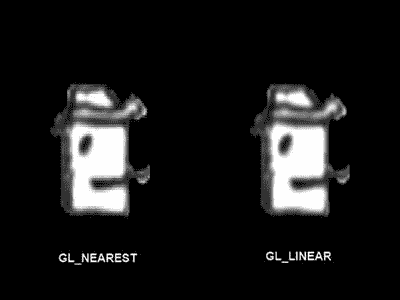

图 7-12.

`GL10.GL_NEAREST` 与 `GL10.GL_LINEAR`。第一种过滤器类型产生像素化的外观；第二种过滤器类型使图像稍微平滑一些。

我们的纹理对象现在完全定义了：我们创建了一个 ID，设置了图像数据，并指定了在渲染不是像素完美时使用的过滤器。一旦我们完成定义，通常的做法是解绑纹理。我们还应该回收加载的 bitmap，因为我们不再需要它。（为什么要浪费内存？）这可以通过以下代码片段实现：

```
gl.glBindTexture(GL10.GL_TEXTURE_2D, 0);
bitmap.recycle();
```

这里，`0` 是一个特殊的 ID，它告诉 OpenGL ES 应该解绑当前绑定的对象。如果我们想使用纹理来绘制三角形，我们当然需要再次绑定它。

处置纹理

了解如何在不再需要纹理对象时从视频 RAM 中删除它（就像我们使用 `Bitmap.recycle()` 来释放 bitmap 的内存一样）也很有用。这可以通过以下代码片段实现：

```
gl.glBindTexture(GL10.GL_TEXTURE_2D, 0);
int textureIds = { textureid };
gl.glDeleteTextures(1, textureIds, 0);
```

注意，在删除纹理对象之前，我们首先必须确保该纹理对象当前未被绑定。其余部分类似于我们使用 `glGenTextures()` 创建纹理对象的方式。

一个有用的代码片段

供您参考，以下是在 Android 上创建纹理对象、加载图像数据和设置过滤器的完整代码片段：

```
Bitmap bitmap = BitmapFactory.decodeStream(game.getFileIO().readAsset("bobrgb888.png"));
int textureIds[] = new int[1];
gl.glGenTextures(1, textureIds, 0);
int textureId = textureIds[0];
gl.glBindTexture(GL10.GL_TEXTURE_2D, textureId);
GLUtils.texImage2D(GL10.GL_TEXTURE_2D, 0, bitmap, 0);
gl.glTexParameterf(GL10.GL_TEXTURE_2D, GL10.GL_TEXTURE_MIN_FILTER, GL10.GL_NEAREST);
gl.glTexParameterf(GL10.GL_TEXTURE_2D, GL10.GL_TEXTURE_MAG_FILTER, GL10.GL_NEAREST);
gl.glBindTexture(GL10.GL_TEXTURE_2D, 0);
bitmap.recycle();
```

毕竟没那么糟糕。所有这些中最重要的部分是完成后回收 bitmap；否则，我们会浪费内存。我们的图像数据安全地存储在视频 RAM 的纹理对象中（直到上下文丢失，我们需要重新加载它）。

启用纹理

在我们可以使用纹理绘制三角形之前，还有一件事需要完成。我们需要绑定纹理，并且需要告诉 OpenGL ES 它应该实际将纹理应用于我们渲染的所有三角形。是否执行纹理映射是 OpenGL ES 的另一个状态，我们可以使用以下方法启用和禁用它：

```
GL10.glEnable(GL10.GL_TEXTURE_2D);
GL10.glDisable(GL10.GL_TEXTURE_2D);
```

这些看起来有点眼熟。当我们在前面的章节中启用/禁用顶点属性时，我们使用了 `glEnableClientState()`/`glDisableClientState()`。正如我们之前指出的，这些是 OpenGL 早期阶段的遗留产物。它们没有与 `glEnable()`/`glDisable()` 合并是有原因的，但我们这里不深入探讨。请记住使用 `glEnableClientState()`/`glDisableClientState()` 来启用和禁用顶点属性，并使用 `glEnable()`/`glDisable()` 来处理 OpenGL 的任何其他状态，例如纹理化。

整合在一起

解决了这些问题，我们现在可以编写一个小示例来将所有内容整合在一起。清单 7-7 展示了 `TexturedTriangleTest.java` 源文件的摘录，仅列出了其中包含的 `TexturedTriangleScreen` 类的相关部分。


```java
class TexturedTriangleScreen extends Screen {
    final int VERTEX_SIZE = (2 + 2) * 4;
    GLGraphics glGraphics;
    FloatBuffer vertices;
    int textureId;
    public TexturedTriangleScreen(Game game) {
        super(game);
        glGraphics = ((GLGame) game).getGLGraphics();
        ByteBuffer byteBuffer = ByteBuffer.allocateDirect(3 * VERTEX_SIZE);
        byteBuffer.order(ByteOrder.nativeOrder());
        vertices = byteBuffer.asFloatBuffer();
        vertices.put( new float[] {    0.0f,   0.0f, 0.0f, 1.0f,
                319.0f,   0.0f, 1.0f, 1.0f,
                160.0f, 479.0f, 0.5f, 0.0f});
        vertices.flip();
        textureId = loadTexture("bobrgb888.png");
    }
    public int loadTexture(String fileName) {
        try {
            Bitmap bitmap = BitmapFactory.decodeStream(game.getFileIO().readAsset(fileName));
            GL10 gl = glGraphics.getGL();
            int textureIds[] = new int[1];
            gl.glGenTextures(1, textureIds, 0);
            int textureId = textureIds[0];
            gl.glBindTexture(GL10.GL_TEXTURE_2D, textureId);
            GLUtils.texImage2D(GL10.GL_TEXTURE_2D, 0, bitmap, 0);
            gl.glTexParameterf(GL10.GL_TEXTURE_2D, GL10.GL_TEXTURE_MIN_FILTER, GL10.GL_NEAREST);
            gl.glTexParameterf(GL10.GL_TEXTURE_2D, GL10.GL_TEXTURE_MAG_FILTER, GL10.GL_NEAREST);
            gl.glBindTexture(GL10.GL_TEXTURE_2D, 0);
            bitmap.recycle();
            return textureId;
        } catch(IOException e) {
            Log.d("TexturedTriangleTest", "couldn't load asset 'bobrgb888.png'!");
            throw new RuntimeException("couldn't load asset '" + fileName + "'");
        }
    }
    @Override
    public void present(float deltaTime) {
        GL10 gl = glGraphics.getGL();
        gl.glViewport(0, 0, glGraphics.getWidth(), glGraphics.getHeight());
        gl.glClear(GL10.GL_COLOR_BUFFER_BIT);
        gl.glMatrixMode(GL10.GL_PROJECTION);
        gl.glLoadIdentity();
        gl.glOrthof(0, 320, 0, 480, 1, -1);
        gl.glEnable(GL10.GL_TEXTURE_2D);
        gl.glBindTexture(GL10.GL_TEXTURE_2D, textureId);
        gl.glEnableClientState(GL10.GL_VERTEX_ARRAY);
        gl.glEnableClientState(GL10.GL_TEXTURE_COORD_ARRAY);
        vertices.position(0);
        gl.glVertexPointer(2, GL10.GL_FLOAT, VERTEX_SIZE, vertices);
        vertices.position(2);
        gl.glTexCoordPointer(2, GL10.GL_FLOAT, VERTEX_SIZE, vertices);
        gl.glDrawArrays(GL10.GL_TRIANGLES, 0, 3);
    }
}
```
*清单 7-7. TexturedTriangleTest.java 节选：为三角形添加纹理*

我们自行将纹理加载功能封装到一个名为 `loadTexture()` 的方法中，该方法只需传入待加载位图的文件名。该方法会返回 OpenGL ES 生成的纹理对象 ID，我们将在 `present()` 方法中使用该 ID 来绑定纹理。

三角形的定义与之前无异，只是为每个顶点添加了纹理坐标。

`present()` 方法一如既往地执行常规操作：清空屏幕并设置投影矩阵。接着，我们通过调用 `glEnable()` 启用纹理映射，并绑定纹理对象。其余操作与之前完全一致：启用所需顶点属性；告知 OpenGL ES 属性数据的位置及步长；最后，通过调用 `glDrawArrays()` 绘制三角形。图 7-13 展示了上述代码的输出结果。

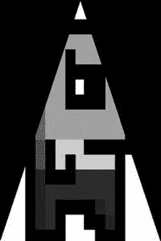

*图 7-13. 将 Bob 纹理映射到三角形上*

还有一点至关重要但尚未提及：我们加载的所有位图，其宽度和高度必须为 2 的幂次方。务必遵循此原则，否则程序将崩溃。

这具体意味着什么？示例中使用的 Bob 图像尺寸为 128×128 像素。128 是 2 的 7 次方（2×2×2×2×2×2×2）。其他有效图像尺寸包括 2×8、32×16、128×256 等。图像大小也存在上限，但具体限制取决于应用程序运行的硬件环境。OpenGL ES 1.x 标准并未规定最低支持的纹理尺寸。不过根据经验，512×512 像素的纹理可在目前所有 Android 设备上正常运行（未来设备也很可能支持）。甚至可以说 1024×1024 也是可行的。

另一个我们之前基本忽略的问题是纹理的色深。幸运的是，我们用于将图像数据上传至 GPU 的 `GLUtils.texImage2D()` 方法能很好地处理这个问题。OpenGL ES 支持 RGBA8888、RGB565 等多种色深格式。我们应始终追求使用最低色深以减少带宽占用。例如，可以像前几章那样利用 `BitmapFactory.Options` 类，将 RGB888 格式的 `Bitmap` 在内存中转换为 RGB565 格式。一旦加载了所需色深的 `Bitmap` 实例，`GLUtils.texImage2D()` 会自动确保 OpenGL ES 以正确格式接收图像数据。当然，你仍应检查色深降低是否会对游戏画面保真度产生负面影响。

## 纹理类

为简化后续示例的代码，我们编写了一个名为 `Texture` 的小型辅助类。该类可从资源中加载位图并创建纹理对象，同时提供一些便捷方法用于绑定和释放纹理。清单 7-8 展示了其代码。

```java
package com.badlogic.androidgames.framework.gl;
import java.io.IOException;
import java.io.InputStream;
import javax.microedition.khronos.opengles.GL10;
import android.graphics.Bitmap;
import android.graphics.BitmapFactory;
import android.opengl.GLUtils;
import com.badlogic.androidgames.framework.FileIO;
import com.badlogic.androidgames.framework.impl.GLGame;
import com.badlogic.androidgames.framework.impl.GLGraphics;
public class Texture {
    GLGraphics glGraphics;
    FileIO fileIO;
    String fileName;
    int textureId;
    int minFilter;
    int magFilter;
    int width;
    int height;
    public Texture(GLGame glGame, String fileName) {
        this.glGraphics = glGame.getGLGraphics();
        this.fileIO = glGame.getFileIO();
        this.fileName = fileName;
        load();
    }
    private void load() {
        GL10 gl = glGraphics.getGL();
        int[] textureIds = new int[1];
        gl.glGenTextures(1, textureIds, 0);
        textureId = textureIds[0];
        InputStream in = null;
        try {
            in = fileIO.readAsset(fileName);
            Bitmap bitmap = BitmapFactory.decodeStream(in);
            width = bitmap.getWidth();
            height = bitmap.getHeight();
            gl.glBindTexture(GL10.GL_TEXTURE_2D, textureId);
            GLUtils.texImage2D(GL10.GL_TEXTURE_2D, 0, bitmap, 0);
            setFilters(GL10.GL_NEAREST, GL10.GL_NEAREST);
            gl.glBindTexture(GL10.GL_TEXTURE_2D, 0);
        } catch(IOException e) {
            throw new RuntimeException("Couldn't load texture '" + fileName +"'", e);
        } finally {
            if(in != null)
                try { in.close(); } catch (IOException e) { }
        }
    }
    public void reload() {
        load();
        bind();
        setFilters(minFilter, magFilter);
        glGraphics.getGL().glBindTexture(GL10.GL_TEXTURE_2D, 0);
    }
    public void setFilters(int minFilter, int magFilter) {
        this.minFilter = minFilter;
        this.magFilter = magFilter;
        GL10 gl = glGraphics.getGL();
        gl.glTexParameterf(GL10.GL_TEXTURE_2D, GL10.GL_TEXTURE_MIN_FILTER, minFilter);
        gl.glTexParameterf(GL10.GL_TEXTURE_2D, GL10.GL_TEXTURE_MAG_FILTER, magFilter);
    }
    public void bind() {
        GL10 gl = glGraphics.getGL();
        gl.glBindTexture(GL10.GL_TEXTURE_2D, textureId);
    }
    public void dispose() {
        GL10 gl = glGraphics.getGL();
        gl.glBindTexture(GL10.GL_TEXTURE_2D, textureId);
        int[] textureIds = { textureId };
        gl.glDeleteTextures(1, textureIds, 0);
    }
}
```
*清单 7-8. Texture.java：一个小型 OpenGL ES 纹理类*

此类唯一值得关注的是 `reload()` 方法，它可在 OpenGL ES 上下文丢失时调用。另请注意，`setFilters()` 方法仅在纹理处于绑定状态时才能正常生效，否则它设置的是当前已绑定纹理的过滤器。

我们还可以为顶点缓冲区编写一个小辅助方法。但在此之前，必须先讨论另一个话题：索引顶点。

## 索引顶点：复用对你有利
```


## 处理后的 Markdown 文本

在本章的前面部分，我们将计算顶点的数学逻辑放在了`GLGraphics`类中。到目前为止，我们一直定义的是三角形列表，其中每个三角形都拥有一组独立的顶点。实际上，我们之前只绘制过单个三角形，但增加更多三角形也并非难事。

然而，在某些情况下，两个或多个三角形可以共享部分顶点。让我们思考一下，如何用当前的知识渲染一个矩形。很简单，我们会定义两个三角形，它们有两个顶点在位置、颜色和纹理坐标上完全相同。我们可以做得更好。图 7-14 展示了矩形渲染的旧方法和新方法。

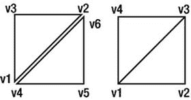

**图 7-14.** 用六个顶点将矩形渲染为两个三角形（左图），以及用四个顶点渲染矩形（右图）

我们不再将顶点`v1`和`v2`与顶点`v4`和`v6`重复定义，而是将这些顶点只定义一次。在本例中，我们仍然渲染两个三角形，但通过顶点数组中的索引，明确告诉 OpenGL ES 每个三角形应使用哪些顶点（即，第一个三角形使用`v1`、`v2`和`v3`，第二个三角形使用`v3`、`v4`和`v1`）。数组中第一个顶点的索引为 0，第二个顶点的索引为 1，以此类推。对于上述矩形，我们的索引列表如下：

```
short[] indices = { 0, 1, 2,
2, 3, 0  };
```

顺便提一下，OpenGL ES 要求我们以 short 类型指定索引（这并不完全准确；我们也可以使用 byte 类型）。但是，与顶点数据一样，我们不能直接将 short 数组传递给 OpenGL ES。它需要一个直接的 `ShortBuffer`。我们已经知道如何处理：

```
ByteBuffer byteBuffer = ByteBuffer.allocate(indices.length * 2);
byteBuffer.order(ByteOrder.nativeOrder());
ShortBuffer shortBuffer = byteBuffer.asShortBuffer();
shortBuffer.put(indices);
shortBuffer.flip();
```

一个 short 需要两个字节的内存，因此我们为 `ShortBuffer` 分配 `indices.length * 2` 个字节。我们再次将字节序设置为本机顺序，并获取一个 `ShortBuffer` 视图，以便更轻松地处理底层的 `ByteBuffer`。剩下的工作就是将我们的索引放入 `ShortBuffer` 并调用 flip() 方法，以便正确设置限制和位置。

如果我们想将 Bob 绘制为带有两个索引三角形的矩形，可以像这样定义顶点：

```
ByteBuffer byteBuffer = ByteBuffer.allocateDirect(4 * VERTEX_SIZE);
byteBuffer.order(ByteOrder.nativeOrder());
vertices = byteBuffer.asFloatBuffer();
vertices.put(new float[] {  100.0f, 100.0f, 0.0f, 1.0f,
228.0f, 100.0f, 1.0f, 1.0f,
228.0f, 229.0f, 1.0f, 0.0f,
100.0f, 228.0f, 0.0f, 0.0f });
vertices.flip();
```

顶点的顺序与图 7-14 右侧完全一致。我们通过通常调用的 `glEnableClientState()`、`glVertexPointer()` / `glTexCoordPointer()` 方法，告诉 OpenGL ES 我们为顶点提供位置和纹理坐标，以及在哪里可以找到这些顶点属性。唯一的不同在于我们绘制两个三角形时调用的方法：

```
gl.glDrawElements(GL10.GL_TRIANGLES, 6, GL10.GL_UNSIGNED_SHORT, indices);
```

这个方法实际上与 `glDrawArrays()` 非常相似。第一个参数指定了我们要渲染的图元类型——在本例中是一个三角形列表。下一个参数指定了我们要使用的顶点数量，这里等于 6。第三个参数指定了索引的类型——我们指定为无符号 short。请注意，Java 没有无符号类型；然而，鉴于有符号数的一补码编码方式，使用一个实际包含有符号 short 的 `ShortBuffer` 是可行的。最后一个参数是我们的 `ShortBuffer`，其中包含六个索引。

那么，OpenGL ES 会做什么？它知道我们要渲染三角形，并且根据我们指定的六个顶点，知道我们要渲染两个三角形；但是，OpenGL ES 并不是从顶点数组中顺序读取六个顶点，而是顺序遍历索引缓冲区，并使用其索引到的顶点。

## 整合起来

将所有内容整合在一起，我们得到了清单 7-9 中的代码。

```
class IndexedScreen extends Screen {
final int VERTEX_SIZE = (2 + 2) * 4;
GLGraphics glGraphics;
FloatBuffer vertices;
ShortBuffer indices;
Texture texture;
public IndexedScreen(Game game) {
super(game);
glGraphics = ((GLGame) game).getGLGraphics();
ByteBuffer byteBuffer = ByteBuffer.allocateDirect(4 * VERTEX_SIZE);
byteBuffer.order(ByteOrder.nativeOrder());
vertices = byteBuffer.asFloatBuffer();
vertices.put(new float[] {  100.0f, 100.0f, 0.0f, 1.0f,
228.0f, 100.0f, 1.0f, 1.0f,
228.0f, 228.0f, 1.0f, 0.0f,
100.0f, 228.0f, 0.0f, 0.0f });
vertices.flip();
byteBuffer = ByteBuffer.allocateDirect(6 * 2);
byteBuffer.order(ByteOrder.nativeOrder());
indices = byteBuffer.asShortBuffer();
indices.put(new short[] { 0, 1, 2,
2, 3, 0 });
indices.flip();
texture = new Texture((GLGame)game, "bobrgb888.png");
}
@Override
public void present(float deltaTime) {
GL10 gl = glGraphics.getGL();
gl.glViewport(0, 0, glGraphics.getWidth(), glGraphics.getHeight());
gl.glClear(GL10.GL_COLOR_BUFFER_BIT);
gl.glMatrixMode(GL10.GL_PROJECTION);
gl.glLoadIdentity();
gl.glOrthof(0, 320, 0, 480, 1, -1);
gl.glEnable(GL10.GL_TEXTURE_2D);
texture.bind();
gl.glEnableClientState(GL10.GL_TEXTURE_COORD_ARRAY);
gl.glEnableClientState(GL10.GL_VERTEX_ARRAY);
vertices.position(0);
gl.glVertexPointer(2, GL10.GL_FLOAT, VERTEX_SIZE, vertices);
vertices.position(2);
gl.glTexCoordPointer(2, GL10.GL_FLOAT, VERTEX_SIZE, vertices);
gl.glDrawElements(GL10.GL_TRIANGLES, 6, GL10.GL_UNSIGNED_SHORT, indices);
}
清单 7-9. 摘自 IndexedTest.java：绘制两个索引三角形
```

注意我们使用了强大的 `Texture` 类，这大大减少了代码量。图 7-15 显示了输出结果，以及威风凛凛的 Bob。

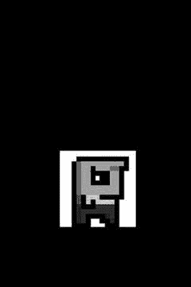

**图 7-15.** 索引绘制 Bob

现在，这已经非常接近我们使用 `Canvas` 的方式了。我们也有了更大的灵活性，因为我们不再受限于轴对齐的矩形。

这个例子涵盖了目前关于顶点我们需要了解的所有内容。我们看到每个顶点必须至少有一个位置，并且可以拥有其他属性，例如颜色（以四个 RGBA 浮点值给出）和纹理坐标。我们还看到，如果我们想避免重复，可以通过索引来重用顶点。这能带来一点性能提升，因为 OpenGL ES 不必将超过绝对必要数量的顶点与投影矩阵和模型视图矩阵相乘（再次说明，这并不完全准确，但我们暂且这样理解）。

## 一个 Vertices 类

让我们创建一个 `Vertices` 类，它能够容纳最大数量的顶点，并可选择性地包含用于渲染的索引，从而使代码更易于编写。该类还应负责启用渲染所需的所有状态，并在渲染完成后清理这些状态，以便其他代码可以依赖一组干净的 OpenGL ES 状态。清单 7-10 展示了易于使用的 `Vertices` 类。

```
package com.badlogic.androidgames.framework.gl;
import java.nio.ByteBuffer;
import java.nio.ByteOrder;
import java.nio.FloatBuffer;
import java.nio.ShortBuffer;
import javax.microedition.khronos.opengles.GL10;
import com.badlogic.androidgames.framework.impl.GLGraphics;
public class Vertices {
final GLGraphics glGraphics;
final boolean hasColor;
final boolean hasTexCoords;
final int vertexSize;
final FloatBuffer vertices;
final ShortBuffer indices;
清单 7-10. Vertices.java：封装（索引）顶点
```


`Vertices`类有一个对`GLGraphics`实例的引用，因此我们可以在需要时获取`GL10`实例。我们还存储了顶点是否具有颜色和纹理坐标。这给了我们很大的灵活性，因为我们可以选择渲染所需的最小属性集。此外，我们存储一个持有顶点的`FloatBuffer`和一个持有可选索引的`ShortBuffer`。

```
public Vertices(GLGraphics glGraphics, int maxVertices, int maxIndices, boolean hasColor, boolean hasTexCoords) {
this.glGraphics = glGraphics;
this.hasColor = hasColor;
this.hasTexCoords = hasTexCoords;
this.vertexSize = (2 + (hasColor?4:0) + (hasTexCoords?2:0)) * 4;
ByteBuffer buffer = ByteBuffer.allocateDirect(maxVertices * vertexSize);
buffer.order(ByteOrder.nativeOrder());
vertices = buffer.asFloatBuffer();
if(maxIndices > 0) {
buffer = ByteBuffer.allocateDirect(maxIndices * Short.SIZE / 8);
buffer.order(ByteOrder.nativeOrder());
indices = buffer.asShortBuffer();
} else {
indices = null;
}
}
```

在构造函数中，我们指定了`Vertices`实例最多能容纳多少个顶点和索引，以及顶点是否包含颜色或纹理坐标。在构造函数内部，我们相应地设置成员变量并实例化缓冲区。注意，如果`maxIndices`为 0，则`ShortBuffer`将被设置为`null`。在这种情况下，我们的渲染将是非索引的。

```
public void setVertices(float[] vertices, int offset, int length) {
this.vertices.clear();
this.vertices.put(vertices, offset, length);
this.vertices.flip();
}
public void setIndices(short[] indices, int offset, int length) {
this.indices.clear();
this.indices.put(indices, offset, length);
this.indices.flip();
}
```

接下来是`setVertices()`和`setIndices()`方法。如果`Vertices`实例没有存储索引，后者将抛出`NullPointerException`。我们所做的只是清除缓冲区并复制数组的内容。

```
public void draw(int primitiveType, int offset, int numVertices) {
GL10 gl = glGraphics.getGL();
gl.glEnableClientState(GL10.GL_VERTEX_ARRAY);
vertices.position(0);
gl.glVertexPointer(2, GL10.GL_FLOAT, vertexSize, vertices);
if(hasColor) {
gl.glEnableClientState(GL10.GL_COLOR_ARRAY);
vertices.position(2);
gl.glColorPointer(4, GL10.GL_FLOAT, vertexSize, vertices);
}
if(hasTexCoords) {
gl.glEnableClientState(GL10.GL_TEXTURE_COORD_ARRAY);
vertices.position(hasColor?6:2);
gl.glTexCoordPointer(2, GL10.GL_FLOAT, vertexSize, vertices);
}
if(indices!=null) {
indices.position(offset);
gl.glDrawElements(primitiveType, numVertices, GL10.GL_UNSIGNED_SHORT, indices);
} else {
gl.glDrawArrays(primitiveType, offset, numVertices);
}
if(hasTexCoords)
gl.glDisableClientState(GL10.GL_TEXTURE_COORD_ARRAY);
if(hasColor)
gl.glDisableClientState(GL10.GL_COLOR_ARRAY);
}
}
```

`Vertices`类的最后一个方法是`draw()`。它接受图元类型（例如`GL10.GL_TRIANGLES`）、顶点缓冲区中的偏移量（如果使用索引则是索引缓冲区中的偏移量）以及用于渲染的顶点数量。根据顶点是否包含颜色和纹理坐标，我们启用相关的 OpenGL ES 状态并告诉 OpenGL ES 数据的位置。当然，我们也对顶点位置执行相同的操作，因为这是始终必需的。根据是否使用索引，我们调用`glDrawElements()`或`glDrawArrays()`，并传入传递给该方法的参数。请注意，`offset`参数也可用于索引渲染：我们只需相应地设置索引缓冲区的`position`，使 OpenGL ES 从该偏移量开始读取索引，而不是从索引缓冲区的第一个索引开始读取。在`draw()`方法中，我们做的最后一件事是清理 OpenGL ES 状态。如果我们的顶点具有这些属性，我们会调用`glDisableClientState()`并传入`GL10.GL_COLOR_ARRAY`或`GL10.GL_TEXTURE_COORD_ARRAY`。我们需要这样做，因为另一个`Vertices`实例可能不使用这些属性。如果我们渲染那个另一个`Vertices`实例且没有清除这些状态，OpenGL ES 仍会去寻找颜色和/或纹理坐标。

我们可以用以下代码片段替换前面示例构造函数中所有繁琐的代码：

```
Vertices vertices = new Vertices(glGraphics, 4, 6, false, true);
vertices.setVertices(new float[] { 100.0f, 100.0f, 0.0f, 1.0f,
228.0f, 100.0f, 1.0f, 1.0f,
228.0f, 228.0f, 1.0f, 0.0f,
100.0f, 228.0f, 0.0f, 0.0f }, 0, 16);
vertices.setIndices(new short[] { 0, 1, 2, 2, 3, 0 }, 0, 6);
```

同样地，我们可以将所有用于设置顶点属性数组和渲染的调用替换为对以下方法的单一调用：

```
vertices.draw(GL10.GL_TRIANGLES, 0, 6);
```

结合我们的`Texture`类，我们现在为所有的 2D OpenGL ES 渲染打下了良好的基础。然而，为了完全复现我们所有的`Canvas` API 渲染能力，我们仍然缺少混合功能。让我们来看看这个。

## Alpha 混合：我能看穿你

在 OpenGL ES 中启用 Alpha 混合非常容易。我们只需要两次方法调用：

```
gl.glEnable(GL10.GL_BLEND);
gl.glBlendFunc(GL10.GL_SRC_ALPHA, GL10.GL_ONE_MINUS_SRC_ALPHA);
```

第一个方法调用应该很熟悉：它只是告诉 OpenGL ES，从此刻开始，它应该对我们渲染的所有三角形应用 Alpha 混合。第二个方法稍微复杂一些。它指定了源颜色和目标颜色应如何组合。回顾第 3 章，源颜色和目标颜色的组合方式由一个简单的混合方程控制。`glBlendFunc()`方法只是告诉 OpenGL ES 使用哪种方程。上述参数指定我们希望源颜色与目标颜色的混合方式完全符合第 3 章中指定的混合方程。这等同于`Canvas` API 混合`Bitmap`的方式。

OpenGL ES 中的混合功能非常强大且复杂，还有很多细节。然而，出于我们的目的，我们可以忽略所有这些细节，并且在我们想要将三角形与帧缓冲混合时，只需使用上述的混合函数——就像我们混合`Bitmap`与`Canvas`实例一样。

第二个问题，源颜色和目标颜色来自哪里，解释起来很容易：源颜色是我们即将绘制的三角形的颜色。目标颜色是帧缓冲区中我们将要覆盖的像素的颜色。源颜色实际上是两种颜色的组合。

*   **顶点颜色**：这是我们可以通过`glColor4f()`为所有顶点指定的颜色，或者通过为每个顶点添加颜色属性在逐顶点的基础上指定的颜色。


*   **纹素颜色**：如前所述，纹素是纹理中的一个像素。当我们的三角形渲染并映射了纹理时，OpenGL ES 会将纹素颜色与三角形每个像素的顶点颜色进行混合。

因此，如果三角形没有纹理映射，混合的源颜色就等于顶点颜色。如果三角形有纹理映射，三角形每个像素的源颜色就是顶点颜色与纹素颜色的混合。我们可以通过使用 `glTexEnv()` 方法来指定顶点颜色和纹素颜色的组合方式。默认情况下，是使用纹素颜色对顶点颜色进行调制，这基本上意味着两种颜色按分量逐一相乘（顶点 r × 纹素 r，依此类推）。对于本书中的所有用例，这正是我们所需要的，因此我们不会深入探讨 `glTexEnv()`。还有一些非常特殊的情况，你可能想要更改顶点颜色和纹素颜色的组合方式。与 `glBlendFunc()` 一样，我们将忽略细节，直接使用默认设置。

当我们加载没有 Alpha 通道的纹理图像时，OpenGL ES 会自动假定每个像素的 Alpha 值为 1。如果我们加载的是 RGBA8888 格式的图像，OpenGL ES 会很乐意使用提供的 Alpha 值进行混合。

对于顶点颜色，我们必须始终指定一个 Alpha 分量，要么使用 `glColor4f()`（其中最后一个参数是 Alpha 值），要么按每个顶点指定四个分量（同样，最后一个分量是 Alpha 值）。然后我们将该值传递给着色器。

让我们通过一个简单的示例将这点付诸实践。我们想绘制两次 Bob：第一次使用没有每个像素 Alpha 通道的 `bobrgb888.png` 图像，第二次使用包含 Alpha 信息的 `bobargb8888.png` 图像。请注意，PNG 图像实际上以 ARGB8888 格式而非 RGBA8888 格式存储像素。幸运的是，我们用于上传纹理图像数据的 `GLUtils.texImage2D()` 方法会自动为我们进行转换。列表 7-11 展示了我们使用 `Texture` 和 `Vertices` 类进行小实验的代码。

```
class BlendingScreen extends Screen {
GLGraphics glGraphics;
Vertices vertices;
Texture textureRgb;
Texture textureRgba;
public BlendingScreen(Game game) {
super(game);
glGraphics = ((GLGame)game).getGLGraphics();
textureRgb = new Texture((GLGame)game, "bobrgb888.png");
textureRgba = new Texture((GLGame)game, "bobargb8888.png");
vertices = new Vertices(glGraphics, 8, 12, true, true);
float[] rects = new float[] {
100, 100, 1, 1, 1, 0.5f, 0, 1,
228, 100, 1, 1, 1, 0.5f, 1, 1,
228, 228, 1, 1, 1, 0.5f, 1, 0,
100, 228, 1, 1, 1, 0.5f, 0, 0,
100, 300, 1, 1, 1, 1, 0, 1,
228, 300, 1, 1, 1, 1, 1, 1,
228, 428, 1, 1, 1, 1, 1, 0,
100, 428, 1, 1, 1, 1, 0, 0
};
vertices.setVertices(rects, 0, rects.length);
vertices.setIndices(new short[] {0, 1, 2, 2, 3, 0,
4, 5, 6, 6, 7, 4 }, 0, 12);
}
列表 7-11.
摘自 BlendingTest.java：混合的实际应用
```

我们的小型 `BlendingScreen` 实现持有一个 `Vertices` 实例，其中我们将存储两个矩形，以及两个 `Texture` 实例——一个保存 Bob 的 RGBA8888 图像，另一个存储 Bob 的 RGB888 版本。在构造函数中，我们从文件 `bobrgb888.png` 和 `bobargb8888.png` 加载这些纹理，并依靠 `Texture` 类和 `GLUtils.texImag2D()` 将 ARGB8888 PNG 转换为 OpenGL ES 所需的 RGBA8888。接下来，我们定义顶点和索引。第一个矩形由四个顶点组成，映射到 Bob 的 RGB888 纹理。第二个矩形映射到 Bob 的 RGBA8888 版本，并在 RGB888 Bob 矩形上方 200 个单位处渲染。请注意，第一个矩形的顶点颜色均为 (1,1,1,0.5f)，而第二个矩形的顶点颜色均为 (1,1,1,1)。

```
@Override
public void present(float deltaTime) {
GL10 gl = glGraphics.getGL();
gl.glViewport(0, 0, glGraphics.getWidth(), glGraphics.getHeight());
gl.glClearColor(1,0,0,1);
gl.glClear(GL10.GL_COLOR_BUFFER_BIT);
gl.glMatrixMode(GL10.GL_PROJECTION);
gl.glLoadIdentity();
gl.glOrthof(0, 320, 0, 480, 1, -1);
gl.glEnable(GL10.GL_BLEND);
gl.glBlendFunc(GL10.GL_SRC_ALPHA, GL10.GL_ONE_MINUS_SRC_ALPHA);
gl.glEnable(GL10.GL_TEXTURE_2D);
textureRgb.bind();
vertices.draw(GL10.GL_TRIANGLES, 0, 6 );
textureRgba.bind();
vertices.draw(GL10.GL_TRIANGLES, 6, 6 );
}
```

在我们的 `present()` 方法中，我们照常用红色清除屏幕并设置投影矩阵。接下来，我们启用 Alpha 混合并设置正确的混合方程。最后，我们启用纹理映射并渲染两个矩形。第一个矩形在绑定 RGB888 纹理的情况下渲染，第二个矩形在绑定 RGBA8888 纹理的情况下渲染。我们将两个矩形存储在同一个 `Vertices` 实例中，因此对 `vertices.draw()` 方法使用了偏移量。图 7-16 展示了这个小成果的输出。

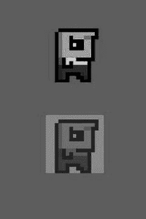

图 7-16. Bob，顶点颜色混合（底部）与纹理混合（顶部）

对于 RGB888 Bob，混合是通过每个顶点颜色中的 Alpha 值进行的。由于我们将其设置为 0.5f，Bob 是 50% 半透明的。

对于 RGBA8888 Bob，每个顶点颜色的 Alpha 值均为 1。然而，由于该纹理的背景像素 Alpha 值为 0，并且顶点颜色与纹素颜色进行了调制，因此这个 Bob 版本的背景消失了。如果我们也将每个顶点颜色的 Alpha 值设置为 0.5f，那么 Bob 本身也会变成 50% 半透明，就像屏幕底部的他的克隆体一样。图 7-17 展示了可能出现的效果。

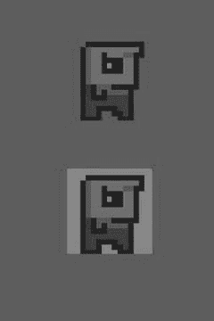

图 7-17. 使用每个顶点 Alpha 值为 0.5f 的 RGBA8888 Bob 替代版本（屏幕顶部）

基本上，这就是我们在 2D 中使用 OpenGL ES 进行混合所需了解的全部内容。

然而，还有一点非常重要的事情我们想指出：混合开销很大！说真的，不要过度使用。当前的移动 GPU 在处理大量像素混合方面并非都表现出色。只有在绝对必要时才应该使用混合。

## 更多图元：点、线、线条带和扇形

当我们告诉你 OpenGL ES 是一个庞大的、讨厌的三角形渲染机器时，我们并没有 100% 诚实。事实上，OpenGL ES 也可以渲染点和线。最重要的是，这些也是通过顶点定义的，因此前面提到的所有信息（纹理、每个顶点颜色等）也适用于它们。要渲染这些图元，我们只需在调用 `glDrawArrays()`/`glDrawElements()` 时使用 `GL10.GL_TRIANGLES` 以外的枚举即可。我们也可以对这些图元进行索引渲染，尽管这有点多余（至少对于点来说是这样）。图 7-18 显示了 OpenGL ES 提供的所有图元类型列表。

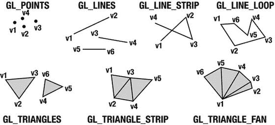

图 7-18. OpenGL ES 能渲染的所有图元

让我们快速过一遍所有这些图元：

*   **点**：对于点，每个顶点都是其自身的图元。

*   **线**：一条线由两个顶点组成。与三角形一样，我们可以用 2 × n 个顶点来定义 n 条线。

*   **线条带**：所有顶点都被解释为属于一条长线。

*   **线循环**：这类似于线条带，不同之处在于 OpenGL ES 会自动绘制一条从最后一个顶点到第一个顶点的额外线段。

*   **三角形**：这个我们已经了解。每个三角形由三个顶点组成。


*   **三角形带**：无需指定三个顶点，只需指定`三角形数量 + 1`个顶点。`OpenGL ES`会根据顶点`(v1, v2, v3)`构建第一个三角形，再根据顶点`(v2, v3, v4)`构建下一个三角形，以此类推。
*   **三角形扇**：它有一个所有三角形共享的基础顶点（`v1`）。第一个三角形为`(v1, v2, v3)`，下一个三角形为`(v1, v3, v4)`，以此类推。

三角形带和三角形扇比纯三角形列表的灵活性稍差，但它们可以带来一定的性能提升，因为需要乘以投影矩阵和模型视图矩阵的顶点更少。不过，在我们的所有代码中，我们将坚持使用三角形列表，因为它们更容易使用，并且通过使用索引可以达到类似的性能。

点和线在`OpenGL ES`中有些特殊。当我们使用像素完美的正交投影时，在某些情况下仍然无法获得像素完美的渲染。由于所谓的**菱形退出规则**，点和线顶点的位置必须偏移`0.375f`。如果你想渲染像素完美的点和线，请记住这一点。我们已经看到三角形也存在类似情况。然而，鉴于我们在 2D 中通常绘制矩形，所以我们不会遇到这个问题。

鉴于渲染除`GL10.GL_TRIANGLES`之外的图元只需使用图 7-17 中所示的其他常量之一，我们就不在此提供示例程序了。大多数情况下，我们将坚持使用三角形列表，特别是在进行 2D 图形编程时。

现在，让我们深入了解一下`OpenGL ES`提供的另一个强大功能：万能的模型视图矩阵！

## 2D 变换：玩转模型视图矩阵

到目前为止，我们只是以三角形列表的形式定义了静态几何体。没有移动、旋转或缩放。此外，即使顶点数据本身保持不变（例如，由两个三角形组成的矩形的宽度和高度以及纹理坐标和颜色都保持不变），如果我们想在多个位置绘制同一个矩形，我们仍然需要复制顶点。回顾一下清单 7-11，先忽略顶点的颜色属性。这两个矩形只是在 y 坐标上相差 200 个单位。如果我们有一种方法可以在不实际更改顶点值的情况下移动这些顶点，那么我们就可以只定义一次 Bob 的矩形，然后简单地将其绘制在不同位置——这正是使用模型视图矩阵的方法。

### 世界空间与模型空间

要理解世界空间和模型空间如何工作，我们实际上需要跳出我们那个小小的正交视景体裁剪盒来思考。我们的视景体位于一个名为**世界空间**的特殊坐标系中。这是我们所有顶点最终所在的坐标空间。

到目前为止，我们一直使用相对于这个世界空间原点的绝对坐标来指定所有顶点位置（参见图 7-5）。我们真正想要的是让我们顶点的位置定义独立于这个世界空间坐标系。我们可以通过为每个模型（例如，Bob 的矩形、一艘宇宙飞船等）提供自己的坐标系来实现这一点。这就是我们通常所说的**模型空间**——我们在其中定义模型顶点位置的坐标系。图 7-19 在 2D 中说明了这个概念，同样的规则也适用于 3D（只需添加一个 z 轴）。

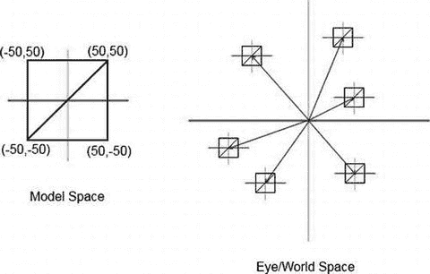

*图 7-19. 在模型空间中定义我们的模型，复用它，并在世界空间的不同位置渲染它*

在图 7-19 中，我们通过一个`Vertices`实例定义了一个模型——例如，像这样：

```
Vertices vertices = new Vertices(glGraphics, 4, 12, false, false);
vertices.setVertices(new float[] { -50, -50,
50, -50,
50,  50,
-50,  50 }, 0, 8);
vertices.setIndices(new short[] {0, 1, 2, 2, 3, 0}, 0, 6);
```

为了便于讨论，我们暂时省略任何顶点颜色或纹理坐标。现在，当我们未经任何修改直接渲染这个模型时，它将被放置在世界空间的原点附近，出现在我们的最终图像中。如果我们想在另一个位置渲染它——比如说，它的中心位于世界空间的(200,300)——我们可以像这样重新定义顶点位置：

```
vertices.setVertices(new float[] { -50 + 200, -50 + 300,
50 + 200, -50 + 300,
50 + 200,  50 + 300,
-50 + 200,  50 + 300 }, 0, 8);
```

在下一次调用`vertices.draw()`时，模型将以中心点(200,300)进行渲染，但这有点繁琐，不是吗？

### 再谈矩阵

还记得我们之前简要讨论过矩阵吗？我们讨论了矩阵如何编码变换，例如平移（移动物体）、旋转和缩放。我们用来将顶点投影到投影平面上的投影矩阵编码了一种特殊类型的变换：投影。

矩阵是更优雅地解决我们之前问题的关键。我们不需要通过重新定义来手动移动顶点位置，只需设置一个编码了平移的矩阵即可。由于`OpenGL ES`的投影矩阵已被我们通过`glOrthof()`指定的正交图形投影矩阵占用，我们使用另一个`OpenGL ES`矩阵：模型视图矩阵。以下是我们如何将模型的原点移动到眼睛/世界空间中特定位置的方法：

```
gl.glMatrixMode(GL10.GL_MODELVIEW);
gl.glLoadIdentity();
gl.glTranslatef(200, 300, 0);
vertices.draw(GL10.GL_TRIANGLES, 0, 6);
```

我们首先必须告诉`OpenGL ES`我们要操作哪个矩阵。在我们的例子中，就是模型视图矩阵，由常量`GL10.GL_MODELVIEW`指定。接下来，我们确保模型视图矩阵被设置为单位矩阵。基本上，我们只是覆盖了其中已有的任何内容——我们相当于清空了矩阵。下一步调用才是魔法发生的地方。

方法`glTranslatef()`接受三个参数：x 轴、y 轴和 z 轴上的平移量。由于我们希望模型的中心点位于眼睛/世界空间的(200,300)处，我们指定了 x 轴上平移 200 个单位，y 轴上平移 300 个单位。由于我们是在 2D 环境下工作，我们忽略 z 轴，将平移分量设置为 0。我们没有为顶点指定 z 坐标，因此它们默认为 0。0 加 0 等于 0，所以我们的顶点将保持在 x-y 平面内。

从此刻起，`OpenGL ES`的模型视图矩阵就编码了一个(200,300,0)的平移量，这个平移量将应用于所有通过`OpenGL ES`管线的顶点。如果你回头参考图 7-4，你会看到`OpenGL ES`会先将每个顶点与模型视图矩阵相乘，然后再应用投影矩阵。在此之前，模型视图矩阵被设置为单位矩阵（`OpenGL ES`的默认值）；因此它对我们的顶点没有影响。我们的小小的`glTranslatef()`调用改变了这一点，它会在顶点被投影之前先移动所有顶点。

当然，这是即时完成的；我们`Vertices`实例中的值完全没有改变。如果有任何对`Vertices`实例的永久性更改，我们早就注意到了，因为按照同样的逻辑，投影矩阵早就已经更改了它。

### 使用平移的初始示例


平移变换能用来做什么呢？假设我们想要在世界中的不同位置渲染 100 个小人。此外，我们还希望它们在屏幕上移动，并且每次碰到屏幕边缘（或者更准确地说，碰到与屏幕范围重合的平行投影视景体的平面）时改变方向。我们可以通过维护一个大的`Vertices`实例，它包含 100 个矩形（每个小人对应一个）的顶点，并每帧重新计算顶点位置来实现。更简单的方法是，只用一个小的`Vertices`实例来保存单个矩形（小人的模型），然后通过模型视图矩阵实时平移它来复用。我们来定义小人的模型：

```
Vertices bobModel = new Vertices(glGraphics, 4, 12, false, true);
bobModel.setVertices(new float[] { -16, -16, 0, 1,
16, -16, 1, 1,
16,  16, 1, 0,
-16,  16, 0, 0, }, 0, 8);
bobModel.setIndices(new short[] {0, 1, 2, 2, 3, 0}, 0, 6);
```

因此，每个小人的大小是 32×32 单位。我们还会给它贴上纹理——将使用`bobrgb888.png`来观察每个小人的边界。

## 小人成为一个类

让我们定义一个简单的`Bob`类。它将负责保存`Bob`实例的位置，并基于时间增量（delta time）沿着当前方向更新其位置，就像我们实现 Nom 先生那样（区别在于我们不再在网格中移动）。`update()`方法还将确保小人不会逃离我们的视景体边界。代码清单 7-12 展示了`Bob`类。

```
package com.badlogic.androidgames.glbasics;
import java.util.Random;
class Bob {
static final Random rand = new Random();
public float x, y;
float dirX, dirY;
public Bob() {
x = rand.nextFloat() * 320;
y = rand.nextFloat() * 480;
dirX = 50;
dirY = 50;
}
public void update(float deltaTime) {
x = x + dirX * deltaTime;
y = y + dirY * deltaTime;
if (x  320) {
dirX = -dirX;
x = 320;
}
if (y  480) {
dirY = -dirY;
y = 480;
}
}
}
代码清单 7-12.
Bob.java
```

每个 `Bob` 实例在构造时会将自己放置在世界中的随机位置。所有 `Bob` 实例初始时都朝同一方向移动：每秒向右 50 个单位，向上 50 个单位（因为我们乘以了时间增量）。在 `update()` 方法中，我们简单地基于时间将 `Bob` 实例沿着当前方向移动，然后检查它是否离开了视景体边界。如果是，我们就反转它的方向，并确保它仍然在视景体内。

现在，假设我们这样实例化 100 个 `Bob` 实例：

```
Bob[] bobs = new Bob[100];
for(int i = 0; i < 100; i++) {
bobs[i] = new Bob();
}
```

要渲染每个 `Bob` 实例，我们会做如下操作（假设我们已经清除了屏幕、设置了投影矩阵并绑定了纹理）：

```
gl.glMatrixMode(GL10.GL_MODELVIEW);
for(int i = 0; i < 100; i++) {
bob.update(deltaTime);
gl.glLoadIdentity();
gl.glTranslatef(bobs[i].x, bobs[i].y, 0);
bobModel.render(GL10.GL_TRIANGLES, 0, 6);
}
```

这相当棒，不是吗？对于每个 `Bob` 实例，我们调用它的 `update()` 方法，该方法会更新其位置并确保它不超出我们小世界的边界。接着，我们将一个单位矩阵加载到 OpenGL ES 的模型视图矩阵中，这样我们就有了一个干净的状态。然后，我们使用当前 `Bob` 实例的 x 和 y 坐标调用 `glTranslatef()`。当我们在接下来的调用中渲染小人模型时，所有顶点都将根据当前 `Bob` 实例的位置进行偏移——这正是我们想要的。

## 整合起来

让我们把它做成一个完整的例子。代码清单 7-13 显示了代码，并穿插了注释。

```
package com.badlogic.androidgames.glbasics;
import javax.microedition.khronos.opengles.GL10;
import com.badlogic.androidgames.framework.Game;
import com.badlogic.androidgames.framework.Screen;
import com.badlogic.androidgames.framework.gl.FPSCounter;
import com.badlogic.androidgames.framework.gl.Texture;
import com.badlogic.androidgames.framework.gl.Vertices;
import com.badlogic.androidgames.framework.impl.GLGame;
import com.badlogic.androidgames.framework.impl.GLGraphics;
public class BobTest extends GLGame {
public Screen getStartScreen() {
return new BobScreen(this);
}
class BobScreen extends Screen {
static final int NUM_BOBS = 100;
GLGraphics glGraphics;
Texture bobTexture;
Vertices bobModel;
Bob[] bobs;
代码清单 7-13.
BobTest.java: 100 个移动的小人！
```

我们的 `BobScreen` 类持有一个 `Texture` 实例（从 `bobrbg888.png` 加载）、一个保存小人模型（一个简单的纹理矩形）的 `Vertices` 实例，以及一个 `Bob` 实例数组。我们还定义了一个名为 `NUM_BOBS` 的小常量，以便我们可以修改想要在屏幕上显示的小人数量。

```
public BobScreen(Game game) {
super(game);
glGraphics = ((GLGame)game).getGLGraphics();
bobTexture = new Texture((GLGame)game, "bobrgb888.png");
bobModel = new Vertices(glGraphics, 4, 12, false, true);
bobModel.setVertices(new float[] { -16, -16, 0, 1,
16, -16, 1, 1,
16,  16, 1, 0,
-16,  16, 0, 0, }, 0, 16);
bobModel.setIndices(new short[] {0, 1, 2, 2, 3, 0}, 0, 6);
bobs = new Bob[100];
for(int i = 0; i < 100; i++) {
bobs[i] = new Bob();
}
}
```

构造函数只是加载纹理、创建模型并实例化 `NUM_BOBS` 个 `Bob` 实例。

```
@Override
public void update(float deltaTime) {
game.getInput().getTouchEvents();
game.getInput().getKeyEvents();
for(int i = 0; i < NUM_BOBS; i++) {
bobs[i].update(deltaTime);
}
}
```

`update()` 方法是我们让 `Bob` 实例自我更新的地方。我们还确保输入事件缓冲区被清空。

```
@Override
public void present(float deltaTime) {
GL10 gl = glGraphics.getGL();
gl.glClearColor(1,0,0,1);
gl.glClear(GL10.GL_COLOR_BUFFER_BIT);
gl.glMatrixMode(GL10.GL_PROJECTION);
gl.glLoadIdentity();
gl.glOrthof(0, 320, 0, 480, 1, -1);
gl.glEnable(GL10.GL_TEXTURE_2D);
bobTexture.bind();
gl.glMatrixMode(GL10.GL_MODELVIEW);
for(int i = 0; i < NUM_BOBS; i++) {
gl.glLoadIdentity();
gl.glTranslatef(bobs[i].x, bobs[i].y, 0);
bobModel.draw(GL10.GL_TRIANGLES, 0, 6);
}
}
```

在 `present()` 方法中，我们清除屏幕，设置投影矩阵，启用纹理并绑定小人的纹理。最后几行代码负责实际渲染每个 `Bob` 实例。由于 OpenGL ES 会记住其状态，我们只需要设置一次当前矩阵；在这里，我们将在后续代码中修改模型视图矩阵。然后我们遍历所有 `Bob` 实例，将模型视图矩阵设置为基于当前 `Bob` 实例位置的平移矩阵，并渲染模型，该模型将被模型视图矩阵自动平移。

```
@Override
public void pause() {
}
@Override
public void resume() {
}
@Override
public void dispose() {
}
}
}
```

就是这样。最棒的是，我们再次采用了在 Mr. Nom 中使用的 MVC 模式。它确实非常适合游戏编程。小人的逻辑部分与其外观完全解耦，这很棒，因为我们可以轻松地将其外观替换为更复杂的东西。图 7-20 展示了我们的小程序运行几秒钟后的输出结果。

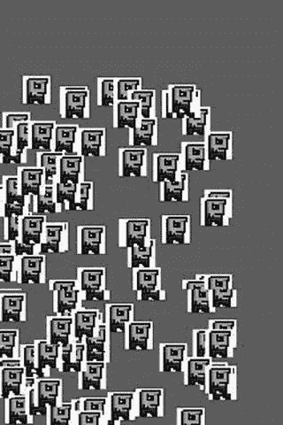

图 7-20.

好多小人！

变换带来的乐趣还不止于此。如果你还记得几页前我们说过的话，你就会知道接下来是什么：旋转和缩放。

## 更多变换

除了 `glTranslatef()` 方法，OpenGL ES 还为我们提供了两种变换方法：`glRotatef()` 和 `glScalef()`。

### 旋转


好的，作为高级文档工程师和翻译员，我将根据您的注意事项和示例，将给定的英文文本翻译成中文。


#### `glRotatef()` 签名

```
GL10.glRotatef(float angle, float axisX, float axisY, float axisZ);
```

第一个参数是旋转角度（以度为单位）。其余参数的含义是什么？

当我们旋转某物时，我们是围绕一个轴旋转它。什么是轴？我们已经知道三个轴：`x`轴、`y`轴和`z`轴。我们可以将这些轴表示为向量。正`x`轴可以描述为`(1,0,0)`，正`y`轴为`(0,1,0)`，正`z`轴为`(0,0,1)`。如你所见，向量实际上编码了一个方向——在我们的例子中，是在 3D 空间中。Bob 的方向也是一个向量，但在 2D 空间中。向量也可以编码位置，就像 Bob 在 2D 空间中的位置。

为了定义我们想要围绕其旋转 Bob 模型的轴，我们需要回到 3D 空间。图 7-21 展示了 Bob 的模型（带有用于定位的纹理），如前所述在 3D 空间中定义。

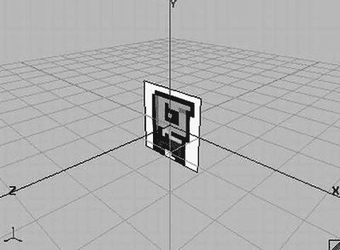

**图 7-21. Bob 在 3D 空间中**

由于我们没有为 Bob 的顶点定义`z`坐标，他嵌入在我们 3D 空间的`x-y`平面中（记住，这实际上是模型空间）。如果我们想旋转 Bob，我们可以围绕任何能想到的轴进行：`x`轴、`y`轴或`z`轴，甚至是一个完全疯狂的轴如`(0.75,0.75,0.75)`。然而，对于我们的 2D 图形编程需求，在`x-y`平面中旋转 Bob 是有意义的；因此，我们将使用正`z`轴作为我们的旋转轴，可以定义为`(0,0,1)`。旋转将围绕`z`轴逆时针进行。像下面这样的`glRotatef()`调用将导致 Bob 模型的顶点旋转，如图 7-22 所示：

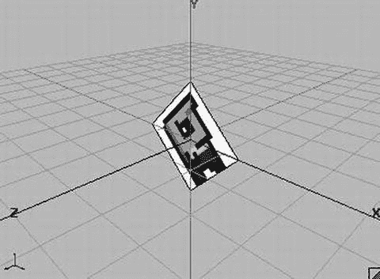

**图 7-22. Bob 围绕`z`轴旋转 45 度**

```
gl.glRotatef(45, 0, 0, 1);
```

### 缩放

我们也可以使用`glScalef()`来缩放 Bob 的模型，如下所示：

```
glScalef(2, 0.5f, 1);
```

给定 Bob 的原始模型姿势，这将导致新的方向，如图 7-23 所示。

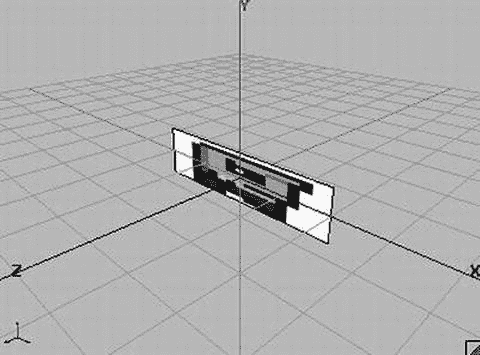

**图 7-23. Bob 在`x`轴上缩放 2 倍，在`y`轴上缩放 0.5 倍……哎哟！**

### 组合变换

我们还讨论过，我们可以通过将多个矩阵相乘来形成一个新矩阵，从而组合它们的效果。所有方法——`glTranslatef()`、`glScalef()`、`glRotatef()`和`glOrthof()`——都这样做。它们将当前活动矩阵与我们通过参数传递给它们的临时矩阵相乘。那么，让我们组合 Bob 的旋转和缩放：

```
gl.glRotatef(45, 0, 0, 1);
gl.glScalef(2, 0.5f, 1);
```

这将使 Bob 的模型看起来像图 7-24（记住，我们仍然在模型空间中）。

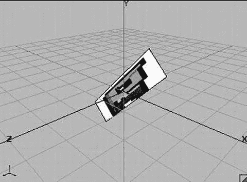

**图 7-24. Bob，先缩放后旋转（看起来仍然不开心）**

如果我们以相反的顺序应用变换会发生什么？

```
gl.glScalef(2, 0.5, 0);
gl.glRotatef(45, 0, 0, 1)
```

图 7-25 给出了答案。

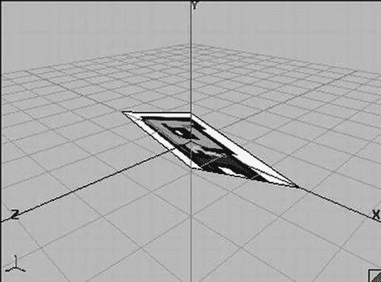

**图 7-25. Bob，先旋转后缩放**

哇，这不是我们熟悉的 Bob。发生了什么？如果你看代码片段，实际上你会期望图 7-24 看起来像图 7-25，而图 7-25 看起来像图 7-24。在第一个片段中，我们先应用旋转然后缩放 Bob，对吗？

错误。OpenGL ES 矩阵相乘的方式决定了矩阵编码的变换应用到模型的顺序。最后乘以当前活动矩阵的矩阵将最先应用到顶点。因此，如果我们想按确切顺序缩放、旋转和平移 Bob，我们必须这样调用方法：

```
glTranslatef(bobs[i].x, bobs[i].y, 0);
glRotatef(45, 0, 0, 1);
glScalef(2, 0.5f, 1);
```

如果我们将`BobScreen.present()`方法中的循环更改为以下代码，输出将如图 7-26 所示：

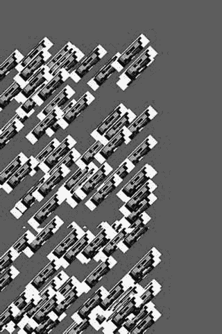

**图 7-26. 一百个 Bob，按缩放、旋转和平移（按此顺序）到它们在世界空间中的位置**

```
gl.glMatrixMode(GL10.GL_MODELVIEW);
for(int i = 0; i < NUM_BOBS; i++) {
    gl.glLoadIdentity();
    gl.glTranslatef(bobs[i].x, bobs[i].y, 0);
    gl.glRotatef(45, 0, 0, 1);
    gl.glScalef(2, 0.5f, 0);
    bobModel.draw(GL10.GL_TRIANGLES, 0, 6);
}
```

当你刚开始在桌面上使用 OpenGL 时，很容易混淆这些矩阵操作的顺序。为了记住如何正确操作，可以借助一个称为 LASFIA 原理的记忆方法：最后指定的，最先应用。（嗯，这个记忆方法不太好，对吧？）

熟悉模型-视图变换最简单的方法是大量使用它们。我们建议你获取`BobTest.java`源文件，多次修改内部循环并观察效果。请注意，你可以为每个模型的渲染指定任意多的变换。添加更多的旋转、平移和缩放。尽情尝试吧。

通过最后一个例子，我们基本上了解了编写 2D 游戏所需的所有 OpenGL ES 知识……或者我们真的了解了吗？

## 性能优化

当我们在像 Galaxy S7 或 Nexus 6P 这样配置良好的设备上运行这个例子时，一切都会像丝绸一样流畅。如果我们在 Hero 上运行，一切都会开始卡顿并看起来相当不愉快。但嘿，难道我们不是说 OpenGL ES 是快速图形渲染的银弹吗？嗯，是的，但前提是我们按照 OpenGL ES 要求的方式去做。

### 测量帧率

`BobTest`提供了一个完美的例子来开始一些优化。但在那之前，我们需要一种评估性能的方法。手动目视检查（“哎呀，看起来有点卡”）不够精确。衡量程序运行速度的更好方法是计算每秒渲染的帧数。在第 3 章中，我们讨论了一种称为垂直同步（简称 vsync）的东西。目前市场上所有 Android 设备都启用了这个功能，它将我们可以达到的最大每秒帧数（FPS）限制为 60。当我们在那个帧率下运行时，就知道我们的代码足够好。

> **注意**：虽然 60 FPS 很好，但在许多 Android 设备上实现这样的性能实际上相当困难。即使只是清屏，高分辨率平板也有大量像素需要填充。一般来说，如果我们的游戏能以超过 30 FPS 的速度渲染世界，我们会很高兴。不过，更多的帧数也无妨。

让我们编写一个辅助类来计算 FPS 并定期输出该值。清单 7-14 显示了一个名为`FPSCounter`的类的代码。

```
package com.badlogic.androidgames.framework.gl;
import android.util.Log;
public class FPSCounter {
    long startTime = System.nanoTime();
    int frames = 0;
    public void logFrame() {
        frames++;
        if(System.nanoTime() - startTime >= 1000000000) {
            Log.d("FPSCounter", "fps: " + frames);
            frames = 0;
            startTime = System.nanoTime();
        }
    }
}
```

**清单 7-14. `FPSCounter.java`：每秒计数帧数并将其记录到 logcat**

我们可以将这个类的一个实例放入我们的`BobScreen`类中，并在`BobScreen.present()`方法中调用`logFrame()`方法一次。我们刚刚这样做了，以下是示例输出：


```
12-10 03:28:05.923: DEBUG/FPSCounter(930): fps: 43
12-10 03:28:06.933: DEBUG/FPSCounter(930): fps: 43
12-10 03:28:07.943: DEBUG/FPSCounter(930): fps: 44
12-10 03:28:08.963: DEBUG/FPSCounter(930): fps: 44
12-10 03:28:09.973: DEBUG/FPSCounter(930): fps: 44
12-10 03:28:11.003: DEBUG/FPSCounter(930): fps: 43
12-10 03:28:12.013: DEBUG/FPSCounter(930): fps: 44
```

#### 是什么导致我的 OpenGL ES 渲染这么慢？

Hero 比第二代设备慢并不令人意外。然而，Droid 中的 PowerVR 芯片比 Nexus One 中的 Adreno 芯片稍微快一点，因此上述结果乍看之下有点奇怪。经过进一步检查，我们或许可以将差异归因于 GPU 性能，而更可能是因为每帧调用了许多 OpenGL ES 方法，而这些方法都是昂贵的 Java 本地接口（Java Native Interface）方法。这意味着它们实际上会调用 C 代码，其成本比在 Dalvik 上调用 Java 方法更高。Nexus One 配有 JIT 编译器，可以在一定程度上进行优化。那么，我们暂且假设差异来自于 JIT 编译器（尽管这可能不完全正确）。

现在，让我们分析一下对 OpenGL ES 不利的操作：

*   每帧频繁更改状态（例如混合、启用/禁用纹理映射等）
*   每帧频繁更改矩阵
*   每帧频繁绑定纹理
*   每帧频繁更改顶点、颜色和纹理坐标指针

所有这些归根结底都是状态更改。为什么这代价高昂？GPU 的工作方式就像工厂的流水线。当流水线前端处理新送来的零件时，后端则完成流水线先前阶段已处理的零件。让我们用一个小型汽车工厂来类比一下。

生产线具有若干状态，例如工厂工人可用的工具、用于组装汽车零件的螺栓类型、汽车喷漆的颜色等等。是的，真实汽车工厂有多个流水线，但我们就假设只有一条。现在，只要我们不更改任何状态，流水线的每个阶段都会持续忙碌。然而，只要我们更改了一个状态，流水线就会停滞，直到所有正在组装的汽车都完成。只有在那时，我们才能实际更改状态，并使用新油漆、新螺栓或其他东西来组装汽车。

关键点在于，调用 `glDrawElements()` 或 `glDrawArrays()` 并不会立即执行；相反，该命令会被放入一个由 GPU 异步处理的缓冲区。这意味着调用绘制方法不会阻塞。因此，测量 `glDrawElements()` 调用所花费的时间是个糟糕的主意，因为实际工作可能在未来执行。这就是我们转而测量 FPS 的原因。当帧缓冲区交换时（是的，我们在 OpenGL ES 中也使用双缓冲），OpenGL ES 会确保所有挂起的操作都得到执行。

因此，将汽车工厂的类比应用到 OpenGL ES 意味着：当新三角形通过调用 `glDrawElements()` 或 `glDrawArrays()` 进入命令缓冲区时，GPU 流水线可能首先要完成对先前渲染方法调用中正在处理的三角形的渲染（例如，一个三角形可能正在流水线的光栅化阶段处理）。这会带来以下影响：

*   更改当前绑定的纹理是昂贵的。命令缓冲区中任何尚未处理且使用该纹理的三角形必须首先渲染。流水线将停滞。
*   更改顶点、颜色和纹理坐标指针是昂贵的。命令缓冲区中任何尚未渲染且使用旧指针的三角形必须首先渲染。流水线将停滞。
*   更改混合状态是昂贵的。命令缓冲区中任何需要/不需要混合且尚未渲染的三角形必须首先渲染。流水线将停滞。
*   更改模型视图或投影矩阵是昂贵的。命令缓冲区中任何尚未处理且应应用旧矩阵的三角形必须首先渲染。流水线将停滞。

这一切的精髓在于：减少你的状态更改——所有状态更改。

#### 移除不必要的状态更改

让我们看一下 `BobTest` 的 `present()` 方法，看看我们可以更改什么。以下是我们添加 `FPSCounter` 并使用 `glRotatef()` 和 `glScalef()` 的代码片段：

```java
@Override
public void present(float deltaTime) {
    GL10 gl = glGraphics.getGL();
    gl.glViewport(0, 0, glGraphics.getWidth(), glGraphics.getHeight());
    gl.glClearColor(1,0,0,1);
    gl.glClear(GL10.GL_COLOR_BUFFER_BIT);
    gl.glMatrixMode(GL10.GL_PROJECTION);
    gl.glLoadIdentity();
    gl.glOrthof(0, 320, 0, 480, 1, -1);
    gl.glEnable(GL10.GL_TEXTURE_2D);
    bobTexture.bind();
    gl.glMatrixMode(GL10.GL_MODELVIEW);
    for(int i = 0; i < NUM_BOBS; i++) {
        gl.glLoadIdentity();
        gl.glTranslatef(bobs[i].x, bobs[i].y, 0);
        gl.glRotatef(45, 0, 0, 1);
        gl.glScalef(2, 0.5f, 1);
        bobModel.draw(GL10.GL_TRIANGLES, 0, 6);
    }
    fpsCounter.logFrame();
}
```

我们首先可以做的，是将 `glViewport()` 和 `glClearColor()` 的调用，以及设置投影矩阵的方法调用，移至 `BobScreen.resume()` 方法。清除颜色永远不会改变；视口和投影矩阵也不会改变。为什么不将设置所有持久 OpenGL 状态（如视口或投影矩阵）的代码放在 `BobScreen` 的构造函数中呢？嗯，我们需要应对上下文丢失的问题。我们所做的所有 OpenGL ES 状态修改都将丢失，并且当我们的屏幕的 `resume()` 方法被调用时，我们知道上下文已被重新创建，因此丢失了我们之前可能设置的所有状态。我们也可以将 `glEnable()` 和纹理绑定调用放入 `resume()` 方法中。毕竟，我们希望始终启用纹理，并且我们也只想使用那张包含鲍勃图像的单一纹理。为保险起见，我们还在 `resume()` 方法中调用了 `texture.reload()`，这样在上下文丢失的情况下，我们的纹理图像数据也会被重新加载。以下是我们修改后的 `present()` 和 `resume()` 方法：

```java
@Override
public void resume() {
    GL10 gl = glGraphics.getGL();
    gl.glViewport(0, 0, glGraphics.getWidth(), glGraphics.getHeight());
    gl.glClearColor(1, 0, 0, 1);
    gl.glMatrixMode(GL10.GL_PROJECTION);
    gl.glLoadIdentity();
    gl.glOrthof(0, 320, 0, 480, 1, -1);
    bobTexture.reload();
    gl.glEnable(GL10.GL_TEXTURE_2D);
    bobTexture.bind();
}

@Override
public void present(float deltaTime) {
    GL10 gl = glGraphics.getGL();
    gl.glClear(GL10.GL_COLOR_BUFFER_BIT);
    gl.glMatrixMode(GL10.GL_MODELVIEW);
    for(int i = 0; i < NUM_BOBS; i++) {
        gl.glLoadIdentity();
        gl.glTranslatef(bobs[i].x, bobs[i].y, 0);
        gl.glRotatef(45, 0, 0, 1);
        gl.glScalef(2, 0.5f, 0);
        bobModel.draw(GL10.GL_TRIANGLES, 0, 6);
    }
    fpsCounter.logFrame();
}
```

#### 绑定顶点的概念

那么，还有什么可以改进的吗？让我们再来看一下我们当前的 `present()` 方法 [移除了 `glRotatef()` 和 `glScalef()`]：

```java
public void present(float deltaTime) {
    GL10 gl = glGraphics.getGL();
    gl.glClear(GL10.GL_COLOR_BUFFER_BIT);
    gl.glMatrixMode(GL10.GL_MODELVIEW);
    for(int i = 0; i < NUM_BOBS; i++) {
        gl.glLoadIdentity();
        gl.glTranslatef(bobs[i].x, bobs[i].y, 0);
        bobModel.draw(GL10.GL_TRIANGLES, 0, 6);
    }
    fpsCounter.logFrame();
}
```

这看起来相当优化了，不是吗？事实上，它并非最优。首先，我们也可以将 `gl.glMatrixMode()` 调用移至 `resume()` 方法，但正如我们所见，这对性能影响不大。第二个可以优化的地方则更为微妙。


我们使用`Vertices`类来存储和渲染 Bob 的模型。还记得`Vertices.draw()`方法吗？这里再展示一次：

```
public void draw(int primitiveType, int offset, int numVertices) {
    GL10 gl = glGraphics.getGL();
    gl.glEnableClientState(GL10.GL_VERTEX_ARRAY);
    vertices.position(0);
    gl.glVertexPointer(2, GL10.GL_FLOAT, vertexSize, vertices);
    if(hasColor) {
        gl.glEnableClientState(GL10.GL_COLOR_ARRAY);
        vertices.position(2);
        gl.glColorPointer(4, GL10.GL_FLOAT, vertexSize, vertices);
    }
    if(hasTexCoords) {
        gl.glEnableClientState(GL10.GL_TEXTURE_COORD_ARRAY);
        vertices.position(hasColor?6:2);
        gl.glTexCoordPointer(2, GL10.GL_FLOAT, vertexSize, vertices);
    }
    if(indices!=null) {
        indices.position(offset);
        gl.glDrawElements(primitiveType, numVertices, GL10.GL_UNSIGNED_SHORT, indices);
    } else {
        gl.glDrawArrays(primitiveType, offset, numVertices);
    }
    if(hasTexCoords)
        gl.glDisableClientState(GL10.GL_TEXTURE_COORD_ARRAY);
    if(hasColor)
        gl.glDisableClientState(GL10.GL_COLOR_ARRAY);
}
```

现在，再看一下前面的循环。注意到什么了吗？对于每个 Bob，我们通过`glEnableClientState()`反复启用相同的顶点属性。实际上我们只需要设置一次，因为每个 Bob 都使用相同的模型，而该模型始终使用相同的顶点属性。下一个大问题来自为每个 Bob 调用`glXXXPointer()`。由于这些指针也是 OpenGL ES 的状态，我们也只需要设置它们一次，因为它们一旦设置就不会改变。那么，我们该如何解决这个问题？让我们稍微重写`Vertices.draw()`方法：

```
public void bind() {
    GL10 gl = glGraphics.getGL();
    gl.glEnableClientState(GL10.GL_VERTEX_ARRAY);
    vertices.position(0);
    gl.glVertexPointer(2, GL10.GL_FLOAT, vertexSize, vertices);
    if(hasColor) {
        gl.glEnableClientState(GL10.GL_COLOR_ARRAY);
        vertices.position(2);
        gl.glColorPointer(4, GL10.GL_FLOAT, vertexSize, vertices);
    }
    if(hasTexCoords) {
        gl.glEnableClientState(GL10.GL_TEXTURE_COORD_ARRAY);
        vertices.position(hasColor?6:2);
        gl.glTexCoordPointer(2, GL10.GL_FLOAT, vertexSize, vertices);
    }
}
public void draw(int primitiveType, int offset, int numVertices) {
    GL10 gl = glGraphics.getGL();
    if(indices!=null) {
        indices.position(offset);
        gl.glDrawElements(primitiveType, numVertices, GL10.GL_UNSIGNED_SHORT, indices);
    } else {
        gl.glDrawArrays(primitiveType, offset, numVertices);
    }
}
public void unbind() {
    GL10 gl = glGraphics.getGL();
    if(hasTexCoords)
        gl.glDisableClientState(GL10.GL_TEXTURE_COORD_ARRAY);
    if(hasColor)
        gl.glDisableClientState(GL10.GL_COLOR_ARRAY);
}
```

你能看出我们做了什么吗？我们可以像处理纹理一样处理我们的顶点和所有那些指针。我们通过一次调用`Vertices.bind()`来“绑定”顶点指针。从这一点开始，每次`Vertices.draw()`调用都会使用那些“绑定”的顶点，就像绘制调用也会使用当前绑定的纹理一样。一旦我们完成使用该`Vertices`实例进行渲染，我们就调用`Vertices.unbind()`来禁用其他`Vertices`实例可能不需要的顶点属性。保持 OpenGL ES 状态清洁是一件好事。以下是我们的`present()`方法现在的样子（我们还将`glMatrixMode(GL10.GL_MODELVIEW)`调用移到了`resume()`中）：

```
@Override
public void present(float deltaTime) {
    GL10 gl = glGraphics.getGL();
    gl.glClear(GL10.GL_COLOR_BUFFER_BIT);
    bobModel.bind();
    for(int i = 0; i < NUM_BOBS; i++) {
        gl.glLoadIdentity();
        gl.glTranslatef(bobs[i].x, bobs[i].y, 0);
        bobModel.draw(GL10.GL_TRIANGLES, 0, 6);
    }
    bobModel.unbind();
    fpsCounter.logFrame();
}
```

这有效地将`glXXXPointer()`和`glEnableClientState()`方法的调用减少到每帧仅一次。因此，我们节省了将近 100 × 6 次对 OpenGL ES 的调用。这对性能应该有很大的影响，对吧？

当然，我们新的可绑定`Vertices`类现在有一些限制：

*   只有当`Vertices`实例未绑定时，我们才能设置顶点和索引数据，因为这些信息的上传是在`Vertices.bind()`中执行的。
*   我们不能同时绑定两个`Vertices`实例。这意味着在任何时间点，我们只能使用一个`Vertices`实例进行渲染。不过，这通常不是大问题，而且鉴于性能的显著提升，我们可以接受。

### 结语

对于使用平面几何（例如矩形）的 2D 图形编程，我们还可以应用更多优化。我们将在下一章对此进行研究。如果你想进一步了解优化，要搜索的关键词是“批处理（batching）”，这意味着减少`glDrawElements()`/`glDrawArrays()`的调用次数。3D 图形也存在对应的技术，称为“实例化（instancing）”，但这在 OpenGL ES 1.x 上无法实现。

在结束本章之前，我们想再提两件事。首先，当你运行`BobTest`或`OptimizedBobTest`（其中包含我们刚刚开发的超级优化代码）时，请注意 Bob 在屏幕上有些晃动。这是因为它们的位置是作为浮点数传递给`glTranslatef()`的。像素完美渲染的问题在于，OpenGL ES 对坐标带分数部分的顶点位置非常敏感。我们无法真正解决这个问题；在真实游戏中，这种影响会不那么明显，甚至不存在，正如我们在实现下一个游戏时将会看到的那样。我们可以通过使用更繁忙的背景等方式在一定程度上隐藏这种效果。

第二件我们想指出的事情是如何解释 FPS 测量值。从前面的输出可以看出，FPS 略有波动。这可以归因于在我们的应用程序旁边运行的后台进程。我们永远无法让所有系统资源都只为我们的游戏服务，所以我们必须学会接受这个问题。在优化程序时，不要通过杀死所有后台进程来伪造环境。在手机处于正常状态（就像你自己使用的那样）下运行应用程序。这将反映用户将获得的相同体验。

我们的良好成就结束了本章。作为一句警告，只在渲染代码工作正常之后才开始优化，并且只有在确实出现性能问题之后才这样做。过早优化通常是导致需要重写整个渲染代码的原因，因为它可能变得难以维护。

## 总结

OpenGL ES 是一个庞大的怪兽。我们设法将其压缩到容易用于我们游戏编程需求的大小。我们讨论了 OpenGL ES 是什么（一个精简、高效的三角形渲染引擎）以及它是如何工作的。然后，我们探索了如何通过指定顶点、创建纹理以及使用状态（例如混合）来实现一些不错的效果，从而利用 OpenGL ES 的功能。我们还简要了解了投影以及它们如何与矩阵关联。虽然我们没有讨论矩阵内部的工作原理，但我们探索了如何使用矩阵来旋转、缩放和平移可复用的模型，从模型空间到世界空间。稍后当我们使用 OpenGL ES 进行 3D 编程时，你会注意到你已经学会了所需知识的 90%。我们要做的只是改变投影并为顶点添加一个 z 坐标（嗯，还有一些其他事情，但就高层次而言，实际上就是这样）。然而，在此之前，我们将用 OpenGL ES 编写一个漂亮的 2D 游戏。在下一章中，你将了解一些我们可能需要的 2D 编程技巧。

## 8. 2D 游戏编程技巧

第 7 章展示了 OpenGL ES 为 2D 图形编程提供了相当多的特性，例如轻松的旋转和缩放，以及将视锥自动拉伸到视口。它还在性能上优于使用`Canvas` API。


现在，是时候探讨一些更高级的 2D 游戏编程主题了。你在编写 `Mr. Nom` 时已经直观地使用了其中一些概念，包括基于时间的状态更新和图像集锦。接下来的很多内容也相当直观，而且你迟早很可能会想出同样的解决方案。不过，明确地学习这些知识并无坏处。

2D 游戏编程有几个关键概念。其中一些与图形相关，另一些则涉及如何表示和模拟你的游戏世界。所有这些概念都有一个共同点：它们都依赖于一点线性代数和三角学。别担心，编写像 `Super Mario Brothers` 这样的游戏所需的数学水平并不高深。让我们从回顾一些 2D 线性代数和三角学的概念开始。

## 开始之前

与之前的“理论”章节一样，我们将创建几个示例来感受一下具体内容。在本章中，我们可以复用第 7 章开发的内容，主要是 `GLGame`、`GLGraphics`、`Texture` 和 `Vertices` 类，以及框架的其他类。

按照与第 7 章完全相同的设置方式创建一个新项目。将 `com.badlogic.androidgames.framework` 包复制到新项目中，然后创建一个名为 `com.badlogic.androidgames.gamedev2d` 的新包。

添加一个名为 `GameDev2DStarter` 的启动类。复用 `GLBasicsStarter` 的代码，只需替换测试类名即可。修改清单文件，以便启动这个新的启动类。对于我们即将开发的每个测试，你都需要以 `<activity>` 元素的形式在清单中添加一个条目。

每个测试同样是一个游戏接口的实例，实际的测试逻辑以包含在该测试的 `Game` 实现中的一个 `Screen` 实例的形式来实现，就像上一章一样。为了节省篇幅，将只呈现 `Screen` 实例的相关部分。每个测试的 `GLGame` 和 `Screen` 实现的命名约定同样是 `XXXTest` 和 `XXXScreen`。

解决了这个问题，就该谈谈向量了。

## 最初…… 是向量

在第 7 章中，你了解到向量不应与位置混淆。这并不完全正确，因为我们可以（也将会）用向量来表示某个空间中的位置。一个向量实际上可以有多种解释：

*   **位置：** 我们在前几章中已经这样使用过，用向量来表示我们的实体相对于坐标系原点的坐标。
*   **速度和加速度：** 这些是你在下一节将会听到的物理量。虽然你可能习惯于将速度和加速度视为单一数值，但它们实际上应该表示为 2D 或 3D 向量。它们不仅编码了实体的速率（例如，一辆以 100 km/h 行驶的汽车），还编码了实体运动的方向。注意，这种向量解释并不说明该向量是相对于原点给出的。这很合理，因为汽车的速度和方向与其位置无关。想象一辆汽车在直高速公路上以 100 km/h 的速度向西北方向行驶。只要它的速度和方向不变，速度向量也不会改变，而它的位置却在变化。
*   **方向和距离：** 方向与速度类似，但通常缺少物理量。你可以用这种向量解释来编码状态，例如，这个实体指向东南方向。距离则告诉我们一个位置距离另一个位置有多远，以及方向。

图 8-1 展示了这些解释的实际应用。

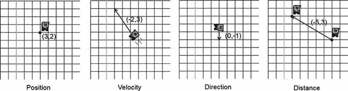

**图 8-1.** 鲍勃，其位置、速度、方向和距离用向量表示

当然，图 8-1 并非详尽无遗。向量可以有更多解释。不过，对于我们的游戏开发需求来说，这四种基本解释就足够了。

图 8-1 中遗漏了一点，即向量分量的单位。我们必须确保这些单位是合理的（例如，鲍勃的速度可以用米/秒表示，这样他就能在 1 秒内向左移动 2 米，向上移动 3 米）。位置和距离也是如此，它们也可以用米表示。不过，鲍勃的方向是一个特例——它是无量纲的。如果我们想指定一个物体的总体方向，同时将方向的物理特征分开考虑，这将很有用。我们可以对鲍勃的速度这样做：将其速度的方向存储为一个方向向量，并将其速率存储为单一数值。单一数值也称为**标量**。方向向量的长度必须为 1，这将在本章后面讨论。

## 处理向量

向量的强大之处在于我们可以轻松地对它们进行操作和组合。但在那之前，我们需要定义如何表示向量。以下是向量的一种临时、半数学化的表示：

`v = (x,y)`

这没什么可惊讶的；我们已经这样做过无数次了。在我们的 2D 空间中，每个向量都有一个 `x` 和一个 `y` 分量。（是的，本章我们将保持在二维空间。）我们还可以对两个向量进行加法运算：

`c = a + b = (a.x, a.y) + (b.x, b.y) = (a.x + b.x, a.y + b.y)`

我们只需要将各个分量相加，就能得到最终的向量。试试用图 8-1 中给出的向量来操作一下。假设你取鲍勃的位置 `p = (3,2)`，加上他的速度 `v = (–2,3)`。你会得到一个新的位置 `p' = (3 + –2, 2 + 3) = (1,5)`。不要被 `p` 后面的撇号搞混了；它只是表示你得到了一个新的向量 `p`。当然，这个简单的操作只有在位置和速度的单位相匹配时才合理。在这种情况下，我们假设位置以米（m）为单位，速度以米/秒（m/s）为单位，这非常合适。

当然，我们也可以对向量进行减法运算：

`c = a – b = (a.x, a.y) – (b.x, b.y) = (a.x – b.x, a.y – b.y)`

同样，我们所做的只是组合两个向量的分量。但要注意，向量相减的顺序很重要。以图 8-1 中最右边的图像为例。我们有一个绿色的鲍勃位于 `pg = (1,4)`，一个红色的鲍勃位于 `pr = (6,1)`，其中 `pg` 和 `pr` 分别代表绿色位置和红色位置。当我们计算从绿色鲍勃到红色鲍勃的距离向量时，我们进行如下计算：

`d = pg – pr = (1, 4) – (6, 1) = (–5, 3)`

这很奇怪。这个向量实际上是从红色鲍勃指向绿色鲍勃！要得到从绿色鲍勃指向红色鲍勃的方向向量，我们必须颠倒减法顺序：

`d = pr – pg = (6, 1) – (1, 4) = (5,–3)`

如果我们想找出从位置 `a` 到位置 `b` 的距离向量，我们使用以下通用公式：

`d = b – a`

换句话说，总是用终点位置减去起点位置。一开始这可能有点令人困惑，但仔细想想，这完全合理。拿张坐标纸试试看！

我们还可以将向量乘以一个标量（记住，标量只是一个单一数值）：

`a' = a * scalar = (a.x * scalar, a.y * scalar)`


我们用一个标量乘以向量的每个分量。这让我们能够缩放向量的长度。以图 8-1 中的方向向量为例。它被指定为`d = (0,–1)`。如果我们将其乘以标量`s = 2`，我们实际上将其长度加倍：`d × s = (0,–1 × 2) = (0,–2)`。当然，我们也可以通过使用小于 1 的标量来使其更短——例如，`d`乘以`s = 0.5`会创建一个新向量`d' = (0,–0.5)`。

说到长度，我们也可以计算一个向量的长度（以给定的单位表示）：

```
|a| = sqrt(a.x * a.x + a.y * a.y)
```

符号`|a|`仅表示这是向量的长度。如果你在学校没有在代数课上睡着，你可能会认出向量长度的公式。它只是将勾股定理应用于我们花哨的二维向量。向量的`x`和`y`分量构成了直角三角形的两条边，第三条边就是向量的长度。图 8-2 对此进行了说明。

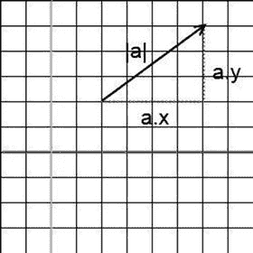

图 8-2. 毕达哥拉斯也会喜欢向量

由于平方根的特性，向量长度总是正数或零。如果我们将其应用于红鲍勃和绿鲍勃之间的距离向量，我们可以计算出它们之间相距多远（如果它们的位置以米为单位给出）：

```
|pr – pg| = sqrt(5*5 + –3*–3) = sqrt(25 + 9) = sqrt(34) ∼= 5.83m
```

请注意，如果我们计算`|pg – pr|`，我们会得到相同的值，因为长度与向量的方向无关。这个新知识还有另一个含义：当我们用一个标量乘以一个向量时，它的长度会相应地改变。给定一个向量`d = (0,–1)`，原始长度为 1 个单位，你可以将其乘以 2.5，得到一个长度为 2.5 个单位的新向量。

方向向量通常没有与之关联的单位。我们可以通过将它们与一个标量相乘来给它们一个单位——例如，我们可以将方向向量`d = (0,1)`乘以速度常数`s = 100 m/s`，得到速度向量`v = (0 × 100,1 × 100) = (0,100)`。让方向向量的长度为 1 总是一个好主意。长度为 1 的向量称为单位向量。我们可以通过将每个分量除以其长度来使任何向量成为单位向量：

```
d' = (d.x / |d|, d.y / |d|)
```

记住`|d|`只是表示向量`d`的长度。试试看。假设你想要一个精确指向东北方向的方向向量：`d = (1,1)`。似乎这个向量已经是单位长度了，因为两个分量都是 1，对吧？错了：

```
|d| = sqrt(1 * 1 + 1 * 1) = sqrt(2) ∼= 1.44
```

你可以通过使该向量成为单位向量来轻松解决这个问题：

```
d' = (d.x / |d|, d.y / |d|) = (1 / |d|, 1 / |d|) ∼= (1 / 1.44, 1 / 1.44) = (0.69, 0.69)
```

这也称为归一化向量，这仅意味着我们确保其长度为 1。有了这个技巧，我们可以，例如，从一个距离向量创建一个单位长度的方向向量。当然，我们必须注意零长度向量，因为在这种情况下我们必须除以零！

## 一点三角学

现在是时候花一分钟来谈谈三角学了。三角学中有两个基本函数：余弦和正弦。每个函数都接受一个参数：角度。你可能习惯于用度数指定角度（例如，45° 或 360°）。然而，在大多数数学库中，三角函数期望角度以弧度为单位。我们可以使用以下公式轻松地在度数和弧度之间进行转换：

```
degreesToRadians(angleInDegrees) = angleInDegrees / 180 * pi
radiansToDegrees(angle) = angleInRadians / pi * 180
```

这里，`pi`是备受喜爱的超级常数，其近似值为 3.14159265。`pi`弧度等于 180°，这就是以上函数产生的原因。

那么，给定一个角度，`cosine`和`sine`实际上计算了什么？它们计算相对于原点的单位长度向量的`x`和`y`分量。图 8-3 对此进行了说明。

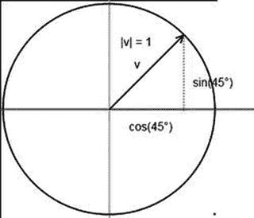

图 8-3. 余弦和正弦生成一个单位向量，其端点位于单位圆上

因此，给定一个角度，我们可以像这样创建一个单位长度的方向向量：

```
v = (cos(angle), sin(angle))
```

我们也可以反过来，计算一个向量相对于 x 轴的角度：

```
angle = atan2(v.y, v.x)
```

`atan2`函数实际上是一个人为的构造。它使用反正切函数（它是正切函数的反函数，三角学中的另一个基本函数）来构造一个在 –180° 到 180°（如果角度以弧度返回，则为 –pi 到 pi）范围内的角度。其内部机制有些复杂，并且在此讨论中并不十分重要。参数是向量的`y`和`x`分量。请注意，向量不必是单位向量`atan2`函数才能工作。另外，请注意，通常先给出`y`分量，然后是`x`分量——但这取决于所选的数学库。这是一个常见的错误来源。

尝试几个例子。给定一个向量`v = (cos(97°), sin(97°))`，`atan2(sin(97°),cos(97°))`的结果是 97°。太好了，这很容易。使用向量`v = (1,–1)`，你得到`atan2(–1,1) = –45°`。所以，如果你的向量的`y`分量是负的，你会得到一个 0° 到 –180° 范围内的负角度。如果`atan2`的输出为负，你可以通过加上 360°（或 2 pi）来修正。在前面的例子中，你会得到 315°。

我们希望能够应用于向量的最后一个操作是按某个角度旋转它们。下面等式的推导再次相当复杂。幸运的是，我们可以直接使用这些方程，而无需了解正交基向量。（提示：如果你想了解幕后的原理，这是可以在网络上搜索的关键短语。）这是神奇的伪代码：

```
v.x' = cos(angle) * v.x – sin(angle) * v.y
v.y' = sin(angle) * v.x + cos(angle) * v.y
```

哇，这比预想的要简单。这将逆时针绕原点旋转任何向量，无论你对向量有何解释。

结合向量加法、减法和标量乘法，你实际上可以自己实现所有 OpenGL 矩阵操作。这是进一步提高第 7 章中`BobTest`性能的解决方案的一部分。这将在后续章节中讨论。现在，让我们专注于已经讨论过的内容，并将其转化为代码。

## 实现一个向量类

现在我们可以为二维向量创建一个易于使用的向量类。我们称之为`Vector2`。它应该有两个成员来保存向量的`x`和`y`分量。此外，它应该有一些方便的方法，允许你执行以下操作：

*   向量相加和相减
*   将向量分量乘以一个标量
*   测量向量的长度
*   归一化向量
*   计算向量与 x 轴之间的角度
*   旋转向量

Java 缺乏运算符重载，因此我们必须想出一个机制，使得使用`Vector2`类不那么繁琐。理想情况下，我们应该拥有如下所示的内容：

```
Vector2 v = new Vector2();
v.add(10,5).mul(10).rotate(54);
```

我们可以通过让每个`Vector2`方法都返回对向量本身的引用来轻松实现这一点。当然，我们也想重载像`Vector2.add()`这样的方法，以便我们可以传入两个浮点数或另一个`Vector2`的实例。清单 8-1 展示了`Vector2`类的完整内容，并在适当的地方添加了注释。


```java
package com.badlogic.androidgames.framework.math;
public class Vector2 {
    public static float TO_RADIANS = (1 / 180.0f) * (float) Math.PI;
    public static float TO_DEGREES = (1 / (float) Math.PI) * 180;
    public float x, y;
    public Vector2() {}
    public Vector2(float x, float y) {
        this.x = x;
        this.y = y;
    }
    public Vector2(Vector2 other) {
        this.x = other.x;
        this.y = other.y;
    }
```

**列表 8-1.** `Vector2.java`：实现一些实用的二维向量功能

将上述类放入包`com.badlogic.androidgames.framework.math`中，我们后续所有与数学相关的类也将置于此包内。

首先定义了两个静态常量`TO_RADIANS`和`TO_DEGREES`。要将弧度转换为角度，只需乘以`TO_DEGREES`；要将角度转换为弧度，则乘以`TO_RADIANS`。通过回顾前面的度与弧度转换公式即可验证这一点。利用这个小技巧，我们可以减少除法运算，提升性能。

接着定义了成员变量`x`和`y`，用于存储向量的分量，并提供几个构造函数——不含复杂逻辑：

```java
public Vector2 cpy() {
    return new Vector2(x, y);
}
```

`cpy()`方法会创建当前向量的实例副本并返回。当需要操作向量的副本、保留原始向量值时，这个方法会非常方便。

```java
public Vector2 set(float x, float y) {
    this.x = x;
    this.y = y;
    return this;
}
public Vector2 set(Vector2 other) {
    this.x = other.x;
    this.y = other.y;
    return this;
}
```

`set()`方法允许通过两个`float`参数或另一个`Vector2`来设置向量的`x`和`y`分量。方法返回当前向量引用，从而实现链式调用。

```java
public Vector2 add(float x, float y) {
    this.x += x;
    this.y += y;
    return this;
}
public Vector2 add(Vector2 other) {
    this.x += other.x;
    this.y += other.y;
    return this;
}
public Vector2 sub(float x, float y) {
    this.x -= x;
    this.y -= y;
    return this;
}
public Vector2 sub(Vector2 other) {
    this.x -= other.x;
    this.y -= other.y;
    return this;
}
```

`add()`和`sub()`方法各自有两种重载形式：一种接受两个`float`参数，另一种接受一个`Vector2`实例。四个方法都返回当前向量引用以支持链式调用。

```java
public Vector2 mul(float scalar) {
    this.x *= scalar;
    this.y *= scalar;
    return this;
}
```

`mul()`方法将向量的`x`和`y`分量乘以给定的标量值，并返回自身引用用于链式操作。

```java
public float len() {
    return (float)Math.sqrt(x * x + y * y);
}
```

`len()`方法精确计算向量的长度，公式如前所述。注意这里使用了`FloatMath`类而非 Java SE 标准的`Math`类。这是 Android 特有的 API 类，专门处理`float`类型，其性能（至少在较旧的 Android 版本上）优于`Math`类的对应方法。

```java
public Vector2 nor() {
    float len = len();
    if (len != 0) {
        this.x /= len;
        this.y /= len;
    }
    return this;
}
```

`nor()`方法将向量归一化为单位长度。内部先通过`len()`方法计算长度，若长度为 0 则提前终止以避免除零错误；否则将向量各分量除以长度得到单位向量。同样返回自身引用便于链式调用。

```java
public float angle() {
    float angle = (float) Math.atan2(y, x) * TO_DEGREES;
    if (angle < 0)
        angle += 360;
    return angle;
}
```

`angle()`方法使用`atan2()`计算向量与 x 轴之间的夹角。由于`FloatMath`类不包含此方法，这里使用`Math.atan2()`。返回的弧度值乘以`TO_DEGREES`转换为角度。若角度小于 0，则加上 360°，使返回范围在 0°~360°之间。

```java
public Vector2 rotate(float angle) {
    float rad = angle * TO_RADIANS;
    float cos = (float)Math.cos(rad);
    float sin = (float)Math.sin(rad);
    float newX = this.x * cos - this.y * sin;
    float newY = this.x * sin + this.y * cos;
    this.x = newX;
    this.y = newY;
    return this;
}
```

`rotate()`方法按给定角度绕原点旋转向量。由于`FloatMath.cos()`和`FloatMath.sin()`要求弧度参数，先将角度转换为弧度。然后利用前文公式计算新分量，最后返回向量自身以便链式调用。

```java
public float dist(Vector2 other) {
    float distX = this.x - other.x;
    float distY = this.y - other.y;
    return (float)Math.sqrt(distX * distX + distY * distY);
}
public float dist(float x, float y) {
    float distX = this.x - x;
    float distY = this.y - y;
    return (float)Math.sqrt(distX * distX + distY * distY);
}
}
```

最后提供两个方法，用于计算当前向量与另一个向量或坐标点之间的距离。

至此，我们完成了功能完善的`Vector2`类，它可用于表示后续代码中的位置、速度、距离和方向。为了熟悉这个新类，接下来用一个简单示例演示其用法。

## 简单使用示例

以下是一个测试方案：

*   创建一个由三角形表示的大炮，其固定位置在(2.4, 0.5)（世界坐标）。
*   每次触摸屏幕时，旋转三角形容器使其指向触摸点。
*   视锥体显示世界坐标系中(0,0)到(4.8,3.2)的区域。我们不使用像素坐标，而是自定义坐标系（1 单位=1 米），并采用横向模式。

需要解决几个问题。我们已经知道如何在模型空间定义三角形——可参考第 7 章的`FirstTriangleTest`。大炮的默认朝向应为 0°（向右）。图 8-4 展示了模型空间中的大炮三角形。

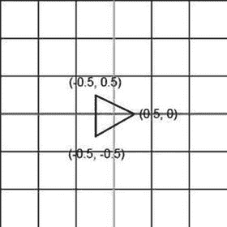

**图 8-4.** 模型空间中的大炮三角形

渲染该三角形时，直接使用`glTranslatef()`将其平移到世界坐标位置(2.4, 0.5)。

同时需要旋转大炮，使其尖端指向最后一次触摸屏幕的点。为此，需要确定触摸事件在世界坐标系中的位置。`GLGame.getInput().getTouchX()`和`getTouchY()`返回的是屏幕坐标系下的触摸点坐标（原点在左上角）。与 Mr. Nom 不同，`Input`实例不会将事件缩放到固定坐标系。因此需要将触摸坐标转换为世界坐标。我们已在 Mr. Nom 和基于`Canvas`的游戏框架的触摸处理器中实现过类似转换；唯一区别是本例的坐标系范围更小，且世界 y 轴朝上。以下是通用转换流程的伪代码，与第 5 章触摸处理器的实现几乎相同：

```
worldX = (touchX / Graphics.getWidth()) * viewFrustmWidth
worldY = (1 - touchY / Graphics.getHeight()) * viewFrustumHeight
```


我们将触摸坐标通过除以屏幕分辨率归一化到范围`(0,1)`。对于 y 坐标，我们从 1 中减去触摸事件的归一化 y 坐标，以翻转 y 轴。剩下的工作就是将 x 和 y 坐标乘以视图截锥的宽度和高度——在本例中，宽度为`4.8`，高度为`3.2`。从`worldX`和`worldY`，我们可以构造一个`Vector2`，用于存储触摸点在游戏世界中的坐标。

最后需要计算的是旋转大炮的角度。请看图 8-5，图中显示了我们的世界坐标系中的大炮和一个触摸点。

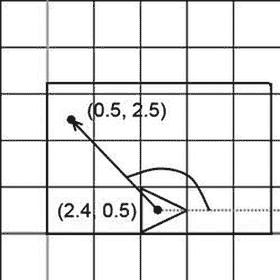

图 8-5

我们的火炮处于默认状态，指向右方（角度=0°），一个触摸点，以及我们需要旋转火炮的角度。矩形区域是我们的视图截锥将在屏幕上显示的世界区域：从`(0,0)`到`(4.8,3.2)`。

我们只需要创建一个从火炮中心`(2.4,0.5)`到触摸点的距离向量（记住，必须从触摸点减去火炮中心，而不是反过来）。得到距离向量后，我们可以使用`Vector2.angle()`方法计算角度。然后，可以使用此角度通过`glRotatef()`来旋转模型。

让我们编写代码。清单 8-2 展示了`Cannon`类，这是一个新的类，`CannonTest`将调用它。它非常类似于第 7 章中的`Bob`类。

```java
class CannonScreen extends Screen {
    float FRUSTUM_WIDTH = 4.8f;
    float FRUSTUM_HEIGHT = 3.2f;
    GLGraphics glGraphics;
    Vertices vertices;
    Vector2 cannonPos = new Vector2(2.4f, 0.5f);
    float cannonAngle = 0;
    Vector2 touchPos = new Vector2();
}
```

清单 8-2
摘自`CannonTest.java`：触摸屏幕将旋转大炮

我们从定义截锥宽度和高度的两个常量开始。接下来，我们包含一个`GLGraphics`实例和一个`Vertices`实例。我们将火炮的位置存储在`Vector2`实例中，并将其角度存储在一个`float`中。最后，我们还有另一个`Vector2`，用于计算从原点到触摸点的向量与 x 轴之间的角度。

为什么我们要将`Vector2`实例存储为类成员？我们可以在每次需要时实例化它们，但这会让垃圾回收器压力很大。通常，我们尝试一次性实例化所有`Vector2`实例，然后尽可能多地重用它们。

```java
public CannonScreen(Game game) {
    super(game);
    glGraphics = ((GLGame) game).getGLGraphics();
    vertices = new Vertices(glGraphics, 3, 0, false, false);
    vertices.setVertices(new float[] { -0.5f, -0.5f,
            0.5f, 0.0f,
            -0.5f, 0.5f }, 0, 6);
}
```

在构造函数中，我们获取了`GLGraphics`实例并根据图 8-4 创建了三角形。

```java
@Override
public void update(float deltaTime) {
    List touchEvents = game.getInput().getTouchEvents();
    game.getInput().getKeyEvents();
    int len = touchEvents.size();
    for (int i = 0; i < len; i++) {
        TouchEvent event = touchEvents.get(i);
        touchPos.x = (event.x / (float) glGraphics.getWidth())
                * FRUSTUM_WIDTH;
        touchPos.y = (1 - event.y / (float) glGraphics.getHeight())
                * FRUSTUM_HEIGHT;
        cannonAngle = touchPos.sub(cannonPos).angle();
    }
}
```

接下来是`update()`方法。我们只需遍历所有触摸事件并计算火炮的角度。这可以通过几个步骤完成。首先，如前所述，将触摸事件的屏幕坐标转换为世界坐标系。将触摸事件的世界坐标存储在`touchPoint`成员中。然后，从触摸点向量中减去火炮的位置，这将得到图 8-5 中描绘的向量。接着，我们计算此向量与 x 轴之间的角度。仅此而已！

```java
@Override
public void present(float deltaTime) {
    GL10 gl = glGraphics.getGL();
    gl.glViewport(0, 0, glGraphics.getWidth(), glGraphics.getHeight());
    gl.glClear(GL10.GL_COLOR_BUFFER_BIT);
    gl.glMatrixMode(GL10.GL_PROJECTION);
    gl.glLoadIdentity();
    gl.glOrthof(0, FRUSTUM_WIDTH, 0, FRUSTUM_HEIGHT, 1, -1);
    gl.glMatrixMode(GL10.GL_MODELVIEW);
    gl.glLoadIdentity();
    gl.glTranslatef(cannonPos.x, cannonPos.y, 0);
    gl.glRotatef(cannonAngle, 0, 0, 1);
    vertices.bind();
    vertices.draw(GL10.GL_TRIANGLES, 0, 3);
    vertices.unbind();
}
```

`present()`方法执行与之前相同的常规操作。设置视口，清除屏幕，使用截锥的宽度和高度设置正交投影矩阵，并告知 OpenGL ES 所有后续矩阵运算将在模型视图矩阵上进行。加载一个单位矩阵到模型视图矩阵以“清除”它。接着，将（单位）模型视图矩阵乘以一个平移矩阵，该矩阵将把三角形的顶点从模型空间移动到世界空间。我们调用`glRotatef()`，使用在`update()`方法中计算出的角度，以便三角形在平移之前先在模型空间中旋转。请记住，变换是按相反顺序应用的——最后指定的变换最先应用。最后，绑定三角形的顶点，渲染它，然后解绑。

```java
@Override
public void pause() {
}
@Override
public void resume() {
}
@Override
public void dispose() {
}
```

现在我们有了一个会跟随你的每一次触摸的三角形。图 8-6 显示了触摸屏幕右上角后的输出。

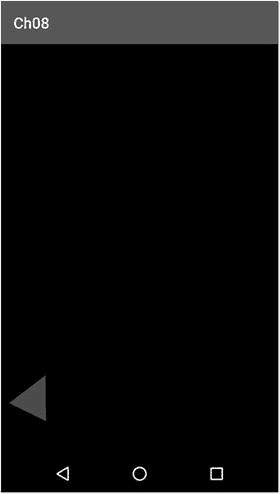

图 8-6

我们的三角形大炮对右上角触摸事件的反应

请注意，在火炮位置渲染一个三角形还是渲染一个映射到大炮图像的矩形纹理其实并不重要——OpenGL ES 并不关心。我们还将所有矩阵操作放在了`present()`方法中。事实是，以这种方式更容易跟踪 OpenGL ES 的状态，并且我们可以在一次`present()`调用中使用多个视图截锥（例如，一个视图截锥设置以米为单位的世界，用于渲染我们的世界；另一个视图截锥设置以像素为单位的世界，用于渲染 UI 元素）。正如第 7 章所述，对性能的影响并不大，因此在大多数情况下这样做是可以接受的。只需记住，如果出现需要，你可以对此进行优化。

从现在起，向量将成为你最好的朋友。你可以使用它们来指定世界中的几乎所有内容。你还可以使用向量进行一些非常基础的物理计算。一个大炮如果不能射击，那还有什么用呢？

## 二维基础物理

在本节中，我们将讨论一个非常简单且功能有限的物理模型。游戏就是关于高超的模拟。它们会在可能的地方取巧，以避免潜在的高计算量。游戏中物体的行为不需要 100%物理精确；只需足够好，看起来可信即可。有时你甚至不希望有物理精确的行为（例如，你可能希望一组物体向下坠落，而另一组更疯狂的物体向上飞起）。

即使是原始的《超级马里奥兄弟》也至少使用了一些牛顿力学的基本原理。这些原理非常简单且易于实现。我们将只讨论为我们的游戏对象实现简单物理模型所需的最低限度内容。

### 牛顿与欧拉：永远的好朋友


我们主要关注所谓的质点运动物理。运动物理学描述物体位置、速度和加速度随时间的变化。质点意味着所有物体都被近似为一个具有相关质量的无穷小点。我们无需处理诸如扭矩（物体绕其质心的旋转速度）之类的问题，因为这是一个复杂的问题领域，已经有很多专著对其进行了完整论述。我们只考察物体的这三个属性：

- **位置**：表示为某个空间中的向量——在我们的例子中，是二维空间。位置通常以米为单位。
- **速度**：物体每秒的位置变化。速度以二维速度向量表示，该向量是物体运动方向的单位方向向量与运动速度大小的组合，速度单位为米/秒（`m/s`）。注意，速度大小仅决定了速度向量的长度；如果你将速度向量除以速度大小，就可以得到一个漂亮的单位方向向量。
- **加速度**：物体每秒的速度变化。我们可以将其表示为一个仅影响速度大小（速度向量的长度）的标量，也可以表示为一个二维向量，以便在`x`轴和`y`轴上具有不同的加速度。这里，我们选择后者，因为它可以让我们更方便地处理诸如弹道之类的问题。加速度通常以米/二次方秒（`m/s²`）为单位。是的，这不是笔误——你每秒钟都会改变一定量的速度，这个量以米每秒为单位。

当我们知道物体在某个时间点的这些属性时，我们可以对它们进行积分，以模拟物体随时间在世界中的运动路径。这听起来可能有点吓人，但我们在《Mr. Nom》游戏和`BobTest`类中已经这样做了。在那些情况下，我们没有使用加速度；我们只是简单地将速度设置为一个固定向量。下面是我们通常如何对物体的加速度、速度和位置进行积分的方法：

```java
Vector2 position = new Vector2();
Vector2 velocity = new Vector2();
Vector2 acceleration = new Vector2(0, -10);
while(simulationRuns) {
    float deltaTime = getDeltaTime();
    velocity.add(acceleration.x * deltaTime, acceleration.y * deltaTime);
    position.add(velocity.x * deltaTime, velocity.y * deltaTime);
}
```

这被称为数值欧拉积分，是游戏中最直观的积分方法之一。我们从位置`(0,0)`开始，初始速度是`(0,0)`，加速度是`(0,-10)`，这意味着物体在`y`轴方向上的速度将以`1 m/s`的速率增加，而在`x`轴方向上没有运动。在进入积分循环之前，我们的物体是静止的。在循环内部，我们首先根据加速度乘以`deltaTime`来更新速度，然后根据速度乘以`deltaTime`来更新位置。这基本上就是“**积分**”这个听起来很吓人的词的全部含义。

> **注意：**
> 和往常一样，这只说了故事的一半。欧拉积分是一种“不稳定”的积分方法，应尽可能避免使用。通常，人们会使用所谓的“韦尔莱积分”的变体，它稍微复杂一些。不过，就我们的目的而言，更简单的欧拉积分已经足够了。

## 力与质量

你可能想知道加速度是从哪里来的。这是一个好问题，答案有很多。汽车的加速度来自其发动机。发动机对汽车施加一个力，使其加速。但并非只有如此。由于重力，汽车也会朝向地心加速。唯一阻止它落向地心的是地面，它无法穿透地面。地面抵消了这种重力。一般的概念是这样的：

```
力 = 质量 × 加速度
```

你可以将其重新排列为以下方程：

```
加速度 = 力 / 质量
```

力的国际单位制（SI）单位是牛顿（猜猜是谁提出的）。如果指定加速度为一个向量，那么你也必须将力指定为一个向量。因此，力可以有方向。例如，重力向下拉，方向为`(0,-1)`。加速度也取决于物体的质量。物体的质量越大，要使它像较轻的物体一样快速加速，就需要施加更大的力。这是前面方程的直接结果。

然而，对于简单的游戏，我们可以忽略质量和力，直接使用速度和加速度。前面小节中的伪代码将加速度设置为`(0,-10) m/s²`（再次强调，不是笔误），这大致是物体落向地球时的加速度，不考虑其质量（忽略空气阻力之类的东西）。这是真的......去问伽利略吧！

## 理论上的实践

我们将使用前面的例子来模拟一个物体落向地球。假设我们让循环迭代十次，并且`getDeltaTime()`始终返回`0.1 s`。我们将得到每次迭代的以下位置和速度：

```
time=0.1, position=(0.0,-0.1), velocity=(0.0,-1.0)
time=0.2, position=(0.0,-0.3), velocity=(0.0,-2.0)
time=0.3, position=(0.0,-0.6), velocity=(0.0,-3.0)
time=0.4, position=(0.0,-1.0), velocity=(0.0,-4.0)
time=0.5, position=(0.0,-1.5), velocity=(0.0,-5.0)
time=0.6, position=(0.0,-2.1), velocity=(0.0,-6.0)
time=0.7, position=(0.0,-2.8), velocity=(0.0,-7.0)
time=0.8, position=(0.0,-3.6), velocity=(0.0,-8.0)
time=0.9, position=(0.0,-4.5), velocity=(0.0,-9.0)
time=1.0, position=(0.0,-5.5), velocity=(0.0,-10.0)
```

经过`1 s`，我们的物体会下落`5.5 m`，速度达到`(0,-10) m/s`，直接向地心坠落（当然，直到它撞到地面）。

我们的物体会无休止地增加向下的速度，因为我们没有考虑空气阻力。（如前所述，你可以轻松地欺骗你自己的系统。）我们可以通过检查当前速度向量的长度（即物体的速率）来强制设定一个最大速度。

无所不知的维基百科指出，人体自由下落的最大速度，即终端速度，大约为`125 mph`。将其转换为米每秒（`125 × 1.6 × 1000 / 3600`），我们得到`55.5 m/s`。为了使模拟更真实，我们可以按如下方式修改循环：

```java
while(simulationRuns) {
    float deltaTime = getDeltaTime();
    if(velocity.len() < 55.5)
        velocity.add(acceleration.x * deltaTime, acceleration.y * deltaTime);
    position.add(velocity.x * deltaTime, velocity.y * deltaTime);
}
```

只要物体的速率（速度向量的长度）小于`55.5 m/s`，我们就通过加速度来增加速度。当达到终端速度时，我们就停止通过加速度增加它。这种简单的速度上限设定技巧在很多游戏中被广泛使用。

我们可以通过添加`x`方向上的另一个加速度，例如`(-1,0) m/s²`，来将风的影响加入方程。为此，我们在将合力加速度添加到速度之前，先将重力加速度和风加速度相加：

```java
Vector2 gravity = new Vector2(0,-10);
Vector2 wind = new Vector2(-1,0);
while(simulationRuns) {
    float deltaTime = getDeltaTime();
    acceleration.set(gravity).add(wind);
    if(velocity.len() < 55.5)
        velocity.add(acceleration.x * deltaTime, acceleration.y * deltaTime);
    position.add(velocity.x * deltaTime, velocity.y * deltaTime);
}
```

我们也可以完全忽略加速度，让我们的物体具有固定的速度。我们在`BobTest`中正是这么做的。只有当每个`Bob`碰到边缘时，我们才会瞬间改变他的速度。

## 实践中的探索

即使使用这个简单的模型，可能性也是无穷无尽的。在本节中，我们将扩展本章前面那个小小的`CannonTest`，以便我们能够实际发射一颗炮弹。我们想实现的目标如下：


*   只要我们在屏幕上拖动手指，大炮就会跟随移动。这样就能指定发射炮弹的角度。
*   一旦我们接收到触摸抬起事件，就可以沿着大炮所指的方向发射炮弹。炮弹的初速度将由大炮的方向和炮弹的初始速度共同决定。速度等于大炮与触摸点之间的距离。我们触摸的位置越远，炮弹飞得就越快。
*   在没有新的触摸抬起事件之前，炮弹会一直飞行。
*   我们可以将视景体裁剪范围从 (0,0) 放大到 (9.6, 6.4)，以便看到更多世界。同时，我们可以将大炮放置在 (0,0) 位置。请注意，世界中所有单位现在都以米为单位。
*   我们可以将炮弹渲染成一个大小为 0.2×0.2 米（即 20×20 厘米）的红色矩形——这已经很接近真实的炮弹了。当然，各位“海盗”可以选择更真实的尺寸。

一开始，炮弹的位置是 (0,0)——与大炮的位置相同。速度也是 (0,0)。由于我们在每次更新时都会施加重力，炮弹会直接垂直下落。

一旦接收到触摸抬起事件，我们便将炮弹的位置重置为 (0,0)，并将它的初速度设置为 (`Math.cos(cannonAngle)`, `Math.sin(cannonAngle)`)。这将确保炮弹沿着大炮所指的方向飞行。同时，我们只需将速度乘以触摸点与大炮之间的距离来设置速率。触摸点离大炮越近，炮弹飞得就越慢。

听起来很简单，现在我们可以尝试实现它。将`CannonTest.java`文件中的代码复制到一个名为`CannonGravityTest.java`的新文件中。将该文件中包含的类重命名为`CannonGravityTest`和`CannonGravityScreen`。清单 8-3 展示了`CannonGravityScreen`类，并添加了一些注释以使其更清晰。

```
class CannonGravityScreen extends Screen {
float FRUSTUM_WIDTH = 2f;
float FRUSTUM_HEIGHT = 2.5f;
GLGraphics glGraphics = null;
Vector2 cannonPos = new Vector2();
float cannonAngle = 0;
Vertices cannonVertices;
Vertices ballVertices;
Vector2 touchPos = new Vector2();
Vector2 ballPos = new Vector2(0,0);
Vector2 ballVelocity = new Vector2(0,0);
Vector2 gravity = new Vector2(0,-10);
清单 8-3.
摘自 CannonGravityTest
```

变化不大。我们只是将视景体裁剪范围放大了一倍，这通过将`FRUSTUM_WIDTH`和`FRUSTUM_HEIGHT`分别设置为 9.6 和 6.2 来体现。这意味着我们可以看到世界中一个 9.2×6.2 米的矩形区域。由于我们还想绘制炮弹，因此添加了另一组顶点，用于存储炮弹矩形的四个顶点和六个索引。新成员`ballPos`和`ballVelocity`存储炮弹的位置和速度，成员`gravity`是重力加速度，在我们的程序运行期间将保持恒定的 (0,–10) m/s²。

```
public CannonGravityScreen(Game game) {
super(game);
glGraphics = ((GLGame) game).getGLGraphics();
cannonVertices = new Vertices(glGraphics, 3, 0, false, false);
cannonVertices.setVertices(new float[] { -0.5f, -0.5f,
0.5f, 0.0f,
-0.5f, 0.5f }, 0, 6);
ballVertices = new Vertices(glGraphics, 4, 6, false, false);
ballVertices.setVertices(new float[] { -0.1f, -0.1f,
0.1f, -0.1f,
0.1f,  0.1f,
-0.1f,  0.1f }, 0, 8);
ballVertices.setIndices(new short[] {0, 1, 2, 2, 3, 0}, 0, 6);
}
```

在构造函数中，我们仅为炮弹的矩形创建了额外的顶点。我们在模型空间中定义它，顶点为 (–0.1, –0.1), (0.1, –0.1), (0.1, 0.1) 和 (–0.1, 0.1)。我们使用索引绘制，因此在这种情况下指定了六个索引。

```
@Override
public void update(float deltaTime) {
List touchEvents = game.getInput().getTouchEvents();
game.getInput().getKeyEvents();
int len = touchEvents.size();
for (int i = 0; i < len; i++) {
TouchEvent event = touchEvents.get(i);
touchPos.x = (event.x / (float) glGraphics.getWidth())
* FRUSTUM_WIDTH;
touchPos.y = (2.5f - event.y / (float) glGraphics.getHeight())
* FRUSTUM_HEIGHT;
cannonAngle = touchPos.sub(cannonPos).angle();
if(event.type == TouchEvent.TOUCH_UP) {
float radians = cannonAngle * Vector2.TO_RADIANS;
float ballSpeed = touchPos.len();
ballPos.set(cannonPos);
ballVelocity.x = (float)Math.cos(radians) * ballSpeed;
ballVelocity.y = (float)Math.sin(radians) * ballSpeed;
}
}
ballVelocity.add(gravity.x * deltaTime, gravity.y * deltaTime);
ballPos.add(ballVelocity.x * deltaTime, ballVelocity.y * deltaTime);
}
```

`update()`方法只有略微改动。触摸点在全局坐标中的计算以及大炮的角度仍然相同。第一个新增部分是事件处理循环中的`if`语句。如果我们收到一个触摸抬起事件，便准备发射炮弹。我们将大炮的瞄准角度转换为弧度，因为稍后将使用`Math.cos()`和`Math.sin()`。接着，我们计算大炮与触摸点之间的距离，这将成为炮弹的速度。我们将炮弹的位置设置为大炮的位置。最后，我们计算炮弹的初速度。如上一节所述，我们使用正弦和余弦，从大炮角度构建一个方向向量。我们将这个方向向量与炮弹的速度相乘，得到最终的炮弹速度。这很有趣，因为炮弹从一开始就拥有这个速度。在现实世界中，考虑到空气阻力、重力以及大炮施加给炮弹的力，炮弹当然会从 0 m/s 加速到它所能达到的任何速度。不过，我们可以在这里进行简化，因为这种加速只发生在一个非常小的时间窗口内（几百毫秒）。我们在`update()`方法中做的最后一件事是更新炮弹的速度，并据此调整它的位置。

```
@Override
public void present(float deltaTime) {
GL10 gl = glGraphics.getGL();
gl.glViewport(0, 0, glGraphics.getWidth(), glGraphics.getHeight());
gl.glClear(GL10.GL_COLOR_BUFFER_BIT);
gl.glMatrixMode(GL10.GL_PROJECTION);
gl.glLoadIdentity();
gl.glOrthof(0, FRUSTUM_WIDTH, 0, FRUSTUM_HEIGHT, 1, -1);
gl.glMatrixMode(GL10.GL_MODELVIEW);
gl.glLoadIdentity();
gl.glTranslatef(cannonPos.x, cannonPos.y, 0);
gl.glRotatef(cannonAngle, 0, 0, 1);
gl.glColor4f(1,1,1,1);
cannonVertices.bind();
cannonVertices.draw(GL10.GL_TRIANGLES, 0, 3);
cannonVertices.unbind();
gl.glLoadIdentity();
gl.glTranslatef(ballPos.x, ballPos.y, 0);
gl.glColor4f(1,0,0,1);
ballVertices.bind();
ballVertices.draw(GL10.GL_TRIANGLES, 0, 6);
ballVertices.unbind();
}
```

在`present()`方法中，我们只是添加了炮弹矩形的渲染。这在大炮三角形渲染之后进行，这意味着在渲染矩形之前，我们必须“清空”模型视图矩阵。我们使用`glLoadIdentity()`来执行此操作，然后使用`glTranslatef()`将炮弹的矩形从模型空间转换到炮弹当前位置的世界空间。

```
@Override
public void pause() {
}
@Override
public void resume() {
}
@Override
public void dispose() {
}
}
```

如果你运行这个示例并触摸屏幕几次，你会对炮弹的飞行轨迹有相当好的感觉。图 8-7 显示了输出结果（由于是静态图像，看起来并不那么令人印象深刻）。

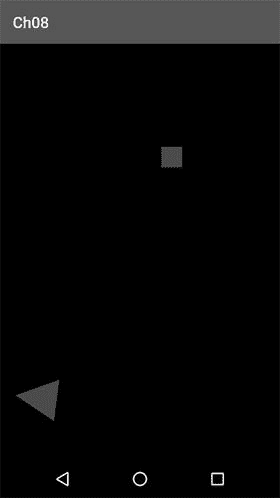

图 8-7.

一个可以发射红色矩形的三角形大炮。令人印象深刻！


好的，作为高级文档工程师和翻译员，我将严格遵循您的格式要求和注意事项，对提供的英文文本进行翻译。


### 物理、碰撞与包围形状

对你来说，这些物理知识已经足够了。有了这个简单的模型，我们可以模拟的远不止炮弹。例如，超级马里奥也可以用大致相同的方式模拟。如果你玩过《超级马里奥兄弟》，你可能会注意到，马里奥在奔跑时需要一点时间才能达到最大速度。这可以通过一个非常快的加速度和速度上限来实现，就像上一节的伪代码那样。跳跃的实现方式与发射炮弹非常相似。马里奥的当前速度会通过一个在 `y` 轴上的初始跳跃速度进行调整（请记住，你可以像添加其他矢量一样添加速度）。同时，你总是会施加一个负的 `y` 轴加速度（重力），这会使他在跳跃后回到地面或掉进坑里。`x` 方向的速度不受 `y` 轴上发生的事情影响。你仍然可以按左或右来改变 `x` 轴的速度。这个简单模型的妙处在于，它允许你用很少的代码实现非常复杂的行为。在编写你的下一个游戏时，你可以使用这种物理模型。

仅仅发射炮弹可没什么意思。你希望能够用炮弹击中物体。为此，你需要一个叫做碰撞检测的东西，我们将在下一节中探讨它。

## 2D 中的碰撞检测与物体表示

一旦你的世界中有了运动的物体，你就会希望它们能够互动。其中一种互动模式就是简单的碰撞检测。当两个物体以某种方式重叠时，我们就说它们发生了碰撞。在 Mr. Nom 游戏中，当你检查 Mr. Nom 是否咬到自己或吃掉墨渍时，我们已经做了一点碰撞检测。

碰撞检测伴随着碰撞响应：一旦我们确定两个物体发生了碰撞，就需要通过合理调整物体的位置和/或运动来响应这次碰撞。例如，当超级马里奥踩到一个板栗仔时，板栗仔就去了板栗仔天堂，而马里奥则会进行另一个小跳跃。一个更复杂的例子是两个或多个台球之间的碰撞与响应。我们现在不需要深入探讨这种类型的碰撞响应，因为它对我们来说过于复杂。我们的碰撞响应通常包括改变物体的状态（例如，让物体爆炸或死亡、收集金币、设置分数等等）。这种响应类型是游戏相关的，因此本节不讨论。

那么，我们如何判断两个物体是否发生了碰撞呢？首先，我们需要考虑何时进行碰撞检查。如果我们的物体遵循上一节讨论的简单物理模型，我们可以在为当前帧和时间步长移动所有物体之后检查碰撞。

### 包围形状

一旦我们确定了物体的最终位置，我们就可以进行碰撞测试，这归根结底就是测试重叠。但是，是哪些部分重叠了呢？我们的每个物体都需要有一个数学上定义的形式或形状来为其提供边界。这种情况下的正确术语是包围形状。

图 8-8 展示了几种包围形状的选择。

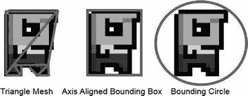

**图 8-8.** Bob 的各种包围形状

图 8-8 中三种包围形状的属性如下：

- **三角形网格**：通过用几个三角形近似物体的轮廓，尽可能紧密地包围物体。它需要最多的存储空间，构造困难，并且测试成本高。然而，它能提供最精确的结果。我们不一定要使用与渲染相同的三角形，而是仅仅存储它们用于碰撞检测。网格可以存储为顶点列表，其中每三个连续的顶点构成一个三角形。为了节省内存，我们也可以使用索引顶点列表。

- **轴对齐包围盒**：通过一个轴对齐的矩形来包围物体，这意味着它的底边和顶边始终与 `x` 轴对齐，左边和右边始终与 `y` 轴对齐。它的测试速度也很快，但不如三角形网格精确。包围盒通常以其左下角的位置以及它的宽度和高度来存储。（在 2D 情况下，这也被称为包围矩形。）

- **包围圆**：用能够包含物体的最小圆来包围物体。它的测试速度非常快，但也是最不精确的包围形状。圆通常以其中心位置和半径来存储。

我们游戏中的每个物体除了其位置、缩放和旋转外，还会得到一个包围形状来包裹它。当然，当我们移动物体时，比如在物理积分步骤中，我们需要根据物体的位置、缩放和旋转来调整包围形状的位置、缩放和旋转。

调整位置变化很容易：我们只需相应地移动包围形状。对于三角形网格，移动每个顶点；对于包围矩形，移动左下角；对于包围圆，移动圆心。

缩放包围形状稍微困难一些。我们需要定义缩放围绕的点。这个点通常是物体的位置，通常也是物体的中心。如果我们采用这个约定，那么缩放就很容易了。对于三角形网格，我们缩放每个顶点的坐标；对于包围矩形，我们缩放其宽度、高度和左下角位置；对于包围圆，我们缩放其半径（圆心等于物体的中心）。

旋转包围形状取决于旋转中心点的定义。使用刚才提到的约定（物体中心为旋转点），旋转也变得容易了。对于三角形网格，我们只需围绕物体中心旋转所有顶点。对于包围圆，我们不需要做任何事情，因为无论我们如何旋转物体，半径都保持不变。包围矩形的处理则稍微复杂一些。我们需要构造所有四个角点，旋转它们，然后找到能够包围这四个点的轴对齐包围矩形。图 8-9 展示了旋转后的三种包围形状。

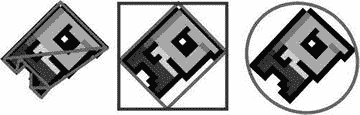

**图 8-9.** 旋转后的包围形状，以物体中心为旋转点

虽然旋转三角形网格或包围圆相当容易，但轴对齐包围盒的结果并不那么令人满意。请注意，原始物体的包围盒比其旋转后的版本更紧密。有一种包围盒变体，称为`有向包围形状`，它在旋转时效果更好，但其缺点是计算更困难。到目前为止介绍的包围形状对于我们（以及大多数现有游戏）的需求来说已经足够了。如果你想了解更多关于有向包围形状的知识，并真正深入探索碰撞检测，我们推荐 Christer Ericson 的著作 *Real-Time Collision Detection*。


好的，作为高级文档工程师和翻译员，我将严格按照您提供的注意事项和示例格式，将给定的英文文本翻译成中文。


## 另一个问题是：我们最初如何为 Bob 创建包围形状？

### 构建包围形状

在图 8-8 所示的示例中，我们只是根据 Bob 的图像手动构建了包围形状。但如果 Bob 的图像是以像素为单位给出的，而你的世界是以米为单位运行的，那该怎么办？这个问题的解决方案涉及归一化和模型空间。

想象一下，当用 OpenGL ES 渲染 Bob 时，我们在模型空间中用于 Bob 的两个三角形。该矩形在模型空间中位于原点居中，并具有与 Bob 纹理图像相同的宽高比（即纹理贴图中的 32×32 像素，相对于模型空间中的 2×2 米）。现在，我们可以应用 Bob 的纹理，并找出包围形状各点在模型空间中的位置。图 8-10 展示了我们如何在模型空间中围绕 Bob 构建包围形状。

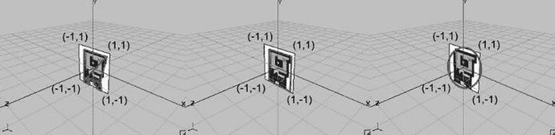

**图 8-10.** Bob 在模型空间中的包围形状

这个过程看起来可能有点繁琐，但涉及的步骤并不难。首先，我们必须记住纹理映射是如何工作的。我们在纹理空间中为 Bob 矩形的每个顶点（由两个三角形组成）指定纹理坐标。纹理空间中纹理图像的左上角位于 `(0,0)`，右下角位于 `(1,1)`，无论图像的实际像素宽度和高度是多少。要将像素空间的图像转换到纹理空间，我们可以使用这个简单的变换：

```
u = x / imageWidth
v = y / imageHeight
```

其中 `u` 和 `v` 是由图像空间中的 `x` 和 `y` 给出的像素的纹理坐标。`imageWidth` 和 `imageHeight` 设置为图像的像素尺寸（在 Bob 的例子中是 32×32）。图 8-11 展示了 Bob 图像的中心如何映射到纹理空间。

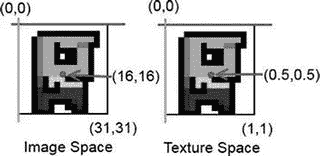

**图 8-11.** 将像素从图像空间映射到纹理空间

纹理被应用到你模型空间中定义的矩形上。在图 8-10 的示例中，左上角位于 `(–1,1)`，右下角位于 `(1,–1)`。我们可以使用米作为世界的单位，因此这个矩形的宽度和高度为 2 米。此外，我们知道左上角的纹理坐标为 `(0,0)`，右下角的纹理坐标为 `(1,1)`，因此我们可以将整个纹理映射到 Bob。这并非总是如此，你将在后面的纹理图集部分看到。

现在我们需要一种通用的方法从纹理空间映射到模型空间。我们可以通过将映射约束为只涉及纹理空间和模型空间中的轴对齐矩形，来简化工作。假设纹理空间中的一个轴对齐矩形区域被映射到模型空间中的一个轴对齐矩形。对于变换，我们需要知道模型空间中矩形的宽度和高度，以及纹理空间中矩形的宽度和高度。在我们的 Bob 示例中，模型空间中有一个 2×2 的矩形，纹理空间中有一个 1×1 的矩形（因为我们将整个纹理映射到了矩形）。我们还需要知道每个矩形在其各自空间中左上角的坐标。对于模型空间矩形，其坐标为 `(–1,1)`；对于纹理空间矩形，其坐标为 `(0,0)`（同样，因为映射的是整个纹理，而不仅仅是一部分）。有了这些信息，以及想要映射到模型空间的像素的 `u` 和 `v` 坐标，我们可以通过以下两个方程进行变换：

```
mx = (u – minU) / (tWidth) × mWidth + minX
my = (1 – ((v – minV) / (tHeight)) × mHeight – minY
```

变量 `u` 和 `v` 是在之前从像素空间到纹理空间的变换中计算出的坐标。变量 `minU` 和 `minV` 是你要从纹理空间映射的区域的左上角坐标。变量 `tWidth` 和 `tHeight` 是你的纹理空间区域的宽度和高度。变量 `mWidth` 和 `mHeight` 是你的模型空间矩形的宽度和高度。变量 `minX` 和 `minY` 是——你猜对了——模型空间中矩形左上角的坐标。最后，`mx` 和 `my` 是模型空间中的变换后坐标。

这些方程接收 `u` 和 `v` 坐标，将它们映射到 0 到 1 的范围，然后在模型空间中缩放并定位它们。图 8-12 展示了纹理空间中的一个纹素以及它如何被映射到模型空间中的一个矩形。在边上，你可以看到 `tWidth` 和 `tHeight` 以及 `mWidth` 和 `mHeight`。每个矩形的左上角对应于纹理空间中的 `(minU, minV)` 和模型空间中的 `(minX, minY)`。

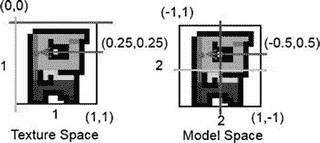

**图 8-12.** 从纹理空间映射到模型空间

代入前两个方程，我们可以直接从像素空间映射到模型空间：

```
mx = ((x / imageWidth) – minU) / (tWidth) * mWidth + minX
my = (1 – (((y / imageHeight) – minV) / (tHeight)) * mHeight – minY
```

我们可以使用这两个方程，根据通过纹理映射应用到对象矩形上的图像，来计算对象的包围形状。对于三角形网格，这可能会变得有点繁琐；包围矩形和包围圆的情况则简单得多。通常，你不需要走这条艰难的路，而是可以创建你的纹理，使得包围矩形至少与通过 OpenGL ES 为该对象渲染的矩形具有相同的宽高比。这样，你可以直接从对象的图像尺寸构建包围矩形。包围圆也是如此。

你现在应该知道如何为 2D 对象构建一个贴合良好的包围形状了。在创建图形资源时手动定义这些包围形状的尺寸，然后在游戏世界中定义对象的单位和大小。然后，你可以在代码中使用这些尺寸来进行碰撞检测。

## 游戏对象属性

Bob 变胖了。除了我们用于渲染的网格（映射到 Bob 图像纹理的矩形）之外，我们现在还有一个数据结构，以某种形式保存他的边界。认识到这一点至关重要：虽然我们根据模型空间中 Bob 的映射版本来建模边界，但实际的边界独立于你映射 Bob 矩形的纹理区域。当然，在创建包围形状时，我们会尽量使其与纹理中 Bob 图像轮廓紧密匹配。然而，纹理图像是 32×32 像素还是 128×128 像素并不重要。因此，我们世界中的一个对象具有以下三个属性组：

- **位置、方向、缩放、速度和加速度**：通过这些属性，我们可以应用上一节中的物理模型。当然，有些对象可能是静态的，因此只会具有位置、方向和缩放。通常情况下，我们甚至可以忽略方向和缩放。对象的位置通常与模型空间的原点重合，如图 8-10 所示。这简化了一些计算。

- **包围形状（通常在模型空间中围绕对象中心构建）**：该形状与对象的位置重合，并与其方向和缩放对齐，如图 8-10 所示。这为对象提供了一个边界，并定义了它在世界中的大小。我们可以根据需要使这个形状变得复杂。例如，我们可以将其制作成由多个包围形状组成的复合形状。


### 图形表示
如图 8-12 所示，我们仍然使用两个三角形为 Bob 组成一个矩形，然后将他的图像纹理映射到该矩形上。该矩形在模型空间中定义，但不必等于其包围形状，如图 8-10 所示。我们发送给 OpenGL ES 的 Bob 图形矩形略大于他的包围矩形。

这种属性分离允许我们应用模型-视图-控制器（MVC）模式，如下所示：

- **模型端**：包含 Bob 的物理属性，由他的位置、缩放、旋转、速度、加速度和包围形状组成。Bob 的位置、缩放和方向决定了其包围形状在世界空间中的位置。
- **视图端**：仅获取 Bob 的图形表示（即在模型空间中定义的两个纹理映射三角形），并根据 Bob 的位置、旋转和缩放，在世界空间位置进行渲染。此处，我们可以像之前一样使用 OpenGL ES 矩阵操作。
- **控制器端**：负责根据用户输入（例如，按下左键可将其向左移动）以及物理力（例如，如前面对炮弹应用的重力加速度）来更新 Bob 的物理属性。

当然，Bob 的包围形状与其纹理中的图形表示之间存在一些对应关系，因为我们是基于该图形表示来构建包围形状的。因此，我们的 MVC 模式并非完全纯粹，但这可以接受。

### 宽相位与窄相位碰撞检测

然而，我们仍然不知道如何检查对象及其包围形状之间的碰撞。碰撞检测分为两个阶段：

- **宽相位**：在此阶段，我们尝试找出哪些对象可能会发生碰撞。假设有 100 个对象可能相互碰撞。如果天真地选择测试每个对象与其他所有对象，我们需要执行 100 × 100 / 2 次重叠测试。这种天真的重叠测试方法的渐近复杂度为 O(n²)，意味着需要 n² 步才能完成（实际上可能只需一半的步骤，但渐近复杂度忽略了常数）。在良好的非暴力宽相位中，我们可以尝试找出哪些对象对实际上存在碰撞风险。其他对象对（例如，距离过远不可能碰撞的两个对象）将不会被检查。通过这种方式，我们可以减少计算负载，因为窄相位测试通常相当昂贵。
- **窄相位**：一旦我们知道哪些对象对可能发生碰撞，我们通过对它们的包围形状执行重叠测试来检查它们是否真的发生碰撞。

我们将首先讨论窄相位，将宽相位留待后面讨论，因为宽相位依赖于我们游戏的一些特性，而窄相位可以独立实现。

### 窄相位

完成宽相位后，我们必须检查可能碰撞对象的包围形状是否重叠。如前所述，我们有几个包围形状选项。三角形网格在计算上最昂贵且创建繁琐，但在大多数 2D 游戏中，你并不需要它们，仅使用包围矩形和包围圆即可胜任，因此我们将重点讨论这些。

#### 圆碰撞

包围圆是检查两个对象是否碰撞的最廉价方式，因此让我们定义一个简单的`Circle`类。清单 8-4 展示了代码。

```java
package com.badlogic.androidgames.framework.math;
public class Circle {
public final Vector2 center = new Vector2();
public float radius;
public Circle(float x, float y, float radius) {
this.center.set(x,y);
this.radius = radius;
}
}
```
*清单 8-4. Circle.java：一个简单的 Circle 类*

我们将圆心存储为一个`Vector2`，半径存储为一个简单`float`。如何检查两个圆是否重叠？请查看图 8-13。

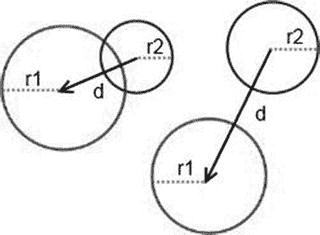

*图 8-13. 两个圆重叠（左）与两个圆不重叠（右）*

这非常简单且计算高效。我们只需要计算两个圆心之间的距离。如果该距离大于两个半径之和，那么我们知道这两个圆不重叠。在代码中，这将如下所示：

```java
public boolean overlapCircles(Circle c1, Circle c2) {
float distance = c1.center.dist(c2.center);
return distance <= c1.radius + c2.radius;
}
```

首先，我们测量两个圆心之间的距离，然后检查该距离是否小于或等于半径之和。

我们必须在`Vector2.dist()`方法中进行平方根运算。这很不幸，因为计算平方根是一个昂贵的操作。我们能使其更快吗？是的，可以——我们只需要重新表述我们的条件：

```
sqrt(dist.x × dist.x + dist.y × dist.y) <= radius1 + radius2
```

通过对方程两边取幂，我们可以去掉平方根，如下所示：

```
dist.x × dist.x + dist.y × dist.y <= (radius1 + radius2) × (radius1 + radius2)
```

我们用一个加法和右侧的乘法交换了平方根。这要好得多。现在，我们可以创建一个`Vector2.distSquared()`函数，返回两个向量之间距离的平方：

```java
public float distSquared(Vector2 other) {
float distX = this.x - other.x;
float distY = this.y - other.y;
return distX * distX + distY * distY;
}
public float distSquared(float x, float y) {
float distX = this.x - x;
float distY = this.y - y;
return distX * distX + distY * distY;
}
```

我们还应该添加第二个`distSquared()`方法，它接受两个`float`（x 和 y）而不是一个向量。

`overlapCircles()`方法随后变为以下内容：

```java
public boolean overlapCircles(Circle c1, Circle c2) {
float distance = c1.center.distSquared(c2.center);
float radiusSum = c1.radius + c2.radius;
return distance <= radiusSum * radiusSum;
}
```

#### 矩形碰撞

对于矩形碰撞，我们首先需要一个可以表示矩形的类。如前所述，我们希望矩形由其左下角位置以及宽度和高度定义。清单 8-5 正是如此。

```java
package com.badlogic.androidgames.framework.math;
public class Rectangle {
public final Vector2 lowerLeft;
public float width, height;
public Rectangle(float x, float y, float width, float height) {
this.lowerLeft = new Vector2(x,y);
this.width = width;
this.height = height;
}
}
```
*清单 8-5. Rectangle.java，一个矩形类*

我们将左下角位置存储在一个`Vector2`实例中，宽度和高度存储在两个`float`中。如何检查两个矩形是否重叠？图 8-14 应该会给你一些提示。

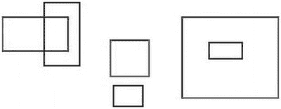

*图 8-14. 许多重叠和不重叠的矩形*

前两种情况，部分重叠（左）和不重叠（中），很容易理解。右边的情况则令人惊讶。当然，一个矩形可以完全包含在另一个矩形中。这在圆的情况下也可能发生。然而，我们的圆重叠测试将正确返回一个圆是否包含在另一个圆中的结果。


检查矩形重叠的情况一开始看起来很复杂。
然而，如果我们运用一点逻辑，就可以创建一个非常简单的测试。以下是检查两个矩形是否重叠的最简单方法：

```
public Boolean overlapRectangles(Rectangle r1, Rectangle r2) {
if(r1.lowerLeft.x  r2.lowerLeft.x &&
r1.lowerLeft.y  r2.lowerLeft.y)
return true;
else
return false;
}
```

第一眼看上去可能会有些困惑，所以让我们逐一分析每个条件。第一个条件指出第一个矩形的左边缘必须在第二个矩形右边缘的左边。下一个条件指出第一个矩形的右边缘必须在第二个矩形左边缘的右边。另外两个条件对于矩形的顶部和底部边缘也是如此。如果满足所有这些条件，则两个矩形重叠。请对照图 8-14 进行双重检查。它同时也涵盖了包含的情况。

## 圆/矩形碰撞

我们可以检查圆和矩形之间的重叠吗？是的，可以。不过，这会稍微复杂一些。请查看图 8-15。

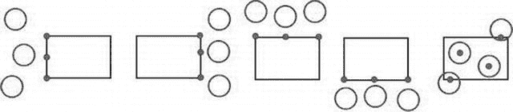

*图 8-15。通过在矩形上/内找到离圆最近的点来测试圆和矩形的重叠*

测试圆和矩形之间重叠的总体策略如下：

*   在矩形上或矩形内找到最接近圆心的 `x` 坐标。该坐标可以是矩形左边缘或右边缘上的点，除非圆心包含在矩形内，在这种情况下，最近的 `x` 坐标就是圆心的 `x` 坐标。
*   在矩形上或矩形内找到最接近圆心的 `y` 坐标。该坐标可以是矩形顶部或底部边缘上的点，除非圆心包含在矩形内，在这种情况下，最近的 `y` 坐标就是圆心的 `y` 坐标。
*   如果由最近的 `x` 和 `y` 坐标组成的点位于圆内，则圆和矩形重叠。

虽然图 8-15 中没有描绘，但此方法也适用于圆完全包含矩形的情况。代码如下：

```
public boolean overlapCircleRectangle(Circle c, Rectangle r) {
float closestX = c.center.x;
float closestY = c.center.y;
if(c.center.x  r.lowerLeft.x + r.width) {
closestX = r.lowerLeft.x + r.width;
}
if(c.center.y  r.lowerLeft.y + r.height) {
closestY = r.lowerLeft.y + r.height;
}
return c.center.distSquared(closestX, closestY) < c.radius * c.radius;
}
```

描述看起来比实现要吓人得多。我们确定矩形上离圆最近的点，然后简单地检查该点是否位于圆内。如果是，则圆和矩形之间存在重叠。

请注意，我们为 `Vector2` 添加了一个重载的 `distSquared()` 方法，该方法接受两个 `float` 参数，而不是另一个 `Vector2`。我们对 `dist()` 函数也做了同样的处理。

## 综合运用

检查一个点是否位于圆或矩形内部也很有用。我们可以编写另外两个方法，并将它们与刚刚定义的另外三个方法一起放入一个名为 `OverlapTester` 的类中。清单 8-6 展示了代码。

```
package com.badlogic.androidgames.framework.math;
public class OverlapTester {
public static boolean overlapCircles(Circle c1, Circle c2) {
float distance = c1.center.distSquared(c2.center);
float radiusSum = c1.radius + c2.radius;
return distance  r2.lowerLeft.x &&
r1.lowerLeft.y  r2.lowerLeft.y)
return true;
else
return false;
}
public static boolean overlapCircleRectangle(Circle c, Rectangle r) {
float closestX = c.center.x;
float closestY = c.center.y;
if(c.center.x  r.lowerLeft.x + r.width) {
closestX = r.lowerLeft.x + r.width;
}
if(c.center.y  r.lowerLeft.y + r.height) {
closestY = r.lowerLeft.y + r.height;
}
return c.center.distSquared(closestX, closestY) = p.x &&
r.lowerLeft.y = p.y;
}
public static boolean pointInRectangle(Rectangle r, float x, float y) {
return r.lowerLeft.x = x &&
r.lowerLeft.y = y;
}
}
*清单 8-6。`OverlapTester.java`：测试圆、矩形和点之间的重叠*
```

太棒了！现在我们有了一个功能齐全的 2D 数学库，可用于我们所有的小型物理模型和碰撞检测。我们准备更详细地研究粗检测阶段。

## 粗检测阶段

那么，我们如何实现粗检测阶段所承诺的神奇效果呢？考虑图 8-16，它展示了一个典型的超级马里奥兄弟场景。

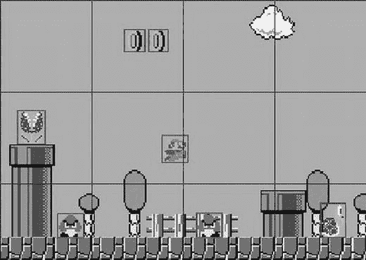

*图 8-16。超级马里奥和他的敌人。对象周围的方框是它们的边界矩形；大框构成了施加在世界的网格。*

你能猜到如何消除一些碰撞检查吗？图 8-16 中的网格代表了我们可以用来划分世界的单元。每个单元具有完全相同的大小，并且整个世界都被单元覆盖。马里奥当前位于其中两个单元中，而马里奥可能与之碰撞的其他对象位于不同的单元中。因此，你不需要检查任何碰撞，因为马里奥与场景中任何其他对象都不在同一个单元中。我们需要做的就是：

*   根据我们的物理和控制器步骤更新世界中的所有对象。
*   根据对象的位置更新每个对象边界形状的位置。当然，我们也可以包含方向和缩放。
*   根据边界形状确定每个对象包含在哪个或哪些单元中，并将它们添加到这些单元包含的对象列表中。
*   检查碰撞，但仅限于可以碰撞（例如，板栗仔不会与其他板栗仔碰撞）并且位于同一单元中的对象对之间。

这被称为空间哈希网格粗检测阶段，实现起来非常简单。首先要定义每个单元的大小。这高度依赖于你为游戏世界使用的比例和单位。

## 一个详尽的例子

我们将基于之前的炮弹示例（位于“实践出真知”部分）开发一个空间哈希网格粗检测阶段。我们将彻底重写它，以整合到目前为止本节涵盖的所有内容。除了大炮和炮弹，我们还想有目标。为了让生活更轻松，我们只使用 `0.5×0.5` 米的正方形作为目标。这些正方形不移动；它们是静态的。我们的大炮也是静态的。唯一移动的是炮弹本身。我们通常可以将游戏世界中的对象分类为静态对象或动态对象。让我们设计一个表示此类对象的类。

### `GameObject`、`DynamicGameObject` 和 `Cannon`

让我们从静态情况或基本情况开始，如清单 8-7 所示。


好的，作为一名高级文档工程师和翻译员，我将遵循您的指示，完成以下中文翻译。

---


```java
package com.badlogic.androidgames.framework;
import com.badlogic.androidgames.framework.math.Rectangle;
import com.badlogic.androidgames.framework.math.Vector2;
public class GameObject {
public final Vector2 position;
public final Rectangle bounds;
public GameObject(float x, float y, float width, float height) {
this.position = new Vector2(x,y);
this.bounds = new Rectangle(x-width/2, y-height/2, width, height);
}
}
```
**代码清单 8-7.** `GameObject.java`：一个带有位置和边界的静态游戏对象

我们游戏中的每个对象都有一个与其中心重合的位置。此外，我们让每个对象都有一个单一的碰撞形状——在此例中是一个矩形。在构造函数中，我们根据参数设置位置和边界矩形（该矩形以对象中心为中心）。

对于动态对象（即移动的对象），我们还需要跟踪速度和加速度（如果对象实际上是被自身加速的，例如，通过引擎或推进器）。代码清单 8-8 展示了 `DynamicGameObject` 类的代码。

```java
package com.badlogic.androidgames.framework;
import com.badlogic.androidgames.framework.math.Vector2;
public class DynamicGameObject extends GameObject {
public final Vector2 velocity;
public final Vector2 accel;
public DynamicGameObject(float x, float y, float width, float height) {
super(x, y, width, height);
velocity = new Vector2();
accel = new Vector2();
}
}
```
**代码清单 8-8.** `DynamicGameObject.java`：扩展 `GameObject`，添加速度和加速度向量

我们扩展了 `GameObject` 类以继承位置和边界成员。此外，我们为速度和加速度创建了向量。一个新的动态游戏对象在初始化后，其速度和加速度将为零。

在我们的炮弹示例中，我们有加农炮、炮弹和目标。炮弹是一个 `DynamicGameObject`，因为它根据我们简单的物理模型移动。目标是静态的，可以使用标准的 `GameObject` 来实现。加农炮也可以通过 `GameObject` 类来实现。我们将从 `GameObject` 类派生一个 `Cannon` 类，并添加一个存储加农炮当前角度的字段。代码清单 8-9 展示了代码。

```java
package com.badlogic.androidgames.gamedev2d;
public class Cannon extends GameObject {
public float angle;
public Cannon(float x, float y, float width, float height) {
super(x, y, width, height);
angle = 0;
}
}
```
**代码清单 8-9.** `Cannon.java`：扩展 `GameObject`，添加一个角度

这很好地封装了在加农炮世界中表示一个对象所需的所有数据。每当我们需要一个特殊类型的对象，比如加农炮时，如果它是静态对象，你可以简单地从 `GameObject` 派生一个；如果它有速度和加速度，则从 `DynamicGameObject` 派生。

> **注意：** 过度使用继承可能会导致严重的头疼问题和非常丑陋的代码架构。不要为了使用而使用它。刚才使用的简单类层次结构没问题，但你不应让它变得更深（例如，扩展 `Cannon`）。还有其他通过组合来消除所有继承的游戏对象表示方法。不过，就你的目标而言，简单的继承就足够了。如果你对其他表示方法感兴趣，可以在网上搜索“composites”或“mixins”。

## 空间哈希网格

我们的加农炮将受限于一个 1×1 米的矩形，炮弹的边界矩形为 0.2×0.2 米，而每个目标的边界矩形为 0.5×0.5 米。边界矩形以每个对象的位置为中心，这样能让我们的工作更简单一些。

当我们的加农炮示例启动时，我们可以简单地将一些目标放置在随机位置。以下是我们如何在世界中设置这些对象：

```java
Cannon cannon = new Cannon(0, 0, 1, 1);
DynamicGameObject ball = new DynamicGameObject(0, 0, 0.2f, 0.2f);
GameObject[] targets = new GameObject[NUM_TARGETS];
for(int i = 0; i < NUM_TARGETS; i++) {
    targets[i] = new GameObject((float)Math.random() * WORLD_WIDTH,
                                (float)Math.random() * WORLD_HEIGHT,
                                0.5f, 0.5f);
}
```

常量 `WORLD_WIDTH` 和 `WORLD_HEIGHT` 定义了游戏世界的大小。所有事情都应该发生在由 (0,0) 和 (`WORLD_WIDTH`, `WORLD_HEIGHT`) 界定的矩形内。图 8-17 展示了目前为止游戏世界的一个简单模型。

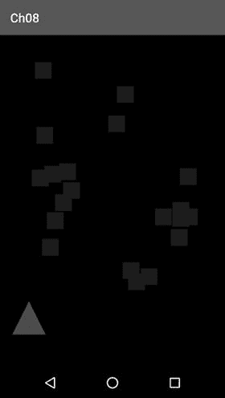

**图 8-17.** 游戏世界的模型图

我们的世界稍后会看起来像这样，但现在我们可以覆盖一个空间哈希网格。哈希网格的单元应该有多大？没有万全之策，但一个好的启发式方法是让单元大小比场景中最大的对象大五倍。在我们的例子中，最大的对象是加农炮，但我们不让任何东西与加农炮碰撞，所以我们可以根据场景中第二大的对象（目标）来设定网格大小。这些目标的尺寸是 0.5×0.5 米。因此，一个网格单元的大小应为 2.5×2.5 米。图 8-18 展示了覆盖在我们世界上的网格。

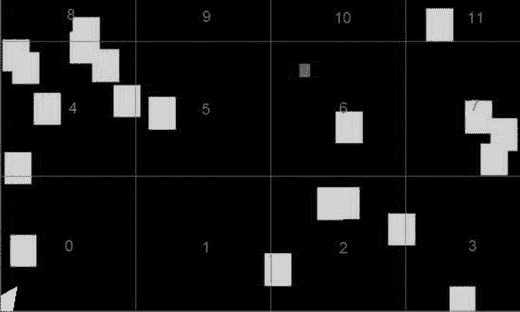

**图 8-18.** 我们的加农炮世界覆盖了一个由 12 个单元组成的空间哈希网格

我们有一个固定数量的单元——在加农炮世界的例子中，是 12 个。我们给每个单元一个唯一的编号，从左下角的单元开始，其 ID 为 0。注意，顶部的单元实际上扩展到了世界之外。这不是问题；我们只需要确保所有对象都保持在世界的边界内。

我们想要做的是找出一个对象属于哪个（些）单元。理想情况下，我们希望计算包含该对象的单元的 ID。这使得我们可以使用以下简单的数据结构来存储单元：

```
List<GameObject>[] cells;
```

没错；我们将每个单元表示为一个 `GameObject` 列表。空间哈希网格本身仅由这些 `GameObject` 列表的数组组成。

现在我们可以计算出一个对象所在单元的 ID。图 8-18 展示了几个跨越两个单元的物体。事实上，一个小物体可以跨越最多四个单元，而一个比网格单元大的物体则可以跨越超过四个单元。通过选择网格单元大小为我们游戏中最大对象大小的倍数，我们可以确保这种情况永远不会发生。这样，一个对象最多只能被包含在四个单元中。

要计算一个对象的单元 ID，我们只需取边界矩形的四个角点，并检查每个角点位于哪个单元。确定一个点所在的单元很容易——我们只需用该点的坐标除以单元宽度。假设你有一个位于 (0.5, 0.8) 的点，单元大小为 2.5×2.5 米：该点将位于 ID 为 5 的单元中，如图 8-18 所示。

我们可以将该点的每个坐标除以单元大小，得到二维整数坐标，如下所示：

```
cellX = floor(point.x / cellSize) = floor(0.5 / 2.5) = 1
cellY = floor(point.y / cellSize) = floor(0.8 / 2.5) = 1
```

然后根据这些单元坐标，我们可以轻松地获得单元 ID：

```
cellId = cellX + cellY × cellsPerRow = 1 + 1 × 4 = 5
```

常量 `cellsPerRow` 仅仅是我们需要覆盖 x 轴上世界所需的单元数量：

```
cellsPerRow = ceil(worldWidth / cellSize) = ceil(9.6 / 2.5) = 4
```

我们可以像这样计算每列所需的单元数量：

```
cellsPerColumn = ceil(worldHeight / cellSize) = ceil(6.4 / 2.5) = 3
```


基于此，我们可以相当轻松地实现空间哈希网格。我们通过设定世界的大小及所需的单元格尺寸来构建它。我们假设所有行动都发生在世界的正象限内，这意味着世界中所有点的`x`和`y`坐标都是正值。这是一个我们可以接受的约束条件。

根据这些参数，空间哈希网格可以计算出所需的单元格数量（`cellsPerRow` × `cellsPerColumn`）。我们还可以添加一个简单的方法来将物体插入网格，该方法会利用物体的边界来确定其所在的单元格。然后，该物体将被添加到每个单元格所包含物体的列表中。如果物体边界形状的某个角点位于网格之外，我们只需忽略该角点即可。

在每一帧中，我们在更新每个物体的位置后，重新将其插入空间哈希网格。不过，在我们的加农炮世界中存在不移动的物体，因此对每一帧都重新插入它们非常浪费资源。通过在每个单元格中存储两个列表，我们区分了动态物体和静态物体。一个列表会每帧更新，仅存放移动的物体；另一个列表则是静态的，只有当插入新静态物体时才会被修改。

最后，我们需要一个方法，该方法返回与目标物体可能发生碰撞的其他物体所在的单元格中的物体列表。这个方法所做的就是检查目标物体所在的单元格，获取这些单元格中的动态和静态物体列表，并将其返回给调用者。当然，我们必须确保不返回任何重复项——这种情况可能发生在物体位于多个单元格时。

清单 8-10 展示了相关代码（大部分代码）。`SpatialHashGrid.getCellIds()` 方法稍后会讨论，因为它稍微复杂一些。

```
package com.badlogic.androidgames.framework;
import java.util.ArrayList;
import java.util.List;
import com.badlogic.androidgames.framework.GameObject;
public class SpatialHashGrid {
List[] dynamicCells;
List[] staticCells;
int cellsPerRow;
int cellsPerCol;
float cellSize;
int[] cellIds = new int[4];
List foundObjects;
Listing 8-10.
Excerpt from SpatialHashGrid.java: A spatial hash grid implementation
```

如前所述，我们存储了两个单元格列表，一个用于动态物体，一个用于静态物体。我们还存储了每行和每列的单元格数量，以便后续判断我们检查的点是否在世界内部或外部。单元格尺寸也需要存储。`cellIds` 数组是一个工作数组，用于临时存储某个 `GameObject` 所在的四个单元格的 ID。如果物体只位于一个单元格内，那么该数组的第一个元素将被设置为完全包含该物体的单元格的 ID。如果物体位于两个单元格中，则该数组的前两个元素将存放相应的单元格 ID，以此类推。为了指示单元格 ID 的数量，我们将数组中所有“空”元素设置为 `–1`。`foundObjects` 列表也是一个工作列表，我们可以在调用 `getPotentialColliders()` 时返回它。为什么我们要保留这两个成员变量，而不是在每次需要时实例化一个新数组和列表呢？请记住垃圾回收器这个“怪物”。

```
@SuppressWarnings("unchecked")
public SpatialHashGrid(float worldWidth, float worldHeight, float cellSize) {
this.cellSize = cellSize;
this.cellsPerRow = (int)Math.ceil(worldWidth / cellSize);
this.cellsPerCol = (int)Math.ceil(worldHeight / cellSize);
int numCells = cellsPerRow * cellsPerCol;
dynamicCells = new List[numCells];
staticCells = new List[numCells];
for(int i = 0; i < numCells; i++) {
dynamicCells[i] = new ArrayList(10);
staticCells[i] = new ArrayList(10);
}
foundObjects = new ArrayList(10);
}
```

该类的构造函数接收世界的大小和所需的单元格尺寸。根据这些参数，我们计算出所需单元格的数量，并实例化单元格数组和存放每个单元格所包含物体对象的列表。同时初始化 `foundObjects` 列表。我们创建的所有 `ArrayList` 实例的初始容量都是十个 `GameObject` 实例，这样做是为了避免内存分配。我们假设单个单元格容纳超过十个 `GameObject` 实例的可能性很低。只要这个假设成立，数组列表就无需调整大小。

```
public void insertStaticObject(GameObject obj) {
int[] cellIds = getCellIds(obj);
int i = 0;
int cellId = -1;
while(i <= 3 && (cellId = cellIds[i++]) != -1) {
staticCells[cellId].add(obj);
}
}
public void insertDynamicObject(GameObject obj) {
int[] cellIds = getCellIds(obj);
int i = 0;
int cellId = -1;
while(i <= 3 && (cellId = cellIds[i++]) != -1) {
dynamicCells[cellId].add(obj);
}
}
```

接下来是 `insertStaticObject()` 和 `insertDynamicObject()` 方法。它们通过调用 `getCellIds()` 计算出物体所在单元格的 ID，然后将物体插入到相应的列表中。`getCellIds()` 方法实际上会填充 `cellIds` 成员数组。

```
public void removeObject(GameObject obj) {
int[] cellIds = getCellIds(obj);
int i = 0;
int cellId = -1;
while(i <= 3 && (cellId = cellIds[i++]) != -1) {
dynamicCells[cellId].remove(obj);
staticCells[cellId].remove(obj);
}
}
```

我们还有一个 `removeObject()` 方法，它可以确定物体所在的单元格，然后将其从对应的动态或静态列表中删除。例如，当游戏对象被摧毁时，就需要用到此方法。

```
public void clearDynamicCells(GameObject obj) {
int len = dynamicCells.length;
for(int i = 0; i < len; i++) {
dynamicCells[i].clear();
}
}
```

`clearDynamicCells()` 方法用于清空所有动态单元格列表。如前所述，我们需要在每一帧重新插入动态物体之前调用此方法。

```
public List getPotentialColliders(GameObject obj) {
foundObjects.clear();
int[] cellIds = getCellIds(obj);
int i = 0;
int cellId = -1;
while(i <= 3 && (cellId = cellIds[i++]) != -1) {
int len = dynamicCells [cellId].size();
for(int j = 0; j < len; j++) {
GameObject collider = dynamicCells[cellId].get(j);
if(!foundObjects.contains(collider))
foundObjects.add(collider);
}
len = staticCells[cellId].size();
for(int j = 0; j < len; j++) {
GameObject collider = staticCells[cellId].get(j);
if(!foundObjects.contains(collider))
foundObjects.add(collider);
}
}
return foundObjects;
}
```

最后，`getPotentialColliders()` 方法接收一个物体，并返回与该物体位于相同单元格中的相邻物体列表。我们使用工作列表 `foundObjects` 来存储找到的物体列表。同样，我们不想在每次调用此方法时都实例化一个新列表。我们只需确定传递给该方法的物体所在的单元格。然后，我们将这些单元格中找到的所有动态和静态物体添加到 `foundObjects` 列表中，并确保没有重复项。使用 `foundObjects.contains()` 来检查重复项当然不是最优方案，但考虑到找到的物体数量永远不会很大，在这种情况下使用它是可以接受的。如果遇到性能问题，那么这将是我们的首选优化对象。遗憾的是，这并非易事。当然，我们可以使用 `Set`，但每次向 `Set` 添加对象时，它都会在内部分配新对象。目前，我们暂且保留现有实现，知道如果性能出现问题，我们可以回过头来处理它。

剩下未提及的方法是 `SpatialHashGrid.getCellIds()`。清单 8-11 展示了其代码。不要害怕，它只是看起来有点吓人。


```java
public int[] getCellIds(GameObject obj) {
int x1 = (int)Math.floor(obj.bounds.lowerLeft.x / cellSize);
int y1 = (int)Math.floor(obj.bounds.lowerLeft.y / cellSize);
int x2 = (int)Math.floor((obj.bounds.lowerLeft.x + obj.bounds.width) / cellSize);
int y2 = (int)Math.floor((obj.bounds.lowerLeft.y + obj.bounds.height) / cellSize);
if(x1 == x2 && y1 == y2) {
if(x1 >= 0 && x1 < cellsPerRow && y1 >= 0 && y1 < cellsPerCol)
cellIds[0] = x1 + y1 * cellsPerRow;
else
cellIds[0] = -1;
}
else if(x1 == x2) {
if(x1 >= 0 && x1 < cellsPerRow) {
if(y1 >= 0 && y1 < cellsPerCol)
cellIds[0] = x1 + y1 * cellsPerRow;
else
cellIds[0] = -1;
if(y2 >= 0 && y2 < cellsPerCol)
cellIds[1] = x1 + y2 * cellsPerRow;
else
cellIds[1] = -1;
}
else {
cellIds[0] = -1;
cellIds[1] = -1;
}
}
else if(y1 == y2) {
if(y1 >= 0 && y1 < cellsPerCol) {
if(x1 >= 0 && x1 < cellsPerRow)
cellIds[0] = x1 + y1 * cellsPerRow;
else
cellIds[0] = -1;
if(x2 >= 0 && x2 < cellsPerRow)
cellIds[1] = x2 + y1 * cellsPerRow;
else
cellIds[1] = -1;
}
else {
cellIds[0] = -1;
cellIds[1] = -1;
}
}
else {
int i = 0;
int y1CellsPerRow = y1 * cellsPerRow;
int y2CellsPerRow = y2 * cellsPerRow;
if(x1 >= 0 && x1 < cellsPerRow && y1 >= 0 && y1 < cellsPerCol)
cellIds[i++] = x1 + y1CellsPerRow;
if(x2 >= 0 && x2 < cellsPerRow && y1 >= 0 && y1 < cellsPerCol)
cellIds[i++] = x2 + y1CellsPerRow;
if(x2 >= 0 && x2 < cellsPerRow && y2 >= 0 && y2 < cellsPerCol)
cellIds[i++] = x2 + y2CellsPerRow;
if(x1 >= 0 && x1 < cellsPerRow && y2 >= 0 && y2 < cellsPerCol)
cellIds[i++] = x1 + y2CellsPerRow;
while(i <= 3) cellIds[i++] = -1;
}
return cellIds;
}
}
代码清单 8-11.
SpatialHashGrid.java 的其余部分：实现 getCellIds()
```

该方法的头四行计算了物体包围盒左下角和右上角的单元格坐标。此计算方法之前已经讨论过。要理解该方法其余部分，需要思考一个物体如何与网格单元格重叠。一共有四种可能性：

*   物体包含在单个单元格内。因此，包围盒左下角和右上角的单元格坐标相同。
*   物体在水平方向上重叠两个单元格。左下角在一个单元格中，右上角在其右侧的单元格中。
*   物体在垂直方向上重叠两个单元格。左下角在一个单元格中，右上角在其上方的单元格中。
*   物体重叠四个单元格。左下角在一个单元格中，右下角在其右侧单元格中，右上角在该单元格上方的单元格中，左上角在第一个单元格上方的单元格中。

该方法所做的只是针对每种可能性进行特殊处理。第一个 `if` 语句处理单单元格的情况，第二个 `if` 语句处理水平方向双单元格的情况，第三个 `if` 语句处理垂直方向双单元格的情况，而 `else` 代码块处理物体重叠四个网格单元格的情况。在这四个代码块中，我们确保仅在相应单元格坐标位于世界范围内时才设置单元格 ID。这就是该方法的全部内容。

看起来，该方法应该需要消耗大量计算资源。确实如此，但消耗比其代码量给人的预期要少。最常见的情况是第一种，处理起来相当廉价。你能看出进一步优化此方法的机会吗？

## 整合所有内容

让我们把本节学到的所有知识整合起来，形成一个不错的小例子。我们可以像前几页讨论的那样，扩展上一节的加农炮例子。我们用 `Cannon` 对象表示加农炮，用 `DynamicGameObject` 对象表示炮弹，并用多个 `GameObject` 对象表示目标。每个目标的尺寸为 0.5×0.5 米，并随机放置在世界中。

我们希望能够击中这些目标。为此，我们需要碰撞检测。我们可以简单地遍历所有目标，将它们与炮弹进行检测，但那太枯燥了。我们使用新颖的 `SpatialHashGrid` 类来加速为当前炮弹位置寻找潜在碰撞目标的过程。不过，我们不将炮弹或加农炮插入网格，因为那并没有实际帮助。

由于这个示例已经相当庞大，它被分割成多个代码片段。测试类命名为 `CollisionTest`，对应的屏幕类命名为 `CollisionScreen`。和往常一样，我们只看屏幕代码。让我们从代码清单 8-12 中的成员变量和构造函数开始。

```java
class CollisionScreen extends Screen {
final int NUM_TARGETS = 20;
final float WORLD_WIDTH = 9.6f;
final float WORLD_HEIGHT = 4.8f;
GLGraphics glGraphics;
Cannon cannon;
DynamicGameObject ball;
List<GameObject> targets;
SpatialHashGrid grid;
Vertices cannonVertices;
Vertices ballVertices;
Vertices targetVertices;
Vector2 touchPos = new Vector2();
Vector2 gravity = new Vector2(0,-10);
public CollisionScreen(Game game) {
super(game);
glGraphics = ((GLGame)game).getGLGraphics();
cannon = new Cannon(0, 0, 1, 1);
ball = new DynamicGameObject(0, 0, 0.2f, 0.2f);
targets = new ArrayList<GameObject>(NUM_TARGETS);
grid = new SpatialHashGrid(WORLD_WIDTH, WORLD_HEIGHT, 2.5f);
for(int i = 0; i < NUM_TARGETS; i++) {
GameObject target = new GameObject((float)Math.random() * WORLD_WIDTH,
(float)Math.random() * WORLD_HEIGHT,
0.5f, 0.5f);
grid.insertStaticObject(target);
targets.add(target);
}
cannonVertices = new Vertices(glGraphics, 3, 0, false, false);
cannonVertices.setVertices(new float[] { -0.5f, -0.5f,
0.5f, 0.0f,
-0.5f, 0.5f }, 0, 6);
ballVertices = new Vertices(glGraphics, 4, 6, false, false);
ballVertices.setVertices(new float[] { -0.1f, -0.1f,
0.1f, -0.1f,
0.1f,  0.1f,
-0.1f,  0.1f }, 0, 8);
ballVertices.setIndices(new short[] {0, 1, 2, 2, 3, 0}, 0, 6);
targetVertices = new Vertices(glGraphics, 4, 6, false, false);
targetVertices.setVertices(new float[] { -0.25f, -0.25f,
0.25f, -0.25f,
0.25f,  0.25f,
-0.25f,  0.25f }, 0, 8);
targetVertices.setIndices(new short[] {0, 1, 2, 2, 3, 0}, 0, 6);
}
代码清单 8-12.
CollisionTest.java 摘录：成员变量和构造函数
```

我们可以从 `CannonGravityScreen` 移植大量代码。我们首先定义几个常量，用于控制目标数量和世界大小。接下来，我们有 `GLGraphics` 实例，以及用于加农炮、炮弹和目标的存储在一个列表中的对象。当然，我们还有一个 `SpatialHashGrid`。为了渲染我们的世界，我们需要几个网格：一个用于加农炮，一个用于炮弹，一个用于渲染每个目标。回想一下，在 `BobTest` 中，我们只需要一个矩形就能在屏幕上渲染出 100 个 Bob。我们在这里复用这个原则。最后两个成员与 `CannonGravityTest` 中的相同。我们使用它们来发射炮弹，并在用户触摸屏幕时应用重力。

构造函数执行了之前讨论的所有操作：实例化世界对象和网格。唯一有趣的是，我们还将目标作为静态对象添加到了空间哈希网格中。

现在，来看代码清单 8-13 中 `CollisionTest` 类的下一个方法。

```java
@Override
public void update(float deltaTime) {
List<TouchEvent> touchEvents = game.getInput().getTouchEvents();
game.getInput().getKeyEvents();
int len = touchEvents.size();
for (int i = 0; i < len; i++) {
TouchEvent event = touchEvents.get(i);
touchPos.x = (event.x / (float)glGraphics.getWidth()) * WORLD_WIDTH;
touchPos.y = (1 - event.y / (float)glGraphics.getHeight()) * WORLD_HEIGHT;
if(event.type == TouchEvent.TOUCH_UP) {
ball.position.set(touchPos);
ball.velocity.set(cannon.angleVector).mul(10);
}
}
cannon.angleVector.set(touchPos.sub(cannon.position)).nor();
ball.update(deltaTime, gravity);
List<GameObject> colliders = grid.getPotentialColliders(ball);
len = colliders.size();
for(int i = 0; i < len; i++) {
GameObject collider = colliders.get(i);
if(OverlapTester.overlapRectangles(ball.bounds, collider.bounds)) {
grid.removeObject(collider);
targets.remove(collider);
}
}
}
代码清单 8-13.
CollisionTest.java 摘录：update() 方法
```

和往常一样，我们首先获取触摸和按键事件，并且只遍历触摸事件。触摸事件的处理方式与 `CannonGravityTest` 中几乎相同。唯一的区别在于，我们使用 `Cannon` 对象代替了旧示例中的向量，并且在触摸弹起事件后，当加农炮准备发射时，我们会重置炮弹的包围盒。


下一个变化在于我们如何更新球体。我们没有使用直接的向量，而是使用了为球体实例化的`DynamicGameObject`类的成员。我们忽略了`DynamicGameObject.acceleration`成员，而是将重力添加到球体的速度中。我们将球体的速度乘以 2，以使炮弹飞得更快一点。有趣的是，我们不仅更新了球体的位置，还更新了其包围矩形左下角的位置。这一点至关重要，否则我们的球体会移动，但其包围矩形不会移动。我们为什么不直接使用球体的包围矩形来存储球体的位置呢？因为一个对象可能附加多个包围形状。那么哪个包围形状会持有该对象的实际位置呢？因此，将这两者分开是有益的，并且仅引入轻微的计算开销。当然，我们可以通过仅将速度乘以增量时间一次来优化这一点。这样，开销将简化为两次额外的加法——这是为我们获得的灵活性所付出的微小代价。

该方法的最后一部分是我们的碰撞检测代码。我们在空间哈希网格中查找与炮弹位于相同单元格内的目标。我们使用`SpatialHashGrid.getPotentialColliders()`方法来实现这一点。由于该方法会直接评估球体所在单元格，因此我们不需要将球体插入到网格中。接下来，我们遍历所有潜在的碰撞体，并检查球体的包围矩形与潜在碰撞体的包围矩形之间是否确实存在重叠。如果存在重叠，我们只需将该目标从目标列表中移除。请记住，我们只将目标作为静态对象添加到网格中。

以上就是我们完整的游戏机制。最后一块拼图是实际的渲染，这应该不会让你感到惊讶。请参阅清单 8-14 中的代码。

```java
@Override
public void present(float deltaTime) {
GL10 gl = glGraphics.getGL();
gl.glViewport(0, 0, glGraphics.getWidth(), glGraphics.getHeight());
gl.glClear(GL10.GL_COLOR_BUFFER_BIT);
gl.glMatrixMode(GL10.GL_PROJECTION);
gl.glLoadIdentity();
gl.glOrthof(0, WORLD_WIDTH, 0, WORLD_HEIGHT, 1, -1);
gl.glMatrixMode(GL10.GL_MODELVIEW);
gl.glColor4f(0, 1, 0, 1);
targetVertices.bind();
int len = targets.size();
for(int i = 0; i < len; i++) {
GameObject target = targets.get(i);
gl.glLoadIdentity();
gl.glTranslatef(target.position.x, target.position.y, 0);
targetVertices.draw(GL10.GL_TRIANGLES, 0, 6);
}
targetVertices.unbind();
gl.glLoadIdentity();
gl.glTranslatef(ball.position.x, ball.position.y, 0);
gl.glColor4f(1,0,0,1);
ballVertices.bind();
ballVertices.draw(GL10.GL_TRIANGLES, 0, 6);
ballVertices.unbind();
gl.glLoadIdentity();
gl.glTranslatef(cannon.position.x, cannon.position.y, 0);
gl.glRotatef(cannon.angle, 0, 0, 1);
gl.glColor4f(1,1,1,1);
cannonVertices.bind();
cannonVertices.draw(GL10.GL_TRIANGLES, 0, 3);
cannonVertices.unbind();
}
```
清单 8-14. 摘自`CollisionTest.java`：`present()`方法

这里没有什么新内容。和往常一样，我们首先设置投影矩阵和视口，并清除屏幕。接下来，我们渲染所有目标，重用存储在`targetVertices`中的矩形模型。这和我们在`BobTest`中所做的本质上是一样的，但这次我们渲染的是目标而不是其他内容。接着，我们像在`CollisionGravityTest`中那样渲染球体和炮台。

唯一需要注意的是，我们改变了绘制顺序，以便球体始终显示在目标之上，而炮台始终显示在球体之上。我们还通过调用`glColor4f()`将目标颜色设置为绿色。

这个小测试的输出与图 8-17 完全相同，因此我们可以避免重复。当我们发射炮弹时，它将穿过目标区域。任何被炮弹击中的目标都将从这个世界中移除。

如果你对这个示例稍加打磨，并添加一些激励性的游戏机制，它实际上可以成为一个不错的游戏。你能想到一些改进吗？稍微玩玩这个示例，感受一下我们在过去几页中开发的新工具。

本章还有更多内容需要讨论：摄像机、纹理图集和精灵。这些使用了与图形相关的技巧，这些技巧与我们的游戏世界模型无关。是时候继续了！

## 二维摄像机

到目前为止，我们的代码中还没有摄像机的概念；我们只是通过`glOrthof()`定义了我们视景体的范围，就像这样：

```java
gl.glMatrixMode(GL10.GL_PROJECTION);
gl.glLoadIdentity();
gl.glOrthof(0, FRUSTUM_WIDTH, 0, FRUSTUM_HEIGHT, 1, -1);
```

从第 7 章我们知道，前两个参数定义了视景体在世界中左侧和右侧边缘的 x 坐标，接下来两个参数定义了视景体底部和顶部边缘的 y 坐标，最后两个参数定义了近裁剪平面和远裁剪平面。图 8-19 再次展示了那个视景体。

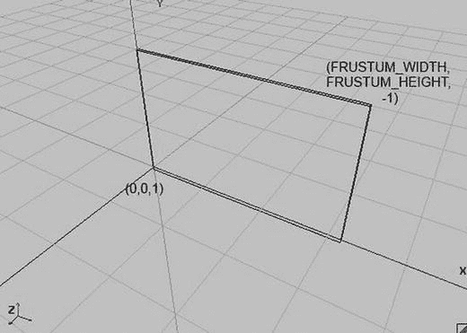

图 8-19. 你的二维世界的视景体（再次展示）

因此，我们只能看到世界 (0,0,1) 到 (`FRUSTUM_WIDTH`, `FRUSTUM_HEIGHT`,–1) 的区域。如果我们能够移动视景体，比如说向左移动，那不是很棒吗？当然，这会很棒，而且实现起来也非常简单：

```java
gl.glOrthof(x, x + FRUSTUM_WIDTH, 0, FRUSTUM_HEIGHT, 1, -1);
```

在这个例子中，`x`只是你定义的一个偏移量。当然，我们也可以在 x 轴和 y 轴上移动：

```java
gl.glOrthof(x, x + FRUSTUM_WIDTH, y, y +FRUSTUM_HEIGHT, 1, -1);
```

图 8-20 展示了这代表什么。

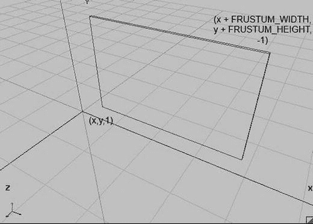

图 8-20. 移动视景体

我们只需在世界空间中指定视景体的左下角。这已经足以实现一个可自由移动的二维摄像机。但我们还能做得更好。如果不使用`x`和`y`指定视景体的左下角，而是指定视景体的中心呢？这样，我们可以轻松地将视景体聚焦在某个特定位置的对象上——比如前面例子中的炮弹：

```java
gl.glOrthof(x – FRUSTUM_WIDTH / 2, x + FRUSTUM_WIDTH / 2, y – FRUSTUM_HEIGHT / 2, y +FRUSTUM_HEIGHT / 2, 1, -1);
```

图 8-21 展示了这看起来像什么。

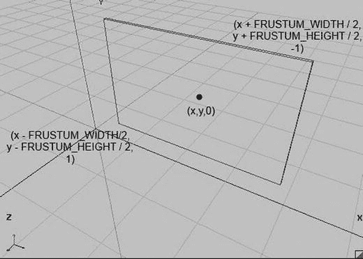

图 8-21. 根据视景体的中心来指定它

这仍然不是我们能用`glOrthof()`做的全部。那缩放呢？想想看。我们知道，通过`glViewportf()`，你可以告诉 OpenGL ES 我们希望在屏幕的哪个部分渲染视景体内的内容。OpenGL ES 会自动拉伸和缩放输出以对齐到视口。现在，如果我们缩小视景体的宽度和高度，我们将在屏幕上显示世界的一个更小区域——这就是放大。如果我们增大视景体，我们可以显示更多世界内容——这就是缩小。因此，我们可以引入一个缩放因子，并将其乘以视景体的宽度和高度来实现放大和缩小。因子为 1 将使用正常的视景体宽度和高度显示世界，如图 8-21 所示。因子小于 1 将聚焦于视景体的中心进行放大，而因子大于 1 则会缩小，显示更多世界内容（例如，将缩放因子设置为 2 将显示两倍的世界内容）。以下是我们如何使用`glOrthof()`来实现这一点：

```java
gl.glOrthof(x – FRUSTUM_WIDTH / 2 * zoom, x + FRUSTUM_WIDTH / 2 * zoom, y – FRUSTUM_HEIGHT / 2 * zoom, y +FRUSTUM_HEIGHT / 2 * zoom, 1, -1);
```


太简单了！我们现在可以创建一个摄像机类，该类包含一个观察位置（视锥体的中心）、一个标准视锥体宽度和高度，以及一个缩放因子，该因子可以使视锥体变小或变大，从而显示更少的世界（放大）或更多的世界（缩小）。图 8-22 展示了一个缩放因子为 0.5（内部灰色框）的视锥体，以及一个缩放因子为 1（外部透明框）的视锥体。

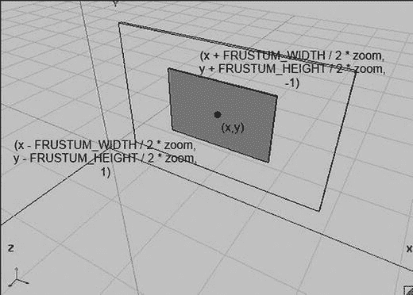

**图 8-22.** 通过操作视锥体大小进行缩放

为了完善我们的方案，我们还需要添加一个功能。想象一下，当我们触摸屏幕时，想要找出我们触摸的是 2D 世界中的哪个点。在我们迭代改进的加农炮示例中，我们已经做过几次了。对于不考虑摄像机位置和缩放的视锥体配置，如图 8-19 所示，我们有以下方程（参见我们加农炮示例中的`update()`方法）：

```
worldX = (touchX / Graphics.getWidth()) × FRUSTUM_WIDTH;
worldY = (1 – touchY / Graphics.getHeight()) × FRUSTUM_HEIGHT;
```

首先，我们将触摸点的`x`和`y`坐标除以屏幕的宽度和高度，归一化到 0 到 1 的范围，然后通过乘以视锥体的宽度和高度，将它们转换到世界空间坐标。我们所要做的，就是将视锥体的位置以及缩放因子考虑进去。具体做法如下：

```
worldX = (touchX / Graphics.getWidth()) × FRUSTUM_WIDTH + x – FRUSTUM_WIDTH / 2;
worldY = (1 – touchY / Graphics.getHeight()) × FRUSTUM_HEIGHT + y – FRUSTUM_HEIGHT / 2;
```

这里，`x`和`y`是摄像机在世界空间中的位置。

## Camera2D 类

让我们将所有这些整合到一个类中。我们希望该类存储摄像机的位置、标准视锥体宽度和高度以及缩放因子。我们还需要一个方便的方法来正确设置视口（始终使用整个屏幕）和投影矩阵。此外，我们还需要一个可以将触摸坐标转换为世界坐标的方法。代码清单 8-15 展示了我们的新`Camera2D`类及其注释。

```
package com.badlogic.androidgames.framework.gl;
import javax.microedition.khronos.opengles.GL10;
import com.badlogic.androidgames.framework.impl.GLGraphics;
import com.badlogic.androidgames.framework.math.Vector2;
public class Camera2D {
public final Vector2 position;
public float zoom;
public final float frustumWidth;
public final float frustumHeight;
final GLGraphics glGraphics;
Listing 8-15.
Camera2D.java: 我们崭新的用于 2D 渲染的摄像机类
```

如上所述，我们将摄像机的位置、视锥体宽度和高度以及缩放因子作为成员存储。位置和缩放因子是公开的，因此我们可以轻松操作它们。我们还需要一个对`GLGraphics`的引用，这样我们就可以获取屏幕的实时像素宽度和高度，用于将触摸坐标转换为世界坐标。

```
public Camera2D(GLGraphics glGraphics, float frustumWidth, float frustumHeight) {
this.glGraphics = glGraphics;
this.frustumWidth = frustumWidth;
this.frustumHeight = frustumHeight;
this.position = new Vector2(frustumWidth / 2, frustumHeight / 2);
this.zoom = 1.0f;
}
```

在构造函数中，我们接收一个`GLGraphics`实例以及缩放因子为 1 时的视锥体宽度和高度作为参数。我们将它们存储起来，并将摄像机的位置初始化为观察由`(0,0,1)`和`(frustumWidth, frustumHeight, -1)`界定的盒子的中心，如图 8-19 所示。初始缩放因子设置为 1。

```
public void setViewportAndMatrices() {
GL10 gl = glGraphics.getGL();
gl.glViewport(0, 0, glGraphics.getWidth(), glGraphics.getHeight());
gl.glMatrixMode(GL10.GL_PROJECTION);
gl.glLoadIdentity();
gl.glOrthof(position.x - frustumWidth * zoom / 2,
position.x + frustumWidth * zoom / 2,
position.y - frustumHeight * zoom / 2,
position.y + frustumHeight * zoom / 2,
1, -1);
gl.glMatrixMode(GL10.GL_MODELVIEW);
gl.glLoadIdentity();
}
```

`setViewportAndMatrices()`方法将视口设置为覆盖整个屏幕，并根据摄像机的参数设置投影矩阵，如前所述。在该方法的最后，我们告诉 OpenGL ES 之后的所有矩阵操作将针对模型-视图矩阵，并加载一个单位矩阵。我们每帧都调用此方法，以便我们可以从一个干净的状态开始——无需再直接调用 OpenGL ES 来设置视口和投影矩阵。

```
public void touchToWorld(Vector2 touch) {
touch.x = (touch.x / (float) glGraphics.getWidth()) * frustumWidth * zoom;
touch.y = (1 - touch.y / (float) glGraphics.getHeight()) * frustumHeight * zoom;
touch.add(position).sub(frustumWidth * zoom / 2, frustumHeight * zoom / 2);
}
```

`touchToWorld()`方法接收一个包含触摸坐标的`Vector2`实例，并将其向量转换到世界空间。这与我们刚才讨论的方法相同；唯一的区别是我们现在可以使用我们精巧的`Vector2`类。

## 一个示例

现在，我们将在加农炮示例中使用`Camera2D`类。复制`CollisionTest`文件并将其重命名为`Camera2DTest`。将文件中的`GLGame`类重命名为`Camera2DTest`，并将`CollisionScreen`类重命名为`Camera2DScreen`。我们需要做一些小的改动来使用我们的新`Camera2D`类。

首先，我们向`Camera2DScreen`类添加一个新成员：

```
Camera2D camera;
```

我们在构造函数中初始化这个成员，如下所示：

```
camera = new Camera2D(glGraphics, WORLD_WIDTH, WORLD_HEIGHT);
```

我们传入`GLGraphics`实例以及世界的宽度和高度（此前我们在调用`glOrthof()`时将其用作视锥体的宽度和高度）。现在我们需要做的，就是在`present()`方法中替换掉我们直接调用 OpenGL ES 的代码，这些代码原本是这样的：

```
gl.glViewport(0, 0, glGraphics.getWidth(), glGraphics.getHeight());
gl.glClear(GL10.GL_COLOR_BUFFER_BIT);
gl.glMatrixMode(GL10.GL_PROJECTION);
gl.glLoadIdentity();
gl.glOrthof(0, WORLD_WIDTH, 0, WORLD_HEIGHT, 1, -1);
gl.glMatrixMode(GL10.GL_MODELVIEW);
```

我们将它们替换为：

```
gl.glClear(GL10.GL_COLOR_BUFFER_BIT);
camera.setViewportAndMatrices();
```

当然，我们仍然需要清除帧缓冲区，但所有其他直接调用 OpenGL ES 的代码现在都优雅地封装在`Camera2D.setViewportAndMatrices()`方法内部。如果你运行这段代码，你会发现没有任何变化。一切和以前一样——我们所做的只是让事情更简洁、更灵活。

我们还可以简化测试中的`update()`方法。既然我们已经向`Camera2D`类添加了`Camera2D.touchToWorld()`方法，我们最好使用它。我们可以将`update()`方法中的这段代码片段：

```
touchPos.x = (event.x / (float) glGraphics.getWidth()) * WORLD_WIDTH;
touchPos.y = (1 - event.y / (float) glGraphics.getHeight()) * WORLD_HEIGHT;
```

替换为：

```
camera.touchToWorld(touchPos.set(event.x, event.y));
```

很简洁——现在一切都完美地封装起来了。但是，如果我们不充分利用`Camera2D`类的特性，那就太无聊了。计划是这样的：只要炮弹没有飞出，我们就希望摄像机以“正常”的方式观察世界。这很简单；我们已经这样做了。我们可以通过检查炮弹位置的`y`坐标是否小于或等于零来确定炮弹是否在飞行。由于我们总是对炮弹施加重力，即使我们不发射它，它也会下落，所以这是一个检查状态的简便方法。


### 我们的新功能

当炮弹在空中飞行时（即 y 坐标大于零），新增加的功能将生效。我们希望摄像机跟随炮弹。只需将摄像机的位置设置为炮弹的位置即可实现这一目标。这将始终使炮弹保持在屏幕中央。我们还希望尝试缩放功能，因此可以根据炮弹的 y 坐标增加缩放系数：炮弹离零点越远，缩放系数越大。如果炮弹的 y 坐标更高，这将使摄像机拉远。以下是我们需要在测试屏幕的`update()`方法末尾添加的内容：

```
if(ball.position.y > 0) {
    camera.position.set(ball.position);
    camera.zoom = 1 + ball.position.y / WORLD_HEIGHT;
} else {
    camera.position.set(WORLD_WIDTH / 2, WORLD_HEIGHT / 2);
    camera.zoom = 1;
}
```

只要炮弹的 y 坐标大于零，摄像机就会跟随它并拉远。只需在标准缩放系数 1 的基础上加上一个值即可。该值就是炮弹的 y 坐标与世界高度之间的比例关系。如果炮弹的 y 坐标等于`WORLD_HEIGHT`，缩放系数将为 2，这样我们就能看到更多游戏世界。这种实现方式非常灵活——我们可以自由选择任何计算公式，没有什么特别的限制。如果炮弹的 y 坐标小于或等于零，则按照之前示例中的方式正常显示世界。

### 纹理图集：因为分享是关爱

到目前为止，我们在程序中只使用了单一纹理。如果我们想渲染不仅仅是 Bob，还有其他超级英雄、敌人、爆炸或金币，该怎么办？我们可以使用多个纹理，每个纹理存储一种对象类型的图像。但 OpenGL ES 对此不太适应，因为每渲染一种对象类型，我们都需要切换纹理（例如，绑定 Bob 的纹理，渲染 Bob；绑定金币纹理，渲染金币，以此类推）。更高效的方式是将多个图像放入单一纹理中。这就是纹理图集：一个包含多个图像的单一纹理。我们只需绑定该纹理一次，即可渲染图集中包含图像的任何实体类型。这减少了状态切换的开销，提高了性能。图 8-23 展示了这样一个纹理图集。

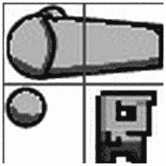

**图 8-23. 纹理图集**

图 8-23 中有三个对象：一门大炮、一个炮弹和 Bob。网格不是纹理的一部分，它只是为了说明我们通常如何手动创建纹理图集。

该纹理图集大小为 64×64 像素，每个网格单元为 32×32 像素。大炮占据两个网格单元，炮弹占据不到四分之一个单元，Bob 占据一个单元。现在，回顾一下之前如何定义大炮、炮弹和目标的边界（以及图形矩形），你会发现它们之间的尺寸关系与纹理图集中的网格关系非常相似。在游戏世界中，目标大小为 0.5×0.5 米，大炮为 0.2×0.2 米。在我们的纹理图集中，Bob 占据 32×32 像素，炮弹略小于 16×16 像素。纹理图集与世界对象大小之间的关系应该很明确：图集中的 32 像素对应世界中的 0.5 米。原始示例中大炮为 1×1 米，但当然我们可以更改此设置。根据我们的纹理图集，大炮占据 64×32 像素，因此在游戏世界中，大炮的大小应为 1×0.5 米。这简直太简单了，不是吗？

那么，为什么选择 32 像素对应世界中的 1 米呢？请记住，纹理的宽度和高度必须是 2 的幂次方。使用 32 这样的 2 的幂次方像素单位来对应世界中的 0.5 米，是艺术家应对纹理尺寸限制的一种便捷方式。这也使得在像素艺术中更容易把握不同对象在游戏世界中的尺寸关系。

请注意，我们并非只能使用每个世界单位对应更多像素。我们可以选择 64 像素或 50 像素对应 0.5 米。那么，合适的像素与米的比例是多少呢？这同样取决于游戏运行的屏幕分辨率。让我们做一些计算。

大炮世界的左下角为(0,0)，右上角为(9.6,4.8)。这会被映射到屏幕上。我们可以计算出一台低端设备（横屏模式下 480×320 像素）屏幕上的每世界单位像素数：

`pixelsPerUnitX = screenWidth / worldWidth = 480 / 9.6 = 50 像素/米`

`pixelsPerUnitY = screenHeight / worldHeight = 320 / 6.4 = 50 像素/米`

现在，大炮在世界中占据 1×0.5 米，因此在屏幕上将使用 50×25 像素。我们从纹理中提取 64×32 像素的区域，因此在渲染大炮时实际上对纹理图像进行了一点缩小。这完全没问题——OpenGL ES 会自动为我们处理。根据我们为纹理设置的缩小过滤器，结果要么是清晰且像素化的（`GL_NEAREST`），要么是稍微平滑的（`GL_LINEAR`）。如果希望在 480x320 像素的设备上实现像素完美渲染，我们需要对纹理图像进行一些缩放。我们可以使用 25×25 像素的网格大小，而不是 32×32 像素。然而，如果只是调整图集图像的大小（或者更确切地说是手动重新绘制所有内容），我们最终会得到一个 50×50 像素的图像——这在 OpenGL ES 中是不可行的。我们需要在左侧和底部添加填充，以得到 64×64 像素的图像（因为 OpenGL ES 要求纹理宽度和高度为 2 的幂次方）。因此，在低端设备上使用 OpenGL ES 对纹理图像进行缩小是没问题的。

那么在更高分辨率的设备上，比如 HTC Desire HD（横屏模式下 800×480 像素），情况又如何呢？让我们通过以下公式计算该屏幕配置的参数：

`pixelsPerUnitX = screenWidth / worldWidth = 800 / 9.6 = 83 像素/米`

`pixelsPerUnitY = screenHeight / worldHeight = 480 / 6.4 = 75 像素/米`

我们在 x 轴和 y 轴上获得不同的每单位像素数，因为视锥体的宽高比（9.6 / 6.4 = 1.5）与屏幕的宽高比（800 / 480 = 1.66）不同。这在第 4 章中讨论过，当时概述了一些解决方案。那时，我们针对固定的像素大小和宽高比；现在，我们可以采用相同的方案，针对固定的视锥体宽度和高度。在 HTC Desire HD 的情况下，大炮、炮弹和 Bob 会因为更高的分辨率以及不同的宽高比而被放大和拉伸。我们接受这个事实，因为我们希望所有玩家都能看到相同的游戏世界区域。否则，拥有更高宽高比的玩家将拥有能够看到更多游戏世界的优势。

那么，如何使用这样的纹理图集呢？只需重新映射我们的矩形坐标。我们不再使用整个纹理，而只使用其中的一部分。为了计算纹理图集中图像角点的纹理坐标，我们可以复用前面示例中的公式。以下是快速回顾：

`u = x / imageWidth`
`v = y / imageHeight`

其中，`u`和`v`是纹理坐标，`x`和`y`是像素坐标。Bob 在像素坐标系中的左上角坐标为(32,32)。如果将其代入上述公式，我们得到纹理坐标为(0.5,0.5)。我们可以对任何其他需要的角点执行相同操作，并据此为矩形的顶点设置正确的纹理坐标。

## 示例


#### 纹理图集集成

我们将这个纹理图集添加到先前的示例中，使其看起来更美观。`Bob` 将成为你的目标。

复制 `Camera2DTest` 并稍作修改。将副本放入名为 `TextureAtlasTest.java` 的文件中，并相应地重命名其中包含的两个类（`TextureAtlasTest` 和 `TextureAtlasScreen`）。

我们做的第一件事是向 `TextureAtlasScreen` 添加一个新成员：

```
Texture texture;
```

我们不在构造函数中创建 `Texture`，而是在 `resume()` 方法中创建它。请记住，当应用程序从暂停状态恢复时，纹理将会丢失，因此我们必须在 `resume()` 方法中重新创建它们：

```
@Override
public void resume() {
    texture = new Texture(((GLGame)game), "atlas.png");
}
```

将图 8-23 中的图片放入项目的 `assets/` 文件夹中，并将其命名为 `atlas.png`。（当然，它不包含图中所示的网格线。）

接下来，我们需要更改顶点的定义。我们为每种实体类型（炮台、炮弹和 Bob）提供一个 `Vertices` 实例；每个实例持有一个由四个顶点和六个索引组成的矩形，构成两个三角形。我们需要做的就是根据纹理图集为每个顶点添加纹理坐标。我们还将炮台从三角形改为 1×0.5 米的矩形。以下是我们替换构造函数中旧顶点创建代码的内容：

```
cannonVertices = new Vertices(glGraphics, 4, 6, false, true);
cannonVertices.setVertices(new float[] { -0.5f, -0.25f, 0.0f, 0.5f,
                                         0.5f, -0.25f, 1.0f, 0.5f,
                                         0.5f,  0.25f, 1.0f, 0.0f,
                                        -0.5f,  0.25f, 0.0f, 0.0f }, 0, 16);
cannonVertices.setIndices(new short[] {0, 1, 2, 2, 3, 0}, 0, 6);

ballVertices = new Vertices(glGraphics, 4, 6, false, true);
ballVertices.setVertices(new float[] { -0.1f, -0.1f, 0.0f, 0.75f,
                                       0.1f, -0.1f, 0.25f, 0.75f,
                                       0.1f,  0.1f, 0.25f, 0.5f,
                                      -0.1f,  0.1f, 0.0f, 0.5f }, 0, 16);
ballVertices.setIndices(new short[] {0, 1, 2, 2, 3, 0}, 0, 6);

targetVertices = new Vertices(glGraphics, 4, 6, false, true);
targetVertices.setVertices(new float[] { -0.25f, -0.25f, 0.5f, 1.0f,
                                         0.25f, -0.25f, 1.0f, 1.0f,
                                         0.25f,  0.25f, 1.0f, 0.5f,
                                        -0.25f,  0.25f, 0.5f, 0.5f }, 0, 16);
targetVertices.setIndices(new short[] {0, 1, 2, 2, 3, 0}, 0, 6);
```

现在，我们的每个网格都由四个顶点组成，每个顶点都有一个 2D 位置和纹理坐标。我们向网格添加六个索引，指定要渲染的两个三角形。炮台在 y 轴上稍微小了一点。它现在的尺寸是 1×0.5 米，而不是 1×1 米。这也体现在先前的构造函数中 `Cannon` 对象的构造上：

```
cannon = new Cannon(0, 0, 1, 0.5f);
```

因为我们没有对炮台本身进行碰撞检测，所以在该构造函数中设置什么尺寸并不重要；我们这样做只是为了保持一致性。

我们需要更改的最后一件事是渲染方法。以下是完整的渲染方法：

```
@Override
public void present(float deltaTime) {
    GL10 gl = glGraphics.getGL();
    gl.glClear(GL10.GL_COLOR_BUFFER_BIT);
    camera.setViewportAndMatrices();
    gl.glEnable(GL10.GL_BLEND);
    gl.glBlendFunc(GL10.GL_SRC_ALPHA, GL10.GL_ONE_MINUS_SRC_ALPHA);
    gl.glEnable(GL10.GL_TEXTURE_2D);
    texture.bind();
    targetVertices.bind();
    int len = targets.size();
    for(int i = 0; i < len; i++) {
        GameObject target = targets.get(i);
        gl.glLoadIdentity();
        gl.glTranslatef(target.position.x, target.position.y, 0);
        targetVertices.draw(GL10.GL_TRIANGLES, 0, 6);
    }
    targetVertices.unbind();
    gl.glLoadIdentity();
    gl.glTranslatef(ball.position.x, ball.position.y, 0);
    ballVertices.bind();
    ballVertices.draw(GL10.GL_TRIANGLES, 0, 6);
    ballVertices.unbind();
    gl.glLoadIdentity();
    gl.glTranslatef(cannon.position.x, cannon.position.y, 0);
    gl.glRotatef(cannon.angle, 0, 0, 1);
    cannonVertices.bind();
    cannonVertices.draw(GL10.GL_TRIANGLES, 0, 6);
    cannonVertices.unbind();
}
```

在这里，我们启用了混合，设置了正确的混合函数，启用了纹理，并绑定了我们的图集纹理。我们稍微调整了 `cannonVertices.draw()` 调用，现在它渲染两个三角形而不是一个。就是这样。图 8-24 展示了我们“整容”操作的结果。

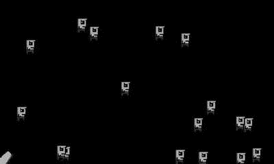

**图 8-24.** 使用纹理图集美化炮台示例

关于纹理图集，还有几件事你需要了解：

- 当你使用 `GL_LINEAR` 作为缩小和/或放大过滤器时，如果图集内的两个图像彼此接触，可能会出现伪影。这是因为纹理映射器实际上会为屏幕上的一个像素从纹理中获取最近的四个纹理元素。当它针对图像的边界执行此操作时，它也会从图集中的相邻图像获取纹理元素。你可以通过在图像之间引入 2 像素的空边框来消除此问题。更好的是，你可以复制每个图像的边框像素。第一种解决方案更简单——只需确保你的纹理尺寸保持为 2 的幂即可。

- 不需要将图集中的所有图像排列成固定的网格。你可以将任意大小的图像尽可能紧密地放入图集中。你只需要知道图像在图集中的起始和结束位置，以便为其计算正确的纹理坐标。然而，打包任意大小的图像是一个棘手的问题。网上有一些工具可以帮助你创建纹理图集；只需搜索一下，你就会发现大量的选择。

- 通常你无法将游戏中的所有图像分组到单个纹理图集中。请记住，不同设备支持的最大纹理尺寸有所不同。你可以放心地假设所有设备都支持 512×512 像素（甚至 1024×1024 像素）的纹理尺寸。因此，你可以使用多个纹理图集。不过，你应该尝试将在屏幕上同时出现的对象分组到一个图集中——例如，第一关的所有对象放在一个图集中，第二关的所有对象放在另一个图集中，所有 UI 元素放在另一个图集中，以此类推。在最终确定美术资源之前，请先考虑逻辑分组。

- 还记得我们在 `Mr. Nom` 中是如何动态绘制数字的吗？我们就是使用纹理图集来实现的。事实上，我们可以通过纹理图集执行所有动态文本渲染。只需将游戏所需的所有字符放入一个图集中，并通过将矩形映射到图集中的相应字符来按需渲染它们。你可以在网上找到一些工具，它们会为你生成位图字体。为了后续章节的目的，我们坚持使用 `Mr. Nom` 中使用的方法：静态文本将作为一个整体预渲染，只有动态文本（例如高分中的数字）才会通过图集渲染。

你可能已经注意到，Bob 在被炮弹图形击中之前就消失了。这是因为我们的包围形状有点太大了。Bob 和炮弹周围都有一些空白区域。解决方案是什么？只需让包围形状小一点即可。你应该对此有所感觉，所以调整源代码直到碰撞感觉合适。在开发游戏时，你经常会发现这类微调“机会”。微调可能除了良好的关卡设计之外，是游戏开发中最关键的环节之一。让事情感觉恰到好处可能很困难，但一旦你达到了像《超级马里奥兄弟》那样的完美境界，就会非常有成就感。遗憾的是，这是无法教授的，因为它取决于你游戏的外观和感觉。将其视为区分好游戏和坏游戏的魔法配方吧。


#### 处理图形消失问题

为了处理刚才提到的消失问题，可将包围矩形制作得比图形表示稍小一些，以便在碰撞触发前允许一定的重叠。

## 纹理区域、精灵与批处理器：隐藏 OpenGL ES

到目前为止，在大炮示例中，我们的代码包含大量样板代码，其中部分是可以精简的。`Vertices` 实例的定义便是其中之一——仅定义一个带纹理的矩形就需要七行代码，这相当繁琐。另一个可改进之处是手动计算纹理图集中图像的纹理坐标。此外，在渲染 2D 矩形时存在大量高度重复的代码，并且还有一种比每个对象一次绘制调用更好的渲染方式。我们可以通过引入几个新概念来解决这些问题：

*   **纹理区域**：我们在上一个示例中已经接触过纹理区域。纹理区域是单个纹理内的一个矩形区域（例如，图集中包含大炮的区域）。我们需要一个优秀的类来封装将所有像素坐标转换为纹理坐标的繁琐计算。

*   **精灵**：精灵与游戏对象非常相似。它拥有位置（以及可选的朝向和缩放），以及图形范围。你通过一个矩形来渲染精灵，就像渲染 Bob 或大炮一样。事实上，Bob 和其他对象的图形表示可以且应该被视为精灵。精灵也映射到纹理中的一个区域。这就是纹理区域的用武之地。虽然很诱人，但你应该避免在游戏中直接将精灵与游戏对象合并，而是遵循模型-视图-控制器模式。这种图形与模型代码的清晰分离能使设计更优。

*   **精灵批处理器**：精灵批处理器负责一次性渲染多个精灵。为此，精灵批处理器需要知道每个精灵的位置、大小和纹理区域。精灵批处理器将成为我们摆脱每个对象多次绘制调用和矩阵操作的神奇成分。

这些概念高度关联，将在下文讨论。

### `TextureRegion` 类

由于我们已经使用过纹理区域，因此应该很容易弄清楚我们所需的内容。我们知道如何从像素坐标转换到纹理坐标。我们需要一个类，在其中可以指定纹理图集中图像的像素坐标，然后该类会存储图集区域对应的纹理坐标，以供进一步处理（例如，当我们要渲染一个精灵时）。闲话少叙，清单 8-16 展示了我们的 `TextureRegion` 类。

```java
package com.badlogic.androidgames.framework.gl;
public class TextureRegion {
    public final float u1, v1;
    public final float u2, v2;
    public final Texture texture;
    
    public TextureRegion(Texture texture, float x, float y, float width, float height) {
        this.u1 = x / texture.width;
        this.v1 = y / texture.height;
        this.u2 = this.u1 + width / texture.width;
        this.v2 = this.v1 + height / texture.height;
        this.texture = texture;
    }
}
```

*清单 8-16. TextureRegion.java：将像素坐标转换为纹理坐标*

`TextureRegion` 存储区域左上角 (`u1`, `v1`) 和右下角 (`u2`, `v2`) 的纹理坐标。构造函数接受一个 `Texture` 以及左上角坐标、区域的宽度和高度（以像素坐标表示）。要为大炮构建一个纹理区域，我们可以这样做：

```java
TextureRegion cannonRegion = new TextureRegion(texture, 0, 0, 64, 32);
```

类似地，我们可以为 Bob 构建一个区域：

```java
TextureRegion bobRegion = new TextureRegion(texture, 32, 32, 32, 32);
```

依此类推。我们可以在已创建的示例代码中使用它，并使用 `TextureRegion.u1`, `v1`, `u2` 和 `v2` 成员来指定矩形顶点的纹理坐标。但我们不需要这样做，因为我们希望彻底摆脱这些繁琐的定义。这正是我们可以使用精灵批处理器的地方。

### `SpriteBatcher` 类

如前所述，精灵可以很容易地通过其位置、大小和纹理区域（以及可选的旋转和缩放）来定义。它只是我们世界空间中的一个图形矩形。为简化操作，我们坚持约定：位置是精灵的中心，矩形围绕该中心构建。现在我们可以有一个 `Sprite` 类并按如下方式使用它：

```java
Sprite bobSprite = new Sprite(20, 20, 0.5f, 0.5f, bobRegion);
```

这将构建一个新的精灵，其中心位于世界坐标 (20,20)，向每侧延伸 0.25 米，并使用 `bobRegion TextureRegion`。但我们可以这样做：

```java
spriteBatcher.drawSprite(bob.x, bob.y, BOB_WIDTH, BOB_HEIGHT, bobRegion);
```

这看起来好多了。我们不需要构建另一个对象来表示对象的图形侧。相反，我们按需绘制 Bob 的一个实例。我们还可以有一个重载方法：

```java
spriteBatcher.drawSprite(cannon.x, cannon.y, CANNON_WIDTH, CANNON_HEIGHT, cannon.angle, cannonRegion);
```

这将绘制大炮，并根据其角度旋转。那么，我们如何实现精灵批处理器呢？`Vertices` 实例在哪里？让我们思考一下批处理器如何工作。

到底什么是批处理？在图形界，批处理被定义为将多次绘制调用合并为单次绘制调用。这使 GPU 更高效，如第 7 章所述。精灵批处理器提供了一种实现此目的的方法。其工作原理如下：

*   批处理器有一个缓冲区，最初为空（或在收到清除信号后变为空）。该缓冲区将保存顶点。在我们的例子中，它将是一个简单的浮点数组。

*   每次我们调用 `SpriteBatcher.drawSprite()` 方法时，都会根据作为参数指定的位置、大小、方向和纹理区域，向缓冲区添加四个顶点。这也意味着我们必须手动旋转和平移顶点位置，而无需 OpenGL ES 的帮助。不过别担心，`Vector2` 类的代码将派上用场。这是消除所有绘制调用的关键。

*   一旦我们指定了所有要渲染的精灵，我们就告诉精灵批处理器将精灵所有矩形的顶点一次性提交给 GPU，然后调用实际的 OpenGL ES 绘制方法来渲染所有矩形。为此，我们可以将浮点数组的内容传输到一个 `Vertices` 实例中，并使用它来渲染矩形。

> **注意**：你只能批处理使用相同纹理的精灵。不过，这并非大问题，因为无论如何你都会使用纹理图集。

精灵批处理器的通常使用模式如下：

```java
batcher.beginBatch(texture);
// 根据需要频繁调用 batcher.drawSprite()，
// 引用纹理中的区域
batcher.endBatch();
```

调用 `SpriteBatcher.beginBatch()` 告诉批处理器两件事：它应该清除其缓冲区，并且应该使用我们传入的纹理。为方便起见，我们将在此方法内绑定纹理。

接下来，我们根据需要渲染尽可能多引用此纹理中区域的精灵。这将填充缓冲区，每个精灵添加四个顶点。


对 `SpriteBatcher.endBatch()` 的调用向精灵批处理器发出信号，表示我们已完成当前批次精灵的渲染，它现在应将顶点上传到 GPU 进行实际渲染。我们将使用一个`Vertices`实例进行索引渲染，因此除了顶点之外，我们还需要在浮点数组缓冲区中指定索引。然而，由于我们总是渲染矩形，我们可以在`SpriteBatcher`的构造函数中预先一次性生成索引。

为此，我们需要知道批处理器每批能绘制多少个精灵。通过对每批可渲染的精灵数量设置硬性限制，我们不需要为其他缓冲区增长任何数组；我们只需在构造函数中一次性分配这些数组和缓冲区。

其通用机制相当简单。`SpriteBatcher.drawSprite()`方法可能看起来有些神秘，但（如果我们暂时忽略旋转和缩放）它并不是一个大问题。我们只需要根据参数计算顶点位置和纹理坐标。在之前的示例中，我们已经手动完成了这些操作——例如，在定义炮管、炮弹和 Bob 的矩形时。我们可以在`SpriteBatcher.drawSprite()`方法中做基本相同的事情，只是根据方法的参数自动完成。因此，让我们来检查一下`SpriteBatcher`。

代码清单 8-17 展示了代码。

```
package com.badlogic.androidgames.framework.gl;
import com.badlogic.androidgames.framework.impl.GLGraphics;
import com.badlogic.androidgames.framework.math.Vector2;
public class SpriteBatcher {
final float[] verticesBuffer;
int bufferIndex;
Vertices vertices;
int numSprites;
Listing 8-17.
Excerpt from SpriteBatcher.java, Without Rotation and Scaling
```

我们先来看成员变量。成员`verticesBuffer`是一个临时浮点数组，用于存储当前批次精灵的顶点。成员`bufferIndex`指示我们应在浮点数组中何处开始写入下一个顶点。成员`vertices`是用于渲染批次的`Vertices`实例。它还存储了我们稍后将定义的索引。成员`numSprites`保存当前批次中已绘制的精灵数量。

```
public SpriteBatcher(GLGraphics glGraphics, int maxSprites) {
this.verticesBuffer = new float[maxSprites*4*4];
this.vertices = new Vertices(glGraphics, maxSprites*4, maxSprites*6, false, true);
this.bufferIndex = 0;
this.numSprites = 0;
short[] indices = new short[maxSprites*6];
int len = indices.length;
short j = 0;
for (int i = 0; i < len; i += 6, j += 4) {
indices[i + 0] = (short)(j + 0);
indices[i + 1] = (short)(j + 1);
indices[i + 2] = (short)(j + 2);
indices[i + 3] = (short)(j + 2);
indices[i + 4] = (short)(j + 3);
indices[i + 5] = (short)(j + 0);
}
vertices.setIndices(indices, 0, indices.length);
}
```

转到构造函数，它有两个参数：创建`Vertices`实例所需的`GLGraphics`实例，以及批处理器每批能渲染的最大精灵数。我们在构造函数中做的第一件事是创建浮点数组。每个精灵有四个顶点，每个顶点占用四个浮点数（两个用于 x 和 y 坐标，另外两个用于纹理坐标）。我们最多可以有`maxSprites`个精灵，因此缓冲区需要 `4 × 4 × maxSprites` 个浮点数。

接下来，我们创建`vertices`实例。它需要存储 `maxSprites × 4` 个顶点和 `maxSprites × 6` 个索引。然后我们将`bufferIndex`和`numSprites`成员初始化为零。我们只需要执行一次，因为索引永远不会改变。批次中的第一个精灵始终具有索引 0, 1, 2, 2, 3, 0；下一个精灵将具有索引 4, 5, 6, 6, 7, 4，依此类推。我们可以预先计算这些索引并将其存储在`Vertices`实例中。这样，我们只需设置它们一次，而不是每个精灵设置一次。

```
public void beginBatch(Texture texture) {
texture.bind();
numSprites = 0;
bufferIndex = 0;
}
```

接下来是`beginBatch()`方法。它绑定纹理并重置`numSprites`和`bufferIndex`成员，以便第一个精灵的顶点将插入到`verticesBuffer`浮点数组的前面。

```
public void endBatch() {
vertices.setVertices(verticesBuffer, 0, bufferIndex);
vertices.bind();
vertices.draw(GL10.GL_TRIANGLES, 0, numSprites * 6);
vertices.unbind();
}
```

下一个方法是`endBatch()`；我们将调用它来完成并绘制当前批次。它首先将为此批次定义的顶点从浮点数组传输到`Vertices`实例。剩下要做的就是绑定`Vertices`实例，绘制 `numSprites × 2` 个三角形，然后再次解绑`Vertices`实例。由于我们使用索引渲染，我们指定要使用的索引数量——每个精灵六个索引，乘以`numSprites`。这就是渲染的全部内容。

```
public void drawSprite(float x, float y, float width, float height, TextureRegion region) {
float halfWidth = width / 2;
float halfHeight = height / 2;
float x1 = x - halfWidth;
float y1 = y - halfHeight;
float x2 = x + halfWidth;
float y2 = y + halfHeight;
verticesBuffer[bufferIndex++] = x1;
verticesBuffer[bufferIndex++] = y1;
verticesBuffer[bufferIndex++] = region.u1;
verticesBuffer[bufferIndex++] = region.v2;
verticesBuffer[bufferIndex++] = x2;
verticesBuffer[bufferIndex++] = y1;
verticesBuffer[bufferIndex++] = region.u2;
verticesBuffer[bufferIndex++] = region.v2;
verticesBuffer[bufferIndex++] = x2;
verticesBuffer[bufferIndex++] = y2;
verticesBuffer[bufferIndex++] = region.u2;
verticesBuffer[bufferIndex++] = region.v1;
verticesBuffer[bufferIndex++] = x1;
verticesBuffer[bufferIndex++] = y2;
verticesBuffer[bufferIndex++] = region.u1;
verticesBuffer[bufferIndex++] = region.v1;
numSprites++;
}
```

下一个方法`drawSprite()`是`SpriteBatcher`类的主力。它接收精灵中心的 x 和 y 坐标、其宽度和高度以及它映射到的纹理区域。该方法的职责是从当前`bufferIndex`开始，向浮点数组添加四个顶点。这四个顶点形成一个纹理映射矩形。我们计算左下角 (`x1`, `y1`) 和右上角 (`x2`, `y2`) 的位置，并使用这四个变量以及来自`TextureRegion`的纹理坐标来构建顶点。顶点按逆时针顺序添加，从左下角顶点开始。一旦它们被添加到浮点数组，我们就递增`numSprites`计数器，并等待添加另一个精灵或批次完成。

这就是全部内容。我们通过简单的将预变换的顶点缓冲在浮点数组中并一次性渲染，消除了大量绘制方法。与我们之前使用的方法相比，这将显著提高我们的 2D 精灵渲染性能。更少的 OpenGL ES 状态更改和更少的绘制调用使 GPU 更加高效。

我们还需要实现一个可以绘制旋转精灵的`SpriteBatcher.drawSprite()`方法。我们需要做的是构造四个角顶点而不添加位置，围绕原点旋转它们，然后添加精灵的位置以使顶点位于世界空间中，最后继续像之前的绘制方法那样进行。我们可以为此使用`Vector2.rotate()`，但这会引入额外的函数调用开销。因此，我们重新实现了`Vector2.rotate()`中的代码，并尽可能进行优化。`SpriteBatcher`类的最终方法如代码清单 8-18 所示。


```java
public void drawSprite(float x, float y, float width, float height, float angle, TextureRegion region) {
    float halfWidth = width / 2;
    float halfHeight = height / 2;
    float rad = angle * Vector2.TO_RADIANS;
    float cos = (float)Math.cos(rad);
    float sin = (float)Math.sin(rad);
    float x1 = -halfWidth * cos - (-halfHeight) * sin;
    float y1 = -halfWidth * sin + (-halfHeight) * cos;
    float x2 = halfWidth * cos - (-halfHeight) * sin;
    float y2 = halfWidth * sin + (-halfHeight) * cos;
    float x3 = halfWidth * cos - halfHeight * sin;
    float y3 = halfWidth * sin + halfHeight * cos;
    float x4 = -halfWidth * cos - halfHeight * sin;
    float y4 = -halfWidth * sin + halfHeight * cos;
    x1 += x;
    y1 += y;
    x2 += x;
    y2 += y;
    x3 += x;
    y3 += y;
    x4 += x;
    y4 += y;
    verticesBuffer[bufferIndex++] = x1;
    verticesBuffer[bufferIndex++] = y1;
    verticesBuffer[bufferIndex++] = region.u1;
    verticesBuffer[bufferIndex++] = region.v2;
    verticesBuffer[bufferIndex++] = x2;
    verticesBuffer[bufferIndex++] = y2;
    verticesBuffer[bufferIndex++] = region.u2;
    verticesBuffer[bufferIndex++] = region.v2;
    verticesBuffer[bufferIndex++] = x3;
    verticesBuffer[bufferIndex++] = y3;
    verticesBuffer[bufferIndex++] = region.u2;
    verticesBuffer[bufferIndex++] = region.v1;
    verticesBuffer[bufferIndex++] = x4;
    verticesBuffer[bufferIndex++] = y4;
    verticesBuffer[bufferIndex++] = region.u1;
    verticesBuffer[bufferIndex++] = region.v1;
    numSprites++;
}
```

**代码清单 8-18.** `SpriteBatcher.java` 的剩余部分：绘制旋转精灵的方法

我们执行的操作与较简单的绘制方法相同，区别在于我们构建了所有四个角点，而不仅仅是两个对角。这是旋转所必需的。其余部分与之前相同。

缩放呢？我们不需要显式地编写另一个方法，因为缩放一个精灵只需要缩放其宽度和高度。我们可以在两个绘制方法之外完成这件事，因此无需再为缩放精灵绘制提供另一组方法。

这就是借助 OpenGL ES 实现闪电般快速精灵渲染的秘诀。

#### 使用 `SpriteBatcher` 类

现在我们可以将 `TextureRegion` 和 `SpriteBatcher` 类整合到我们的火炮示例中。复制 `TextureAtlas` 示例并将其重命名为 `SpriteBatcherTest`。其中包含的类可以命名为 `SpriteBatcherTest` 和 `SpriteBatcherScreen`。

我们移除 `Screen` 类中的 `Vertices` 成员。我们不再需要它们了，因为 `SpriteBatcher` 将为我们完成所有繁重的工作。取而代之，我们添加以下成员：

```java
TextureRegion cannonRegion;
TextureRegion ballRegion;
TextureRegion bobRegion;
SpriteBatcher batcher;
```

现在，我们为图集中的三个对象各自设置了一个 `TextureRegion`，以及一个 `SpriteBatcher`。

接下来，修改屏幕的构造函数。移除所有 `Vertices` 的实例化和初始化代码，并用一行代码替换：

```java
batcher = new SpriteBatcher(glGraphics, 100);
```

这将把我们的 `batcher` 成员设置为一个全新的 `SpriteBatcher` 实例，该实例可以在单次批量渲染中渲染 100 个精灵。

`TextureRegion` 在 `resume()` 方法中初始化，因为它们依赖于 `Texture`：

```java
@Override
public void resume() {
    texture = new Texture(((GLGame)game), "atlas.png");
    cannonRegion = new TextureRegion(texture, 0, 0, 64, 32);
    ballRegion = new TextureRegion(texture, 0, 32, 16, 16);
    bobRegion = new TextureRegion(texture, 32, 32, 32, 32);
}
```

这里没什么意外。最后需要修改的是 `present()` 方法。你会惊讶于它现在看起来多么简洁。如下所示：

```java
@Override
public void present(float deltaTime) {
    GL10 gl = glGraphics.getGL();
    gl.glClear(GL10.GL_COLOR_BUFFER_BIT);
    camera.setViewportAndMatrices();
    gl.glEnable(GL10.GL_BLEND);
    gl.glBlendFunc(GL10.GL_SRC_ALPHA, GL10.GL_ONE_MINUS_SRC_ALPHA);
    gl.glEnable(GL10.GL_TEXTURE_2D);
    batcher.beginBatch(texture);
    int len = targets.size();
    for(int i = 0; i < len; i++) {
        GameObject target = targets.get(i);
        batcher.drawSprite(target.position.x, target.position.y, 0.5f, 0.5f, bobRegion);
    }
    batcher.drawSprite(ball.position.x, ball.position.y, 0.2f, 0.2f, ballRegion);
    batcher.drawSprite(cannon.position.x, cannon.position.y, 1, 0.5f, cannon.angle, cannonRegion);
    batcher.endBatch();
}
```

这简直太棒了。现在我们发出的唯一 OpenGL ES 调用包括清除屏幕、启用混合和纹理功能，以及设置混合函数。其余部分则完全是 `SpriteBatcher` 和 `Camera2D` 的功劳。由于我们所有的对象共享同一个纹理图集，因此我们可以在单次批量渲染中渲染它们。我们使用图集纹理调用 `batcher.beginBatch()`，使用简单的绘制方法渲染所有 Bob 目标，渲染球体（同样使用简单的绘制方法），最后使用能够旋转精灵的绘制方法渲染火炮。我们通过调用 `batcher.endBatch()` 来结束该方法，这会将精灵的几何图形实际传输到 GPU 并渲染所有内容。

### 精灵动画

如果你玩过任何 2D 电子游戏，你会知道我们仍然缺少一个至关重要的组件：精灵动画。动画由关键帧组成，这些关键帧会产生运动的错觉。图 8-25 展示了由 Ari Feldmann（来自他免版税的 SpriteLib）制作的一个精美动画精灵。


**图 8-25.** 一个行走的穴居人，由 Ari Feldmann 制作（原始图中无网格）

这幅图像大小为 256×64 像素，每个关键帧为 64×64 像素。要生成动画，我们只需使用第一个关键帧绘制一个精灵，持续一段时间（例如 0.25 秒），然后切换到下一个关键帧，依此类推。当到达最后一帧时，我们有几种选择：停留在最后一帧、从头开始循环（这称为循环动画），或者反向播放动画。

我们可以使用 `TextureRegion` 和 `SpriteBatcher` 类轻松实现这一点。通常，我们不仅只有单个动画（如图 8-25 所示），在同一图集中还会有更多动画。除了行走动画，我们还可以有跳跃动画、攻击动画等等。对于每个动画，我们需要知道帧持续时间，它告诉我们在切换到下一帧之前，动画的单个关键帧应保持使用多长时间。

### Animation 类

让我们定义一个 `Animation` 类的要求，该类用于存储单个动画的数据，例如图 8-25 中的行走动画：

- 一个 `Animation` 包含多个 `TextureRegion`，这些 `TextureRegion` 存储了每个关键帧在纹理图集中的位置。`TextureRegion` 的顺序与播放动画时使用的顺序相同。
- `Animation` 还存储帧持续时间，在切换到下一帧之前，必须经过该持续时间。
- `Animation` 应提供一个方法，我们向该方法传递进入该 `Animation` 所代表状态（例如，向左行走）的时间，该方法将返回相应的 `TextureRegion`。该方法应考虑当动画结束时，我们是希望它循环播放，还是停留在最后一帧。


---

最后一个要点至关重要，因为它允许我们存储一个单一的 `Animation` 实例，供世界中的多个对象使用。每个对象只需跟踪其当前状态，即它是在行走、射击还是跳跃，以及在该状态下已持续的时间。当渲染该对象时，我们使用状态来选择要播放的动画，再根据状态时间从 `Animation` 中获取正确的 `TextureRegion`。清单 8-19 展示了我们新的 `Animation` 类的代码。

```
package com.badlogic.androidgames.framework.gl;
public class Animation {
public static final int ANIMATION_LOOPING = 0;
public static final int ANIMATION_NONLOOPING = 1;
final TextureRegion[] keyFrames;
final float frameDuration;
public Animation(float frameDuration, TextureRegion ... keyFrames) {
this.frameDuration = frameDuration;
this.keyFrames = keyFrames;
}
public TextureRegion getKeyFrame(float stateTime, int mode) {
int frameNumber = (int)(stateTime / frameDuration);
if(mode == ANIMATION_NONLOOPING) {
frameNumber = Math.min(keyFrames.length-1, frameNumber);
} else {
frameNumber = frameNumber % keyFrames.length;
}
return keyFrames[frameNumber];
}
}
清单 8-19.
Animation.java：一个简单的动画类
```

首先，我们定义了两个常量，用于 `getKeyFrame()` 方法。第一个常量表示动画应循环播放，第二个表示动画应在最后一帧停止。

接下来，我们定义了两个成员：一个存储 `TextureRegion` 的数组，以及一个存储帧持续时间的浮点数。

我们将帧持续时间和包含关键帧的 `TextureRegion` 数组传递给构造函数，构造函数直接存储它们。我们可以对 `keyFrames` 数组进行防御性复制，但这会分配新对象，可能会让垃圾回收器有些忙碌。

关键部分是 `getKeyFrame()` 方法。我们传入对象处于该动画所代表状态的时间以及模式（`Animation.ANIMATION_LOOPING` 或 `ANIMATION_NONLOOPING`）。我们根据 `stateTime` 计算给定状态下已经播放的帧数。如果动画不应循环，我们直接将 `frameNumber` 钳制到 `TextureRegion` 数组的最后一个元素。否则，我们取模运算，这样会自动产生我们期望的循环效果（例如，`4 % 3 = 1`）。剩下的就是返回正确的 `TextureRegion`。

## 示例

本节将展示如何创建一个名为 `AnimationTest` 的示例，并附带一个名为 `AnimationScreen` 的屏幕。一如既往，只讨论屏幕本身。

我们想要渲染一群向左行走的原始人。我们的世界将与我们视锥体的大小相同，即 4.8×3.2 米（这是任意设定的；我们可以使用任何尺寸）。一个原始人是一个大小为 1×1 米的 `DynamicGameObject`。我们将继承 `DynamicGameObject` 并创建一个名为 `Caveman` 的新类，它将额外存储一个成员来跟踪原始人已行走的时间。每个原始人将以 0.5 米/秒的速度向左或向右移动。为 `Caveman` 类添加一个 `update()` 方法，根据时间增量和速度更新原始人的位置。如果一个原始人到达世界的左边缘或右边缘，我们将他传送到世界的另一边。我们使用图 8-25 中的图像，并相应地创建 `TextureRegion` 实例和一个 `Animation` 实例。为了渲染，我们使用 `Camera2D` 实例和 `SpriteBatcher`，因为更炫酷。清单 8-20 展示了 `Caveman` 类的代码。

```
static final float WORLD_WIDTH = 4.8f;
static final float WORLD_HEIGHT = 3.2f;
static class Caveman extends DynamicGameObject {
public float walkingTime = 0;
public Caveman(float x, float y, float width, float height) {
super(x, y, width, height);
this.position.set((float)Math.random() * WORLD_WIDTH,
(float)Math.random() * WORLD_HEIGHT);
this.velocity.set(Math.random() > 0.5f?-0.5f:0.5f, 0);
this.walkingTime = (float)Math.random() * 10;
}
public void update(float deltaTime) {
position.add(velocity.x * deltaTime, velocity.y * deltaTime);
if(position.x  WORLD_WIDTH) position.x = 0;
walkingTime += deltaTime;
}
}
清单 8-20.
摘自 AnimationTest.java：展示内部类 Caveman
```

两个常量 `WORLD_WIDTH` 和 `WORLD_HEIGHT` 是外部 `AnimationTest` 类的一部分，供内部类使用。我们的世界大小为 4.8×3.2 米。

接下来是内部类 `Caveman`，它继承了 `DynamicGameObject`，因为我们将根据速度移动原始人。我们定义了一个额外的成员来跟踪原始人已行走的时间。在构造函数中，我们将原始人放置在一个随机位置，并让他向左或向右行走。我们将 `walkingTime` 成员初始化为 0 到 10 之间的随机数；这样我们的原始人就不会同步行走。

`update()` 方法根据原始人的速度和时间增量来移动他。如果原始人离开世界，我们将他重置到左边缘或右边缘。我们将时间增量加到 `walkingTime` 上，以跟踪他行走的时间。

清单 8-21 展示了 `AnimationScreen` 类。

```
class AnimationScreen extends Screen {
static final int NUM_CAVEMEN = 10;
GLGraphics glGraphics;
Caveman[] cavemen;
SpriteBatcher batcher;
Camera2D camera;
Texture texture;
Animation walkAnim;
清单 8-21.
摘自 AnimationTest.java：AnimationScreen 类
```

我们的屏幕类包含了通常的成员变量。我们有一个 `GLGraphics` 实例、一个 `Caveman` 数组、一个 `SpriteBatcher`、一个 `Camera2D`、包含行走关键帧的 `Texture` 纹理，以及一个 `Animation` 实例。

```
public AnimationScreen(Game game) {
super(game);
glGraphics = ((GLGame)game).getGLGraphics();
cavemen = new Caveman[NUM_CAVEMEN];
for(int i = 0; i < NUM_CAVEMEN; i++) {
cavemen[i] = new Caveman((float)Math.random(), (float)Math.random(), 1, 1);
}
batcher = new SpriteBatcher(glGraphics, NUM_CAVEMEN);
camera = new Camera2D(glGraphics, WORLD_WIDTH, WORLD_HEIGHT);
}
```

在构造函数中，你创建了 `Caveman` 实例，以及 `SpriteBatcher` 和 `Camera2D`。

```
@Override
public void resume() {
texture = new Texture(((GLGame)game), "walkanim.png");
walkAnim = new Animation( 0.2f,
new TextureRegion(texture, 0, 0, 64, 64),
new TextureRegion(texture, 64, 0, 64, 64),
new TextureRegion(texture, 128, 0, 64, 64),
new TextureRegion(texture, 192, 0, 64, 64));
}
```

在 `resume()` 方法中，我们从资产文件 `walkanim.png` 加载包含动画关键帧的纹理图集，该文件与图 8-25 中显示的相同。之后，我们创建 `Animation` 实例，将帧持续时间设置为 0.2 秒，并为纹理图集中的每个关键帧传入一个 `TextureRegion`。

```
@Override
public void update(float deltaTime) {
int len = cavemen.length;
for(int i = 0; i < len; i++) {
cavemen[i].update(deltaTime);
}
}
```

`update()` 方法仅遍历所有 `Caveman` 实例，并使用当前时间增量调用它们的 `Caveman.update()` 方法。这将使原始人移动，并更新他们的行走时间。


```java
@Override
public void present(float deltaTime) {
    GL10 gl = glGraphics.getGL();
    gl.glClear(GL10.GL_COLOR_BUFFER_BIT);
    camera.setViewportAndMatrices();
    gl.glEnable(GL10.GL_BLEND);
    gl.glBlendFunc(GL10.GL_SRC_ALPHA, GL10.GL_ONE_MINUS_SRC_ALPHA);
    gl.glEnable(GL10.GL_TEXTURE_2D);
    batcher.beginBatch(texture);
    int len = cavemen.length;
    for(int i = 0; i < len; i++) {
        Caveman caveman = cavemen[i];
        TextureRegion keyFrame = walkAnim.getKeyFrame(caveman.walkingTime, Animation.ANIMATION_LOOPING);
        batcher.drawSprite(caveman.position.x, caveman.position.y, caveman.velocity.x < 0?1:-1, 1, keyFrame);
    }
    batcher.endBatch();
}

@Override
public void pause() {
}

@Override
public void dispose() {
}
```

最后，我们来看 `present()` 方法。对于每个穴居人，我们首先根据其行走时间从 `Animation` 实例中获取正确的关键帧，并将动画设置为循环播放。然后，使用正确的纹理区域在其位置绘制该穴居人。

但这里的 `width` 参数有何作用？请记住，我们的动画纹理仅包含“向左走”动画的关键帧。如果穴居人向右走，我们需要水平翻转纹理——只需指定一个负的宽度值即可实现。如果你对此存疑，可以回头查看 `SpriteBatcher` 的代码来验证。本质上，我们通过指定一个负的宽度值来翻转精灵的矩形范围。同理，指定一个负的高度值也可以垂直翻转。

图 8-26 展示了正在行走的穴居人效果。


**图 8-26.** 穴居人行走效果

以上就是使用 OpenGL ES 创建出色 2D 游戏所需的全部知识。请注意，我们依然将游戏逻辑与渲染表现分离。穴居人无需知晓自己被渲染的事实，因此它不持有任何与渲染相关的成员，例如 `Animation` 实例或 `Texture`。我们只需跟踪穴居人的状态及其持续时间，结合其位置和大小，便可通过我们的小型辅助类轻松渲染它。

## 本章小结

现在，你应该具备创建几乎任何 2D 游戏的能力。我们已经学习了向量及其使用方法，并由此得到了一个可复用的 `Vector2` 类。我们还研究了基础物理知识，用于实现弹道炮弹等效果。碰撞检测同样是大多数游戏的核心部分，你现在应该知道如何通过 `SpatialHashGrid` 正确且高效地实现它。我们探索了一种通过创建 `GameObject` 和 `DynamicGameObject` 类来分离游戏逻辑与渲染的方法，这些类负责跟踪对象的状态和形状。我们介绍了通过 OpenGL ES 实现 2D 相机概念的简便性，这一切都基于一个名为 `glOrthof()` 的方法。我们学习了纹理图集的概念、使用原因及其用法，并进一步介绍了纹理区域、精灵以及如何通过 `SpriteBatcher` 高效渲染它们。最后，我们探讨了精灵动画的实现，事实证明这极其简单。

值得注意的是，本章涵盖的所有主题（包括粗检测和精检测的碰撞检测、物理模拟、运动积分以及不同形状的边界）都在许多开源库（如 Box2D、Chipmunk Physics、Bullet Physics 等）中得到了稳健实现。这些库最初均使用 C 或 C++ 开发，但其中有若干库提供了 Android 封装或 Java 实现，值得你在规划游戏时参考使用。

在下一章中，我们将使用新工具创建一款新游戏。届时你会惊讶地发现，这一切竟是如此简单。

## 9. 超级跳跃者：一款 2D OpenGL ES 游戏

现在，是时候将你学到的所有 OpenGL ES 知识整合起来，创建一款游戏了。正如第 3 章所述，在移动端开发游戏时，有几种非常流行的类型可供选择。对于我们的下一款游戏，我们决定采用休闲类型。我们将实现一款类似于《绑架》（Abduction）或《 doodle jump》的跳跃式游戏。与《诺姆先生》一样，我们将从定义游戏机制开始。

### 核心游戏机制

如果你不熟悉《绑架》，我们建议你在 Android 设备上安装并尝试一下（可在 Google Play 免费下载），或者至少在网络上观看该游戏的视频。以《绑架》为例，我们可以将游戏（名为《超级跳跃者》）的核心机制浓缩如下：

-   主角持续向上跳跃，在平台间移动。游戏世界垂直跨越多个屏幕。
-   可以通过向左或向右倾斜手机来控制水平移动。
-   当主角离开水平屏幕边界时，他会从屏幕对侧重新进入。
-   平台可以是静止的，也可以水平移动。
-   部分平台会在主角碰撞时随机碎裂。
-   在向上行进的过程中，主角可以收集物品来获得分数。
-   除了金币，某些平台上还有弹簧，能让主角跳得更高。
-   邪恶势力在游戏世界中水平移动。当主角碰到它们时，角色死亡，游戏结束。
-   当主角掉落到屏幕底部边缘以下时，游戏结束。
-   关卡顶部设有某种目标。当主角碰到该目标时，新关卡开始。

虽然这份清单比我们为《诺姆先生》创建的更长，但似乎并未复杂太多。图 9-1 展示了核心原理的初始模型。这次我们直接使用 `Paint.NET` 创建了模型。接下来，让我们构思一个背景故事。


**图 9-1.** 初始游戏机制模型，展示了主角、平台、弹簧、金币、邪恶势力以及关卡顶部的目标

## 构思背景故事与选择美术风格

我们将在这里充分发挥创意，为游戏构思以下独特剧情。

我们的主角鲍勃患有慢性跳跃症。他每次触地都注定要跳起来。更糟糕的是，他心爱的公主（姓名暂且保密）被一支邪恶的飞行杀手松鼠军团绑架，并被囚禁在天空中的城堡里。鲍勃的病情最终证明是有益的，他开始了寻找爱人的征程，与邪恶的松鼠势力作战。

这个经典的游戏故事非常适合 8 位像素美术风格，这种风格在 NES 上的原版《超级马里奥兄弟》等游戏中可见一斑。图 9-1 中的模型展示了游戏中所有元素的最终美术效果。鲍勃、金币、飞行松鼠和碎裂平台当然都是动画化的。我们还会使用与视觉风格相符的音乐和音效。

### 定义屏幕与过渡

现在，我们可以定义游戏中的屏幕与过渡。沿用我们在《诺姆先生》中使用过的相同模式，我们将包含以下元素：

-   一个带有 Logo 的主屏幕，包含“开始游戏”、“最高分”和“帮助”菜单项，以及一个用于开启/关闭音效的按钮。
-   一个游戏屏幕，要求玩家做好准备，并能优雅地处理运行、暂停、游戏结束和下一关卡等状态。与《诺姆先生》相比，唯一新增的是屏幕的“下一关卡”状态，该状态将在鲍勃碰到城堡时触发。在这种情况下，将生成新关卡，鲍勃将再次从世界底部开始，并保留他的分数。
```


### 游戏设计概述

*   一个高分屏幕，显示玩家迄今取得的前五名成绩。
*   帮助屏幕，向玩家介绍游戏机制和目标。我们会狡猾地省略如何控制玩家的描述。如今的孩子应该能够处理我们在 80 年代和 90 年代初期面临的复杂性，当时游戏没有任何说明。

这与`Mr. Nom`的设置大致相同。图 9-2 展示了所有屏幕和转换。请注意，除了暂停按钮外，我们在游戏屏幕或其子屏幕上没有任何按钮。当询问用户是否准备好时，他们会直观地触摸屏幕。


**图 9-2.** `Super Jumper`的所有屏幕和转换

定义了屏幕和转换后，我们现在可以考虑游戏世界的大小和单位，以及这些大小和单位如何与图形资源相关联。

### 定义游戏世界

经典的“先有鸡还是先有蛋”问题再次困扰着我们。正如你在第 8 章学到的，我们在世界单位（例如，米）和像素之间存在对应关系。我们的对象是在世界空间中物理定义的。边界形状和位置以米为单位；速度以米/秒为单位。然而，对象的图形表示是以像素定义的，所以我们必须有某种映射。我们通过首先为图形资源定义目标分辨率来克服这个问题。与`Mr. Nom`一样，我们将使用`320×480`像素的目标分辨率（宽高比为 1.5）。我们使用这个目标，因为它是最低的实用分辨率；如果你专门针对平板电脑，你可能想要使用诸如`800×1280`的分辨率，或者介于两者之间的分辨率，例如`480×800`（典型的 Android 手机）。无论你的目标分辨率如何，原理保持不变。

接下来我们要做的是在我们的世界中建立像素和米之间的对应关系。图 9-1 中的模型给了我们一个概念，即不同对象使用了多少屏幕空间，以及它们相对于彼此的尺寸比例。我们建议为 2D 游戏选择`32`像素对应`1`米的映射。那么，让我们将`320×380`像素大小的模型覆盖在一个网格上，其中每个单元格是`32×32`像素。在我们的世界空间中，这将映射到`1×1`米的单元格。图 9-3 展示了我们的模型和网格。


**图 9-3.** 覆盖有网格的模型。每个单元格是`32×32`像素，对应于游戏世界中`1×1`米的区域。

我们在图 9-3 中稍微作弊了。我们以这样的方式排列图形，使它们与网格单元格完美对齐。在真实的游戏中，我们会将对象放置在非整数位置。

那么，我们从图 9-3 中能得到什么呢？首先，我们可以直接估算出世界中每个对象以米为单位的宽度和高度。以下是我们将用于对象边界矩形的值：

*   `Bob`是`0.8×0.8`米；他没有完全占据一个完整的单元格。
*   一个平台是`2×0.5`米，水平占据两个单元格，垂直占据半个单元格。
*   一个硬币是`0.8×0.5`米。它几乎垂直占据一个单元格，水平占据大约半个单元格。
*   一个弹簧是`0.5×0.5`米，在每个方向上占据半个单元格。弹簧实际上比其宽度要高一点。我们使其边界形状为正方形，以便碰撞测试更宽容一些。
*   一只松鼠是`1×0.8`米。
*   一个城堡是`1.8×1.8`米。

有了这些尺寸，我们也就有了用于碰撞检测的对象边界矩形的大小。如果它们在游戏过程中显得太大或太小，我们可以根据这些值进行调整。

从图 9-3 中我们还可以推导出视图截锥体的大小。它将显示我们世界的`10×15`米。

唯一剩下要定义的是游戏中的速度和加速度。这些高度依赖于我们希望游戏给人的感觉。通常，你需要通过一些实验才能使这些值恰到好处。以下是经过几次调整迭代后我们得出的结果：

*   重力加速度向量是`(0,–13) m/s²`，略高于我们在地球上的值以及在第 8 章炮弹示例中使用的值。
*   `Bob`的初始跳跃速度向量是`(0,11) m/s`。注意，跳跃速度只影响`y`轴上的运动。水平运动将由当前的加速度计读数定义。
*   当`Bob`碰到弹簧时，他的跳跃速度向量将是正常跳跃速度的`1.5`倍。即等效于`(0,16.5) m/s`。同样，这个值纯粹来自实验。
*   `Bob`的水平移动速度是`20 m/s`。请注意，这是一个无方向的速度，而不是向量。我们稍后将解释它是如何与加速度计协同工作的。
*   松鼠会不断地从左到右再返回巡逻。它们的恒定移动速度为`3 m/s`。表示为向量，如果松鼠向左移动，则是`(–3,0) m/s`；如果向右移动，则是`(3,0) m/s`。

那么，`Bob`的水平移动是如何工作的呢？我们之前定义的运动速度实际上是`Bob`的最大水平速度。根据玩家倾斜手机的程度，`Bob`的水平移动速度将在`0`（无倾斜）和`20 m/s`（完全向一侧倾斜）之间。

我们将使用加速度计`x`轴的值，因为我们的游戏将以竖屏模式运行。当手机未倾斜时，该轴将报告加速度为`0 m/s²`。当完全向左倾斜使手机处于横屏方向时，该轴将报告加速度约为`–10 m/s²`。当完全向右倾斜时，该轴将报告加速度约为`10 m/s²`。我们需要做的就是通过除以最大绝对值（`10`）来归一化加速度计读数，然后将其乘以`Bob`的最大水平速度。因此，当手机完全向一侧倾斜时，`Bob`将以`20 m/s`的速度向左或向右移动；如果倾斜度较小，则移动速度较慢。当手机完全倾斜时，`Bob`可以每秒在屏幕上移动两次。

我们将根据当前加速度计在`x`轴上的值，每帧更新此水平移动速度，并将其与`Bob`的垂直速度相结合，垂直速度是根据重力加速度和他的当前垂直速度推导出来的，正如我们在第 8 章示例中对炮弹所做的那样。

世界的一个基本方面是我们看到的部分。由于当`Bob`从屏幕底部边缘离开时会死亡，因此我们的摄像机也在游戏机制中扮演了角色。虽然我们将使用摄像机进行渲染并在`Bob`跳跃时向上移动它，但我们不会在世界模拟类中使用它。相反，我们记录`Bob`迄今为止的最高`y`坐标。如果他低于该值减去视图截锥体高度的一半，我们就知道他已离开屏幕。因此，我们在模型（我们的世界模拟类）和视图之间并没有完全清晰的分离，因为我们需要知道视图截锥体的高度来确定`Bob`是否死亡。我们可以接受这一点。

让我们来看看我们需要的资源。

### 创建资源

我们的新游戏有两种图形资源：UI 元素和实际的游戏元素（即世界元素）。让我们从 UI 元素开始。

##### UI 元素


好的，作为高级文档工程师和翻译员，我将遵循您的指示，对给定的英文文本进行翻译。

****

首先要注意的是，用户界面（UI）元素（如按钮、徽标等）并不依赖于我们的像素到世界单位的映射。和`Mr. Nom`一样，我们将其设计为适配目标分辨率，在示例中即`320×480`像素。查看图 9-2，我们可以确定我们拥有哪些 UI 元素。

我们创建的第一个 UI 元素是不同屏幕所需的按钮。图 9-4 展示了游戏中的所有按钮。


*图 9-4. 各种按钮，每个大小为`64×64`像素*

我们倾向于在单元格大小为`32×32`或`64×64`像素的网格中创建所有图形资源。图 9-4 中的按钮排列在一个网格中，每个单元格为`64×64`像素。顶行的按钮用于主菜单屏幕，指示声音是否已启用。左下角的箭头用于在多个屏幕中导航到下一个屏幕。右下角的按钮在游戏运行时出现，允许用户暂停游戏。

你可能想知道为什么没有指向右的箭头。请记住，在第 8 章中，通过我们巧妙的精灵批处理器，我们可以通过指定负的宽度和/或高度值来轻松翻转绘制的对象。我们将使用这个技巧来处理一些图形资源，以节省内存。

接下来是主菜单屏幕所需的元素：徽标、菜单项和背景图像。图 9-5 展示了所有这些元素。


*图 9-5. 背景图像、主菜单项和徽标*

背景图像不仅用于主菜单屏幕，也用于所有屏幕。它与目标分辨率大小相同，为`320×480`像素。主菜单项占据`300×110`像素。主菜单使用了黑色背景，因为白色背景上显示白色效果不好。在实际图像中，主菜单的背景当然是由透明像素组成的。徽标为`274×142`像素，角落有一些透明像素。

接下来是帮助屏幕图像。我们选择了一种懒人做法，没有将每个屏幕用多个元素组合，而是将它们全部制作为全屏图像，大小为`320×480`像素。这会在不显著增加程序大小的情况下，稍微降低绘制代码的复杂性。你可以在图 9-2 中看到所有的帮助屏幕。我们唯一会与这些图像组合的元素就是箭头按钮。

对于高分屏幕，我们将复用主菜单图像中标有“HIGHSCORES”的部分。实际分数将使用一种特殊的技术进行渲染，我们将在本章后面讨论。该屏幕的其余部分同样由背景图像和一个按钮组成。

游戏屏幕有一些更多的文本 UI 元素，即“READY?”标签、暂停状态的菜单项（“RESUME”和“QUIT”），以及“GAME OVER”标签。图 9-6 展示了它们的全貌。


*图 9-6. “READY?”、“RESUME”、“QUIT”和“GAME OVER”标签*

## 使用位图字体处理文本

那么，我们如何在游戏屏幕上渲染其他文本元素呢？我们使用与`Mr. Nom`中渲染分数相同的技术。现在我们不仅有数字，还有字符。我们使用一个图像图集，其中每个子图像代表一个字符（例如，`0`或`a`）。这个图像图集被称为**位图字体**。图 9-7 展示了我们将要使用的位图字体。


*图 9-7. 一个位图字体*

图 9-7 中的黑色背景和网格当然不是实际图像的一部分。使用位图字体是一种非常古老的技术，用于在游戏屏幕上渲染文本。位图字体通常包含一系列 ASCII 字符的图像。这种字符图像被称为**字形 (glyph)**。ASCII 是 Unicode 的前身之一。ASCII 字符集包含 128 个字符，如图 9-8 所示。


*图 9-8. ASCII 字符及其十进制、十六进制和八进制值*

在这 128 个字符中，有 95 个是可打印字符（字符 32 到 126）。我们的位图字体只包含这些可打印字符。位图字体的第一行包含字符 32 到 47，下一行包含字符 48 到 63，以此类推。ASCII 仅在您想要存储和显示使用标准拉丁字母的文本时有用。还有一种扩展的 ASCII 格式，使用值 128 到 255 来编码西方语言的其他常见字符，例如`ö`和`é`。更具表现力的字符集（例如，用于中文或阿拉伯语）通过 Unicode 表示，并且无法通过 ASCII 进行编码。对于我们的游戏，标准的 ASCII 字符集就足够了。

那么，我们如何使用位图字体渲染文本呢？事实证明这非常容易。首先，我们创建 96 个纹理区域，每个区域映射到位图字体中的一个字形。我们可以将这些纹理区域存储在一个数组中，如下所示：

```
TextureRegion[] glyphs = new TextureRegion[96];
```

Java 字符串使用 16 位 Unicode 进行编码。幸运的是，我们位图字体中的 ASCII 字符在 ASCII 和 Unicode 中具有相同的值。要获取 Java 字符串中某个字符的区域，我们只需这样做：

```
int index = string.charAt(i) – 32;
```

这为我们提供了一个直接索引到纹理区域数组的方式。我们只需从字符串中的当前字符中减去空格字符（`32`）的值。如果索引小于 0 或大于 95，则说明我们遇到了一个不在位图字体中的 Unicode 字符。通常，我们会忽略这样的字符。

要在一行中渲染多个字符，我们需要知道字符之间应该有多少空间。图 9-7 中的位图字体是一种固定宽度的字体，意味着每个字形具有相同的宽度。我们的位图字体字形每个大小为`16×20`像素。当我们在字符串中从一个字符移动到下一个字符时，我们只需增加 20 像素。我们将绘制位置从一个字符移动到另一个字符的像素数称为**前进量 (advance)**。对于我们的位图字体，它是固定的；然而，通常它取决于我们绘制的是哪个字符。一种更复杂的前进量计算方法会同时考虑当前要绘制的字符和下一个字符。如果你想在网络上查询，这种技术被称为**字距调整 (kerning)**。我们只使用固定宽度的位图字体，因为这会让我们的生活轻松很多。

那么，我们是如何生成那个 ASCII 位图字体的？我们使用了网络上众多用于生成位图字体的工具之一。我们使用的工具叫做**Codehead 的位图字体生成器 (CBFG)**，可在[`www.codehead.co.uk/cbfg/`](http://www.codehead.co.uk/cbfg/)免费获取。你可以选择硬盘上的一个字体文件，指定字体的高度，然后生成器将为其生成一个包含 ASCII 字符集的图像。该工具有许多选项，超出了我们这里的讨论范围。我们建议你下载`CBFG`并尝试一下。

我们将使用这种技术绘制游戏中所有剩余的字符串。稍后，你将看到位图字体类的具体实现。现在，让我们回到创建资源的工作中。


#### 使用位图字体

有了位图字体，我们就拥有了所有图形界面元素的资源。我们将通过精灵批处理程序来渲染它们，并使用一个相机来设置视锥体，使其直接对应到目标分辨率。这样一来，我们就可以用像素坐标来指定所有坐标。

##### 游戏元素

实际游戏对象依赖于我们之前讨论过的像素与世界单位的映射关系。为了尽可能简化游戏元素的创建，我们采用了一个小技巧：在绘制每个图形时，都以一个 32×32 像素的网格为单元。所有对象都居中放置在一个或多个这样的网格单元中，这样就能轻松对应它们在游戏世界中的物理尺寸。我们先从鲍勃开始，如图 9-9 所示。


图 9-9. 鲍勃和他的五个动画帧

图 9-9 显示了跳跃时的两帧、下落时的两帧以及死亡时的一帧。每张图像尺寸为 160×32 像素，每个动画帧尺寸为 32×32 像素。背景像素是透明的。

鲍勃可以处于三种状态之一：跳跃、下落或死亡。我们为每种状态都准备了动画帧。诚然，两个跳跃帧和两个下落帧之间的区别很小——只是他的额发在摆动。我们将为鲍勃的三种动画分别创建一个`Animation`实例，并根据他的当前状态使用它们进行渲染。我们也没有为鲍勃朝左移动准备重复的帧。就像箭头按钮（如前图 9-4 所示）那样，我们只需在调用 `SpriteBatcher.drawSprite()` 时指定一个负宽度，即可水平翻转鲍勃的图像。

图 9-10 描绘了邪恶飞鼠。我们再次使用了两个动画帧，这样飞鼠看起来就像在拍打它邪恶的翅膀。


图 9-10. 一只邪恶飞鼠及其两个动画帧

图 9-10 中的图像尺寸为 64×32 像素，每个帧尺寸为 32×32 像素。

图 9-11 所示的金币动画比较特殊。我们的关键帧序列不会是 1、2、3、1，而是 1、2、3、2、1。否则，金币会从第 3 帧的收缩状态直接跳到第 1 帧的完全展开状态。通过复用第 2 帧，我们可以节省一点空间。


图 9-11. 金币及其动画帧

图 9-11 中的图像尺寸为 96×32 像素，每个帧尺寸为 32×32 像素。

关于图 9-12 中的弹簧图像，无需多言。弹簧就静静地待在图像中央。图像尺寸为 32×32 像素。


图 9-12. 弹簧

图 9-13 中的城堡也没有动画。它比其他对象大（64×64 像素）。


图 9-13. 城堡

图 9-14 中的平台（64x64 像素）有四个动画帧。根据我们的游戏机制，某些平台在鲍勃撞击时会碎裂。在这种情况下，我们会完整播放一次该平台的动画。对于静态平台，我们只使用第一帧。


图 9-14. 平台及其动画帧

## 纹理图集来救场

既然我们已经确定了游戏中的所有图形资源，接下来需要讨论它们的纹理。我们之前已经讨论过，纹理的宽度和高度必须是 2 的幂。我们的背景图像和所有帮助屏幕的尺寸为 320×480 像素。我们会将它们存放在 512×512 像素的图像中，以便作为纹理加载。这样就已经有了六张纹理。

我们是否也要为所有其他图像创建单独的纹理？不。我们创建一个单一的纹理图集。事实证明，所有其他元素都能完美地放入一个 512×512 像素的图集中，我们可以将其作为单一纹理加载——这会让 GPU 非常开心，因为除了背景和帮助屏幕图像外，我们只需为所有游戏元素绑定一个纹理。图 9-15 展示了这个图集。


图 9-15. 强大的纹理图集

图 9-15 中的图像尺寸为 512×512 像素。网格和红色轮廓线并非图像的一部分，背景像素是透明的。UI 标签和位图字体的黑色背景像素也是如此。网格单元大小为 32×32 像素。使用这样的纹理图集的酷炫之处在于，如果你想支持更高分辨率的屏幕，除了调整纹理图集的大小外，无需更改任何内容。你可以将其放大到 1024×1024 像素，并使用更高保真度的图形，即使你的目标分辨率是 320×480，OpenGL ES 也能提供更佳的图形效果，而无需改动游戏！

我们将图集中的所有图像放置在坐标为 32 的倍数的角点上。这使得创建纹理区域变得更加容易。

##### 音乐与音效

我们还需要音效和音乐。由于我们的游戏是 8 位复古风格，因此使用合成器生成的芯片音乐、音效和音乐是非常合适的。最著名的芯片音乐是由任天堂的 NES、SNES 和 Game Boy 生成的。对于音效，我们使用了一个名为 as3sfxr 的工具（Tom Vian 制作的 sfxr 的 Flash 版本，sfxr 由 Tomas Pettersson 创建）。该工具可以在 [`www.superflashbros.net/as3sfxr`](http://www.superflashbros.net/as3sfxr) 找到。图 9-16 显示了它的用户界面。


图 9-16. as3sfxr，sfxr 的 Flash 移植版

我们为跳跃、撞击弹簧、撞击金币和撞击松鼠创建了音效。我们还为点击 UI 元素创建了一个音效。我们所做的只是在 as3sfxr 中猛按左侧每个类别的按钮，直到找到合适的音效。

游戏的音乐通常稍微难找一些。网上有一些网站提供适合《超级跳跃者》这类游戏的 8 位芯片音乐。我们将使用一首名为“New Song”的歌曲，由 Geir Tjelta 创作。这首歌可以在 Free Music Archive（[`www.freemusicarchive.org`](http://www.freemusicarchive.org)）上找到。它遵循 [知识共享署名-非商业性使用-相同方式共享 3.0 美国许可协议](http://creativecommons.org/licenses/by-nc-nd/3.0/)（[`https://creativecommons.org/licenses/by-nc-sa/3.0/us/`](https://creativecommons.org/licenses/by-nc-sa/3.0/us/)）进行许可。这意味着我们可以在非商业项目中使用它，例如我们的开源游戏《超级跳跃者》，前提是注明 Geir 的署名并且不修改原作品。当你在网络上搜索用于游戏的音乐时，务必确保遵守许可协议。人们为他们的歌曲付出了很多心血。如果许可协议不符合你的项目（例如，你的游戏是商业项目），那么你就不能使用它。

## 实现《超级跳跃者》


### 实现超级跳跃者

实现超级跳跃者会非常简单。我们可以复用第[8]章的完整框架，并在高级层面上遵循 Mr. Nom 的架构。这意味着每个屏幕都会有一个对应的类，每个类将实现该屏幕所需的逻辑和呈现效果。除此之外，我们还会按照标准项目设置，配置正确的清单文件，将所有资源放在`assets/`文件夹中，为应用程序设置图标等等。让我们从主要的`Assets`类开始。像之前一样设置项目，复制所有框架类，然后就可以开始编写这款精彩游戏的代码了。

### Assets 类

在 Mr. Nom 中，我们已经有了一个`Assets`类，其中仅包含了存储在静态成员变量中的大量`Pixmap`和`Sound`引用。在超级跳跃者中我们也将采用同样的做法。不过这次我们会加入一些加载逻辑。清单 9-1 展示了代码，其中混合了注释。

```
package com.badlogic.androidgames.jumper;
import com.badlogic.androidgames.framework.Music;
import com.badlogic.androidgames.framework.Sound;
import com.badlogic.androidgames.framework.gl.Animation;
import com.badlogic.androidgames.framework.gl.Font;
import com.badlogic.androidgames.framework.gl.Texture;
import com.badlogic.androidgames.framework.gl.TextureRegion;
import com.badlogic.androidgames.framework.impl.GLGame;
public class Assets {
public static Texture background;
public static TextureRegion backgroundRegion;
public static Texture items;
public static TextureRegion mainMenu;
public static TextureRegion pauseMenu;
public static TextureRegion ready;
public static TextureRegion gameOver;
public static TextureRegion highScoresRegion;
public static TextureRegion logo;
public static TextureRegion soundOn;
public static TextureRegion soundOff;
public static TextureRegion arrow;
public static TextureRegion pause;
public static TextureRegion spring;
public static TextureRegion castle;
public static Animation coinAnim;
public static Animation bobJump;
public static Animation bobFall;
public static TextureRegion bobHit;
public static Animation squirrelFly;
public static TextureRegion platform;
public static Animation brakingPlatform;
public static Font font;
public static Music music;
public static Sound jumpSound;
public static Sound highJumpSound;
public static Sound hitSound;
public static Sound coinSound;
public static Sound clickSound;
清单 9-1.
Assets.java，包含除帮助屏幕纹理外的所有资源
```

该类持有整个游戏中所需的所有`Texture`、`TextureRegion`、`Animation`、`Music`和`Sound`实例的引用。唯一没有在这里加载的是帮助屏幕的图片。

```
public static void load(GLGame game) {
background = new Texture(game, "background.png");
backgroundRegion = new TextureRegion(background, 0, 0, 320, 480);
items = new Texture(game, "items.png");
mainMenu = new TextureRegion(items, 0, 224, 300, 110);
pauseMenu = new TextureRegion(items, 224, 128, 192, 96);
ready = new TextureRegion(items, 320, 224, 192, 32);
gameOver = new TextureRegion(items, 352, 256, 160, 96);
highScoresRegion = new TextureRegion(Assets.items, 0, 257, 300, 110 / 3);
logo = new TextureRegion(items, 0, 352, 274, 142);
soundOff = new TextureRegion(items, 0, 0, 64, 64);
soundOn = new TextureRegion(items, 64, 0, 64, 64);
arrow = new TextureRegion(items, 0, 64, 64, 64);
pause = new TextureRegion(items, 64, 64, 64, 64);
spring = new TextureRegion(items, 128, 0, 32, 32);
castle = new TextureRegion(items, 128, 64, 64, 64);
coinAnim = new Animation(0.2f,
new TextureRegion(items, 128, 32, 32, 32),
new TextureRegion(items, 160, 32, 32, 32),
new TextureRegion(items, 192, 32, 32, 32),
new TextureRegion(items, 160, 32, 32, 32));
bobJump = new Animation(0.2f,
new TextureRegion(items, 0, 128, 32, 32),
new TextureRegion(items, 32, 128, 32, 32));
bobFall = new Animation(0.2f,
new TextureRegion(items, 64, 128, 32, 32),
new TextureRegion(items, 96, 128, 32, 32));
bobHit = new TextureRegion(items, 128, 128, 32, 32);
squirrelFly = new Animation(0.2f,
new TextureRegion(items, 0, 160, 32, 32),
new TextureRegion(items, 32, 160, 32, 32));
platform = new TextureRegion(items, 64, 160, 64, 16);
brakingPlatform = new Animation(0.2f,
new TextureRegion(items, 64, 160, 64, 16),
new TextureRegion(items, 64, 176, 64, 16),
new TextureRegion(items, 64, 192, 64, 16),
new TextureRegion(items, 64, 208, 64, 16));
font = new Font(items, 224, 0, 16, 16, 20);
music = game.getAudio().newMusic("music.mp3");
music.setLooping(true);
music.setVolume(0.5f);
if(Settings.soundEnabled)
music.play();
jumpSound = game.getAudio().newSound("jump.ogg");
highJumpSound = game.getAudio().newSound("highjump.ogg");
hitSound = game.getAudio().newSound("hit.ogg");
coinSound = game.getAudio().newSound("coin.ogg");
clickSound = game.getAudio().newSound("click.ogg");
}
```

`load()`方法会在游戏启动时调用一次，负责填充该类的所有静态成员。它加载背景图像并为其创建对应的`TextureRegion`。接着，它加载纹理图集并创建所有必要的纹理区域和动画。请将代码与图 9-15 以及上一节中的其他图片进行对比。加载图形资源的代码中唯一值得注意的地方是创建金币`Animation`实例的部分。如前所述，我们在动画帧序列的末尾复用了第二帧。所有动画都使用 0.2 秒的帧间隔。

我们还创建了一个`Font`类的实例，这个类之前没有讨论过。它将实现使用图集中嵌入的位图字体渲染文本的逻辑。构造函数接收包含位图字体字符的`Texture`、包含字符区域左上角的像素坐标、每行的字符数以及每个字符的像素尺寸。

我们还在此方法中加载了所有`Music`和`Sound`实例。如你所见，我们再次使用了老朋友`Settings`类。我们可以直接从 Mr. Nom 项目中复用该类，只需稍作修改，稍后你会看到。注意，我们将`Music`实例设置为循环播放，音量设置为 0.5，这样比音效稍微轻柔一些。只有当用户之前没有禁用声音时，音乐才会开始播放，该设置存储在`Settings`类中，与 Mr. Nom 中的做法一样。

```
public static void reload() {
background.reload();
items.reload();
if(Settings.soundEnabled)
music.play();
}
```


接下来，我们来介绍一个神秘的方法：`reload()`。请记住，当我们的应用暂停时，OpenGL ES 上下文将会丢失。当应用恢复时，我们必须重新加载纹理，这正是此方法要做的。如果启用了音效，我们也会恢复音乐播放。

```
public static void playSound(Sound sound) {
    if(Settings.soundEnabled)
        sound.play(1);
}
```

这个类的最后一个方法 `playSound()` 是一个辅助方法，我们将在后续代码中使用它来播放音频。我们无需在每个地方都检查音效是否启用，而是将检查逻辑封装在此方法中。

让我们看看修改后的 `Settings` 类。

### Settings 类

`Settings` 类没有太多的改动。清单 9-2 展示了我们稍微修改过的 `Settings` 类的代码。

```
package com.badlogic.androidgames.jumper;
import java.io.BufferedReader;
import java.io.BufferedWriter;
import java.io.IOException;
import java.io.InputStreamReader;
import java.io.OutputStreamWriter;
import com.badlogic.androidgames.framework.FileIO;
public class Settings {
public static boolean soundEnabled = true;
public final static int[] highscores = new int[] { 100, 80, 50, 30, 10 };
public final static String file = ".superjumper";
public static void load(FileIO files) {
BufferedReader in = null;
try {
in = new BufferedReader(new InputStreamReader(files.readFile(file)));
soundEnabled = Boolean.parseBoolean(in.readLine());
for(int i = 0; i < 5; i++) {
highscores[i] = Integer.parseInt(in.readLine());
}
} catch (IOException e) {
// :( 没关系，我们有默认值
} catch (NumberFormatException e) {
// :( 没关系，我们有默认值
} finally {
try {
if (in != null)
in.close();
} catch (IOException e) {
}
}
}
public static void save(FileIO files) {
BufferedWriter out = null;
try {
out = new BufferedWriter(new OutputStreamWriter(
files.writeFile(file)));
out.write(Boolean.toString(soundEnabled));
for(int i = 0; i < 5; i++) {
out.write(Integer.toString(highscores[i]));
}
} catch (IOException e) {
} finally {
try {
if (out != null)
out.close();
} catch (IOException e) {
}
}
}
public static void addScore(int score) {
for(int i = 0; i < 5; i++) {
if(highscores[i] < score) {
for(int j = 4; j > i; j--)
highscores[j] = highscores[j-1];
highscores[i] = score;
break;
}
}
}
}
清单 9-2.
Settings.java，我们稍作修改的设置类，借用于 Mr. Nom
```

与此类在 Mr. Nom 版本中的唯一区别在于，我们读写设置的文件名发生了改变。我们现在使用的文件是`.superjumper`，而不是`.mrnom`。

## 主 Activity

我们需要一个 `Activity` 类作为游戏的主入口点。我们将其命名为 `SuperJumper`。清单 9-3 展示了它的代码。

```
package com.badlogic.androidgames.jumper;
import javax.microedition.khronos.egl.EGLConfig;
import javax.microedition.khronos.opengles.GL10;
import com.badlogic.androidgames.framework.Screen;
import com.badlogic.androidgames.framework.impl.GLGame;
public class SuperJumper extends GLGame {
boolean firstTimeCreate = true;
public Screen getStartScreen() {
return new MainMenuScreen(this);
}
@Override
public void onSurfaceCreated(GL10 gl, EGLConfig config) {
super.onSurfaceCreated(gl,config);
if(firstTimeCreate) {
Settings.load(getFileIO());
Assets.load(this);
firstTimeCreate = false;
} else {
Assets.reload();
}
}
@Override
public void onPause() {
super.onPause();
if(Settings.soundEnabled)
Assets.music.pause();
}
}
清单 9-3.
SuperJumper.java，主入口点类
```

我们继承自 `GLGame`，并实现了 `getStartScreen()` 方法，该方法返回一个 `MainMenuScreen` 实例。另外两个方法则不那么显而易见。

我们重写了 `onSurfaceCreate()` 方法，这个方法在每次 OpenGL ES 上下文被重新创建时都会被调用（可对比第 7 章中 `GLGame` 的代码）。如果这是该方法第一次被调用，我们使用 `Assets.load()` 方法加载所有资源，并尝试从 SD 卡上的设置文件加载设置。否则，我们只需要重新加载纹理，并通过 `Assets.reload()` 方法开始播放音乐。我们还重写了 `onPause()` 方法，以便在音乐正在播放时暂停它。我们这样做是为了避免在我们的屏幕的 `resume()` 和 `pause()` 方法中重复这些操作。

在深入探讨屏幕实现之前，让我们先看看新的 `Font` 类。

### Font 类

我们将使用位图字体来渲染任意（ASCII）文本。我们已经讨论了这在高级层面上的工作原理，现在让我们来看看清单 9-4 中的代码。

```
package com.badlogic.androidgames.framework.gl;
public class Font {
public final Texture texture;
public final int glyphWidth;
public final int glyphHeight;
public final TextureRegion[] glyphs = new TextureRegion[96];
清单 9-4.
Font.java：一个位图字体渲染类
```

该类存储了包含字体的纹理、单个字形的宽度和高度，以及一个 `TextureRegion` 实例数组——每个字形对应一个实例。数组中的第一个元素保存空格字形的区域，下一个元素保存感叹号字形的区域，以此类推。换句话说，第一个元素对应 ASCII 码为 32 的字符，最后一个元素对应 ASCII 码为 126 的字符。

```
public Font(Texture texture,
int offsetX, int offsetY,
int glyphsPerRow, int glyphWidth, int glyphHeight) {
this.texture = texture;
this.glyphWidth = glyphWidth;
this.glyphHeight = glyphHeight;
int x = offsetX;
int y = offsetY;
for(int i = 0; i < 96; i++) {
glyphs[i] = new TextureRegion(texture, x, y, glyphWidth, glyphHeight);
x += glyphWidth;
if(x == offsetX + glyphsPerRow * glyphWidth) {
x = offsetX;
y += glyphHeight;
}
}
}
```

在构造函数中，我们存储了位图字体的配置，并生成了字形区域。`offsetX` 和 `offsetY` 参数指定了纹理中位图字体区域的左上角坐标。在我们的纹理图集中，那是位于 (224,0) 的像素。参数 `glyphsPerRow` 告诉我们每行有多少个字型，而参数 `glyphWidth` 和 `glyphHeight` 则指定了单个字型的大小。由于我们使用的是固定宽度的位图字体，所有字型的大小都相同。`glyphWidth` 也是我们在渲染多个字型时要前进的宽度值。

```
public void drawText(SpriteBatcher batcher, String text, float x, float y) {
int len = text.length();
for(int i = 0; i < len; i++) {
int c = text.charAt(i) - ' ';
if(c < 0 || c > glyphs.length - 1)
continue;
TextureRegion glyph = glyphs[c];
batcher.drawSprite(x, y, glyphWidth, glyphHeight, glyph);
x += glyphWidth;
}
}
```

`drawText()` 方法接收一个 `SpriteBatcher` 实例、一行文本，以及开始绘制文本的 x 和 y 坐标。x 和 y 坐标指定了第一个字型的中心。我们要做的就是从字符串中获取每个字符的索引，检查是否有对应的字型，如果有，则通过 `SpriteBatcher` 渲染它。然后我们按 `glyphWidth` 增加 x 坐标，以便开始渲染字符串中的下一个字符。

你可能想知道为什么不需要绑定包含字型的纹理。我们假设这是在调用 `drawText()` 之前完成的。原因在于，文本渲染可能是某个批处理的一部分，在这种情况下，纹理必须已经绑定。为什么要在 `drawText()` 方法中不必要地再次绑定它呢？请记住，OpenGL ES 最喜欢的就是尽可能少的状态变化。

当然，我们只能通过这个类处理固定宽度的字体。如果我们想要支持更通用的字体，我们还需要知道每个字符的步进值。一种解决方案是使用字距调整，正如前面“使用位图字体处理文本”一节中所述。不过，我们对这个简单的解决方案很满意。

##### GLScreen 类

在前两章的示例中，我们总是通过类型转换来获取 `GLGraphics` 的引用。让我们用一个名为 `GLScreen` 的辅助类来解决这个问题，它将为我们完成这项工作，并将对 `GLGraphics` 的引用存储在一个成员变量中。清单 9-5 展示了代码。

```
package com.badlogic.androidgames.framework.impl;
import com.badlogic.androidgames.framework.Game;
import com.badlogic.androidgames.framework.Screen;
public abstract class GLScreen extends Screen {
protected final GLGraphics glGraphics;
protected final GLGame glGame;
public GLScreen(Game game) {
super(game);
glGame = (GLGame)game;
glGraphics = glGame.getGLGraphics();
}
}
清单 9-5.
GLScreen.java：一个小的辅助类
```


我们在 `GLScreen` 类中存储了 `GLGraphics` 和 `GLGame` 实例。当然，如果作为参数传递给构造函数的 `Game` 实例不是 `GLGame`，这会导致崩溃，但我们会确保其类型正确。Super Jumper 的所有屏幕都将继承自此类。

##### 主菜单屏幕

主菜单屏幕是由 `SuperJumper.getStartScreen()` 返回的屏幕，因此它是玩家看到的第一个画面。它渲染背景和 UI 元素，并静静等待玩家点击任一 UI 元素。根据被点击的元素，游戏要么更改配置（音效启用/禁用），要么切换到新屏幕。清单 9-6 展示了相关代码。

```
package com.badlogic.androidgames.jumper;
import java.util.List;
import javax.microedition.khronos.opengles.GL10;
import com.badlogic.androidgames.framework.Game;
import com.badlogic.androidgames.framework.Input.TouchEvent;
import com.badlogic.androidgames.framework.gl.Camera2D;
import com.badlogic.androidgames.framework.gl.SpriteBatcher;
import com.badlogic.androidgames.framework.impl.GLScreen;
import com.badlogic.androidgames.framework.math.OverlapTester;
import com.badlogic.androidgames.framework.math.Rectangle;
import com.badlogic.androidgames.framework.math.Vector2;
public class MainMenuScreen extends GLScreen {
Camera2D guiCam;
SpriteBatcher batcher;
Rectangle soundBounds;
Rectangle playBounds;
Rectangle highscoresBounds;
Rectangle helpBounds;
Vector2 touchPoint;
清单 9-6.
MainMenuScreen.java：主菜单屏幕
```

该类继承自 `GLScreen`，因此我们可以更方便地访问 `GLGraphics` 实例。

该类中有几个成员。第一个是名为 `guiCam` 的 `Camera2D` 实例。我们还需要一个 `SpriteBatcher` 来渲染背景和 UI 元素。我们将使用矩形来判断用户是否触摸了 UI 元素。由于使用了 `Camera2D`，我们还需要一个 `Vector2` 实例来将触摸坐标转换为世界坐标。

```
public MainMenuScreen(Game game) {
super(game);
guiCam = new Camera2D(glGraphics, 320, 480);
batcher = new SpriteBatcher(glGraphics, 100);
soundBounds = new Rectangle(0, 0, 64, 64);
playBounds = new Rectangle(160 - 150, 200 + 18, 300, 36);
highscoresBounds = new Rectangle(160 - 150, 200 - 18, 300, 36);
helpBounds = new Rectangle(160 - 150, 200 - 18 - 36, 300, 36);
touchPoint = new Vector2();
}
```

在构造函数中，我们简单地初始化所有成员。这里有一个惊喜：`Camera2D` 实例允许我们在目标分辨率 320×480 像素下工作。我们只需将视锥体的宽度和高度设置为适当的值，其余工作由 OpenGL ES 实时完成。但请注意，原点仍在左下角，且 y 轴指向上方。我们将在所有包含 UI 元素的屏幕中使用这种 GUI 相机，以便以像素为单位而非世界坐标进行布局。当然，对于非 320×480 像素宽的屏幕，我们略作取巧，但正如在 Mr. Nom 中那样，我们不必为此感到不安。因此，为每个 UI 元素设置的矩形都以像素坐标给出。

```
@Override
public void update(float deltaTime) {
List touchEvents = game.getInput().getTouchEvents();
game.getInput().getKeyEvents();
int len = touchEvents.size();
for(int i = 0; i < len; i++) {
TouchEvent event = touchEvents.get(i);
if(event.type == TouchEvent.TOUCH_UP) {
touchPoint.set(event.x, event.y);
guiCam.touchToWorld(touchPoint);
if(OverlapTester.pointInRectangle(playBounds, touchPoint)) {
Assets.playSound(Assets.clickSound);
game.setScreen(new GameScreen(game));
return;
}
if(OverlapTester.pointInRectangle(highscoresBounds, touchPoint)) {
Assets.playSound(Assets.clickSound);
game.setScreen(new HighscoreScreen(game));
return;
}
if(OverlapTester.pointInRectangle(helpBounds, touchPoint)) {
Assets.playSound(Assets.clickSound);
game.setScreen(new HelpScreen(game));
return;
}
if(OverlapTester.pointInRectangle(soundBounds, touchPoint)) {
Assets.playSound(Assets.clickSound);
Settings.soundEnabled = !Settings.soundEnabled;
if(Settings.soundEnabled)
Assets.music.play();
else
Assets.music.pause();
}
}
}
}
```

接下来是 `update()` 方法。我们遍历 `Input` 实例返回的 `TouchEvents`，并检查触摸事件。如果检测到此类事件，我们首先将触摸坐标转换为世界坐标。由于相机的设置使我们工作在目标分辨率下，这种转换在 320×480 像素的屏幕上简化为对 y 坐标的翻转。在更大或更小的屏幕上，我们只需将触摸坐标转换到目标分辨率。获得世界触摸点后，我们将其与 UI 元素的矩形进行碰撞检测。如果点击了 PLAY、HIGHSCORES 或 HELP，则切换到相应屏幕。如果按下音效按钮，则更改设置，并继续播放或暂停音乐。另请注意，通过 `Assets.playSound()` 方法，在按下 UI 元素时会播放点击音效。

```
@Override
public void present(float deltaTime) {
GL10 gl = glGraphics.getGL();
gl.glClear(GL10.GL_COLOR_BUFFER_BIT);
guiCam.setViewportAndMatrices();
gl.glEnable(GL10.GL_TEXTURE_2D);
batcher.beginBatch(Assets.background);
batcher.drawSprite(160, 240, 320, 480, Assets.backgroundRegion);
batcher.endBatch();
gl.glEnable(GL10.GL_BLEND);
gl.glBlendFunc(GL10.GL_SRC_ALPHA, GL10.GL_ONE_MINUS_SRC_ALPHA);
batcher.beginBatch(Assets.items);
batcher.drawSprite(160, 480 - 10 - 71, 274, 142, Assets.logo);
batcher.drawSprite(160, 200, 300, 110, Assets.mainMenu);
batcher.drawSprite(32, 32, 64, 64, Settings.soundEnabled?Assets.soundOn:Assets.soundOff);
batcher.endBatch();
gl.glDisable(GL10.GL_BLEND);
}
```

`present()` 方法在此时已无需过多解释，我们之前已经做过类似工作。我们清屏，通过相机设置投影矩阵，并渲染背景和 UI 元素。由于 UI 元素具有透明背景，我们临时启用混合来渲染它们。背景不需要混合，因此为了节省 GPU 周期，我们未使用混合。再次强调，UI 元素是在原点位于屏幕左下角、y 轴指向上方的坐标系中渲染的。

```
@Override
public void pause() {
Settings.save(game.getFileIO());
}
@Override
public void resume() {
}
@Override
public void dispose() {
}
```

最后一个实际执行操作的方法是 `pause()`。在这里，我们确保设置被保存到 SD 卡，因为玩家可以在此界面更改音效设置。

##### 帮助屏幕


我们有总共五个帮助屏幕，它们的工作方式相同：加载帮助屏幕图像，将其与箭头按钮一起渲染，并等待触摸箭头按钮以移动到下一个屏幕。这些屏幕的不同之处仅在于每个屏幕加载的图像以及每个屏幕切换到的屏幕。出于这个原因，我们只查看第一个帮助屏幕的代码，如清单 9-7 所示，该屏幕会切换到第二个帮助屏幕。帮助屏幕的图像文件被命名为`help1.png`、`help2.png`，以此类推，直到`help5.png`。相应的屏幕类被称为`HelpScreen`、`Help2Screen`，以此类推。最后一个屏幕`Help5Screen`会切换回`MainMenuScreen`。

```
package com.badlogic.androidgames.jumper;
import java.util.List;
import javax.microedition.khronos.opengles.GL10;
import com.badlogic.androidgames.framework.Game;
import com.badlogic.androidgames.framework.Input.TouchEvent;
import com.badlogic.androidgames.framework.gl.Camera2D;
import com.badlogic.androidgames.framework.gl.SpriteBatcher;
import com.badlogic.androidgames.framework.gl.Texture;
import com.badlogic.androidgames.framework.gl.TextureRegion;
import com.badlogic.androidgames.framework.impl.GLScreen;
import com.badlogic.androidgames.framework.math.OverlapTester;
import com.badlogic.androidgames.framework.math.Rectangle;
import com.badlogic.androidgames.framework.math.Vector2;
public class HelpScreen extends GLScreen {
Camera2D guiCam;
SpriteBatcher batcher;
Rectangle nextBounds;
Vector2 touchPoint;
Texture helpImage;
TextureRegion helpRegion;
Listing 9-7.
HelpScreen.java: The first help screen
```

我们再次有一些成员变量，持有一个摄像机、一个`SpriteBatcher`、箭头按钮的矩形、触摸点的向量，以及用于帮助图像的`Texture`和`TextureRegion`。

```
public HelpScreen(Game game) {
super(game);
guiCam = new Camera2D(glGraphics, 320, 480);
nextBounds = new Rectangle(320 - 64, 0, 64, 64);
touchPoint = new Vector2();
batcher = new SpriteBatcher(glGraphics, 1);
}
```

在构造函数中，我们以与在`MainMenuScreen`中几乎相同的方式设置所有成员。

```
@Override
public void resume() {
helpImage = new Texture(glGame, "help1.png" );
helpRegion = new TextureRegion(helpImage, 0, 0, 320, 480);
}
@Override
public void pause() {
helpImage.dispose();
}
```

在`resume()`方法中，我们加载实际的帮助屏幕纹理，并创建一个对应的`TextureRegion`用于与`SpriteBatcher`一起渲染。我们在此方法中进行加载，因为 OpenGL ES 上下文可能会丢失。背景和 UI 元素的纹理由`Assets`和`SuperJumper`类处理，如前所述。我们不需要在任何屏幕中处理它们。此外，我们在`pause()`方法中再次释放帮助图像纹理以清理内存。

```
@Override
public void update(float deltaTime) {
List touchEvents = game.getInput().getTouchEvents();
game.getInput().getKeyEvents();
int len = touchEvents.size();
for(int i = 0; i < len; i++) {
TouchEvent event = touchEvents.get(i);
touchPoint.set(event.x, event.y);
guiCam.touchToWorld(touchPoint);
if(event.type == TouchEvent.TOUCH_UP) {
if(OverlapTester.pointInRectangle(nextBounds, touchPoint)) {
Assets.playSound(Assets.clickSound);
game.setScreen(new HelpScreen2(game));
return;
}
}
}
}
```

接下来是`update()`方法，它仅仅检查箭头按钮是否被按下。如果被按下，我们就切换到下一个帮助屏幕。我们还会播放点击音效。

```
@Override
public void present(float deltaTime) {
GL10 gl = glGraphics.getGL();
gl.glClear(GL10.GL_COLOR_BUFFER_BIT);
guiCam.setViewportAndMatrices();
gl.glEnable(GL10.GL_TEXTURE_2D);
batcher.beginBatch(helpImage);
batcher.drawSprite(160, 240, 320, 480, helpRegion);
batcher.endBatch();
gl.glEnable(GL10.GL_BLEND);
gl.glBlendFunc(GL10.GL_SRC_ALPHA, GL10.GL_ONE_MINUS_SRC_ALPHA);
batcher.beginBatch(Assets.items);
batcher.drawSprite(320 - 32, 32, -64, 64, Assets.arrow);
batcher.endBatch();
gl.glDisable(GL10.GL_BLEND);
}
@Override
public void dispose() {
}
}
```

在`present()`方法中，我们清除屏幕，设置矩阵，在一个批次中渲染帮助图像，然后渲染箭头按钮。当然，我们不需要在这里渲染背景图像，因为帮助图像已经包含了它。

其他帮助屏幕是类似的，如前所述。

##### 高分屏幕

接下来是高分屏幕。这里，我们将使用主菜单 UI 标签的一部分（HIGHSCORES 部分），并通过存储在`Assets`类中的`Font`实例来渲染存储在`Settings`中的高分数据。当然，我们有一个箭头按钮，以便玩家可以返回主菜单。清单 9-8 展示了代码。

```
package com.badlogic.androidgames.jumper;
import java.util.List;
import javax.microedition.khronos.opengles.GL10;
import com.badlogic.androidgames.framework.Game;
import com.badlogic.androidgames.framework.Input.TouchEvent;
import com.badlogic.androidgames.framework.gl.Camera2D;
import com.badlogic.androidgames.framework.gl.SpriteBatcher;
import com.badlogic.androidgames.framework.impl.GLScreen;
import com.badlogic.androidgames.framework.math.OverlapTester;
import com.badlogic.androidgames.framework.math.Rectangle;
import com.badlogic.androidgames.framework.math.Vector2;
public class HighscoreScreen extends GLScreen {
Camera2D guiCam;
SpriteBatcher batcher;
Rectangle backBounds;
Vector2 touchPoint;
String[] highScores;
float xOffset = 0;
Listing 9-8.
HighscoresScreen.java: The high-scores screen
```

像往常一样，我们有一些成员变量用于摄像机、`SpriteBatcher`、箭头按钮的边界等。在`highScores`数组中，我们存储了为呈现给玩家的每个高分格式化的字符串。`xOffset`成员是我们计算出来的一个值，用于偏移每行文本的渲染，以使各行水平居中。

```
public HighscoreScreen(Game game) {
super(game);
guiCam = new Camera2D(glGraphics, 320, 480);
backBounds = new Rectangle(0, 0, 64, 64);
touchPoint = new Vector2();
batcher = new SpriteBatcher(glGraphics, 100);
highScores = new String[5];
for(int i = 0; i < 5; i++) {
highScores[i] = (i + 1) + ". " + Settings.highscores[i];
xOffset = Math.max(highScores[i].length() * Assets.font.glyphWidth, xOffset);
}
xOffset = 160 - xOffset / 2;
}
```

在构造函数中，我们像往常一样设置所有成员，并计算`xOffset`值。我们通过评估为五个高分创建的五条字符串中最长字符串的大小来做到这一点。由于我们的位图字体是等宽的，我们可以通过将字符数乘以字形宽度来轻松计算单行文本所需的像素数。当然，这不会考虑非打印字符或 ASCII 字符集之外的字符。由于我们知道不会使用这些字符，因此可以通过这个简单的计算来实现目的。构造函数中的最后一行然后从 160（我们目标屏幕 320×480 像素的水平中心）减去最长行宽度的一半，并通过减去字形宽度的一半来进一步调整。这是必要的，因为`Font.drawText()`方法使用的是字形中心而不是角点。


好的，作为一名高级文档工程师和翻译员，我将严格遵循您的注意事项和示例，将给定的英文文本翻译成中文。


```java
@Override
public void update(float deltaTime) {
    List touchEvents = game.getInput().getTouchEvents();
    game.getInput().getKeyEvents();
    int len = touchEvents.size();
    for(int i = 0; i < len; i++) {
        TouchEvent event = touchEvents.get(i);
        touchPoint.set(event.x, event.y);
        guiCam.touchToWorld(touchPoint);
        if(event.type == TouchEvent.TOUCH_UP) {
            if(OverlapTester.pointInRectangle(backBounds, touchPoint)) {
                game.setScreen(new MainMenuScreen(game));
                return;
            }
        }
    }
}
```

`update()` 方法只检查箭头按钮是否被按下。如果是，它会播放点击音效并切换回主菜单界面。

```java
@Override
public void present(float deltaTime) {
    GL10 gl = glGraphics.getGL();
    gl.glClear(GL10.GL_COLOR_BUFFER_BIT);
    guiCam.setViewportAndMatrices();
    gl.glEnable(GL10.GL_TEXTURE_2D);
    batcher.beginBatch(Assets.background);
    batcher.drawSprite(160, 240, 320, 480, Assets.backgroundRegion);
    batcher.endBatch();
    gl.glEnable(GL10.GL_BLEND);
    gl.glBlendFunc(GL10.GL_SRC_ALPHA, GL10.GL_ONE_MINUS_SRC_ALPHA);
    batcher.beginBatch(Assets.items);
    batcher.drawSprite(160, 360, 300, 33, Assets.highScoresRegion);
    float y = 240;
    for(int i = 4; i >= 0; i--) {
        Assets.font.drawText(batcher, highScores[i], xOffset, y);
        y += Assets.font.glyphHeight;
    }
    batcher.drawSprite(32, 32, 64, 64, Assets.arrow);
    batcher.endBatch();
    gl.glDisable(GL10.GL_BLEND);
}

@Override
public void resume() {
}

@Override
public void pause() {
}

@Override
public void dispose() {
}
```

`present()` 方法同样非常直接。我们清屏、设置矩阵、渲染背景、渲染主菜单标签中的“高分”部分，然后使用在构造函数中计算的 `xOffset` 渲染五条高分记录。现在我们就能明白为什么 `Font` 不处理纹理绑定：我们可以将五次对 `Font.drawText()` 的调用进行批处理。当然，我们必须确保 `SpriteBatcher` 实例能够批处理渲染文本所需的尽可能多的精灵（或字形，在此例中）。我们在构造函数中创建它时，通过设置最大批处理大小为 100 个精灵（字形）来确保这一点。

现在，是时候看看我们模拟类的代码了。

#### 模拟类

在我们深入游戏屏幕之前，需要先创建模拟类。我们将遵循与 Mr. Nom 中相同的模式，为每个游戏对象创建一个类，并创建一个名为 `World` 的无所不知的父类，它将松散的部分联系起来并推动我们的游戏世界运转。我们需要为以下对象创建类：

*   Bob
*   松鼠
*   弹簧
*   金币
*   平台

Bob、松鼠和平台可以移动，因此我们将它们的类建立在第 8 章创建的 `DynamicGameObject` 类之上。弹簧和金币是静态的，因此它们将派生自 `GameObject` 类。每个模拟类的任务如下：

*   存储对象的位置、速度和碰撞形状。
*   如果需要，存储对象的状态以及对象处于该状态的时长（状态时间）。
*   提供一个 `update()` 方法，该方法将根据需要根据对象的行为推进对象。
*   提供改变对象状态的方法（例如，告诉 Bob 他死了或碰到了弹簧）。

然后 `World` 类将跟踪这些对象的多个实例，每帧更新它们，检查对象与 Bob 之间的碰撞，并执行碰撞响应（即，让 Bob 死亡、收集金币等）。接下来我们将从最简单到最复杂逐个讲解每个类。

#### Spring 类

让我们从 `Spring` 类开始，如代码清单 9-9 所示。

```java
package com.badlogic.androidgames.jumper;
import com.badlogic.androidgames.framework.GameObject;

public class Spring extends GameObject {
    public static float SPRING_WIDTH = 0.3f;
    public static float SPRING_HEIGHT = 0.3f;

    public Spring(float x, float y) {
        super(x, y, SPRING_WIDTH, SPRING_HEIGHT);
    }
}
代码清单 9-9.
Spring.java: Spring 类
```

`Spring` 类派生自我们在第 8 章创建的 `GameObject` 类。因为弹簧不会移动，我们只需要一个位置和一个碰撞形状。

接下来，我们定义两个可公开访问的常量：弹簧的宽度和高度，单位是米。我们之前估算了这些值，这里直接复用它们。

最后一部分是构造函数，它接收弹簧中心的 x 和 y 坐标。我们用它调用父类 `GameObject` 的构造函数，该构造函数接收位置以及对象的宽度和高度，用于构建碰撞形状（一个以给定位置为中心的矩形）。有了这些信息，我们的 `Spring` 类就完整定义了，它拥有一个位置和用于碰撞检测的碰撞形状。

#### Coin 类

接下来是金币类，如代码清单 9-10 所示。

```java
package com.badlogic.androidgames.jumper;
import com.badlogic.androidgames.framework.GameObject;

public class Coin extends GameObject {
    public static final float COIN_WIDTH = 0.5f;
    public static final float COIN_HEIGHT = 0.8f;
    public static final int COIN_SCORE = 10;
    float stateTime;

    public Coin(float x, float y) {
        super(x, y, COIN_WIDTH, COIN_HEIGHT);
        stateTime = 0;
    }

    public void update(float deltaTime) {
        stateTime += deltaTime;
    }
}
代码清单 9-10.
Coin.java: Coin 类
```

`Coin` 类与 `Spring` 类非常相似，只有一个区别：我们跟踪金币已经存在的时间。当我们稍后要使用 `Animation` 渲染金币时，需要用到此信息。我们在第 8 章的最后一个示例中为我们的穴居人也做了同样的事情。这是一种我们将用于所有模拟类的技术。给定一个状态和状态时间，我们可以选择一个 `Animation`，以及该 `Animation` 的关键帧，用于渲染。金币只有一个状态，因此我们只需要跟踪状态时间即可。为此，我们提供了 `update()` 方法，它将状态时间增加传递给它的增量时间。

类顶部定义的常量指定了金币的宽度和高度（如前所述），以及 Bob 碰到金币后获得的分数。

#### Castle 类

接下来，我们有一个类用于表示我们世界顶部的城堡。代码清单 9-11 展示了代码。

```java
package com.badlogic.androidgames.jumper;
import com.badlogic.androidgames.framework.GameObject;

public class Castle extends GameObject {
    public static float CASTLE_WIDTH = 1.7f;
    public static float CASTLE_HEIGHT = 1.7f;

    public Castle(float x, float y) {
        super(x, y, CASTLE_WIDTH, CASTLE_HEIGHT);
    }
}
代码清单 9-11.
Castle.java: Castle 类
```

不太复杂。我们需要存储的只是城堡的位置和边界。城堡的大小由常量 `CASTLE_WIDTH` 和 `CASTLE_HEIGHT` 定义，使用的是我们之前讨论过的值。

#### Squirrel 类

接下来是 `Squirrel` 类，如代码清单 9-12 所示。


```java
package com.badlogic.androidgames.jumper;
import com.badlogic.androidgames.framework.DynamicGameObject;
public class Squirrel extends DynamicGameObject {
public static final float SQUIRREL_WIDTH = 1;
public static final float SQUIRREL_HEIGHT = 0.6f;
public static final float SQUIRREL_VELOCITY = 3f;
float stateTime = 0;
public Squirrel(float x, float y) {
super(x, y, SQUIRREL_WIDTH, SQUIRREL_HEIGHT);
velocity.set(SQUIRREL_VELOCITY, 0);
}
public void update(float deltaTime) {
position.add(velocity.x * deltaTime, velocity.y * deltaTime);
bounds.lowerLeft.set(position).sub(SQUIRREL_WIDTH / 2, SQUIRREL_HEIGHT / 2);
if(position.x < 0) {
position.x = SQUIRREL_WIDTH / 2;
velocity.x = SQUIRREL_VELOCITY;
}
if(position.x > World.WORLD_WIDTH - SQUIRREL_WIDTH / 2) {
position.x = World.WORLD_WIDTH - SQUIRREL_WIDTH / 2;
velocity.x = -SQUIRREL_VELOCITY;
}
stateTime += deltaTime;
}
}
```
**代码清单 9-12.**
`Squirrel.java`：`Squirrel` 类

松鼠是移动对象，因此我们让该类继承自 `DynamicGameObject`，它为我们提供了速度向量和加速度向量。我们首先要定义松鼠的大小及其速度。由于松鼠是动画对象，我们还需要跟踪它的状态时间。松鼠和硬币一样只有单一状态：水平移动。向左还是向右移动可以根据速度向量的 x 分量来判断，因此我们无需为此存储单独的状态成员。

在构造函数中，我们调用父类的构造函数，传入松鼠的初始位置和大小。同时将速度向量设为（`SQUIRREL_VELOCITY`，0）。这样一来，所有松鼠一开始都会向右移动。

`update()` 方法根据速度和增量时间更新松鼠的位置和碰撞形状。这是我们标准的欧拉积分步骤，在第 8 章中我们讨论并多次使用过。我们还检查松鼠是否撞到了世界的左边缘或右边缘。如果撞到了，我们只需反转其速度向量，使其向相反方向移动。如前所述，我们世界的宽度固定为 10 米。最后要做的是根据增量时间更新状态时间，以便后续判断需要使用哪个动画帧来渲染该松鼠。

#### Platform 类

`Platform` 类如代码清单 9-13 所示。

```java
package com.badlogic.androidgames.jumper;
import com.badlogic.androidgames.framework.DynamicGameObject;
public class Platform extends DynamicGameObject {
public static final float PLATFORM_WIDTH = 2;
public static final float PLATFORM_HEIGHT = 0.5f;
public static final int PLATFORM_TYPE_STATIC = 0;
public static final int PLATFORM_TYPE_MOVING = 1;
public static final int PLATFORM_STATE_NORMAL = 0;
public static final int PLATFORM_STATE_PULVERIZING = 1;
public static final float PLATFORM_PULVERIZE_TIME = 0.2f * 4;
public static final float PLATFORM_VELOCITY = 2;
```
**代码清单 9-13.**
`Platform.java`：`Platform` 类

当然，平台稍微复杂一些。我们逐一梳理该类中定义的常量。前两个常量定义了平台的宽度和高度，如前所述。平台有一个类型：可以是静态平台，也可以是移动平台。我们通过常量 `PLATFORM_TYPE_STATIC` 和 `PLATFORM_TYPE_MOVING` 来标识。平台还可以处于两种状态之一：正常状态（即静态放置或移动）或粉碎状态。状态通过常量 `PLATFORM_STATE_NORMAL` 或 `PLATFORM_STATE_PULVERIZING` 来编码。当然，粉碎是一个有时限的过程。因此我们定义了平台完全粉碎所需的时间，即 0.8 秒。这个值是根据平台 `Animation` 中的帧数和每帧的持续时间简单计算得出的——这是在尝试遵循 MVC 模式时必须接受的小瑕疵之一。最后，如前所述，我们将移动平台的速度定义为 2 米/秒。移动平台的行为与松鼠完全相同：它会朝一个方向移动，直到碰到世界的水平边界，然后反转方向。

```java
int type;
int state;
float stateTime;
public Platform(int type, float x, float y) {
super(x, y, PLATFORM_WIDTH, PLATFORM_HEIGHT);
this.type = type;
this.state = PLATFORM_STATE_NORMAL;
this.stateTime = 0;
if(type == PLATFORM_TYPE_MOVING) {
velocity.x = PLATFORM_VELOCITY;
}
}
```

为了存储 `Platform` 实例的类型、状态和状态时间，我们需要三个成员变量。这些变量在构造函数中根据 `Platform` 的类型进行初始化，该类型是构造函数的参数之一，另一个参数是平台中心的位置。

```java
public void update(float deltaTime) {
if(type == PLATFORM_TYPE_MOVING) {
position.add(velocity.x * deltaTime, 0);
bounds.lowerLeft.set(position).sub(PLATFORM_WIDTH / 2, PLATFORM_HEIGHT / 2);
if(position.x < 0) {
position.x = PLATFORM_WIDTH / 2;
velocity.x = PLATFORM_VELOCITY;
}
if(position.x > World.WORLD_WIDTH - PLATFORM_WIDTH / 2) {
velocity.x = -velocity.x;
position.x = World.WORLD_WIDTH - PLATFORM_WIDTH / 2;
}
}
stateTime += deltaTime;
}
```

`update()` 方法会移动平台并检测是否超出世界边界，然后通过反转速度向量做出相应处理。这与我们在 `Squirrel.update()` 方法中所做的完全相同。我们还会在方法末尾更新状态时间。

```java
public void pulverize() {
state = PLATFORM_STATE_PULVERIZING;
stateTime = 0;
velocity.x = 0;
}
}
```

该类的最后一个方法名为 `pulverize()`。它将状态从 `PLATFORM_STATE_NORMAL` 切换为 `PLATFORM_STATE_PULVERIZING`，并重置状态时间和速度。这意味着移动平台将停止移动。当 `World` 类检测到 Bob 与平台发生碰撞，并根据随机数决定粉碎该 `Platform` 时，会调用此方法。我们稍后会讨论这一点。首先，需要介绍 Bob。

#### Bob 类

`Bob` 类如代码清单 9-14 所示。

```java
package com.badlogic.androidgames.jumper;
import com.badlogic.androidgames.framework.DynamicGameObject;
public class Bob extends DynamicGameObject{
public static final int BOB_STATE_JUMP = 0;
public static final int BOB_STATE_FALL = 1;
public static final int BOB_STATE_HIT = 2;
public static final float BOB_JUMP_VELOCITY = 11;
public static final float BOB_MOVE_VELOCITY = 20;
public static final float BOB_WIDTH = 0.8f;
public static final float BOB_HEIGHT = 0.8f;
```
**代码清单 9-14.**
`Bob.java`

我们再次从一组常量开始。Bob 可以处于三种状态之一：向上跳跃、向下坠落或被击中。他还有一个垂直跳跃速度（仅应用于 y 轴）和一个水平移动速度（仅应用于 x 轴）。最后两个常量定义了 Bob 在世界中的宽度和高度。当然，我们还必须存储 Bob 的状态和状态时间。


```java
int state;
float stateTime;
public Bob(float x, float y) {
    super(x, y, BOB_WIDTH, BOB_HEIGHT);
    state = BOB_STATE_FALL;
    stateTime = 0;
}
```

构造函数仅调用超类的构造函数，以确保 Bob 的中心位置和边界形状正确初始化，然后初始化`state`和`stateTime`成员变量。

```java
public void update(float deltaTime) {
    velocity.add(World.gravity.x * deltaTime, World.gravity.y * deltaTime);
    position.add(velocity.x * deltaTime, velocity.y * deltaTime);
    bounds.lowerLeft.set(position).sub(bounds.width / 2, bounds.height / 2);

    if(velocity.y > 0 && state != BOB_STATE_HIT) {
        if(state != BOB_STATE_JUMP) {
            state = BOB_STATE_JUMP;
            stateTime = 0;
        }
    }

    if(velocity.y < 0 && state != BOB_STATE_HIT) {
        if(state != BOB_STATE_FALL) {
            state = BOB_STATE_FALL;
            stateTime = 0;
        }
    }

    if(position.x < 0) position.x = World.WORLD_WIDTH;
    if(position.x > World.WORLD_WIDTH) position.x = 0;
    stateTime += deltaTime;
}
```

`update()`方法首先根据重力和 Bob 当前速度更新他的位置和边界形状。注意，速度是重力与 Bob 自身跳跃和水平移动的复合结果。接下来的两个大的条件块根据 Bob 速度的 y 分量，将他的状态设置为`BOB_STATE_JUMPING`或`BOB_STATE_FALLING`，并重新初始化他的状态时间。如果`velocity.y`大于零，Bob 向上跳；如果小于零，则向下落。仅当 Bob 未受击且尚未处于正确状态时，我们才执行此操作；否则状态时间会总是被重置为零，这不利于后续 Bob 的动画表现。我们还处理了边界包裹：当 Bob 离开世界左边缘或右边缘时，会从另一侧出现。最后，我们再次更新`stateTime`成员。

除了重力，Bob 的速度从何而来？这就是其他方法发挥作用的地方。

```java
public void hitSquirrel() {
    velocity.set(0,0);
    state = BOB_STATE_HIT;
    stateTime = 0;
}

public void hitPlatform() {
    velocity.y = BOB_JUMP_VELOCITY;
    state = BOB_STATE_JUMP;
    stateTime = 0;
}

public void hitSpring() {
    velocity.y = BOB_JUMP_VELOCITY * 1.5f;
    state = BOB_STATE_JUMP;
    stateTime = 0;
}
```

当 Bob 碰到松鼠时，`World`类会调用`hitSquirrel()`方法。此时 Bob 停止自主移动，进入`BOB_STATE_HIT`状态。自此以后，只有重力会作用于 Bob；玩家无法再控制他，他也无法再与平台互动。这与超级马里奥被敌人击中后的行为类似——他直接坠落。

当 Bob 在下落过程中碰到平台时，`World`类会调用`hitPlatform()`方法。我们将他的 y 速度设置为`BOB_JUMP_VELOCITY`，并相应地更新他的状态和状态时间。自此，Bob 将向上移动，直到重力再次占上风，使他开始下落。

最后一个方法`hitSpring()`由`World`类在 Bob 碰到弹簧时调用。它与`hitPlatform()`方法功能相同，唯有一个区别：初始向上的速度被设置为 1.5 倍的`BOB_JUMP_VELOCITY`。这意味着 Bob 碰到弹簧时的跳跃高度比碰到平台时更高。

#### World 类

我们需要讨论的最后一个类是`World`类。它代码稍长，我们将分段讲解。清单 9-15 展示了代码的第一部分。

```java
package com.badlogic.androidgames.jumper;

import java.util.ArrayList;
import java.util.List;
import java.util.Random;

import com.badlogic.androidgames.framework.math.OverlapTester;
import com.badlogic.androidgames.framework.math.Vector2;

public class World {
    public interface WorldListener {
        void jump();
        void highJump();
        void hit();
        void coin();
    }
```

**清单 9-15.** `World.java`节选：常量、成员和初始化

首先定义的是一个名为`WorldListener`的接口。它的作用是什么？我们需要用它来解决一个 MVC 难题：何时播放音效？我们可以直接在相应的模拟类中添加`Assets.playSound()`调用，但这样做不够清晰。相反，我们允许`World`类的使用者注册一个`WorldListener`，当 Bob 从平台跳跃、从弹簧跳跃、被松鼠击中或收集金币时，该监听器会被调用。稍后我们会注册一个监听器，负责为这些事件播放正确的音效，从而使模拟类与渲染和音频播放保持完全解耦。

```java
    public static final float WORLD_WIDTH = 10;
    public static final float WORLD_HEIGHT = 15 * 20;
    public static final int WORLD_STATE_RUNNING = 0;
    public static final int WORLD_STATE_NEXT_LEVEL = 1;
    public static final int WORLD_STATE_GAME_OVER = 2;
    public static final Vector2 gravity = new Vector2(0, -12);
```

接下来，我们定义了几个常量。`WORLD_WIDTH`和`WORLD_HEIGHT`指定了世界的水平和垂直范围。回顾一下，我们的视景体将显示世界中的一个 10×15 米区域。根据这里定义的常量，我们的世界将垂直跨越 20 个视景体或屏幕。同样，这也是我们通过调优得出的值。在讨论如何生成关卡时，我们还会回到这一点。世界可以处于三种状态之一：运行中、等待下一关卡开始，或游戏结束（当 Bob 掉出视景体范围时）。我们还在此处将重力加速度向量定义为常量。

```java
    public final Bob bob;
    public final List<Platform> platforms;
    public final List<Spring> springs;
    public final List<Squirrel> squirrels;
    public final List<Coin> coins;
    public Castle castle;
    public final WorldListener listener;
    public final Random rand;
    public float heightSoFar;
    public int score;
    public int state;
```

`World`类的所有成员如下：它跟踪 Bob、所有平台、弹簧、松鼠、金币以及城堡。此外，还有一个`WorldListener`引用和一个`Random`实例，我们将使用它出于各种目的生成随机数。最后三个成员分别跟踪 Bob 到目前为止达到的最高高度、世界的状态以及获得的分数。

```java
    public World(WorldListener listener) {
        this.bob = new Bob(5, 1);
        this.platforms = new ArrayList<Platform>();
        this.springs = new ArrayList<Spring>();
        this.squirrels = new ArrayList<Squirrel>();
        this.coins = new ArrayList<Coin>();
        this.listener = listener;
        rand = new Random();
        generateLevel();
        this.heightSoFar = 0;
        this.score = 0;
        this.state = WORLD_STATE_RUNNING;
    }
```

构造函数初始化所有成员，并存储作为参数传入的`WorldListener`。Bob 被水平放置在世界中央，略微高于地面，位置在(5,1)。其余部分不言自明，唯有一个例外：`generateLevel()`方法。

#### 生成世界

你可能已经好奇我们实际上是如何创建并放置世界中的对象的。我们使用了一种称为程序化生成的方法。我们设计了一个简单的算法来为我们生成随机关卡。清单 9-16 展示了相关代码。


`private void generateLevel() {
    float y = Platform.PLATFORM_HEIGHT / 2;
    float maxJumpHeight = Bob.BOB_JUMP_VELOCITY * Bob.BOB_JUMP_VELOCITY
            / (2 * -gravity.y);
    while (y < WORLD_HEIGHT - WORLD_HEIGHT / 4) {
        int type = rand.nextFloat() > 0.8f ? Platform.PLATFORM_TYPE_MOVING
                : Platform.PLATFORM_TYPE_STATIC;
        float x = rand.nextFloat()
                * (WORLD_WIDTH - Platform.PLATFORM_WIDTH)
                + Platform.PLATFORM_WIDTH / 2;
        Platform platform = new Platform(type, x, y);
        platforms.add(platform);
        if (rand.nextFloat() > 0.9f
                && type != Platform.PLATFORM_TYPE_MOVING) {
            Spring spring = new Spring(platform.position.x,
                    platform.position.y + Platform.PLATFORM_HEIGHT / 2
                            + Spring.SPRING_HEIGHT / 2);
            springs.add(spring);
        }
        if (y > WORLD_HEIGHT / 3 && rand.nextFloat() > 0.8f) {
            Squirrel squirrel = new Squirrel(platform.position.x
                    + rand.nextFloat(), platform.position.y
                    + Squirrel.SQUIRREL_HEIGHT + rand.nextFloat() * 2);
            squirrels.add(squirrel);
        }
        if (rand.nextFloat() > 0.6f) {
            Coin coin = new Coin(platform.position.x + rand.nextFloat(),
                    platform.position.y + Coin.COIN_HEIGHT
                            + rand.nextFloat() * 3);
            coins.add(coin);
        }
        y += (maxJumpHeight - 0.5f);
        y -= rand.nextFloat() * (maxJumpHeight / 3);
    }
    castle = new Castle(WORLD_WIDTH / 2, y);
}
```

代码清单 9-16. 摘自 `World.java`：`generateLevel()` 方法

让我们用通俗的语言概述该算法的基本思路：

1.  从世界底部 `y = 0` 开始。
2.  只要尚未到达世界顶部，就执行以下操作：
    1.  在当前的 y 位置，随机选择一个 x 位置，创建一个平台（移动或静止）。
    2.  生成一个 0 到 1 之间的随机数，如果该数大于 0.9 且平台不是移动的，则在平台顶部创建一个弹簧。
    3.  如果 y 坐标超过关卡高度的前三分之一，生成一个随机数，如果该数大于 0.8，则在平台位置的基础上随机偏移，创建一只松鼠。
    4.  生成一个随机数，如果该数大于 0.6，则在平台位置的基础上随机偏移，创建一个金币。
    5.  将 y 增加鲍勃的最大常规跳跃高度，再随机减少一点——但减少量要确保 y 不低于上一个 y 值——然后返回步骤 2 的开头。
3.  将城堡放置在最后一个 y 位置，水平居中。

这个过程的最大秘密在于步骤 2e 中我们如何增加下一个平台的 y 位置。我们必须确保鲍勃能够从当前平台跳达每一个后续平台。考虑到他的初始垂直跳跃速度为 11 米/秒，鲍勃的跳跃高度受重力限制。我们如何计算鲍勃能跳多高？可以通过以下公式计算：

`高度 = 速度 × 速度 / (2 × 重力) = 11 × 11 / (2 × 13) ≈ 4.6 米`

这意味着平台之间的垂直距离应为 4.6 米，这样鲍勃才能抵达。为了确保所有平台都可到达，我们使用一个略小于最大跳跃高度的值。这可以确保鲍勃总能从一个平台跳到下一个平台。平台的水平放置则是随机的。鉴于鲍勃的水平移动速度为 20 米/秒，我们完全可以确信他不仅在垂直方向上，在水平方向上也能到达平台。

其他对象则基于概率生成。方法 `Random.nextFloat()` 每次调用都会返回一个介于 0 和 1 之间的随机数，每个数字出现的概率相同。只有当从 `Random` 获取的随机数大于 0.8 时，才会生成松鼠。这意味着我们生成松鼠的概率是 20%（1 – 0.8）。其他所有随机创建的对象也是如此。通过调整这些数值，我们可以增加或减少世界中的对象数量。

#### 更新世界

一旦生成了世界，我们就可以更新其中的所有对象并检测碰撞。代码清单 9-17 展示了 `World` 类的更新方法（含注释）。

```
public void update(float deltaTime, float accelX) {
    updateBob(deltaTime, accelX);
    updatePlatforms(deltaTime);
    updateSquirrels(deltaTime);
    updateCoins(deltaTime);
    if (bob.state != Bob.BOB_STATE_HIT)
        checkCollisions();
    checkGameOver();
}
```

代码清单 9-17. 摘自 `World.java`：更新方法

`update()` 方法稍后由我们的游戏界面调用。它接收增量时间和加速度计在 x 轴上的加速度作为参数。它负责调用其他的更新方法，以及执行碰撞检测和游戏结束检测。我们为世界中的每种对象类型都提供了一个更新方法。

```
private void updateBob(float deltaTime, float accelX) {
    if (bob.state != Bob.BOB_STATE_HIT && bob.position.y <= 0.5f)
        bob.hitPlatform();
    if (bob.state != Bob.BOB_STATE_HIT)
        bob.velocity.x = -accelX / 10 * Bob.BOB_MOVE_VELOCITY;
    bob.update(deltaTime);
    heightSoFar = Math.max(bob.position.y, heightSoFar);
}
```

`updateBob()` 方法负责更新鲍勃的状态。它首先检查鲍勃是否碰到了世界的底部，如果是，则指示鲍勃跳跃。这意味着在每个关卡的开始，鲍勃都可以从世界的地面起跳。当然，一旦地面移出视野，这个方法就不再有效。接下来，我们更新鲍勃的水平速度，该速度基于作为参数传入的加速度计 x 轴数值。如前所述，我们将该数值从 -10 到 10 的范围归一化到 -1 到 1 的范围（从完全左倾到完全右倾），然后乘以鲍勃的标准移动速度。接着，我们通过调用 `Bob.update()` 方法让鲍勃更新自身状态。我们做的最后一件事是记录鲍勃到目前为止达到的最高 y 位置，以便稍后判断鲍勃是否掉落得太远。

```
private void updatePlatforms(float deltaTime) {
    int len = platforms.size();
    for (int i = 0; i < len; i++) {
        Platform platform = platforms.get(i);
        platform.update(deltaTime);
        if (platform.state == Platform.PLATFORM_STATE_PULVERIZING
                && platform.time > Platform.PLATFORM_PULVERIZE_TIME) {
            platforms.remove(platform);
            len = platforms.size();
        }
    }
}
```

接下来，我们在 `updatePlatforms()` 中更新所有平台。我们遍历平台列表，为每个平台调用其 `update()` 方法，并传入当前的增量时间。如果平台正处于粉碎过程中，我们检查该状态持续时间。如果平台处于 `PLATFORM_STATE_PULVERIZING` 状态的时间超过了 `PLATFORM_PULVERIZE_TIME`，我们就简单地将该平台从平台列表中移除。

```
private void updateSquirrels(float deltaTime) {
    int len = squirrels.size();
    for (int i = 0; i < len; i++) {
        Squirrel squirrel = squirrels.get(i);
        squirrel.update(deltaTime);
    }
}

private void updateCoins(float deltaTime) {
    int len = coins.size();
    for (int i = 0; i < len; i++) {
        Coin coin = coins.get(i);
        coin.update(deltaTime);
    }
}
```

在 `updateSquirrels()` 方法中，我们通过调用每个 `Squirrel` 实例的 `update()` 方法并传入当前增量时间来更新它们。我们在 `updateCoins()` 方法中对每个 `Coin` 实例执行相同操作。

##### 碰撞检测与响应

回顾我们最初的 `World.update()` 方法，可以看到下一步是检测鲍勃与世界中所有其他可碰撞对象之间的碰撞。我们只在鲍勃的状态不等于`BOB_STATE_HIT`时才进行检测，因为在该状态下，他只会因重力而继续下落。让我们看看代码清单 9-18 中的这些碰撞检测方法。

```
private void checkCollisions() {
    checkPlatformCollisions();
    checkSquirrelCollisions();
    checkItemCollisions();
    checkCastleCollisions();
}
```

代码清单 9-18. 摘自 `World.java`：碰撞检测方法


`checkCollisions()`方法大致上是一个主方法，它会简单调用所有其他的碰撞检测方法。Bob 在世界中可能碰撞的对象有：平台、松鼠、金币、弹簧和城堡。对于这些对象类型，我们都有对应的碰撞检测方法。请记住，我们在更新了世界中所有对象的位置和碰撞包围盒后再调用这个方法及其从属方法。可以将其视为在特定时间点对世界状态的一个快照。我们所做的只是观察这个静态画面，检查是否有重叠。然后我们可以在下一帧中采取行动，通过操纵碰撞对象的状态、位置、速度等来确保它们对这些重叠或碰撞做出反应。

```
private void checkPlatformCollisions() {
if (bob.velocity.y > 0)
return;
int len = platforms.size();
for (int i = 0; i < len; i++) {
Platform platform = platforms.get(i);
if (bob.position.y > platform.position.y) {
if (OverlapTester
.overlapRectangles(bob.bounds, platform.bounds)) {
bob.hitPlatform();
listener.jump();
if (rand.nextFloat() > 0.5f) {
platform.pulverize();
}
break;
}
}
}
}
```

在`checkPlatformCollisions()`方法中，我们检测 Bob 与世界中的任何平台之间是否有重叠。如果 Bob 正在上升途中，我们会提前退出该方法。这使得 Bob 能够从下方穿过平台。对于《超级跳跃者》来说，这是一种好的行为；而在像《超级马里奥兄弟》这样的游戏中，如果 Bob 从下方撞到方块，我们可能希望他掉落下来。

接下来，我们遍历所有平台，检查 Bob 是否在当前平台的上方。如果是，则测试他的包围矩形是否与平台的包围矩形重叠。如果重叠，我们通过调用`Bob.hitPlatform()`来通知 Bob 他撞到了平台。回顾该方法，它会触发一次跳跃并相应地设置 Bob 的状态。然后，我们调用`WorldListener.jump()`方法，通知监听器 Bob 刚刚又开始跳跃了。稍后我们将利用这一点在监听器中播放相应的音效。最后要做的，是获取一个随机数，如果它大于 0.5，就让平台粉碎。该平台会再存活`PLATFORM_PULVERIZE_TIME`秒（0.8 秒），之后会在前面展示的`updatePlatforms()`方法中被移除。在渲染该平台时，我们会利用它的状态时间来决定播放哪个平台动画关键帧。

```
private void checkSquirrelCollisions() {
int len = squirrels.size();
for (int i = 0; i < len; i++) {
Squirrel squirrel = squirrels.get(i);
if (OverlapTester.overlapRectangles(squirrel.bounds, bob.bounds)) {
bob.hitSquirrel();
listener.hit();
}
}
}
```

`checkSquirrelCollisions()`方法检测 Bob 的包围矩形与每只松鼠的包围矩形是否重叠。如果 Bob 撞到了松鼠，我们就让他进入`BOB_STATE_HIT`状态，这将使 Bob 掉落下去，并且玩家无法再控制他。我们还会通知`WorldListener`，以便 Bob 可以播放一个音效，例如。

```
private void checkItemCollisions() {
int len = coins.size();
for (int i = 0; i < len; i++) {
Coin coin = coins.get(i);
if (OverlapTester.overlapRectangles(bob.bounds, coin.bounds)) {
coins.remove(coin);
listener.coin();
bob.score += COIN_SCORE;
}
}
if (bob.velocity.y > 0)
return;
len = springs.size();
for (int i = 0; i < len; i++) {
Spring spring = springs.get(i);
if (bob.position.y > spring.position.y) {
if (OverlapTester.overlapRectangles(bob.bounds, spring.bounds)) {
bob.hitSpring();
listener.highJump();
}
}
}
}
```

`checkItemCollisions()`方法检测 Bob 与世界中的所有金币和所有弹簧。如果 Bob 撞到金币，我们就从世界中移除该金币，通知监听器一枚金币被收集了，并将当前得分增加`COIN_SCORE`。如果 Bob 正在向下掉落，我们还会检测 Bob 与世界中的所有弹簧。如果他撞到一个弹簧，我们就通知他，以便他能比平时跳得更高。我们也会将此事件通知监听器。

```
private void checkCastleCollisions() {
if (OverlapTester.overlapRectangles(castle.bounds, bob.bounds)) {
state = WORLD_STATE_NEXT_LEVEL;
}
}
```

最后一个方法检测 Bob 与城堡的碰撞。如果 Bob 撞到了城堡，我们将世界状态设置为`WORLD_STATE_NEXT_LEVEL`，向外部实体（例如游戏屏幕）发出信号，表明我们应该过渡到下一关，下一关将再次随机生成一个`World`实例。

游戏结束，伙计！

`World`类中的最后一个方法，在`World.update()`方法的最后一行被调用，如清单 9-19 所示。

```
private void checkGameOver() {
if (heightSoFar - 7.5f > bob.position.y) {
state = WORLD_STATE_GAME_OVER;
}
}
}
清单 9-19.
World.java 的其余部分：游戏结束检测方法
```

还记得我们如何定义游戏结束状态的吗：Bob 必须离开视景体裁剪面的底部。视景体裁剪面当然由`Camera2D`实例控制，该实例有一个位置。该位置的`y`坐标始终等于 Bob 迄今为止达到的最大`y`坐标，因此相机在一定程度上会跟随 Bob 向上移动。但是，由于我们希望保持渲染代码和模拟代码分离，所以我们在世界中没有相机的引用。因此，我们在`updateBob()`中跟踪 Bob 的最高`y`坐标，并将该值存储在`heightSoFar`中。我们知道视景体裁剪面的高度将为 15 米。因此，我们也知道如果 Bob 的`y`坐标低于`heightSoFar - 7.5`，那么他就已经离开了视景体裁剪面的底部边缘。这时 Bob 被宣布死亡。当然，这有点取巧，因为它是基于这样的假设：视景体裁剪面的高度总是 15 米，并且相机将始终位于 Bob 到目前为止能够达到的最高`y`坐标处。如果我们允许缩放或使用不同的相机跟随方法，这个假设就不再成立。为了不过度复杂化事情，我们保持现状。在游戏开发中，你经常会面临这样的决策，因为有时很难从软件工程的角度保持一切清晰（正如我们过度使用`public`或包私有成员所证明的那样）。

你可能想知道为什么我们不使用在第 8 章中开发的`SpatialHashGrid`类。我们稍后会告诉你原因。让我们先通过实现`GameScreen`类来完成我们的游戏。

游戏屏幕

我们即将完成《超级跳跃者》。我们需要实现的最后一件事情是游戏屏幕，它向玩家呈现实际的游戏世界并允许玩家与之交互。游戏屏幕由五个子屏幕组成，如本章前面图 9-2 所示。我们有准备屏幕、正常运行屏幕、下一关屏幕、游戏结束屏幕和暂停屏幕。Mr. Nom 游戏中的游戏屏幕与此类似；它只是缺少了下一关屏幕，因为那里只有一个关卡。我们将采用与 Mr. Nom 游戏中相同的方法：我们将为所有子屏幕提供独立的更新和呈现方法，这些方法负责更新和渲染游戏世界，以及属于子屏幕的 UI 元素。由于游戏屏幕代码稍长，我们将其拆分为多个清单。清单 9-20 展示了游戏屏幕的第一部分。


```java
package com.badlogic.androidgames.jumper;
import java.util.List;
import javax.microedition.khronos.opengles.GL10;
import com.badlogic.androidgames.framework.Game;
import com.badlogic.androidgames.framework.Input.TouchEvent;
import com.badlogic.androidgames.framework.gl.Camera2D;
import com.badlogic.androidgames.framework.gl.SpriteBatcher;
import com.badlogic.androidgames.framework.impl.GLScreen;
import com.badlogic.androidgames.framework.math.OverlapTester;
import com.badlogic.androidgames.framework.math.Rectangle;
import com.badlogic.androidgames.framework.math.Vector2;
import com.badlogic.androidgames.jumper.World.WorldListener;
public class GameScreen extends GLScreen {
static final int GAME_READY = 0;
static final int GAME_RUNNING = 1;
static final int GAME_PAUSED = 2;
static final int GAME_LEVEL_END = 3;
static final int GAME_OVER = 4;
int state;
Camera2D guiCam;
Vector2 touchPoint;
SpriteBatcher batcher;
World world;
WorldListener worldListener;
WorldRenderer renderer;
Rectangle pauseBounds;
Rectangle resumeBounds;
Rectangle quitBounds;
int lastScore;
String scoreString;
Listing 9-20.
Excerpt from GameScreen.java: Members and constructor
```

该类首先定义了一组常量，用于表示屏幕的五种状态。接下来是成员变量。我们有一个用于渲染 UI 元素的摄像头，以及一个用于将触摸坐标转换为世界坐标的向量（如同在其他屏幕中一样，转换到 320×480 单位的视锥体，即我们的目标分辨率）。接着，我们有一个 `SpriteBatcher`、一个 `World` 实例和一个 `WorldListener`。`WorldRenderer` 类稍后我们会详细研究。它基本上只是接收一个 `World` 实例并将其渲染出来。请注意，它的构造函数也将指向 `SpriteBatcher` 的引用作为参数。这意味着我们将使用同一个 `SpriteBatcher` 来渲染屏幕的 UI 元素和游戏世界。其余成员变量是用于不同 UI 元素（例如暂停子屏幕上的“继续”和“退出”菜单项）的 `Rectangle` 对象，以及两个用于追踪当前分数的成员变量。我们希望避免在每帧渲染分数时创建一个新的字符串，以便让垃圾回收器更顺畅运行。

```java
public GameScreen(Game game) {
super(game);
state = GAME_READY;
guiCam = new Camera2D(glGraphics, 320, 480);
touchPoint = new Vector2();
batcher = new SpriteBatcher(glGraphics, 1000);
worldListener = new WorldListener() {
public void jump() {
Assets.playSound(Assets.jumpSound);
}
public void highJump() {
Assets.playSound(Assets.highJumpSound);
}
public void hit() {
Assets.playSound(Assets.hitSound);
}
public void coin() {
Assets.playSound(Assets.coinSound);
}
};
world = new World(worldListener);
renderer = new WorldRenderer(glGraphics, batcher, world);
pauseBounds = new Rectangle(320- 64, 480- 64, 64, 64);
resumeBounds = new Rectangle(160 - 96, 240, 192, 36);
quitBounds = new Rectangle(160 - 96, 240 - 36, 192, 36);
lastScore = 0;
scoreString = "分数：0";
}
```

在构造函数中，我们初始化了所有成员变量。这里唯一有趣的地方是 `WorldListener`，我们将其实现为一个匿名内部类。它被注册到了 `World` 实例中，并会根据报告给它的事件来播放音效。

#### 更新 GameScreen

接下来是更新方法，它们将确保正确处理所有用户输入，并在必要时更新 `World` 实例。清单 9-21 展示了相关代码。

```java
@Override
public void update(float deltaTime) {
if(deltaTime > 0.1f)
deltaTime = 0.1f;
switch(state) {
case GAME_READY:
updateReady();
break;
case GAME_RUNNING:
updateRunning(deltaTime);
break;
case GAME_PAUSED:
updatePaused();
break;
case GAME_LEVEL_END:
updateLevelEnd();
break;
case GAME_OVER:
updateGameOver();
break;
}
}
Listing 9-21.
Excerpt from GameScreen.java: The update methods
```

我们再次将 `GLScreen.update()` 方法作为主方法，它会根据屏幕的当前状态调用其他更新方法之一。注意，我们将增量时间限制为 0.1 秒。我们为什么要这样做？在第七章中，我们讨论了 Android 1.5 版本中直接字节缓冲区存在的一个会产生垃圾对象的 bug。在运行 Android 1.5 的设备的 *Super Jumper* 游戏中，我们也会遇到这个问题。游戏会不时地被垃圾回收器中断数百毫秒。这会反映在长达数百毫秒的增量时间上，导致鲍勃像传送一样从一个位置移动到另一个位置，而不是平滑地移动过去。这对玩家来说很烦人，并且还会影响我们的碰撞检测效果。鲍勃可能会因为单帧移动了很大距离而径直穿过平台，甚至不与平台发生重叠。通过将增量时间限制为合理的最大值 0.1 秒，我们可以补偿这些效应。

```java
private void updateReady() {
if(game.getInput().getTouchEvents().size() > 0) {
state = GAME_RUNNING;
}
}
```

`updateReady()` 方法在暂停子屏幕中被调用。它所做的就是等待一个触摸事件，一旦发生触摸事件，就会将游戏屏幕的状态更改为 `GAME_RUNNING` 状态。

```java
private void updateRunning(float deltaTime) {
List touchEvents = game.getInput().getTouchEvents();
int len = touchEvents.size();
for(int i = 0; i = Settings.highscores[4])
scoreString = "新纪录: " + lastScore;
else
scoreString = "分数: " + lastScore;
Settings.addScore(lastScore);
Settings.save(game.getFileIO());
}
}
```

在 `updateRunning()` 方法中，我们首先检查用户是否触摸了右上角的暂停按钮。如果是这种情况，则游戏进入 `GAME_PAUSED` 状态。否则，我们使用当前的增量时间以及加速度计的 X 轴数值来更新 `World` 实例，这两者负责控制鲍勃的水平移动。在世界更新之后，我们检查是否需要更新分数字符串。我们还会检查鲍勃是否到达了城堡；如果他到达了，我们就进入 `GAME_NEXT_LEVEL` 状态，该状态会在屏幕左上角（如图 9-2 所示）显示一条消息，并等待一个触摸事件来生成下一关。如果游戏结束，我们会根据所获得的分数是否是新纪录，将分数字符串设置为 `分数：#分数` 或 `新纪录：#分数`。然后我们将这个分数添加到 `Settings` 类中，并指示它将所有设置保存到 SD 卡。此外，我们将游戏屏幕状态设置为 `GAME_OVER`。

```java
private void updatePaused() {
List touchEvents = game.getInput().getTouchEvents();
int len = touchEvents.size();
for(int i = 0; i < len; i++) {
TouchEvent event = touchEvents.get(i);
if(event.type != TouchEvent.TOUCH_UP)
continue;
touchPoint.set(event.x, event.y);
guiCam.touchToWorld(touchPoint);
if(OverlapTester.pointInRectangle(resumeBounds, touchPoint)) {
Assets.playSound(Assets.clickSound);
state = GAME_RUNNING;
return;
}
if(OverlapTester.pointInRectangle(quitBounds, touchPoint)) {
Assets.playSound(Assets.clickSound);
game.setScreen(new MainMenuScreen(game));
return;
}
}
}
```

在 `updatePaused()` 方法中，我们检查用户是否触摸了“继续”元素或“退出”UI 元素，并做出相应的反应。

```java
private void updateLevelEnd() {
List touchEvents = game.getInput().getTouchEvents();
int len = touchEvents.size();
for(int i = 0; i < len; i++) {
TouchEvent event = touchEvents.get(i);
if(event.type != TouchEvent.TOUCH_UP)
continue;
world = new World(worldListener);
renderer = new WorldRenderer(glGraphics, batcher, world);
world.score = lastScore;
state = GAME_READY;
}
}
```


```markdown

在`updateLevelEnd()`方法中，我们检查触摸事件；如果发生触摸事件，则创建新的`World`和`WorldRenderer`实例。我们还通知`World`使用到目前为止获得的分数，并将游戏屏幕设置为`GAME_READY`状态，该状态将再次等待触摸事件。

```
private void updateGameOver() {
List touchEvents = game.getInput().getTouchEvents();
int len = touchEvents.size();
for(int i = 0; i < len; i++) {
TouchEvent event = touchEvents.get(i);
if(event.type != TouchEvent.TOUCH_UP)
continue;
game.setScreen(new MainMenuScreen(game));
}
}
```

在`updateGameOver()`方法中，我们再次仅检查触摸事件，如果发生触摸事件，则直接返回到主菜单，如图 9-2 所示。

##### 渲染`GameScreen`

完成所有更新后，游戏屏幕将通过调用`GameScreen.present()`来渲染自身。让我们看看清单 9-22 中的这个方法。

```
@Override
public void present(float deltaTime) {
GL10 gl = glGraphics.getGL();
gl.glClear(GL10.GL_COLOR_BUFFER_BIT);
gl.glEnable(GL10.GL_TEXTURE_2D);
renderer.render();
guiCam.setViewportAndMatrices();
gl.glEnable(GL10.GL_BLEND);
gl.glBlendFunc(GL10.GL_SRC_ALPHA, GL10.GL_ONE_MINUS_SRC_ALPHA);
batcher.beginBatch(Assets.items);
switch(state) {
case GAME_READY:
presentReady();
break;
case GAME_RUNNING:
presentRunning();
break;
case GAME_PAUSED:
presentPaused();
break;
case GAME_LEVEL_END:
presentLevelEnd();
break;
case GAME_OVER:
presentGameOver();
break;
}
batcher.endBatch();
gl.glDisable(GL10.GL_BLEND);
}
Listing 9-22.
Excerpt from GameScreen.java: The rendering methods
```

游戏屏幕的渲染分为两步。首先，我们通过`WorldRenderer`类渲染实际的游戏世界，然后根据游戏屏幕的当前状态，在游戏世界之上渲染所有 UI 元素。`render()`方法正是执行此操作。与我们的更新方法一样，每个子屏幕都有独立的渲染方法。

```
private void presentReady() {
batcher.drawSprite(160, 240, 192, 32, Assets.ready);
}
```

`presentRunning()`方法仅在右上角显示暂停按钮，并在左上角显示得分字符串。

```
private void presentRunning() {
batcher.drawSprite(320 - 32, 480 - 32, 64, 64, Assets.pause);
Assets.font.drawText(batcher, scoreString, 16, 480-20);
}
```

在`presentRunning()`方法中，我们简单地渲染暂停按钮和当前得分字符串。

```
private void presentPaused() {
batcher.drawSprite(160, 240, 192, 96, Assets.pauseMenu);
Assets.font.drawText(batcher, scoreString, 16, 480-20);
}
```

`presentPaused()`方法显示暂停菜单 UI 元素并再次显示得分。

```
private void presentLevelEnd() {
String topText = "the princess is ...";
String bottomText = "in another castle!";
float topWidth = Assets.font.glyphWidth * topText.length();
float bottomWidth = Assets.font.glyphWidth * bottomText.length();
Assets.font.drawText(batcher, topText, 160 - topWidth / 2, 480 - 40);
Assets.font.drawText(batcher, bottomText, 160 - bottomWidth / 2, 40);
}
```

`presentLevelEnd()`方法在屏幕顶部渲染字符串“THE PRINCESS IS …”，在屏幕底部渲染字符串“IN ANOTHER CASTLE!”，如图 9-2 所示。我们进行了一些计算以使这些字符串水平居中。

```
private void presentGameOver() {
batcher.drawSprite(160, 240, 160, 96, Assets.gameOver);
float scoreWidth = Assets.font.glyphWidth * scoreString.length();
Assets.font.drawText(batcher, scoreString, 160 - scoreWidth / 2, 480-20);
}
```

`presentGameOver()`方法显示游戏结束的 UI 元素以及得分字符串。请记住，计分屏幕是在`updateRunning()`方法中设置为`score: #score`或`new highscore: #value`。

#### 收尾工作

这基本上就是我们的`GameScreen`类。它的其余代码在清单 9-23 中给出。

```
@Override
public void pause() {
if(state == GAME_RUNNING)
state = GAME_PAUSED;
}
@Override
public void resume() {
}
@Override
public void dispose() {
}
}
Listing 9-23.
The Rest of GameScreen.java: The pause(), resume(), and dispose() methods
```

我们只需确保当用户决定暂停应用程序时，我们的游戏屏幕处于暂停状态。

最后要实现的是`WorldRenderer`类。

### `WorldRenderer`类

这个类应该不会让人意外。它简单地使用我们在构造函数中传递的`SpriteBatcher`，并相应地渲染世界。清单 9-24 展示了代码的开头部分。

```
package com.badlogic.androidgames.jumper;
import javax.microedition.khronos.opengles.GL10;
import com.badlogic.androidgames.framework.gl.Animation;
import com.badlogic.androidgames.framework.gl.Camera2D;
import com.badlogic.androidgames.framework.gl.SpriteBatcher;
import com.badlogic.androidgames.framework.gl.TextureRegion;
import com.badlogic.androidgames.framework.impl.GLGraphics;
public class WorldRenderer {
static final float FRUSTUM_WIDTH = 10;
static final float FRUSTUM_HEIGHT = 15;
GLGraphics glGraphics;
World world;
Camera2D cam;
SpriteBatcher batcher;
public WorldRenderer(GLGraphics glGraphics, SpriteBatcher batcher, World world) {
this.glGraphics = glGraphics;
this.world = world;
this.cam = new Camera2D(glGraphics, FRUSTUM_WIDTH, FRUSTUM_HEIGHT);
this.batcher = batcher;
}
Listing 9-24.
Excerpt from WorldRenderer.java: Constants, members, and constructor
```

像往常一样，我们首先定义一些常量。在这个例子中，我们将视锥体的宽度和高度分别定义为 10 米和 15 米。我们还有一些成员——即一个`GLGraphics`实例和从游戏屏幕获得的`SpriteBatcher`引用。

构造函数接收一个`GLGraphics`实例、一个`SpriteBatcher`以及`WorldRenderer`要绘制的`World`作为参数。我们相应地设置所有成员。清单 9-25 展示了实际的渲染代码。

```
public void render() {
if(world.bob.position.y > cam.position.y )
cam.position.y = world.bob.position.y;
cam.setViewportAndMatrices();
renderBackground();
renderObjects();
}
Listing 9-25.
The rest of WorldRenderer.java: The actual rendering code
```

`render()`方法将渲染分为两个批次：一个用于背景图像，另一个用于世界中的所有对象。它还根据 Bob 当前的 y 坐标更新摄像机位置。如果 Bob 的坐标高于摄像机的 y 坐标，则相应地调整摄像机位置。注意，这里我们使用了以世界单位工作的摄像机。我们仅为背景和对象设置一次矩阵。

```
public void renderBackground() {
batcher.beginBatch(Assets.background);
batcher.drawSprite(0, 0,
FRUSTUM_WIDTH, FRUSTUM_HEIGHT,
Assets.backgroundRegion);
batcher.endBatch();
}
```

`renderBackground()`方法简单地渲染背景，使其跟随摄像机。它不会滚动，而是始终渲染以填满整个屏幕。我们也没有为渲染背景使用任何混合，以便可以挤出一点性能。

```
public void renderObjects() {
GL10 gl = glGraphics.getGL();
gl.glEnable(GL10.GL_BLEND);
gl.glBlendFunc(GL10.GL_SRC_ALPHA, GL10.GL_ONE_MINUS_SRC_ALPHA);
batcher.beginBatch(Assets.items);
renderBob();
renderPlatforms();
renderItems();
renderSquirrels();
renderCastle();
batcher.endBatch();
gl.glDisable(GL10.GL_BLEND);
}
```

```


`renderObjects()` 方法负责渲染第二批次。这次我们使用混合，因为所有对象都有透明背景像素。所有对象都在一个批次中渲染。回顾 `GameScreen` 的构造函数，我们看到我们使用的 `SpriteBatcher` 可以处理一个批次中的 1000 个精灵——对于我们的世界来说绰绰有余。对于每种对象类型，我们都有一个单独的渲染方法。

```java
private void renderBob() {
    TextureRegion keyFrame;
    switch(world.bob.state) {
    case Bob.BOB_STATE_FALL:
        keyFrame = Assets.bobFall.getKeyFrame(world.bob.stateTime, Animation.ANIMATION_LOOPING);
        break;
    case Bob.BOB_STATE_JUMP:
        keyFrame = Assets.bobJump.getKeyFrame(world.bob.stateTime, Animation.ANIMATION_LOOPING);
        break;
    case Bob.BOB_STATE_HIT:
    default:
        keyFrame = Assets.bobHit;
    }
    float side = world.bob.velocity.x < 0? -1: 1;
    batcher.drawSprite(world.bob.position.x, world.bob.position.y, side * 1, 1, keyFrame);
}
```

`renderBob()` 方法负责渲染 Bob。根据 Bob 的状态和状态时间，我们从 Bob 总共的五个关键帧中选择一个（参见本章前面的图 9-9）。根据 Bob 速度的 x 分量，我们还会判断 Bob 的朝向。基于此，我们乘以 1 或 -1 来相应地翻转纹理区域。记住，我们只有 Bob 向右看的关键帧。另请注意，我们未使用 `BOB_WIDTH` 或 `BOB_HEIGHT` 来指定我们为 Bob 绘制的矩形的大小。这些尺寸是碰撞形状的尺寸，不一定是渲染矩形的尺寸。相反，我们使用 1×1 米到 32×32 像素的映射。这是我们所有精灵渲染都会采用的方法；我们将使用 1×1 矩形（Bob、硬币、松鼠、弹簧）、2×0.5 矩形（平台）或 2×2 矩形（城堡）。

```java
private void renderPlatforms() {
    int len = world.platforms.size();
    for(int i = 0; i < len; i++) {
        Platform platform = world.platforms.get(i);
        TextureRegion keyFrame = Assets.platform;
        if(platform.state == Platform.PLATFORM_STATE_PULVERIZING) {
            keyFrame = Assets.brakingPlatform.getKeyFrame(platform.stateTime, Animation.ANIMATION_NONLOOPING);
        }
        batcher.drawSprite(platform.position.x, platform.position.y,
            2, 0.5f, keyFrame);
    }
}
```

`renderPlatforms()` 方法遍历世界中的所有平台，并根据平台的状态选择一个 `TextureRegion`。平台要么是粉碎状态，要么是非粉碎状态。在后一种情况下，我们直接使用第一个关键帧；在前一种情况下，我们根据平台的状态时间从粉碎动画中获取一个关键帧。

```java
private void renderItems() {
    int len = world.springs.size();
    for(int i = 0; i < len; i++) {
        Spring spring = world.springs.get(i);
        batcher.drawSprite(spring.position.x, spring.position.y, 1, 1, Assets.spring);
    }
    len = world.coins.size();
    for(int i = 0; i < len; i++) {
        Coin coin = world.coins.get(i);
        TextureRegion keyFrame = Assets.coinAnim.getKeyFrame(coin.stateTime, Animation.ANIMATION_LOOPING);
        batcher.drawSprite(coin.position.x, coin.position.y, 1, 1, keyFrame);
    }
}
```

`renderItems()` 方法渲染弹簧和硬币。对于弹簧，我们只使用在 `Assets` 中定义的一个 `TextureRegion`；对于硬币，我们同样根据硬币的状态时间从动画中选择一个关键帧。

```java
private void renderSquirrels() {
    int len = world.squirrels.size();
    for(int i = 0; i < len; i++) {
        Squirrel squirrel = world.squirrels.get(i);
        TextureRegion keyFrame = Assets.squirrelFly.getKeyFrame(squirrel.stateTime, Animation.ANIMATION_LOOPING);
        float side = squirrel.velocity.x < 0?-1:1;
        batcher.drawSprite(squirrel.position.x, squirrel.position.y, side * 1, 1, keyFrame);
    }
}
```

`renderSquirrels()` 方法渲染松鼠。我们再次根据松鼠的状态时间获取一个关键帧，判断其朝向，并通过 `SpriteBatcher` 渲染时相应调整宽度。这是必要的，因为我们在纹理图集中只有松鼠向左看的版本。

```java
private void renderCastle() {
    Castle castle = world.castle;
    batcher.drawSprite(castle.position.x, castle.position.y, 2, 2, Assets.castle);
}
```

最后一个方法 `renderCastle()` 简单地使用在 `Assets` 类中定义的 `TextureRegion` 绘制城堡。

这很简单，不是吗？我们只渲染两个批次：一个用于背景，一个用于对象。退一步看，我们还会为游戏画面的所有 UI 元素渲染第三个批次。这意味着三次纹理切换和三次向 GPU 上传新顶点。理论上我们可以合并 UI 和对象批次，但这会很麻烦，并且会在代码中引入一些 hack。

我们终于完成了。我们的第二个游戏《Super Jumper》现在可以玩了。根据第 7 章的优化指南，我们应该拥有闪电般的渲染速度。让我们看看是否如此。

## 总结

我们借助 OpenGL ES 的强大功能创建了第二个游戏。得益于我们优秀的框架，实现起来非常轻松。使用纹理图集和 `SpriteBatcher` 带来了非常好的性能。我们还讨论了如何渲染固定宽度的 ASCII 位图字体。良好的游戏机制初始设计以及对世界单位与像素单位之间关系的清晰定义，使得开发游戏容易得多。想象一下，如果我们试图用像素来完成所有事情，那将是怎样的噩梦。我们所有的计算都将充满除法——而低端 Android 设备的 CPU 并不喜欢这样。我们还非常注意将逻辑与表现分离。总而言之，《Super Jumper》是成功的。

现在是时候把旋钮调到最大了。让我们开始涉足 3D 图形编程吧。

# 10. OpenGL ES：进入 3D

《Super Jumper》在 2D OpenGL ES 渲染引擎下运行得相当不错。现在，是时候全面进入 3D 了。实际上，在定义视锥体和精灵顶点时，我们已经是在 3D 空间中工作了。在后一种情况下，每个顶点的 Z 坐标默认都设置为 0。与 2D 渲染的区别其实不大：

- 顶点不仅有 x 和 y 坐标，还有 z 坐标。
- 使用透视投影而非正交投影。远离相机的物体看起来更小。
- 变换（如旋转、平移和缩放）在 3D 中有更多自由度。我们不再局限于在 x-y 平面上移动顶点，而是可以在所有三个轴上自由移动。
- 我们可以定义相机在 3D 空间中的任意位置和朝向。
- 对象三角形的渲染顺序现在很重要。离相机较远的对象必须被离相机较近的对象遮挡。

最棒的是，我们已经为所有这些在我们的框架中奠定了基础。要进入 3D，我们只需要稍微调整几个类。

## 开始之前

与之前的章节一样，本章我们将编写几个示例。我们将遵循与之前相同的路线，通过一个启动活动来显示示例列表。我们将重用前三章创建的整个框架，包括 `GLGame`、`GLScreen`、`Texture` 和 `Vertices` 类。


### 3D 顶点

本章的启动活动名为 `GL3DBasicsStarter`。  
我们可以重用第 7 章中 `GLBasicsStarter` 活动的代码，只需将示例类的包名改为 `com.badlogic.androidgames.gl3d`。此外，还需要以 `<activity>` 元素的形式，将每个测试添加到清单文件中。所有测试都将在固定的横屏方向下运行，我们会在每个 `<activity>` 元素中指定这一点。

每个测试都是 `GLGame` 抽象类的一个实例，实际的测试逻辑以 `GLScreen` 实例的形式实现，该实例包含在测试的 `GLGame` 实现中，如第 9 章所示。为了节省篇幅，我们只展示 `GLScreen` 实例的相关部分。命名惯例依然是：每个测试的 `GLGame` 实现命名为 `XXXTest`，`GLScreen` 实现命名为 `XXXScreen`。

---

## 3D 中的顶点

在第 7 章中，你了解到一个顶点拥有以下几个属性：

- 位置
- 颜色（可选）
- 纹理坐标（可选）

我们创建了一个名为 `Vertices` 的辅助类，它为我们处理了所有繁琐的细节。此前我们将顶点位置限制为仅包含 x 和 y 坐标。为了实现 3D，我们只需修改 `Vertices` 类，使其支持 3D 顶点位置。

---

## Vertices3：存储 3D 位置

让我们基于原来的 `Vertices` 类编写一个新的类 `Vertices3`，用于处理 3D 顶点。代码清单 10-1 展示了相关代码。

```
package com.badlogic.androidgames.framework.gl;
import java.nio.ByteBuffer;
import java.nio.ByteOrder;
import java.nio.IntBuffer;
import java.nio.ShortBuffer;
import javax.microedition.khronos.opengles.GL10;
import com.badlogic.androidgames.framework.impl.GLGraphics;
public class Vertices3 {
    final GLGraphics glGraphics;
    final boolean hasColor;
    final boolean hasTexCoords;
    final int vertexSize;
    final IntBuffer vertices;
    final int[] tmpBuffer;
    final ShortBuffer indices;

    public Vertices3(GLGraphics glGraphics, int maxVertices, int maxIndices,
                     boolean hasColor, boolean hasTexCoords) {
        this.glGraphics = glGraphics;
        this.hasColor = hasColor;
        this.hasTexCoords = hasTexCoords;
        this.vertexSize = (3 + (hasColor ? 4 : 0) + (hasTexCoords ? 2 : 0)) * 4;
        this.tmpBuffer = new int[maxVertices * vertexSize / 4];
        ByteBuffer buffer = ByteBuffer.allocateDirect(maxVertices * vertexSize);
        buffer.order(ByteOrder.nativeOrder());
        vertices = buffer.asIntBuffer();
        if (maxIndices > 0) {
            buffer = ByteBuffer.allocateDirect(maxIndices * Short.SIZE / 8);
            buffer.order(ByteOrder.nativeOrder());
            indices = buffer.asShortBuffer();
        } else {
            indices = null;
        }
    }

    public void setVertices(float[] vertices, int offset, int length) {
        this.vertices.clear();
        int len = offset + length;
        for (int i = offset, j = 0; i < len; i++, j++)
            tmpBuffer[j] = Float.floatToRawIntBits(vertices[i]);
        this.vertices.put(tmpBuffer, 0, length);
        this.vertices.flip();
    }

    public void setIndices(short[] indices, int offset, int length) {
        this.indices.clear();
        this.indices.put(indices, offset, length);
        this.indices.flip();
    }

    public void bind() {
        GL10 gl = glGraphics.getGL();
        gl.glEnableClientState(GL10.GL_VERTEX_ARRAY);
        vertices.position(0);
        gl.glVertexPointer(3, GL10.GL_FLOAT, vertexSize, vertices);
        if (hasColor) {
            gl.glEnableClientState(GL10.GL_COLOR_ARRAY);
            vertices.position(3);
            gl.glColorPointer(4, GL10.GL_FLOAT, vertexSize, vertices);
        }
        if (hasTexCoords) {
            gl.glEnableClientState(GL10.GL_TEXTURE_COORD_ARRAY);
            vertices.position(hasColor ? 7 : 3);
            gl.glTexCoordPointer(2, GL10.GL_FLOAT, vertexSize, vertices);
        }
    }

    public void draw(int primitiveType, int offset, int numVertices) {
        GL10 gl = glGraphics.getGL();
        if (indices != null) {
            indices.position(offset);
            gl.glDrawElements(primitiveType, numVertices,
                    GL10.GL_UNSIGNED_SHORT, indices);
        } else {
            gl.glDrawArrays(primitiveType, offset, numVertices);
        }
    }

    public void unbind() {
        GL10 gl = glGraphics.getGL();
        if (hasTexCoords)
            gl.glDisableClientState(GL10.GL_TEXTURE_COORD_ARRAY);
        if (hasColor)
            gl.glDisableClientState(GL10.GL_COLOR_ARRAY);
    }

    public int getNumIndices() {
        return indices.limit();
    }

    public int getNumVertices() {
        return vertices.limit() / (vertexSize / 4);
    }
}
```
*代码清单 10-1. `Vertices3.java`，现在支持更多坐标*

与 `Vertices` 相比，除了一些小改动外，其余一切保持不变：

- 在构造函数中，我们计算 `vertexSize` 的方式有所不同，因为顶点位置现在占用三个浮点数而非两个。
- 在 `bind()` 方法中，我们在调用 `glVertexPointer()` 时告诉 OpenGL ES，我们的顶点有三个坐标而非两个（第一个参数）。
- 对于可选的颜色和纹理坐标分量，我们需要调整在 `vertices.position()` 调用中设置的偏移量。

这就是我们需要做的全部。使用 `Vertices3` 类后，在调用 `Vertices3.setVertices()` 方法时，我们必须为每个顶点指定 x、y 和 z 坐标。在使用方面，其他一切保持不变：我们可以拥有逐顶点颜色、纹理坐标、索引等。

---

## 示例


让我们编写一个名为 `Vertices3Test` 的简单示例。我们要绘制两个三角形，一个三角形的每个顶点 `z` 值为 –3，另一个三角形的每个顶点 `z` 值为 –5。此外，我们还将使用逐顶点颜色。由于我们尚未讨论如何使用透视投影，我们将使用一个具有适当近裁剪面和远裁剪面的正交投影，以便三角形位于视锥体内（即，近裁剪面为 10，远裁剪面为 –10）。图 10-1 展示了该场景。


**图 10-1.** 3D 空间中的红色三角形（前面）和绿色三角形（后面）

红色三角形位于绿色三角形前面。之所以能说“在前面”，是因为在 OpenGL ES（实际上它并没有摄像机的概念）中，默认情况下摄像机位于原点，并沿负 `z` 轴方向观察。绿色三角形还向右略微偏移了一些，这样我们从正面观看时能看到它的一部分。它的大部分区域应该被红色三角形遮挡。清单 10-2 展示了渲染此场景的代码。

```
package com.badlogic.androidgames.gl3d;
import javax.microedition.khronos.opengles.GL10;
import com.badlogic.androidgames.framework.Game;
import com.badlogic.androidgames.framework.Screen;
import com.badlogic.androidgames.framework.gl.Vertices3;
import com.badlogic.androidgames.framework.impl.GLGame;
import com.badlogic.androidgames.framework.impl.GLScreen;
public class Vertices3Test extends GLGame {
public Screen getStartScreen() {
return new Vertices3Screen(this);
}
class Vertices3Screen extends GLScreen {
Vertices3 vertices;
public Vertices3Screen(Game game) {
super(game);
vertices = new Vertices3(glGraphics, 6, 0, true, false);
vertices.setVertices(new float[] { -0.5f, -0.5f, -3, 1, 0, 0, 1,
0.5f, -0.5f, -3, 1, 0, 0, 1,
0.0f,  0.5f, -3, 1, 0, 0, 1,
0.0f,  -0.5f, -5, 0, 1, 0, 1,
1.0f,  -0.5f, -5, 0, 1, 0, 1,
0.5f,  0.5f, -5, 0, 1, 0, 1}, 0, 7 * 6);
}
@Override
public void present(float deltaTime) {
GL10 gl = glGraphics.getGL();
gl.glClear(GL10.GL_COLOR_BUFFER_BIT);
gl.glViewport(0, 0, glGraphics.getWidth(), glGraphics.getHeight());
gl.glMatrixMode(GL10.GL_PROJECTION);
gl.glLoadIdentity();
gl.glOrthof(-1, 1, -1, 1, 10, -10);
gl.glMatrixMode(GL10.GL_MODELVIEW);
gl.glLoadIdentity();
vertices.bind();
vertices.draw(GL10.GL_TRIANGLES, 0, 6);
vertices.unbind();
}
@Override
public void update(float deltaTime) {
}
@Override
public void pause() {
}
@Override
public void resume() {
}
@Override
public void dispose() {
}
}
}
```

**清单 10-2.** `Vertices3Test.java`：绘制两个三角形

如你所见，这是一个完整的源文件。接下来的示例只会展示该文件的相关部分，因为除了类名之外，其余部分基本保持不变。

在 `Vertices3Screen` 中有一个 `Vertices3` 成员变量，我们在构造函数中对其进行了初始化。我们总共有六个顶点，每个顶点都有颜色，并且没有纹理坐标。由于两个三角形之间没有共享顶点，因此我们不使用索引几何体。这些信息被传递给了 `Vertices3` 的构造函数。接下来，我们通过调用 `Vertices3.setVertices()` 来设置实际的顶点。前三行指定了前面的红色三角形，另外三行指定了后面的绿色三角形，该三角形向右偏移了 0.5 个单位。每行中的第三个浮点数是对应顶点的 `z` 坐标。

在 `present()` 方法中，我们需要像往常一样首先清除屏幕并设置视口。接着，我们加载一个正交投影矩阵，设置一个足够大的视锥体以显示整个场景。最后，我们仅渲染 `Vertices3` 实例中包含的两个三角形。图 10-2 展示了该程序的输出。


**图 10-2.** 两个三角形——但似乎有点问题

现在，这有点奇怪。根据我们的理论，红色三角形（中间）应该位于绿色三角形前面。摄像机位于原点，沿负 `z` 轴方向观察，从图 10-1 我们可以看到红色三角形比绿色三角形更靠近原点。这是怎么回事呢？

OpenGL ES 会按照我们在 `Vertices3` 实例中指定的顺序来渲染三角形。由于我们先指定了红色三角形，因此它会先被绘制。我们可以改变三角形的顺序来解决这个问题。但是，如果我们的摄像机不是沿负 `z` 轴方向观察，而是从后面观察呢？我们又不得不在渲染之前根据三角形与摄像机的距离对其进行排序。那可不是解决方案。事实上也并非如此。我们稍后会解决这个问题。首先，让我们去掉这个正交投影，改用透视投影。

**关于坐标系的说明：** 你可能会注意到，在我们的示例中，我们是从沿 `z` 轴方向开始观察的，其中 `z` 的值向我们增加，`x` 的值向右增加，`y` 的值向上增加。这就是 OpenGL 使用的标准坐标系。记住这个坐标系的一个简单方法是使用右手定则。首先，将右手小指和无名指的指尖压向手掌。你的拇指代表 `x` 轴，伸直的食指代表 `y` 轴，朝向你的中指代表 `z` 轴。参见图 10-3 的示例。只需记住这个规则，最终你会觉得它很自然。


**图 10-3.** 右手定则

## 透视投影：越近，越大

到目前为止，我们一直使用正交投影，这意味着无论物体距离近裁剪面多远，它在屏幕上的大小始终不变。我们的眼睛所呈现的世界景象则不同。物体离得越远，在我们看来就越小。这被称为*透视投影*，我们在第 7 章中简要讨论过。

正交投影和透视投影之间的区别可以用视锥体的形状来解释。在正交投影中，视锥体是一个盒子。在透视投影中，视锥体是一个截顶的金字塔，其顶部为近裁剪面，底部为远裁剪面，侧面为左、右、上、下裁剪面。图 10-4 展示了一个透视视锥体，我们可以通过它来观察场景。


**图 10-4.** 包含场景的透视视锥体（左）；从上方观察的视锥体（右）

透视视锥体由四个参数定义：

1. 从摄像机到近裁剪面的距离
2. 从摄像机到远裁剪面的距离
3. 视口的宽高比，它嵌入在近裁剪面中，由视口宽度除以视口高度得出
4. 视野，它指定了视锥体的宽度，从而决定了场景中可见的范围

虽然我们一直在谈论“摄像机”，但这里还没有涉及这个概念。只需假设有一个摄像机固定在原点，沿负 `z` 轴方向观察，如图 10-4 所示。

近裁剪面和远裁剪面的距离我们在第 7 章中已经很熟悉了。我们只需要设置它们，使得整个场景都包含在视锥体内。查看图 10-4 右侧的图像时，视野也很容易理解。


### 视口宽高比与透视投影

视口的宽高比（aspect ratio）并不那么直观。为什么需要它？它确保如果我们渲染到的屏幕的宽高比不等于 1，我们的世界不会被拉伸。

之前，我们使用`glOrthof()`来以投影矩阵的形式指定正交视景体。对于透视视景体，我们可以使用一个称为`glFrustumf()`的方法。不过，有一种更简单的方法。

传统上，OpenGL ES 附带一个名为`GLU`的实用程序库。它包含一些辅助函数，用于设置投影矩阵和实现摄像机系统等。该库在 Android 上也可以使用，形式是一个名为`GLU`的类。它包含一些我们可以直接调用的静态方法，无需`GLU`实例。我们感兴趣的方法叫做`gluPerspective()`：

```
GLU.gluPerspective(GL10 gl, float fieldOfView, float aspectRatio, float near, float far);
```

这个方法会将当前激活的矩阵（即投影矩阵或模型视图矩阵）乘以一个透视投影矩阵，类似于`glOrthof()`。第一个参数是`GL10`的一个实例，通常用于所有其他与 OpenGL ES 相关的事务；第二个参数是视野（field of view），以角度为单位；第三个参数是视口的宽高比；最后两个参数指定了近裁剪平面和远裁剪平面到摄像机位置的距离。由于我们还没有摄像机，这些值是相对于世界原点给出的，强制我们沿负 Z 轴方向观察，如图 10-4 所示。目前这完全满足我们的需求；我们将确保我们渲染的所有对象都保持在这个固定且不可移动的视景体内。只要我们只使用`gluPerspective()`，就无法改变虚拟摄像机的位置或方向。当我们沿负 Z 轴方向观察时，我们始终只能看到世界的一部分。

让我们修改列表 10-2，使其使用透视投影。首先，将`Vertices3Test`中的所有代码复制到一个名为`PerspectiveTest`的新类中，并将`Vertices3Screen`重命名为`PerspectiveScreen`。我们唯一需要修改的是`present()`方法。列表 10-3 展示了相关代码。

```
@Override
public void present(float deltaTime) {
    GL10 gl = glGraphics.getGL();
    gl.glClear(GL10.GL_COLOR_BUFFER_BIT);
    gl.glViewport(0, 0, glGraphics.getWidth(), glGraphics.getHeight());
    gl.glMatrixMode(GL10.GL_PROJECTION);
    gl.glLoadIdentity();
    GLU.gluPerspective(gl, 67,
        glGraphics.getWidth() / (float)glGraphics.getHeight(),
        0.1f, 10f);
    gl.glMatrixMode(GL10.GL_MODELVIEW);
    gl.glLoadIdentity();
    vertices.bind();
    vertices.draw(GL10.GL_TRIANGLES, 0, 6);
    vertices.unbind();
}
```
列表 10-3. 摘自 `PerspectiveTest.java`：透视投影

与之前示例中`present()`方法的唯一区别是，我们现在使用`GLU.gluPerspective()`代替`glOrtho()`。我们使用 67 度的视野，这接近人类的平均视野。通过增大或减小这个值，你可以看到左右两侧更多或更少的区域。接下来我们指定的是宽高比，即屏幕宽度除以高度。请注意，这将是一个浮点数，因此我们必须先将其中一个值转换为`float`再进行除法。最后两个参数是近裁剪平面和远裁剪平面的距离。鉴于虚拟摄像机位于原点并沿负 Z 轴方向观察，任何 Z 值在-0.1 到-10 之间的物体都将位于近裁剪平面和远裁剪平面之间，因此是可能可见的。图 10-5 展示了这个示例的输出。


图 10-5. 透视投影（基本正确）

现在我们实际上是在进行正确的 3D 图形渲染。如你所见，我们的三角形仍然存在渲染顺序的问题。这可以通过使用强大的 Z 缓冲区来解决。

## Z 缓冲区：恢复秩序

什么是 Z 缓冲区？在第 3 章中，我们讨论了帧缓冲区。它为屏幕上的每个像素存储颜色。当 OpenGL ES 将一个三角形渲染到帧缓冲区时，它只是改变构成该三角形的像素的颜色。

Z 缓冲区与帧缓冲区非常相似，它也为屏幕上的每个像素提供了一个存储位置。但它不是存储颜色，而是存储深度值。一个像素的深度值大致是 3D 空间中对应点到视景体近裁剪平面的归一化距离。

默认情况下，OpenGL ES 会为三角形的每个像素向 Z 缓冲区写入一个深度值（如果在创建帧缓冲区的同时也创建了 Z 缓冲区）。我们只需告诉 OpenGL ES 使用这些信息来决定正在绘制的像素是否比当前已存在的像素更靠近近裁剪平面。为此，我们只需使用适当的参数调用`glEnable()`：

```
GL10.glEnable(GL10.GL_DEPTH_TEST);
```

然后，OpenGL ES 会将新像素的深度与 Z 缓冲区中已有的像素深度进行比较。如果新像素的深度更小，那么它对应的像素就更靠近近裁剪平面，因此位于已在帧缓冲区和 Z 缓冲区中的像素之前。

图 10-5 说明了这个过程。Z 缓冲区开始时的所有值都设置为无穷大（或一个非常大的数）。当你渲染第一个三角形时，将其每个像素的深度值与 Z 缓冲区中像素的值进行比较。如果某个像素的深度值小于 Z 缓冲区中的值，则此像素通过所谓的深度测试（depth test），或称 Z 测试（z-test）。该像素的颜色将被写入帧缓冲区，其深度将覆盖 Z 缓冲区中的对应值。如果测试失败，则该像素的颜色和深度值都不会被写入缓冲区。图 10-6 展示了渲染第二个三角形时的情景。一些像素的深度值较小，因此被渲染；其他像素则未通过测试。


图 10-6. 帧缓冲区中的图像（左）；渲染两个三角形后 Z 缓冲区的内容（右）

与帧缓冲区一样，我们也必须在每一帧清除 Z 缓冲区；否则，上一帧的深度值将仍然保留。为此，我们可以按如下方式调用`glClear()`：

```
gl.glClear(GL10.GL_COLOR_BUFFER_BIT | GL10.GL_DEPTH_BUFFER_BIT);
```

这将一次性清除帧缓冲区（或颜色缓冲区）和 Z 缓冲区（或深度缓冲区）。

## 修复前一个示例

让我们通过使用 Z 缓冲区来修复前一个示例的问题。只需将所有代码复制到一个名为`ZBufferTest`的新类中，并修改新的`ZBufferScreen`类的`present()`方法，如列表 10-4 所示。

```
@Override
public void present(float deltaTime) {
    GL10 gl = glGraphics.getGL();
    gl.glClear(GL10.GL_COLOR_BUFFER_BIT | GL10.GL_DEPTH_BUFFER_BIT);
    gl.glViewport(0, 0, glGraphics.getWidth(), glGraphics.getHeight());
    gl.glMatrixMode(GL10.GL_PROJECTION);
    gl.glLoadIdentity();
    GLU.gluPerspective(gl, 67,
        glGraphics.getWidth() / (float)glGraphics.getHeight(),
        0.1f, 10f);
    gl.glMatrixMode(GL10.GL_MODELVIEW);
    gl.glLoadIdentity();
    gl.glEnable(GL10.GL_DEPTH_TEST);
    vertices.bind();
    vertices.draw(GL10.GL_TRIANGLES, 0, 6);
    vertices.unbind();
    gl.glDisable(GL10.GL_DEPTH_TEST);
}
```
列表 10-4. 摘自 `ZBufferTest.java`：使用 Z 缓冲区

我们首先更改了`glClear()`调用的参数。现在两个缓冲区都被清除，而不仅仅是帧缓冲区。


在渲染两个三角形之前，我们首先启用深度测试。完成所有 3D 几何体的渲染后，我们再次禁用深度测试。为什么？假设我们想在 3D 场景之上渲染 2D UI 元素（例如当前分数或按钮）。由于我们将使用`SpriteBatcher`来实现这一点，它仅在 2D 中工作，因此 2D 元素的顶点不会有任何有意义的`z`坐标。我们也不需要深度测试，因为我们会显式指定顶点绘制到屏幕的顺序。

该示例的输出如图 10-7 所示，结果符合预期。


**图 10-7.** Z-buffer 的实际应用，使渲染顺序无关

最终，由于我们的新朋友——z-buffer，中间的绿色三角形被正确地渲染在红色三角形之后。然而，与大多数朋友一样，有时你们的友谊也会因一些小问题而受到影响。让我们看看使用 z-buffer 时的一些注意事项。

### 混合：你身后什么都没有

假设我们想为场景中`z = -3`的红色三角形启用混合。比方说，我们将每个顶点颜色的 alpha 分量设置为`0.5f`，以便三角形背后的任何东西都能透视过来。在这种情况下，位于`z = -5`的绿色三角形应该能够透视过来。让我们思考一下 OpenGL ES 将如何处理以及会发生什么：

*   OpenGL ES 会将第一个三角形渲染到 z-buffer 和颜色缓冲中。
*   接下来，OpenGL ES 会渲染绿色三角形，因为它在我们的`Vertices3`实例中位于红色三角形之后。
*   绿色三角形位于红色三角形背后的部分将不会显示在屏幕上，因为这些像素会被深度测试拒绝。
*   由于红色三角形在渲染时背后没有任何东西，所以不会有任何东西透过前面的红色三角形显示出来。

当结合使用混合和 z-buffer 时，必须确保所有透明对象按与相机位置距离递增的顺序排序，并从后向前渲染。所有不透明对象必须在任何透明对象之前渲染。不过，不透明对象不需要排序。

让我们编写一个简单的示例来演示这一点。我们保留当前由两个三角形组成的场景，并将第一个三角形（`z = -3`）顶点颜色的 alpha 分量设置为`0.5f`。根据我们的规则，我们必须首先渲染不透明对象——本例中是绿色三角形（`z = -5`）——然后从最远到最近渲染所有透明对象。在我们的场景中，只有一个透明对象：红色三角形。

我们将列表 10-4 中的所有代码复制到一个名为`ZBlendingTest`的新类中，并将其中包含的`ZBufferScreen`重命名为`ZBlendingScreen`。我们现在只需要在`present()`方法中更改第一个三角形的顶点颜色，并以正确的顺序启用混合并渲染两个三角形。列表 10-5 展示了这两个相关的方法。

```
public ZBlendingScreen(Game game) {
    super(game);
    vertices = new Vertices3(glGraphics, 6, 0, true, false);
    vertices.setVertices(new float[] { -0.5f, -0.5f, -3, 1, 0, 0, 0.5f,
            0.5f, -0.5f, -3, 1, 0, 0, 0.5f,
            0.0f,  0.5f, -3, 1, 0, 0, 0.5f,
            0.0f,  -0.5f, -5, 0, 1, 0, 1,
            1.0f,  -0.5f, -5, 0, 1, 0, 1,
            0.5f,  0.5f, -5, 0, 1, 0, 1}, 0, 7 * 6);
}

@Override
public void present(float deltaTime) {
    GL10 gl = glGraphics.getGL();
    gl.glClear(GL10.GL_COLOR_BUFFER_BIT | GL10.GL_DEPTH_BUFFER_BIT);
    gl.glViewport(0, 0, glGraphics.getWidth(), glGraphics.getHeight());
    gl.glMatrixMode(GL10.GL_PROJECTION);
    gl.glLoadIdentity();
    GLU.gluPerspective(gl, 67,
            glGraphics.getWidth() / (float)glGraphics.getHeight(),
            0.1f, 10f);
    gl.glMatrixMode(GL10.GL_MODELVIEW);
    gl.glLoadIdentity();
    gl.glEnable(GL10.GL_DEPTH_TEST);
    gl.glEnable(GL10.GL_BLEND);
    gl.glBlendFunc(GL10.GL_SRC_ALPHA, GL10.GL_ONE_MINUS_SRC_ALPHA);
    vertices.bind();
    vertices.draw(GL10.GL_TRIANGLES, 3, 3);
    vertices.draw(GL10.GL_TRIANGLES, 0, 3);
    vertices.unbind();
    gl.glDisable(GL10.GL_BLEND);
    gl.glDisable(GL10.GL_DEPTH_TEST);
}
```
**列表 10-5.** 来自`ZBlendingTest.java`的摘录：启用 z-buffer 的混合

在`ZBlendingScreen`类的构造函数中，我们将第一个三角形的顶点颜色的 alpha 分量更改为`0.5`。这将使第一个三角形变为透明。在`present()`方法中，我们执行常规操作，例如清除缓冲区和设置矩阵。我们还启用了混合并设置了正确的混合函数。有趣的是我们现在如何渲染这两个三角形。我们首先渲染绿色三角形，它是`Vertices3`实例中的第二个三角形，因为它是不透明的。所有不透明对象必须在任何透明对象渲染之前渲染。接下来，我们渲染透明三角形，它是`Vertices3`实例中的第一个三角形。对于这两个绘制调用，我们简单地使用适当的偏移量和顶点数量作为`vertices.draw()`方法的第二个和第三个参数。图 10-8 显示了该程序的输出。


**图 10-8.** 启用 z-buffer 的混合

让我们反转绘制两个三角形的顺序，如下所示：

```
vertices.draw(GL10.GL_TRIANGLES, 0, 3);
vertices.draw(GL10.GL_TRIANGLES, 3, 3);
```

因此，我们先绘制从顶点 0 开始的三角形，然后再绘制从顶点 3 开始的第二个三角形。这将先渲染前面的红色三角形，再渲染后面的绿色三角形。图 10-9 显示了结果。


**图 10-9.** 错误的混合方式；后面的三角形应该透视过来。

到目前为止，对象仅由三角形组成，这当然有点过于简单。当我们渲染更复杂的形状时，我们将再次探讨与 z-buffer 结合使用的混合。现在，让我们总结一下如何在 3D 中处理混合：

1. 渲染所有不透明对象。
2. 将所有透明对象按与相机距离递增的顺序排序（从最远到最近）。
3. 按照排序后的顺序，从最远到最近渲染所有透明对象。

在大多数情况下，排序可以基于对象中心到相机的距离。如果某个对象很大并且可能跨越多个其他对象，你会遇到问题。没有高级技巧，无法绕过这个问题。有几种可靠的解决方案在 OpenGL 桌面版上效果很好，但由于大多数 Android 设备 GPU 功能有限，这些方案无法实现。幸运的是，这种情况非常罕见，你几乎总是可以坚持使用简单的基于中心的排序。

### Z-buffer 精度与 Z-fighting


#### Z-Buffer（深度缓冲）精度与 3D 网格

#### 合适的裁剪平面距离

将远近裁剪平面设置得过大，以尽可能地展示我们宏伟的场景，这总是很有诱惑力。毕竟，我们投入了大量精力为世界添加了大量物体，这份努力理应被看到。唯一的问题在于，`z-buffer`（深度缓冲）的精度是有限的。在大多数 Android 设备上，`z-buffer` 中存储的每个深度值最多只有 16 位；也就是说最多只有 65,535 个不同的深度值。因此，我们不应将近裁剪平面距离设为 `0.00001`，远裁剪平面距离设为 `1000000`，而应坚持使用更合理的值。否则，我们很快就会体会到，一个配置不当的视景体与 `z-buffer` 结合会产生多么糟糕的伪影。

#### 量化问题

问题是什么？想象一下，我们按照刚才说的那样设置了近和远裁剪平面。一个像素的深度值大致等于它到近裁剪平面的距离——距离越近，深度值越小。对于 16 位的 `depthbuffer`，我们会将近远裁剪平面之间的深度值内部量化成 65,535 段；在我们的世界中，每一段占据 `1,000,000 / 65,535 = 15` 个单位。如果我们选择的单位是米，并且我们的物体大小如常（比如 1×2×1 米），都落在同一个段内，那么 `z-buffer` 就帮不了我们大忙了，因为所有像素都将得到相同的深度值。

> **注意**  
> `z-buffer` 中的深度值实际上是非线性的，但总体思路仍然是正确的。

#### Z-Fighting（深度冲突）

使用 `z-buffer` 时的另一个相关问题是所谓的 `z-fighting`。图 10-10 展示了这个问题。


**图 10-10.** Z-Fighting 现象

图 10-10 中的两个矩形是共面的；也就是说，它们位于同一个平面上。由于它们重叠，它们也共享一些像素，这些像素本应具有相同的深度值。然而，由于有限的浮点精度，GPU 可能无法为重叠的像素计算出相同的深度值。哪个像素能通过深度测试就变成了一场抽奖。通常可以通过将两个共面物体中的一个向另一个方向推开一小段距离来解决这个问题。这个偏移量取决于几个因素，所以通常最好通过实验来确定。

## 总结

- 不要为近裁剪平面和远裁剪平面距离设置过小或过大的值。
- 通过将共面物体稍微偏移来避免它们。

---

# 定义 3D 网格

到目前为止，我们只用了几个三角形作为世界中物体的占位符。那么更复杂的物体呢？

我们已经讨论过，GPU 本质上就是一个庞大而强悍的三角形渲染机器。因此，我们所有的 3D 物体也必须由三角形组成。在前面的章节中，我们用两个三角形来表示一个平面矩形。我们在那里使用的原理，如顶点定位、颜色、纹理和顶点索引，在 3D 中完全一样。只是我们的三角形不再局限于 `x-y` 平面了；我们可以自由地指定每个顶点在 3D 空间中的位置。

那么，如何创建构成 3D 物体的这种三角形集合（Soup）呢？我们可以像为精灵创建矩形那样，通过编程方式来完成。我们也可以使用允许我们以所见即所得（WYSIWYG）方式雕琢 3D 物体的软件。这些应用程序使用了多种范式，从操作独立的三角形到仅指定几个参数就能输出一个三角形网格（Triangle Mesh，对三角形列表的雅称）。

像 Blender、3ds Max、ZBrush 和 Wings 3D 这样的著名软件包为用户提供了大量创建 3D 物体的功能。其中一些是免费的（如 Blender 和 Wings 3D），一些是商业软件（例如 3ds Max 和 ZBrush）。教会你如何使用这些程序之一超出了本书的范围。然而，所有这些程序都可以将 3D 模型保存为不同的文件格式。网络上也有很多免费使用的 3D 模型。在下一章中，我们将为一种最简单、最常用的文件格式编写一个加载器。

在本章中，我们将通过编程方式完成所有工作。让我们创建一个最简单的 3D 物体：一个立方体。

## 立方体：3D 世界中的 “Hello World”

在前三章中，我们大量使用了模型空间（Model Space）的概念。它是定义模型的空间；它与世界空间（World Space）完全无关。我们约定将所有物体围绕模型空间的原点构建，以便物体的中心与该原点重合。这样一个模型就可以被复用于在世界空间中不同位置和不同方向渲染多个物体，就像第 7 章中庞大的 `BobTest` 示例那样。

我们需要为立方体确定的第一件事就是它的角点。图 10-11 展示了一个边长为 1 个单位（例如 1 米）的立方体。我们还稍微展开了一下这个立方体，以便可以看到各个面分别由两个三角形组成。实际上，各面当然会在边和角点处交汇。


**图 10-11.** 一个立方体及其角点

一个立方体有六个面，每个面由两个三角形组成。每个面的两个三角形共享两个顶点。对于立方体的正面，位于 `(-0.5, 0.5, 0.5)` 和 `(0.5, -0.5, 0.5)` 的顶点是共享的。每个面我们只需要四个顶点；对于一个完整的立方体，总共是 6 × 4 = 24 个顶点。但是，我们需要指定 36 个索引，而不仅仅是 24 个。这是因为有 6 × 2 个三角形，每个三角形使用我们 24 个顶点中的 3 个。我们可以使用顶点索引为这个立方体创建一个网格，如下所示：

```java
float[] vertices = {
    -0.5f, -0.5f,  0.5f,
     0.5f, -0.5f,  0.5f,
     0.5f,  0.5f,  0.5f,
    -0.5f,  0.5f,  0.5f,
     0.5f, -0.5f,  0.5f,
     0.5f, -0.5f, -0.5f,
     0.5f,  0.5f, -0.5f,
     0.5f,  0.5f,  0.5f,
     0.5f, -0.5f, -0.5f,
    -0.5f, -0.5f, -0.5f,
    -0.5f,  0.5f, -0.5f,
     0.5f,  0.5f, -0.5f,
    -0.5f, -0.5f, -0.5f,
    -0.5f, -0.5f,  0.5f,
    -0.5f,  0.5f,  0.5f,
    -0.5f,  0.5f, -0.5f,
    -0.5f,  0.5f,  0.5f,
     0.5f,  0.5f,  0.5f,
     0.5f,  0.5f, -0.5f,
    -0.5f,  0.5f, -0.5f,
    -0.5f, -0.5f,  0.5f,
     0.5f, -0.5f,  0.5f,
     0.5f, -0.5f, -0.5f,
    -0.5f, -0.5f, -0.5f
};
short[] indices = {
     0,  1,  3,  1,  2,  3,
     4,  5,  7,  5,  6,  7,
     8,  9, 11,  9, 10, 11,
    12, 13, 15, 13, 14, 15,
    16, 17, 19, 17, 18, 19,
    20, 21, 23, 21, 22, 23,
};
Vertices3 cube = new Vertices3(glGraphics, 24, 36, false, false);
cube.setVertices(vertices, 0, vertices.length);
cube.setIndices(indices, 0, indices.length);
```

在这个代码中，我们只指定了顶点位置。我们从正面及其左下角顶点 `(-0.5, -0.5, 0.5)` 开始。然后，我们逆时针指定该面的下三个顶点。接下来的面是立方体的右侧面，然后是背面、左侧面、顶面和底面——都遵循同样的模式。请将顶点定义与图 10-11 进行对比。

接下来，我们定义索引。总共有 36 个索引——前面代码中的每一行定义了两个三角形，每个三角形由三个顶点组成。索引 `(0, 1, 3, 1, 2, 3)` 定义了立方体的正面，接下来三个索引定义了右侧面，依此类推。请将这些索引与前面代码中给出的顶点以及图 10-11 再次进行对比。


一旦我们定义了所有顶点和索引，就将它们存储在 `Vertices3` 实例中用于渲染，这在上一个代码片段的最后几行完成。

纹理坐标呢？很简单——只需将它们添加到顶点定义中即可。假设有一个 128×128 的纹理，包含板条箱一个侧面的图像。我们希望立方体的每个面都贴上这个纹理。图 10-12 展示了如何实现。


图 10-12. 正面、左侧面和顶面每个顶点的纹理坐标（其他面也相同）

为立方体正面添加纹理坐标的代码示例如下：

```
float[] vertices = { -0.5f, -0.5f,  0.5f, 0, 1,
0.5f, -0.5f,  0.5f, 1, 1,
0.5f,  0.5f,  0.5f, 1, 0,
-0.5f,  0.5f,  0.5f, 0, 0,
// 其余顶点的定义以此类推
```

当然，我们还需要告诉 `Vertices3` 实例它包含纹理坐标：

```
Vertices3 cube = new Vertices3(glGraphics, 24, 36, false, true);
```

剩下的工作就是加载纹理本身，用 `glEnable()` 启用纹理映射，并用 `Texture.bind()` 绑定纹理。让我们来写一个示例。

## 示例

我们希望创建一个立方体网格，如上文代码片段所示，并应用板条箱纹理。由于我们在模型空间中围绕原点构建立方体，因此必须使用 `glTranslatef()` 将其移动到世界空间，这与我们在 `BobTest` 示例中对 Bob 模型的处理方式类似。我们还希望立方体绕 y 轴旋转，这可以通过使用 `glRotatef()` 实现，同样类似于 `BobTest` 示例。清单 10-6 显示了包含在 `CubeTest` 类中的 `CubeScreen` 类的完整代码。

```
class CubeScreen extends GLScreen {
Vertices3 cube;
Texture texture;
float angle = 0;
public CubeScreen(Game game) {
super(game);
cube = createCube();
texture = new Texture(glGame, "crate.png");
}
private Vertices3 createCube() {
float[] vertices = { -0.5f, -0.5f,  0.5f, 0, 1,
0.5f, -0.5f,  0.5f, 1, 1,
0.5f,  0.5f,  0.5f, 1, 0,
-0.5f,  0.5f,  0.5f, 0, 0,
0.5f, -0.5f,  0.5f, 0, 1,
0.5f, -0.5f, -0.5f, 1, 1,
0.5f,  0.5f, -0.5f, 1, 0,
0.5f,  0.5f,  0.5f, 0, 0,
0.5f, -0.5f, -0.5f, 0, 1,
-0.5f, -0.5f, -0.5f, 1, 1,
-0.5f,  0.5f, -0.5f, 1, 0,
0.5f,  0.5f, -0.5f, 0, 0,
-0.5f, -0.5f, -0.5f, 0, 1,
-0.5f, -0.5f,  0.5f, 1, 1,
-0.5f,  0.5f,  0.5f, 1, 0,
-0.5f,  0.5f, -0.5f, 0, 0,
-0.5f,  0.5f,  0.5f, 0, 1,
0.5f,  0.5f,  0.5f, 1, 1,
0.5f,  0.5f, -0.5f, 1, 0,
-0.5f,  0.5f, -0.5f, 0, 0,
-0.5f, -0.5f,  0.5f, 0, 1,
0.5f, -0.5f,  0.5f, 1, 1,
0.5f, -0.5f, -0.5f, 1, 0,
-0.5f, -0.5f, -0.5f, 0, 0
};
short[] indices = { 0, 1, 3, 1, 2, 3,
4, 5, 7, 5, 6, 7,
8, 9, 11, 9, 10, 11,
12, 13, 15, 13, 14, 15,
16, 17, 19, 17, 18, 19,
20, 21, 23, 21, 22, 23,
};
Vertices3 cube = new Vertices3(glGraphics, 24, 36, false, true);
cube.setVertices(vertices, 0, vertices.length);
cube.setIndices(indices, 0, indices.length);
return cube;
}
@Override
public void resume() {
texture.reload();
}
@Override
public void update(float deltaTime) {
angle += 45 * deltaTime;
}
@Override
public void present(float deltaTime) {
GL10 gl = glGraphics.getGL();
gl.glViewport(0, 0, glGraphics.getWidth(), glGraphics.getHeight());
gl.glClear(GL10.GL_COLOR_BUFFER_BIT | GL10.GL_DEPTH_BUFFER_BIT);
gl.glMatrixMode(GL10.GL_PROJECTION);
gl.glLoadIdentity();
GLU.gluPerspective(gl, 67,
glGraphics.getWidth() / (float) glGraphics.getHeight(),
0.1f, 10.0f);
gl.glMatrixMode(GL10.GL_MODELVIEW);
gl.glLoadIdentity();
gl.glEnable(GL10.GL_DEPTH_TEST);
gl.glEnable(GL10.GL_TEXTURE_2D);
texture.bind();
cube.bind();
gl.glTranslatef(0,0,-3);
gl.glRotatef(angle, 0, 1, 0);
cube.draw(GL10.GL_TRIANGLES, 0, 36);
cube.unbind();
gl.glDisable(GL10.GL_TEXTURE_2D);
gl.glDisable(GL10.GL_DEPTH_TEST);
}
@Override
public void pause() {
}
@Override
public void dispose() {
}
}
清单 10-6. CubeTest.java 摘录：渲染纹理立方体
```

我们有一个字段用于存储立方体的网格，一个 `Texture` 实例，以及一个浮点数用于存储当前旋转角度。在构造函数中，我们创建了立方体网格并从资源文件 `crate.png`（一张 128×128 像素的板条箱侧面图像）加载纹理。

创建立方体的代码位于 `createCube()` 方法中。它只是设置了顶点和索引，并据此创建了一个 `Vertices3` 实例。每个顶点都包含 3D 位置和纹理坐标。

`resume()` 方法只是告诉纹理重新加载。请记住，在 OpenGL ES 上下文丢失后必须重新加载纹理。

`update()` 方法增加了旋转角度，我们将以此角度绕 y 轴旋转立方体。

`present()` 方法首先设置视口，然后清除帧缓冲区和深度缓冲区。接着，我们设置透视投影，并将单位矩阵加载到 OpenGL ES 的模型-视图矩阵中。我们启用深度测试和纹理映射，然后绑定纹理以及立方体网格。之后，我们使用 `glTranslatef()` 将立方体移动到世界空间中的位置 (0,0,–3)。通过 `glRotatef()`，我们在模型空间中绕 y 轴旋转立方体。请记住，这些变换应用于网格的顺序是相反的。立方体将首先被旋转（在模型空间中），然后旋转后的版本将被放置在世界空间中。最后，我们绘制立方体，解绑网格，并禁用深度测试和纹理映射。我们不需要禁用这些状态；这里禁用它们是为了以防我们要在 3D 场景之上渲染 2D 元素。图 10-13 展示了第一个真正的 3D 程序的输出。


图 10-13. 3D 中旋转纹理的立方体

## 再谈矩阵与变换

在第 7 章中，你学了一些关于矩阵的知识。让我们快速回顾一下矩阵的一些属性作为复习：

*   矩阵将点（或顶点，这里指我们的顶点）平移到一个新位置。这是通过矩阵乘以点的位置来实现的。
*   矩阵可以按一定量在每条轴上平移点。
*   矩阵可以缩放点，这意味着它将点的每个坐标乘以某个常数。
*   矩阵可以绕轴旋转点。
*   单位矩阵乘以点对该点没有影响。
*   一个矩阵乘以另一个矩阵的结果是一个新矩阵。用这个新矩阵乘以一个点，会将原始矩阵中编码的两种变换都应用到该点上。
*   矩阵乘以单位矩阵对该矩阵没有影响。

OpenGL ES 提供了三种类型的矩阵：

*   投影矩阵：用于设置视锥体的形状和大小，这决定了投影的类型以及世界显示的范围。
*   模型-视图矩阵：用于在模型空间中变换模型以及将模型放置在世界空间中。
*   纹理矩阵：用于动态操作纹理坐标，类似于我们用模型-视图矩阵操作顶点位置。该功能在某些设备上存在问题。本书不会使用它。

既然我们正在处理 3D 图形，我们就有了更多可用的选项。例如，我们不仅可以像处理 Bob 那样绕 z 轴旋转模型，还可以绕任意轴旋转。不过，真正改变的是我们现在多了一个 z 轴，可以用来放置物体。实际上，在第 7 章中渲染 Bob 时，我们已经在处理 3D 了；只是我们忽略了 z 轴。但现在我们可以做更多的事情。

### 矩阵栈

到目前为止，我们使用 OpenGL ES 处理矩阵的方式如下：

```
gl.glMatrixMode(GL10.GL_PROJECTION);
gl.glLoadIdentity();
gl.glOrthof(-1, 1, -1, 1, -10, 10);
```


第一条语句设置了当前活动矩阵。之后所有矩阵操作都将在此矩阵上执行。在本例中，我们将活动矩阵设置为单位矩阵，然后将其乘以一个正交投影矩阵。我们在模型视图矩阵上做了类似的操作：

```gl
gl.glMatrixMode(GL10.GL_MODELVIEW);
gl.glLoadIdentity();
gl.glTranslatef(0, 0, -10);
gl.glRotate(45, 0, 1, 0);
```

这段代码操纵的是模型视图矩阵。它首先加载一个单位矩阵，以清除该调用之前模型视图矩阵中的所有内容。接着，它将矩阵依次乘以一个平移矩阵和一个旋转矩阵。这个乘法顺序很重要，因为它定义了这些变换应用于网格顶点的顺序。最后一个指定的变换将最先应用于顶点。在前面的例子中，我们首先将每个顶点绕 y 轴旋转 45 度。然后，我们将每个顶点沿 z 轴移动 -10 个单位。

在这两种情况下，所有变换都被编码到一个单一的矩阵中，要么是 OpenGL ES 投影矩阵，要么是模型视图矩阵。但事实证明，对于每一种矩阵类型，我们实际上都可以使用一个矩阵栈。

目前，我们只使用了这个栈中的一个槽位：栈顶。矩阵栈的栈顶是 OpenGL ES 实际用于变换顶点的槽位，无论是使用投影矩阵还是模型视图矩阵。栈中栈顶下方的任何矩阵都只是闲置在那里，等待成为新的栈顶。那么，我们该如何操作这个栈呢？

OpenGL ES 提供了两种方法来压入和弹出当前的栈顶：

```gl
GL10.glPushMatrix();
GL10.glPopMatrix();
```

与 `glTranslatef()` 等方法一样，这两个方法始终作用于我们通过 `glMatrixMode()` 设置的当前活动矩阵栈。

`glPushMatrix()` 方法会复制当前的栈顶，并将其压入栈中。`glPopMatrix()` 方法会移除当前的栈顶，使得栈中它下面的元素成为新的栈顶。

我们通过一个小例子来理解：

```gl
gl.glMatrixMode(GL10.GL_MODELVIEW);
gl.glLoadIdentity();
gl.glTranslate(0,0,-10);
```

到目前为止，模型视图矩阵栈上只有一个矩阵。让我们“保存”这个矩阵：

```gl
gl.glPushMatrix();
```

现在，我们复制了当前的栈顶，并将旧的栈顶压到了下面。栈上现在有两个矩阵，每个矩阵都编码了一个沿 z 轴平移 -10 个单位的操作。

```gl
gl.glRotatef(45, 0, 1, 0);
gl.glScalef(1, 2, 1);
```

由于矩阵操作始终作用于栈顶，现在我们顶部的矩阵中编码了缩放、旋转和平移操作。而我们之前压入的矩阵仍然只包含平移。如果我们现在渲染一个以模型空间给出的网格（比如我们的立方体），它将首先在 y 轴上被缩放，然后绕 y 轴旋转，最后沿 z 轴平移 -10 个单位。现在，让我们弹出栈顶：

```gl
gl.glPopMatrix();
```

这将移除栈顶，并使它下面的矩阵成为新的栈顶。在我们的例子中，那就是原始的平移矩阵。在此调用之后，栈上再次只有一个矩阵——即示例开始时初始化的那个。如果我们现在渲染一个对象，它将只会沿 z 轴平移 -10 个单位。那个包含缩放、旋转和平移的矩阵已经不复存在，因为我们把它从栈中弹出了。图 10-14 展示了当我们执行上述代码时矩阵栈的变化情况。


图 10-14. 操作矩阵栈

那么，这有什么用处呢？它的第一个用途是记住那些应该应用于世界中所有对象的变换。假设我们希望世界中的所有对象在每个轴上都偏移 10 个单位，我们可以这样做：

```gl
gl.glMatrixMode(GL10.GL_MODELVIEW);
gl.glLoadIdentity();
gl.glTranslatef(10, 10, 10);
for( MyObject obj: myObjects) {
gl.glPushMatrix();
gl.glTranslatef(obj.x, obj.y, obj.z);
gl.glRotatef(obj.angle, 0, 1, 0);
// render model of object given in model space, e.g., the cube
gl.glPopMatrix();
}
```

我们将在本章后面讨论如何创建 3D 相机系统时使用这种模式。相机的位置和方向通常被编码为一个矩阵。我们将加载这个相机矩阵，它将变换所有对象，以便我们能够从相机的视角看到它们。不过，矩阵栈还有更好的用途。

使用矩阵栈的层级系统

什么是层级系统？我们的太阳系就是一个例子。中心是太阳。太阳周围是行星，它们以一定的距离绕太阳公转。在某些行星周围，有一个或多个卫星绕行星本身公转。太阳、行星和卫星都（在一定程度上）绕着自己的中心旋转。我们可以使用矩阵栈来构建这样一个系统。

太阳在我们的世界中有一个位置，并且它自身在旋转。所有行星都随太阳移动，因此如果太阳改变位置，行星也必须改变位置。我们可以使用 `glTranslatef()` 来定位太阳，并使用 `glRotatef()` 让太阳自转。

每个行星都有一个相对于太阳的位置，并且它自身会自转，同时也绕太阳公转。可以使用 `glRotatef()` 让行星自转，使用 `glTranslatef()` 和 `glRotatef()` 让它绕太阳公转。可以利用额外的 `glTranslatef()` 让行星随太阳移动。

每个卫星都有一个相对于其所绕行行星的位置，并且它自身会自转，同时也绕其行星公转。可以使用 `glRotatef()` 让卫星自转，使用 `glTranslatef()` 和 `glRotatef()` 让它绕行星公转。可以使用 `glTranslatef()` 让卫星随其行星移动。由于行星随太阳移动，卫星也必须随太阳移动，这同样可以通过调用 `glTranslatef()` 来实现。

这里存在所谓的父子关系。太阳是每个行星的父级，每个行星是每个卫星的父级。每个行星是太阳的子级，每个卫星是其行星的子级。这意味着子级的位置总是相对于其父级给出的，而不是相对于世界的原点。

太阳没有父级，因此它的位置是相对于世界原点给出的。行星是太阳的子级，因此它的位置是相对于太阳给出的。卫星是行星的子级，因此它的位置是相对于其行星给出的。我们可以将每个父级的中心视为定义该父级子级坐标系的坐标原点。

系统中每个对象的自转是独立于其父级的。如果我们想缩放一个对象，情况也是如此。这些变换是相对于它们自身的中心给出的。这本质上与模型空间的概念相同。

一个简单的板条箱太阳系

让我们创建一个简单的示例，一个非常简单的板条箱太阳系。在世界的坐标系中，系统中心 (0,0,5) 处有一个板条箱作为“太阳”。在这个“太阳”周围，我们希望有一个“行星”板条箱，以 3 个单位的距离绕太阳公转。行星板条箱应该比太阳板条箱小，因此我们将其缩小到 0.2 个单位。在行星板条箱周围，我们希望有一个“卫星”板条箱。行星板条箱和卫星板条箱之间的距离应为 1 个单位，卫星板条箱也会被缩小，比如缩小到 0.1 个单位。行星板条箱和卫星板条箱各自绕其父级在 x-z 平面内旋转，并且所有对象都绕自身的 y 轴旋转。图 10-15 展示了我们场景的基本设置。


图 10-15.


#### 层级系统

##### `HierarchicalObject` 类

我们来定义一个简单的类，它能编码一个具有以下属性的通用太阳系天体：

*   相对于其父天体中心的位置
*   围绕父天体的旋转角度
*   围绕自身 y 轴的旋转角度
*   缩放比例
*   子天体列表
*   对要渲染的 `Vertices3` 实例的引用

我们的 `HierarchicalObject` 实例应更新其旋转角度及其子天体，并渲染自身及其所有子天体。这是一个递归过程，因为每个子天体都会渲染其自身的子天体。我们将使用 `glPushMatrix()` 和 `glPopMatrix()` 来保存父天体的变换，以便子天体能够随父天体一起移动。清单 10-7 展示了相关代码。

```
package com.badlogic.androidgames.gl3d;
import java.util.ArrayList;
import java.util.List;
import javax.microedition.khronos.opengles.GL10;
import com.badlogic.androidgames.framework.gl.Vertices3;
public class HierarchicalObject {
public float x, y, z;
public float scale = 1;
public float rotationY, rotationParent;
public boolean hasParent;
public final List children = new ArrayList();
public final Vertices3 mesh;
清单 10-7.
HierarchicalObject.java，表示层级系统中的一个天体
```

前三个成员变量编码了天体相对于其父天体的位置（如果没有父天体，则相对于世界原点）。下一个成员存储了天体的缩放比例。`rotationY` 成员存储了天体绕自身的旋转角度，`rotationParent` 成员存储了绕父天体中心的旋转角度。`hasParent` 成员指示该天体是否有父天体。如果没有父天体，则我们无需应用绕父天体的旋转。这对于我们系统中的“太阳”来说就是如此。最后，我们有一个子天体列表，以及对一个 `Vertices3` 实例的引用，该实例保存了我们用于渲染每个天体的立方体网格。

```
public HierarchicalObject(Vertices3 mesh, boolean hasParent) {
this.mesh = mesh;
this.hasParent = hasParent;
}
```

构造函数只接收一个 `Vertices3` 实例和一个布尔值，指示该天体是否有父天体。

```
public void update(float deltaTime) {
rotationY += 45 * deltaTime;
rotationParent += 20 * deltaTime;
int len = children.size();
for (int i = 0; i < len; i++) {
children.get(i).update(deltaTime);
}
}
```

在 `update()` 方法中，我们首先更新 `rotationY` 和 `rotationParent` 成员变量。每个天体将以每秒 45 度的速度绕自身旋转，并以每秒 20 度的速度绕其父天体旋转。我们还为天体的每个子天体递归调用 `update()` 方法。

```
public void render(GL10 gl) {
gl.glPushMatrix();
if (hasParent)
gl.glRotatef(rotationParent, 0, 1, 0);
gl.glTranslatef(x, y, z);
gl.glPushMatrix();
gl.glRotatef(rotationY, 0, 1, 0);
gl.glScalef(scale, scale, scale);
mesh.draw(GL10.GL_TRIANGLES, 0, 36);
gl.glPopMatrix();
int len = children.size();
for (int i = 0; i < len; i++) {
children.get(i).render(gl);
}
gl.glPopMatrix();
}
}
```

`render()` 方法才是精彩之处。我们做的第一件事是压入模型视图矩阵的当前栈顶（TOS），该矩阵将在对象外部被激活。由于此方法是递归的，我们将通过此操作保存父天体的变换。

接下来，我们应用将天体绕父天体旋转并将其放置在相对于父天体中心位置的变换。请记住，变换是按相反顺序执行的，因此我们实际上首先将天体相对于父天体进行放置，然后再绕父天体进行旋转。仅当天体确实有父天体时才执行旋转。太阳天体没有父天体，所以我们不旋转它。这些是相对于该天体父天体的变换，并且也将应用于该天体的子天体。将行星天体绕太阳天体移动也会带动“附属”的月球天体移动。

接下来我们要再次压入栈顶（TOS）。到目前为止，它包含了父天体的变换以及该天体相对于父天体的变换。我们需要保存这个矩阵，因为它也将应用于该天体的子天体。天体自身的旋转及其缩放不会应用于子天体，这就是我们在栈顶（TOS）的副本（我们通过压入栈顶创建的）上执行此操作的原因。在应用了自身旋转和缩放变换后，我们可以使用它所存储的对立方体网格的引用来渲染这个天体。让我们思考一下，由于栈顶（TOS）矩阵的作用，模型空间中的顶点会发生什么。请记住变换应用的顺序：后进先出。

立方体将首先被缩放到适当大小。下一个应用的变换是自身旋转。这两个变换应用于模型空间中的顶点。接下来，顶点将被平移到相对于该天体父天体的位置。如果该天体没有父天体，我们实际上会将顶点平移到世界空间。如果它有父天体，我们将顶点平移到父天体的空间，此时父天体位于原点。如果该天体有父天体，我们还会在父空间中将天体绕父天体旋转。如果你展开递归过程，你会看到我们也会应用该天体父天体的变换，依此类推。通过这种机制，一个月球天体将首先被放入其父天体的坐标系中，然后放入太阳天体的坐标系中，这等同于世界空间。

在完成当前天体的渲染之后，我们弹出栈顶（TOS），这样新的栈顶只包含该天体相对于其父天体的变换和旋转。我们不希望子天体也应用该天体的“局部”变换（即绕天体 y 轴的旋转和天体缩放）。剩下的就是递归调用子天体了。

注意

我们实际上应该以向量的形式编码 `HierarchicalObject` 实例的位置，以便更轻松地处理它。然而，我们还没有编写 `Vector3` 类。我们将在下一章中实现它。

##### 整合应用

让我们在一个合适的程序中使用这个 `HierarchicalObject` 类。为此，只需复制清单 10-6 中 `CubeTest` 类的代码，其中也包含了我们将重用的 `createCube()` 方法。将类重命名为 `HierarchyTest`，并将 `CubeScreen` 重命名为 `HierarchyScreen`。我们需要做的就是创建我们的天体层级结构，并在适当的位置调用 `HierarchicalObject.update()` 和 `HierarchicalObject.render()` 方法。清单 10-8 展示了 `HierarchyTest` 中的相关部分。

```
class HierarchyScreen extends GLScreen {
Vertices3 cube;
Texture texture;
HierarchicalObject sun;
清单 10-8.
摘自 HierarchyTest.java：实现一个简单的层级系统
```

我们只在类中添加了一个新成员，名为 `sun`。它代表了天体层级结构的根节点。由于所有其他天体都作为子对象存储在此 `sun` 对象内部，我们无需显式存储它们。

```
public HierarchyScreen(Game game) {
super(game);
cube = createCube();
texture = new Texture(glGame, "crate.png");
sun = new HierarchicalObject(cube, false);
sun.z = -5;
HierarchicalObject planet = new HierarchicalObject(cube, true);
planet.x = 3;
planet.scale = 0.2f;
sun.children.add(planet);
HierarchicalObject moon = new HierarchicalObject(cube, true);
moon.x = 1;
moon.scale = 0.1f;
planet.children.add(moon);
}
```


在构造函数中，我们设置了层级系统。首先，我们加载纹理，并创建所有对象都将使用的立方体网格。然后，我们创建了太阳箱体。它没有父节点，并且位于世界原点（虚拟相机所在位置）的`(0, 0, –5)`处。接着，我们创建了绕太阳运行的行星箱体。它相对于太阳位于`(0, 0, 3)`处，缩放比例为`0.2`。由于行星箱体在模型空间中的边长为`1`，此缩放因子将使其渲染出来的边长为`0.2`个单位。关键步骤是将行星箱体作为子对象添加到太阳箱体中。对于月球箱体，我们做了类似的操作。它相对于行星箱体位于`(0, 0, 1)`处，缩放比例为`0.1`个单位。我们同样将它作为子对象添加到行星箱体中。请参考图 10-15，该图使用了相同的单位系统，以了解此设置的概况。

```
@Override
public void update(float deltaTime) {
    sun.update(deltaTime);
}
```

在`update()`方法中，我们只需让太阳箱体更新自身。它会递归地调用其所有子对象的相同方法，这些子对象进而调用它们所有子对象的相同方法，依此类推。这将更新层级中所有对象的旋转角度。

```
@Override
public void present(float deltaTime) {
    GL10 gl = glGraphics.getGL();
    gl.glViewport(0, 0, glGraphics.getWidth(), glGraphics.getHeight());
    gl.glClear(GL10.GL_COLOR_BUFFER_BIT | GL10.GL_DEPTH_BUFFER_BIT);
    gl.glMatrixMode(GL10.GL_PROJECTION);
    gl.glLoadIdentity();
    GLU.gluPerspective(gl, 67, glGraphics.getWidth()
            / (float) glGraphics.getHeight(), 0.1f, 10.0f);
    gl.glMatrixMode(GL10.GL_MODELVIEW);
    gl.glLoadIdentity();
    gl.glTranslatef(0, -2, 0);
    gl.glEnable(GL10.GL_DEPTH_TEST);
    gl.glEnable(GL10.GL_TEXTURE_2D);
    texture.bind();
    cube.bind();
    sun.render(gl);
    cube.unbind();
    gl.glDisable(GL10.GL_TEXTURE_2D);
    gl.glDisable(GL10.GL_DEPTH_TEST);
}
// 其余部分与 CubeScreen 相同
```

最后，我们有`render()`方法。我们从设置视口以及清除帧缓冲区和深度缓冲区的常规操作开始。我们还设置了一个透视投影矩阵，并为 OpenGL ES 的模型视图矩阵加载了一个单位矩阵。随后对`glTranslatef()`的调用很有趣：它会将我们的太阳系沿着 y 轴向下推动`2`个单位。这样，我们算是俯视这个系统。这可以被理解为实际上将相机在 y 轴上向上移动了`2`个单位。这种解释实际上是构建合适相机系统的关键，我们将在下一节“一个简单的相机系统”中进行探讨。

一旦我们完成了所有基础设置，我们就启用深度测试和纹理映射，绑定纹理和立方体网格，并让太阳进行自我渲染。由于层级中的所有对象使用相同的纹理和网格，我们只需绑定它们一次。这个调用将递归地渲染太阳及其所有子对象，如前一部分所述。最后，我们为了演示而禁用深度测试和纹理映射。图 10-16 展示了我们程序的输出。


图 10-16. 我们的箱体太阳系在运行中

太好了，一切按预期运行。太阳只进行自转。行星绕太阳公转，距离为`3`个单位。它也在自转，并且大小是太阳的`20%`。月球绕行星公转，但由于矩阵栈的使用，它也会跟随行星绕太阳移动。它还通过自转和缩放的形式进行了局部变换。

`HierarchicalObject`类具有足够的通用性，您可以对其进行操作。添加更多的行星和卫星，甚至卫星的卫星。尽情尝试矩阵栈，直到您掌握其要领。这同样是只有通过大量练习才能学会的东西。您需要能够在脑海中可视化当组合所有变换时实际发生的情况。

注意
不要过度使用矩阵栈。它有一个最大深度，通常在 16 到 32 个条目之间，具体取决于 GPU/驱动程序。在一个应用中，我们最多使用过四个层级。

## 一个简单的相机系统

在前面的例子中，我们看到了如何在 3D 中实现相机系统的一些端倪。我们使用了`glTranslatef()`将整个世界在 y 轴上向下移动`2`个单位。由于相机固定位于原点，并朝向负 z 轴方向，这种方法给人的感觉是相机本身向上移动了`2`个单位。所有对象仍然定义其 y 坐标为`0`。

实际上并非移动相机，我们需要移动世界。假设我们想让相机位于`(10,4,2)`位置。我们需要做的就是用如下方式调用`glTranslatef()`：

```
gl.glTranslatef(-10,-4,-2);
```

如果我们想让相机绕其 y 轴旋转 45 度，可以这样做：

```
gl.glRotatef(-45,0,1,0);
```

我们也可以像处理“普通”对象一样，将这两步结合起来：

```
gl.glTranslatef(-10,-4,-2);
gl.glRotatef(-45,0,1,0);
```

诀窍是反转传递给变换方法的参数。让我们用前面的例子来思考一下。我们知道“真实”的相机注定只能位于世界原点，朝向 z 轴方向。通过应用逆相机变换，我们将世界带入相机的固定视图中。使用绕 y 轴旋转 45 度的虚拟相机，等同于固定相机并将世界绕相机旋转-45 度。平移也是同样的道理。我们的虚拟相机可能位于`(10,4,2)`。然而，由于我们的真实相机固定在世界原点，我们只需要将所有对象平移该位置向量的逆向量，即`(-10, -4, -2)`。

当我们把前一个例子的`present()`方法中的以下三行代码：

```
gl.glMatrixMode(GL10.GL_MODELVIEW);
gl.glLoadIdentity();
gl.glTranslatef(0, -2, 0);
```

替换为以下四行代码：

```
gl.glMatrixMode(GL10.GL_MODELVIEW);
gl.glLoadIdentity();
gl.glTranslatef(0, -3, 0);
gl.glRotatef(45, 1, 0, 0);
```

我们会得到如图 10-17 所示的输出。


图 10-17. 从`(0,3,0)`向下俯视我们的世界

从概念上讲，我们的相机现在位于`(0,3,0)`，并以-45 度角向下俯视我们的场景（这等同于将相机绕 x 轴旋转-45 度）。图 10-18 展示了我们场景中相机的设置。


图 10-18. 相机在场景中如何定位和定向

实际上，我们可以用一个包含四个属性的非常简单的相机来指定：

*   其在世界空间中的位置。
*   其绕 x 轴的旋转角度（俯仰角，pitch）。这相当于上下点头。
*   其绕 y 轴的旋转角度（偏航角，yaw）。这相当于左右转头。
*   其绕 z 轴的旋转角度（翻滚角，roll）。这相当于左右歪头。

基于这些属性，我们可以使用 OpenGL ES 的方法来创建相机矩阵。这被称为欧拉旋转相机。许多第一人称射击游戏使用这种相机来模拟头部的转动。通常，我们会忽略翻滚角，只应用偏航角和俯仰角。应用旋转的顺序很重要。对于第一人称射击游戏，您会先应用俯仰旋转，然后应用偏航旋转：

```
gl.glTranslatef(-cam.x,- cam.y,-cam.z);
gl.glRotatef(cam.yaw, 0, 1, 0);
gl.glRotatef(cam.pitch, 1, 0, 0);
```

许多游戏仍然使用这种非常简单的相机模型。如果包含了翻滚旋转，您可能会观察到一种称为万向锁（gimbal lock）的效果。这种效果会在特定配置下抵消其中一个旋转。

注意


### 用文字甚至图片解释万向锁

用文字甚至图片解释万向锁非常困难。由于我们只会使用偏航角和俯仰角，所以不会遇到这个问题。要了解万向锁究竟是什么，请在你最喜欢的视频网站上搜索一下。这个问题无法通过欧拉旋转解决。实际的解决方案在数学上很复杂，本书不会深入探讨。

#### 极简摄像机系统的第二种方法

极简摄像机系统的第二种方法是使用 `GLU.gluLookAt()` 方法：

```java
GLU.gluLookAt(GL10 gl,
float eyeX, float eyeY, float eyeZ,
float centerX, float centerY, float centerZ,
float upX, float upY, float upZ);
```

与 `GLU.gluPerspective()` 方法类似，`GLU.gluLookAt()` 会将当前激活矩阵乘以一个变换矩阵。在这种情况下，它是一个摄像机矩阵，用于变换世界：

- `gl` 只是整个渲染过程中使用的 `GL10` 实例。
- `eyeX`、`eyeY` 和 `eyeZ` 指定摄像机在世界中的位置。
- `centerX`、`centerY` 和 `centerZ` 指定世界中摄像机注视的点。
- `upX`、`upY` 和 `upZ` 指定向上向量。可以把它想象成从头顶伸出的、指向上方的箭头。将头向左或向右倾斜，箭头将指向与头顶相同的方向。

向上向量通常设置为 `(0,1,0)`，即使这不完全正确。`gluLookAt()` 方法在大多数情况下可以重新归一化这个向上向量。图 10-19 展示了我们的场景，摄像机位于 `(3,3,0)`，注视点 `(0,0,–5)`，以及它的“真实”向上向量。


**图 10-19.** 我们的摄像机位于位置 `(3,3,0)`，注视点 `(0,0,–3)`

我们可以将之前修改的 `HierarchyScreen.present()` 方法中的代码替换为以下代码片段：

```java
gl.glMatrixMode(GL10.GL_MODELVIEW);
gl.glLoadIdentity();
GLU.gluLookAt(gl, 3, 3, 0, 0, 0, -5, 0, 1, 0);
```

这次，我们还注释掉了对 `sun.update()` 的调用，因此层次结构将如图 10-19 所示。图 10-20 展示了使用摄像机的结果。


**图 10-20.** 运行中的摄像机

当您想要跟随角色，或希望对场景的查看方式有更好的控制时（可以通过指定摄像机的位置和注视点来实现），这种摄像机非常有用。目前，这就是您需要了解的关于摄像机的全部内容。在下一章中，我们将编写两个简单的类——一个用于第一人称射击类摄像机，另一个用于可以跟随物体的注视摄像机。

## 总结

现在您应该已经掌握了使用 OpenGL ES 进行 3D 图形编程的基础知识。您学会了如何设置透视视锥体、如何指定 3D 顶点位置，以及什么是 z 缓冲。您还看到了 z 缓冲如何根据其使用正确与否，同时成为朋友和敌人。您创建了第一个 3D 对象——一个纹理立方体，结果发现这非常简单。最后，您学习了更多关于矩阵和变换的知识，以及如何创建一个层次化的极简摄像机系统。您会很高兴地知道，这甚至不是冰山一角。在下一章中，我们将在 3D 图形编程的背景下重新讨论第 8 章中的几个主题。我们还将介绍一些在编写最终游戏时会派上用场的新技巧。我们强烈建议您尝试本章中的示例。创建新的形状，并在变换和摄像机系统上尽情发挥创意。

# 11. 3D 编程技巧

3D 编程是一个非常广阔且复杂的领域。本章探讨一些编写简单 3D 游戏所绝对必需的主题：

- 我们将重新审视我们的老朋友——向量，并为其增加一个坐标。
- 光照是任何 3D 游戏的重要组成部分。我们将研究如何使用 OpenGL ES 执行简单的光照。
- 用程序定义对象很麻烦。我们将研究一种简单的 3D 文件格式，以便加载和渲染使用 3D 建模软件创建的 3D 模型。
- 在第 8 章中，我们讨论了对象表示和碰撞检测。我们将研究如何在 3D 中实现相同的功能。
- 我们还会简要回顾一下第 8 章中探讨的一些物理概念——这次是在 3D 的语境下。

让我们从 3D 向量开始。

## 开始之前

像往常一样，本章我们会创建几个简单的示例程序。为此，我们只需创建一个新项目，并将迄今为止我们开发的框架的所有源代码复制过来。

与前几章一样，我们将有一个单一的测试启动 Activity，它以列表形式向我們展示测试。我们将其命名为 `GLAdvancedStarter`，并使其成为默认 Activity。只需复制 `GL3DBasicsStarter`，并替换测试的类名即可。我们还需要使用正确的 `<activity>` 元素将每个测试 Activity 添加到清单文件中。

每个测试将像往常一样扩展 `GLGame`；实际代码将实现为一个 `GLScreen` 实例，我们将它与 `GLGame` 实例连接起来。与第 10 章一样，为了节省篇幅，我们只展示 `GLScreen` 实现的相关部分。所有测试和启动 Activity 都位于包 `com.badlogic.androidgames.gladvanced` 中。某些类将成为我们框架的一部分，并归入相应的框架包中。

## 3D 中的向量

在第 8 章中，我们讨论了向量及其在 2D 中的解释。正如您可能猜到的，我们讨论的所有内容在 3D 空间中仍然成立。我们只需要为向量增加一个坐标，即 z 坐标。

我们在 2D 中讨论的向量运算可以轻松地移植到 3D 空间中。我们使用如下语句指定 3D 向量：

```java
v = (x,y,z)
```

3D 中的加法如下执行：

```java
c = a + b = (a.x, a.y, b.z) + (b.x, b.y, b.z) = (a.x + b.x, a.y + b.y, a.z + b.z)
```

减法的工作方式完全相同：

```java
c = a – b = (a.x, a.y, b.z) – (b.x, b.y, b.z) = (a.x – b.x, a.y – b.y, a.z – b.z)
```

向量与标量相乘如下所示：

```java
a' = a * scalar = (a.x * scalar, a.y * scalar, a.z * scalar)
```

在 3D 中测量向量的长度也同样简单；我们只需将 z 坐标添加到勾股定理方程中：

```java
|a| = sqrt(a.x * a.x + a.y * a.y + a.z * a.z)
```

基于此，我们还可以将向量再次归一化为单位长度：

```java
a' = (a.x / |a|, a.y / |a|, a.z / |a|)
```

我们在第 8 章中讨论的所有关于向量的解释在 3D 中同样成立：

- 位置仅由普通向量的 x、y 和 z 坐标表示。
- 速度和加速度也可以表示为 3D 向量。每个分量代表该属性在一个轴上的特定数值，例如速度情况下的米/秒 (m/s)，或加速度情况下的米/秒² (m/s²)。
- 我们可以将方向（或轴）表示为简单的 3D 单位向量。我们在第 8 章中使用 OpenGL ES 的旋转功能时就做过这件事。
- 我们可以通过从终点向量减去起点向量，并测量结果向量的长度来测量距离。


### `Vector3`类：3D 向量与旋转

一个非常有用的操作是围绕 3D 轴旋转 3D 向量。我们之前通过 OpenGL ES 的`glRotatef()`方法使用过这个原理。然而，我们不能用它来旋转用于存储游戏对象位置或方向的向量，因为它只对提交给 GPU 的顶点起作用。幸运的是，Android API 中有一个`Matrix`类，它允许我们模拟 OpenGL ES 在 GPU 上的操作。让我们编写一个实现所有这些功能的`Vector3`类。清单 11-1 展示了代码，我们将沿途进行解释。

```
package com.badlogic.androidgames.framework.math;
import android.opengl.Matrix;
import android.util.FloatMath;
public class Vector3 {
private static final float[] matrix = new float[16];
private static final float[] inVec = new float[4];
private static final float[] outVec = new float[4];
public float x, y, z;
```

该类以几个私有的静态常量 float 数组开始。我们稍后在实现`Vector3`类的新`rotate()`方法时需要用到它们。只需记住，`matrix`成员有 16 个元素，`inVec`和`outVec`成员各有 4 个元素。我们创建这三个数组是为了避免之后反复创建它们。这将让垃圾收集器保持愉快。但请注意，这样做会使`Vector3`类不是线程安全的！

接下来定义的`x`、`y`和`z`成员应该不言自明。它们存储向量的实际分量：

```
public Vector3() {
}
public Vector3(float x, float y, float z) {
this.x = x;
this.y = y;
this.z = z;
}
public Vector3(Vector3 other) {
this.x = other.x;
this.y = other.y;
this.z = other.z;
}
public Vector3 cpy() {
return new Vector3(x, y, z);
}
public Vector3 set(float x, float y, float z) {
this.x = x;
this.y = y;
this.z = z;
return this;
}
public Vector3 set(Vector3 other) {
this.x = other.x;
this.y = other.y;
this.z = other.z;
return this;
}
```

与`Vector2`类似，我们的`Vector3`类有一组构造函数和 setter 方法，以及一个`cpy()`方法，这样我们就可以轻松地克隆向量或通过程序中计算出的分量来设置它们。

```
public Vector3 add(float x, float y, float z) {
this.x += x;
this.y += y;
this.z += z;
return this;
}
public Vector3 add(Vector3 other) {
this.x += other.x;
this.y += other.y;
this.z += other.z;
return this;
}
public Vector3 sub(float x, float y, float z) {
this.x -= x;
this.y -= y;
this.z -= z;
return this;
}
public Vector3 sub(Vector3 other) {
this.x -= other.x;
this.y -= other.y;
this.z -= other.z;
return this;
}
public Vector3 mul(float scalar) {
this.x *= scalar;
this.y *= scalar;
this.z *= scalar;
return this;
}
```

各种`add()`、`sub()`和`mul()`方法只是对我们`Vector2`类中内容的扩展，增加了一个 z 坐标。它们实现了我们之前讨论的内容。很简单，对吧？

```
public float len() {
return (float)Math.sqrt(x * x + y * y + z * z);
}
public Vector3 nor() {
float len = len();
if (len != 0) {
this.x /= len;
this.y /= len;
this.z /= len;
}
return this;
}
```

`len()`和`nor()`方法本质上也与`Vector2`类中的相同。我们所做的只是将新的 z 坐标纳入计算中。

```
public Vector3 rotate(float angle, float axisX, float axisY, float axisZ) {
inVec[0] = x;
inVec[1] = y;
inVec[2] = z;
inVec[3] = 1;
Matrix.setIdentityM(matrix, 0);
Matrix.rotateM(matrix, 0, angle, axisX, axisY, axisZ);
Matrix.multiplyMV(outVec, 0, matrix, 0, inVec, 0);
x = outVec[0];
y = outVec[1];
z = outVec[2];
return this;
}
```

这是我们的新`rotate()`方法。如前所述，它利用了 Android 的`Matrix`类。`Matrix`类本质上由一些静态方法组成，比如`Matrix.setIdentityM()`和`Matrix.rotateM()`。这些方法操作的是 float 数组，类似于我们之前定义的那些。矩阵存储为 16 个 float 值，向量期望有四个元素。我们不会深入探讨该类的内部工作原理；我们需要的只是一种在 Java 端模拟 OpenGL ES 矩阵功能的方法，而这正是该类提供给我们的。所有这些方法都在矩阵上操作，并且其工作方式与 OpenGL ES 中的`glRotatef()`、`glTranslatef()`和`glIdentityf()`完全相同。

`rotate()`方法首先将向量的分量设置到我们之前定义的`inVec`数组中。接下来，我们在类的`matrix`成员上调用`Matrix.setIdentityM()`。这将“清除”矩阵。在 OpenGL ES 中，我们使用`glIdentityf()`对 GPU 上的矩阵做同样的事情。然后，我们调用`Matrix.rotateM()`。它接受以下参数：包含矩阵的 float 数组、该数组的偏移量、我们要旋转的角度（以度为单位），以及我们要围绕其旋转的（单位长度）轴。此方法相当于`glRotatef()`。它将给定的矩阵乘以一个旋转矩阵。最后，我们调用`Matrix.multiplyMV()`，它将存储在`inVec`中的向量乘以该矩阵。这将把矩阵中存储的所有变换应用于该向量。结果将输出到`outVec`中。方法的其余部分只是从`outVec`数组中获取新的结果分量，并将其存储在`Vector3`类的成员中。

> **注意**: 你可以使用`Matrix`类做比旋转向量更多的事情。它对传入矩阵的操作效果与 OpenGL ES 完全相同。

```
public float dist(Vector3 other) {
float distX = this.x - other.x;
float distY = this.y - other.y;
float distZ = this.z - other.z;
return (float)Math.sqrt(distX * distX + distY * distY + distZ * distZ);
}
public float dist(float x, float y, float z) {
float distX = this.x - x;
float distY = this.y - y;
float distZ = this.z - z;
return (float)Math.sqrt(distX * distX + distY * distY + distZ * distZ);
}
public float distSquared(Vector3 other) {
float distX = this.x - other.x;
float distY = this.y - other.y;
float distZ = this.z - other.z;
return distX * distX + distY * distY + distZ * distZ;
}
public float distSquared(float x, float y, float z) {
float distX = this.x - x;
float distY = this.y - y;
float distZ = this.z - z;
return distX * distX + distY * distY + distZ * distZ;
}
}
```

最后，我们有常用的`dist()`和`distSquared()`方法来计算 3D 中两个向量之间的距离。

请注意，我们省略了在`Vector2`中看到的`angle()`方法。虽然可以测量 3D 中两个向量之间的角度，但这并不会给出 0 到 360 度范围内的角度。通常，我们只需使用每个向量的两个分量，并应用`Vector2.angle()`方法，就可以评估 x/y、z/y 和 x/z 平面中两个向量之间的角度。在我们的最后一个游戏之前，我们不需要这个功能，所以到时我们会回到这个话题。

不需要显式地展示使用这个类的例子。我们可以像在第 8 章中对`Vector2`类所做的那样调用它。接下来进入下一个主题：OpenGL ES 中的光照。

#### OpenGL ES 中的光照

OpenGL ES 中的光照是一个有用的功能，可以为我们的 3D 游戏增添不错的视觉效果。要使用这个功能，我们必须了解 OpenGL ES 的光照模型。

### 光照的工作原理


#### OpenGL ES 中的光照

让我们先思考一下光照是如何工作的。首先，我们需要一个能发出光的光源。其次，我们需要一个能被照亮的物体。最后，我们需要一个传感器，比如我们的眼睛或相机，用来捕捉光源发出并被物体反射回来的光子。光照会根据以下因素改变物体被感知的颜色：

- 光源的类型
- 光源的颜色和强度
- 光源相对于被照物体的位置和方向
- 物体的材质和纹理

物体反射光的强度取决于多种因素。我们主要关注的是光线击中表面时的角度。光线与它击中的表面越垂直，表面反射的光强度就越大。图 11-1 说明了这一点。


图 11-1. 光线与表面越垂直，反射光的强度就越大。

当光线击中表面时，它会以两种不同的方式被反射。大部分光被漫反射，这意味着反射光线会因物体表面的不规则性而随机散射。部分反射是镜面反射，这意味着光线反弹的方式就像它们击中了一面完美的镜子。图 11-2 展示了漫反射和镜面反射之间的区别。


图 11-2. 漫反射和镜面反射

镜面反射会表现为物体上的高光。物体是否会产生镜面反射取决于其材质。表面粗糙或不平整的物体，如皮肤或织物，通常不会有镜面高光。表面光滑的物体，如玻璃或大理石，则会表现出这种光照效果。当然，玻璃或大理石表面从绝对意义上说也不是真正光滑的。但与木材或人类皮肤等材料相比，它们非常光滑。

当光线击中表面时，其反射光的颜色也会根据物体本身的化学组成而改变。例如，我们看到的红色物体，是因为它们只反射光线中的红色部分，而“吸收”了所有其他波长。黑色物体则会吸收照射到它上面几乎所有的光。

`OpenGL ES` 允许我们通过指定光源和物体材质来模拟这种真实世界的行为。

### 光源

我们周围有各种类型的光源。太阳不断地向我们发射光子。我们的显示器会发光，在夜晚用那美丽的蓝光环绕着我们。灯泡和车灯让我们在黑暗中不会撞到东西或发生车祸。`OpenGL ES` 让我们可以创建四种类型的光源：

- **环境光**：环境光本身并不是一种光源，而是来自其他光源的光子在我们世界中四处反弹的结果。所有这些漫射光子的组合形成了一定的默认照明水平，它没有方向，且均匀地照亮所有物体。
- **点光源**：这类光源在空间中有位置，并向所有方向发光。例如，灯泡就是一种点光源。
- **方向光**：在 `OpenGL ES` 中，它们被表示为方向，并被假定为无限远。太阳可以理想化地被视为方向光源。由于地球与太阳之间的距离，我们可以假设来自太阳的光线都以相同的角度照射到地球上。
- **聚光灯**：它们与点光源类似，在空间中也有明确的位置。此外，它们有一个照射方向，并形成一个限制在一定半径内的光锥。路灯就是一种聚光灯。

我们只会探讨环境光、点光源和方向光。由于 `OpenGL ES` 计算光照的方式，在像 Android 设备上那些性能有限的 GPU 上，聚光灯通常很难正确实现。你很快就会明白为什么。

除了光源的位置和方向，`OpenGL ES` 还允许我们指定光的颜色或强度。这用 RGBA 颜色表示。然而，`OpenGL ES` 要求我们为每个光源指定四种不同的颜色，而不是一种：

- **环境色**：这是影响物体整体着色的强度/颜色。无论物体相对于光源的位置或朝向如何，它都会被均匀地用这种颜色照亮。
- **漫反射色**：这是在计算漫反射时用来照亮物体的强度/颜色。不朝向光源的物体侧面不会被照亮，就像现实世界中一样。
- **镜面反射色**：这种强度/颜色与漫反射色类似。但它只影响物体表面上某些相对于观察者和光源具有特定方向的部分。
- **自发光色**：这令人十分困惑，在实际应用中很少使用，所以我们不深入探讨。

通常，我们只会设置光源的漫反射和镜面反射强度，而将另外两个保留为默认值。大多数情况下，我们也会对漫反射和镜面反射强度使用相同的 RGBA 颜色。

### 材质

现实世界中的每个物体都有其表面材质。材质不仅定义了击中物体的光如何被反射，还会改变反射光的颜色。`OpenGL ES` 允许我们为材质指定与光源相同的四种 RGBA 颜色：

- **环境色**：这是与场景中任何光源的环境色混合的颜色。
- **漫反射色**：这是与任何光源的漫反射色混合的颜色。
- **镜面反射色**：这是与任何光源的镜面反射色混合的颜色，用于物体表面上的镜面高光点。
- **自发光色**：我们再次忽略它，因为它在我们的上下文中没什么用。

图 11-3 说明了前三类材质/光源属性：环境色、漫反射色和镜面反射色。


图 11-3. 不同的材质/光照类型。左：仅环境光。中：仅漫反射光。右：环境光与漫反射光结合镜面高光

在图 11-3 中，我们可以看到不同材质和光照属性的作用。环境光均匀地照亮物体。漫反射光则根据光线击中物体的角度被反射；正对光源的区域更亮，而光线无法到达的区域则是暗的。最右侧的图像展示了环境光、漫反射光和镜面反射光的组合效果。镜面反射光表现为球体上的白色高光。

### OpenGL ES 如何计算光照：顶点法线

你知道，从物体反射回来的光的强度取决于光线击中物体表面的角度。`OpenGL ES` 利用这一事实来计算光照。它通过使用顶点法线来实现，就像我们定义纹理坐标和顶点颜色一样，我们必须在代码中定义这些法线。图 11-4 显示了一个带有顶点法线的球体。


图 11-4. 一个球体及其顶点法线


好的，作为一名高级文档工程师和翻译员，我将严格按照您提供的注意事项和示例格式，将给定的英文文本翻译成中文。


法线是简单的单位长度向量，指向表面朝向的方向。在我们的案例中，表面就是三角形。不过，我们并非指定表面法线，而是必须指定顶点法线。表面法线与顶点法线的区别在于，顶点法线可能不必与表面法线指向同一方向。我们可以在图 11-4 中清晰地看到这一点，其中每个顶点法线实际上是该顶点所属三角形法线的平均值。这种平均计算使得物体着色更为平滑。

当我们在启用顶点法线和光照的情况下渲染一个物体时，`OpenGL ES`将确定每个顶点与光源之间的角度。利用这个角度，它可以基于物体材质以及光源的环境光（ambient）、漫反射光（diffuse）和高光（specular）属性来计算顶点的颜色。最终结果为物体的每个顶点生成一个颜色，该颜色随后与其他顶点的计算颜色相结合，在每个三角形上进行插值。这个插值后的颜色将与我们应用于物体的任何纹理贴图相结合。

这听起来很吓人，但实际上并没有那么糟糕。我们只需要启用光照，并指定光源、要渲染物体的材质以及顶点法线，此外还需指定我们通常指定的其他顶点属性，例如位置和纹理坐标。让我们看看如何使用 `OpenGL ES` 来实现这一切。

#### 实践

接下来，我们将逐步介绍使光照在 `OpenGL ES` 中工作所需的所有步骤。在此过程中，我们将创建几个小型的辅助类，让处理光源变得更容易。我们会将这些类放在 `com.badlogic.androidgames.framework.gl` 包中。

#### 启用和禁用光照

与所有 `OpenGL ES` 状态一样，我们首先需要启用相关功能。我们通过以下方式实现：

```
gl.glEnable(GL10.GL_LIGHTING);
```

一旦启用，光照将应用于我们渲染的所有物体。当然，我们必须指定光源、材质和顶点法线才能获得有意义的效果。在我们渲染完所有应被照亮的物体后，我们可以再次禁用光照：

```
gl.glDisable(GL10.GL_LIGHTING);
```

#### 指定光源

如前所述，`OpenGL ES` 为我们提供了四种类型的光源：环境光（ambient lights）、点光源（point lights）、定向光（directional lights）和聚光灯（spotlights）。我们将了解如何定义前三种。要使聚光灯有效且看起来美观，我们需要为每个物体的模型提供非常高的三角形数量。这在当前大多数移动设备上是不可行的。

`OpenGL ES` 将我们限制为场景中最多有八个光源，外加一个全局环境光。这八个光源每一个都有一个标识符，从 `GL10.GL_LIGHT0` 到 `GL10.GL_LIGHT7`。如果我们想操作其中一个光源的属性，我们通过指定该光源的相应 ID 来实现。

光源必须使用以下语法启用：

```
gl.glEnable(GL10.GL_LIGHT0);
```

在这种情况下，`OpenGL ES` 将获取 ID 为 0 的光源的属性，并将其相应地应用于所有渲染的物体。如果我们想禁用一个光源，我们可以使用如下语句：

```
gl.glDisable(GL10.GL_LIGHT0);
```

环境光是一个特例，因为它没有标识符。在 `OpenGL ES` 场景中永远只有一个环境光。让我们来看看它。

#### 环境光

如前所述，环境光是一种特殊类型的光。它没有位置或方向，只有一种颜色，场景中的所有物体将被其均匀地照亮。`OpenGL ES` 允许我们按照以下方式指定全局环境光：

```
float[] ambientColor = { 0.2f, 0.2f, 0.2f, 1.0f };
gl.glLightModelfv(GL10.GL_LIGHT_MODEL_AMBIENT, color, 0);
```

`ambientColor` 数组保存了环境光颜色的 RGBA 值，编码为介于 0 到 1 之间的浮点数。`glLightModelfv()` 方法接受以下参数：一个用于指定我们要设置环境光颜色的常量；保存该颜色的浮点数组；以及一个偏移量，方法将从此偏移量开始读取 `RGBA` 值。让我们把这个放到一个可爱的小类中。代码清单 11-2 展示了代码：

```
package com.badlogic.androidgames.framework.gl;
import javax.microedition.khronos.opengles.GL10;
public class AmbientLight {
float[] color = {0.2f, 0.2f, 0.2f, 1};
public void setColor(float r, float g, float b, float a) {
color[0] = r;
color[1] = g;
color[2] = b;
color[3] = a;
}
public void enable(GL10 gl) {
gl.glLightModelfv(GL10.GL_LIGHT_MODEL_AMBIENT, color, 0);
}
}
```

**代码清单 11-2. `AmbientLight.java`，一个简单的 `OpenGL ES` 全局环境光抽象**

我们所做的只是将环境光的颜色存储在一个浮点数组中，然后提供两个方法：一个用于设置颜色，另一个用于让 `OpenGL ES` 使用我们定义的环境光颜色。默认情况下，我们使用一种灰色的环境光颜色。

#### 点光源

点光源具有位置以及环境光（ambient）、漫反射光（diffuse）和高光（specular）的颜色/强度（我们排除自发光颜色/强度）。要指定不同的颜色，我们可以执行以下操作：

```
gl.glLightfv(GL10.GL_LIGHT3, GL10.GL_AMBIENT, ambientColor, 0);
gl.glLightfv(GL10.GL_LIGHT3, GL10.GL_DIFFUSE, diffuseColor, 0);
gl.glLightfv(GL10.GL_LIGHT3, GL10.GL_SPECULAR, specularColor, 0);
```

第一个参数是光源标识符；在这个例子中我们使用第四个光源。下一个参数指定我们要修改的光源属性。第三个参数同样是一个保存 RGBA 值的浮点数组，最后一个参数是该数组的偏移量。指定位置很简单：

```
float[] position = {x, y, z, 1};
gl.glLightfv(GL10.GL_LIGHT3, GL10.GL_POSITION, position, 0);
```

我们再次指定要修改的属性（本例中是位置），以及一个四元素数组，该数组存储了光源在我们世界中的 x、y 和 z 坐标。请注意，对于位置性光源，数组的第四个元素必须设置为 1！让我们把这个放到一个辅助类中。代码清单 11-3 展示了代码：

```
package com.badlogic.androidgames.framework.gl;
import javax.microedition.khronos.opengles.GL10;
public class PointLight {
float[] ambient = { 0.2f, 0.2f, 0.2f, 1.0f };
float[] diffuse = { 1.0f, 1.0f, 1.0f, 1.0f };
float[] specular = { 0.0f, 0.0f, 0.0f, 1.0f };
float[] position = { 0, 0, 0, 1 };
int lastLightId = 0;
public void setAmbient(float r, float g, float b, float a) {
ambient[0] = r;
ambient[1] = g;
ambient[2] = b;
ambient[3] = a;
}
public void setDiffuse(float r, float g, float b, float a) {
diffuse[0] = r;
diffuse[1] = g;
diffuse[2] = b;
diffuse[3] = a;
}
public void setSpecular(float r, float g, float b, float a) {
specular[0] = r;
specular[1] = g;
specular[2] = b;
specular[3] = a;
}
public void setPosition(float x, float y, float z) {
position[0] = x;
position[1] = y;
position[2] = z;
}
public void enable(GL10 gl, int lightId) {
gl.glEnable(lightId);
gl.glLightfv(lightId, GL10.GL_AMBIENT, ambient, 0);
gl.glLightfv(lightId, GL10.GL_DIFFUSE, diffuse, 0);
gl.glLightfv(lightId, GL10.GL_SPECULAR, specular, 0);
gl.glLightfv(lightId, GL10.GL_POSITION, position, 0);
lastLightId = lightId;
}
public void disable(GL10 gl) {
gl.glDisable(lastLightId);
}
}
```

**代码清单 11-3. `PointLight.java`，一个简单的 `OpenGL ES` 点光源抽象**


##### 光照与材质

我们的辅助类存储了环境光、漫反射光和镜面反射光的颜色分量，以及光源的位置（其中第四个元素设置为 1）。此外，我们还存储了此光源使用的最后一个光源标识符，以便在需要时提供`disable()`方法来关闭光源。对于每个光源属性，我们都提供了方便的 setter 方法。我们还提供了一个`enable()`方法，它接受一个`GL10`实例和一个光源标识符（如`GL10.GL_LIGHT6`）。该方法启用光源，设置其属性，并存储所使用的光源标识符。`disable()`方法则使用在`enable()`中设置的`lastLightId`成员来关闭光源。

在成员数组的初始化中，我们为环境光、漫反射光和镜面反射光使用了合理的默认值。光源将是白色的，并且不会产生任何镜面高光，因为镜面反射颜色是黑色的。

#### 定向光

定向光与点光源几乎完全相同。唯一的区别在于它有一个方向而不是一个位置。方向的表达方式有些令人困惑。OpenGL ES 不要求我们提供一个方向向量，而是要求我们在世界中定义一个点。然后，方向通过计算从该点到世界原点的方向向量得到。以下代码片段将产生一个来自世界右侧的定向光：

```
float[] dirPos = {1, 0, 0, 0};
gl.glLightfv(GL10.GL_LIGHT0, GL10.GL_POSITION, dirPos, 0);
```

我们可以将其转换为方向向量：

```
dir = -dirPos = {-1, 0, 0, 0}
```

其余属性，如环境光或漫反射颜色，与点光源的属性相同。清单 11-4 展示了一个用于定向光的小型辅助类的代码。

```
package com.badlogic.androidgames.framework.gl;
import javax.microedition.khronos.opengles.GL10;
public class DirectionalLight {
float[] ambient = { 0.2f, 0.2f, 0.2f, 1.0f };
float[] diffuse = { 1.0f, 1.0f, 1.0f, 1.0f };
float[] specular = { 0.0f, 0.0f, 0.0f, 1.0f };
float[] direction = { 0, 0, -1, 0 };
int lastLightId = 0;
public void setAmbient(float r, float g, float b, float a) {
ambient[0] = r;
ambient[1] = g;
ambient[2] = b;
ambient[3] = a;
}
public void setDiffuse(float r, float g, float b, float a) {
diffuse[0] = r;
diffuse[1] = g;
diffuse[2] = b;
diffuse[3] = a;
}
public void setSpecular(float r, float g, float b, float a) {
specular[0] = r;
specular[1] = g;
specular[2] = b;
specular[3] = a;
}
public void setDirection(float x, float y, float z) {
direction[0] = -x;
direction[1] = -y;
direction[2] = -z;
}
public void enable(GL10 gl, int lightId) {
gl.glEnable(lightId);
gl.glLightfv(lightId, GL10.GL_AMBIENT, ambient, 0);
gl.glLightfv(lightId, GL10.GL_DIFFUSE, diffuse, 0);
gl.glLightfv(lightId, GL10.GL_SPECULAR, specular, 0);
gl.glLightfv(lightId, GL10.GL_POSITION, direction, 0);
lastLightId = lightId;
}
public void disable(GL10 gl) {
gl.glDisable(lastLightId);
}
}
```

清单 11-4. `DirectionalLight.java`，OpenGL ES 定向光的简单抽象

我们的辅助类与`PointLight`类几乎相同。唯一的区别是方向数组的第四个元素设置为 1。我们还有一个`setDirection()`方法，而不是`setPosition()`方法。`setDirection()`方法允许我们指定一个方向，例如(-1,0,0)，这样光线从右侧射入。在该方法内部，我们只是将所有向量分量取反，从而将方向转换为 OpenGL ES 所期望的格式。

#### 指定材质

材质由几个属性定义。与 OpenGL ES 中的任何事物一样，材质是一种状态，它将一直有效，直到我们再次更改它或 OpenGL ES 上下文丢失。要设置当前激活的材质属性，我们可以执行以下操作：

```
gl.glMaterialfv(GL10.GL_FRONT_AND_BACK, GL10.GL_AMBIENT, ambientColor, 0);
gl.glMaterialfv(GL10.GL_FRONT_AND_BACK, GL10.GL_DIFFUSE, diffuseColor, 0);
gl.glMaterialfv(GL10.GL_FRONT_AND_BACK, GL10.GL_SPECULAR, specularColor, 0);
```

像往常一样，我们指定环境光、漫反射光和镜面反射光的 RGBA 颜色。我们同样通过四元素浮点数组来实现这一点，就像我们对光源属性所做的那样。将其整合到一个小的辅助类中也非常容易。清单 11-5 展示了代码。

```
package com.badlogic.androidgames.framework.gl;
import javax.microedition.khronos.opengles.GL10;
public class Material {
float[] ambient = { 0.2f, 0.2f, 0.2f, 1.0f };
float[] diffuse = { 1.0f, 1.0f, 1.0f, 1.0f };
float[] specular = { 0.0f, 0.0f, 0.0f, 1.0f };
public void setAmbient(float r, float g, float b, float a) {
ambient[0] = r;
ambient[1] = g;
ambient[2] = b;
ambient[3] = a;
}
public void setDiffuse(float r, float g, float b, float a) {
diffuse[0] = r;
diffuse[1] = g;
diffuse[2] = b;
diffuse[3] = a;
}
public void setSpecular(float r, float g, float b, float a) {
specular[0] = r;
specular[1] = g;
specular[2] = b;
specular[3] = a;
}
public void enable(GL10 gl) {
gl.glMaterialfv(GL10.GL_FRONT_AND_BACK, GL10.GL_AMBIENT, ambient, 0);
gl.glMaterialfv(GL10.GL_FRONT_AND_BACK, GL10.GL_DIFFUSE, diffuse, 0);
gl.glMaterialfv(GL10.GL_FRONT_AND_BACK, GL10.GL_SPECULAR, specular, 0);
}
}
```

清单 11-5. `Material.java`，OpenGL ES 材质的简单抽象

这里也没有任何令人惊讶的地方。我们只是存储了材质的三个组件，并提供了 setter 方法和一个`enable()`方法来设置材质。

在材质方面，OpenGL ES 还有另一个技巧。通常我们不会使用`glMaterialfv()`，而是会选择称为颜色材质（color material）的东西。这意味着 OpenGL ES 不会使用通过`glMaterialfv()`指定的环境光和漫反射颜色，而是将我们模型的顶点颜色作为环境光和漫反射材质颜色。要启用这个便捷的特性，我们只需调用：

```
gl.glEnable(GL10.GL_COLOR_MATERIAL);
```

我们通常使用这个而不是前面展示的完整的材质类，因为环境光和漫反射颜色通常是相同的。由于在我们的多数演示和游戏中也不使用镜面高光，因此我们可以仅启用颜色材质，而完全不使用任何`glMaterialfv()`调用来解决问题。使用`Material`类还是颜色材质完全取决于您。

#### 指定法线

为了使光照在 OpenGL ES 中工作，我们必须为模型的每个顶点指定顶点法线。顶点法线必须是一个单位长度的向量，指向顶点所属的一个或多个表面的平均朝向。图 11-5 展示了我们立方体的顶点法线。


图 11-5. 立方体每个顶点的顶点法线

顶点法线只是另一个顶点属性，类似于位置或颜色。为了上传顶点法线，我们必须再次修改我们的`Vertices3`类。为了告诉 OpenGL ES 在哪里可以找到每个顶点的法线，我们使用`glNormalPointer()`方法，就像我们之前使用`glVertexPointer()`或`glColorPointer()`方法一样。清单 11-6 展示我们最终修订的`Vertices3`类。


```java
package com.badlogic.androidgames.framework.gl;
import java.nio.ByteBuffer;
import java.nio.ByteOrder;
import java.nio.IntBuffer;
import java.nio.ShortBuffer;
import javax.microedition.khronos.opengles.GL10;
import com.badlogic.androidgames.framework.impl.GLGraphics;
public class Vertices3 {
final GLGraphics glGraphics;
final boolean hasColor;
final boolean hasTexCoords;
final boolean hasNormals;
final int vertexSize;
final IntBuffer vertices;
final int[] tmpBuffer;
final ShortBuffer indices;
```
代码清单 11-6. `Vertices3.java`：最终版本，支持法线

在成员变量中，唯一新增的是布尔类型的 `hasNormals`，它用于追踪顶点是否包含法线信息。

```java
public Vertices3(GLGraphics glGraphics, int maxVertices, int maxIndices,
boolean hasColor, boolean hasTexCoords, boolean hasNormals) {
this.glGraphics = glGraphics;
this.hasColor = hasColor;
this.hasTexCoords = hasTexCoords;
this.hasNormals = hasNormals;
this.vertexSize = (3 + (hasColor ? 4 : 0) + (hasTexCoords ? 2 : 0) + (hasNormals ? 3    : 0)) * 4;
this.tmpBuffer = new int[maxVertices * vertexSize / 4];
ByteBuffer buffer = ByteBuffer.allocateDirect(maxVertices * vertexSize);
buffer.order(ByteOrder.nativeOrder());
vertices = buffer.asIntBuffer();
if (maxIndices > 0) {
buffer = ByteBuffer.allocateDirect(maxIndices * Short.SIZE / 8);
buffer.order(ByteOrder.nativeOrder());
indices = buffer.asShortBuffer();
} else {
indices = null;
}
}
```

在构造函数中，我们现在也接收一个 `hasNormals` 参数。同时必须修改 `vertexSize` 成员的计算方式：如果启用了法线，每个顶点需额外增加三个浮点数。

```java
public void setVertices(float[] vertices, int offset, int length) {
this.vertices.clear();
int len = offset + length;
for (int i = offset, j = 0; i < len; i++, j++)
tmpBuffer[j] = Float.floatToRawIntBits(vertices[i]);
this.vertices.put(tmpBuffer, 0, length);
this.vertices.flip();
}
public void setIndices(short[] indices, int offset, int length) {
this.indices.clear();
this.indices.put(indices, offset, length);
this.indices.flip();
}
```

如你所见，`setVertices()` 和 `setIndices()` 方法保持不变。

```java
public void bind() {
GL10 gl = glGraphics.getGL();
gl.glEnableClientState(GL10.GL_VERTEX_ARRAY);
vertices.position(0);
gl.glVertexPointer(3, GL10.GL_FLOAT, vertexSize, vertices);
if (hasColor) {
gl.glEnableClientState(GL10.GL_COLOR_ARRAY);
vertices.position(3);
gl.glColorPointer(4, GL10.GL_FLOAT, vertexSize, vertices);
}
if (hasTexCoords) {
gl.glEnableClientState(GL10.GL_TEXTURE_COORD_ARRAY);
vertices.position(hasColor ? 7 : 3);
gl.glTexCoordPointer(2, GL10.GL_FLOAT, vertexSize, vertices);
}
if (hasNormals) {
gl.glEnableClientState(GL10.GL_NORMAL_ARRAY);
int offset = 3;
if (hasColor)
offset += 4;
if (hasTexCoords)
offset += 2;
vertices.position(offset);
gl.glNormalPointer(GL10.GL_FLOAT, vertexSize, vertices);
}
}
```

在 `bind()` 方法中，我们执行常规的 `ByteBuffer` 技巧，这次还通过 `glNormalPointer()` 方法整合了法线。为了计算法线指针的偏移量，需要根据是否启用了颜色和纹理坐标进行调整。

```java
public void draw(int primitiveType, int offset, int numVertices) {
GL10 gl = glGraphics.getGL();
if (indices != null) {
indices.position(offset);
gl.glDrawElements(primitiveType, numVertices,
GL10.GL_UNSIGNED_SHORT, indices);
} else {
gl.glDrawArrays(primitiveType, offset, numVertices);
}
}
```

可以看到，`draw()` 方法同样未作修改；所有核心逻辑都发生在 `bind()` 方法中。

```java
public void unbind() {
GL10 gl = glGraphics.getGL();
if (hasTexCoords)
gl.glDisableClientState(GL10.GL_TEXTURE_COORD_ARRAY);
if (hasColor)
gl.glDisableClientState(GL10.GL_COLOR_ARRAY);
if (hasNormals)
gl.glDisableClientState(GL10.GL_NORMAL_ARRAY);
}
}
```

最后，我们还略微修改了 `unbind()` 方法。如果使用了法线，则禁用法线指针，以确保干净地清理 OpenGL ES 状态。

使用这个修改后的 `Vertices3` 版本和之前一样简单。以下是一个小例子：

```java
float[] vertices = { -0.5f, -0.5f, 0, 0, 0, 1,
0.5f, -0.5f, 0, 0, 0, 1,
0.0f, 0.5f, 0, 0, 0, 1 };
Vertices3 vertices = new Vertices3(glGraphics, 3, 0, false, false, true);
vertices.setVertices(vertices);
```

我们创建一个浮点数组来存储三个顶点，每个顶点包含位置（每行的前三个浮点数）和法线（每行的后三个浮点数）。在本例中，我们有一个位于 x-y 平面的三角形，其法线指向正 z 轴方向。剩下的只需创建 `Vertices3` 实例并设置顶点。很简单，对吧？绑定、绘制和取消绑定的操作与旧版本完全相同。当然，我们也可以像之前一样添加顶点颜色和纹理坐标。

#### 融会贯通

现在让我们将所有光照知识整合到一个示例中。我们想要绘制一个场景，包含全局环境光、一个点光源和一个平行光，它们共同照亮一个位于原点的立方体。为了更完善，我们还将调用 `gluLookAt()` 将摄像机定位在世界中。图 11-6 展示了我们世界的设置。


图 11-6. 我们的第一个光照场景

与之前的所有示例一样，我们创建一个名为 `LightTest` 的类，照常继承 `GLGame`。其 `getStartScreen()` 方法返回一个新的 `LightScreen` 实例。`LightScreen` 类继承自 `GLScreen`，如代码清单 11-7 所示。

```java
class LightScreen extends GLScreen {
float angle;
Vertices3 cube;
Texture texture;
AmbientLight ambientLight;
PointLight pointLight;
DirectionalLight directionalLight;
Material material;
```
代码清单 11-7. `LightTest.java` 节选：使用 OpenGL ES 实现光照

我们从几个成员变量开始。`angle` 成员存储立方体绕 y 轴的当前旋转角度。`Vertices3` 成员存储立方体模型的顶点，稍后会定义。此外，我们还存储了 `AmbientLight`、`PointLight`、`DirectionalLight` 和 `Material` 实例。

```java
public LightScreen(Game game) {
super(game);
cube = createCube();
texture = new Texture(glGame, "crate.png");
ambientLight = new AmbientLight();
ambientLight.setColor(0, 0.2f, 0, 1);
pointLight = new PointLight();
pointLight.setDiffuse(1, 0, 0, 1);
pointLight.setPosition(3, 3, 0);
directionalLight = new DirectionalLight();
directionalLight.setDiffuse(0, 0, 1, 1);
directionalLight.setDirection(1, 0, 0);
material = new Material();
}
```

接下来是构造函数。在这里创建立方体模型的顶点并加载木箱纹理，步骤与第 10 章相同。同时实例化所有光源和材质，并设置它们的属性。环境光颜色为浅绿色；点光源为红色，位于世界坐标 (3,3,0)；平行光具有蓝色漫反射颜色，从左侧照射。对于材质，使用默认值（少量环境光、白色漫反射、黑色镜面反射）。

```java
@Override
public void resume() {
texture.reload();
}
```

在 `resume()` 方法中，确保在上下文丢失时纹理被（重新）加载。


```java
private Vertices3 createCube() {
    float[] vertices = { -0.5f, -0.5f, 0.5f, 0, 1, 0, 0, 1,
        0.5f, -0.5f, 0.5f, 1, 1, 0, 0, 1,
        0.5f,  0.5f, 0.5f, 1, 0, 0, 0, 1,
        -0.5f,  0.5f, 0.5f, 0, 0, 0, 0, 1,
        0.5f, -0.5f,  0.5f, 0, 1, 1, 0, 0,
        0.5f, -0.5f, -0.5f, 1, 1, 1, 0, 0,
        0.5f,  0.5f, -0.5f, 1, 0, 1, 0, 0,
        0.5f,  0.5f,  0.5f, 0, 0, 1, 0, 0,
        0.5f, -0.5f, -0.5f, 0, 1, 0, 0, -1,
        -0.5f, -0.5f, -0.5f, 1, 1, 0, 0, -1,
        -0.5f,  0.5f, -0.5f, 1, 0, 0, 0, -1,
        0.5f,  0.5f, -0.5f, 0, 0, 0, 0, -1,
        -0.5f, -0.5f, -0.5f, 0, 1, -1, 0, 0,
        -0.5f, -0.5f,  0.5f, 1, 1, -1, 0, 0,
        -0.5f,  0.5f,  0.5f, 1, 0, -1, 0, 0,
        -0.5f,  0.5f, -0.5f, 0, 0, -1, 0, 0,
        -0.5f,  0.5f,  0.5f, 0, 1, 0, 1, 0,
        0.5f,  0.5f,  0.5f, 1, 1, 0, 1, 0,
        0.5f,  0.5f, -0.5f, 1, 0, 0, 1, 0,
        -0.5f,  0.5f, -0.5f, 0, 0, 0, 1, 0,
        -0.5f, -0.5f, -0.5f, 0, 1, 0, -1, 0,
        0.5f, -0.5f, -0.5f, 1, 1, 0, -1, 0,
        0.5f, -0.5f,  0.5f, 1, 0, 0, -1, 0,
        -0.5f, -0.5f,  0.5f, 0, 0, 0, -1, 0 };
    short[] indices = { 0, 1, 2, 2, 3, 0,
        4, 5, 6, 6, 7, 4,
        8, 9, 10, 10, 11, 8,
        12, 13, 14, 14, 15, 12,
        16, 17, 18, 18, 19, 16,
        20, 21, 22, 22, 23, 20,
        24, 25, 26, 26, 27, 24 };
    Vertices3 cube = new Vertices3(glGraphics, vertices.length / 8, indices.length, false, true, true);
    cube.setVertices(vertices, 0, vertices.length);
    cube.setIndices(indices, 0, indices.length);
    return cube;
}
```

`createCube()` 方法与我们之前在示例中使用的方法大体相同。但这一次，我们为每个顶点添加了法线，如图 11-4 所示。除此之外，没有实质性变化。

```java
@Override
public void update(float deltaTime) {
    angle += deltaTime * 20;
}
```

在 `update()` 方法中，我们只是简单地增加立方体的旋转角度。

```java
@Override
public void present(float deltaTime) {
    GL10 gl = glGraphics.getGL();
    gl.glClearColor(0.2f, 0.2f, 0.2f, 1.0f);
    gl.glClear(GL10.GL_COLOR_BUFFER_BIT | GL10.GL_DEPTH_BUFFER_BIT);
    gl.glEnable(GL10.GL_DEPTH_TEST);
    gl.glViewport(0, 0, glGraphics.getWidth(), glGraphics.getHeight());
    gl.glMatrixMode(GL10.GL_PROJECTION);
    gl.glLoadIdentity();
    GLU.gluPerspective(gl, 67, glGraphics.getWidth()
        / (float) glGraphics.getHeight(), 0.1f, 10f);
    gl.glMatrixMode(GL10.GL_MODELVIEW);
    gl.glLoadIdentity();
    GLU.gluLookAt(gl, 0, 1, 3, 0, 0, 0, 0, 1, 0);
    gl.glEnable(GL10.GL_LIGHTING);
    ambientLight.enable(gl);
    pointLight.enable(gl, GL10.GL_LIGHT0);
    directionalLight.enable(gl, GL10.GL_LIGHT1);
    material.enable(gl);
    gl.glEnable(GL10.GL_TEXTURE_2D);
    texture.bind();
    gl.glRotatef(angle, 0, 1, 0);
    cube.bind();
    cube.draw(GL10.GL_TRIANGLES, 0, 6 * 2 * 3);
    cube.unbind();
    pointLight.disable(gl);
    directionalLight.disable(gl);
    gl.glDisable(GL10.GL_TEXTURE_2D);
    gl.glDisable(GL10.GL_DEPTH_TEST);
}
```

这里变得有些意思了。开头几行是我们的样板代码，用于清除颜色缓冲区和深度缓冲区、启用深度测试以及设置视口。

接下来，我们通过 `gluPerspective()` 将投影矩阵设置为透视投影矩阵，并同样使用 `gluLookAt()` 设置模型视图矩阵，以便建立如图 11-6 所示的摄像机设置。

然后，我们启用光照本身。此时，我们尚未定义任何光源，因此在接下来的几行中，我们通过调用光源和材质的 `enable()` 方法来完成这个步骤。

像往常一样，我们也启用纹理化并绑定我们的板条箱纹理。最后，我们调用 `glRotatef()` 来旋转立方体，然后通过精心放置的 `Vertices3` 实例调用来渲染其顶点。

为了收尾这个方法，我们禁用了点光源和方向光（记住，环境光是一种全局状态），以及纹理化和深度测试。这就是 OpenGL ES 中关于光照的全部内容！

```java
@Override
public void pause() {
}
@Override
public void dispose() {
}
}
```

类的其余部分为空；在暂停的情况下，我们无需做任何特殊处理。

图 11-7 展示了我们示例的输出。


图 11-7. 图 11-6 中的场景，使用 OpenGL ES 渲染

**关于 OpenGL ES 中光照的一些注意事项**

虽然光照可以为你的游戏增添一些不错的视觉效果，但它也有其局限性和陷阱。以下几点你应该铭记于心：

*   光照开销很大，尤其是在低端设备上。请谨慎使用。你启用的光源越多，渲染场景所需的计算能力就越大。
*   在指定点光源/方向光的位置/方向时，你必须在加载摄像机矩阵之后，并且在将模型视图矩阵与任何移动和旋转物体的矩阵相乘**之前**进行！这一点至关重要。如果不遵循这个方法，你将遇到一些无法解释的光照伪影。
*   当你使用 `glScalef()` 改变模型大小时，其法线也会被缩放。这很糟糕，因为 OpenGL ES 期望法线是单位长度。要解决这个问题，可以使用命令 `glEnable(GL10.GL_NORMALIZE)`，或者在特定情况下使用 `glEnable(GL10.GL_RESCALE_NORMAL)`。我们建议坚持使用前者，因为后者有一些限制和注意事项。问题在于，归一化或重新缩放法线的计算量很大。为了获得最佳性能，最好不对带光照的物体进行缩放。

## Mipmapping

如果你在我们的先前示例中尝试过，并让立方体远离摄像机移动，你可能已经注意到，随着立方体变小，纹理开始看起来有颗粒感并且充满了微小的伪影。这种效应被称为混叠，是所有类型信号处理中一个显著的现象。图 11-8 在右侧展示了这种效应，在左侧展示了应用一种称为 Mipmapping 技术的结果。


图 11-8. 右侧是混叠伪影；左侧是 Mipmapping 的结果

我们不会深入探讨混叠产生的原因；你只需要知道如何让对象看起来更好。这正是 Mipmapping 发挥作用的地方。

解决混叠问题的关键在于，对屏幕上较小或距离视点较远的对象部分，使用较低分辨率的图像。这通常被称为 mipmap 金字塔或链。给定一个默认分辨率的图像，比如 256×256 像素，我们创建其较小的版本，对于 mipmap 金字塔的每一级，边长都除以二。图 11-9 展示了具有不同 mipmap 级别的板条箱纹理。


图 11-9. 一个 Mipmap 链

为了在 OpenGL ES 中使纹理支持 Mipmapping，我们必须做两件事：

*   将缩小过滤器设置为 `GL_XXX_MIPMAP_XXX` 常量之一，通常是 `GL_LINEAR_MIPMAP_NEAREST`。
*   通过调整原始图像的大小，为每个 mipmap 链级别创建图像，然后将它们上传到 OpenGL ES。mipmap 链是附着在一个纹理上的，而不是多个纹理。

为了调整 mipmap 链的基础图像大小，我们可以直接使用 Android API 提供的 `Bitmap` 和 `Canvas` 类。让我们稍微修改一下 `Texture` 类。清单 11-8 展示了相关代码。


```java
package com.badlogic.androidgames.framework.gl;
import java.io.IOException;
import java.io.InputStream;
import javax.microedition.khronos.opengles.GL10;
import android.graphics.Bitmap;
import android.graphics.BitmapFactory;
import android.graphics.Canvas;
import android.graphics.Rect;
import android.opengl.GLUtils;
import com.badlogic.androidgames.framework.FileIO;
import com.badlogic.androidgames.framework.impl.GLGame;
import com.badlogic.androidgames.framework.impl.GLGraphics;
public class Texture {
GLGraphics glGraphics;
FileIO fileIO;
String fileName;
int textureId;
int minFilter;
int magFilter;
public int width;
public int height;
boolean mipmapped;
}
```

**清单 11-8.** `Texture.java`：纹理类的最终版本

我们只添加了一个名为 `mipmapped` 的新成员，用于存储纹理是否包含 mipmap 链。

```java
public Texture(GLGame glGame, String fileName) {
this(glGame, fileName, false);
}
public Texture(GLGame glGame, String fileName, boolean mipmapped) {
this.glGraphics = glGame.getGLGraphics();
this.fileIO = glGame.getFileIO();
this.fileName = fileName;
this.mipmapped = mipmapped;
load();
}
```

为了保持兼容性，我们保留了旧的构造函数，它会调用新的构造函数。新的构造函数接受第三个参数，让我们可以指定是否希望为纹理生成 mipmap。

```java
private void load() {
GL10 gl = glGraphics.getGL();
int[] textureIds = new int[1];
gl.glGenTextures(1, textureIds, 0);
textureId = textureIds[0];
InputStream in = null;
try {
in = fileIO.readAsset(fileName);
Bitmap bitmap = BitmapFactory.decodeStream(in);
if (mipmapped) {
createMipmaps(gl, bitmap);
} else {
gl.glBindTexture(GL10.GL_TEXTURE_2D, textureId);
GLUtils.texImage2D(GL10.GL_TEXTURE_2D, 0, bitmap, 0);
setFilters(GL10.GL_NEAREST, GL10.GL_NEAREST);
gl.glBindTexture(GL10.GL_TEXTURE_2D, 0);
width = bitmap.getWidth();
height = bitmap.getHeight();
bitmap.recycle();
}
} catch (IOException e) {
throw new RuntimeException("无法加载纹理 '" + fileName + "'", e);
} finally {
if (in != null)
try {
in.close();
} catch (IOException e) {
}
}
}
```

`load()` 方法本质上保持不变。唯一的补充是，当纹理应该生成 mipmap 时，会调用 `createMipmaps()`。非 mipmap 的 `Texture` 实例的创建方式与之前相同。

```java
private void createMipmaps(GL10 gl, Bitmap bitmap) {
gl.glBindTexture(GL10.GL_TEXTURE_2D, textureId);
width = bitmap.getWidth();
height = bitmap.getHeight();
setFilters(GL10.GL_LINEAR_MIPMAP_NEAREST, GL10.GL_LINEAR);
int level = 0;
int newWidth = width;
int newHeight = height;
while (true) {
GLUtils.texImage2D(GL10.GL_TEXTURE_2D, level, bitmap, 0);
newWidth = newWidth / 2;
newHeight = newHeight / 2;
if (newWidth <= 0)
break;
Bitmap newBitmap = Bitmap.createBitmap(newWidth, newHeight,
bitmap.getConfig());
Canvas canvas = new Canvas(newBitmap);
canvas.drawBitmap(bitmap,
new Rect(0, 0, bitmap.getWidth(), bitmap.getHeight()),
new Rect(0, 0, newWidth, newHeight), null);
bitmap.recycle();
bitmap = newBitmap;
level++;
}
gl.glBindTexture(GL10.GL_TEXTURE_2D, 0);
bitmap.recycle();
}
```

`createMipmaps()` 方法相当直接。我们首先绑定纹理，以便操作其属性。我们做的第一件事是记录位图的宽度和高度，并设置过滤器。注意，我们为缩小过滤器使用了 `GL_LINEAR_MIPMAP_NEAREST`。如果我们不使用这个过滤器，mipmapping 将无法工作，OpenGL ES 将回退到普通过滤，只使用基础图像。

`while` 循环也很直接。我们将当前位图作为当前级别的图像上传。我们从级别 0 开始，即具有原始图像的基础级别。一旦当前级别的图像上传完毕，我们就创建它的一个更小的版本，将其宽度和高度除以 2。如果新宽度小于或等于 0，我们就可以跳出无限循环，因为我们已经为每个 mipmap 级别上传了图像（最后一个图像的大小是 1×1 像素）。我们使用 `Canvas` 类来调整图像大小，并将结果存储在 `newBitmap` 中。然后我们回收旧的位图，以清理其占用的任何内存，并将 `newBitmap` 设置为当前位图。我们重复这个过程，直到图像小于 1×1 像素。

最后，我们解绑纹理并回收循环中创建的最后一个位图。

```java
public void reload() {
load();
bind();
setFilters(minFilter, magFilter);
glGraphics.getGL().glBindTexture(GL10.GL_TEXTURE_2D, 0);
}
public void setFilters(int minFilter, int magFilter) {
this.minFilter = minFilter;
this.magFilter = magFilter;
GL10 gl = glGraphics.getGL();
gl.glTexParameterf(GL10.GL_TEXTURE_2D, GL10.GL_TEXTURE_MIN_FILTER,
minFilter);
gl.glTexParameterf(GL10.GL_TEXTURE_2D, GL10.GL_TEXTURE_MAG_FILTER,
magFilter);
}
public void bind() {
GL10 gl = glGraphics.getGL();
gl.glBindTexture(GL10.GL_TEXTURE_2D, textureId);
}
public void dispose() {
GL10 gl = glGraphics.getGL();
gl.glBindTexture(GL10.GL_TEXTURE_2D, textureId);
int[] textureIds = { textureId };
gl.glDeleteTextures(1, textureIds, 0);
}
}
```

类的其余部分与之前的版本相同。使用上的唯一区别在于我们如何调用构造函数。由于这非常简单，我们不会专门为 mipmapping 编写一个示例。我们将对我们用于 3D 对象的所有纹理使用 mipmapping。在 2D 中，mipmapping 的用处不大。最后关于 mipmapping 的几点说明：

*   如果你使用 mipmap 纹理绘制的对象很小，mipmapping 可以显著提高性能。原因是 GPU 需要从 mipmap 金字塔中的较小图像中获取更少的纹素。因此，明智的做法是始终对可能变小的对象使用 mipmap 纹理。
*   与等效的非 mipmap 版本相比，mipmap 纹理占用内存多 33%。这种权衡通常是合理的。
*   在 OpenGL ES 1.x 中，mipmapping 仅适用于正方形纹理。这一点至关重要，务必记住。如果你的对象即使使用了漂亮的图像纹理，却仍然是白色的，那么你基本可以确定是忘了这个限制。

**注意**

再次强调，因为这确实很重要：请记住，mipmapping 仅适用于正方形纹理！512×256 像素的图像将无法工作。

## 简单摄像机

在上一章中，我们讨论了两种创建摄像机的方法。第一种是欧拉摄像机，类似于第一人称射击游戏中使用的。第二种是注视摄像机，用于电影式摄像机工作或跟踪对象。让我们创建两个辅助类来创建可以在游戏中使用的摄像机。

### 第一人称（或欧拉）摄像机

第一人称（或欧拉）摄像机由以下属性定义：

*   以度为单位的视野
*   视口宽高比
*   近裁剪面和远裁剪面
*   3D 空间中的位置
*   围绕 y 轴的角度（偏航角）
*   围绕 x 轴的角度（俯仰角）。此角度限制在 -90 到 +90 度范围内。想想你自己的头可以倾斜多远，并尝试超过那些角度！我们对任何伤害不承担责任。

前三个属性用于定义透视投影矩阵。我们在所有 3D 示例中都通过调用 `gluPerspective()` 来完成此操作。

其他三个属性定义了摄像机在我们世界中的位置和方向。我们将据此构建一个矩阵，如第 10 章所述。

好的，作为高级文档工程师和翻译员，我将遵循您提供的注意事项和示例，将给定的英文文本翻译成中文。

---


我们也希望能够让摄像机沿着它朝向的方向移动。为此，我们需要一个单位长度的方向向量，并将其添加到摄像机的位置向量中。我们可以借助 Android API 提供的`Matrix`类来创建这种向量。让我们暂时思考一下这个问题。

在默认配置下，摄像机将沿负 z 轴方向观察，其方向向量为`(0,0,–1)`。当我们指定偏航角或俯仰角时，该方向向量将相应地旋转。为了计算方向向量，我们只需将其乘以一个旋转默认方向向量的矩阵，这与 OpenGL ES 旋转模型顶点的原理相同。

让我们看看这一切在代码中是如何运作的。`EulerCamera`类见清单 11-9。

```
package com.badlogic.androidgames.framework.gl;
import javax.microedition.khronos.opengles.GL10;
import android.opengl.GLU;
import android.opengl.Matrix;
import com.badlogic.androidgames.framework.math.Vector3;
public class EulerCamera {
final Vector3 position = new Vector3();
float yaw;
float pitch;
float fieldOfView;
float aspectRatio;
float near;
float far;
```

前三个成员保存摄像机的位置和旋转角度。另外四个成员保存用于计算透视投影矩阵的参数。默认情况下，摄像机位于世界原点，沿负 z 轴方向观察。

```
public EulerCamera(float fieldOfView, float aspectRatio, float near, float far){
this.fieldOfView = fieldOfView;
this.aspectRatio = aspectRatio;
this.near = near;
this.far = far;
}
```

构造函数接受四个定义透视投影的参数。我们保持摄像机位置和旋转角度不变。

```
public Vector3 getPosition() {
return position;
}
public float getYaw() {
return yaw;
}
public float getPitch() {
return pitch;
}
```

getter 方法仅返回摄像机的朝向和位置。

```
public void setAngles(float yaw, float pitch) {
if (pitch < -90)
pitch = -90;
if (pitch > 90)
pitch = 90;
this.yaw = yaw;
this.pitch = pitch;
}
public void rotate(float yawInc, float pitchInc) {
this.yaw += yawInc;
this.pitch += pitchInc;
if (pitch < -90)
pitch = -90;
if (pitch > 90)
pitch = 90;
}
```

`setAngles()`方法允许我们直接指定摄像机的偏航角和俯仰角。请注意，我们将俯仰角限制在 –90 到 90 的范围内。我们自己的头部无法旋转超过这个范围，因此摄像机也不应该做到这一点。

`rotate()`方法与`setAngles()`方法几乎相同。它不是设置角度，而是根据参数增加角度。这在下一个示例中实现基于触摸屏的控制方案时会很有用。

```
public void setMatrices(GL10 gl) {
gl.glMatrixMode(GL10.GL_PROJECTION);
gl.glLoadIdentity();
GLU.gluPerspective(gl, fieldOfView, aspectRatio, near, far);
gl.glMatrixMode(GL10.GL_MODELVIEW);
gl.glLoadIdentity();
gl.glRotatef(-pitch, 1, 0, 0);
gl.glRotatef(-yaw, 0, 1, 0);
gl.glTranslatef(-position.x, -position.y, -position.z);
}
```

`setMatrices()`方法仅按之前所述设置投影矩阵和模型-视图矩阵。投影矩阵通过基于构造函数中提供给摄像机的参数调用`gluPerspective()`来设置。模型-视图矩阵执行了我们在第 10 章中讨论的世界移动技巧，即应用绕 x 轴和 y 轴的旋转以及平移。所有涉及的因子都被取反，以实现摄像机保持在世界原点、沿负 z 轴方向观察的效果。因此，我们是围绕摄像机旋转和平移物体，而非相反。

```
final float[] matrix = new float[16];
final float[] inVec = { 0, 0, -1, 1 };
final float[] outVec = new float[4];
final Vector3 direction = new Vector3();
public Vector3 getDirection() {
Matrix.setIdentityM(matrix, 0);
Matrix.rotateM(matrix, 0, yaw, 0, 1, 0);
Matrix.rotateM(matrix, 0, pitch, 1, 0, 0);
Matrix.multiplyMV(outVec, 0, matrix, 0, inVec, 0);
direction.set(outVec[0], outVec[1], outVec[2]);
return direction;
}
}
```

最后是神秘的`getDirection()`方法。它伴随一些最终成员，我们用于方法内部的计算。这样做是为了避免每次调用该方法时都分配新的 float 数组和`Vector3`实例。将这些成员视为临时工作变量。

在方法内部，我们首先设置一个包含绕 x 轴和 y 轴旋转的变换矩阵。我们不需要包含平移，因为我们只需要一个方向向量，而不是位置向量。摄像机的方向与其在世界中的位置无关。我们调用的`Matrix`方法应该是不言自明的。唯一奇怪的是我们实际上以相反的顺序应用它们，且没有对参数取反。我们在`setMatrices()`方法中做了相反的操作。这是因为我们现在实际上是以与变换虚拟摄像机相同的方式变换一个点，而虚拟摄像机不必位于原点或朝向负 z 轴方向。我们旋转的向量是`(0,0,–1)`，存储在`inVec`中。这是未应用任何旋转时摄像机的默认方向。矩阵乘法所做的就是将这个方向向量按摄像机的俯仰角和偏航角进行旋转，使其指向摄像机朝向的方向。最后，我们根据矩阵-向量乘法的结果设置一个`Vector3`实例，并将其返回给调用者。我们以后可以使用这个单位长度方向向量，让摄像机沿其朝向方向移动。

有了这个小小的辅助类，我们就可以编写一个示例程序，允许我们在一个由板条箱组成的世界中移动。

**一个欧拉摄像机示例**

现在我们想在一个小程序中使用`EulerCamera`类。我们希望能够根据手指在触摸屏上的滑动，上下左右旋转摄像机。我们还希望当按下按钮时，摄像机能够向前移动。我们的世界应该由几十个板条箱组成。图 11-10 显示了我们场景的初始设置。


**图 11-10.** 一个包含 25 个板条箱、一个点光源和一个位于初始位置和朝向的欧拉摄像机的简单场景

摄像机位于`(0,1,3)`。我们还有一个位于`(3,3,–3)`的白色点光源。板条箱以网格形式排列，x 轴从 –4 到 4，z 轴从 0 到 –8，中心间距为 2 个单位。

我们将如何通过滑动旋转摄像机？我们希望当水平滑动时，摄像机绕 y 轴旋转。这相当于左右转动头部。我们还希望当垂直滑动时，摄像机绕 x 轴旋转。这相当于上下倾斜头部。我们还希望能够结合这两种滑动动作。实现这一目标最直接的方法是检查是否有手指在屏幕上，如果有，则测量该手指在屏幕上的当前位置与上次已知位置之间在每个轴向上的差异。然后，我们可以通过使用 x 方向的差异进行 y 轴旋转，以及 y 方向的差异进行 x 轴旋转，来推导出两个轴向上的旋转变化量。


我们还希望能通过按下一个屏幕按钮来向前移动摄像机。这很简单；我们只需要调用 `EulerCamera.getDirection()`，并将其结果乘以我们希望摄像机移动的速度和增量时间，这样就可以再次实现基于时间的移动。我们唯一需要做的事情就是绘制按钮（我们决定在屏幕左下角绘制一个 64×64 的按钮），并检查它是否正在被手指触摸。

为了简化实现，我们只允许用户进行滑动旋转或移动操作。我们可以使用多点触控功能来实现这一点，但这会大大增加我们实现的复杂度。

有了这个计划，让我们来看看 `EulerCameraScreen`，它是一个包含在名为 `EulerCameraTest` 的 `GLGame` 实现中的 `GLScreen` 实现（只是通常的测试结构）。清单 11-10 显示了相关代码。

```
class EulerCameraScreen extends GLScreen {
Texture crateTexture;
Vertices3 cube;
PointLight light;
EulerCamera camera;
Texture buttonTexture;
SpriteBatcher batcher;
Camera2D guiCamera;
TextureRegion buttonRegion;
Vector2 touchPos;
float lastX = -1;
float lastY = -1;
清单 11-10.
摘自 EulerCameraTest.java：EulerCameraScreen
```

我们从一些成员变量开始。前两个变量存储了板条箱的纹理和纹理立方体的顶点。我们将使用前一个示例中的 `createCube()` 方法来生成顶点。下一个成员是 `PointLight` 实例，我们对此已经熟悉，接着是我们新的 `EulerCamera` 类的一个实例。

接下来是渲染按钮所需的几个成员。我们为那个按钮使用一个单独的 64×64 图像，名为 `button.png`。为了渲染它，我们还需要一个 `SpriteBatcher` 实例、一个 `Camera2D` 实例以及一个 `TextureRegion` 实例。这意味着我们将在这个示例中结合 3D 和 2D 渲染！最后三个成员用于跟踪 UI 坐标系（固定为 480×320）中的当前 `touchPos`，以及存储最后已知的触摸位置。我们将 `lastX` 和 `lastY` 设置为值 -1，以指示尚无有效的最后触摸位置。

```
public EulerCameraScreen(Game game) {
super(game);
crateTexture = new Texture(glGame, "crate.png", true);
cube = createCube();
light = new PointLight();
light.setPosition(3, 3, -3);
camera = new EulerCamera(67, glGraphics.getWidth() / (float)glGraphics.getHeight(), 1, 100);
camera.getPosition().set(0, 1, 3);
buttonTexture = new Texture(glGame, "button.png");
batcher = new SpriteBatcher(glGraphics, 1);
guiCamera = new Camera2D(glGraphics, 480, 320);
buttonRegion = new TextureRegion(buttonTexture, 0, 0, 64, 64);
touchPos = new Vector2();
}
```

在构造函数中，我们按照前一个示例的方式加载板条箱纹理并创建立方体顶点。我们还创建了一个 `PointLight` 并将其位置设置为 (3,3,-3)。`EulerCamera` 实例使用标准参数创建：67 度视野、当前屏幕分辨率的宽高比、近裁剪面距离为 1 以及远裁剪面距离为 100。最后，我们将摄像机位置设置为 (0,1,3)，如图 11-10 所示。

在构造函数的其余部分，我们只是加载了按钮纹理，并创建了渲染按钮所需的 `SpriteBatcher` 实例、`Camera2D` 实例和 `TextureRegion` 实例。最后，我们创建了一个 `Vector2` 实例，以便将真实的触摸坐标转换为我们用于 UI 渲染的 `Camera2D` 实例的坐标系，就像我们在第 9 章的 Super Jumper 中所做的那样。

```
private Vertices3 createCube() {
// 与前一个示例相同
}
@Override
public void resume() {
crateTexture.reload();
}
```

`createCube()` 和 `resume()` 方法与前一个示例完全相同，因此这里不再重复所有代码。

```
@Override
public void update(float deltaTime) {
game.getInput().getTouchEvents();
float x = game.getInput().getTouchX(0);
float y = game.getInput().getTouchY(0);
guiCamera.touchToWorld(touchPos.set(x, y));
if(game.getInput().isTouchDown(0)) {
if(touchPos.x < 64 && touchPos.y < 64) {
Vector3 direction = camera.getDirection();
camera.getPosition().add(direction.mul(deltaTime));
} else {
if(lastX == -1) {
lastX = x;
lastY = y;
} else {
camera.rotate((x - lastX) / 10, (y - lastY) / 10);
lastX = x;
lastY = y;
}
}
} else {
lastX = -1;
lastY = -1;
}
}
```

`update()` 方法是所有滑动旋转和移动操作发生的地方，这些操作基于触摸事件。我们要做的第一件事是通过调用 `Input.getTouchEvents()` 来清空触摸事件缓冲区。接下来，我们获取屏幕上第一根手指的当前触摸坐标。请注意，如果当前没有手指触摸屏幕，我们调用的方法将返回索引为 0 的手指的最后已知位置。我们还将真实的触摸坐标转换到我们的 2D UI 坐标系中，以便轻松检查左下角的按钮是否被按下。

有了这些值，我们接着检查是否有手指实际接触屏幕。如果有，我们首先检查它是否触摸了按钮，该按钮在 2D UI 系统中覆盖了从 (0,0) 到 (64,64) 的坐标。如果是这种情况，我们获取摄像机的当前方向，并将其与位置相加，再乘以当前的增量时间。由于方向向量是单位长度向量，这意味着摄像机将以每秒一个单位的速度移动。

如果按钮未被触摸，我们将该触摸解释为滑动手势。为此，我们需要有一个有效的最后已知触摸坐标。当用户第一次按下手指时，`lastX` 和 `lastY` 成员的值将为 -1，表示我们无法计算上一次和当前触摸坐标之间的差值，因为我们只有一个数据点。因此，我们只需存储当前的触摸坐标并从 `update()` 方法返回。如果上次调用 `update()` 时记录了触摸坐标，我们就简单计算当前触摸坐标与上一次触摸坐标在 x 轴和 y 轴上的差值。我们直接将这些差值转换为旋转角度的增量。为了稍微减缓旋转速度，我们将差值除以 10。剩下唯一要做的就是调用 `EulerCamera.rotate()` 方法，该方法将相应地调整旋转角度。

最后，如果当前没有手指触摸屏幕，我们将 `lastX` 和 `lastY` 成员设置为 -1，以指示在处理任何滑动手势之前，我们必须等待第一个触摸事件。

```
@Override
public void present(float deltaTime) {
GL10 gl = glGraphics.getGL();
gl.glClear(GL10.GL_COLOR_BUFFER_BIT | GL10.GL_DEPTH_BUFFER_BIT);
gl.glViewport(0, 0, glGraphics.getWidth(), glGraphics.getHeight());
camera.setMatrices(gl);
gl.glEnable(GL10.GL_DEPTH_TEST);
gl.glEnable(GL10.GL_TEXTURE_2D);
gl.glEnable(GL10.GL_LIGHTING);
crateTexture.bind();
cube.bind();
light.enable(gl, GL10.GL_LIGHT0);
for(int z = 0; z >= -8; z-=2) {
for(int x = -4; x <=4; x+=2 ) {
gl.glPushMatrix();
gl.glTranslatef(x, 0, z);
cube.draw(GL10.GL_TRIANGLES, 0, 6 * 2 * 3);
gl.glPopMatrix();
}
}
cube.unbind();
gl.glDisable(GL10.GL_LIGHTING);
gl.glDisable(GL10.GL_DEPTH_TEST);
gl.glEnable(GL10.GL_BLEND);
gl.glBlendFunc(GL10.GL_SRC_ALPHA, GL10.GL_ONE_MINUS_SRC_ALPHA);
guiCamera.setViewportAndMatrices();
batcher.beginBatch(buttonTexture);
batcher.drawSprite(32, 32, 64, 64, buttonRegion);
batcher.endBatch();
gl.glDisable(GL10.GL_BLEND);
gl.glDisable(GL10.GL_TEXTURE_2D);
}
```


好的，作为高级文档工程师和翻译员，我将严格按照您的要求，将以下英文文本翻译成中文，并保留所有 Markdown 格式。


`present()`方法出乎意料地简单，这得益于我们为所有那些小辅助类所做的工作。我们从一些常规操作开始，比如清屏和设置视口。接下来，我们告诉`EulerCamera`实例设置投影矩阵和模型视图矩阵。从此刻起，我们可以渲染任何应显示在屏幕上的 3D 内容。在此之前，我们启用深度测试、纹理映射和光照。接着，我们绑定板条箱纹理和立方体顶点，并启用点光源。注意，我们只绑定一次纹理和立方体顶点，因为我们将为所有渲染的板条箱重复使用它们。这与我们在第 8 章的`BobTest`中使用的技巧相同，目的是通过减少状态变化来加速渲染。

接下来的代码通过一个简单的嵌套`for`循环，以网格形式绘制了 25 个立方体。由于我们必须将模型视图矩阵乘以一个平移矩阵，才能将立方体顶点放置在特定位置，因此我们还必须使用`glPushMatrix()`和`glPopMatrix()`，以免破坏也存储在模型视图矩阵中的相机矩阵。

完成立方体渲染后，我们解绑立方体顶点，并禁用光照和深度测试。这至关重要，因为我们现在将使用按钮渲染 2D UI 覆盖层。由于按钮实际上是圆形的，我们还启用了混合功能，使纹理边缘透明。

按钮的渲染方式与我们在 Super Jumper 中渲染 UI 元素的方式相同。我们告诉`Camera2D`实例设置视口和矩阵（实际上我们不需要在此处再次设置视口；可以随意“优化”此方法），并告诉`SpriteBatcher`我们将渲染一个精灵。我们在由`guiCamera`实例建立的 480×320 坐标系中，于(32,32)位置渲染完整的按钮纹理。

最后，我们禁用之前启用的最后几个状态：混合和纹理映射。

```
@Override
public void pause() {
}
@Override
public void dispose() {
}
}
```

类的其余部分再次只是`pause()`和`dispose()`的一些存根方法。图 11-11 显示了这个小程序的输出。


图 11-11. 一个简单的第一人称射击控制示例，为简洁起见未使用多点触控

很不错，对吧？代码量也不大，这要感谢我们的辅助类所做的出色工作。当然，添加多点触控支持会更好。这里有一个提示：不要像上面的例子那样使用轮询，而是使用实际的触摸事件。在“触摸按下”事件中，检查按钮是否被击中。如果是，则标记与之关联的指针 ID，使其无法产生滑动手势，直到相应的“触摸抬起”事件被触发。来自所有其他指针 ID 的触摸事件都可以被解释为滑动手势！

观察相机

游戏中常用的第二种相机是简单的观察相机。它由以下要素定义：

*   空间中的一个位置
*   一个向上向量。可以将其想象为，当相机平放在水平表面上时，你在相机背面贴一个“此面朝上”标签会看到的箭头。
*   空间中的一个观察位置，或者一个方向向量。我们将使用前者。
*   视场角（以度为单位）
*   视口宽高比
*   近裁剪平面距离和远裁剪平面距离

观察相机与欧拉相机的唯一区别在于编码相机朝向的方式。在本例中，我们通过向上向量和观察位置来指定朝向。让我们为这种类型的相机编写一个辅助类。清单 11-11 展示了代码。

```
package com.badlogic.androidgames.framework.gl;
import javax.microedition.khronos.opengles.GL10;
import android.opengl.GLU;
import com.badlogic.androidgames.framework.math.Vector3;
public class LookAtCamera {
final Vector3 position;
final Vector3 up;
final Vector3 lookAt;
float fieldOfView;
float aspectRatio;
float near;
float far;
public LookAtCamera(float fieldOfView, float aspectRatio, float near, float far) {
this.fieldOfView = fieldOfView;
this.aspectRatio = aspectRatio;
this.near = near;
this.far = far;
position = new Vector3();
up = new Vector3(0, 1, 0);
lookAt = new Vector3(0,0,-1);
}
public Vector3 getPosition() {
return position;
}
public Vector3 getUp() {
return up;
}
public Vector3 getLookAt() {
return lookAt;
}
public void setMatrices(GL10 gl) {
gl.glMatrixMode(GL10.GL_PROJECTION);
gl.glLoadIdentity();
GLU.gluPerspective(gl, fieldOfView, aspectRatio, near, far);
gl.glMatrixMode(GL10.GL_MODELVIEW);
gl.glLoadIdentity();
GLU.gluLookAt(gl, position.x, position.y, position.z, lookAt.x, lookAt.y, lookAt.z, up.x, up.y, up.z);
}
}
清单 11-11. `LookAtCamera.java`：一个简单的不带额外功能的观察相机
```

这里没有什么意外之处。我们只是将`position`、`up`和`lookAt`值存储为`Vector3`实例，以及我们在`EulerCamera`类中也有的透视投影参数。此外，我们提供了一些 getter 方法，以便我们可以修改相机的属性。唯一有趣的方法是`setMatrices()`，但即使这个对我们来说也是老生常谈。我们首先根据视场角、宽高比以及近远裁剪平面距离，将投影矩阵设置为透视投影矩阵。然后，我们通过`gluLookAt()`将模型视图矩阵设置为包含相机位置和朝向矩阵，正如第 10 章所讨论的那样。这实际上会产生一个与我们在`EulerCamera`示例中“手工制作”的矩阵非常相似的矩阵。它也会围绕相机旋转物体，而不是相反。然而，`gluLookAt()`方法的良好接口使我们免于处理诸如反转位置或角度之类的傻事。

事实上，我们可以像使用`EulerCamera`实例一样使用这个相机。我们只需要通过从相机的观察点减去其位置并归一化来创建一个方向向量。然后，我们只需根据偏航角和俯仰角旋转这个方向向量。最后，我们将新的观察位置设置为相机的位置加上方向向量。两种方法都会产生完全相同的变换矩阵。这只是处理相机朝向的两种不同方式。

我们将避免为`LookAtCamera`类编写一个明确的示例，因为它的接口非常简单。我们将在本书的最后一个游戏中使用它，让它跟随一艘漂亮的小飞船！如果你想稍微摆弄一下它，可以将其添加到我们之前编写的`LightTest`中，或者修改`EulerCameraTest`，使`LookAtCamera`类能够像第一人称射击相机一样使用，如上一段所述。

加载模型

像我们的立方体那样在代码中定义模型是非常繁琐的。创建这类模型的更好方法是使用允许所见即所得创建复杂形状和物体的专用软件。有大量的软件可以用于此任务：

*   Blender，一个开源项目，用于许多游戏和电影制作。它功能强大且灵活，但也有点令人生畏。
*   Wings3D，我们的首选武器，也是开源的。我们用它来对静态物体进行简单的低多边形（即：三角形数量不多）建模。它非常简单，但能完成任务。
*   3D Studio Max，业界事实上的标准之一。它是一个商业产品，但有学生版可用。


*   `Maya`，另一款行业常用软件。它也是商业产品，但提供一些可能适合预算较小的定价选项。

以上仅是市面上较流行软件中的一部分。教您如何使用其中一款软件已远远超出本书的范围。然而，无论您使用什么软件，在某个时候，您都会将工作保存为某种格式。其中一种格式是`Wavefront OBJ`，这是一种非常古老的纯文本格式，可以轻松解析并转换为我们的`Vertices3`实例。

## Wavefront OBJ 格式

我们将为此格式的一个子集实现一个加载器。我们的加载器将支持仅由三角形组成的模型，并且可以选择包含纹理坐标和法线。`OBJ`格式还支持存储任意凸多边形，但我们不涉及此内容。无论您是直接找到一个`OBJ`模型还是自己创建，只需确保它是三角化的——即仅由三角形组成。

`OBJ`格式是基于行的。以下是我们将要处理的语法部分：

*   `v x y z`：`v`表示该行编码了一个顶点位置，而`x`、`y`和`z`是编码为浮点数的坐标。
*   `vn i j k`：`vn`表示该行编码了一个顶点法线，其中`i`、`j`和`k`是顶点法线的 x、y 和 z 分量。
*   `vt u v`：`vt`表示该行编码了一个纹理坐标对，其中`u`和`v`是纹理坐标。
*   `f v1/vt1/vn1 v2/vt2/vn2 v3/vt3/vn3`：`f`表示该行编码了一个三角形。每个`v/vt/vn`块包含了该三角形某个顶点的位置、纹理坐标和顶点法线的索引。这些索引相对于之前由其他三种行格式定义的顶点位置、纹理坐标和顶点法线。可以省略`vt`和`vn`索引，以表示该三角形的特定顶点没有纹理坐标或法线。

我们将忽略任何不以`v`、`vn`、`vt`或`f`开头的行；如果任何允许的行不符合上述格式，我们还将输出错误。单行内的项目由空白字符分隔，可以包括空格、制表符等。

注意

`OBJ`格式可以存储比我们在此处解析的多得多的信息。只要模型是三角化的并且具有法线和纹理坐标，我们只需解析此处显示的语法并忽略其他任何内容即可。

这是一个非常简单的示例，展示了带有法线的纹理三角形的`OBJ`格式：

```
v -0.5 -0.5 0
v 0.5 -0.5 0
v 0 0.5 0
vn 0 0 1
vn 0 0 1
vn 0 0 1
vt 0 1
vt 1 1
vt 0.5 0
f 1/1/1 2/2/2 3/3/3
```

请注意，顶点位置、纹理坐标和法线不必按如此整齐的顺序定义。如果保存文件的软件选择这样做，它们可以交织在一起。

`f`语句中给出的索引是从 1 开始的，而不是从 0 开始的（如 Java 数组的情况）。有些软件甚至会输出负索引。这是`OBJ`格式规范所允许的，但处理起来很麻烦。我们必须跟踪到目前为止已加载的顶点位置、纹理坐标或顶点法线的数量，然后根据该索引指示的是哪个顶点属性，将该负索引添加到相应的位置、纹理坐标或法线的数量上。

## 实现 OBJ 加载器

我们的计划是将文件完全加载到内存中，并为每行创建一个字符串。我们还将为所有将要加载的顶点位置、纹理坐标和法线创建临时的浮点数组。它们的大小将等于`OBJ`文件中的行数乘以每个属性的分量数；即纹理坐标为 2，法线为 3。通过这样做，我们分配的内存会超出存储数据所需的数量，但这仍然比每次数组填满时都分配新数组要好。

对于定义每个三角形的索引，我们也采用同样的做法。虽然`OBJ`格式确实是一种索引格式，但我们不能直接将那些索引用于我们的`Vertices3`类。原因是一个顶点属性可能被多个顶点重复使用，因此存在一对多的关系，这在`OpenGL ES`中是不允许的。因此，我们将使用一个非索引的`Vertices3`实例，并简单地复制顶点。对于我们的需求，这样做是可以的。

让我们看看如何实现所有这些。代码如清单 11-12 所示。

```
package com.badlogic.androidgames.framework.gl;
import java.io.BufferedReader;
import java.io.IOException;
import java.io.InputStream;
import java.io.InputStreamReader;
import java.util.ArrayList;
import java.util.List;
import com.badlogic.androidgames.framework.impl.GLGame;
public class ObjLoader {
public static Vertices3 load(GLGame game, String file) {
InputStream in = null;
try {
in = game.getFileIO().readAsset(file);
List lines = readLines(in);
float[] vertices = new float[lines.size()* 3];
float[] normals = new float[lines.size()* 3];
float[] uv = new float[lines.size()* 2];
int numVertices = 0;
int numNormals = 0;
int numUV = 0;
int numFaces = 0;
int[] facesVerts = new int[lines.size() * 3];
int[] facesNormals = new int[lines.size() * 3];
int[] facesUV = new int[lines.size() * 3];
int vertexIndex = 0;
int normalIndex = 0;
int uvIndex = 0;
int faceIndex = 0;
Listing 11-12.
ObjLoader.java：一个用于加载 OBJ 格式子集的简单类
```

我们首先打开一个`InputStream`到由`file`参数指定的资源文件。然后，我们使用一个名为`readLines()`的方法（在后续代码中定义）读取该文件的所有行。根据行数，我们分配浮点数组，这些数组将存储每个顶点位置的 x、y 和 z 坐标；每个顶点法线的 x、y 和 z 分量；以及每个顶点纹理坐标的 u 和 v 分量。由于我们不知道文件中有多少个顶点，我们只是分配比数组所需更多的空间。每个顶点属性都存储在三个数组的后续元素中。第一个读取的顶点的位置在`vertices[0]`、`vertices[1]`和`vertices[2]`中，依此类推。我们还跟踪三角形定义中每个顶点属性的索引。此外，我们还有几个计数器来跟踪已加载的内容数量。

```
for (int i = 0; i < lines.size(); i++) {
String line = lines.get(i);
```

接下来，我们有一个`for`循环，它遍历文件中的所有行。

```
if (line.startsWith("v ")) {
String[] tokens = line.split("[ ]+");
vertices[vertexIndex] = Float.parseFloat(tokens[1]);
vertices[vertexIndex + 1] = Float.parseFloat(tokens[2]);
vertices[vertexIndex + 2] = Float.parseFloat(tokens[3]);
vertexIndex += 3;
numVertices++;
continue;
}
```

如果当前行是顶点位置定义，我们按空白字符分割该行，读取 x、y 和 z 坐标，并将其存储在`vertices`数组中。


```java
if (line.startsWith("vn ")) {
    String[] tokens = line.split("[ ]+");
    normals[normalIndex] = Float.parseFloat(tokens[1]);
    normals[normalIndex + 1] = Float.parseFloat(tokens[2]);
    normals[normalIndex + 2] = Float.parseFloat(tokens[3]);
    normalIndex += 3;
    numNormals++;
    continue;
}
if (line.startsWith("vt")) {
    String[] tokens = line.split("[ ]+");
    uv[uvIndex] = Float.parseFloat(tokens[1]);
    uv[uvIndex + 1] = Float.parseFloat(tokens[2]);
    uvIndex += 2;
    numUV++;
    continue;
}
```

我们对法线和纹理坐标执行相同的操作。

```java
if (line.startsWith("f ")) {
    String[] tokens = line.split("[ ]+");
    String[] parts = tokens[1].split("/");
    facesVerts[faceIndex] = getIndex(parts[0], numVertices);
    if (parts.length > 2)
        facesNormals[faceIndex] = getIndex(parts[2], numNormals);
    if (parts.length > 1)
        facesUV[faceIndex] = getIndex(parts[1], numUV);
    faceIndex++;
    parts = tokens[2].split("/");
    facesVerts[faceIndex] = getIndex(parts[0], numVertices);
    if (parts.length > 2)
        facesNormals[faceIndex] = getIndex(parts[2], numNormals);
    if (parts.length > 1)
        facesUV[faceIndex] = getIndex(parts[1], numUV);
    faceIndex++;
    parts = tokens[3].split("/");
    facesVerts[faceIndex] = getIndex(parts[0], numVertices);
    if (parts.length > 2)
        facesNormals[faceIndex] = getIndex(parts[2], numNormals);
    if (parts.length > 1)
        facesUV[faceIndex] = getIndex(parts[1], numUV);
    faceIndex++;
    numFaces++;
    continue;
}
```

在这段代码中，三角形的每个顶点（这里称为面，即 OBJ 格式中的术语）由指向顶点位置、纹理坐标和法线数组的三个索引值定义。纹理坐标和法线索引可以省略，因此我们对此进行了跟踪。索引也可以是负数，此时需要将其加到已加载的位置/纹理坐标/法线数量上。这正是 `getIndex()` 方法为我们所做的。

```java
float[] verts = new float[(numFaces * 3) * (3 + (numNormals > 0 ? 3 : 0) + (numUV > 0 ? 2 : 0))];
```

一旦我们加载了所有顶点位置、纹理坐标、法线和三角形，就可以开始组装一个浮点数组，该数组以 `Vertices3` 实例所期望的格式保存顶点。存储这些顶点所需的浮点数量很容易根据加载的三角形数量以及是否提供法线和纹理坐标推导出来。

```java
for (int i = 0, vi = 0; i < facesVerts.length; i++) {
    int posIdx = facesVerts[i] * 3;
    verts[vi++] = positions[posIdx];
    verts[vi++] = positions[posIdx + 1];
    verts[vi++] = positions[posIdx + 2];
    if (numUV > 0) {
        int uvIdx = facesUV[i] * 2;
        verts[vi++] = uv[uvIdx];
        verts[vi++] = 1 - uv[uvIdx + 1];
    }
    if (numNormals > 0) {
        int normalIdx = facesNormals[i] * 3;
        verts[vi++] = normals[normalIdx];
        verts[vi++] = normals[normalIdx + 1];
        verts[vi++] = normals[normalIdx + 2];
    }
}
```

为了填充 `verts` 数组，我们只需遍历所有三角形，获取每个三角形顶点的顶点属性，然后按照通常用于 `Vertices3` 实例的布局将它们放入 `verts` 数组。

```java
Vertices3 model = new Vertices3(game.getGLGraphics(), numFaces * 3, 0, false, numUV > 0, numNormals > 0);
model.setVertices(verts, 0, verts.length);
return model;
```

我们做的最后一件事是实例化 `Vertices3` 并设置顶点。

```java
} catch (Exception ex) {
    throw new RuntimeException("couldn't load '" + file + "'", ex);
} finally {
    if (in != null)
        try {
            in.close();
        } catch (Exception ex) {
        }
}
```

方法的其余部分仅处理异常处理和关闭 `InputStream`。

```java
static int getIndex(String index, int size) {
    int idx = Integer.parseInt(index);
    if (idx < 0)
        return size + idx;
    else
        return idx - 1;
}
```

`getIndex()` 方法接受三角形定义中顶点属性的一个索引值，以及已加载的属性数量，然后返回一个适当的索引，用于在我们的工作数组中引用该属性。

```java
static List<String> readLines(InputStream in) throws IOException {
    List<String> lines = new ArrayList<String>();
    BufferedReader reader = new BufferedReader(new InputStreamReader(in));
    String line = null;
    while ((line = reader.readLine()) != null)
        lines.add(line);
    return lines;
}
```

最后，还有一个 `readLines()` 方法，它只读取文件的每一行，并将所有这些行作为字符串列表返回。

要从 asset 资源加载 OBJ 文件，我们可以按如下方式使用 `ObjLoader`：

```java
Vertices3 model = ObjLoader.load(game, "mymodel.obj");
```

经过所有这些索引处理之后，这非常简单明了，对吧？不过，要渲染这个 `Vertices3` 实例，我们需要知道它有多少顶点。让我们再次扩展 `Vertices3` 类，添加两个方法，分别返回实例中当前定义的顶点数量和索引数量。清单 11-13 展示了代码。

```java
public int getNumIndices() {
    return indices.limit();
}
public int getNumVertices() {
    return vertices.limit() / (vertexSize / 4);
}
```
*清单 11-13. 摘自 Vertices3.java：获取顶点和索引的数量*

对于索引数量，我们只需返回存储索引的 `ShortBuffer` 的 limit 值。对于顶点数量，我们也做同样的操作。然而，由于 limit 值是以 `FloatBuffer` 中定义的浮点数数量来报告的，因此我们必须将其除以顶点大小。由于我们在 `vertexSize` 中以字节数存储这个值，所以我们将 `vertexSize` 除以 4。

## 使用 OBJ 加载器

为了演示 OBJ 加载器，让我们重写前面的示例，创建一个名为 `ObjTest` 的新测试，以及一个 `ObjScreen`。复制前面示例的所有代码，只更改 `ObjScreen` 类构造函数中负责创建立方体的那一行：

```java
cube = ObjLoader.load(glGame, "cube.obj");
```

现在，我们不再使用 `createCube()` 方法（该方法已被移除），而是直接从名为 `cube.obj` 的 OBJ 文件加载模型。我们在 Wings3D 中创建了一个之前通过 `createCube()` 方法以编程方式指定的立方体的副本。你可以像其他所有资源一样，在 SVN 仓库中找到它。它拥有与手工制作版本相同的顶点位置、纹理坐标和法线。不出所料，当你运行 `ObjTest` 时，它的外观将与我们之前的 `EulerCameraTest` 完全相同。因此，我们不再提供必要的截图。

## 关于加载模型的一些说明

对于我们在下一章中要编写的游戏来说，我们的加载器足够用了，但它远非健壮。这里有一些注意事项：

- Android 中的字符串处理本身就比较慢。OBJ 格式是一种纯文本格式，因此需要大量的解析工作。这会对加载时间产生负面影响。我们可以通过将 OBJ 模型转换为自定义二进制格式来规避这个问题。例如，我们可以直接序列化在 `ObjLoader.load()` 方法中填充的 `verts` 数组。

- OBJ 格式还有很多我们没有利用的特性。如果你想扩展我们简单的加载器，可以在网上查找格式规范。添加更多功能应该很容易。

- OBJ 文件通常伴随一个所谓的材质文件。该文件定义了 OBJ 文件中顶点组要使用的颜色和纹理。我们不需要这个功能，因为我们知道特定 OBJ 文件应使用哪种纹理。对于一个更健壮的加载器，你还需要研究材质文件的规范。

## 3D 中的一点物理知识

在第 8 章中，我们在 2D 中开发了一个非常简单的基于质点模型的物理系统。好消息是：所有内容在 3D 中都是一样的！

- 位置现在是 3D 向量，而不是 2D 向量。我们只需添加一个 z 坐标。
- 速度仍然以每个轴上的米每秒表示。我们只需为 z 轴再添加一个分量！


*   加速度仍然以每轴每秒平方米（`m/s²`）为单位表示。同样，我们只需再增加一个坐标即可。

在第 8 章中，我们用来描述物理模拟更新的伪代码如下所示：

```
Vector2 position = new Vector2();
Vector2 velocity = new Vector2();
Vector2 acceleration = new Vector2(0, -10);
while(simulationRuns) {
float deltaTime = getDeltaTime();
velocity.add(acceleration.x * deltaTime, acceleration.y * deltaTime);
position.add(velocity.x * deltaTime, velocity.y * deltaTime);
}
```

我们只需将 `Vector2` 实例替换为 `Vector3` 实例，即可将其转换为三维空间中的代码：

```
Vector3 position = new Vector3();
Vector3 velocity = new Vector3();
Vector3 acceleration = new Vector3(0, -10, 0);
while(simulationRuns) {
float deltaTime = getDeltaTime();
velocity.add(acceleration.x * deltaTime, acceleration.y * deltaTime, acceleration.z * deltaTime);
position.add(velocity.x * deltaTime, velocity.y * deltaTime, velocity.z * deltaTime);
}
```

就是这么简单！这个简单的物理模型对于许多简单的 3D 游戏来说已经足够了。在本书的最终游戏中，由于游戏对象的性质，我们甚至不会使用任何加速度。

当然，更复杂的 3D（以及 2D）物理实现起来要困难得多。为此，你通常更愿意使用第三方库，而不是自己重复造轮子。在 Android 上，由于涉及大量计算，基于 Java 的解决方案会过于缓慢。有一些针对 Android 的 2D 物理解决方案，它们通过 Java 本地接口（JNI）封装了像 Box2D 这样的原生 C++ 库，为 Java 应用程序提供原生 API。对于 3D 物理，有一个名为 `Bullet` 的库。然而，目前还没有可用于该库的、可用的 JNI 绑定。不过，这些主题远远超出了本书的范围，而且在许多情况下，我们并不需要复杂的刚体物理。

## 3D 中的碰撞检测与对象表示

在第 8 章中，我们讨论了对象表示与碰撞检测之间的关系。我们力求使游戏世界中的对象尽可能独立于其图形表示。相反，我们希望根据它们的包围形状、位置和方向来定义它们。位置和方向不是大问题；我们可以将前者表示为一个 `Vector3` 实例，将后者表示为绕 x、y 和 z 轴的旋转（注意第 10 章中提到的潜在万向锁问题）。然而，让我们来看看包围形状。

### 3D 中的包围形状

就包围形状而言，与 2D 编程一样，我们也有大量的选择。图 11-12 显示了 3D 编程中一些更常用的包围形状。

*   **三角形网格**：这种形状尽可能紧密地包围对象。然而，基于三角形网格对两个对象进行碰撞检测的计算量很大。
*   **轴对齐包围盒**：这种形状松散地包围对象。其计算强度远低于三角形网格。
*   **包围球**：这种形状对对象的包围效果更差，但它是检查碰撞的最快方法。


图 11-12. 各种包围形状。从左到右：三角形网格、轴对齐包围盒和包围球。

三角形网格和包围盒的另一个问题是，每当我们旋转或缩放对象时，都必须重新调整它们的朝向，这与 2D 中的情况类似。另一方面，如果我们旋转对象，包围球则无需任何修改。如果缩放对象，我们只需要缩放球的半径，这只是一个简单的乘法问题。

### 包围球重叠测试

三角形网格和包围盒碰撞检测的数学原理可能相当复杂。对于我们的下一个游戏，包围球就足够了。我们还可以应用一个之前在《超级跳跃者》中使用过的小技巧：为了使包围球贴合得更好，我们将其做得比图形表示更小。图 11-13 显示了在宇宙飞船的情况下可能的样子。


图 11-13. 缩小包围球以更好地贴合对象

当然，这是一个非常廉价的技巧，但事实证明，在许多情况下，它足以维持近乎正确的碰撞检测的假象。

那么，我们如何让两个球体相互碰撞呢？或者更确切地说，我们如何测试它们是否重叠？这与圆形情况下的方法完全相同！我们需要做的就是测量一个球体中心到另一个球体中心的距离。如果这个距离小于两个球体半径之和，那么就发生了碰撞。让我们创建一个简单的 `Sphere` 类。清单 11-14 展示了代码。

```
package com.badlogic.androidgames.framework.math;
public class Sphere {
public final Vector3 center = new Vector3();
public float radius;
public Sphere(float x, float y, float z, float radius) {
this.center.set(x,y,z);
this.radius = radius;
}
}
清单 11-14.
Sphere.java：一个简单的包围球
```

这与我们在第 8 章的 `Circle` 类中使用的代码相同。我们所做的更改只是用来存放中心的向量，现在它是 `Vector3` 而不是 `Vector2`。

让我们也扩展一下我们的 `OverlapTester` 类，添加用于检查两个球体是否重叠以及测试一个点是否在球体内部的方法。清单 11-15 展示了代码。

```
public static boolean overlapSpheres(Sphere s1, Sphere s2) {
float distance = s1.center.distSquared(s2.center);
float radiusSum = s1.radius + s2.radius;
return distance <= radiusSum * radiusSum;
}
public static boolean pointInSphere(Sphere c, Vector3 p) {
return c.center.distSquared(p) < c.radius * c.radius;
}
public static boolean pointInSphere(Sphere c, float x, float y, float z) {
return c.center.distSquared(x, y, z) < c.radius * c.radius;
}
清单 11-15.
OverlapTester.java 节选：添加球体测试方法
```

这再次与圆形重叠测试的代码完全相同。我们只是使用了球体的中心，它们是 `Vector3` 实例，而不是像圆形情况下的 `Vector2` 实例。

> **注：** 关于 3D 碰撞检测的主题已有整本书的篇幅。如果你想更深入地了解这个相当有趣的世界，我们推荐 Christer Ericson 所著的《*实时碰撞检测*》（Morgan Kaufmann，2005 年）。任何有自尊心的游戏开发者的书架上都应该有这本书！

## `GameObject3D` 和 `DynamicGameObject3D`

现在我们为 3D 对象有了一个不错的包围形状，就可以轻松地编写与我们在 2D 中使用的 `GameObject` 和 `DynamicGameObject` 类等效的类了。我们只需将所有 `Vector2` 实例替换为 `Vector3` 实例，并使用 `Sphere` 类代替 `Rectangle` 类。清单 11-16 展示了 `GameObject3D` 类。

```
package com.badlogic.androidgames.framework;
import com.badlogic.androidgames.framework.math.Sphere;
import com.badlogic.androidgames.framework.math.Vector3;
public class GameObject3D {
public final Vector3 position;
public final Sphere bounds;
public GameObject3D(float x, float y, float z, float radius) {
this.position = new Vector3(x,y,z);
this.bounds = new Sphere(x, y, z, radius);
}
}
清单 11-16.
GameObject3D.java：表示一个具有位置和边界的简单对象
```


这段代码非常简单，你可能不需要任何解释。唯一的小麻烦是，我们必须将同一位置存储两次：一次作为 `GameObject3D` 类中的 `position` 成员，另一次作为 `GameObject3D` 类包含的 `Sphere` 实例中的 `position` 成员。这虽然有些丑陋，但为了清晰起见，我们仍将维持这种做法。

从该类派生一个 `DynamicGameObject3D` 类也很简单。清单 11-17 展示了代码。

```
package com.badlogic.androidgames.framework;
import com.badlogic.androidgames.framework.math.Vector3;
public class DynamicGameObject3D extends GameObject3D {
public final Vector3 velocity;
public final Vector3 accel;
public DynamicGameObject3D(float x, float y, float z, float radius) {
super(x, y, z, radius);
velocity = new Vector3();
accel = new Vector3();
}
}
Listing 11-17.
DynamicGameObject3D.java: 与 GameObject3D 对应的动态版本
```

我们再次只需将所有 `Vector2` 实例替换为 `Vector3` 实例，然后愉快地继续工作。

在 2D 中，我们必须仔细考虑对象的图形表示（以像素为单位）与世界中模型使用的单位之间的关系。而在 3D 中，我们可以摆脱这种束缚！我们从 OBJ 文件等加载的 3D 模型的顶点，可以按照我们想要的任何单位系统来定义。我们不再需要将像素转换为世界单位，反之亦然。这使得 3D 工作稍微容易一些。我们只需要培训我们的美术人员，让他或她提供与我们的世界单位系统适当缩放的模型。

## 总结

我们在游戏编程的世界中再次揭示了许多奥秘。我们简单讨论了 3D 中的向量，发现它们与 2D 中的向量一样易于使用。总体主题如下：只需添加一个 z 坐标！我们还了解了 OpenGL ES 中的光照。借助我们编写的用于表示材质和光源的辅助类，在场景中设置光照变得非常简单。为了获得更好的性能和更少的图形伪影，我们还在 `Texture` 类中实现了简单的 mipmapping。我们还探索了简单的欧拉相机和注视相机的实现，只使用了很少的代码，并借助了 `Matrix` 类。

由于在代码中手动创建 3D 网格很繁琐，我们还研究了最简单、最流行的 3D 文件格式之一：Wavefront OBJ。我们重新审视了简单的物理模型，并将其迁移到了 3D 领域，发现这就像创建 3D 向量一样简单。

我们议程上的最后一点是找出如何在 3D 中处理包围盒和对象表示。考虑到我们适度的需求，我们对这两个问题都找到了非常简单的解决方案，这些方案与我们在 2D 中使用的方案非常相似，甚至完全相同。

虽然 3D 编程涉及的内容远不止我们在此介绍的这些，但你现在已经对编写 3D 游戏所需的内容有了相当清晰的认识。一个重要的领悟是，2D 游戏和 3D 游戏之间的差异并不大（当然，在一定的复杂度范围内）。我们不再需要畏惧 3D！在第 12 章中，我们将运用新学到的知识来编写本书的最后一款游戏：Droid Invaders！

## 12. 安卓入侵者：盛大终章

我们终于准备好为本书创作最后一款游戏了。这次，我们将开发一款简单的动作/街机游戏，改编一款经典老游戏，并利用前两章讨论的技术赋予其出色的 3D 视觉效果。

### 核心游戏机制

正如你可能从本章标题猜测到的那样，我们即将实现《太空入侵者》的一个变体，该游戏最初是 2D 形式（如图 12-1 所示）。


**图 12-1.** 原始《太空入侵者》街机游戏


这里有个小惊喜：我们将在大多数情况下继续停留在 2D 世界中。所有物体都将通过包围球和 3D 空间坐标来定义 3D 边界，但运动仅发生在`x-z`平面上，这会让某些事情变得稍微简单一些。图 12-2 展示了经过适配的 3D 版《安卓侵略者》世界。该示意图使用 Wings3D 创建。


图 12-2. 3D 游戏场景示意图

接下来定义游戏机制：

- 飞船在游戏区域底部飞行，仅能在`x`轴方向上移动。
- 移动范围受限于游戏区域边界。当飞船到达游戏区域左边界或右边界时，将直接停止移动。
- 我们希望为玩家提供两种操控选项：使用加速度计导航飞船，或使用屏幕上的左右移动按钮。
- 飞船每秒可发射一次弹药。玩家通过按下屏幕上的按钮进行射击。
- 游戏区域底部设有三个护盾，每个护盾由五个立方体构成。
- 侵略者初始配置如图 12-2 所示，随后将向左移动一段距离，再沿`z`轴正方向移动一段距离，最后向右移动一段距离。总共有 32 个侵略者，排成四行，每行八个。
- 侵略者会随机射击。
- 当弹药击中飞船时，飞船爆炸并损失一条生命。
- 当弹药击中护盾时，该护盾永久消失。
- 当弹药击中侵略者时，侵略者爆炸，得分增加 10 分。
- 当所有侵略者被消灭后，新一波侵略者出现，移动速度比上一波略快。
- 当侵略者直接与飞船碰撞时，游戏结束。
- 当飞船耗尽所有生命时，游戏结束。

这个清单不算冗长吧？所有操作基本都能在 2D 中完成（在`x-z`平面而非`x-y`平面）。不过我们仍将使用 3D 包围球。如果你愿意，可以在完成初次迭代后将其扩展为真正的 3D 游戏。现在，让我们继续构思背景故事和美术风格。

## 构思背景故事与选择美术风格

我们将这款游戏命名为《安卓侵略者》，以此向 Android 系统和《太空侵略者》致敬。这个命名略显随意，但我们目前并不打算制作 3A 级大作。遵循《毁灭战士》等经典射击游戏的传统，背景故事将极为简洁，如下所示：

> 来自外太空的侵略者袭击了地球。你是唯一能抵御邪恶势力的勇士。

这个设定对《毁灭战士》和《雷神之锤》来说已经足够，对《安卓侵略者》而言同样如此。

在图形用户界面方面，美术风格将带有一丝复古感，使用与第 9 章《超级跳跃者》相同的复古字体。而游戏世界本身将以华丽的 3D 形式呈现，采用带有纹理和光照效果的 3D 模型。图 12-3 展示了游戏画面效果。


图 12-3. 《安卓侵略者》示意图，相当华丽！

音乐将采用摇滚/金属混搭风格，音效则与游戏场景相匹配。

## 定义屏幕与转场

由于我们已经在第 6 章的《Nom 先生》和第 9 章的《超级跳跃者》中两次实现了帮助屏幕和排行榜屏幕，因此在《安卓侵略者》中将不再重复这些功能——其实现原理始终相同，况且玩家看到游戏画面后理应立刻明白如何操作。取而代之的是，我们将添加一个设置屏幕，允许玩家选择输入方式（多点触控或加速度计），以及开启或关闭音效。以下是《安卓侵略者》的屏幕列表：


*   主界面包含一个标志，以及 `PLAY` 和 `SETTINGS` 选项。
*   游戏界面会立即开始游戏（不再有 `READY?` 信号！），并能处理暂停状态（提供 `RESUME` 和 `QUIT` 选项），同时当飞船生命耗尽时显示 `GAME OVER`。
*   设置界面会显示三个图标，分别代表配置选项（`multitouch`、`accelerometer` 和 `sound`）。

这与我们在前两款游戏中遇到的情况非常相似。图 12-4 展示了所有这些界面及它们之间的切换。


图 12-4. Android Invaders 的界面与切换

### 定义游戏世界

进行 3D 开发的乐趣之一在于我们摆脱了像素的束缚。我们可以用任意想要的单位来定义我们的世界。我们之前概述的游戏机制规定了一个有限的游戏区域，所以让我们先来定义这个区域。图 12-5 展示了我们游戏世界中的游戏区域范围。


图 12-5. 游戏区域

我们世界中的所有事件都将发生在这个 x-z 平面内的边界里。坐标在 x 轴上限制在 –14 到 14 之间，在 z 轴上限制在 0 到 –15 之间。飞船将能够沿着游戏区域的底边移动，范围从 `(–14,0,0)` 到 `(14,0,0)`。

接下来，我们定义世界中物体的大小：

*   飞船的半径为 `0.5` 个单位。
*   入侵者的半径稍大，为 `0.75` 个单位。这使它们更容易被击中。
*   每个护盾块的半径为 `0.5` 个单位。
*   每颗子弹的半径为 `0.1` 个单位。

我们是如何得出这些数值的呢？我们只是将游戏世界划分为 1 单位乘以 1 单位的单元格，然后根据游戏区域的大小来确定每个游戏元素的尺寸。通常，你可以通过一些试验或使用像米这样的现实世界单位来得出这些测量值。在 Android Invaders 中，我们将使用无名称的通用单位。

我们刚刚定义的半径当然可以直接转化为包围球。对于护盾块和飞船，我们可以稍微取巧一下，因为它们显然不是球形的。得益于我们世界的 2D 特性，我们可以使用这个小技巧。对于入侵者而言，球体实际上已经是一个相当好的近似了。

我们还需要定义移动物体的速度：

*   飞船的最大移动速度为每秒 `20` 个单位。与 Super Jumper 类似，实际速度通常会较低，因为它取决于设备的倾斜角度。
*   入侵者的初始移动速度为每秒 `1` 个单位。每波入侵都会略微提高这个速度。
*   子弹的移动速度为每秒 `10` 个单位。

有了这些定义，我们就可以开始实现游戏世界的逻辑了。在开始实现逻辑之前，我们先创建资源。

### 创建资源

与我们之前的游戏一样，我们有两种图形资源：UI 元素，例如标志和按钮，以及游戏中不同类型物体的模型。

#### UI 资源

我们将再次基于某个目标分辨率来创建 UI 资源。我们的游戏将以横屏模式运行，因此我们简单地选择 `480×320` 像素作为目标分辨率。图 12-4 中的界面展示了我们已经拥有的 UI 元素：一个标志、不同的菜单项、几个按钮和一些文本。对于文本，我们将重用 Super Jumper 中的字体。在之前的游戏中，我们已经完成了所有这些元素的合成工作，并且你已经了解到将它们放入纹理图集可以提高性能。我们将用于 Android Invaders 的纹理图集，包含所有 UI 元素（以及游戏中所有界面使用的字体），如图 12-6 所示。


图 12-6. UI 元素图集，包含按钮、标志和字体。它存储在 `items.png` 文件中，尺寸为 `512×512` 像素。

这基本上与我们在 Super Jumper 中使用的概念相同。我们还拥有一个在所有界面中都会渲染的背景。图 12-7 展示了这张图片。


图 12-7. 存储在 `background.jpg` 中的背景，尺寸为 `512×512` 像素

如前文图 12-4 所示，我们只需要使用这张图片的左上角区域即可渲染出完整的帧（`480×320` 像素）。

这就是我们需要的所有 UI 元素了。现在，我们可以看看 3D 模型及其纹理了。

#### 游戏资源

正如第 11 章所述，详细讲解如何使用 Wings3D 等软件创建 3D 模型超出了本书的范围。如果你想创建自己的模型，请选择一个应用程序并学习一些教程，这些教程通常可以在互联网上免费获取。对于 Android Invaders 的模型，我们使用了 Wings3D，然后将其导出为 OBJ 格式，这样我们的框架就可以加载它们了。所有模型仅由三角形构成，并包含纹理坐标和法线。我们可能在某些模型中不需要纹理坐标，但有它们也无妨。

飞船模型及其纹理如图 12-8 所示。


图 12-8. 在 Wings3D 中的飞船模型（`ship.obj`）及其纹理（`ship.png`，`256×256` 像素）

最关键的是，图 12-8 中的飞船大致符合上一节中概述的“半径”。我们不需要缩放任何东西，也不需要在不同的坐标系之间转换尺寸和位置。飞船模型使用的单位与其包围球的单位相同！

图 12-9 展示了入侵者模型及其纹理。


图 12-9. 入侵者模型（`invader.obj`）及其纹理（`invader.png`，`256×256` 像素）

入侵者模型遵循与飞船模型相同的原则。我们有一个 OBJ 文件存储顶点位置、纹理坐标、法线和面，以及一张纹理图像。

护盾块和子弹被建模为立方体，并存储在 `shield.obj` 和 `shot.obj` 文件中。尽管它们有纹理坐标，但在渲染时我们实际上并不使用纹理映射。我们只是将它们绘制成（半透明的）物体，并赋予特定的颜色（护盾块为蓝色，子弹为黄色）。

最后，我们还有爆炸效果（再次参见图 12-3）。我们如何建模它们呢？我们并不建模。我们采用在 2D 中相同的做法，简单地在 3D 世界中绘制一个具有适当 z 位置的矩形，然后使用包含爆炸动画帧的纹理图像进行纹理映射。这与我们在 Super Jumper 中用于动画对象的原理相同。唯一的区别是我们将矩形绘制在 z 值小于 `0` 的位置（即爆炸物体所在的位置）。我们甚至可以借此“滥用” `SpriteBatcher` 类来实现这一点。万岁，OpenGL ES！图 12-10 展示了该纹理。


图 12-10. 爆炸动画纹理（`explode.png`，`256×256` 像素）

动画的每一帧大小为 `64×64` 像素。我们需要做的就是为每一帧生成纹理区域，并将它们放入一个 `Animation` 实例中，这样我们就可以像在 Super Jumper 中处理松鼠和 Bob 动画一样，根据给定的动画时间获取正确的帧。

#### 声音与音乐


#### 音频资源

对于音效，我们再次使用了`as3sfxr`。我们在网上找到了爆炸音效，这是一个公共领域的音效，因此可以在 Android Invaders 中使用。对于我们自己版本的 Android Invaders，我们使用真实乐器录制了音乐。是的——这非常复古。以下是 Android Invaders 的音频文件列表：

- `click.ogg`：用于菜单项/按钮的点击声音
- `shot.ogg`：射击声音
- `explosion.ogg`：爆炸声音
- `music.mp3`：我们为 Android Invaders 创作的摇滚/金属歌曲

### 攻击计划

确定了游戏机制、设计和素材后，我们可以开始编码了。像往常一样，我们创建一个新项目，复制所有框架代码，确保拥有正确的清单和图标等。现在，你应该对如何设置有了相当好的理解。Android Invaders 的所有代码都将放在`com.badlogic.androidgames.androidinvaders`包中。素材存储在 Android 项目的`assets/`目录中。我们使用了与 Super Jumper 相同的通用结构：一个继承自`GLGame`的默认 Activity；一组实现不同屏幕和转场效果的`GLScreen`实例，如图 12-4 所示；用于加载素材和存储设置的类，以及游戏对象类；还有一个能以 3D 方式绘制游戏世界的渲染类。让我们从`Assets`类开始。

## `Assets`类

好吧，我们之前在 Mr. Nom 和 Super Jumper 中已经做过同样的事，所以不要期待任何意外。清单 12-1 展示了`Assets`类的代码。

```java
package com.badlogic.androidgames.androidinvaders;
import com.badlogic.androidgames.framework.Music;
import com.badlogic.androidgames.framework.Sound;
import com.badlogic.androidgames.framework.gl.Animation;
import com.badlogic.androidgames.framework.gl.Font;
import com.badlogic.androidgames.framework.gl.ObjLoader;
import com.badlogic.androidgames.framework.gl.Texture;
import com.badlogic.androidgames.framework.gl.TextureRegion;
import com.badlogic.androidgames.framework.gl.Vertices3;
import com.badlogic.androidgames.framework.impl.GLGame;
public class Assets {
public static Texture background;
public static TextureRegion backgroundRegion;
public static Texture items;
public static TextureRegion logoRegion;
public static TextureRegion menuRegion;
public static TextureRegion gameOverRegion;
public static TextureRegion pauseRegion;
public static TextureRegion settingsRegion;
public static TextureRegion touchRegion;
public static TextureRegion accelRegion;
public static TextureRegion touchEnabledRegion;
public static TextureRegion accelEnabledRegion;
public static TextureRegion soundRegion;
public static TextureRegion soundEnabledRegion;
public static TextureRegion leftRegion;
public static TextureRegion rightRegion;
public static TextureRegion fireRegion;
public static TextureRegion pauseButtonRegion;
public static Font font;
```

清单 12-1. `Assets.java`，一如既往地加载和存储素材

我们有几个成员变量用于存储 UI 元素的纹理以及背景图像。我们还存储了一些`TextureRegion`以及一个`Font`实例。这涵盖了我们所有的 UI 需求。

```java
public static Texture explosionTexture;
public static Animation explosionAnim;
public static Vertices3 shipModel;
public static Texture shipTexture;
public static Vertices3 invaderModel;
public static Texture invaderTexture;
public static Vertices3 shotModel;
public static Vertices3 shieldModel;
```

我们使用`Texture`实例和`Vertices3`实例来存储游戏对象的模型和纹理。我们使用一个`Animation`实例来保存爆炸动画的帧。

```java
public static Music music;
public static Sound clickSound;
public static Sound explosionSound;
public static Sound shotSound;
```

我们使用一个`Music`实例和几个`Sound`实例来存储游戏的音频。

```java
public static void load(GLGame game) {
background = new Texture(game, "background.jpg", true);
backgroundRegion = new TextureRegion(background, 0, 0, 480, 320);
items = new Texture(game, "items.png", true);
logoRegion = new TextureRegion(items, 0, 256, 384, 128);
menuRegion = new TextureRegion(items, 0, 128, 224, 64);
gameOverRegion = new TextureRegion(items, 224, 128, 128, 64);
pauseRegion = new TextureRegion(items, 0, 192, 160, 64);
settingsRegion = new TextureRegion(items, 0, 160, 224, 32);
touchRegion = new TextureRegion(items, 0, 384, 64, 64);
accelRegion = new TextureRegion(items, 64, 384, 64, 64);
touchEnabledRegion = new TextureRegion(items, 0, 448, 64, 64);
accelEnabledRegion = new TextureRegion(items, 64, 448, 64, 64);
soundRegion = new TextureRegion(items, 128, 384, 64, 64);
soundEnabledRegion = new TextureRegion(items, 190, 384, 64, 64);
leftRegion = new TextureRegion(items, 0, 0, 64, 64);
rightRegion = new TextureRegion(items, 64, 0, 64, 64);
fireRegion = new TextureRegion(items, 128, 0, 64, 64);
pauseButtonRegion = new TextureRegion(items, 0, 64, 64, 64);
font = new Font(items, 224, 0, 16, 16, 20);
```

`load()`方法首先创建 UI 相关的内容。像往常一样，这只是一些纹理加载和区域创建。

```java
explosionTexture = new Texture(game, "explode.png", true);
TextureRegion[] keyFrames = new TextureRegion[16];
int frame = 0;
for (int y = 0; y < 256; y += 64) {
for (int x = 0; x < 256; x += 64) {
keyFrames[frame++] = new TextureRegion(explosionTexture, x, y, 64, 64);
}
}
explosionAnim = new Animation(0.1f, keyFrames);
```

接下来，我们为爆炸动画创建`Texture`、每一帧的`TextureRegion`以及`Animation`实例。我们简单地以 64 像素的步长，从左上角到右下角循环，为每一帧创建一个`TextureRegion`。然后，我们将所有区域提供给一个帧时长为 0.1 秒的`Animation`实例。

```java
shipTexture = new Texture(game, "ship.png", true);
shipModel = ObjLoader.load(game, "ship.obj");
invaderTexture = new Texture(game, "invader.png", true);
invaderModel = ObjLoader.load(game, "invader.obj");
shieldModel = ObjLoader.load(game, "shield.obj");
shotModel = ObjLoader.load(game, "shot.obj");
```

接下来，我们加载飞船、入侵者、护盾块和子弹的模型和纹理。借助强大的`ObjLoader`，这非常简单，不是吗？请注意，我们对`Texture`使用了 mipmapping。

```java
music = game.getAudio().newMusic("music.mp3");
music.setLooping(true);
music.setVolume(0.5f);
if (Settings.soundEnabled)
music.play();
clickSound = game.getAudio().newSound("click.ogg");
explosionSound = game.getAudio().newSound("explosion.ogg");
shotSound = game.getAudio().newSound("shot.ogg");
}
```

在这里，我们加载游戏的音乐和音效。对`Settings`类的引用与 Super Jumper 和 Mr. Nom 中的基本相同。当游戏启动时，此方法将在`AndroidInvaders`类中被调用一次，我们稍后将实现该类。一旦所有素材加载完毕，我们可以忘记其中大部分，除了`Texture`，因为如果游戏暂停然后恢复，我们需要重新加载它们。

```java
public static void reload() {
background.reload();
items.reload();
explosionTexture.reload();
shipTexture.reload();
invaderTexture.reload();
if (Settings.soundEnabled)
music.play();
}
```

这就是`reload()`方法的用途。我们在`AndroidInvaders.onResume()`方法中调用这个方法，以便重新加载纹理并恢复音乐播放。

```java
public static void playSound(Sound sound) {
if (Settings.soundEnabled)
sound.play(1);
}
}
```

最后，我们拥有与 Super Jumper 中使用的相同的便捷方法，以简化播放音效的操作。当用户禁用声音时，此方法中不会播放任何内容。

> **注意**


### 排版后内容

虽然这种加载和管理资源的方法易于实现，但若资源数量稍多，就会变得混乱不堪。另一个问题是，有时所有资源无法同时全部载入内存。对于像本书中所开发的这类简单游戏而言，该方法尚可接受。我们在自己的游戏中也经常使用它。但对于大型游戏，你就需要考虑更复杂的资源管理策略了。

### Settings 类

与 `Assets` 类类似，对于 `Settings` 类，我们可以在一定程度上复用之前游戏所编写的代码。现在我们可以额外存储一个布尔值，用于指示用户希望使用触摸屏还是加速计来控制飞船移动。我们可以放弃高分记录功能，因为无需追踪这项数据（当然，作为练习，你可以重新引入高分记录界面，并将这些分数保存到 SD 卡）。代码如 12-2 所示。

```
package com.badlogic.androidgames.androidinvaders;
import java.io.BufferedReader;
import java.io.BufferedWriter;
import java.io.IOException;
import java.io.InputStreamReader;
import java.io.OutputStreamWriter;
import com.badlogic.androidgames.framework.FileIO;
public class Settings {
public static boolean soundEnabled = true;
public static boolean touchEnabled = true;
public final static String file = ".androidinvaders";
Listing 12-2.
Settings.java: 老样子
```

首先，我们存储音效是否启用，以及用户是否希望通过触摸输入来操控飞船。这些设置将保存在 SD 卡的 `.androidinvaders` 文件中。

```
public static void load(FileIO files) {
BufferedReader in = null;
try {
in = new BufferedReader(new InputStreamReader(files.readFile(file)));
soundEnabled = Boolean.parseBoolean(in.readLine());
touchEnabled = Boolean.parseBoolean(in.readLine());
} catch (IOException e) {
// :( 没关系，我们有默认值
} catch (NumberFormatException e) {
// :/ 没关系，默认值拯救了我们
} finally {
try {
if (in != null)
in.close();
} catch (IOException e) {
}
}
}
```

这一部分确实没什么需要赘述的；我们之前已经实现过。我们尝试从 SD 卡的文件中读取两个布尔值。如果读取失败，则回退到默认值。

```
public static void save(FileIO files) {
BufferedWriter out = null;
try {
out = new BufferedWriter(new OutputStreamWriter(
files.writeFile(file)));
out.write(Boolean.toString(soundEnabled));
out.write("\n");
out.write(Boolean.toString(touchEnabled));
} catch (IOException e) {
} finally {
try {
if (out != null)
out.close();
} catch (IOException e) {
}
}
}
}
```

保存操作同样非常乏味。我们只是存储当前数据，如果失败就忽略错误。这又是一个值得改进的地方，因为你通常希望告知用户出现了问题。

## 主 Activity

与往常一样，我们有一个派生自 `GLGame` 类的主 Activity。它负责在启动时通过调用 `Assets.load()` 加载资源，并在 Activity 暂停或恢复时暂停或恢复音乐。作为开始界面，我们只返回 `MainMenuScreen`，稍后将实现它。另外需要留意的是，在清单文件的 Activity 定义中，务必将屏幕方向设置为 `landscape`。代码如 12-3 所示。

```
package com.badlogic.androidgames.androidinvaders;
import javax.microedition.khronos.egl.EGLConfig;
import javax.microedition.khronos.opengles.GL10;
import com.badlogic.androidgames.framework.Screen;
import com.badlogic.androidgames.framework.impl.GLGame;
public class AndroidInvaders extends GLGame {
boolean firstTimeCreate = true;
public Screen getStartScreen() {
return new MainMenuScreen(this);
}
@Override
public void onSurfaceCreated(GL10 gl, EGLConfig config) {
super.onSurfaceCreated(gl, config);
if (firstTimeCreate) {
Settings.load(getFileIO());
Assets.load(this);
firstTimeCreate = false;
} else {
Assets.reload();
}
}
@Override
public void onPause() {
super.onPause();
if (Settings.soundEnabled)
Assets.music.pause();
}
}
Listing 12-3.
AndroidInvaders.java，主 Activity
```

这与《超级跳跃者》中的实现完全相同。当调用 `getStartScreen()` 时，我们返回一个 `MainMenuScreen` 的新实例，接下来将编写这个类。在 `onSurfaceCreated()` 中，我们确保资源被重新加载；在 `onPause()` 中，如果音乐正在播放，则将其暂停。

正如你所见，一旦你对如何实现简单游戏有了清晰思路，就会发现许多代码是可以重复利用的。思考一下，如何通过将更多代码迁移到框架中，进一步减少这些模板代码？

## 主菜单界面

我们已经为之前的游戏编写过许多简单的界面。《安卓入侵者》也不例外。其原则始终如一：提供一些可点击的 UI 元素以触发屏幕切换或配置变更，并显示一些信息。主菜单界面仅展示游戏标志以及“开始游戏”和“设置”选项，如图 12-4 所示。触摸其中一个按钮将触发跳转至 `GameScreen` 或 `SettingsScreen`。代码如 12-4 所示。

```
package com.badlogic.androidgames.androidinvaders;
import java.util.List;
import javax.microedition.khronos.opengles.GL10;
import com.badlogic.androidgames.framework.Game;
import com.badlogic.androidgames.framework.Input.TouchEvent;
import com.badlogic.androidgames.framework.gl.Camera2D;
import com.badlogic.androidgames.framework.gl.SpriteBatcher;
import com.badlogic.androidgames.framework.impl.GLScreen;
import com.badlogic.androidgames.framework.math.OverlapTester;
import com.badlogic.androidgames.framework.math.Rectangle;
import com.badlogic.androidgames.framework.math.Vector2;
public class MainMenuScreen extends GLScreen {
Camera2D guiCam;
SpriteBatcher batcher;
Vector2 touchPoint;
Rectangle playBounds;
Rectangle settingsBounds;
Listing 12-4.
MainMenuScreen.java，主菜单界面
```

和往常一样，我们需要一个摄像机来设置视口，并需要 480×320 像素的虚拟目标分辨率。我们使用 `SpriteBatcher` 来渲染 UI 元素和背景图片。`Vector2` 和 `Rectangle` 实例将帮助我们判断触摸是否命中了按钮。

```
public MainMenuScreen(Game game) {
super(game);
guiCam = new Camera2D(glGraphics, 480, 320);
batcher = new SpriteBatcher(glGraphics, 10);
touchPoint = new Vector2();
playBounds = new Rectangle(240 - 112, 100, 224, 32);
settingsBounds = new Rectangle(240 - 112, 100 - 32, 224, 32);
}
```

在构造函数中，我们像往常一样设置摄像机和 `SpriteBatcher`。根据我们 480×320 目标分辨率下屏幕上两个元素的位置、宽度和高度，实例化 `Vector2` 和 `Rectangle` 对象。


```java
@Override
public void update(float deltaTime) {
    List events = game.getInput().getTouchEvents();
    int len = events.size();
    for(int i = 0; i < len; i++) {
        TouchEvent event = events.get(i);
        if(event.type != TouchEvent.TOUCH_UP)
            continue;
        guiCam.touchToWorld(touchPoint.set(event.x, event.y));
        if(OverlapTester.pointInRectangle(playBounds, touchPoint)) {
            Assets.playSound(Assets.clickSound);
            game.setScreen(new GameScreen(game));
        }
        if(OverlapTester.pointInRectangle(settingsBounds, touchPoint)) {
            Assets.playSound(Assets.clickSound);
            game.setScreen(new SettingsScreen(game));
        }
    }
}
```

在 `update()` 方法中，我们获取触摸事件并检查“触摸抬起”事件。如果存在这样的触摸事件，则将其真实坐标转换为相机设置的坐标系。接下来只需检查触摸点是否位于菜单项的两个矩形边界内。如果其中一个被击中，则播放点击声音并切换到相应屏幕。

```java
@Override
public void present(float deltaTime) {
    GL10 gl = glGraphics.getGL();
    gl.glClear(GL10.GL_COLOR_BUFFER_BIT);
    guiCam.setViewportAndMatrices();
    gl.glEnable(GL10.GL_TEXTURE_2D);
    batcher.beginBatch(Assets.background);
    batcher.drawSprite(240, 160, 480, 320, Assets.backgroundRegion);
    batcher.endBatch();
    gl.glEnable(GL10.GL_BLEND);
    gl.glBlendFunc(GL10.GL_SRC_ALPHA, GL10.GL_ONE_MINUS_SRC_ALPHA);
    batcher.beginBatch(Assets.items);
    batcher.drawSprite(240, 240, 384, 128, Assets.logoRegion);
    batcher.drawSprite(240, 100, 224, 64, Assets.menuRegion);
    batcher.endBatch();
    gl.glDisable(GL10.GL_BLEND);
    gl.glDisable(GL10.GL_TEXTURE_2D);
}
```

`present()` 方法执行的操作与 Super Jumper 中的大多数屏幕相同。我们清除屏幕并通过相机设置投影矩阵。启用纹理后，立即通过 `SpriteBatcher` 和在 `Assets` 类中定义的 `TextureRegion` 渲染背景。菜单项具有半透明区域，因此在渲染它们之前启用混合。

```java
@Override
public void pause() {
}
@Override
public void resume() {
}
@Override
public void dispose() {
}
}
```

类的其余部分由不执行任何操作的样板方法组成。纹理重载在 `AndroidInvaders` 活动（`activity`）中完成，因此 `MainMenuScreen` 中无需处理其他事项。

#### 设置屏幕

设置屏幕为玩家提供了更改输入方法以及启用或禁用音频的选项。我们使用三种不同的图标来表示这些选项（参见图 12-4）。触摸手形图标或倾斜设备图标可启用相应的输入方法。当前活动输入方法的图标将显示为金色。对于音频图标，我们执行与之前游戏相同的操作。

用户的选择通过设置 `Settings` 类中的相应布尔值来反映。我们还确保每当其中一项设置发生变化时，通过调用 `Settings.save()` 将这些设置立即保存到 SD 卡。列表 12-5 展示了代码。

```java
package com.badlogic.androidgames.androidinvaders;
import java.util.List;
import javax.microedition.khronos.opengles.GL10;
import com.badlogic.androidgames.framework.Game;
import com.badlogic.androidgames.framework.Input.TouchEvent;
import com.badlogic.androidgames.framework.gl.Camera2D;
import com.badlogic.androidgames.framework.gl.SpriteBatcher;
import com.badlogic.androidgames.framework.impl.GLScreen;
import com.badlogic.androidgames.framework.math.OverlapTester;
import com.badlogic.androidgames.framework.math.Rectangle;
import com.badlogic.androidgames.framework.math.Vector2;
public class SettingsScreen extends GLScreen {
    Camera2D guiCam;
    SpriteBatcher batcher;
    Vector2 touchPoint;
    Rectangle touchBounds;
    Rectangle accelBounds;
    Rectangle soundBounds;
    Rectangle backBounds;
}
```

列表 12-5. `SettingsScreen.java`，设置屏幕

与往常一样，我们有一个相机和一个 `SpriteBatcher` 来渲染 UI 元素和背景。为了检查触摸事件是否点击了按钮，我们存储了一个 `Vector2` 实例和四个 `Rectangle` 实例，分别对应屏幕上的四个按钮。

```java
public SettingsScreen(Game game) {
    super(game);
    guiCam = new Camera2D(glGraphics, 480, 320);
    batcher = new SpriteBatcher(glGraphics, 10);
    touchPoint = new Vector2();
    touchBounds = new Rectangle(120 - 32, 160 - 32, 64, 64);
    accelBounds = new Rectangle(240 - 32, 160 - 32, 64, 64);
    soundBounds = new Rectangle(360 - 32, 160 - 32, 64, 64);
    backBounds = new Rectangle(32, 32, 64, 64);
}
```

在构造函数中，我们为屏幕设置所有成员。这里不涉及复杂的科学。

```java
@Override
public void update(float deltaTime) {
    List events = game.getInput().getTouchEvents();
    int len = events.size();
    for (int i = 0; i < len; i++) {
        TouchEvent event = events.get(i);
        if (event.type != TouchEvent.TOUCH_UP)
            continue;
        guiCam.touchToWorld(touchPoint.set(event.x, event.y));
        if (OverlapTester.pointInRectangle(touchBounds, touchPoint)) {
            Assets.playSound(Assets.clickSound);
            Settings.touchEnabled = true;
            Settings.save(game.getFileIO());
        }
        if (OverlapTester.pointInRectangle(accelBounds, touchPoint)) {
            Assets.playSound(Assets.clickSound);
            Settings.touchEnabled = false;
            Settings.save(game.getFileIO());
        }
        if (OverlapTester.pointInRectangle(soundBounds, touchPoint)) {
            Assets.playSound(Assets.clickSound);
            Settings.soundEnabled = !Settings.soundEnabled;
            if (Settings.soundEnabled) {
                Assets.music.play();
            } else {
                Assets.music.pause();
            }
            Settings.save(game.getFileIO());
        }
        if (OverlapTester.pointInRectangle(backBounds, touchPoint)) {
            Assets.playSound(Assets.clickSound);
            game.setScreen(new MainMenuScreen(game));
        }
    }
}
```

`update()` 方法获取触摸事件并检查是否已注册了“触摸抬起”事件。如果是，则将对触摸坐标转换到相机的坐标系。利用这些坐标，方法测试各个矩形以决定采取何种行动。

```java
@Override
public void present(float deltaTime) {
    GL10 gl = glGraphics.getGL();
    gl.glClear(GL10.GL_COLOR_BUFFER_BIT);
    guiCam.setViewportAndMatrices();
    gl.glEnable(GL10.GL_TEXTURE_2D);
    batcher.beginBatch(Assets.background);
    batcher.drawSprite(240, 160, 480, 320, Assets.backgroundRegion);
    batcher.endBatch();
    gl.glEnable(GL10.GL_BLEND);
    gl.glBlendFunc(GL10.GL_SRC_ALPHA, GL10.GL_ONE_MINUS_SRC_ALPHA);
    batcher.beginBatch(Assets.items);
    batcher.drawSprite(240, 280, 224, 32, Assets.settingsRegion);
    batcher.drawSprite(120, 160, 64, 64,
        Settings.touchEnabled ? Assets.touchEnabledRegion : Assets.touchRegion);
    batcher.drawSprite(240, 160, 64, 64,
        Settings.touchEnabled ? Assets.accelRegion
            : Assets.accelEnabledRegion);
    batcher.drawSprite(360, 160, 64, 64,
        Settings.soundEnabled ? Assets.soundEnabledRegion : Assets.soundRegion);
    batcher.drawSprite(32, 32, 64, 64, Assets.leftRegion);
    batcher.endBatch();
    gl.glDisable(GL10.GL_BLEND);
    gl.glDisable(GL10.GL_TEXTURE_2D);
}
```

`present()` 方法执行与 `MainMenuScreen.render()` 方法相同的操作。我们在需要时通过纹理和混合来渲染背景和按钮。根据当前设置，我们决定使用哪个 `TextureRegion` 来渲染三个设置按钮。

```java
@Override
public void pause() {
}
@Override
public void resume() {
}
@Override
public void dispose() {
}
}
```

类的其余部分同样由几个完全不包含任何功能的样板方法组成。

在创建 `GameScreen` 类之前，我们首先必须实现我们世界的逻辑和渲染。模型-视图-控制器（Model-View-Controller）来拯救！

#### 模拟类

与往常一样，我们将为世界中的每个对象创建一个类：

*   护盾方块
*   子弹
*   飞船
*   入侵者


编排由全知全能的`World`类执行。正如我们在第 11 章中所见，在对象表示方面，2D 和 3D 之间实际上并没有那么大的差异。我们现在可以使用`GameObject3D`和`DynamicObject3D`，而不是`GameObject`和`DynamicObject`。唯一的区别是，我们使用`Vector3`实例而不是`Vector2`实例来存储位置、速度和加速度，并使用包围球体而不是包围矩形来表示对象的形状。剩下要做的就是实现我们世界中不同对象的行为。

### 盾牌方块类

根据游戏机制的定义，我们了解盾牌方块的大小和行为。它们只是静静地待在我们世界中的某个位置，等待被飞船或入侵者的射击摧毁。它们没有太多逻辑，因此代码相当简洁。清单 12-6 展示了盾牌方块的内部实现。

```
package com.badlogic.androidgames.androidinvaders;
import com.badlogic.androidgames.framework.GameObject3D;
public class Shield extends GameObject3D {
static float SHIELD_RADIUS = 0.5f;
public Shield(float x, float y, float z) {
super(x, y, z, SHIELD_RADIUS);
}
}
Listing 12-6.
Shield.java, the shield block class
```

我们定义了盾牌的半径，并根据构造函数参数初始化了其位置和包围球体。仅此而已！

### 射击类

`Shot`类同样简单。它继承自`DynamicGameObject3D`，因为它实际上是移动的。清单 12-7 展示了代码。

```
package com.badlogic.androidgames.androidinvaders;
import com.badlogic.androidgames.framework.DynamicGameObject3D;
public class Shot extends DynamicGameObject3D {
static float SHOT_VELOCITY = 10f;
static float SHOT_RADIUS = 0.1f;
public Shot(float x, float y, float z, float velocityZ) {
super(x, y, z, SHOT_RADIUS);
velocity.z = velocityZ;
}
public void update(float deltaTime) {
position.z += velocity.z * deltaTime;
bounds.center.set(position);
}
}
Listing 12-7.
Shot.java, the shot class
```

在这里，我们定义了一些常量，即射击速度和半径。构造函数接受射击的初始位置以及其在 z 轴上的速度。等等，我们不是刚刚将速度定义为常量了吗？是的，但那会让我们的射击只沿着正 z 轴方向移动。这对于入侵者发射的射击没问题，但飞船发射的射击必须向相反方向移动。当我们创建射击时（在这个类外部），我们知道射击应该朝哪个方向移动。

`update()`方法只执行常规的质点物理学运算。其中不涉及加速度，因此我们只需将恒定速度乘以时间增量，然后加到射击的位置上。关键部分是，我们还需要根据射击的位置更新包围球体中心的位置。否则，包围球体将不会随射击移动。

### 飞船类

`Ship`类负责更新飞船的位置，将其保持在游戏场地的边界内，并跟踪其所处的状态。它可以是存活或爆炸状态。在这两种情况下，我们都会跟踪飞船处于该状态的时间。然后，我们可以像在`Super Jumper`及其`WorldRenderer`类中所做的那样，利用状态时间进行动画等操作。飞船将从外部获取其当前速度，该速度基于加速度计读数（就像我们对`Bob`所做的那样），或基于一个常量，具体取决于按下了哪个屏幕按钮。此外，飞船将跟踪其拥有的生命数，并为我们提供一种告知它已被击毁的方法。清单 12-8 展示了代码。

```
package com.badlogic.androidgames.androidinvaders;
import com.badlogic.androidgames.framework.DynamicGameObject3D;
public class Ship extends DynamicGameObject3D {
static float SHIP_VELOCITY = 20f;
static int SHIP_ALIVE = 0;
static int SHIP_EXPLODING = 1;
static float SHIP_EXPLOSION_TIME = 1.6f;
static float SHIP_RADIUS = 0.5f;
Listing 12-8.
Ship.java, the ship class
```

我们首先定义一些常量，以指定最大飞船速度、两种状态（存活和爆炸）、飞船完全爆炸所需的时间以及飞船的包围球体半径。此外，我们让该类继承自`DynamicGameObject3D`，因为它具有位置、包围球体以及速度。存储在`DynamicGameObject3D`中的加速度向量将再次未被使用。

```
int lives;
int state;
float stateTime = 0;
```

接下来，我们有成员变量，包括两个整数，用于跟踪飞船拥有的生命数及其状态（`SHIP_ALIVE`或`SHIP_EXPLODING`）。最后一个成员变量用于跟踪飞船处于当前状态已经过了多少秒。

```
public Ship(float x, float y, float z) {
super(x, y, z, SHIP_RADIUS);
lives = 3;
state = SHIP_ALIVE;
}
```

构造函数执行常规的父类构造函数调用，并初始化一些成员变量。飞船总共将拥有三条命。

```
public void update(float deltaTime, float accelY) {
if (state == SHIP_ALIVE) {
velocity.set(accelY / 10 * SHIP_VELOCITY, 0, 0);
position.add(velocity.x * deltaTime, 0, 0);
if (position.x < World.WORLD_MIN_X)
position.x = World.WORLD_MIN_X;
if (position.x > World.WORLD_MAX_X)
position.x = World.WORLD_MAX_X;
bounds.center.set(position);
} else {
if (stateTime >= SHIP_EXPLOSION_TIME) {
lives--;
stateTime = 0;
state = SHIP_ALIVE;
}
}
stateTime += deltaTime;
}
```

`update()`方法非常简单。它接收时间增量和设备 y 轴上的当前加速度计读数（记住，我们处于横屏模式，因此加速度计的 y 轴对应我们屏幕的 x 轴）。如果飞船处于存活状态，我们根据加速度计值（范围在-10 到 10 之间）设置其速度，就像我们在`Super Jumper`中对`Bob`所做的那样。此外，我们根据当前速度更新其位置。接下来，我们使用两个常量（稍后将在`World`类中定义）检查飞船是否离开了游戏场地的边界。位置固定后，我们可以更新飞船的包围球体中心。

如果飞船正在爆炸，我们会检查爆炸持续了多长时间。在爆炸状态持续 1.6 秒后，飞船爆炸完毕，失去一条命，并回到存活状态。

最后，我们根据给定的时间增量更新`stateTime`成员变量。

```
public void kill() {
state = SHIP_EXPLODING;
stateTime = 0;
velocity.x = 0;
}
}
```

最后一个`kill()`方法将由`World`类调用，前提是它确定飞船与射击或入侵者之间发生了碰撞。它会将状态设置为爆炸，重置状态时间，并确保飞船在所有轴上的速度为零（我们从未设置速度向量的 y 和 z 分量，因为我们只在 x 轴上移动）。

### 入侵者类

入侵者只是根据预定义的漂浮在太空中。图 12-11 展示了这种模式。


**图 12-11.**

入侵者的移动：左、下、右、下、左、下、右、下...

入侵者遵循一种极其简单的移动模式。从其初始位置开始，它首先向右移动一段距离。接着，它向下移动（在游戏场地上意味着沿正 z 轴方向），同样移动指定的距离。完成后，它开始向左移动，基本上回溯到它开始向右移动之前的相同 x 坐标。


好的，作为一名高级文档工程师和翻译员，我将根据您提供的注意事项和示例，对给定的英文文本进行翻译。


```markdown
左移和右移的距离总是相同的，除了开始时。图 12-11 说明了左上角入侵者的移动过程。它的第一次左移比后续所有向左或向右的移动都要短。水平移动距离是游戏区域宽度的一半，此处为 14 个单位。对于第一次水平移动，入侵者需要移动的距离是此距离的一半，即 7 个单位。

我们需要做的是跟踪入侵者的移动方向以及在该方向上已移动的距离。如果它达到了给定移动状态下的移动距离（水平移动为 14 个单位，垂直移动为 1 个单位），它将切换到下一个移动状态。所有入侵者初始时，其移动距离都设置为游戏区域宽度的一半。再看一下图 12-11 就能理解为什么这样设置有效。这将使入侵者在游戏区域的左右边缘之间来回反弹。

入侵者也具有恒定速度。实际上，如果当前波次的所有入侵者都被消灭，每次生成新一波入侵者时，速度都会增加。我们只需将这个默认速度乘以一个从外部设置的常量（即负责更新所有入侵者的 `World` 类）即可实现这一点。

最后，我们必须跟踪每个入侵者的状态，可以是存活或爆炸。我们将使用与飞船相同的机制，即包含一个状态和一个状态时间。清单 12-9 展示了相关代码。

```
package com.badlogic.androidgames.androidinvaders;
import com.badlogic.androidgames.framework.DynamicGameObject3D;
public class Invader extends DynamicGameObject3D {
static final int INVADER_ALIVE = 0;
static final int INVADER_DEAD = 1;
static final float INVADER_EXPLOSION_TIME = 1.6f;
static final float INVADER_RADIUS = 0.75f;
static final float INVADER_VELOCITY = 1;
static final int MOVE_LEFT = 0;
static final int MOVE_DOWN = 1;
static final int MOVE_RIGHT = 2;
Listing 12-9.
Invader.java, the invader class
```

我们从一些常量开始，这些常量定义了入侵者的状态、其爆炸持续时间、半径和默认速度，接着是三个常量，用于跟踪入侵者当前移动的方向。

```
int state = INVADER_ALIVE;
float stateTime = 0;
int move = MOVE_LEFT;
boolean wasLastStateLeft = true;
float movedDistance = World.WORLD_MAX_X / 2;
```

我们跟踪入侵者的状态、状态时间、移动方向和移动距离，移动距离初始应设置为游戏区域宽度的一半。我们还跟踪上一次水平移动是否是向左移动。这使我们能够在入侵者完成 z 轴上的垂直移动后决定其应朝哪个方向移动。

```
public Invader(float x, float y, float z) {
super(x, y, z, INVADER_RADIUS);
}
```

构造函数通过父类构造函数执行入侵者位置和包围体的常规设置。

```
public void update(float deltaTime, float speedMultiplier) {
if (state == INVADER_ALIVE) {
movedDistance += deltaTime * INVADER_VELOCITY * speedMultiplier;
if (move == MOVE_LEFT) {
position.x -= deltaTime * INVADER_VELOCITY * speedMultiplier;
if (movedDistance > World.WORLD_MAX_X) {
move = MOVE_DOWN;
movedDistance = 0;
wasLastStateLeft = true;
}
}
if (move == MOVE_RIGHT) {
position.x += deltaTime * INVADER_VELOCITY * speedMultiplier;
if (movedDistance > World.WORLD_MAX_X) {
move = MOVE_DOWN;
movedDistance = 0;
wasLastStateLeft = false;
}
}
if (move == MOVE_DOWN) {
position.z += deltaTime * INVADER_VELOCITY * speedMultiplier;
if (movedDistance > 1) {
if (wasLastStateLeft)
move = MOVE_RIGHT;
else
move = MOVE_LEFT;
movedDistance = 0;
}
}
bounds.center.set(position);
}
stateTime += deltaTime;
}
```

`update()` 方法接收当前时间增量和速度乘数，以使新一波入侵者移动得更快。当然，只有在入侵者存活时才执行移动。

我们首先计算本次更新中入侵者将要移动的单位数，并相应地增加 `movedDistance` 成员。如果它向左移动，我们通过从位置的 x 坐标中减去移动速度（乘以时间增量和速度乘数）来直接更新位置。如果它移动了足够远，我们通过将 `move` 成员设置为 `MOVE_DOWN` 来指示其开始垂直移动。同时，我们将 `wasLastStateLeft` 设置为 `true`，以便我们知道，在向下移动完成后，入侵者必须向右移动。

对于向右移动的处理，我们执行完全相同的操作。唯一的区别是我们从位置的 x 坐标中减去移动速度，并且一旦达到移动距离，就将 `wasLastStateLeft` 设置为 `false`。

如果入侵者向下移动，我们将操作入侵者位置的 z 坐标，并再次检查它在那个方向上移动了多远。如果它达到了向下移动的移动距离，我们将移动状态切换为 `MOVE_LEFT` 或 `MOVE_RIGHT`，具体取决于编码在 `wasLastStateLeft` 成员中的上一次水平移动方向。完成入侵者位置的更新后，我们设置包围球体的位置，就像为飞船所做的那样。最后，我们更新当前状态时间，并认为更新完成。

```
public void kill() {
state = INVADER_DEAD;
stateTime = 0;
}
}
```

这里的 `kill()` 方法的作用与 `Ship` 类的 `kill()` 方法相同。它允许我们通知入侵者它应该开始死亡。我们将它的状态设置为 `INVADER_DEAD` 并重置其状态时间。然后，入侵者将停止移动，并且仅根据当前时间增量更新其状态时间。

#### World 类

`World` 类是这一切的核心。它存储飞船、入侵者和子弹，并负责更新它们以及检查碰撞。这与 Super Jumper 非常相似，只有一些细微的差别。护盾块和入侵者的初始放置也是 `World` 类的职责。我们创建了一个 `WorldListener` 接口，以通知外部方我们世界中发生的事件，例如爆炸或发射子弹。这将使我们能够播放音效，就像在 Super Jumper 中一样。逐一阅读代码会有所帮助。清单 12-10 展示了相关代码。

```
package com.badlogic.androidgames.androidinvaders;
import java.util.ArrayList;
import java.util.List;
import java.util.Random;
import com.badlogic.androidgames.framework.math.OverlapTester;
public class World {
public interface WorldListener {
public void explosion();
public void shot();
}
Listing 12-10.
World.java, the world class, tying everything together
```

我们希望外部方知道爆炸何时发生或子弹何时被发射。为此，我们定义了一个监听器接口，我们可以实现该接口并将其注册到 `World` 实例，当这些事件之一发生时，该实例将被调用。这与 Super Jumper 非常相似，只是事件不同。

```
final static float WORLD_MIN_X = -14;
final static float WORLD_MAX_X = 14;
final static float WORLD_MIN_Z = -15;
```

我们还有几个常量，它们定义了世界的范围，如前文“定义游戏世界”部分所述。

```
WorldListener listener;
int waves = 1;
int score = 0;
float speedMultiplier = 1;
final List shots = new ArrayList();
final List invaders = new ArrayList();
final List shields = new ArrayList();
final Ship ship;
long lastShotTime;
Random random;
```


#### 世界状态管理

我们的世界会追踪几个关键要素。我们有一个`listener`，当发生爆炸或开火时会调用它。此外，我们还记录了玩家已经消灭了多少波入侵者。`score`成员记录了当前得分，而`speedMultiplier`成员允许我们加快入侵者的移动速度（还记得`Invaders.update()`方法吧）。同时，我们还存储了当前世界中所有存活着的子弹、入侵者和护盾区块的列表。最后，我们有一个`Ship`实例，并记录了飞船最后一次开火的时间。这个时间以纳秒为单位存储，由`System.nanoTime()`返回——因此使用了`long`数据类型。当我们决定入侵者是否应该开火时，`Random`实例会派上用场。

```
public World() {
    ship = new Ship(0, 0, 0);
    generateInvaders();
    generateShields();
    lastShotTime = System.nanoTime();
    random = new Random();
}
```

在构造函数中，我们在初始位置创建`Ship`，生成入侵者和护盾，并初始化其余成员。

```
private void generateInvaders() {
    for (int row = 0; row < 4; row++) {
        for (int column = 0; column < 8; column++) {
            Invader invader = new Invader(-WORLD_MAX_X / 2 + column * 2f,
                    0, WORLD_MIN_Z + row * 2f);
            invaders.add(invader);
        }
    }
}
```

`generateInvaders()`方法简单地创建一个 8 列 4 行的入侵者网格，其排列方式如图 12-11 所示。

```
private void generateShields() {
    for (int shield = 0; shield < 3; shield++) {
        shields.add(new Shield(-10 + shield * 10 - 1, 0, -3));
        shields.add(new Shield(-10 + shield * 10 + 0, 0, -3));
        shields.add(new Shield(-10 + shield * 10 + 1, 0, -3));
        shields.add(new Shield(-10 + shield * 10 - 1, 0, -2));
        shields.add(new Shield(-10 + shield * 10 + 1, 0, -2));
    }
}
```

`generateShields()`方法也做了几乎相同的事情：实例化三个护盾，每个护盾由五个护盾区块组成，布局如图 12-2 所示。

```
public void setWorldListener(WorldListener worldListener) {
    this.listener = worldListener;
}
```

我们还有一个设值方法，用于在世界对象上设置一个监听器。我们将利用它来获知世界中的事件，并做出相应反应；例如，播放音效。

```
public void update(float deltaTime, float accelX) {
    ship.update(deltaTime, accelX);
    updateInvaders(deltaTime);
    updateShots(deltaTime);
    checkShotCollisions();
    checkInvaderCollisions();
    if (invaders.size() == 0) {
        generateInvaders();
        waves++;
        speedMultiplier += 0.5f;
    }
}
```

`update()`方法出奇地简单。它使用当前的 delta 时间以及加速度计 y 轴的读数，我们可以将其传递给`Ship.update()`。飞船更新后，我们调用`updateInvaders()`和`updateShots()`，它们负责更新这两类对象。世界中的所有对象都更新完毕后，我们开始检测碰撞。`checkShotCollision()`方法将检测所有子弹与飞船和/或入侵者之间的碰撞。

最后，我们检查入侵者是否全部被消灭。如果是，则生成新一波入侵者。为了关照垃圾回收器（GC），我们可以重用旧的`Invader`实例；例如，通过`Pool`类。然而，为了保持简单，我们直接创建新实例。顺便说一句，对于子弹也是如此。鉴于在一次游戏会话中我们创建的对象数量很少，GC 不太可能触发。如果你想真正让 GC 开心，只需使用一个`Pool`实例来重用已死亡的入侵者和子弹。另外，请注意，我们在这里增加了速度倍率！

```
private void updateInvaders(float deltaTime) {
    int len = invaders.size();
    for (int i = 0; i < len; i++) {
        Invader invader = invaders.get(i);
        invader.update(deltaTime);
        if (invader.state == Invader.INVADER_ALIVE) {
            if (random.nextFloat() < 0.001f) {
                Shot shot = new Shot(invader.position.x, invader.position.y,
                        invader.position.z, Shot.SHOT_VELOCITY);
                shots.add(shot);
                listener.shot();
            }
        }
        if (invader.state == Invader.INVADER_DEAD && invader.stateTime > Invader.INVADER_EXPLOSION_TIME) {
            invaders.remove(i);
            i--;
            len--;
        }
    }
}
```

`updateInvaders()`方法有几个职责。它遍历所有入侵者并调用它们的`update()`方法。一旦某个`Invader`实例更新完毕，我们检查它是否还活着。如果是，则生成一个随机数来决定它是否开火。如果该数字低于 0.001，它就开火。这意味着每个入侵者每帧有 0.1%的概率开火。如果发生开火，我们实例化一个新子弹，设置其速度使其沿 z 轴正方向移动，并告知监听器该事件。如果入侵者已死亡且爆炸动画结束，我们简单地从当前入侵者列表中移除它。

```
private void updateShots(float deltaTime) {
    int len = shots.size();
    for (int i = 0; i < len; i++) {
        Shot shot = shots.get(i);
        shot.update(deltaTime);
        if (shot.position.z < WORLD_MIN_Z || shot.position.z > WORLD_MAX_Z) {
            shots.remove(i);
            i--;
            len--;
        }
    }
}
```

`updateShots()`方法同样简单。我们遍历所有子弹，更新它们，并检查每个子弹是否已离开游戏场地，如果是，则将其从子弹列表中移除。

```
private void checkInvaderCollisions() {
    if (ship.state == Ship.SHIP_EXPLODING)
        return;
    int len = invaders.size();
    for (int i = 0; i < len; i++) {
        Invader invader = invaders.get(i);
        if (OverlapTester.overlapSpheres(ship.bounds, invader.bounds)) {
            ship.lives = 1;
            ship.kill();
            return;
        }
    }
}
```

在`checkInvaderCollisions()`方法中，我们检查是否有任何入侵者与飞船发生了碰撞。这是一个相当简单的操作，因为我们需要做的只是遍历所有入侵者，并检查每个入侵者的包围球与飞船的包围球是否重叠。根据我们的游戏机制定义，如果飞船与入侵者碰撞，游戏结束。这就是为什么我们在调用`Ship.kill()`方法之前将飞船的生命值设为 1。在该调用之后，飞船的`lives`成员被设为 0，我们将在另一个方法中使用它来检查游戏结束状态。

```
private void checkShotCollisions() {
    int len = shots.size();
    for (int i = 0; i < len; i++) {
        Shot shot = shots.get(i);
        boolean shotRemoved = false;
        int len2 = shields.size();
        for (int j = 0; j < len2; j++) {
            Shield shield = shields.get(j);
            if (OverlapTester.overlapSpheres(shield.bounds, shot.bounds)) {
                shields.remove(j);
                shots.remove(i);
                i--;
                len--;
                shotRemoved = true;
                break;
            }
        }
        if (shotRemoved)
            continue;
        if (shot.velocity.z < 0) {
            len2 = invaders.size();
            for (int j = 0; j < len2; j++) {
                Invader invader = invaders.get(j);
                if (OverlapTester.overlapSpheres(invader.bounds,
                        shot.bounds)
                        && invader.state == Invader.INVADER_ALIVE) {
                    invader.kill();
                    listener.explosion();
                    score += 10;
                    shots.remove(i);
                    i--;
                    len--;
                    break;
                }
            }
        } else {
            if (OverlapTester.overlapSpheres(shot.bounds, ship.bounds)
                    && ship.state == Ship.SHIP_ALIVE) {
                ship.kill();
                listener.explosion();
                shots.remove(i);
                i--;
                len--;
            }
        }
    }
}
```

`checkShotCollisions()`方法稍微复杂一些。它遍历每个`Shot`实例，并检查它与护盾区块、入侵者或飞船之间的重叠。护盾区块可以被飞船或入侵者发射的子弹击中。入侵者只能被飞船发射的子弹击中。而飞船只能被入侵者发射的子弹击中。为了区分子弹是由飞船还是入侵者发射的，我们只需查看其 z 轴速度。如果速度为正，则子弹朝飞船移动，因此是由入侵者发射的。如果速度为负，则是由飞船发射的。

```
public boolean isGameOver() {
    return ship.lives == 0;
}
```

`isGameOver()`方法简单地告知外部调用方飞船是否已失去所有生命。

```
public void shoot() {
    if (ship.state == Ship.SHIP_EXPLODING)
        return;
    int friendlyShots = 0;
    int len = shots.size();
    for (int i = 0; i < len; i++) {
        Shot shot = shots.get(i);
        if (shot.velocity.z < 0)
            friendlyShots++;
    }
    if (lastShotTime == 0 || System.nanoTime() - lastShotTime > 1000000000 || friendlyShots == 0) {
        shots.add(new Shot(ship.position.x, ship.position.y,
                ship.position.z, -Shot.SHOT_VELOCITY));
        lastShotTime = System.nanoTime();
        listener.shot();
    }
}
```


最终，每当用户按下开火按钮时，就会从外部调用 `shoot()` 方法。正如“核心游戏机制”部分所述，飞船每秒可以发射一次，或者在没有已发射的飞船射击时也可开火。当然，飞船爆炸时无法开火，所以这是我们首先检查的内容。接着，我们遍历所有 `Shot` 实例，检查其中是否有飞船发出的射击。如果没有，我们可以立即开火。否则，我们检查上一次射击的时间。如果距离上次射击已超过一秒，我们就发射新的子弹。此时，我们将速度设置为 `-Shot.SHOT_VELOCITY`，使子弹沿 z 轴负方向朝入侵者移动。和往常一样，我们会调用监听器来通知该事件。

以上就是构成我们游戏世界的所有类！将其与我们在 Super Jumper 中的实现进行比较。原理几乎相同，代码看起来也颇为相似。当然，Android Invaders 是一个非常简单的游戏，因此我们可以使用简单的解决方案，比如所有物体都使用包围球。对于许多简单的 3D 游戏来说，这就足够了。接下来进入游戏的最后两个部分：`GameScreen` 类和 `WorldRenderer` 类！

## `GameScreen` 类

一旦游戏切换到 `GameScreen` 类，玩家无需声明已准备就绪即可立即开始游戏。我们仅有以下状态：

*   运行状态：我们渲染背景、世界和 UI 元素，如图 12-4 所示。
*   暂停状态：我们渲染背景、世界和暂停菜单，如图 12-4 所示。
*   游戏结束状态：我们渲染的内容与暂停状态基本相同。

我们将沿用 Super Jumper 中使用的模式，为这三种状态分别提供不同的 `update()` 和 `present()` 方法。

该类最有趣的部分是我们如何处理用户输入以移动飞船。我们希望玩家能够通过屏幕上的按钮或加速度计来控制飞船。我们可以读取 `Settings.touchEnabled` 字段来确定用户在这方面的偏好。根据激活的输入方式，我们决定是否渲染屏幕按钮，并将适当的加速度计值传递给 `World.update()` 方法来移动飞船。

如果玩家选择屏幕按钮，我们当然不需要使用加速度计值；相反，我们只需将一个恒定的人造加速度值传递给 `World.update()` 方法。该值必须在 –10（左移）到 10（右移）范围内。经过一些试验，我们最终确定通过屏幕按钮左移时值为 –5，右移时值为 5。

该类的另一个有趣之处在于我们如何结合渲染 3D 游戏世界和 2D UI 元素。让我们看看代码清单 12-11 中 `GameScreen` 类的代码。

```
package com.badlogic.androidgames.androidinvaders;
import java.util.List;
import javax.microedition.khronos.opengles.GL10;
import com.badlogic.androidgames.androidinvaders.World.WorldListener;
import com.badlogic.androidgames.framework.Game;
import com.badlogic.androidgames.framework.Input.TouchEvent;
import com.badlogic.androidgames.framework.gl.Camera2D;
import com.badlogic.androidgames.framework.gl.FPSCounter;
import com.badlogic.androidgames.framework.gl.SpriteBatcher;
import com.badlogic.androidgames.framework.impl.GLScreen;
import com.badlogic.androidgames.framework.math.OverlapTester;
import com.badlogic.androidgames.framework.math.Rectangle;
import com.badlogic.androidgames.framework.math.Vector2;
public class GameScreen extends GLScreen {
static final int GAME_RUNNING = 0;
static final int GAME_PAUSED = 1;
static final int GAME_OVER = 2;
Listing 12-11.
GameScreen.java, the game screen
```

和往常一样，我们有几个常量用于编码屏幕的当前状态。

```
int state;
Camera2D guiCam;
Vector2 touchPoint;
SpriteBatcher batcher;
World world;
WorldListener worldListener;
WorldRenderer renderer;
Rectangle pauseBounds;
Rectangle resumeBounds;
Rectangle quitBounds;
Rectangle leftBounds;
Rectangle rightBounds;
Rectangle shotBounds;
int lastScore;
int lastLives;
int lastWaves;
String scoreString;
FPSCounter fpsCounter;
```

`GameScreen` 的成员变量一如往常。我们有一个跟踪状态的成员、一个摄像机、一个用于触摸点的向量、一个用于渲染 2D UI 元素的 `SpriteBatcher`、`World` 实例及其 `WorldListener`、`WorldRenderer`（我们稍后将编写），以及几个用于检查 UI 元素是否被触摸的 `Rectangle` 对象。此外，三个整数变量分别跟踪上一次的生命数、波次和分数，这样我们就不必每次都更新 `scoreString`，以减少 GC 活动。最后，我们还有一个 `FPSCounter`，以便后续了解游戏的性能表现。

```
public GameScreen(Game game) {
super(game);
state = GAME_RUNNING;
guiCam = new Camera2D(glGraphics, 480, 320);
touchPoint = new Vector2();
batcher = new SpriteBatcher(glGraphics, 100);
world = new World();
worldListener = new WorldListener() {
public void shot() {
Assets.playSound(Assets.shotSound);
}
public void explosion() {
Assets.playSound(Assets.explosionSound);
}
};
world.setWorldListener(worldListener);
renderer = new WorldRenderer(glGraphics);
pauseBounds = new Rectangle(480 - 64, 320 - 64, 64, 64);
resumeBounds = new Rectangle(240 - 80, 160, 160, 32);
quitBounds = new Rectangle(240 - 80, 160 - 32, 160, 32);
shotBounds = new Rectangle(480 - 64, 0, 64, 64);
leftBounds = new Rectangle(0, 0, 64, 64);
rightBounds = new Rectangle(64, 0, 64, 64);
lastScore = 0;
lastLives = world.ship.lives;
lastWaves = world.waves;
scoreString = "lives:" + lastLives + " waves:" + lastWaves + " score:"
+ lastScore;
fpsCounter = new FPSCounter();
}
```

在构造函数中，我们按照惯例设置了所有成员变量。`WorldListener` 负责在游戏世界中发生事件时播放正确的音效。其余部分与 Super Jumper 相同，只是针对略有不同的 UI 元素进行了调整。

```
@Override
public void update(float deltaTime) {
switch (state) {
case GAME_PAUSED:
updatePaused();
break;
case GAME_RUNNING:
updateRunning(deltaTime);
break;
case GAME_OVER:
updateGameOver();
break;
}
}
```

`update()` 方法根据屏幕的当前状态，将实际的更新工作委托给另外三个更新方法之一。

```
private void updatePaused() {
List events = game.getInput().getTouchEvents();
int len = events.size();
for (int i = 0; i < len; i++) {
TouchEvent event = events.get(i);
if (event.type != TouchEvent.TOUCH_UP)
continue;
guiCam.touchToWorld(touchPoint.set(event.x, event.y));
if (OverlapTester.pointInRectangle(resumeBounds, touchPoint)) {
Assets.playSound(Assets.clickSound);
state = GAME_RUNNING;
}
if (OverlapTester.pointInRectangle(quitBounds, touchPoint)) {
Assets.playSound(Assets.clickSound);
game.setScreen(new MainMenuScreen(game));
}
}
}
```

`updatePaused()` 方法遍历所有可用的触摸事件，并检查是否按下了两个菜单项之一（继续或退出）。每种情况下，我们都会播放点击音效。这里没有新内容。


```java
private void updateRunning(float deltaTime) {
    List events = game.getInput().getTouchEvents();
    int len = events.size();
    for (int i = 0; i < len; i++) {
        TouchEvent event = events.get(i);
        if (event.type != TouchEvent.TOUCH_DOWN)
            continue;
        guiCam.touchToWorld(touchPoint.set(event.x, event.y));
        if (OverlapTester.pointInRectangle(pauseBounds, touchPoint)) {
            Assets.playSound(Assets.clickSound);
            state = GAME_PAUSED;
        }
        if (OverlapTester.pointInRectangle(shotBounds, touchPoint)) {
            world.shoot();
        }
    }
    world.update(deltaTime, calculateInputAcceleration());
    if (world.ship.lives != lastLives || world.score != lastScore
            || world.waves != lastWaves) {
        lastLives = world.ship.lives;
        lastScore = world.score;
        lastWaves = world.waves;
        scoreString = "lives:" + lastLives + " waves:" + lastWaves
                + " score:" + lastScore;
    }
    if (world.isGameOver()) {
        state = GAME_OVER;
    }
}
```

`updateRunning()` 方法负责两件事：检查暂停按钮是否被按下（并相应处理）以及根据用户输入更新世界状态。第一部分很简单，让我们来看看世界更新机制。我们将加速度值的计算委托给一个名为 `calculateInputAcceleration()` 的方法。世界更新后，我们检查三个状态（生命值、波数和分数）是否发生变化，并相应地更新 `scoreString`。最后，我们检查游戏是否结束，如果结束则进入 `GameOver` 状态。

```java
private float calculateInputAcceleration() {
    float accelX = 0;
    if (Settings.touchEnabled) {
        for (int i = 0; i < 2; i++) {
            if (game.getInput().isTouchDown(i)) {
                guiCam.touchToWorld(touchPoint.set(game.getInput()
                        .getTouchX(i), game.getInput().getTouchY(i)));
                if (OverlapTester.pointInRectangle(leftBounds, touchPoint)) {
                    accelX = -Ship.SHIP_VELOCITY / 5;
                }
                if (OverlapTester.pointInRectangle(rightBounds, touchPoint)) {
                    accelX = Ship.SHIP_VELOCITY / 5;
                }
            }
        }
    } else {
        accelX = game.getInput().getAccelY();
    }
    return accelX;
}
```

`calculateInputAcceleration()` 方法是我们实际解释用户输入的地方。如果启用了触摸，则检查屏幕上的左或右移动按钮是否被按下，如果按下，则将加速度值相应地设置为 -5（左）或 5（右）。如果使用加速度计，则直接返回其在 y 轴上的当前值（请记住，我们处于横屏模式）。

```java
private void updateGameOver() {
    List events = game.getInput().getTouchEvents();
    int len = events.size();
    for (int i = 0; i < len; i++) {
        TouchEvent event = events.get(i);
        if (event.type == TouchEvent.TOUCH_UP) {
            Assets.playSound(Assets.clickSound);
            game.setScreen(new MainMenuScreen(game));
        }
    }
}
```

`updateGameOver()` 方法同样简单，仅检查触摸事件，如果检测到则转换到 `MainMenuScreen`。

```java
@Override
public void present(float deltaTime) {
    GL10 gl = glGraphics.getGL();
    gl.glClear(GL10.GL_COLOR_BUFFER_BIT | GL10.GL_DEPTH_BUFFER_BIT);
    guiCam.setViewportAndMatrices();
    gl.glEnable(GL10.GL_TEXTURE_2D);
    batcher.beginBatch(Assets.background);
    batcher.drawSprite(240, 160, 480, 320, Assets.backgroundRegion);
    batcher.endBatch();
    gl.glDisable(GL10.GL_TEXTURE_2D);
    renderer.render(world, deltaTime);
    switch (state) {
        case GAME_RUNNING:
            presentRunning();
            break;
        case GAME_PAUSED:
            presentPaused();
            break;
        case GAME_OVER:
            presentGameOver();
    }
    fpsCounter.logFrame();
}
```

`present()` 方法实际上也非常简单。像往常一样，我们首先清除帧缓冲区。同时，由于我们将渲染一些需要 z 测试的 3D 对象，因此我们还会清除 z 缓冲区。接下来，我们设置投影矩阵，以便像在 `MainMenuScreen` 或 `SettingsScreen` 类中一样渲染 2D 背景图像。完成后，我们通知 `WorldRenderer` 成员渲染游戏世界。最后，根据当前状态，我们将 UI 元素的渲染委托出去。注意，`WorldRenderer.render()` 方法负责设置渲染 3D 世界所需的一切。

```java
private void presentPaused() {
    GL10 gl = glGraphics.getGL();
    guiCam.setViewportAndMatrices();
    gl.glEnable(GL10.GL_BLEND);
    gl.glBlendFunc(GL10.GL_SRC_ALPHA, GL10.GL_ONE_MINUS_SRC_ALPHA);
    gl.glEnable(GL10.GL_TEXTURE_2D);
    batcher.beginBatch(Assets.items);
    Assets.font.drawText(batcher, scoreString, 10, 320-20);
    batcher.drawSprite(240, 160, 160, 64, Assets.pauseRegion);
    batcher.endBatch();
    gl.glDisable(GL10.GL_TEXTURE_2D);
    gl.glDisable(GL10.GL_BLEND);
}
```

`presentPaused()` 方法仅通过 `Assets` 类中存储的 `Font` 实例渲染 `scoreString`，以及暂停菜单。请注意，此时我们已经渲染了背景图像和 3D 世界。所有 UI 元素将叠加在 3D 世界之上。

```java
private void presentRunning() {
    GL10 gl = glGraphics.getGL();
    guiCam.setViewportAndMatrices();
    gl.glEnable(GL10.GL_BLEND);
    gl.glBlendFunc(GL10.GL_SRC_ALPHA, GL10.GL_ONE_MINUS_SRC_ALPHA);
    gl.glEnable(GL10.GL_TEXTURE_2D);
    batcher.beginBatch(Assets.items);
    batcher.drawSprite(480- 32, 320 - 32, 64, 64, Assets.pauseButtonRegion);
    Assets.font.drawText(batcher, scoreString, 10, 320-20);
    if(Settings.touchEnabled) {
        batcher.drawSprite(32, 32, 64, 64, Assets.leftRegion);
        batcher.drawSprite(96, 32, 64, 64, Assets.rightRegion);
    }
    batcher.drawSprite(480 - 40, 32, 64, 64, Assets.fireRegion);
    batcher.endBatch();
    gl.glDisable(GL10.GL_TEXTURE_2D);
    gl.glDisable(GL10.GL_BLEND);
}
```

`presentRunning()` 方法也非常直观。我们首先渲染 `scoreString`。如果启用了触摸输入，则渲染左右移动按钮。最后，我们渲染开火按钮，并重置我们更改的任何 OpenGL ES 状态（纹理和混合）。

```java
private void presentGameOver() {
    GL10 gl = glGraphics.getGL();
    guiCam.setViewportAndMatrices();
    gl.glEnable(GL10.GL_BLEND);
    gl.glBlendFunc(GL10.GL_SRC_ALPHA, GL10.GL_ONE_MINUS_SRC_ALPHA);
    gl.glEnable(GL10.GL_TEXTURE_2D);
    batcher.beginBatch(Assets.items);
    batcher.drawSprite(240, 160, 128, 64, Assets.gameOverRegion);
    Assets.font.drawText(batcher, scoreString, 10, 320-20);
    batcher.endBatch();
    gl.glDisable(GL10.GL_TEXTURE_2D);
    gl.glDisable(GL10.GL_BLEND);
}
```

`presentGameOver()` 方法大同小异——只是渲染一些字符串和 UI。

```java
@Override
public void pause() {
    state = GAME_PAUSED;
}
```

最后，`pause()` 方法简单地将 `GameScreen` 置于暂停状态。

```java
@Override
public void resume() {
}
@Override
public void dispose() {
}
}
```

其余部分只是空桩，以满足 `GLGame` 接口定义。接下来看我们的最后一个类：`WorldRenderer`！

## `WorldRender` 类

让我们回顾一下需要在 3D 中渲染的内容：

*   **飞船**：使用飞船模型和纹理，并应用光照
*   **入侵者**：使用入侵者模型和纹理，同样应用光照
*   **所有场上的射击物**：基于射击物模型，这次不需要纹理，但需要光照
*   **护盾方块**：基于护盾方块模型，同样不需要纹理，但需要光照和透明度（参见图 12-3）
*   **爆炸效果**：在飞船或入侵者爆炸时，用爆炸模型替换它们。爆炸当然不需要光照。

我们已知如何编写列表中的前四项。但爆炸效果该如何处理呢？


事实证明，我们可以利用`SpriteBatcher`来实现这一点。根据爆炸中的飞船或入侵者的状态时间，我们可以从包含爆炸动画的`Animation`实例（参见`Assets`类）中获取一个`TextureRegion`。`SpriteBatcher`只能在 x-y 平面上渲染带纹理的矩形，因此我们必须找到一种方法，将这些矩形移动到空间中的任意位置（即爆炸中的飞船或入侵者所在位置）。通过`glTranslatef()`在渲染矩形之前对模型视图矩阵进行操作，我们可以轻松实现这一点！

其他对象的渲染设置则相当直接。我们有一个从右上方照射过来的定向光，以及一个环境光，用于对所有物体进行少量照明，无论其朝向如何。相机位于飞船上方偏后的位置，并注视着飞船前方的一点。我们使用`LookAtCamera`实例来实现这一效果。为了让相机跟随飞船，我们只需将其位置和注视点的 x 坐标与飞船的 x 坐标保持同步即可。

为了增加一些视觉吸引力，我们会让入侵者绕 y 轴旋转，并根据飞船的当前速度让其绕 z 轴旋转，使其看起来像是朝着移动的方向倾斜。

让我们把这些想法转化为代码！清单 12-12 展示了 Android Invaders 的最终类。

```
package com.badlogic.androidgames.androidinvaders;
import java.util.List;
import javax.microedition.khronos.opengles.GL10;
import com.badlogic.androidgames.framework.gl.AmbientLight;
import com.badlogic.androidgames.framework.gl.Animation;
import com.badlogic.androidgames.framework.gl.DirectionalLight;
import com.badlogic.androidgames.framework.gl.LookAtCamera;
import com.badlogic.androidgames.framework.gl.SpriteBatcher;
import com.badlogic.androidgames.framework.gl.TextureRegion;
import com.badlogic.androidgames.framework.impl.GLGraphics;
import com.badlogic.androidgames.framework.math.Vector3;
public class WorldRenderer {
GLGraphics glGraphics;
LookAtCamera camera;
AmbientLight ambientLight;
DirectionalLight directionalLight;
SpriteBatcher batcher;
float invaderAngle = 0;
清单 12-12.
WorldRenderer.java，世界渲染器
```

`WorldRenderer`维护了一个`GLGraphics`实例的引用，我们将从中获取`GL10`实例。我们还有一个`LookAtCamera`、一个`AmbientLight`、一个`DirectionalLight`和一个`SpriteBatcher`。最后，我们使用一个成员变量来记录当前所有入侵者的旋转角度。

```
public WorldRenderer(GLGraphics glGraphics) {
this.glGraphics = glGraphics;
camera = new LookAtCamera(67, glGraphics.getWidth()
/ (float) glGraphics.getHeight(), 0.1f, 100);
camera.getPosition().set(0, 6, 2);
camera.getLookAt().set(0, 0, -4);
ambientLight = new AmbientLight();
ambientLight.setColor(0.2f, 0.2f, 0.2f, 1.0f);
directionalLight = new DirectionalLight();
directionalLight.setDirection(-1, -0.5f, 0);
batcher = new SpriteBatcher(glGraphics, 10);
}
```

在构造函数中，我们像往常一样设置了所有成员。相机的视野为 67 度，近裁剪面距离为 0.1 单位，远裁剪面距离为 100 单位。因此，观察截锥体可以轻松容纳整个游戏世界。我们将相机定位在飞船的上方和后方，并让它注视点位于 (0,0,–4)。环境光是微弱的灰色，定向光是白色，从右上方照射过来。最后，我们实例化`SpriteBatcher`，以便能够渲染爆炸矩形。

```
public void render(World world, float deltaTime) {
GL10 gl = glGraphics.getGL();
camera.getPosition().x = world.ship.position.x;
camera.getLookAt().x = world.ship.position.x;
camera.setMatrices(gl);
gl.glEnable(GL10.GL_DEPTH_TEST);
gl.glEnable(GL10.GL_TEXTURE_2D);
gl.glEnable(GL10.GL_LIGHTING);
gl.glEnable(GL10.GL_COLOR_MATERIAL);
ambientLight.enable(gl);
directionalLight.enable(gl, GL10.GL_LIGHT0);
renderShip(gl, world.ship);
renderInvaders(gl, world.invaders, deltaTime);
gl.glDisable(GL10.GL_TEXTURE_2D);
renderShields(gl, world.shields);
renderShots(gl, world.shots);
gl.glDisable(GL10.GL_COLOR_MATERIAL);
gl.glDisable(GL10.GL_LIGHTING);
gl.glDisable(GL10.GL_DEPTH_TEST);
}
```

在`render()`方法中，我们首先将相机的 x 坐标设置为飞船的 x 坐标。当然，我们也会相应地设置相机注视点的 x 坐标。这样，相机就能跟随飞船。一旦位置和注视点更新完毕，我们就可以通过调用`LookAtCamera.setMatrices()`来设置投影矩阵和模型视图矩阵。

接下来，我们设置渲染所需的所有状态。我们需要深度测试、纹理映射、光照以及颜色材质功能，这样我们就不必通过`glMaterial()`为物体指定材质。接下来的两条语句激活了环境光和定向光。通过这些调用，一切都已设置完毕，我们可以开始渲染物体了。

我们渲染的第一件事是通过调用`renderShip()`来渲染飞船。接下来，通过调用`renderInvaders()`来渲染入侵者。

由于护盾块和射击不需要纹理，我们简单地禁用它以节省一些计算。关闭纹理后，我们通过调用`renderShots()`和`renderShields()`来渲染射击和护盾。

最后，我们禁用之前设置的其他状态，以便在返回时保持干净的 OpenGL ES 状态给调用者。

```
private void renderShip(GL10 gl, Ship ship) {
if (ship.state == Ship.SHIP_EXPLODING) {
gl.glDisable(GL10.GL_LIGHTING);
renderExplosion(gl, ship.position, ship.stateTime);
gl.glEnable(GL10.GL_LIGHTING);
} else {
Assets.shipTexture.bind();
Assets.shipModel.bind();
gl.glPushMatrix();
gl.glTranslatef(ship.position.x, ship.position.y, ship.position.z);
gl.glRotatef(ship.velocity.x / Ship.SHIP_VELOCITY * 90, 0, 0, -1);
Assets.shipModel.draw(GL10.GL_TRIANGLES, 0,
Assets.shipModel.getNumVertices());
gl.glPopMatrix();
Assets.shipModel.unbind();
}
}
```

`renderShip()`方法首先检查飞船的状态。如果飞船正在爆炸，我们会禁用光照，调用`renderExplosion()`在飞船位置渲染爆炸效果，然后重新启用光照。

如果飞船存活，我们会绑定其纹理和模型，压入模型视图矩阵，将其移动到其位置并根据其速度绕 z 轴旋转，然后绘制其模型。最后，我们弹出模型视图矩阵（只保留相机的视图），并解除绑定飞船模型的顶点。

```
private void renderInvaders(GL10 gl, List invaders, float deltaTime) {
invaderAngle += 45 * deltaTime;
Assets.invaderTexture.bind();
Assets.invaderModel.bind();
int len = invaders.size();
for (int i = 0; i < len; i++) {
Invader invader = invaders.get(i);
if (invader.state == Invader.INVADER_DEAD) {
gl.glDisable(GL10.GL_LIGHTING);
Assets.invaderModel.unbind();
renderExplosion(gl, invader.position, invader.stateTime);
Assets.invaderTexture.bind();
Assets.invaderModel.bind();
gl.glEnable(GL10.GL_LIGHTING);
} else {
gl.glPushMatrix();
gl.glTranslatef(invader.position.x, invader.position.y,
invader.position.z);
gl.glRotatef(invaderAngle, 0, 1, 0);
Assets.invaderModel.draw(GL10.GL_TRIANGLES, 0,
Assets.invaderModel.getNumVertices());
gl.glPopMatrix();
}
}
Assets.invaderModel.unbind();
}
```


`renderInvaders()` 方法与 `renderShip()` 方法在很大程度上是相同的。唯一的区别在于，它在渲染每个入侵者之前会绑定纹理和网格。这样做显著减少了绑定次数，并提升了渲染速度。对于每个入侵者，我们再次检查其状态，并选择渲染爆炸效果或普通的入侵者模型。由于我们在 `for` 循环外部绑定了模型和纹理，因此在渲染爆炸效果（而非入侵者）之前，我们必须先解绑再重新绑定。

```
private void renderShields(GL10 gl, List shields) {
gl.glEnable(GL10.GL_BLEND);
gl.glBlendFunc(GL10.GL_SRC_ALPHA, GL10.GL_ONE_MINUS_SRC_ALPHA);
gl.glColor4f(0, 0, 1, 0.4f);
Assets.shieldModel.bind();
int len = shields.size();
for (int i = 0; i < len; i++) {
Shield shield = shields.get(i);
gl.glPushMatrix();
gl.glTranslatef(shield.position.x, shield.position.y,
shield.position.z);
Assets.shieldModel.draw(GL10.GL_TRIANGLES, 0,
Assets.shieldModel.getNumVertices());
gl.glPopMatrix();
}
Assets.shieldModel.unbind();
gl.glColor4f(1, 1, 1, 1f);
gl.glDisable(GL10.GL_BLEND);
}
```

`renderShields()` 方法用于渲染护盾方块。我们应用了与渲染入侵者相同的原则：只绑定模型一次。由于没有纹理，我们无需绑定纹理。然而，我们需要启用混合。我们将全局顶点颜色设置为蓝色，alpha 分量设为 0.4。这将使护盾方块变得略微透明。

```
private void renderShots(GL10 gl, List shots) {
gl.glColor4f(1, 1, 0, 1);
Assets.shotModel.bind();
int len = shots.size();
for (int i = 0; i < len; i++) {
Shot shot = shots.get(i);
gl.glPushMatrix();
gl.glTranslatef(shot.position.x, shot.position.y, shot.position.z);
Assets.shotModel.draw(GL10.GL_TRIANGLES, 0,
Assets.shotModel.getNumVertices());
gl.glPopMatrix();
}
Assets.shotModel.unbind();
gl.glColor4f(1, 1, 1, 1);
}
```

在 `renderShots()` 中渲染射击与渲染护盾相同，只是我们不使用混合，并且使用了不同的顶点颜色（黄色）。

```
private void renderExplosion(GL10 gl, Vector3 position, float stateTime) {
TextureRegion frame = Assets.explosionAnim.getKeyFrame(stateTime,
Animation.ANIMATION_NONLOOPING);
gl.glEnable(GL10.GL_BLEND);
gl.glPushMatrix();
gl.glTranslatef(position.x, position.y, position.z);
batcher.beginBatch(Assets.explosionTexture);
batcher.drawSprite(0, 0, 2, 2, frame);
batcher.endBatch();
gl.glPopMatrix();
gl.glDisable(GL10.GL_BLEND);
}
}
```

最后，我们来看看神秘的 `renderExplosion()` 方法。我们获取想要渲染爆炸效果的位置，以及正在爆炸对象的 `stateTime`。后者用于从爆炸 `Animation` 中获取正确的 `TextureRegion`，正如在 Super Jumper 中为 Bob 所做的那样。

我们首先要根据 `stateTime` 获取爆炸动画帧。接着，我们启用混合，因为爆炸效果含有我们不希望渲染的透明像素。我们推入当前模型视图矩阵并调用 `glTranslatef()`，这样在此调用之后渲染的任何内容都将定位在给定的位置。我们通知 `SpriteBatcher`，我们将要使用爆炸纹理渲染一个矩形。

接下来的调用是其神奇之处。我们告诉 `SpriteBatcher` 在坐标 (0,0,0) 处（z 坐标未显式给出，但默认为零）渲染一个宽度和高度均为 2 个单位的矩形。因为我们使用了 `glTranslatef()`，该矩形将不会居中于原点，而是环绕我们在 `glTranslatef()` 中指定的位置，该位置正是爆炸的飞船或入侵者的位置。最后，我们弹出模型视图矩阵并再次禁用混合。

就这样。十二个类构成了一个完整的 3D 游戏，仿照了经典的 Space Invaders 游戏。试试看吧。等你回来，我们将探讨性能特性。

#### 优化

在考虑优化游戏之前，我们必须评估其性能表现。我们在 `GameScreen` 类中添加了一个 `FPSCounter`，让我们看看它在 Hero、Droid 和 Nexus One 上的输出。

```
Hero (Android 1.5):
02-17 00:59:04.180: DEBUG/FPSCounter(457): fps: 25
02-17 00:59:05.220: DEBUG/FPSCounter(457): fps: 26
02-17 00:59:06.260: DEBUG/FPSCounter(457): fps: 26
02-17 00:59:07.280: DEBUG/FPSCounter(457): fps: 26
Nexus One (Android 2.2.1):
02-17 01:05:40.679: DEBUG/FPSCounter(577): fps: 41
02-17 01:05:41.699: DEBUG/FPSCounter(577): fps: 41
02-17 01:05:42.729: DEBUG/FPSCounter(577): fps: 41
02-17 01:05:43.729: DEBUG/FPSCounter(577): fps: 40
Droid (Android 2.1.1):
02-17 01:47:44.096: DEBUG/FPSCounter(1758): fps: 47
02-17 01:47:45.112: DEBUG/FPSCounter(1758): fps: 47
02-17 01:47:46.127: DEBUG/FPSCounter(1758): fps: 47
02-17 01:47:47.135: DEBUG/FPSCounter(1758): fps: 46
```

Hero 比较吃力，但游戏在 25 FPS 下仍可玩。Nexus One 达到了大约 41 FPS，而 Droid 达到了 47 FPS，非常流畅。还能更好吗？

就状态变化而言，这并非最差的情况。我们可以在此处和彼处减少一些冗余的状态变化，例如某些 `glEnable()`/`glDisable()` 调用，但从之前的优化尝试中我们知道，这样做并不会显著降低开销。

在 Hero 上，我们可以做一件事：禁用光照。一旦我们移除了 `WorldRenderer.render()`、`WorldRenderer.renderShip()` 和 `WorldRenderer.renderInvaders()` 中相应的 `glEnable()`/`glDisable()` 调用，Hero 达到了以下帧率：

```
Hero (Android 1.5):
02-17 01:14:44.580: DEBUG/FPSCounter(618): fps: 31
02-17 01:14:45.600: DEBUG/FPSCounter(618): fps: 31
02-17 01:14:46.610: DEBUG/FPSCounter(618): fps: 31
02-17 01:14:47.630: DEBUG/FPSCounter(618): fps: 31
```

这有了相当大的提升，而我们所需要做的仅仅是关闭光照。虽然可以对特定设备的渲染代码进行特化处理，但最好避免这种做法。还有其他我们能做的事情吗？

在入侵者爆炸的情况下，我们渲染爆炸效果的方式并非最优。我们在渲染所有入侵者的过程中更改了模型和纹理绑定，这会使图形管线有点不稳定。然而，爆炸并不经常发生，且持续时间不长（1.6 秒）。此外，刚刚展示的测量结果是在屏幕上没有爆炸效果的情况下取得的，所以这不是问题所在。

事实是，我们每帧渲染的对象太多，导致了显著的调用开销并轻微停滞了管线。以我们目前对 OpenGL ES 的了解，对此我们无能为力。然而，考虑到游戏在所有设备上都“感觉”相当可玩，达到 60 FPS 并非绝对必要。Droid 和 Nexus One 即使在渲染轻度复杂的 3D 场景时，也很难达到 60 FPS。因此，最后一个教训是：如果你的游戏不能以 60 FPS 运行，不要抓狂。如果视觉上流畅且玩起来不错，即使 30 FPS 也完全可以接受。

> **注意**  
> 其他常见的优化策略包括使用剔除、顶点缓冲对象以及其他更高级的主题，这些在此不讨论。我们曾尝试将这些加入到我们的 Android Invaders 中——效果为零。这些设备都没有从这些优化中受益。但这并不意味着这些技术无用。这取决于很多因素及其副作用，并且很难预测特定配置会如何表现。如果你感兴趣，就在网上搜索这些术语，并自己尝试这些技术吧！

## 总结


在本章中，我们完成了第三款游戏，一个功能完整的 3D 太空侵略者克隆版。我们运用了本书中学到的所有技巧和诀窍，最终成果相当令人满意。当然，这些并非 AAA 级大作。事实上，这些游戏都无法让人长时间乐在其中。这正是你的用武之地。发挥创意，扩展这些游戏，让它们变得有趣！你已掌握了所需的工具。

## 13. 使用 NDK 走向原生

在经历了前三章所有的 3D 狂热之后，是时候探讨 Android 游戏编程的另一个方面了。虽然 Java 和 Dalvik VM 在执行速度上足以满足许多游戏类型，但有些时候你需要更强大的性能。这对于物理模拟、复杂 3D 动画、碰撞检测等尤其如此。这类代码最好用更“贴近硬件”的语言编写，比如 C/C++ 甚至汇编语言。Android 原生开发套件（NDK）正是让我们做到这一点的工具。

在 C/C++ 中实现 3D 动画或物理引擎远远超出了本书的范围。然而，在第 8 章中，我们确定了一个可以通过少量原生代码修复的性能瓶颈。在 Android 上将`float`数组复制到`ByteBuffer`非常慢。我们的一些 OpenGL ES 类依赖于这种机制。在本章中，我们将研究如何使用一点点 C/C++ 代码来解决这个问题！

> **注意**
> 以下章节将向你展示如何从 Java 应用程序与 C/C++ 代码交互。如果你对深入这个主题感到不自信，请跳过本章，待你想了解更多时再回来阅读。

### 什么是 Android NDK？

NDK 是 Android SDK 的一个补充，它允许你编写 C/C++ 和汇编代码，然后将其集成到你的 Android 应用程序中。NDK 包含一组 Android 特定的 C 库、一个基于 GNU 编译器套件（GCC）的交叉编译工具链（可编译至 Android 支持的所有不同 CPU 架构：ARM、x86 和 MIPS），以及一个自定义构建系统，与编写自己的 Makefile 相比，它应能使编译 C/C++ 代码变得更加容易。

NDK 并未暴露大多数 Android API，例如 UI 工具包。其主要目的是通过将缓慢的 Java 方法用 C/C++ 重写并从 Java 内部调用它们来加速这些方法。自 Android 2.3 起，通过使用`NativeActivity`类代替 Java Activity，几乎可以完全绕过 Java。`NativeActivity`类是专门为需要全窗口控制的游戏而设计的，但它完全不提供对 Java 的访问，因此不能与其他基于 Java 的 Android 库一起使用。许多从 iOS 转来的游戏开发者选择这条路线，因为它让他们可以在 Android 上重用大部分 C/C++ 代码，而无需深入 Android Java API。然而，诸如 Facebook 认证或广告等服务集成仍然需要用 Java 完成，因此设计游戏从 Java 启动并通过 JNI 调用 C++ 通常是最兼容的方式。那么，如何使用 JNI 呢？

### Java 原生接口

Java 原生接口（JNI）是一种让虚拟机（以及 Java 代码）与 C/C++ 代码通信的方式。这是双向的；你可以从 Java 调用 C/C++ 代码，也可以从 C/C++ 调用 Java 方法。Android 的许多库（例如 OpenGL ES 或音频解码器）都使用这种机制来暴露原生代码。

一旦你使用 JNI，你的应用程序就由两部分组成：Java 代码和 C/C++ 代码。在 Java 端，你通过添加一个称为`native`的特殊限定符来声明那些将在原生代码中实现的类方法。这可能看起来像这样：

```
package com.badlogic.androidgames.ndk;
public class MyJniClass {
public native int add(int a, int b);
}
```

如你所见，我们声明的方法没有方法体。当运行你的 Java 代码的虚拟机在方法上看到这个限定符时，它会知道相应的实现位于一个共享库中，而不是在 JAR 文件或 APK 文件中。

共享库与 Java 的 JAR 文件非常相似。它包含编译好的 C/C++ 代码，任何加载此共享库的程序都可以调用这些代码。在 Windows 上，这些共享库通常有`.dll`后缀；在 Unix 系统上，它们以`.so`结尾。

在 C/C++ 端，我们有许多头文件和源文件，它们定义了 C 语言中原生方法的签名并包含实际的实现。上述代码中我们类的头文件看起来像这样：

```
/* DO NOT EDIT THIS FILE - it is machine generated */
#include 
/* Header for class com_badlogic_androidgames_ndk_MyJniClass */
#ifndef _Included_com_badlogic_androidgames_ndk_MyJniClass
#define _Included_com_badlogic_androidgames_ndk_MyJniClass
#ifdef __cplusplus extern "C" {
#endif
/*
* Class:       com_badlogic_androidgames_ndk_MyJniClass
* Method:      add
* Signature: (II)I
*/
JNIEXPORT jint JNICALL Java_com_badlogic_androidgames_ndk_MyJniClass_add
(JNIEnv *, jobject, jint, jint);
#ifdef __cplusplus
}
#endif
#endif
```

这个头文件是使用一个名为`javah`的 JDK 工具生成的。该工具以一个 Java 类作为输入，并为其找到的任何原生方法生成一个 C 函数签名。这里涉及很多内容，因为 C 代码需要遵循特定的命名方案，并且需要能够将 Java 类型封送（marshal）为其对应的 C 类型（例如，Java 的`int`在 C 中变为`jint`）。我们还得到了两个额外的参数，类型为`JNIEnv`和`jobject`。第一个可以被视为 VM 的句柄。它包含与 VM 通信的方法，例如调用一个类实例的方法。第二个参数是被调用该方法的类实例的句柄。我们可以结合使用它和`JNIEnv`参数，从 C 代码中调用该类实例的其他方法。

这个头文件尚未包含函数的实现。我们需要一个对应的 C/C++ 源文件来实现该函数：

```
#include "myjniclass.h"
JNIEXPORT jint JNICALL Java_com_badlogic_androidgames_ndk_MyJniClass_add
(JNIEnv * env, jobject obj, jint a, jint b) {
return a + b;
}
```

这些 C/C++ 源代码被编译成一个共享库，然后我们通过一个特定的 Java API 加载它，以便 VM 能够找到我们 Java 类中那些原生方法的实现：

```
System.loadLibrary("myjnitest");
int result = new MyJniClass().add(12, 32);
```

调用`System.loadLibrary()`时，需要提供共享库的名称。VM 实现在一定程度上决定了它如何找到相应的文件。此方法仅在启动时调用一次，以便 VM 知道在哪里可以找到任何原生库的实现。如你所见，我们可以像调用任何其他 Java 类方法一样调用`MyJniClass.add()`方法！

说了这么多，让我们用一点 C 代码在 Android 上实际动手操作一下！我们将编写几个简单的 C 函数，并希望从我们的 Java 应用程序中调用它们。我们将引导你完成编译共享库、加载它以及调用原生方法的整个过程。

### 设置 NDK

在开始之前，我们必须安装 NDK。这实际上是一个相当简单的过程。

1.  前往[`http://developer.android.com/tools/sdk/ndk/index.html`](http://developer.android.com/tools/sdk/ndk/index.html)，点击下载，并为你的平台选择归档文件。
2.  将归档文件解压到你喜欢的位置，并记下其路径。
3.  将 NDK 的基础目录添加到你的系统路径中。


1.  在 Linux 或 Mac OS X 上，打开一个 shell，并将 NDK 安装目录的路径添加到你的 `$PATH` 环境变量中。通常是在 `.profile` 文件中，添加一行类似这样的内容：`export PATH = $PATH:/ path/to/your/ndk/installation`

2.  在 Windows 上，选择“控制面板” ➤ “系统和安全” ➤ “系统” ➤ “高级系统设置” ➤ “环境变量” ➤ “系统变量”。在系统变量列表中选择 `Path`，点击“编辑”，并在变量值的末尾添加该目录，以分号开头（例如 `;c:\Android_NDK`）。

3.  要验证 NDK 是否已成功安装，请在终端中执行命令 `ndk-build`。它应该会输出一些关于缺少 Android 项目的提示信息。

4.  在第二章 2 中，我们设置了 JDK，并将其 `bin/` 目录添加到了路径中。

5.  通过执行命令 `javah` 来确保该目录中的工具仍然可用。它应该会打印出该工具的使用信息。我们稍后会用到它。

## 设置 NDK Android 项目

与之前的编码章节一样，你需要创建一个新的 Android 项目。从第十二章 12 复制所有框架代码。然后，创建一个名为 `com.badlogic.androidgames.ndk` 的新包，将之前章节中的一个启动器活动复制到其中，将其重命名为 `NdkStarter`，并将其设置为启动器活动。与往常一样，记得将任何新的测试项添加到清单文件和启动器活动中。

为了更方便操作，你现在应该打开终端，并导航到该新项目的根目录。确保你的 `PATH` 环境变量中仍然包含正确的条目，以便能够调用 `ndk-build` 和 `javah` 工具。

## 创建 Java 原生方法

如前所述，指定 Java 类的哪些方法由原生代码实现相当简单。但是，在定义传入方法的类型以及方法返回的类型时，我们需要小心谨慎。

虽然我们可以向原生方法传递任何 Java 类型，但有些类型的处理难度远高于其他类型。最容易处理的类型是基本类型，例如 `int`、`byte`、`boolean`、`char` 等，它们直接对应于等效的 C 类型。其次较易在 C/C++ 端处理的类型是基本类型的一维数组，例如 `int[]` 或 `float[]`。

这些数组可以通过我们之前看到的 `JNIEnv` 类型提供的方法转换为 C 数组或指针。接下来较容易处理的是直接的 `ByteBuffer` 实例。与数组一样，它们可以很容易地转换为指针。根据具体用例，字符串也可以很容易地使用。对象和多维数组的处理难度则大得多。在 C/C++ 端处理这些内容类似于在 Java 端使用反射 API。

我们也可以从原生方法返回任何 Java 类型。基本类型同样很容易处理。返回其他类型通常涉及在 C/C++ 端创建该类型的实例，这可能相当复杂。

我们只会稍微探讨一下传递基本类型、数组、`ByteBuffer` 实例和字符串的情况。如果你想了解更多关于如何通过 JNI 处理类型的信息，我们推荐你参考（在线）书籍 *Java Native Interface 5.0 Specification*，网址在 [`http://docs.oracle.com/javase/1.5.0/docs/guide/jni/spec/jniTOC.html`](http://docs.oracle.com/javase/1.5.0/docs/guide/jni/spec/jniTOC.html)。

对于我们的 JNI 实验，我们将创建两个方法。一个方法在 C 代码中将 `float[]` 复制到一个直接的 `ByteBuffer` 中，另一个方法将字符串打印到 logcat。清单 13-1 展示了他的 `JniUtils` 类。

```
package com.badlogic.androidgames.ndk;
import java.nio.ByteBuffer;
public class JniUtils {
static {
System.loadLibrary("jniutils");
}
public static native void log(String tag, String message);
public static native void copy(ByteBuffer dst, float[] src, int offset, int len);
}
清单 13-1.
JniUtils.java: 保持简单
```

该类以一个静态代码块开始。该代码块中的代码将在虚拟机首次遇到对 `JniUtils` 类的引用时被调用。这里是调用 `System.loadLibrary()` 的绝佳位置，它将加载我们稍后将编译的共享库。我们传递给该方法的参数是共享库的纯名称。正如我们稍后将看到的，实际文件名是 `libjniutils.so`。该方法会自动处理这个问题。

`log()` 方法模仿 Android Java 的 `Log.d()` 方法。它接收一个标签和一条消息，并将它们打印到 `logcat`。

`copy()` 方法实际上很有用。在第八章 8 中，我们研究了 `FloatBuffer.put()` 方法的性能问题。我们求助于使用纯 Java 实现，该实现使用了 `IntBuffer` 和一些棘手的小技巧，以便在 `Vertices` 类中加快将 `float` 数组复制到直接 `ByteBuffer` 的速度。现在，我们将实现一个方法，它接收一个直接的 `ByteBuffer` 和一个 `float` 数组，并将该数组复制到缓冲区中。这比使用相应的 Java API 要快得多。稍后我们可以修改 `Vertices` 和 `Vertices3` 类来使用这个新功能。

请注意，这两个方法都是静态方法，而不是实例方法。这意味着我们可以在没有 `JniTest` 类实例的情况下调用它们！这也会对我们的 C 函数签名产生轻微影响，稍后我们会看到。

## 创建 C/C++ 头文件和实现

当我们开始编写 C/C++ 代码时，首先要做的事情是通过 JDK 命令行工具 `javah` 生成头文件。它接受几个对我们有用的参数：

*   输出文件的名称，在我们的案例中是 `jni/jniutils.h`。如果 `jni/` 文件夹不存在，`javah` 工具会为我们创建它。

*   包含应为其生成 C 头文件的 Java 类的 `.class` 文件的路径。如果从项目的根目录调用 `javah`，这将是 `bin/classes`。这是 Eclipse 编译器编译我们的 Android 项目任何源文件时的输出路径。

*   该类的完全限定名，在我们的案例中是 `com.badlogic.androidgames.ndk.JniUtils`。

打开终端或命令提示符，并导航到 Android 项目的根文件夹。确保如前所述，NDK 和 JDK 已在你的 `$PATH` 中。现在执行以下命令：

```
javah -o jni/jniutils.h -classpath bin/classes com.badlogic.androidgames.ndk.JniUtils
```

这将在我们 Android 项目的 `jni/` 文件夹中创建一个名为 `jniutils.h` 的文件。清单 13-2 显示了其内容。

```
/* 不要编辑此文件 - 它是由机器生成的 */
#include 
/* 用于类 com_badlogic_androidgames_ndk_JniUtils 的头文件 */
#ifndef _Included_com_badlogic_androidgames_ndk_JniUtils
#define _Included_com_badlogic_androidgames_ndk_JniUtils
#ifdef __cplusplus extern "C" {
#endif
/*
* 类:     com_badlogic_androidgames_ndk_JniUtils
* 方法:    log
* 签名: (Ljava/lang/String;Ljava/lang/String;)V
*/
JNIEXPORT void JNICALL Java_com_badlogic_androidgames_ndk_JniUtils_log
(JNIEnv *, jclass, jstring, jstring);
/*
* 类:     com_badlogic_androidgames_ndk_JniUtils
* 方法:    copy
* 签名: (Ljava/nio/ByteBuffer;[FII)V
*/
JNIEXPORT void JNICALL Java_com_badlogic_androidgames_ndk_JniUtils_copy
(JNIEnv *, jclass, jobject, jfloatArray, jint, jint);
#ifdef __cplusplus
}
#endif
#endif
清单 13-2.
jniutils.h，包含实现我们原生方法的 C 函数
```


### 开始实现这些函数

首先，我们在`jni/`文件夹中创建一个名为`jniutils.cpp`的新文件。清单 13-3 展示了其内容。

```cpp
#include 
#include 
#include "jniutils.h"
```

*清单 13-3. `jniutils.cpp`，`JniUtils`本地方法的实现*

我们需要几个 C 语言头文件，即由 NDK 提供的`log.h`、`string.h`和我们自己的`jniutils.h`。第一个头文件让我们能够使用 Android 原生日志函数。第二个头文件让我们能够使用`memcpy()`。最后一个头文件导入了我们本地方法的签名以及包含 JNI API 的`jni.h`。

```cpp
JNIEXPORT void JNICALL Java_com_badlogic_androidgames_ndk_JniUtils_log
(JNIEnv *env, jclass clazz, jstring tag, jstring message) {
    const char *cTag = env->GetStringUTFChars(tag, 0);
    const char *cMessage = env->GetStringUTFChars(message, 0);
    __android_log_print(ANDROID_LOG_VERBOSE, cTag, cMessage);
    env->ReleaseStringUTFChars(tag, cTag);
    env->ReleaseStringUTFChars(message, cMessage);
}
```

该函数实现了`JniUtils.log()`方法，该方法的前两个参数是`JNIEnv`和`jclass`。`env`参数允许我们直接操作 JVM。`jclass`参数代表`JniUtils`类。请记住，我们的方法是静态方法。与前面的示例获取`jobject`不同，这里我们获取的是类。`tag`和`message`参数是我们从 Java 传入的两个字符串。

`log.h`头文件定义了一个名为`android_log_print`的函数，它类似于标准 C 语言的`printf`函数。它接受一个日志级别和两个指向标签和消息的`char*`指针。我们的`tag`和`message`参数的类型是`jstring`，不能直接强制转换为`char*`指针。相反，我们必须通过`env`参数暴露的方法将它们临时转换为`char*`指针。这在函数的前两行通过调用`env->GetStringUTFChars()`和`env->ReleaseStringUTFChars()`完成。

接下来，我们直接调用日志方法，传入参数。最后，我们需要清理转换后的字符串，以防内存泄漏。这通过以下方式完成：

```cpp
JNIEXPORT void JNICALL Java_com_badlogic_androidgames_ndk_JniUtils_copy
(JNIEnv *env, jclass clazz, jobject dst, jfloatArray src, jint offset, jint len) {
    unsigned char* pDst = (unsigned char*)env->GetDirectBufferAddress(dst);
    float* pSrc = (float*)env->GetPrimitiveArrayCritical(src, 0);
    memcpy(pDst, pSrc + offset, len * 4);
    env->ReleasePrimitiveArrayCritical(src, pSrc, 0);
}
```

第二个函数接受一个直接`ByteBuffer`、一个浮点数组、一个指向浮点数组的偏移量，以及要复制的浮点数个数。请注意，`ByteBuffer`的类型是`jobject`！当你传入除基本类型或数组之外的任何内容时，你都会得到一个`jobject`。你的 C/C++代码需要知道期望的类型！在我们的例子中，我们知道我们得到的是一个`ByteBuffer`实例。`ByteBuffer`实例只是原生内存区域的轻量级包装器。它们在 C 语言中非常容易处理；我们可以通过`env->GetDirectBufferAddress()`简单地获取指向其内存地址的指针。

我们的浮点数组处理起来稍微复杂一些。`env->GetPrimitiveArrayCritical()`方法会锁定该数组并返回一个指向其第一个元素的指针。使用这个函数是危险的；你不应该尝试在 Java 中并发修改该数组。从这一点开始，调用任何其他 JNI 方法也是被禁止的。否则，你的 C/C++代码中会出现难以调试的行为！

一旦我们有了指针，我们就简单地使用`memcpy()`将浮点数组的内容复制到`ByteBuffer`。请注意，我们不执行任何类型的边界检查，这意味着调用此方法的 Java 代码必须是万无一失的。尝试将比我们分配的空间更多的浮点数复制到`ByteBuffer`中可能会导致严重的段错误。当我们指定超出传入浮点数组范围的偏移量和长度时，情况也是如此。总的要点是，在使用 JNI 和 NDK 时，你必须清楚自己在做什么。否则，你的应用程序将会崩溃，并出现难以调试的错误！

在函数末尾，我们通过调用`env->ReleasePrimitiveArrayCritical()`再次解锁浮点数组。你必须无条件地调用此方法；否则，你会遇到各种问题。

我们已经准备好了 C/C++头文件和源文件，现在可以构建共享库了。

## 构建共享库

如前所述，NDK 自带构建系统。虽然它在底层仍然使用标准的 makefile，但你作为用户不必处理它们的复杂性。相反，你需要编写两个文件：一个`Application.mk`文件，指定你要针对的 CPU 架构；一个`Android.mk`文件，定义你要链接哪些其他库、编译哪些源文件以及最终共享库应该如何命名。

`Application.mk`文件放置在`jni/`文件夹中。清单 13-4 展示了其内容。

```
APP_ABI := armeabi armeabi-v7a x86 mips
```

*清单 13-4. `Application.mk`，定义我们要针对的 CPU 架构*

仅此而已！它所定义的全部内容就是我们的原生代码应该在四种架构上运行。ARM 架构是最常见的目标——几乎所有当前的 Android 设备都有 ARM CPU。据传言，x86 架构可以在即将发布的英特尔设备中找到。也有一些模拟器镜像支持这种架构。MIPS 架构目前被少数低端 Android 平板电脑使用。

定义了架构之后，我们现在可以继续编写`Android.mk`文件，它指定了我们的原生代码应该如何构建。这个文件也位于`jni/`文件夹中。清单 13-5 展示了其内容。

```
LOCAL_PATH:= $(call my-dir)
include $(CLEAR_VARS)
LOCAL_MODULE    := jniutils
LOCAL_LDLIBS    := -llog
LOCAL_ARM_MODE  := arm
LOCAL_SRC_FILES := jniutils.cpp
include $(BUILD_SHARED_LIBRARY)
```

*清单 13-5. `Android.mk`，指定我们的构建过程*

前两行几乎是样板代码。它们确保路径被正确处理，并且各种变量被重置。

下一行定义了我们的共享库的名称，在本例中是`jniutils`。

接下来，我们指定要链接的库。我们使用原生 Android 日志功能，因此我们链接到 NDK 提供的`liblog`库。

下一行是 ARM 架构特有的。它告诉构建系统我们要生成非 Thumb 代码。ARM 处理器有两种运行模式：Thumb 和 32 位 ARM。前者生成的代码较小，但通常速度较慢。对于我们的 C/C++代码来说，这其实关系不大，但启用这个选项是一个好习惯。

接下来，我们指定要编译的 C/C++源文件。我们只有一个文件。要指定其他文件，只需将它们添加到同一行，用空格分隔，或者在新的一行添加。如果你选择第二种方式，则必须在上一行的末尾添加一个反斜杠。

最后一行告诉构建系统生成一个共享库。我们也可以让它生成一个静态库，然后我们可以将其与其他静态库一起编译成共享库。这是更复杂的 JNI 项目使用的一种机制。我们只需一个简单的共享库就足够了。

> **注意**


### NDK 构建系统

`NDK`构建系统实际上是一个相当复杂的“巨兽”。你可以通过`Android.mk`和`Application.mk`文件修改代码构建的几乎所有方面。如果你想了解更多关于构建系统的信息，请查看`NDK`安装目录下的`doc/`文件夹。

现在，是时候构建我们的共享库了。为此，请打开终端，确保你的`PATH`环境变量配置正确，导航到项目的根目录，然后执行以下命令：

```
ndk-build
如果一切顺利，你应该会看到以下输出：
Compile++ arm  : jniutils  libs/armeabi/libjniutils.so
Compile++ arm  : jniutils  libs/armeabi-v7a/libjniutils.so
Compile++ x86 : jniutils  libs/x86/libjniutils.so
Compile++ mips : jniutils  libs/mips/libjniutils.so
```

这段“神秘”的输出告诉我们几件事。首先，我们的代码分别针对四种不同的 CPU 架构进行了编译。生成的共享库都名为`libjniutils.so`，它们被放置在`libs/`文件夹中。每种架构都有一个子目录（例如`armeabi`或`x86`）。当我们编译 APK 时，这些共享库会与我们的应用程序一起打包。当我们调用`System.loadLibrary()`时（如清单 13-1 所示），`Android`知道如何为当前运行应用程序的架构找到正确的共享库。太棒了，让我们来测试一下吧！

**注意**

每次修改 C/C++代码时，都必须通过调用`ndk-build`来重新构建共享库。如果你有多个源文件，并且只修改了其中一部分，构建工具将只重新编译已更改的文件，从而缩短编译时间。如果需要确保所有源文件都被重新编译，只需调用`ndk-build clean`。

### 整合测试

我们现在已经准备好了一切，可以测试我们的原生方法了。让我们创建一个测试，调用`JniUtils`类的两个方法。我们将这个类命名为`JniUtilsTest`；它继承自`GLGame`类，并包含一个`GLScreen`实现，和往常一样。它简单地将一个`float[]`数组复制到一个直接的`ByteBuffer`中，然后通过另一个原生方法将`ByteBuffer`的内容输出到`logcat`。清单 13-6 展示了完整的代码。不要忘记将其添加到`NdkStarter`类和清单文件中。

```java
package com.badlogic.androidgames.ndk;
import java.nio.ByteBuffer;
import java.nio.ByteOrder;
import java.nio.FloatBuffer;
import com.badlogic.androidgames.framework.Game; 
import com.badlogic.androidgames.framework.Screen; 
import com.badlogic.androidgames.framework.impl.GLGame;
import com.badlogic.androidgames.framework.impl.GLScreen;
public class JniUtilsTest extends GLGame {
    public Screen getStartScreen() {
        return new JniUtilsScreen(this);
    }
    class JniUtilsScreen extends GLScreen {
        public JniUtilsScreen(Game game) {
            super(game);
            float[] values = { 1.231f, 554.3f, 348.6f, 499.3f }; 
            ByteBuffer buffer =
                ByteBuffer.allocateDirect(3 * 4);
            buffer.order(ByteOrder.nativeOrder());
            JniUtils.copy(buffer, values, 1, 3);
            FloatBuffer floatBuffer = buffer.asFloatBuffer();
            for(int i = 0; i < 3; i++) {
                JniUtils.log("JniUtilsTest", Float.toString(floatBuffer.get(i)));
            }
        }
        @Override
        public void update(float deltaTime) {
        }
        @Override
        public void present(float deltaTime) {
        }
        @Override
        public void pause() {
        }
        @Override
        public void resume() {
        }
        @Override
        public void dispose() {
        }
    }
}
清单 13-6.
JniUtilsTest.java：测试我们的原生方法
```

所有重要的操作都在屏幕的构造函数中发生。我们首先创建了一个包含一些虚拟值的`float[]`数组，以及一个可以容纳 12 字节（即 4 个浮点数）的直接`ByteBuffer`实例。我们还确保`ByteBuffer`实例使用原生字节顺序，以避免在将其传递给 C/C++代码时出现一些棘手的问题。

然后，我们从`float[]`数组的索引 1 开始，复制三个浮点数到我们的`ByteBuffer`实例中。最后几行代码通过我们的原生日志方法输出复制的浮点数。在设备上执行此代码将在`logcat`中输出以下内容：

```
08–15 17:28:31.953: V/JniUtilsTest(1901): 554.3
08–15 17:28:31.953: V/JniUtilsTest(1901): 348.6
08–15 17:28:31.953: V/JniUtilsTest(1901): 499.3
```

这正是我们所期望的结果。

现在，你可以在游戏代码中使用`JniUtils`类，将`float[]`数组复制到直接的`ByteBuffer`实例中。请注意，我们手动设置了缓冲区的限制和位置。这是必要的，因为我们的 JNI 方法不会操作缓冲区的`position`和`limit`字段。不过，我们传递给`OpenGL ES`方法的缓冲区可能会用到这些信息。

通过使用我们的原生`copy()`方法，我们可以获得相当大的速度提升，尤其是在通过`SpriteBatcher`类绘制大量精灵时。每帧都需要将顶点从 CPU 移动到 GPU 会降低性能，而如果先复制一份再全部转换为`int`，情况会更糟。我们的新`JniUtils`大大减少了复制量，同时比我们之前使用的`IntBuffer`技巧更快！

要测试我们的实现，只需从之前的章节中复制所有必要的资源。将它们与`NdkStarter`活动连接起来，然后在你的 Android 设备上试运行。

## 总结

我们仅仅触及了 NDK 可能性的表面。但是，正如你亲眼所见，即使是轻量级地使用 NDK 也能带来相当可观的好处。我们的`copy()`方法实现简单，但由于比旧的、基于 Java 的实现快得多，让我们能够每帧显示更多的精灵。这是 NDK 开发中反复出现的主题：识别你的性能瓶颈，并在原生侧只实现非常小的一部分代码。不要过度使用，因为调用原生方法有开销。将所有方法都变成原生方法不太可能提高应用程序的性能。

现在是时候考虑我们游戏的营销策略了。

