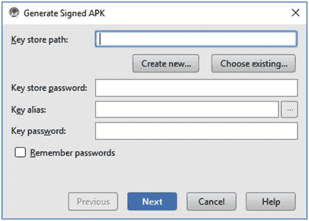
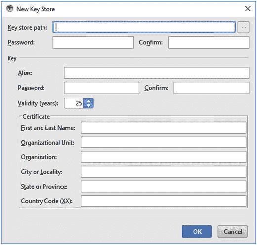
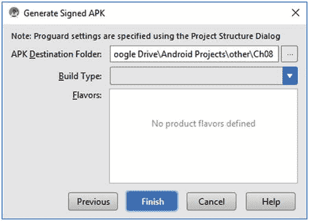
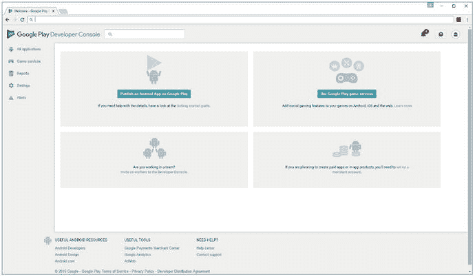
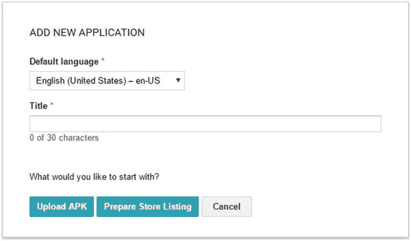
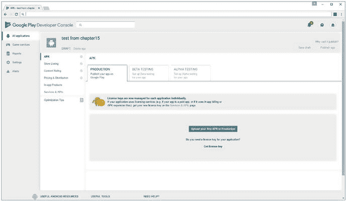

# 15. 发布你的游戏

成为 Android 游戏开发者的最后一步，就是将你的游戏交付到玩家手中。以下有两种途径可选：

- 从项目的 `build/` 文件夹中取出 APK 文件，将其上传至网络，然后告诉你的朋友下载并安装到他们的设备上。
- 像真正的专业人士一样，将你的应用发布到 Google Play 或 Amazon App Store。

在将游戏发布到 Google Play 商店之前，第一种方案是让其他人测试你的应用的好方法。他们只需获取 APK 文件并安装到自己的设备上即可。真正的乐趣始于你的游戏准备公开发布的时候。

## 关于测试的一点说明

正如我们在前几章中看到的，不同的设备之间存在各种差异。在发布你的应用之前，请确保它能在多种常见设备以及不同 Android 版本上良好运行。解决这个问题有几种方法。你可以购买一组配置不同硬件、运行不同版本 Android 的设备，进行内部测试；或者，你也可以付费使用任何一种新型的 Android 测试服务。我们很幸运地拥有几款涵盖不同设备类型和世代的手机和平板进行测试。不过，取决于你的预算，这两种方法可能都不可行。你可能不得不依赖模拟器（但不要过度依赖，因为它确实不太可靠），或者最好请几位朋友帮忙。

另一种测试应用的方法是将测试版发布到 Google Play 商店。Google Play 支持通过邀请制启用测试通道，你可以上传应用的可测试版本，并邀请其他人来测试。

如果你寻找外部测试人员，请确保测试覆盖了大多数设备型号。较新的设备当然也应该在你的清单上，但这更多是出于兼容性测试而非性能测试的原因。至少，请确保你在一部分谷歌官方设备上进行了测试，包括 Nexus Pixel、Nexus 6P，甚至 Nexus 6。如果你的游戏在这些设备上运行不佳，那么如果不做出改变，必定会遇到麻烦。

最后，你必须接受一个事实：你无法在所有设备上测试你的应用程序。你很可能会收到一些无法解释的错误报告，这些错误很可能源于用户运行的定制 ROM 不符合预期行为。无论如何，不要惊慌；这在某种程度上是正常的。不过，如果错误问题过于严重，你就得想办法制定一个应对方案。幸运的是，Google Play 在这方面为我们提供了帮助。我们稍后会看到它是如何运作的。

> **注意：** 除了 Google Play 的错误报告功能外，还有一个好用的解决方案叫做 Android 应用程序崩溃报告（ACRA），这是一个专门用于报告 Android 应用程序所有崩溃的开源库。其网址为 `http://code.google.com/p/acra/`，并且非常易于使用。只需按照 Google Code 页面上的指南将其集成到你的应用程序中即可。

## 注册成为开发者

谷歌使得将你的应用程序发布到 Google Play 商店变得非常简单。你只需注册一个 Android 开发者账户，并支付一次性的 25 美元费用即可。假设你生活在谷歌支持分发应用程序的众多国家/地区之一，该账户将允许你将应用发布到 Google Play。至于你只能发布免费应用，还是既可以发布免费应用也可以发布付费应用，取决于你所在的国家/地区。要发布付费应用，你必须居住在谷歌那稍短一些的商户支持国家/地区列表中。谷歌还有单独的国家/地区列表，分别用于免费分发应用和付费分发应用。谷歌正在努力扩展这些列表，以便你的应用能够覆盖全球。

你的 Google Play 商店发布者账户直接与一个 Google 账户绑定。除非限制被解除，否则你不能将发布者账户与 Google 账户分离。在决定是使用现有账户注册还是注册一个新的专用账户时，考虑这一点非常重要。请记住，如果你使用现有的 Google 账户，并且由于某种原因你的发布者账户被暂停，你将失去对该现有 Google 账户的访问权限。一旦你做出决定并准备好你的 Google 账户，请访问 `https://play.google.com/apps/publish/signup` 并按照那里的说明注册 Google Play 商店。

除了你的 Android 开发者账户之外，如果你想销售应用程序，你还需要注册一个免费的 Google Checkout 商户账户。在开发者账户注册过程中，你会有选项执行此操作。我们不是律师，因此此时无法给你任何法律建议，但请确保在销售应用程序之前了解其法律影响。如有疑问，请考虑咨询相关专家。我们并不是想因此吓退你，因为整个过程通常非常顺畅，但你应该准备好向政府税务部门申报你的销售活动。

谷歌会从你辛苦赚来的收入中抽取一定比例（截至本文撰写时为 30%），用于分发你的应用并提供基础设施。这似乎是各大平台所有应用商店普遍采取的标准分成比例。

## 签署你的游戏 APK

在您成功注册为官方 Android 开发者后，就该准备将您的应用程序发布到 Google Play 了。为了发布你的应用程序，你必须签署 APK 文件。在此之前，你应确保一切就绪。以下是签署 APK 文件之前需要完成的一系列事项清单：

*   如果你的构建目标等于或高于 SDK 级别 8（Android 2.2），你还应确保 `<manifest>` 标记中的 `android:installLocation` 属性设置为 `preferExternal` 或 `auto`。这将满足用户需求，确保你的应用程序在可能的情况下安装到外部存储设备上。

*   确保只指定你的游戏真正需要的权限。用户不喜欢安装那些似乎要求不必要权限的应用程序。请检查你清单文件中的 `<uses-permission>` 标签。

再次检查所有这些项目。完成之后，你终于可以按照以下步骤导出一个已签名的 APK 文件，该文件已准备好上传到 Google Play：

1.  在 Android Studio 中，点击 **Build** ➤ **Generate signed APK**。这将打开生成签名 APK 对话框，如图 15-1 所示。

**图 15-1.** 签名导出对话框

2.  点击 **Create new. . .** 按钮进入新密钥库对话框，如图 15-2 所示。

**图 15-2.** 选择或创建密钥库

3.  密钥库是一个受密码保护的文件，用于存储签署 APK 文件所用的密钥。由于你尚未创建密钥库，现在将在此对话框中进行创建。

4.  要创建一个有效的密钥，你必须填写 **别名**、**密码** 和 **有效期（年）** 字段，并在 **名字与姓氏** 字段中输入一个名称。其余字段为可选，但最好还是填写完整。点击 **下一步**，你将看到最终的对话框，如图 15-3 所示。

**图 15-3.** 指定目标文件

5.  指定导出的 APK 文件应存储的位置，并务必记下路径。稍后想要上传该 APK 时会用到它。点击 **完成**。

当你想要发布先前已发布应用程序的新版本时，可以直接重复使用你第一次运行向导时创建的密钥库。启动向导，在出现图 15-1 所示的生成签名 APK 对话框时，选择 **Choose existing. . .** 按钮，提供你之前创建的密钥库文件的位置，并输入该密钥库的密码。只需选择你之前创建的密钥，输入其密码，点击 **下一步**，然后像之前一样继续。在这两种情况下，结果都是一个已签名的 APK 文件，可以上传到 Google Play。

> **注意：** 一旦你上传了一个已签名的 APK，你必须使用相同的密钥来签署同一应用程序的任何后续版本。

至此，你已经创建了第一个签名的 APK——恭喜！现在，我们要给工作带来一点复杂性，向你介绍一下多 APK 支持。对于一个应用，你可以创建多个 APK，这些 APK 利用设备能力过滤功能，为每位安装你应用的用户提供“最佳适配”。这是一个很棒的特性，因为它意味着你可以执行如下操作：

*   提供与特定 GPU 兼容的特定图像集
*   拥有针对旧版 Android 的有限功能集
*   为更大的屏幕尺寸提供更大尺寸的图形，为其他所有屏幕提供常规尺寸的图形

随着时间的推移，谷歌无疑会增加更多的筛选条件，但仅凭此处列出的这些条件，你就能精准锁定目标设备（例如平板电脑），而无需大费周章地确保下载包在支持第一代设备的情况下保持合理大小。

## 将游戏发布到 Google Play

现在，是时候登录你在 Google Play 网站上的开发者账户了。直接访问 [`https://play.google.com/apps/publish`](https://play.google.com/apps/publish) 并进行注册。你将看到如图 15-4 所示的界面。

图 15-4. 欢迎来到 Google Play，开发者！

这个界面就是谷歌所称的 Android 开发者控制台，你在最初注册时已经见过它。现在，我们准备开始实际使用它。点击屏幕右上角的 `Add New Application` 按钮即可开始操作。这将打开 `Add New Application` 对话框，如图 15-5 所示。

图 15-5. Android 开发者控制台的“添加新应用”对话框

填写完应用标题后，点击 `Upload APK` 按钮。

此时你应该会看到如图 15-6 所示的界面。在这里，你可以上传你的 APK 文件并最终完成应用上架。

图 15-6. 上传 APK

在这里，你可以选择将 APK 文件上传到 `Production`、`Beta` 或 `Alpha` 渠道。谷歌让应用发布到 Google Play 变得非常简单。

## 发布！

提供所有信息后，点击页面底部的巨大 `Publish` 按钮，让你的游戏触达全球数百万用户！审核流程已被取消，因此经过一两个小时的服务器传播后，你的游戏就会在 Google Play 商店中面向所有支持的设备上线。

## 关于开发者控制台的更多信息

一旦你的游戏在 Google Play 上发布，你肯定想追踪它的状态。到目前为止有多少人下载了它？是否发生过崩溃？用户们在说什么？你可以在 Android 开发者控制台（参见图 15-4）中查看所有这些信息。

对于你发布的每个应用，你可以获得以下几条信息：

- 游戏的整体评分及评分数量
- 用户评论（只需点击相应应用的 `Comments` 链接即可）
- 应用的安装次数
- 应用的活跃安装数
- 错误报告

## 总结

在 Google Play 上发布游戏轻而易举，而且门槛很低。现在，你已经拥有了在 Android 上设计、实现并发布你的第一款游戏所需的所有知识。愿原力与你同在！

