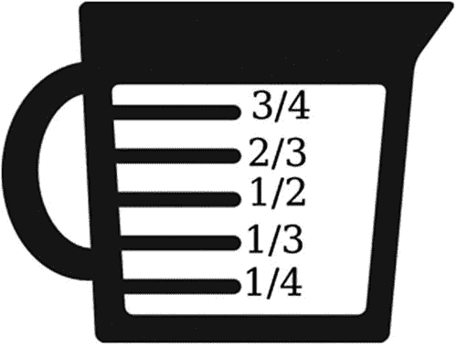
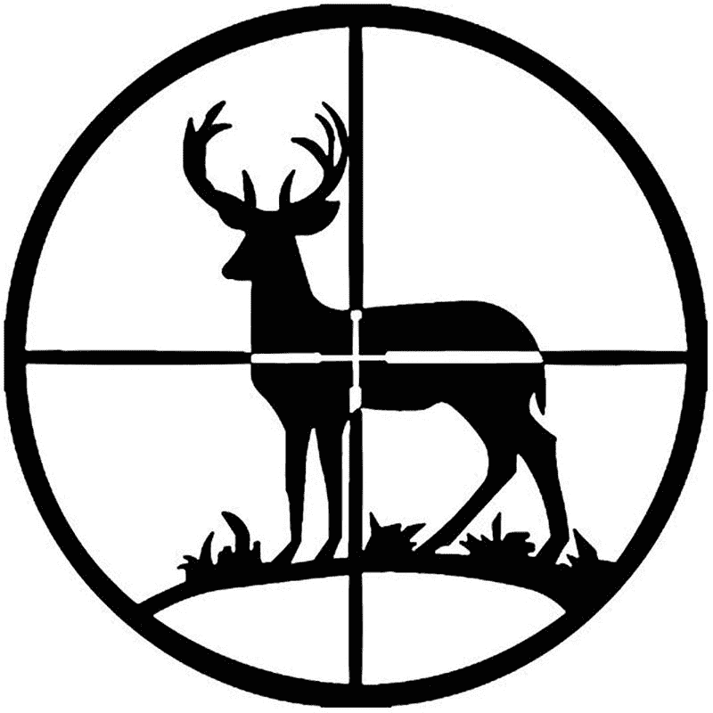
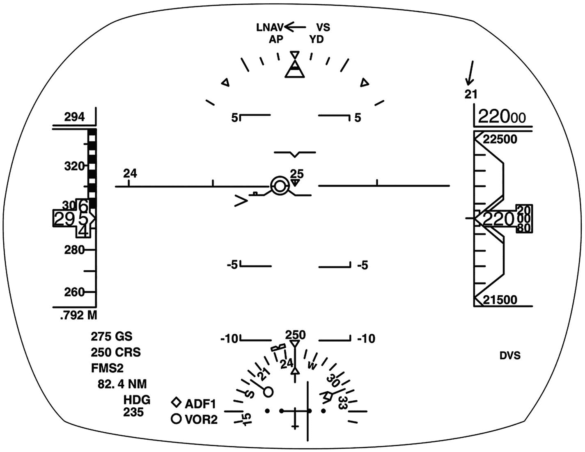
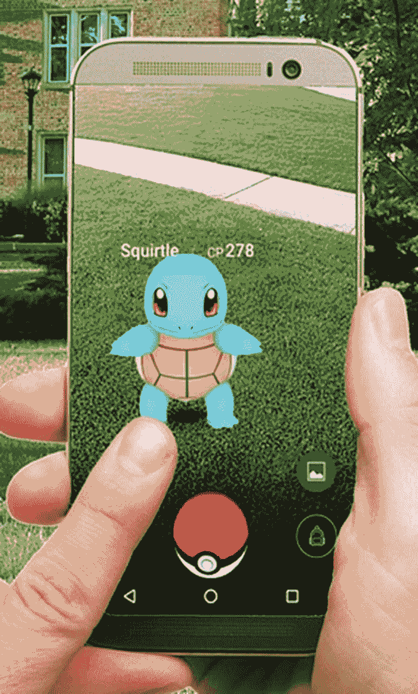
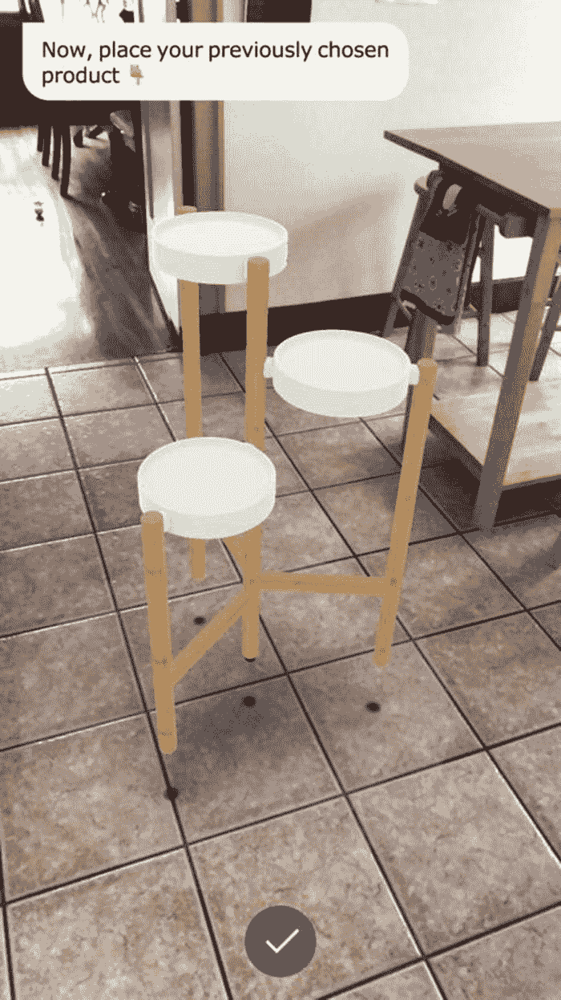
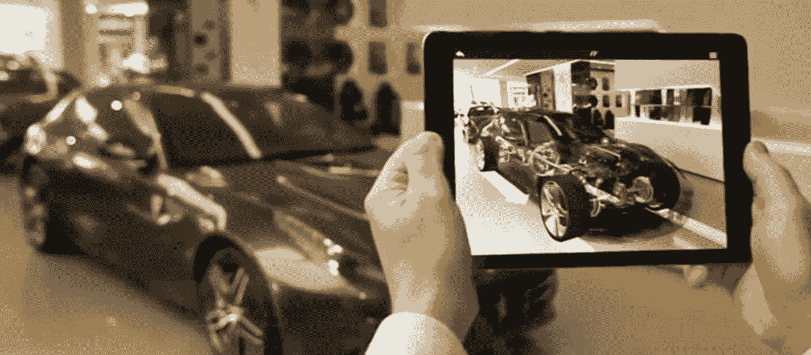

# 理解增强现实与 ARKit

你可能听说过虚拟现实（VR），但有一种类似的创新技术正在 iPhone 和 iPad 等移动设备上兴起，它被称为增强现实（AR）。尽管它们可能依赖相似的技术，但虚拟现实和增强现实在日常生活中的应用却大相径庭。

虚拟现实的工作原理是通过将头戴式设备像异形抱脸虫一样固定在用户头上，完全将用户与现实世界隔离，使其沉浸在一个完全虚构的环境中。NASA 利用虚拟现实来训练宇航员模拟探索火星表面，而美国的橄榄球队也在尝试用其训练四分卫重温比赛，无需真正上场承担身体受伤的风险。通过在虚拟世界中练习技巧，用户可以安全地犯错并从中学习，而不会产生任何物理后果。

虚拟现实的一大局限在于，要使用它，你必须身处一个安全的环境，例如家中或办公室。因为 VR 头显切断了你与周遭环境的联系，使用虚拟现实实际上等同于蒙上双眼。你无法在驾驶、步行或操作任何交通工具时使用它。由于需要佩戴头显，你只能在能够安全站立或坐下、且不受外界干扰（如他人或移动车辆）的固定地点使用虚拟现实。因此，虚拟现实的应用被限制在用户可以安全沉浸于另一个世界的固定位置。

相反，增强现实旨在与你周围的环境互动。它允许你在观看真实世界的同时，在其上叠加额外的信息，帮助你更好地理解所看到的内容。

例如，量杯就是增强现实的一个简单形式。通过将液体倒入外部印有刻度的透明杯中，你可以精确测量杯中的液体量，如图 1-1 所示。如果没有透明杯外部的这些刻度，你将永远无法确切知道杯中含有多少液体。

图 1-1
量杯是增强现实的一个简单形式

猎人在使用步枪瞄准时，也会用到类似原理的增强现实。瞄准镜放大了观察目标时的视野，而刻在镜片上的十字线则精确指示了子弹将命中的位置，如图 1-2 所示。

图 1-2
猎枪瞄准镜是另一种形式的静态增强现实

量杯和步枪瞄准镜都代表了简单但固定的增强现实类型。量杯只能测量倒入其中的液体，而步枪瞄准镜仅能放大目标。计算机技术使得增强现实变得更加多功能，能够根据周围现实世界的变化而显示信息。

在航空业的早期，飞行员必须频繁查看仪表板来获取速度、方向和位置等信息。遗憾的是，低头看仪表板意味着视线会暂时离开周围环境，即使只是一瞬间。这短暂的视线转移可能是危险的，因为它让眼睛离开了附近潜在的威胁或障碍。在战争时期，这些障碍可能是试图击落你的敌机；在和平时期，则可能是需要避开的建筑物或其他飞机。这就是为什么现代飞机会配备一种称为平视显示器（HUD）的增强现实系统。

平视显示器将飞行信息直接投射到驾驶舱玻璃上。飞行员可以关闭它以获得外部世界的清晰视野，也可以打开它，同时看到现实世界和关键的飞行数据，如图 1-3 所示。

图 1-3
飞机平视显示器提供了一种更复杂的增强现实形式

与量杯或步枪瞄准镜显示的固定信息不同，飞机的平视显示器能够展示不断变化的数据，例如高度和速度。由于平视显示器只是投射在驾驶舱窗户上的影像，计算机可以根据飞行员的需求显示不同类型的信息。这种能够呈现动态、变化数据，并选择显示何种信息的能力，使得增强现实比量杯或猎枪瞄准镜这类只能显示固定信息的简陋设备，更加有用和多功能。

## 移动设备上的增强现实技术

飞机中的平视显示器让飞行员驾驶更轻松。不幸的是，这类平视显示器价格昂贵且体积庞大。这就是为什么像波音 737 这样的大型喷气式客机或像 F-14 这样的军用飞机是平视显示器的最初使用者。随着计算机变得更小、更轻、更便宜，增强现实背后的技术得以在 iPhone 和 iPad 等移动设备上实现。

三个要素使得增强现实在 iOS 设备上成为可能：
*   **强大的处理器**
*   **高分辨率摄像头**
*   **高分辨率显示屏**

iPhone 和 iPad 中使用的处理器现在已能与桌面处理器性能匹敌。如今你能买到的 iPhone 提供的处理能力，超过了几年前销售的台式电脑。更令人惊叹的是，如今 iPhone 和 iPad 中使用的处理器性能，远超早期大型机和微型计算机曾经提供的算力。随着时间的推移，iPhone 和 iPad 中使用的处理器正越来越接近匹配台式电脑的处理能力。在某些情况下，iPhone 和 iPad 中使用的处理器性能实际上已经超过了台式电脑。

增强现实需要快速的处理能力，尤其是在处理变化信息时。然而，让增强现实在移动设备上得以实现的第二个要素是 iOS 设备上内置的摄像头。在早期，手机摄像头只能捕捉质量很差的图像。如今 iPhone 和 iPad 上的摄像头性能，已能与几年前的专业数码相机相媲美。许多专业摄影师甚至电影制片人使用 iPhone 摄像头，而非昂贵的专业数码或胶片相机。当今移动相机的高质量分辨率也有助于实现增强现实。

最后，移动设备上的显示屏也提供了高分辨率。iPhone 和 iPad 屏幕不仅可以显示周围现实世界的清晰图像，还可以在屏幕上显示增强现实数据。高速、小型化的处理器与高分辨率摄像头和显示屏的结合，使得增强现实在 iPhone 和 iPad 等移动设备上成为可能。将这些功能与运动跟踪相结合，iOS 设备就具备了在 iPhone 或 iPad 上显示增强现实所需的所有技术能力。

增强现实最早的用途之一出现在游戏 `Pokemon GO` 中。`Pokemon GO` 没有将游戏限制在困于屏幕内的虚拟卡通世界里，而是让玩家在现实世界中寻找卡通宝可梦角色。只需举起你的 iPhone 或 iPad，将 iOS 设备的摄像头对准地面、树上或沙发，就可以寻找卡通宝可梦角色，如图 1-4 所示。

图 1-4 Pokemon GO 在现实世界上叠加显示卡通宝可梦角色

## ARKit 简介

借助最新 iOS 设备中可用的技术能力，增强现实已为移动设备做好准备。当时最大的问题在于，开发能使用增强现实的应用非常复杂。要创建一个增强现实应用，你必须创建自己的算法来检测现实世界中的物体并在图像中显示虚拟物体。这也意味着要跟踪摄像头的位置和 iOS 设备本身的移动。由于这种复杂性，增强现实虽然可能实现，但对大多数开发者来说使用起来太困难了。

这就是为什么苹果创建了 `ARKit` 软件框架，以使创建增强现实应用简单得多。`ARKit` 负责处理实现增强现实的复杂性，这样你就可以专注于应用的实际用途，例如像 `Pokemon GO` 一样在屏幕上显示卡通怪物，或者像飞行员的平视显示器一样在屏幕上显示数据。

苹果并没有发明增强现实，也没有独自创建 `ARKit`。相反，多年来苹果一直在收购增强现实公司，并将这些其他公司的技术整合到一个名为 `ARKit` 的统一框架中，该框架专门用于帮助 iOS 开发者创建增强现实应用。

苹果一项重大的增强现实收购发生在 2015 年，当时他们收购了一家名为 `Metaio` 的德国增强现实公司。至今，你仍然可以在 `Google` 或 `Bing` 等搜索引擎上搜索“`Metaio`”，找到展示 `Metaio` 技术实际应用的历史视频和图片，其中许多技术将继续被整合到苹果的 `ARKit` 框架中。

`宜家`最初使用 `Metaio` 的技术创建了他们的增强现实应用，允许你放置家具以查看其在自己家中的效果。通过将摄像头对准地面，你可以在家中放置家具的虚拟图像，以便在购买并将其带回家之前，了解一件家具摆放的样子。你可以下载 `IKEA Place` 应用并在自己家中试用，如图 1-5 所示。

图 1-5 IKEA Place 是一款增强现实应用，允许你在现实世界中放置虚拟家具

`法拉利`使用 `Metaio` 的增强现实技术，让潜在买家在展厅里查看一辆法拉利，但使用增强现实来显示该车的不同颜色。只需将 iPhone 或 iPad 对准展厅里的一辆法拉利，你就可以改变那辆车的颜色，看看你最喜欢哪种颜色，即使展厅里没有那种特定颜色的实车可供检查。

由于许多汽车爱好者想了解汽车内部，法拉利的增强现实应用还允许用户将 iPhone 或 iPad 对准一辆车，查看内部特征，例如发动机的外观，如图 1-6 所示。

图 1-6 法拉利的增强现实应用允许用户查看汽车的内部特征

柏林墙纪念馆利用 `Metaio` 的技术创建了一个有趣的增强现实应用。你可以用 iPhone 或 iPad 对准一张静态图像，例如边境上柏林墙的废弃建筑上的窗户。然后，增强现实应用会播放一段历史视频，展示人们是如何从那个特定的窗户爬出去，试图逃离东柏林并成功抵达自由的西柏林。

