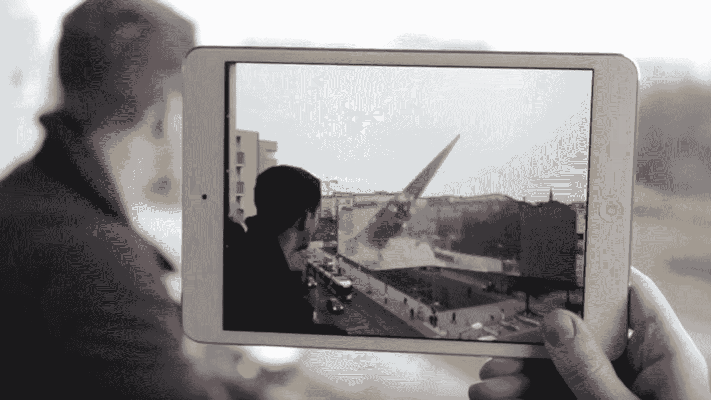
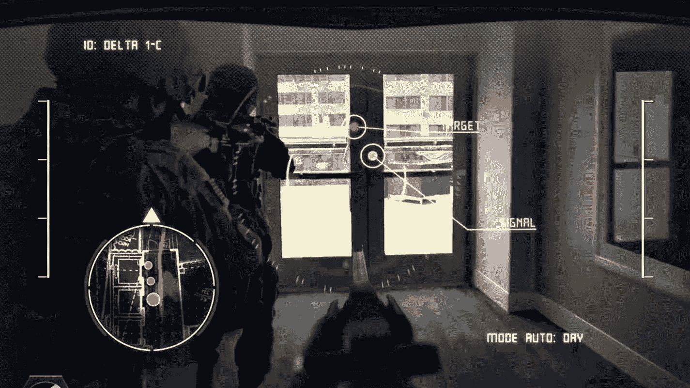
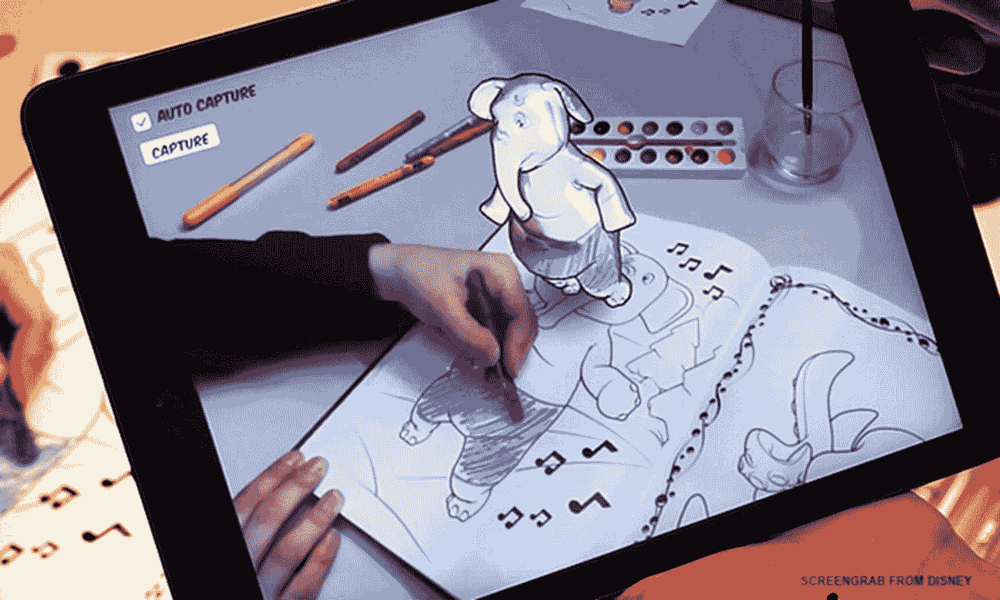

# 增强现实应用

您也可以使用此应用程序来查看柏林的不同区域，应用会播放一段视频，展示在柏林墙仍存时期该区域的模样，如图 1-7 所示。增强现实的此类应用，使得柏林墙纪念馆从一个布满静态图像和场所的博物馆，转变为一个视觉上充满活力的展示，让历史仿佛就在您眼前重现。

图 1-7
增强现实向游客展示 20 世纪 60 年代柏林的风貌

增强现实很可能会在广告中变得普遍。百事可乐曾利用增强现实作为促销噱头，在一个热门的伦敦公交站设置了摄像头和屏幕。当人们等车时，屏幕上显示的增强现实画面包括老虎在人行道上行走、巨型机器人攻击城市、陨石撞击地面以及 UFO 在空中漂浮，如图 1-8 所示。

图 1-8
百事可乐将增强现实用作促销噱头

正如世界各地的空军为其飞行员依赖平视显示器一样，地面上的士兵们也将很快依赖类似的平视显示器来帮助他们识别周围的目标。美国陆军正在开发**战术增强现实**（`TAC`）系统，士兵将佩戴智能眼镜，以便能看到周围世界的增强视图，包括夜视功能和可能目标的识别，如图 1-9 所示。

图 1-9
未来的士兵可能佩戴带有平视显示器的智能眼镜以识别潜在目标

迪士尼公司正在试验使用增强现实来创建互动涂色书。当孩子为一幅图像上色时，他们可以将该图像看作一个三维角色，正站在他们面前的页面上，如图 1-10 所示。

图 1-10
增强现实可以创建互动涂色书

游戏、广告、平视显示器和互动书籍只是增强现实提供的众多可能性中的一部分。时至今日，苹果公司仍在持续收购增强现实公司以完善其增强现实计划，例如`ARKit`。2016 年，苹果收购了专注于空间识别的增强现实公司 Flyby Media。Flyby Media 的技术能让增强现实设备理解移动设备与周围真实世界物体之间的距离。

2017 年，苹果收购了 SensoMotoric Instruments，该公司专门从事可用于虚拟现实和增强现实眼镜的眼球追踪技术。同年，苹果收购了专注于混合现实头显的公司 VRvana。2018 年，苹果收购了初创公司 Akonia Holographics，该公司声称他们制造“用于智能眼镜透明显示元件的全息反射与波导光学元件”。

通过追踪苹果最新的增强现实收购动态，您可以预见哪些新功能最终会出现在 iPhone 和 iPad 等 iOS 设备的`ARKit`上，以及未来的智能眼镜或汽车平视显示器等设备中。`ARKit`的功能将持续增长，同时让所有希望在自己 iOS 应用中添加增强现实功能的`Swift`和`Objective-C`开发者都能使用增强现实。现在学习`ARKit`，您就可以现在乃至未来都能创建增强现实应用。

## 注意

增强现实最适合配备摄像头的移动设备，如 iPhone 和 iPad。这意味着`ARKit`是为创建 iOS 应用而设计的，并不适用于苹果的其他操作系统，如`MacOS`、`tvOS`或`watchOS`。

## ARKit 的系统要求

由于增强现实需要处理能力、摄像头和高分辨率显示屏，您只能在现代的 iOS 设备上创建和运行`ARKit`应用。这意味着`ARKit`应用只能在 iPhone 6s/6s Plus 或更高版本以及 iPad Pro 上运行。较旧的 iOS 设备，如 iPhone 5s 或 iPad mini，将无法运行`ARKit`应用。随着人们弃用旧的 iOS 设备转而使用新机型，这个限制不会是大问题，但目前请注意，您创建的`ARKit`应用可能无法在一些人的旧款 iOS 设备上运行。

要创建应用，您需要使用苹果的免费`Xcode`编译器。创建普通的 iOS 应用时，您可以在`Simulator`程序上测试它们，该程序让您的 Macintosh 模拟不同的 iPhone 和 iPad 型号，例如 iPhone 4s。创建使用`ARKit`的 iOS 应用时，您将无法在`Simulator`程序上测试您的应用。相反，您需要一个物理 iOS 设备，例如 iPhone 6s 或更新型号，或 iPad Pro，您需要通过其 USB 数据线将其连接到您的 Macintosh。您只能通过物理设备测试`ARKit`应用，因为您需要使用真实 iOS 设备中的摄像头。

最后，要创建使用`ARKit`的 iOS 应用，您可以在苹果的两种官方编程语言——`Swift`和`Objective-C`——之间进行选择。虽然许多较旧的应用程序是用`Objective-C`编写的，但`Swift`是苹果未来的编程语言。`Swift`不仅与`Objective-C`一样强大，而且速度更快，学习起来也容易得多。尽管您可以使用`Objective-C`来创建`ARKit`应用，但最好完全专注于使用`Swift`来创建`ARKit`应用。`Swift`只会越来越受欢迎，而随着时间的推移，随着更多开发者拥抱`Swift`，`Objective-C`的受欢迎程度将持续下降。因为苹果开发的未来是`Swift`而不是`Objective-C`，所以本书完全专注于使用`Swift`来创建`ARKit`应用。

要在本书中创建增强现实应用，您需要一台 Macintosh 和一份`Xcode 10`或更高版本。您还需要一个 iOS 设备，如 iPhone 或 iPad，您可以通过其 USB 数据线将其连接到 Macintosh。为了充分利用`ARKit`的所有最新功能，您的 iOS 设备还应运行`iOS 12`或更高版本。

## 概述

增强现实，尤其是`ARKit`的真正潜力尚未被充分发掘。与需要购买专用 VR 头显的虚拟现实不同，增强现实可以在许多人已拥有的普通 iPhone 和 iPad 上使用。同样与虚拟现实不同的是，增强现实让你可以在所处的任何地方使用它，并与周围的现实世界进行互动。

像《`Pokemon GO`》这样的游戏帮助公众接触了增强现实，就像电子游戏曾帮助人们认识早期的个人电脑一样。除了增强现实的娱乐价值之外，越来越多的人和公司将开始看到并使用增强现实的有益应用。

增强现实的一个简单用途涉及导航方向。通过 iPhone 或 iPad 屏幕查看周围环境，你可以看到街道和建筑物。借助增强现实，你将很快能看到彩色的路径线，为你指引步行前往目的地的最快路线，同时还能看到叠加在道路和店面之上的街道名称和商户名称。

当你想使用增强现实时，就像拿出 iPhone 或 iPad 一样简单。使用完毕后，只需将 iPhone 或 iPad 收好即可。（而使用虚拟现实，你需要购买专用的虚拟现实头显并将其固定在脸上，从而完全阻隔对周围环境的视线。使用虚拟现实结束后，你仍然需要随身携带或存放那个虚拟现实头显，这使得虚拟现实相比增强现实使用起来不那么方便。）

增强现实将逐渐在每一部 iPhone 和 iPad 上变得司空见惯。最终，智能眼镜将会出现，无需手持 iPhone 或 iPad 在空中即可显示增强现实。增强现实的未来比你想象中来得更快。通过学习如何使用`ARKit`在今天创建增强现实应用，你将准备好迎接未来，无论它以何种形式呈现。

