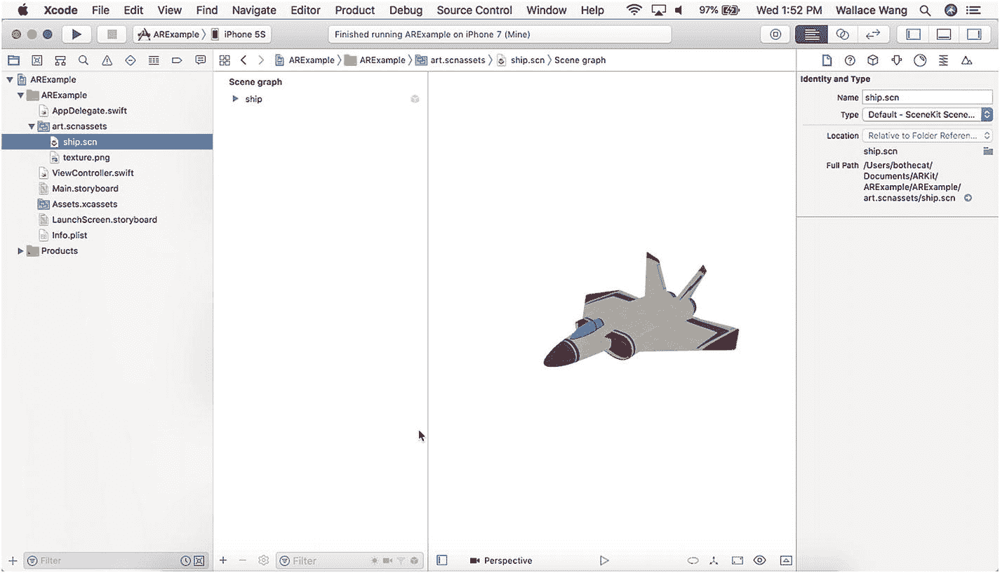
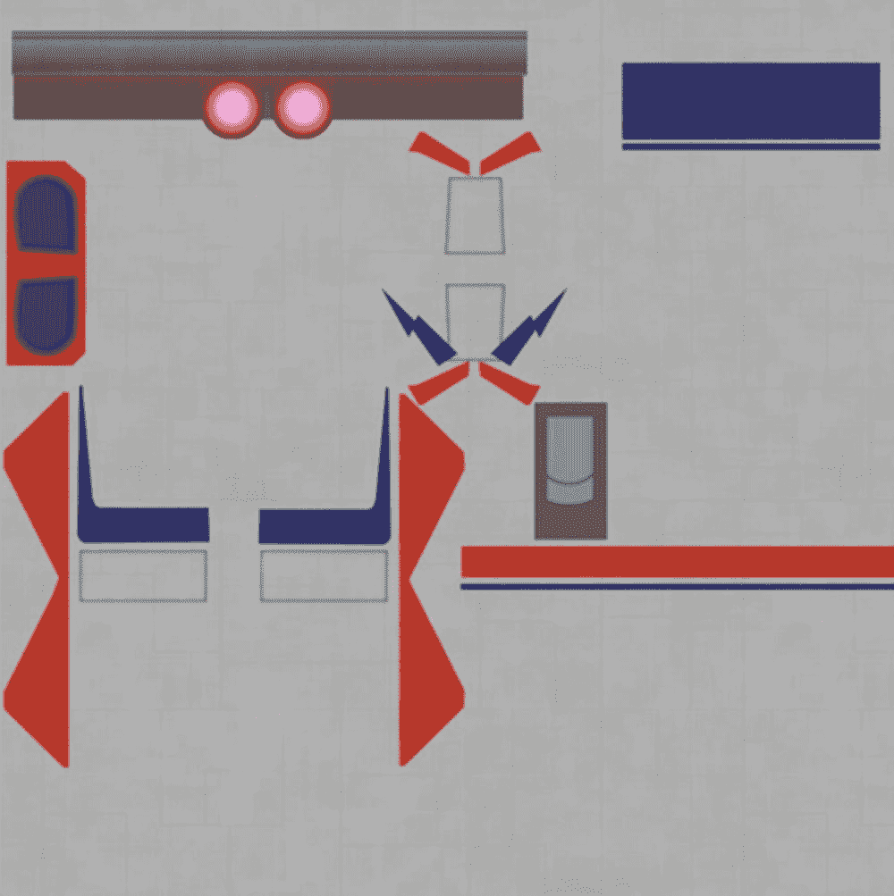
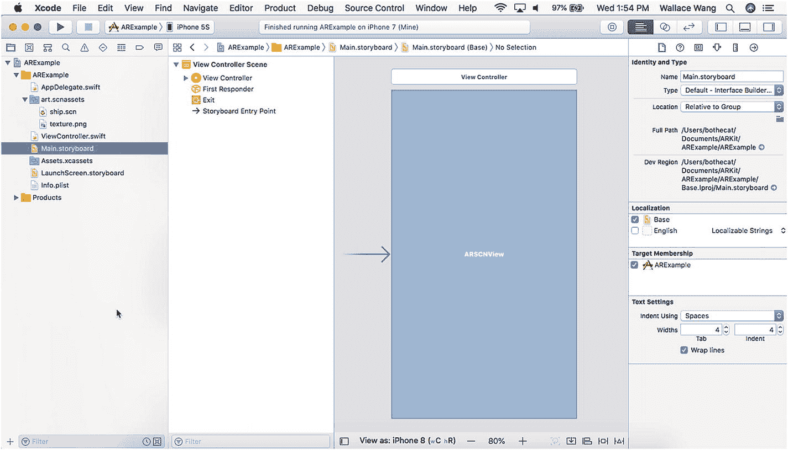
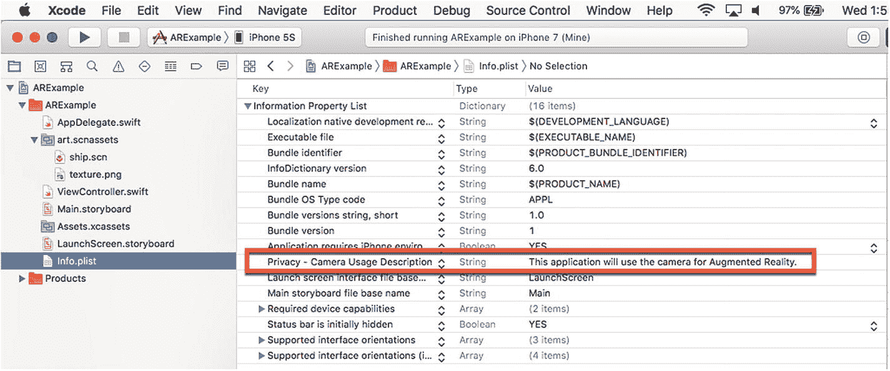
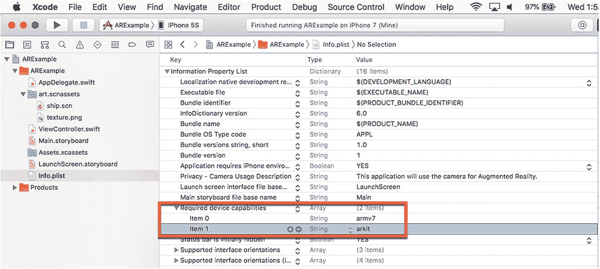

# 认识 ARKit

增强现实的工作原理是通过摄像头追踪现实世界。通过识别现实世界中的实体物体，如地板、桌子和墙壁，增强现实随后能够准确地将虚拟物体放置在场景中，创造出其真实存在的错觉。即使虚拟物体仅仅是一个卡通宝可梦角色，增强现实也必须准确覆盖这个虚拟物体，使其不会在家具、墙壁或桌子处被切断。

由于即使对于经验丰富的程序员来说，创建用于检测现实世界中物体的算法也可能很困难，苹果创建了一个名为`ARKit`的软件框架，它提供了任何增强现实应用所需的大部分基本功能。通过使用`ARKit`，你可以专注于应用程序的独特功能，而不是处理在现实世界中检测、显示和跟踪虚拟物体的细节，从而创建增强现实应用。

`ARKit`作为一个平台，供你开发自己的增强现实应用。为了帮助你熟悉使用`ARKit`，`Xcode`提供了一个简单的增强现实项目，你可以通过 USB 线缆将其编译并运行在任何与 Macintosh 物理连接的兼容 iOS 设备上。要创建这个`ARKit`示例应用，请按照以下步骤操作：

1.  启动`Xcode`。（请确保你使用的是`Xcode 10`或更高版本。）
2.  选择`文件` ➤ `新建` ➤ `项目`。`Xcode`会要求你选择一个模板，如图 2-1 所示。
3.  点击“增强现实应用”图标，然后点击“下一步”按钮。`Xcode`会要求输入产品名称、组织名称、组织标识符和内容技术，如图 2-2 所示。
4.  点击“产品名称”文本框，为你的项目输入一个描述性名称，例如`ARExample`。（具体名称无关紧要。）
5.  确保“内容技术”弹出菜单显示`SceneKit`。`SpriteKit`和`Metal`提供了更多功能，但代价是更复杂。本书中，所有增强现实应用都将依赖`SceneKit`。
6.  确保“包含单元测试”和“包含 UI 测试”复选框未被选中，因为本书创建的任何应用都不会使用这些功能。
7.  点击“下一步”按钮。`Xcode`会询问你希望将项目存储在何处。
8.  选择一个文件夹，然后点击“创建”按钮。`Xcode`将创建一个可以立即运行的增强现实项目。
9.  使用 USB 线缆将你的 iPhone 或 iPad 连接到 Macintosh。
10. 点击`Xcode`窗口顶部附近的弹出菜单，该菜单显示用于运行项目的设备，如图 2-3 所示。
11. 选择你的 iOS 设备，例如 iPhone 或 iPad。
12. 点击“运行”按钮或选择`产品` ➤ `运行`。会出现一个对话框，询问是否允许你的项目访问 iOS 设备的摄像头，如图 2-4 所示。
13.  你的项目会出现在你的 iOS 设备上。注意会出现一个卡通飞机，如图 2-5 所示。每次运行此项目时，请将你的 iOS 设备指向不同的方向。你的 iOS 设备摄像头指向哪里，卡通飞机就会出现在哪里。移动你的 iOS 设备，你可以从不同角度查看卡通飞机。
14.  在`Xcode`中点击“停止”按钮或选择`产品` ➤ `停止`。

## 注意

组织名称和标识符可以是任何文本，例如你的名字或公司名称。组织标识符通常是公司网站地址的反向拼写，例如`com.microsoft`。

## 注意

`Xcode`可能会要求你输入密码以允许你的应用访问额外的库。要授予访问权限，请键入密码并点击“允许”按钮。

## 理解 Swift 源代码

通过使用增强现实应用模板创建项目，你无需编写或修改任何一行代码，就能创建一个可运行的增强现实应用。为了更好地理解如何使用`ARKit`，让我们剖析一下 Swift 代码，以便你能确切理解发生了什么。

你的整个增强现实项目包含多个文件，但`ViewController.swift`文件包含了向任何项目添加增强现实功能所需的所有 Swift 代码。首先，注意`ViewController.swift`文件导入了三个软件框架：`UIKit`（定义用户界面）、`SceneKit`（定义用于创建虚拟图像的 3D 动画）和`ARKit`（链接到`ARKit`增强现实库）。

```
import UIKit
import SceneKit
import ARKit
```


## 注意

SceneKit 是 Apple 用于创建 3D 动画的框架，但另外两个选择是 SpriteKit 和 Metal。如果你选择其中任何一个选项，你的项目需要导入`SpriteKit`或`Metal`框架而不是`SceneKit`。

接下来，你必须将`ViewController`类定义为`ARSCNViewDelegate`：

```
class ViewController: UIViewController, ARSCNViewDelegate {
```

现在你需要创建一个用于显示虚拟图像的场景。为此，你需要创建一个 IBOutlet。这个 IBOutlet 的名字可以是任何你喜欢的，但增强现实应用模板将这个 IBOutlet 命名为`sceneView`，它代表一个`ARSCNView`对象：

```
@IBOutlet var sceneView: ARSCNView!
```

在`viewDidLoad`方法中，你需要定义四项内容。首先，你必须将`ViewController`类设置为其自身的`ARSCNViewDelegate`：

```
// 设置视图的委托
sceneView.delegate = self
```

其次，你可以在屏幕上显示统计数据，让你了解诸如每秒帧数（fps）等信息：

```
// 显示统计数据，例如 fps 和计时信息
sceneView.showsStatistics = true
```

第三，你需要定义要在增强现实场景中显示的实际图像。记住，场景由名为`sceneView`的 IBOutlet 定义：

```
// 创建一个新场景
let scene = SCNScene(named: "art.scnassets/ship.scn")!
```

如果你在 Xcode 中点击`art.scnassets`文件夹，你可以看到两个名为`ship.scn`和`texture.png`的图形文件，如图 2-6 所示。



图 2-6
`art.scnassets`文件夹的内容

`ship.scn`文件代表一个 SceneKit 图像（注意`.scn`文件扩展名）。你可以与 ARKit 一起使用的另一种图形图像是 COLLADA（COLLAborative Design Activity）文件，它具有`.dae`文件扩展名。几乎所有的 3D 创作工具，如 SketchUp，都可以将文件导出为`.dae`格式，这是一种存储 3D 图像的开放标准。

`ship.scn`文件定义了飞机的 3D 形状。`texture.png`图形文件定义了应用于`ship.scn`图像以显示不同颜色或图案的图像。在大多数情况下，你既需要一个 3D 图像（一个`.scn`或`.dae`文件），也需要一个纹理（一个`.png`文件），该纹理包裹在 3D 图像上，并为该 3D 图像提供“皮肤”或外部图形。如果你点击`texture.png`文件，你可以看到它的样子，如图 2-7 所示。



图 2-7
`texture.png`文件定义了 3D 图像的“皮肤”

第四，在用一个变量名（`scene`）定义了 3D 图像之后，你需要将这个 3D 图像放入实际的场景视图中：

```
// 将场景设置为视图
sceneView.scene = scene
```

在`viewWillAppear`方法中，你需要两行额外的 Swift 代码。第一行打开 iOS 设备的跟踪功能，以测量你瞄准 iOS 设备相机时的位置和角度：

```
// 创建一个会话配置
let configuration = ARWorldTrackingConfiguration()
```

第二行运行实际的增强现实会话：

```
// 运行视图的会话
sceneView.session.run(configuration)
```

## 理解用户界面

增强现实应用模板的用户界面由故事板中的一个单一视图组成。在该视图上有一个`ARSCNView`对象，它填满了整个视图，如图 2-8 所示。这个 ARKit SceneKit 视图允许 SceneKit 3D 图像出现在用户界面上。



图 2-8
ARKit SceneKit 视图定义了在用户界面上显示 3D 图像的位置

每个增强现实应用都必须访问 iOS 设备的摄像头。然而，每个应用必须首先请求使用摄像头的权限。要请求访问摄像头的权限，你的应用必须为摄像头定义一个隐私设置。你可以在`Info.plist`文件中查看这个摄像头隐私设置，如图 2-9 所示。



图 2-9
`Info.plist`文件定义了 iOS 设备摄像头的隐私设置

出现在摄像头隐私设置值列中的文本将出现在请求用户允许你的应用访问 iOS 设备摄像头的对话框中。这段文本只是解释你的应用为何需要访问摄像头，例如“此应用程序将使用摄像头进行增强现实。”如果你愿意，可以随时将这段文本更改为其他内容。

`Info.plist`文件中每个增强现实应用需要的第二行是“所需设备功能”设置。它必须设置为`arkit`，如图 2-10 所示。



图 2-10
`Info.plist`文件定义了运行增强现实应用的 iOS 设备的硬件要求

`Info.plist`文件中的此设置确保你的应用只会在具有运行 ARKit 的适当硬件的 iOS 设备上运行，例如 iPhone 6s 或更高版本，或 iPad Pro 或更高版本。


