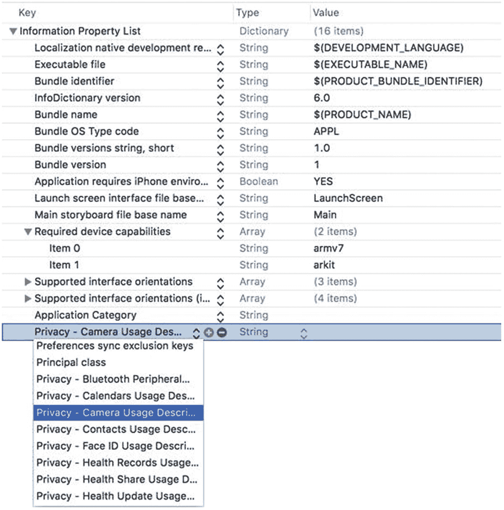
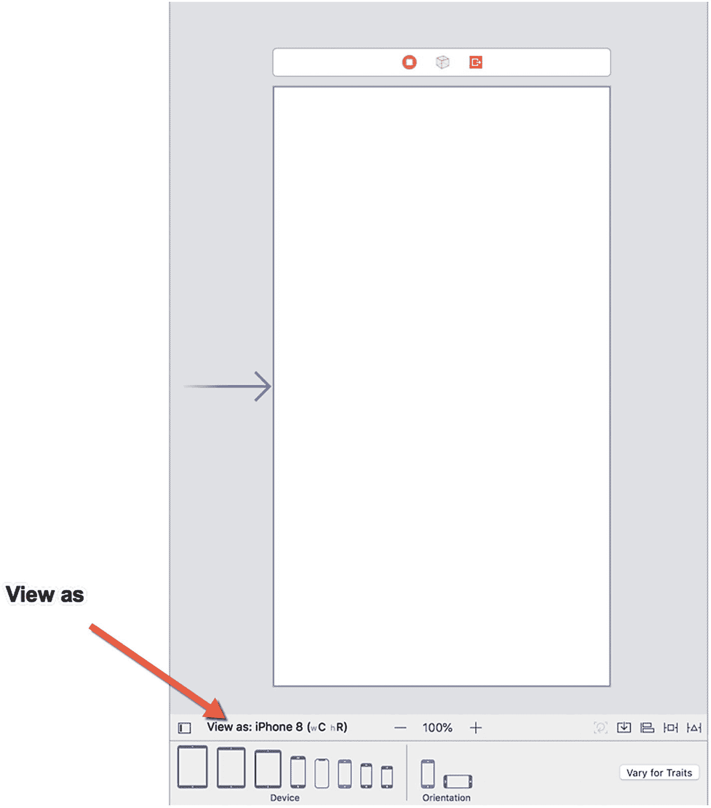
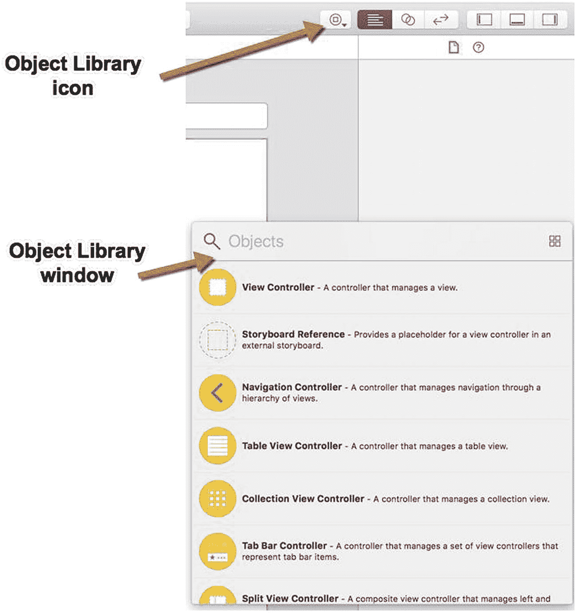
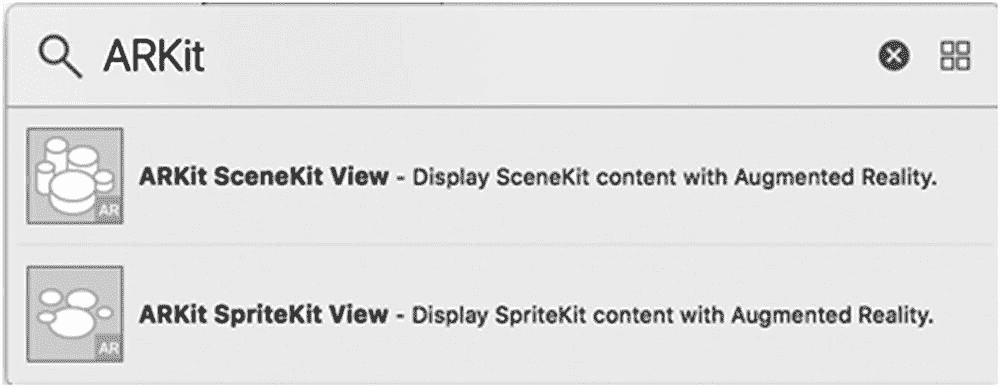
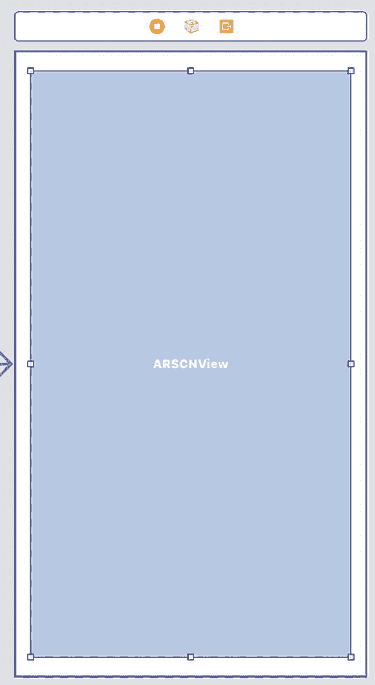
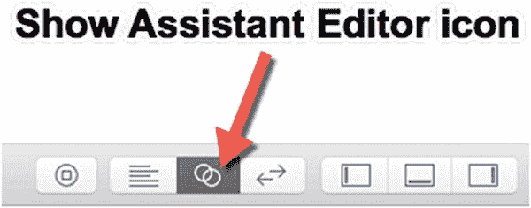
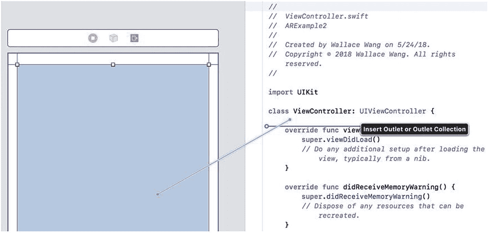
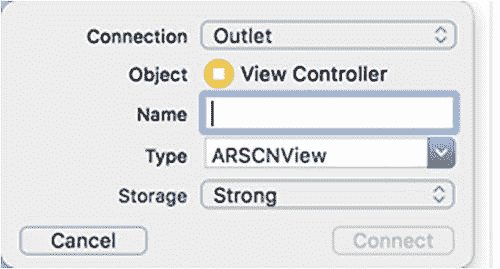

# 使用单视图 App 模板创建增强现实应用

增强现实 App 模板提供了显示增强现实所需的基础 Swift 代码。不过，你也可以不使用增强现实 App 模板，而是改用简单的单视图 App 模板来创建增强现实应用。通过单视图 App 模板创建增强现实应用，你能更清楚地了解需要编写哪些代码以及需要为任意应用添加哪些用户界面元素来赋予其增强现实功能。

1.  启动 Xcode。（请确保你使用的是 Xcode 10 或更高版本。）
2.  选择“文件”➤“新建”➤“项目”。Xcode 会要求你选择一个模板（见图 2-1）。
3.  点击“单视图 App”图标，然后点击“下一步”按钮。Xcode 会要求提供产品名称、组织名称、组织标识符以及内容技术（见图 2-2）。确保所有复选框（如“使用 Core Data”或“包含单元测试”等附加选项）均未勾选。
4.  点击“产品名称”文本框，为你的项目输入一个描述性名称，例如`ARExample2`。（具体名称无关紧要，但确保它与你在增强现实 App 模板中创建的项目的名称不同。）
5.  点击“下一步”按钮。Xcode 会询问你希望将项目存储在哪里。
6.  选择一个文件夹，然后点击“创建”按钮。Xcode 会创建一个可以立即运行的基础 iOS 项目。

至此，你已拥有一个基础 iOS 应用，但它不具备任何增强现实功能。要为应用添加增强现实功能，我们需要编写 Swift 代码、修改用户界面，并在`Info.plist`文件中定义设置，以允许访问摄像头并使其仅在兼容 ARKit 的 iOS 设备（如 iPad Pro 或 iPhone 6s 及更高版本）上运行。

首先，我们需要确保 iOS 应用能够访问 ARKit 框架并使用摄像头。为此，我们需要修改`Info.plist`文件。
1.  在导航器窗格中点击`Info.plist`文件。Xcode 会显示键、类型和值的列表。
2.  点击展开三角形以展开“必需设备功能”类别，显示“项目 0”。
3.  将鼠标指针移到“项目 0”上，显示一个加号（`+`）图标。
4.  点击此加号（`+`）图标以显示一个空白的“项目 1”。
5.  在“项目 1”行的“值”类别下输入`arkit`（见图 2-10）。
6.  将鼠标指针移到最后一行，显示一个加号（`+`）图标。
7.  点击加号（`+`）图标以创建一个新行。此时会弹出一个菜单。
8.  选择“隐私 - 相机使用说明”，如图 2-11 所示。
9.  在“隐私 - 相机使用说明”行的“值”类别下输入`AR needs to use the camera`。



**图 2-11**  
“隐私 - 相机使用说明”这一行允许你的应用访问 iOS 设备的摄像头

在`Info.plist`文件中定义了`arkit`和“隐私 - 相机使用说明”后，我们的应用现在可以访问 ARKit 并使用 iOS 设备的摄像头了。下一步是修改`ViewController.swift`文件并编写 Swift 代码来显示增强现实。

## 修改`ViewController.swift`文件

1.  在 Xcode 的导航器窗格中点击`ViewController.swift`文件。
2.  在`Import UIKit`一行下方添加以下两行代码，如下所示：

    ```
    import SceneKit
    import ARKit
    ```

3.  修改`class ViewController`这一行，添加`ARSCNViewDelegate`，如下所示：

    ```
    class ViewController: UIViewController, ARSCNViewDelegate {
    ```

4.  在`ViewController.swift`文件的末尾，添加`viewWillAppear`和`viewWillDisappear`函数，如下所示：

    ```
    override func viewWillAppear(_ animated: Bool) {
        super.viewWillAppear(animated)
        let configuration = ARWorldTrackingConfiguration()
        sceneView.session.run(configuration)
    }
    override func viewWillDisappear(_ animated: Bool) {
        super.viewWillDisappear(animated)
        sceneView.session.pause()
    }
    ```

在这段代码中，我们引用了`sceneView`，但它尚未定义。这个`sceneView`变量名将代表我们的应用中用于显示增强现实的用户界面视图。用于显示增强现实的用户界面对象被称为“ARKit 场景视图”。

## 添加 ARKit 场景视图

要添加 ARKit 场景视图对象，我们需要将其拖拽到`Main.storyboard`文件中，并在`ViewController.swift`文件中为其创建一个 IBOutlet。具体步骤如下：

1.  在导航器窗格中点击`Main.storyboard`文件。
2.  点击“视图为”选项，为故事板选择不同的 iOS 设备（见图 2-12）。

**图 2-12**  
“视图为”选项允许你为故事板选择不同的 iOS 设备
3.  点击“对象库”图标以显示“对象库”窗口（见图 2-13）。

**图 2-13**  
“对象库”图标可打开“对象库”窗口
4.  点击“对象库”窗口顶部的搜索字段，输入`ARKit`。“对象库”窗口会显示所有可用的 ARKit 对象，如图 2-14 所示。

**图 2-14**  
在“对象库”窗口中显示 ARKit 对象
5.  将“ARKit SceneKit 视图”从“对象库”拖拽到故事板上。
6.  在故事板上调整“ARKit SceneKit 视图”的大小，如图 2-15 所示。“ARKit SceneKit 视图”的具体大小和位置并不重要，但请确保将其设置得足够大，因为该视图的大小决定了通过 iOS 设备摄像头观看时图像的显示尺寸。

**图 2-15**  
调整 ARKit SceneKit 视图的大小
7.  点击“ARKit SceneKit 视图”将其选中，然后选择“编辑器”➤“解决自动布局问题”➤“重置为建议的约束”。Xcode 会添加约束，确保无论用户手持 iOS 设备的尺寸或方向如何，你的“ARKit SceneKit 视图”都能正确对齐。
8.  点击“显示辅助编辑器”图标，如图 2-16 所示，或者选择“视图”➤“辅助编辑器”➤“使用辅助编辑器”。Xcode 会并排显示`ViewController.swift`文件和故事板。

**图 2-16**  
“显示辅助编辑器”图标允许你同时查看故事板和 Swift 控制器文件
9.  将鼠标移到“ARKit SceneKit 视图”上，按住 Control 键，然后将鼠标拖拽到`class ViewController`这一行的下方，如图 2-17 所示。

**图 2-17**  
从 ARKit SceneKit 视图 Control 拖拽到 ViewController.swift 文件
10. 松开 Control 键和鼠标。Xcode 会显示一个弹出菜单，用于定义 IBOutlet 的名称，如图 2-18 所示。

**图 2-18**  
为 IBOutlet 定义名称
11. 点击“名称”字段，输入`sceneView`，然后按 Return 键。Xcode 会在`ViewController.swift`文件中创建一个 IBOutlet。


