# 在 Xcode 中导入并使用 COLLADA (.dae) 文件

## 准备 Swift 代码与用户界面

1.  在 Xcode 的导航器窗格中点击`Main.storyboard`文件。在故事板屏幕底部，可以点击“View As”来更改显示的 iOS 设备，如图 2-12 所示。
2.  点击“使用标准编辑器”图标或选择 视图 ➤ 标准编辑器 ➤ 使用标准编辑器。
3.  在导航器窗格中点击`ViewController.swift`文件。Xcode 将显示存储在`ViewController.swift`文件中的 Swift 代码。
4.  编辑`viewDidLoad`函数如下：

```
override func viewDidLoad() {
    super.viewDidLoad()
    sceneView.delegate = self
    sceneView.showsStatistics = true
    let scene = SCNScene(named: "")!
    sceneView.scene = scene
}
```

```
@IBOutlet var sceneView: ARSCNView!
```

这些代码修改基本上复制了 ARKit iOS 模板。然而，我们仍然需要一个对象放置在我们的增强现实视图中。当我们使用增强现实模板创建应用时，模板包含一个`ship.scn`文件（`.scn`文件扩展名代表 SceneKit）。

我们最初需要的是存储在 `.dae` COLLADA 文件格式中的文件（COLLADA 代表协作设计活动）。此文件格式被用作共享三维程序图形设计的标准文件格式。

要查找 `.dae` COLLADA 文件，请访问你喜爱的搜索引擎，搜索可以下载的“`.dae` 公有领域”文件。（对于有艺术倾向的用户，你可以使用图形编辑器（例如免费的 Blender 程序，可从 [`www.blender.org`](http://www.blender.org) 获取）创建自己的三维对象。）大多数 COLLADA 文件包含一个定义对象形状的 `.dae` 文件和一个定义该形状外部设计的纹理文件。提供免费（和付费）COLLADA 文件的两个网站包括 Free3D ([`https://free3d.com`](https://free3d.com)) 和 TurboSquid ([`www.turbosquid.com`](http://www.turbosquid.com))。

下载 `.dae` COLLADA 文件及其任何伴随的纹理文件后，必须创建一个特殊的 `scnassets` 文件夹来存储这些图像。要创建 `scnassets` 文件夹，请按照以下步骤操作：

1.  选择 文件 ➤ 新建 ➤ 文件。Xcode 显示不同的文件模板。
2.  点击模板窗口顶部的 iOS，向下滚动并在 Resource 类别下点击 SceneKit Catalog 图标，如图 2-19 所示。

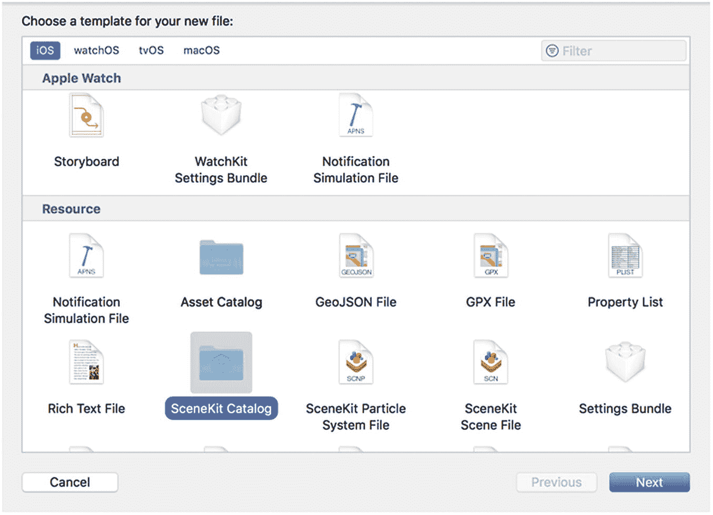

图 2-19
选择 SceneKit Catalog 图标

3.  将文件夹名称更改为 `art.scnassets` 并按 Return。

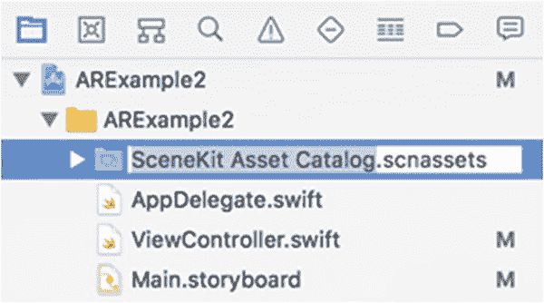

图 2-20
更改 SceneKit 资产目录文件夹的名称

4.  点击 Next 按钮。Xcode 询问你想将此文件夹存储在何处。
5.  点击 Create 按钮。Xcode 在导航器窗格中创建一个 `SceneKit Asset Catalog.scnassets` 文件夹。
6.  点击 `SceneKit Asset Catalog.scnassets` 文件夹并按 Return。Xcode 会高亮显示整个文件夹名称，如图 2-20 所示。

## 导入 3D 图像到 Xcode

现在，我们已经编写了`ViewController.swift`文件中所需的大部分 Swift 代码，并设计了通过 ARKit SceneKit 视图显示增强现实的用户界面，最后一步是将 `.dae` 文件及其纹理文件导入到你在 Xcode 导航器窗格中创建的 `.scnassets` 文件夹中。

要向 Xcode 添加 3D 图像，请按照以下步骤操作：

1.  将 `.dae` 文件和伴随的纹理文件图像从 Finder 窗口拖放到 Xcode 的 `scnassets` 文件夹中，如图 2-21 所示。

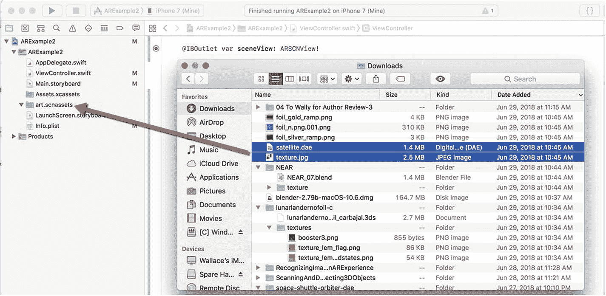

图 2-21
从 Finder 窗口拖放 `.dae` 和纹理文件到 Xcode 的 `scnassets` 文件夹

2.  在 `scnassets` 文件夹中点击 `.dae` 文件以选中它。
3.  选择 编辑器 ➤ 转换为 SceneKit 场景文件格式 (.scn)。将出现一个对话框，要求你确认是否要将 `.dae` 文件转换为 `.scn` 文件，如图 2-22 所示。

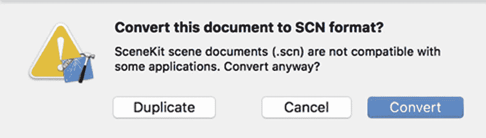

图 2-22
Xcode 请求确认将 `.dae` 文件转换为 `.scn` 文件

4.  点击 Convert 按钮。Xcode 会将你的 `.dae` 文件转换为 `.scn` 文件。
5.  （可选）点击 `.scn` 文件并按 Return，将文件名编辑为简单且具描述性的内容。
6.  编辑`viewDidLoad`函数中的以下行以包含你的 `.scn` 文件的名称。如果你的 `.scn` 文件名为`satellite.scn`，则代码应如下所示：

```
let scene = SCNScene(named: "art.scnassets/satellite.scn")!
```

此 Swift 代码会将 `.dae` 文件（已转换为 `.scn` 文件）加载到你的增强现实视图中。然而，还有最后一步。对于大多数 `.dae` 文件，都有一个伴随的纹理文件来定义三维对象的外观或“皮肤”。最后一步是将此纹理或“皮肤”应用到 `.scn` 文件。为此，请按照以下步骤操作：

1.  在导航器窗格中点击 `scnassets` 文件夹中显示的 `.scn` 文件。Xcode 会将你的图像显示为一个通用形状，但没有外观。
2.  点击 Xcode 窗口底部附近的“显示场景图视图”图标，如图 2-23 所示。Xcode 将显示场景图视图。

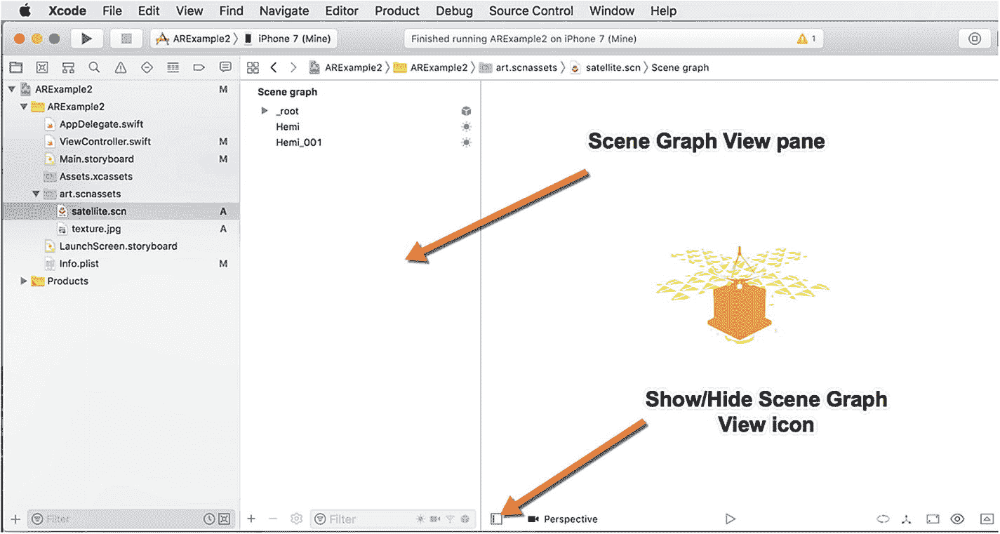

图 2-23
“显示场景图视图”图标

3.  点击场景图视图窗格中显示的每个项目，然后点击“显示材质检查器”图标，如图 2-24 所示。或者选择 视图 ➤ 检查器 ➤ 显示材质检查器。

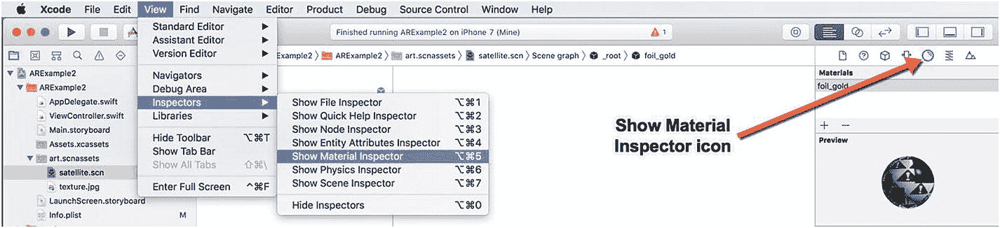

图 2-24
“显示材质检查器”图标

4.  点击漫反射弹出菜单，选择纹理文件的名称，例如`texture.jpg`，如图 2-25 所示。

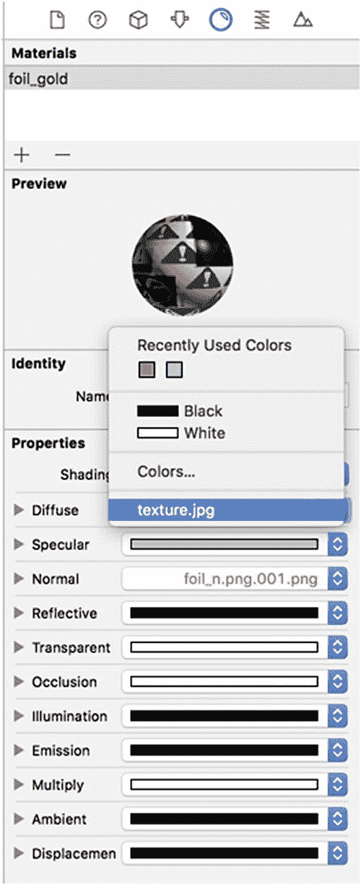

图 2-25
漫反射弹出菜单允许你选择纹理图像

如果你的原始 `.dae` 文件附带两个或更多纹理文件，则可能需要将这些多个纹理文件包含在 `scnassets` 文件夹中，并使用漫反射弹出菜单为三维对象的不同部分选择每个相应的纹理文件。

现在，通过 USB 线将 iOS 设备连接到 Macintosh，然后点击 Run 图标或选择 产品 ➤ 运行。你现在应该会看到你的 `.scn` 文件显示在 iOS 设备摄像头捕获的图像之上。


## 概述

虽然可以独立创建增强现实应用，但依赖苹果的 `ARKit` 框架要简单得多。`ARKit` 负责处理管理摄像头和周围现实世界物体的细节，从而将现实与虚拟图像融合。

创建增强现实应用最简单的方式，是在新建 iOS 项目时选择“增强现实”模板。不过，你也可以为现有应用添加增强现实功能。首先，必须导入 `ARKit` 框架以及一个图形框架（例如 `SceneKit`）。接下来，必须在应用的用户界面上创建一个 `ARKit SceneKit 视图`，以查看实际的增强现实图像。最后，必须将一个三维图像导入 Xcode，并将其转换为 `.scn` 格式的 `SceneKit` 文件。

当你希望专注于开发增强现实应用时，最好使用增强现实项目模板来创建新项目。当你希望为现有应用添加增强现实功能时，同样可以随时轻松完成。

现在你已经对如何创建增强现实应用以及所需遵循的各个步骤有了基本了解，是时候更深入地了解通过 `ARKit` 实现的不同增强现实功能的具体组成部分了。

## 世界追踪

增强现实通过摄像头追踪现实世界来工作。通过识别现实世界中的实体物体，如地板、桌子和墙壁，增强现实便能在场景中精确放置虚拟物体，营造出它们真实存在的错觉。即使虚拟物体只是一个卡通宝可梦角色，增强现实也必须将该虚拟物体叠加在场景中，使其看起来像是通过摄像头看到的真实世界的一部分。

为了识别现实和虚拟物体的位置，`ARKit` 使用一个坐标系，其中 x 轴指向左右方向，y 轴指向上下方向，z 轴指向朝向和远离摄像头的方向，如图 3-1 所示。

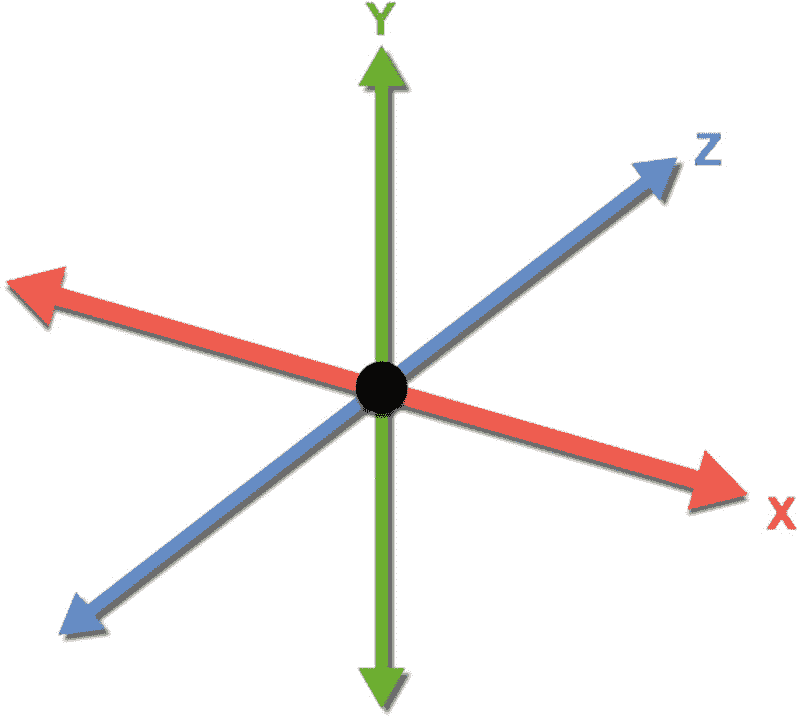

**图 3-1** 定义 ARKit 坐标系的 x、y 和 z 轴

为了将虚拟物体放置在现实世界中，`ARKit` 使用一种名为 `视觉惯性里程计` 的技术，这其实是一种识别现实世界中实体物体（如墙壁和桌面）以及摄像头（iOS 设备）相对于现实世界物体当前位置的复杂方法。利用这些信息，`ARKit` 可以将物体放置在现实世界的物品上（如地板或书桌），或与摄像头当前位置保持固定距离（例如在你前方两米、左侧半米处）。

识别通过摄像头看到的现实物体被称为 `世界追踪`。世界追踪的准确性在光照良好且存在多个易于辨识的对比物体（如房间内的椅子和桌子）时效果最佳。而在昏暗或光照不佳的情况下，或者当观察的物体不易识别时（如一面实心墙或没有其他对比物体的道路），世界追踪的准确性会受到影响。

试想你如何识别现实世界中的物体。识别桌子上的台灯很容易，因为你可以看到台灯的完整轮廓以及桌面和桌边。但如果有人只给你看台灯或桌面的特写，你可能无法分辨自己看到的是墙壁还是地板。一般来说，如果人眼容易识别图像中的物体，那么 `ARKit` 也容易识别这些物体的形状。

除了识别物体边界外，另一个保证准确性的关键在于用户保持摄像头稳定。这为 `ARKit` 提供了准确绘制周围环境的时间。如果用户过快或毫无规律地移动摄像头，`ARKit` 将更难准确识别现实世界物体，就像让你看一段摄像头快速无序移动的视频时，你也难以识别物体一样。

### 显示世界原点

每个增强现实应用都需要导入 `ARKit` 框架和一个图形框架来显示虚拟物体，例如 `SceneKit`、`SpriteKit` 或 `Metal`，如下所示：

```
import ARKit
import SceneKit
```

一旦你的应用导入了 `ARKit` 框架和一个像 `SceneKit` 这样的图形框架，下一步就是使用 `ARWorldTrackingConfiguration` 类，如下所示：

```
let configuration = ARWorldTrackingConfiguration()
```

AR 世界追踪需要在一个 `ARKit SceneKit 视图` (`ARSCNView`) 内进行，你必须将此视图添加到应用的用户界面中。你必须在该 `ARSCNView` 内创建一个 `IBOutlet`，例如：

```
@IBOutlet var sceneView: ARSCNView!
```

现在，你需要在此 `ARSCNView` 内运行 AR 世界追踪，如下所示：

```
sceneView.session.run(configuration)
```

此时，通常你会在 `ARSCNView` 中显示一个虚拟物体，例如卡通飞机或椅子。在本练习中，我们将显示 `ARKit` 使用的世界原点。这些世界原点坐标将让你看到定义 `ARKit` 放置虚拟物体位置的 x、y 和 z 轴。显示世界原点有助于调试你的应用，并确保虚拟物体显示在你期望的确切位置。要了解如何在增强现实应用中显示世界原点，请按照以下步骤操作：

1. 启动 Xcode。（请确保使用 Xcode 10 或更高版本。）
2. 选择 File ➤ New ➤ Project。Xcode 会要求你选择一个模板。
3. 点击 iOS 类别。
4. 点击 Single View App 图标，然后点击 Next 按钮。Xcode 会要求输入产品名称、组织名称、组织标识符和内容技术。
5. 点击 Product Name 文本框，并为你的项目输入一个描述性名称，例如 `World Tracking`。（具体名称不重要。）
6. 确保 Content Technology 弹出菜单显示 `SceneKit`。
7. 点击 Next 按钮。Xcode 会询问你希望将项目存储在何处。
8. 选择一个文件夹并点击 Create 按钮。Xcode 将创建一个 iOS 项目。

首先，让我们按照以下步骤修改 `Info.plist` 文件，以允许访问摄像头和使用 `ARKit`：

1. 在导航器窗格中点击 `Info.plist` 文件。Xcode 会显示一个键、类型和值的列表。
2. 点击展开三角形以展开 Required Device Capabilities 类别，显示 Item 0。
3. 将鼠标指针悬停在 Item 0 上，会显示一个加号 (`+`) 图标。
4. 点击这个加号 (`+`) 图标，显示一个空白的 Item 1。
5. 在 Item 1 行的 Value 类别下输入 `arkit`。
6. 将鼠标指针悬停在最后一行上，会显示一个加号 (`+`) 图标。
7. 点击加号 (`+`) 图标以创建一个新行。会出现一个弹出菜单。
8. 选择 Privacy – Camera Usage Description。
9. 在 Privacy – Camera Usage Description 行的 Value 类别下输入 `AR needs to use the camera`。

现在我们的应用可以访问摄像头并使用 `ARKit` 了，接下来让我们在 `Main.storyboard` 文件中添加一个 `ARKit SceneKit 视图`，以便我们的应用可以显示摄像头图像。要添加 `ARKit SceneKit 视图` 到你的用户界面，请按照以下步骤操作：

1. 在 Xcode 的导航器窗格中点击 `Main.storyboard` 文件。Xcode 会在故事板屏幕上显示一个 iOS 设备，你可以通过点击故事板屏幕底部的 View As 来更改设备型号。
2. 点击对象库图标以显示对象库窗口。
3. 点击对象库窗口顶部的搜索框，输入 `ARKit`。对象库窗口将显示所有可用的 ARKit 对象。
4. 将 `ARKit SceneKit View` 从对象库拖到故事板上。
5. 在故事板上调整 `ARKit SceneKit View` 的大小。`ARKit SceneKit View` 的确切大小和位置不重要，但要使其足够大，因为 `ARKit SceneKit View` 的大小决定了通过 iOS 设备摄像头查看时图像显示的大小。


6. 点击 ARKit SceneKit View 以选中它，然后选择 Editor ➤ Resolve AutoLayout Issues ➤ Reset to Suggested Constraints。Xcode 会添加约束，以确保无论用户以何种尺寸或方向手持 iOS 设备，你的 ARKit SceneKit View 都能正确对齐。

7.  点击 Show Assistant Editor 图标，或选择 View ➤ Assistant Editor ➤ Use Assistant Editor。Xcode 会在故事板旁边并排显示`ViewController.swift`文件。

8.  将鼠标悬停在 ARKit SceneKit View 上，按住 Control 键，并将鼠标拖到`class ViewController`行的下方。

9.  松开 Control 键和鼠标。Xcode 会显示一个弹出菜单，用于为 IBOutlet 定义名称。

10. 在 Name 字段中键入`sceneView`并按 Return 键。Xcode 会在`ViewController.swift`文件中创建一个 IBOutlet，如下所示：

    ```
    @IBOutlet var sceneView: ARSCNView!
    ```

11. 点击 Use Standard Editor 图标或选择 View ➤ Standard Editor ➤ Use Standard Editor。

12. 在 Navigator 窗格中点击`ViewController.swift`文件。Xcode 会显示存储在`ViewController.swift`文件中的 Swift 代码。

13. 编辑`ViewController.swift`文件，如下所示：

    ```
    import UIKit
    import SceneKit
    import ARKit
    class ViewController: UIViewController, ARSCNViewDelegate {
        @IBOutlet var sceneView: ARSCNView!
        override func viewDidLoad() {
            super.viewDidLoad()
            sceneView.delegate = self
            sceneView.showsStatistics = true
            sceneView.debugOptions = [ARSCNDebugOptions.showWorldOrigin]
        }
        override func viewWillAppear(_ animated: Bool) {
            super.viewWillAppear(animated)
            let configuration = ARWorldTrackingConfiguration()
            sceneView.session.run(configuration)
        }
    }
    ```

这个应用与之前构建的增强现实应用的主要区别在于这一行：

```
sceneView.debugOptions = [ARSCNDebugOptions.showWorldOrigin]
```

这行代码告诉 Xcode 显示世界原点坐标系，该坐标系将由红线（x 轴）、绿线（y 轴）和蓝线（z 轴）组成。要在增强现实视图中查看世界原点坐标，请按照以下步骤操作：

1.  点击 Stop 按钮或选择 Product ➤ Stop。
    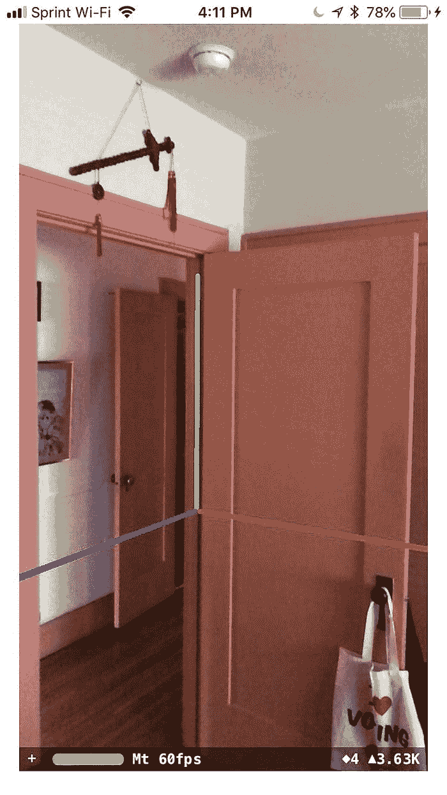
    **图 3-3** 通过 iOS 设备摄像头查看世界坐标系

2.  点击 Run 按钮或选择 Product ➤ Run。（首次运行此应用时，需要授予其摄像头访问权限。）

3.  转动并瞄准 iOS 摄像头，直到看到彩色世界坐标浮在半空中，如图 3-3 所示。
    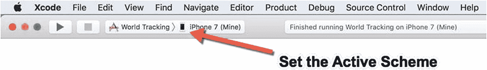
    **图 3-2** Set the Active Scheme 弹出菜单

4.  通过 USB 数据线将 iOS 设备连接到 Macintosh。

5.  点击 Set the Active Scheme 弹出菜单，选择已连接到 Macintosh 的 iOS 设备，如图 3-2 所示。

ARKit 会在应用运行时，在你 iOS 设备出现的位置显示世界原点坐标系。这就是为什么你可能需要后退，才能在应用启动时看到世界坐标系漂浮在你眼前。

### 重置世界原点

每次运行增强现实应用时，它都会在 iOS 设备的当前位置定义世界坐标。当然，你可能不希望世界坐标系只在应用运行时你手持 iOS 设备的位置出现。这就是为什么 ARKit 为你提供了重置世界坐标系的选项，以便你可以将 iOS 设备移动到新位置，并将世界坐标重置为 iOS 设备的新位置。

要重置世界坐标，我们需要一个供用户点击的 UIButton。然后，我们需要编写一个 IBAction 方法，将世界坐标重置为 iOS 设备的当前位置。要创建 UIButton 并编写用于重置世界跟踪坐标的 IBAction 方法，请按照以下步骤操作：

1.  在 Name 字段中键入`resetButton`并按 Return 键。

2.  点击 Type 弹出菜单并选择 UIButton。

3.  点击 Connect 按钮。Xcode 会显示一个空的 IBAction 方法。

4.  点击 Standard Editor 图标或选择 View ➤ Standard Editor ➤ Show Standard Editor。如果 Xcode 未显示`ViewController.swift`文件，请在 Navigator 窗格中点击`ViewController.swift`文件。

5.  编辑`IBAction resetButton`函数如下：

    ```
    @IBAction func resetButton(_ sender: UIButton) {
        sceneView.session.pause()
        sceneView.session.run(configuration, options: [.resetTracking])
    }
    ```

6.  将`let configuration = ARWorldTrackingConfiguration`行移到`IBOutlet`行的下方，如下所示：

    ```
    @IBOutlet var sceneView: ARSCNView!
    let configuration = ARWorldTrackingConfiguration()
    ```

整个`ViewController.swift`文件应如下所示：

```
import UIKit
import SceneKit
import ARKit
class ViewController: UIViewController, ARSCNViewDelegate {
    @IBOutlet var sceneView: ARSCNView!
    let configuration = ARWorldTrackingConfiguration()
    @IBAction func resetButton(_ sender: UIButton) {
        sceneView.session.pause()
        sceneView.session.run(configuration, options: [.resetTracking])
    }
    override func viewDidLoad() {
        super.viewDidLoad()
        sceneView.delegate = self
        sceneView.showsStatistics = true
        sceneView.debugOptions = [ARSCNDebugOptions.showWorldOrigin]
    }
    override func viewWillAppear(_ animated: Bool) {
        super.viewWillAppear(animated)
        sceneView.session.run(configuration)
    }
}
```

7.  使用 USB 数据线将 iOS 设备连接到 Macintosh。

8.  点击 Run 按钮或选择 Product ➤ Run。当应用运行时，后退以查看浮在空中的 x 轴、y 轴和 z 轴世界坐标。

9.  移动到新位置，然后点击 iOS 屏幕上的 Reset 按钮。

10. 后退，你会看到当你点击 Reset 按钮时，iOS 设备所在位置处的 x 轴、y 轴和 z 轴世界坐标。

11. 点击 Stop 按钮或选择 Product ➤ Stop。
    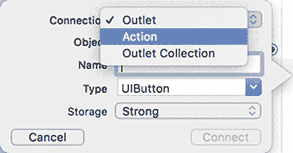
    **图 3-7** 创建 IBAction 方法

12. 松开 Control 键和鼠标。Xcode 会显示一个弹出菜单。

13. 点击 Connection 弹出菜单并选择 Action，如图 3-7 所示。
    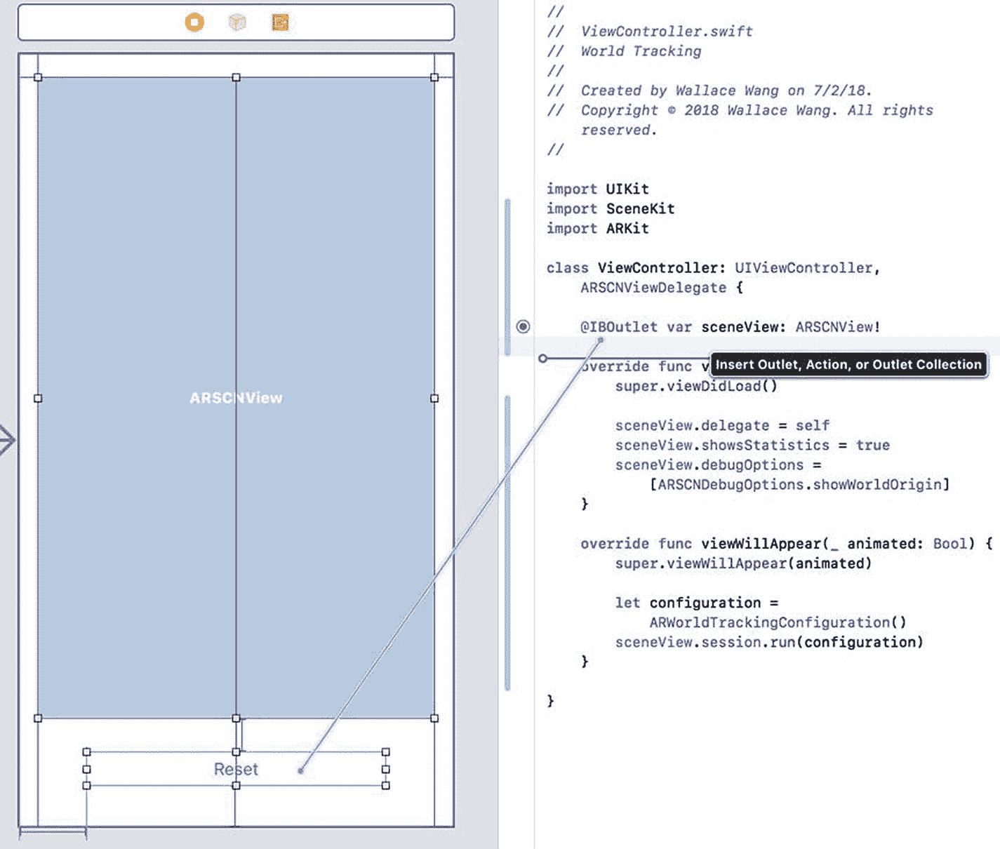
    **图 3-6** 从 UIButton 控件拖拽到 ViewController.swift 文件

14. 按住 Shift 键并点击 ARSCNView 对象。现在，ARSCNView 和 UIButton 周围应出现手柄。

15. 在 All Views in View Controller 类别下，选择 Editor ➤ Resolve AutoLayout Issues ➤ Reset to Suggested Constraints。Xcode 会为 ARSCNView 和 UIButton 添加约束。

16. 点击 Assistant Editor 图标或选择 View ➤ Assistant Editor ➤ Show Assistant Editor。Xcode 会并排显示`ViewController.swift`文件和故事板。


