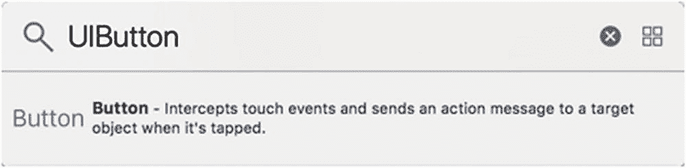
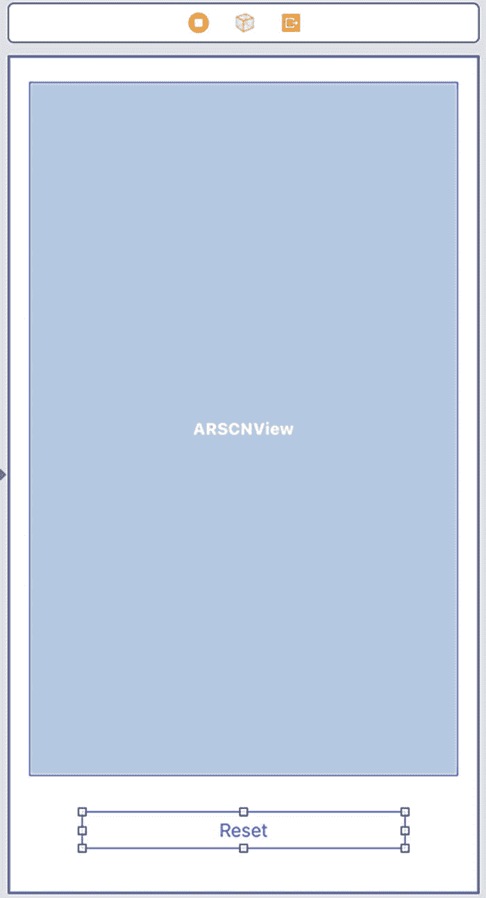
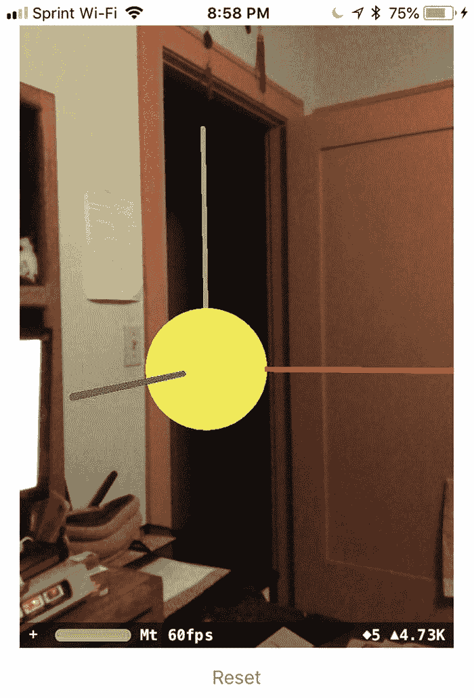
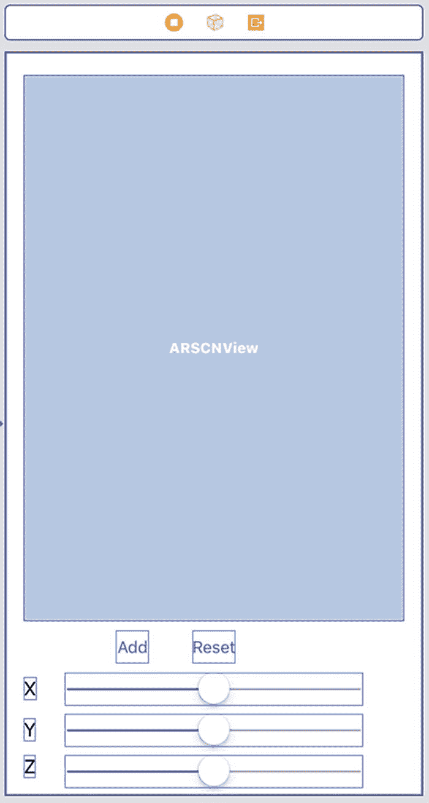
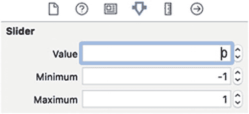
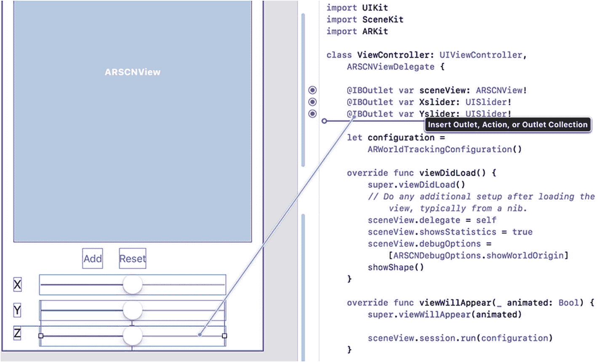
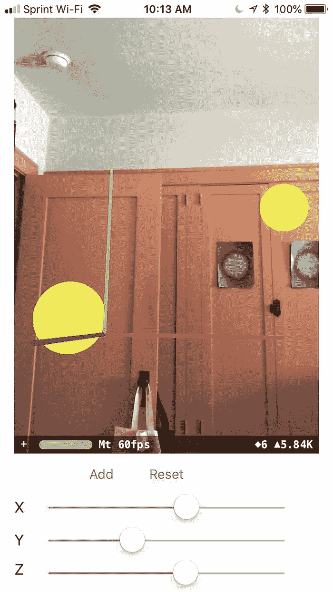

# 在坐标处显示形状

显示世界原点可以让你知道能在增强现实视图的哪些位置定义虚拟对象的出现。通过指定 x、y 和 z 坐标，你可以使虚拟对象相对于用户 iOS 设备的当前位置显示出来。除了显示像宇宙飞船或恐龙这样的虚拟对象，ARKit 能在特定坐标显示的最简单的虚拟对象就是球体、立方体和平面这类形状。

要创建一个形状，你首先必须基于 `SCNNode` 类创建一个节点，如下所示：

```
let node = SCNNode()
```

此时，你需要为节点定义一个形状。SceneKit 提供了立方体、平面、球体、圆环体和其他形状，所以让我们选择一个球体，并将其半径定义为 0.05 米，如下所示：

```
node.geometry = SCNSphere(radius: 0.05)
```

为了让球体可见，让我们给它一个颜色。为此，我们需要定义节点的材质，该材质定义了其外表面，例如：

```
node.geometry?.firstMaterial?.diffuse.contents = UIColor.yellow
```

这三行 Swift 代码创建了一个节点，将该节点的几何形状定义为球体，然后用黄色为该球体的外表面上色。现在剩下的唯一任务就是根据世界原点将该节点放置到特定位置。为此，我们需要定义节点的位置，如下所示：

```
node.position = SCNVector3(0,0,0)
```

由于节点需要 x、y 和 z 坐标，因此节点的位置也必须由三个特定值定义。将 x、y 和 z 位置定义为 0 意味着该节点将出现在 x、y 和 z 轴相交的世界原点。

在定义了几何形状、其尺寸、颜色和位置之后，最后一步是将该节点添加到现有场景中，使其实际出现在增强现实视图中。为此，你只需要最后一行代码，如下所示：

```
sceneView.scene.rootNode.addChildNode(node)
```

这行代码将节点（球体）添加到增强现实场景的根节点。根节点定义了增强现实视图中显示项目的层级结构。要了解此代码如何在世界原点显示一个黄色球体，请按照以下步骤操作：

## 准备项目

1.  在导航器窗格中点击 `Main.storyboard` 文件。
2.  调整 `ARSCNView` 的大小，使得在 `ARSCNView` 底部和 iOS 设备屏幕底部之间留出空白区域。
3.  点击对象库图标以打开对象库窗口。
4.  输入 `UIButton`。对象库窗口将显示 `UIButton`，如图 3-4 所示。


图 3-4 在对象库中找到 `UIButton`

5.  将 `UIButton` 拖到 `ARSCNView` 下方。
6.  调整 `UIButton` 的宽度。
7.  双击 `UIButton` 以高亮其标题，并输入新标题，例如 `Reset`。你的用户界面应类似于图 3-5。


图 3-5 向用户界面添加 `UIButton`

8.  将鼠标悬停在故事板上的 `UIButton` 上，按住 Control 键，然后将鼠标拖动到 `ViewController.swift` 文件中 IBOutlet 的下方，如图 3-6 所示。
9.  修改世界跟踪项目，或者创建一个与“世界跟踪”项目相同的新项目，只是将其命名为 `Node Placement`。
10. 修改 `ViewController.swift` 文件，使代码看起来像这样：

    ```
    import UIKit
    import SceneKit
    import ARKit
    class ViewController: UIViewController, ARSCNViewDelegate {
    @IBOutlet var sceneView: ARSCNView!
    let configuration = ARWorldTrackingConfiguration()
    override func viewDidLoad() {
    super.viewDidLoad()
    // Do any additional setup after loading the view, typically from a nib.
    sceneView.delegate = self
    sceneView.showsStatistics = true
    sceneView.debugOptions = [ARSCNDebugOptions.showWorldOrigin]
    showShape()
    }
    override func viewWillAppear(_ animated: Bool) {
    super.viewWillAppear(animated)
    sceneView.session.run(configuration)
    }
    @IBAction func resetButton(_ sender: UIButton) {
    sceneView.session.pause()
    sceneView.session.run(configuration, options: [.resetTracking])
    showShape()
    }
    func showShape() {
    let node = SCNNode()
    node.geometry = SCNSphere(radius: 0.05)
    node.geometry?.firstMaterial?.diffuse.contents = UIColor.yellow
    node.position = SCNVector3(0,0,0)
    sceneView.scene.rootNode.addChildNode(node)
    }
    }
    ```

11. 通过 USB 数据线将 iOS 设备连接到你的 Macintosh。
12. 点击运行按钮或选择 Product ➤ Run。一个黄色球体将出现在世界原点，如图 3-8 所示。


图 3-8 在世界原点显示一个黄色球体

## 测试应用程序

1.  将你的 iOS 设备移动到一个新位置，然后点击重置按钮。注意，世界坐标现在出现在不同的位置，并且原点处有一个黄色球体。
2.  点击停止按钮或选择 Product ➤ Stop。

## 试验坐标

让黄色球体出现在原点固然不错，但除了 `0,0,0` 之外，你还可以尝试为球体的 x、y 和 z 坐标设置不同的值。尝试用节点位置的不同值修改以下这行代码，例如：

```
node.position = SCNVector3(0.2, -0.4, 0.1)
```

请记住，这些值定义的是米，所以如果你选择的值太大，例如 10 米，黄色球体将因距离太远而无法在增强现实视图中看到，因此请尝试使用较低的值，如 `-0.4` 或 `0.2`。


## 添加与移除多个物体

在前一个应用示例中，我们显示了世界原点，它出现在当前 iOS 设备的位置。然后，我们在一个特定位置显示了一个黄色球体。遗憾的是，定义黄色球体 x、y、z 坐标的代码是固定不变的。如果我们希望黄色球体出现在另一个位置，或者想要显示更多的黄色球体，目前还无法实现。

为了获得更高的灵活性，我们在用户界面上添加一个`添加`按钮。每次用户点击`添加`按钮时，都会新增一个黄色球体。当然，如果所有球体都使用相同的 x、y、z 坐标，那么添加多个黄色球体看起来不会有任何区别，因此我们还需要添加三个滑块，以便在将球体添加到增强现实视图之前，为球体定义新的 x、y、z 坐标。

为此，我们需要调整`ARKit SceneKit 视图`的高度，并在底部添加三个`UISlider`控件以及三个标签，用以标识每个滑块定义的轴。请按以下步骤操作：



**图 3-9** 使用三个滑块重新设计的用户界面

1.  在导航器面板中点击`Main.storyboard`文件。
2.  调整`ARKit SceneKit 视图`的高度，为底部留出更多空间。
3.  在现有`重置`按钮旁边添加一个新的`UIButton`，并为这个新的`UIButton`设置标题名称为`添加`。
4.  添加三个`UISlider`控件。
5.  添加三个标签，并修改其标题以显示 X、Y 和 Z。您的用户界面应类似于**图 3-9**。

至此，用户界面的更改已完成。接下来，通过选择`编辑 ➤ 全选`（或按`Command+A`键）来添加约束。然后选择`编辑器 ➤ 解决自动布局问题 ➤ 重置为建议的约束`。Xcode 会为您的标签、按钮和滑块添加约束。

现在我们需要从两个方面修改这个用户界面。首先，我们需要为滑块定义最小值和最大值以及默认值。其次，我们需要将三个滑块作为`IBOutlet`连接到我们的`ViewController.swift`文件。此外，我们还需要将`添加`按钮连接为`IBAction`方法。

要为每个滑块定义最小值和最大值，请按以下步骤操作：

1.  确保对所有三个滑块以相同的方式更改`当前值`、`最小值`和`最大值`属性。



**图 3-10** 修改滑块的属性

1.  点击每个滑块。
2.  点击`显示属性检查器`图标，或选择`显示 ➤ 检查器 ➤ 显示属性检查器`。Xcode 将显示`属性检查器`面板。
3.  将`当前值`属性更改为`0`。
4.  将`最小值`属性更改为`-1`。
5.  将`最大值`属性更改为`1`，如**图 3-10**所示。这允许您选择-1 米到 1 米之间的值，用于定义在增强现实视图中放置球体的坐标。

现在我们已经定义了滑块的值，接下来需要将三个滑块和`添加`按钮连接到`ViewController.swift`文件。请按以下步骤操作：

1.  松开`Control`键和鼠标。会出现一个弹出菜单。
2.  点击`名称`文本字段，并输入描述性名称，例如`Xslider`、`Yslider`或`Zslider`。您应创建三个`IBOutlet`，分别代表 x、y、z 坐标，如下所示：

```
@IBOutlet var Xslider: UISlider!
@IBOutlet var Yslider: UISlider!
@IBOutlet var Zslider: UISlider!
```

3.  点击`添加`按钮，按住`Control`键，并将鼠标拖动到`ViewController.swift`文件底部附近，以创建一个`IBAction`方法。
4.  松开`Control`键和鼠标。会出现一个弹出菜单。
5.  点击`连接`弹出菜单，选择`动作`。
6.  点击`名称`文本字段，输入`addButton`。
7.  点击`类型`弹出菜单，选择`UIButton`。


8.  点击“连接”按钮。Xcode 会创建一个 `IBAction` 方法。
9.  像这样编辑这个 `addButton IBAction` 方法：
```
    @IBAction func addButton(_ sender: UIButton) {
    showShape()
    }
```
10. 像这样修改 `showShape()` 函数：
```
    func showShape() {
    let node = SCNNode()
    node.geometry = SCNSphere(radius: 0.05)
    node.geometry?.firstMaterial?.diffuse.contents = UIColor.yellow
    node.position = SCNVector3(Xslider.value,Yslider.value,Zslider.value)
    node.name = "sphere"
    sceneView.scene.rootNode.addChildNode(node)
    }
```
`showShape()` 函数会创建黄色的球体，这些球体基于用户界面上的三个滑块（`Xslider`、`Yslider` 和 `Zslider`）定义的 x、y 和 z 坐标放置在增强现实视图中。创建虚拟对象的第一步是定义一个节点：
```
    let node = SCNNode()
```
`SCNNode` 定义了一个 SceneKit 节点，节点简单来说就代表一个虚拟对象。定义好节点后，我们需要定义要显示的实际对象。SceneKit 提供了几种不同的几何形状可供选择，但在本例中，我们将使用球体并将其半径定义为 0.05 米：
```
    node.geometry = SCNSphere(radius: 0.05)
```
`geometry` 属性定义了节点的形状，这里是一个球体。为了让该对象可见，我们需要定义其材质。在本例中，我们选择黄色并将其漫反射到球体的整个表面：
```
    node.geometry?.firstMaterial?.diffuse.contents = UIColor.yellow
```
接下来，我们需要定义节点的位置，这需要 x、y 和 z 浮点数值。我们不定义固定值，而是从用户界面上的三个滑块中获取值：
```
    node.position = SCNVector3(Xslider.value,Yslider.value,Zslider.value)
```
每次我们添加一个新节点（球体）时，给它起个名字。这个名字在后面我们需要从增强现实视图中移除所有球体时将非常重要。名字可以是任何内容，这里就叫它 `sphere`：
```
    node.name = "sphere"
```
最后，我们需要将这个节点添加到根节点。ARKit 将所有显示内容组织成层级结构，每个增强现实视图都带有一个根节点。每次你在增强现实视图中创建一个要显示的新对象时，该新对象就是一个节点，它会成为根节点的子节点。每个增强现实视图包含一个根节点和零个或多个子节点：
```
    sceneView.scene.rootNode.addChildNode(node)
```
11. 像这样修改 `resetButton` 函数：
```
    @IBAction func resetButton(_ sender: UIButton) {
    sceneView.session.pause()
    sceneView.scene.rootNode.enumerateChildNodes { (node, _) in
    if node.name == "sphere" {
    node.removeFromParentNode()
    }
    }
    sceneView.session.run(configuration, options: [.resetTracking])
    }
```


### 为滑块创建 IBOutlet
1.  点击“助理编辑器”图标或选择 **视图** ➤ **助理编辑器** ➤ **显示助理编辑器**。Xcode 会并排显示 `ViewController.swift` 文件和 `Main.storyboard` 文件。
2.  点击每个滑块，按住 **Control** 键，并将鼠标拖到现有 `IBOutlet` 下方的 `ViewController.swift` 文件中，如图 3-11 所示。

这个 `resetButton` 函数首先暂停当前的增强现实会话，然后检查每个子节点。如果该子节点的名字恰好是 `sphere`，则将其从根节点中移除。

这个检查节点名称是否为 `sphere` 的 `if` 语句很重要，因为当应用程序显示世界原点时，那也是一个连接到根节点的子节点。假设你只有以下代码：
```
sceneView.scene.rootNode.enumerateChildNodes { (node, _) in
node.removeFromParentNode()
}
```
这段代码会从根节点移除所有节点，包括世界原点。通过仅移除名为 `sphere` 的节点，我们可以在移除增强现实视图中显示的所有黄色球体的同时，保持世界原点的显示。

完整的 `ViewController.swift` 文件应如下所示：
```
import UIKit
import SceneKit
import ARKit
class ViewController: UIViewController, ARSCNViewDelegate {
@IBOutlet var sceneView: ARSCNView!
@IBOutlet var Xslider: UISlider!
@IBOutlet var Yslider: UISlider!
@IBOutlet var Zslider: UISlider!
let configuration = ARWorldTrackingConfiguration()
override func viewDidLoad() {
super.viewDidLoad()
// Do any additional setup after loading the view, typically from a nib.
sceneView.delegate = self
sceneView.showsStatistics = true
sceneView.debugOptions = [ARSCNDebugOptions.showWorldOrigin]
}
override func viewWillAppear(_ animated: Bool) {
super.viewWillAppear(animated)
sceneView.session.run(configuration)
}
@IBAction func addButton(_ sender: UIButton) {
showShape()
}
@IBAction func resetButton(_ sender: UIButton) {
sceneView.session.pause()
sceneView.scene.rootNode.enumerateChildNodes { (node, _) in
if node.name == "sphere" {
node.removeFromParentNode()
}
}
sceneView.session.run(configuration, options: [.resetTracking])
}
func showShape() {
let node = SCNNode()
node.geometry = SCNSphere(radius: 0.05)
node.geometry?.firstMaterial?.diffuse.contents = UIColor.yellow
node.position = SCNVector3(Xslider.value,Yslider.value,Zslider.value)
node.name = "sphere"
sceneView.scene.rootNode.addChildNode(node)
}
}
```
通过 USB 数据线将 iOS 设备连接到 Macintosh，然后点击“运行”按钮或选择 **产品** ➤ **运行**。片刻之后，后退一步，你应该能看到世界原点出现。向左或向右移动滑块，然后点击 **添加** 按钮。你的应用程序应该在三个滑块定义的 x、y 和 z 坐标处显示一个黄色球体，如图 3-12 所示。

你可以重复更改滑块值并点击 **添加** 按钮的过程，以不断添加更多黄色球体。将你的 iOS 设备移动到一个新位置，然后点击 **重置** 按钮。你的应用程序将移除所有黄色球体，并在 iOS 设备的当前位置显示世界原点。

## 总结
在本章中，你学习了如何为了调试目的显示世界原点，以帮助你验证应用程序是否正确地将对象放置在增强现实视图中。一旦你的应用程序完成，你需要移除那些导致每次显示增强现实视图时世界原点出现的代码。

世界原点通过定义 x、y 和 z 坐标来帮助你定位对象。要在增强现实视图中显示项目，你需要创建一个节点并为该节点定义一个形状，例如球体、盒子或环面。接下来，你需要定义对象的外观，例如黄色或红色，以及其大小。

为了让增强现实更加灵活，你可以基于用户持有 iOS 设备的新位置来重置世界原点。这种重置世界原点的能力使你的应用程序可以在用户决定移动并指向 iOS 设备的任何位置显示虚拟对象。

在下一章中，我们将更详细地讨论创建几何形状以及为形状应用除纯色之外的不同纹理。


