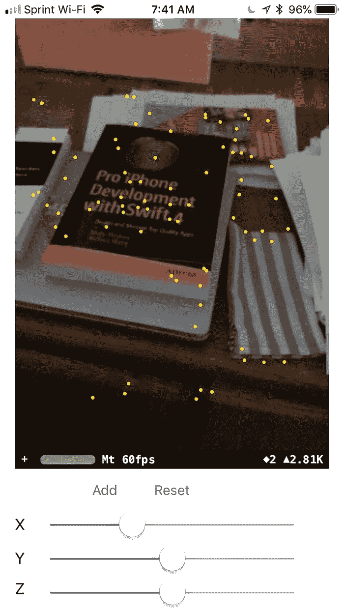
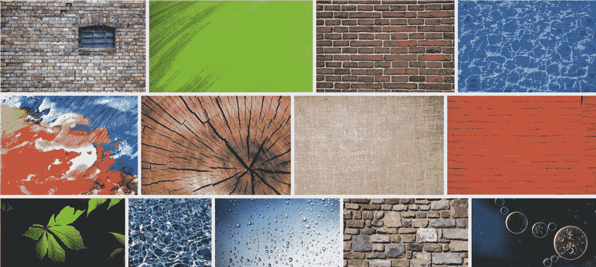
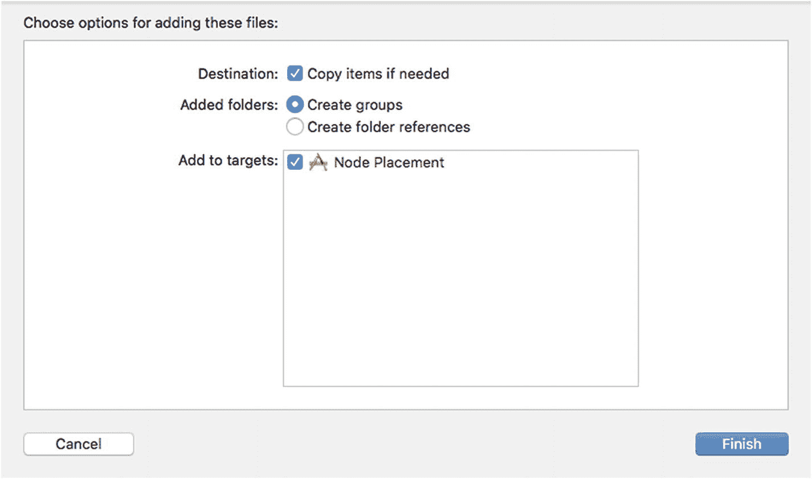
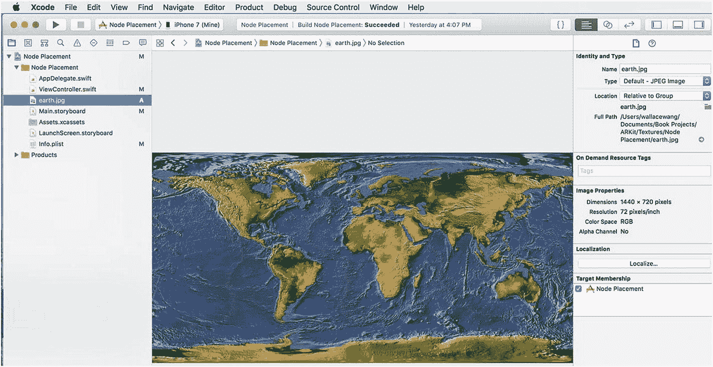
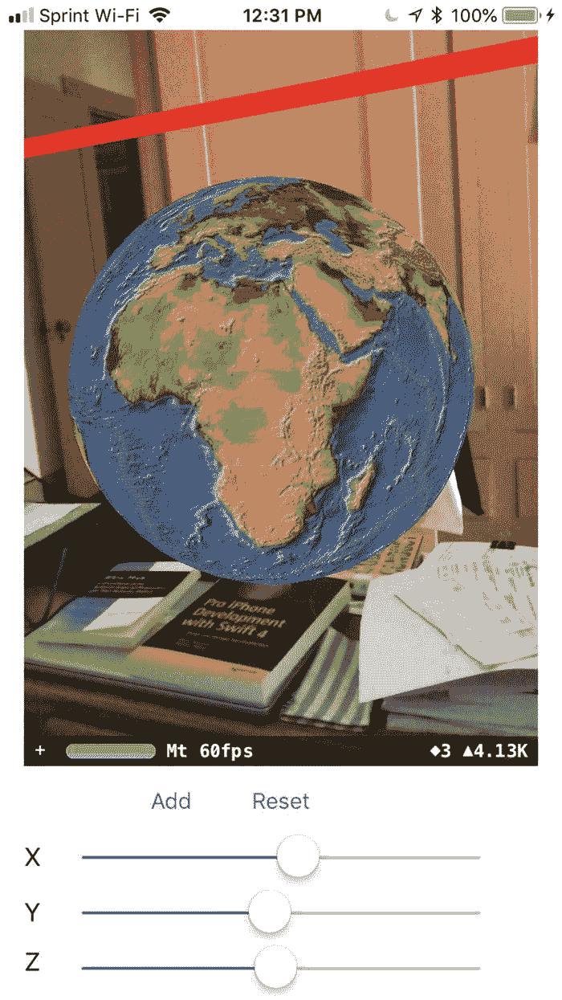
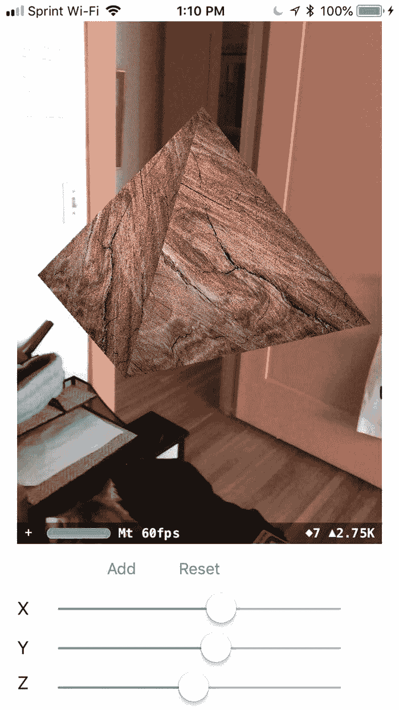
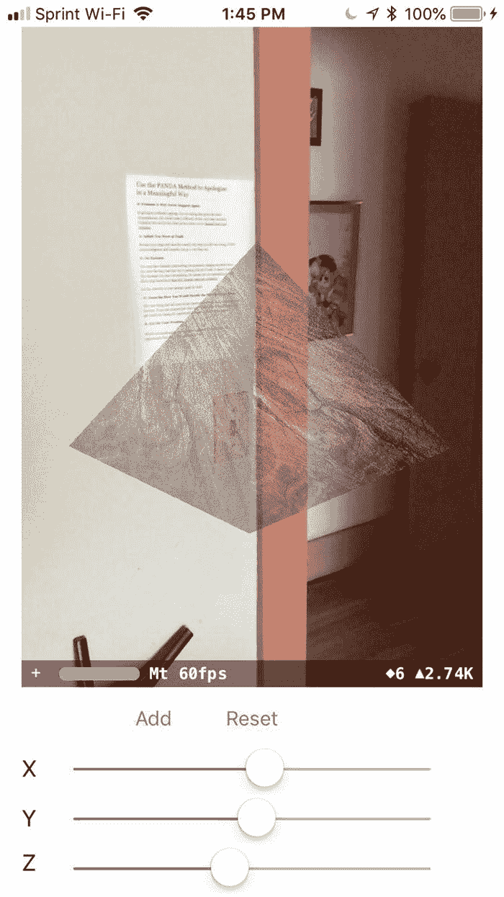
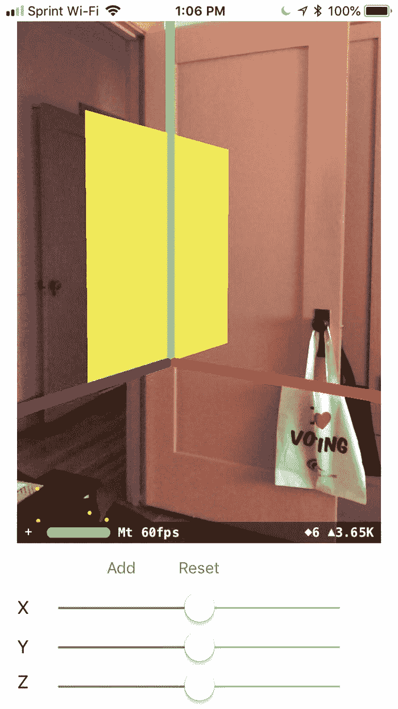
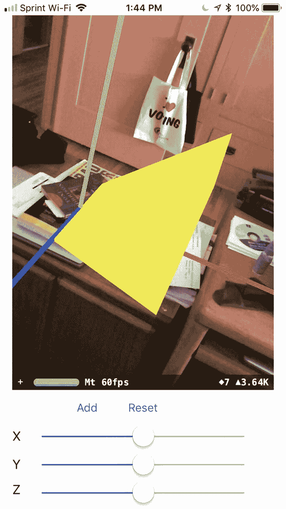

# 4. 使用形状

在上一章中，我们使用了一个调试选项，让我们的增强现实应用能够显示世界原点，该原点基于 iOS 设备的当前位置展示 x、y 和 z 轴。基于这个世界原点，我们可以通过定义其 x、y 和 z 坐标，将虚拟物体放置在增强现实视图中。

ARKit 提供了另一个调试选项，称为特征点。与世界原点类似，你只会使用特征点来调试你的应用。当需要发布应用时，你将移除世界原点和特征点的显示。

要让特征点出现，请如下修改 `debugOptions` 行：

```
sceneView.debugOptions = [ARSCNDebugOptions.showWorldOrigin, ARSCNDebugOptions.showFeaturePoints]
```

这行代码告诉 Xcode 同时显示世界原点（`.showWorldOrigin`）和特征点（`.showFeaturePoints`）。

在我们之前的应用中，我们可以与世界原点一起创建黄色球体，然后重置跟踪，让世界原点出现在 iOS 设备的新当前位置。通常，当你重置跟踪并删除任何现有的虚拟对象（比如我们的黄色球体）时，你也希望移除锚点。

锚点定义了虚拟对象在增强现实视图中的位置。我们之前的应用只是从视图中移除了虚拟对象，但是一旦我们删除了黄色球体，我们也不再需要知道球体之前的位置或锚点，所以我们也应该删除它。

为了让虚拟对象的锚点消失，我们只需要在重置世界跟踪时修改 `session.run` 行，如下所示：

```
sceneView.session.run(configuration, options: [.resetTracking, .removeExistingAnchors])
```

这段代码重置了世界原点（`.resetTracking`）并移除了定义虚拟对象位置的任何不可见锚点（`.removeExistingAnchors`）。

要了解如何显示特征点（以及删除黄色球体的不可见锚点），请修改之前应用的代码，使整个 `ViewController.swift` 文件看起来像这样：

```
import UIKit
import SceneKit
import ARKit
class ViewController: UIViewController, ARSCNViewDelegate {
@IBOutlet var sceneView: ARSCNView!
@IBOutlet var Xslider: UISlider!
@IBOutlet var Yslider: UISlider!
@IBOutlet var Zslider: UISlider!
let configuration = ARWorldTrackingConfiguration()
override func viewDidLoad() {
super.viewDidLoad()
// Do any additional setup after loading the view, typically from a nib.
sceneView.delegate = self
sceneView.showsStatistics = true
sceneView.debugOptions = [ARSCNDebugOptions.showWorldOrigin, ARSCNDebugOptions.showFeaturePoints]
}
override func viewWillAppear(_ animated: Bool) {
super.viewWillAppear(animated)
sceneView.session.run(configuration)
}
@IBAction func addButton(_ sender: UIButton) {
showShape()
}
@IBAction func resetButton(_ sender: UIButton) {
sceneView.session.pause()
sceneView.scene.rootNode.enumerateChildNodes { (node, _) in
if node.name == "sphere" {
node.removeFromParentNode()
}
}
sceneView.session.run(configuration, options: [.resetTracking, .removeExistingAnchors])
}
func showShape() {
let node = SCNNode()
node.geometry = SCNSphere(radius: 0.05)
node.geometry?.firstMaterial?.diffuse.contents = UIColor.yellow
node.position = SCNVector3(Xslider.value,Yslider.value,Zslider.value)
node.name = "sphere"
sceneView.scene.rootNode.addChildNode(node)
}
}
```

点击运行按钮或选择 产品 ➤ 运行，同时通过 USB 线将 iOS 设备连接到你的 Macintosh。当应用运行时，你将看到特征点显示为黄色圆点，这表明 ARKit 何时检测到现实世界中物体的表面。出现的点越多，ARKit 对该表面的检测就越好。

如果你将增强现实应用的摄像头对准一个清晰可见的表面，比如桌面，以及对比鲜明的邻近物体，比如垂直的墙壁和水平的地板，你会看到更多的特征点出现，如图 4-1 所示。如果你从不同角度将摄像头对准同一区域，你可以看到 ARKit 显示的特征点较少，这意味着它对附近区域的识别效果较差。



图 4-1 特征点显示了 ARKit 如何识别现实世界中的表面

点击停止按钮或选择 产品 ➤ 停止 以停止应用运行。


## 显示不同的几何形状

几何形状是你在增强现实视图中可以显示的最简单的虚拟对象类型。在上一章中，我们创建了一个球体，但实际上 SceneKit 提供了几种不同类型的几何形状可供使用。每种几何形状可能需要你指定不同的尺寸。

例如，你可以通过定义半径来创建一个球体，但要创建一个盒子，你需要定义其宽度、高度和深度。可用的不同几何形状有：

* `SCNFloor`
* `SCNBox`
* `SCNCapsule`
* `SCNCone`
* `SCNCylinder`
* `SCNPlane`
* `SCNPyramid`
* `SCNTorus`
* `SCNTube`

所有这些几何形状的工作方式类似，你都可以为其表面定义颜色，例如 `UIColor.blue` 或 `UIColor.red`。通过组合多个几何形状，你可以创建出现在增强现实视图中的简单虚拟对象。

要创建一个球体，我们只需要像这样定义其半径：

```
node.geometry = SCNSphere(radius: 0.05)
```

要创建一个盒子，我们需要定义其高度、宽度和长度。此外，你还可以定义盒子的边缘使其变得锐利或圆润。要修改盒子的角，你需要定义其倒角半径。半径为 0 会创建锐利的边缘，而非零值会创建圆滑的边缘。值越大，边缘越圆滑。

要了解如何显示盒子而不是球体，请按照以下步骤操作：

1.  点击停止按钮或选择 Product ➤ Stop。
2.  点击当前应用程序的 `ViewController.swift` 文件，该文件显示三个滑块，用于定义形状的 x、y 和 z 坐标。
3.  将光标移动到 `node.geometry = SCNSphere(radius: 0.05)` 这一行的前面，输入 `//`，这会将这一行变成注释。一旦你在该行前面输入 `//`，Xcode 就会像这样使代码变暗：

```
// node.geometry = SCNSphere(radius: 0.05)
```

4.  在该行下方输入以下代码：

```
node.geometry = SCNBox(width: 0.1, height: 0.2, length: 0.1, chamferRadius: 0)
```

5.  在两个地方将文本 `"sphere"` 替换为 `"shape"`，如下所示：

```
if node.name == "shape" {
node.removeFromParentNode()
}
```

和

```
node.name = "shape"
```

6.  通过 USB 数据线将 iOS 设备连接到你的 Macintosh。
7.  点击运行按钮或选择 Product ➤ Run。
8.  调整 x、y 和 z 滑块以更改形状的位置。
9.  点击添加按钮，查看增强现实视图中是否出现一个黄色盒子。

请注意，`chamferRadius` 为零，这创建了锐利的边缘。如果 `chamferRadius` 不为零，这将创建更圆滑的边缘。将此值更改为 0.05 以创建圆滑的边缘。

尝试按照以下方式定义具有不同尺寸的形状：

* `node.geometry = SCNSphere(radius: 0.05)`
* `node.geometry = SCNBox(width: 0.1, height: 0.2, length: 0.1, chamferRadius: 0.05)`
* `node.geometry = SCNTorus(ringRadius: 0.2, pipeRadius: 0.05)`
* `node.geometry = SCNTube(innerRadius: 0.08, outerRadius: 0.1, height: 0.2)`
* `node.geometry = SCNCapsule(capRadius: 0.06, height: 0.4)`
* `node.geometry = SCNCylinder(radius: 0.04, height: 0.3)`
* `node.geometry = SCNCone(topRadius: 0, bottomRadius: 0.05, height: 0.2)`
* `node.geometry = SCNPyramid(width: 0.2, height: 0.4, length: 0.2)`
* `node.geometry = SCNPlane(width: 0.2, height: 0.3)`

请记住，一次在代码中只使用其中一行，而不是全部。通过尝试不同的形状和尺寸，你可以看到如何创建任意大小的几何对象。

除了显示黄色外，还可以尝试其他颜色，如棕色、青色、深灰色、灰色、绿色、浅灰色、洋红色、橙色、紫色、红色或白色，如下所示：

```
node.geometry?.firstMaterial?.diffuse.contents = UIColor.purple
```

## 显示文本

除了在增强现实中显示几何形状外，你还可以显示文本。显示文本时，你可以定义要显示的字符串以及文本的字体、大小和颜色。

创建文本的第一步是定义要显示的字符串及其挤压深度。挤压深度定义了字母的厚度。挤压深度为零会创建平坦的外观，而非零的挤压深度会创建一个厚度，使得从侧面查看时字母可见。要定义字符串和挤压深度，需要使用如下代码：

```
let text = SCNText(string: "Hello", extrusionDepth: 1)
```

至此，我们已经创建了文本，但我们看不到它。就像我们为几何形状应用颜色一样，我们也需要为文本选择一种颜色。为此，我们需要定义一个材质类，如下所示：

```
let material = SCNMaterial()
```

接下来，我们需要为材质选择一种颜色，并将其漫射到整个表面，如下所示：

```
material.diffuse.contents = UIColor.orange
```

最后，我们需要将这个材质颜色应用到文本本身。实际上，我们可以为文本应用多种材质，每种材质都出现在一个数组中。由于我们只定义了一种颜色，所以数组中只包含材质颜色：

```
text.materials = [material]
```

现在我们已经定义了文本及其外观，下一步是将该文本作为节点放置在增强现实视图中。这涉及到定义一个节点、节点的 x、y 和 z 坐标，以及定义节点宽度、高度和深度的缩放比例：

```
let node = SCNNode()
node.position = SCNVector3(Xslider.value, Yslider.value, Zslider.value)
node.scale = SCNVector3(0.01, 0.01, 0.01)
```

最后，我们需要将节点的几何形状定义为使用 `SCNText` 定义的文本，如下所示：

```
node.geometry = text
```

最后，我们需要将此节点添加到增强现实场景的根节点：

```
sceneView.scene.rootNode.addChildNode(node)
```

要查看此代码如何在指定的 x、y 和 z 坐标处显示橙色文本，请按照以下步骤操作：

1.  点击停止按钮或选择 Product ➤ Stop。
2.  修改世界跟踪项目，或者创建一个与该项目相同但名称不同的新项目，例如命名为 Node Placement Text。
3.  修改 `ViewController.swift` 文件，使代码看起来像这样：


```swift
import UIKit
import SceneKit
import ARKit

class ViewController: UIViewController, ARSCNViewDelegate {
    @IBOutlet var sceneView: ARSCNView!
    @IBOutlet var Xslider: UISlider!
    @IBOutlet var Yslider: UISlider!
    @IBOutlet var Zslider: UISlider!
    let configuration = ARWorldTrackingConfiguration()

    override func viewDidLoad() {
        super.viewDidLoad()
        sceneView.delegate = self
        sceneView.showsStatistics = true
        sceneView.debugOptions = [ARSCNDebugOptions.showWorldOrigin, ARSCNDebugOptions.showFeaturePoints]
    }

    override func viewWillAppear(_ animated: Bool) {
        super.viewWillAppear(animated)
        sceneView.session.run(configuration)
    }

    @IBAction func addButton(_ sender: UIButton) {
        showShape()
    }

    @IBAction func resetButton(_ sender: UIButton) {
        sceneView.session.pause()
        sceneView.scene.rootNode.enumerateChildNodes { (node, _) in
            if node.name == "shape" {
                node.removeFromParentNode()
            }
        }
        sceneView.session.run(configuration, options: [.resetTracking, .removeExistingAnchors])
    }

    func showShape() {
        let text = SCNText(string: "Hello", extrusionDepth: 1)
        let material = SCNMaterial()
        material.diffuse.contents = UIColor.orange
        text.materials = [material]

        let node = SCNNode()
        node.position = SCNVector3(Xslider.value, Yslider.value, Zslider.value)
        node.scale = SCNVector3(0.01, 0.01, 0.01)
        node.geometry = text
        node.name = "shape"
        sceneView.scene.rootNode.addChildNode(node)
    }
}
```

使用 USB 数据线将一台 iOS 设备连接到您的 Mac 电脑。

点击运行按钮或选择 **Product** ➤ **Run**。

点击 `Add` 按钮。橙色文本将出现在您定义的 `x`、`y` 和 `z` 坐标处，如图 4-5 所示。

尝试使用不同的文本、挤出深度和颜色进行实验。

## 为形状添加纹理

在我们目前创建的示例中，我们只使用了纯色来为增强现实视图中添加的几何形状着色。然而，您可以将图形图像应用于几何形状的表面。这可以创造出有趣的效果，例如将形状显示为行星或看起来像由砖块制成的盒子。

您可以通过在您常用的搜索引擎中搜索“纹理图像”，从互联网上的各种网站找到公共领域的纹理图像。这样的搜索将帮助您找到各种类型的纹理图像，如图 4-6 所示。



图 4-6

在互联网上查找纹理图像

下载一个或多个纹理图像后，您需要按照以下步骤将纹理图像添加到您的 Xcode 项目中：



图 4-7

向 Xcode 项目中添加文件

1.  修改当前用于显示文本的 Xcode 项目，或者创建一个新项目，该项目允许使用摄像头显示增强现实视图。（这应该是您在本章早些时候创建的 Xcode 项目。）
2.  将纹理图像拖动到 Xcode 项目的导航器面板。将出现一个窗口，显示添加文件的不同选项，如图 4-7 所示。

确保选中 **Copy items if needed** 复选框，然后单击 **Finish** 按钮。

在导航器面板中单击刚刚添加的纹理文件。Xcode 将显示该纹理图像的内容，如图 4-8 所示。



图 4-8

在 Xcode 中选择纹理文件会显示其内容

将纹理图像添加到 Xcode 项目后，最后一步是定义该纹理图像，使其显示在球体、盒子或金字塔等几何形状的表面上。首先，像这样单独定义几何形状：

```swift
let sphere = SCNSphere(radius: 0.05)
```

接下来，为球体定义一种材质。我们需要先创建一种材质，然后将纹理图像分配给该材质的 `contents` 属性。最后，我们需要像这样将材质应用于球体：

```swift
let material = SCNMaterial()
material.diffuse.contents = UIImage(named: "earth.jpg")
sphere.materials = [material]
```

在这个例子中，纹理图像名为 `earth.jpg`，但您需要将其更改为您特定图像文件的名称，包括文件扩展名，例如 `.jpg`。

定义球体及其材质（纹理图像）后，最后一步是创建一个节点，将该节点的 `geometry` 属性分配给球体，并将该节点放置在增强现实视图中，如下所示：

```swift
let node = SCNNode()
node.geometry = sphere
node.position = SCNVector3(Xslider.value,Yslider.value,Zslider.value)
```

要编辑 `ViewController.swift` 文件，请按照以下步骤操作：

1.  在 Xcode 中点击停止按钮或选择 **Product** ➤ **Stop**。
2.  在导航器面板中点击 `ViewController.swift` 文件。
3.  编辑 `ViewController.swift` 文件的内容，使其如下所示：



图 4-9

在几何形状上显示纹理文件


```swift
import UIKit
import SceneKit
import ARKit
class ViewController: UIViewController, ARSCNViewDelegate {
@IBOutlet var sceneView: ARSCNView!
@IBOutlet var Xslider: UISlider!
@IBOutlet var Yslider: UISlider!
@IBOutlet var Zslider: UISlider!
let configuration = ARWorldTrackingConfiguration()
override func viewDidLoad() {
super.viewDidLoad()
// Do any additional setup after loading the view, typically from a nib.
sceneView.delegate = self
sceneView.showsStatistics = true
sceneView.debugOptions = [ARSCNDebugOptions.showWorldOrigin, ARSCNDebugOptions.showFeaturePoints]
}
override func viewWillAppear(_ animated: Bool) {
super.viewWillAppear(animated)
sceneView.session.run(configuration)
}
@IBAction func addButton(_ sender: UIButton) {
showShape()
}
@IBAction func resetButton(_ sender: UIButton) {
sceneView.session.pause()
sceneView.scene.rootNode.enumerateChildNodes { (node, _) in
if node.name == "shape" {
node.removeFromParentNode()
}
}
sceneView.session.run(configuration, options: [.resetTracking, .removeExistingAnchors])
}
func showShape() {
let sphere = SCNSphere(radius: 0.05)
let material = SCNMaterial()
material.diffuse.contents = UIImage(named: "earth.jpg")
sphere.materials = [material]
let node = SCNNode()
node.geometry = sphere
node.position = SCNVector3(Xslider.value,Yslider.value,Zslider.value)
node.name = "shape"
sceneView.scene.rootNode.addChildNode(node)
}
}
```

3.  使用 USB 数据线将 iOS 设备连接到您的 Macintosh。
4.  点击运行按钮或选择 Product ➤ Run。
5.  使用滑块为球体定义 `x`、`y` 和 `z` 坐标，然后点击 `Add` 按钮。球体会出现并覆盖上您指定的纹理文件，如图 4-9 所示。

尝试使用不同的几何形状和纹理图像，例如一个金字塔和一个木质纹理，如图 4-10 所示。


图 4-10
您可以显示不同的几何形状和纹理

```swift
let pyramid = SCNPyramid(width: 0.04, height: 0.03, length: 0.04)
let material = SCNMaterial()
material.diffuse.contents = UIImage(named: "wood.jpg")
pyramid.materials = [material]
```

## 更改形状的透明度

通常，当您为几何形状添加纹理或颜色时，该纹理或颜色看起来是实心的。但您可以定义介于 `0` 和 `1` 之间的透明度值，其中 `1` 创建实心外观，而 `0` 实际上会使纹理或颜色完全不可见，例如：

```swift
material.transparency = 0.6
```

要查看如何更改透明度，请按照以下步骤操作：

1.  单击停止按钮或选择 Product ➤ Stop。


图 4-11
将几何形状和纹理显示为透明

1.  使用之前在几何形状上显示纹理的 Xcode 项目。
2.  在导航器窗格中单击 `ViewController.swift` 文件。
3.  在定义几何形状纹理的那一行下方添加以下行，例如：
    ```swift
    material.diffuse.contents = UIImage(named: "wood.jpg")
    material.transparency = 0.6
    ```
    请记住将 `"wood.jpg"` 替换为您正在使用的纹理文件的文件名和扩展名。完整的 `ViewController.swift` 文件应如下所示：

    ```swift
    import UIKit
    import SceneKit
    import ARKit
    class ViewController: UIViewController, ARSCNViewDelegate {
    @IBOutlet var sceneView: ARSCNView!
    @IBOutlet var Xslider: UISlider!
    @IBOutlet var Yslider: UISlider!
    @IBOutlet var Zslider: UISlider!
    let configuration = ARWorldTrackingConfiguration()
    override func viewDidLoad() {
    super.viewDidLoad()
    // Do any additional setup after loading the view, typically from a nib.
    sceneView.delegate = self
    sceneView.showsStatistics = true
    sceneView.debugOptions = [ARSCNDebugOptions.showWorldOrigin, ARSCNDebugOptions.showFeaturePoints]
    }
    override func viewWillAppear(_ animated: Bool) {
    super.viewWillAppear(animated)
    sceneView.session.run(configuration)
    }
    @IBAction func addButton(_ sender: UIButton) {
    showShape()
    }
    @IBAction func resetButton(_ sender: UIButton) {
    sceneView.session.pause()
    sceneView.scene.rootNode.enumerateChildNodes { (node, _) in
    if node.name == "shape" {
    node.removeFromParentNode()
    }
    }
    sceneView.session.run(configuration, options: [.resetTracking, .removeExistingAnchors])
    }
    func showShape() {
    //let sphere = SCNSphere(radius: 0.05)
    let pyramid = SCNPyramid(width: 0.04, height: 0.03, length: 0.04)
    let material = SCNMaterial()
    material.diffuse.contents = UIImage(named: "wood.jpg")
    material.transparency = 0.6
    //material.diffuse.contents = UIImage(named: "earth.jpg")
    //sphere.materials = [material]
    pyramid.materials = [material]
    let node = SCNNode()
    node.geometry = pyramid// sphere
    node.position = SCNVector3(Xslider.value,Yslider.value,Zslider.value)
    node.name = "shape"
    sceneView.scene.rootNode.addChildNode(node)
    }
    }
    ```

4.  使用 USB 数据线将 iOS 设备连接到 Macintosh。
5.  单击运行按钮或选择 Product ➤ Run。
6.  调整滑块以定义形状的 `x`、`y` 和 `z` 坐标。
7.  点击 `Add` 按钮。请注意，形状现在显示为透明，如图 4-11 所示。


## 绘制形状

通过提供可自定义的不同几何形状，ARKit 可以轻松地将虚拟对象添加到任何增强现实视图中。然而，如果您想要创建一个不适合常见几何形状（如盒子或球体）范围的自定义形状，该怎么办？最简单的解决方案是绘制您自己的形状。

最简单的形状类型是平面，您可以通过定义两组不同的点来创建。要绘制一个形状，必须定义一个 `BezierPath` 对象，如下所示：

```
let plane = UIBezierPath()
```

创建 `BezierPath` 对象后，下一步是定义一组起始的 x 和 y 坐标，例如 0, 0，如下所示：

```
plane.move(to: CGPoint(x: 0, y: 0))
```

请记住，这些 x 和 y 坐标并不定义形状在增强现实视图中的物理位置。定义了起点之后，您可以定义第二组 x, y 坐标来定义一个平面，如下所示：

```
plane.addLine(to: CGPoint(x: 0, y: 0.1))
```

这条 `plane.addLine` 命令告诉 Xcode 从 `plane.move` 命令定义的起始 x 和 y 坐标开始绘制。然后 `plane.addLine` 命令绘制一条线，该线沿 x 轴延伸 0 个点，沿 y 轴延伸 0.1 个点。

最后，您需要将形状定义为一个 `SCNShape` 对象，该对象还指定了形状沿 z 轴的厚度，称为*挤出深度*。为此，您需要定义形状名称及其挤出深度，如下所示：

```
let customShape = SCNShape(path: plane, extrusionDepth: 0.1)
```

创建自定义形状后，最后一步是将此形状分配给一个节点，并在特定的 x、y 和 z 坐标处显示该节点，如下所示：

```
let node = SCNNode()
node.geometry = customShape
node.geometry?.firstMaterial?.diffuse.contents = UIColor.yellow
node.position = SCNVector3(0,0,0)
sceneView.scene.rootNode.addChildNode(node)
```

此代码创建了一个沿 z 轴延伸 0.1 个点、沿 y 轴向上延伸 0.1 个点且完全不沿 x 轴延伸的黄色平面，如图 4-12 所示。



**图 4-12**  
显示一个由其沿 x、y、z 轴的距离定义的平面

通过添加多个 `addLine` 命令，您可以在自定义形状上定义额外的平面。要了解如何创建楔形形状，请按照以下步骤操作：



**图 4-13**  
两个 `addLine` 命令有助于定义楔形形状

1.  使用在几何形状上显示纹理的 Xcode 项目。
2.  在导航器窗格中单击 `ViewController.swift` 文件。
3.  编辑 `showShape` 函数，使整个 `ViewController.swift` 文件看起来像这样：

```
import UIKit
import SceneKit
import ARKit
class ViewController: UIViewController, ARSCNViewDelegate {
    @IBOutlet var sceneView: ARSCNView!
    @IBOutlet var Xslider: UISlider!
    @IBOutlet var Yslider: UISlider!
    @IBOutlet var Zslider: UISlider!
    let configuration = ARWorldTrackingConfiguration()
    override func viewDidLoad() {
        super.viewDidLoad()
        // Do any additional setup after loading the view, typically from a nib.
        sceneView.delegate = self
        sceneView.showsStatistics = true
        sceneView.debugOptions = [ARSCNDebugOptions.showWorldOrigin, ARSCNDebugOptions.showFeaturePoints]
    }
    override func viewWillAppear(_ animated: Bool) {
        super.viewWillAppear(animated)
        sceneView.session.run(configuration)
    }
    @IBAction func addButton(_ sender: UIButton) {
        showShape()
    }
    @IBAction func resetButton(_ sender: UIButton) {
        sceneView.session.pause()
        sceneView.scene.rootNode.enumerateChildNodes { (node, _) in
            if node.name == "shape" {
                node.removeFromParentNode()
            }
        }
        sceneView.session.run(configuration, options: [.resetTracking, .removeExistingAnchors])
    }
    func showShape() {
        let plane = UIBezierPath()
        plane.move(to: CGPoint(x: 0, y: 0))
        plane.addLine(to: CGPoint(x: 0.1, y: 0.1))
        plane.addLine(to: CGPoint(x: 0.1, y: -0.03))
        let customShape = SCNShape(path: plane, extrusionDepth: 0.1)
        let node = SCNNode()
        node.geometry = customShape
        node.geometry?.firstMaterial?.diffuse.contents = UIColor.yellow
        node.position = SCNVector3(Xslider.value,Yslider.value,Zslider.value)
        node.name = "shape"
        sceneView.scene.rootNode.addChildNode(node)
    }
}
```

4.  通过 USB 线将 iOS 设备连接到您的 Macintosh。
5.  单击 `Run` 按钮或选择 `Product` ➤ `Run`。
6.  当应用程序运行时，点击 `Add` 按钮。将出现一个黄色楔形，如图 4-13 所示。
7.  单击 `Stop` 按钮或选择 `Product` ➤ `Stop`。

第一个 `addLine` 命令定义了楔形的左侧，第二个 `addLine` 命令定义了楔形的右侧：

```
plane.addLine(to: CGPoint(x: 0.1, y: 0.1))
plane.addLine(to: CGPoint(x: 0.1, y: -0.03))
```

通过使用任意数量的 `addLine` 命令，您可以定义自己的自定义三维形状，这些形状无法通过球体、盒子或圆锥体等常见几何形状创建。

## 总结

除了显示 3D 图像，ARKit 还可以在增强现实视图中显示几何形状。一些常见的几何形状包括盒子、球体、平面和圆柱体。通过指定尺寸和位置，您可以让几何形状出现在任何地方。

定义了几何形状的尺寸后，您可以通过为其表面选择不同的颜色来修改其外观。为了获得更多变化，您还可以应用不同的纹理图像来覆盖您创建的任何几何形状的表面。

如果没有几何形状符合您的需求，您可以绘制单独的线条来创建自己的虚拟对象，以显示在增强现实视图中。通过绘制线条并结合多个几何形状，您可以创造出仅受想象力限制的自定义形状。

颜色和纹理可以让您的几何形状具有独特的外观。在下一章中，我们将学习使用不同光源改变虚拟对象外观的其他方法。

