# 5. 处理光照

改变虚拟对象外观的最简单方法是改变其颜色或纹理。然而，改变虚拟对象外观的一个更微妙的方法是改变光源。想象一下一个典型的摄影棚，摄影师可以将一个或多个灯放置在拍摄对象周围的不同位置。这些灯可以明亮或暗淡，并以不同的强度和颜色照射，以不同的方式突出对象。

增强现实也是如此。为了在增强现实视图中突出虚拟对象，您可以在特定的 x、y 和 z 坐标处放置一个或多个光源。此外，您还可以定义不同类型的光源，例如方向光、环境光或聚光灯，以创建独特的视觉效果，如图 5-1 所示。

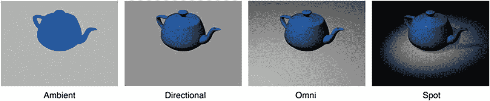

**图 5-1**  
可用的不同光照类型

通过添加光照并通过颜色、强度和色温自定义光照的外观，您可以在增强现实视图中以独特的方式照亮虚拟对象。


## 使用颜色、强度与色温

彩色光能以不同方式照亮虚拟物体，特别是当虚拟物体本身带有颜色时。虽然改变颜色是调整光源最直观的方法，但还有另外两种方式可以改变光的表现效果，即色温与强度。

色温的作用是将光的颜色值乘以一个与光源色温相对应的色彩值。默认值`6500`代表纯白光，而较低的值（最低至零）会为光源增添一种“较暖”的黄色或橙色效果。反之，较高的值（最高至`40000`）则会添加一种“较冷”的蓝色效果。

强度通过调亮或调暗光线来改变光源，值设为`1000`时光线保持不变。较低的值会使光线变暗，而较高的值则会使光线更亮。

要学习如何使用光线来改变虚拟物体的外观，我们首先按照以下步骤创建一个新的 Xcode 项目：

1.  启动 Xcode。（请确保您使用的是 Xcode 10 或更高版本。）
2.  选择`文件` ➤ `新建` ➤ `项目`。Xcode 会提示您选择一个模板。
3.  点击 iOS 类别。
4.  点击“单视图应用”图标，然后点击“下一步”按钮。Xcode 会要求输入产品名称、组织名称、组织标识符和内容技术。
5.  点击“产品名称”文本框，为您的项目输入一个描述性名称，例如`光源`。（具体名称无关紧要。）
6.  点击“下一步”按钮。Xcode 会询问您希望将项目存储在哪里。
7.  选择一个文件夹并点击“创建”按钮。Xcode 将创建一个 iOS 项目。

现在，按照以下步骤修改`Info.plist`文件，以允许访问相机并使用 ARKit：

1.  在导航器窗格中点击`Info.plist`文件。Xcode 会显示一个键、类型和值的列表。
2.  点击展开三角形以展开“必需设备功能”类别，显示 Item 0。
3.  将鼠标指针悬停在 Item 0 上，会显示一个加号（`+`）图标。
4.  点击这个加号（`+`）图标，会显示一个空白的 Item 1。
5.  在 Item 1 行的“值”类别下输入`arkit`。
6.  将鼠标指针悬停在最后一行上，会显示一个加号（`+`）图标。
7.  点击加号（`+`）图标以创建新行。会弹出一个菜单。
8.  选择`隐私 - 相机使用说明`。
9.  在`隐私 - 相机使用说明`行的“值”类别下输入`AR 需要使用相机`。

现在，按照以下步骤修改`ViewController.swift`文件以使用 ARKit 和 SceneKit：

1.  在导航器窗格中点击`ViewController.swift`文件。
2.  编辑`ViewController.swift`文件，使其看起来如下所示：

```
import UIKit
import SceneKit
import ARKit
class ViewController: UIViewController, ARSCNViewDelegate {
    let configuration = ARWorldTrackingConfiguration()
    override func viewDidLoad() {
        super.viewDidLoad()
        // Do any additional setup after loading the view, typically from a nib.
    }
}
```

为了在我们的应用中查看增强现实效果，我们需要向`Main.storyboard`用户界面添加以下对象：

*   一个 ARKit SceneKit 视图（`ARSCNView`）——用于结合相机视图显示增强现实
*   两个`UISlider`——用于控制光源的色温和强度
*   两个`UILabel`——用于标识每个滑块的作用
*   五个`UIButton`——用于选择光源的不同颜色

要设计用户界面，请在导航器窗格中点击`Main.storyboard`文件，并点击对象库按钮以打开对象库。然后将不同的用户界面项目拖放到用户界面上。最终的用户界面应类似于图 5-2。

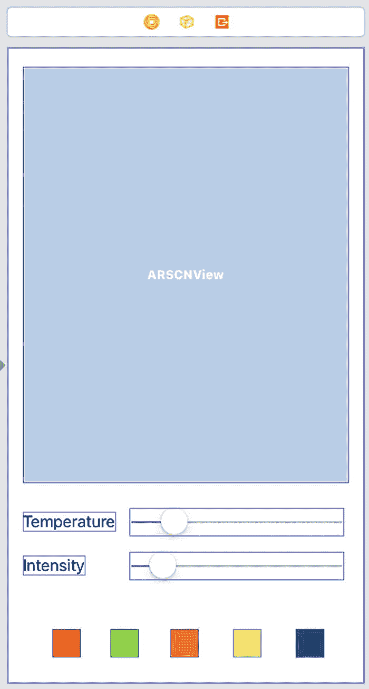

**图 5-2** 设计用户界面


## 添加约束和修改用户界面对象

设计好用户界面后，你需要为这些界面项目添加约束。要添加约束，请选择 **Editor** ➤ **Resolve Auto Layout Issues** ➤ **Reset to Suggested Constraints**（位于 **All Views in Container** 类别下的菜单下半部分）。

添加约束后，下一步是修改用户界面对象。双击两个 `UILabel` 并将它们的标题更改为 `Temperature` 和 `Intensity`。

现在按照以下步骤修改 `Temperature` 标签旁边的 `UISlider`：

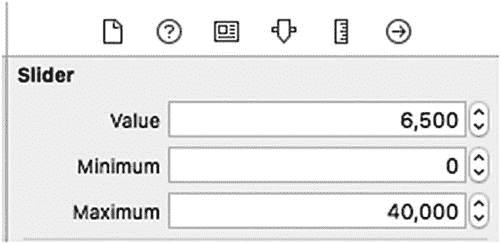

**图 5-3**：为温度滑块定义值

1.  点击 `Temperature` `UISlider`。
2.  点击 **Attributes Inspector** 图标或选择 **View** ➤ **Inspectors** ➤ **Show Attributes Inspector**。
3.  在 **Value** 文本框中输入数字 `6500`。
4.  在 **Minimum** 文本框中输入 `0`。
5.  在 **Maximum** 文本框中输入 `40000`。

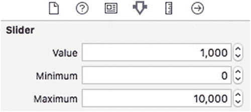

**图 5-4**：为强度滑块定义值

1.  点击 `Intensity` `UISlider`。
2.  在 **Value** 文本框中输入数字 `1000`。
3.  在 **Minimum** 文本框中输入 `0`。
4.  在 **Maximum** 文本框中输入 `10000`。

现在，需要通过调整每个按钮的大小、移除标题并设置背景颜色来修改屏幕底部的 `UIButtons`。为此，请按照以下步骤操作：

1.  点击 `UIButton`。
2.  点击 **Size Inspector** 图标或选择 **View** ➤ **Navigators** ➤ **Show Size Inspector`。
3.  在 **View** 类别的 **Width** 和 **Height** 文本框中输入 `30`。

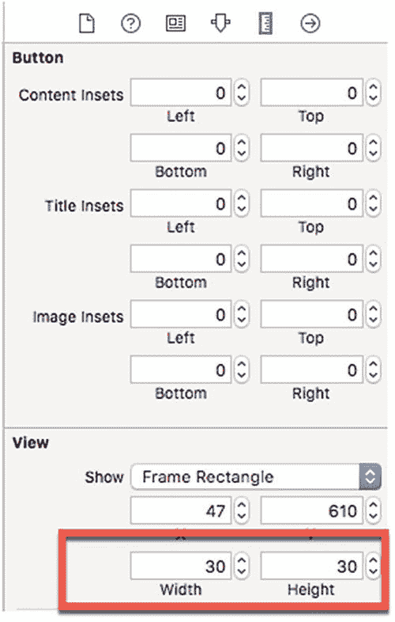

**图 5-5**：为 `UIButton` 定义宽度和高度

1.  点击 **Attributes Inspector** 图标或选择 **View** ➤ **Navigators** ➤ **Show Attributes Inspector`。
2.  从 `UIButton` 中删除标题。
3.  在 **View** 类别下点击 **Background** 弹出菜单并选择一种颜色。

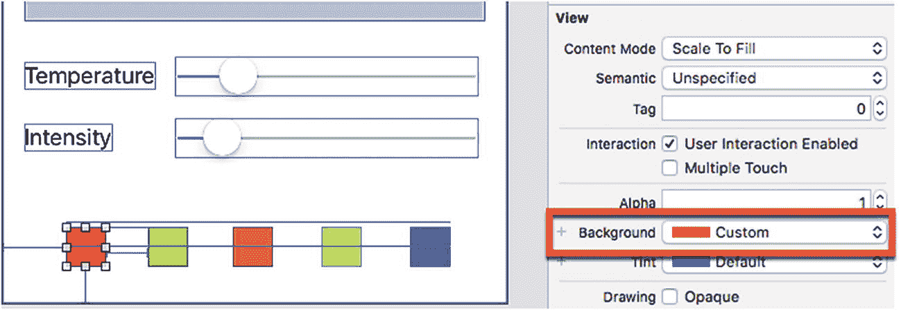

**图 5-6**：为 `UIButton` 定义背景颜色

1.  为每个 `UIButton` 重复步骤 2-6，但在步骤 5 中为每个 `UIButton` 选择不同的颜色。（选择的具体颜色不重要，但确保不要为两个或多个 `UIButton` 选择相同的颜色。）

## 将用户界面连接到 Swift 代码

设计好用户界面后，下一步是将用户界面项目连接到 `ViewController.swift` 文件中的 Swift 代码。为此，请按照以下步骤操作：

1.  在 **Navigator** 窗格中点击 `Main.storyboard` 文件。
2.  点击 **Assistant Editor** 图标或选择 **View** ➤ **Assistant Editor** ➤ **Show Assistant Editor** 以并排显示 `Main.storyboard` 和 `ViewController.swift` 文件。
3.  将鼠标指针移到 `ARSCNView` 上，按住 **Control** 键，并 Ctrl-拖动到 `class ViewController` 行下方。
4.  释放 **Control** 键和鼠标左键。会出现一个弹出菜单。
5.  点击 **Name** 文本字段并输入 `sceneView`，然后点击 **Connect** 按钮。Xcode 将创建一个 `IBOutlet`，如下所示：

```
@IBOutlet var sceneView: ARSCNView!
```

6.  在此 `IBOutlet` 下方，输入以下代码：

```
let showLight = SCNNode()
```

7.  编辑 `viewDidLoad` 函数，使其如下所示：

```
override func viewDidLoad() {
    super.viewDidLoad()
    // Do any additional setup after loading the view, typically from a nib.
    sceneView.delegate = self
    sceneView.showsStatistics = true
    sceneView.debugOptions = [ARSCNDebugOptions.showWorldOrigin, ARSCNDebugOptions.showFeaturePoints]
}
```

8.  编辑 `viewWillAppear` 函数，使其如下所示：

```
override func viewWillAppear(_ animated: Bool) {
    super.viewWillAppear(animated)
    showShape()
    lightOn()
    sceneView.session.run(configuration)
}
```

此 `viewWillAppear` 函数调用了 `showShape` 和 `lightOn` 函数。`showShape` 函数显示一个球体，而 `lightOn` 函数定义光源。

9.  在 `viewWillAppear` 函数下方输入以下代码：

```
func showShape() {
    let sphere = SCNSphere(radius: 0.03)
    sphere.firstMaterial?.diffuse.contents = UIColor.white
    let node = SCNNode()
    node.geometry = sphere
    node.position = SCNVector3(0.1, 0, 0)
    sceneView.scene.rootNode.addChildNode(node)
}
func lightOn() {
    showLight.light = SCNLight()
    showLight.light?.type = .omni
    showLight.light?.color = UIColor(white: 0.6, alpha: 1.0)
    showLight.position = SCNVector3(0,0,0)
    sceneView.scene.rootNode.addChildNode(showLight)
}
```

10. 将鼠标指针移到 `Temperature` `UISlider` 上，按住 **Control** 键，并 Ctrl-拖动到 `lightOn` 函数下方。
11. 释放 **Control** 键和鼠标左键。会出现一个弹出菜单。
12. 点击 **Connection** 弹出菜单并选择 **Action**。
13. 点击 **Name** 文本字段并输入 `temperatureChange`。
14. 点击 **Type** 弹出菜单并选择 `UISlider`，然后点击 **Connect** 按钮。这将创建一个 `IBAction` 方法。
15. 编辑此 `temperatureChange` `IBAction` 方法如下：

```
@IBAction func temperatureChange(_ sender: UISlider) {
    showLight.light?.temperature = CGFloat(sender.value)
}
```

16. 将鼠标指针移到 `Intensity` `UISlider` 上，按住 **Control** 键，并 Ctrl-拖动到 `lightOn` 函数下方。
17. 释放 **Control** 键和鼠标左键。会出现一个弹出菜单。
18. 点击 **Connection** 弹出菜单并选择 **Action**。
19. 点击 **Name** 文本字段并输入 `intensityChange`。
20. 点击 **Type** 弹出菜单并选择 `UISlider`，然后点击 **Connect** 按钮。这将创建一个 `IBAction` 方法。
21. 编辑此 `intensityChange` `IBAction` 方法如下：

```
@IBAction func intensityChange(_ sender: UISlider) {
    showLight.light?.intensity = CGFloat(sender.value)
}
```

22. 将鼠标指针移到任意一个 `UIButton` 上，按住 **Control** 键，并 Ctrl-拖动到 `ViewController.swift` 文件底部最后一个 `}` 括号上方。
23. 释放 **Control** 键和鼠标左键。会出现一个弹出菜单。
24. 点击 **Connection** 弹出菜单并选择 **Action**。
25. 点击 **Name** 文本字段并输入 `colorButton`。
26. 点击 **Type** 弹出菜单并选择 `UIButton`，然后点击 **Connect** 按钮。这将创建一个 `IBAction` 方法。
27. 编辑此 `colorButton` `IBAction` 方法如下：

```
@IBAction func colorButton(_ sender: UIButton) {
    //colorMe.backgroundColor = sender.backgroundColor
    showLight.light?.color = sender.backgroundColor!
}
```

28. 将鼠标指针移到另一个 `UIButton` 上（不要使用最初用来 Ctrl-拖动到 `ViewController.swift` 文件中创建 `colorButton` `IBAction` 方法的那个按钮），按住 **Control** 键，并 Ctrl-拖动鼠标到刚刚创建的 `colorButton` `IBAction` 方法上方，直到它被高亮显示，如图 5-7 所示。

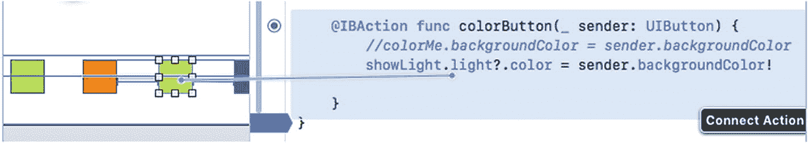

**图 5-7**：将其他 `UIButtons` 连接到现有的 `IBAction` 方法

29. 当整个 `colorButton` `IBAction` 方法高亮显示时，释放 **Control** 键和鼠标左键。
30. 为每个额外的 `UIButton` 重复步骤 28-29，直到所有 `UIButtons` 都连接到同一个 `colorButton` `IBAction` 方法。

整个 `ViewController.swift` 文件应如下所示：


```swift
import UIKit
import SceneKit
import ARKit

class ViewController: UIViewController, ARSCNViewDelegate {
    @IBOutlet var sceneView: ARSCNView!
    let configuration = ARWorldTrackingConfiguration()
    let showLight = SCNNode()

    override func viewDidLoad() {
        super.viewDidLoad()
        sceneView.delegate = self
        sceneView.showsStatistics = true
        sceneView.debugOptions = [ARSCNDebugOptions.showWorldOrigin, ARSCNDebugOptions.showFeaturePoints]
    }

    override func viewWillAppear(_ animated: Bool) {
        super.viewWillAppear(animated)
        showShape()
        lightOn()
        sceneView.session.run(configuration)
    }

    func showShape() {
        let sphere = SCNSphere(radius: 0.03)
        sphere.firstMaterial?.diffuse.contents = UIColor.white
        let node = SCNNode()
        node.geometry = sphere
        node.position = SCNVector3(0.1, 0, 0)
        sceneView.scene.rootNode.addChildNode(node)
    }

    func lightOn() {
        showLight.light = SCNLight()
        showLight.light?.type = .omni
        showLight.light?.color = UIColor(white: 0.6, alpha: 1.0)
        showLight.position = SCNVector3(0,0,0)
        sceneView.scene.rootNode.addChildNode(showLight)
    }

    @IBAction func temperatureChange(_ sender: UISlider) {
        showLight.light?.temperature = CGFloat(sender.value)
    }

    @IBAction func intensityChange(_ sender: UISlider) {
        showLight.light?.intensity = CGFloat(sender.value)
    }

    @IBAction func colorButton(_ sender: UIButton) {
        showLight.light?.color = sender.backgroundColor!
    }
}
```

此应用将一个光源放置在`(0, 0, 0)`世界原点，并将一个白色球体放置在`(0.1, 0, 0)`处，使其出现在 x 轴上。要运行此应用，请遵循以下步骤：

1.  点击停止按钮或选择 Product ➤ Stop。
2.  通过 USB 数据线将 iOS 设备连接到 Mac。
3.  点击运行按钮或选择 Product ➤ Run。
4.  应用运行时，x 轴上会出现一个球体。点击屏幕底部的任意颜色按钮可更改光源颜色。
5.  左右滑动**温度**和**强度**滑块，查看它们如何改变光源的外观，如图 5-8 所示。

尝试再次运行此应用，但在 `lightOn` 函数中将光源类型从 `.omni` 更改为 `.directional`，像这样：

```swift
showLight.light?.type = .directional
```

同时注释掉 `showLight.position` 命令，像这样：

```swift
//showLight.position = SCNVector3(0,0,0)
```

**定向光**从正 z 轴方向照射虚拟物体，因此无需为定向光定义位置。当使用定向光而非泛光灯运行应用时，你会注意到不同的照明效果，它只照亮球体在正 z 轴方向的一半，如图 5-9 所示。

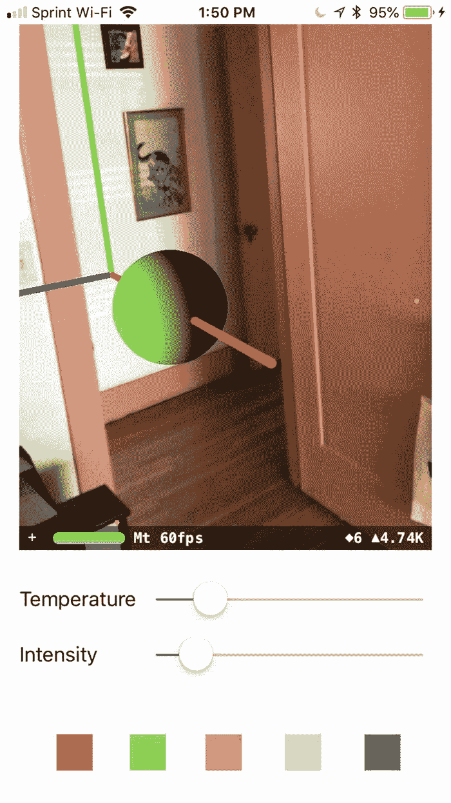

## 使用聚光灯

在剧院中，人们可以在不同位置放置一个或多个聚光灯，并调整其角度以创建有趣的视觉效果。创建聚光灯时，需要定义其**位置**和**角度**。

默认情况下，聚光灯指向**负 z 轴**方向。因此，如果你将聚光灯放在世界原点 `(0, 0, 0)`，聚光灯将沿着 z 轴远离用户照射。如果虚拟物体不在 z 轴上，聚光灯将完全无法照射到它。

为了验证这一点，请重写 `ViewController.swift` 文件中的 Swift 代码，并将聚光灯放置在世界原点 `(0, 0, 0)`，像这样：

```swift
showLight.position = SCNVector3(0,0,0)
showLight.light?.type = .spot
```

如果你运行此代码，聚光灯将出现在世界原点 `(0, 0, 0)` 并沿 z 轴照射，完全错过球体，使球体完全未被照亮。

要确保聚光灯照亮虚拟物体，你可以执行以下一项或多项操作：
*   改变聚光灯相对于你想照亮的任何虚拟物体的位置。
*   改变聚光灯指向的角度。

要改变聚光灯指向的角度，你需要定义聚光灯的 `eulerAngles` 属性，该属性定义以下旋转轴：
*   **俯仰角**（x 分量）是绕节点的 x 轴旋转。
*   **偏航角**（y 分量）是绕节点的 y 轴旋转。
*   **滚转角**（z 分量）是绕节点的 z 轴旋转。

要查看聚光灯的位置和角度如何改变它照射虚拟物体的方式，请遵循以下步骤：

1.  启动 Xcode。（确保你使用的是 Xcode 10 或更高版本。）
2.  选择 File ➤ New ➤ Project。Xcode 要求你选择一个模板。
3.  点击 iOS 类别。
4.  点击 Single View App 图标，然后点击 Next 按钮。Xcode 要求提供产品名称、组织名称、组织标识符和内容技术。
5.  点击 Product Name 文本框，为你的项目输入一个描述性名称，例如 `Spotlight`。（确切的名称不重要。）
6.  点击 Next 按钮。Xcode 询问你想将项目存储在何处。
7.  选择一个文件夹并点击 Create 按钮。Xcode 创建 iOS 项目。

现在按照以下步骤修改 `Info.plist` 文件以允许访问摄像头并使用 ARKit：

1.  在导航器窗格中点击 `Info.plist` 文件。Xcode 显示一个键、类型和值的列表。
2.  点击展开三角形以展开 Required device capabilities 类别，显示 Item 0。
3.  将鼠标指针移到 Item 0 上，显示一个加号（+）图标。
4.  点击这个加号（+）图标，显示一个空白的 Item 1。
5.  在 Item 1 行的 Value 类别下输入 `arkit`。
6.  将鼠标指针移到最后一行，显示一个加号（+）图标。
7.  点击加号（+）图标创建一个新行。出现一个弹出菜单。
8.  选择 Privacy – Camera Usage Description。
9.  在 Privacy – Camera Usage Description 行的 Value 类别下输入 `AR needs to use the camera`。

现在按照以下步骤修改 `ViewController.swift` 文件以使用 ARKit 和 SceneKit：

1.  在导航器窗格中点击 `ViewController.swift` 文件。
2.  编辑 `ViewController.swift` 文件，使其看起来像这样：

```swift
import UIKit
import SceneKit
import ARKit

class ViewController: UIViewController, ARSCNViewDelegate {
    let configuration = ARWorldTrackingConfiguration()
    override func viewDidLoad() {
        super.viewDidLoad()
        // Do any additional setup after loading the view, typically from a nib.
    }
}
```

要在我们的应用中查看增强现实中聚光灯的效果，我们需要向 `Main.storyboard` 用户界面添加以下对象：
*   一个 ARKit SceneKit View (`ARSCNView`)——用于显示带摄像头视图的增强现实。
*   三个 `UISlider`——用于控制聚光灯的俯仰、偏航和滚转。
*   三个 `UILabel`——用于标识俯仰、偏航和滚转滑块。


## 设计用户界面

要设计用户界面，请在导航器窗格中点击`Main.storyboard`文件，然后点击对象库按钮以打开对象库。接着，将不同的用户界面项拖放到用户界面上。最终，用户界面应与图 5-10 类似。

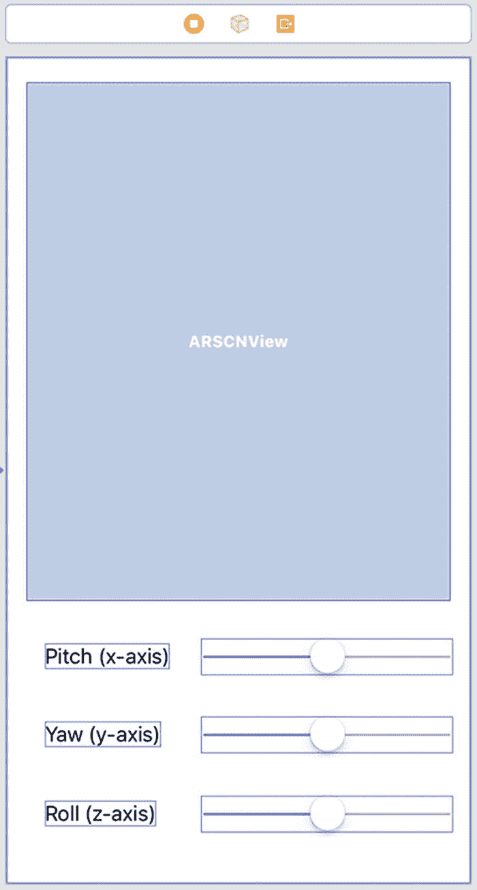

*图 5-10：设计用户界面*

设计好用户界面后，需要为这些用户界面项添加约束。要添加约束，请选择**编辑器 ➤ 解决自动布局问题 ➤ 重置为建议的约束**，该选项位于菜单下半部分的"容器中的所有视图"类别下。

添加约束后，下一步是修改用户界面对象。双击三个`UILabel`，将它们的标题更改为**俯仰 (x 轴)**、**偏航 (y 轴)**和**滚转 (z 轴)**（参见图 5-10）。

现在按照以下步骤修改**俯仰 (x 轴)**标签旁边的`UISlider`：

1.  点击**俯仰 (x 轴)** `UISlider`。
2.  点击属性检查器图标，或选择**视图 ➤ 检查器 ➤ 显示属性检查器**。
3.  在**数值**文本框中输入数字`0`。
4.  在**最小值**文本框中输入`-360`。
5.  在**最大值**文本框中输入`360`，如图 5-11 所示。

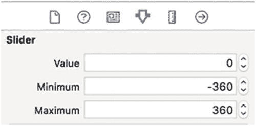

*图 5-11：自定义 UISlider*

6.  对**偏航 (y 轴)**和**滚转 (z 轴)** `UISlider`重复步骤 1-5。

## 连接用户界面与代码

设计好用户界面后，下一步是将用户界面项连接到`ViewController.swift`文件中的 Swift 代码。为此，请按照以下步骤操作：

1.  在导航器窗格中点击`Main.storyboard`文件。
2.  点击助手编辑器图标，或选择**视图 ➤ 助手编辑器 ➤ 显示助手编辑器**，以并排显示`Main.storyboard`和`ViewController.swift`文件。
3.  将鼠标指针移动到`ARSCNView`上，按住**Control**键，然后按住鼠标左键拖拽到`class ViewController`行下方。
4.  松开**Control**键和鼠标左键。会弹出一个菜单。
5.  在**名称**文本框中输入`sceneView`，然后点击**连接**按钮。Xcode 将创建一个 IBOutlet，如下所示：
    ```
    @IBOutlet var sceneView: ARSCNView!
    ```
6.  在此 IBOutlet 下方，输入以下代码：
    ```
    let configuration = ARWorldTrackingConfiguration()
    let showLight = SCNNode()
    var currentX : Float = 0
    var currentY : Float = 0
    var currentZ : Float = 0
    ```
7.  编辑`viewDidLoad`函数，使其如下所示：
    ```
    override func viewDidLoad() {
        super.viewDidLoad()
        // Do any additional setup after loading the view, typically from a nib.
        sceneView.delegate = self
        sceneView.showsStatistics = true
        sceneView.debugOptions = [ARSCNDebugOptions.showWorldOrigin, ARSCNDebugOptions.showFeaturePoints]
    }
    override func viewWillAppear(_ animated: Bool) {
        super.viewWillAppear(animated)
        showShape()
        lightOn()
        sceneView.session.run(configuration)
    }
    ```
    此`viewWillAppear`函数调用了`showShape`和`lightOn`函数。`showShape`函数显示一个球体，`lightOn`函数定义一个光源。
8.  在`viewWillAppear`函数下方输入以下代码：
    ```
    func showShape() {
        let plane = SCNPlane(width: 0.75, height: 0.75)
        plane.firstMaterial?.diffuse.contents = UIColor.yellow
        let node = SCNNode()
        node.geometry = plane
        node.position = SCNVector3(0, 0, -0.3)
        sceneView.scene.rootNode.addChildNode(node)
    }
    func lightOn() {
        showLight.light = SCNLight()
        showLight.light?.type = .spot
        showLight.light?.color = UIColor(white: 0.6, alpha: 1.0)
        showLight.position = SCNVector3(0, 0, 0)
        showLight.eulerAngles = SCNVector3(0, 0, 0)
        sceneView.scene.rootNode.addChildNode(showLight)
    }
    ```
    这段代码创建了一个黄色平面，出现在世界原点(0, 0, 0)后方-0.3 的位置。然后代码在世界原点创建一个聚光灯，对准平面。虽然聚光灯是白色的，但由于平面是黄色的，光线照射在平面上会显示出黄色。
9.  将鼠标指针移动到**俯仰 (x 轴)** `UISlider`上，按住**Control**键，然后按住鼠标左键拖拽到`lightOn`函数下方。
10. 松开**Control**键和鼠标左键。会弹出一个菜单。
11. 点击**连接**弹出菜单，选择**Action**。
12. 在**名称**文本框中输入`pitchChange`。
13. 在**类型**弹出菜单中选择**UISlider**，然后点击**连接**按钮。这将创建一个 IBAction 方法。
14. 按如下方式编辑此`pitchChange` IBAction 方法：
    ```
    @IBAction func pitchChanged(_ sender: UISlider) {
        currentX = GLKMathDegreesToRadians(sender.value)
        showLight.eulerAngles = SCNVector3(currentX, currentY, currentZ)
    }
    ```
15. 将鼠标指针移动到**偏航 (y 轴)** `UISlider`上，按住**Control**键，然后按住鼠标左键拖拽到`lightOn`函数下方。
16. 松开**Control**键和鼠标左键。会弹出一个菜单。
17. 点击**连接**弹出菜单，选择**Action**。
18. 在**名称**文本框中输入`yawChange`。
19. 在**类型**弹出菜单中选择**UISlider**，然后点击**连接**按钮。这将创建一个 IBAction 方法。
20. 按如下方式编辑此`yawChange` IBAction 方法：
    ```
    @IBAction func yawChanged(_ sender: UISlider) {
        currentY = GLKMathDegreesToRadians(sender.value)
        showLight.eulerAngles = SCNVector3(currentX, GLKMathDegreesToRadians(sender.value), currentZ)
    }
    ```
21. 将鼠标指针移动到**滚转 (z 轴)** `UISlider`上，按住**Control**键，然后按住鼠标左键拖拽到`lightOn`函数下方。
22. 松开**Control**键和鼠标左键。会弹出一个菜单。
23. 点击**连接**弹出菜单，选择**Action**。
24. 在**名称**文本框中输入`rollChange`。
25. 在**类型**弹出菜单中选择**UISlider**，然后点击**连接**按钮。这将创建一个 IBAction 方法。
26. 按如下方式编辑此`rollChange` IBAction 方法：
    ```
    @IBAction func rollChanged(_ sender: UISlider) {
        currentZ = GLKMathDegreesToRadians(sender.value)
        showLight.eulerAngles = SCNVector3(currentX, currentY, currentZ)
    }
    ```

整个`ViewController.swift`文件应如下所示：


```swift
import UIKit
import SceneKit
import ARKit
class ViewController: UIViewController, ARSCNViewDelegate {
@IBOutlet var sceneView: ARSCNView!
let configuration = ARWorldTrackingConfiguration()
let showLight = SCNNode()
var currentX : Float = 0
var currentY : Float = 0
var currentZ : Float = 0
override func viewDidLoad() {
super.viewDidLoad()
// Do any additional setup after loading the view, typically from a nib.
sceneView.delegate = self
sceneView.showsStatistics = true
sceneView.debugOptions = [ARSCNDebugOptions.showWorldOrigin, ARSCNDebugOptions.showFeaturePoints]
}
override func viewWillAppear(_ animated: Bool) {
super.viewWillAppear(animated)
showShape()
lightOn()
sceneView.session.run(configuration)
}
func showShape() {
let plane = SCNPlane(width: 0.75, height: 0.75)
plane.firstMaterial?.diffuse.contents = UIColor.yellow
let node = SCNNode()
node.geometry = plane
node.position = SCNVector3(0, 0, -0.3)
sceneView.scene.rootNode.addChildNode(node)
}
func lightOn() {
showLight.light = SCNLight()
showLight.light?.type = .spot
showLight.light?.color = UIColor(white: 0.6, alpha: 1.0)
showLight.position = SCNVector3(0, 0, 0)
showLight.eulerAngles = SCNVector3(0, 0, 0)
sceneView.scene.rootNode.addChildNode(showLight)
}
@IBAction func pitchChanged(_ sender: UISlider) {
currentX = GLKMathDegreesToRadians(sender.value)
showLight.eulerAngles = SCNVector3(currentX, currentY, currentZ)
}
@IBAction func yawChanged(_ sender: UISlider) {
currentY = GLKMathDegreesToRadians(sender.value)
showLight.eulerAngles = SCNVector3(currentX, GLKMathDegreesToRadians(sender.value), currentZ)
}
@IBAction func rollChanged(_ sender: UISlider) {
currentZ = GLKMathDegreesToRadians(sender.value)
showLight.eulerAngles = SCNVector3(currentX, currentY, currentZ)
}
}
```

要在 iOS 设备上测试此应用，请遵循以下步骤：

1.  点击 **Stop** 按钮或选择 **Product** ➤ **Stop**。

    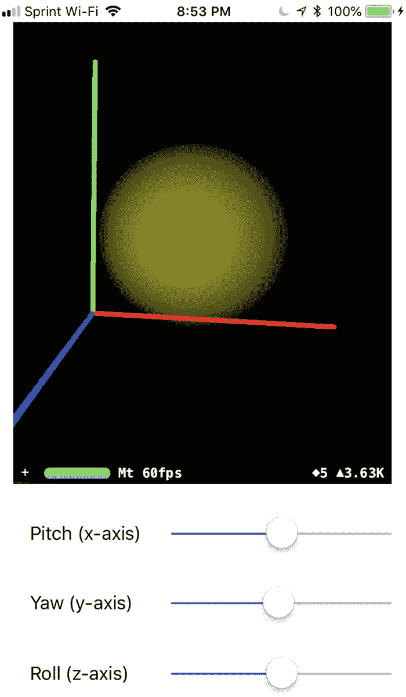

    图 5-12

    白色聚光灯照射在黄色平面上

2.  通过 USB 数据线将 iOS 设备连接到 Macintosh。
3.  点击 **Run** 按钮或选择 **Product** ➤ **Run**。
4.  左右滑动 **Pitch (x 轴)**, **Yaw (y 轴)**, 和 **Roll (z 轴)** 滑块，观察聚光灯如何照射在平面的不同区域。虽然聚光灯是白色的，但平面是黄色的，因此聚光灯看起来是黄色的光，如图 5-12 所示。

## 小结

在许多情况下，你可以通过增强现实视图简单地显示虚拟对象。但是，如果你想创建有趣的视觉效果，可以定义不同类型的光源。想象一下剧院，你可以在不同位置放置多个不同颜色的灯光来照射不同的物体。

通过改变颜色、强度和色温，你可以使灯光显得更亮或更暗。通过使用聚光灯，将灯光放置在增强现实视图中的任意位置后，你可以让它朝不同方向照射。

尝试灯光和虚拟物体的摆放。灯光可以为你提供多种方式来改变用户在你增强现实应用中看到的内容的外观。

